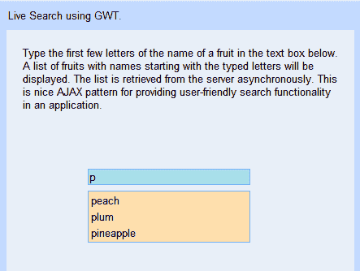
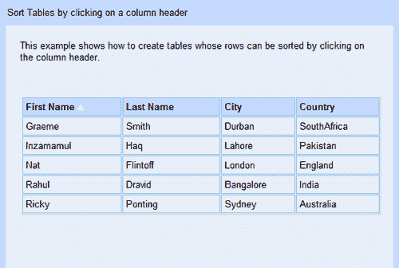
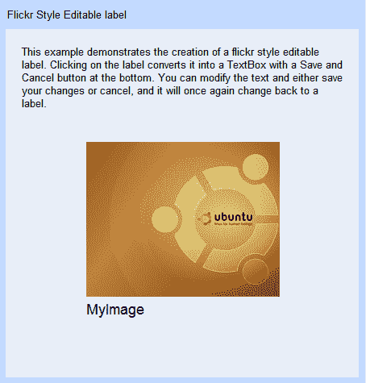
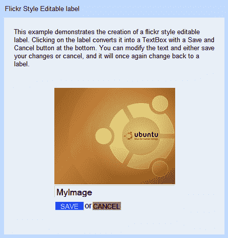

# 四、交互式表单

在本章中，我们将学习创建交互式表单的不同方法，这些方法利用 GWT 和 AJAX 在使用基于 web 的用户界面时提供更流畅的用户体验。这一章以及接下来的两章将为我们对 GWT 的探索提供基础。

我们将处理的任务是：

1.  实时搜索
2.  密码强度检查器
3.  自动填写表格
4.  可排序表
5.  动态列表
6.  Flickr 样式可编辑标签

# 样本申请

我们将把本书中创建的所有示例应用合并到上一章中创建的示例 GWT 应用中。我们将以类似于我们在[第 1 章](01.html "Chapter 1. Getting Started")中探讨的 `KitchenSink`应用的方式进行此操作。为此，我们将遵循以下步骤：

*   应用的用户界面将在扩展 `com.packtpub.gwtbook.samples.client`包中 `SamplePanel`类的类中创建。
*   然后，该类将被初始化并添加到 `com.packtpub.gwtbook.samples.client`包中 `Samples`类中的应用列表中。由于 `Samples`类被设置为入口点类，当 GWT 启动时，它将加载该类并显示所有示例应用，就像 `KitchenSink`一样。

所有示例的源代码都可以从本书的下载站点获得。有关下载和运行示例的说明，请参见附录。

# 现场搜索

`Live Search`是一个用户界面，主动向用户提供与用户键入的搜索条件相匹配的选择。这是一种非常流行的 AJAX 模式，用于在用户优化搜索查询时连续向用户显示所有有效结果。由于用户的查询不断与显示的结果同步，因此它为用户创造了非常流畅的搜索体验。它还使用户能够以高度交互的方式很快地轻松地试验不同的搜索查询。搜索结果从服务器异步检索，无需任何页面刷新或重新提交搜索条件。谷歌搜索页面（[http://google.com/](http://google.com/) 使用此功能效果显著。它甚至会在键入时告诉您匹配查询的搜索结果数！

也可以利用 `Live Search`AJAX 模式提供的即时反馈从服务器预取结果，并使用它们预测用户的操作。这种即时响应平滑了应用的用户体验，并显著提高了应用延迟。谷歌地图（[http://maps.google.com/](http://maps.google.com/) 是在地图导航时使用此模式预取地图数据的好例子。

## 是时候在您键入时进行行动搜索了！

在这个 `Live Search`示例中，我们将创建一个应用，用于检索以您在搜索文本中键入的字母开头的水果名称列表。您可以通过减少或增加键入的字母数来优化查询条件，用户界面将实时显示匹配的结果集。

1.  在 `com.packtpub.gwtbook.samples.client`包中创建一个名为 `LiveSearchService.java`的新 Java 文件。使用一个方法定义一个 `LiveSearchService`接口，以检索与作为方法参数提供的字符串匹配的搜索结果。

    ```java
    public interface LiveSearchService extends RemoteService
    {
    public List getCompletionItems(String itemToMatch);
    }

    ```

2.  在 `com.packtpub.gwtbook.samples.client`包

    ```java
    public interface LiveSearchServiceAsync
    {
    public void getCompletionItems
    (String itemToMatch, AsyncCallback callback);
    }

    ```

    中名为 `LiveSearchServiceAsync.java`的新 Java 文件中创建此服务定义接口的异步版本
3.  在 `com.packtpub.gwtbook.samples.server`包中名为 `LiveSearchServiceImpl.java`的新 Java 文件中创建我们的 live search 服务的实现。我们将创建一个包含水果列表的字符串数组，当调用服务方法时，我们将从该数组返回水果子列表，其名称以作为参数提供的字符串开头。

    ```java
    public class LiveSearchServiceImpl extends RemoteServiceServlet
    implements LiveSearchService
    {
    private String[] items = new String[]
    {"apple", "peach", "orange", "banana", "plum", "avocado",
    "strawberry", "pear", "watermelon", "pineapple", "grape",
    "blueberry", "cantaloupe"
    };
    public List getCompletionItems(String itemToMatch)
    {
    ArrayList completionList = new ArrayList();
    for (int i = 0; i < items.length; i++)
    {
    if (items[i].startsWith(itemToMatch.toLowerCase()))
    {
    completionList.add(items[i]);
    }
    }
    return completionList;
    }
    }

    ```

4.  我们的服务器端实现已经完成。现在，我们将创建与 live search 服务交互的用户界面。在扩展 `com.packtpub.gwtbook.samples.client.panels.SamplePanel`类的 `com.packtpub.gwtbook.samples.client.panels`包中创建一个名为 `LiveSearchPanel.java`的新 Java 文件。如本章开头所述，本书中创建的每个用户界面都将添加到一个示例应用中，该示例应用类似于 `KitchenSink`应用，可作为 GWT 下载的示例项目之一使用。这就是为什么我们要将每个用户界面创建为扩展 `SamplePanel`类的面板，并将创建的面板添加到示例应用中的示例面板列表中。添加用于键入搜索字符串的文本框，以及显示从服务检索到的匹配项的 `FlexTable`。最后，创建一个我们将要调用的 `LiveSearchService`实例。

    ```java
    public FlexTable liveResultsPanel = new FlexTable();
    public TextBox searchText = new TextBox();
    final LiveSearchServiceAsync
    liveSearchService=(LiveSearchServiceAsync)
    GWT.create(LiveSearchService.class);

    ```

5.  在 `LiveSearchPanel`的构造函数中，创建服务目标并设置其入口点。同时创建一个新的 `VerticalPanel`，我们将使用它作为我们添加到用户界面的小部件的容器。设置搜索文本框的 CSS 样式。此样式在 `Samples.css`文件中定义，是本书源代码分发包的一部分。有关如何下载源代码包的详细信息，请参见附录。

    ```java
    ServiceDefTarget endpoint=(ServiceDefTarget) liveSearchService;
    endpoint.setServiceEntryPoint("/Samples/livesearch");
    VerticalPanel workPanel = new VerticalPanel();
    searchText.setStyleName("liveSearch-TextBox");

    ```

6.  在同一个构造函数中，向文本框添加一个侦听器，当用户在文本框中键入时，该侦听器将异步调用 `LiveSearchService`，并使用与文本框中当前字符串匹配的最新结果不断更新弹出面板。这是一个方法，它通过调用服务来获取完成项列表，从而开始所有的魔术。

    ```java
    searchText.addKeyboardListener(new KeyboardListener()
    {
    public void onKeyPress
    (Widget sender, char keyCode, int modifiers)
    {
    // not implemented
    }
    public void onKeyDown
    (Widget sender, char keyCode, int modifiers)
    {
    for (int i = 0; i < liveResultsPanel.getRowCount(); i++)
    {
    liveResultsPanel.removeRow(i);
    }
    }
    public void onKeyUp
    (Widget sender, char keyCode, int modifiers)
    {
    for (int i = 0; i < liveResultsPanel.getRowCount(); i++)
    {
    liveResultsPanel.removeRow(i);
    }
    if (searchText.getText().length() > 0)
    {
    AsyncCallback callback = new AsyncCallback()
    {
    public void onSuccess(Object result)
    {
    ArrayList resultItems = (ArrayList) result;
    int row = 0;
    for(Iterator iter=resultItems.iterator();
    iter.hasNext();)
    {
    liveResultsPanel.setText
    (row++, 0, (String) iter.next());
    }
    }
    public void onFailure(Throwable caught)
    {
    Window.alert("Live search failed because "
    + caught.getMessage());
    }
    };
    liveSearchService.getCompletionItems
    (searchText.getText(),callback);
    }
    }
    });

    ```

7.  最后，在构造函数中，将搜索文本框和搜索结果面板添加到工作面板。创建一个小信息面板，显示有关此应用的描述性文本，以便在 `Samples`应用的可用样本列表中选择此样本时，我们可以显示此文本。将信息面板和工作面板添加到停靠面板，并初始化小部件。

    ```java
    liveResultsPanel.setStyleName("liveSearch-Results");
    HorizontalPanel infoPanel = new HorizontalPanel();
    infoPanel.add(new HTML
    ("<div class='infoProse'>Type the first few letters
    of the name of a fruit in the text box below. A
    list of fruits with names starting with the typed
    letters will be displayed. The list is retrieved
    from the server asynchronously. This is nice AJAX
    pattern for providing user-friendly search
    functionality in an application.</div>"));
    workPanel.add(searchText);
    workPanel.add(liveResultsPanel);
    DockPanel workPane = new DockPanel();
    workPane.add(infoPanel, DockPanel.NORTH);
    workPane.add(workPanel, DockPanel.CENTER);
    workPane.setCellHeight(workPanel, "100%");
    workPane.setCellWidth(workPanel, "100%");
    initWidget(workPane);

    ```

8.  将服务添加到 `com.packtpub.gwtbook.samples`包中 `Samples`应用的`Samples.gwt.xml`模块文件中。通过将此路径添加到模块文件，我们可以使用此路径创建和设置此服务的端点信息。

    ```java
    <servlet path="/livesearch" class=
    "com.packtpub.gwtbook.samples.server.LiveSearchServiceImpl"/>

    ```

以下是应用的用户界面：


一旦开始键入水果名称的前几个字母，将检索名称以键入的字符串开头的水果的所有名称，并将其显示在文本框下方的面板中。



### 刚才发生了什么事？

在浏览器中加载应用时，应用的用户界面将显示一个文本框。在框中键入字母时，文本框上会触发 `onKeyUp()`事件，在此事件处理程序中，我们使用文本框中当前的文本异步调用 `LiveSearchService`中的 `getCompletionItems()`。在我们的服务中实现此方法将返回一个包含所有匹配名称的列表。本例中的匹配名称是从服务本身包含的映射中检索的，但也可以很容易地从数据库、其他应用或 web 服务中检索，具体取决于您的应用需要。我们将列表中的项目添加到文本框正下方的 `FlexTable`小部件中。 `FlexTable`允许我们创建可以动态扩展的表。如果文本框为空，或者删除了框中的所有文本，则清除表中的列表。我们使用一个面板作为这个应用中所有小部件的容器。

面板是 GWT 框架中小部件的容器，用于布局它们。您可以向面板添加任何小部件甚至其他面板。这使我们能够通过将小部件添加到面板中，将它们组合在一起，从而构建复杂的用户界面。GWT 框架中常用的面板为：

*   **DockPanel:**一个面板，通过将子小部件停靠或定位在边缘来布局添加到其中的子小部件，并允许最后添加的小部件占用剩余空间。
*   **CellPanel:**在表格的单元格中布局其小部件的面板。
*   **TabPanel:**一个面板，在一组选项卡式页面中布局子小部件，每个页面都有一个小部件。
*   **HorizontalPanel:**在一个水平列中从左到右排列所有子部件的面板。
*   **VerticalPanel:**将所有子部件从上到下排列在一个垂直列中的面板。
*   **FlowPanel:**一个从左到右布局其小部件的面板，就像文本在一条线上流动一样。
*   **PopupPanel:**通过弹出或覆盖页面上的其他小部件来显示其子小部件的面板。
*   **StackPanel:**通过从上到下垂直堆叠来布局其子部件的面板。所使用的比喻与 Microsoft Outlook 的用户界面相同。

在本章和本书的其余部分中，我们将使用这些面板中的大多数来展示我们的用户界面。此任务中的概念可以扩展并应用于您希望在应用中向用户提供的几乎任何类型的搜索。您甚至可以增强和扩展此应用，以向用户提供更多信息，例如匹配结果的数量。GWT 提供的管道和工具使提供此功能变得非常容易。实时搜索 AJAX 模式及其使用的最好例子之一是 googlesuggest 服务。在文本字段中键入搜索查询字符串时，它会连续检索并显示匹配结果的列表。您可以在[处看到它的运行 http://www.google.com/webhp?complete=1 &hl=en](http://www.google.com/webhp?complete=1&hl=en)。

# 密码强度检查

视觉提示是通知用户应用中事物状态的好方法。消息框和警报经常用于此目的，但它们通常会激怒用户。通过微妙地向用户指示应用的使用状态，可以提供更加流畅和愉快的用户体验。在本节中，我们将创建一个应用，通过使用颜色和复选框向用户指示键入密码的强度。我们将使用与正常使用非常不同的复选框。这是一个以新的和不同的方式使用 GWT 小部件的示例，并混合和匹配它们以提供良好的用户体验。

## 创建检查器的操作时间

在当今时代，几乎所有事情都需要密码，选择安全的密码非常重要。有许多标准建议创建一个密码，以防止最常见的密码破解攻击。这些标准涵盖了从创建带有一定数量小写和数字的 15 个字母的密码到使用随机密码生成器创建密码的范围。在我们的示例应用中，我们将创建一个非常简单的密码强度检查器，它只检查密码中的字母数。包含少于五个字母的密码字符串将被视为弱密码，而包含五到七个字母的密码将被视为中等强度密码。任何包含超过七个字母的密码都将被视为强密码。这些标准刻意保持简单，这样我们就可以专注于创建应用，而不会陷入实际密码强度标准中。这将帮助我们理解这些概念，然后您可以将其扩展为使用您的应用所保证的任何密码强度标准。本例使用一个服务来获得密码强度，但也可以完全在客户机上完成，而无需使用服务器。

1.  在 `com.packtpub.gwtbook.samples.client`包中创建一个名为 `PasswordStrengthService.java`的新 Java 文件。定义一个带有一个方法的 `PasswordStrengthService`接口，用于检索作为该方法参数提供的密码字符串的强度：

    ```java
    public interface PasswordStrengthService extends RemoteService
    {
    public int checkStrength(String password);
    }

    ```

2.  在 `com.packtpub.gwtbook.samples.client`包

    ```java
    public interface PasswordStrengthServiceAsync
    {
    public void checkStrength
    (String password, AsyncCallback callback);
    }

    ```

    中名为 `PasswordStrengthServiceAsync.java`的新 Java 文件中创建此服务定义接口的异步版本
3.  在 `com.packtpub.gwtbook.samples.server`包中名为 `PasswordStrengthServiceImpl.java`的新 Java 文件中创建密码强度服务的实现。

    ```java
    public class PasswordStrengthServiceImpl extends
    RemoteServiceServlet implements PasswordStrengthService
    {
    private int STRONG = 9;
    private int MEDIUM = 6;
    private int WEAK = 3;
    public int checkStrength(String password)
    {
    if (password.length() <= 4)
    {
    return WEAK;
    }
    else if (password.length() < 8)
    {
    return MEDIUM;
    }else
    {
    return STRONG;
    }
    }
    }

    ```

4.  现在，让我们为这个应用创建用户界面。在扩展 `com.packtpub.gwtbook.samples.client.panels.SamplePanel`类的 `com.packtpub.gwtbook.samples.client.panels`包中创建一个名为 `PasswordStrengthPanel.java`的新 Java 文件。创建一个用于输入密码字符串的文本框，一个名为 `strengthPanel`的 `ArrayList`，用于保存我们将用于显示密码强度的复选框。同时创建 `PasswordStrengthService`对象。

    ```java
    public TextBox passwordText = new TextBox();
    final PasswordStrengthServiceAsync pwStrengthService =
    (PasswordStrengthServiceAsync) GWT.create(PasswordStrengthService.class);
    public ArrayList strength = new ArrayList();

    ```

5.  通过将所有复选框的样式设置为默认样式，添加用于清除所有复选框的专用方法。

    ```java
    private void clearStrengthPanel()
    {
    for (Iterator iter = strength.iterator(); iter.hasNext();)
    {
    ((CheckBox) iter.next()).
    setStyleName(getPasswordStrengthStyle(0));
    }
    }

    ```

6.  添加一个私有方法，该方法将根据密码强度返回 CSS 名称。这是一种基于强度动态设置复选框样式的好方法。

    ```java
    private String getPasswordStrengthStyle(int passwordStrength)
    {
    if (passwordStrength == 3)
    {
    return "pwStrength-Weak";
    }
    else if (passwordStrength == 6)
    {
    return "pwStrength-Medium";
    }
    else if (passwordStrength == 9)
    {
    return "pwStrength-Strong";
    }
    else
    {
    return "";
    }
    }

    ```

7.  在 `PasswordStrengthPanel`类的构造函数中，创建一个名为 `strengthPanel`的 `HorizontalPanel`，添加九个复选框，并设置其样式。如前所述，我们在本书示例应用中使用的样式可在文件 `Samples.css`中找到，该文件是本书源代码分发的一部分。我们还将这些相同的复选框添加到 `strength`对象中，以便稍后检索它们以设置其状态。这些复选框将用于直观显示密码强度。创建一个新的 `VerticalPanel`，我们将使用它作为要添加到用户界面的小部件的容器。最后，创建服务目标并设置其入口点。

    ```java
    HorizontalPanel strengthPanel = new HorizontalPanel();
    strengthPanel.setStyleName("pwStrength-Panel");
    for (int i = 0; i < 9; i++)
    {
    CheckBox singleBox = new CheckBox();
    strengthPanel.add(singleBox);
    strength.add(singleBox);
    }
    VerticalPanel workPanel = new VerticalPanel();
    ServiceDefTarget endpoint=(ServiceDefTarget) pwStrengthService;
    endpoint.setServiceEntryPoint(GWT.getModuleBaseURL() +
    "pwstrength");

    ```

8.  在同一构造函数中，设置密码文本框的样式，并添加事件处理程序以侦听密码框的更改。

    ```java
    passwordText.setStyleName("pwStrength-Textbox");
    passwordText.addKeyboardListener(new KeyboardListener()
    {
    public void onKeyDown
    (Widget sender, char keyCode, int modifiers)
    {
    }
    public void onKeyPress
    (Widget sender, char keyCode, int modifiers)
    {
    }
    public void onKeyUp(Widget sender, char keyCode, int modifiers)
    {
    if (passwordText.getText().length() > 0)
    {
    AsyncCallback callback = new AsyncCallback()
    {
    public void onSuccess(Object result)
    {
    clearStrengthPanel();
    int checkedStrength = ((Integer) result).intValue();
    for (int i = 0; i < checkedStrength; i++)
    {
    ((CheckBox) strength.get(i)).setStyleName
    (getPasswordStrengthStyle(checkedStrength));
    }
    }
    public void onFailure(Throwable caught)
    {
    Window.alert("Error calling the password strength service." + caught.getMessage());
    }
    };
    pwStrengthService.checkStrength
    (passwordText.getText(), callback);
    }
    else
    {
    clearStrengthPanel();
    }
    }
    });

    ```

9.  最后，在构造函数中，将密码文本框和强度面板添加到工作面板中。创建一个小信息面板，显示有关此应用的描述性文本，以便在 `Samples`应用的可用样本列表中选择此样本时，我们可以显示此文本。将信息面板和工作面板添加到停靠面板，并初始化小部件。

    ```java
    HorizontalPanel infoPanel = new HorizontalPanel();
    infoPanel.add(new HTML(
    "<div class='infoProse'>Start typing a password
    string. The strength of the password will be
    checked and displayed below. Red indicates that the
    password is Weak, Orange indicates a Medium
    strength password and Green indicates a Strong
    password. The algorithm for checking the strength
    is very basic and checks the length of the password
    string.</div>"));
    workPanel.add(passwordText);
    workPanel.add(infoPanel);
    workPanel.add(strengthPanel);
    DockPanel workPane = new DockPanel();
    workPane.add(infoPanel, DockPanel.NORTH);
    workPane.add(workPanel, DockPanel.CENTER);
    workPane.setCellHeight(workPanel, "100%");
    workPane.setCellWidth(workPanel, "100%");
    initWidget(workPane);

    ```

10.  将服务添加到 `com.packtpub.gwtbook.samples`包中 `Samples`应用的`Samples.gwt.xml`模块文件中。

    ```java
    <servlet path="/pwstrength" class=
    "com.packtpub.gwtbook.samples.server.
    PasswordStrengthServiceImpl"/>

    ```

以下是密码强度检查应用的用户界面：


现在开始键入密码字符串以检查其强度。以下是键入少于五个字符的密码字符串时的密码强度：


### 刚才发生了什么事？

密码强度服务检查所提供字符串的大小，并根据其是弱、中等还是强返回 3、6 或 9 的整数值。通过使用以下标准进行判断：如果密码字符串长度小于 5 个字符，则为弱密码；如果密码字符串长度大于 5 个字符，但不大于 7 个字符，则视为中等强度密码。任何超过七个字符的密码都被视为强密码。

用户界面由一个用于输入密码字符串的文本框和一个包含九个复选框的面板组成，这些复选框直观地显示键入的字符串作为密码的强度。注册事件处理程序以侦听密码文本框生成的键盘事件。每当密码文本发生更改时（当我们在字段中键入或更改字段中的字符时），我们都会与密码强度服务异步通信，并将给定字符串的强度作为密码检索。通过使用颜色来象征三种不同的密码强度，以视觉方式向用户显示返回的强度。

密码强度显示在一个复合小部件中，该小部件通过向 `HorizontalPanel`添加九个复选框创建。根据密码字符串的强度，使用 CSS 更改复选框的颜色。将 GWT 提供的基本小部件组合成更复杂的小部件以构建用户界面的过程是构建 GWT 应用的常见模式。通过利用 GWT 框架的强大功能，可以以这种方式构建相当复杂的用户界面。在本章后面以及本书中，我们将继续探索各种 GWT 应用，我们将看到更多这样的示例。

# 自动填表

表单在 Web 上无处不在，广泛用于从显示客户资料到在线填写应用的各种信息。我们不喜欢每次都浏览所有这些字段并键入信息，特别是如果我们以前在该站点上已经这样做过一次的话。加快速度的一个很好的方法是，在填写键表单字段时，使用先前收集的信息预先填充字段。这不仅为客户节省了一些打字时间，而且是一个极大的可用性增强，改善了整个客户体验。在本节中，我们将构建一个表单，当我们在 Customer ID 字段中键入可识别的值时，该表单将自动填写各个字段。

## 创建动态表单的行动时间

我们将创建一个应用，当其中一个字段中提供了某个值时，可以轻松地填写表单的各个字段。这在大多数基于 web 的业务应用中非常常见，例如，需要提供用户信息才能注册服务。对于新用户，此信息需要由用户填写，但是对于系统的前一个用户，此信息已经可用，并且当用户键入标识其身份的唯一标识符（某种 ID）时，可以访问并用于填写所有字段。在这个应用中，当用户输入我们已知的 `CustomerID`时，我们将自动填写表单的各个字段。

1.  在 `com.packtpub.gwtbook.samples.client`包中创建一个名为 `AutoFormFillService.java`的新 Java 文件。定义一个 `AutoFormFillService`接口，当提供键

    ```java
    public interface AutoFormFillService extends RemoteService
    {
    public HashMap getFormInfo(String formKey);
    }

    ```

    时，使用一种方法检索表单信息
2.  在 `com.packtpub.gwtbook.samples.client`包中创建一个名为 `AutoFormFillServiceAsync.java`的新 Java 文件。定义一个 `AutoFormFillAsync`接口：

    ```java
    public interface AutoFormFillServiceAsync
    {
    public void getFormInfo
    (String formKey, AsyncCallback callback);
    }

    ```

3.  在 `com.packtpub.gwtbook.samples.server`包中创建一个名为 `AutoFormFillServiceImpl.java`的新 Java 文件。定义一个扩展 `RemoteServiceServlet`并实现先前创建的 `AutoFormFillService`接口的 `AutoFormFillServiceImpl`类。首先，我们将使用一个简单的 `HashMap`来存储客户信息，并添加一个方法来填充地图。在应用中，您可以从任何外部数据源（如数据库）检索此客户信息。

    ```java
    private HashMap formInfo = new HashMap();
    private void loadCustomerData()
    {
    HashMap customer1 = new HashMap();
    customer1.put("first name", "Joe");
    customer1.put("last name", "Customer");
    customer1.put("address", "123 peachtree street");
    customer1.put("city", "Atlanta");
    customer1.put("state", "GA");
    customer1.put("zip", "30339");
    customer1.put("phone", "770-123-4567");
    formInfo.put("1111", customer1);
    HashMap customer2 = new HashMap();
    customer2.put("first name", "Jane");
    customer2.put("last name", "Customer");
    customer2.put("address", "456 elm street");
    customer2.put("city", "Miami");
    customer2.put("state", "FL");
    customer2.put("zip", "24156");
    customer2.put("phone", "817-123-4567");
    formInfo.put("2222", customer2);
    HashMap customer3 = new HashMap();
    customer3.put("first name", "Jeff");
    customer3.put("last name", "Customer");
    customer3.put("address", "789 sunset blvd");
    customer3.put("city", "Los Angeles");
    customer3.put("state", "CA");
    customer3.put("zip", "90211");
    customer3.put("phone", "714-478-9802");
    formInfo.put("3333", customer3);
    }

    ```

4.  向 `getFormInfo()`添加逻辑，以返回所提供表单键的表单信息。我们获取用户在表单中输入的提供的密钥，并使用该密钥查找用户信息，并将其异步返回给客户机应用。

    ```java
    public HashMap getFormInfo(String formKey)
    {
    if (formInfo.containsKey(formKey))
    {
    return (HashMap) formInfo.get(formKey);
    }
    else
    {
    return new HashMap();
    }
    }

    ```

5.  在 `com.packtpub.gwtbook.samples.client.panels`包中名为 `AutoFormFillPanel.java`的新 Java 文件中创建此应用的用户界面。为每个信息字段创建文本框和标签。

    ```java
    private TextBox custID = new TextBox();
    private TextBox firstName = new TextBox();
    private TextBox lastName = new TextBox();
    private TextBox address = new TextBox();
    private TextBox zip = new TextBox();
    private TextBox phone = new TextBox();
    private TextBox city = new TextBox();
    private TextBox state = new TextBox();
    private Label custIDLbl = new Label("Customer ID : ");
    private Label firstNameLbl = new Label("First Name : ");
    private Label lastNameLbl = new Label("Last Name : ");
    private Label addressLbl = new Label("Address : ");
    private Label zipLbl = new Label("Zip Code : ");
    private Label phoneLbl = new Label("Phone Number : ");
    private Label cityLbl = new Label("City : ");
    private Label stateLbl = new Label("State : ");
    HorizontalPanel itemPanel = new HorizontalPanel();

    ```

6.  创建我们要调用的服务类。

    ```java
    final AutoFormFillServiceAsync autoFormFillService =
    (AutoFormFillServiceAsync) GWT.create (AutoFormFillService.class);

    ```

7.  创建用于设置和清除表单字段值的私有方法。我们将使用将在构造函数中设置的事件处理程序中的这些方法。

    ```java
    private void setValues(HashMap values)
    {
    if (values.size() > 0)
    {
    firstName.setText((String) values.get("first name"));
    lastName.setText((String) values.get("last name"));
    address.setText((String) values.get("address"));
    city.setText((String) values.get("city"));
    state.setText((String) values.get("state"));
    zip.setText((String) values.get("zip"));
    phone.setText((String) values.get("phone"));
    }
    else
    {
    clearValues();
    }
    }
    private void clearValues()
    {
    firstName.setText(" ");
    lastName.setText(" ");
    address.setText(" ");
    city.setText(" ");
    state.setText(" ");
    zip.setText(" ");
    phone.setText(" ");
    }

    ```

8.  创建用于检索不同标签的访问器方法。当我们从服务中检索信息时，我们将使用这些来获取标签并设置其值。

    ```java
    public Label getAddressLbl()
    {
    return addressLbl;
    }
    public Label getCityLbl()
    {
    return cityLbl;
    }
    public Label getCustIDLbl()
    {
    return custIDLbl;
    }
    public Label getFirstNameLbl()
    {
    return firstNameLbl;
    }
    public Label getLastNameLbl()
    {
    return lastNameLbl;
    }
    public Label getPhoneLbl()
    {
    return phoneLbl;
    }
    public Label getStateLbl()
    {
    return stateLbl;
    }
    public Label getZipLbl()
    {
    return zipLbl;
    }

    ```

9.  创建用于检索不同文本框的访问器方法。我们将使用这些来获取文本框，并在从服务检索信息时设置其值。

    ```java
    public TextBox getAddress()
    {
    return address;
    }
    public TextBox getCity()
    {
    return city;
    }
    public TextBox getCustID()
    {
    return custID;
    }
    public TextBox getFirstName()
    {
    return firstName;
    }
    public TextBox getLastName()
    {
    return lastName;
    }
    public TextBox getPhone()
    {
    return phone;
    }
    public TextBox getState()
    {
    return state;
    }
    public TextBox getZip()
    {
    return zip;
    }

    ```

10.  在 `AutoFormFillPanel`的构造函数中，创建一个新的 `VerticalPanel`，我们将使用它作为要添加到用户界面的小部件的容器。另外，创建服务目标并设置其入口点。

    ```java
    ServiceDefTarget endpoint = (ServiceDefTarget)
    autoFormFillService;
    endpoint.setServiceEntryPoint("/Samples/autoformfill");

    ```

11.  同样在构造函数中，创建一个名为 `itemPanel`的 `HorizontalPanel`，并为每个表单字段添加小部件。例如，我们将 `customerID`字段添加到 `itemPanel`，设置其样式，并将 `itemPanel`添加到 `workPanel`，这是我们之前创建的用于保存用户界面小部件的主容器。您将为每个表单字段创建一个新的 `HorizontalPanelfor`，并将其添加到 `workPanel`中。对每个表单字段重复上述步骤。

    ```java
    HorizontalPanel itemPanel = new HorizontalPanel();
    itemPanel.setStyleName("autoFormItem-Panel");
    custIDLbl.setStyleName("autoFormItem-Label");
    itemPanel.add(custIDLbl);
    custID.setStyleName("autoFormItem-Textbox");
    itemPanel.add(custID);
    workPanel.add(itemPanel);

    ```

12.  在同一个构造函数中，将键盘侦听器添加到 `custID`文本框中，并在事件处理程序中调用服务以检索客户 ID 中键入的值的客户信息。根据服务调用的返回值设置表单字段的值。

    ```java
    custID.addKeyboardListener(new KeyboardListener()
    {
    public void onKeyDown(Widget sender,
    char keyCode, int modifiers)
    {
    }
    public void onKeyPress(Widget sender,
    char keyCode, int modifiers)
    {
    }
    public void onKeyUp(Widget sender, char
    keyCode, int modifiers)
    {
    if (custID.getText().length() > 0)
    {
    AsyncCallback callback = new
    AsyncCallback()
    {
    public void onSuccess
    (Object result)
    {
    setValues((HashMap) result);
    }
    };
    autoFormFillService.getFormInfo
    (custID.getText(), callback);
    }
    else
    {
    clearValues();
    }
    }
    public void onFailure(Throwable caught)
    {
    Window.alert("Error while calling the
    Auto Form Fill service."
    + caught.getMessage());
    }
    });

    ```

13.  最后，在构造器中，创建一个小信息面板，显示有关此应用的描述性文本，以便我们在 `Samples`应用的可用样本列表中选择此样本时可以显示此文本。将信息面板和工作面板添加到停靠面板，并初始化小部件。

    ```java
    HorizontalPanel infoPanel = new HorizontalPanel();
    infoPanel.add(new HTML(
    "<div class='infoProse'>This example
    demonstrates how to automatically fill a
    form by retrieving the data from the server
    asynchronously. Start typing a customer ID
    in the provided field, and corresponding
    values for that customer are retrieved
    asynchronously from the server and the form
    filled for you.</div>"));
    DockPanel workPane = new DockPanel();
    workPane.add(infoPanel, DockPanel.NORTH);
    workPane.add(workPanel, DockPanel.CENTER);
    workPane.setCellHeight(workPanel, "100%");
    workPane.setCellWidth(workPanel, "100%");
    initWidget(workPane);

    ```

14.  将服务添加到 `com.packtpub.gwtbook.samples`包中 `Samples`应用的`Samples.gwt.xml`模块文件中。

    ```java
    <servlet path="/autoformfill" class=
    "com.packtpub.gwtbook.samples.server. AutoFormFillServiceImpl"/>

    ```

以下是当用户输入 `CustomerID`时应用的样子，在本例中为 1111，这是我们的应用已知的：


### 刚才发生了什么事？

我们创建了一个服务，其中包含存储在 `HashMap`数据结构中的客户数据。在实际应用中，这些数据通常来自外部数据源，如数据库。对于每个客户，我们创建一个映射，其中包含存储为键值对的客户信息字段。然后使用 `customerID`键将此客户地图添加到主 `HashMap`中。这使得我们在获得密钥时更容易检索到正确的客户信息，在本例中为 `customerID`。

```java
HashMap customer2 = new HashMap();
customer2.put("first name", "Jane");
customer2.put("last name", "Customer");
customer2.put("address", "456 elm street");
customer2.put("city", "Miami");
customer2.put("state", "FL");
customer2.put("zip", "24156");
customer2.put("phone", "817-123-4567");
formInfo.put("2222", customer2);

```

在浏览器中加载用户界面时，将向用户显示一个页面，其中包含与客户相关的字段。用户需要在提供的文本框中键入唯一的客户 ID。在这个示例应用中只有三个已知的客户 ID-1111、2222 和 3333。我们在这里使用客户 ID 作为客户信息的密钥，但您也可以根据应用的要求使用社会保险号码或任何其他唯一 ID。当然，在实际应用中，用户需要输入密码和 ID 号，以避免未经授权向任何输入有效 ID 的人显示机密详细信息。当用户在文本框中键入客户 ID 时，例如 1111，会触发事件处理程序 `onKeyUp()`。在事件处理程序中，我们调用 `AutoFormFillService`中的 `getFormInfo()`方法，并将键入的文本作为参数传入。 `getFormInfo()`方法搜索给定客户 ID 的客户信息，并将该信息作为 `HashMap`返回。如果由于未知 ID 而找不到任何信息，我们将返回一个空映射。通过调用 `setValues()`，检索此映射中的值并填写相应字段。

```java
firstName.setText((String) values.get("first name"));
lastName.setText((String) values.get("last name"));
address.setText((String) values.get("address"));
city.setText((String) values.get("city"));
state.setText((String) values.get("state"));
zip.setText((String) values.get("zip"));
phone.setText((String) values.get("phone"));

```

这是一种简单但非常强大且有效的方式，可以为用户提供与我们的系统交互的良好体验。

# 可排序表

表可能是应用中显示业务数据的最常用方式。它们为所有用户所熟知，并提供了查看数据的通用方法。这在传统上很难在网页上显示。GWT 使我们能够在应用中轻松快速地提供此功能。我们将创建一个应用，其中包含一个表，通过单击列标题，表中的行可以按升序或降序排序。这提供了更好的用户体验，因为用户可以修改显示数据的顺序以满足其需求。GWT 提供的表小部件没有提供此功能的内置方式，但 GWT 为我们提供了足够的工具，可以轻松地将此支持添加到表中。请记住，这只是创建可以使用 GWT 排序的表的一种方法。

## 操作排序表行的时间

我们不需要为此应用创建服务，因为数据排序是在客户机上进行的。我们将为表创建一个包含一些种子数据的应用，然后通过单击列标题来添加对该数据排序的支持。

1.  在 `com.packtpub.gwtbook.samples.client.panels`包中创建一个名为 `SortableTablesPanel.java`的新 Java 文件。我们将添加对此类的支持，通过单击列标题使包含的表可排序。首先创建一个表示表中一行的 `CustomerData`类，并为每个字段创建访问器。

    ```java
    private class CustomerData
    {
    private String firstName;
    private String lastName;
    private String country;
    private String city;
    public CustomerData(String firstName, String lastName,
    String city, String country)
    {
    this.firstName = firstName;
    this.lastName = lastName;
    this.country = country;
    this.city = city;
    }
    public String getCountry()
    {
    return country;
    }
    public String getCity()
    {
    return city;
    }
    public String getFirstName()
    {
    return firstName;
    }
    public String getLastName()
    {
    return lastName;
    }
    }

    ```

2.  创建一个名为 `customerData`的 `ArrayList`用于存储客户数据。创建用于存储排序方向的变量、表中列的标题、用于排序的临时数据结构以及用于显示客户数据的 `FlexTable`。

    ```java
    private int sortDirection = 0;
    private FlexTable sortableTable = new FlexTable();
    private String[] columnHeaders = new String[]
    { "First Name", "Last Name", "City", "Country" };
    private ArrayList customerData = new ArrayList();
    private HashMap dataBucket = new HashMap();
    private ArrayList sortColumnValues = new ArrayList();

    ```

3.  在 `SortableTablesPanel`的构造函数中，创建一个新的 `VerticalPanel`，我们将使用它作为要添加到用户界面的小部件的容器。设置表格的样式并设置表格的列标题。

    ```java
    VerticalPanel workPanel = new VerticalPanel();
    sortableTable.setWidth(500 + "px");
    sortableTable.setStyleName("sortableTable");
    sortableTable.setBorderWidth(1);
    sortableTable.setCellPadding(4);
    sortableTable.setCellSpacing(1);
    sortableTable.setHTML(0, 0, columnHeaders[0]
    + "&nbsp;");
    sortableTable.setHTML(0, 1, columnHeaders[1]
    + "&nbsp;");
    sortableTable.setHTML(0, 2, columnHeaders[2]
    + "&nbsp;");
    sortableTable.setHTML(0, 3, columnHeaders[3]
    + "&nbsp;");

    ```

4.  同样在构造器中，将五个客户添加到 `customerData`列表中。将此列表中的数据添加到表中，并在表上设置一个侦听器，该侦听器将在单击第一列时对行进行排序。我们将在表中显示此客户列表，然后在单击列标题时对表进行排序。

    ```java
    customerData.add(new CustomerData("Rahul","Dravid","Bangalore",
    "India"));
    customerData.add(new CustomerData("Nat", "Flintoff", "London",
    "England"));
    customerData.add(new CustomerData("Inzamamul", "Haq", "Lahore",
    "Pakistan"));
    customerData.add(new CustomerData("Graeme", "Smith", "Durban",
    "SouthAfrica"));
    customerData.add(new CustomerData("Ricky", "Ponting", "Sydney",
    "Australia"));
    int row = 1;
    for (Iterator iter = customerData.iterator(); iter.hasNext();)
    {
    CustomerData element = (CustomerData) iter.next();
    sortableTable.setText(row, 0, element.getFirstName());
    sortableTable.setText(row, 1, element.getLastName());
    sortableTable.setText(row, 2, element.getCity());
    sortableTable.setText(row, 3, element.getCountry());
    row++;
    }
    RowFormatter rowFormatter = sortableTable.getRowFormatter();
    rowFormatter.setStyleName(0, "tableHeader");
    sortableTable.addTableListener(new TableListener()
    {
    public void onCellClicked(SourcesTableEvents sender, int row,
    int cell)
    {
    if (row == 0)
    {
    sortTable(row, cell);
    }
    }
    });

    ```

5.  最后，在构造函数中，将表添加到工作面板。创建一个小信息面板，显示有关此应用的描述性文本，以便在 `Samples`应用的可用样本列表中选择此样本时，我们可以显示此文本。将信息面板和工作面板添加到停靠面板，并初始化小部件。

    ```java
    HorizontalPanel infoPanel = new HorizontalPanel();
    infoPanel.add(new HTML(
    "<div class='infoProse'>This example shows
    how to create tables whose rows can be
    sorted by clicking on the column
    header.</div>"));
    workPanel.setStyleName("sortableTables-Panel");
    workPanel.add(sortableTable);
    DockPanel workPane = new DockPanel();
    workPane.add(infoPanel, DockPanel.NORTH);
    workPane.add(workPanel, DockPanel.CENTER);
    workPane.setCellHeight(workPanel, "100%");
    workPane.setCellWidth(workPanel, "100%");
    sortTable(0, 0);
    initWidget(workPane);

    ```

6.  添加用于重绘表头的私有方法。这是一种重新绘制表列标题的好方法，这样我们可以更改标题中显示的图像以匹配当前排序方向。

    ```java
    private void redrawColumnHeaders(int column)
    {
    if (sortDirection == 0)
    {
    sortableTable.setHTML(0, column, columnHeaders[column]
    + "&nbsp;");
    }
    else if (sortDirection == 1)
    {
    sortableTable.setHTML(0, column, columnHeaders[column]
    + "&nbsp;");
    }
    else
    {
    sortableTable.setHTML(0, column, columnHeaders[column]
    + "&nbsp;");
    }
    for (int i = 0; i < 4; i++)
    {
    if (i != column)
    {
    sortableTable.setHTML(0, i, columnHeaders[i]
    + "&nbsp;");
    }
    }
    }

    ```

7.  添加一个私有方法，以便在更改排序顺序时重新绘制整个表。

    ```java
    private void redrawTable()
    {
    int row = 1;
    for (Iterator iter = sortColumnValues.iterator();
    iter.hasNext();)
    {
    String key = (String) iter.next();
    CustomerData custData = (CustomerData) dataBucket.get(key);
    sortableTable.setText(row, 0, custData.getFirstName());
    sortableTable.setText(row, 1, custData.getLastName());
    sortableTable.setText(row, 2, custData.getCity());
    sortableTable.setText(row, 3, custData.getCountry());
    row++;
    }
    }

    ```

8.  添加一个私有方法，该方法可以按升序或降序方式对数据进行排序，并使用已排序的行重新绘制表。我们使用 `Collections`类提供的排序方法对数据进行排序，但也可以修改为使用 `Comparator`类比较两个数据，然后使用该方法进行排序。

    ```java
    public void sortTable(int row, int cell)
    {
    dataBucket.clear();
    sortColumnValues.clear();
    for (int i = 1; i < customerData.size() + 1; i++)
    {
    dataBucket.put(sortableTable.getText(i, cell), new
    CustomerData(
    sortableTable.getText(i, 0), sortableTable.getText(i, 1),
    sortableTable.getText(i, 2), sortableTable.getText
    (i, 3)));
    sortColumnValues.add(sortableTable.getText(i, cell));
    }
    if (sortDirection == 0)
    {
    sortDirection = 1;
    Collections.sort(sortColumnValues);
    }
    else
    {
    sortDirection = 0;
    Collections.reverse(sortColumnValues);
    }
    redrawColumnHeader(cell);
    resetColumnHeaders(cell);
    redrawTable();
    }

    ```

下面是应用的屏幕截图。您可以单击任何列标题对数据进行排序。



### 刚才发生了什么事？

我们创建一个 `CustomerData`类来表示 `FlexTable`中的每一行。然后，我们创建一些客户数据并将其存储在 `ArrayList`中。

```java
customerData.add(new CustomerData("Rahul", "Dravid", "Bangalore",
"India"));

```

此列表中的数据将添加到表中。为了向表中添加元素，我们需要指定行号和列号。

```java
CustomerData element = (CustomerData) iter.next();
sortableTable.setText(row, 0, element.getFirstName());
sortableTable.setText(row, 1, element.getLastName());
sortableTable.setText(row, 2, element.getCity());
sortableTable.setText(row, 3, element.getCountry());

```

列标题包含在第 0 行中，表数据从第 1 行开始。我们通过如下设置特定单元格的 HTML 来添加列标题：

```java
sortableTable.setHTML(0, 0, columnHeaders[0] + "&nbsp; ");

```

这使我们能够向单元格中添加一段 HTML，而不是只设置纯文本。我们为列标题添加文本以及带有空白图像文件的 `img`标记。文本旁边没有图像的列标题直观地向用户指示没有为该特定列指定排序顺序。单击列标题时，我们将修改此图像以使用升序或降序图标。注册事件处理程序以侦听表上的单击。GWT 不包含在有人单击特定单元格时注册处理程序的机制，因此我们使用常规表 click listener 并检查单击是否在第 0 行（即包含列标题的行）上。如果用户确实单击了列标题，我们将继续对表进行排序。

真正的魔法发生在 `sortTable()`方法中。创建一个名为 `dataBucket`的临时 `HashMap`来存储表中的行，每一行由单击标题的列中的值键入，以及一个名为 `sortColumnValues`的临时 `ArrayList`来存储单击标题的列中的列值。这意味着 `sortColumnValues`列表包含 `dataBucket`映射中的键值。

```java
for (int i = 1; i < customerData.size() + 1; i++)
{
dataBucket.put(sortableTable.getText(i, cell), new CustomerData(
sortableTable.getText(i, 0), sortableTable.getText(i, 1),
sortableTable.getText(i, 2), sortableTable.getText(i, 3)));
sortColumnValues.add(sortableTable.getText(i, cell));
}

```

我们检查 `sortDirection`变量的值，并根据该值对 `sortColumnValues`列表进行升序或降序排序，以正确的顺序包含列值。使用 `Collections`类的内置 `sort()`和 `reverseSort()`方法提供分拣机制。

```java
if (sortDirection == 0)
{
sortDirection = 1;
Collections.sort(sortColumnValues);
}
else
{
sortDirection = 0;
Collections.reverse(sortColumnValues);
}

```

然后重新绘制表列标题，以便单击的列具有排序顺序的右图标，而所有其他列标题仅具有纯文本和空白图像。最后，我们通过迭代 `sortColumnValues`列表并从 `dataBucket`中检索相关的 `CustomerData`对象并将其添加为表中的一行来重新绘制该表。

此应用演示了 GWT 框架提供的巨大功能，它使您能够操作表以扩展其功能。GWT 为构建用户界面提供了不同类型的表：

*   **FlexTable:**根据需要创建单元格的表格。甚至可以有包含不同数量单元格的行。向该表添加行和列时，该表会根据需要展开。
*   **网格：**可以包含文本、HTML 或子窗口小部件的表。但是，必须使用所需的行数和列数显式创建它。

我们将在本章和本书其余部分构建的应用中广泛使用这两个表小部件。

# 动态列表

我们将创建一个应用，它使用动态列表为用户提供一种过滤搜索条件的方法。在本节中，我们将创建动态表，这将使我们能够在选择主表中的项时填充子表。我们将通过使用 GWT 的 AJAX 支持来实现这一点，并且只显示子表中与主表中的选择相关的项目。此应用将使导航和筛选搜索条件变得容易。在这个示例应用中，我们将使用户能够选择一个汽车制造商，该制造商将自动在第二个列表中填写该制造商生产的所有汽车品牌。当客户进一步选择此品牌列表中的项目时，第三个列表将自动填充所选品牌的车型。通过这种方式，用户可以以用户友好和直观的方式交互式地选择和浏览搜索条件，而无需提交数据和刷新页面以显示某些信息。

## 动作过滤搜索条件的时间

作为此应用的一部分，我们还将创建一个服务，该服务将提供有关制造商、品牌和型号的信息，并创建一个用户界面，该用户界面将从服务异步检索此信息，以将其显示给用户。

1.  在 `com.packtpub.gwtbook.samples.client`包中创建一个名为 `DynamicListsService.java`的新 Java 文件。定义一个带有检索制造商、品牌和型号信息方法的 `DynamicListsService`接口：

    ```java
    public interface DynamicListsService extends RemoteService
    {
    public List getManufacturers();
    public List getBrands(String manufacturer);
    public List getModels(String manufacturer, String brand);
    }

    ```

2.  在 `com.packtpub.gwtbook.samples.client`包中创建一个名为 `DynamicListsServiceAsync.java`的新 Java 文件。定义一个 `DynamicListsServiceAsync`接口：

    ```java
    public interface DynamicListsServiceAsync
    {
    public void getManufacturers(AsyncCallback callback);
    public void getBrands(String manufacturer,
    AsyncCallback callback);
    public void getModels(String manufacturer, String brand,
    AsyncCallback callback);
    }

    ```

3.  在 `com.packtpub.gwtbook.samples.server`包中创建一个名为 `DynamicListsServiceImpl.java`的新 Java 文件。定义一个扩展 `RemoteServiceServlet`并实现先前创建的 `DynamicListsService`接口的 `DynamicListsServiceImpl`类。此类将返回有关制造商、品牌和型号的信息。创建一个名为 `Manufacturer`的类来封装每个制造商的信息，包括他们提供的汽车品牌和型号。

    ```java
    private class Manufacturer
    {
    private HashMap brands = new HashMap();
    public Manufacturer(HashMap brands)
    {
    this.brands = brands;
    }
    public HashMap getBrands()
    {
    return brands;
    }
    }

    ```

4.  创建私有方法将制造商信息加载到 `HashMap`中。有关制造商的数据将在稍后加载到第一个表中。当用户界面启动时，制造商表是唯一包含数据的表，并提供了使用应用的起点。

    ```java
    private void loadData()
    {
    ArrayList brandModels = new ArrayList();
    brandModels.add("EX");
    brandModels.add("DX Hatchback");
    brandModels.add("DX 4-Door");
    HashMap manufacturerBrands = new HashMap();
    manufacturerBrands.put("Civic", brandModels);
    brandModels = new ArrayList();
    brandModels.add("SX");
    brandModels.add("Sedan");
    manufacturerBrands.put("Accord", brandModels);
    brandModels = new ArrayList();
    brandModels.add("LX");
    brandModels.add("Deluxe");
    manufacturerBrands.put("Odyssey", brandModels);
    Manufacturer manufacturer = new
    Manufacturer(manufacturerBrands);
    data.put("Honda", manufacturer);
    brandModels = new ArrayList();
    brandModels.add("LXE");
    brandModels.add("LX");
    manufacturerBrands = new HashMap();
    manufacturerBrands.put("Altima", brandModels);
    brandModels = new ArrayList();
    brandModels.add("NX");
    brandModels.add("EXE");
    manufacturerBrands.put("Sentra", brandModels);
    manufacturer = new Manufacturer(manufacturerBrands);
    data.put("Nissan", manufacturer);
    brandModels = new ArrayList();
    brandModels.add("E300");
    brandModels.add("E500");
    manufacturerBrands = new HashMap();
    manufacturerBrands.put("E-Class", brandModels);
    brandModels = new ArrayList();
    brandModels.add("C250");
    brandModels.add("C300");
    manufacturerBrands.put("C-Class", brandModels);
    manufacturer = new Manufacturer(manufacturerBrands);
    data.put("Mercedes", manufacturer);
    }

    ```

5.  实现用于检索制造商列表的服务方法。

    ```java
    public ArrayList getManufacturers()
    {
    ArrayList manufacturersList = new ArrayList();
    for (Iterator iter=data.keySet().iterator(); iter.hasNext();)
    {
    manufacturersList.add((String) iter.next());
    }
    return manufacturersList;
    }

    ```

6.  实现检索制造商提供的品牌列表的服务方法。

    ```java
    public ArrayList getBrands(String manufacturer)
    {
    ArrayList brandsList = new ArrayList();
    for (Iterator iter = ((Manufacturer)data.get(manufacturer))
    .getBrands().keySet().iterator(); iter.hasNext();)
    {
    brandsList.add((String) iter.next());
    }
    return brandsList;
    }

    ```

7.  实现检索制造商为特定品牌提供的模型的服务方法。

    ```java
    public ArrayList getModels(String manufacturer, String brand)
    {
    ArrayList modelsList = new ArrayList();
    Manufacturer mfr = (Manufacturer) data.get(manufacturer);
    HashMap mfrBrands = (HashMap) mfr.getBrands();
    for (Iterator iter = ((ArrayList)
    mfrBrands.get(brand)).iterator(); iter.hasNext();)
    {
    modelsList.add((String) iter.next());
    }
    return modelsList;
    }

    ```

8.  在 `com.packtpub.gwtbook.samples.client.panels`包中名为 `DynamicListsPanel.java`的新 Java 文件中创建此应用的用户界面。创建三个网格小部件来保存制造商、品牌和型号信息，并将它们添加到主面板中。创建我们要调用的服务类。

    ```java
    Grid manufacturers = new Grid(5, 1);
    Grid brands = new Grid(5, 1);
    Grid models = new Grid(5, 1);
    final DynamicListsServiceAsync dynamicListsService =
    (DynamicListsServiceAsync) GWT.create (DynamicListsService.class);

    ```

9.  添加用于清除面板的专用方法。

    ```java
    public void clearSelections(Grid grid, boolean clearData)
    {
    for (int i = 0; i < grid.getRowCount(); i++)
    {
    if (clearData)
    {
    grid.setText(i, 0, " ");
    }
    }
    }

    ```

10.  在 `DynamicListsPanel`的构造函数中，创建一个新的 `HorizontalPanel`，我们将使用它作为要添加到用户界面的小部件的容器。另外，创建服务目标并设置其入口点。

    ```java
    HorizontalPanel workPanel = new HorizontalPanel();
    ServiceDefTarget endpoint = (ServiceDefTarget)
    dynamicListsService;
    endpoint.setServiceEntryPoint("/Samples/dynamiclists");

    ```

11.  在同一个构造函数中，添加一个事件处理程序来侦听 Select Manufacturer 表上的单击。

    ```java
    manufacturers.addTableListener(new TableListener()
    {
    public void onCellClicked
    (SourcesTableEvents sender,
    int row, int cell)
    {
    clearSelections(manufacturers,
    false);
    clearSelections(brands, true);
    clearSelections(models, true);
    selectedManufacturer = row;
    AsyncCallback callback = new
    AsyncCallback()
    {
    public void onSuccess(Object
    result)
    {
    brands.clear();
    int row = 0;
    for (Iterator iter =
    ((ArrayList) result).
    iterator();
    iter.hasNext();)
    {
    brands.setText(row++, 0,
    (String) iter.next());
    }
    }
    public void onFailure(Throwable
    caught)
    {
    Window.alert("Error calling
    the Dynamic Lists service to
    get the brands." +
    caught.getMessage());
    }
    };
    dynamicListsService.getBrands
    (manufacturers.getText(row,
    cell),callback);
    }
    });

    ```

12.  在同一个构造函数中，添加一个事件处理程序来侦听 selectbrand 表上的单击。

    ```java
    brands.addTableListener
    (new TableListener()
    {
    public void onCellClicked
    (SourcesTableEvents sender, int row, int cell)
    {
    clearSelections(brands, false);
    clearSelections(models, true);
    AsyncCallback callback = new
    AsyncCallback()
    {
    public void onSuccess(Object result)
    {
    models.clear();
    int row = 0;
    for (Iterator iter = ((ArrayList)
    result).iterator(); iter.hasNext();)
    {
    models.setText(row++, 0, (String)
    iter.next());
    }
    }
    public void onFailure(Throwable caught)
    {
    Window.alert("Error calling the Dynamic
    Lists service to get the models." +
    caught.getMessage());
    }
    };
    dynamicListsService.getModels
    (manufacturers.getText
    (selectedManufacturer, cell),
    brands.getText(row, cell), callback);
    }
    });

    ```

13.  此外，在构造函数中，将侦听器添加到“选择模型”表中，以便在选择模型时清除选择。应用启动时，用数据加载 Select Manufacturer 表。

    ```java
    models.addTableListener(new TableListener()
    {
    public void onCellClicked
    (SourcesTableEvents sender, int row,
    int cell)
    {
    clearSelections(models, false);
    models.getCellFormatter()
    .setStyleName(row, cell,
    "dynamicLists-Selected");
    }
    });
    AsyncCallback callback = new AsyncCallback()
    {
    public void onSuccess(Object result)
    {
    int row = 0;
    for (Iterator iter = ((ArrayList) result).iterator(); iter.hasNext();)
    {
    manufacturers.setText(row++, 0, (String) iter.next());
    }
    }
    public void onFailure(Throwable caught)
    {
    Window.alert("Error calling the Dynamic Lists service to
    get the manufacturers." + caught.getMessage());
    }
    };
    dynamicListsService.getManufacturers(callback);

    ```

14.  在构造函数中，创建一个名为 `itemPanel`的 `VerticalPanel`，并将每个表及其相关标签添加到其中。为三个表中的每一个创建一个 `itemPanel`，设置样式，并将它们添加到 `workPanel`中。

    ```java
    VerticalPanel itemPanel = new VerticalPanel();
    Label itemLabel = new Label("Select Manufacturer");
    itemLabel.setStyleName("dynamicLists-Label");
    itemPanel.add(itemLabel);
    itemPanel.add(manufacturers);
    workPanel.add(itemPanel);
    itemPanel = new VerticalPanel();
    itemLabel = new Label("Select Brand");
    itemLabel.setStyleName("dynamicLists-Label");
    itemPanel.add(itemLabel);
    itemPanel.add(brands);
    workPanel.add(itemPanel);
    itemPanel = new VerticalPanel();
    itemLabel = new Label("Models");
    itemLabel.setStyleName("dynamicLists-Label");
    itemPanel.add(itemLabel);
    itemPanel.add(models);
    workPanel.add(itemPanel);
    manufacturers.setStyleName("dynamicLists-List");
    brands.setStyleName("dynamicLists-List");
    models.setStyleName("dynamicLists-List");
    workPanel.setStyleName("dynamicLists-Panel");

    ```

15.  最后，在构造器中，创建一个小信息面板，显示有关此应用的描述性文本，以便我们在 `Samples`应用的可用样本列表中选择此样本时可以显示此文本。将信息面板和工作面板添加到停靠面板，并设置小部件。

    ```java
    HorizontalPanel infoPanel = new HorizontalPanel();
    infoPanel.add(new HTML(
    "<div class='infoProse'>This example
    demonstrates the creation of dynamic
    lists. You select an item from the first
    list and corresponding items are retrieved
    asynchronously from the server to display
    in the second list. You can then select an
    item in the second list to get another
    selection of items. In this particular
    example, we retrieve car brand by
    manufacturer, and then get and display the
    specific models for the selected
    brand.</div>"));
    DockPanel workPane = new DockPanel();
    workPane.add(infoPanel, DockPanel.NORTH);
    workPane.add(workPanel, DockPanel.CENTER);
    workPane.setCellHeight(workPanel, "100%");
    workPane.setCellWidth(workPanel, "100%");
    initWidget(workPane);

    ```

16.  将服务添加到 `com.packtpub.gwtbook.samples`包中 `Samples`应用的`Samples.gwt.xml`模块文件中。

    ```java
    <servlet path="/dynamiclists" class=
    "com.packtpub.gwtbook.samples.server.DynamicListsServiceImpl"/>

    ```

下面是我们选择梅赛德斯的一家制造商及其品牌之一——E-class:时的应用截图


### 刚才发生了什么事？

我们创建一个制造商对象列表，每个制造商一个。每个制造商对象都包含一个 `HashMap`命名品牌，其中包含该特定品牌的 `ArrayList`型号。我们刚刚创建的这个数据结构包含了我们需要的关于制造商提供的品牌和型号的所有信息。在实际应用中，这些数据通常从企业数据源中检索。例如，以下是我们如何为制造商梅赛德斯建立数据：

```java
brandModels = new ArrayList();
brandModels.add("E300");
brandModels.add("E500");
manufacturerBrands = new HashMap();
manufacturerBrands.put("E-Class", brandModels);
brandModels = new ArrayList();
brandModels.add("C250");
brandModels.add("C300");
manufacturerBrands.put("C-Class", brandModels);
manufacturer = new Manufacturer(manufacturerBrands);
data.put("Mercedes", manufacturer);

```

然后，我们从接口实现三种服务方法，以返回制造商列表、给定制造商的品牌列表，最后是给定制造商和品牌的模型列表。这些方法中的每一个都会导航制造商对象，检索并返回包含必要信息的列表。当我们请求给定品牌和制造商的型号列表时，服务方法实现通过如下方式导航制造商列表来返回该列表：

```java
Manufacturer mfr = (Manufacturer) data.get(manufacturer);
HashMap mfrBrands = (HashMap) mfr.getBrands();
for (Iterator iter = ((ArrayList) mfrBrands.get(brand)).iterator();
iter.hasNext();)
{
modelsList.add((String) iter.next());
}
return modelsList;

```

用户界面由三个网格小部件组成。网格是另一种表格小部件，可以在其单元格中包含文本、HTML 或子小部件。当应用初始化时，首先从 `DynamicListsService`中检索制造商列表，并用数据填充制造商网格。注册事件处理程序以侦听网格中的单击。单击制造商网格中的某个项目时，我们首先清除品牌网格，然后调用服务上的 `getBrands()`方法，并将检索到的信息加载到品牌网格中。当用户通过单击从品牌网格中选择一个项目时，我们首先清除模型网格，然后调用服务上的 `getModels()`方法，并用检索到的信息加载模型网格。每次我们在任何网格中进行选择时，我们都能够使用 GWT 检索所有这些信息，而无需任何页面刷新或页面提交！

# Flickr 样式可编辑标签

Flickr（[http://flickr.com/](http://flickr.com/) 是互联网上最具创新性的 Web2.0 网站之一。它对 AJAX 的使用使这个网站使用起来很愉快。这方面的一个主要示例是标签小部件，它显示在您添加到 flickr 帐户的任何图像下方。它看起来像一个简单的标签，但当您将光标悬停在它上面时，它会改变颜色，表明它不仅仅是一个标签。当您单击它时，它将转换为一个文本框，您可以在其中编辑标签中的文本！您甚至可以使用按钮使更改保持不变，或使用“取消”放弃更改。保存或取消后，它将再次转换回标签。试试看。它真的很整洁！这是一种将多个 HTML 控件（标签、文本框和按钮）组合到一个复合控件中的好方法，可以节省网页上宝贵的空间，同时以非常用户友好的方式提供必要的功能。在本节中，我们将使用 GWT 中提供的小部件重新创建 flickr 样式标签。

## 行动时间-自定义可编辑标签

我们将创建一个标签，当您单击它时，该标签将动态转换为可编辑文本框。它还将为您提供保存更改或放弃更改的功能。如果修改文本并保存更改，标签文本将更改，否则原始文本将保留，文本框将转换回标签。这是一个非常创新的用户界面，你真的需要使用它来欣赏它！

1.  在 `com.packtpub.gwtbook.samples.client.panels`包中创建一个名为 `FlickrEditableLabelPanel.java`的新 Java 文件。为用户界面创建图像、标签、文本框和两个按钮。

    ```java
    private Label originalName;
    private String originalText;
    private Button saveButton;
    private Button cancelButton;
    private Image image = new Image("img/sample.jpg");
    private Label orLabel = new Label("or");

    ```

2.  创建一个私有方法，用于在隐藏标签时显示文本框和按钮。这就是将标签转换为带有按钮的文本框的本质！

    ```java
    private void ShowText()
    {
    originalText = originalName.getText();
    originalName.setVisible(false);
    saveButton.setVisible(true);
    orLabel.setVisible(true);
    cancelButton.setVisible(true);
    newName.setText(originalText);
    newName.setVisible(true);
    newName.setFocus(true);
    newName.setStyleName("flickrPanel-textBox-edit");
    }

    ```

3.  在 `FlickrEditableLabelPanel`的构造函数中，创建一个侦听标签点击的事件处理程序，并调用上述方法。

    ```java
    originalName.addClickListener(new ClickListener()
    {
    public void onClick(Widget sender)
    {
    ShowText();
    }
    });

    ```

4.  此外，在构造函数中，创建一个事件处理程序，用于侦听鼠标悬停并修改标签样式，以向用户提供单击标签的视觉提示。

    ```java
    originalName.addMouseListener(new MouseListener()
    {
    public void onMouseDown
    (Widget sender, int x, int y)
    {
    }
    public void onMouseEnter
    (Widget sender)
    {
    originalName.setStyleName
    "flickrPanel-label-hover");
    }
    public void onMouseLeave
    (Widget sender)
    {
    originalName.setStyleName
    ("flickrPanel-label");
    }
    public void onMouseMove
    (Widget sender, int x, int y)
    {
    }
    public void onMouseUp
    (Widget sender, int x, int y)
    {
    }
    });

    ```

5.  创建一个文本框，用于在构造函数中键入新名称，并创建一个事件处理程序，该事件处理程序在焦点位于文本框中时侦听返回键和转义键，并保存更改或取消。

    ```java
    newName.addKeyboardListener(new KeyboardListenerAdapter()
    {
    public void onKeyPress(Widget sender, char keyCode, int
    modifiers)
    {
    switch (keyCode)
    {
    case KeyboardListenerAdapter. KEY_ENTER:saveChange();
    break;
    case KeyboardListenerAdapter. KEY_ESCAPE:cancelChange();
    break;
    }
    }
    });

    ```

6.  在构造函数中创建一个事件处理程序，以侦听是否单击保存按钮并保存更改。

    ```java
    saveButton.addClickListener(new ClickListener()
    {
    public void onClick(Widget sender)
    {
    saveChange();
    }
    });

    ```

7.  在构造函数中创建一个事件处理程序，以侦听是否单击“取消”按钮并放弃所做的任何更改。

    ```java
    cancelButton.addClickListener(new ClickListener()
    {
    public void onClick(Widget sender)
    {
    cancelChange();
    }
    });

    ```

8.  在构造函数中，设置应用首次加载时小部件的可见性。当第一次显示用户界面时，我们希望显示标签，并隐藏所有其他内容。

    ```java
    originalName.setVisible(true);
    newName.setVisible(false);
    saveButton.setVisible(false);
    orLabel.setVisible(false);
    cancelButton.setVisible(false);

    ```

9.  最后，在构造函数中，创建一个名为 `buttonPanel`的 `HorizontalPanel`，并将我们创建的小部件添加到其中。创建一个名为 `workPanel`的 `VerticalPanel`并将 `buttonPanel`添加到其中。创建一个小信息面板，显示有关此应用的描述性文本，以便在 `Samples`应用的可用样本列表中选择此样本时，我们可以显示此文本。将信息面板和工作面板添加到停靠面板，并初始化小部件。

    ```java
    HorizontalPanel buttonPanel = new HorizontalPanel();
    buttonPanel.setStyleName("flickrPanel-buttonPanel");
    buttonPanel.add(saveButton);
    buttonPanel.add(orLabel);
    buttonPanel.add(cancelButton);
    DockPanel workPane = new DockPanel();
    workPane.add(infoPanel, DockPanel.NORTH);
    VerticalPanel workPanel = new VerticalPanel();
    workPanel.setStyleName("flickrPanel");
    workPanel.add(image);
    workPanel.add(originalName);
    workPanel.add(newName);
    workPanel.add(buttonPanel);
    workPane.add(workPanel, DockPanel.CENTER);
    workPane.setCellHeight(workPanel, "100%");
    workPane.setCellWidth(workPanel, "100%");
    initWidget(workPane);

    ```

10.  创建用于显示标签和隐藏文本的专用方法。现在，我们隐藏了标签，并显示了漂亮的文本编辑界面，其中包含文本框和用于保存或放弃所做更改的按钮。

    ```java
    private void showLabel()
    {
    originalName.setVisible(true);
    saveButton.setVisible(false);
    orLabel.setVisible(false);
    cancelButton.setVisible(false);
    newName.setVisible(false);
    }

    ```

11.  创建用于保存更改的私有方法。

    ```java
    private void saveChange()
    {
    originalName.setText(newName.getText());
    showLabel();
    // This is where you can call an RPC service to update
    // a db or call some other service to propagate
    // the change. In this example we just change the
    // text of the label.
    }

    ```

12.  创建放弃更改的方法。

    ```java
    public void cancelChange()
    {
    originalName.setText(originalText);
    showLabel();
    }

    ```

这是您访问页面时应用的外观：



如果单击图像下的标签，它将转换为带有保存和取消按钮的文本框。您可以修改文本并保存更改，或单击“取消”将更改回标签。



### 刚才发生了什么事？

我们创建了一个用户界面，它由一个带有标签的图像、一个文本框、一个保存按钮、一个标签和一个取消按钮组成。注册事件处理程序以侦听标签上的单击。当用户单击标签时，事件处理程序被触发，我们隐藏标签，并将文本框和按钮设置为可见。

```java
originalText = originalName.getText();
originalName.setVisible(false);
saveButton.setVisible(true);
orLabel.setVisible(true);
cancelButton.setVisible(true);
newName.setText(originalText);
newName.setVisible(true);
newName.setFocus(true);
newName.setStyleName("flickrPanel-textBox-edit");

```

如果修改文本并单击 save，则侦听单击 save 按钮的事件处理程序会将文本保存为标签值，并再次显示标签并隐藏所有其他小部件。

```java
originalName.setText(newName.getText());
originalName.setVisible(true);
saveButton.setVisible(false);
orLabel.setVisible(false);
cancelButton.setVisible(false);
newName.setVisible(false);

```

如果我们通过单击 cancel 按钮放弃更改，则侦听单击 cancel 按钮的事件处理程序将显示标签并隐藏所有其他小部件。

```java
originalName.setText(originalText);
originalName.setVisible(true);
saveButton.setVisible(false);
orLabel.setVisible(false);
cancelButton.setVisible(false);
newName.setVisible(false);

```

在这个应用中，我们不调用任何服务来将更改传播到服务器端进程，但是我们可以通过添加代码在保存对文本所做的更改时调用服务来轻松做到这一点。

# 总结

在本章中，我们将介绍如何创建实时搜索应用。然后我们看了一下如何创建密码强度检查器。此外，我们还创建了可以从服务器自动填充信息的表单。我们还创建了对表进行排序的应用。然后，在创建 flickr 样式的可编辑标签之前，我们根据用户选择创建了动态填充列表。

在下一章中，我们将介绍如何创建响应复杂的接口，这些接口使用 GWT 的一些更高级的功能。