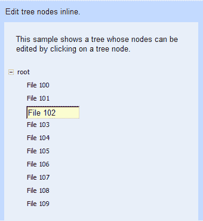
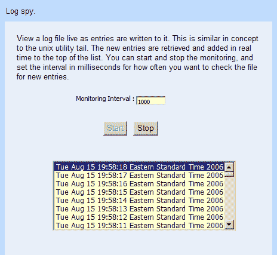
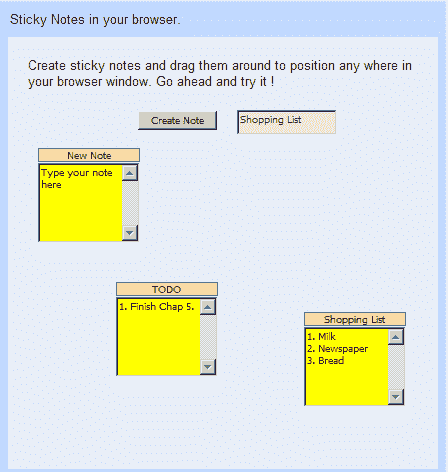

# 五、响应式的复杂界面

在本章中，我们将创建演示 GWT 的一些高级功能的用户界面。

我们将处理的任务是：

*   可分页表格
*   可编辑树节点
*   日志间谍
*   便签
*   拼图游戏

# 可分页表格

在本章中，我们将开始探索更复杂的 GWT 用户界面。在当今的商业世界中，我们经常会遇到一些需要使用表格来显示大量数据的情况。无论是从可用性角度还是从实用角度来看，一次在表中显示所有可用数据都不是可行的选择。

如果检索到的数据集足够大，我们还可以潜在地锁定显示该表的浏览器。向用户显示这些数据的更好方法是首先向他们显示固定数量的结果，然后向他们提供浏览结果的机制；这样他们就可以在空闲时翻页浏览数据。这有助于获得更好的用户体验，而且加载较小的数据集的速度也要快得多。

在本节中，我们将创建一个提供此功能的应用。作为本示例的一部分，我们还将学习如何在 GWT 应用中使用嵌入式数据库。

## 连接数据集的操作时间

我们将创建一个应用，使我们能够在块或页面中检索数据，而不是一次获取所有内容。我们将通过检索作为查询结果的前十个项来实现这一点，并为用户提供一种前进或后退通过这组结果的方式。步骤如下：

1.  在 `com.packtpub.gwtbook.samples.client`包中创建一个名为 `PageableDataService.java`的新 Java 文件。通过提供起始索引和要检索的项目数作为参数，定义一种检索客户数据的方法的 `PageableDataService`接口：

    ```java
    public interface PageableDataService extends RemoteService
    {
    public List getCustomerData(int startIndex, int numItems );
    }

    ```

2.  在 `com.packtpub.gwtbook.samples.client`包

    ```java
    public interface PageableDataServiceAsync
    {
    public void getCustomerData(int startIndex, int numItems,
    AsyncCallback callback);
    }

    ```

    中名为 `PageableDataServiceAsync.java`的新 Java 文件中创建此服务定义接口的异步版本
3.  在 `com.packtpub.gwtbook.samples.server`包中名为 `PageableDataServiceImpl.java`的新 Java 文件中创建可分页数据服务的实现。创建一个名为 `customerData`的私有 `ArrayList`对象，该对象将作为客户数据的容器：

    ```java
    private ArrayList customerData = new ArrayList();

    ```

4.  如果我们使用数据库来存储数据，而不是管理服务中的数据结构，那么会更简单。我们将使用 HSQLDB——一个小型嵌入式数据库来存储我们将在该服务中访问的数据。首先，将预填充数据库中的数据加载到列表中：

    ```java
    private void loadData()
    {
    Class.forName("org.hsqldb.jdbcDriver");
    Connection conn = DriverManager.getConnection
    ( "jdbc:hsqldb:file:samplesdb", "sa", "");
    Statement st = conn.createStatement();
    ResultSet rs = st.executeQuery("SELECT * FROM users");
    for (; rs.next();)
    {
    ArrayList customer = new ArrayList();
    customer.add((String) rs.getObject(2));
    customer.add((String) rs.getObject(3));
    customer.add((String) rs.getObject(4));
    customer.add((String) rs.getObject(5));
    customer.add((String) rs.getObject(6));
    customerData.add(customer);
    }
    st.execute("SHUTDOWN");
    conn.close();
    }

    ```

5.  我们在服务的构造函数中调用 `loadData()`函数，以便加载所有需要的数据，并在服务初始化后可用：

    ```java
    public PageableDataServiceImpl()
    {
    super();
    loadData();
    }

    ```

6.  现在添加只返回请求的数据子集的服务实现方法：

    ```java
    public ArrayList getCustomerData(int startIndex, int numItems)
    {
    ArrayList customers = new ArrayList();
    for (int i = startIndex - 1; i < (startIndex + numItems); i++)
    {
    customers.add((ArrayList) customerData.get(i));
    }
    return customers;
    }

    ```

7.  现在创建与可分页数据服务交互的用户界面。在 `com.packtpub.gwtbook.samples.client.panels`包中创建一个名为 `PageableDataPanel.java`的新 Java 文件。如前一章开头所述，本书中创建的每个用户界面都将添加到一个示例应用中，该示例应用类似于 `KitchenSink`应用，可作为 GWT 下载的示例项目之一使用。这就是为什么我们将每个用户界面创建为一个扩展了 `SamplePanel`类的面板，并将创建的面板添加到示例应用中的示例面板列表中。 `SamplePanel`类和 `Samples`应用的结构将在上一章的开头讨论。增加一个 `FlexTable`类用于显示数据，以及通过数据分页*向前*和*向后*的按钮。创建一个字符串数组以存储列标题，并创建一个整数变量以将开始索引存储到客户数据列表中：

    ```java
    private FlexTable customerTable = new FlexTable();
    private Button backButton = new Button("<<<");
    private Button forwardButton = new Button(">>");
    private String[] customerTableHeaders = new String[]
    { "Name", "City","Zip Code", "State", "Phone" };
    private int startIndex = 1;

    ```

8.  创建用于调用服务以获取数据的服务类：

    ```java
    final PageableDataServiceAsync pageableDataService =
    (PageableDataServiceAsync)
    GWT.create(PageableDataService.class);
    ServiceDefTarget endpoint = (ServiceDefTarget)
    pageableDataService;
    endpoint.setServiceEntryPoint(GWT.getModuleBaseURL() +
    "pageabledata");

    ```

9.  在使用数据填充表之前，添加一个清除表的私有方法：

    ```java
    private void clearTable()
    {
    for (int row=1; row<customerTable.getRowCount(); row++)
    {
    for (int col=0; col<customerTable.getCellCount(row); col++)
    {
    customerTable.clearCell(row, col);
    }
    }
    }

    ```

10.  添加使用从服务检索的数据更新表的私有方法：

    ```java
    private void update(int startIndex)
    {
    AsyncCallback callback = new AsyncCallback()
    public void onSuccess(Object result)
    {
    ArrayList customerData = (ArrayList) result;
    int row = 1;
    clearTable();
    for (Iterator iter=customerData.iterator(); iter.hasNext();)
    {
    ArrayList customer = (ArrayList) iter.next();
    customerTable.setText(row, 0, (String) customer.get(0));
    customerTable.setText(row, 1, (String) customer.get(1));
    customerTable.setText(row, 2, (String) customer.get(2));
    customerTable.setText(row, 3, (String) customer.get(3));
    customerTable.setText(row, 4, (String) customer.get(4));
    row++;
    }
    }
    public void onFailure(Throwable caught)
    {
    Window.alert("Error when invoking the pageable data service
    : " + caught.getMessage());
    }
    pageableDataService.getCustomerData(startIndex, 10, callback);
    }

    ```

11.  在 `PageableDataPanel`的构造函数中，创建一个 `VerticalPanel`对象，该对象将作为此用户界面的容器面板，并初始化保存客户数据的表：

    ```java
    VerticalPanel workPanel = new VerticalPanel();
    customerTable.setWidth(500 + "px");
    customerTable.setBorderWidth(1);
    customerTable.setCellPadding(4);
    customerTable.setCellSpacing(1);
    customerTable.setText(0, 0, customerTableHeaders[0]);
    customerTable.setText(0, 1, customerTableHeaders[1]);
    customerTable.setText(0, 2, customerTableHeaders[2]);
    customerTable.setText(0, 3, customerTableHeaders[3]);
    customerTable.setText(0, 4, customerTableHeaders[4]);

    ```

12.  创建一个包含后退和前进按钮的内部导航栏：

    ```java
    HorizontalPanel innerNavBar = new HorizontalPanel();
    innerNavBar.setStyleName("pageableData-NavBar");
    innerNavBar.setSpacing(8);
    innerNavBar.add(backButton);
    innerNavBar.add(forwardButton);

    ```

13.  添加一个事件处理程序，以侦听对构造函数的“后退”按钮的单击：

    ```java
    backButton.addClickListener(new ClickListener()
    {
    public void onClick(Widget sender)
    {
    if (startIndex >= 10)
    startIndex -= 10;
    update(startIndex);
    }
    });

    ```

14.  添加一个事件处理程序，以侦听对构造函数的转发按钮的单击：

    ```java
    forwardButton.addClickListener(new ClickListener()
    {
    public void onClick(Widget sender)
    {
    if (startIndex < 40)
    {
    startIndex += 10;
    update(startIndex);
    }
    }
    });

    ```

15.  最后，在构造函数中，将客户数据表和导航栏添加到工作面板。创建一个小信息面板，显示有关此应用的描述性文本，以便我们可以在 `Samples`应用的可用样本列表中选择此样本时显示文本。将信息面板和工作面板添加到停靠面板，并初始化小部件。调用 `update()`方法，获取第一批客户数据，在页面初始加载时显示：

    ```java
    workPanel.add(innerNavBar);
    HorizontalPanel infoPanel = new HorizontalPanel();
    infoPanel.add(new HTML("<div class='infoProse'>Create lists that can be paged by fetching data from the server on demand
    we go forward and backward in the list.</div>"));
    workPanel.add(customerTable);
    DockPanel workPane = new DockPanel();
    workPane.add(infoPanel, DockPanel.NORTH);
    workPane.add(workPanel, DockPanel.CENTER);
    workPane.setCellHeight(workPanel, "100%");
    workPane.setCellWidth(workPanel, "100%");
    initWidget(workPane);
    update(1);

    ```

16.  将服务添加到 `com.packtpub.gwtbook.samples`包

    ```java
    <servlet path="/Samples/pageabledata" class=
    "com.packtpub.gwtbook.samples.server.PageableDataServiceImpl"/>

    ```

    中 `Samples`应用`Samples.gwt.xml`的模块文件中

以下是应用的用户界面：


单击按钮在列表中向前或向后移动。

### 刚才发生了什么事？

我们正在使用一个嵌入式数据库（高超音速 SQL-HSQLDB-[http://www.hsqldb.org](http://www.hsqldb.org) ）包含我们将翻页浏览的客户数据，一次只显示十个结果。使用此数据库所需的所有组件都包含在 `hsqldb.jar`文件中。为了在 GWT 项目中使用它，我们需要确保将 `hsqldb.jar`文件添加到 Eclipse 项目的 `buildpath`中。然后，当您运行或调试项目时，它将在 `classpath`上可用。

正在使用 HSQLDB 的内存版本，这意味着数据库与 GWT 应用在同一个 Java 虚拟机中运行。初始化 HSQLDB 的 JDBC 驱动程序后，通过指定数据库文件路径，我们可以连接到名为 `samplesdb`的数据库。如果该文件不存在，则将创建该文件；如果该文件存在，则数据库引擎将加载该数据库。提供的文件路径相对于启动此 JVM 的目录；因此，在本例中，数据库文件将在项目的根目录中创建。

```java
Class.forName("org.hsqldb.jdbcDriver");
Connection conn = DriverManager.getConnection
("jdbc:hsqldb:file:samplesdb", "sa", "");

```

客户表中的数据被检索并存储在本地 `ArrayList`中。此列表数据结构在 customers 表中每行包含一个 `ArrayList`。它将用作检索信息集的基础。每个检索客户数据的请求都将提供一个开始索引和要检索的项目数。开始索引告诉我们进入 `ArrayList`的偏移量，而项目数限制返回的结果。

应用的用户界面显示一个表以及两个按钮。“后退”按钮在数据集中向后翻页，而“前进”按钮允许我们在列表中向前移动。加载页面时，对 `PageableDataService`接口进行异步调用，获取前十项并在表中显示。注册事件处理程序以侦听两个按钮上的单击。单击任一按钮都会触发对远程服务的调用，以获取下一组项目。我们将当前显示的表项的开始索引存储在私有变量中。当我们点击后退按钮时，该变量递减；当我们点击前进按钮时，该变量递增。当我们请求下一组数据时，它作为参数提供给远程方法。请求的结果用于填充页面上的表。

```java
ArrayList customerData = (ArrayList) result;
int row = 1;
clearTable();
for (Iterator iter = customerData.iterator(); iter.hasNext();)
{
ArrayList customer = (ArrayList) iter.next();
customerTable.setText(row, 0, (String) customer.get(0));
customerTable.setText(row, 1, (String) customer.get(1));
customerTable.setText(row, 2, (String) customer.get(2));
customerTable.setText(row, 3, (String) customer.get(3));
customerTable.setText(row, 4, (String) customer.get(4));
row++;
}

```

我们清除表中的数据，然后通过为每列设置文本来添加新数据。

# 可编辑树节点

树控件提供了一种非常用户友好的方式来显示一组分层数据，常见的例子是文件系统上的目录结构或 XML 文档中的节点。GWT 提供了一个树小部件，可以显示这些数据，但不提供任何方法来修改树本身的节点。修改树控件中显示的节点的最常见用途之一是在您喜爱的平台上重命名文件资源管理器中的文件和文件夹。我们将创建一个应用，该应用演示如何通过单击并键入新文本来编辑树中显示的节点。此示例还演示了扩展 GWT 以使其完成一些开箱即用的功能是多么容易。

## 修改节点的动作时间

我们将创建一个应用，其中包含一个行为类似于 Windows 文件资源管理器的树，允许我们单击一个节点并编辑该节点的文本。步骤如下：

1.  在 `com.packtpub.gwtbook.samples.client.panels`包中名为 `EditableTreeNodesPanel.java`的新 Java 文件中创建此应用的用户界面。这个类还扩展了 `SamplePanel`类，就像本书中的所有其他用户界面一样。一个 `SamplePanel`类扩展了 `Composite`类，这是一种创建多个用户界面的简单方法，并将每个用户界面添加到 `Samples`应用中，这样我们就可以以类似于 GWT 发行版中 `KitchenSink`示例项目的方式显示所有应用的列表。我们在[第 4 章](04.html "Chapter 4. Interactive Forms")开头的一节中描述了示例应用结构。创建树、文本框和标签。最后，为工作面板和工作窗格创建变量：

    ```java
    private Tree editableTree = new Tree();
    private TreeItem currentSelection = new TreeItem();
    private TextBox textbox = new TextBox();
    private AbsolutePanel workPanel = new AbsolutePanel();
    private DockPanel workPane = new DockPanel();

    ```

2.  创建一个私有方法，用一些节点填充树：

    ```java
    private void initTree()
    {
    TreeItem root = new TreeItem("root");
    root.setState(true);
    int index = 100;
    for (int j = 0; j < 10; j++)
    {
    TreeItem item = new TreeItem();
    item.setText("File " + index++);
    root.addItem(item);
    }
    editableTree.addItem(root);
    }

    ```

3.  在 `EditableTreeNodesPanel`的构造函数中，初始化树并添加一个事件处理程序，用于监听树节点

    ```java
    initTree();
    editableTree.addTreeListener(new TreeListener()
    {
    public void onTreeItemSelected(TreeItem item)
    {
    if (textbox.isAttached())
    {
    if(!currentSelection.getText().equals(textbox.getText()))
    {
    currentSelection.setText(textbox.getText());
    }
    workPanel.remove(textbox);
    }
    textbox.setHeight(item.getOffsetHeight() + "px");
    textbox.setWidth("90px");
    int xpos = item.getAbsoluteLeft() - 133;
    int ypos = item.getAbsoluteTop() - 115;
    workPanel.add(textbox, xpos, ypos);
    textbox.setText(item.getText());
    textbox.setFocus(true);
    currentSelection = item;
    textbox.addFocusListener(new FocusListener()
    {
    public void onLostFocus(Widget sender)
    {
    if (sender.isAttached())
    {
    if (!currentSelection.getText()
    .equals(textbox.getText()))
    {
    currentSelection.setText (textbox.getText());
    }
    workPanel.remove(textbox);
    }
    }
    });
    }
    public void onTreeItemStateChanged(TreeItem item)
    {
    }
    }

    ```

    上的点击
4.  在构造器中，创建一个小信息面板，显示有关此应用的描述性文本，以便我们可以在 `Samples`应用的可用样本列表中选择此样本时显示文本。将信息面板和工作面板添加到 dock 面板，并初始化小部件：

    ```java
    HorizontalPanel infoPanel = new HorizontalPanel();
    infoPanel.add(new HTML
    ("<div class='infoProse'>This sample shows a tree whose nodes
    can be edited by clicking on a tree node.</div>"));
    workPanel.add(editableTree);
    workPane.add(infoPanel, DockPanel.NORTH);
    workPane.add(workPanel, DockPanel.CENTER);
    workPane.setCellHeight(workPanel, "100%");
    workPane.setCellWidth(workPanel, "100%");
    initWidget(workPane);

    ```

运行应用：



可以单击树节点并更改显示的文本框中的文本。

### 刚才发生了什么事？

树控件是可视化和探索分层数据的好方法。在这个示例中，我们创建了一个包含十个节点的树，每个节点包含一个字符串值。我们注册一个事件处理程序，用于侦听树节点上的选择事件。选择树节点后，我们将创建一个文本框，其中包含与树节点相同的文本，并将文本框放置在树节点上。通过检索树节点的左坐标和顶坐标来定位文本框。当前选定的树节点存储在专用变量中。注册事件处理程序以从新添加的文本框中侦听焦点事件。当文本框失去焦点时，我们获取当前文本并使用它修改树项值：

```java
public void onLostFocus(Widget sender)
{
if (sender.isAttached())
{
if (!currentSelection.getText().equals(textbox.getText()))
{
currentSelection.setText(textbox.getText());
}
workPanel.remove(textbox);
}
}

```

`isAttached()`功能使我们能够检查发送方小部件是否实际连接到根面板，或者它是否已被销毁。如果小部件不再连接到面板，我们避免在小部件上设置任何内容。这就是全部！GWT 使添加对树节点内联编辑的支持变得非常简单。当前的 GWT 版本还不支持将字符串以外的小部件作为树项添加到树中。一旦该支持可用，就可以简单地重构该示例，将文本框用作树节点，并根据单击事件使其可编辑或不可编辑。

# 日志间谍

在本例中，我们将了解如何根据客户机设置的时间间隔轮询服务器。这将涉及到使用 GWT Timer 对象，对于需要基于重复时间间隔在服务器上执行操作，然后使用操作结果异步更新网页部分的情况非常有用。我们将创建一个简单的应用，可以实时监视和显示日志文件的内容。

## 更新日志文件的操作时间

几乎每个应用都有包含调试信息的日志文件。通常通过登录到服务器，导航到包含日志文件的文件夹，然后在文本编辑器中打开文件以实际查看内容来读取此信息。这是一种检查日志文件的繁琐方法。更好、更友好的方法是使用 GWT 创建一个可以在网页中显示日志文件内容的应用。随着消息添加到日志文件中，内容将实时更新。以下步骤将为我们提供所需的结果：

1.  在 `com.packtpub.gwtbook.samples.client`包中创建一个名为 `LogSpyService.java`的新 Java 文件。定义一个具有两种方法的 `LogSpyService`接口，一种方法用于检索所有日志条目，另一种方法用于仅检索新条目：

    ```java
    public interface LogSpyService extends RemoteService
    {
    public ArrayList getAllLogEntries();
    public ArrayList getNextLogEntries();
    }

    ```

2.  在 `com.packtpub.gwtbook.samples.client`包

    ```java
    public interface LogSpyServiceAsync
    {
    public void getAllLogEntries(AsyncCallback callback);
    public void getNextLogEntries(AsyncCallback callback);
    }

    ```

    中名为 `LogSpyServiceAsync.java`的新 Java 文件中创建此服务定义接口的异步版本
3.  在 `com.packtpub.gwtbook.samples.server`包中名为 `LogSpyServiceImpl.java`的新 Java 文件中创建 log spy 服务的实现。首先创建一个用于读取日志文件的私有方法，一个用于保存文件指针的变量，以及一个具有要读取的日志文件名称的变量：

    ```java
    private long filePointer = 0;
    private File logfile = new File("test2.log");
    private ArrayList readLogFile()
    {
    ArrayList entries = new ArrayList();
    RandomAccessFile file = new RandomAccessFile(logfile, "r");
    long fileLength = logfile.length();
    if (fileLength > filePointer)
    {
    file.seek(filePointer);
    String line = file.readLine();
    while (line != null)
    {
    line = file.readLine();
    if (line != null && line.length() > 0)
    {
    entries.add(line);
    }
    }
    filePointer = file.getFilePointer();
    }
    file.close();
    return entries;
    }

    ```

4.  增加实现服务接口的两种方法：

    ```java
    public ArrayList getAllLogEntries()
    {
    return readLogFile();
    }
    public ArrayList getNextLogEntries()
    {
    try
    {
    Thread.sleep(1000);
    }
    catch (InterruptedException e)
    {
    e.printStackTrace();
    }
    return readLogFile();
    }

    ```

5.  现在创建与 log spy 服务交互的用户界面。在 `com.packtpub.gwtbook.samples.client.panels`包中创建一个名为 `LogSpyPanel.java`的新 Java 文件。为工作面板、设置监控间隔的文本框、标签和**开始**和**停止**按钮创建变量。我们还需要一个布尔标志来指示监视的当前状态。

    ```java
    Public VerticalPanel workPanel = new VerticalPanel();
    public ListBox logSpyList = new ListBox();
    public TextBox monitoringInterval = new TextBox();
    public Label monitoringLabel = new Label( "Monitoring Interval :");
    public Button startMonitoring = new Button("Start");
    public Button stopMonitoring = new Button("Stop");
    private boolean isMonitoring = false;

    ```

6.  创建包含**开始**和**停止**按钮、监控间隔文本框和标签以及计时器的面板：

    ```java
    private HorizontalPanel intervalPanel = new HorizontalPanel();
    private HorizontalPanel startStopPanel = new HorizontalPanel();
    private Timer timer;

    ```

7.  创建一个用于显示日志消息的列表框，以及我们将调用以获取日志条目的服务接口：

    ```java
    public ListBox logSpyList = new ListBox();
    ServiceDefTarget endpoint = (ServiceDefTarget) logSpyService;
    endpoint.setServiceEntryPoint GWT.getModuleBaseURL()
    + "logspy");

    ```

8.  在构造器中，将监控间隔文本框的初始值设置为 1000，并禁用**停止**按钮：

    ```java
    monitoringInterval.setText("1000");
    stopMonitoring.setEnabled(false);

    ```

9.  设置面板、文本框和标签的样式：

    ```java
    intervalPanel.setStyleName("logSpyPanel");
    startStopPanel.setStyleName("logSpyStartStopPanel");
    monitoringLabel.setStyleName("logSpyLabel");
    monitoringInterval.setStyleName("logSpyTextbox");

    ```

10.  添加一个事件处理程序来监听**开始**按钮上的点击，并从处理程序调用日志间谍服务：

    ```java
    startMonitoring.addClickListener(new ClickListener()
    {
    public void onClick(Widget sender)
    {
    if (!isMonitoring)
    {
    timer = new Timer()
    {
    public void run()
    {
    AsyncCallback callback = new AsyncCallback()
    {
    public void onSuccess(Object result)
    {
    ArrayList resultItems = (ArrayList) result;
    for (Iterator iter = resultItems.iterator();
    iter.hasNext();)
    {
    logSpyList.insertItem(((String)
    iter.next()), 0);
    logSpyList.setSelectedIndex(0);
    }
    }
    public void onFailure(Throwable caught)
    {
    Window.alert("Error while invoking the logspy
    service " + caught.getMessage());
    }
    };
    logSpyService.getNextLogEntries(callback);
    }
    };
    timer.scheduleRepeating(Integer.parseInt
    (monitoringInterval.getText()));
    isMonitoring = true;
    startMonitoring.setEnabled(false);
    stopMonitoring.setEnabled(true);
    }
    }
    });

    ```

11.  添加一个事件处理程序来监听**停止**按钮上的点击并停止监控：

    ```java
    stopMonitoring.addClickListener(new ClickListener()
    {
    public void onClick(Widget sender)
    {
    if (isMonitoring)
    {
    timer.cancel();
    isMonitoring = false;
    startMonitoring.setEnabled(true);
    stopMonitoring.setEnabled(false);
    }
    }
    });

    ```

12.  将列表中可见项的数量限制为八项：

    ```java
    logSpyList.setVisibleItemCount(8);

    ```

13.  最后，在构造器中，创建一个小信息面板，显示有关此应用的描述性文本，以便我们在 `Samples`应用的可用样本列表中选择此样本时可以显示此文本。将“监视间隔”面板和“开始-停止按钮”面板添加到“工作”面板。将信息面板和工作面板添加到 dock 面板，并初始化小部件：

    ```java
    HorizontalPanel infoPanel = new HorizontalPanel();
    infoPanel.add(new HTML
    ("<div class='infoProse'>View a log file live as entries are
    written to it. This is similar in concept to the unix
    utility tail. The new entries are retrieved and added in
    real time to the top of the list. You can start and stop
    the monitoring, and set the interval in milliseconds for
    how often you want to check the file for new entries.
    </div>"));
    intervalPanel.add(monitoringLabel);
    intervalPanel.add(monitoringInterval);
    startStopPanel.add(startMonitoring);
    startStopPanel.add(stopMonitoring);
    workPanel.add(intervalPanel);
    workPanel.add(startStopPanel);
    workPanel.add(logSpyList);
    DockPanel workPane = new DockPanel();
    workPane.add(infoPanel, DockPanel.NORTH);
    workPane.add(workPanel, DockPanel.CENTER);
    workPane.setCellHeight(workPanel, "100%");
    workPane.setCellWidth(workPanel, "100%");
    initWidget(workPane);

    ```

14.  将服务添加到 `com.packtpub.gwtbook.samples`包

    ```java
    <servlet path="/Samples/logspy"
    class="com.packtpub.gwtbook.samples.server.LogSpyServiceImpl"/>

    ```

    中 `Samples`应用`Samples.gwt.xml`的模块文件中

下面是显示日志文件中条目的应用的屏幕截图-`test.log:`



当条目添加到此文件时，它们将实时添加到列表中，列表中的第一项是最新的日志条目。您可以监视所需的任何文件。只需更改 `LogSpyServiceImpl`类中 `logFile`变量的值，以包含必需的文件名。

### 刚才发生了什么事？

当应用写入日志文件时，日志文件通常只是附加了消息的文本文件。此示例使用的是一个简单的日志文件，可以修改为使用要监视的任何文件。我们使用 `RandomAccessFile`类读取文件，这样我们就可以只访问我们想要的文件部分，而无需每次都将整个文件读入内存。包含最后一个文件指针的私有变量存储在类中。此指针是指向文件的光标。我们有一个方法 `readLogFile()`访问该文件，只读取指向文件末尾的文件指针中的数据。每次读取文件时，指针都会更新以存储上次读取的位置。

```java
RandomAccessFile file = new RandomAccessFile(logfile, "r");
long fileLength = logfile.length();
if (fileLength > filePointer)
{
file.seek(filePointer);
String line = file.readLine();
while (line != null)
{
line = file.readLine();
if (line != null && line.length() > 0)
{
entries.add(line);
}
}
filePointer = file.getFilePointer();
}
file.close();

```

如果该文件自上次读取以来未被修改，我们将返回一个空列表，而不尝试读取该文件。每当客户机请求获取新的日志条目时，我们都会读取文件并返回新条目。

用户界面包括一个列表框、一个可用于指定监视日志文件频率的文本框，以及用于启动和停止监视文件的按钮。当点击**开始**按钮时，我们启动一个计时器，该计时器计划在提供的时间间隔后关闭。每次计时器关闭时，我们都会请求获取日志条目，然后在 `onSuccess()`回调方法中将返回的条目添加到列表框中。我们将日志条目插入到列表中，然后将最后添加的条目设置为所选条目，以便直观地指示列表中最新的条目：

```java
logSpyList.insertItem(((String) iter.next()), 0);
logSpyList.setSelectedIndex(0);

```

如果我们点击**停止**按钮，定时器被取消，监控被停止。与所有其他样品相比，我们在这里做了一些非常不同的事情。我们根据用户在文本框中设置的时间间隔，以重复的时间间隔调用服务。因此，每当计时器关闭时，我们都会发出一个异步请求。这种技术可以用来做一些非常有用的事情，通过同步调用服务器以获取新信息，在预定的时间间隔内更新页面的部分或部分。

# 便签

**文档对象模型**（**DOM**以树状结构的形式描述 HTML 文档的结构，可以使用 JavaScript 等语言访问。所有现代 web 浏览器都通过 DOM 脚本帮助访问加载的 web 页面。GWT 提供了一组丰富的方法，使您能够操纵网页的 DOM。我们甚至可以拦截和预览 DOM 事件。我们将学习如何使用 GWT DOM 方法和对话框，利用它们来创建类似于无处不在的 post-it 便笺的便笺，并将它们拖动到浏览器窗口中的任意位置。

## 是时候玩便签了

我们将创建可以在浏览器窗口中移动并放置在任何位置的便笺。步骤如下：

1.  在 `com.packtpub.gwtbook.samples.client.panels`包中创建一个名为 `StickyNotesPanel.java`的新 Java 文件。创建一个工作面板、一个用于创建注释的按钮、一个用于注释名称的文本框，以及用于保存注释的 x 和 y 坐标的变量。还创建一个整数变量，以保存新注释坐标的增量：

    ```java
    private HorizontalPanel workPanel = new HorizontalPanel();
    private Button createNote = new Button("Create Note");
    private TextBox noteTitle = new TextBox();
    private int noteLeft = 300;
    private int noteTop = 170;
    private int increment = 10;

    ```

2.  创建一个名为 `StickyNote`的新类，该类扩展了 `DialogBox`。在该类的构造函数中，设置注释的标题（如果提供），并添加一个用于输入实际注释的文本区域：

    ```java
    public StickyNote(String title)
    {
    super();
    if (title.length() == 0)
    {
    setText("New Note");
    }
    else
    {
    setText(title);
    }
    TextArea text = new TextArea();
    text.setText("Type your note here");
    text.setHeight("80px");
    setWidget(text);
    setHeight("100px");
    setWidth("100px");
    setStyleName(text.getElement(), "notesText", true);
    setStyleName("notesPanel");
    }

    ```

3.  在 `StickyNote`类中创建一个拦截 DOM 事件的方法：

    ```java
    public boolean onEventPreview(Event event)
    {
    int type = DOM.eventGetType(event);
    switch (type)
    {
    case Event.ONKEYDOWN:
    {
    return onKeyDownPreview((char) DOM.eventGetKeyCode(event),
    KeyboardListenerCollection.getKeyboardModifiers(event));
    }
    case Event.ONKEYUP:
    {
    return onKeyUpPreview((char) DOM.eventGetKeyCode(event),
    KeyboardListenerCollection.getKeyboardModifiers(event));
    }
    case Event.ONKEYPRESS:
    {
    return onKeyPressPreview((char) DOM.eventGetKeyCode(event),
    KeyboardListenerCollection.getKeyboardModifiers(event));
    }
    }
    return true;
    }

    ```

4.  在 `StickyNotesPanel`类的构造函数中，创建一个小信息面板，显示有关此应用的描述性文本，以便我们在 `Samples`应用的可用示例列表中选择此示例时可以显示文本。将该类添加为侦听器，以单击**创建注释**按钮上的事件。将用于创建注释的按钮以及标题文本框添加到工作面板。将信息面板和工作面板添加到 dock 面板，并初始化小部件：

    ```java
    HorizontalPanel infoPanel = new HorizontalPanel();
    infoPanel.add(new HTML
    ("<div class='infoProse'>Create sticky notes and drag them
    around to position any where in your browser window. Go
    ahead and try it !
    </div>"));
    createNote.addClickListener(this);
    createNote.setStyleName("notesButton");
    workPanel.add(createNote);
    noteTitle.setStyleName("notesTitle");
    workPanel.add(noteTitle);
    DockPanel workPane = new DockPanel();
    workPane.add(infoPanel, DockPanel.NORTH);
    workPane.add(workPanel, DockPanel.CENTER);
    workPane.setCellHeight(workPanel, "100%");
    workPane.setCellWidth(workPanel, "100%");
    initWidget(workPane);

    ```

5.  让 `StickyNotesPanel`类实现 `ClickListener`接口，点击**创建便笺**按钮时，向 `onClick()`方法添加代码，创建新便笺：

    ```java
    public void onClick(Widget sender)
    {
    StickyNote note = new StickyNote(noteTitle.getText());
    note.setPopupPosition(noteLeft + increment, noteTop +
    increment);
    increment = increment + 40;
    note.show();
    }

    ```

以下是应用的屏幕截图：



创建多个注释时，可以拖动注释并将其放置在浏览器窗口中的任意位置。

### 刚才发生了什么事？

此示例演示了如何轻松地使用 GWT 生成一些非常酷的接口和应用。“便笺”应用会在屏幕上创建便笺，您可以在 web 浏览器中拖动便笺，并将其放置在您想要的任何位置。用户界面包含用于键入注释名称的文本框，以及用于使用提供的名称创建新注释的按钮。如果未提供名称，则使用默认名称**新注释**创建。

注释本身是 `DialogBox`的一个子类。它有一个标题和一个文本区域，用于在便笺中键入内容。 `DialogBox`类继承 `PopupPanel`类，实现 `EventPreview`接口。我们从这个界面实现了步骤 3 中给出的 `onEventPreview()`方法，这样我们就可以先预览所有浏览器事件，然后再将它们发送到目标。这本质上意味着我们的便笺面板位于浏览器事件预览堆栈的顶部。

我们预览键盘事件，然后将它们传递给目标。这使我们能够创建一个模态对话框，并向其引入非模态行为。如果我们不这样做，一旦我们创建了第一个便笺，便笺将是模态的，并且不允许我们通过点击**创建**按钮来创建另一个便笺，除非我们先关闭便笺。

现在，注释会在预览事件后将其传递到基础面板，我们可以创建任意数量的注释。注册一个事件处理程序来监听**创建注释**按钮上的点击。单击按钮时，将创建一个新注释，我们将设置它相对于浏览器窗口的位置，然后显示它。我们维护一个私有变量，该变量包含最后创建的注释的左位置，以便在创建注释时可以错开注释的位置，就像我们在步骤 5 中所做的那样。这样可以在屏幕上很好地排列注释，使注释不会相互覆盖。

由于我们的笔记继承自 `DialogBox`，因此它们是可拖动的；我们可以在屏幕上拖动它们，并将它们放置在我们想要的任何位置！

# 拼图游戏

前面的示例演示了 GWT 中的一些拖动功能和 DOM 事件预览。在本例中，我们将使用相同的 DOM 方法，但截取或预览 DOM 事件的方式不同。我们还将使用 `AbsolutePanel`演示 GWT 中的一些绝对定位功能。我们将创建一个简单的蒙娜丽莎拼图，可以通过拖动和重新排列拼图的各个部分来解决。

## 行动时间到了，让我们制造一个谜题！

我们将创建一个简单的拼图游戏，它的碎片是通过将蒙娜丽莎图像分成九块来创建的。步骤如下：

1.  在实现 `MouseListener`接口的 `com.packtpub.gwtbook.samples.client.panels`包中创建一个名为 `JigsawPuzzlePanel.java`的新 Java 文件。创建一个 `AbsolutePanel`类，该类将成为主面板，所有小部件都将添加到该面板中。同时添加两个变量来存储鼠标光标的 `x`和 `y`位置：

    ```java
    private AbsolutePanel workPanel = new AbsolutePanel();
    private boolean inDrag;
    private int xOffset;
    private int yOffset;

    ```

2.  在 `JigsawPuzzlePanel`的构造函数中，将蒙娜丽莎图像添加到面板中，并将面板添加为来自图像的鼠标事件的侦听器：

    ```java
    Image monalisa = new Image("img/monalisa_face1_8.jpg");
    monalisa.addMouseListener(this);
    workPanel.add(monalisa, 60, 20);
    monalisa = new Image("img/monalisa_face1_7.jpg");
    monalisa.addMouseListener(this);
    workPanel.add(monalisa, 60, 125);
    monalisa = new Image("img/monalisa_face1_2.jpg");
    monalisa.addMouseListener(this);
    workPanel.add(monalisa, 60, 230);
    monalisa = new Image("img/monalisa_face1_3.jpg");
    monalisa.addMouseListener(this);
    workPanel.add(monalisa, 170, 20);
    monalisa = new Image("img/monalisa_face1_4.jpg");
    monalisa.addMouseListener(this);
    workPanel.add(monalisa, 170, 125);
    monalisa = new Image("img/monalisa_face1_1.jpg");
    monalisa.addMouseListener(this);
    workPanel.add(monalisa, 170, 230);
    monalisa = new Image("img/monalisa_face1_6.jpg");
    monalisa.addMouseListener(this);
    workPanel.add(monalisa, 280, 20);
    monalisa = new Image("img/monalisa_face1_9.jpg");
    monalisa.addMouseListener(this);
    workPanel.add(monalisa, 280, 125);
    monalisa = new Image("img/monalisa_face1_5.jpg");
    monalisa.addMouseListener(this);
    jigsaw puzzlecreatingworkPanel.add(monalisa, 280, 230);

    ```

3.  注册以拦截构造函数中的 DOM 鼠标事件：

    ```java
    DOM.addEventPreview(new EventPreview()
    {
    public boolean onEventPreview(Event event)
    {
    switch (DOM.eventGetType(event))
    {
    case Event.ONMOUSEDOWN:
    case Event.ONMOUSEMOVE:
    case Event.ONMOUSEUP:
    DOM.eventPreventDefault(event);
    }
    return true;
    }
    });

    ```

4.  在构造函数中实现监听鼠标按下事件的方法：

    ```java
    public void onMouseDown(Widget source, int x, int y)
    {
    DOM.setCapture(source.getElement());
    xOffset = x;
    yOffset = y;
    inDrag = true;
    }

    ```

5.  在构造函数中实现监听鼠标移动事件的方法：

    ```java
    public void onMouseMove(Widget source, int x, int y)
    {
    if (inDrag)
    {
    int xAbs = x + source.getAbsoluteLeft() - 135;
    int yAbs = y + source.getAbsoluteTop() - 120;
    ((AbsolutePanel)source.getParent()).
    setWidgetPosition(source, xAbs- xOffset, yAbs - yOffset);
    }
    }

    ```

6.  在构造函数中实现监听鼠标移动事件的方法：

    ```java
    public void onMouseUp(Widget source, int x, int y)
    {
    DOM.releaseCapture(source.getElement());
    inDrag = false;
    }

    ```

7.  最后，在构造器中，创建一个小信息面板，显示有关此应用的描述性文本，以便我们可以在 `Samples`应用的可用样本列表中选择此样本时显示文本。将信息面板和工作面板添加到 dock 面板，并初始化小部件：

    ```java
    HorizontalPanel infoPanel = new HorizontalPanel();
    infoPanel.add(new HTML
    ("<div class='infoProse'>This example demonstrates the use
    of dragging to move things around and place them anywhere
    in the window. It is easy to forget that you are actually
    doing this in a web browser !
    </div>"));
    DockPanel workPane = new DockPanel();
    workPane.add(infoPanel, DockPanel.NORTH);
    workPane.add(workPanel, DockPanel.CENTER);
    workPane.setCellHeight(workPanel, "100%");
    workPane.setCellWidth(workPanel, "100%");
    initWidget(workPane);

    ```

以下是您第一次访问页面时遇到的难题：


以下是已解决的难题：


### 刚才发生了什么事？

此示例演示 GWT 中的绝对定位功能。蒙娜丽莎的图像文件被分割成九张大小相等的图像。当应用渲染时，我们将图像混在一起，并以 3x3 的正方形显示在屏幕上。然后，用户可以通过拖动图像片段并在屏幕上重新定位来重新排列图像片段，从而重现蒙娜丽莎。

在这个示例中，我们使用一个 `AbsolutePanel`类作为我们的工作面板。它能够绝对定位所有子部件，甚至允许部件重叠。我们通过绝对定位将这九幅图像添加到面板中，从而形成一个漂亮的 3x3 网格。

以下是网格的一列：

```java
Image monalisa = new Image("img/monalisa_face1_8.jpg");
monalisa.addMouseListener(this);
workPanel.add(monalisa, 60, 20);
monalisa = new Image("img/monalisa_face1_7.jpg");
monalisa.addMouseListener(this);
workPanel.add(monalisa, 60, 125);
monalisa = new Image("img/monalisa_face1_2.jpg");
monalisa.addMouseListener(this);
workPanel.add(monalisa, 60, 230);

```

在上一个示例中，我们能够实现 `onEventpreview()`方法，在将浏览器事件发送到目标之前，首先预览浏览器事件。我们能够做到这一点，因为注释是 `PopupPanel`的一个子类，它提供了这种能力。但在当前示例中，我们没有使用弹出式面板。因此，我们使用另一种方法将自己添加到事件预览堆栈的顶部。这次我们在 DOM 对象中使用 `addEvetnpreview()`方法，如步骤 3 所示。

在步骤 4 中，我们实现了 `MouseListener`接口，并将自己注册为面板中鼠标事件的事件处理程序。当用户在拖动图像之前单击图像时，我们会获取单击的元素并将其设置为鼠标捕获。这确保元素将接收所有鼠标事件，直到从鼠标捕获中释放为止。我们将元素的 `x`和 `y`坐标存储在私有变量中。我们还设置了一个标志，告诉我们当前处于拖动元素的模式。

一旦用户开始拖动图像，我们检查是否处于拖动模式，并设置小部件的位置，这将把小部件移动到新位置。您只能通过调用包含小部件的绝对面板来设置小部件的绝对位置；因此，我们必须获取图像的父对象，然后将其强制转换到正确的类。我们已经在步骤 5 中介绍了所有这些。

当用户完成将图像拖动到某个位置并释放鼠标后，我们将从鼠标捕获中释放元素，并将拖动标志设置为 false，如步骤 6 所示。

GWT 中的绝对定位支持仍然需要一些工作，在 Firefox 和 InternetExplorer 以及它们的多个版本中可能会表现得非常不同。

# 总结

在本章中，我们学习了如何创建能够以用户友好的方式浏览一组数据的表，并扩展了树小部件，以添加对就地编辑树节点的简单支持。我们使用 `timer`对象创建了一个日志间谍应用，该应用监视给定日志文件中的新条目，并将它们显示在实时更新的列表中。

我们学习了如何在 GWT 中使用一些 DOM 方法和 DOM 事件预览功能，并利用它实现了一个可拖动的便笺应用。我们还学习了如何使对话框成为非模态的，这样我们就可以使它们适合我们的使用。最后，利用绝对定位功能和预览 DOM 事件的替代方法，我们创建了一个拼图应用。

在下一章中，我们将学习如何使用 JavaScript 本机接口将第三方 JavaScript 库与 GWT 集成。