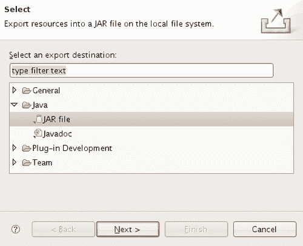
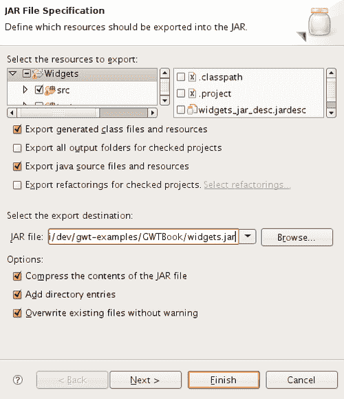
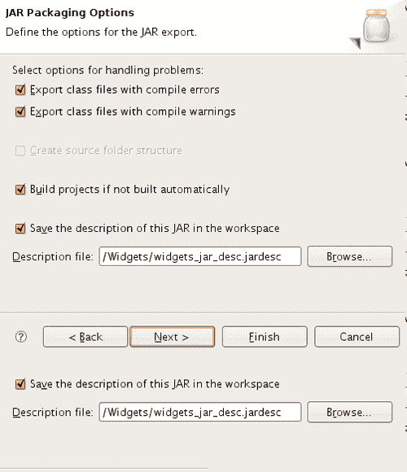

# 七、定制小部件

GWT 提供了各种各样的小部件，如标签、文本框、树等，供您在应用中使用。这些小部件为构建用户界面提供了一个良好的起点，但几乎总是不能为您提供所需的一切。这就是通过以更新和创新的方式组合现有小部件或从头开始编写新小部件来创建自定义小部件的概念。在本章中，我们将讨论网页中常用的两个方面：日历显示和天气状况显示。由于 GWT 中当前提供的任何东西都不提供这两个函数，因此我们将创建这两个小部件。我们还将学习如何打包它们，以便在必要时在不同的 GWT 项目上重用它们。

我们将处理的任务是：

*   日历小部件
*   天气小部件

# 日历小部件

我们将创建一个可重用的日历小部件，它可以在多个 GWT 应用中轻松使用。此小部件基于 Alexei Sokolov 的简单日历小部件（[http://gwt.components.googlepages.com/calendar](http://gwt.components.googlepages.com/calendar) ）。我们将调整它以适应我们的要求。日历将显示当前日期以及当前月份的列表，并可在日历中向前或向后导航。我们还将提供一种返回当前日期的方法，无论我们在日历中导航到了哪里。

## 创建日历的行动时间

现在我们将创建一个日历小部件。步骤如下：

1.  创建一个新的小部件项目，以包含自定义小部件的工件。我们将在这个项目中创建我们的小部件，然后在原始 `Samples`项目的应用中使用它。当我们创建新项目时， `Widgets.gwt.xml`文件将自动为我们创建，默认情况下它将包含以下从 `User`模块继承的条目。这是每个 GWT 模块都需要继承的一个模块：

    ```java
    <inherits name='com.google.gwt.user.User'/>

    ```

2.  在 `com.packtpub.gwtbook.widgets.client`包中创建一个名为 `CalendarWidget.java`的新 Java 文件，扩展 `com.google.gwt.user.client.ui.Composite`类并实现 `com.google.gwt.user.client.ui.ClickListener`接口：

    ```java
    public class CalendarWidget extends Composite implements
    ClickListener
    {
    }

    ```

3.  创建创建导航栏在日历中前进和后退所需的元素，以及一个 `DockPanel`类，该类将作为日历本身的容器：

    ```java
    private DockPanel navigationBar = new DockPanel();
    private Button previousMonth = new Button("&lt;", this);
    private Button nextMonth = new Button("&gt;", this);
    private final DockPanel outerDockPanel = new DockPanel();

    ```

4.  创建字符串数组以存储工作日名称和一年中月份的名称。我们将从这些数组中检索名称以显示在用户界面中：

    ```java
    private String[] daysInWeek = new String[] { "Sunday",
    "Monday", "Tuesday","Wednesday", "Thursday", "Friday",
    "Saturday"};
    private String[] monthsInYear = new String[] { "January",
    "February", "March", "April", "May", "June", "July",
    "August", "September", "October", "November", "December"};

    ```

5.  创建一个变量，用于保存用于显示日历标题的 HTML。创建用于显示星期和当前日期的标签。另外，创建并初始化包含当前日期的私有变量：

    ```java
    private HTML calendarTitle = new HTML();
    private Label dayOfWeek = new Label("");
    private Label dateOfWeek = new Label("");
    private Date currentDate = new Date();

    ```

6.  创建一个新的 `Grid`对象，该对象覆盖 `clearCell()`方法来设置列单元格的文本：

    ```java
    private final Grid calendarGrid = new Grid(7, 7)
    {
    public boolean clearCell(int row, int column)
    {
    boolean retValue = super.clearCell(row, column);
    Element td = getCellFormatter().getElement(row, column);
    DOM.setInnerHTML(td, "");
    return retValue;
    }
    };

    ```

7.  Create a private static class named `CalendarCell` that extends the `HTML` class:

    ```java
    private static class CalendarCell extends HTML
    {
    private int day;
    public CalendarCell(String cellText, int day)
    {
    super(cellText);
    this.day = day;
    }
    public int getDay()
    {
    return day;
    }
    }

    ```

    此类的一个实例将添加到我们前面创建的`grid`对象中，以在单元格中显示单个日历元素。

8.  Add accessors to the `CalendarWidget` class for getting the current date, along with the day, month, and year components of the current date:

    ```java
    public int getYear()
    {
    return 1900 + currentDate.getYear();
    }
    public int getMonth()
    {
    return currentDate.getMonth();
    }
    public int getDay()
    {
    return currentDate.getDate();
    }
    public Date getDate()
    {
    return currentDate;
    }

    ```

    这些方法将用于检索给定日历日期的单个数据。

9.  在 `CalendarWidget`类中添加突变子，用于修改 `currentDate`变量

    ```java
    private void setDate(int year, int month, int day)
    {
    currentDate = new Date(year - 1900, month, day);
    }
    private void setYear(int year)
    {
    currentDate.setYear(year - 1900);
    }
    private void setMonth(int month)
    {
    currentDate.setMonth(month);
    }

    ```

    的日、月和年组件
10.  Create a method for computing the calendar for a month previous to the current month:

    ```java
    public void computeCalendarForPreviousMonth()
    {
    int month = getMonth() - 1;
    if (month < 0)
    {
    setDate(getYear() - 1, 11, getDay());
    }
    else
    {
    setMonth(month);
    }
    renderCalendar();
    }

    ```

    当用户单击按钮导航到上个月时，我们将使用此选项。

11.  Create a method for computing the calendar for a month after to the current month:

    ```java
    public void computeCalendarForNextMonth()
    {
    int month = getMonth() + 1;
    if (month > 11)
    {
    setDate(getYear() + 1, 0, getDay());
    }
    else
    {
    setMonth(month);
    }
    renderCalendar();
    }

    ```

    当用户单击按钮导航到下个月时，我们将使用此选项。

12.  创建一种计算给定月份天数的方法。目前没有简单的方法获取这些信息；所以我们需要计算它：

    ```java
    private int getDaysInMonth(int year, int month)
    {
    switch (month)
    {
    case 1:
    if ((year % 4 == 0 && year % 100 != 0) || year % 400 == 0)
    return 29;
    else
    return 28;
    case 3:
    return 30;
    case 5:
    return 30;
    case 8:
    return 30;
    case 10:
    return 30;
    default:
    return 31;
    }
    }

    ```

13.  创建一个可以绘制日历及其所有元素的 `renderCalendar()`方法。获取当前设置的 `date`对象的各个组件，设置日历标题，并格式化日历网格。还要计算当月和当天的天数，并设置日期和工作日标签值。最后，将 `grid`单元格的值设置为计算出的日历值：

    ```java
    private void renderCalendar()
    {
    int year = getYear();
    int month = getMonth();
    int day = getDay();
    calendarTitle.setText(monthsInYear[month] + " " + year);
    calendarGrid.getRowFormatter().setStyleName(0, "weekheader");
    for (int i = 0; i < daysInWeek.length; i++)
    {
    calendarGrid.getCellFormatter().setStyleName(0, i, "days");
    calendarGrid.setText(0, i, daysInWeek[i].substring(0, 1));
    }
    Date now = new Date();
    int sameDay = now.getDate();
    int today = (now.getMonth() == month && now.getYear() + 1900
    == year) ? sameDay : 0;
    int firstDay = new Date(year - 1900, month, 1).getDay();
    int numOfDays = getDaysInMonth(year, month);
    int weekDay = now.getDay();
    dayOfWeek.setText(daysInWeek[weekDay]);
    dateOfWeek.setText("" + day);
    int j = 0;
    for (int i = 1; i < 6; i++)
    {
    for (int k = 0; k < 7; k++, j++)
    {
    int displayNum = (j - firstDay + 1);
    if (j < firstDay || displayNum > numOfDays)
    {
    calendarGrid.getCellFormatter().setStyleName(i, k,
    "empty");
    calendarGrid.setHTML(i, k, "&nbsp;");
    }
    else
    {
    HTML html = new calendarCell("<span>"+
    String.valueOf(displayNum) + "</span>",displayNum);
    html.addClickListener(this);
    calendarGrid.getCellFormatter().setStyleName(i, k,
    "cell");
    if (displayNum == today)
    {
    calendarGrid.getCellFormatter().addStyleName(i, k,
    "today");
    }
    else if (displayNum == sameDay)
    {
    calendarGrid.getCellFormatter().addStyleName(i, k,
    "day");
    }
    calendarGrid.setWidget(i, k, html);
    }
    }
    }
    }

    ```

14.  创建构造器 `CalendarWidget()`以初始化和布局构成日历小部件的所有元素：

    ```java
    HorizontalPanel hpanel = new HorizontalPanel();
    navigationBar.setStyleName("navbar");
    calendarTitle.setStyleName("header");
    HorizontalPanel prevButtons = new HorizontalPanel();
    prevButtons.add(previousMonth);
    HorizontalPanel nextButtons = new HorizontalPanel();
    nextButtons.add(nextMonth);
    navigationBar.add(prevButtons, DockPanel.WEST);
    navigationBar.setCellHorizontalAlignment(prevButtons,
    DockPanel.ALIGN_LEFT);
    navigationBar.add(nextButtons, DockPanel.EAST);
    navigationBar.setCellHorizontalAlignment(nextButtons,
    DockPanel.ALIGN_RIGHT);
    navigationBar.add(calendarTitle, DockPanel.CENTER);
    navigationBar.setVerticalAlignment(DockPanel.ALIGN_MIDDLE);
    navigationBar.setCellHorizontalAlignment(calendarTitle,
    HasAlignment.ALIGN_CENTER);
    navigationBar.setCellVerticalAlignment(calendarTitle,
    HasAlignment.ALIGN_MIDDLE);
    navigationBar.setCellWidth(calendarTitle, "100%");

    ```

15.  在构造函数中，绕过容器面板，该面板将使用我们在[第 6 章](06.html "Chapter 6. Browser Effects with JSNI and JavaScript Libraries")中创建的 `Rico`类保存所有小部件元素。正如我们在[第 6 章](06.html "Chapter 6. Browser Effects with JSNI and JavaScript Libraries")中了解到的， `Rico`类有静态方法，可以用来访问舍入方法。我们直接使用前面创建的 `Rico`类来保持简单，但另一种方法是将 `Rico`相关的功能拆分为单独的模块，然后在这里使用。使用此容器面板初始化小部件：

    ```java
    initWidget(hpanel);
    calendarGrid.setStyleName("table");
    calendarGrid.setCellSpacing(0);
    DOM.setAttribute(hpanel.getElement(), "id", "calDiv");
    DOM.setAttribute(hpanel.getElement(), "className",
    "CalendarWidgetHolder");
    Rico.corner(hpanel.getElement(), null);
    hpanel.add(outerDockPanel);

    ```

16.  另外，在构造器中，将导航栏、日历网格和**今日**按钮添加到垂直面板中：

    ```java
    VerticalPanel calendarPanel = new VerticalPanel();
    calendarPanel.add(navigationBar);
    VerticalPanel vpanel = new VerticalPanel();
    calendarPanel.add(calendarGrid);
    calendarPanel.add(todayButton);

    ```

17.  注册一个事件处理程序来监听**today**按钮上的点击，并将日历重新绘制到当前日期：

    ```java
    todayButton.setStyleName("todayButton");
    todayButton.addClickListener(new ClickListener()
    {
    public void onClick(Widget sender)
    {
    currentDate = new Date();
    renderCalendar();
    }
    });

    ```

18.  添加日期和工作日标签的样式，并将小部件添加到垂直面板：

    ```java
    dayOfWeek.setStyleName("dayOfWeek");
    dateOfWeek.setStyleName("dateOfWeek");
    vpanel.add(dayOfWeek);
    vpanel.add(dateOfWeek);

    ```

19.  将两个面板添加到小部件的主面板：

    ```java
    outerDockPanel.add(vpanel, DockPanel.CENTER);
    outerDockPanel.add(calendarPanel, DockPanel.EAST);

    ```

20.  绘制日历并注册以接收所有点击事件：

    ```java
    renderCalendar();
    setStyleName("CalendarWidget");
    this.sinkEvents(Event.ONCLICK);

    ```

21.  Create a JAR file that contains the widget that we have created. You can export a JAR file by using the JAR Packager tool built into Eclipse. Select **Export** from the **File** menu and you will have a similar screen to this:

    

22.  Fill in the information, as it appears in the next screenshot, for creating the JAR, and select the resources that will be included in it:

    

23.  \Create the JAR file and save as `widgets_jar_desc.jardesc`, so that we can recreate the JAR easily whenever we need to. This is shown in the following screenshot:

    

24.  现在我们已经成功地创建了名为 `widgets.jar`的 JAR 文件，该文件包含我们的日历小部件，让我们在另一个项目中实际使用它。将这个 JAR 添加到我们的 `Samples`Eclipse 项目的 `buildpath`中，这样我们需要的类就可以在项目的 `classpath`中找到。
25.  我们还需要将 `widgets.jar`文件添加到脚本中，以便在托管模式和 web 模式下运行。修改 `Samples-shell.cmd`文件和 `Samples-compile.cmd`文件以添加此 JAR 文件的路径。
26.  Modify the module XML file for the `Samples` project—`Samples.gwt.xml`—to inherit from the widgets module. Add the following entry to the file:

    ```java
    <inherits name='com.packtpub.gwtbook.widgets.Widgets'/>

    ```

    此条目是 GWT 框架的一个指标，表明当前模块将使用来自`com.packtpub.gwtbook.widgets`的资源。`Widgets`模块。GWT 还提供了自动资源注入机制来自动加载模块使用的资源。这是通过使用模块使用的外部 JavaScript 和 CSS 文件来创建模块来实现的，当您创建可重用模块并希望确保模块用户能够访问模块使用的特定样式表或 JavaScript 文件时，这一点尤其有用。

    在我们的例子中，我们可能可以将我们在第 6 章中添加的`Rico`支持重写并拆分到它自己的模块中，但为了简单起见，我们正在使用它。

27.  在 `Samples`项目的 `com.packtpub.gwtbook.samples.client.panels`包中的一个名为 `CalendarWidgetPanel.java`的新 Java 文件中创建日历小部件应用的用户界面。创建用于保存日历样本的工作面板：

    ```java
    private VerticalPanel workPanel = new VerticalPanel();

    ```

28.  在构造函数中，创建一个新类 `CalendarWidget`并将其添加到面板中。创建一个小信息面板，显示有关此应用的描述性文本，这样我们就可以在 `Samples`应用的可用样本列表中选择此样本时显示文本。将信息面板和工作面板添加到停靠面板，并初始化小部件：

    ```java
    HorizontalPanel infoPanel = new HorizontalPanel();
    infoPanel.add(new HTML
    ("<div class='infoProse'>Click on the navigation buttons to
    go forward and backward through the calendar. When you
    want to come back to todays date, click on the Today
    button.</div>"));
    CalendarWidget calendar = new CalendarWidget();
    workPanel.add(calendar);
    DockPanel workPane = new DockPanel();
    workPane.add(infoPanel, DockPanel.NORTH);
    workPane.add(workPanel, DockPanel.CENTER);
    workPane.setCellHeight(workPanel, "100%");
    workPane.setCellWidth(workPanel, "100%");
    initWidget(workPane);

    ```

运行应用以查看正在运行的日历小部件：


### 刚才发生了什么事？

自定义小部件封装了功能并允许跨多个项目重用。有三种方法可以创建自定义 GWT 小部件：

*   **复合：** `Composite`是一个特殊的 GWT 类，它本身就是一个小部件，可以作为其他小部件的容器。这使我们能够轻松地组成一个由任意数量的组件组成的复杂小部件。
*   **Java:**从头开始创建一个小部件，类似于 GWT 的所有基本小部件，如 `Button`的编写方式。
*   **JavaScript:**实现一个方法调用 JavaScript 的小部件。应该仔细选择这个方法，因为需要编写代码来仔细考虑跨浏览器的含义。

普通的 GWT 小部件只是围绕 HTML 元素的包装。复合小部件是由几个简单小部件组成的复杂小部件。它控制小部件的客户端可以公开访问的方法。因此，您只能公开您想要的事件。 `Composite`是构建小部件最简单、最快捷的方法。在本例中，我们通过扩展`Composite`类并向其添加各种组件来创建日历小部件。日历由两个主面板组成，左侧的面板显示工作日和实际日期，右侧的面板显示实际日历以及用于在日历中前后导航的按钮。您可以使用这些按钮转到其他日期。只要您想返回到今天日期的日历，点击**今天**按钮，日历将再次呈现为当前日期。

我们创建了一个名为 `HorizontalPanel`的容器，其中包含日历小部件的各种组件。通过使用我们在上一章中创建的 `Rico`库，该面板具有良好的圆角效果。

```java
DOM.setAttribute(hpanel.getElement(), "id", "calDiv");
DOM.setAttribute(hpanel.getElement(), "className",
"CalendarWidgetHolder");
Rico.corner(hpanel.getElement(), null);

```

对于日历，我们使用了一个具有七行七列的 `Grid`对象。通过将 `TD`元素的文本设置为空字符串，我们重写了其 `clearCell()`方法来清除单元格内容：

```java
public boolean clearCell(int row, int column)
{
boolean retValue = super.clearCell(row, column);
Element td = getCellFormatter().getElement(row, column);
DOM.setInnerHTML(td, "");
return retValue;
}

```

该网格是通过在每个单元格中填充 `CalendarCell`创建的。这是我们创建的一个自定义类，其中每个单元格都可以将一个 HTML 片段作为文本，并让我们可以布局一个更好的网格。

```java
private static class calendarCell extends HTML
{
private int day;
public calendarCell(String cellText, int day)
{
super(cellText);
this.day = day;
}
public int getDay()
{
return day;
}
}

```

`renderCalendar()`方法完成了此小部件中的大部分工作。它设置工作日和日期的值，并绘制日历本身。创建日历网格时，我们为每个单元格设置样式。如果单元格恰好是当前日期，我们将其设置为不同的样式；因此，只要看一下网格，我们就可以直观地识别当前日期。当日历小部件初始化时，它会自动绘制当前日期的日历。导航栏包含两个按钮，一个用于向前导航到下个月，另一个用于向后导航到上个月。当单击两个导航按钮中的一个时，我们会重新绘制日历。例如，当我们单击“上一个”按钮时，我们计算上一个月并重新绘制日历：

```java
public void computeCalendarForPreviousMonth()
{
int month = getMonth() - 1;
if (month < 0)
{
setDate(getYear() - 1, 11, getDay());
}
else
{
setMonth(month);
}
renderCalendar();
}

```

我们还向日历添加了一个按钮，以便将日历重绘到当前日期。在日历中向前或向后导航后，我们可以点击**今日**按钮，并为当前日期呈现日历：

```java
todayButton.addClickListener(new ClickListener()
{
public void onClick(Widget sender)
{
currentDate = new Date();
renderCalendar();
}
});

```

我们利用 Eclipse 中的内置功能将小部件资源导出为 JAR 文件。这个 JAR 文件可以在团队或项目之间共享，并且可以重用。我们在 `Samples`项目中使用了这个导出的 `widgets.jar`文件，创建了一个简单的面板，实例化了日历小部件，并将其添加到面板中。该文件还需要添加到项目的 `compile`和 `shell`批文件中；因此，当运行这些命令时，可以在 `classpath`上找到它。通过使用 JDK1.4+版本中可用的 `Calendar`类，我们可以以更简单的方式完成一些日期操作。但是，我们不能使用 `Calendar`类，因为它不是 GWT 框架目前提供的 JRE 类之一。因此，如果我们使用它，我们就有编译错误。如果将来 GWT 支持该类，那么将其切换为使用 `Calendar`类提供的功能来执行一些日期操作应该非常简单。

# 天气小部件

我们将创建一个天气小部件，它使用 Yahoo weather RSS 服务来检索天气信息并显示当前的天气状况。我们将创建一个提供此功能的 RPC 服务，然后在我们的小部件中使用 RPC 来显示给定美国邮政编码的天气信息。此小部件的用户界面将包含当前天气状况的图像，以及通过 Yahoo weather service 提供的所有其他天气相关信息。

## 创建天气信息服务的行动时间

这个小部件也将在上一节创建日历小部件时使用的同一个小部件项目中创建。步骤如下：

1.  在 `com.packtpub.gwtbook.widgets.client`包中创建一个名为 `Weather.java`的新 Java 文件。此类将封装给定邮政编码的所有与天气相关的信息，并将用作我们稍后在本示例中创建的 RPC 服务中的返回参数。我们还可以使用最近添加的对客户端 XML 解析的 GWT 支持来读取返回给客户端的 XML 字符串。我们将在[第 9 章](09.html "Chapter 9. I18N and XML")中了解 GWT 的 XML 支持。现在，我们将使用一个简单的对象来封装返回的天气信息。这将使我们能够专注于自定义小部件功能，并使事情变得简单。为每个属性创建变量：

    ```java
    private String zipCode = "";
    private String chill = "";
    private String direction = "";
    private String speed = "";
    private String humidity = "";
    private String visibility = "";
    private String pressure = "";
    private String rising = "";
    private String sunrise = "";
    private String sunset = "";
    private String latitude = "";
    private String longitude = "";
    private String currentCondition = "";
    private String currentTemp = "";
    private String imageUrl = "";
    private String city = "";
    private String state = "";
    private String error = "";

    ```

2.  添加用于获取和设置此类的各种天气相关属性的方法。以下是获取和设置寒冷、城市、当前条件和当前温度的方法：

    ```java
    public String getChill()
    {
    return chill;
    }
    public void setChill(String chill)
    {
    this.chill = chill;
    }
    public String getCity()
    {
    return city;
    }
    public void setCity(String city)
    {
    this.city = city;
    }
    public String getCurrentCondition()
    {
    return currentCondition;
    }
    public void setCurrentCondition(String currentCondition)
    {
    this.currentCondition = currentCondition;
    }
    public String getCurrentTemp()
    {
    return currentTemp;
    }
    public void setCurrentTemp(String currentTemp)
    {
    this.currentTemp = currentTemp;
    }

    ```

3.  添加获取和设置方向、错误、湿度和图像 URL 的方法：

    ```java
    public String getDirection()
    {
    return direction;
    }
    public void setDirection(String direction)
    {
    this.direction = direction;
    }
    public String getError()
    {
    return error;
    }
    public void setError(String error)
    {
    this.error = error;
    }
    public String getHumidity()
    {
    return humidity;
    }
    public void setHumidity(String humidity)
    {
    this.humidity = humidity;
    }
    public String getImageUrl()
    {
    return imageUrl;
    }
    public void setImageUrl(String imageUrl)
    {
    this.imageUrl = imageUrl;
    }

    ```

4.  添加获取和设置纬度、经度、压力和气压计上升的方法：

    ```java
    public String getLatitude()
    {
    return latitude;
    }
    public void setLatitude(String latitude)
    {
    this.latitude = latitude;
    }
    public String getLongitude()
    {
    return longitude;
    }
    public void setLongitude(String longitude)
    {
    this.longitude = longitude;
    }
    public String getPressure()
    {
    return pressure;
    }
    public void setPressure(String pressure)
    {
    this.pressure = pressure;
    }
    public String getRising()
    {
    return rising;
    }
    public void setRising(String rising)
    {
    this.rising = rising;
    }

    ```

5.  添加获取和设置速度、状态、日出和日落值的方法：

    ```java
    public String getSpeed()
    {
    return speed;
    }
    public void setSpeed(String speed)
    {
    this.speed = speed;
    }
    public String getState()
    {
    return state;
    }
    public void setState(String state)
    {
    this.state = state;
    }
    public String getSunrise()
    {
    return sunrise;
    }
    public void setSunrise(String sunrise)
    {
    this.sunrise = sunrise;
    }
    public String getSunset()
    {
    return sunset;
    }
    public void setSunset(String sunset)
    {
    this.sunset = sunset;
    }

    ```

6.  添加获取和设置可见性和邮政编码的方法：

    ```java
    public String getVisibility()
    {
    return visibility;
    }
    public void setVisibility(String visibility)
    {
    this.visibility = visibility;
    }
    public String getZipCode()
    {
    return zipCode;
    }
    public void setZipCode(String zipCode)
    {
    this.zipCode = zipCode;
    }

    ```

7.  创建 `Weather()`构造函数，创建 `weather`对象：

    ```java
    public Weather(String zipCode, String chill, String direction,
    String speed, String humidity, String visibility, String
    pressure, String rising, String sunrise, String sunset,
    String latitude, String longitude, String currentCondition,
    String currentTemp, String imageUrl, String city, String
    state)
    {
    this.zipCode = zipCode;
    this.chill = chill;
    this.direction = direction;
    this.speed = speed;
    this.humidity = humidity;
    this.visibility = visibility;
    this.pressure = pressure;
    this.rising = rising;
    this.sunrise = sunrise;
    this.sunset = sunset;
    this.latitude = latitude;
    this.longitude = longitude;
    this.currentCondition = currentCondition;
    this.currentTemp = currentTemp;
    this.imageUrl = imageUrl;
    this.city = city;
    this.state = state;
    }

    ```

8.  在 `com.packtpub.gwtbook.widgets.client`包中创建一个名为 `WeatherService.java`的新 Java 文件。这是天气服务的服务定义。定义一种通过提供邮政编码来检索天气数据的方法：

    ```java
    public interface WeatherService extends RemoteService
    {
    public Weather getWeather(String zipCode);
    }

    ```

9.  在 `com.packtpub.gwtbook.widgets.client`包

    ```java
    public interface WeatherServiceAsync
    {
    public void getWeather(String zipCode, AsyncCallback
    callback);
    }

    ```

    中名为 `WeatherServiceAsync.java`的新 Java 文件中创建此服务定义接口的异步版本
10.  Create the implementation of the weather service in a new Java file named `WeatherServiceImpl.java` in the `com.packtpub.gwtbook.widgets.server` package. We are going to use two third-party libraries from the `Dom4j` ([http://www.dom4j.org/](http://www.dom4j.org/)) and `Jaxen` ([http://jaxen.codehaus.org/](http://jaxen.codehaus.org/)) projects in this sample, to make it easier for us to parse the Yahoo RSS feed. Download the current versions of these libraries to the `lib` folder. Add `dom4j-xxx.jar` and `jaxen-xxx.jar` in the `lib` folder to the `buildpath` for Eclipse. Add the necessary code to retrieve the weather data for a given ZIP code by accessing the Yahoo Weather RSS service in the `getWeather()` method.

    首先创建 SAX 解析器：

    ```java
    public Weather getWeather(String zipCode)
    {
    SAXReader reader = new SAXReader();
    Weather weather = new Weather();
    Document document;
    }

    ```

11.  检索提供邮政编码为

    ```java
    try
    {
    document = reader.read(new URL
    ("http://xml.weather.yahoo.com/forecastrss?p=" + z ipCode));
    }
    catch (MalformedURLException e)
    {
    e.printStackTrace();
    }
    catch (DocumentException e)
    {
    e.printStackTrace();
    }

    ```

    的 RSS 文档
12.  Create a new XPath expression and add the namespaces that we are interested in to the expression:

    ```java
    XPath expression = new Dom4jXPath("/rss/channel");
    expression.addNamespace("yweather",
    "http://xml.weather.yahoo.com/ns/rss/1.0");
    expression.addNamespace("geo",
    "http://www.w3.org/2003/01/geo/wgs84_pos#");

    ```

    稍后，我们将使用此表达式访问文档中所需的数据。

13.  在检索到的 XML 文档中选择根节点，并检查是否有任何错误。如果在 XML 中发现任何错误，则返回设置了错误消息的 `weather`对象：

    ```java
    Node result = (Node) expression.selectSingleNode(document);
    String error = result.valueOf("/rss/channel/description");
    if (error.equals("Yahoo! Weather Error"))
    {
    weather.setError("Invalid zipcode "+ zipCode+
    " provided. No weather information available for this
    location.");
    return weather;
    }

    ```

14.  使用 XPath 选择描述部分，然后对其进行解析，以确定与返回的天气数据相关的图像的 URL。在 `weather`对象的 `ImageUrl`属性中设置此信息：

    ```java
    String descriptionSection = result.valueOf
    ("/rss/channel/item/description");
    weather.setImageUrl(descriptionSection.substring
    (descriptionSection.indexOf("src=") + 5,
    descriptionSection.indexOf(".gif") + 4));

    ```

15.  使用 XPath 表达式从 XML 文档中选择我们感兴趣的所有数据，并设置 `weather`对象的各种属性。最后，返回对象作为我们服务的返回值：

    ```java
    weather.setCity(result.valueOf("//yweather:location/@city"));
    weather.setState(result.valueOf
    ("//yweather:location/@region"));
    weather.setChill(result.valueOf("//yweather:wind/@chill"));
    weather.setDirection(result.valueOf
    ("//yweather:wind/@direction"));
    weather.setSpeed(result.valueOf("//yweather:wind/@speed"));
    weather.setHumidity(result.valueOf
    ("//yweather:atmosphere/@humidity"));
    weather.setVisibility(result.valueOf
    ("//yweather:atmosphere/@visibility"));
    weather.setPressure(result.valueOf
    ("//yweather:atmosphere/@pressure"));
    weather.setRising(result.valueOf
    ("//yweather:atmosphere/@rising"));
    weather.setSunrise(result.valueOf
    ("//yweather:astronomy/@sunrise"));
    weather.setSunset(result.valueOf
    ("//yweather:astronomy/@sunset"));
    weather.setCurrentCondition(result.valueOf
    ("//yweather:condition/@text"));
    weather.setCurrentTemp(result.valueOf
    ("//yweather:condition/@temp"));
    weather.setLatitude(result.valueOf("//geo:lat"));
    weather.setLongitude(result.valueOf("//geo:long"));
    return weather;

    ```

16.  我们的服务器端实现现在已经完成。在 `com.packtpub.gwtbook.widgets.client`包中创建一个名为 `WeatherWidget.java`的新 Java 文件，扩展 `com.google.gwt.user.client.ui.Composite`类并实现 `com.google.gwt.user.client.ui.ChangeListener`接口：

    ```java
    public class WeatherWidget extends Composite implements
    ChangeListener
    {
    }

    ```

17.  在 `WeatherWidget`类中，创建用于显示当前天气图像、条件以及大气、风、天文和地理测量的面板：

    ```java
    private VerticalPanel imagePanel = new VerticalPanel();
    private HorizontalPanel tempPanel = new HorizontalPanel();
    private VerticalPanel tempHolderPanel = new VerticalPanel();
    private HorizontalPanel currentPanel = new HorizontalPanel();
    private HorizontalPanel windPanel = new HorizontalPanel();
    private HorizontalPanel windPanel2 = new HorizontalPanel();
    private HorizontalPanel atmospherePanel = new
    HorizontalPanel();
    private HorizontalPanel atmospherePanel2 = new
    HorizontalPanel();
    private HorizontalPanel astronomyPanel = new HorizontalPanel();
    private HorizontalPanel geoPanel = new HorizontalPanel();
    private Image image = new Image();
    private Label currentTemp = new Label("");
    private Label currentCondition = new Label("");

    ```

18.  创建用于显示所有这些信息的标签，以及一个文本框，允许用户在小部件中输入天气显示地点的邮政编码：

    ```java
    private Label windChill = new Label("");
    private Label windDirection = new Label("");
    private Label windSpeed = new Label("");
    private Label atmHumidity = new Label("");
    private Label atmVisibility = new Label("");
    private Label atmpressure = new Label("");
    private Label atmRising = new Label("");
    private Label astSunrise = new Label("");
    private Label astSunset = new Label("");
    private Label latitude = new Label("");
    private Label longitude = new Label("");
    private Label windLabel = new Label("Wind");
    private Label astLabel = new Label("Astronomy");
    private Label atmLabel = new Label("Atmosphere");
    private Label geoLabel = new Label("Geography");
    private Label cityLabel = new Label("");
    private TextBox zipCodeInput = new TextBox();

    ```

19.  创建并初始化 `WeatherService`对象，设置天气服务的入口点 URL:

    ```java
    final WeatherServiceAsync weatherService =
    (WeatherServiceAsync) GWT.create(WeatherService.class);
    ServiceDefTarget endpoint = (ServiceDefTarget) weatherService;
    endpoint.setServiceEntryPoint(GWT.getModuleBaseURL() +
    "weather");

    ```

20.  创建 `WeatherWidget()`构造函数。在构造函数中，创建工作面板；使用主面板初始化小部件并注册以接收所有更改事件：

    ```java
    VerticalPanel workPanel = new VerticalPanel();
    initWidget(workPanel);
    this.sinkEvents(Event.ONCHANGE);

    ```

21.  为工作面板设置 `id`，并使用 `Rico`库，如上例所示，使面板转弯：

    ```java
    DOM.setAttribute(workPanel.getElement(), "id", "weatherDiv");
    DOM.setAttribute(workPanel.getElement(), "className",
    "weatherHolder");
    Rico.corner(workPanel.getElement(), null);

    ```

22.  为每个元素添加必要的样式，并将元素添加到各个面板中：

    ```java
    image.setStyleName("weatherImage");
    imagePanel.add(image);
    currentCondition.setStyleName("currentCondition");
    imagePanel.add(currentCondition);
    currentPanel.add(imagePanel);
    currentTemp.setStyleName("currentTemp");
    tempPanel.add(currentTemp);
    tempPanel.add(new HTML("<div class='degrees'>&deg;</div>"));
    tempHolderPanel.add(tempPanel);
    cityLabel.setStyleName("city");
    tempHolderPanel.add(cityLabel);
    currentPanel.add(tempHolderPanel);
    windDirection.setStyleName("currentMeasurementsDegrees");
    windChill.setStyleName("currentMeasurementsDegrees");
    windSpeed.setStyleName("currentMeasurements");
    windPanel.add(windDirection);
    windPanel.add(new HTML
    ("<div class='measurementDegrees'>&deg;</div>"));
    windPanel.add(windSpeed);
    windPanel2.add(windChill);
    windPanel2.add(new HTML
    ("<div class='measurementDegrees'>&deg;</div>"));
    atmHumidity.setStyleName("currentMeasurements");
    atmpressure.setStyleName("currentMeasurements");
    atmVisibility.setStyleName("currentMeasurements");
    atmRising.setStyleName("currentMeasurements");
    atmospherePanel.add(atmHumidity);
    atmospherePanel.add(atmVisibility);
    atmospherePanel2.add(atmpressure);
    astSunrise.setStyleName("currentMeasurements");
    astSunset.setStyleName("currentMeasurements");
    astronomyPanel.add(astSunrise);
    astronomyPanel.add(astSunset);
    latitude.setStyleName("currentMeasurements");
    longitude.setStyleName("currentMeasurements");
    geoPanel.add(latitude);
    geoPanel.add(longitude);
    windLabel.setStyleName("conditionPanel");
    atmLabel.setStyleName("conditionPanel");
    astLabel.setStyleName("conditionPanel");
    geoLabel.setStyleName("conditionPanel");

    ```

23.  将所有面板添加到主工作面板：

    ```java
    workPanel.add(currentPanel);
    workPanel.add(windLabel);
    workPanel.add(windPanel);
    workPanel.add(windPanel2);
    workPanel.add(atmLabel);
    workPanel.add(atmospherePanel);
    workPanel.add(atmospherePanel2);
    workPanel.add(astLabel);
    workPanel.add(astronomyPanel);
    workPanel.add(geoLabel);
    workPanel.add(geoPanel);

    ```

24.  创建一个用于输入邮政编码的小面板和一个缓冲面板，将其与组成此小部件的其他面板分开。最后调用 `getAndRenderWeather()`方法获取天气信息。创建此方法：

    ```java
    HorizontalPanel bufferPanel = new HorizontalPanel();
    bufferPanel.add(new HTML("<div>&nbsp;</div>"));
    HorizontalPanel zipCodeInputPanel = new HorizontalPanel();
    Label zipCodeInputLabel = new Label("Enter Zip:");
    zipCodeInputLabel.setStyleName("zipCodeLabel");
    zipCodeInput.setStyleName("zipCodeInput");
    zipCodeInput.setText("90210");
    zipCodeInput.addChangeListener(this);
    zipCodeInputPanel.add(zipCodeInputLabel);
    zipCodeInputPanel.add(zipCodeInput);
    workPanel.add(zipCodeInputPanel);
    workPanel.add(bufferPanel);
    getAndRenderWeather(zipCodeInput.getText());

    ```

25.  创建一个名为 `getAndRenderWeather()`的私有方法，用于从服务获取天气信息并将其显示在我们的用户界面中：

    ```java
    private void getAndRenderWeather(String zipCode)
    {
    AsyncCallback callback = new AsyncCallback()
    {
    public void onSuccess(Object result)
    {
    Weather weather = (Weather) result;
    if (weather.getError().length() > 0)
    {
    Window.alert(weather.getError());
    return;
    }
    image.setUrl(weather.getImageUrl());
    currentTemp.setText(weather.getCurrentTemp());
    currentCondition.setText(weather.getCurrentCondition());
    windDirection.setText("Direction : " +
    weather.getDirection());
    windChill.setText("Chill : " + weather.getChill());
    windSpeed.setText("Speed : " + weather.getSpeed() +
    " mph");
    atmHumidity.setText("Humidity : " + weather.getHumidity()
    + " %");
    atmpressure.setText("Barometer : "+ weather.getPressure()
    + " in and "+ getBarometerState(
    Integer.parseInt(weather.getRising())));
    atmVisibility.setText("Visibility : "+
    (Integer.parseInt(weather.getVisibility()) / 100) + " mi");
    astSunrise.setText("Sunrise : " + weather.getSunrise());
    astSunset.setText("Sunset : " + weather.getSunset());
    latitude.setText("Latitude : " + weather.getLatitude());
    longitude.setText("Longitude : " +
    weather.getLongitude());
    cityLabel.setText(weather.getCity() + ", " +
    weather.getState());
    }
    public void onFailure(Throwable caught)
    {
    Window.alert(caught.getMessage());
    }
    weatherService.getWeather(zipCode, callback);

    ```

26.  添加一个私有方法，根据上升属性的整数值返回显示文本：

    ```java
    private String getBarometerState(int rising)
    {
    if (rising == 0)
    {
    return "steady";
    }
    else if (rising == 1)
    {
    return "rising";
    }
    else
    {
    return "falling";
    }
    }

    ```

27.  添加事件处理程序，以便在用户在文本框中键入新邮政编码时获取并呈现新的天气信息：

    ```java
    public void onChange(Widget sender)
    {
    if (zipCodeInput.getText().length() == 5)
    {
    getAndRenderWeather(zipCodeInput.getText());
    }
    }

    ```

28.  重建 `widgets.jar`文件以包含新的天气小部件。现在，我们可以使用新的 JAR 文件创建一个用户界面来实例化和使用这个小部件。
29.  在 `Samples`项目的 `com.packtpub.gwtbook.samples.client.panels`包中的一个名为 `WeatherWidgetPanel.java`的新 Java 文件中为 weather widget 应用创建用户界面。创建一个用于放置天气小部件的工作面板：

    ```java
    private VerticalPanel workPanel = new VerticalPanel();

    ```

30.  在构造器中，创建一个新的 `WeatherWidget`并将其添加到面板中。由于我们已经从 `Samples.gwt.xml`文件中的 widgets 模块继承，所有必需的类都应该正确解析。创建一个小信息面板，显示有关此应用的描述性文本，以便我们可以在 `Samples`应用的可用样本列表中选择此样本时显示文本。将信息面板和工作面板添加到停靠面板，并初始化小部件：

    ```java
    HorizontalPanel infoPanel = new HorizontalPanel();
    infoPanel.add(new HTML
    ("<div class='infoProse'>A custom widget for viewing the
    weather conditions for a US city by entering the zipcode
    in the textbox.</div>"));:
    WeatherWidget weather = new WeatherWidget();
    workPanel.add(weather);
    DockPanel workPane = new DockPanel();
    workPane.add(infoPanel, DockPanel.NORTH);
    workPane.add(workPanel, DockPanel.CENTER);
    workPane.setCellHeight(workPanel, "100%");
    workPane.setCellWidth(workPanel, "100%");
    initWidget(workPane);

    ```

以下是天气小部件的屏幕截图：


键入新的美国邮政编码以查看该地区的天气状况。

### 刚才发生了什么事？

雅虎！Weather 通过 RSS 为提供的美国邮政编码提供天气数据和信息。**Really Simple Syndication**（**RSS**是一种轻量级 XML 格式，主要用于分发标题等 web 内容。提供的服务可以通过基于 URL 的格式访问，也可以通过向 URL 提供邮政编码作为参数来访问。响应是一条 XML 消息，可以对其进行解析并搜索所需的数据。

我们创建了一个 RPC `WeatherService`，它访问 Yahoo 服务，解析数据，并以一个简单的 `weather`对象的形式提供给我们。这个 `Weather`类为单一邮政编码的天气建模。 `Weather`类的每个实例都包含以下由 `WeatherService:`设置的属性

*   `zipCode:`需要检索其天气的邮政编码。
*   `currentTemp:`当前温度。
*   `currentConditions:`反映当前天气状况的文本。
*   `chill:`该地点的风寒。
*   `direction:`风向。
*   `speed:`该位置的当前风速。
*   `humidity:`该位置的当前湿度。
*   `visibility:`当前能见度。
*   `pressure:`当前大气压。
*   `rising:`指示大气压力是上升、下降还是稳定的指示器。
*   `sunrise:`日出时间。
*   `sunset:`日落时间。
*   `latitude:`该位置的纬度。
*   `longitude:`该位置的经度。
*   `city:`与此邮政编码对应的城市。
*   `state:`与此邮政编码对应的州。
*   `imageUrl:`表示当前天气状况的图像的 URL。
*   `error:`如果在检索给定邮政编码的天气信息时遇到任何错误，则设置此属性。这使 UI 能够显示包含此错误的消息框。

我们在 `WeatherServiceImpl`类中实现了 `getWeather()`方法。我们在这个服务中使用来自 `Dom4j`和 `Jaxen`库的类。这也意味着我们需要将这些项目的两个 JAR 文件添加到 Eclipse 项目的 `buildpath`中。 `Dom4j`是一个快速且易于使用的 XML 解析器，支持通过 XPath 表达式搜索 XML。XPath 支持本身由 `Jaxen`项目中的类提供。我们通过调用带有邮政编码参数的 Yahoo weather 服务 URL 来检索响应 XML 文档。使用 XPath 表达式搜索返回的 XML。我们在 XPath 表达式中添加了 `yweather`和 `geo`的名称空间，因为响应 XML 中的一些元素位于这个不同的名称空间下：

```java
document = reader.read(new URL
("http://xml.weather.yahoo.com/forecastrss?p=" + zipCode));
XPath expression = new Dom4jXPath("/rss/channel");
expression.addNamespace
("yweather","http://xml.weather.yahoo.com/ns/rss/1.0");
expression.addNamespace
("geo","http://www.w3.org/2003/01/geo/wgs84_pos#");

```

然后，我们使用 XPath 搜索响应，获取我们感兴趣的值，并为 `weather`对象设置适当的属性。例如，我们如何获取该位置的城市和州的值，并为 `weather`对象设置这些属性：

```java
weather.setCity(result.valueOf("//yweather:location/@city"));
weather.setState(result.valueOf("//yweather:location/@region"));

```

我们必须做一些不同的事情来获取图像 URL 和当前条件下的图像。此 URL 嵌入在响应的 CDATA 部分中。因此，我们使用 XPath 表达式获取此节点的文本，然后访问包含我们正在查找的 `IMG`标记的子字符串：

```java
String descriptionSection = result.valueOf
("/rss/channel/item/description");
weather.setImageUrl(descriptionSection.substring
(descriptionSection.indexOf("src=") + 5,
descriptionSection.indexOf(".gif") + 4));

```

设置了所有这些属性的 `weather`对象作为对此服务的调用的响应返回。我们现在创建实际的小部件，它将利用并调用此服务。用户界面由一个漂亮的圆形面板组成，其中包含以下组件：

*   当前条件的图像将显示在图像 URL 中。
*   当前条件（如多云、晴天等）的实际文本。
*   当前温度。
*   用于显示当前风况、方向和速度的部分。
*   显示当前大气条件、湿度、能见度、大气压力及其变化方向的部分。
*   显示当前天文数据日出和日落的部分。
*   用于显示此位置的当前地理数据纬度和经度的部分。
*   用于输入新邮政编码的文本框。

温度以度为单位显示，度符号通过代码中的实体版本`&deg;`显示。因此，我们在小部件中显示当前温度，如下所示：

```java
tempPanel.add(new HTML("<div class='degrees'>&deg;</div>"));

```

当该小部件初始化时，异步调用该服务，当从 `WeatherService`接收到响应时，相应的显示元素被设置为其值。我们重新创建 JAR 文件，以包含这个小部件，然后在 `Samples`项目中使用这个小部件，方法是实例化它并将其添加到面板中。由于我们已经在上一节的 `classpath`中添加了 `widgets.jar`文件，它应该已经可以在 `Samples`项目中使用了。此示例比日历小部件更复杂，因为除了用户界面之外，它还包括一个 RPC 服务。因此，当我们使用它时，我们需要将此小部件中的服务条目添加到项目的模块 XML 文件中，其中将使用小部件：

```java
<servlet path="/Samples/weather" class=
weather widgetworking"com.packtpub.gwtbook.widgets.server.WeatherServiceImpl"/>

```

# 总结

在本章中，我们学习了如何创建和重用自定义小部件。我们创建了一个日历小部件，可以在其中向前和向后导航，并返回到当前日期。

然后，我们创建了一个天气小部件，它为特定地点提供天气信息服务。

在下一章中，我们将学习如何创建和运行单元测试来测试 GWT 应用和 RPC 服务。