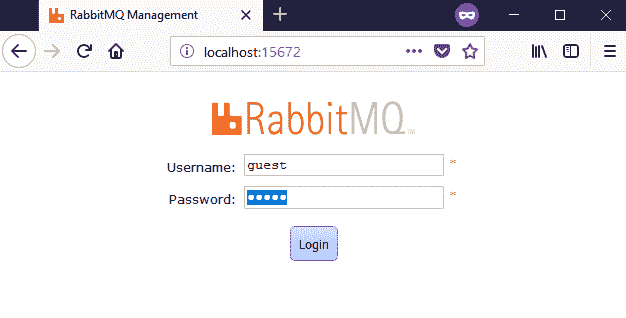

# 七、优化 Spring 消息传递

在上一章中，我们学习了使用 Hibernate 等**对象关系映射**（**ORM**框架）访问数据库的不同高级方法。我们还学习了如何在使用 ORM 时以最佳方式改进数据库访问。我们查看了 Spring 数据，以删除用于实现**数据访问对象**（**DAO**接口的样板代码。在本章的最后，我们看到了 Hibernate 的最佳实践。

在本章中，我们将了解 Spring 对消息传递的支持。消息传递是一种非常强大的技术，它有助于扩展应用，并鼓励我们解耦体系结构。

Spring 框架提供了广泛的支持，通过简化使用**Java 消息服务**（**JMS**API 异步接收消息，将消息传递系统集成到我们的应用中。消息传递解决方案可用于将消息从应用中的一个点发送到已知点，并将消息从应用中的一个点发送到许多其他未知点。这相当于分别面对面地和通过扬声器向一群人分享东西。如果我们希望将消息发送到一组未知的客户端，那么我们可以使用队列将消息广播给正在收听的人。

以下是我们将在本章中介绍的主题：

*   什么是消息传递？
*   什么是 AMQP？
*   为什么我们需要 AMQP？
*   兔子
*   Spring 消息传递配置

# 什么是消息传递？

消息传递是软件组件或应用之间的一种交互模式，其中客户端可以向任何其他客户端发送消息，也可以从任何其他客户端接收消息。

此消息交换可以使用名为**代理**的组件完成。代理提供了交换消息所需的所有支持和服务，以及与其他接口交互的能力。这些接口称为**消息中间件**（**MOM**。下图描述了基于 MOM 的消息传递系统：


消息传递系统降低了使用 AMQP、STOMP 和 XMPP 协议开发分布式应用的复杂性。让我们详细讨论一下：

*   **AMQP**：AMQP 是一种用于异步消息传递系统的开放标准层应用协议。在 AMQP 中，消息应以二进制格式传输。
*   **STOMP**：**STOMP**代表**简单面向文本的消息传递协议**。STOMP 提供了一种兼容介质，允许系统与几乎所有可用的消息代理进行通信。
*   **XMPP**：**XMPP**代表**可扩展消息和状态协议**。它是一个基于 XML 的开放标准 MOM 通信协议。

# 什么是 AMQP？

**高级消息队列协议**（**AMQP**是一个开放的标准应用层协议。传输消息的每个字节都是指定的，这允许它在许多其他语言和操作系统架构中使用。因此，这使得它成为一个跨平台兼容的协议。AMQP 由多个消息代理支持，如 RabbitMQ、ActiveMQ、Qpid 和 Solace。Spring 提供了基于 AMQP 的消息传递实现解决方案。Spring 提供了一个通过 MessageBroker 发送和接收消息的模板。

# jmsapi 的问题

JMS API 用于在 Java 平台中发送和接收消息。Spring 支持一种利用 JMS API 的简单方法，它在 JMS 层周围提供了一个附加层。该层改进了发送和接收消息的方式，还处理连接对象的创建和释放。

为了创建基于 Java 的消息传递系统，开发人员广泛使用 JMS API。使用 JMS API 的主要缺点是平台矛盾，这意味着我们可以使用 JMS API 开发与基于 Java 的应用协同工作的消息传递系统。JMS API 不支持其他编程语言。

# 为什么我们需要 AMQP？

AMQP 是这个 JMS API 问题的解决方案。使用 AMQP 的根本优势在于，它支持消息交换，而不考虑平台的兼容性和消息代理。我们可以使用任何编程语言开发消息传递系统，并且仍然可以使用基于 AMQP 的消息代理与每个系统进行通信。

# AMQP 和 JMS API 之间的差异

以下是 AMQP 和 JMS API 之间的一些重要区别：

*   平台兼容性
*   消息传递模型
*   消息数据类型
*   消息结构
*   消息路由
*   工作流策略

以下各节将更详细地解释这些问题。

# 平台兼容性

JMS 应用可以与任何操作系统一起工作，但它们只支持 Java 平台。如果我们想开发一个消息传递系统来与多个系统进行通信，那么所有这些系统都应该使用 Java 编程语言进行开发。

在使用 AMQP 时，我们可以开发一个消息传递系统，该系统可以与使用不同技术的任何系统进行通信。因此，不需要使用相同的技术开发目的地系统。

# 消息传递模型

jmsapi 为不同平台系统之间的异步消息传递提供了两种消息传递模型：点对点和发布-订阅。

AMQP 支持以下交换类型：直接交换、主题交换、扇出交换和头交换。

# 消息数据类型

JMS API 支持五种标准消息传递类型：

*   `StreamMessage`
*   `MapMessage`
*   `TextMessage`
*   `ObjectMessage`
*   `BytesMessage`

AMQP 只支持一种类型的消息二进制消息；信息只能以二进制格式传输。

# 消息结构

JMS API 消息有一个基本结构，由三部分组成：头、属性和主体。它描述了一个标准表单，该表单应该可以跨所有 JMS 提供程序移植。

AMQP 消息由四部分组成：页眉、属性、正文和页脚。

# 消息路由

对于消息路由，AMQP 同样可以用于复杂的路由方案，这可以通过路由密钥来实现，并且取决于目的地匹配标准。

JMS API 基于更复杂的路由方案，这些路由方案基于层次主题和客户端消息选择过滤器。

# 工作流策略

在 AMQP 中，生产者首先需要将消息发送到交换，然后将其传输到队列，而在 JMS 中，由于消息可以直接发送到队列或主题，因此不需要交换。

# 什么是交换、队列和绑定？

AMQP 与出版商和消费者打交道。**发布者**发送消息**消费者**接收消息。消息代理负责此机制，以确保来自发布者的消息传递给正确的使用者。消息代理使用的两个关键元素是交换和队列。下图说明了发布者如何连接到使用者：


让我们了解交换、队列和绑定术语。

# 交换

exchange 负责接收消息并将其路由到零个或多个队列中。代理的每个交换都有一个唯一的名称，以及虚拟主机中的一些其他属性。使用的消息路由算法取决于交换类型和绑定。如前所述，有四种不同类型的交换：直接交换、主题交换、扇出交换和标题交换。

# 队列

队列是消息使用者从中接收消息的组件。队列具有唯一的名称，以便系统可以引用它们。队列名称可以由应用定义，也可以在请求时由代理生成。我们不能使用以`amq.`开头的队列名称，因为它由代理保留供内部使用。

# 结合

绑定用于将队列连接到交换机。有一些标准头称为**路由密钥**头，代理使用这些头将消息与队列匹配。每个队列都有一个特定的绑定密钥，如果该密钥与路由密钥头的值匹配，则队列将接收消息。

# 引入 RabbitMQ

RabbitMQ 基于 AMQP，是使用 Erlang 编写的最广泛的轻量级、可靠、可扩展、可移植和健壮的消息代理之一。RabbitMQ 受欢迎的重要原因是它易于设置并适合云计算规模。RabbitMQ 是开源的，大多数操作系统和平台都支持它。使用 RabbitMQ 的应用可以通过平台无关的有线协议 AMQP 与其他系统通信。现在，让我们看一下如何配置 RabbitMQ。

# 设置 RabbitMQ 服务器

在开发消息传递系统之前，我们需要设置一个消息代理来处理消息的发送和接收。RabbitMQ 是 AMQP 服务器，在[免费提供 http://www.rabbitmq.com/download.html](http://www.rabbitmq.com/download.html) 。

安装 RabbitMQ 服务器后，根据安装路径，必须使用`RABBITMQ_HOME`设置以下系统变量：

```java
RABBITMQ_HOME=D:\Apps\RabbitMQ Server\rabbitmq_server-3.6.0
```

所有设置完成后，您可以使用`http://localhost:15672/`访问 RabbitMQ 控制台。

您将看到默认登录屏幕，您需要输入 guest 作为默认用户名`guest`和`guest`作为密码：



登录后，您将看到 RabbitMQ 服务器主页，您可以在其中管理队列、交换和绑定：


现在，我们将通过一个示例来了解 Spring 应用中的消息传递配置。

# Spring 消息传递配置

在开始本示例之前，我们需要了解配置消息传递应用的基本设置要求。我们将创建一个 RabbitMQ 消息传递应用，并完成配置的不同部分。在 Spring 应用中设置消息传递涉及以下步骤：

1.  为 RabbitMQ 配置 Maven 依赖项
2.  配置 RabbitMQ
3.  创建用于发送和接收消息的组件

# 为 RabbitMQ 配置 Maven 依赖项

让我们从向`pom.xml`添加 RabbitMQ 的依赖项开始。以下代码显示了要配置的依赖项：

```java
<dependency>
    <groupId>org.springframework.amqp</groupId>
    <artifactId>spring-rabbit</artifactId>
    <version>${rabbitmq.version}</version>
</dependency>
```

我们已经为 RabbitMQ 添加了依赖项。现在，让我们创建一个类来配置队列、交换和它们之间的绑定。

# 配置 RabbitMQ

现在，我们将通过配置部分了解`ConnectionFactory`、`RabbitTemplate`、`Queue`、`Exchange`、`Binding`、消息侦听器容器和消息转换器的配置。

# 配置连接工厂

对于`ConnectionFactory`接口，有一个具体的实现`CachingConnectionFactory`，默认情况下，它创建一个可由整个应用共享的连接代理。用于创建`CachingConnectionFactory`的代码如下：

```java
@Bean
public ConnectionFactory connectionFactory() {
        CachingConnectionFactory connectionFactory = new 
        CachingConnectionFactory("localhost");
        connectionFactory.setUsername("guest");
        connectionFactory.setPassword("guest");
        return connectionFactory;
}
```

我们还可以使用`CachingConnectionFactory`以及通道配置缓存连接。我们需要使用`setCacheMode()`将`cacheMode`属性设置为`CacheMode.CONNECTION`。我们还可以通过使用`setConnectionLimit()`来限制使用`connectionLimit`属性所允许的连接总数。当设置了该属性并且超过该限制时，`channelCheckoutTimeLimit`用于等待连接变为空闲。

# 配置队列

现在，我们将使用`Queue`类配置一个队列。以下代码创建具有特定名称的队列：

```java
@Bean
public Queue queue() {
    return new Queue(RABBIT_MESSAGE_QUEUE, true);
}
```

前面的`queue()`方法创建一个 AMQP 队列，该队列使用`RABBIT_MESSAGE_QUEUE`常量声明特定名称。我们还可以使用`durable`标志设置耐久性。我们需要将它与第二个构造函数参数一起作为布尔类型传递。

# 配置 exchange

现在，我们需要创建一个 AMQP 交换，消息生产者将向其发送消息。`Exchange`接口代表一个 AMQP 交换，`Exchange`接口类型有四种实现：`DirectExchange`、`TopicExchange`、`FanoutExchange`和`HeadersExchange`。我们可以根据需要使用任何交换类型。我们将使用`DirectExchange`使用以下代码：

```java
@Bean
public DirectExchange exchange() {
    return new DirectExchange(RABBIT_MESSAGE_EXCHANGE);
}
```

`exchange()`方法使用`RABBIT_MESSAGE_EXCHANGE`下定义的特定名称创建`DirectExchange`，我们也可以使用耐久性标志设置耐久性。我们需要将它与第二个构造函数参数一起作为布尔类型传递。

# 配置绑定

现在，我们需要使用`BindingBuilder`类创建一个绑定来连接`queue`到`Exchange`。以下代码用于创建绑定：

```java
@Bean
Binding exchangeBinding(DirectExchange directExchange, Queue queue) {
    return BindingBuilder.bind(queue).
        to(directExchange)
        .with(ROUTING_KEY);
}
```

`exchangeBinding()`方法使用`ROUTING_KEY`路由键值创建`queue`和`Exchange`的绑定。

# 配置 RabbitAdmin

`RabbitAdmin`用于声明启动时需要准备好的交换、队列和绑定。`RabbitAdmin`自动声明队列、交换和绑定。此自动声明的主要好处是，如果由于某种原因断开连接，它们将在重新建立连接时自动应用。以下代码配置`RabbitAdmin`：

```java
@Bean
public RabbitAdmin rabbitAdmin() {
    RabbitAdmin admin = new RabbitAdmin(connectionFactory());
    admin.declareQueue(queue());
    admin.declareExchange(exchange());
    admin.declareBinding(exchangeBinding(exchange(), queue()));
    return admin;
}
```

`rabbitAdmin()`将申报`Queue`、`Exchange`和`Binding`。`RabbitAdmin`构造函数使用`connectionFactory()`bean 创建实例，它不能是`null`。

`RabbitAdmin` performs automatic declaration only when the `CachingConnectionFactory` cache mode is `CHANNEL` (it is by default). The reason for this limitation is because it may be the case that exclusive and autodelete queues may be bound to the connection.

# 配置消息转换器

在侦听器接收到消息的准确时间，会发生两个更改步骤。在初始步骤中，使用`MessageConverter`将传入的 AMQP 消息转换为 Spring 消息`Message`。在第二步中，当执行目标方法时，如果需要，将消息的有效负载转换为参数类型。默认情况下，在初始步骤中，`MessageConverter`用作 Spring AMQP`SimpleMessageConverter`，处理到字符串和`java.io.Serializable`的转换。

在第二步中，默认情况下，`GenericMessageConverter`用于转换。我们在以下代码中使用了`Jackson2JsonMessageConverter`：

```java
@Bean
public MessageConverter messageConverter() {
    return new Jackson2JsonMessageConverter();
}
```

在下一节配置`RabbitTemplate`时，我们将使用此消息转换器作为属性来更改默认消息转换器。

# 创建 RabbitTemplate

Spring AMQP 的`RabbitTemplate`为基本 AMQP 操作提供了一切。下面的代码使用`connectionFactory`创建`RabbitTemplate`的实例：

```java
@Bean
public RabbitTemplate rabbitTemplate() {
    RabbitTemplate template = new RabbitTemplate(connectionFactory());
    template.setRoutingKey(ROUTING_KEY);
    template.setExchange(RABBIT_MESSAGE_EXCHANGE);
    template.setMessageConverter(messageConverter());
    return template;
}
```

`RabbitTemplate`充当生产者发送和消费者接收消息的助手类。

# 配置侦听器容器

要异步接收消息，最简单的方法是使用带注释的侦听器端点。我们将使用`@RabbitListener`注释作为消息`listener`端点。要创建这个`listener`端点，我们必须使用`SimpleRabbitListenerContainerFactory`类配置消息`listener`容器，这是`RabbitListenerContainerFactory`接口的实现。以下代码用于配置`SimpleRabbitListenerContainerFactory`：

```java
@Bean
public SimpleRabbitListenerContainerFactory listenerContainer() {
    SimpleRabbitListenerContainerFactory factory = new 
    SimpleRabbitListenerContainerFactory();
    factory.setConnectionFactory(connectionFactory());
    factory.setMaxConcurrentConsumers(5);
    return factory;
}
```

`listenerContainer()`方法将实例化`SimpleRabbitListenerContainerFactory`。您可以使用`setMaxConcurrentConsumers()`方法设置具有`maxConcurrentConsumers`属性的最大消费者数量。

以下是包含前面讨论的所有配置方法的类：

```java
@Configuration
@ComponentScan("com.packt.springhighperformance.ch7.bankingapp")
@EnableRabbit
public class RabbitMqConfiguration {

  public static final String RABBIT_MESSAGE_QUEUE = 
  "rabbit.queue.name";
  private static final String RABBIT_MESSAGE_EXCHANGE =     
  "rabbit.exchange.name";
  private static final String ROUTING_KEY = "messages.key";

  @Bean
  public ConnectionFactory connectionFactory() {
    CachingConnectionFactory connectionFactory = new 
    CachingConnectionFactory("127.0.0.1");
    connectionFactory.setUsername("guest");
    connectionFactory.setPassword("guest");
    return connectionFactory;
  }

  @Bean
  public Queue queue() {
    return new Queue(RABBIT_MESSAGE_QUEUE, true);
  }

  @Bean
  public DirectExchange exchange() {
    return new DirectExchange(RABBIT_MESSAGE_EXCHANGE);
  }

  @Bean
  Binding exchangeBinding(DirectExchange directExchange, Queue queue) {
    return 
    BindingBuilder.bind(queue).to(directExchange).with(ROUTING_KEY);
  }

  @Bean
  public RabbitAdmin rabbitAdmin() {
    RabbitAdmin admin = new RabbitAdmin(connectionFactory());
    admin.declareQueue(queue());
    admin.declareExchange(exchange());
    admin.declareBinding(exchangeBinding(exchange(), queue()));
    return admin;
  }

  @Bean
  public MessageConverter messageConverter() {
    return new Jackson2JsonMessageConverter();
  }

  @Bean
  public RabbitTemplate rabbitTemplate() {
    RabbitTemplate template = new RabbitTemplate(connectionFactory());
    template.setRoutingKey(ROUTING_KEY);
    template.setExchange(RABBIT_MESSAGE_EXCHANGE);
    template.setMessageConverter(messageConverter());
    return template;
  }

  @Bean
  public SimpleRabbitListenerContainerFactory listenerContainer() {
    SimpleRabbitListenerContainerFactory factory = new 
    SimpleRabbitListenerContainerFactory();
    factory.setConnectionFactory(connectionFactory());
    factory.setMaxConcurrentConsumers(5);
    return factory;
  }

}
```

# 创建消息接收器

现在，我们将创建一个带有`@RabbitListener`注释方法的`Consumer`侦听器类，该类将接收来自 RabbitMQ 的消息：

```java
@Service
public class Consumer {

  private static final Logger LOGGER = 
  Logger.getLogger(Consumer.class);

  @RabbitListener(containerFactory = "listenerContainer",
  queues = RabbitMqConfiguration.RABBIT_MESSAGE_QUEUE)
  public void onMessage(Message message) {
      LOGGER.info("Received Message: " + 
      new String(message.getBody()));
    }
}
```

这是信息`listenerContainer`类。每当生产者向`queue`发送消息时，这个类都会接收，只有带有`@RabbitListener(containerFactory = "listenerContainer", queues = RabbitMqConfiguration.RABBIT_MESSAGE_QUEUE)`注释的方法才会接收消息。在这个注释中，我们提到了`containerFactory`属性，它指向`listenerContainer`bean 中定义的消息侦听器工厂。

# 创建消息生成器

要运行此应用，我们将使用`RabbitTemplate.convertAndSend()`方法发送消息。此方法还将自定义 Java 对象转换为 AMQP 消息，并发送到 direct exchange。以下`BankAccount`类创建为自定义类，用于填充消息属性：

```java
public class BankAccount {

    private int accountId;
    private String accountType;

    public BankAccount(int accountId, String accountType) {
        this.accountId = accountId;
        this.accountType = accountType;
    }

    public int getAccountId() {
        return accountId;
    }

    public String getAccountType() {
        return accountType;
    }

    @Override
    public String toString() {
        return "BankAccount{" +
                "Account Id=" + accountId +
                ", Account Type='" + accountType + '\'' +
                '}';
    }
}
```

在下面的类中，我们将使用一些正确的值初始化前面的类，并使用`RabbitTemplate.convertAndSend()`将其发送到 exchange：

```java
public class Producer {

  private static final Logger LOGGER = 
  Logger.getLogger(Producer.class);

  @SuppressWarnings("resource")
  public static void main(String[] args) {
        ApplicationContext ctx = new 
        AnnotationConfigApplication
        Context(RabbitMqConfiguration.class);
        RabbitTemplate rabbitTemplate = 
        ctx.getBean(RabbitTemplate.class);
        LOGGER.info("Sending bank account information....");
        rabbitTemplate.convertAndSend(new BankAccount(100, "Savings 
        Account"));
        rabbitTemplate.convertAndSend(new BankAccount(101, "Current 
        Account"));

    }

}
```

当我们运行上述代码时，生产者将使用`convertAndSend()`方法发送`BankAccount`的两个对象，并显示以下输出：

```java
2018-05-13 19:46:58 INFO Producer:17 - Sending bank account information....
2018-05-13 19:46:58 INFO Consumer:17 - Received Message: {"accountId":100,"accountType":"Savings Account"}
2018-05-13 19:46:58 INFO Consumer:17 - Received Message: {"accountId":101,"accountType":"Current Account"}
```

# 使用 RabbitMQ 最大化吞吐量

以下是与最大消息传递吞吐量相关的最佳性能配置选项：

*   不要排队
*   避免使用惰性队列
*   避免持久消息
*   创建多个队列和使用者
*   将队列划分为不同的核心
*   禁用确认
*   禁用不必要的插件

# RabbitMQ 的性能和可扩展性

用 RabByMQ 实现最佳性能需要考虑很多要点：

*   有效负载消息大小
*   外汇管理
*   正确配置预取
*   兔子
*   节点聚类
*   禁用 RabbitMQ 统计信息
*   更新 RabbitMQ 库

# 总结

在本章中，我们学习了消息传递的概念。我们还介绍了使用消息传递系统的优点。我们了解了 AMQP。我们通过了解 JMS API 问题了解了 AMQP 的需求。我们还看到了 AMQP 和 JMS API 之间的差异。我们了解了与 AMQP 相关的交换、队列和绑定。我们还介绍了 RabbitMQ 的设置方面以及与 Spring 应用相关的不同配置。

在下一章中，我们将学习 Java 线程的 cover 核心概念，然后我们将讨论由`java.util.concurrent`包提供的高级线程支持。我们还将介绍`java.util.concurrent`的各种类和接口。我们将学习如何使用 Java 线程池来提高性能。我们将介绍 Spring 框架提供的有用功能，例如任务执行、调度和异步运行。最后，我们将研究使用线程的 Spring 事务管理和线程的各种最佳编程实践。