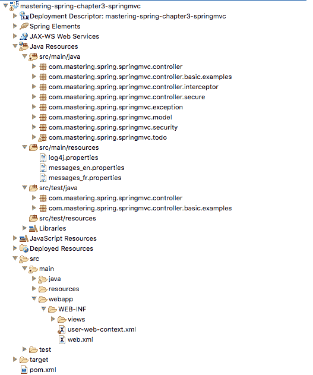
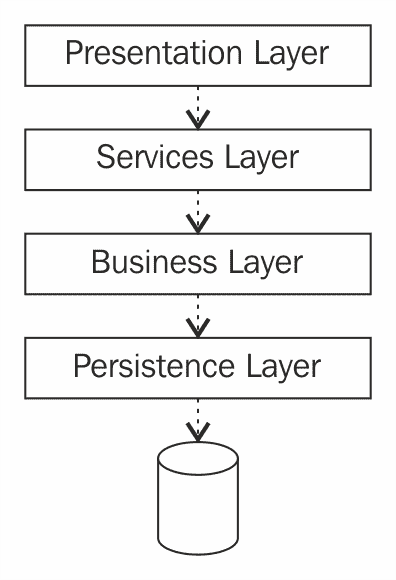
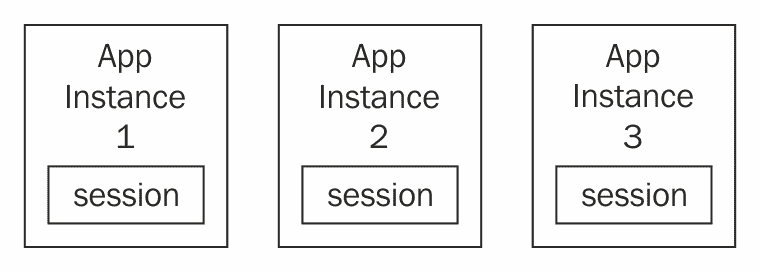
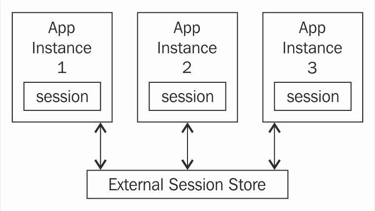

# 十二、Spring 最佳实践

在前面的章节中，我们讨论了一些 Spring 项目——SpringMVC、SpringBoot、SpringCloud、SpringCloud 数据流和 SpringResponsive。企业应用开发的挑战并不是以选择正确的框架而结束的。最大的挑战之一是框架的正确使用。

在本章中，我们将讨论使用 Spring 框架开发企业应用的最佳实践。我们讨论与以下内容相关的最佳实践：

*   企业应用的结构
*   弹簧配置
*   管理依赖项版本
*   异常处理
*   单元测试
*   集成测试
*   会话管理
*   缓存
*   登录中

# Maven 标准目录布局

Maven 为所有项目定义了一个标准的目录布局。一旦所有项目都采用这种布局，开发人员就可以轻松地在项目之间切换。

以下屏幕截图显示了 web 项目的目录布局示例：



以下是一些重要的标准目录：

*   `src/main/java`：所有与应用相关的源代码
*   `src/main/resources`：所有与应用相关的资源——Spring 上下文文件、属性文件、日志配置等
*   `src/main/webapp`：与 web 应用相关的所有资源——查看文件（JSP、查看模板、静态内容等）
*   `src/test/java`：所有单元测试代码
*   `src/test/resources`：与单元测试相关的所有资源

# 分层结构

核心设计目标之一是**关注点分离**（**SoC**）。无论应用或微服务的大小，一个好的实践是创建分层的体系结构。

分层体系结构中的每一层都有一个关注点，应该很好地实现它。分层应用也有助于简化单元测试。通过模拟下一层，可以对每一层中的代码进行完整的单元测试。下图显示了典型 microservice/web 应用中的一些重要层：



上图中显示的图层如下所示：

*   **表示层**：在微服务中，表示层是 Rest 控制器所在的层。在典型的 web 应用中，该层还将包含与视图相关的内容——JSP、模板和静态内容。表示层与服务层对话。
*   **服务层**：作为业务层的门面。不同的视图——移动、网络和平板电脑，这可能需要不同类型的数据。服务层了解他们的需求，并基于表示层提供正确的数据。
*   **业务层**：这里是所有业务逻辑的所在。另一个最佳实践是将大部分业务逻辑放入域模型中。业务层与数据层对话以获取数据并在其上添加业务逻辑。
*   **持久层**：负责检索数据并将数据存储到数据库中。该层通常包含 JPA 映射或 JDBC 代码。

# 建议做法

建议您为每个层设置不同的 Spring 上下文。这有助于分离每一层的关注点。这也有助于特定层的单元测试代码。

应用`context.xml`可用于从所有层导入上下文。这可以是应用运行时加载的上下文。下面列出了一些可能的 spring 上下文名称：

*   `application-context.xml`
*   `presentation-context.xml`
*   `services-context.xml`
*   `business-context.xml`
*   `persistence-context.xml`

# 重要层的单独 API 和 impl

确保松耦合应用层的另一个最佳实践是在每一层中有单独的 API 和实现模块。以下屏幕截图显示了包含两个子模块（API 和 impl）的数据层：


数据`pom.xml`定义了两个子模块：

```java
    <modules>
      <module>api</module>
      <module>impl</module>
    </modules>
```

`api`模块用于定义数据层提供的接口。`impl`模块用于创建实现。

业务层应该使用来自数据层的 API 构建。业务层不应该依赖于数据层的实现（T0 模块）。这有助于在两层之间创建清晰的分隔。数据层的实现可以在不影响业务层的情况下进行更改。

下面的代码片段显示了从业务层的`pom.xml`文件中提取的内容：

```java
    <dependency>
      <groupId>com.in28minutes.example.layering</groupId>
      <artifactId>data-api</artifactId>
    </dependency>

    <dependency>
      <groupId>com.in28minutes.example.layering</groupId>
      <artifactId>data-impl</artifactId>
      <scope>runtime</scope>
    </dependency>
```

虽然`data-api`依赖项具有默认作用域--compile，`data-impl`依赖项具有作用域运行时。这确保了`data-impl`模块在业务层编译期间不可用。

虽然所有层都可以实现单独的`API`和`impl`，但建议您至少在业务层使用它。

# 异常处理

有两种类型的例外情况：

*   **已检查异常**：当服务方法抛出此异常时，所有使用者方法都应处理或抛出该异常
*   **未检查异常**：不要求使用者方法处理或抛出服务方法抛出的异常

`RuntimeException`及其所有子类都是未检查的异常。所有其他异常都是选中的异常。

选中的异常会使您的代码难以阅读。请看以下示例：

```java
    PreparedStatement st = null;
    try {
        st = conn.prepareStatement(INSERT_TODO_QUERY);
        st.setString(1, bean.getDescription());
        st.setBoolean(2, bean.isDone());
        st.execute();
        } catch (SQLException e) {
          logger.error("Failed : " + INSERT_TODO_QUERY, e);
          } finally {
            if (st != null) {
              try {
                st.close();
                } catch (SQLException e) {
                // Ignore - nothing to do..
                }
          }
      }
```

`PreparedStatement`类中 execute 方法的声明如下：

```java
    boolean execute() throws SQLException
```

`SQLException`是已检查的异常。因此，任何调用`execute()`方法的方法都应该处理异常或抛出异常。在前面的示例中，我们使用一个`try-catch`块处理异常。

# Spring 的异常处理方法

Spring 对这个问题采取了不同的方法。它使大多数异常未经检查。代码变得很简单：

```java
    jdbcTemplate.update(INSERT_TODO_QUERY, 
    bean.getDescription(),bean.isDone());
```

`JDBCTemplate`中的更新方法没有声明抛出任何异常。

# 建议的方法

我们推荐一种与 Spring 框架使用的方法非常相似的方法。在决定从方法中抛出哪些异常时，请始终考虑该方法的使用者。

该方法的使用者可以对异常做些什么吗？

在前面的示例中，如果查询执行失败，`consumer`方法将无法执行任何操作，除非向用户显示错误页面。在这种情况下，我们不应该使事情复杂化，并强迫消费者处理异常。

我们建议采用以下方法处理应用中的异常：

*   想想消费者。如果该方法的使用者无法对异常执行任何有用的操作（除了记录或显示错误页面），请将其取消选中。
*   在最顶层，通常是表示层，具有`catch all`异常处理以显示错误页面或向使用者发送错误响应。请参阅[第三章](03.html)*中的`@ControllerAdvice`使用 Spring MVC*构建 Web 应用，了解更多关于实现捕获所有异常处理的详细信息。

# 保持 Spring 配置的轻量级

SpringBefore 注释的问题之一是应用上下文 XML 文件的大小。应用上下文 XML 文件运行了数百行（有时甚至数千行）。但是，有了注释，就不再需要如此长的应用上下文 XML 文件了。

我们建议您使用组件扫描来定位和自动连接 bean，而不是在 XML 文件中手动连接 bean。保持应用上下文 XML 文件非常小。我们建议您在需要一些与框架相关的配置时使用 Java`@Configuration`。

# 在 ComponentScan 中使用 basePackageClasses 属性

使用组件扫描时，建议您使用`basePackageClasses`属性。以下代码段显示了一个示例：

```java
    @ComponentScan(basePackageClasses = ApplicationController.class) 
    public class SomeApplication {
```

`basePackageClasses`属性是`basePackages()`的类型安全替代项，用于指定要扫描带注释组件的包。将扫描每个指定类的包。

这将确保即使在重命名或移动包时，组件扫描也能按预期工作。

# 在架构引用中不使用版本号

Spring 可以从依赖项中识别模式的正确版本。因此，不再需要在模式引用中使用版本号。类代码段显示了一个示例：

```java
    <?xml version="1.0" encoding="UTF-8"?>
    <beans 
      xmlns:xsi="http://www.w3.org/2001/XMLSchema-instance"
      xmlns:context="http://www.springframework.org/schema/context"
      xsi:schemaLocation="http://www.springframework.org/schema/beans
      http://www.springframework.org/schema/beans/spring-beans.xsd
      http://www.springframework.org/schema/context/
      http://www.springframework.org/schema/context/spring-
      context.xsd">
      <!-- Other bean definitions-->
    </beans>
```

# 对于强制依赖项，首选构造函数注入而不是 setter 注入

bean 有两种依赖关系：

*   **强制依赖项**：这些是您希望对 bean 可用的依赖项。如果依赖项不可用，则希望上下文加载失败。
*   **可选依赖项**：这些依赖项是可选的。它们并不总是可用的。即使上下文不可用，也可以加载上下文。

我们建议您使用构造函数注入而不是 setter 注入连接强制依赖项。这将确保在缺少强制依赖项时无法加载上下文。以下代码段显示了一个示例：

```java
    public class SomeClass {
      private MandatoryDependency mandatoryDependency
      private OptionalDependency optionalDependency;
      public SomeClass(MandatoryDependency mandatoryDependency) {
      this.mandatoryDependency = mandatoryDependency;
    }
    public void setOptionalDependency(
    OptionalDependency optionalDependency) {
      this.optionalDependency = optionalDependency;
    }
    //All other logic
   }
```

Spring 文档的摘录（[https://docs.spring.io/spring/docs/current/spring-framework-reference/htmlsingle/#beans-建造师注入](https://docs.spring.io/spring/docs/current/spring-framework-reference/htmlsingle/#beans-constructor-injection)如下所示：

Spring 团队通常提倡构造函数注入，因为它使人们能够将应用组件实现为不可变对象，并确保所需的依赖项不为 null。此外，构造函数注入的组件总是以完全初始化的状态返回给客户机（调用）代码。作为旁注，大量构造函数参数是一种糟糕的代码味道，这意味着类可能有太多的责任，应该进行重构以更好地解决问题的适当分离。Setter 注入应该主要用于可选的依赖项，这些依赖项可以在类中分配合理的默认值。否则，必须在代码使用依赖项的任何地方执行非空检查。setter 注入的一个好处是 setter 方法使该类的对象易于以后重新配置或重新注入。因此，通过[JMX MBeans](https://docs.spring.io/spring/docs/current/spring-framework-reference/htmlsingle/#jmx)进行管理是 setter 注入的一个引人注目的用例。

# 管理 Spring 项目的依赖版本

如果您使用的是 Spring Boot，那么管理依赖版本的最简单选项是使用`spring-boot-starter-parent`作为父 POM。这是我们在本书所有项目示例中使用的选项：

```java
    <parent>
      <groupId>org.springframework.boot</groupId>
      <artifactId>spring-boot-starter-parent</artifactId>
      <version>${spring-boot.version}</version>
      <relativePath /> <!-- lookup parent from repository -->
    </parent>
```

`spring-boot-starter-parent`管理 200 多个依赖项的版本。在 Spring 启动发布之前，确保这些依赖项的所有版本都能很好地协同工作。以下是一些受管理的依赖项版本：

```java
<activemq.version>5.14.3</activemq.version>
 <ehcache.version>2.10.3</ehcache.version>
 <elasticsearch.version>2.4.4</elasticsearch.version>
 <h2.version>1.4.193</h2.version>
 <jackson.version>2.8.7</jackson.version>
 <jersey.version>2.25.1</jersey.version>
 <junit.version>4.12</junit.version>
 <mockito.version>1.10.19</mockito.version>
 <mongodb.version>3.4.2</mongodb.version>
 <mysql.version>5.1.41</mysql.version>
 <reactor.version>2.0.8.RELEASE</reactor.version>
 <reactor-spring.version>2.0.7.RELEASE</reactor-spring.version>
 <selenium.version>2.53.1</selenium.version>
 <spring.version>4.3.7.RELEASE</spring.version>
 <spring-amqp.version>1.7.1.RELEASE</spring-amqp.version>
 <spring-cloud-connectors.version>1.2.3.RELEASE</spring-cloud-connectors.version>
 <spring-batch.version>3.0.7.RELEASE</spring-batch.version>
 <spring-hateoas.version>0.23.0.RELEASE</spring-hateoas.version>
 <spring-kafka.version>1.1.3.RELEASE</spring-kafka.version>
 <spring-restdocs.version>1.1.2.RELEASE</spring-restdocs.version>
 <spring-security.version>4.2.2.RELEASE</spring-security.version>
<thymeleaf.version>2.1.5.RELEASE</thymeleaf.version>
```

建议不要覆盖项目 POM 文件中托管依赖项的任何版本。这确保了当我们升级 Spring 启动版本时，我们将获得所有依赖项的最新版本升级。

有时，您必须使用自定义的公司 POM 作为父 POM。以下代码段显示了如何在此场景中管理依赖项版本：

```java
    <dependencyManagement>
      <dependencies>
        <dependency>
          <groupId>org.springframework.boot</groupId>
          <artifactId>spring-boot-dependencies</artifactId>
          <version>${spring-boot.version}</version>
          <type>pom</type>
          <scope>import</scope>
        </dependency>
      </dependencies>
    </dependencyManagement>
```

如果未使用 Spring Boot，则可以使用 Spring BOM 管理所有基本 Spring 依赖项：

```java
    <dependencyManagement>
      <dependencies>
        <dependency>
          <groupId>org.springframework</groupId>
          <artifactId>spring-framework-bom</artifactId>
          <version>${org.springframework-version}</version>
          <type>pom</type>
          <scope>import</scope>
        </dependency>
      </dependencies>
    </dependencyManagement>
```

# 单元测试

虽然单元测试的基本目标是发现缺陷，但为每一层编写单元测试的方法是不同的。在本节中，我们将快速查看不同层的单元测试示例和最佳实践。

# 业务层

在为业务层编写测试时，我们建议您避免在单元测试中使用 Spring 框架。这将确保您的测试独立于框架，并且运行得更快。

以下是未使用 Spring 框架编写的单元测试示例：

```java
    @RunWith(MockitoJUnitRunner.class)
    public class BusinessServiceMockitoTest {
      private static final User DUMMY_USER = new User("dummy");
      @Mock
      private DataService dataService;
      @InjectMocks
      private BusinessService service = new BusinessServiceImpl();
      @Test
      public void testCalculateSum() {
        BDDMockito.given(dataService.retrieveData(
        Matchers.any(User.class)))
        .willReturn(Arrays.asList(
        new Data(10), new Data(15), new Data(25)));
        long sum = service.calculateSum(DUMMY_USER);
        assertEquals(10 + 15 + 25, sum);
       }
     }
```

Spring 框架用于连接正在运行的应用中的依赖项。但是，在单元测试中，将`@InjectMocks`Mockito 注释与`@Mock`结合使用是最好的选择。

# Web 层

web 层的单元测试包括测试控制器——REST 和其他。

我们建议如下：

*   对基于 SpringMVC 构建的 web 层使用模拟 MVC
*   Jersey 测试框架对于使用 Jersey 和 JAX-RS 构建的 REST 服务来说是一个不错的选择

设置模拟 MVC 框架的快速示例如下所示：

```java
    @RunWith(SpringRunner.class)
    @WebMvcTest(TodoController.class)
    public class TodoControllerTest {
      @Autowired
      private MockMvc mvc;
      @MockBean
      private TodoService service;
      //Tests
    }
```

使用`@WebMvcTest`将允许我们使用 autowire`MockMvc`并执行 web 请求。`@WebMVCTest`的一大特点是它只实例化控制器组件。所有其他弹簧组件均应模拟，并可使用`@MockBean`自动连接。

# 数据层

Spring Boot 为数据层单元测试提供了一个简单的注释`@DataJpaTest`。下面列出了一个简单的示例：

```java
    @DataJpaTest
    @RunWith(SpringRunner.class)
    public class UserRepositoryTest {
      @Autowired
      UserRepository userRepository;
      @Autowired
      TestEntityManager entityManager;
     //Test Methods
    }
```

`@DataJpaTest`还可以注入`TestEntityManager`bean，它提供了专门为测试设计的标准 JPA`entityManager`的替代品。

如果您想在`@DataJpaTest`之外使用`TestEntityManager`，也可以使用`@AutoConfigureTestEntityManager`注释。

默认情况下，数据 JPA 测试是针对嵌入式数据库运行的。这确保了测试可以在不影响数据库的情况下运行任意次数。

# 其他最佳做法

我们建议您遵循测试驱动开发（TDD）方法来开发代码。在编写代码之前编写测试可以清楚地理解所编写代码单元的复杂性和依赖性。根据我的经验，这将导致更好的设计和更好的代码。

我从事的最好的项目都认识到单元测试比源代码更重要。应用不断发展。几年前的体系结构是今天遗留下来的。通过进行出色的单元测试，我们可以不断地重构和改进我们的项目。

以下列出了一些准则：

*   单元测试应该是可读的。其他开发人员应该能够在 15 秒内理解测试。以用作代码文档的测试为目标。
*   只有当生产代码中存在缺陷时，单元测试才会失败。这似乎很简单。然而，如果单元测试使用外部数据，当外部数据发生变化时，它们可能会失败。经过一段时间，开发人员对单元测试失去信心。
*   单元测试应该运行得很快。缓慢的测试很少运行，失去了与单元测试相关的所有好处。
*   单元测试应该作为持续集成的一部分运行。一旦版本控制中有提交，构建（带有单元测试）就应该运行，并在失败时通知开发人员。

# 集成测试

当单元测试测试一个特定的层时，集成测试用于测试多个层中的代码。为了保持测试的可重复性，我们建议您使用嵌入式数据库而不是真正的数据库进行集成测试。

我们建议您使用嵌入式数据库为集成测试创建单独的概要文件。这确保每个开发人员都有自己的数据库来运行测试。让我们看几个简单的例子。

`application.properties`文件：

```java
    app.profiles.active: production
```

`application-production.properties`文件：

```java
    app.jpa.database: MYSQL
    app.datasource.url: <<VALUE>>
    app.datasource.username: <<VALUE>>
    app.datasource.password: <<VALUE>>
```

`application-integration-test.properties`文件：

```java
    app.jpa.database: H2
    app.datasource.url=jdbc:h2:mem:mydb
    app.datasource.username=sa
    app.datasource.pool-size=30
```

我们需要在测试范围中包含 H2 驱动程序依赖项，如以下代码段所示：

```java
    <dependency>
      <groupId>mysql</groupId>
      <artifactId>mysql-connector-java</artifactId>
      <scope>runtime</scope>
   </dependency>

   <dependency>
     <groupId>com.h2database</groupId>
     <artifactId>h2</artifactId>
     <scope>test</scope>
   </dependency>
```

使用`@ActiveProfiles("integration-test")`的集成测试示例如下所示。集成测试现在将使用嵌入式数据库运行：

```java
    @ActiveProfiles("integration-test")
    @RunWith(SpringRunner.class)
    @SpringBootTest(classes = Application.class, webEnvironment =    
    SpringBootTest.WebEnvironment.RANDOM_PORT)
    public class TodoControllerIT {
      @LocalServerPort
      private int port;
      private TestRestTemplate template = new TestRestTemplate();
      //Tests
    }
```

集成测试对于能够持续交付工作软件至关重要。Spring Boot 提供的特性使实现集成测试变得容易。

# Spring 会议

管理会话状态是分发和扩展 web 应用的重要挑战之一。HTTP 是一种无状态协议。用户与 web 应用的交互状态通常在 HttpSession 中进行管理。

会话中尽可能少的数据很重要。重点是识别和删除会话中不需要的数据。

考虑一个具有三个实例的分布式应用，如这里所示。每个实例都有自己的本地会话副本：



假设用户当前正从`App Instance 1`获得服务。想象一下，如果`App Instance 1`发生故障，负载平衡器将用户发送到`App Instance 2`。`App Instance 2`不知道`App Instance 1`可用的会话状态。用户必须登录并重新启动。这不是一个好的用户体验。

Spring 会话提供了将会话存储外部化的功能。Spring 会话不使用本地 HttpSession，而是提供了将会话状态存储到不同数据存储的替代方案：



Spring 会议还提供了明确的关注点分离。应用代码保持不变，与正在使用的会话数据存储无关。我们可以通过配置在会话数据存储之间切换。

# 实例

在本例中，我们将连接 Spring 会话以使用 Redis 会话存储。虽然将数据放入会话的代码保持不变，但数据将存储到 Redis 而不是 HTTP 会话。

其中包括三个简单步骤：

1.  为 Spring 会话添加依赖项。
2.  配置筛选器以将 HttpSession 替换为 Spring 会话。
3.  通过扩展`AbstractHttpSessionApplicationInitializer`为 Tomcat 启用筛选。

# 为 Spring 会话添加依赖项

Spring 会话连接到 Redis 商店所需的依赖项为`spring-session-data-redis`和`lettuce-core`：

```java
    <dependency>
      <groupId>org.springframework.session</groupId>
      <artifactId>spring-session-data-redis</artifactId>
      <type>pom</type>
    </dependency>

   <dependency>
     <groupId>io.lettuce</groupId>
     <artifactId>lettuce-core</artifactId>
   </dependency>
```

# 配置筛选器以将 HttpSession 替换为 Spring 会话

下面的配置创建了一个 Servlet 过滤器，用 Spring 会话的会话实现替换`HTTPSession`——本例中的 Redis Data Store：

```java
    @EnableRedisHttpSession 
    public class ApplicationConfiguration {
      @Bean 
      public LettuceConnectionFactory connectionFactory() {
        return new LettuceConnectionFactory(); 
      } 
   }
```

# 通过扩展 AbstractHttpSessionApplicationInitializer 为 Tomcat 启用筛选

在上一步中，需要在对 Servlet 容器（Tomcat）的每个请求上启用 Servlet 过滤器。以下代码段显示了所涉及的代码：

```java
    public class Initializer 
    extends AbstractHttpSessionApplicationInitializer {
      public Initializer() {
        super(ApplicationConfiguration.class); 
      }
    }
```

这就是您需要的所有配置。Spring 会话的好处在于，与`HTTPSession`对话的应用代码不会改变！您可以继续使用 HttpSession 接口，但在后台，Spring Session 确保会话数据存储到外部数据存储中—在本例中为 Redis：

```java
    req.getSession().setAttribute(name, value);
```

Spring 会话提供了连接到外部会话存储的简单选项。在外部会话存储上备份会话可确保用户即使在某个应用实例出现故障时也可以进行故障转移。

# 缓存

缓存对于构建高性能应用至关重要。您不希望一直访问外部服务或数据库。可以缓存不经常更改的数据。

Spring 提供了连接和使用缓存的透明机制。在应用上启用缓存涉及以下步骤：

1.  添加 springbootstarter 缓存依赖项。
2.  添加缓存注释。

让我们详细讨论这些问题。

# 添加 Spring 启动程序缓存依赖项

下面的代码片段显示了`spring-boot-starter-cache`依赖关系。Itt 提供了配置缓存所需的所有依赖项和自动配置：

```java
    <dependency>
      <groupId>org.springframework.boot</groupId>
      <artifactId>spring-boot-starter-cache</artifactId>
    </dependency>
```

# 添加缓存注释

下一步是添加缓存注释，指示何时需要在缓存中添加或删除某些内容。以下代码段显示了一个示例：

```java
    @Component
    public class ExampleRepository implements Repository {
      @Override
      @Cacheable("something-cache-key")
      public Something getSomething(String id) {
          //Other code
      }
    }
```

支持的一些注释如下所示：

*   `Cacheable`：用于缓存方法调用的结果。默认实现基于传递给方法的参数构造键。如果在缓存中找到该值，则不会调用该方法。
*   `CachePut`：与`@Cacheable`类似。一个显著的区别是始终调用该方法，并将结果放入缓存中。
*   `CacheEvict`：为缓存中的特定元素触发逐出。通常在删除或更新元素时执行。

关于 Spring 缓存，还需要注意以下几点：

*   使用的默认缓存是 ConcurrentHashMap
*   Spring 缓存抽象符合 JSR-107
*   可以自动配置的其他缓存包括 EhCache、Redis 和 Hazelcast

# 登录中

Spring 和 SpringBoot 依赖于 Commons 日志 API。它们不依赖于任何其他日志框架。SpringBoot 提供了简化特定日志框架配置的启动器。

# 倒退

Starter`spring-boot-starter-logging`是使用 Logback 框架所需的全部内容。此依赖关系是大多数启动器中包括的默认日志记录，包括`spring-boot-starter-web`。依赖关系如下所示：

```java
    <dependency>
      <groupId>org.springframework.boot</groupId>
      <artifactId>spring-boot-starter-logging</artifactId>
    </dependency>
```

以下代码段显示了`spring-boot-starter-logging`中包含的回登录和相关依赖项：

```java
    <dependency>
      <groupId>ch.qos.logback</groupId>
      <artifactId>logback-classic</artifactId>
    </dependency>

    <dependency>
      <groupId>org.slf4j</groupId>
      <artifactId>jcl-over-slf4j</artifactId>
    </dependency>

    <dependency>
      <groupId>org.slf4j</groupId>
      <artifactId>jul-to-slf4j</artifactId>
    </dependency>

    <dependency>
      <groupId>org.slf4j</groupId>
      <artifactId>log4j-over-slf4j</artifactId>
    </dependency>
```

# Log4j2

要使用 Log4j2，我们需要使用启动器`spring-boot-starter-log4j2`。当我们使用诸如`spring-boot-starter-web`之类的启动器时，我们需要确保排除`spring-boot-starter-logging`中的依赖项。以下代码段显示了详细信息：

```java
    <dependency>
      <groupId>org.springframework.boot</groupId>
      <artifactId>spring-boot-starter</artifactId>
      <exclusions>
        <exclusion>
          <groupId>org.springframework.boot</groupId>
          <artifactId>spring-boot-starter-logging</artifactId>
        </exclusion>
       </exclusions>
    </dependency>

    <dependency>
      <groupId>org.springframework.boot</groupId>
      <artifactId>spring-boot-starter-log4j2</artifactId>
    </dependency>
```

以下代码段显示了`spring-boot-starter-log4j2`启动器中使用的依赖项：

```java
    <dependency>
      <groupId>org.apache.logging.log4j</groupId>
      <artifactId>log4j-slf4j-impl</artifactId>
    </dependency>

   <dependency>
     <groupId>org.apache.logging.log4j</groupId>
     <artifactId>log4j-api</artifactId>
   </dependency>

   <dependency>
     <groupId>org.apache.logging.log4j</groupId>
     <artifactId>log4j-core</artifactId>
   </dependency>

  <dependency>
    <groupId>org.slf4j</groupId>
    <artifactId>jul-to-slf4j</artifactId>
  </dependency>
```

# 框架无关配置

无论使用何种日志框架，Spring Boot 都允许在应用属性中使用一些基本配置选项。以下是一些示例：

```java
   logging.level.org.springframework.web=DEBUG
   logging.level.org.hibernate=ERROR 
   logging.file=<<PATH_TO_LOG_FILE>>
```

在微服务时代，无论您使用何种框架进行日志记录，我们建议您登录到控制台（而不是文件），并使用集中式日志存储工具从所有微服务实例捕获日志。

# 总结

在本章中，我们介绍了开发基于 Spring 的应用的一些最佳实践。我们介绍了构建项目的最佳实践——分层、遵循 Maven 标准目录布局以及使用`api`和实现模块。我们还讨论了如何将 Spring 配置保持在最低限度。我们研究了与日志记录、缓存、会话管理和异常处理相关的最佳实践。