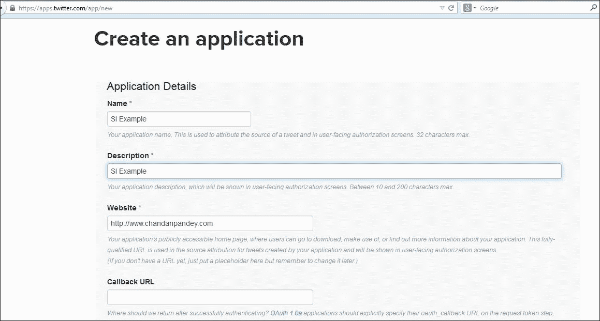
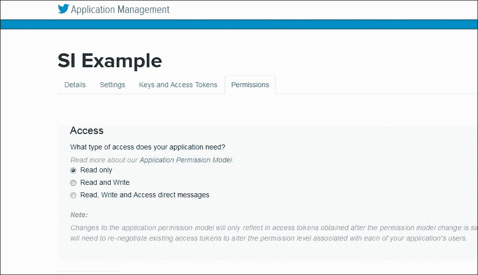

# 六、与外部系统的集成

在前一章中，我们讨论了帮助系统内部消息流的 Spring 集成组件。在本章中，让我们更进一步，看看 Spring Integration 在面对现实世界的集成挑战时有哪些优势。我们将介绍 Spring Integration 对外部组件的支持，并将详细介绍以下主题：

*   使用文件
*   FTP/FTPS 上的文件交换
*   社会融合
*   企业消息传递
*   调用和使用 HTTP 端点
*   网络服务
*   数据库集成
*   流动

# 处理文件

最常见和最原始的通信方式之一是通过文件。即使在引入数据库之后，文件系统也没有失去它的相关性，我们经常需要在遗留应用程序中处理它们，例如转储报告、共享位置等等。

那么，如何使用 Java 中的文件呢？获取文件句柄，打开一个流，处理它，然后关闭它。一些琐碎的东西需要 10-15 行代码。但是，如果忘记关闭流或者引用的文件已被删除，该怎么办？当我们处理所有角落的情况时，代码行会不断增加。Spring 集成对文件有很好的支持。它提供了适配器和网关，可以用最少的代码行处理文件读写操作。

## 先决条件

要使用前面提到的文件组件，我们需要以以下方式声明 Spring 命名空间支持和 Maven 条目：

*   可以使用以下代码段添加命名空间支持：

    ```java
    xmlns:int-file 
      ="http://www.springframework.org/schema/integration/file"
    xsi:schemaLocation= 
    "http://www.springframework.org/schema/integration/file http://www.springframework.org/schema/integration/file/spring-integration-file.xsd">
    ```

*   可以使用以下代码段添加 Maven 条目：

    ```java
    <dependency>
        <groupId>org.springframework.integration</groupId>
        <artifactId>spring-integration-file</artifactId>
        <version>${spring.integration.version}</version>
    </dependency>
    ```

我们现在可以开始编写 Spring 集成文件组件了。让我们根据两种类型的操作讨论 Spring 对文件的支持：读取文件和写入文件。

## 读取文件

Spring Integration 提供了一个适配器，可以从目录中读取文件，并将其作为通道上的`Message<File>`提供给其他消费者使用。让我们看一个代码段，看看它是如何配置的：

```java
<int-file:inbound-channel-adapter 
  id="fileAdapter" 
  directory="C:\Chandan\Projects\inputfolderforsi" 
  channel="filesOutputChannel" 
  prevent-duplicates="true" 
  filename-pattern="*.txt">
    <int:poller fixed-rate="1000" />
    <int-file:nio-locker/>
  </int-file:inbound-channel-adapter>
```

上述配置足以从*目录*读取文件，并将其放在指定的*通道*上。让我们看看这些元素：

*   `int-file:inbound-channel-adapter`：这是文件支持的名称空间
*   `directory`：这是读取文件的目录
*   `channel`：这是写入文件的通道
*   `prevent-duplicates`：如果启用此选项，则先前运行中已拾取的文件不会再次拾取
*   `filename-pattern`：这是应该拾取的文件的名称模式
*   `int:poller`：这是应该轮询文件的速率
*   `int-file:nio-locker`：如果有多个使用者，则会锁定文件，以便不会同时拾取相同的文件

您一定已经意识到，尽管配置很简单，但很多事情都在幕后进行，例如防止重复、过滤文件、避免并发访问等等。我们将详细讨论这些，但在此之前，让我们先看一看这个适配器幕后的类。

### 幕后

上例中声明的适配器利用`FileReadingMessageSource`，这是`MessageSource`的一个实现。它根据目录中的文件创建消息，如下所示：

```java
<bean 
  id="pollableFileSource" 
  class="org.springframework.integration.file.
    FileReadingMessageSource" 
  p:directory="C:\Chandan\Projects\inputfolderforsi" />
```

在 bean 声明级别，我们可以注入过滤器、锁定机制等等，但由于我们使用的是 Spring 集成，所以我们不必在 bean 声明级别工作。相反，我们可以使用 Spring 集成公开的适配器。

### 过滤器

过滤器是一个功能强大的概念，可用于防止重复，根据名称模式选择文件，自定义读取的文件列表，并在将所需内容呈现给下一个端点之前执行更多拦截。大多数常见任务都有预定义的过滤器可用，但本着 spring 的真正精神，我们也可以自定义实现，并将它们注入 spring 集成提供的适配器中。过滤器必须是`FileListFilter`的实例，使用的默认过滤器为`AcceptOnceFileListFilter`。此筛选器跟踪已处理的文件，但实现在内存中。这意味着，如果服务器在处理文件时重新启动，它将无法跟踪已处理的文件，并将重新读取相同的文件。为了解决这个问题，应该使用一个`FileSystemPersistentAcceptOnceFileListFilter`实例，它将利用`MetadataStore`实现跟踪处理过的文件。

此外，文件名模式和`Reg Ex`过滤器可用，可用于根据文件名或通过将文件名与指定的`Reg Ex`匹配来过滤文件。让我们看一个显示这两个过滤器使用情况的快速示例：

```java
<int-file:inbound-channel-adapter 
  id="filestest1"
  directory="file:${input.directory}"
  filename-pattern="testing*" />

<int-file:inbound-channel-adapter 
  id="filestest2"
  directory="file:${input.directory}"
  filename-regex="testing[0-9]+\.jpg" />
```

假设我们想要一个自定义过滤器，它可以很容易地定义和使用。代码如下：

```java
public class CustomFilter implements FileListFilter<Feed> {
  public List< Feed > filterFiles(Feed [] feeds) {
    List< Feed > filteredList = new ArrayList< Feed >();
    // implement your filtering logic here
    return filteredList;
  }
}
```

### 防止重复

防止重复是过滤器的一个子集，用于过滤已拾取的文件。使用`prevent-duplicates`，我们可以指示适配器仅查找唯一的文件。这里唯一的问题是重复检查仅限于会话，因为读卡器不存储任何状态。如果读取器重新启动，它将再次读取所有文件，即使这些文件先前已被读取。

### 并发访问

这是具有多个使用者的企业中非常常见的用例，我们希望保持所使用文件的完整性。我们可以通过以下方式使用`java.nio`锁柜来锁定文件，以确保不会同时访问这些文件：

```java
<int-file:inbound-channel-adapter 
  id="fileReader"
  directory="C:\Chandan\Projects\inputfolderforsi"  
  prevent-duplicates="true">
    <int-file:nio-locker/>
</int-file:inbound-channel-adapter>
```

本规范不限制我们仅使用`java.nio.locker`。除了使用`java.nio`储物柜，我们还可以提供定制储物柜：

```java
<int-file:inbound-channel-adapter 
  id="fileAdapter"
  directory="C:\Chandan\Projects\inputfolderforsi" 
  prevent-duplicates="true">
  <int-file:locker ref="customLocker"/>
</int-file:inbound-channel-adapter>
```

### 提示

解锁并不明确。通过调用`FileLocker.unlock(File file)`执行；否则，它将导致在这段时间内内存泄漏。

## 写入文件

Spring 集成提供出站适配器，与入站适配器相反。这意味着它使用通道中的文件并将其写入目录。在内部，Spring Integration 使用一个`FileWritingMessageHandler`实例将消息写入文件系统，并且可以使用此类的实现。此类可以处理文件、字符串或字节数组有效载荷。像往常一样，没有必要使用低级类；相反，可以使用 spring 公开的适配器和网关。让我们将出站适配器连接到入站适配器写入文件的通道：

```java
<int-file:outbound-channel-adapter 
  channel="filesOutputChannel" directory="C:\Chandan\Projects\outputfolderforsi" 
  delete-source-files="true"/>
```

让我们讨论每个元素代表什么：

*   `int-file:outbound-channel-adapter`：为出站通道适配器提供文件命名空间支持
*   `channel`：这是将文件写入 Spring 集成消息的通道
*   `directory`：这是从中拾取文件的目录
*   `delete-source-files`：如果设置为 true，则处理后会删除文件

在编写文件时，我们需要考虑的是新文件的名称、应该写入的目录、原始文件应该做什么等等。让我们快速讨论一下这些方面。

### 命名文件

默认情况下，文件写入目录时会保留文件的名称。但是，这可以通过提供一个实现`FileNameGenerator`来覆盖。这是默认情况下负责生成文件名的类`FileNameGenerator`查找其键与常量`FileHeaders.FILENAME`匹配的消息头。

### 目标目录

定位目标目录的方式主要有三种：

*   静态定义一个目录属性，该属性将把每条消息定向到一个固定目录。
*   定义一个目录表达式属性，该属性应该是有效的**Spring 表达式语言**（**SpEL**表达式）。此表达式针对每个消息进行计算，消息头可用于动态指定输出文件目录。表达式必须解析为字符串或`java.io.File`，并且必须指向有效目录。
*   最后一个选项是自动创建目录。如果缺少目标目录，将自动创建它，包括其父目录。这是默认行为；要禁用此功能，请将`auto-create-directory`属性设置为`false`。

### 处理现有文件名

如果正在写入的文件已经存在怎么办？正确的路线是使用`mode`属性。以下四个选项之一可用：

*   `REPLACE`：此为默认模式。如果文件已经存在，它将被简单地覆盖。
*   `APPEND`：此将传入文件的内容附加到现有文件中。
*   `FAIL`：如果预计不存在副本，则应使用此模式。如果文件已经存在，则会抛出`MessageHandlingException`。
*   `IGNORE`：如果目标文件存在，不需要采取动作，则使用此选项。

到目前为止，我们已经讨论了文件系统的大部分方面。但是，如果我们想在消息写入目录后处理它呢？Spring 集成提供了一个出站网关，在这里非常方便。让我们看一看这个简单的例子：

```java
<int-file:outbound-gateway 
  request-channel="filesOutputChannel"
  reply-channel="filesOutputChannelGateway"
  directory="C:\Chandan\Projects\outputfolderforsi\filegateway"
  mode="REPLACE" delete-source-files="true"/>
```

标签与输出适配器的标签相同；区别在于它将文件放在`reply-channel`指定的通道上进行进一步处理。

让我们编写一个简单的服务激活器来处理这些文件：

```java
<int:service-activator 
  id="fileSa" 
  ref="commonServiceActivator"
  method="printFileName" input-channel="filesOutputChannelGateway"/>
```

### 文件转换器

文件转换器用于将从文件读取的数据转换为对象，反之亦然。SpringIntegration 提供了一些常见的转换器，如文件到字节、文件到字符串等，但我们始终可以扩展框架接口来定义更高级、更合适的文件转换器。

让我们通过快速讨论 spring 提供的一些隐式文件转换器来完成这一部分。让我们从这个例子开始：

```java
<int-file:file-to-bytes-transformer  
  input-channel="input" 
  output-channel="output"
  delete-files="true"/>

<int-file:file-to-string-transformer 
  input-channel="input" 
  output-channel="output"
  delete-files="true" 
  charset="UTF-8"/>
```

从前面的代码片段中可以明显看出，Spring 集成为大多数常见用例提供了隐式转换，如文件到字节和文件到字符串。变压器不限于这两种情况，可通过实现变压器接口或扩展`AbstractFilePayloadTransformer`定义自定义变压器。

# FTP/FTPS

**FTP**或**文件传输协议**用于跨网络传输文件。FTP 通信由两部分组成：服务器和客户端。客户端与服务器建立会话，然后可以下载或上载文件。Spring Integration 提供了充当客户端并连接到 FTP 服务器以与之进行通信的组件。服务器呢？它将连接到哪个服务器？如果您有权访问任何公共或托管的 FTP 服务器，请使用它。否则，尝试本节示例的最简单方法是设置 FTP 服务器的本地实例。FTP 设置超出了本书的范围。

## 先决条件

要将 Spring 集成组件用于 FTP/FTPS，我们需要在配置文件中添加名称空间，然后在`pom.xml`文件中添加 Maven 依赖项。应填写以下条目：

*   可以使用以下代码段添加命名空间支持：

    ```java
    xmlns:int-ftp=
      "http://www.springframework.org/schema/integration/ftp"
    xsi:schemaLocation=
      "http://www.springframework.org/schema/integration/ftp
    http://www.springframework.org/schema/integration/ftp/spring-integration-ftp.xsd"
    ```

*   可以使用以下代码段添加 Maven 条目：

    ```java
      <dependency>
        <groupId>org.springframework.integration</groupId>
        <artifactId>spring-integration-ftp</artifactId>
        <version>${spring.integration.version}</version>
      </dependency>
    ```

一旦名称空间可用并且 JAR 已经下载，我们就可以使用这些组件了。如前所述，SpringIntegration 的客户端组件需要与 FTP 服务器建立会话。会话的详细信息封装在会话工厂中；让我们看一个会话工厂配置示例：

```java
<bean id="ftpClientSessionFactory"
  class="org.springframework.integration.ftp.session.DefaultFtpSessionFactory">
  <property name="host" value="localhost"/>
  <property name="port" value="21"/>
  <property name="username" value="testuser"/>
  <property name="password" value="testuser"/>
</bean>
```

`DefaultFtpSessionFactory`类在`,`中工作，它接受以下参数：

*   运行 FTP 服务器的主机
*   运行服务器的端口
*   用户名
*   服务器的密码

维护工厂的会话池，需要时返回实例。Spring 负责验证是否从未返回过时的会话。

## 从 FTP 服务器下载文件

入站适配器可用于从服务器读取文件。最重要的方面是我们刚才在上一节中讨论的会话工厂。以下代码段配置 FTP 入站适配器，该适配器从远程目录下载文件并使其可用于处理：

```java
<int-ftp:inbound-channel-adapter 
  channel="ftpOutputChannel"
  session-factory="ftpClientSessionFactory"
  remote-directory="/"
  local-directory="C:\\Chandan\\Projects\\siexample\\ftp\\ftplocalfolder"
  auto-create-local-directory="true"
  delete-remote-files="true"
  filename-pattern="*.txt"
  local-filename-generator-expression="#this.toLowerCase() + '.trns'">
  <int:poller fixed-rate="1000"/>
</int-ftp:inbound-channel-adapter> 
```

让我们快速浏览一下代码中使用的标记：

*   `int-ftp:inbound-channel-adapter`：这是对 FTP 入站适配器的命名空间支持。
*   `channel`：这是下载的文件作为消息放置的通道。
*   `session-factory`：这是一个工厂实例，封装了连接到服务器的详细信息。
*   `remote-directory`：这是服务器上的目录，适配器应该在该目录中侦听新到达的文件。
*   `local-directory`：这是本地目录，下载的文件应该在这里转储。
*   `auto-create-local-directory`：如果启用，如果缺少本地目录结构，则会创建本地目录结构。
*   `delete-remote-files`：如果启用，则下载成功后会删除远程目录上的文件。这将有助于避免重复处理。
*   `filename-pattern`：可用作过滤器，但只下载与指定模式匹配的文件。
*   `local-filename-generator-expression`：可用于生成本地文件名。

入站适配器是一个特殊的侦听器，用于侦听远程目录上的事件，例如，在创建新文件时触发的事件。此时，它将启动文件传输。它创建类型为`Message<File>`的有效负载，并将其置于输出通道上。默认情况下，保留文件名，并在本地目录中创建与远程文件同名的文件。这可以通过使用`local-filename-generator-expression`来覆盖。

### 文件不完整

在远程服务器上，可能存在仍在写入过程中的文件。通常，扩展是不同的，例如，`filename.actualext.writing`。避免读取不完整文件的最佳方法是使用文件名模式，该模式将仅复制已完全写入的文件。

## 上传文件到 FTP 服务器

出站适配器可用于将文件写入服务器。下面的代码片段从指定的通道读取消息，并将其写入 FTP 服务器的远程目录中。远程服务器会话通常由会话工厂确定。确保会话对象中配置的用户名具有写入远程目录的必要权限。以下配置设置了可以上载指定目录中文件的 FTP 适配器：

```java
  <int-ftp:outbound-channel-adapter channel="ftpOutputChannel"
    remote-directory="/uploadfolder"
    session-factory="ftpClientSessionFactory"
    auto-create-directory="true">
  </int-ftp:outbound-channel-adapter>
```

以下是所用标签的简要说明：

*   `int-ftp:outbound-channel-adapter`：这是对 FTP 出站适配器的命名空间支持。
*   `channel`：这是有效负载将写入远程服务器的通道的名称。
*   `remote-directory`：这是放置文件的远程目录。会话工厂中配置的用户必须具有相应的权限。
*   `session-factory`：此封装了连接 FTP 服务器的详细信息。
*   `auto-create-directory`：如果启用，如果缺少远程目录，则会自动创建一个远程目录，且给定用户应有足够的权限。

信道上的有效载荷不一定是文件类型；它可以是以下内容之一：

*   `java.io.File`：一个 Java 文件对象
*   `byte[]`：表示文件内容的字节数组
*   `java.lang.String`：表示文件内容的文本

### 避免部分写入文件

远程服务器上的文件必须在完全写入后才可用，而不是在部分写入时才可用。Spring 使用一种将文件写入临时位置的机制，只有在完全写入文件后，才能发布其可用性。默认情况下，会写入后缀，但可以使用`temporary-file-`后缀属性对其进行更改。通过将`use-temporary-file-name`设置为`false`可完全禁用该功能。

## FTP 出站网关

网关，根据的定义，是一个双向组件：它接受输入并提供结果以供进一步处理。那么 FTP 的输入和输出是什么呢？它向 FTP 服务器发出命令并返回命令的结果。下面的命令将向服务器发出带有选项`–l`的`ls`命令。结果是一个字符串对象列表，其中包含将放在`reply-channel`上的每个文件的文件名。代码如下：

```java
<int-ftp:outbound-gateway id="ftpGateway"
    session-factory="ftpClientSessionFactory"
    request-channel="commandInChannel"
    command="ls"
    command-options="-1"
    reply-channel="commandOutChannel"/>
```

标记非常简单：

*   `int-ftp:outbound-gateway`：这是对 FTP 出站网关的命名空间支持
*   `session-factory`：这是连接 FTP 服务器所需详细信息的包装
*   `command`：这是要发出的命令
*   `command-options`：这是该命令的选项
*   `reply-channel`：这是对该通道上的命令的响应

## FTPS 支持

对于 FTPS 支持，只需更改工厂类，就可以使用`org.springframework.integration.ftp.session.DefaultFtpsSessionFactory`实例。注意`DefaultFtpsSessionFactory`中的`s`。使用此工厂创建会话后，就可以通过安全通道进行通信了。以下是安全会话工厂配置的示例：

```java
<bean id="ftpSClientFactory"
  class="org.springframework.integration.ftp.session.DefaultFtpsSessionFactory">
  <property name="host" value="localhost"/>
  <property name="port" value="22"/>
  <property name="username" value="testuser"/>
  <property name="password" value="testuser"/>
</bean>
```

虽然很明显，但我要提醒您，FTP 服务器必须配置为支持安全连接，并打开相应的*端口*。

# 社会融合

在今天的环境中，任何应用程序如果不支持社交消息，都是不完整的。SpringIntegration 为许多社交界面（如电子邮件、Twitter 提要等）提供内置支持。让我们在本节讨论 Twitter 的实现。在 2.1 版之前，Spring 集成依赖于 Twitter4J API 来支持 Twitter，但现在它利用 Spring 的社交模块进行 Twitter 集成。SpringIntegration 提供了一个接口，用于接收和发送推文，以及在消息中搜索和发布搜索结果。Twitter 使用`oauth`进行身份验证。在我们开始 Twitter 开发之前，必须先注册一个应用程序。

## 先决条件

让我们看看在 Spring 集成示例中使用 Twitter 组件之前需要完成的步骤：

*   **推特账号设置：**需要推特账号。执行以下步骤获取允许用户使用 API 使用 Twitter 的密钥：
    1.  访问[https://apps.twitter.com/](https://apps.twitter.com/) 。
    2.  登录到您的帐户。
    3.  Click on **Create New App**.

        

    4.  Enter the details such as **Application name**, **Description**, **Website**, and so on. All fields are self-explanatory and appropriate help has also been provided. The value for the field **Website** need not be a valid one—put an arbitrary website name in the correct format.

        

    5.  Click on the **Create your application** button. If the application is created successfully, a confirmation message will be shown and the **Application Management** page will appear, as shown here:

        

    6.  Go to the **Keys and Access Tokens** tab and note the details for **Consumer Key (API Key)** and **Consumer Secret (API Secret)** under **Application Settings**, as shown in the following screenshot:

        

    7.  You need additional access tokens so that applications can use Twitter using APIs. Click on **Create my access token**; it takes a while to generate these tokens. Once it is generated, note down the value of **Access Token** and **Access Token Secret**.

        

    8.  Go to the **Permissions** tab and provide permission to **Read, Write** **and Access direct messages**.

        

        完成所有这些步骤后，使用所需的密钥和访问令牌，我们就可以使用 Twitter 了。让我们将这些存储在`twitterauth.properties`属性文件中：

        ```java
        twitter.oauth.apiKey= lnrDlMXSDnJumKLFRym02kHsy
        twitter.oauth.apiSecret= 6wlriIX9ay6w2f6at6XGQ7oNugk6dqNQEAArTsFsAU6RU8F2Td
        twitter.oauth.accessToken= 158239940-FGZHcbIDtdEqkIA77HPcv3uosfFRnUM30hRix9TI
        twitter.oauth.accessTokenSecret= H1oIeiQOlvCtJUiAZaachDEbLRq5m91IbP4bhg1QPRDeh
        ```

        Twitter 整合的下一步是创建 Twitter 模板。这类似于数据库、JMS 等的数据源或连接工厂。它封装了连接到社交平台的细节。以下是代码片段：

        ```java
        <context:property-placeholder location="classpath: twitterauth.properties "/>

        <bean id="twitterTemplate" class=" org.springframework.social.twitter.api.impl.TwitterTemplate ">
          <constructor-arg value="${twitter.oauth.apiKey}"/>
          <constructor-arg value="${twitter.oauth.apiSecret}"/>
          <constructor-arg value="${twitter.oauth.accessToken}"/>
          <constructor-arg value="${twitter.oauth.accessTokenSecret}"/>
        </bean>
        ```

正如我提到的，模板封装了所有的值。以下是参数的顺序：

*   `apiKey`
*   `apiSecret`
*   `accessToken`
*   `accessTokenSecret`

所有设置就绪后，现在让我们做一些实际工作：

*   命名空间支持可以通过使用以下代码段添加：

    ```java
    <beans xmlns=
      "http://www.springframework.org/schema/beans"
      xmlns:xsi=
      "http://www.w3.org/2001/XMLSchema-instance"
      xmlns:int=
      "http://www.springframework.org/schema/integration"
      xmlns:int-twitter=
      "http://www.springframework.org/schema/integration/twitter"
      xsi:schemaLocation=
      "http://www.springframework.org/schema/integration http://www.springframework.org/schema/integration/spring-integration.xsd
      http://www.springframework.org/schema/beans http://www.springframework.org/schema/beans/spring-beans.xsd
      http://www.springframework.org/schema/integration/twitter http://www.springframework.org/schema/integration/twitter/spring-integration-twitter.xsd">
    ```

*   可以使用以下代码段添加 Maven 条目：

    ```java
    <dependency>
      <groupId>org.springframework.integration</groupId>
      <artifactId>spring-integration-twitter</artifactId>
      <version>${spring.integration.version}</version>
    </dependency>
    ```

## 接收推文

Spring Integration 公开了接收推文的入站适配器。Twitter tweets 有不同的类型，Spring 支持接收 tweets 作为时间线更新、直接消息、提及消息以及搜索结果。

Spring 的入站适配器是一种基于轮询的机制，它以规定的时间间隔轮询 Twitter 站点的更新。注意 Twitter 的速率限制；它限制了应用程序轮询更新的速率。在设置轮询间隔时考虑这一点，以使其符合 Twitter 策略。让我们看一段有效的代码片段：

```java
<int-twitter:inbound-channel-adapter id="testTweet"
  twitter-template="twitterTemplate"
  channel="twitterChannel">
</int-twitter:inbound-channel-adapter>
```

本规范中的组件包含在以下要点中：

*   `int-twitter:inbound-channel-adapter`：这是对 Twitter 入站通道适配器的命名空间支持。
*   `twitter-template`：这是最重要的方面。Twitter 模板封装了用于轮询 Twitter 站点的帐户。前面的代码片段中给出的细节是假的；应将其替换为实际连接参数。
*   `channel`：消息被转储到此频道。

这些适配器还可用于其他应用程序，例如搜索消息、检索直接消息和检索提及您帐户的 tweet 等。让我们快速查看一下这些适配器的代码片段。我不会详细讨论每一个问题；它们几乎与前面讨论的内容相似。

*   **搜索**：此适配器有助于在 tweets 中搜索查询标签中配置的参数。代码如下：

    ```java
    <int-twitter:search-inbound-channel-adapter id="testSearch"
      twitter-template="twitterTemplate"
      query="#springintegration"
      channel="twitterSearchChannel">
    </int-twitter:search-inbound-channel-adapter>
    ```

*   **检索直接消息**：此适配器允许我们接收正在使用的帐户（在 Twitter 模板中配置的帐户）的直接消息。代码如下：

    ```java
    <int-twitter:dm-inbound-channel-adapter id="testdirectMessage"
      twitter-template="twiterTemplate"
      channel="twitterDirectMessageChannel">
    </int-twitter:dm-inbound-channel-adapter>
    ```

*   **检索提及消息**：该适配器允许我们通过`@user`标签（Twitter 模板中配置的账户）接收提及配置账户的消息。代码如下：

    ```java
    <int-twitter:mentions-inbound-channel-adapter id="testmentionMessage"
      twitter-template="twiterTemplate"
      channel="twitterMentionMessageChannel">
    </int-twitter:mentions-inbound-channel-adapter>
    ```

## 发送推文

Twitter 公开出站适配器以发送消息。下面是一个示例代码：

```java
  <int-twitter:outbound-channel-adapter
    twitter-template="twitterTemplate"
    channel="twitterSendMessageChannel"/>
```

在`twitterSendMessageChannel`频道上放置的任何消息都由该适配器发送。与入站网关类似，出站网关支持发送直接消息。以下是出站适配器的简单示例：

```java
<int-twitter:dm-outbound-channel-adapter 
  twitter-template="twitterTemplate" 
  channel="twitterSendDirectMessage"/>
```

任何放在`twitterSendDirectMessage`通道上的消息都会直接发送给用户。但是消息将发送到的用户的名称在哪里？它由消息`TwitterHeaders.DM_TARGET_USER_ID`中的头决定。必须以编程方式或使用 enrichers 或 SpEL 来填充。例如，它可以通过编程方式添加，如下所示：

```java
Message message = MessageBuilder.withPayload("Chandan")
  .setHeader(TwitterHeaders.DM_TARGET_USER_ID, "test_id").build();
```

或者，可以使用标题充实器填充，如下所示：

```java
<int:header-enricher input-channel="twitterIn"
  output-channel="twitterOut">
  <int:header name="twitter_dmTargetUserId" value=" test_id "/>
</int:header-enricher>
```

## 推特搜索出站网关

由于网关提供双向窗口，搜索出站网关可用于发出动态搜索命令并将结果作为一个集合接收。如果未找到结果，则集合为空。让我们配置一个搜索出站网关，如下所示：

```java
  <int-twitter:search-outbound-gateway id="twitterSearch"
    request-channel="searchQueryChannel" 
    twitter-template="twitterTemplate" 
    search-args-expression="#springintegration" 
    reply-channel="searchQueryResultChannel"/>
```

下面是本代码中包含的标记的含义：

*   `int-twitter:search-outbound-gateway`：这是 Twitter 搜索出站网关的名称空间
*   `request-channel`：此是用于向该网关发送搜索请求的通道
*   `twitter-template`：此为推特模板参考
*   `search-args-expression`：此用作搜索的参数
*   `reply-channel`：这是填充搜索结果的通道

这给了我们足够的时间来开始 spring 框架的社会整合方面。

# 企业消息传递

如果没有 JMS，企业环境是不完整的，它是企业集成最常用的媒介之一。Spring 为此提供了很好的支持。Spring 集成构建在这种支持之上，并提供适配器和网关来接收和使用来自许多中间件代理（如 ActiveMQ、RabbitMQ、Redis 等）的消息。

SpringIntegration 提供入站和出站适配器，用于发送和接收消息以及可在请求/应答场景中使用的网关。让我们更详细地了解这些实现。希望对 JMS 机制及其概念有一个基本的了解。这里甚至不可能介绍 JMS 的介绍。让我们从先决条件开始。

## 先决条件

要使用 Spring 集成消息组件、名称空间和相关 Maven，应添加以下依赖项：

*   可以使用以下代码段添加命名空间支持：

    ```java
    xmlns: int-jms= 
      "http://www.springframework.org/schema/integration/jms"
      xsi:schemaLocation="http://www.springframework.org/schema/integration/jms http://www.springframework.org/schema/integration/jms/spring-integration-jms.xsd">
    ```

*   可以使用以下代码段提供 Maven 条目：

    ```java
    <dependency>
      <groupId>org.springframework.integration</groupId>
      <artifactId>spring-integration-jms</artifactId>
      <version>${spring.integration.version}</version>
    </dependency>
    ```

添加这两个依赖项之后，我们就可以使用组件了。但在使用适配器之前，我们必须配置底层消息代理。让我们配置 ActiveMQ。在`pom.xml`中增加以下内容：

```java
  <dependency>
    <groupId>org.apache.activemq</groupId>
    <artifactId>activemq-core</artifactId>
    <version>${activemq.version}</version>
    <exclusions>
      <exclusion>
        <artifactId>spring-context</artifactId>
        <groupId>org.springframework</groupId>
      </exclusion>
    </exclusions>
  </dependency>
  <dependency>
    <groupId>org.springframework</groupId>
    <artifactId>spring-jms</artifactId>
    <version>${spring.version}</version>
    <scope>compile</scope>
  </dependency>
```

在此之后，我们准备创建一个连接工厂和 JMS 队列，适配器将使用它进行通信。首先，创建一个会话工厂。您会注意到，这在 Spring 的`CachingConnectionFactory`中进行了包装，但底层提供程序是 ActiveMQ：

```java
<bean id="connectionFactory" class="org.springframework.jms.connection.CachingConnectionFactory">
  <property name="targetConnectionFactory">
    <bean class="org.apache.activemq.ActiveMQConnectionFactory">
      <property name="brokerURL" value="vm://localhost"/>
    </bean>
  </property>
</bean>
```

让我们创建一个可用于检索和放置消息的队列：

```java
<bean 
  id="feedInputQueue" 
  class="org.apache.activemq.command.ActiveMQQueue"> 
  <constructor-arg value="queue.input"/>
</bean>
```

现在，我们可以从队列中发送和检索消息了。让我们逐一查看每条消息。

## 接收消息–入站适配器

Spring 集成提供了两种接收消息的方式：轮询和事件侦听器。它们都基于底层的 Spring 框架对 JMS 的全面支持。`JmsTemplate`由轮询适配器使用，而`MessageListener`由事件驱动适配器使用。顾名思义，轮询适配器会不断轮询队列以等待新消息的到来，如果找到新消息，则会将消息放入配置的通道。另一方面，对于事件驱动适配器，服务器负责通知已配置的适配器。

### 轮询适配器

让我们从一个代码示例开始：

```java
<int-jms:inbound-channel-adapter 
  connection-factory="connectionFactory" 
  destination="feedInputQueue" 
  channel="jmsProcessedChannel"> 
  <int:poller fixed-rate="1000" />
</int-jms:inbound-channel-adapter>
```

此代码段包含以下组件：

*   `int-jms:inbound-channel-adapter`：这是对 JMS 入站适配器的命名空间支持
*   `connection-factory`：这是对底层 JMS 提供程序设置的封装，例如 ActiveMQ
*   `destination`：这是适配器侦听传入消息的 JMS 队列
*   `channel`：这是接收消息的通道

有一个 poller 元素，所以很明显它是一个基于轮询的适配器。它可以通过两种方式之一进行配置：提供 JMS 模板或使用连接工厂和目标。我采用了后一种方法。前面的适配器有一个目标中提到的轮询队列，一旦它获得任何消息，它就会将消息放在`channel`属性中配置的通道上。

### 事件驱动适配器

与轮询适配器类似，事件驱动适配器也需要引用接口`AbstractMessageListenerContainer`的实现，或者需要连接工厂和目标。同样，我将使用后一种方法。以下是一个示例配置：

```java
<int-jms:message-driven-channel-adapter 
  connection-factory="connectionFactory"
  destination="feedInputQueue"
  channel="jmsProcessedChannel"/>
```

这里没有 poller 子元素。消息一到达目的地，就会调用适配器，从而将其置于已配置的通道上。

## 发送消息–出站适配器

出站适配器将通道上的消息转换为 JMS 消息，并将其置于配置的队列中。为了将 Spring 集成消息转换为 JMS 消息，出站适配器使用`JmsSendingMessageHandler`。这是`MessageHandler`的一个实现。出站适配器应配置为`JmsTemplate`或连接工厂和目标队列。与前面的示例保持同步，我们将采用后一种方法，如下所示：

```java
<int-jms:outbound-channel-adapter
  connection-factory="connectionFactory"
  channel="jmsChannel"
  destination="feedInputQueue"/>
```

此适配器从`jmsChannel`接收 Spring Integration 消息，将其转换为 JMS 消息，并将其放在目标上。

## 网关

网关提供请求/应答行为，而不是单向发送或接收。例如，在发送消息后，我们可能希望收到回复，或者我们可能希望在收到消息后发送确认。

### 入站网关

当需要请求-应答功能时，入站网关提供入站适配器的替代方案。入站网关是一种基于事件的实现，它侦听队列上的消息，将其转换为 Spring`Message`，并将其置于通道上。下面是一个示例代码：

```java
<int-jms:inbound-gateway 
  request-destination="feedInputQueue"
  request-channel="jmsProcessedChannel"/>
```

然而，这是入站适配器所做的，即使配置类似，但名称空间除外。那么，有什么区别呢？区别在于回复回回复目的地。一旦消息被放到通道上，它将沿着线路传播，在某个阶段，将生成一个应答并作为确认发送回。入站网关在收到此回复时，将创建一条 JMS 消息并将其放回回复目标队列。那么，回复目的地在哪里？通过以下方式之一确定回复目的地：

1.  原始消息具有属性`JMSReplyTo`，如果存在，则具有最高优先级。
2.  入站网关查找已配置的默认回复目的地，该目的地可以配置为频道的名称或直接引用。为了将通道指定为直接引用，应使用默认的应答目的地标记。

如果网关找不到前面两种方法中的任何一种，它将引发异常。

### 出站网关

出站网关应在场景中使用，在该场景中，发送消息需要回复。让我们从一个例子开始：

```java
<int-jms:outbound-gateway 
  request-channel="jmsChannel"
  request-destination="feedInputQueue"
  reply-channel="jmsProcessedChannel" />
```

前面的配置将向`request-destination`发送消息。当收到确认时，可以从配置的`reply-destination`中提取确认。如果尚未配置`reply-destination`，则将创建 JMS`TemporaryQueues`。

# HTTP

Spring 集成提供了访问外部 HTTP 服务以及向外部应用程序公开 HTTP 服务的支持。

## 先决条件

让我们添加一个名称空间和相关的 Maven 依赖项，以便 Spring Integration 的 HTTP 组件可以在我们的应用程序中使用：

*   可以使用以下代码段添加名称空间支持：

    ```java
    <beans xmlns=
      "http://www.springframework.org/schema/beans"
      xmlns:xsi=
      "http://www.w3.org/2001/XMLSchema-instance"
      xmlns:int=
      "http://www.springframework.org/schema/integration"
      xmlns:int-http=
      "http://www.springframework.org/schema/integration/http"
      xsi:schemaLocation=
      "http://www.springframework.org/schema/beans http://www.springframework.org/schema/beans/spring-beans.xsd
      http://www.springframework.org/schema/integration http://www.springframework.org/schema/integration/spring-integration.xsd
      http://www.springframework.org/schema/integration/http http://www.springframework.org/schema/integration/http/spring-integration-http.xsd">
    ```

*   可以使用以下代码添加 Maven 条目：

    ```java
      <dependency>
        <groupId>org.springframework.integration</groupId>
        <artifactId>spring-integration-http</artifactId>
        <version>${spring.integration.version}</version>
      </dependency>
      <dependency>
        <groupId>org.springframework</groupId>
        <artifactId>spring-webmvc</artifactId>
        <version>${spring.version}</version>
      </dependency>   
    ```

## HTTP 入站网关

入站网关向外部世界公开 HTTP 服务，例如，基于 REST 的 web 服务。应用程序必须部署在 web 容器（如 Jetty 或 Tomcat）中，以便入站适配器或网关工作。实现入站组件的最简单方法是使用 Spring 的`HttpRequestHandlerServlet`类，并在`web.xml`文件中定义它。以下是一个示例条目：

```java
<servlet>
  <servlet-name>inboundGateway</servlet-name>
  <servlet-class> o.s.web.context.support.HttpRequestHandlerServlet 
  </servlet-class>
</servlet>
```

或者，我们可以使用 SpringMVC 支持。这就是我们在示例中使用的；让我们看一下这个文件：

```java
<?xml version="1.0" encoding="UTF-8"?>
<web-app xmlns:xsi="http://www.w3.org/2001/XMLSchema-instance"  xmlns:web="http://java.sun.com/xml/ns/javaee/web-app_2_5.xsd" xsi:schemaLocation="http://java.sun.com/xml/ns/javaee http://java.sun.com/xml/ns/javaee/web-app_2_5.xsd" id="WebApp_ID" version="2.5">
  <display-name>testhttpinbound</display-name>
  <servlet>
    <servlet-name>testhttpinbound</servlet-name>
    <servlet-class>org.springframework.web.servlet.DispatcherServlet</servlet-class>
    <init-param>
      <param-name>contextConfigLocation</param-name>
      <param-value>/WEB-INF/http-inbound-config.xml</param-value>
    </init-param>
    <load-on-startup>1</load-on-startup>
  </servlet>
  <servlet-mapping>
    <servlet-name>testhttpinbound</servlet-name>
    <url-pattern>/*</url-pattern>
  </servlet-mapping>
</web-app>
```

`org.springframework.web.servlet.DispatcherServlet`类是标准的 Spring MVC 控制器。注意配置参数`http-inbound-config.xml`。这是将包含网关声明的文件：

```java
<int-http:inbound-gateway 
  request-channel="receiveChannel" 
  path="receiveGateway" 
  supported-methods="GET"/>
```

以下要点解释了本规范中使用的组件：

*   `int-http:inbound-gateway`：这是对 HTML 网关的命名空间支持
*   `request-channel`：此将把传入请求有效负载置于通道上
*   `path`：这是为传入请求公开的路径
*   `supported-methods`：这是使用 HTTP 协议的受支持方法的逗号分隔列表

在以下代码中，service activator 侦听输入通道上的有效负载，并在入站网关发送响应之前对其进行修改：

```java
<int:service-activator 
  input-channel="receiveChannel" 
  expression="payload + ' hmm, you get what you give!!'"/>
```

`HttpMessageConverter`可用于将`HttpServletRequest`转换为`Messages`。网关元素生成不同的实例，这取决于它是必须仅返回响应（例如 200 success）还是必须返回带有视图的响应。如果响应是一个视图，则生成一个`HttpRequestHandlingController`实例。否则，它将生成一个`HandlingMessagingGateway`实例。要渲染视图，可以使用 Spring MVC 支持的任何视图渲染技术。

对于只需要确认请求成功的请求，可以使用适配器代替网关：

```java
<int-http:inbound-channel-adapter 
  channel="testchannel" 
  supported-methods="GET,POST" 
  name="/test" 
  view-name="testMessageView" />
```

## HTTP 出站网关

出站网关用于调用外部 HTTP 组件发布的服务。让我们使用前面的示例来测试这一点。创建具有入站网关的应用程序的 war，并将其部署到容器中。我们可以使用以下出站网关示例来调用 HTTP 请求：

```java
<int-http:outbound-gateway 
  request-channel="outboundRequestChannel" url="http://localhost:8080/httpinbound/receiveGateway"
  http-method="GET"
  expected-response-type="java.lang.String"/>
```

以下要点解释了本规范中使用的组件：

*   `int-http:outbound-gateway`：这是对 HTTP 出站网关的命名空间支持
*   `channel`：基于这个频道的消息，它会尝试点击 URL
*   `url`：这是向其发出请求的外部 URL
*   `http-method`：此指定在发出请求时应使用哪些 HTTP 方法
*   `expected-response-type`：这是预期的响应类型（默认为`String`）

也可以使用适配器代替网关。唯一的区别是适配器不会在应答通道上发送响应。在引擎盖下，出站适配器使用弹簧框架上的`RestTemplate`。以下代码段添加了出站适配器：

```java
<int-http:outbound-channel-adapter 
  id="feedAdapter" 
  url=" http://localhost:8080/httpinbound/receiveGateway" 
  channel="feedUpdates" 
  http-method="POST"/>
```

# 网络服务

HTTP 适配器和网关提供了对基于 REST 的 web 服务的支持，但 Spring 集成也提供了对基于 XML 的 web 服务（如 SOAP）的支持。入站适配器或网关用于创建端点并将其公开为 web 服务，而出站适配器或网关用于调用外部服务。Spring 对 web 服务的集成支持是在 Spring`ws` 项目上构建的。我不会涉及弹簧`ws`或任何特定的 SOAP 细节，如`wsdl`、标题、主体或有效载荷。相反，我们将展示 Spring 集成包装器。

## 先决条件

可以通过包括以下名称空间和 Maven 依赖项来添加 Web 服务支持：

*   可以使用以下代码段添加命名空间支持：

    ```java
    <beans xmlns=
      "http://www.springframework.org/schema/beans"
      xmlns:xsi=
      "http://www.w3.org/2001/XMLSchema-instance"
      xmlns:int=
      "http://www.springframework.org/schema/integration"
      xmlns:int-ws=
      "http://www.springframework.org/schema/integration/ws"
      xsi:schemaLocation=
      "http://www.springframework.org/schema/integration/ws http://www.springframework.org/schema/integration/ws/spring-integration-ws.xsd
      http://www.springframework.org/schema/integration http://www.springframework.org/schema/integration/spring-integration.xsd
      http://www.springframework.org/schema/beans http://www.springframework.org/schema/beans/spring-beans.xsd">
    ```

*   可以使用以下代码添加 Maven 条目：

    ```java
      <dependency>
        <groupId>org.springframework.integration</groupId>
        <artifactId>spring-integration-xml</artifactId>
        <version>${spring.integration.version}</version>
      </dependency>
      <dependency>
        <groupId>org.springframework.integration</groupId>
        <artifactId>spring-integration-ws</artifactId>
        <version>${spring.integration.version}</version>
      </dependency> 
      <dependency>
        <groupId>com.sun.xml.messaging.saaj</groupId>
        <artifactId>saaj-impl</artifactId>
        <version>${saaj.version}</version>
      </dependency>
      <dependency>
        <groupId>javax.activation</groupId>
        <artifactId>activation</artifactId>
        <version>${javax-activation.version}</version>
      </dependency>
    ```

## 入站网关

入站网关将公开一个 SOAP 服务，用于处理外部请求，然后将其转换为消息并发布到通道。需要一个前端控制器来截获请求并在配置的网关上传递它们；它是`org.springframework.ws.transport.http.MessageDispatcherServlet`的一个实例。这应该在`web.xml`文件中配置：

```java
<?xml version="1.0" encoding="ISO-8859-1" standalone="no"?>
<web-app  xmlns:xsi="http://www.w3.org/2001/XMLSchema-instance" version="2.4" xsi:schemaLocation="http://java.sun.com/xml/ns/j2ee http://java.sun.com/xml/ns/j2ee/web-app_2_4.xsd">
  <description>ws-inbound-webservice</description>

<servlet> 
  <servlet-name>springwsinbound</servlet-name> 
  <servlet-class>
    org.springframework.ws.transport.http.MessageDispatcherServlet
  </servlet-class>
  <init-param>
    <param-name>contextConfigLocation</param-name>
    <param-value>
      WEB-INF/ws-inbound-config.xml
    </param-value>
  </init-param>
  <load-on-startup>1</load-on-startup>
</servlet>

  <servlet-mapping>
    <servlet-name>springwsinbound</servlet-name>
    <url-pattern>/testwsservice</url-pattern>
  </servlet-mapping>

  <welcome-file-list>
    <welcome-file>index.html</welcome-file>
  </welcome-file-list>

</web-app>
```

必须提供一个`org.springframework.ws.server.EndpointMapping`的实现来实现 servlet 和端点之间的映射。这可以在 Java 配置类或属性文件中配置。让我们把它放在一个属性文件中，并将其注入为`contextConfigLocation`：

```java
<bean class=
  "org.springframework.ws.server.endpoint.mapping.UriEndpointMapping">
  <property name="defaultEndpoint" ref="ws-inbound-gateway"/>
</bean>
```

`org.springframework.ws.server.endpoint.mapping.UriEndpointMapping` 类执行 servlet 到`Message`的映射。

之后，我们有服务激活器，可以更改响应或对其进行一些操作：

```java
  <int:channel id="input"/>

  <int-ws:inbound-gateway 
    id="ws-inbound-gateway" 
request-channel="input"/>

  <int:service-activator 
    input-channel="input">
    <bean class="com.cpandey.siexample.TestWsInbound"/>
  </int:service-activator>
```

## 出站网关

这更容易；出站网关可以采用 URI 并调用服务，如下所示：

```java
<int-ws:outbound-gateway
  uri=" http://www.w3schools.com/webservices/tempconvert.asmx"
  request-channel=" fahrenheitChannel" 
  reply-channel="responses" />
```

在前面的代码中，有效的 SOAP 负载应该放在`request-channel`上；网关将使用它来调用所配置的服务。响应的有效载荷发布在`reply-channel`上。下面是调用前面的服务的示例代码段：

```java
ClassPathXmlApplicationContext context =
  new ClassPathXmlApplicationContext("/META-INF/spring/integration/temperatureConversion.xml");

DestinationResolver<MessageChannel> channelResolver = new BeanFactoryChannelResolver(context);

// Compose the XML message according to the server's schema

String requestXml =
  "<FahrenheitToCelsius 
  xmlns=\"http://www.w3schools.com/webservices/\">" +
  "    <Fahrenheit>90.0</Fahrenheit>" +
  "</FahrenheitToCelsius>";

// Create the Message object
Message<String> message = MessageBuilder.withPayload(requestXml).build();

// Send the Message to the handler's input channel
MessageChannel channel = channelResolver.resolveDestination("fahrenheitChannel");
channel.send(message);
```

# 数据库 SQL

很难想象没有数据库的企业应用程序；它是最古老和最常用的桥接机制之一。Spring 集成提供了对数据库的读写支持。同样，这个支持基于 Spring 框架的数据库支持基础。它为存储过程提供入站和出站适配器、网关，甚至是特定的适配器。让我们看看其中的一些，其他的可以用在相同的模式上。

## 先决条件

在我们讨论如何使用 Spring 集成的数据库支持之前，让我们添加必要的名称空间和 Maven 依赖项：

*   可以使用以下代码段添加命名空间支持：

    ```java
    xmlns:int-jdbc=
    "http://www.springframework.org/schema/integration/jdbc"
    xmlns:jdbc=
    "http://www.springframework.org/schema/jdbc"
    xsi:schemaLocation="
    http://www.springframework.org/schema/integration/jdbc
    http://www.springframework.org/schema/integration/jdbc/spring-integration-jdbc.xsd
    http://www.springframework.org/schema/jdbc http://www.springframework.org/schema/jdbc/spring-jdbc.xsd>
    ```

*   可以使用以下代码段添加 Maven 条目：

    ```java
      <dependency>
        <groupId>org.springframework.integration</groupId>
        <artifactId>spring-integration-jdbc</artifactId>
        <version>${spring.integration.version}</version>
      </dependency>
    ```

### 数据源

在开始使用组件之前，我们需要定义一个数据源。Datasource 是封装数据库连接详细信息的包装器。内存中数据库 H2 的示例数据源如下所示：

```java
<jdbc:embedded-database id="dataSource" type="H2"/>
```

为了简单起见，我将使用内存中的数据库。但这并不是 Spring 集成的特例；可以为 Spring 支持的任何数据库配置数据源。在内存数据库的`pom.xml`中包含以下依赖项：

```java
  <dependency>
    <groupId>com.h2database</groupId>
    <artifactId>h2</artifactId>
    <version>1.3.168</version>
  </dependency>
```

现在，我们已经准备好了数据源。让我们用一些测试数据初始化它；同样，Spring 提供了易于使用的组件，可以通过几行配置完成任务：

```java
<jdbc:initialize-database data-source="dataSource" ignore-failures="DROPS">
  <jdbc:script location="classpath:H2DB-DropScript.sql" />
  <jdbc:script location="classpath:H2DB-CreateScript.sql" />
  <jdbc:script location="classpath:H2DB-InsertScript.sql" />
</jdbc:initialize-database>
```

在前面的配置中，我们现在已经准备好探索 Spring 提供的适配器、网关和其他组件。

## 从数据库读取–入站适配器

入站适配器需要对`JdbcTemplate`或数据源的引用。我们将坚持使用数据源。它的任务是从数据库中读取数据，并将结果放在指定的通道上。默认情况下，消息负载是以列表表示的整个结果集。可以通过定义`RowMapper`策略来更改结果集类型，spring 提供了对该策略的支持：

```java
<int-jdbc:inbound-channel-adapter channel="printSqlResult"
  data-source="dataSource"
  query="select * from PEOPLE where name = 'Chandan'"
  update="update PEOPLE set name = 'ChandanNew' where name = 'Chandan'">
</int-jdbc:inbound-channel-adapter>
```

以下要点解释了此代码段的内容：

*   `int-jdbc:inbound-channel-adapter`：这是对入站通道适配器的命名空间支持
*   `data-source`：此是对封装数据库连接详细信息的数据源的引用
*   `query`：这是要激发的查询
*   `update`：这是要触发的任何更新查询，可以用来避免重复处理

此配置将连接到数据源中配置的数据库。在我们的例子中，它是一个内存中的数据库，即 H2。它将执行查询并发出更新。结果将放在配置的通道上。当我们想在下一个轮询周期中过滤掉已经处理过的记录时，更新查询非常方便。

### 交易支持

入站适配器的事务支持可以与轮询器一起打包：

```java
<int-jdbc:inbound-channel-adapter 
  query="somequery"
  channel="testChannel" 
  data-source="dataSource" update="someupdate">
    <int:poller fixed-rate="1000">
      <int:transactional/>
    </int:poller>
</int-jdbc:inbound-channel-adapter>
```

使用事务作为轮询器的子元素，查询和更新将在同一事务中执行。应定义有效的事务管理器；同样地，这并不是 Spring 集成所特有的。相反，应该定义基于 spring 的实体管理器和事务管理器（同样，这与 spring 集成无关；相反，它是标准的 spring 数据库支持工具）。代码如下：

```java
<bean id="transactionManager" 
  class=
  "org.springframework.orm.jpa.JpaTransactionManager">
  <constructor-arg ref="entityManagerFactory" />
</bean>

<bean id="entityManagerFactory"
  class=
  "org.springframework.orm.jpa.LocalContainerEntityManagerFactoryBean">
  <property name="dataSource"          ref="dataSource" />
  <property name="jpaVendorAdapter"    ref="vendorAdaptor"/>
  <property name="packagesToScan"      value="com.cpandey.siexample.pojo"/>
</bean>

<bean id="abstractVendorAdaptor" abstract="true">
  <property name="generateDdl" value="true" />
  <property name="database"    value="H2" />
  <property name="showSql"     value="false"/>
</bean>

<bean id="entityManager" 
  class=
  "org.springframework.orm.jpa.support.SharedEntityManagerBean">
  <property name="entityManagerFactory" ref="entityManagerFactory"/>
</bean>

<bean id="vendorAdaptor" 
  class=
  "org.springframework.orm.jpa.vendor.HibernateJpaVendorAdapter"
  parent="abstractVendorAdaptor">
</bean>
```

## 写入数据库–出站适配器

出站适配器可用于在数据库中插入数据；它可以使用通道上的消息来构造查询并执行它。以下代码将添加出站适配器：

```java
<int-jdbc:outbound-channel-adapter 
  channel="printSqlResult"
  data-source="dataSource"
  query="insert into PEOPLE p(ID, NAME, CREATED_DATE_TIME) values(2, :payload[NAME], NOW())">
</int-jdbc:outbound-channel-adapter>
```

这将从有效负载中提取值，并将数据写入数据库。数据将写入的数据库取决于数据源。

## 入站和出站网关

网关结合输入和输出适配器功能；它发出查询并在回复频道上发布回复：

```java
<int-jdbc:outbound-gateway
  update="insert into PEOPLE (ID, NAME, CREATED_DATE_TIME) values (3, :payload[NAME], NOW())"
  request-channel="insertChannel" 
  reply-channel="printSqlResult" 
  data-source="dataSource" />
```

出站网关需要对用于确定要连接到的数据库的数据源的引用。

# 流处理

Spring 集成为流提供了两个隐式组件：一个用于读取流，另一个用于写入流。这一部分很小，让我们快速了解代码！

## 先决条件

首先，让我们添加名称空间和 Maven 依赖项：

*   可以使用以下代码添加命名空间支持：

    ```java
    <?xml version="1.0" encoding="UTF-8"?>
      <beans:beans xmlns:int-stream=
        "http://www.springframework.org/schema/integration/stream"
        xmlns:xsi="http://www.w3.org/2001/XMLSchema-instance"
        xmlns:beans="http://www.springframework.org/schema/beans"
        xsi:schemaLocation=
        "http://www.springframework.org/schema/beans
        http://www.springframework.org/schema/beans/spring-beans.xsd
        http://www.springframework.org/schema/integration/stream
        http://www.springframework.org/schema/integration/stream/spring-integration-stream.xsd">
    ```

*   可以使用以下代码段添加 Maven 依赖项：

    ```java
      <dependency>
        <groupId>org.springframework.integration</groupId>
        <artifactId>spring-integration-stream</artifactId>
        <version>${spring.integration.version}</version>
      </dependency>
    ```

在前面的中，我们已经准备好使用适配器。

## 从溪流中阅读

Spring Integration 提供了一个 STDIN 适配器，读取`stdin`。这是什么`stdin`？任何写入命令行的内容，例如 Java 中的`System.in`。以下代码段用于添加 STDIN 适配器：

```java
<int-stream:stdin-channel-adapter 
  id="stdin" 
  channel="stdInChannel"/>
```

这里，`int-stream:stdin-channel-adapter`是名称空间支持和通道，适配器将已写入控制台的消息放入其中。

如果我们想获得一些内部人士的看法，spring 使用`ByteStreamReadingMessageSource`或`CharacterStreamReadingMessageSource`，这是`MessageSource`的实现，以提供适配器功能。`ByteStreamReadingMessageSource`需要`InputStream`，而`CharacterStreamReadingMessageSource`需要`Reader`，如下代码片段所示：

```java
<bean 
  class=
  "org.springframework.integration.stream.ByteStreamReadingMessageSource">
  <constructor-arg ref="inputStream"/>
</bean>

<bean 
  class="org.springframework.integration.stream.CharacterStreamReadingMessageSource">
    <constructor-arg ref="reader"/>
</bean>
```

## 向溪流书写

Spring:`stdout`还提供了一个类似的用于写入控制台的适配器。它将在频道上收到的任何消息打印到控制台。让我们在前面的代码中插入一个`stdout`适配器，输出将被定向到控制台：

```java
<int-stream:stdout-channel-adapter 
  id="stdout" 
  channel="stdInChannel" 
  append-newline="true"/> 
```

`int-stream:stdout-channel-adapter`是名称空间，通道是适配器将轮询的消息，然后在控制台上打印每个消息。`append-newline`将在输出中添加新行。

在幕后，Spring 使用`ByteStreamWritingMessageHandler`或`CharacterStreamWritingMessageHandler`。它们分别需要参考`OutputStream`和`Writer`：

```java
<bean 
  class="org.springframework.integration.stream.ByteStreamWritingMessageHandler">
  <constructor-arg ref="outputStream"/>
</bean>

<bean 
  class="org.springframework.integration.stream.CharacterStreamWritingMessageHandler">
  <constructor-arg ref="writer"/>
</bean>
```

这是一个漫长的篇章，我们都应该休息一下喝杯咖啡！

# 总结

本章展示了 Spring 集成在处理复杂集成时提供的简单性和抽象性，无论是基于文件的集成、HTTP、JMS 还是任何其他集成机制。不要惊慌；我保证接下来的几章会更小，我们将讨论 Spring 集成的可测试性、性能、管理，然后以端到端的示例结束。在下一章中，我们将介绍如何集成 SpringBatch 和 Spring 集成，以充分利用每个框架的优点。