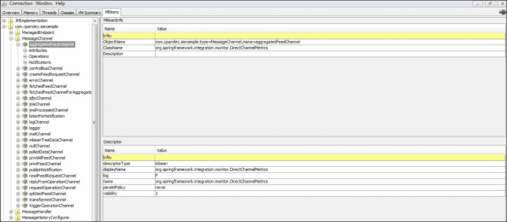

# 九、监测、管理和扩容

在上一章中，我们介绍了测试中最重要的一个方面。我们将在本章中介绍以下主题，以此结束对 Spring 集成的讨论：

*   监测和管理
*   放大

正如我们在各章中所看到的，企业系统是完全不同的、断开连接的，并且容易发生故障。实现跨组件通信的一个重要方面是能够监控出了什么问题，哪些组件过载，以及通信的重要统计数据。所有这些都将有助于提高系统的可靠性和效率。Spring 框架为监控和管理提供了良好的支持，让我们讨论一下如何利用它。

# 监测与管理

监控和管理运营有多种方式；例如，最常用的方法是使用 Java 的 JMX 支持，另一种方法是远程调用命令，或者在事件发生时监视和记录事件—让我们介绍一下最常用的方法。

## JMX 支持

**JMX，**是**Java 管理扩展**的简称，不需要介绍，它是远程监控应用程序的标准方式。任何应用程序都可以提供 MBean 的实现，然后可以查询它们以获取公开的管理信息。Spring 集成提供了一个标准组件，可用于监视通道、适配器和其他可用组件。可以扩展标准 JMX 以获得更具体的信息。

### 先决条件

在使用 Spring Integration 提供的 JMX 支持之前，我们需要添加名称空间声明和 maven 依赖项：

*   **名称空间支持**：可以使用以下代码段添加此：

    ```java
    <beans 
      xmlns:xsi="http://www.w3.org/2001/XMLSchema-instance"
      xmlns:int="http://www.springframework.org/schema/integration"
      xmlns:context="http://www.springframework.org/schema/context"
      xmlns:int-jmx="http://www.springframework.org/schema/integration/jmx"
      xsi:schemaLocation="http://www.springframework.org/schema/integration http://www.springframework.org/schema/integration/spring-integration.xsd
        http://www.springframework.org/schema/beans http://www.springframework.org/schema/beans/spring-beans.xsd
        http://www.springframework.org/schema/context http://www.springframework.org/schema/context/spring-context.xsd
        http://www.springframework.org/schema/integration/jmx http://www.springframework.org/schema/integration/jmx/spring-integration-jmx.xsd">
    ```

*   **Maven 依赖项**：此可以使用以下代码段添加：

    ```java
    <dependency>
      <groupId>org.springframework.integration</groupId>
      <artifactId>spring-integration-jmx</artifactId>
      <version>${spring.integration.version}</version>
    </dependency>
    ```

*   **Initializing the server**: Traditionally, in Java/Spring applications, we need to write code to start the platform MBean server, and export our MBeans, but Spring provides tags to achieve the same tasks. To create and start an MBean server, just use the following line of code:

    ```java
      <context:mbean-server/>
    ```

    对于导出定义的 MBean，以下代码行就足够了：

    ```java
      <context:mbean-export/>
    ```

*   **Management annotations**: The Spring framework exposes some annotation, which can be used to mark components that will be managed or will help in management and monitoring. For example, `@ManagedResource` indicates a class participating in management and monitoring, while `@ManagedAttribute` and `@ManagedOperation` indicate a member level participation, respectively, for class attribute and operation. Enabling `<context:mbean-export/>` will scan and expose these beans and management nodes. Let's write a sample MBean and export it, we will use this for our examples:

    ```java
    import javax.management.Notification;
    import org.springframework.jmx.export.annotation.ManagedAttribute;
    import org.springframework.jmx.export.annotation.ManagedOperation;
    import org.springframework.jmx.export.annotation.ManagedResource;
    import org.springframework.jmx.export.notification.NotificationPublisher;
    import org.springframework.jmx.export.notification.NotificationPublisherAware;
    import org.springframework.stereotype.Component;

    @Component
    @ManagedResource
    public class TestMBean implements NotificationPublisherAware{
      private NotificationPublisher notificationPublisher;
      private String managedData;

      @ManagedAttribute
      public String getManagedData() {
        return managedData;
      }
      @ManagedAttribute
      public void setManagedData(String managedData) {
        this.managedData = managedData;
      }
      @ManagedOperation
      public Integer testAdd(Integer num1, Integer num2) {
        notificationPublisher.sendNotification(new Notification("testAdd", this, 0));
        return num1 + num2;
      }
      @Override
      public void setNotificationPublisher(NotificationPublisher notificationPublisher) {
        this.notificationPublisher = notificationPublisher;
      }
    }
    ```

    由于使用了注释，此类将作为 MBean 导出。另外，此类实现了`NotificationPublisherAware`，可以发送通知。我们将在下一个示例中看到它的用法。

*   **JConsole**：要连接并监控 JMXbean，最简单的方法是使用`Jconsole`。它与 JDK 捆绑在一起，请在`JDK_INSTALLATION_PATH/bin/Jconsole.exe`中查找。默认情况下，JConsole 将选择一个随机端口，但要明确控制 JMX 的端口，请使用以下参数启动 spring 集成应用程序：

    ```java
        -Dcom.sun.management.jmxremote
        -Dcom.sun.management.jmxremote.port=6969
        -Dcom.sun.management.jmxremote.ssl=false
        -Dcom.sun.management.jmxremote.authenticate=false
    ```

### 通知监听通道适配器

通知侦听通道适配器侦听 MBean 发送的通知。收到的任何通知都会放在配置的通道上。以下代码段是一个示例配置：

```java
<int-jmx:notification-listening-channel-adapter id="notifListener" channel="listenForNotification" object-name="com.cpandey.siexample.jmx:name=testMBean,type=TestMBean"/>
```

让我们看看所使用的组件：

*   `int-jmx:notification-listening-channel-adapter`：这是对通知侦听通道适配器的命名空间支持
*   `channel`：这是接收到的通知将作为消息放到的通道
*   `object-name`：这是 MBean 的名称，它发布此适配器的通知

要测试此适配器，请执行以下步骤：

1.  加载配置上下文：

    ```java
    import org.springframework.context.support.AbstractApplicationContext;
    import org.springframework.context.support.ClassPathXmlApplicationContext;

    public final class FeedsExample {
      private FeedsExample() { }

      public static void main(final String... args) {
        final AbstractApplicationContext context = new ClassPathXmlApplicationContext("classpath:META-INF/spring/integration/spring-integration-context.xml");
      }
    }
    ```

2.  启动`Jconsole`并连接到`FeedsExample`。
3.  `Jconsole`将列出`TestMBean`公开的方法和属性。
4.  调用 add 操作，导致`Testbean`发送通知。
5.  有效载荷将被置于`listenForNotification`通道上。

让我们编写一个简单的服务激活器来打印有效负载：

```java
<int:service-activator ref="commonServiceActivator" method="echoMessageInput" input-channel="listenForNotification"/>
```

### 通知发布通道适配器

通知发布通道适配器可以基于通道上的数据发布通知。频道上的消息用于创建通知。例如，如果它是`String`有效负载，则会发送`String`类型的通知。下面是一个示例代码段：

```java
  <int:channel id="publishNotification"/>
  <int-jmx:notification-publishing-channel-adapter id="publishListener"
    channel="publishNotification"
    object-name="com.cpandey.siexample.jmx:name=notificationPublisher"
    default-notification-type="default.notification.type"/>
```

让我们编写一个可以触发前面代码段的小类：

```java
import org.springframework.context.support.AbstractApplicationContext;
import org.springframework.context.support.ClassPathXmlApplicationContext;
import org.springframework.integration.support.MessageBuilder;
import org.springframework.messaging.MessageChannel;

public class NotificationPublisher {
  public static void main(String[] args) {
    final AbstractApplicationContext context = new ClassPathXmlApplicationContext("classpath:META-INF/spring/integration/spring-integration-context.xml");
    try {
      Thread.sleep(60000);
    } catch (InterruptedException e) {
      //do nothing
    }
    MessageChannel publishNotification = context.getBean("publishNotification", MessageChannel.class);
    publishNotification.send(MessageBuilder.withPayload("Sample Message").build());

    MessageChannel triggerOperationChannel = context.getBean("triggerOperationChannel", MessageChannel.class);
    triggerOperationChannel.send(MessageBuilder.withPayload("Trigger Method Adapter").build());

    MessageChannel requestOperationChannel = context.getBean("requestOperationChannel", MessageChannel.class);
    requestOperationChannel.send(MessageBuilder.withPayload("Trigger Method Gateway").build());

    MessageChannel input = context.getBean("controlBusChannel", MessageChannel.class);
    String controlMessage = "@controlBusTest.controlTestOperation()";
    LOGGER.info("Sending message: " + controlMessage);
    input.send(MessageBuilder.withPayload(controlMessage).build());

    try {
      Thread.sleep(180000);
    } catch (InterruptedException e) {
      //do nothing
    }
    context.stop();
  }
}
```

这是一个完整的类，用于触发以下代码行中描述的其他组件。以下代码段中给出了负责触发发布通道适配器的部分：

```java
MessageChannel publishNotification = context.getBean("publishNotification", MessageChannel.class);
    publishNotification.send(MessageBuilder.withPayload("Sample Message").build());
```

前面代码片段的类非常简单；它加载上下文，获取通道的引用，使用 Spring 集成支持类`MessageBuilder`构建负载，然后将其放到通道上。一旦消息被放到这个频道上，就会生成一个事件并发送给订阅者。引入了等待，以允许`Jconsole`有一段时间连接。

### 属性轮询通道适配器

顾名思义，它轮询由 MBean 管理的属性。需要轮询的属性名和封装该属性的 MBean 的对象名。以下代码是属性轮询通道适配器的快速示例配置：

```java
  <int:channel id="polledDataChannel"/>
  <int-jmx:attribute-polling-channel-adapter id="attribPoller" channel="polledDataChannel" object-name="com.cpandey.siexample.jmx:name=testMBean, type=TestMBean"
    attribute-name="ManagedData">
    <int:poller max-messages-per-poll="1" fixed-rate="5000"/>
  </int-jmx:attribute-polling-channel-adapter>
```

前面的配置轮询`TestMbean`的`ManagedData`属性。如果属性值更改，则更改后的值将放在通道上。我们可以有一个简单的服务，在下面的代码行中给出，激活它进行测试：

```java
  <int:service-activator ref="commonServiceActivator" method="attributePolled" input-channel="polledDataChannel"/>
```

### 树轮询通道适配器

树轮询通道适配器查询 JMX 树本身并发送一个有效负载，即 MBean 对象的图。可以使用查询进一步细化该图让我们编写以下示例配置：

```java
  <int:channel id="mbeanTreeDataChannel"/>
  <int-jmx:tree-polling-channel-adapter  id="treePoller" 
    channel="mbeanTreeDataChannel"    	
    query-name="com.cpandey.siexample.jmx:type=*">
      <int:poller max-messages-per-poll="1" fixed-rate="5000"/>
  </int-jmx:tree-polling-channel-adapter>
```

在前面的示例中，除了`query-name`之外，所有标记都已包含在内——这可用于限制 MBean 包。前面的示例代码将在`com.cpandey.siexample.jmx`包中查找 MBean。

我们可以编写一个简单的服务激活器来打印 MBean 图：

```java
  <int:service-activator ref="commonServiceActivator" method="mbeanTreePolled" input-channel="mbeanTreeDataChannel"/>
```

### 调用通道适配器的操作

调用通道适配器的操作可以用于调用 MBean 公开的操作，例如`TestMbean`中的`setManagedData`。在配置的通道上放置消息将触发操作，并将有效负载作为参数传递给调用的操作。以下代码段中给出了配置：

```java
  <int:channel id="triggerOperationChannel"/>
  <int-jmx:operation-invoking-channel-adapter id="triggerOperation"
    channel="triggerOperationChannel"
    object-name="com.cpandey.siexample.jmx:name=testMBean,type=TestMBean"
    operation-name="setManagedData"/>
```

我们可以使用以下代码段触发前面的适配器：

```java
    MessageChannel triggerOperationChannel = context.getBean("triggerOperationChannel", MessageChannel.class);
    triggerOperationChannel.send(MessageBuilder.withPayload("Trigger Method Adapter").build());
```

### 调用出站网关的操作

通常情况下，`Gateway`用于使响应可用于进一步处理，在这种情况下，调用该操作后，响应将返回`replychannel`进行进一步处理，如下代码行所示：

```java
  <int:channel id="requestOperationChannel"/>
  <int:channel id="replyFromOperationChannel"/>
  <int-jmx:operation-invoking-outbound-gateway id="triggerOperationGateway" request-channel="requestOperationChannel" reply-channel="replyFromOperationChannel" object-name="com.cpandey.siexample.jmx:name=testMBean, type=TestMBean" operation-name="getManagedData"/>
```

此代码段可使用以下代码行触发：

```java
    MessageChannel requestOperationChannel = context.getBean("requestOperationChannel", MessageChannel.class);
    requestOperationChannel.send(MessageBuilder.withPayload("Trigger Method Gateway").build());
```

可以插入一个简单的服务激活器来验证网关返回的 reslt。

```java
<int:service-activator ref="commonServiceActivator" method="operationInvokedGateway" input-channel="replyFromOperationChannel"/>
```

### MBean 出口商

标准 spring 集成组件`MessageChannels`、网关和其他组件如何？那么可以通过以下单线配置进行曝光监控：

```java
  <int-jmx:mbean-export 
    default-domain="com.cpandey.siexample"
    server="mbeanServer"/>
```

让我们快速了解一下所使用的元素：

*   `default-domain`：这是可选的，如果留空，`org.springframework.integration`将用作默认域
*   `server`：这是使用`<context:mbean-server/>`创建的`mbeanServer`的引用

在结束关于 JMX 的讨论之前，让我们看一下 JConsole 的快照。下面是我们已经公开的自定义 MBean 和侦听器的屏幕截图：


显示 Spring Integration 所有组件的屏幕截图，我们在应用程序中定义了这些组件，如下所示：



我们可以看到两个方面：

*   列出所有 Spring 集成组件的 Spring 集成包
*   公开用户定义的 MBean 的提要示例

这些适配器的属性和值是不言自明的，我将留给您进一步研究。

## 跟踪消息

在一个典型的审计场景中，消息流可能会抛出多个组件，了解消息所经过的所有路径和组件可能非常有帮助！Spring Integration 提供了跟踪消息历史记录的组件，只需在配置文件中添加以下代码段：

```java
<int:message-history/>
```

添加后，此消息通过的所有组件（前提是组件具有`id`标记）都会附加一条审核消息。让我们以下面的例子为例：

```java
  <int:message-history/>

  <!-- Notification listening channel adapter -->
  <int-jmx:notification-listening-channel-adapter id="notifListener"
    channel="listenForNotification"
    object-name="com.cpandey.siexample.jmx:name=testMBean,type=TestMBean"/>

  <!-- Notification publishing channel adapter -->
  <int:channel id="publishNotification"/>
  <int-jmx:notification-publishing-channel-adapter id="publishListener"
    channel="publishNotification"
    object-name="com.cpandey.siexample.jmx:name=notificationPublisher"
    default-notification-type="default.notification.type"/>
```

在这个代码示例中，我们在开始时声明了`<int:message-history/>`。另外，请注意接下来的两个组件`notifListener`和`publishListener`有一个 ID 标签。此配置就绪后，消息通过这些组件时，元数据将添加到消息中。

## 丝锥

这是一个非常简单的拦截器，可以配置任何通道，它可以“窥视”通过该通道的所有消息。这可以用于调试、记录关键信息等目的。让我们向正在侦听监视事件的通道添加一个拦截器：

```java
  <int:channel id="listenForNotification">
    <int:interceptors>
      <int:wire-tap channel="logger"/>
    </int:interceptors>
  </int:channel>

<int:logging-channel-adapter 
  log-full-message="true" id="logger" level="INFO"/>
```

添加这些配置后，将记录通过该通道的所有消息。

## 控制总线

我们在 spring 集成中有元素，用于应用程序级消息传递。用同一个系统触发一些动作怎么样？控制总线背后的思想与我们可以定义通道完全相同，然后，基于该通道上的有效负载，它可以调用管理操作。让我们看一个例子：

```java
  <int:channel id="controlBusChannel"/>
  <int:control-bus input-channel="controlBusChannel"/>
```

以下代码行给出了向该总线发送控制消息的类：

```java
import org.apache.log4j.Logger;
import org.springframework.jmx.export.annotation.ManagedOperation;
import org.springframework.stereotype.Component;

@Component
public class ControlBusTest {
  private static final Logger LOGGER = Logger.getLogger(ControlBusTest.class);
  @ManagedOperation
  public void controlTestOperation() {
    LOGGER.info("controlTestOperation");
  }
}

MessageChannel input = context.getBean("controlBusChannel", MessageChannel.class);
String controlMessage = "@controlBusTest.controlTestOperation()";
LOGGER.info("Sending message: " + controlMessage);
input.send(MessageBuilder.withPayload(controlMessage).build());
```

下面，让我们结束关于管理和监控的讨论。在下一节中，我们将选择应用程序设计可伸缩性的一个最重要方面。

# 扩容

系统的可伸缩性是最重要的非功能性需求之一。我们知道，基本上有两种方法来缩放系统：垂直缩放和水平缩放。**垂直****缩放**是指在内存不足的情况下，增加现有系统的处理能力，增加内存；如果 CPU 周期越来越短，请添加更多内核或进行其他更改。不是什么挑战！另一方面，**水平扩展**指的是增加更多的物理节点，以分布式方式处理请求，在数据库中增加冗余，以及 MessageBroker 组件。显然，这需要通过设计进行适当的思考。让我们用几种方法来扩展 Spring 应用程序。

## 穿线

扩展系统最常见的方法是引入并行处理。但是，在学习如何执行此操作之前，让我们先了解以下陷阱：

*   应该评估创建线程是否有帮助
*   应根据机器能力创建线程
*   我们应该考虑其他端点的等待时间。
*   螺纹应该清理干净

让我们从一个例子开始。我们已经讨论过 FTP，如果有数千个文件可用，并且我们希望并行处理它们，如何实现这一点？我们可以使用`TaskExecutors`，如下例所示：

```java
<bean id="ftpTaskExecutor" class="org.springframework.scheduling.concurrent.ThreadPoolTaskExecutor">
  <property name="maxPoolSize" value="15"/>
  <property name="threadNamePrefix" value="ftpService-"/>
</bean>

<int:service-activator ref="ftpFileProcessor" method="parserFeedsFromFtp" input-channel="ftpInputChannel" output-channel="ftpOutputChannel">
    <int:poller fixed-rate="1000" receive-timeout="6000" task-executor=" ftpTaskExecutor"></int:poller>
</int:service-activator>
```

那么在前面的代码中发生了什么？首先，我们定义一个任务执行器，而不是特定于 spring 集成的。您可以看到使用了 Spring 框架中的`org.springframework.scheduling.concurrent.ThreadPoolTaskExecutor`类。然后，我们在服务激活器上附加了轮询器。现在将创建一个服务池，它将并行处理输入通道上的文件。

很明显，Spring 集成利用了 Spring 框架对执行者的支持。前面的代码直接使用 bean，但 Spring 也提供了名称空间支持：

```java
<task:executor id="executor"/>
```

底层抽象是`org.springframework.core.task.TaskExecutor`。每当需要执行任务时，将其提交给任务执行者；任务执行者的任务是为任务分配和取消分配线程。让我们以上例中的轮询器为例，如果可轮询通道上的元素是无状态的并且可以并发处理，我们可以在那里使用执行器：

```java
<poller id="defaultPoller" fixed-delay="1000 "default="true" task-executor="executor"/>
```

如果我们有一个维护底层线程池的任务执行器，那么我们可以指定要维护的最大线程数，同时考虑物理资源限制：

```java
<task:executor id="taskExecutor" pool-size="10"/>
```

## 缩放状态

没有状态时并发将工作；我们希望扩展但同时必须管理状态的用例如何？例如，如果有效载荷太大，我们是否会等待所有有效载荷被处理，从而使消费者保持向下？在[第 7 章](07.html#page_1 "Chapter 7. Integration with Spring Batch")中*与 Spring Batch*的集成中，我们提到可以触发下载，然后等待下载完成的事件；在这一阶段，消费者将参与进来。同样，我们有一些方法可以利用；事实上，我们在前面的一章中已经讨论了这些，所以我将只讨论如何利用持久存储来扩展状态。

### 消息存储

顾名思义，我们可以暂时存储消息，直到满足某些条件。例如，如果您还记得，Aggregator 是一个 spring 集成组件，它关联并临时存储消息，直到满足完成条件。类似的概念可用于扩展，任务可搁置一旁，只有在所有其他协调成员可用时才能处理。让我们举一个 feed 的例子，一些 feed 可能有相关的图片。文本部分将立即交付，而图片交付可能需要很多时间。我们可以配置聚合器，使其在所有部分到达时释放消息。我们已经在[第 5 章](05.html#page_1 "Chapter 5. Message Flow")、*消息流*中介绍了如何做到这一点！

### 索赔检查

这个概念非常简单，不用等待所有组件到达，而是将零件存储在某个已知位置，并有一个指向它的指针。当最后一个块到达时，使用指针“声明”所有其他部分。显然，这将适用于我们可以在独立单元中断开有效负载的情况，并且可以让系统知道最终的数据包到达。一旦实现，处理链下游的组件只有在其所有部件都可用时才能获得包，而不必等待或阻止整个包到达。

# 总结

在本章中，我们简要介绍了 spring 集成框架的监控和管理方面，如如何关注隐式和用户定义的集成组件，如何发送和接收事件以及调用操作，以及许多其他方面。我们还介绍了如何使用线程来扩展应用程序，以及几种扩展状态的方法。这就把我们带到了理论旅程的终点。在下一章中；我们将编写一个端到端的应用程序，完成我们的 spring 集成之旅！