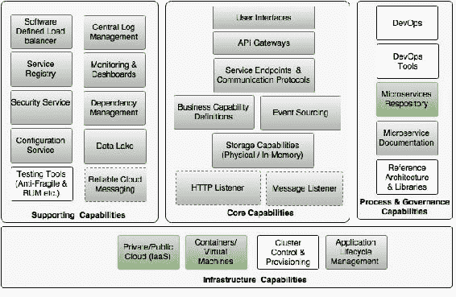
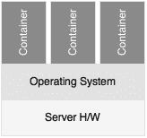
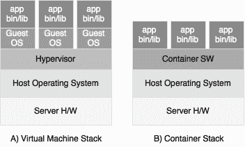
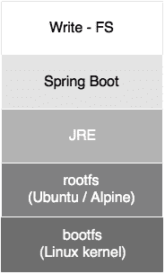

# 八、与 Docker 一起容器化微服务

在微服务环境中，容器化部署是锦上添花。它通过自包含底层基础设施帮助微服务变得更加自治，从而使微服务与云无关。

本章将介绍虚拟机映像的概念和相关性以及微服务的容器化部署。然后，本章将进一步让读者熟悉如何为使用 Spring Boot 和 Spring Cloud 开发的 BrownField PSS 微服务构建 Docker 映像。最后，本章还将讨论如何在类似于生产的环境中管理、维护和部署 Docker 映像。

在本章结束时，您将了解：

*   容器化的概念及其在微服务环境中的相关性
*   将微服务构建和部署为 Docker 映像和容器
*   以 AWS 为例介绍基于云的 Docker 部署

# 回顾微服务能力模型

在本章中，我们将从[第 3 章](03.html "Chapter 3. Applying Microservices Concepts")、*应用微服务概念*中讨论的微服务能力模型中探索以下微服务能力：

*   容器和虚拟机
*   私有/公共云
*   微服务存储库

模型如下图所示：



# 了解棕地 PSS 微服务的差距

在[第 5 章](05.html "Chapter 5. Scaling Microservices with Spring Cloud")中，*使用 Spring Cloud 扩展微服务，*使用 Spring Boot 和 Spring Cloud 开发棕地 PSS 微服务。这些微服务作为版本化的胖 JAR 文件部署在裸机上，特别是在本地开发机器上。

在[第 6 章](06.html "Chapter 6. Autoscaling Microservices")*自动校准微服务*中，在定制生命周期管理器的帮助下增加了自动校准功能。在[第 7 章](07.html "Chapter 7. Logging and Monitoring Microservices")*记录和监控微服务*中，使用集中记录和监控解决方案解决了记录和监控方面的挑战。

在我们的棕地 PSS 实施中仍然存在一些差距。到目前为止，该实现还没有使用任何云基础设施。与传统的单片应用程序部署一样，专用机器不是部署微服务的最佳解决方案。自动化（如自动资源调配、按需扩展、自助服务和基于使用情况的支付）是高效管理大规模微服务部署所需的基本功能。通常，云基础设施提供所有这些基本功能。因此，具有前面提到的功能的私有或公共云更适合部署互联网规模的微服务。

此外，每个裸机运行一个微服务实例并不划算。因此，在大多数情况下，企业最终会在单个裸机服务器上部署多个微服务。在单个裸机上运行多个微服务可能会导致“嘈杂的邻居”问题。在同一台机器上运行的 microservice 实例之间没有隔离。因此，部署在一台机器上的服务可能会占用其他机器的空间，从而影响它们的性能。

另一种方法是在虚拟机上运行微服务。然而，虚拟机本质上是重量级的。因此，在一台物理机器上运行许多较小的虚拟机并不能节省资源。这通常会造成资源浪费。在共享一个 VM 以部署多个服务的情况下，我们最终将面临与共享裸机相同的问题，如前所述。

对于基于 Java 的微服务，共享一个 VM 或裸机来部署多个微服务也会导致在微服务之间共享 JRE。这是因为在我们的 BrownField PSS 中创建的胖 jar 只抽象应用程序代码及其依赖项，而不抽象 JRE。机器上安装的 JRE 的任何更新都将影响此机器上部署的所有微服务。类似地，如果特定的微服务需要操作系统级参数、库或调整，那么在共享环境中管理它们将很困难。

一个微服务原则坚持认为，它应该通过完全封装其端到端运行时环境实现自包含和自治。为了符合这一原则，所有组件（如 OS、JRE 和 microservice 二进制文件）都必须是自包含和隔离的。实现这一点的唯一选择是遵循每个 VM 部署一个微服务的方法。然而，这将导致虚拟机未充分利用，在许多情况下，由此产生的额外成本可能会抵消微服务的好处。

# 什么是容器？

容器不是革命性的、突破性的概念。他们已经行动了很长一段时间。然而，世界正在见证容器的重新进入，这主要是由于云计算的广泛采用。传统虚拟机在云计算领域的缺点也加速了容器的使用。容器供应商，如**Docker**在很大程度上简化了容器技术，这也使得当今世界大量采用容器技术。DevOps 和微服务最近的流行也成为容器技术重生的催化剂。

那么，什么是容器？容器在操作系统顶部提供私有空间。这种技术也称为操作系统虚拟化。在这种方法中，操作系统的内核提供隔离的虚拟空间。这些虚拟空间中的每一个都称为容器或**虚拟引擎**（**VE**）。容器允许进程在主机操作系统之上的隔离环境中运行。在同一主机上运行的多个容器的表示如下所示：



容器是构建、装运和运行分区软件组件的简单机制。通常，容器包装了运行应用程序所必需的所有二进制文件和库。容器保留自己的文件系统、IP 地址、网络接口、内部进程、名称空间、操作系统库、应用程序二进制文件、依赖项和其他应用程序配置。

组织使用了数十亿个容器。此外，还有许多大型组织在容器技术上投入巨资。Docker 在竞争中遥遥领先，得到了许多大型操作系统供应商和云计算提供商的支持。**Lmctfy**、**SystemdNspawn**、**火箭**、**吊桥**、**LXD**、**库尔马**和**印花布**是其他容器化解决方案。开放式容器规范也在开发中。

# VMs 与容器的区别

几年前，虚拟机如**Hyper-V**、**VMWare**和**Zen**是数据中心虚拟化的热门选择。与传统的裸机使用相比，企业通过实施虚拟化实现了成本节约。它还帮助许多企业以更加优化的方式利用其现有的基础架构。由于虚拟机支持自动化，许多企业都经历了这样一种情况，即他们不得不对虚拟机进行较少的管理工作。虚拟机还帮助企业获得独立的应用程序运行环境。

从表面上看，虚拟化和容器化表现出完全相同的特征。然而，简言之，容器和虚拟机并不相同。因此，在虚拟机和容器之间进行苹果对苹果的比较是不公平的。虚拟机和容器是两种不同的技术，可以解决不同的虚拟化问题。从下图可以看出这种差异：



与容器相比，虚拟机的运行级别要低得多。虚拟机提供硬件虚拟化，如 CPU、主板、内存等。VM 是一个带有嵌入式操作系统的独立单元，通常称为**客户操作系统**。虚拟机复制整个操作系统，并在虚拟机内运行，不依赖主机操作系统环境。由于虚拟机嵌入了完整的操作系统环境，这些虚拟机本质上是重量级的。这既是优点也是缺点。优点是虚拟机提供了对虚拟机上运行的进程的完全隔离。缺点是，由于虚拟机的资源需求，它限制了可以在裸机中启动的虚拟机数量。

虚拟机的大小直接影响启动和停止它的时间。由于启动虚拟机反过来会引导操作系统，因此虚拟机的启动时间通常很长。虚拟机与基础架构团队更友好，因为管理虚拟机需要较低水平的基础架构能力。

在容器世界中，容器不会模拟整个硬件或操作系统。与虚拟机不同，容器共享主机内核和操作系统的某些部分。对于容器，没有来宾操作系统的概念。容器直接在主机操作系统上提供一个隔离的执行环境。这是它的优点，也是缺点。优点是它既轻又快。由于同一台机器上的容器共享主机操作系统，因此容器的总体资源利用率相当小。因此，与重量级虚拟机相比，许多较小的容器可以在同一台机器上运行。由于同一主机上的容器共享主机操作系统，因此也存在一些限制。例如，不可能在容器内设置 iptables 防火墙规则。容器内的进程完全独立于在同一主机上运行的不同容器上的进程。

与虚拟机不同，容器映像在社区门户上公开提供。这使得开发者的生活更加轻松，因为他们不必从头开始构建图像；取而代之的是，他们现在可以从经过认证的来源获取一个基础映像，并在下载的基础映像之上添加额外的软件组件层。

容器的轻量级特性也带来了大量的机会，例如自动构建、发布、下载、复制等。通过几个命令下载、构建、发布和运行容器，或者使用 RESTAPI，使容器对开发人员更加友好。构建一个新容器只需几秒钟。容器现在也是连续输送管道的一部分。

总之，容器比虚拟机有许多优势，但虚拟机有其独有的优势。许多组织同时使用容器和虚拟机，例如在虚拟机上运行容器。

# 容器的好处

我们已经考虑了容器相对于 VMs 的许多好处。本节将解释容器的总体好处，而不仅仅是虚拟机的好处：

*   **自给自足的**：容器将基本的应用程序二进制文件及其依赖项打包在一起，以确保开发、测试或生产等不同环境之间没有差异。这促进了十二因素应用程序和不可变容器的概念。SpringBoot 微服务捆绑了所有必需的应用程序依赖项。容器通过嵌入 JRE 和其他操作系统级库、配置等（如果有的话），进一步扩展了这个边界。
*   **轻质**：一般而言，容器尺寸较小，占地面积较小。最小的容器 Alpine 的大小小于 5MB。最简单的 SpringBoot 微服务与带有 Java8 的 Alpine 容器打包在一起，其大小仅为 170MB 左右。尽管大小仍然较高，但它比 VM 映像大小小得多，VM 映像大小通常以 GB 为单位。更小的容器占地面积不仅有助于快速旋转新容器，而且使建造、运输和储存更加容易。
*   **可扩展**：由于容器映像的大小较小，并且启动时没有操作系统引导，因此容器的启动和关闭速度通常更快。这使得容器成为云友好弹性应用程序的流行选择。
*   **便携**：容器提供跨机器和云提供商的便携性。一旦使用所有依赖项构建了容器，就可以跨多台机器或跨多个云提供商进行移植，而无需依赖底层机器。容器可以从台式机移植到不同的云环境。
*   **更低的许可成本**：很多软件许可条款都是基于物理核心的。由于容器共享操作系统，并且没有在物理资源级别进行虚拟化，因此在许可证成本方面具有优势。
*   **DevOps**：容器的轻量级封装使得从远程存储库自动构建、发布和下载容器变得容易。通过与自动化交付管道集成，这使得它易于在敏捷和 DevOps 环境中使用。容器还支持*构建一次*的概念，即在构建时创建不可变的容器，并在多个环境中移动它们。由于容器没有深入到基础设施中，多学科 DevOps 团队可以在日常生活中管理容器。
*   **版本控制**：容器默认支持版本。这有助于构建版本化工件，就像版本化归档文件一样。
*   **可重复使用**：容器图像是可重复使用的工件。如果一个映像是通过为某个目的组装多个库来构建的，那么它可以在类似的情况下重用。
*   **不可变容器**：在概念中，容器是在使用后创建和处置的。它们从不更新或修补。许多环境中都使用了不可变容器，以避免修补部署单元时的复杂性。修补导致缺乏可跟踪性，并且无法一致地重新创建环境。

# 微服务和容器

微服务和容器之间没有直接关系。微服务可以在没有容器的情况下运行，容器可以运行单片应用程序。然而，在微服务和容器之间存在一个最佳点。

容器适用于单片应用程序，但单片应用程序的复杂性和大小可能会扼杀容器的一些好处。例如，使用单片应用程序快速旋转新容器可能并不容易。除此之外，单片应用程序通常具有本地环境依赖性，例如本地磁盘、烟囱与其他系统的依赖性，等等。使用容器技术很难管理此类应用程序。这就是微服务与容器齐头并进的地方。

下图显示了在同一主机上运行的三个 polyglot 微服务，它们共享同一操作系统，但抽象了运行时环境：


容器的真正优势可以在管理许多多语言微服务时看到，例如，一个是 Java 微服务，另一个是 Erlang 或其他语言微服务。容器帮助开发人员以平台和技术无关的方式打包用任何语言或技术编写的微服务，并在多个环境中统一分发它们。容器消除了使用不同的部署管理工具来处理 polyglot 微服务的需要。容器不仅抽象了执行环境，还抽象了如何访问服务。无论使用何种技术，容器化的微服务都会公开 RESTAPI。一旦容器启动并运行，它将绑定到某些端口并公开其 API。由于容器是自包含的并提供服务之间的全堆栈隔离，因此在单个 VM 或裸机中，可以运行多个异构微服务并以统一的方式处理它们。

# 码头工人简介

前面的章节讨论了容器及其优点。容器已经经营多年了，但 Docker 的流行给容器带来了新的前景。因此，Docker 体系结构中出现了许多容器定义和透视图。Docker 非常受欢迎，甚至容器化也被称为**Docker 化**。

Docker 是一个基于 Linux 内核构建、发布和运行轻量级容器的平台。Docker 默认支持 Linux 平台。它还支持 Mac 和 Windows，使用**Boot2Docker**，它运行在虚拟机上。

亚马逊**EC2 容器服务**（**ECS**）对 AWS EC2 实例上的 Docker 提供开箱即用支持。Docker 可以安装在裸机上，也可以安装在传统的虚拟机上，如 VMWare 或 Hyper-V。

## Docker 的关键部件

Docker 安装有两个关键组件：一个**Docker 守护程序**和一个**Docker 客户端**。Docker 守护进程和 Docker 客户端都作为单个二进制文件分发。

下图显示了 Docker 安装的关键组件：


### Docker 守护进程

Docker 守护进程是一个服务器端组件，在主机上运行，负责构建、运行和分发 Docker 容器。Docker 守护进程公开 Docker 客户端与守护进程交互的 API。这些 API 主要是基于 REST 的端点。可以想象 Docker 守护进程作为一个在主机上运行的控制器服务。开发人员也可以通过编程方式使用这些 API 来构建自定义客户端。

### 码头工人客户

Docker 客户端是一个远程命令行程序，通过套接字或 REST API 与 Docker 守护程序交互。CLI 可以在守护进程运行的同一主机上运行，也可以在完全不同的主机上运行并远程连接到守护进程。Docker 用户使用 CLI 构建、装运和运行 Docker 容器。

## 码头工人概念

Docker 架构是围绕几个概念构建的：图像、容器、注册表和 Dockerfile。

### 码头工人图片

Docker 的一个关键概念是形象。Docker 映像是操作系统库、应用程序及其库的只读副本。创建映像后，保证可以在任何 Docker 平台上运行，无需进行任何更改。

在 springbootmicroservices 中，Docker 映像打包了操作系统，如 Ubuntu、Alpine、JRE 和 springbootfat 应用程序 JAR 文件。它还包括运行应用程序和公开服务的说明：


如图所示，Docker 映像基于分层体系结构，其中基本映像是 Linux 的风格之一。如上图所示，每个层都会添加到基本图像层，并将上一个图像作为父层。Docker 使用联合文件系统的概念将所有这些层组合成一个映像，形成一个文件系统。

在典型情况下，开发人员不会从头开始构建 Docker 映像。操作系统的映像或其他公共库（如 Java8 映像）可从可信源公开获取。开发人员可以开始在这些基本映像的基础上进行构建。SpringMicroServices 中的基本映像可以是 JRE 8，而不是从 Linux 发行版映像（如 Ubuntu）开始。

每次我们重建应用程序时，只有更改的层得到重建，其余的层保持不变。所有中间层都被缓存，因此，如果没有任何更改，Docker 将使用先前缓存的层并将其构建在上面。使用相同类型的基本映像在同一台计算机上运行的多个容器将重用基本映像，从而减少部署的大小。例如，在主机中，如果有多个容器以 Ubuntu 作为基本映像运行，那么它们都会重用相同的基本映像。这在发布或下载图像时也适用：



如图所示，映像中的第一层是一个名为`bootfs`的引导文件系统，它类似于 Linux 内核和引导加载程序。启动文件系统充当所有映像的虚拟文件系统。

在启动文件系统之上，操作系统文件系统被放置，称为`rootfs`。根文件系统将典型的操作系统目录结构添加到容器中。与 Linux 系统不同，Docker 中的`rootfs`是只读模式。

在`rootfs`的上方，根据需要放置其他需要的图像。在我们的例子中，这些是 JRE 和 Spring Boot microservice JAR。当容器启动时，一个可写文件系统被放置在所有其他文件系统之上，以便进程运行。进程对底层文件系统所做的任何更改都不会反映在实际的容器中。而是将这些文件写入可写文件系统。这个可写文件系统是不稳定的。因此，一旦容器停止，数据就会丢失。由于这个原因，Docker 容器在本质上是短暂的。

封装在 Docker 中的基本操作系统通常只是 OS 文件系统的最小副本。实际上，运行在上面的进程可能不会使用整个操作系统服务。在 springbootmicroservice 中，在许多情况下，容器只是启动 CMD 和 JVM，然后调用 springbootfat JAR。

### 码头容器

Docker 容器是 Docker 映像的运行实例。容器在运行时使用主机操作系统的内核。因此，它们与运行在同一主机上的其他容器共享主机内核。Docker 运行时使用操作系统的内核特性，如**cgroups**和内核**命名空间**，确保为容器进程分配自己的独立进程空间。除了资源保护之外，容器还拥有自己的文件系统和网络配置。

容器在实例化时可以有特定的资源分配，例如内存和 CPU。从同一映像启动容器时，可以有不同的资源分配。默认情况下，Docker 容器获取到网络的隔离**子网**和**网关**。网络有三种模式。

### 码头工人登记处

Docker 注册表是 Docker 图像发布和下载的中心位置。URL[https://hub.docker.com](https://hub.docker.com) 是 Docker 提供的中央注册表。Docker 注册表有公共映像，可以下载并用作基本注册表。Docker 还具有专用于 Docker 注册表中创建的帐户的私有映像。Docker 注册表屏幕截图如下所示：


Docker 还提供**Docker Trusted Registry**，可用于在本地建立注册中心。

### Dockerfile

Docker 文件是一个构建或脚本文件，其中包含构建 Docker 映像的说明。Dockerfile 中可以记录多个步骤，从获取基本映像开始。Dockerfile 是一个文本文件，通常称为 Dockerfile。`docker build`命令查找 Dockerfile 以获取要构建的指令。可以将 Dockerfile 与 Maven 构建中使用的`pom.xml`文件进行比较。

# 在 Docker 中部署微服务

本部分将通过展示如何为我们的棕地 PSS 微服务构建容器来操作我们的学习。

### 注

本章的完整源代码可在`Chapter 8`项目的代码文件中找到。将`chapter7.configserver`、`chapter7.eurekaserver`、`chapter7.search`、`chapter7.search-apigateway`和`chapter7.website`复制到新的 STS 工作区中，并将其重命名为`chapter8.*`。

执行以下步骤为棕地 PSS 微服务构建 Docker 容器：

1.  Install Docker from the official Docker site at [https://www.docker.com](https://www.docker.com).

    根据选择的操作系统，按照**开始**链接获取下载和安装说明。安装后，使用以下命令验证安装：

    ```java
    $docker –version
    Docker version 1.10.1, build 9e83765

    ```

2.  在这一节中，我们将了解如何将**搜索**（`chapter8.search`）微服务、**搜索 API 网关**（`chapter8.search-apigateway`微服务）和**网站**（`chapter8.website`Spring Boot 应用程序对接。
3.  Before we make any changes, we need to edit `bootstrap.properties` to change the config server URL from localhost to the IP address as localhost is not resolvable from within the Docker containers. In the real world, this will point to a DNS or load balancer, as follows:

    ```java
    spring.cloud.config.uri=http://192.168.0.105:8888
    ```

    ### 注

    将 IP 地址替换为计算机的 IP 地址。

4.  同样，在 Git 存储库上编辑`search-service.properties`，并将 localhost 更改为 IP 地址。这适用于 Eureka URL 和 RabbitMQ URL。更新后提交回 Git。您可以通过以下代码执行此操作：

    ```java
    spring.application.name=search-service
    spring.rabbitmq.host=192.168.0.105
    spring.rabbitmq.port=5672
    spring.rabbitmq.username=guest
    spring.rabbitmq.password=guest
    orginairports.shutdown:JFK
    eureka.client.serviceUrl.defaultZone: http://192.168.0.105:8761/eureka/
    spring.cloud.stream.bindings.inventoryQ=inventoryQ
    ```

5.  Change the RabbitMQ configuration file `rabbitmq.config` by uncommenting the following line to provide access to guest. By default, guest is restricted to be accessed from localhost only:

    ```java
        {loopback_users, []}
    ```

    对于不同的操作系统，`rabbitmq.config`的位置将不同。

6.  Create a Dockerfile under the root directory of the Search microservice, as follows:

    ```java
    FROM frolvlad/alpine-oraclejdk8
    VOLUME /tmp
    ADD  target/search-1.0.jar search.jar
    EXPOSE 8090
    ENTRYPOINT ["java","-jar","/search.jar"]
    ```

    以下是对 Dockerfile 的内容的快速检查：

    *   `FROM frolvlad/alpine-oraclejdk8`：这告诉 Docker 构建使用特定的`alpine-oraclejdk8`版本作为此构建的基本映像。`frolvlad`表示要定位`alpine-oraclejdk8`图像的存储库。在本例中，它是使用 Alpine Linux 和 Oracle JDK 8 构建的映像。这将有助于在基本映像的基础上分层应用程序，而无需自己设置 Java 库。在这种情况下，由于此映像在本地映像存储中不可用，Docker 构建将继续并从远程 Docker Hub 注册表下载此映像。
    *   `VOLUME /tmp`：允许从容器访问主机中指定的目录。在我们的例子中，这指向`tmp`目录，Spring 引导应用程序在其中为 Tomcat 创建工作目录。`tmp`目录是容器的逻辑目录，它间接指向主机的一个本地目录。
    *   `ADD target/search-1.0.jar search.jar`：将应用程序二进制文件添加到指定目标文件名的容器中。在这种情况下，Docker build 将`target/search-1.0.jar`作为`search.jar`复制到容器中。
    *   `EXPOSE 8090`：告知容器如何进行端口映射。这将`8090`与内部 Spring Boot 服务的外部端口绑定相关联。
    *   `ENTRYPOINT ["java","-jar", "/search.jar"]`：这告诉容器在启动容器时运行哪个默认应用程序。在本例中，我们指向 Java 进程和 Spring 引导 fat JAR 文件来启动服务。
7.  The next step is to run `docker build` from the folder in which the Dockerfile is stored. This will download the base image and run the entries in the Dockerfile one after the other, as follows:

    ```java
    docker build –t search:1.0 .

    ```

    该命令的输出如下所示：

    

8.  对搜索 API 网关和网站重复相同的步骤。
9.  Once the images are created, they can be verified by typing the following command. This command will list out the images and their details, including the size of image files:

    ```java
    docker images

    ```

    输出结果如下：

    

10.  The next thing to do is run the Docker container. This can be done with the `docker run` command. This command will load and run the container. On starting, the container calls the Spring Boot executable JAR to start the microservice.

    启动容器之前，请确保配置和 Eureka 服务器正在运行：

    ```java
    docker run --net host -p 8090:8090 -t search:1.0
    docker run --net host -p 8095:8095 -t search-apigateway:1.0
    docker run --net host -p 8001:8001 -t website:1.0

    ```

    前面的命令启动搜索和搜索 API 网关微服务和网站。

    在本例中，我们使用主机网络`(--net host`，而不是网桥网络，以避免 Eureka 注册 Docker 容器名称。这可以通过覆盖`EurekaInstanceConfigBean`来纠正。从网络的角度来看，与网桥选项相比，主机选项的隔离度更低。主机对网桥的优势和劣势取决于项目。

11.  Once all the services are fully started, verify with the `docker ps` command, as shown in the following screenshot:

    

12.  The next step is to point the browser to `http://192.168.99.100:8001`. This will open the BrownField PSS website.

    请注意 IP 地址。如果您在 Mac 或 Windows 上使用 Boot2Docker 运行，则这是 Docker 计算机的 IP 地址。在 Mac 或 Windows 中，如果 IP 地址未知，则键入以下命令以查找默认机器的 Docker 机器的 IP 地址：

    ```java
    docker-machine ip default

    ```

    如果 Docker 在 Linux 上运行，则这是主机 IP 地址。

对**订票**、**票价**、**值机**及其各自的网关微服务应用相同的变更。

# 在 Docker 上运行 RabbitMQ

由于我们的示例也使用 RabbitMQ，让我们探讨如何将 RabbitMQ 设置为 Docker 容器。以下命令从 Docker Hub 提取 RabbitMQ 映像并启动 RabbitMQ：

```java
docker run –net host rabbitmq3

```

确保`*-service.properties`中的 URL 已更改为 Docker 主机的 IP 地址。在 Mac 或 Windows 的情况下，应用前面的规则查找 IP 地址。

# 使用 Docker 注册表

Docker Hub 提供了一个中心位置来存储所有 Docker 图像。图像可以存储为公共或私有。在许多情况下，出于与安全相关的考虑，组织在办公场所部署了自己的私有注册中心。

执行以下步骤以设置和运行本地注册表：

1.  以下命令将启动注册表，该注册表将绑定端口`5000`：

    ```java
    docker run -d -p 5000:5000 --restart=always --name registry registry:2

    ```

2.  标记`search:1.0`到注册表，如下所示：

    ```java
    docker tag search:1.0 localhost:5000/search:1.0

    ```

3.  然后，通过以下命令将图像推送到注册表：

    ```java
    docker push localhost:5000/search:1.0

    ```

4.  将图像从注册表中拉回来，如下所示：

    ```java
    docker pull localhost:5000/search:1.0

    ```

## 设置 Docker Hub

在上一章中，我们使用了本地 Docker 注册表。本节将介绍如何设置和使用 Docker Hub 来发布 Docker 容器。这是一种方便的全局访问 Docker 映像的机制。在本章后面，Docker 映像将从本地计算机发布到 Docker Hub，并从 EC2 实例下载。

为此，创建一个公共 Docker Hub 帐户和一个存储库。对于 Mac，请按照以下 URL 执行步骤：[https://docs.docker.com/mac/step_five/](https://docs.docker.com/mac/step_five/) 。

在本例中，Docker Hub 帐户是使用`brownfield`用户名创建的。

在本例中，注册表充当微服务存储库，在其中存储和访问所有容器化的微服务。这是微服务能力模型中解释的能力之一。

## 向 Docker Hub 发布微服务

要将停靠服务推送到 Docker Hub，请执行以下步骤。第一个命令标记 Docker 映像，第二个命令将 Docker 映像推送到 Docker Hub 存储库：

```java
docker tag search:1.0brownfield/search:1.0
docker push brownfield/search:1.0

```

要验证容器映像是否已发布，请转到位于`https://hub.docker.com/u/brownfield`的 Docker Hub 存储库。

对所有其他棕地微服务也重复此步骤。此步骤结束时，所有服务都将发布到 Docker Hub。

# 云上的微服务

在微服务能力模型中提到的能力之一是将云基础设施用于微服务。在本章前面，我们还探讨了将云用于微服务部署的必要性。到目前为止，我们还没有在云上部署任何东西。由于我们在整个棕地 PSS 微服务生态系统中总共有八个微服务-`Config-server`、`Eureka-server`、Turbine、RabbitMQ、Elasticsearch、Kibana 和 Logstash，因此很难在本地机器上运行所有这些微服务。

在本书的其余部分中，我们将使用 AWS 作为云平台来部署棕地 PSS 微服务。

## 在 AWS EC2 上安装 Docker

在小节中，我们将在 EC2 实例上安装 Docker。

本例假设读者熟悉 AWS，并且已经在 AWS 上创建了帐户。

执行以下步骤在 EC2 上设置 Docker：

1.  Launch a new EC2 instance. In this case, if we have to run all the instances together, we may need a large instance. The example uses **t2.large**.

    在本例中，使用了以下 Ubuntu AMI 映像：`ubuntu-trusty-14.04-amd64-server-20160114.5 (ami-fce3c696)`。

2.  连接 EC2 实例并运行以下命令：

    ```java
    sudo apt-get update 
    sudo apt-get install docker.io

    ```

3.  前面的命令将在 EC2 实例上安装 Docker。使用以下命令验证安装：

    ```java
    docker version

    ```

# 在 EC2 上运行棕地服务

在本节中，我们将在创建的 EC2 实例上设置棕地微服务。在这种情况下，将在本地桌面计算机中设置构建，并将二进制文件部署到 AWS。

执行以下步骤在 EC2 实例上设置服务：

1.  通过以下命令安装 Git:

    ```java
    sudo apt-get install git

    ```

2.  在您选择的任何文件夹上创建 Git 存储库。
3.  更改配置服务器的`bootstrap.properties`以指向为此示例创建的相应 Git 存储库。
4.  将所有微服务的`bootstrap.properties`更改为使用 EC2 实例的私有 IP 地址指向配置服务器。
5.  将所有`*.properties`从本地 Git 存储库复制到 EC2 Git 存储库并执行提交。
6.  更改`*.properties`文件中的 Eureka 服务器 URL 和 RabbitMQ URL，以匹配 EC2 专用 IP 地址。完成更改后，将其提交到 Git。
7.  在本地机器上，重新编译所有项目，并为`search`、`search-apigateway`和`website`微服务创建 Docker 映像。将它们全部推送到 Docker Hub 注册表。
8.  将配置服务器和 Eureka 服务器二进制文件从本地计算机复制到 EC2 实例。
9.  在 EC2 实例上设置 Java8。
10.  然后依次执行以下命令：

    ```java
    java –jar config-server.jar 
    java –jar eureka-server.jar 
    docker run –net host rabbitmq:3
    docker run --net host -p 8090:8090 rajeshrv/search:1.0
    docker run --net host -p 8095:8095 rajeshrv/search-apigateway:1.0
    docker run --net host -p 8001:8001 rajeshrv/website:1.0

    ```

11.  通过打开网站的 URL 并执行搜索，检查所有服务是否正常工作。请注意，在这种情况下，我们将使用公共 IP 地址：`http://54.165.128.23:8001`。

# 更新生命周期管理器

在[第 6 章](06.html "Chapter 6. Autoscaling Microservices")*自动缩放微服务*中，我们考虑了一个生命周期管理器来自动启动和停止实例。我们使用 SSH 并执行 Unix 脚本在目标机器上启动 Spring Boot 微服务。对于 Docker，我们不再需要 SSH 连接，因为 Docker 守护进程提供基于 REST 的 API 来启动和停止实例。这大大简化了生命周期管理器的部署引擎组件的复杂性。

在本节中，我们将不重写生命周期管理器。大体上，我们将在下一章中替换生命周期管理器。

# 容器化的未来——单核和强化安全

容器化仍在发展中，但近年来采用容器化技术的组织数量有所增加。虽然许多组织正在积极采用 Docker 和其他容器技术，但这些技术的缺点仍然在于容器的大小和安全问题。

目前，Docker 图像通常很重。在弹性自动化环境中，容器的创建和销毁非常频繁，因此大小仍然是一个问题。尺寸越大表示代码越多，代码越多表示更容易出现安全漏洞。

未来肯定是在占地面积小的容器中。Docker 正在开发 unikernels，这种轻量级内核甚至可以在低功耗的物联网设备上运行 Docker。Unikernels 不是成熟的操作系统，但它们提供了支持已部署应用程序所需的基本库。

容器的安全问题被广泛讨论和辩论。关键的安全问题围绕着用户名称空间隔离或用户 ID 隔离。如果容器位于根目录下，则默认情况下它可以获得主机的根权限。使用来自不可信来源的容器映像是另一个安全问题。Docker 正在尽可能快地弥补这些差距，但有许多组织使用虚拟机和 Docker 的组合来规避一些安全问题。

# 总结

在本章中，您了解了在处理互联网规模的微服务时需要云环境。

我们探讨了容器的概念，并将其与传统虚拟机进行了比较。您还学习了 Docker 的基础知识，我们解释了 Docker 映像、容器和注册表的概念。容器的重要性和好处在微服务的上下文中进行了解释。

然后，本章通过对接 BrownField 微服务切换到实际操作示例。我们演示了如何部署先前在 Docker 上开发的 Spring Boot 微服务。通过探索本地注册中心以及 Docker Hub 来推拉容器化的微服务，您了解了注册中心的概念。

作为最后一步，我们探讨了如何在 AWS 云环境中部署容器化的棕地微服务。