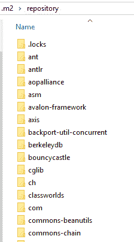
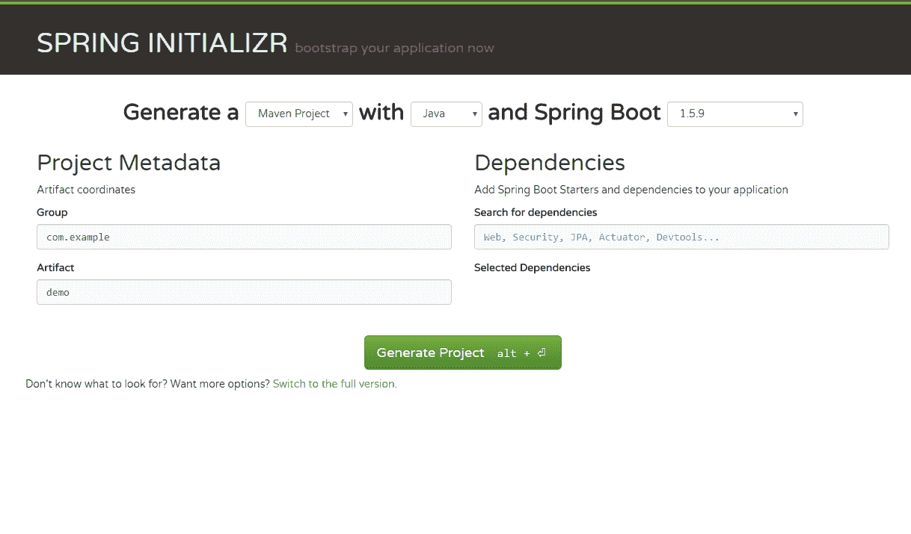
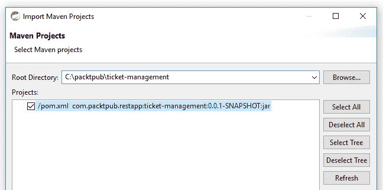

# 二、在 Spring5 中使用 Maven 构建 RESTfulWeb 服务

在本章中，我们将构建一个返回`Aloha`的简单 REST web 服务。在开始实现之前，我们将关注创建 RESTful web 服务所涉及的组件。在本章中，我们将介绍以下主题：

*   使用 ApacheMaven 构建 RESTful web 服务
*   使用 Eclipse IDE 或 STS for Spring REST 项目
*   在 Eclipse/STS 中创建新项目
*   运行和测试我们的 RESTAPI

# ApacheMaven

在构建雅加达涡轮机项目时，工程师们发现管理 Ant 构建工具很困难。他们需要一个简单的工具来构建一个易于理解的清晰定义的项目。他们的尝试塑造了 ApacheMaven，JAR 可以在中心的几个项目中共享。

More information on Maven can be found at [https://maven.apache.org](https://maven.apache.org).

ApacheMaven 的创建是为了支持 Java 项目和构建管理。此外，它的简化定义使 Java 开发人员在构建和部署 Java 项目时的生活更加轻松。

在撰写本书时，ApacheMaven 的最新版本是 3.5.0，可以从他们的网站下载：[https://maven.apache.org/download.cgi](https://maven.apache.org/download.cgi) 。

Maven 3.3+需要 JDK 1.7 或更高版本。因此，当您使用 Maven 3.3 时，请确保您的 Java 版本。

您可以从前面的链接获取二进制或源 ZIP 文件（或操作系统所需的任何格式），然后将 Maven 安装到您的计算机上。

可以通过在控制台/命令提示符中输入`mvn --version`命令来验证 Maven 的安装。如果安装成功，它将显示以下详细信息（仅在 Windows 操作系统上）：


为清晰起见，下图显示了在 Ubuntu 上执行的 Maven 版本检查：


# 使用 Maven 创建项目

一旦安装并验证了 Maven，就必须使用 Maven 创建一个项目。这可以在命令提示符本身中执行。只需在所需位置运行以下命令，即可自动创建项目：

```java
mvn archetype:generate -DgroupId=com.packtpub.restapp -DartifactId=ticket-management -DarchetypeArtifactId=maven-archetype-quickstart -DinteractiveMode=false -Dversion=1.0.0-SNAPSHOT
```

如果在创建项目时遇到任何问题，请使用 Maven 中的`–X`选项，如下所示。它将指出发生错误的位置：

```
mvn –X archetype:generate -DgroupId=com.packtpub.restapp -DartifactId=ticket-management -DarchetypeArtifactId=maven-archetype-quickstart -DinteractiveMode=false -Dversion=1.0.0-SNAPSHOT
```

在以下几点中，我们将介绍用于创建 Maven 项目的命令的每个部分：

*   `archetype:generate`：如果目标是在指定原型上创建新项目，则使用此选项，在我们的示例`maven-archetype-quickstart`中。
*   `-Dgroupid=com.packtpub.restapp`：这部分定义了一个带有组标识符的项目，例如包。
*   `-DartifcatId=ticket-management`：这部分定义了我们的项目名称（文件夹）。
*   `-DarchetypeArtifactId=maven-archetype-quickstart`：此部分将用于选择`archetype:generate`目标的原型。
*   `-Dversion=1.0.0-SNAPSHOT`：本部分可提及项目版本。当您部署并分发项目时，它将非常有用。

# 创建项目后查看 POM 文件

一旦我们创建了一个项目，我们就可以在项目文件夹中看到`pom.xml`文件。它将包含所有基本细节，例如`groupId`、`name`等等。另外，您可以在`dependencies`配置部分下看到默认的`Junit`依赖项：

```
<project  xmlns:xsi="http://www.w3.org/2001/XMLSchema-instance"
xsi:schemaLocation="http://maven.apache.org/POM/4.0.0 http://maven.apache.org/maven-v4_0_0.xsd">
  <modelVersion>4.0.0</modelVersion>
  <groupId>com.packtpub.restapp</groupId>
  <artifactId>ticket-management</artifactId>
  <packaging>jar</packaging>
  <version>1.0-SNAPSHOT</version>
  <name>ticket-management</name>
  <url>http://maven.apache.org</url>
  <dependencies>
    <dependency>
      <groupId>junit</groupId>
      <artifactId>junit</artifactId>
      <version>3.8.1</version>
      <scope>test</scope>
    </dependency>
  </dependencies> 
</project>
```

Maven 工件属于一个组（通常为`com.organization.product`），并且必须具有唯一标识符。

在前面的 POM 文件中，`version`中的`SNAPSHOT`后缀告诉 Maven 该项目仍在开发中。

# POM 文件结构

在这里，我们将检查**项目对象模型**（**POM**）文件结构，了解它是如何组织的，以及`pom.xml`文件中有哪些部分可用。POM 文件可以有`properties`、`dependencies`、`build`和`profiles`。但是，这些部分因项目而异。在其他项目中，我们可能不需要其中一些：

```
<project>
  // basic project info comes here  
  <properties>
    // local project based properties can be stored here 
  <properties>  
  <dependencies>
    // all third party dependencies come here
  </dependencies>
  <build>
    <plugins>
      // build plugin and compiler arguments come here
    </plugins>
  </build>
  <profiles>
    All profiles like staging, production come here
  </profiles> 
</project>
```

# 理解 POM 依赖关系

Maven 帮助管理操作系统中的第三方库。在过去，您可能不得不手动将每个第三方库复制到项目中。当您有多个项目时，这可能是一个大问题。Maven 通过将所有库放在每个操作系统的中心位置，避免了这种第三方库管理混乱。无论项目数量如何，第三方库将只下载到系统中一次。

Maven 存储库可在[找到 https://mvnrepository.com/](https://mvnrepository.com/) 。

每个操作系统都有自己的本地 Maven 存储库位置：

*   Windows Maven 中央存储库位置：
    `C:\Users\<username>\.m2\repository\`
*   Linux Maven 中央存储库位置：
    `/home/<username>/.m2/repository`
*   MAC Maven 中央存储库位置：
    `/Users/<username>/.m2/repository`

每当您向 POM 依赖项添加第三方库时，指定的 JAR 和相关文件都会复制到位置`\.m2\repository`。

我们将通过查看一个示例来了解 Maven 依赖结构。假设我们需要在应用程序中使用 Log4j 版本 2.9.1。为了使用它，我们需要将依赖项添加到项目中。我们可以从[中搜索`log4j-core`依赖项 https://mvnrepository.com](https://mvnrepository.com) 并将依赖项复制到`dependencies`下的 POM 中。

Maven 依赖项示例如下所示：


# 将 log4j2.9.1 添加到 POM 依赖项

添加依赖项并在 IDE 上更新项目后，相应的库将复制到`\.m2\repository`：

```
<dependency>
    <groupId>org.apache.logging.log4j</groupId>
    <artifactId>log4j-core</artifactId>
    <version>2.9.1</version>
</dependency>
```

前面的依赖项`log4j-core`将添加到 POM 下。在这个依赖关系中，您可以看到`groupId`、`artifactId`和`version`的解释如下：

*   `groupId`用于使 JAR/WAR 文件在所有项目中都是唯一的。由于它将在全球范围内使用，Maven 建议包名遵循与具有子组的域名相同的规则。样本`groupId`为`com.google.appengine`。但是，某些第三方依赖项不遵循`groupId`包命名策略。检查以下示例：

```
<dependency>
    <groupId>joda-time</groupId>
    <artifactId>joda-time</artifactId>
    <version>2.9.9</version>
</dependency>
```

*   `artifactId`只是 JAR/WAR 文件的名称，没有扩展名。
*   `version`带有数字，显示 JAR 文件版本。一些 JAR 文件附带了额外的信息，例如`RELEASE`，例如`3.1.4.RELEASE`。
    以下代码将`spring-security-web`库`3.1.4`JAR 文件下载到存储库位置：

```
<dependency>
  <groupId>org.springframework.security</groupId>
  <artifactId>spring-security-web</artifactId>
  <version>3.1.4.RELEASE</version>
</dependency>
```

`Log4j-core`文件（在 Windows 中）将显示如下：


有时，在 IDE 上更新项目时，您可能会看到`.jar`文件丢失。在这种情况下，删除整个文件夹（在我们的例子中是`log4j-core`文件夹），并再次更新它们。为了更新丢失的 JAR 文件，在删除文件夹后，只需通过右键单击项目并选择 Maven | update project 来更新 IDE（本例中为 STS/Eclipse）。最后，确保文件夹下有可用的`.jar`文件。

`.m2\repository`中的样本库应显示如下：



当您更新项目（在 Eclipse 或任何其他 IDE 中）时，它会将 JAR 和相关文件从远程 Maven 存储库获取到系统的中央存储库。

# 依赖树

依赖关系树可以在项目中用于定位特定的依赖关系。如果您想知道任何特定的库，例如为什么使用它，您可以通过执行依赖关系树来检查。此外，还可以扩展依赖关系树以显示依赖关系冲突。

以下代码显示了依赖项库及其组织方式：

```
mvn dependency:tree
```

通过在您的项目文件夹（或任何有`pom.xml`文件的地方）上执行该命令，您可以查看依赖关系树，其结构如下：

```
[INFO] --- maven-dependency-plugin:2.8:tree (default-cli) @ ticket-management ---
[INFO] com.packtpub.restapp:ticket-management:jar:0.0.1-SNAPSHOT
[INFO] +- org.springframework:spring-web:jar:5.0.0.RELEASE:compile
[INFO] | +- org.springframework:spring-beans:jar:5.0.0.RELEASE:compile
[INFO] | \- org.springframework:spring-core:jar:5.0.0.RELEASE:compile
[INFO] | \- org.springframework:spring-jcl:jar:5.0.0.RELEASE:compile
[INFO] +- org.springframework.boot:spring-boot-starter-tomcat:jar:1.5.7.RELEASE:compile
[INFO] | +- org.apache.tomcat.embed:tomcat-embed-core:jar:8.5.20:compile
[INFO] | +- org.apache.tomcat.embed:tomcat-embed-el:jar:8.5.20:compile
[INFO] | \- org.apache.tomcat.embed:tomcat-embed-websocket:jar:8.5.20:compile
[INFO] +- org.springframework.boot:spring-boot-starter:jar:1.5.7.RELEASE:compile
[INFO] | +- org.springframework.boot:spring-boot:jar:1.5.7.RELEASE:compile
[INFO] | +- org.springframework.boot:spring-boot-autoconfigure:jar:1.5.7.RELEASE:compile
[INFO] | +- org.springframework.boot:spring-boot-starter-logging:jar:1.5.7.RELEASE:compile
[INFO] | | +- ch.qos.logback:logback-classic:jar:1.1.11:compile
[INFO] | | | \- ch.qos.logback:logback-core:jar:1.1.11:compile
[INFO] | | +- org.slf4j:jcl-over-slf4j:jar:1.7.25:compile
[INFO] | | +- org.slf4j:jul-to-slf4j:jar:1.7.25:compile
[INFO] | | \- org.slf4j:log4j-over-slf4j:jar:1.7.25:compile
[INFO] | \- org.yaml:snakeyaml:jar:1.17:runtime
[INFO] +- com.fasterxml.jackson.core:jackson-databind:jar:2.9.2:compile
[INFO] | +- com.fasterxml.jackson.core:jackson-annotations:jar:2.9.0:compile
[INFO] | \- com.fasterxml.jackson.core:jackson-core:jar:2.9.2:compile
[INFO] +- org.springframework:spring-webmvc:jar:5.0.1.RELEASE:compile
[INFO] | +- org.springframework:spring-aop:jar:5.0.1.RELEASE:compile
[INFO] | +- org.springframework:spring-context:jar:5.0.1.RELEASE:compile
[INFO] | \- org.springframework:spring-expression:jar:5.0.1.RELEASE:compile
[INFO] +- org.springframework.boot:spring-boot-starter-test:jar:1.5.7.RELEASE:test
[INFO] | +- org.springframework.boot:spring-boot-test:jar:1.5.7.RELEASE:test
[INFO] | +- org.springframework.boot:spring-boot-test-autoconfigure:jar:1.5.7.RELEASE:test
[INFO] | +- com.jayway.jsonpath:json-path:jar:2.2.0:test
[INFO] | | +- net.minidev:json-smart:jar:2.2.1:test
[INFO] | | | \- net.minidev:accessors-smart:jar:1.1:test
[INFO] | | | \- org.ow2.asm:asm:jar:5.0.3:test
[INFO] | | \- org.slf4j:slf4j-api:jar:1.7.16:compile
[INFO] | +- junit:junit:jar:4.12:test
[INFO] | +- org.assertj:assertj-core:jar:2.6.0:test
[INFO] | +- org.mockito:mockito-core:jar:1.10.19:test
[INFO] | | \- org.objenesis:objenesis:jar:2.1:test
[INFO] | +- org.hamcrest:hamcrest-core:jar:1.3:test
[INFO] | +- org.hamcrest:hamcrest-library:jar:1.3:test
[INFO] | +- org.skyscreamer:jsonassert:jar:1.4.0:test
[INFO] | | \- com.vaadin.external.google:android-json:jar:0.0.20131108.vaadin1:test
[INFO] | \- org.springframework:spring-test:jar:4.3.11.RELEASE:test
[INFO] +- io.jsonwebtoken:jjwt:jar:0.6.0:compile
[INFO] \- org.springframework.boot:spring-boot-starter-aop:jar:1.5.7.RELEASE:compile
[INFO] \- org.aspectj:aspectjweaver:jar:1.8.10:compile
```

# Spring 靴

Spring Boot 是一个快速且易于配置的 Spring 应用程序。与其他 Spring 应用程序不同，构建 Spring 引导应用程序不需要太多配置，因此您可以非常快速、轻松地开始构建它。

SpringBoot 帮助我们创建一个独立的应用程序，它可以快速嵌入 Tomcat 或其他容器。

# 开发 restfulweb 服务

要创建新项目，我们可以使用 Maven 命令提示符或在线工具，如 Spring Initializer（[http://start.spring.io](http://start.spring.io) ），生成项目库。这个网站可以方便地创建一个简单的基于 Spring Boot 的 web 项目来启动这个项目。

# 创建项目库

我们去[http://start.spring.io](http://start.spring.io) 在我们的浏览器中，通过填写以下参数来配置我们的项目，以创建项目库：

*   组：`com.packtpub.restapp`
*   神器：`ticket-management`
*   搜索依赖项：`Web`（使用 Tomcat 和 Spring MVC 进行全栈 web 开发）

配置我们的项目后，它将如以下屏幕截图所示：



现在，您可以通过单击 generate project 来生成项目。项目（ZIP 文件）应下载到您的系统中。解压`.zip`文件，您会看到如下截图所示的文件：


复制整个文件夹（`ticket-management`，并将其保存在所需位置。

# 使用您最喜欢的 IDE

现在是选择 IDE 的时候了。尽管 Spring Boot 项目使用了很多 IDE，但我还是建议使用**Spring 工具套件**（**STS**），因为它是开源的，并且易于管理项目。在我的例子中，我使用`sts-3.8.2.RELEASE`。您可以从以下链接下载最新的 STS:[https://spring.io/tools/sts/all](https://spring.io/tools/sts/all) 。在大多数情况下，您可能不需要安装；只需解压缩文件并开始使用它：


提取 STS 后，您可以通过运行`STS.exe`（如上图所示）开始使用该工具。

在 STS 中，可以通过选择现有 Maven 项目导入项目，如下所示：



导入项目后，您可以在 Package Explorer 中看到该项目，如以下屏幕截图所示：


默认情况下可以看到主 Java 文件（`TicketManagementApplication`：


为了简化项目，我们将清理现有 POM 文件并更新所需的依赖项。将此文件配置添加到`pom.xml`：

```
<?xml version="1.0" encoding="UTF-8"?>
<project  xmlns:xsi="http://www.w3.org/2001/XMLSchema-instance"
  xsi:schemaLocation="http://maven.apache.org/POM/4.0.0 http://maven.apache.org/xsd/maven-4.0.0.xsd">
  <modelVersion>4.0.0</modelVersion>
  <groupId>com.packtpub.restapp</groupId>
  <artifactId>ticket-management</artifactId>
  <version>0.0.1-SNAPSHOT</version>
  <packaging>jar</packaging>
  <name>ticket-management</name>
  <description>Demo project for Spring Boot</description>
  <properties>
    <project.build.sourceEncoding>UTF-8</project.build.sourceEncoding>
    <project.reporting.outputEncoding>UTF-8</project.reporting.outputEncoding>
  </properties>
  <dependencies>
      <dependency>
      <groupId>org.springframework</groupId>
      <artifactId>spring-web</artifactId>
      <version>5.0.1.RELEASE</version>
    </dependency>  
    <dependency>
      <groupId>org.springframework.boot</groupId>
      <artifactId>spring-boot-starter</artifactId>
      <version>1.5.7.RELEASE</version>
    </dependency>
    <dependency>
      <groupId>org.springframework.boot</groupId>
      <artifactId>spring-boot-starter-tomcat</artifactId>
      <version>1.5.7.RELEASE</version>
    </dependency>    
    <dependency>
      <groupId>com.fasterxml.jackson.core</groupId>
      <artifactId>jackson-databind</artifactId>
      <version>2.9.2</version>
    </dependency>
    <dependency>
      <groupId>org.springframework</groupId>
      <artifactId>spring-web</artifactId>
      <version>5.0.0.RELEASE</version>
    </dependency>
    <dependency>
      <groupId>org.springframework</groupId>
      <artifactId>spring-webmvc</artifactId>
      <version>5.0.1.RELEASE</version>
    </dependency>
    <dependency>
      <groupId>org.springframework.boot</groupId>
      <artifactId>spring-boot-starter-test</artifactId>
      <scope>test</scope>
      <version>1.5.7.RELEASE</version> 
    </dependency> 
  </dependencies>
  <build>
    <plugins>
      <plugin>
        <groupId>org.springframework.boot</groupId>
        <artifactId>spring-boot-maven-plugin</artifactId>
      </plugin>
    </plugins>
  </build>
</project>
```

在前面的配置中，您可以检查我们是否使用了以下库：

*   `spring-web`
*   `spring-boot-starter`
*   `spring-boot-starter-tomcat`
*   `spring-bind`
*   `jackson-databind`

由于项目运行需要前面的依赖项，我们已将它们添加到我们的`pom.xml`文件中。

到目前为止，我们已经为 SpringWeb 服务准备好了基础项目。让我们向应用程序添加一个基本的 REST 代码。首先，从`TicketManagementApplication`类中删除`@SpringBootApplication`注释，并添加以下注释：

```
@Configuration
@EnableAutoConfiguration
@ComponentScan
@Controller
```

这些注释将帮助该类充当 web 服务类。在本章中，我不打算多谈这些配置将做什么。添加注释后，请添加一个简单方法以返回字符串作为我们的基本 web 服务方法：

```
@ResponseBody
@RequestMapping("/")
public String sayAloha(){
  return "Aloha";
}
```

最后，您的代码如下所示：

```
package com.packtpub.restapp.ticketmanagement;
import org.springframework.boot.SpringApplication;
import org.springframework.boot.autoconfigure.EnableAutoConfiguration;
import org.springframework.context.annotation.ComponentScan;
import org.springframework.context.annotation.Configuration;
import org.springframework.stereotype.Controller;
import org.springframework.web.bind.annotation.RequestMapping;
import org.springframework.web.bind.annotation.ResponseBody;
@Configuration
@EnableAutoConfiguration
@ComponentScan
@Controller
public class TicketManagementApplication { 
  @ResponseBody
  @RequestMapping("/")
  public String sayAloha(){
    return "Aloha";
  }
  public static void main(String[] args) {
    SpringApplication.run(TicketManagementApplication.class, args);
  }
}
```

完成所有编码更改后，只需在 Spring Boot 应用程序上运行项目（作为| Spring Boot 应用程序运行）。通过在控制台中检查以下消息，可以验证应用程序是否已加载：

```
Tomcat started on port(s): 8080 (http)
```

验证后，只需键入`localhost:8080`即可在浏览器上检查 API。查看以下屏幕截图：


如果要更改端口号，可以在`src/main/resources/application.properties`中的`application.properties`中配置不同的端口号。查看以下屏幕截图：


# 总结

在本章中，我们已经了解了如何设置 Maven 构建来支持 web 服务的基本实现。此外，我们还了解了 Maven 在第三方库管理以及 SpringBoot 和基本 SpringREST 项目中的帮助。在接下来的章节中，我们将更多地讨论 SpringREST 端点和 Reactor 支持。