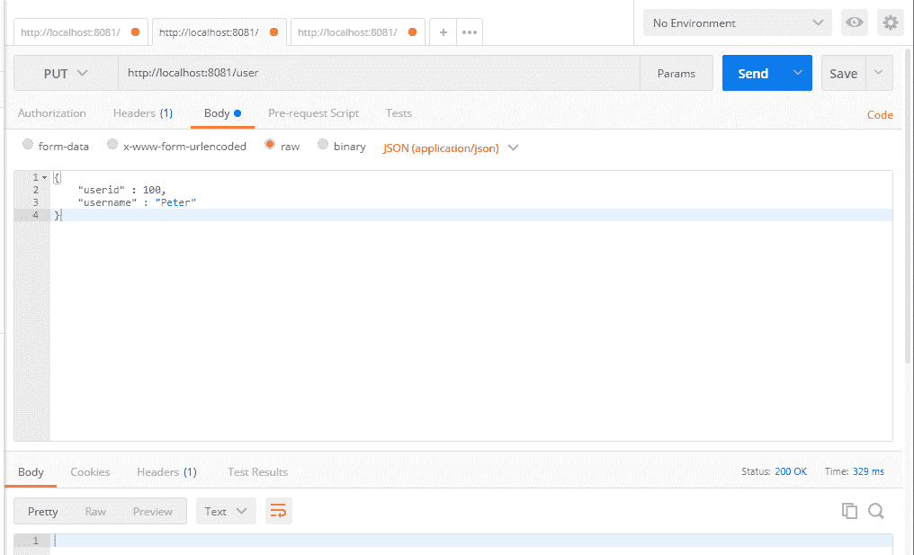

# SpringRest 中的 CRUD 操作

在这一章中，我们将在 Spring5 中完成基本的**创建**、**读取**、**更新**和**删除**（**CRUD**）API。在本章之后，您将能够在 Spring5 中使用 Reactor 支持进行简单的 CRUD 操作。

在本章中，我们将介绍以下方法：

*   将 CRUD 操作映射到 HTTP 方法
*   创建用户
*   更新用户
*   删除用户
*   读取（选择）用户

# SpringRest 中的 CRUD 操作

在本章中，我们将介绍 Spring5 中的用户管理（使用响应式支持）。我们将在用户管理中实施 CRUD 操作。

# HTTP 方法

基于 HTTP 1.1 规范，以下是方法定义：

*   `GET`：此方法获取 URI 中提到的信息。`GET`方法可用于单个或多个项目。
*   `POST`：此方法创建 URI 中提到的项。通常，`POST`方法将用于项目创建和更安全的选项。由于参数隐藏在`POST`中，因此与`GET`方法相比是安全的。
*   `DELETE`：此方法删除请求 URI 中的项目。
*   `PUT`：此方法更新请求 URI 中的项目。根据 HTTP 规范，如果项目不可用，服务器可以创建该项目。但是，这将由设计应用程序的开发人员决定。
*   **高级 HTTP 方法**：虽然我们可能不会一直使用高级方法，但了解这些方法会很好，因为它们可能很有用：

    *   `HEAD`：此方法作为响应获取资源的元信息，而不是资源本身。它将用于缓存目的。
    *   `TRACE`：此方法主要用于调试目的，HTTP 请求的内容将发送回请求者。
    *   `CONNECT`：用于开通隧道，可代理使用。
    *   `OPTIONS`：此方法用于描述目标资源的通信选项。

以下是针对 CRUD 操作的 HTTP 方法建议：

| **操作** | **HTTP 方式** |
| 创造 | `POST` |
| 阅读 | `GET` |
| 使现代化 | `PUT` |
| 删去 | `DELETE` |

在本章的其余部分，我们将展示如何构建 CRUD 操作。

# 反应式服务器初始化

在跳到端点之前，我们将探索文件的结构，包括初始值设定项、处理程序和存储库。

初始化我方端口`8081`的`Server`类如下：

```java
public class Server { 
  public static final String HOST = "localhost";
  public static final int PORT = 8081;
  public static void main(String[] args) throws InterruptedException, IOException{
    Server server = new Server(); 
    server.startReactorServer(); 
    System.out.println("Press ENTER to exit.");
    System.in.read();
  }
  public void startReactorServer() throws InterruptedException {
    RouterFunction<ServerResponse> route = routingFunction();
    HttpHandler httpHandler = toHttpHandler(route);
    ReactorHttpHandlerAdapter adapter = new ReactorHttpHandlerAdapter(httpHandler);
    HttpServer server = HttpServer.create(HOST, PORT);
    server.newHandler(adapter).block();
  }
  public RouterFunction<ServerResponse> routingFunction() {
    // our Endpoints will be coming here
  }
} 
```

在前面的方法中，我们创建了一个`main`类。在`main`方法中，我们将初始化服务器并使用以下代码启动服务器：

```java
Server server = new Server(); 
server.startReactorServer(); 
```

前面的方法将启动 Reactor 服务器。Reactor 服务器的实现如下所示：

```java
RouterFunction<ServerResponse> route = routingFunction();
HttpHandler httpHandler = toHttpHandler(route);
ReactorHttpHandlerAdapter adapter = new ReactorHttpHandlerAdapter(httpHandler);
HttpServer server = HttpServer.create(HOST, PORT);
server.newHandler(adapter).block();
```

我们稍后再看这段代码，因为这个概念是基于反应的。让我们假设这段代码运行良好，我们将继续，重点关注端点。

以下是为 CRUD 操作映射所有 REST 端点的方法：

```java
public RouterFunction<ServerResponse> routingFunction() {
    // our Endpoints will be coming here
}
```

您可能会在`UserRepository`和`UserHandler`上出现错误。现在让我们把这些填满：

```java
package com.packtpub.reactive;
public interface UserRepository {
    // repository functions will be coming here
}
```

在前面的代码中，我们刚刚在现有的包`com.packtpub.reactive`中添加了`UserRepository`接口。稍后，我们将介绍用于业务需求的抽象方法。

现在，我们可以添加一个`UserHandler`类，并添加必要的东西：

```java
package com.packtpub.reactive;
// import statements
public class UserHandler {    
    private final UserRepository userRepository;  
    public UserHandler(UserRepository userRepository){
        this.userRepository = userRepository;
    }
}
```

在前面的代码中，`UserHandler`在其构造函数中初始化`UserRepository`实例。如果有人得到一个`UserHandler`实例，他们必须将`UserRepository`类型传递给`UserHandler`构造函数。通过这样做，`UserRepository`将始终转发到`UserHandler`以满足业务需求。

# 存储库中的示例值

为了使用存储库，我们必须创建一个具体的类并填写一些值来测试`GET`操作。通过以下方法，我们可以做到这一点：

```java
package com.packtpub.reactive;
// import statements
public class UserRepositorySample implements UserRepository {    
  // initiate Users
  private final Map<Integer, User> users = new HashMap<>();
  // fill dummy values for testing
  public UserRepositorySample() {
    this.users.put(100, new User(100, "David"));
    this.users.put(101, new User(101, "John"));
    this.users.put(102, new User(102, "Kevin"));
  }
} 
```

在前面的类中，我们刚刚实现了`UserRepository`并填充了一些样本值。

为了简化代码，我们只使用了基于应用程序的数据存储，这意味着一旦应用程序重新启动，我们的数据将被重新初始化。在这种情况下，我们无法在应用程序中存储任何新数据。然而，这将有助于我们专注于我们的主要主题，如反应式和 Spring5，它们与持久性无关。

我们可以通过`routing`方法使用此样本库：

```java
public RouterFunction<ServerResponse> routingFunction() {
    UserRepository repository = new UserRepositorySample();
    UserHandler handler = new UserHandler(repository);
}
```

前面几行将在我们的存储库中插入虚拟值。这将足以测试`GET`操作。

# getAllUsers–映射

在`routingFunction`中，我们将添加`getAllUsers`的第一个端点。首先，我们将在处理程序中保留`null`值，以避免代码中出现错误：

```java
    return nest (
        path("/user"),
        nest(
          accept(MediaType.ALL),
          route(GET("/"), null)
        )    
    );
```

前面的`nest`方法将用于路由到正确的功能，也将用于对其他路由器进行分组。在前面的方法中，我们在路径中使用`/user`，并使用`GET("/")`方法作为路由器。此外，我们使用`MediaType.ALL`接受所有媒体范围，以简化代码。

# getAllUsers–处理程序和存储库中的实现

在这里，我们将在我们的存储库中定义并实现`getAllUsers`方法。另外，我们将通过`UserHandler`调用`main`类中的`getAllUsers`方法。

我们将在`UserRepository`类中为`getAllUsers`方法添加一个抽象方法：

```java
Flux<User> getAllUsers();
```

与任何其他接口和具体类实现一样，我们必须在接口中添加抽象方法，在本例中为`UserRespository`。前面的代码只是在`UserRepository`类中添加了`getAllUsers`。

在`UserRepositorySample`（`UserRepository`的具体类）中，我们将实现抽象方法`getAllUsers`：

```java
// this method will return all users
@Override
public Flux<User> getAllUsers() {
    return Flux.fromIterable(this.users.values());
}
```

在前面的代码中，我们添加了方法`getAllUsers`并实现了业务逻辑。由于我们已经在`UserRepositorySample`构造函数中定义了用户，所以我们只需要返回用户。`Flux`类有一个名为`fromIterable`的方法，用于从我们的`UserRepositorySample`获取所有用户。

`fromIterable`方法将返回一个通量，该通量将发出 Java 集合接口中包含的项。由于集合实现了 iterable 接口，`fromIterable`将是在我们的例子中返回`Flux`的完美方法。

在`UserHandler.java`文件中，我们将添加代码以使所有用户都处于被动状态。以下代码将引导我们了解必要的详细信息：

```java
public Mono<ServerResponse> getAllUsers(ServerRequest request){
  Flux<User> users = this.userRepository.getAllUsers();
  return ServerResponse.ok().contentType(APPLICATION_JSON).body(users, User.class); 
}
```

在前面的代码中，我们将在`Flux`中从存储库中获取所有用户，并在响应中以 JSON 类型发送他们。服务器响应内容类型更新为`APPLICATION_JSON`

现在是在我们的路由方法中添加第一个方法`getAllUsers`的时候了。在这里，我们将只使用一种路由方法来映射所有 RESTAPI

最后，我们的路由函数将在`Server.java`中显示如下：

```java
public class Server {    
    // existing code is hidden
    public RouterFunction<ServerResponse> routingFunction() {
        UserRepository repository = new UserRepositorySample();
        UserHandler handler = new UserHandler(repository);
        return nest (
            path("/user"),
            nest(
              accept(MediaType.ALL),
              route(GET("/"), handler::getAllUsers)
        ) 
    );
}
```

在前面的代码中，我们创建了一个`UserRepository`并将其转发给我们的`UserHandler`。`UserHandler`会自动调用`UserSampleRepository`中的`getAllUsers`方法。通过调用`UserHandler`的`getAllUsers`方法，我们将从之前实现的示例存储库类中获取所有用户。

这里，我们使用`nest`方法并提供参数，例如 API 路径`GET("/")`和媒体类型。由于`nest`方法接受`RoutingFunction`作为第二个参数，我们可以在基本`nest`方法中使用更多的`nest`方法。通过内部嵌套的方式，我们实现了业务需求：我们的基本 REST API 从`"/user"`开始，基本 get users API 路由从`"/"`开始

因此，基本 API 路径`/user`将自动调用`getAllUsers`方法，因为它是在前面的代码中实现的。

# 测试端点–getAllUsers

我们已经完成了第一个 API 实现，现在可以通过在浏览器中调用以下 URI 来测试它：

```java
http://localhost:8081/user
```

您应该得到以下结果：

```java
[
  {
    userid: 100,
    username: "David"
  },
  {
    userid: 101,
    username: "John"
  },
  {
    userid: 102,
    username: "Kevin"
  }
]
```

您还可以在任何 REST 客户机中检查 API，如 Postman/SoapUI 或任何其他 REST 客户机。

# getUser–处理程序和存储库中的实现

在这里，我们将在我们的存储库中定义并实现`getUser`方法。另外，我们将通过`UserHandler`调用`main`类中的`getUser`方法。

我们将在`UserRepository`类中为`getUser`方法添加一个抽象方法：

```java
Mono<User> getUser(Integer id);
```

在这里，我们将添加`getUser`方法的代码。您可以看到，我们对单个资源访问使用了`Mono`返回类型。

在`UserRepositorySample`类`UserRepository`的具体类中，我们将实现抽象方法`getUser`：

```java
@Override
public Mono<User> getUser(Integer id){
    return Mono.justOrEmpty(this.users.get(id)); 
}
```

在前面的代码中，我们已经通过`id`检索到了特定的用户。此外，我们还提到，如果用户不可用，应该要求该方法返回一个空的 Mono。

在`UserHandler`方法中，我们将讨论如何处理请求并应用我们的业务逻辑来获得响应：

```java
public Mono<ServerResponse> getUser(ServerRequest request){
    int userId = Integer.valueOf(request.pathVariable("id"));
    Mono<ServerResponse> notFound = ServerResponse.notFound().build();
    Mono<User> userMono = this.userRepository.getUser(userId);
    return userMono
        .flatMap(user -> ServerResponse.ok().contentType(APPLICATION_JSON).body(fromObject(user)))
        .switchIfEmpty(notFound); 
}
```

在前面的代码中，我们刚刚将字符串`id`转换为整数，以便将其提供给我们的`Repository`方法（`getUser`。一旦我们收到来自`Repository`的结果，我们就用`JSON`内容类型将其映射到`Mono<ServerResponse>`。此外，如果没有可用的项目，我们使用`switchIfEmpty`发送适当的响应。如果搜索项不可用，它将简单地返回空的`Mono`对象作为响应。

最后，我们将在我们的路由路径中添加`getUser`，在`Server.java`中：

```java
public RouterFunction<ServerResponse> routingFunction() {
    UserRepository repository = new UserRepositorySample();
    UserHandler handler = new UserHandler(repository);    
    return nest (
      path("/user"),
      nest(
        accept(MediaType.ALL),
        route(GET("/"), handler::getAllUsers)
      )
      .andRoute(GET("/{id}"), handler::getUser)      
    );
}
```

在前面的代码中，我们刚刚在现有路由路径中添加了一个新条目`.andRoute(GET("/{id}"), handler::getUser)`。通过这样做，我们添加了`getUser`方法和相应的 RESTAPI 部分来访问单个用户。重新启动服务器后，我们应该能够使用 RESTAPI。

# 测试端点–getUser

我们已经完成了第一个 API 实现，现在可以通过使用`GET`方法在浏览器中调用以下 URI 来测试它：

```java
http://localhost:8081/user/100
```

您应该得到以下结果：

```java
{
    userid: 100,
    username: "David"
}
```

# createUser–处理程序和存储库中的实现

在这里，我们将在我们的存储库中定义并实现`createUser`方法。另外，我们将通过`UserHandler`调用`main`类中的`createUser`方法。

我们将在`UserRepository`类中为`createUser`方法添加一个抽象方法：

```java
Mono<Void> saveUser(Mono<User> userMono);
```

这里，我们将讨论如何使用示例存储库方法保存用户。

在`UserRepositorySample`（`UserRepository`的具体类）中，我们将实现抽象方法`createUser`：

```java
@Override
public Mono<Void> saveUser(Mono<User> userMono) {
    return userMono.doOnNext(user -> { 
      users.put(user.getUserid(), user);
      System.out.format("Saved %s with id %d%n", user, user.getUserid());
    }).thenEmpty(Mono.empty());
}
```

在前面的代码中，我们使用`doOnNext`将用户保存到存储库中。同时，如果失败，该方法将返回空的`Mono`。

由于我们在存储库中添加了`createUser`方法，这里我们将跟进我们的处理程序：

```java
public Mono<ServerResponse> createUser(ServerRequest request) {
    Mono<User> user = request.bodyToMono(User.class);
    return ServerResponse.ok().build(this.userRepository.saveUser(user));
}
```

在`UserHandler`类中，我们创建了`createUser`方法，通过处理程序添加用户。在该方法中，我们通过`bodyToMono`方法将请求提取到`Mono`中。一旦`user`被创建，它将被转发到`UserRepository`保存该方法

最后，我们将在`Server.java`中添加 REST API 路径来保存我们现有路由函数中的`user`：

```java
public RouterFunction<ServerResponse> routingFunction() {
    UserRepository repository = new UserRepositorySample();
    UserHandler handler = new UserHandler(repository);
    return nest (
      path("/user"),
      nest(
        accept(MediaType.ALL),
        route(GET("/"), handler::getAllUsers)
      )
      .andRoute(GET("/{id}"), handler::getUser)
      .andRoute(POST("/").and(contentType(APPLICATION_JSON)), handler::createUser) 
    );
}
```

# 测试端点–createUser

我们已经完成了第一个 API 实现，现在可以通过在浏览器中调用以下 URI 来测试它：

```java
http://localhost:8081/user
```

由于我们不能在浏览器中使用`POST`方法，我们将在 REST API 客户端（称为 Postman）中测试它：


添加新用户后，您可以通过调用`getAllUsers`URI（`http://localhost:8081/user`来检查结果。

**Postman** is a REST client that can be used to build, test, and share REST API calls. Tools like these will be very helpful when we test our REST API without having to write code for testing.

**SoapUI** is another REST client and can be used as an alternative to Postman. 

# updateUser–在处理程序和存储库中实现

在这里，我们将在我们的存储库中定义并实现`updateUser`方法。另外，我们将通过`UserHandler`调用主类中的`updateUser`方法。

我们将在`UserRepository`类中为`updateUser`方法添加一个抽象方法：

```java
Mono<Void> updateUser(Mono<User> userMono);
```

在`UserRepositorySample`类中，我们将添加逻辑来更新代码。在这里，我们将使用`userid`作为键，`User`对象作为值来存储在我们的地图中：

```java
@;Override
public Mono<Void> updateUser(Mono<User> userMono) {
    return userMono.doOnNext(user -> { 
      users.put(user.getUserid(), user);
      System.out.format("Saved %s with id %d%n", user, user.getUserid());
    }).thenEmpty(Mono.empty());
}
```

在前面的代码中，我们通过添加指定的用户（来自请求）来更新用户。一旦用户添加到列表中，该方法返回`Mono<Void>`；否则返回`Mono.empty`对象

由于我们在存储库中添加了`updateUser`方法，这里我们将跟进我们的处理程序：

```java
public Mono<ServerResponse> updateUser(ServerRequest request) {
    Mono<User> user = request.bodyToMono(User.class);
    return ServerResponse.ok().build(this.userRepository.saveUser(user));
}
```

在前面的代码中，我们已经通过调用`bodyToMono`方法将用户请求转换为`Mono<User>`。`bodyToMono`方法将身体提取到`Mono`对象中，因此可用于保存选项。

与其他 API 路径一样，我们在`Server.java`中添加了`updateUser`API：

```java
public RouterFunction<ServerResponse> routingFunction() {
    UserRepository repository = new UserRepositorySample();
    UserHandler handler = new UserHandler(repository);
    return nest (
      path("/user"),
      nest(
        accept(MediaType.ALL),
        route(GET("/"), handler::getAllUsers)
      )
      .andRoute(GET("/{id}"), handler::getUser)
      .andRoute(POST("/").and(contentType(APPLICATION_JSON)), handler::createUser)
      .andRoute(PUT("/").and(contentType(APPLICATION_JSON)), handler::updateUser) 
    );
}
```

# 测试端点–updateUser

我们已经完成了第一个 API 实现，现在可以通过在 Postman 或 SoapUI 中调用 URI`http://localhost:8081/user`来测试它，使用`PUT`方法：



更新新用户后，您可以通过调用`getAllUsers`URI（`http://localhost:8081/user`来检查结果。

# deleteUser–处理程序和存储库中的实现

在这里，我们将在我们的存储库中定义并实现`deleteUser`方法。另外，我们将通过`UserHandler`调用`main`类中的`deleteUser`方法。

通常，我们会在`UserRepository`类中为`deleteUser`方法添加一个抽象方法：

```java
Mono<Void> deleteUser(Integer id);
```

在`UserRepositorySample.java`文件中，我们将添加`deleteUser`方法，将指定用户从列表中删除：

```java
@Override
public Mono<Void> deleteUser(Integer id) {
    users.remove(id); 
    System.out.println("user : "+users);   
    return Mono.empty();
}
```

在前面的方法中，我们只是从用户中删除元素并返回一个空的`Mono`对象。

由于我们在存储库中添加了`deleteUser`方法，这里我们将跟进我们的处理程序：

```java
public Mono<ServerResponse> deleteUser(ServerRequest request) { 
    int userId = Integer.valueOf(request.pathVariable("id"));
    return ServerResponse.ok().build(this.userRepository.deleteUser(userId));
}
```

最后，我们将在`Server.java`中添加 REST API 路径来保存我们现有路由函数中的`user`：

```java
public RouterFunction<ServerResponse> routingFunction() {
    UserRepository repository = new UserRepositorySample();
    UserHandler handler = new UserHandler(repository);
    return nest (
      path("/user"),
      nest(
        accept(MediaType.ALL),
        route(GET("/"), handler::getAllUsers)
      )
      .andRoute(GET("/{id}"), handler::getUser)
      .andRoute(POST("/").and(contentType(APPLICATION_JSON)), handler::createUser)
      .andRoute(PUT("/").and(contentType(APPLICATION_JSON)), handler::updateUser)
      .andRoute(DELETE("/{id}"), handler::deleteUser)
    );
}
```

# 测试端点–deleteUser

由于我们已经完成了第一个 API 实现，我们现在可以通过使用`DELETE`方法在我们的客户机（Postman 或 SoapUI）中调用 URI`http://localhost:8081/user/100`来测试它：


删除新用户后，可以调用`getAllUsers`URI（`http://localhost:8081/user`查看结果。

# 总结

在本章中，我们学习了如何使用反应式支持（Flux 和 Mono），以及如何将 API 与反应式组件集成。我们已经在 Reactor 服务器的帮助下学习了基于 restapi 的反应式 CRUD 操作。此外，我们还介绍了如何为 CRUD 操作添加路由选项，并讨论了 CRUD 操作中的 Flux 和 Mono 实现。

在接下来的章节中，我们将重点讨论 Spring5REST（没有 Reactor 支持），因为 SpringResponsiveLibraries/API 仍然处于不稳定模式，在主流应用程序中没有得到太多的使用。尽管 Spring 团队正式发布了对反应式的支持，但大多数业务需求并没有得到明确的实现和记录。考虑到这种情况，在接下来的章节中，我们将讨论 Spring5，而不涉及被动相关的主题。