# 一、准备您的开发环境

本章将安装和配置您的开发环境。**快速应用开发**（**RAD**工具是**NetBeans**，一个开源、跨平台**集成开发环境**（**IDE**，可用于创建可视化桌面、手机、网络和**面向服务的架构**（**SOA**应用。NetBeans 正式支持 Java、PHP、JavaScript 和 C/C++编程语言，但最著名的是它为所有最新的**Java 企业版**（**Java EE**）标准（目前为 Java EE 7）提供了完整的工具集。

本书选择的数据库是 MySQL，世界上使用最广泛的开源**关系数据库管理系统**（**RDBMS**）。MySQL 是 Linux 平台上托管的 web 应用最流行的数据库选择，并在众多应用中继续提供优异的性能。它占地面积小，易于使用，非常适合在一台计算机上进行开发使用。

本书中使用的应用服务器是**GlassFish 4**，它与 NetBeans 下载捆绑在一起。GlassFish 是作为 NetBeans 安装的一部分安装的，两者之间的紧密集成使配置 GlassFish 成为一个简单的过程。GlassFish 是一个开源、高质量的应用服务器，它实现了所有 JavaEE7 特性。它具有企业级的可靠性，许多人认为它是可用的最佳开源应用服务器。GlassFish 4 是针对 Java EE 7 规范的**参考实现**（**RI**），详细描述见[https://glassfish.java.net/downloads/ri/](https://glassfish.java.net/downloads/ri/) 。

所有这些开发工具都可免费用于 PC、Mac 和 Linux。每个工具都有广泛的示例、全面的教程和在线支持论坛。

应该注意的是，尽管本章重点介绍 NetBeans、MySQL 和 GlassFish，但您可以配置他们熟悉的任何适当的工具组合。使用 Eclipse、Oracle 和 JBoss 可以很容易地完成本书中概述的开发任务，尽管所描述的一些配置细节可能需要稍作修改。

在本章中，我们将执行以下任务：

*   安装 MySQL 数据库服务器
*   安装 JavaSDK
*   安装和配置 NetBeans IDE
*   创建应用项目并探索 Maven
*   在 GlassFish 中运行项目

# 安装 MySQL

MySQL 可以从[下载 http://www.mysql.com/downloads/mysql](http://www.mysql.com/downloads/mysql) 。为您的操作系统和体系结构选择适当的 MySQL 社区服务器。请务必遵循说明，记下安装目录和路径，以备将来参考。下载并运行安装文件后，应选择本书的**开发者默认**安装。

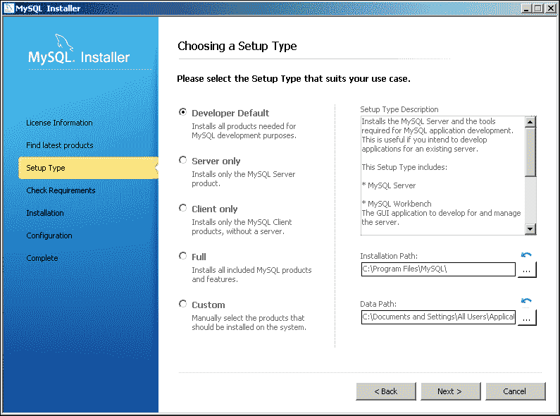

除非您熟悉 MySQL，否则最好选择默认设置。这将包括将默认端口设置为`3306`，启用 TCP/IP 网络，并打开所需的防火墙端口进行网络访问（对于所有应用都在同一环境中运行的开发人员计算机来说，这不是严格要求的，但如果您配置的是专用 MySQL 服务器，则需要）。

无论环境如何，在安装过程中设置根用户密码都很重要。我们将使用 root 用户连接到正在运行的 MySQL 服务器以执行命令。

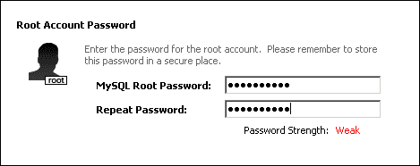

### 注

本书的其余部分将假定 root 用户拥有密码`adminadmin`。这不是一个非常安全的密码，但应该很容易记住！

我们建议将 MySQL 服务器配置为在操作系统启动时启动。这将取决于您的环境，但通常在**初始配置**操作结束时执行。Windows 用户可以选择在系统启动时启动 MySQL 服务器。Mac 用户需要在服务器安装完成后安装**MySQL 启动项**。

如果您决定在操作系统启动时不启动 MySQL，则需要在需要时手动启动 MySQL 服务器。这将再次取决于您的环境，但您应该立即启动服务器以确认安装是否成功。

### 注

Unix 和 Linux 用户需要安装适合其操作系统的 MySQL。这可能包括使用**高级打包工具（APT**或**另一个设置工具**（**YaST**），甚至从源代码安装 MySQL。[中有各种操作系统的详细说明 http://dev.mysql.com/doc/refman/5.7/en/installing.html](http://dev.mysql.com/doc/refman/5.7/en/installing.html) 。

在配置过程结束时，您将有一个正在运行的 MySQL 服务器，可以在[第 2 章](02.html "Chapter 2. The Task Time Tracker Database")、*任务时间跟踪数据库*中使用。

# 安装 JavaSE 开发工具包（JDK）

**Java****SE 开发工具包**（**JDK**）可以从[下载 http://www.oracle.com/technetwork/java/javase/downloads/index.html](http://www.oracle.com/technetwork/java/javase/downloads/index.html) 。如果系统上已经安装了 JDK 7 Update 45（或更高版本），则可以选择跳过此步骤。

### 注

不要选择 NetBeans 捆绑包，因为它不包含 GlassFish 服务器。

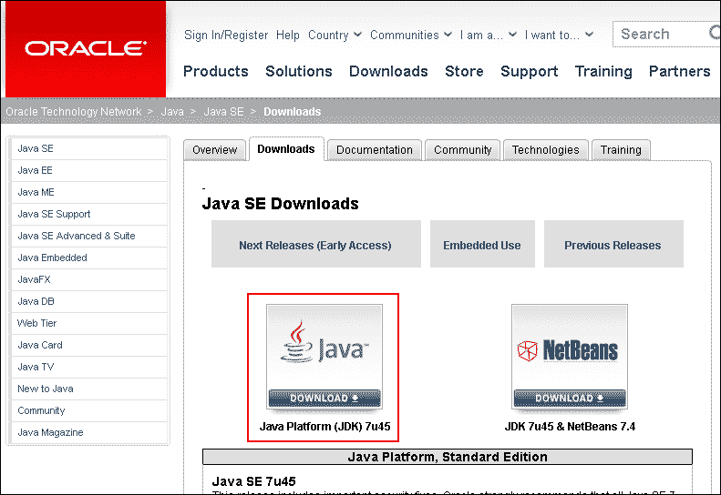

在选择合适的发行版之前，您需要接受 JDK 7 许可协议。下载 JDK 后，运行安装程序并按照说明和提示进行操作。

# 安装 NetBeans IDE

NetBeans 可以从[下载 https://netbeans.org/downloads/](https://netbeans.org/downloads/) 。发行版要求您的平台上已经安装了有效的 JDK。在撰写本文时，我使用了 JDK 7 Update 45，但任何 JDK 7（或更高版本）都可以。有几个分发包；您需要选择**Java EE**捆绑包。


撰写本文时最新的版本是 NetBeans 7.4，它引入了重要的新特性，包括扩展的 HTML5 和 JavaScript 支持。NetBeans 还首次包括对 ExtJS 框架的编辑和代码完成支持。

要安装该软件，只需下载并遵循 NetBeans 网站提供的详细说明即可。这将引导您完成一系列设置屏幕，如下所示：

1.  自动选择 GlassFish 4 服务器。您不需要安装 Tomcat。
2.  接受许可协议中的条款。
3.  接受 JUnit 许可协议的条款。JUnit 用于[第 5 章](05.html "Chapter 5. Testing the DAO Layer with Spring and JUnit")中的测试，*使用 Spring 和 JUnit*测试 DAO 层。
4.  请注意 NetBeans IDE 的安装路径，以供将来参考。选择以前安装的适当 JDK（如果系统上有多个 JDK）。
5.  请注意 GlassFish 4 服务器的安装路径，以供将来参考。
6.  最后一个屏幕总结了安装过程。确保在点击**安装**开始流程之前**检查**更新。

该过程可能需要几分钟，具体取决于您的平台和硬件。

安装完成后，您可以第一次运行 NetBeans。如果您安装了以前版本的 NetBeans，可能会提示您**导入设置**。默认打开屏幕将显示如下：


现在可以从菜单中打开最有用的面板：

*   **项目**：此面板是您的项目来源的主要入口点。它显示了重要项目内容的逻辑视图，并将其分组到适当的上下文中。
*   **文件**：此面板显示项目节点在文件系统中的实际文件结构。
*   **服务**：此面板显示您的运行时资源。它显示了重要运行时资源的逻辑视图，如向 IDE 注册的服务器和数据库。

在此阶段，前两个面板将为空，但**服务**面板将有多个条目。打开**服务器**面板将显示已安装的 GlassFish 4 服务器，如下图所示：


# 介绍马文

ApacheMaven 是一种用于构建和管理基于 Java 的项目的工具。这是一个托管在[的开源项目 http://maven.apache.org](http://maven.apache.org) 并与 NetBeans IDE 捆绑在一起。Maven 简化了所有 Java 开发项目通用的许多步骤，并提供了许多功能，包括以下功能：

*   约定优于配置的规定。Maven 附带了一系列预定义的目标，用于执行某些定义良好的任务，包括项目的编译、测试和打包。所有任务都通过单个配置文件进行管理：`pom.xml`。
*   一致的编码结构和项目框架。对于源文件、测试文件、构建文件和项目资源，每个 Maven 项目都具有相同的目录结构和位置。这种通用结构使我们能够轻松地跟上项目的进度。
*   一个具有众多插件的一致构建系统，以简化常见任务。
*   作为构建过程的一部分执行测试的能力。
*   高度灵活且功能强大的依赖关系管理系统。这允许软件开发人员通过（外部或远程）托管在 Internet 上的 Maven 存储库发布信息和共享 Java 库。然后，Maven 在本地下载和缓存库，以便在项目中使用。

我们鼓励您访问 Maven 网站，探索可用的许多功能。NetBeans 将使用 Maven 创建和管理 web 应用项目。

# 创建 Maven Web 应用项目

NetBeans 项目封装了维护和开发应用所需的所有源代码和相关组件。从菜单导航到**文件****新项目**开始流程：


选择**类别**列表中的**Maven**和**项目**列表中的**Web 应用**，如上图所示，然后选择**下一步**按钮。这将向您显示带有以下字段的项目配置屏幕：

*   **Project Name**: This specifies the display name of the project in the project window. This name is also used to create the project folder and must not contain spaces.

    ### 注

    我们的项目叫做任务时间跟踪器。此工具将允许用户管理用于不同项目的不同任务的时间。项目名称字段是项目名称的小写、无空格翻译：`task-time-tracker`。

*   **Project Location**: This specifies the filesystem root folder where you want to store the project metadata and source code. We normally create a project-specific folder at the root level of a drive, rather than burying it deep within a folder structure under NetBeans. This makes it easier to find and copy files into the project.

    ### 注

    Windows 用户应在`c:\projects`下创建项目文件夹。Mac 用户可能希望将其替换为`/Users/{username}/projects`，Unix 用户替换为`/home/{username}/projects`。本书的其余部分将在所有示例中将此位置称为*项目文件夹*。

*   **项目文件夹**：项目文件夹为只读，根据项目名称和项目位置生成。
*   **工件 Id**：这是一个只读的 Maven 特定属性，用于标识项目，基于项目名称。
*   **Group Id**: This is another Maven property that represents a top-level container for multiple artifacts. It usually represents the **Top-Level Domain** (**TLD**) of the organization owning the project.

    ### 注

    本项目的**组 Id**为`com.gieman`，作者所在公司。

*   **版本**：这是代表工件版本的另一个 Maven 属性。默认版本为**1.0-SNAPSHOT**，我们将其更改为`1.0`。随着项目的发展和新版本的发布，Maven 将根据版本跟踪不同的构建。
*   **包**：IDE 会根据此字段自动创建一个 Java 源包结构。我们将使用`com.gieman.tttracker`包。

您现在应该已经输入了以下项目详细信息：


点击下一步按钮查看最终屏幕。在点击**完成**按钮之前，请勿更改默认 GlassFish Server 4.0 和 Java EE 7 设置。在创建和配置项目时，您现在将在**项目创建**输出选项卡中看到活动。打开**项目**和**文件**面板，可以看到项目结构：

### 提示

**下载示例代码**

您可以下载您在[账户购买的所有 Packt 书籍的示例代码文件 http://www.packtpub.com](http://www.packtpub.com) 。如果您在其他地方购买了本书，您可以访问[http://www.packtpub.com/support](http://www.packtpub.com/support) 并注册，将文件直接通过电子邮件发送给您。

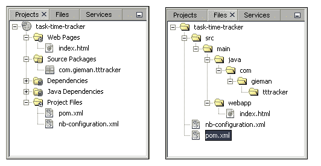

右键单击任一选项卡中的项目名称将允许您为项目选择**属性**。这将在不同类别下显示与项目相关的所有属性和路径：

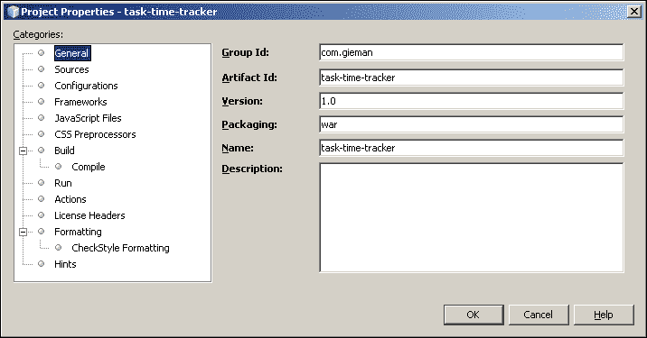

对于本书的其余部分，您不需要更改这些属性。

## 了解 POM 和依赖关系管理

每个 Maven 项目在 NetBeans 项目的根级别都有一个`pom.xml`配置文件。点击**文件**视图，双击`pom.xml`文件在编辑器中打开：

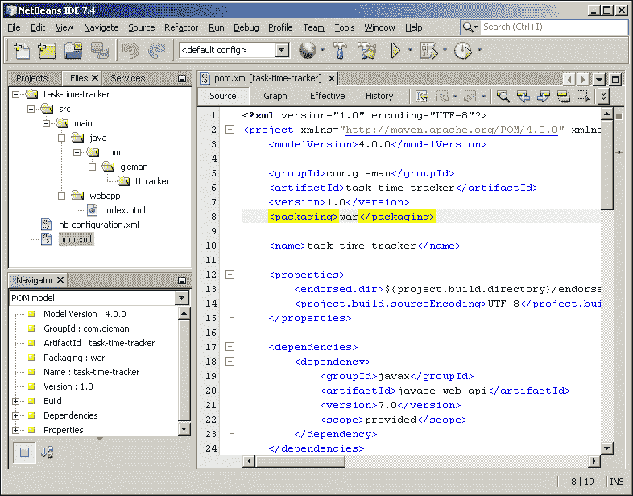

### 注

您应该看到左下面板中打开的**导航器**窗口。这将显示正在编辑的文件的大纲，在浏览大型文件时非常有用。双击**导航器**中的节点将光标定位在编辑器中的相应行。

如果**导航器**窗口未打开（或已关闭），您可以从菜单中导航到**窗口****导航****导航器**手动打开。

**项目对象模型（POM**完全定义了项目以及所有必需的 Maven 属性和构建行为。在`pom.xml`中只显示了一个依赖项：

```java
<dependencies>
  <dependency>
    <groupId>javax</groupId>
    <artifactId>javaee-web-api</artifactId>
    <version>7.0</version>
    <scope>provided</scope>
  </dependency>
</dependencies>
```

此依赖关系标识项目需要 JavaEE7 进行构建。此条目确保完整的 JavaEE7API 可用于任务时间跟踪器项目中的 Java 编码。我们的项目还需要 Spring 框架，它现在必须作为附加依赖项添加。在编辑器中键入将导致自动完成帮助以确定正确的依赖项。在添加 Spring 框架`groupId`和`artifactId`条目后，如下图所示，*Ctrl*+空格键快捷键将打开`artifactId`可用的匹配条目，以文本`spring`开头：

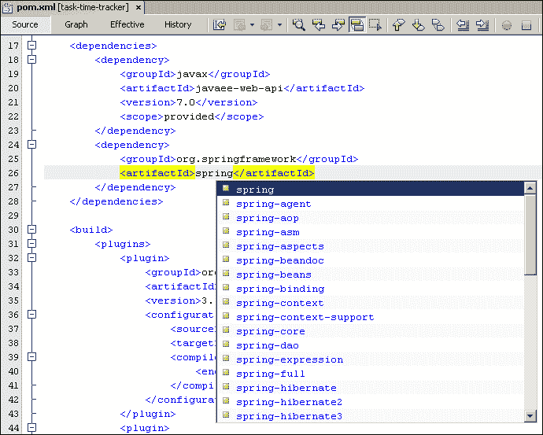

如果此自动完成列表不可用，则可能是原因是 Maven 存储库首次被索引。在这种情况下，您将在编辑器底部看到以下屏幕截图：


耐心等待，几分钟后索引将完成，自动完成功能将可用。从 Maven 存储库下载可用条目需要编制索引。

所需的弹簧骨架组件如下：

*   `spring-context`：这是 Spring 依赖性注入容器所需的中心工件
*   `spring-tx`：这是实现事务行为所需的事务管理抽象
*   `spring-context-support`：这些是各种应用上下文实用程序，包括 Ehcache、JavaMail、Quartz 和 FreeMarker 集成
*   `spring-jdbc`：这是 JDBC 数据访问库
*   `spring-orm`：这是 JPA 开发的**对象到关系映射**（**ORM**集成
*   `spring-instrument`：这个是用来编织类的
*   `spring-webmvc`：此为 Servlet 环境下的**Spring 模型视图控制器****MVC**
*   `spring-test`：这是对使用 JUnit 测试 Spring 应用的支持

要使用最新的 Spring 发行版版本（3.2.4）添加这些依赖项，需要在`pom.xml`文件中添加以下内容：

```java
<dependency>
  <groupId>org.springframework</groupId>
  <artifactId>spring-context</artifactId>
  <version>3.2.4.RELEASE</version>
</dependency>
<dependency>
  <groupId>org.springframework</groupId>
  <artifactId>spring-context-support</artifactId>
  <version>3.2.4.RELEASE</version>
</dependency>
<dependency>
  <groupId>org.springframework</groupId>
  <artifactId>spring-tx</artifactId>
  <version>3.2.4.RELEASE</version>
</dependency>
<dependency>
  <groupId>org.springframework</groupId>
  <artifactId>spring-jdbc</artifactId>
  <version>3.2.4.RELEASE</version>
</dependency>
<dependency>
  <groupId>org.springframework</groupId>
  <artifactId>spring-orm</artifactId>
  <version>3.2.4.RELEASE</version>
</dependency>
<dependency>
  <groupId>org.springframework</groupId>
  <artifactId>spring-instrument</artifactId>
  <version>3.2.4.RELEASE</version>
</dependency>
<dependency>
  <groupId>org.springframework</groupId>
  <artifactId>spring-webmvc</artifactId>
  <version>3.2.4.RELEASE</version>
</dependency>
<dependency>
  <groupId>org.springframework</groupId>
  <artifactId>spring-test</artifactId>
  <version>3.2.4.RELEASE</version>
</dependency>
```

## 理解依赖范围

最终的 Spring 框架依赖项仅用于测试。我们可以通过添加一个值为`test`的`scope`属性来定义。这告诉 Maven，只有在运行构建的测试阶段时才需要依赖项，部署时不需要依赖项。

```java
<dependency>
  <groupId>org.springframework</groupId>
  <artifactId>spring-test</artifactId>
  <version>3.2.4.RELEASE</version>
  <scope>test</scope>
</dependency>
```

NetBeans 自动创建的`javaee-web-api`依赖项的作用域为`provided`。这意味着部署不需要依赖项，依赖项由目标服务器提供。GlassFish 4 服务器本身就是此依赖项的提供者。

如果没有包含`scope`属性，则依赖项 JAR 将包含在最终的构建中。这相当于提供范围条目`compile`的。因此，所有 Spring 框架依赖项 JAR 都将包含在最终构建文件中。

关于 Maven 依赖机制和范围的完整解释，请参见[http://maven.apache.org/guides/introduction/introduction-to-dependency-mechanism.html](http://maven.apache.org/guides/introduction/introduction-to-dependency-mechanism.html) 。

## 定义 Maven 属性

`pom.xml`中定义的 Spring 框架依赖项都有相同的版本（3.2.4.版本）。这种复制并不理想，尤其是当我们希望以后升级到新版本时。需要在多个地方进行更改，每个 Spring 依赖项一个。一个简单的解决方案是添加一个属性来保存 release version 值，如以下代码所示：

```java
<properties>
<endorsed.dir>${project.build.directory}/endorsed</endorsed.dir>
<project.build.sourceEncoding>UTF-8</project.build.sourceEncoding>
<spring.version>3.2.4.RELEASE</spring.version>
</properties>
```

我们将此自定义属性命名为`spring.version`，现在可用于替换多个副本，如下所示：

```java
<dependency>
<groupId>org.springframework</groupId>
  <artifactId>spring-context-support</artifactId>
  <version>${spring.version}</version>
</dependency>
```

在构建过程中，`${spring.version}`占位符将被`properties`值替换。

## 了解 Maven 构建插件

Maven 构建过程在适当的构建阶段执行每个定义的构建插件。完整的构建插件列表可在[找到 http://maven.apache.org/plugins/index.html](http://maven.apache.org/plugins/index.html) 。我们将在后面的章节中根据需要介绍插件，但是由 NetBeansIDE 创建的默认插件现在很有意思。

`maven-compiler-plugin`控制并执行 Java 源文件的编译。此插件允许您指定编译的`source`和`target`Java 版本，如下代码所示：

```java
<plugin>
  <groupId>org.apache.maven.plugins</groupId>
  <artifactId>maven-compiler-plugin</artifactId>
  <version>3.1</version>
  <configuration>
    <source>1.7</source>
    <target>1.7</target>
    <compilerArguments>
      <endorseddirs>${endorsed.dir}</endorseddirs>
    </compilerArguments>
  </configuration>
</plugin>
```

为运行在早期版本 Java 上的旧 Java 服务器编译项目时，可能需要将这些值更改为`1.6`。

`maven-war-plugin`为项目建立 WAR 文件，如下所示：

```java
<plugin>
  <groupId>org.apache.maven.plugins</groupId>
  <artifactId>maven-war-plugin</artifactId>
  <version>2.3</version>
  <configuration>
    <failOnMissingWebXml>false</failOnMissingWebXml>
  </configuration>
</plugin>
```

默认生成的 WAR 文件名为`{artifactId}-{version}.war`，可以通过包含`warName`配置属性进行更改。在的最后一章中，我们将在为产品发布构建项目时为这个插件添加属性。`maven-war-plugin`选项的完整列表可在[中找到 http://maven.apache.org/plugins/maven-war-plugin/war-mojo.html](http://maven.apache.org/plugins/maven-war-plugin/war-mojo.html) 。

`maven-dependency-plugin`将依赖项 JAR 文件复制到定义的输出目录，如下代码所示：

```java
<plugin>
  <groupId>org.apache.maven.plugins</groupId>
  <artifactId>maven-dependency-plugin</artifactId>
  <version>2.6</version>
  <executions>
    <execution>
      <phase>validate</phase>
      <goals>
        <goal>copy</goal>
      </goals>
      <configuration>
        <outputDirectory>${endorsed.dir}</outputDirectory>
        <silent>true</silent>
        <artifactItems>
          <artifactItem>
            <groupId>javax</groupId>
            <artifactId>javaee-endorsed-api</artifactId>
            <version>7.0</version>
            <type>jar</type>
          </artifactItem>
        </artifactItems>
      </configuration>
    </execution>
  </executions>
</plugin>
```

这有助于查看项目使用了哪些 JAR，并确定需要哪些可传递依赖项（依赖项的依赖项）。

我们将修改此插件将项目的所有编译时依赖项复制到`${project.build.directory}`中的一个目录中。此特殊构建目录位于项目的根文件夹下，名为`target`，构建过程的目标目标。更新后的条目现在如下所示：

```java
<plugin>
  <groupId>org.apache.maven.plugins</groupId>
  <artifactId>maven-dependency-plugin</artifactId>
  <version>2.1</version>
  <executions>
    <execution>
      <id>copy-endorsed</id>
      <phase>validate</phase>
      <goals>
        <goal>copy</goal>
      </goals>
      <configuration>
        <outputDirectory>${endorsed.dir}</outputDirectory>
        <silent>true</silent>
        <artifactItems>
          <artifactItem>
            <groupId>javax</groupId>
            <artifactId>javaee-endorsed-api</artifactId>
            <version>7.0</version>
            <type>jar</type>
          </artifactItem>
        </artifactItems>
      </configuration>
    </execution> 
    <execution>
      <id>copy-all-dependencies</id>
      <phase>compile</phase>
      <goals>
        <goal>copy-dependencies</goal>
      </goals>
      <configuration>
        <outputDirectory>${project.build.directory}/lib
        </outputDirectory>
        <includeScope>compile</includeScope>
      </configuration> 
    </execution>
  </executions>
</plugin>
```

由于我们现在在单个插件中执行两次执行，每次执行都需要自己的`<id>`。ID 为`copy-all-dependencies`的第二次执行将把范围为`compile`的所有依赖 JAR 复制到`target/lib`目录。

## 执行 Maven 构建

执行构建的最简单方式是点击工具栏中的**清理并构建项目**按钮。您也可以右键点击**项目**选项卡中的项目节点，从菜单中选择**清理和构建**。然后，构建过程将执行 POM 中定义的每个阶段，从而进行 Java 代码编译、依赖项解析（和复制），最后生成 WAR 文件。打开目标目录结构将显示生成结果，如下所示：

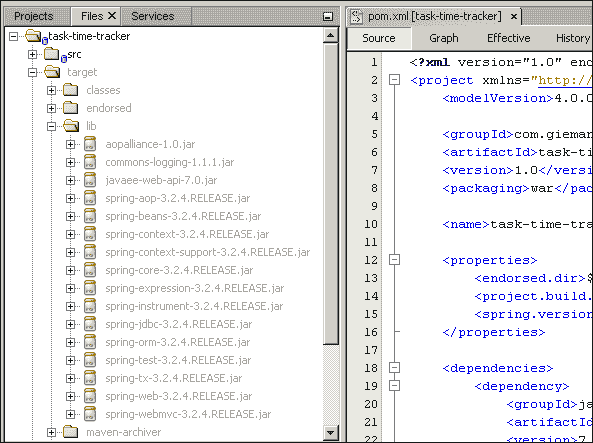

即使我们还没有编写一行代码，生成的 WAR 文件`task-time-tracker-1.0.war`现在也可以部署到 GlassFish 服务器上。

# 启动 GlassFish 4 服务器

打开的**服务**选项卡并展开**服务器**节点，将列出在 NetBeans 安装过程中安装的 GlassFish 服务器。您现在可以右键点击**GlassFish Server 4.0**节点，选择**启动**，如下图所示：


现在，NetBeans IDE 底部的**输出**面板应该打开，并显示启动结果。选择**GlassFish Server 4.0**选项卡查看详细信息。

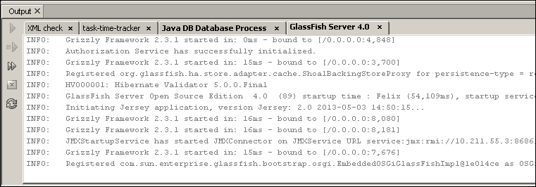

最后第五行标识服务器已启动并正在侦听端口 8080，在日志中写为 8080：

**信息：Grizzly Framework 2.3.1 开始于：16ms-绑定到[/0.0.0.0:8080]**

您现在可以打开首选浏览器并查看页面`http://localhost:8080`。

### 注

请注意，根据您的环境，您可能有其他应用监听端口 8080。在这些情况下，您需要替换 GlassFish 服务器输出中定义的正确端口，以代替 8080。


您现在可以通过右键单击**GlassFish 服务器 4.0**节点并单击**停止**来停止服务器。

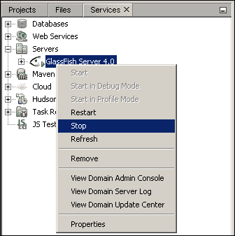

# 运行任务时间跟踪器项目

我们已成功建成该项目；现在是在 GlassFish 中运行该项目的时候了。点击**运行**工具栏项，开始如下流程：


输出应显示流程，首先构建项目，然后启动并部署到 GlassFish 服务器。最后一步将打开默认浏览器，并显示所有开发人员都喜欢的世界知名消息，如以下屏幕截图所示：

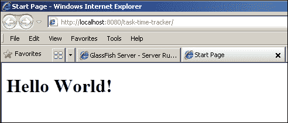

祝贺现在，您已经配置了用于开发、构建和部署 SpringJava 项目的核心组件。最后一步是更改默认页面上的文本。打开`index.html`文件，如下图所示：


将`<title>`更改为`Task Time Tracker Home Page`，将`<h1>`文本更改为`Welcome to Task Time Tracker!`。保存页面并刷新浏览器以查看更改。


### 注

浏览器刷新时未看到更新的文本更改？在某些情况下，首次部署到 GlassFish 后，刷新页面时，浏览器中可能看不到在`index.html`文件中所做的更改。重新启动 NetBeans IDE 应该可以解决这个问题，并确保在保存任何项目资源时立即将后续更改部署到 GlassFish。

# 总结

在本章中，您已经了解了我们将在本书中使用的一些关键技术。您已经下载并安装了 MySQL 数据库服务器、JDK 和 NetBeans IDE。然后，我们介绍了 Maven 以及如何使用它简化 Java 项目的构建和管理。我们最终在 GlassFish 上部署了我们的骨架任务时间跟踪器项目，而无需编写一行代码。

虽然我们已经将 Spring 框架添加到了我们的项目中，但是我们还没有深入研究它是如何使用的。同样，我们还没有提到 Sencha Ext JS。耐心点，还有很多呢！下一章将介绍我们的任务时间跟踪器数据库表，并开始我们的开发旅程。