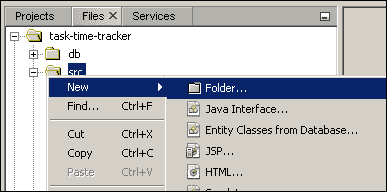
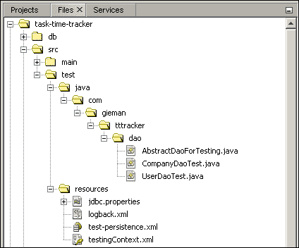
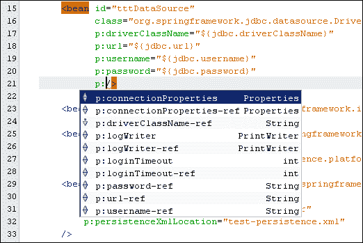
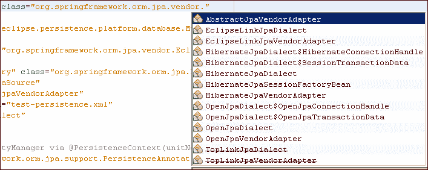
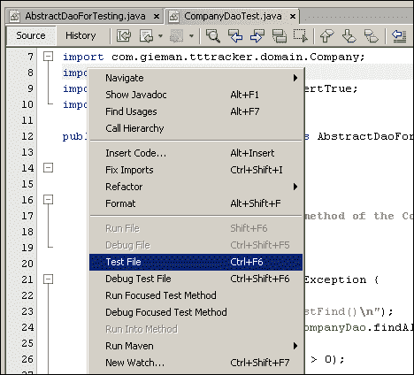
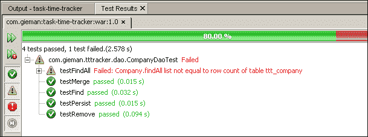

# 第五章用 Spring 和 JUnit 测试 DAO 层

每个人都会同意软件测试应该是开发过程的基本部分。彻底的测试将确保满足业务需求，软件按预期工作，并且在客户发现缺陷之前发现缺陷。尽管测试无法完全识别所有的 bug，但人们普遍认为，越早发现问题，修复成本就越低。在开发过程中修复代码块中的`NullPointerException`要比将系统部署到客户机的生产服务器时快得多。在开发企业系统时，交付高质量代码变得更为关键。你公司的声誉岌岌可危；在交付之前识别和修复问题是使测试成为开发生命周期的关键部分的一个重要原因。

有许多不同类型的测试，包括但不限于单元测试、集成测试、回归测试、黑/白盒测试和验收测试。这些测试策略中的每一个都有自己的一章，但超出了本书的范围。一篇关于软件测试的优秀文章可以在这里找到：[https://en.wikipedia.org/wiki/Software_testing](https://en.wikipedia.org/wiki/Software_testing) 。我们将重点关注**单元测试**。

# 单元测试概述

单元测试是一种测试源代码离散单元的策略。从程序员的角度来看，单元是应用程序中最小的可测试部分。一个源代码单元通常被定义为一个**公共方法**，它可以在应用程序中调用，并且有特定的用途。DAO 层的单元测试将确保每个公共方法至少有一个合适的测试用例。在实践中，对于每个公共方法，我们将需要更多的测试用例，而不仅仅是一个测试用例。例如，每个 DAO`find(ID)`方法至少需要两个测试用例：一个测试用例的结果返回有效的已找到对象，另一个测试用例的结果未找到有效对象。因此，对于编写的每一行代码，开发人员通常需要几行测试代码。

单元测试是一种需要时间掌握的艺术形式。我们的目标是建立一套涵盖尽可能多的场景的测试。这与我们作为开发人员试图实现的目标本质上是相反的，我们的目标是确保执行任务以满足精确的功能需求。考虑以下业务需求：以美分为单位计算成本值，并根据当天的汇率将其转换为欧元等价物。

解决方案似乎不言自明，但如果汇率不可用，会发生什么？还是日期在未来？或者成本值为空？如果无法计算该值，预期的行为是什么？这些都是编写测试用例时应该考虑的有效场景。

通过单元测试，我们定义了程序的行为方式。每个单元测试都应该讲述一个详细记录的故事，说明程序的该部分在特定场景中应该如何操作。这些测试成为一份合同，从客户代码的角度描述在各种可复制条件下应该发生什么。

## 单元测试的好处

单元测试让我们确信我们编写的代码工作正常。单元测试过程还鼓励我们思考如何使用代码以及需要满足哪些条件。有许多好处，包括：

*   **尽早识别问题：**单元测试将有助于在开发生命周期的早期识别编码问题，而在开发生命周期的早期更容易修复。
*   **更高的质量：**我们不希望客户发现 bug，导致停机和昂贵的发布周期。首先，我们希望构建一个 bug 尽可能少的软件。
*   **信心：**开发人员不愿意接触脆弱的代码。经过良好测试的代码和可靠的测试用例可以满怀信心地接近。
*   **回归证明：**测试用例随着应用程序而构建和发展。增强功能和新功能可能会悄悄地打破旧代码，但编写良好的测试套件将在识别此类场景方面大有帮助。

许多程序员跨不同模块进行并行开发的企业应用程序更容易受到攻击。如果不及早发现，编码副作用可能会导致深远的后果。

### 注

助手方法用于修剪作为参数传入的 Java 字符串。该参数已测试为 null，如果是这种情况，则该方法返回空字符串“”。helper 方法在应用程序中无处不在。有一天，开发人员更改了 helper 方法，如果传入的参数为 null，则返回 null（他们需要识别 null 和空字符串之间的差异）。一个简单的测试用例可以确保此更改不会签入到版本控制中。使用该应用程序时，空指针异常的数量之多令人惊讶！

# 配置测试环境

我们的单元测试策略是创建一组测试用例，这些测试用例可以在开发生命周期的任何时候自动运行。“自动化”意味着不需要开发人员交互；测试可以作为构建过程的一部分运行，不需要用户输入。整个过程通过使用 Maven、JUnit 和 Spring 进行无缝管理。Maven convention 希望在`src`目录下有一个测试目录结构，子目录中有测试资源和 Java 测试用例，如下面的屏幕截图所示：


请注意 Maven 如何对源布局和测试布局使用相同的目录结构。执行测试用例所需的所有资源都将在`src/test/resources`目录中找到。同样，部署所需的所有资源都将在`src/main/resources`目录中找到。“约定优先于配置”范式再次减少了开发人员需要做出的决策数量。只要遵循此目录结构，基于 Maven 的测试就可以工作，无需任何进一步的配置。如果您还没有此目录结构，则需要通过右键单击所需文件夹手动创建它：



添加目录结构后，我们可以创建单个文件，如图所示：



我们将从使用 NetBeans 创建`jdbc.properties`文件开始。

## jdbc.properties 文件

右键点击`test/resources`文件夹上的，导航至**新建****其他**。将打开**新建文件**向导，您可以从**类别**和**属性文件**中选择**其他**，如图所示：


选择**下一步**并输入`jdbc`作为文件名：


点击**完成**按钮上的按钮，创建的文件`jdbc.properties`。然后，NetBeans 将在编辑器中打开该文件，您可以在其中添加以下代码：


`jdbc.properties`文件用于定义数据库连接细节，Spring 将使用该细节配置 DAO 层进行单元测试。企业项目通常有一个或多个专用测试数据库，这些数据库预先填充了所有测试场景的适当数据。我们将使用在[第 2 章](02.html "Chapter 2. The Task Time Tracker Database")、*任务时间跟踪器数据库*中生成并填充的数据库。

## logback.xml 文件

使用**新建文件**向导**XML**类别创建此文件，如图所示：


创建`logback.xml`文件后，您可以输入以下内容：

```java
<?xml version="1.0" encoding="UTF-8"?>
<configuration scan="true" scanPeriod="30 seconds" >
    <contextName>TaskTimeTracker</contextName>
    <appender name="STDOUT" class="ch.qos.logback.core.ConsoleAppender">
        <encoder>
            <pattern>%d{HH:mm:ss.SSS} [%thread] %-5level %logger{5} - %msg%n</pattern>
        </encoder>
    </appender>

    <logger name="com.gieman.tttracker" level="DEBUG" additivity="false">
        <appender-ref ref="STDOUT" />
    </logger>
    <logger name="com.gieman.tttracker.dao" level="DEBUG" additivity="false">
        <appender-ref ref="STDOUT" />
    </logger>
    <logger name="com.gieman.tttracker.domain" level="DEBUG" additivity="false">
        <appender-ref ref="STDOUT" />
    </logger>
    <logger name="com.gieman.tttracker.service" level="DEBUG" additivity="false">
        <appender-ref ref="STDOUT" />
    </logger>
    <logger name="com.gieman.tttracker.web" level="DEBUG" additivity="false">
        <appender-ref ref="STDOUT" />
    </logger>

    <root level="INFO">          
        <appender-ref ref="STDOUT" />
    </root>
</configuration>
```

对于那些熟悉 log4j 的来说，logback 记录器定义的语法非常相似。我们已将根日志级别设置为`INFO`，这将覆盖所有未明确定义的记录器（请注意，默认级别为`DEBUG`，但这通常会导致根级别的大量日志记录）。每个单独的记录器的名称与一个`com.gieman.tttracker`包相匹配，被设置为日志级别`DEBUG`。这种配置为我们提供了相当大的灵活性和对包级日志记录属性的控制。在生产中，我们通常会为所有记录器部署一个`WARN`级别，以最小化日志记录。如果遇到问题，我们将有选择地在不同的包中启用日志记录，以帮助识别任何问题。与 log4j 不同，由于 logback 在`<configuration>`节点中的`scan="true" scanPeriod="30 seconds"`选项，可以动态地重新加载记录器属性。有关 logback 配置的更多信息，请参见此处：[http://logback.qos.ch/manual/configuration.html](http://logback.qos.ch/manual/configuration.html) 。

## test-persistence.xml 文件

按照上一节中概述的新建文件步骤创建`test-persistence.xml`文件。输入以下持久性上下文定义：

```java
<?xml version="1.0" encoding="UTF-8"?>
<persistence version="2.1"  xmlns:xsi="http://www.w3.org/2001/XMLSchema-instance" xsi:schemaLocation="http://java.sun.com/xml/ns/persistence http://java.sun.com/xml/ns/persistence/persistence_2_1.xsd">
  <persistence-unit name="tttPU" transaction-type="RESOURCE_LOCAL">
    <provider>org.eclipse.persistence.jpa.PersistenceProvider</provider>
    <class>com.gieman.tttracker.domain.Company</class>
    <class>com.gieman.tttracker.domain.Project</class>
    <class>com.gieman.tttracker.domain.Task</class>
    <class>com.gieman.tttracker.domain.TaskLog</class>
    <class>com.gieman.tttracker.domain.User</class>
    <exclude-unlisted-classes>true</exclude-unlisted-classes>
    <properties>
      <property name="eclipselink.logging.level" value="WARNING"/>
    </properties>
  </persistence-unit>
</persistence>
```

此持久化单元定义与[第 3 章](03.html "Chapter 3. Reverse Engineering the Domain Layer with JPA")中创建的*使用 JPA*反向工程域层的定义略有不同：

```java
<?xml version="1.0" encoding="UTF-8"?>
<persistence version="2.1"  xmlns:xsi="http://www.w3.org/2001/XMLSchema-instance" xsi:schemaLocation="http://xmlns.jcp.org/xml/ns/persistence http://xmlns.jcp.org/xml/ns/persistence/persistence_2_1.xsd">
  <persistence-unit name="tttPU" transaction-type="JTA">
    <provider>org.eclipse.persistence.jpa.PersistenceProvider</provider>
    <jta-data-source>jdbc/tasktimetracker</jta-data-source>
    <exclude-unlisted-classes>false</exclude-unlisted-classes>
    <properties/>
  </persistence-unit>
</persistence>
```

注意测试`persistence-unit`交易类型为`RESOURCE_LOCAL`而不是`JTA`。我们的测试环境使用本地（Spring 管理的）事务管理器，而不是 GlassFish 服务器容器（即`JTA`）提供的事务管理器。在这两种情况下，`tttPU`持久化单元名称与`GenericDaoImpl`中`EntityManager`字段的`@PersistenceContext``unitName`注释匹配：

```java
@PersistenceContext(unitName = "tttPU")
protected EntityManager em;
```

第二个区别是发现类的方式。在测试期间，我们的域实体被显式列出，我们排除了任何未定义的类。这简化了处理，并确保在不扫描类路径的情况下，仅加载测试*所需的实体。这是 Windows 用户的一个重要观点；在某些 Windows 版本中，命令行语句的长度有限制，因此，类路径参数的使用时间也有限制。使用类路径扫描，加载域实体进行测试可能无法工作，从而导致奇怪的错误，例如：*

```java
org.springframework.dao.InvalidDataAccessApiUsageException: Object: com.tttracker.domain.Company[ idCompany=null ] is not a known entity type.; nested exception is java.lang.IllegalArgumentException: Object: com.tttracker.domain.Company[ idCompany=null ] is not a known entity type.
```

始终确保测试持久性 XML 定义包括应用程序中的所有域类。

# 介绍 Spring IoC 容器

现代的 Spring 框架是一套广泛的框架“堆栈”，基于本世纪初的建筑概念。Spring 框架最早于 2002 年在*专家一对一 J2EE 设计和开发**Rod Johnson*中崭露头角。Spring 实现的**控制反转**（**IoC**原则，有时也称为**依赖注入**（**DI**，是企业应用程序设计和开发的一个突破。SpringIOC 容器提供了一种配置对象（JavaBeans）和通过构造函数参数、工厂方法、对象属性或 setter 方法注入依赖项的简单方法。我们已经在 DAO 层中看到了注释，Spring 使用该注释来确定`EntityManager`对象是否应该注入`GenericDaoImpl`类。复杂的配置选项使得 Spring 框架成为企业发展的非常灵活的基础。

这超出了本书的范围，超出了项目需求所要求的 Spring 框架配置的基础知识。但是，我们建议您在[浏览有关 IoC 容器如何工作的详细说明 http://docs.spring.io/spring/docs/3.2.x/spring-framework-reference/html/beans.html#beans-定义](http://docs.spring.io/spring/docs/3.2.x/spring-framework-reference/html/beans.html#beans-definition)以增强他们对核心原则的了解。

## 探索 testingContext.xml 文件

这是 Spring 用来配置和加载 IoCbean 容器的主配置文件。从一开始，基于 XML 的配置就是配置 Spring 应用程序的默认方式，但是在 Spring3 框架中，使用基于 Java 的配置成为可能。这两个选项实现了相同的结果—完全配置的 Spring 容器。我们将使用 XML 方法，因为它不需要任何 Java 编码，而且更直观、更易于使用。

### 注

多年来，有很多文章都是关于 SpringXML 配置的“复杂性”的。在 Java1.5 和注释的引入之前，可能有这样的注释。对于新用户来说，配置文件冗长且令人望而生畏。现在已经不是这样了。使用 XML 配置 Spring 容器现在是一个简单的过程。要提防任何告诉你其他情况的人！

`testingContext.xml`配置文件完全定义了测试 DAO 层所需的 Spring 环境。完整的文件列表是：

```java
<?xml version="1.0" encoding="UTF-8"?>
<beans  xmlns:xsi="http://www.w3.org/2001/XMLSchema-instance"
       xmlns:p="http://www.springframework.org/schema/p" 
       xmlns:context="http://www.springframework.org/schema/context" 
       xmlns:tx="http://www.springframework.org/schema/tx"
       xsi:schemaLocation="
       http://www.springframework.org/schema/beans http://www.springframework.org/schema/beans/spring-beans-3.0.xsd
       http://www.springframework.org/schema/context http://www.springframework.org/schema/context/spring-context-3.0.xsd
        http://www.springframework.org/schema/tx http://www.springframework.org/schema/tx/spring-tx-3.0.xsd">

    <bean id="propertyConfigurer"
          class="org.springframework.beans.factory.config.PropertyPlaceholderConfigurer"
          p:location="classpath:jdbc.properties" />

    <bean id="tttDataSource"
          class="org.springframework.jdbc.datasource.DriverManagerDataSource"
          p:driverClassName="${jdbc.driverClassName}"
          p:url="${jdbc.url}"
          p:username="${jdbc.username}"
          p:password="${jdbc.password}"/>

    <bean id="loadTimeWeaver" class="org.springframework.instrument.classloading.InstrumentationLoadTimeWeaver" />

    <bean id="jpaVendorAdapter" class="org.springframework.orm.jpa.vendor.EclipseLinkJpaVendorAdapter"
        p:showSql="true"
        p:databasePlatform="org.eclipse.persistence.platform.database.MySQLPlatform" />
    <bean id="entityManagerFactory" class="org.springframework.orm.jpa.LocalContainerEntityManagerFactoryBean"
        p:dataSource-ref="tttDataSource"
        p:jpaVendorAdapter-ref="jpaVendorAdapter"
        p:persistenceXmlLocation="test-persistence.xml"
    />

    <!-- Transaction manager for a single JPA EntityManagerFactory (alternative to JTA) -->
    <bean id="transactionManager" class="org.springframework.orm.jpa.JpaTransactionManager"
          p:dataSource-ref="tttDataSource" 
          p:entityManagerFactory-ref="entityManagerFactory"/>

    <!-- checks for annotated configured beans -->
    <context:annotation-config/>  

    <!-- Scan for Repository/Service annotations -->
    <context:component-scan base-package="com.gieman.tttracker.dao" />

    <!-- enable the configuration of transactional behavior based on annotations -->
    <tx:annotation-driven />

</beans>
```

让我们详细看每一部分。

### Spring XML 名称空间

对于那些不熟悉 XML 的人，可以忽略`xmlns`定义和模式位置 URL。将它们视为配置文件中的“快捷方式”或“限定符”，它们提供验证条目的能力。Spring 理解`<tx:annotation-driven />`在加载 Spring 环境的上下文中的含义。

根据应用程序所需的资源，每个 Spring 应用程序配置文件将具有多个命名空间声明。除了名称空间之外，定义架构位置将允许 NetBeans 提供有关配置选项的有用提示：



当不熟悉 Spring 配置时，不同名称空间的有效属性列表非常有用。

### 属性文件配置

下面的 bean 加载`jdbc.properties`文件，并使其可在配置文件中使用：

```java
<bean id="propertyConfigurer"
    class="org.springframework.beans.factory.config.PropertyPlaceholderConfigurer"
    p:location="classpath:jdbc.properties" />
```

然后可以在`testingContext.xml`文件中的任何位置使用`${}`语法，用必需的`jdbc`属性替换令牌。

### 创建 JDBC 数据源

DAO 测试需要连接到 MySQL 数据库。以下 SpringBean 定义实例化并提供一个完全配置的数据源：

```java
<bean id="tttDataSource"
    class="org.springframework.jdbc.datasource.DriverManagerDataSource"
    p:driverClassName="${jdbc.driverClassName}"
    p:url="${jdbc.url}"
    p:username="${jdbc.username}"
    p:password="${jdbc.password}"
    />
```

占位符自动设置为从`jdbc.properties`文件加载的属性：

```java
jdbc.driverClassName=com.mysql.jdbc.Driver
jdbc.url=jdbc:mysql://localhost:3306/task_time_tracker
jdbc.username=root
jdbc.password=adminadmin
```

如果我们必须自己实现数据源实例化，那么这个非常简单的 Spring 配置片段将替换许多行等效的 Java 代码。请注意，为不同的测试场景更改任何数据库属性是多么简单，例如，甚至可以将数据库服务器从 MySQL 更改为 Oracle。这种灵活性使得 SpringIoC 容器非常适合企业使用。

您应该注意，`org.springframework.jdbc.datasource.DriverManagerDataSource`应该仅用于测试目的，而不是用于生产环境。GlassFish 服务器将提供一个连接池`DataSource`供生产使用。

### 定义助手 bean

`loadTimeWeaver`和`jpaVendorAdapter`bean 定义帮助配置用于加载持久性上下文的`entityManagerFactory`bean。注意我们通过使用特定的 Springbean 类来识别数据库平台（MySQL）和 JPA 实现（EclipseLink）的方式：

```java
<bean id="jpaVendorAdapter" 
class="org.springframework.orm.jpa.vendor.EclipseLinkJpaVendorAdapter"
  p:showSql="true"        
  p:databasePlatform="org.eclipse.persistence.platform.database.MySQLPlatform" />
```

Spring 提供了大量数据库和 JPA 实现，在 NetBeans 中使用 autocomplete 时可以看到这一点（NetBeans 中的*Ctrl*+空格键组合触发了 autocomplete 选项）：



助手 bean 用于定义特定于实现的属性。为不同的企业环境交换实施策略非常容易。例如，开发人员可以使用在自己的环境中本地运行的 MySQL 数据库进行开发。生产企业服务器可能使用运行在不同物理服务器上的 Oracle 数据库。只需对 Spring XML 配置文件进行非常微小的更改，即可实现应用程序环境的差异。

### 定义 EntityManagerFactory 类

此 Springbean 定义用于创建`EntityManager`实例并将其注入`GenericDaoImpl`类的`EntityManagerFactory`类：

```java
<bean id="entityManagerFactory" 
  class="org.springframework.orm.jpa.LocalContainerEntityManagerFactoryBean"
  p:dataSource-ref="tttDataSource"
  p:jpaVendorAdapter-ref="jpaVendorAdapter"
  p:persistenceXmlLocation="test-persistence.xml"
/>
```

此定义引用已配置的`tttDataSource`和`jpaVendorAdapter`bean，以及`test-persistence.xml`持久性上下文定义文件。Spring 再一次在后台做了大量工作，创建和配置了`EntityManager`实例，并将其用于我们的代码中。

### 配置事务管理器

用于管理事务的 Springbean 定义如下：

```java
<bean id="transactionManager" 
  class="org.springframework.orm.jpa.JpaTransactionManager"
  p:dataSource-ref="tttDataSource" 
  p:entityManagerFactory-ref="entityManagerFactory"/>
```

这个 bean 将`tttDataSource`和`entityManagerFactory`实例连接在一起，以在我们的应用程序中启用事务行为。此行为应用于具有`@Transactional`注释的所有类；在我们目前的情况下，这适用于所有 DAO 对象。当配置文件中包含以下行时，Spring 将扫描此注释并将事务包装应用于每个注释的方法：

```java
<tx:annotation-driven />
```

为`@Transactional`注释扫描哪些类？下一行定义 Spring 应扫描`com.gieman.tttracker.dao`包：

```java
<context:component-scan base-package="com.gieman.tttracker.dao"/>
```

### 自动接线豆

**自动连线**是一个 Spring 术语，用于自动向托管 bean 中注入资源。下面的行在具有`@Autowired`注释的 bean 中启用自动连线：

```java
<context:annotation-config/>
```

到目前为止，我们的代码中还没有任何自动连接的注释；下一节将介绍如何使用此注释。

### 谢谢你的水管！

当 Spring 容器加载 Spring 配置文件时，它将在后台完成大量工作，配置和连接应用程序所需的许多支持类。乏味且经常出错的“管道”代码已经为我们完成了。我们不再需要提交事务、打开数据库连接或关闭 JDBC 资源。Spring 框架将非常优雅地处理这些低级操作。

### 注

作为企业应用程序开发人员，我们可以而且应该将大部分时间和精力集中在核心应用程序上：业务逻辑、用户界面、需求、测试，当然还有我们的客户。Spring 确保我们能够专注于这些任务。

## 启用 Maven 环境进行测试

Maven 构建过程包括执行测试套件的能力。我们现在需要将此功能添加到`pom.xml`文件中。对现有文件所需的更改在以下代码段中突出显示：

```java
<?xml version="1.0" encoding="UTF-8"?>
<project  xmlns:xsi="http://www.w3.org/2001/XMLSchema-instance" xsi:schemaLocation="http://maven.apache.org/POM/4.0.0 http://maven.apache.org/xsd/maven-4.0.0.xsd">
    <modelVersion>4.0.0</modelVersion>

    <groupId>com.gieman</groupId>
    <artifactId>task-time-tracker</artifactId>
    <version>1.0</version>
    <packaging>war</packaging>

    <name>task-time-tracker</name>

    <properties>
        <endorsed.dir>${project.build.directory}/endorsed</endorsed.dir>
        <project.build.sourceEncoding>UTF-8</project.build.sourceEncoding>
        <spring.version>3.2.4.RELEASE</spring.version>
        <logback.version>1.0.13</logback.version>
    </properties>

    <dependencies>
        <dependency>
            <groupId>org.eclipse.persistence</groupId>
            <artifactId>javax.persistence</artifactId>
            <version>2.1.0-SNAPSHOT</version>
            <scope>provided</scope>
        </dependency>
        <dependency>
            <groupId>org.eclipse.persistence</groupId>
            <artifactId>eclipselink</artifactId>
            <version>2.5.0-SNAPSHOT</version>
            <scope>provided</scope>
        </dependency>        
        <dependency>
            <groupId>org.eclipse.persistence</groupId>
            <artifactId>org.eclipse.persistence.jpa.modelgen.processor</artifactId>
            <version>2.5.0-SNAPSHOT</version>
            <scope>provided</scope>
        </dependency>
        <dependency>
            <groupId>javax</groupId>
            <artifactId>javaee-web-api</artifactId>
            <version>7.0</version>
            <scope>provided</scope>
        </dependency>
        <dependency>
            <groupId>ch.qos.logback</groupId>
            <artifactId>logback-classic</artifactId>
            <version>${logback.version}</version>
        </dependency>    
 <dependency>
 <groupId>junit</groupId>
 <artifactId>junit</artifactId>
 <version>4.11</version>
 <scope>test</scope>
 </dependency> 
 <dependency>
 <groupId>mysql</groupId>
 <artifactId>mysql-connector-java</artifactId>
 <version>5.1.26</version>
 <scope>provided</scope>
 </dependency> 
        <dependency>
            <groupId>org.springframework</groupId>
            <artifactId>spring-context</artifactId>
            <version>${spring.version}</version>
        </dependency>
        <dependency>
            <groupId>org.springframework</groupId>
            <artifactId>spring-context-support</artifactId>
            <version>${spring.version}</version>
        </dependency>
        <dependency>
            <groupId>org.springframework</groupId>
            <artifactId>spring-tx</artifactId>
            <version>${spring.version}</version>
        </dependency>
        <dependency>
            <groupId>org.springframework</groupId>
            <artifactId>spring-jdbc</artifactId>
            <version>${spring.version}</version>
        </dependency>
        <dependency>
            <groupId>org.springframework</groupId>
            <artifactId>spring-orm</artifactId>
            <version>${spring.version}</version>
        </dependency>
        <dependency>
            <groupId>org.springframework</groupId>
            <artifactId>spring-instrument</artifactId>
            <version>${spring.version}</version>
        </dependency>
        <dependency>
            <groupId>org.springframework</groupId>
            <artifactId>spring-webmvc</artifactId>
            <version>${spring.version}</version>
        </dependency>
        <dependency>
            <groupId>org.springframework</groupId>
            <artifactId>spring-test</artifactId>
            <version>${spring.version}</version>
   <scope>test</scope>
        </dependency>

    </dependencies>

    <build>
        <plugins>
            <plugin>
                <groupId>org.apache.maven.plugins</groupId>
                <artifactId>maven-compiler-plugin</artifactId>
                <version>3.1</version>
                <configuration>
                    <source>1.7</source>
                    <target>1.7</target>
                    <compilerArguments>
                        <endorseddirs>${endorsed.dir}</endorseddirs>
                    </compilerArguments>
                </configuration>
            </plugin>
            <plugin>
                <groupId>org.apache.maven.plugins</groupId>
                <artifactId>maven-war-plugin</artifactId>
                <version>2.3</version>
                <configuration>
                    <warName>${project.build.finalName}</warName>
                    <failOnMissingWebXml>false</failOnMissingWebXml>
                </configuration>
            </plugin>
            <plugin>
                <groupId>org.apache.maven.plugins</groupId>
                <artifactId>maven-dependency-plugin</artifactId>
                <version>2.6</version>
                <executions>
                    <execution>
                        <id>copy-endorsed</id>
                        <phase>validate</phase>
                        <goals>
                            <goal>copy</goal>
                        </goals>
                        <configuration>
                            <outputDirectory>${endorsed.dir}</outputDirectory>
                            <silent>true</silent>
                            <artifactItems>
                                <artifactItem>
                                    <groupId>javax</groupId>
                                    <artifactId>javaee-endorsed-api</artifactId>
                                    <version>7.0</version>
                                    <type>jar</type>
                                </artifactItem>
                            </artifactItems>
                        </configuration>
                    </execution>
                    <execution>
                        <id>copy-all-dependencies</id>
                        <phase>compile</phase>
                        <goals>
                            <goal>copy-dependencies</goal>
                        </goals>
                        <configuration>
                            <outputDirectory>${project.build.directory}/lib</outputDirectory>
                            <includeScope>compile</includeScope>
                        </configuration>                        
                    </execution>                                                           

                </executions>
            </plugin>
 <plugin>
 <groupId>org.apache.maven.plugins</groupId>
 <artifactId>maven-surefire-plugin</artifactId>
 <version>2.14.1</version>
 <configuration>
 <skipTests>false</skipTests>
 <includes>
 <include>**/dao/*Test.java</include>
 </includes>
 <argLine>-javaagent:target/lib/spring-instrument-${spring.version}.jar</argLine>
 </configuration>
 </plugin> 

        </plugins>
    </build>
    <repositories>
        <repository>
            <url>http://download.eclipse.org/rt/eclipselink/maven.repo/</url>
            <id>eclipselink</id>
            <layout>default</layout>
            <name>Repository for library EclipseLink (JPA 2.1)</name>
        </repository>
    </repositories>
</project>
```

前两个更改添加了`mysql-connector-java`和`junit`依赖项。没有这些，我们将无法连接到数据库或编写测试用例。这些依赖项将下载适当的 Java 库以包含到我们的项目中。

最重要的设置是执行实际工作的 Maven 插件。添加`maven-surefire-plugin`将允许基于`main/src/test`目录结构的内容执行测试用例。这清楚地将测试类与应用程序类分开。此插件的主要配置属性包括：

*   `<skipTests>`：此属性可以是`true`（禁用测试）或`false`（启用测试）。
*   `<includes>`：此属性包括测试期间的文件集列表。设置`<include>**/dao/*Test.java</include>`指定加载任何`dao`子目录中文件名以`Test.java`结尾的所有类，并将其包含在测试过程中。您可以指定任意数量的文件集。
*   `<argLine>-javaagent:target/lib/spring-instrument-${spring.version}.jar</argLine>`：该属性用于为测试 JVM 配置 Java 代理，Spring 需要该属性来进行类的加载时编织，对此的讨论超出了本文的范围。

现在我们已经配置了 Spring 和 Maven 测试环境，我们可以开始编写测试用例了。

# 定义测试用例超类

第一步是创建一个所有 DAO 测试用例都将继承的超类。此抽象类类似于以下代码段：

```java
package com.gieman.tttracker.dao;

import org.slf4j.Logger;
import org.slf4j.LoggerFactory;

import org.springframework.beans.factory.annotation.Autowired;
import org.springframework.test.context.ContextConfiguration;
import org.springframework.test.context.junit4.AbstractTransactionalJUnit4SpringContextTests;

@ContextConfiguration("/testingContext.xml")
public abstract class AbstractDaoForTesting extends AbstractTransactionalJUnit4SpringContextTests {

    protected final Logger logger = LoggerFactory.getLogger(this.getClass());
    @Autowired(required = true)
    protected CompanyDao companyDao;
    @Autowired(required = true)
    protected ProjectDao projectDao;
    @Autowired(required = true)
    protected TaskDao taskDao;
    @Autowired(required = true)
    protected UserDao userDao;
    @Autowired(required = true)
    protected TaskLogDao taskLogDao;
}
```

`AbstractDaoForTesting`类被标记为抽象类，因此不能直接实例化。它提供了所有子类都可以访问的成员变量，因此不再需要在子类中复制代码。因此，每个子类都可以访问 DAO 实例以及 SLF4J`logger`。有两个新的 Spring 注释：

*   `@ContextConfiguration`：此注释定义了用于加载 bean 容器的 Spring 应用程序上下文。`testingContext.xml`文件已在前面章节中详细介绍。
*   `@Autowired`：此注释向 Spring 指出，应将具有匹配类型的容器管理 bean 的依赖项注入到类中。例如，`CompanyDao companyDao`定义将导致 Spring 在容器中查询类型为`CompanyDao`的对象。这种类型的对象只有一个：`CompanyDaoImpl`类，是 Spring 通过`testingContext.xml`文件中的`<context:component-scan base-package="com.gieman.tttracker.dao"/>`条目扫描`com.gieman.tttracker.dao`包时发现并配置的。

最后需要注意的一点是，`AbstractDaoForTesting`类扩展了 Spring`AbstractTransactionalJUnit4SpringContextTests`类。除了很长的类名之外，该类还在每个测试方法的末尾提供透明的事务回滚。这意味着任何 DAO 测试操作（包括任何插入、更新或删除）结束时的数据库状态将与测试开始时相同。如果不需要此行为，则应扩展`AbstractJUnit4SpringContextTests`。在这种情况下，可以在运行测试后检查和确认任何测试数据库操作。如果需要，在使用`AbstractTransactionalJUnit4SpringContextTests`提交更改时，也可以使用`@Rollback(false)`标记单个方法。

现在让我们为`CompanyDao`操作编写第一个测试用例。

# 定义公司 DAO 测试用例

每个`CompanyDao`方法应至少定义一种试验方法。我们将为每个实施的`CompanyDao`方法准确地包括一个测试方法。在企业应用程序中，我们希望比下面的代码片段中确定的场景涵盖更多的场景。

我们还包括了最小日志记录，仅足以在运行测试用例时分割输出。您可能希望添加更多日志以帮助分析结果。测试代码假设`ttt_company`表具有适当的数据。在[第 2 章](02.html "Chapter 2. The Task Time Tracker Database")*任务时间跟踪器数据库*中，我们添加了三行，这样我们就知道有可用的数据。如果我们没有具有一致测试数据的数据库，则需要进行额外的检查。文件列表为：

```java
package com.gieman.tttracker.dao;

import com.gieman.tttracker.domain.Company;
import java.util.List;
import static org.junit.Assert.assertTrue;
import org.junit.Test;

public class CompanyDaoTest extends AbstractDaoForTesting {

    public CompanyDaoTest(){}

    @Test
    public void testFind() throws Exception {

        logger.debug("\nSTARTED testFind()\n");
        List<Company> allItems = companyDao.findAll();

        assertTrue(allItems.size() > 0);

        // get the first item in the list
        Company c1 = allItems.get(0);

        int id = c1.getId();

        Company c2 = companyDao.find(id);

        assertTrue(c1.equals(c2));
        logger.debug("\nFINISHED testFind()\n");
    }

    @Test
    public void testFindAll() throws Exception {

        logger.debug("\nSTARTED testFindAll()\n");
        int rowCount = countRowsInTable("ttt_company");

        if(rowCount > 0){

            List<Company> allItems = companyDao.findAll();
            assertTrue("Company.findAll list not equal to row count of table ttt_company", rowCount == allItems.size());

        } else {
            throw new IllegalStateException("INVALID TESTING SCENARIO: Company table is empty");
        }
        logger.debug("\nFINISHED testFindAll()\n");
    }

    @Test
    public void testPersist() throws Exception {

        logger.debug("\nSTARTED testPersist()\n");
        Company c = new Company();
        final String NEW_NAME = "Persist Test Company name";
        c.setCompanyName(NEW_NAME);

        companyDao.persist(c);

        assertTrue(c.getId() != null);
        assertTrue(c.getCompanyName().equals(NEW_NAME));

        logger.debug("\nFINISHED testPersist()\n");
    }

    @Test
    public void testMerge() throws Exception {

        logger.debug("\nSTARTED testMerge()\n");
        final String NEW_NAME = "Merge Test Company New Name";

        Company c = companyDao.findAll().get(0);
        c.setCompanyName(NEW_NAME);

        c = companyDao.merge(c);

        assertTrue(c.getCompanyName().equals(NEW_NAME));

        logger.debug("\nFINISHED testMerge()\n");

    }

    @Test
    public void testRemove() throws Exception {

        logger.debug("\nSTARTED testRemove()\n");
        Company c = companyDao.findAll().get(0);

        companyDao.remove(c);

        List<Company> allItems = companyDao.findAll();

        assertTrue("Deleted company may not be in findAll List", !allItems.contains(c) );

        logger.debug("\nFINISHED testRemove()\n");
    }
}
```

# 使用 Maven 运行 JUnit 测试用例

在**清理和构建项目（任务时间跟踪器）**时，通过点击工具栏图标，`pom.xml`配置文件将自动使用`<skipTests>false</skipTests>`运行测试用例：


通过导航到**运行****测试项目（任务时间跟踪器）**，也可以只运行项目的测试阶段：


现在可以在**输出–任务时间跟踪器**面板中检查测试过程的结果。请注意，如果输出面板最小化，您可能需要将其固定到 IDE 的底部，如下面的屏幕截图所示（最小化面板通常位于 NetBeans IDE 的左下角）。`[surefire:test]`插件输出在测试过程开始时显示。有许多行输出用于配置 Spring、连接到数据库和加载持久性上下文：


我们将很快对关键测试输出进行详细检查。滚动输出，直到到达测试部分的末尾：


总共执行了五个测试，没有任何错误，这是一个很好的开始！

## 运行 CompanyDaoTest.java 文件

您可以通过右键点击编辑器中显示的文件并选择**测试文件**选项来执行单个测试案例文件：



此将执行文件的测试用例，产生与前面所示相同的测试输出，并在**测试结果**面板中向您展示结果。此面板应显示在文件编辑器下，但不能停靠（它可能浮动在 NetBeans IDE 的底部；您可以根据需要更改位置和停靠）。然后可以检查单个文件测试结果：


单个测试文件执行是一种实用的快速调试和开发代码的方法。在本章的其余部分，我们将继续执行和检查单个文件。

现在让我们详细检查每个测试用例的结果。

### 注

在以下所有测试输出中，已删除 SLF4J 特定消息。这将包括时间戳、线程和会话信息。我们将只关注生成的 SQL。

## CompanyDaoTests.testMerge 测试用例的结果

本测试案例的输出为：

```java
STARTED testMerge()
SELECT id_company, company_name FROM ttt_company ORDER BY company_name ASC
FINISHED testMerge()
```

`merge`调用用于更新持久实体。`testMerge`方法非常简单：

```java
final String NEW_NAME = "Merge Test Company New Name";
Company c = companyDao.findAll().get(0);
c.setCompanyName(NEW_NAME);
c = companyDao.merge(c);
assertTrue(c.getCompanyName().equals(NEW_NAME));
```

我们找到第一个`Company`实体（列表中由`findAll`返回的第一项），然后将公司名称更新为`NEW_NAME`值。然后，`companyDao.merge`调用更新持久性上下文中的`Company`实体状态。使用`assertTrue()`测试对其进行测试。

注意测试输出只有**一条**SQL 语句：

```java
SELECT id_company, company_name FROM ttt_company ORDER BY company_name ASC
```

此输出对应于`findAll`方法调用。请注意，没有执行 SQL update 语句！这可能看起来很奇怪，因为实体管理器的`merge`调用应该导致针对数据库发出 update 语句。但是，JPA 实现不需要立即执行这些语句，并且可能会缓存语句，以达到性能和优化的目的。然后，缓存（或排队）语句仅在调用显式`commit`时执行。在我们的示例中，Spring 在`testMerge`方法返回后立即执行`rollback`（记住，由于我们的`AbstractTransactionalJUnit4SpringContextTests`扩展，我们正在运行事务测试用例），因此持久性上下文永远不需要执行 update 语句。

我们可以通过稍微更改`GenericDaoImpl`类来强制刷新数据库：

```java
@Override
@Transactional(readOnly = false, propagation = Propagation.REQUIRED)
public T merge(T o) {
  o = em.merge(o);
  em.flush();
  return o;
}
```

`em.flush()`方法导致执行**立即**更新语句；实体管理器将刷新所有挂起的更改。在`GenericDaoImpl`类中更改此代码并再次执行测试用例将导致以下测试输出：

```java
SELECT id_company, company_name FROM ttt_company ORDER BY company_name ASC
UPDATE ttt_company SET company_name = ? WHERE (id_company = ?)
  bind => [Merge Test Company New Name, 2]
```

update 语句现在按预期显示。如果我们现在在执行测试用例后直接检查数据库，我们会发现：


正如所料，Spring 在`testMerge`方法调用结束时回滚了数据库，并且第一条记录的公司名称没有改变。

### 注

在企业应用程序中，建议不要显式调用`em.flush()`，并允许 JPA 实现根据语句的事务行为优化语句。然而，在某些情况下，可能需要立即冲洗，但这种情况很少见。

## 公司 daotests.testFindAll 测试用例的结果

本测试用例的输出为：

```java
STARTED testFindAll()
SELECT id_company, company_name FROM ttt_company ORDER BY company_name ASC
FINISHED testFindAll()
```

即使`testMerge`方法使用`findAll`方法来检索列表中的第一项，我们也应该始终包括一个单独的`findAll`测试方法来比较结果集与数据库表的大小。使用弹簧辅助器方法`countRowsInTable`时，这很容易：

```java
int rowCount = countRowsInTable("ttt_company");
```

然后我们可以使用`assertTrue`语句将`findAll`结果列表的大小与`rowCount`进行比较：

```java
assertTrue("Company.findAll list not equal to row count of table ttt_company", rowCount == allItems.size());
```

注意`assertTrue`语句是如何使用的；如果断言为`false`，则显示消息。我们可以通过稍微修改断言来测试语句，使其失败：

```java
assertTrue("Company.findAll list not equal to row count of table ttt_company", rowCount+1 == allItems.size());
```

当执行测试用例时，它现在将失败并导致以下输出：



## 公司 daotests.testFind 测试用例的结果

此测试用例的输出为：

```java
STARTED testFind()
SELECT id_company, company_name FROM ttt_company ORDER BY company_name ASC
FINISHED testFind()
```

对于 JPA 新手来说，这似乎有点令人惊讶。`SELECT`语句从代码执行：

```java
List<Company> allItems = companyDao.findAll();
```

但是当使用的`id`属性调用`find`方法时，预期的`SELECT`语句在哪里？

```java
int id = c1.getId(); // find ID of first item in list
Company c2 = companyDao.find(id);
```

JPA 不需要使用数据库上的主键语句执行`SELECT`语句，因为具有所需 ID 的实体已经加载到持久性上下文中。`findAll`方法将加载三个实体，ID 分别为 1、2 和 3。当被要求使用列表中第一个项目的 ID 查找实体时，JPA 将返回其已加载到持久性上下文中的实体，并使用匹配的 ID，从而避免执行数据库 select 语句。

在理解 JPA 管理的应用程序的行为时，这个通常是一个陷阱。当一个实体被加载到持久性上下文中时，它将一直保持在那里直到过期。“过期”的定义取决于实现和缓存属性。小数据集可能永远不会过期；在我们公司仅有少量记录的例子中，最有可能的情况就是这样。直接在基础表上执行 update 语句（例如，更改第一条记录的公司名称）可能永远不会反映在 JPA 持久性上下文中，因为持久性上下文实体永远不会刷新。

### 注

如果企业应用程序需要来自多个源的数据修改（例如，通过存储过程或通过不同的实体管理器调用 web 服务），则需要一种缓存策略来终止过时的实体。JPA 不会自动刷新数据库中的实体状态，并且会假定持久性上下文是管理持久性数据的唯一机制。EclipseLink 提供了几个缓存注释来解决这个问题。在这里可以找到一个很好的指南：[http://wiki.eclipse.org/EclipseLink/Examples/JPA/Caching](http://wiki.eclipse.org/EclipseLink/Examples/JPA/Caching) 。

## CompanyDaoTests.testPersist 测试用例的结果

由于上一章的练习，我们对`GenericDaoImpl.persist`方法增加了一些小改动。`GenericDaoImpl`实现中修改的`persist`方法为：

```java
em.persist(o);

em.flush(); 

if (o instanceof EntityItem) {
  EntityItem<ID> item = (EntityItem<ID>) o;
  ID id = item.getId();
  logger.info("The " + o.getClass().getName() + " record with ID=" + id + " has been inserted");
}
```

您会在`em.persist()`方法之后注意到`GenericDaoImpl`中的`em.flush()`方法。如果没有对数据库的刷新，我们无法保证在新的`Company`实体上设置了有效的主键。此测试用例的输出为：

```java
STARTED testPersist()
INSERT INTO ttt_company (company_name) VALUES (?)
  bind => [Persist Test Company name]
SELECT LAST_INSERT_ID()
The com.gieman.tttracker.domain.Company record with ID=4 has been inserted
FINISHED testPersist()
```

注意日志记录输出新生成的主键值`4`。当 JPA 使用`SELECT LAST_INSERT_ID()`语句查询 MySQL 时，将检索该值。事实上，从`GenericDaoImpl`中删除`em.flush()`方法并执行测试用例将导致以下输出：

```java
STARTED testPersist()
The com.gieman.tttracker.domain.Company record with ID=null has been inserted
```

断言`assertTrue(c.getId() != null)`将失败，我们甚至不会显示`FINISHED testPersist()`消息。我们的测试用例在到达调试消息之前失败。

我们再次看到 JPA 优化在起作用。如果没有`em.flush()`方法，JPA 将等待事务提交，以便执行数据库中的任何更改。因此，对于使用同一事务中新创建的实体对象的任何后续代码，可能无法按预期设置主键。对于粗心的开发人员来说，这是另一个陷阱，`persist`方法确定了可能需要数据库的实体管理器`flush()`的唯一情况。

## CompanyDaoTests.testRemove 测试用例的结果

这个可能是到目前为止最有趣的测试用例。输出为：

```java
STARTED testRemove()

SELECT id_company, company_name FROM ttt_company ORDER BY company_name ASC
SELECT id_project, project_name, id_company FROM ttt_project WHERE (id_company = ?)
  bind => [2]
SELECT id_task, task_name, id_project FROM ttt_task WHERE (id_project = ?)
  bind => [4]
SELECT id_task, task_name, id_project FROM ttt_task WHERE (id_project = ?)
  bind => [5]
SELECT id_task, task_name, id_project FROM ttt_task WHERE (id_project = ?)
  bind => [6]
The com.gieman.tttracker.domain.Company record with ID=2 has been deleted
DELETE FROM ttt_task WHERE (id_task = ?)
  bind => [10]
DELETE FROM ttt_task WHERE (id_task = ?)
  bind => [12]
DELETE FROM ttt_task WHERE (id_task = ?)
  bind => [11]
DELETE FROM ttt_task WHERE (id_task = ?)
  bind => [13]
DELETE FROM ttt_project WHERE (id_project = ?)
  bind => [4]
DELETE FROM ttt_project WHERE (id_project = ?)
  bind => [6]
DELETE FROM ttt_project WHERE (id_project = ?)
  bind => [5]
DELETE FROM ttt_company WHERE (id_company = ?)
  bind => [2]
SELECT id_company, company_name FROM ttt_company ORDER BY company_name ASC

FINISHED testRemove()
```

第一条`SELECT`语句是在列表中找到第一家公司后执行的：

```java
Company c = companyDao.findAll().get(0);
```

第二个`SELECT`语句可能不那么明显：

```java
SELECT id_project, project_name, id_company FROM ttt_project WHERE (id_company = ?)
  bind => [2]
```

为什么删除一家公司会导致在`ttt_project`表上出现`SELECT`语句？原因是每个`Company`实体可能有`Company`类定义中定义的一个或多个相关`Projects`实体：

```java
    @OneToMany(cascade = CascadeType.ALL, mappedBy = "company")
    private List<Project> projects;
```

JPA 理解，删除一家公司需要对照`ttt_project`表进行检查，以查看是否存在任何依赖项目。在`@OneToMany`注释中，`cascade = CascadeType.ALL`属性定义了公司被删除时的行为；变更应级联到任何依赖实体。在本例中，删除公司记录需要删除所有相关的项目记录。每个`Project`实体依次拥有`Project`类定义中定义的任务实体集合：

```java
    @OneToMany(cascade = CascadeType.ALL, mappedBy = "project")
    private List<Task> tasks;
```

删除`Company`实体的结果具有深远的影响，因为所有相关项目及其相关任务都从基础表中删除。测试输出中的一系列`DELETE`语句是公司自身最终删除的结果。这可能不适合企业应用程序的行为；事实上，如果不进行广泛的检查以确保数据完整性，这种级联删除通常不会实现。`Company`类中级联注释的简单更改将确保删除不会传播：

```java
@OneToMany(cascade = {CascadeType.MERGE, CascadeType.PERSIST}, mappedBy ="company")
private List<Project> projects;
```

现在只有`Company`实体上的`MERGE`和`PERSIST`操作将级联到相关的`Project`实体。进行此更改后再次运行测试用例将导致：

```java
Internal Exception: com.mysql.jdbc.exceptions.jdbc4.MySQLIntegrityConstraintViolationException: Cannot delete or update a parent row: a foreign key constraint fails (`task_time_tracker`.`ttt_project`, CONSTRAINT `ttt_project_ibfk_1` FOREIGN KEY (`id_company`) REFERENCES `ttt_company` (`id_company`))
```

由于没有包括`REMOVE`的级联类型，JPA 不会检查`ttt_project`表中的相关行，只是尝试在`ttt_company`表上执行`DELETE`语句。由于`ttt_project`表中有相关记录，因此此操作将失败。现在，只有在没有相关的`Project`实体的情况下才能删除`Company`实体（“T7”字段为空列表）。

### 注

如本节所述更改`CascadeType`将**业务逻辑**添加到 DAO 层。您将无法再通过持久性上下文执行某些操作。然而，可能存在一种合法情况，即您**确实**希望对`Company`实体进行级联删除，而这将不再可能。`CascadeType.ALL`是最灵活的选项，允许所有可能的场景。业务逻辑（如删除策略）应该在服务层实现，这是下一章的主题。

我们将继续使用`cascade = CascadeType.ALL`属性并允许 JPA 管理的删除传播。限制这些操作的业务逻辑将在服务层中实现。

# JPA 为粗心者设陷阱

有一些 JPA 陷阱值得特别检查。我们将首先创建以下测试用例：

```java
package com.gieman.tttracker.dao;

import com.gieman.tttracker.domain.Company;
import com.gieman.tttracker.domain.Project;
import com.gieman.tttracker.domain.User;
import static org.junit.Assert.assertTrue;
import org.junit.Test;

public class JpaTrapTest extends AbstractDaoForTesting {

    @Test
    public void testManyToOne() throws Exception {

        logger.debug("\nSTARTED testManyToOne()\n");

        Company c = companyDao.findAll().get(0);
        Company c2 = companyDao.findAll().get(1);

        Project p = c.getProjects().get(0);

        p.setCompany(c2);
        p = projectDao.merge(p);

        assertTrue("Original company still has project in its collection!",
                !c.getProjects().contains(p));
        assertTrue("Newly assigned company does not have project in its collection",
                c2.getProjects().contains(p));

        logger.debug("\nFINISHED testManyToOne()\n");

    }

    @Test
    public void testFindByUsernamePassword() throws Exception {

        logger.debug("\nSTARTED testFindByUsernamePassword()\n");

        // find by username/password combination
        User user = userDao.findByUsernamePassword("bjones", "admin");

        assertTrue("Unable to find valid user with correct username/password combination", 
                user != null);

        user = userDao.findByUsernamePassword("bjones", "ADMIN");

        assertTrue("User found with invalid password", 
                user == null); 

        logger.debug("\nFINISHED testFindByUsernamePassword()\n");
    }
}
```

运行此测试用例可能会让您大吃一惊：


第一个失败源于使用大写密码的`userDao.findByUsernamePassword`语句：

```java
user = userDao.findByUsernamePassword("bjones", "ADMIN");
```

为什么用户的密码明显不正确？原因很简单，对于粗心的开发人员来说是一个陷阱。默认情况下，大多数数据库在匹配文本字段时不区分大小写。在这种情况下，密码字段中的大写字母`ADMIN`将与小写字母`admin`匹配。在检查密码时，这并不是我们想要的！描述这种行为的数据库术语是排序规则；我们需要修改密码列以使用区分大小写的排序规则。这可以通过以下 SQL 命令在 MySQL 中实现：

```java
ALTER TABLE ttt_user MODIFY
    password VARCHAR(100)
      COLLATE latin1_general_cs;
```

其他数据库将具有类似的语义。这会将密码字段的排序规则更改为区分大小写（注意`latin1_general_cs`中附加的`_cs`。运行测试用例现在将导致区分大小写的密码检查的预期行为：


`testManyToOne`失败是另一个有趣的例子。在这个测试用例中，我们将项目重新分配给另一家公司。`p.setCompany(c2);`行将指定的公司更改为列表中的第二个公司。我们希望在对项目调用`merge`方法后，`c2`公司中的项目集合将包含新重新分配的项目。换句话说，以下代码行应等同于`true`：

```java
c2.getProjects().contains(p)
```

同样，旧公司不应再包含新重新分配的项目，因此应为`false`：

```java
c.getProjects().contains(p)
```

显然情况并非如此，这为 JPA 新手确定了一个陷阱。

尽管持久性上下文理解使用`@OneToMany`和`@ManyToOne`的实体之间的关系，但在涉及集合时，关系的 Java 表示需要由开发人员处理。所需的简单更改如下：

```java
p.setCompany(c2);
p = projectDao.merge(p);

c.getProjects().remove(p);
c2.getProjects().add(p);

```

执行`projectDao.merge(p)`行时，持久化上下文无法知道**原始**母公司（如果有，这可能是新插入的项目）。持久性上下文中的原始`Company`实体仍然分配了一组项目。在持久性上下文中的`Company`实体的生存期内，此集合将永远不会更新。另外两行代码用于从原始公司的项目列表中删除项目（使用`remove`），我们将项目添加（使用`add`）到新公司，以确保持久性上下文实体更新到正确的状态。

# 练习

1.将测试断言添加到`CompanyDaoTest.find()`方法中，以测试以下场景：

*   正在尝试查找主键为空的公司
*   正在尝试查找主键为负的公司

你认为什么是预期的结果？

2.为`ProjectDao`、`TaskDao`、`UserDao`和`TaskLogDao`实现创建缺少的测试用例文件。

3.创建测试用例，以确定删除（删除）项目是否会自动从所属公司的项目集合中删除该项目。

# 总结

我们再次覆盖了很多领域。单元测试是企业应用程序开发的一个关键部分，NetBeans、Maven、JUnit 和 Spring 的结合为我们提供了一个坚实的平台来启动自动化和单文件测试用例。编写全面的测试用例是一种艺术形式，在任何高质量的开发团队中都会受到赞赏和重视；永远不要低估使用经过良好测试的代码和可靠的测试用例套件所获得的信心！

在下一章中，我们将研究服务层在企业应用程序开发中的作用。我们的 3T 业务逻辑将使用**数据传输对象**（**DTO**设计模式）实现。