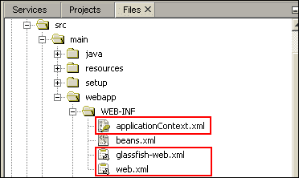
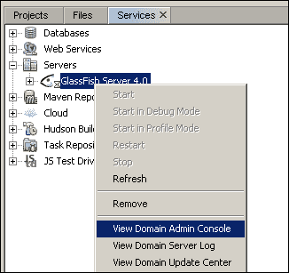
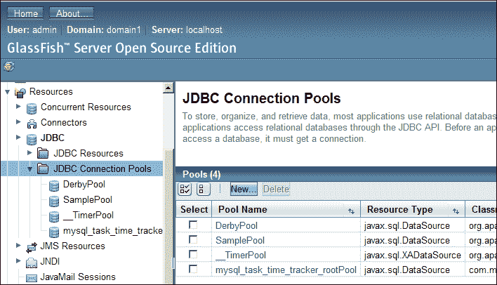
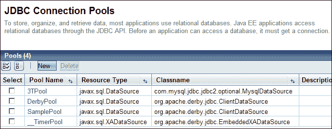
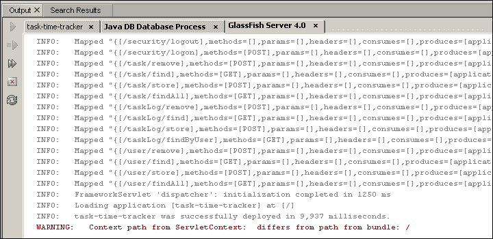
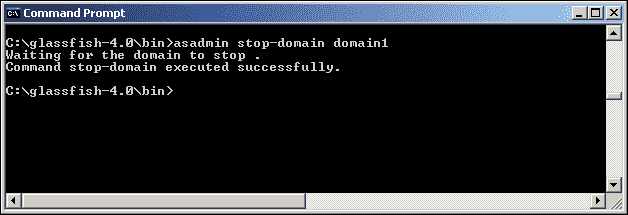

# 第 8 章在玻璃鱼身上跑 3 吨

在本章中，我们将在 GlassFish 4 服务器上部署 3T 应用程序。成功的部署将需要几个新的配置文件以及对现有文件的更新。在[第 5 章](05.html "Chapter 5. Testing the DAO Layer with Spring and JUnit")、*使用 Spring 和 JUnit*测试 DAO 层中定义的测试配置中，您已经熟悉了其中的一些文件，但将介绍一些特定于 GlassFish 的新文件。

我们还将配置 GlassFish 服务器，使其独立于 NetBeans IDE 运行。企业环境通常会有许多 GlassFish 服务器实例在不同的主机上运行。理解 GlassFish 的基本配置是一项重要技能，我们将详细介绍连接池配置。

在本章末尾，您将能够看到基于您在[第 7 章](07.html "Chapter 7. The Web Request Handling Layer")、*Web 请求处理层*中仔细映射的 URL 的动态 HTTP 响应。

# 配置 3T 网络应用

web 应用程序配置需要几个新文件，这些文件需要添加到`WEB-INF`目录中，如下面的屏幕截图所示。现在创建这些文件：



注意该`beans.xml`文件是由 NetBeans 创建的，但我们的配置不需要它。现在让我们详细地看一下这些文件中的每一个。

## Spring applicationContext.xml 文件

`applicationContext.xml`文件配置了 Spring 容器，与我们在[第 5 章](05.html "Chapter 5. Testing the DAO Layer with Spring and JUnit")中创建的`testingContext.xml`文件*使用 Spring 和 JUnit*测试 DAO 层非常相似。文件内容如下：

```java
<?xml version="1.0" encoding="UTF-8"?>
<beans 
  xmlns:xsi="http://www.w3.org/2001/XMLSchema-instance"
  xmlns:p="http://www.springframework.org/schema/p" 
  xmlns:context="http://www.springframework.org/schema/context" 
  xmlns:tx="http://www.springframework.org/schema/tx"
  xsi:schemaLocation="
      http://www.springframework.org/schema/beans
      http://www.springframework.org/schema/beans/spring-beans-3.2.xsd
  http://www.springframework.org/schema/context
  http://www.springframework.org/schema/context/spring-context-3.2.xsd
  http://www.springframework.org/schema/tx
  http://www.springframework.org/schema/tx/spring-tx-3.2.xsd">
    <bean id="loadTimeWeaver" 
class="org.springframework.instrument.classloading.glassfish.GlassFishLoadTimeWeaver" />
    <bean id="entityManagerFactory" 
        p:persistenceUnitName="tttPU"
class="org.springframework.orm.jpa.LocalContainerEntityManagerFactoryBean" 
    />

    <!-- Transaction manager for JTA  -->
    <tx:jta-transaction-manager />
    <!-- enable the configuration of transactional behavior based on annotations -->
    <tx:annotation-driven />

    <!-- checks for @Autowired beans -->
    <context:annotation-config/>    

    <!-- Scan for Repository/Service annotations -->
    <context:component-scan base-package="com.gieman.tttracker.dao"/>
    <context:component-scan base-package="com.gieman.tttracker.service"/>
</beans>
```

Spring 使用此文件初始化和配置 JPA`EntityManagerFactory`和`TransactionManager`DAO 以及服务层对象。将`applicationContext.xml`文件与`testingContext.xml`文件进行比较，可以确定简单 Java 容器与企业应用服务器提供的 Java EE 容器之间的关键区别：

*   数据源通过**JNDI**（**Java 命名和目录接口**）从 GlassFish 应用服务器中检索，不由 Spring 在`applicationContext.xml`文件中创建或管理。`persistence.xml`文件中的 JNDI 配置设置将在本章后面定义。
*   装载时间编织器特定于玻璃鱼。
*   事务管理器基于**JTA**（**Java 事务 API**），由 GlassFish 服务器提供。它不是由 Spring 创建或管理的。`<tx:jta-transaction-manager />`和`<tx:annotation-driven />`定义是在 Spring 容器中配置事务行为所需的全部内容。

### 注

您应该熟悉其余的配置属性。注意，组件扫描是针对`dao`和`service`包执行的，以确保这些类中 SpringBean 的自动布线。

当 Spring 容器加载`applicationContext.xml`文件时，通过类路径扫描自动发现[第 7 章](07.html "Chapter 7. The Web Request Handling Layer")*Web 请求处理层*中定义的 MVC 配置类，并加载以配置 Web 应用组件。

## web.xml 文件

`web.xml`web 应用程序部署描述符文件表示 Java web 应用程序的配置。它用于配置 servlet 容器并将 URL 映射到每个已配置的 servlet。每个 Java web 应用程序在 web 应用程序根目录的`WEB-INF`目录中必须有一个`web.xml`。

3T web 应用程序需要以下`web.xml`定义：

```java
<?xml version="1.0" encoding="UTF-8"?>
<web-app version="3.0"  xmlns:xsi="http://www.w3.org/2001/XMLSchema-instance" xsi:schemaLocation="http://java.sun.com/xml/ns/javaee http://java.sun.com/xml/ns/javaee/web-app_3_0.xsd">
    <context-param>
        <param-name>contextConfigLocation</param-name>
        <param-value>/WEB-INF/applicationContext.xml</param-value>
    </context-param>
    <listener>
        <listener-class>
            org.springframework.web.context.ContextLoaderListener
        </listener-class>
    </listener>
    <session-config>
        <session-timeout>30</session-timeout>
        <cookie-config>
            <name>JSESSIONID_3T</name>
        </cookie-config>
    </session-config>
    <welcome-file-list>
        <welcome-file>index.html</welcome-file>
    </welcome-file-list>
</web-app>
```

一些要点如下：

*   如果 Spring 配置文件名为`applicationContext.xml`（如果未提供，这是预期的默认文件名），则定义`contextConfigLocation`值的`context-param`元素是可选的。然而，为了完整性，我们总是包含这个属性。它定义了主 Spring 配置文件的位置。
*   Spring 使用类为`org.springframework.web.context.ContextLoaderListener`的侦听器初始化应用程序上下文的加载。它是启动 Spring 容器并尝试加载`contextConfigLocation`文件的入口点。如果文件无法解析或无效，将引发异常。
*   `session-config`属性定义会话超时（30 分钟不活动）和会话 cookie 名称。
*   如果 URL 中没有明确指定，`welcome-file-list`标识 GlassFish 将提供的文件。

## glassfish-web.xml 文件

`glassfish-web.xml`文件使用特定于 GlassFish 服务器的其他 web 应用程序属性配置 GlassFish：

```java
<?xml version="1.0" encoding="UTF-8"?>
<!DOCTYPE glassfish-web-app PUBLIC "-//GlassFish.org//DTD GlassFish Application Server 3.1 Servlet 3.0//EN" "http://glassfish.org/dtds/glassfish-web-app_3_0-1.dtd">
<glassfish-web-app>
<context-root>/</context-root>
</glassfish-web-app>
```

`context-root`属性标识用于部署的 web 应用程序的服务器路径。我们将把 3T 应用程序部署到服务器的上下文根目录。这意味着可以直接从 web 应用程序的根目录访问 3T 请求处理程序，如以下示例所示：

`/ttt/company/findAll.json`

例如，将`context-root`属性更改为`/mylocation`将需要以下格式的 URL：

`/mylocation/ttt/company/findAll.json`

# 配置 Maven pom.xml 文件

在前面的章节中，您可能在试验依赖项和插件时更改了各种`pom.xml`设置。现在重新访问此文件并确认属性对于构建和部署项目是正确的，这一点很重要。您应该具有以下基本的`pom.xml`配置：

```java
<?xml version="1.0" encoding="UTF-8"?>
<project  xmlns:xsi="http://www.w3.org/2001/XMLSchema-instance" xsi:schemaLocation="http://maven.apache.org/POM/4.0.0 http://maven.apache.org/xsd/maven-4.0.0.xsd">
    <modelVersion>4.0.0</modelVersion>

    <groupId>com.gieman</groupId>
    <artifactId>task-time-tracker</artifactId>
    <version>1.0</version>
    <packaging>war</packaging>
    <name>task-time-tracker</name>
    <properties>
        <endorsed.dir>
            ${project.build.directory}/endorsed
        </endorsed.dir>
        <project.build.sourceEncoding>
            UTF-8
        </project.build.sourceEncoding>
        <spring.version>3.2.4.RELEASE</spring.version>
        <logback.version>1.0.13</logback.version>
    </properties>
    <dependencies>
        <dependency>
            <groupId>org.eclipse.persistence</groupId>
            <artifactId>javax.persistence</artifactId>
            <version>2.1.0-SNAPSHOT</version>
            <scope>provided</scope>
        </dependency>
        <dependency>
            <groupId>org.eclipse.persistence</groupId>
            <artifactId>eclipselink</artifactId>
            <version>2.5.0-SNAPSHOT</version>
            <scope>provided</scope>
        </dependency>        
        <dependency>
            <groupId>org.eclipse.persistence</groupId>
            <artifactId>
                org.eclipse.persistence.jpa.modelgen.processor
            </artifactId>
            <version>2.5.0-SNAPSHOT</version>
            <scope>provided</scope>
        </dependency>
        <dependency>
            <groupId>javax</groupId>
            <artifactId>javaee-web-api</artifactId>
            <version>7.0</version>
            <scope>provided</scope>
        </dependency>
        <dependency>
            <groupId>ch.qos.logback</groupId>
            <artifactId>logback-classic</artifactId>
            <version>${logback.version}</version>
        </dependency>    
        <dependency>
            <groupId>junit</groupId>
            <artifactId>junit</artifactId>
            <version>4.11</version>
            <scope>test</scope>
        </dependency>        
        <dependency>
            <groupId>mysql</groupId>
            <artifactId>mysql-connector-java</artifactId>
            <version>5.1.26</version>
            <scope>provided</scope>
        </dependency>            
        <dependency>
            <groupId>org.springframework</groupId>
            <artifactId>spring-context</artifactId>
            <version>${spring.version}</version>
        </dependency>
        <dependency>
            <groupId>org.springframework</groupId>
            <artifactId>spring-context-support</artifactId>
            <version>${spring.version}</version>
        </dependency>
        <dependency>
            <groupId>org.springframework</groupId>
            <artifactId>spring-tx</artifactId>
            <version>${spring.version}</version>
        </dependency>
        <dependency>
            <groupId>org.springframework</groupId>
            <artifactId>spring-jdbc</artifactId>
            <version>${spring.version}</version>
        </dependency>
        <dependency>
            <groupId>org.springframework</groupId>
            <artifactId>spring-orm</artifactId>
            <version>${spring.version}</version>
        </dependency>
        <dependency>
            <groupId>org.springframework</groupId>
            <artifactId>spring-instrument</artifactId>
            <version>${spring.version}</version>
        </dependency>
        <dependency>
            <groupId>org.springframework</groupId>
            <artifactId>spring-webmvc</artifactId>
            <version>${spring.version}</version>
        </dependency>
        <dependency>
            <groupId>org.springframework</groupId>
            <artifactId>spring-test</artifactId>
            <version>${spring.version}</version>
            <scope>test</scope>
        </dependency>

    </dependencies>

    <build>
        <plugins>
            <plugin>
                <groupId>org.apache.maven.plugins</groupId>
                <artifactId>maven-compiler-plugin</artifactId>
                <version>3.1</version>
                <configuration>
                    <source>1.7</source>
                    <target>1.7</target>
                    <compilerArguments>
                        <endorseddirs>
                            ${endorsed.dir}
                        </endorseddirs>
                    </compilerArguments>
                </configuration>
            </plugin>
            <plugin>
                <groupId>org.apache.maven.plugins</groupId>
                <artifactId>maven-war-plugin</artifactId>
                <version>2.3</version>
                <configuration>
                  <warName>${project.build.finalName}</warName>
                  <failOnMissingWebXml>false</failOnMissingWebXml>
                </configuration>
            </plugin>
            <plugin>
                <groupId>org.apache.maven.plugins</groupId>
                <artifactId>maven-dependency-plugin</artifactId>
                <version>2.6</version>
                <executions>
                    <execution>
                        <id>copy-endorsed</id>
                        <phase>validate</phase>
                        <goals>
                            <goal>copy</goal>
                        </goals>
                        <configuration>
                            <outputDirectory>
                                ${endorsed.dir}
                            </outputDirectory>
                            <silent>true</silent>
                            <artifactItems>
                                <artifactItem>
                                    <groupId>javax</groupId>
                                    <artifactId>
                                        javaee-endorsed-api
                                    </artifactId>
                                    <version>7.0</version>
                                    <type>jar</type>
                                </artifactItem>
                            </artifactItems>
                        </configuration>
                    </execution>
                    <execution>
                        <id>copy-all-dependencies</id>
                        <phase>compile</phase>
                        <goals>
                            <goal>copy-dependencies</goal>
                        </goals>
                        <configuration>
                            <outputDirectory>
                                ${project.build.directory}/lib
                            </outputDirectory>
                            <includeScope>compile</includeScope>
                        </configuration>                        
                    </execution>                  
                </executions>
            </plugin>
            <plugin>
                <groupId>org.apache.maven.plugins</groupId>
                <artifactId>maven-surefire-plugin</artifactId>
                <version>2.14.1</version>
                <configuration>
                    <skipTests>true</skipTests>
                    <includes>
                        <include>**/dao/*Test.java</include>
                        <include>**/service/*Test.java</include>
                    </includes>
                    <argLine>
-javaagent:target/lib/spring-instrument-${spring.version}.jar
                    </argLine>
                </configuration>
            </plugin>            

        </plugins>
    </build>
    <repositories>
        <repository>
          <url>
            http://download.eclipse.org/rt/eclipselink/maven.repo/
          </url>
          <id>eclipselink</id>
          <layout>default</layout>
          <name>
            Repository for library EclipseLink (JPA 2.1)
          </name>
        </repository>
    </repositories>
</project>
```

在逆向工程过程中添加了几个依赖项，EclipseLink 的`<repository>`定义也是如此。只需进行一些更改：

*   **添加 MySQL 连接器**：`mysql-connector-java`依赖项应该使用最新版本。GlassFish 不提供 MySQL 连接器，将在本章后面的一节中复制到应用程序服务器。作用域设置为`provided`，以便在构建 WAR 文件时不包含此 JAR。
*   **Turn off the Surefire testing plugin**: Your deployments will be much faster if you turn off testing during the build process. Change the `maven-surefire-plugin` entry `skipTests` to `true`. This will skip the testing phase when building and deploying the project locally.

    ### 注

    构建企业应用程序通常在专用构建服务器上执行，该服务器执行测试用例并报告构建过程的成功或失败。禁用测试阶段只能在开发人员机器上进行，以加快构建和部署过程。开发人员不会喜欢每次更改类时等待 30 分钟来执行测试套件。在构建服务器上执行时，决不应禁用测试阶段。

# 将 eclipselink.target-server 添加到 persistence.xml 文件中

`persistence.xml`文件要求包含属性，以完全启用事务行为。位于`src/main/resources/META-INF`的`persistence.xml`文件应如下所示：

```java
<?xml version="1.0" encoding="UTF-8"?>
<persistence version="2.1" 

  xmlns:xsi="http://www.w3.org/2001/XMLSchema-instance"
  xsi:schemaLocation="http://xmlns.jcp.org/xml/ns/persistence
  http://xmlns.jcp.org/xml/ns/persistence/persistence_2_1.xsd">

  <persistence-unit name="tttPU" transaction-type="JTA">
    <provider>
        org.eclipse.persistence.jpa.PersistenceProvider
    </provider>
    <jta-data-source>jdbc/tasktimetracker</jta-data-source>
    <exclude-unlisted-classes>false</exclude-unlisted-classes>
    <properties>
        <property name="eclipselink.target-server"
            value="SunAS9"/>
        <property name="eclipselink.logging.level" 
            value="INFO"/>
    </properties>
  </persistence-unit>
</persistence>
```

如果没有此添加，您的应用程序中将无法使用事务。`eclipselink.logging.level`也可以根据需要改变，以增加或减少记录输出。

# 将 logback.xml 文件添加到您的资源目录

`logback.xml`文件应添加到`src/main/resources/`以便能够登录到您的应用程序。本文件内容将与测试`logback.xml`文件相同，如下所示：

```java
<?xml version="1.0" encoding="UTF-8"?>
<configuration scan="true" scanPeriod="30 seconds" >
    <contextName>TaskTimeTracker</contextName>
    <appender name="STDOUT"
        class="ch.qos.logback.core.ConsoleAppender">
        <encoder>
          <pattern>
           %d{HH:mm:ss.SSS} [%thread] %-5level %logger{5} - %msg%n
          </pattern>
        </encoder>
    </appender>
    <logger name="com.gieman.tttracker"
        level="DEBUG" additivity="false">
        <appender-ref ref="STDOUT" />
    </logger>
    <logger name="com.gieman.tttracker.dao"
        level="DEBUG" additivity="false">
        <appender-ref ref="STDOUT" />
    </logger>
    <logger name="com.gieman.tttracker.domain"
        level="DEBUG" additivity="false">
        <appender-ref ref="STDOUT" />
    </logger>
    <logger name="com.gieman.tttracker.service"
        level="DEBUG" additivity="false">
        <appender-ref ref="STDOUT" />
    </logger>
    <logger name="com.gieman.tttracker.web"
        level="DEBUG" additivity="false">
        <appender-ref ref="STDOUT" />
    </logger>
    <root level="INFO">
        <appender-ref ref="STDOUT" />
    </root>
</configuration>
```

# 配置 GlassFish 服务器

与 NetBeans 捆绑的 GlassFish 4 服务器在您第一次运行项目时自动配置。这意味着根据项目的当前状态动态设置任何必需的资源。所有这些属性都被复制到`setup`目录下的`glassfish-resources.xml`文件中，如下图所示：


`glassfish-resources.xml`文件在数据库反向工程过程中被修改，以包含 JPA 所需的数据库连接池和 JDBC 资源。因此，该文件的内容定义了所需的 GlassFish 连接池详细信息。

必须了解，NetBeans 使用此文件动态配置分配给项目的 GlassFish 服务器。在实际情况下，GlassFish 服务器由管理员配置，部署 web 应用程序可以通过命令行或 GlassFish 管理控制台完成。您将不会在正常的企业环境中通过 NetBeans 部署应用程序，因此从根本上了解 GlassFish 是如何从第一个主体配置的是非常有用的。本节专门用于配置 GlassFish 服务器连接池，以便与 3T 一起使用。尽管在 NetBeans 上运行 3T 并不严格要求这样做，但我们强烈建议您花点时间通过以下步骤完全配置 GlassFish 服务器。

这将确保您了解在不同的物理服务器上配置 GlassFish 服务器以运行 3T 应用程序需要什么。

1.  The first step in configuring your GlassFish server is to perform a **Clean and Build**:

    

2.  When the build is complete, navigate to `target/lib` as shown in the following screenshot to view the JAR files required by your project:

    

3.  Open a file explorer window (Windows Explorer or OS X Finder) to navigate to this directory and copy the `mysql-connector-java-5.1.26.jar` file to your GlassFish domain `libs` directory, as shown in the following screenshot:

    

## 重命名安装目录

位于`src/main/`的`setup`目录包含文件`glassfish-resources.xml`，应重命名该目录，以确保 NetBeans 不会使用这些属性动态配置 GlassFish。我们建议将目录重命名为`setup-original`。

## 在 NetBeans 中启动 GlassFish 服务器

导航至的**服务**页签；右键点击**GlassFish Server 4.0**节点，选择**启动**，如下图所示：


您应该在 NetBeans IDE 和 GlassFish 服务器 4.0 节点重载的底部看到服务器输出。您现在可以右键点击**GlassFish Server 4.0**节点，选择**查看域管理控制台**：



这将启动您的默认浏览器并加载域管理控制台。

## 配置 JDBC 连接池

此部分将使用 GlassFish 管理控制台配置 3T 应用程序所需的 JDBC 连接池和 JDBC 资源。

1.  Open the **Resources** node and navigate to the **JDBC Connection Pools** tab:

    

    ### 注

    您可能会看到一个名为`mysql_task_time_tracker_rootPool`或类似名称的连接池，如前面的屏幕截图所示。这是 NetBeans 在上一次运行期间使用`glassfish-resources.xml`文件中指定的属性创建的。如果希望继续使用此连接池，则可以跳过其余部分。我们建议您删除此条目，并继续按照以下步骤了解如何配置 GlassFish 连接池。

2.  Click on the **New** button and enter the following details before clicking on the **Next** button:

    

3.  The next screen looks daunting but only a few entries are required. Scroll all the way down until you can view the **Additional Properties** section:

    

4.  There are many properties here! Thankfully only a few are required unless you are familiar with MySQL database administration. You may safely delete all the listed properties to keep the configuration simple, and then enter the following properties that correspond to the original `glassfish-resources.xml` file:

    

5.  The basic fields that are required are **URL**, **User**, and **Password**. Saving these settings will return you to the **JDBC Connection Pools** screen:

    

6.  Click on the **3TPool** name to open the settings again and click on the **Ping** button to test the connection. You should now see the following result:

    

## 配置 JDBC 资源

最后一步是创建一个**JDBC 资源**。点击本节点按钮，显示配置的资源：


点击**新建…**按钮并输入以下详细信息：


**JNDI 名称**必须与`persistence.xml`文件中定义的`<jta-data-source>`属性相同，因此设置为`jdbc/tasktimetracker`。点击**确定**按钮保存资源配置。刷新的节点现在应该显示新创建的资源。

现在您已经完成了 GlassFish JDBC 设置的配置。

# 运行 3T

现在，我们建议您停止 GlassFish 并重新启动 NetBeans，以确保以前所做的所有更改在 IDE 中都是最新的。最后一步是运行 3T 应用程序：


这将产生可观的输出，最终将 3T 应用程序部署到 GlassFish 服务器：



请注意，**GlassFish Server 4.0**输出中的最终**警告**可以忽略；从 NetBeans 内部将应用程序部署到根上下文时，这是一个已知问题。

NetBeans 的最后一个操作是打开默认浏览器，进入[第 1 章](01.html "Chapter 1. Preparing Your Development Environment")*准备开发环境*中显示的欢迎页面。您应该注意，浏览器中的 URL 现在将是：

`http://localhost:8080/`

而不是原来的：

`http://localhost:8080/task-time-tracker`

这是由于`glassfish-web.xml`中的`<context-root>/</context-root>`属性定义了 web 应用程序路径的根。3T web 应用程序现在已部署到上下文根，无需前缀即可到达已部署的 3T 应用程序。

您现在可以尝试加载映射的 URL，如`/ttt/company/findAll.json`。如图所示在浏览器中输入，然后点击*输入*键。您应该看到以下结果：


此消息来自我们在上一章中实现的`UserInSessionInterceptor`。会话检查失败，因为我们当前未登录，将前面的 JSON 消息返回到浏览器。类中的`logger.info`消息也应该在 GlassFish 输出中可见：


您现在可以使用以下屏幕截图中所示的参数尝试登录操作：


这个结果可能会让你大吃一惊。请求 URL 映射到`SecurityHandler.logon`方法，该方法在`@RequestMapping`注释中用`method = RequestMethod.POST`定义。这限制了对该方法的访问仅限于`POST`请求，而浏览器提交的 URL 编码参数是`GET`请求。GlassFish 405 HTTP 状态消息就是结果。在[第 10 章](10.html "Chapter 10. Logging On and Maintaining Users")*登录和维护用户*中，我们将使用相应的`POST`请求来实现登录过程。

您应该注意，所有处理程序 URL 都将通过 ExtJS4 应用程序的 AJAX 调用进行访问，这将在后续章节中开发。如前所示，您永远不会在浏览器中看到这些 URL。

# 不使用网虫管理玻璃鱼

在 NetBeans 中启动和停止 GlassFish 既简单又方便。但是，在企业环境中，停止/启动过程将通过包装`asadmin`实用程序的脚本进行管理。有关该实用程序的完整说明，请参见*GlassFish 用户管理指南*中的[https://glassfish.java.net/docs/4.0/administration-guide.pdf](https://glassfish.java.net/docs/4.0/administration-guide.pdf) 。

`asadmin`实用程序用于从命令行或脚本执行 GlassFish 服务器的管理任务。您可以使用此实用程序代替本章前面使用的 GlassFish 管理控制台界面。几乎可以在管理控制台中执行的每个操作都有一个与`asadmin`相同的命令。

`asadmin`实用程序位于`{as-install}/bin`目录中。如果未提供到`asadmin`的完整路径，则应在此目录中运行命令。要启动域，可以执行以下命令：

```java
asadmin start-domain domain1

```

`domain1`参数表示要启动的域的名称。从 Windows 命令提示符执行此命令将产生以下输出：


停止运行 GlassFish 域也很简单。使用以下命令：

```java
asadmin stop-domain domain1

```

这将在以下输出中产生结果：



我们将继续在 NetBeans 中启动和停止 GlassFish，但将在[第 13 章](13.html "Chapter 13. Moving Your Application to Production")中重新讨论`asadmin`，将您的应用程序移至生产。

# 总结

本章重点介绍配置 3T web 应用程序以部署到 GlassFish 4 服务器所需的步骤。定义了 Spring 配置文件，`web.xml`文件配置为在启动时加载 Spring 容器。我们指导您完成了 GlassFish 连接池配置过程，并将 3T web 应用程序部署到 GlassFish 4 服务器的上下文根目录中。

这是我们企业应用程序开发过程中的一个关键点。我们现在已经完全涵盖了 Java 开发人员的领域，构建了一个功能性后端系统，该系统将为任何 JSON 客户机提供动态请求。[第 9 章](09.html "Chapter 9. Getting Started with Ext JS 4")*开始使用 Ext JS 4*，将介绍强大的 Ext JS 4 框架，开始我们的前端开发之旅。