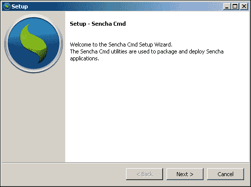
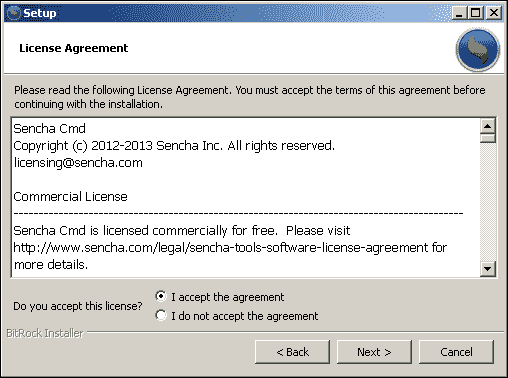
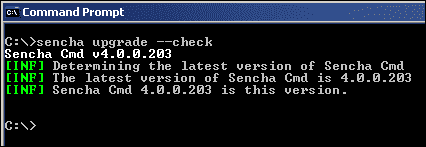
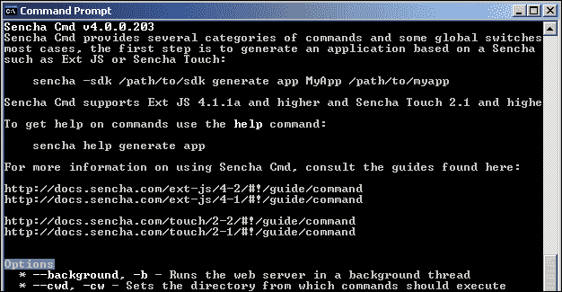
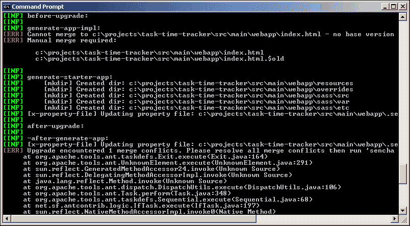
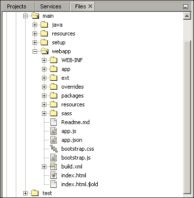
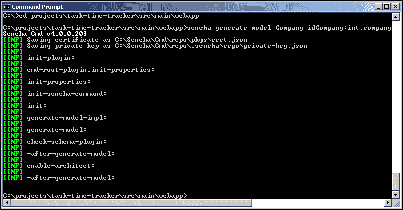
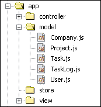

# 第 9 章：Ext JS 4 入门

**Ext JS 4**是迄今为止可用的最复杂的 JavaScript 库，为几乎所有实际设计问题提供了一组惊人的小部件。为了开发需要高度用户交互的复杂、跨浏览器兼容的应用程序，它尽了我们所能。在本章中，我们将：

*   了解 ExtJS4MVC 的核心概念
*   探索实用的项目设计和开发惯例
*   安装 ExtJS4 开发框架并引入 Sencha Cmd
*   为 3T 应用程序生成 Ext JS 4 应用程序框架

ExtJS 作为**Yahoo 用户界面**（**YUI**库的扩展，已经走过了漫长的道路。每一个新版本都是对前一个版本的重大改进，ExtJS4 也不例外。刚接触 ExtJS 的人会欣赏优雅的框架设计和一致的 API，而从 ExtJS3 过渡过来的人会欣赏许多方面的改进，包括 MVC 设计模式的引入。无论您的背景如何，本章都将帮助您提高 ExtJS4 的工作效率。

应该注意的是，ExtJS4 并不是目前唯一可用的 JavaScript MVC 框架。例如，`Angular.js`和`Backbone.js`都是非常有能力的开发框架，具有与 ExtJS4 类似的 MVC 特性。然而，他们没有丰富的文档、构建工具和商业支持，使得 ExtJS4 非常适合企业应用程序开发。

# 应用程序设计的重要性

除了技术之外，在开发企业应用程序时，深思熟虑且一致的应用程序设计至关重要。应用程序架构的质量将决定应用程序在项目生命周期中的可维护性、可伸缩性和总体成本。设计良好的应用程序的好处包括：

*   应用程序将更容易理解。如果有一种始终如一的做事方式，新的团队成员会很快跟上进度。
*   该应用程序将更易于维护。如果您有一致的应用程序设计准则，那么增强功能和新功能的实现就会简单得多。
*   代码一致性。一个设计良好的应用程序将具有完善的命名约定、目录结构和编码标准。
*   该应用程序将是多开发者友好的。在大型项目中，会有很多人参与，一致的设计策略将确保每个人都在同一页上。

当你开始一个新项目并兴奋地为概念验证演示做第一个原型时，不太明显的好处往往被忽视。从简单的开始重构和扩展项目的能力通常是企业应用程序开发中的一个关键因素。无论项目在初始阶段看起来有多小，您都可以确定，业务用户一旦熟悉应用程序，就会希望更改工作流和布局。将请求新功能，旧功能将被弃用。随着应用程序的不断发展，组件将被移动和重新设计。一致且经过深思熟虑的应用程序设计将使这些项目生命周期过程不那么令人生畏。谢天谢地，ExtJS4 应用程序体系结构本身鼓励进行正式且结构良好的应用程序设计。

# Ext JS 4 MVC 概念

当 MVC 设计模式首次在 ExtJS4 中引入时，它彻底改变了 ExtJS 框架。尽管 MVC 是众所周知的设计模式，但这是第一次由复杂的 JavaScript 框架实现该策略。有以下几个关键好处：

*   MVC 设计模式将代码组织成逻辑领域或组件类型，这使得代码更容易理解
*   MVC 模块化可以简化组件测试和重构，因为每个对象都有明确的用途
*   MVC 设计模式体系结构鼓励更干净的代码，清晰地分离数据访问、表示和业务逻辑

与之前的 ExtJS3 相比，这是一个巨大的优势，ExtJS3 中唯一真正的 MVC 组件是**V**（**视图**。由 Ext JS 3 开发人员尽其所能设计出**M**（**模型**和**C**（**控制器**，这常常导致代码混乱和不一致。现在让我们看看 ExtJS4 是如何定义 MVC 设计模式的。

## 模型

ExtJS4 模型是表示域实体的属性集合。我们的 3T 应用程序将需要一个`Company`、`Project`、`Task`、`User`和`TaskLog`模型定义，这可能并不奇怪，就像它们在 Java 域层中所表示的那样。我们的 Java 域对象的主要区别在于，ExtJS4 模型等价物将支持持久性。多亏了 ExtJS4`data`包，每个模型实例都知道如何持久化和管理其状态。

## 视图

Ext JS 4 视图表示逻辑视觉组件块，其本身可能包括面板、工具栏、网格、表单、树和图表。Ext JS 4 视图始终驻留在自己的文件中，并且应该尽可能地保持*哑*。这意味着视图中不应该有 JavaScript 业务逻辑；其目的是为用户呈现数据并提供交互能力。

## 控制器

Ext JS 4 控制器可以粗略地描述为将应用程序逻辑绑定在一起的粘合剂。控制器是处理事件处理和跨视图交互的中心，并定义应用程序工作流。绝大多数 JavaScript 业务逻辑代码将驻留在控制器中。

## Ext JS 4 灵活性

尽管我们对不同的 MVC 组件有一个清晰的定义，但 Ext JS 4 框架本身具有相当大的实现灵活性。我们不需要使用控制器或模型；事实上，我们可以使用 ExtJS3 中遵循的相同策略轻松构建一个完全工作的 ExtJS4 应用程序。然而，这将是一个错误，应该不惜一切代价避免。利用 MVC 体系结构进行企业应用程序开发的好处非常显著，包括但不限于更简单、更健壮的代码库。

# Ext JS 4 设计惯例和概念

SeaExtEXJS 4 团队在定义约定方面做了大量工作，您应该考虑这些约定来构建企业应用程序。其中包括标准目录结构、命名约定和详细的设计最佳实践。我们强烈建议您浏览*Sencha Ext JS 4 Docs*网站[上的许多教程和指南 http://docs.sencha.com/extjs/4.2.2](http://docs.sencha.com/extjs/4.2.2) 熟悉其应用程序设计建议。

本书将遵循 Ext JS 4 团队概述的通用设计策略，在相关章节中介绍时注意到并解释了细微差异。涵盖基本 Ext JS 4 概念超出了本书的范围，您可能需要参考*Sencha Ext JS 4 文档*来调整您的理解。

# 实践惯例

一个具有一致命名约定的结构良好的 ExtJS4 项目将是一件令人愉快的事情。具有数百个文件的企业应用程序的结构应该易于学习和维护。当您询问同事“显示 xyz 小部件编辑工具栏的文件在哪里？”时，这种情况应该很少发生。

## 项目结构

应始终使用 Ext JS 4 目录结构，该目录结构由一个顶级应用程序和名为`controller`、`model`、`store`和`view`的子目录组成。这是任何 ExtJS4 应用程序的默认目录结构，允许与 Sencha Cmd 构建工具进行开箱即用的集成。

大型项目有数百个 JavaScript 文件，因此具有一致的项目结构非常重要。实用的名称空间，特别是在`view`目录中，可以简化项目结构并使查找组件更容易。在[第 10 章](10.html "Chapter 10. Logging On and Maintaining Users")、*登录和维护用户*、[第 11 章](11.html "Chapter 11. Building the Task Log User Interface")、*构建任务日志用户界面*、[第 12 章](12.html "Chapter 12. 3T Administration Made Easy")、*3T 管理变得简单*，例如，我们将创建一个`view`包含以下屏幕截图（左侧）中显示的文件的结构：


前面的屏幕截图显示了同一目录中的所有视图（在其右侧）。哪种方式更好？这取决于项目的性质和文件的数量。企业项目通常以模块化的方式命名，有许多子目录对相关组件进行逻辑分组。较小的项目也可以很容易地具有平面结构，其中所有文件都位于同一目录中。无论你选择哪种结构，都要保持一致！对于任何新开发人员来说，在不搜索大量文件和目录的情况下查找组件都应该很容易。

## 命名约定

我们建议定义一个易于理解和遵循的一致命名约定。在文件系统和您正在使用的 IDE 中查找文件应该很容易。

### 命名商店和模型

每个模型应以其所代表的实体的单数命名（例如，`Company`、`Project`、`Task`、`TaskLog`和`User`。每个商店都应该以类似的单数方式命名。我们已经看到`Store`作为后缀添加到 ExtJS3 中存储名称（例如，`ProjectStore`），但不建议将其用于 ExtJS4。控制器通过在门店名称中添加`Store`自动为每个门店创建`get`功能。将存储命名为`ProjectStore`将在引用该存储的每个控制器中产生一个名为`getProjectStoreStore`的函数。因此，我们建议您使用不带`Store`后缀的商店名称。

单数形式的商店名称通常替换为复数形式。例如，项目存储通常被命名为`Projects`。同样，一致性是关键。如果您决定使用复数形式，请对每个门店名称使用复数形式。在我们的应用程序中，这将导致`Companies`、`Projects`、`Tasks`、`TaskLogs`和`Users`存储。这有时会导致拼写混乱；我们已经看到 Companys 和 Companys 都被用于 Company 的复数形式。当英语不是您的第一语言时，可能很难知道实体的正确复数名称，例如地区、国家、公司、货币和状态。因此，在命名存储时，我们更喜欢使用单数版本。

### 命名视图

考虑一下下面的情况，我们在 SeCHA DOCS 网站上进行了研究：


有四个不同的**面板**文件打开（`Ext.grid.Panel`、`Ext.tab.Panel`、`Ext.form.Panel`和`Ext.panel.Panel`。在这种情况下，试图找到`Ext.grid.Panel`文件是令人沮丧的；在最坏的情况下，您需要单击四个不同的选项卡项。在一个大型项目中，可能会有许多名为`Panel`的面板容器。我们建议为每个文件指定一个唯一的名称，无论其名称空间如何。与模型和存储不同，模型和存储名称空间使用相同的文件名，我们不建议在视图类之间使用相同的文件名。例如，如果不检查文件内容，就无法在 IDE 选项卡栏中轻松区分文件`app.view.user.List`和`app.view.tasklog.List`。使这些文件名唯一要容易得多，即使它们可能存在于不同的名称空间中。

后置类类型的使用是另一个值得讨论的问题。ExtJS3 在类名上使用了类型化后缀。这导致了`GridPanel`、`FormPanel`、`TabPanel`和`Panel`文件名。它们都是面板。通过检查文件名很容易识别类是什么。ExtJS4 采用了名称空间的方法，删除了描述性名称。前面的示例变成了`Ext.grid.Panel`、`Ext.tab.Panel`、`Ext.form.Panel`和`Ext.panel.Panel`。每个文件都被命名为`Panel`，如果不知道它所在的目录，这将不会有很大帮助。

无论您实施什么命名约定，一致性都非常重要。我们将使用以下命名约定：

*   所有命名空间文件夹名称都将为小写。
*   用于表示项目列表的任何类的类名都将以`List`作为后缀。`List`的实施并不重要；我们不在乎清单是使用网格、简单模板还是数据视图创建的。
*   任何属于表单的类都将以`Form`作为后缀。
*   任何树类都将以`Tree`作为后缀。
*   任何作为窗口的类都将使用`Window`进行后期固定。
*   任何管理一组相关组件的定位和布局的组件都将以`Manage`作为前缀。此类类通常包含按适当布局排列的工具栏、列表、表单和选项卡面板。

您可能希望引入适合您的开发环境的其他约定。这很好；重要的一点是保持一致，确保每个人都理解并遵守您的约定。

### 命名控制器

我们建议所有控制器类名都以`Controller`作为后缀。这使得它们在任何 IDE 中都很容易识别。例如，负责用户维护的控制器将因此命名为`UserController`。

### 命名 X 类型

我们建议每个类使用小写类名作为`xtype`。这是确保每个视图类的文件名唯一的另一个很好的理由。`UserList``xtype`为`userlist`、`UserForm`X 型为`userform`、`ManageUsers`X 型为`manageusers`。不可能有混乱。

# Ext JS 4 开发环境

Ext JS 4 开发需要两个核心组件，如下所示：

*   **Sencha Cmd 工具**：这是一个跨平台、基于 Java 的命令行工具，提供了许多选项来帮助管理应用程序的生命周期
*   **Ext JS 4 SDK（软件开发工具包）**：此包含应用程序开发所需的所有源文件、示例、资源和精简脚本

我们现在将检查并安装这些组件中的每一个。

## 安装 Sencha Cmd

Sencha Cmd 工具可从[下载 http://www.sencha.com/products/sencha-cmd/download](http://www.sencha.com/products/sencha-cmd/download) 。该文件大约为 46 MB，需要在运行安装过程之前解压缩。



点击**下一步**上的查看**许可协议**部分。您需要在点击**下一步**按钮之前接受协议：



以下截图中显示的屏幕提示输入**安装目录**。我们建议您将 Sencha Cmd 工具安装在易于访问的目录上（`/Users/Shared/`适用于 Mac 用户，`C:\`适用于 Windows 用户）：


点击**下一步**上的继续。这将显示一条提示，指示安装程序现在可以开始在您的计算机上安装 Sencha Cmd 了。再次点击**下一步**继续安装。最终提示将确认 Sencha Cmd 的安装：


您现在可以查看已安装的文件，如下图所示：


要确认安装，请打开命令提示符（Windows）或终端（Mac），键入`sencha`，然后按*回车*键。这将确认 Sencha Cmd 已添加到您的系统路径，并将产生类似于以下屏幕截图所示的输出：


注意任何当前打开的控制台/终端窗口都需要关闭并重新打开，以确保重新加载安装路径更改。最后一步是通过键入以下内容检查是否有可用的升级：

```java
sencha upgrade –-check

```

此命令应显示适当的消息，如以下屏幕截图所示：



可以通过省略`––check`参数来升级 Sencha Cmd 的版本。有关 Sencha 命令行选项的完整列表，请参阅[http://docs.sencha.com/extjs/4.2.2/#!/向导/命令](http://docs.sencha.com/extjs/4.2.2/#!/guide/command)。本页还包含许多有用的故障排除提示和说明。此外，您还可以通过执行`sencha help`来使用命令行帮助。执行命令`sencha help`将显示详细的帮助选项：



## 安装 Ext JS 4 SDK

SDK 可从[下载 http://www.sencha.com/products/extjs](http://www.sencha.com/products/extjs) 。上一步将在以下位置创建 Sencha 目录：

*   `C:\Sencha`适用于 Windows 用户
*   `/Users/Shared/Sencha`针对 Mac 用户

下载 SDK 后，您应该在这个 Sencha 目录中创建一个`ext-xxx`目录，其中`xxx`表示 ExtJS4 框架的版本。然后，您可以将 SDK 解压到此目录中，得到如下屏幕截图所示的结构：


现在可以初始化 ExtJS43T 应用程序框架了。

# 生成 3T Ext JS 4 应用框架

骨架生成命令的格式为：

```java
sencha -sdk /path/to/sdk generate app MyApp /path/to/MyApp

```

运行此命令将把所有必需的 SDK 文件复制到`/path/to/MyApp`目录，并创建一个可供开发的资源框架。您必须为`SDK`和`MyApp`目录使用完整路径。

务必记住 3T 应用程序是一个 Maven 项目，web 内容根目录是位于 Maven 目录结构中的`webapp`目录。在[第 1 章](01.html "Chapter 1. Preparing Your Development Environment")、*准备开发环境*中创建的项目文件夹以及`webapp`目录（在 Windows 上）可在`C:\projects\task-time-tracker\src\main\webapp`中找到。

在 Mac 上，可在`/Users/{username}/projects/task-time-tracker/src/main/webapp`找到。

现在可以通过执行以下命令（对于 Windows 平台）生成 3T 应用程序框架：

```java
sencha –sdk C:\Sencha\ext-4.2.2 generate app TTT C:\projects\task-time-tracker\src\main\webapp

```

请注意，此命令必须位于单行上。`TTT`参数表示应用程序名称，将用于生成应用程序名称空间。我们本可以使用`TaskTimeTracker`，但缩写形式更容易书写！

从终端执行命令应产生相当大的输出，并以一些红色错误结束：



不要太在意**【错误】**警告；Sencha Cmd 已确定存在`index.html`文件，并将其替换为 Sencha Cmd 版本。原始文件已复制到`index.html.$old`。我们不需要备份文件（它是在 NetBeans 项目创建过程中创建的）；可以安全地删除它。

打开 NetBeans IDE 将显示 3T 项目的`webapp`目录中的许多新文件和目录：



现在，您可以运行项目以在浏览器中查看输出：


此输出是`index.html`页面中的默认 Ext JS 4 应用程序内容，由构建项目框架时的`generate app`命令创建。现在让我们看看已经生成的关键文件。

## index.html 文件

`index.html`文件由以下列表组成：

```java
<!DOCTYPE HTML>
<html>
<head>
  <meta charset="UTF-8">
  <title>TTT</title>
  <!-- <x-compile> -->
    <!-- <x-bootstrap> -->
      <link rel="stylesheet" href="bootstrap.css">
      <script src="ext/ext-dev.js"></script>
      <script src="bootstrap.js"></script>
    <!-- </x-bootstrap> -->
    <script src="app.js"></script>
  <!-- </x-compile> -->
</head>
<body></body>
</html>
```

注意页面内容中的`x-compile`和`x-bootstrap`标记。Sencha Cmd 工具使用这些脚本，并允许编译器在应用程序的根目录下识别脚本（默认文件始终为`app.js`。编译器还忽略了框架的引导部分，该部分在开发过程中仅使用。生成生产应用程序时，所有必需的文件都会在构建过程中被拉入。这将在[第 13 章](13.html "Chapter 13. Moving Your Application to Production")*将您的应用程序移至生产*中详细介绍。

您应该注意，`ext-dev.js`文件是唯一需要的 ExtJS4 框架资源。此文件用于在开发阶段动态加载 JavaScript 类。然后，框架将动态检索应用程序所需的任何 JavaScript 资源。

## app.js 和 Application.js 文件

`app.js`文件是应用程序的入口点。文件的内容，包括生成的注释，如下所示：

```java
/*
    This file is generated and updated by Sencha Cmd. You can edit this file as needed for your application, but these edits will have to be merged by Sencha Cmd when upgrading.
*/
Ext.application({
  name: 'TTT',
  extend: 'TTT.Application',
  autoCreateViewport: true
});
```

`Ext.application`扩展了`TTT.Application`类，该类在`app/Application.js`文件中定义如下：

```java
Ext.define('TTT.Application', {
  name: 'TTT',
  extend: 'Ext.app.Application',
  views: [
    // TODO: add views here
  ],
  controllers: [
    // TODO: add controllers here
  ],
  stores: [
    // TODO: add stores here
  ]
});
```

`Application.js`文件将包含我们的 3T 应用程序特定代码。

### 注

您应该注意，这是一个不同于早期 Ext JS 4 教程中描述的设置，`app.js`文件包含特定于应用程序的属性（视图、控制器、存储和应用程序函数）。前面概述的方法将所有特定于应用程序的代码保存在`app`目录中。

我们对自动生成的`Application.js`文件的第一个变更是增加的`launch`功能：

```java
Ext.define('TTT.Application', {
    name: 'TTT',
    extend: 'Ext.app.Application',
    views: [
        // TODO: add views here
    ],
    controllers: [
        // TODO: add controllers here
    ],
    stores: [
        // TODO: add stores here
    ],
    launch: function() {
 Ext.create('TTT.view.Viewport');
 }
});
```

我们现在可以从`app.js`文件中删除`autoCreateViewport:true`，因为创建视口的逻辑现在在`launch`函数中。`launch`功能本身将在下一章中进行增强，以实现用户登录，因此将有大量代码！更新后的`app.js`文件如下：

```java
Ext.application({
    name: 'TTT',
    extend: 'TTT.Application'    
});
```

## bootstrap.js 和 bootstrap.css 文件

`bootstrap.js`和`bootstrap.css`文件由 Sencha Cmd 生成，不可编辑。它们在内部用于初始化和配置开发环境。

## app/Viewport.js 和 app/view/Main.js 文件

Ext JS 4 视口是一个容器，它可以调整自身的大小以使用整个浏览器窗口。`Viewport.js`定义如下：

```java
Ext.define('TTT.view.Viewport', {
    extend: 'Ext.container.Viewport',
    requires:[
        'Ext.layout.container.Fit',
        'TTT.view.Main'
    ],
    layout: {
        type: 'fit'
    },
    items: [{
        xtype: 'app-main'
    }]
});
```

`items`数组中只添加了一个视图；`TTT.view.Main`函数，它有一个名为`app-main`的`xtype`函数：

```java
Ext.define('TTT.view.Main', {
    extend: 'Ext.container.Container',
    requires:[
        'Ext.tab.Panel',
        'Ext.layout.container.Border'
    ],
    xtype: 'app-main',
    layout: {
        type: 'border'
    },
    items: [{
        region: 'west',
        xtype: 'panel',
        title: 'west',
        width: 150
    },{
        region: 'center',
        xtype: 'tabpanel',
        items:[{
            title: 'Center Tab 1'
        }]
    }]
});
```

前面的文件定义了浏览器中显示的两个区域的边框布局和文本内容。

### 注

对 ExtJS 视图、xtypes、视口、边框布局或面板不自信？我们建议浏览并查看[中的基本 Ext JS 4 组件概念 http://docs.sencha.com/extjs/4.2.2/#!/指南/组件](http://docs.sencha.com/extjs/4.2.2/#!/guide/components)。

## app/controller/Main.js 文件

我们将检查的最终生成的文件是`Main.js`控制器：

```java
Ext.define('TTT.controller.Main', {
    extend: 'Ext.app.Controller'
});
```

这个类中没有任何功能，因为还没有任何东西需要控制。

# 使用 Sencha Cmd 创建组件

可以使用 Sencha Cmd 生成骨架组件。这些命令中最有用的是用于生成基本模型的命令。

## 生成模型骨架

使用 Sencha Cmd 工具可以非常轻松地生成模型骨架。语法如下：

```java
sencha generate model ModelName [field1:fieldType,field2:fieldType…]

```

此命令必须在应用程序根目录（找到`app.js`文件的目录）中执行。请注意，以逗号分隔的字段列表中不得有任何空格。可以通过执行以下命令生成公司模型框架：

```java
sencha generate model Company idCompany:int,companyName:string

```

如果没有指定，`companyName`字段的最终`string`不是严格要求的，因为默认属性类型是`string`。此命令的输出如以下屏幕截图所示：



生成的文件写入`app/model`目录，内容如下：

```java
Ext.define('TTT.model.Company', {
    extend: 'Ext.data.Model',
    fields: [
        { name: 'idCompany', type: 'int' },
        { name: 'companyName', type: 'string'}
    ]
});
```

这是一个非常简单的模型，有两个字段。我们还可以使用不同的数据类型生成更复杂的模型：

```java
sencha generate model TaskLog idTaskLog:int,taskDescription:string,taskLogDate:date,taskMinutes:int,hours:float,username:string,userFullName:string,idTask:int,taskName:string,idProject:int,projectName:string,idCompany:int,companyName:string

```

前面的命令将生成具有类型为`int`、`string`、`date`和`float`的字段的`TaskLog`模型。

```java
Ext.define('TTT.model.TaskLog', {
    extend: 'Ext.data.Model',    
    fields: [
        { name: 'idTaskLog', type: 'int' },
        { name: 'taskDescription', type: 'string' },
        { name: 'taskLogDate', type: 'date' },
        { name: 'taskMinutes', type: 'int' },
        { name: 'hours', type: 'float' },
        { name: 'username', type: 'string' },
        { name: 'userFullName', type: 'string' },
        { name: 'idTask', type: 'int' },
        { name: 'taskName', type: 'string' },
        { name: 'idProject', type: 'int' },
        { name: 'projectName', type: 'string' },
        { name: 'idCompany', type: 'int' },
        { name: 'companyName', type: 'string' }
    ]
});
```

通过执行以下命令，可以创建剩余三个实体的模型骨架：

```java
sencha generate model Project idProject:int,projectName:string, idCompany:int,companyName:string
sencha generate model Task idTask:int,taskName:string,idProject:int,projectName:string, idCompany:int,companyName:string
sencha generate model User username:string,firstName:string,lastName:string,fullName:string,email:string,password:string,adminRole:string

```

请注意，这些模型中的每一个都与等效 Java 域类中的`addJson`（`JsonObjectBuilder`方法生成的 JSON 结构相匹配。您现在应该在`app/model`目录中有如下屏幕截图所示的文件：



尽管我们已经使用 Sencha Cmd 工具来生成这些模型框架，但在 NetBeans IDE 中创建适当的文件和定义也同样容易。

## 使用 Sencha Cmd 生成视图和控制器

也可以生成基本视图和控制器骨架，但这些文件的内容非常有限。下面的命令将创建一个名为`ManageUsers`的视图：

```java
sencha generate view ManageUsers

```

`ManageUsers.js`文件将写入`app/view`目录，并具有以下内容：

```java
Ext.define("TTT.view.ManageUsers", {
    extend: 'Ext.Component',
    html: 'Hello, World!!'
});
```

以类似的方式，您可以为`UserController`创建控制器框架：

```java
sencha generate controller UserController

```

`UserController.js`文件将写入`app/controller`目录，并具有以下内容：

```java
Ext.define('TTT.controller.UserController', {
    extend: 'Ext.app.Controller'
});
```

我们认为在 NetBeans IDE 中创建视图和控制器更简单，因此不会使用 Sencha Cmd。

# 总结

本章配置了 ExtJS4 开发环境，并介绍了实用的设计惯例和概念。我们已经安装了 Sencha Cmd 并生成了 3T 应用程序框架，检查了核心生成的文件，以了解推荐的应用程序结构。我们的模型实体是使用 Sencha Cmd 生成的，可以在下面的章节中进行增强。我们的 3T 应用前端已经搭建完毕。

在[第 10 章](10.html "Chapter 10. Logging On and Maintaining Users")*登录和维护用户*中，我们将开发登录 3T 应用和维护用户所需的 Ext JS 4 组件。我们通过**用户界面**（**UI**设计的创意之旅才刚刚开始！