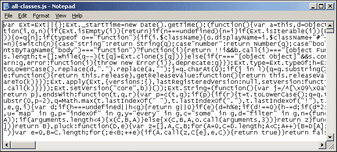
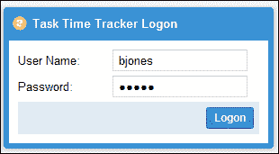
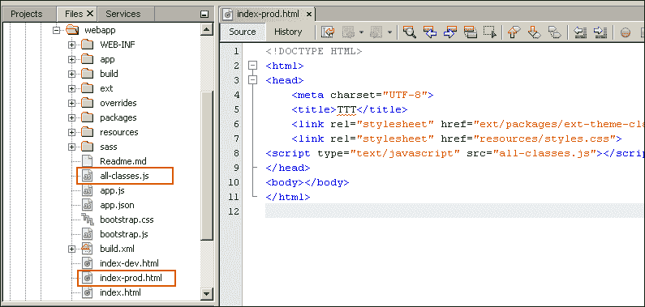
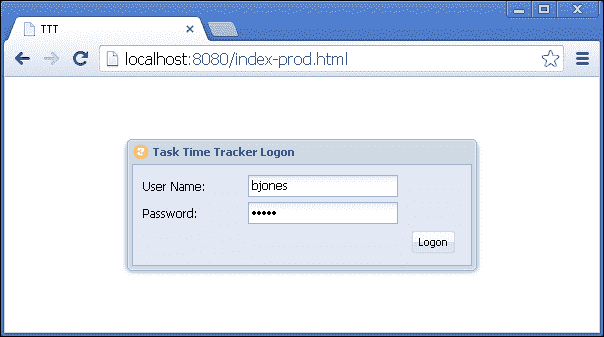
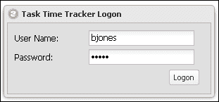
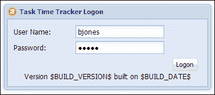
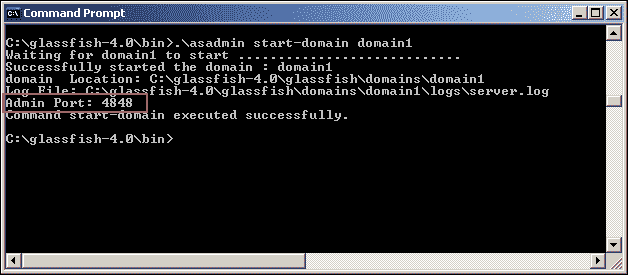
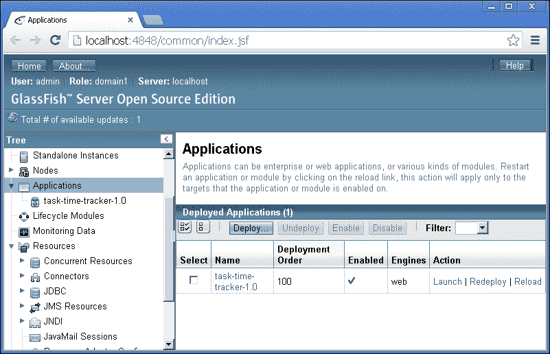
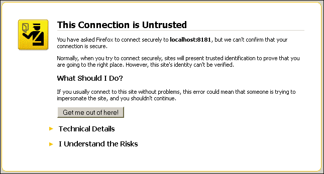

# 十三、将应用转移到生产环境中

开发工作已经结束，现在是将应用部署到生产服务器的时候了。要是这么简单就好了！企业应用需要遵循正式流程、客户或业务负责人签字、内部测试、**用户验收测试**（**UAT**），在应用准备好进行生产部署之前，还需要克服更多此类障碍。本章将探讨以下两个关键领域：

*   使用 Maven 构建和编译 ExtJS4 应用以供生产使用
*   GlassFish 4 部署和配置概念

我们将从检查 Sencha Cmd 编译器开始。

# 使用 Sencha Cmd 编译

在[第 9 章](09.html "Chapter 9. Getting Started with Ext JS 4")*Ext JS 4*入门中，我们经历了使用 Sencha Cmd 生成 Ext JS 4 应用框架并创建基本组件的过程。本节将重点介绍如何使用 Sencha Cmd 编译 Ext JS 4 应用，以便在**Web 归档**（**WAR**文件）中部署。编译过程的目标是创建一个 JavaScript 文件，其中包含应用所需的所有代码，包括所有 ExtJS4 依赖项。

在应用骨架生成过程中创建的`index.html`文件的结构如下：

```java
<!DOCTYPE HTML>
<html>
  <head>
    <meta charset="UTF-8">
    <title>TTT</title>
    <!-- <x-compile> -->
        <!-- <x-bootstrap> -->
            <link rel="stylesheet" href="bootstrap.css">
            <script src="ext/ext-dev.js"></script>
            <script src="bootstrap.js"></script>
        <!-- </x-bootstrap> -->
        <script src="app.js"></script>
    <!-- </x-compile> -->
  </head>
<body></body>
</html>
```

`x-compile`指令的打开和关闭标记包含`index.html`文件中 Sencha Cmd 编译器将操作的部分。此块中应包含的唯一声明是脚本标记。编译器将处理`x-compile`指令中的所有脚本，根据`Ext.define`、`requires`或`uses`指令搜索依赖项。

此文件的一个例外是`ext-dev.js`文件。此文件被视为框架的“引导”文件，不会以相同的方式进行处理。编译器忽略`x-bootstrap`块中的文件，声明将从最终编译器生成的页面中删除。

编译过程的第一步是检查和解析所有 JavaScript 源代码，并分析任何依赖项。为此，编译器需要识别应用中的所有源文件夹。我们的应用有两个源文件夹：`webapp/ext/src`中的 Ext JS 4 源和`webapp/app`中的 3T 应用源。这些文件夹位置是使用`compile`命令中的`-sdk`和`-classpath`参数指定的：

```java
sencha –sdk {path-to-sdk} compile -classpath={app-sources-folder} page -yui -in {index-page-to-compile}-out {output-file-location}

```

对于我们的 3T 应用，`compile`命令如下：

```java
sencha –sdk ext compile -classpath=app page -yui -in index.html -out build/index.html

```

此命令执行以下操作：

*   Sencha Cmd 编译器检查由`-classpath`参数指定的所有文件夹。`-sdk`目录自动包含在扫描中。
*   然后，`page`命令包括`index.html`中包含在`x-compile`块中的所有脚本标记。
*   在识别了`app`目录和`index.html`页面的内容后，编译器分析 JavaScript 代码，并确定最终需要包含在表示应用的单个 JavaScript 文件中的内容。
*   原始`index.html`文件的修改版本写入`build/index.html`。
*   新的`index.html`文件所需的所有 JavaScript 文件都使用 YUI 压缩器进行连接和压缩，并写入`build/all-classes.js`文件。

`sencha compile`命令必须从`webapp`目录中执行，该目录是应用的根目录，也是包含`index.html`文件的目录。然后，提供给`sencha compile`命令的所有参数都可以与`webapp`目录相关。

打开命令提示符（或 Mac 中的终端窗口），导航到 3T 项目的`webapp`目录。如本节前面所示，执行`sencha compile`命令将产生以下输出：


打开 NetBeans 中的`webapp/build`文件夹，现在应该会显示两个新生成的文件：`index.html`和`all-classes.js`。`all-classes.js`文件将包含所有必需的 Ext JS 4 类以及所有 3T 应用类。尝试在 NetBeans 中打开此文件将导致以下警告：“**该文件似乎太大，无法安全打开……【T5]”，但您可以在文本编辑器中打开该文件以查看以下连接和缩小的内容：**



在 NetBeans 中打开页面`build/index.html`将显示以下屏幕截图：


您现在可以在运行应用后在浏览器中打开`build/index.html`文件，但结果可能会让您吃惊：


显示的布局将取决于浏览器，但无论如何，您将看到缺少 CSS 样式。我们的应用所需的 CSS 文件需要移到`<!-- <x-compile> -->`指令之外。但是这些风格是从哪里来的呢？现在是时候简单地深入研究 ExtJS4 主题和`bootstrap.css`文件了。

# Ext JS 4 主题化

Ext JS 4 主题利用**语法上很棒的样式表**（**SASS**）和指南针[http://compass-style.org/](http://compass-style.org/) 到允许在样式表中使用变量和 mixin。几乎所有 ExtJS4 组件的样式都可以定制，包括颜色、字体、边框和背景，只需更改 SASS 变量即可。SASS 是 CSS 的一个扩展，它允许您保持大型样式表井然有序；一个非常好的概述和参考可以在[上找到 http://sass-lang.com/documentation/file.SASS_REFERENCE.html](http://sass-lang.com/documentation/file.SASS_REFERENCE.html) 。

使用 Compass 和 SASS 设置 ExtJS4 应用的主题超出了本书的范围。Sencha Cmd 允许与这些技术轻松集成，以构建 SASS 项目；然而，SASS 语言和语法本身就是一条陡峭的学习曲线。ExtJS4 主题化功能非常强大，对现有主题的细微更改可以快速改变应用的外观。您可以在[找到更多关于 Ext JS 4 主题的信息 http://docs.sencha.com/extjs/4.2.2/#!/指南/主题](http://docs.sencha.com/extjs/4.2.2/#!/guide/theming)。

`bootstrap.css`文件是在生成应用框架期间使用默认主题定义创建的。`bootstrap.css`文件内容如下：

```java
@import 'ext/packages/ext-theme-classic/build/resources/ext-theme-classic-all.css';

```

此文件导入`ext-theme-classic-all.css`样式表，这是默认的“经典”ExtJS 主题。所有可用的主题都可以在 Ext JS 4 SDK 的`ext/packages`目录中找到：


更改不同的主题就像更改`bootstrap.css`导入一样简单。切换到**海王星**主题需要以下`bootstrap.css`定义：

```java
@import 'ext/packages/ext-theme-neptune/build/resources/ext-theme-neptune-all.css';

```

此修改将应用的外观更改为 Ext JS“neptune”主题，如以下屏幕截图所示：



我们将更改`bootstrap.css`文件定义以使用`gray`主题：

```java
@import 'ext
/packages/ext-theme-gray/build/resources/ext-theme-gray-all.css';

```

这将导致以下外观：


你可以尝试不同的主题，但应该注意，并非所有的主题都像`classic`主题那样完整；为了充分利用某些部件的造型，可能需要进行细微的更改。

我们将保留`index.html`页面的`gray`主题。这将使我们能够区分（原始）`index.html`页面和将在以下部分使用`classic`主题创建的新页面。

# 编制生产使用

到目前为止，我们只使用 Sencha Cmd 生成的`index.html`文件。我们现在将为我们的开发环境创建一个新的`index-dev.html`文件。开发文件将是不带`bootstrap.css`文件的`index.html`文件的副本。我们将在`index-dev.html`文件中引用默认的`classic`主题，如下所示：

```java
<!DOCTYPE HTML>
<html>
  <head>
    <meta charset="UTF-8">
    <title>TTT</title>
 <link rel="stylesheet" href="ext/packages/ext-theme-classic/build/resources/ext-theme-classic-all.css">
 <link rel="stylesheet" href="resources/styles.css"> 
    <!-- <x-compile> -->
        <!-- <x-bootstrap> -->
            <script src="ext/ext-dev.js"></script>
            <script src="bootstrap.js"></script>
        <!-- </x-bootstrap> -->
        <script src="app.js"></script>
    <!-- </x-compile> -->
  </head>
<body></body>
</html>
```

请注意，我们已经将`stylesheet`定义移出了`<!-- <x-compile> -->`指令。

### 注

如果您使用的是本书下载的源代码，那么您将拥有可用的`resources/styles.css`文件和`resources`目录结构。`resources`目录中的样式表和相关图像包含 3T 徽标和图标。为了完整起见，我们建议您现在下载完整的源代码。

我们现在可以修改 Sencha Cmd`compile`命令来使用`index-dev.html`文件，并将生成的编译文件输出到`webapp`目录中的`index-prod.html`：

```java
sencha –sdk ext compile -classpath=app page -yui -in index-dev.html -out index-prod.html

```

此命令将生成`index-prod.html`文件和`webapp`目录下的`all-classes.js`文件，如下图所示：



`index-prod.html`文件直接引用样式表，并使用单个编译和缩小的`all-classes.js`文件。您现在可以运行应用并浏览`index-prod.html`文件，如以下屏幕截图所示：



您应该注意到，当所有 JavaScript 类都从单个`all-classes.js`文件加载时，登录窗口的显示速度有了**显著**的提高。

开发人员将使用`index-prod.html`文件测试编译的`all-classes.js`文件。

现在，通过访问各个页面，我们可以区分不同的环境：

<colgroup><col style="text-align: left"> <col style="text-align: left"></colgroup> 
| 

浏览器中显示的登录窗口

 | 

页面说明

 |
| --- | --- |
|  | `index.html`页面由 Sencha Cmd 生成，已配置为使用`bootstrap.css`中的`gray`主题。开发不再需要此页面；用`index-dev.html`代替。您可以在以下位置访问此页面：`http://localhost:8080/index.html` |
|  | `index-dev.html`页面使用`<!-- <x-compile> -->`指令之外包含的`classic`主题样式表。将此文件用于应用开发。ExtJS4 将根据需要动态加载源文件。您可以在以下位置访问此页面：`http://localhost:8080/index-dev.html` |
|  | `index-prod.html`文件由 Sencha Cmd`compile`命令动态生成。此页面使用具有`classic`主题样式表的`all-classes.js`一体式编译 JavaScript 文件。您可以通过`http://localhost:8080/index-prod.html`访问此页面 |

# 将 Sencha Cmd 编译与 Maven 集成

到目前为止我们已经从终端执行了 Sencha Cmd`compile`命令。最好在 Maven 构建过程中执行命令。每次执行构建时，都可以自动生成`index-prod.html`和编译的`all-classes.js`文件。将以下`plugin`添加到 Maven`pom.xml`文件时，将执行以下操作：

```java
<plugin>
  <groupId>org.codehaus.mojo</groupId>
  <artifactId>exec-maven-plugin</artifactId>
  <version>1.2.1</version>                    
  <executions>
    <execution>
      <id>sencha-compile</id>
      <phase>compile</phase>
      <goals>
        <goal>exec</goal>
      </goals>
      <configuration>
        <executable>C:\Sencha\Cmd\4.0.0.203\sencha.exe</executable>
        <arguments>
          <argument>-sdk</argument>
          <argument>${basedir}/src/main/webapp/ext</argument>                                
          <argument>compile</argument>
          <argument>-classpath</argument>
          <argument>${basedir}/src/main/webapp/app</argument>
          <argument>page</argument>
          <argument>-yui</argument>
          <argument>-in</argument>
          <argument>${basedir}/src/main/webapp/index-dev.html</argument>
          <argument>-out</argument>
          <argument>${basedir}/src/main/webapp/index-prod.html</argument>
          </arguments>
      </configuration>
    </execution>
  </executions>
</plugin>
```

以下是需要注意的几点：

*   在 Maven 构建过程的`compile`阶段执行插件。
*   Sencha Cmd 可执行文件是用完整的文件系统路径定义的。只有这样，才有可能在需要时使用不同版本的 Sencha 构建不同的项目。
*   `${basedir}`属性表示 Maven 项目根目录的完整路径。每个参数都需要完整路径，因为我们不是从`webapp`目录中执行 Sencha Cmd`compile`命令。

`index-prod.html`和`all-classes.js`文件现在将在每次执行构建时更新。该插件的输出可以在以下 Maven 构建日志中看到：


# 添加构建版本和时间戳

重要的是能够识别不同的版本，不仅是版本版本，还包括编译版本的时间。项目版本在`pom.xml`文件中使用`version`属性定义：

```java
<groupId>com.gieman</groupId>
<artifactId>task-time-tracker</artifactId>
<version>1.0</version>
<packaging>war</packaging>
```

执行 Maven 构建将生成文件名为`task-time-tracker-1.0.war`的 WAR 文件；它是具有`.war`扩展名的`artifactId`和`version`字段的组合。

在企业环境中，新版本可以是任何内容，从较小的更改（例如，版本 1.3.2）到主要版本（例如版本 4.0）。使用中的`version`值的确切命名约定将取决于企业组织。无论命名惯例如何，重要的是确定**何时**生成。当检查 WAR 文件上的时间戳时，这一点很明显，但对于应用的测试人员来说就不那么明显了，他们只能访问前端。我们建议将发布版本和构建时间戳添加到 ExtJS 应用中，以允许用户识别他们正在使用的版本。登录窗口是显示此信息的明显位置，我们将添加构建版本和时间戳，如以下屏幕截图所示：


我们要做的第一个更改是在`init`函数的`Application.js`文件中添加两个常量：

```java
init : function(application){
  TTT.URL_PREFIX = 'ttt/';
  Ext.Ajax.on('beforerequest', function(conn, options, eOpts){
    options.url = TTT.URL_PREFIX + options.url;
  });
  TTT.BUILD_DATE = '$BUILD_DATE$';
  TTT.BUILD_VERSION = '$BUILD_VERSION$';
}
```

`TTT.BUILD_DATE`和`TTT.BUILD_VERSION`字段定义了标记（或占位符），在 Maven 构建期间，`all-classes.js`文件中将动态替换这些标记。这些代币将**不会**为`index-dev.html`文件填充，开发登录窗口将如以下屏幕截图所示：



在`pom.xml`文件中定义了具有正确构建和时间戳的令牌替换，并且需要几个附加项，第一个是`maven.build.timestamp.format`属性：

```java
<properties>
  <endorsed.dir>${project.build.directory}/endorsed</endorsed.dir>
  <project.build.sourceEncoding>UTF-8</project.build.sourceEncoding>
  <maven.build.timestamp.format>dd-MMM-yyyy HH:mm</maven.build.timestamp.format>
  <spring.version>3.2.4.RELEASE</spring.version>
  <logback.version>1.0.13</logback.version>
</properties>
```

`maven.build.timestamp.format`属性定义`LogonWindow.js`文件中时间戳的格式。第二个变化是`maven-replacer``-plugin`的增加：

```java
<plugin>
  <groupId>com.google.code.maven-replacer-plugin</groupId>
  <artifactId>maven-replacer-plugin</artifactId>
  <version>1.3</version>
  <executions>
    <execution>
      <phase>prepare-package</phase>
      <goals>
        <goal>replace</goal>
      </goals>
      <configuration>
        <ignoreMissingFile>false</ignoreMissingFile>
        <file>src/main/webapp/all-classes.js</file>
        <regex>false</regex>
           <replacements>
           <replacement>
             <token>$BUILD_DATE$</token>
             <value>${maven.build.timestamp}</value>
           </replacement>
           <replacement>
             <token>$BUILD_VERSION$</token>
             <value>${project.version}</value>
           </replacement>
         </replacements>
      </configuration>
    </execution>
  </executions>
</plugin>
```

该插件检查`src/main/webapp/all-classes.js`文件，并用 Maven 属性`${maven.build.timestamp}`定义的构建时间戳替换`$BUILD_DATE$`标记。`$BUILD_VERSION$`令牌也被 Maven 属性`${project.version}`定义的项目版本所取代。

所需的最后更改是在登录窗口中显示这些属性。我们只需在`LogonWindow.js`文件的`item``s`数组中的工具栏下方添加一个`container`：

```java
{
  xtype:'container',   
  style:{
    textAlign:'center'
  },
  html:' Version ' + TTT.BUILD_VERSION + ' built on ' + TTT.BUILD_DATE
}
```

运行项目将在`index-prod.html`页面的应用登录窗口中显示构建版本和时间戳：


# 打造更纤细的战争档案

生成的 WAR 文件`task-time-tracker-1.0.war`目前非常大；事实上，它大约是 32MB！`maven-war-plugin`的默认行为是将`webapp`文件夹中的所有目录添加到 WAR 文件中。对于生产部署，我们不需要大量这些文件，最佳做法是通过排除不需要的内容来精简 WAR 文件。我们将排除整个 Ext JS 4 SDK 以及`webapp`目录下所有 Sencha Cmd 生成的文件夹。我们还将排除所有不适用于生产使用的资源，包括开发期间使用的`index*.html`文件。GlassFish 提供的唯一文件将是尚未创建的`index.jsp`：

```java
<!DOCTYPE HTML>
<html>
  <head>
    <meta charset="UTF-8">
    <title>TTT</title>
    <link rel="stylesheet" href="resources/ext-theme-classic-all.css">
    <link rel="stylesheet" href="resources/styles.css">    
<script type="text/javascript" src="all-classes.js"></script>
  </head>
<body></body>
</html>
```

您将注意到`ext-theme-classic-all.css`文件的位置在`resources`目录中，而不是在 HTML 页面中使用的深度嵌套的`ext/packages/ext-theme-classic/build/resources`位置。WAR 文件生成过程将适当的内容从 Ext JS 4 SDK 位置复制到`resources`目录。这样就不需要在 WAR 文件中包含 SDK 目录结构。

生产`index.jsp`文件现在将成为我们的默认`welcome-file`，我们将相应调整`WEB-INF/web.xml`文件：

```java
<welcome-file-list>
  <welcome-file>index.jsp</welcome-file>
</welcome-file-list>
```

在`web.xml`文件中进行此更改后运行应用将确保在 URL 中未指定*资源时，GlassFish 为`index.jsp`文件提供服务。*

`maven-war-plugin`中构建更精简的生产 WAR 文件所需的更改在以下代码段中突出显示：

```java
<plugin>
  <groupId>org.apache.maven.plugins</groupId>
  <artifactId>maven-war-plugin</artifactId>
  <version>2.3</version>
  <configuration>
    <warName>${project.build.finalName}</warName>
    <failOnMissingWebXml>false</failOnMissingWebXml>
 <webResources>
 <resource>
 <directory>src/main/webapp/ext/packages/ext-theme-classic/build/resources</directory>
 <targetPath>resources</targetPath>
 <excludes>
 <exclude>ext-theme-classic-all-*</exclude>
 </excludes> 
 </resource> 
 </webResources> 
 <packagingExcludes>.sencha/**,app/**,sass/**,overrides/**,build/**,ext/**,app.json,bootstrap.css,bootstrap.js,build.xml, index.html,index-dev.html,index-prod.html,app.js</packagingExcludes> 
  </configuration>
</plugin>
```

`webResources`定义将 Ext JS 4`classic`CSS 主题的内容复制到`resources`目录。`targetPath`属性总是相对于`webapp`目录；因此，`resources`目录不需要完整路径。`directory`属性始终与 Maven 项目的根相关；因此，它需要一条完整的路径。

`packagingExcludes`属性列出了 WAR 文件中不应包含的所有目录和文件。`**`符号表示应排除所有子目录。这将确保排除生产 WAR 文件不需要的所有 Sencha Cmd 生成的文件夹。

执行 Maven 构建将生成一个大约 6.6MB 的 WAR 文件，其中只包含生产应用所需的文件。

# 将 WAR 文件部署到 GlassFish

到目前为止我们一直使用**运行项目**命令通过 NetBeans 将 3T 应用部署到 GlassFish。在生产环境中，我们通过 GlassFish 管理控制台或使用`asadmin`从命令行部署应用。现在我们将学习如何使用管理控制台将`task-time-tracker-1.0.war`文件部署到 GlassFish。

## 打开 GlassFish 管理控制台

使用`asadmin`命令在 NetBeans 或控制台窗口中启动 GlassFish。我们建议使用`asadmin`，因为这通常是企业环境中管理 GlassFish 的方式。



正如我们在前面的截图中看到的，默认 GlassFish`Admin port`值为`4848`，如前面的截图所示，但如果配置了多个 GlassFish 域，则会有所不同。在浏览器中打开此位置以显示 GlassFish 管理控制台：


## GlassFish 安全基础知识

使用 NetBeans 提供的默认 GlassFish 安装时，在`localhost`上使用通常不会提示您输入密码。如果系统提示，默认用户名为`admin`，密码为空。GlassFish 以前的版本有一个默认密码`adminadmin`；在撰写本文时，情况已不再如此。您应该意识到，这可能在未来再次发生变化。

在 GlassFish 运行在非浏览器服务器上的远程主机上工作时，当您尝试访问管理控制台时，将始终提示您输入用户名和密码。在企业环境中，不同的服务器通常运行多个 GlassFish 实例。在此环境中，默认情况下将禁用对管理控制台的远程访问，并且您只能从`localhost`访问管理控制台。通过在运行 GlassFish 服务器的主机上执行以下命令，可以启用从不同客户端的远程访问：

```java
asadmin --host localhost --port 4848 enable-secure-admin
asadmin restart-domain domain1

```

启用安全管理时，可能会提示您一条消息：“您的管理密码为空”（默认情况）。要解决此问题，首先需要使用以下命令将管理员密码从默认（空）密码更改为另一个密码：

```java
asadmin --host localhost --port 4848 change-admin-password

```

然后会提示您输入新密码。然后可以启用安全管理。

### 注

深入研究 GlassFish 服务器管理的世界超出了本书的范围。我们建议您在[浏览优秀的文档和用户指南 https://glassfish.java.net/](https://glassfish.java.net/) 。

## 使用管理控制台部署 WAR 文件

通过 GlassFish 管理控制台部署 web 应用是一个简单的过程。登录 GlassFish 管理控制台后，点击并打开**应用**节点，如下图所示：



由于先前的 NetBeans 部署（如前面的屏幕截图所示），可能已经部署了一个**任务时间跟踪器**应用。如果是这种情况，请选中应用名称旁边的复选框，然后单击**取消部署**。

点击**部署…**按钮并输入以下详细信息：


可从 GlassFish 服务器访问的**本地打包文件或目录字段将定义`task-time-tracker-1.0.war`文件在本地文件系统上的位置。如果部署到远程服务器，则需要使用**包文件上传到服务器**选项。**

**上下文根**字段定义部署应用的 URL 路径。我们将 3T 应用部署到上下文根目录。

**应用名称**字段定义 GlassFish 服务器中的应用名称，并显示在应用列表中。

**虚拟服务器**下拉列表定义将用于承载应用的虚拟服务器。虚拟服务器（有时称为虚拟主机）是一个对象，它允许同一物理服务器承载部署到不同侦听器的多个 Internet 域名。可以从此列表中选择多个虚拟服务器（如果已配置）。

点击**确定**按钮部署`task-time-tracker-1.0.war`文件。此操作将返回到已部署的应用列表：


**task-time-tracker-1.0**应用部署到名为`server`的默认**虚拟服务器**，可通过以下两个侦听器访问：

*   `http://localhost:8080/`
*   `https://localhost:8181/`

这是安装 GlassFish 后的默认虚拟服务器/HTTP 服务配置。请注意，在允许用户登录的生产企业环境中，将仅启用 HTTPS 版本以确保与服务器的加密 SSL 连接。您现在可以访问这些 URL 来测试部署。打开`https://localhost:8181/`链接会因证书无效而导致警告，如以下屏幕截图所示：



此可以忽略，您可以点击**我了解风险**并确认异常（显示的确切消息将取决于浏览器），继续链接。右键点击登录页面，选择**查看页面来源**确认您正在使用生产 WAR 文件；这可以在以下屏幕截图中看到：


### 注

配置 HTTP 侦听器和虚拟服务器再次超出了本书的范围。我们建议您在[浏览适当的文档 https://glassfish.java.net/documentation.html](https://glassfish.java.net/documentation.html) 。

## 使用 asadmin 部署 WAR 文件

还可以使用`asadmin`命令部署`task-time-tracker-1.0.war`文件。这是企业组织中的常见情况，因为安全原因，GlassFish 管理控制台未启用。`asadmin deploy`命令的语法为：

```java
asadmin deploy --user $ADMINUSER --passwordfile $ADMINPWDFILE 
--host localhost --port $ADMINPORT --virtualservers $VIRTUAL_SERVER 
--contextroot --force --name $WEB_APPLICATION_NAME $ARCHIVE_FILE

```

此命令必须在一行上执行，并且必须用正确的值替换前缀为`$`的每个大写变量名。确切的语法和参数可能取决于环境，我们将不再深入讨论此命令的结构。如果您有兴趣了解有关此命令的更多信息，可以在[浏览详细文档 http://docs.oracle.com/cd/E18930_01/html/821-2433/deploy-1.html](http://docs.oracle.com/cd/E18930_01/html/821-2433/deploy-1.html) ；请注意，本文件参考 GlassFish 3.1 参考手册。

## 进一步的部署信息和阅读

文件位于[https://glassfish.java.net/docs/4.0/application-deployment-guide.pdf](https://glassfish.java.net/docs/4.0/application-deployment-guide.pdf) 包含将应用部署到 GlassFish 4 服务器的详细说明。本文档超过 200 页，本章未涉及的任何部署相关问题都应参考本文档。

# GlassFish 性能调整与优化

性能调优和 GlassFish 服务器优化的权威指南可在以下网址找到

[https://glassfish.java.net/docs/4.0/performance-tuning-guide.pdf](https://glassfish.java.net/docs/4.0/performance-tuning-guide.pdf) 。

本指南包括有关优化应用以及优化 GlassFish 服务器本身的部分。本文将介绍线程池、web 容器设置、连接池、垃圾收集、服务器内存设置等方面的配置。我们建议您参考本文档，尽可能多地了解企业开发和部署的这一重要方面。

# 总结

我们的最后一章介绍了关键的生产企业部署概念。我们已经将 ExtJS4 应用编译成一个`all-classes.js`文件供生产使用，并将构建版本和时间戳添加到`LogonWindow.js`文件中。然后，我们删除了生产部署不需要的所有资源，从而减小了 Maven 生成的`task-time-tracker.war`文件的大小。此生产 WAR 文件仅包含应用在运行时所需的资源，不包括所有不需要的 Ext JS 4 SDK 资源和目录。然后，我们检查了 GlassFish 部署过程，并通过 GlassFish 管理控制台部署了`task-time-tracker-1.0.war`文件。关于 GlassFish 服务器，您还有很多需要了解的地方，但是入口已经提供了！

我们的 Ext JS 和 Spring 开发之旅现在结束了。这本书涵盖了大量的领域，并为企业应用开发提供了坚实的基础，利用这些关键技术。我们真诚地希望，通过阅读本书，您的发展之旅将更加轻松，收获更多。