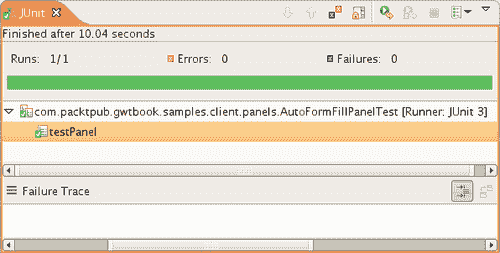

# 第 8 章单元测试

JUnit 是由 Erich Gamma 和 Kent Beck（[创建的一个广泛使用的开源 Java 单元测试框架 http://junit.org](http://junit.org) ）。它允许您以增量方式构建一套测试，作为开发工作的一个组成部分，并且在增强您对代码库稳定性的信心方面有很大的帮助。JUnit 最初是为测试 Java 类而设计和使用的，但后来被其他几种语言（如 Ruby、Python 和 C#）模拟和使用。GWT 利用并扩展了 JUnit 框架，提供了一种与任何其他 Java 代码一样简单的测试 AJAX 代码的方法。在本章中，我们将学习如何创建和运行单元测试来测试 GWT 应用程序和 RPC 服务。

我们将处理的任务是：

*   测试 GWT 页面
*   测试异步服务
*   使用异步服务测试 GWT 页面
*   创建并运行测试套件

# 测试 GWT 页面

GWT 页面基本上由小部件组成，我们可以通过检查小部件的存在以及我们想要的小部件值或参数来测试页面。在本节中，我们将学习如何为 GWT 页面创建单元测试。

## 创建单元测试的操作时间

我们将使用 GWT 框架中内置的测试支持来编写单元测试，从而测试我们在[第 4 章](04.html "Chapter 4. Interactive Forms")中创建的 `AutoFormFillPanel`页面。

步骤如下：

1.  Run the `GWT_HOME\junitCreator` command script by providing these parameters:

    ```java
    junitCreator -junit junit.jar -module com.packtpub.gwtbook.samples. Samples -eclipse Samples -out ~pchaganti/dev/GWTBook/Samples com. packtpub.gwtbook.samples.client.panels.AutoFormFillPanelTest 

    ```

    

2.  在运行 `junitCreator`命令时自动创建的测试目录中打开生成的 Java 文件 `com.packtpub.gwtbook.samples.client.panels.AutoFormFillPanelTest.java`。将名为 `testPanel()`的新方法添加到文件中：

    ```java
    public void testPanel()
    {
    }

    ```

3.  创建表单并添加断言以检查 `Customer ID`标签的名称及其相关样式：

    ```java
    final AutoFormFillPanel autoFormFillPanel = new
    AutoFormFillPanel();
    assertEquals("Customer ID : ",
    autoFormFillPanel.getCustIDLbl().getText());
    assertEquals("autoFormItem-Label",
    autoFormFillPanel.getCustIDLbl().getStyleName());

    ```

4.  添加类似的断言以测试页面上的所有其他元素：

    ```java
    assertEquals("Address : ",
    autoFormFillPanel.getAddressLbl().getText());
    assertEquals("autoFormItem-Label",
    autoFormFillPanel.getAddressLbl().getStyleName());
    assertEquals("City : ",
    autoFormFillPanel.getCityLbl().getText());
    assertEquals("autoFormItem-Label",
    autoFormFillPanel.getCityLbl().getStyleName());
    assertEquals("First Name : ",
    autoFormFillPanel.getFirstNameLbl().getText());
    assertEquals("autoFormItem-Label",
    autoFormFillPanel.getFirstNameLbl().getStyleName());
    assertEquals("Last Name : ",
    autoFormFillPanel.getLastNameLbl().getText());
    assertEquals("autoFormItem-Label",
    autoFormFillPanel.getLastNameLbl().getStyleName());
    assertEquals("Phone Number : ",
    autoFormFillPanel.getPhoneLbl().getText());
    assertEquals("autoFormItem-Label",
    autoFormFillPanel.getPhoneLbl().getStyleName());
    assertEquals("State : ",
    autoFormFillPanel.getStateLbl().getText());
    assertEquals("autoFormItem-Label",
    autoFormFillPanel.getStateLbl().getStyleName());
    assertEquals("Zip Code : ",
    autoFormFillPanel.getZipLbl().getText());
    assertEquals("autoFormItem-Label",
    autoFormFillPanel.getZipLbl()

    ```

5.  在 `Samples.gwt.xml`文件中添加一个条目，从 JUnit 测试模块继承：

    ```java
    <inherits name='com.google.gwt.junit.JUnit' />

    ```

6.  Run the test in Eclipse by launching the `AutoFormFillPanelTest-hosted` launch configuration from the **Run** menu and get a similar screen to this:

    

### 刚才发生了什么事？

GWT 框架通过提供从 JUnit 测试库中的 `TestCase`扩展而来的 `GWTTestCase`基类来支持单元测试。我们通过编译和运行扩展自 `GWTTestCase`的类来执行单元测试。当我们运行这个子类时，GWT 框架将启动一个不可见的 web 浏览器，并且测试将在浏览器实例中运行。

我们使用 GWT 提供的 `junitCreator`命令脚本生成创建和运行单元测试所需的脚手架。我们提供测试类的名称作为此命令的参数之一。生成了一个扩展自 `GWTTestCase`类的示例测试用例，以及两个启动脚本，一个用于在主机模式下运行，另一个用于在 web 模式下运行。这些启动配置是以 Eclipse 格式生成的，可以直接从 Eclipse 环境内部运行。

扩展 `GWTTestCase`的类必须实现 `getModuleMethod()`并返回包含测试类的 GWT 模块的完全限定名。所以在我们的例子中，我们从这个方法返回 `com.packtpub.gwtbook.samples.Samples`。这使 GWT 能够解析依赖关系并加载正确运行测试所需的类。如果我们在一个完全独立的模块中创建测试，这个方法将需要返回包含该模块的名称。我们还需要在项目的模块文件中继承 GWT JUnit 模块。这就是为什么我们需要将这一行添加到 `Samples.gwt.xml`文件中：

```java
<inherits name='com.google.gwt.junit.JUnit' />

```

使用 `junitCreator`是开始使用 GWT 中的单元测试特性的最简单方法。但是，如果您决定自己创建由该命令生成的各种工件，则以下是在 GWT 项目中创建和运行单元测试所涉及的步骤：

1.  创建一个扩展 `GWTTestCase`的类。在此类中实现 `getModuleName()`方法，以返回包含该类的模块的完全限定名。
2.  编译测试用例。为了运行测试，*必须先编译它。*
3.  为了运行测试，您的 `classpath`必须包括 `junit-dev-linux.jar`或 `gwt-dev-windows.jar`文件，以及 `junit.jar`文件，以满足正常要求。

因为 `GWTTestCase`只是 `TestCase`的一个子类，所以您可以访问 JUnit 库中所有正常的断言方法。您可以使用这些来断言和测试页面的所有内容，例如文档的结构，包括表和其他 HTML 元素及其布局。

# 测试异步服务

在上一节中，我们学习了如何为 GWT 页面的单元测试创建简单的测试。然而，大多数非平凡的 GWT 应用程序将访问并使用 AJAX 服务异步检索数据。在本节中，我们将介绍测试异步服务（如本书前面创建的 `AutoFormFillPanel`服务）所需的步骤。

## 异步服务动作测试时间

我们将测试我们在[第 4 章](04.html "Chapter 4. Interactive Forms")中创建的 `AutoFormFillPanelService`：

1.  通过提供以下参数来运行 `GWT_HOME\junitCreator`命令脚本：

    ```java
    junitCreator -junit junit.jar -module com.packtpub.gwtbook.samples. Samples -eclipse Samples -out ~pchaganti/dev/GWTBook/Samples com. packtpub.gwtbook.samples.client.panels.AutoFormFillServiceTest 

    ```

2.  在运行 `junitCreator`命令时自动创建的测试目录中打开生成的 Java 文件 `com.packtpub.gwtbook.samples.client.panels.AutoFormFillServiceTest.java`。将名为 `testService()`的新方法添加到文件中：

    ```java
    public void testService()
    {
    }

    ```

3.  在 `testService()`方法中，实例化 `AutoFormFillService`并设置入口点信息：

    ```java
    final AutoFormFillServiceAsync autoFormFillService =
    (AutoFormFillServiceAsync) GWT.create
    (AutoFormFillService.class);
    ServiceDefTarget endpoint = (ServiceDefTarget)
    autoFormFillService;
    endpoint.setServiceEntryPoint("/Samples/autoformfill");

    ```

4.  创建一个新的异步回调，并在 `onSuccess()`方法中添加断言以测试调用服务返回的数据：

    ```java
    AsyncCallback callback = new AsyncCallback()
    {
    public void onSuccess(Object result)
    {
    HashMap formValues = (HashMap) result;
    assertEquals("Joe", formValues.get("first name"));
    assertEquals("Customer", formValues.get("last name"));
    assertEquals("123 peachtree street",
    formValues.get("address"));
    assertEquals("Atlanta", formValues.get("city"));
    assertEquals("GA", formValues.get("state"));
    assertEquals("30339", formValues.get("zip"));
    assertEquals("770-123-4567", formValues.get("phone"));
    finishTest();
    }
    };

    ```

5.  调用 `delayTestFinish()`方法，调用异步服务：

    ```java
    delayTestFinish(2000);
    autoFormFillService.getFormInfo("1111", callback);

    ```

6.  Run the test in Eclipse by launching the `AutoFormFillPanelService-hosted` launch configuration from the **Run** menu. Here is the result:

    

### 刚才发生了什么事？

JUnit 支持测试普通 Java 类，但不支持测试具有任何异步行为的模块。单元测试将开始执行，并按顺序运行模块中的所有测试。这种方法不适用于测试异步事物，在异步事物中，您发出一个请求，然后分别返回响应。GWT 具有这种独特的功能，并支持异步服务的测试；因此，您可以调用 RPC 服务并验证来自该服务的响应。

您还可以测试其他长时间运行的服务，例如计时器。为了提供这种支持， `GWTTestCase`扩展了 `TestCase`类，并提供了两种方法`delayTestFinish()`和 `finishTest()`，使我们能够延迟完成单元测试，并控制测试实际完成的时间。这本质上允许我们将单元测试置于异步模式，因此我们可以等待来自远程服务器调用的响应，并通过在收到响应时验证响应来完成测试。

在本示例中，我们使用标准模式来构建测试，以测试 GWT 中的长期事件。步骤如下：

1.  我们创建异步服务的实例并设置其入口点。
2.  我们设置了一个异步事件处理程序，这是我们的回调。在这个回调中，我们通过断言返回值与预期值匹配来验证收到的响应。然后，我们通过调用 `finishTest()`来完成测试，以向 GWT 表明我们希望在测试中离开异步模式：

    ```java
    AsyncCallback callback = new AsyncCallback()
    {
    public void onSuccess(Object result)
    {
    HashMap formValues = (HashMap) result;
    assertEquals("Joe", formValues.get("first name"));
    assertEquals("Customer", formValues.get("last name"));
    assertEquals("123 peachtree street",formValues.get
    ("address"));
    assertEquals("Atlanta", formValues.get("city"));
    assertEquals("GA", formValues.get("state"));
    assertEquals("30339", formValues.get("zip"));
    assertEquals("770-123-4567", formValues.get("phone"));
    finishTest();
    }
    };

    ```

3.  We set up a delay period for the test to finish. This makes the GWT test framework wait for the requisite amount of time. Here we set a delay of 2000 ms:

    ```java
    delayTestFinish(2000);

    ```

    此时间段必须设置为略长于服务返回响应所需的时间。

4.  最后，我们调用异步事件，将 `callback`对象作为参数提供给它。在这种情况下，我们只需在 `AutoFormFillService:`

    ```java
    autoFormFillService.getFormInfo("1111", callback);

    ```

    上调用必要的方法

您可以使用此模式测试所有使用计时器的异步 GWT 服务和类。

# 使用异步服务测试 GWT 页面

在本节中，我们将测试调用异步服务的页面。这将使我们能够创建一个结合前两个示例的测试。

## 是时候将两者结合起来了

我们将把前两部分中编写的两个测试合并为一个测试，并为 `AutoFormFillPanel`页面创建一个全面的测试，该测试同时测试页面元素和页面使用的异步服务。步骤如下：

1.  在 `com.packtpub.gwtbook.samples.client.panels`包

    ```java
    public void simulateCustIDChanged(String custIDValue)
    {
    if (custIDValue.length() > 0)
    {
    AsyncCallback callback = new AsyncCallback()
    {
    public void onSuccess(Object result)
    {
    setValues((HashMap) result);
    }
    };
    custID.setText(custIDValue);
    autoFormFillService.getFormInfo(custIDValue, callback);
    }
    else
    {
    clearValues();
    }
    }

    ```

    中已有的 `AutoFormFillPanel`类中添加一个名为 `simulateCustomerIDChanged()`的新方法
2.  将 `testPanel()`方法名称修改为 `testEverything()`。在方法的底部，调用 `simulateCustIDChanged()`方法并提供一个 `ID`参数 1111:

    ```java
    autoFormFillPanel.simulateCustIDChanged("1111");

    ```

3.  创建一个新的 `Timer`对象，并在其 `run()`方法中添加以下内容：

    ```java
    Timer timer = new Timer()
    {
    public void run()
    GWT pagewith asynchronous service, testing{
    assertEquals("Joe",
    autoFormFillPanel.getFirstName().getText());
    assertEquals("Customer",
    autoFormFillPanel.getLastName().getText());
    assertEquals("123 peachtree street",
    autoFormFillPanel.getAddress().getText());
    assertEquals("Atlanta",
    autoFormFillPanel.getCity().getText());
    assertEquals("GA", autoFormFillPanel.getState().getText());
    assertEquals("30339",
    autoFormFillPanel.getZip().getText());
    assertEquals("770-123-4567",
    autoFormFillPanel.getPhone().getText());
    finishTest();
    }
    };

    ```

4.  延迟测试完成并运行计时器：

    ```java
    delayTestFinish(2000);
    timer.schedule(100);

    ```

5.  Run the test by launching the `AutoFormFillPanelTest-hosted` launch configuration and get a similar result to this:

    

### 刚才发生了什么事？

到目前为止，我们已经编写了两个单独的测试，一个测试 `AutoFormFillPanel`页面上的各种 HTML 元素，另一个测试 `AutoFormFillPanelService`。我们可以将这两个测试合并为一个，并创建一个用于测试面板的测试。当 `CustomerID`文本框中的文本发生更改时， `AutoFormFillPanel`调用异步服务。为了在测试中模拟键盘侦听器，我们在 `AutoFormFillPanel`类中创建了一个名为 `simulateCustIDChanged()`的新公共方法，该方法的作用与该类中的键盘侦听器事件处理程序基本相同。我们将调用此方法来模拟用户在键盘上键入的文本，以更改 `CustomerID`文本。

一旦我们测试了页面上的各种 HTML 元素，我们就会调用 `simulateCustIDChanged()`方法。然后，我们使用 `Timer`对象设置一个异步事件处理程序。当计时器运行时，我们验证面板中是否有正确的值，如步骤 3 所示。

我们为完成测试设置了延迟时间：

```java
delayTestFinish(2000);

```

最后，我们安排计时器运行，这样当计时器在给定延迟后启动时，它将验证预期结果，然后完成测试：

```java
timer.schedule(100);

```

# 创建并运行测试套件

到目前为止，我们已经学习了如何创建和运行单个单元测试。随着代码库的增加，一次只运行一个测试是非常乏味的。JUnit 提供了测试套件的概念，允许您将一组测试组合到一个套件中并运行它们。在本节中，我们将学习如何作为套件的一部分创建和运行多个单元测试。

## 部署测试套件的行动时间

到目前为止，我们已经为我们创建的每个测试生成了一个测试启动脚本，并运行了我们单独创建的每个测试。在本节中，我们将把测试组合到一个测试套件中，并在一个启动配置中运行所有测试。步骤如下：

1.  通过提供以下参数来运行 `GWT_HOME\junitCreator`命令脚本：

    ```java
    junitCreator -junit junit.jar -module com.packtpub.gwtbook.samples. Samples -eclipse Samples -out ~pchaganti/dev/GWTBook/Samplescom. packtpub.gwtbook.samples.client.SamplesTestSuite 

    ```

2.  修改 `SamplesTestSuite`类，增加 `suite()`方法：

    ```java
    public static Test suite()
    {
    TestSuite samplesTestSuite = new TestSuite();
    samplesTestSuite.addTestSuite(AutoFormFillServiceTest.class);
    samplesTestSuite.addTestSuite(AutoFormFillPanelTest.class);
    return samplesTestSuite;
    }

    ```

3.  Run the test by launching the `SamplesTestSuite-hosted` launch configuration and get a similar result to this:

    

### 刚才发生了什么事？

为您编写的每个测试生成一个单独的启动脚本，然后必须单独运行这些测试，这可能会非常繁琐。使用测试套件可以让我们有一个地方来收集所有测试。然后，我们可以使用套件的启动脚本来运行所有测试。测试套件本质上是项目中所有测试的收集器。我们在项目中定义了一个名为 `suite()`的静态工厂方法。在这个方法中，我们将所有的测试添加到 `suite`对象中，并返回 `suite`对象作为返回值：

```java
public static Test suite()
{
TestSuite samplesTestSuite = new TestSuite();
samplesTestSuite.addTestSuite(AutoFormFillServiceTest.class);
samplesTestSuite.addTestSuite(AutoFormFillPanelTest.class);
return samplesTestSuite;
}

```

当我们通过启动脚本来运行这个测试时，JUnit 框架会识别我们正在运行一组测试，并且它会运行套件中定义的每个测试。目前不支持推断 GWT 项目中存在的所有测试并自动生成包含这些测试的测试套件。因此，您必须手动将希望成为套件一部分的每个测试添加到此方法中。现在我们已经有了测试套件，我们可以从 `Samples`项目中删除所有其他测试启动配置，只需使用这一配置来运行所有测试。

# 总结

在本章中，我们学习了为 GWT 页面（`AutoFormFillPanel`）和异步服务（`AutoFormFillPanelService`）创建单元测试。然后，我们将这两者结合起来，为使用异步服务的 GWT 页面创建单元测试。

最后，我们将所有测试组合到一个测试套件中，并在一个启动配置中运行所有测试。

在下一章中，我们将学习 GWT 中的国际化（I18N）和 XML 支持。