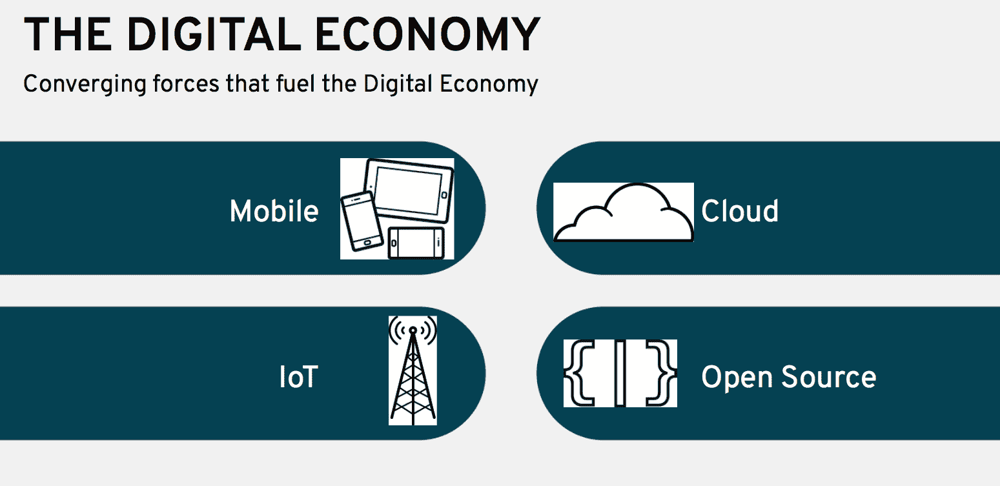

# 一、Eclipse MicroProfile 简介

Eclipse MicroProfile是一组用 Java 语言编写的微服务规范。这是一个由社区驱动的项目，市场上有许多实现。该项目于 2016 年 6 月首次宣布，将继续开发一套通用的**应用编程接口**（**API**），以实现适用于现代应用开发技术、架构和环境的 Java 微服务。在本章中，您将了解 Eclipse 文件的起源和重要性

本章将介绍以下主题：

*   企业 Java 微服务
*   推动数字经济的力量以及对多速度 IT 的需求
*   介绍 Eclipse MicroProfile
*   MicroProfile。。。

# 企业 Java 微服务

应用开发不再包括使用在您喜爱的操作系统上运行的单一高级编程语言。如今，程序员开发现代应用需要学习各种语言、规范、框架、专有和开源软件和工具、底层部署基础设施和开发方法。IT 组织的开发已经变成了多语言，也就是说，根据特定项目的需要使用多种编程语言。在这个云、容器、微服务、反应式编程、12 因素应用、无服务器、迷你服务、多语言环境等的时代，开发人员现在可以选择适合其任务的工具，从而提高效率和生产率。

随着 JEE EE 最近移动到雅加达 EE 新名称的 Eclipse 基础上，MyPrrices 将在企业 java 的未来中扮演非常重要的角色，因为它与雅加达 EE 的协同作用以及它可能影响 java 的潜在方式。

云和移动的出现，以及开放和**物联网**（**物联网**的加速，带来了数字经济。虽然这打开了新市场，但也对企业及其 it 组织提出了新的要求，它们现在不仅需要支持和维护传统的工作负载，还需要以更快的速度交付新的应用。

为了满足这些新的需求，许多技术、语言、体系结构和框架在组织中变得流行起来。其中之一是微服务，特别是企业 Java 微服务，因为 Java 仍然是 IT 公司最流行的语言之一。但什么是企业 Java 微服务？

企业 Java 微服务具有以下功能：

*   它是用 Java 语言编写的。
*   它可以使用任何 Java 框架。
*   它可以使用任何 JavaAPI。
*   必须是企业级；也就是说，可靠、可用、可扩展、安全、健壮和高性能。
*   它必须满足[中列出的微服务架构的特性 https://martinfowler.com/microservices/](https://martinfowler.com/microservices/) ，具体如下：
    *   通过服务实现组件化
    *   围绕业务能力进行组织
    *   产品而非项目
    *   智能端点和哑管道
    *   分权治理
    *   分散数据管理
    *   基础设施自动化
    *   失效设计
    *   进化设计

# 推动数字经济的力量

术语**数字经济**和**数字转型**描述了正在改变业务需求的四种不同力量的融合：移动、云、物联网和开源：

在互联网出现之前，组织需要实体店或电话线来开展业务。互联网的出现和普及为组织创造了一个**关键类别形成时间**机会。企业开始将互联网主要用作店面或陈列品，以驱使人们去实体店。它也被用于广告目的。

不久之后，企业。。。

# 多速 IT

尽快实现和交付应用并不是新的要求。事实上，自从第一台计算机发明以来，提高效率一直是计算机科学家的想法。高级编程语言、封装、可重用性、继承、事件驱动设计、SOA、微服务、机器学习和人工智能都是解决更快做事的挑战的概念。随着每一波新技术的出现，变速箱都为我们开发和交付软件的方式带来了新的速度要求。数字经济为齿轮箱增加了另一个高速档位。

企业需要适应数字经济的新需求。他们不仅要创建、运行和支持传统风格的应用，还要支持符合数字经济新需求的应用。它们必须同时支持瀑布式和 DevOps 流程、混合云基础设施以及 SOA 和微服务架构。

这给 IT 组织带来了许多挑战，他们的流程、人员和技术都致力于实现、交付和维护传统风格的应用。许多组织已经开始或正在开始他们的数字化转型之旅，以应对数字经济的挑战。这一过程包括应用开发、交付、集成和维护的技术、框架、语言和流程的变化。

是否称之为双峰式（[https://www.gartner.com/it-glossary/bimodal](https://www.gartner.com/it-glossary/bimodal) 或业务技术策略（[https://go.forrester.com/wp-content/uploads/Forrester-False-Promise-of-Bimodal-IT.pdf](https://go.forrester.com/wp-content/uploads/Forrester-False-Promise-of-Bimodal-IT.pdf) ），事实上，IT 需要比以往任何时候都更快地满足业务需求，适用于现有和新应用。这意味着它还需要加快现有应用的维护和交付，同时专门为新应用采用敏捷方法。然而，这并不排除仍然需要使用不同的开发过程、发布周期和支持时间线来处理现有应用和新应用，这实际上是 IT 的多速度特性。

# 介绍 Eclipse MicroProfile

JavaEE 是一个非常成功的平台。**Java 社区进程**（**JCP**）在其近 20 年的历史中，管理了 20 多个兼容的实现，创造了 40 亿美元的产业。然而，Oracle 对 Java EE 的管理（无论无意与否）和 Java EE 的管理（无论无意与否）阻碍了创新，而在其他标准已经制定的同时，全世界的 Java 社区和所有主要企业的首席信息官都希望在其企业内为 Java 制定一个开放的标准。

在早期阶段，J2EE 从 J2EE1.2 快速发展到 J2EE1.4，因为平台需要满足企业的即时需求。从 2006 年 5 月的 JavaEE5 开始，速度开始。。。

# MicroProfile价值主张

对于信任企业 Java 运行其生产工作负载的客户，Eclipse MicropoFile 为客户提供了一个与供应商无关的企业 Java 微服务规范。Eclipse MicropoFile 使他们能够通过改进的灵活性和可扩展性、更快的上市时间、更高的开发生产率、更容易的调试和维护以及持续集成和持续部署，更好地满足业务需求。

客户通过使用 Eclipse MicroProfile获得的好处与使用微服务获得的好处相同。根据马丁·福勒（Martin Fowler），一位受人尊敬的软件开发人员、作者和演说家，一般来说，微服务提供以下好处（[https://martinfowler.com/articles/microservice-trade-offs.html](https://martinfowler.com/articles/microservice-trade-offs.html) ：

*   **强大的模块边界**：微服务强化了模块化结构，这对于大型团队来说尤为重要。
*   **独立部署**：简单的服务更容易部署，因为它们是自主的，所以在出现问题时不太可能导致系统故障。
*   **技术多样性**：通过微服务，您可以混合多种语言、开发框架和数据存储技术。

除了微服务的一般好处外，Eclipse MicroFile 还特别提供以下功能：

*   **社区协作的好处**：Eclipse MicroProfile是社区运行的开源项目。没有一家供应商控制或决定规范的演变和成熟。
*   **实现选择自由**：许多供应商已将 Eclipse MicroFile 作为其软件堆栈的一部分实现，客户可以选择最适合其环境的实现。
*   **更快的发展**：由于 Eclipse MicroProfile是一个创新项目，新的和改进的功能经常在时间限制的版本中交付。这使开发人员和客户能够随时掌握这些信息，并尽早开始在项目中利用更新。
*   **基于数十年的经验：**规范的主题专家不仅带来了丰富的经验、专业知识和知识，而且 Eclipse MicroFile 还利用了它所构建的 Java EE API 中经过市场测试和生产验证的功能，为开发人员提供了成熟度。
*   **熟悉企业 Java**：Eclipse 文件构建在熟悉的企业 Java 结构之上，使企业 Java 开发人员易于采用。
*   **无需再培训**：您现有的企业 Java 开发人员会发现 Eclipse MicroFile 是他们专业技能的自然发展。几乎没有学习曲线。他们将能够利用自己的技能。
*   **互操作性：**不同的MicroProfile实现是互操作的，每个MicroProfile实现都为用户提供了在应用中选择一个或组合多个MicroProfile实现的自由。
*   **API 的多种使用方式**：Eclipse 文件 API 提供易于使用的接口，如基于 CDI、编程、命令行和基于文件（基于配置）的接口。
*   **一套完整的工件**：每个 API 包括一个**测试兼容性工具包**（**TCK**）、Javadoc、供下载的 PDF 文档、API Maven 工件坐标、Git 标记和下载（规范和源代码）。
*   每个 API 特有的许多其他好处。在本书的每个 Eclipse MicroProfile子项目部分都讨论了这些问题。

# 总结

在本章中，我们讨论了软件开发的新趋势，包括使用新方法进行多批次部署，如微服务、容器、移动和物联网（IoT）在本地和云中运行；在混合或多云环境中。这些趋势要求企业 Java 在微服务世界中的发展，而MicroProfile正是解决这一问题的。推动数字经济发展的四大力量，即云、移动、物联网和开源，促使企业需要拥有多速度的 IT 部门，这是维护和发展现有应用以及利用新技术趋势开发新应用所必需的。。。

# 问题

1.  什么是企业 Java 微服务？
2.  推动数字经济的四大力量是什么？
3.  为什么 IT 组织必须以不同的速度开发和维护应用？什么是多速呢？
4.  为什么 Java 和 JavaEE 对组织仍然很重要？
5.  什么是导致MicroProfile产生的关键原因之一？
6.  作为 MicroFile 伞形/平台版本一部分的 API/规范是什么？
7.  什么版本的 MicroProfile 引入了第一次革命性的变化？
8.  为什么MicroProfile对组织有价值？