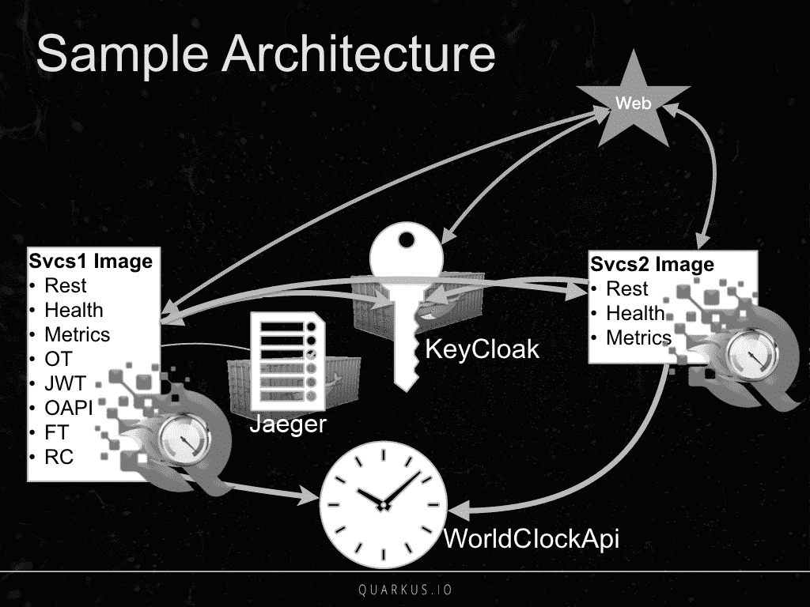
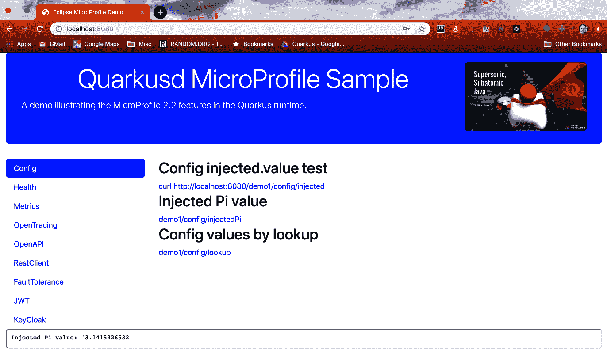
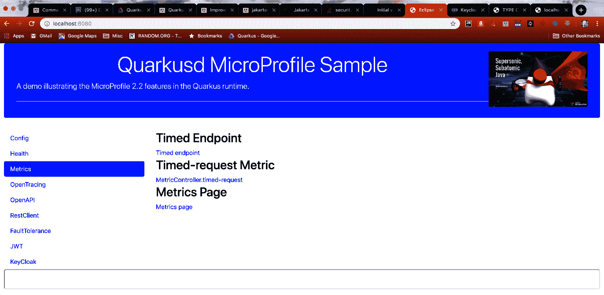
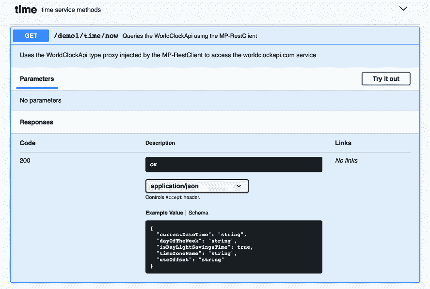
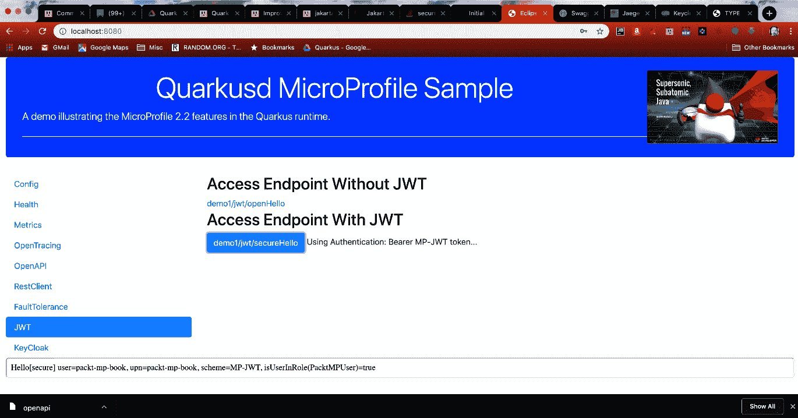

# 一个可工作的 Eclipse 微文件代码示例

在本章中，我们将讨论一个使用本书前面介绍的各种微文件特性的示例应用程序。我们将在本章中使用的微文件运行时是 Quarkus 运行时，这是一个 Kubernetes 原生 Java 堆栈，专为 GraalVM 和 OpenJDK HotSpot 量身定制，由一流的 Java 库和标准制作而成。我们将涵盖的主要主题包括：

*   对应用程序和文件容器行为使用配置
*   现实的健康检查
*   使用外部 JWT 安全提供程序保护应用程序
*   使用 Jaeger 实例集成和查看跟踪信息
*   使用 Swagger 检查微服务端点信息
*   查看个人。。。

# 技术要求

对于本章，我们需要以下内容：

*   IDE
*   JDK 1.8+已安装，且`JAVA_HOME`配置适当
*   ApacheMaven 3.5.3+
*   正在运行的 Docker 环境

本章代码见[https://github.com/PacktPublishing/Hands-On-Enterprise-Java-Microservices-with-Eclipse-MicroProfile/tree/master/Chapter08-mpcodesample](https://github.com/PacktPublishing/Hands-On-Enterprise-Java-Microservices-with-Eclipse-MicroProfile/tree/master/Chapter08-mpcodesample) 。

本章中的示例可以使用 GraalVM（[代码）编译成本地二进制文件 https://github.com/oracle/graal/releases/tag/vm-1.0.0-rc16](https://github.com/oracle/graal/releases/tag/vm-1.0.0-rc16) Quarkus 的整合。这对安装 1.0-RC16 版本的 Graal VM 和工作的 C 开发环境有额外的要求。有关本机图像生成要求的详细信息，请参见[https://quarkus.io/guides/building-native-image-guide](https://quarkus.io/guides/building-native-image-guide) 。

# 多服务微文件应用程序的示例体系结构

我们将在本章中介绍的示例应用程序由一个 HTML 前端、两个基于微文件的微服务、两个使用 Docker 开发的外部服务和一个我们无法控制的 web 外部时间服务组成。示例应用程序的体系结构如下图所示：



此图中的关键要素包括以下内容：

*   **Svcs1 图像**：这是在 Quarkus 运行时使用 MP-HC、MP 度量、MP-OT、MP-JWT、MP-OAPI、MP-FT 和 MP-RC 的 REST 端点的集合。
*   **Svcs2 图像**：这是 REST 端点的集合，使。。。

# 运行示例应用程序

示例应用程序设计为从四个不同的 shell 运行，因此让我们将它们组织到四个 shell 窗口中，如下所示：

| 船坞 | 网壳 |
| Svcs1 外壳 | Svcs2 外壳 |

在每个 shell 中，按照下面相应命名的部分所述运行命令。

# Docker shell 命令

提供预配置的服务器/服务的常见方法是使用包含服务及其所有依赖项的 Docker 映像。在本例中，我们使用 Docker 运行 KeyClope 和 Jaeger 图像。如果您不熟悉 Docker 或没有安装`docker`命令，请参阅如何为您的平台安装 Docker 的说明（[https://docs.docker.com/v17.12/install/](https://docs.docker.com/v17.12/install/) 。

该项目依赖于密钥斗篷生成 MP-JWT 令牌。要在 Docker 容器中启动 KeyClope，请在 shell 中运行以下命令：

```java
docker run -d --name keycloak -e KEYCLOAK_USER=admin -e KEYCLOAK_PASSWORD=admin -p 8180:8180 -v `pwd`/packt-mp-realm.json:/config/quarkus-packt.json -it jboss/keycloak:6.0.1 -b 0.0.0.0 ...
```

# Svcs1 shell 命令

接下来，在之前要求您打开的 Svcs1 终端窗口中，导航到项目的`svcs1`子目录，然后运行以下命令以开发模式执行`svcs1`映像：

```java
mvn compile quarkus:dev
```

您将看到以下输出：

```java
Scotts-iMacPro:svcs1 starksm$ mvn compile quarkus:dev
[INFO] Scanning for projects...
...
20:56:27 INFO [io.quarkus]] (main) Quarkus 0.15.0 started in 2.492s. Listening on: http://[::]:8081
20:56:27 INFO [io.quarkus]] (main) Installed features: [cdi, jaeger, resteasy, resteasy-jsonb, security, smallrye-fault-tolerance, smallrye-health, smallrye-jwt, smallrye-metrics, smallrye-openapi, smallrye-opentracing, smallrye-rest-client, swagger-ui]
```

在输出中，我们看到此实例正在`8081`端口上侦听 HTTP 请求，并且我们看到安装了各种 Quarkus 功能以支持我们的微文件功能使用。

# Svcs2 shell 命令

接下来，在之前要求您打开的 Svcs2 终端窗口中，`cd`到项目的`svcs2`子目录，然后运行以下命令来构建`svcs2`映像：

```java
mvn clean package
```

构建完成后，要运行`svcs2`JAR，请输入以下命令：

```java
 java -jar target/sample-svcs2-runner.jar
```

您将获得以下输出：

```java
Scotts-iMacPro:svcs2 starksm$ java -jar target/sample-svcs2-runner.jar...20:58:55 INFO [io.quarkus]] (main) Quarkus 0.15.0 started in 0.936s. Listening on: http://[::]:808220:58:55 INFO [io.quarkus]] (main) Installed features: [cdi, jaeger, resteasy, resteasy-jsonb, security, smallrye-health, smallrye-jwt, smallrye-metrics, smallrye-opentracing, smallrye-rest-client]
```

在这里，我们。。。

# webshell 命令

接下来，在要求您打开的 web shell 终端窗口中，将此项目克隆到您的计算机，`cd`到`web`子目录，然后运行以下命令以开发模式执行 web 应用程序：

```java
mvn clean package

```

构建完成后，要运行 web 子项目 JAR，请输入以下内容：

```java
java -jar target/sample-web-runner.jar

```

应用程序启动并运行后，将浏览器指向位于[的 web 应用程序 http://localhost:8080/index.html](http://localhost:8080/index.html) 。在下一节中，我们将详细介绍 web 应用程序。

# 示例应用程序的详细信息

让我们详细讨论一下应用程序中的各种选项卡。

# “配置”选项卡

应用程序的初始视图显示配置选项卡，如以下屏幕截图所示：



这三个链接位于`Chapter08-mpcodesample/svcs1`子项目`io.packt.sample.config.ConfigTestController`类的页面引用端点上。单击各个链接显示 MP 配置值。上一个屏幕截图中显示的值对应于第二个链接和`injected.piValue`配置值。`Chapter08-mpcodesample/svcs1/src/main/resources/application.properties`的相关设置如下所示：

```java
# MP Config values for ConfigTestController
injected.value=Injected value
injected.piValue=3.1415926532
lookup.value=A Lookup value
```

这里需要注意的是，将通过`ConfigTestController`中的`@ConfigProperty(name = "injected.piValue", defaultValue = "pi5=3.14159")`注释设置的默认五位数值覆盖为完整的 10 位数 PI 值，如前一个屏幕截图所示。

# 健康标签

单击应用程序的“运行状况”选项卡将显示如下页面：


页面上的链接对应于`svcs1`和`svcs2`图像的`health`检查端点。选择其中一个显示图像的运行状况检查输出。`svcs1`图像健康检查由`io.packt.sample.health.ServiceHealthCheck`和`io.packt.sample.health.CheckDiskspace`组成。此外，`ServiceHealthCheck`只是一个始终返回 up 状态的模拟实现。`CheckDiskspace`运行状况检查过程查找使用 MP Config`health.pathToMonitor`属性设置的路径，然后根据。。。

# “度量”选项卡

“度量”选项卡显示包含三个链接的以下视图：



第一个链接访问`io.packt.sample.metric.MetricController`类中的以下端点：

```java
@Path("timed")
@Timed(name = "timed-request")
@GET
@Produces(MediaType.TEXT_PLAIN)
public String timedRequest() {
    long start = System.currentTimeMillis();
    // Demo, not production style
    int wait = new Random().nextInt(1000);
    try {
        Thread.sleep(wait);
    } catch (InterruptedException e) {
        // Demo
        e.printStackTrace();
    }
    long end = System.currentTimeMillis();
    long delay = end - start;

    doIncrement();
    long count = getCustomerCount();
    return String.format("MetricController#timedRequest, delay[0-1000]=%d, 
    count=%d", delay, count);
}
```

这将使用`@Timed(name = "timed-request")`注释来注释`timed`路径端点。该方法使用 0-1000 ms 之间的随机延迟来生成响应时间分布。下一个链接是指向`timedRequest()`方法的应用程序级别度量的直接链接。MP Metrics 规范将路径定义为`metrics/application/io.packt.sample.metric.MetricController.timed-request`。在多次访问第一个链接以生成一系列响应时间后，访问第二个链接以检索`timedRequest()`方法度量将显示如下内容：

```java
# TYPE application:io_packt_sample_metric_metric_controller_timed_request_rate_per_second gauge
application:io_packt_sample_metric_metric_controller_timed_request_rate_per_second 0.4434851530761856
# TYPE application:io_packt_sample_metric_metric_controller_timed_request_one_min_rate_per_second gauge
application:io_packt_sample_metric_metric_controller_timed_request_one_min_rate_per_second 0.552026648777594
...
# TYPE application:io_packt_sample_metric_metric_controller_timed_request_seconds summary
application:io_packt_sample_metric_metric_controller_timed_request_seconds_count 6.0
application:io_packt_sample_metric_metric_controller_timed_request_seconds{quantile="0.5"} 0.923901552
...
application:io_packt_sample_metric_metric_controller_timed_request_seconds{quantile="0.999"} 0.970502841
```

这是`@Timed`风格的度量生成的信息范围。最后一个链接访问返回图像中所有可用指标的`metrics`端点。

# OpenTracing 选项卡

OpenTracing 选项卡显示具有两个链接的以下视图：


第一条链路访问以下`io.packt.sample.tracing.TracedEndpoint`方式：

```java
@GET@Path("/randomDelay")@Produces(MediaType.TEXT_PLAIN)@Traced(operationName = "TracedEndpoint#demoRandomDelay")public String randomDelay() {    long start = System.currentTimeMillis();    // 0-5 seconds random sleep    long sleep = Math.round(Math.random() * 5000);    try {        Thread.sleep(sleep);    } catch (InterruptedException e) {        e.printStackTrace();    }    long end = System.currentTimeMillis();    return String.format("TracedEndpoint.randomDelay[0-5000], elapsed=%d",     (end - start));}
```

方法。。。

# OpenAPI 选项卡

OpenAPI 选项卡视图包含两个链接，如以下屏幕截图所示：


第一个链接生成一个 OpenAPI 文档，一个 YAML 文件，其中包含应用程序中所有端点的描述。这可以输入到其他能够使用 OpenAPI 格式的程序或应用程序中。第二个链接是这样一个应用程序的示例，即 Swagger UI。打开该链接将打开一个新窗口，如下所示：


此示例应用程序视图中有三个部分。第一部分是通过 OpenAPI 注释在 JAX-RS 应用程序 bean 上指定的信息，如以下代码片段所示：

```java
@ApplicationPath("/demo1")
@LoginConfig(authMethod = "MP-JWT", realmName = "quarkus-quickstart")
@OpenAPIDefinition(
    info = @Info(
        title = "Quarkus MicroProfile 2.2 Extensions Demo",
        version = "1.0",
        contact = @Contact(
            name = "QUARKUS - COMMUNITY",
            url = "https://quarkus.io/community/",
            email = "quarkus-dev+subscribe@googlegroups.com"),
        license = @License(
            name = "Apache 2.0",
            url = "http://www.apache.org/licenses/LICENSE-2.0.html")
    ),
    servers = {
        @Server(url = "http://localhost:8080/", description = "demo1 host"),
        @Server(url = "http://localhost:8081/", description = "demo2 host")
    },
    externalDocs = @ExternalDocumentation(url="http://microprofile.io", description = 
    "Eclipse MicroProfile Homepage")
)
public class DemoRestApplication extends Application {
...
```

将此信息与 Swagger UI 中显示的信息进行比较，可以看出`@OpenAPIDefinition`注释中的所有信息都已合并到 UI 顶部。带有`time`和`default`子标题的 Swagger UI 的下一部分对应于从应用程序 REST 端点获取的操作信息。`default`部分对应于不包含任何 OpenAPI 规范注释的端点。默认行为是为应用程序中找到的任何 JAX-RS 端点创建 OpenAPI 端点定义。

`time`部分对应于包含`@Tag`、`@ExternalDocumentation`和`@Operation`MP OpenAPI 注释的以下`io.packt.sample.restclient.TimeService`端点代码片段：

```java
@GET
@Path("/now")
@Produces(MediaType.APPLICATION_JSON)
@Tag(name = "time", description = "time service methods")
@ExternalDocumentation(description = "Basic World Clock API Home.",
    url = "http://worldclockapi.com/")
@Operation(summary = "Queries the WorldClockApi using the MP-RestClient",
    description = "Uses the WorldClockApi type proxy injected by the 
    MP-RestClient to access the worldclockapi.com service")
public Now utc() {
    return clockApi.utc();
}
```

如果展开“时间”部分下的第一个操作，将获得如下视图：



您可以看到，`@Tag`定义了时间段及其说明，`@Operation`注释增加了操作摘要和说明部分。这显示了如何使用 MP-OAPI 注释和支持 OpenAPI 的应用程序（如 Swagger UI）向端点的消费者提供更多信息。

# 钥匙斗篷标签

接下来我们将跳到 KeyClope 选项卡，因为 RestClient 和 JWT 选项卡包含需要 JWT 访问端点的安全调用。当您第一次访问 KeyClope 选项卡时，它应该如下所示：


它不会显示任何令牌信息，刷新复选框下方的状态行应指示（未验证）。单击绿色登录按钮，弹出以下登录屏幕：


分别为用户名和密码字段输入以下内容：

*   `packt-mp-book`
*   `password`

这

# JWT 选项卡

单击 JWT 选项卡后，您将看到一个类似以下的视图，其中包含两个端点链接：



第一个链接向不安全的端点发出请求，该端点将打印来自 JWT 的名称以及`upn`声明（如果存在）。

但是，由于 web 前端没有为此请求提供 JWT，因此输出部分将显示以下内容：

```java
Hello[open] user=anonymous, upn=no-upn
```

单击第二个链接可访问具有以下代码片段的端点的安全版本：

```java
public class JwtEndpoint {
    @Inject
    private JsonWebToken jwt;
    @Inject
    @Claim(standard = Claims.raw_token)
    private ClaimValue<String> jwtString;
    @Inject
    @Claim(standard = Claims.upn)
    private ClaimValue<String> upn;
    @Context
    private SecurityContext context;
...
    @GET
    @Path("/secureHello")
    @Produces(MediaType.TEXT_PLAIN)
    @RolesAllowed("user") // 1
    public String secureHello() {
        String user = jwt == null ? "anonymous" : jwt.getName(); // 2
        String scheme = context.getAuthenticationScheme(); // 3
        boolean isUserInRole = context.isUserInRole("PacktMPUser"); // 4
        return String.format("Hello[secure] user=%s, upn=%s, scheme=%s, 
        isUserInRole(PacktMPUser)=%s", user, upn.getValue(), 
        scheme, isUserInRole);
    }
```

让我们讨论一下重要的几行：

1.  `@RolesAllowed("user")`注释表示端点是安全的，调用方需要`user`角色。我们早些时候看到的 JWT`groups`声明具有这种作用。
2.  用户通过`getName()`方法从 JWT 获取。正如 MP-JWT 一章中所解释的，这映射到 JWT 中的`upn`索赔。
3.  当前安全认证方案从注入的`SecurityContext`获取。
4.  对调用方是否具有`PacktMPUser`角色进行编程安全检查。检查结果将返回 true，因为 JWT 小组声称我们之前看到过这个角色。

该信息被组合成一个字符串，该字符串是`secureHello`方法的返回值。单击 demo1/jwt/secureHello 链接按钮在响应区域生成以下输出字符串：

```java
Hello[secure] user=packt-mp-book, upn=packt-mp-book, scheme=MP-JWT, isUserInRole(PacktMPUser)=true
```

通过结合使用`@RolesAllowed`注释和与 MP-JWT 功能的集成，我们可以看到我们如何既能保护对微服务端点的访问，又能基于经过身份验证的 JWT 中的内容引入应用程序行为。接下来，让我们返回 RestClient 选项卡。

# RestClient 选项卡

RestClient 选项卡包含三个链接，如此视图所示：


这些链接对应于使用外部世界时钟公共端点的端点，该端点在访问时返回有关当前时间的信息。已创建以下 MP-RC 接口来封装外部端点：

```java
@RegisterRestClient(baseUri = WorldClockApi.BASE_URL)public interface WorldClockApi {    static final String BASE_URL = "http://worldclockapi.com/api/json";    @GET    @Path("/utc/now")    @Produces(MediaType.APPLICATION_JSON)    Now utc();    @GET    @Path("{tz}/now")    @Produces(MediaType.APPLICATION_JSON)    Now tz(@PathParam("tz") String tz);}
```

# 总结

本章介绍了一个示例服务网格，该网格由一个 web 应用程序、两个在新 Quarkus 实现中使用 MP 功能的微服务映像、一个外部 web 服务和两个基于 Docker 的服务组成。这显示了各种 MP 功能与云环境中的外部服务之间的相互作用，以及与本地 mesh 环境外部 web 服务的集成。这应该让您感觉到使用微文件 API 和实现构建微服务时所涉及的步骤。

在下一章中，我们将了解正在开发的微文件规范，以了解正在探索的方向。虽然这些规范目前不在 Micropofile 核心功能集的范围内，但它们是未来包含的候选规范，查看它们将让我们了解 Micropofile 的发展方向。

# 问题

1.  MP 配置设置是否影响应用程序代码、MP 功能代码或两者？
2.  您是否能够将`health.pathToMonitor`更新为有效路径并查看更新的健康状态回复？
3.  “运行状况”选项卡上的`Svcs2`运行状况链接（`http://localhost:8082/health`显示什么作为其输出？如果您停止 KeyClope Docker 映像并再次单击链接，输出是否会更改？
4.  如果您在 Metrics 选项卡中选择`MetricController.timed-request`链接（`http://localhost:8080/metrics/application/io.packt.sample.metric.MetricController.timed-request`），而不首先至少点击`Timed`端点链接（`http://localhost:8080/demo1/metric/timed`），会发生什么情况？
5.  转到 RestClient 选项卡并点击链接，确保您拥有有效的。。。

# 进一步阅读

检查代码，尝试更改，然后与更新的代码交互是理解示例服务背后更多细节的好方法。Quarkus 微文件实现支持实时重新加载功能，允许您在无需重建的情况下进行更改。有关此主题的更多信息，请参阅 Maven 工具（[https://quarkus.io/guides/maven-tooling.html](https://quarkus.io/guides/maven-tooling.html) 在 Quarkus 站点上。