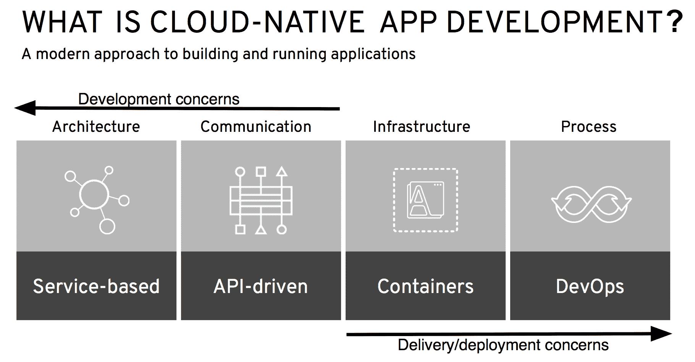

# 在多云环境中使用微文件

微服务和微服务体系结构是云和多云环境（包括混合云部署）的理想开发方法，在混合云部署中，您的应用程序包括内部部署逻辑以及在云中运行的逻辑。EclipseMicroporFile 是一个规范，它优化了 Java for MicroService 体系结构，从而提供了可以在 Java 和云中实现 MicroService 的结构。这些主题将帮助您理解为什么 Eclipse MicropoFile 非常适合在混合和多云环境中开发应用程序，以及在这些类型的部署中使用它时必须考虑的事项。

在本章中，我们将讨论以下内容。。。

# 使用 Eclipse 微文件进行云本机应用程序开发

什么是云本机应用程序？通常，**云本机**的定义包含以下特征：

*   设计为松散耦合的服务，如微服务
*   松散耦合的服务，通过独立于语言的通信协议进行交互，允许使用不同的编程语言和框架实现微服务
*   轻量级容器，可根据需要或通过资源利用率指标进行上下扩展
*   通过敏捷 DevOps 流程进行管理，云本机应用程序的每个微服务都将经历一个独立的生命周期，该生命周期通过使用**持续集成/持续交付**（**CI/CD**管道的敏捷流程进行管理

然而，EclipseMrobroFile 的目标是为微服务架构优化 Java，那么它是否使其适合于云本地应用程序开发？容器原生开发呢？微服务、云本机开发和容器本机开发之间的关系是什么？这些有什么不同或比较？让我们看看！

# 微服务与云本机与容器本机

首先，让我们画出这三个术语在应用程序开发方面的区别。正如我们在[第一章](01.html)、*Eclipse 微文件简介*中所讨论的，企业 Java 微服务具有以下特性：

*   它是一个使用 Java 语言编写的微服务。
*   它可以使用任何 Java 框架。
*   它可以使用任何 JavaAPI。

*   它必须是企业级的，这意味着它必须具有高可靠性、可用性、可扩展性、安全性、健壮性和性能。
*   它必须满足微服务的特性，所有这些特性都列在[中 https://martinfowler.com/microservices/](https://martinfowler.com/microservices/) 。

根据其定义，微服务不规定底层服务的具体细节。。。

# 12 因子应用程序呢？

就像微服务和微服务体系结构定义一样，12 因素应用程序没有规定底层技术，例如，编程语言、数据库、缓存等，也没有规定应用于实现它们的框架。12 因素应用程序是一种用于实现应用程序的方法。这十二个因素如下：

*   修订控制中跟踪了一个代码库，部署了许多代码库
*   显式声明和隔离依赖项
*   在环境中存储配置
*   将支持服务视为附加资源
*   严格分离构建和运行阶段
*   将应用程序作为一个或多个无状态进程执行
*   通过端口绑定导出服务
*   通过流程模型向外扩展
*   通过快速启动和优雅关闭，最大限度地提高稳健性
*   使开发、分段和生产尽可能相似
*   将日志视为事件流
*   将管理/管理任务作为一次性流程运行

使用此方法实现应用程序有助于我们执行以下操作：

*   将新开发人员加入项目的时间和成本降至最低
*   提供执行环境之间的可移植性

*   轻松地将应用程序部署到云平台
*   尽量减少开发和生产之间的差异
*   不做任何改变就扩大规模

您可以在[阅读关于 12 个因素的所有内容 https://12factor.net](https://12factor.net) 。

12 因素应用程序是一种开发人员在设计和实现微服务和应用程序时可以遵循的方法，独立于用于实现它们的编程语言或框架。开发人员可以使用 EclipseMicroFile 框架来使用 12 因素应用程序实现微服务。12 因素应用程序和 Eclipse 微文件不是相互排斥的，而是相互补充的。

但是，对于设计和实现非 12 要素应用程序的方法，又如何呢？无服务器和**功能即服务**（**FaaS**技术如何？Eclipse 文件如何适应这些较新的云本机技术？

# 无服务器和 FaaS 呢？

Serverless 和 FaaS 云本机技术在市场上一直受到稳定的关注和增长，所有主要云提供商（即 AWS Lambda、Azure 功能、Oracle 功能和 Google 云功能）提供的产品证明了这一点。在一个组织越来越多地将云用于开发和生产工作负载，而计算和内存成本是需要跟踪和监控的运营费用的时代，FaaS 很有吸引力，因为它将计算和内存管理从用户那里抽象出来，用户可以专注于开发业务逻辑，从而变得比以往任何时候都更有效率。

使用 FaaS，开发人员不需要设置 VM 和内存。。。

# 云本地应用程序开发

云本机应用程序开发有两个互补的方面或组件：应用程序服务和基础设施服务。应用程序服务加快了云本地应用程序业务逻辑的开发，基础设施服务加快了其交付和部署。这两个方面是云本地应用程序开发的补充和组成部分。一个不能没有另一个。它们本质上是云本地应用程序开发的阴阳，如下图所示：


正如我们在本章前面提到的，云本地应用程序开发是一种构建和运行应用程序的方法，它充分利用了云计算模型，该模型基于四个关键原则：

*   基于服务的体系结构（迷你服务、微服务、SOA 服务等）
*   一种 API 驱动的服务间通信方法
*   基于容器的底层基础设施
*   DevOps 过程

下图描述了云本机应用程序开发的四个关键原则：



如前一张图所示，架构和通信方面与云本地应用程序的开发关注点相关，基础架构和流程方面与它们的交付/部署相关。

正在着手采用云本机应用程序开发的组织可以受益于八个步骤，如题为*云本机应用程序之路的电子书**8 个步骤指导您的旅程*所述

获取电子书*云本机应用路径：**8 个步骤指引您的旅程*，请参考[https://www.redhat.com/en/resources/path-to-cloud-native-applications-ebook](https://www.redhat.com/en/resources/path-to-cloud-native-applications-ebook) 。

让我们讨论一下 Eclipse MicroFile 如何在以下八个步骤中发挥作用：

1.  **发展 DevOps 文化和实践**：*通过拥抱 DevOps 的原则和文化价值观并围绕这些价值观组织您的组织，利用新技术、更快的方法、**和更紧密的合作。*尽管这是一个与组织和流程相关的步骤，但作为微服务规范的 EclipseMicroporFile 非常适合这种文化和流程的适应，因为微服务由于其特性而密切支持 DevOps 流程。
2.  **使用 fast Monolith 加速现有应用程序**：*通过迁移到基于容器的现代平台来加速现有应用程序，并将单片应用程序拆分为微服务或小型服务，以获得额外的效率提升。*当你把你的巨石分解成微服务时，Eclipse 微文件会有很大的帮助。当您识别整块中的有界上下文时，考虑使用 Eclipse 微配置文件来实现实现每个有界上下文逻辑的每一个微服务。
3.  **使用应用程序服务加快开发**：*通过可重用性加快软件开发。云本机应用程序服务已准备好使用开发人员工具。但是，这些可重用组件必须优化并集成到底层云本机基础设施中，以最大限度地发挥其效益。*“一个**内存数据网格**（**IMDG**）和消息代理是有助于加快业务逻辑开发的应用程序服务。使用 Eclipse 微文件开发的微服务可以通过在其方法体中调用这些应用程序服务来利用这些服务。在集成到应用程序服务（如 IMDG 或消息传递代理）时，Eclipse 文件不会施加任何类型的限制。
4.  **为正确的任务选择正确的工具**：*使用基于容器的应用程序平台，该平台支持框架、语言和体系结构的正确组合，并且可以根据您的特定业务应用程序需求进行定制。*Eclipse 微文件是开发人员在为正确的任务选择正确的工具时可以使用的工具之一。例如，Red Hat 应用程序运行时是运行时和工具的集合，包括 Eclipse 文件、Node.js、Spring Boot 和 Vertex。
5.  **为开发者提供自助式按需基础设施**：*使用容器和容器编排技术简化对底层基础架构的访问，为 IT 运营团队提供控制和可见性，并跨各种基础架构环境（如数据中心、私有云和公共云）提供强健的应用程序生命周期管理。*使用 Eclipse MicroFile 开发的微服务可以部署到一个或多个容器中。通过轻松管理这些容器和运行在其上的微服务体系结构，您可以加快开发周期，更快地为业务提供价值。

6.  **自动化 IT 以加速应用程序交付**：*创建**自动化沙盒，以 lea**rn 了解自动化语言和流程，建立跨组织的协作对话以定义服务需求，创建自助服务目录以授权用户并加快交付，并使用计量、监控和计费策略和流程。*Eclipse MicroFile 提供了度量功能，容错和健康检查，所有这些都可以用作 IT 自动化过程的输入。
7.  **实施持续交付和高级部署技术**：*通过自动交付、CI/CD 管道、滚动蓝/绿和金丝雀部署以及 A/B 测试，加快云本地应用程序的交付。*将微服务与 CI/CD 结合使用可以促进高级部署技术。例如，您可以将基于微文件的微服务和新功能作为蓝/绿或金丝雀部署的一部分引入生产，并在证明新功能按预期工作后将所有流量切换到该微服务。
8.  **发展一个更模块化的架构**：*选择一个模块化的设计，使用微服务、整体式优先的方法或小型服务或组合，满足您的特定需求。*对于这一步，您可以使用 EclipseMrobroFile 为新应用程序开发微服务，或者将 monolith 的特定有界上下文分解为微服务。

既然我们已经讨论了 Eclipse MicropoFile 如何促进云本机应用程序开发，以及它如何在八个步骤中帮助您实现云本机应用程序，那么让我们转到跨云运行基于 MicropoFile 的应用程序的主题。

# 跨云开发和运行微文件应用程序

MicroFile 提供了哪些功能来支持跨云开发？微服务和支持基于 HTTP REST API 的语言无关通信是受支持的两个主要特性。此外，MicroProfile Config 支持定义与云环境集成的云环境变量的集成。微文件健康检查支持与云环境健康检查的集成。微文件度量和微文件 OpenTracing 支持与 DevOps 监控任务的集成。最后，微文件容错支持独立微服务之间的回退和恢复行为。

Eclipse 微文件。。。

# 裸机与虚拟机与容器

是否在裸机、虚拟机或容器上运行基于微文件的微服务或应用程序取决于应用程序的特定要求。事实上，确定什么类型的底层云计算资源完全取决于您的应用程序需求，而不是用于其开发的框架，即 Eclipse 文件。例如，如果您的应用程序或微服务需要实时或接近实时的响应时间，那么您很可能倾向于裸机或容器（在裸机上运行）部署。这个决定将独立于您用来编写业务逻辑的框架，无论是 Eclipse 文件还是其他文件。

由于 Eclipse MicroporFile 支持基于 HTTP REST 的微服务和语言无关通信，因此微服务间通信不受运行微服务的底层计算类型的影响；例如，您可以让一个运行在 VM 上的微服务通过 REST 与另一个运行在裸机上的微服务进行通信。但是，如果您的应用程序由运行在本地的微服务和另一个运行在云上的微服务（也称为混合云应用程序）组成，该怎么办？你需要考虑哪些因素？

# 在混合云部署中使用微文件时的注意事项

混合云应用程序包括本地逻辑和云上逻辑。换句话说，如果应用程序逻辑的一部分在本地运行，而另一部分在云中运行，那么实际上就是一个混合云应用程序。在这种类型的部署中使用 Eclipse 文件时，需要考虑以下几点：

*   需要使用云环境支持的任何 DNS 支持来配置云环境和内部部署环境之间的通信路由

*   配置 MicroProfile OpenTracing 以支持跨云环境捕获跟踪
*   跨云监控分割文件度量信息。。。

# 在多云部署中使用 MicroFile OpenTracing 时面临的挑战

在多云环境中进行分布式跟踪可能是一项挑战。我们希望实现与单一云环境相同的目标，即在请求通过每个云内和跨每个云的服务时，可视化与请求关联的单一端到端跟踪，但在处理不同的上下文传播格式和以每个云的不同格式存储跟踪数据时，可能会面临复杂问题。

第一个挑战是确保跟踪在不同的云环境中继续进行。这是一个问题，因为在写这本书的时候，没有一个被广泛采用或标准化的跟踪上下文格式。通常，每个跟踪系统使用不同的头和格式来传播跟踪上下文。例如，Zipkin 使用 B3 传播，Jaeger 使用`ber-trace-id`头，Amazon X-Ray 使用`X-Amzn-Trace-Id`，Google 使用`X-Cloud-Trace-Context`。因此，如果必须跨异构跟踪系统跟踪请求，则每次请求离开或进入不同的环境时，都必须转换跟踪上下文。这通常可以通过配置带有自定义注射器或提取器实现的跟踪器来实现。但是，这目前超出了 MicroFile OpenTracing 项目的范围。将来，跟踪上下文格式可能会在 W3C 跟踪上下文项目（[下进行标准化 https://www.w3.org/TR/trace-context/](https://www.w3.org/TR/trace-context/) ）

第二个挑战是，即使在同质跟踪环境中，也要可视化来自多云环境的跟踪数据。这可能会有问题，因为每个云中的跟踪数据可能存储在不同的数据库中或以不同的格式存储。这可以通过将数据复制到单个统一存储或通过适当的数据格式调整按需在系统之间发送丢失的跟踪数据来克服。

接下来，我们将讨论在服务网格（如 Istio）中使用 Eclipse 微文件的挑战。

# 在服务网格中使用 Eclipse 文件时的注意事项

Istio 或 LinkerD 等服务网格在 Kubernetes 之上的发现、路由和容错领域提供平台级服务。其中一些服务也可以在微文件中找到。当您将微文件应用程序部署到此类服务网格中时，您需要考虑是否要使用来自 MyPrror 的版本或来自 Mesh 的版本。

此处最可能受到影响的微文件功能是容错，尤其是重试逻辑。

# 重试

在第一次请求失败的情况下，允许重试请求到另一个服务（参见 Po.T0A.第 3 章 AuthT1，{ To.T2A.MigPrrices 配置和容错 To.T3}，以获取更多信息）.现在，考虑一下您有以下代码：

```java
@Retry (maxRetries = 3)
void aMethod() {
    callBackend();
}
```

虽然这会告诉 ISTIO 重试 5 次，但最终可能会有 15 次重试（ISTIO 将在代码返回 3 次之前，每次重试 5 次，然后返回错误）。由于可以动态更改 Istio 中的重试次数，无需重新启动 pod。

# 退路

另一方面，当所有重试都失败时，Istio 没有回退策略–不可能让 Istio 调用工作负载的另一个版本。当您使用`@Fallback`注释对前面的代码进行注释时，如果原始调用失败，则可以执行另一个操作：

```java
@Fallback(fallbackMethod = "fallbackForA")@Retry (maxRetries = 3)string aMethod() {   callBackend();}void String fallbackForA() {    return "A cached string";}
```

在这种情况下，一旦 Istio 中的所有重试次数（乘以 MicroProfile 中的重试次数）用完，将调用`fallbackForA`回退方法。如果您从前面的示例中删除`@Retry`注释，则在 Istio 重试已用尽时调用回退方法。。。

# 服务网格中的故障注入

Istio 让您可以非常轻松地将错误注入结果。这在一开始听起来会适得其反，但这是一种非常好的测试方法，可以测试您是否获得正确的容错处理

```java
apiVersion: networking.istio.io/v1alpha3
kind: VirtualService
metadata:
  name: fault-injection-service
spec:
  hosts:
  - myTarget
  http:
  - route:
    - destination:
      host: myTarget
    fault:
      abort:
        httpStatus: 404
        percent: 20
     delay:
       percent: 50
       fixedDelay: 200ms
```

Istio 将侦听对目标主机`myTarget`的呼叫，并为 20%的呼叫发送 404 响应，而不是实际响应代码。除此之外，它将每隔 200 毫秒延迟一次响应。

# 结论

MicroProfile 定义了容错区域中的原语，这些原语也可以通过其他方式提供，例如在服务网格中。如果这是你的情况，你必须考虑激活哪一个。激活两者可能会导致意外行为。

# 总结

在本章中，您已经了解了 Eclipse 文件如何促进云本地应用程序开发，而不管它是混合云还是多云应用程序。我们还讨论了微服务、云本机开发和容器本机开发之间的关系，以及在容器上运行的微服务如何成为云本机开发的理想选择。您还了解了 Eclipse 文件与 12 因素应用程序以及无服务器和 FaaS 环境的关系。

我们介绍了引导您进入云本机应用程序的八个步骤，以及 Eclipse Micropofile 在每个步骤中如何提供帮助。此外，我们还讨论了当使用跨云的应用程序使用 Eclipse MyPrror 时，您需要考虑什么，当在裸金属机上与 VMS 对容器运行 Eclipse 微轮廓时，在混合云应用程序中运行 Eclipse MyPrrices 微服务时该考虑什么，当在多云部署中运行 Eclipse MyPrimeApCopeAccess 时要注意的问题，以及在服务网格中使用 Eclipse MyPrror 时要考虑的问题。

在本书中，我们介绍了 MicroFile 的起源、Java 微服务规范以及它产生的历史。我们介绍了开源项目、它的使命、治理、好处、如何为它做出贡献，以及它的子项目的生命周期。然后，我们深入研究了构成伞式/平台版本的每个文件 API/子项目，以及伞式版本之外的子项目。

我们还介绍了市场上微文件的当前实现，包括 Quarkus，并向您展示了如何通过微文件启动程序“quark”生成微文件项目。我们讨论了会议应用程序，这是一个社区示例项目，演示了不同供应商实现之间的微文件互操作性。我们还提供了代码示例以供参考和讨论，还提供了一个完整的工作项目，其中包含源代码，实现了所有微文件 API，您可以在开发工作中自由访问、下载、编译和重用这些 API，并可以快速启动微文件。随后，我们讨论了 Micropofile 提供的反应式功能及其未来发展，如管道和 Micropofile 沙箱中的子项目，以及它与雅加达 EE 未来可能的关系。

最后，我们讨论了基于微文件的应用程序和微服务如何非常适合在容器、云和无服务器/FaaS 部署中实施解决方案。无论您是 Java 微服务新手还是经验丰富的 Java 开发人员，您都可以利用从本书中获得的所有知识，开始开发基于此新的创新社区驱动规范的微服务，以创建可观察、可扩展、安全、，以及高可用性的混合云和多云应用程序，使您能够更快地为业务提供价值。

# 问题

1.  Eclipse 文件如何促进云本机应用程序开发？
2.  云本机应用程序开发的两个互补关注点是什么？Eclipse 文件如何适应这些问题？
3.  云本机应用程序开发的四个关键原则是什么？Eclipse 文件与这些有什么关系？
4.  EclipseMicroporFile 如何帮助您完成云本机应用程序的八个步骤中的每一步？
5.  Eclipse 文件与 12 因素应用程序的关系如何？
6.  Eclipse MicroProfile 如何促进无服务器和 FaaS 环境？
7.  在云上实现和运行 Eclipse 微轮廓时应该考虑什么？
8.  使用 Eclipse 微文件时有哪些挑战。。。