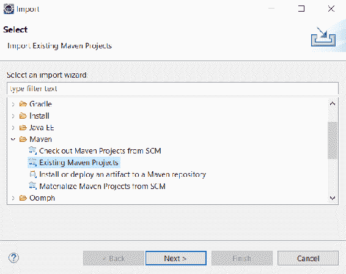
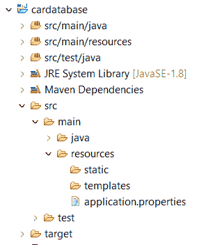
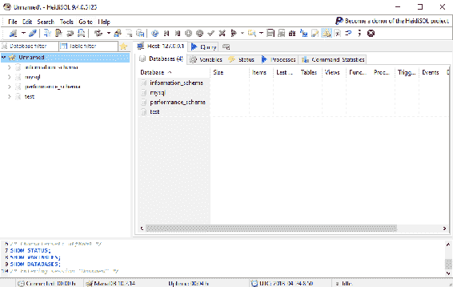

# 一、配置环境和工具——后端

在本章中，我们将设置使用 Spring Boot 进行后端编程所需的环境和工具。SpringBoot 是一个现代的基于 Java 的后端框架，它使开发比传统的基于 Java 的框架更快。通过 SpringBoot，您可以创建一个具有嵌入式应用服务器的独立 web 应用。

在本章中，我们将研究以下内容：

*   构建 Spring 引导开发环境
*   EclipseIDE 和 Maven 的基础知识
*   创建和运行 Spring 启动项目
*   解决运行 Spring 引导应用的常见问题

# 技术要求

使用 EclipseIDE 需要 Java SDK 版本 8 或更高版本。

在这本书中，我们使用的是 Windows 操作系统，但所有工具都可以用于 Linux 和 macOS。

# 设置环境和工具

有许多不同的 IDE 工具可用于开发 Spring 引导应用。在本书中，我们使用的是 Eclipse，这是一个用于多种编程语言的开源 IDE。我们将使用 SpringInitializerProjectStarter 页面创建我们的第一个 SpringBoot 项目。然后将项目导入 Eclipse 并执行。在开发 Spring 引导应用时，阅读控制台日志是一项至关重要的技能。

# 安装 Eclipse

Eclipse 是一个由 Eclipse 基金会开发的开源编程 IDE。安装包可从[下载 https://www.eclipse.org/downloads](https://www.eclipse.org/downloads) 。Eclipse 可用于 Windows、Linux 和 macOS。您应该为 JavaEE 开发人员下载最新版本的 EclipseIDE。

您可以下载 Eclipse 的 ZIP 包或执行安装向导的安装程序包。如果使用 ZIP 包，您只需将包解压缩到本地磁盘，它将包含一个可执行的`Eclipse.exe`文件，您可以通过双击该文件来运行该文件。

# Eclipse 和 Maven 的基础知识

Eclipse 是一种用于多种编程语言的 IDE，例如 java、C++和 Python。Eclipse 包含不同的透视图以满足您的需要。透视图是 Eclipse 工作台中的一组视图和编辑器。以下屏幕截图显示了 Java 开发的常见透视图：


在左边，我们有 ProjectExplorer，在这里我们可以看到我们的项目结构和资源。Project Explorer 还用于双击文件打开文件。文件将在编辑器中打开，该编辑器位于工作台的中间。控制台视图可以在工作台的下部找到。Console 视图非常重要，因为它显示应用日志消息。

如果您愿意，您可以获得 Eclipse 的**Spring 工具套件**（**STS**），但我们不会在本书中使用它，因为简单的 Eclipse 安装就足以满足我们的需要。STS 是一组使 Spring 应用开发更容易的插件（[https://spring.io/tools](https://spring.io/tools) ）。

ApacheMaven 是一种软件项目管理工具。Maven 的基础是**项目对象模型**（**pom**。Maven 简化了软件开发过程，并统一了开发过程。您还可以使用另一个名为 Gradle 的项目管理工具，并使用 springboot，但在本书中，我们将重点介绍如何使用 Maven。

pom 是一个包含项目基本信息的`pom.xml`文件。还有 Maven 应该下载的所有依赖项，以便能够构建项目。

有关项目的基本信息可以在`pom.xml`文件的开头找到，该文件定义了应用的版本、打包格式等。

`pom.xml`文件的最低版本应包含项目根目录、`modelVersion`、`groupId`、`artifactId`和`version`。

依赖项在“依赖项”部分中定义，如下所示：

```java
<?xml version="1.0" encoding="UTF-8"?>
<project  xmlns:xsi="http://www.w3.org/2001/XMLSchema-instance"
  xsi:schemaLocation="http://maven.apache.org/POM/4.0.0 http://maven.apache.org/xsd/maven-4.0.0.xsd">
  <modelVersion>4.0.0</modelVersion>

  <groupId>com.packt</groupId>
  <artifactId>cardatabase</artifactId>
  <version>0.0.1-SNAPSHOT</version>
  <packaging>jar</packaging>

  <name>cardatabase</name>
  <description>Demo project for Spring Boot</description>

```

```
  <parent>
    <groupId>org.springframework.boot</groupId>
    <artifactId>spring-boot-starter-parent</artifactId>
    <version>2.0.1.RELEASE</version>
    <relativePath/> <!-- lookup parent from repository -->
  </parent>

  <dependencies>
    <dependency>
      <groupId>org.springframework.boot</groupId>
      <artifactId>spring-boot-starter-web</artifactId>
    </dependency>

    <dependency>
      <groupId>org.springframework.boot</groupId>
      <artifactId>spring-boot-starter-test</artifactId>
      <scope>test</scope>
    </dependency>
  </dependencies>
</project>
```

Maven 通常从命令行使用。Eclipse 包含嵌入式 Maven，它处理我们需要的所有 Maven 操作。因此，这里我们不关注 Maven 命令行的使用。最重要的是理解`pom.xml`文件的结构以及如何向其添加新的依赖项。

# 使用 Spring 初始值设定项创建项目

我们将使用 Spring Initializer 创建后端项目，这是一个用于创建 Spring 启动项目的基于 web 的工具。弹簧初始化器可在[处找到 https://start.spring.io](https://start.spring.io) ：


我们将用 Java 和最新的 Spring 启动版本生成一个 Maven 项目。在 Group 字段中，我们将定义组 ID，它也将成为 Java 项目中的基本包。在 Artifact 字段中，我们将定义 Artifact ID，它也是 Eclipse 中项目的名称。

在 Dependencies 部分中，我们将选择项目中需要的启动器和依赖项。SpringBoot 提供了简化 Maven 配置的入门包。Spring 启动启动程序实际上是一组依赖项，可以包含在项目中。您可以在搜索字段中键入依赖项的关键字，也可以通过单击切换到完整版本链接查看所有可用的依赖项。我们将通过选择两个依赖项 Web 和 DevTools 来启动项目。您可以在搜索字段中键入依赖项，或切换到完整版本，查看所有可用的初学者软件包和依赖项：


DevTools 依赖项为我们提供了 Spring 引导开发工具，这些工具提供了自动重启功能。它使开发速度大大加快，因为保存更改后应用会自动重新启动。WebStarter 包是全堆栈开发的基础，并提供嵌入式 Tomcat。

最后，您必须按下 generateproject 按钮，这将为我们生成 projectstarterzip 包。

# 如何运行项目

1.  提取我们在上一主题中创建的项目 ZIP 包并打开 Eclipse。
2.  我们将把我们的项目导入 EclipseIDE。要启动导入过程，请选择文件|导入菜单，导入向导将打开。以下屏幕截图显示了向导的第一页：



3.  在第一阶段，您应该从`Maven`文件夹下的列表中选择现有的 Maven 项目，然后按 next 按钮进入下一阶段。以下屏幕截图显示导入向导的第二步：


4.  在此阶段，按 Browse…（浏览…）按钮选择提取的项目文件夹。然后，Eclipse 从项目文件夹的根目录中找到`pom.xml`文件，并将其显示在窗口的项目部分中。

5.  按 Finish 按钮完成导入。如果一切正常，您应该可以在 Eclipse 项目浏览器中看到`cardatabase`项目。项目准备就绪需要一段时间，因为所有依赖项都将在导入后由 Maven 加载。您可以在 Eclipse 的右下角看到依赖项下载的进度。以下屏幕截图显示了成功导入后的 Eclipse Project Explorer：


Project Explorer 还显示了我们项目的包结构，现在一开始只有一个名为`com.packt.cardatabase`的包。在该包下是我们的主要应用类，称为`CardatabaseApplication.java`。

6.  现在，我们的应用中没有任何功能，但我们可以运行它并查看是否所有功能都已成功启动。要运行项目，请双击 main 类，然后按 Eclipse 工具栏中的 run 按钮，打开该类，或者选择 run 菜单并按 run as | Java Application:


您可以看到控制台视图在 Eclipse 中打开，其中包含有关项目执行的重要信息。这是显示所有日志文本和错误消息的视图，因此在出现问题时检查视图的内容非常重要。

现在，如果项目执行正确，您应该会看到控制台末尾的文本`Started CardatabaseApplication in...`。以下屏幕截图显示了我们的 Spring Boot 项目启动后 Eclipse 控制台的内容：


在我们项目的根目录中有`pom.xml`文件，这是我们项目的 Maven 配置文件。如果查看文件中的依赖项，您可以看到现在存在我们在 Spring Initializer 页面上选择的依赖项。还有一个自动包含的测试依赖项，无需任何选择。在接下来的章节中，我们将向应用添加更多功能，然后我们将手动向`pom.xml`文件添加更多依赖项：

```
  <dependencies>
    <dependency>
      <groupId>org.springframework.boot</groupId>
      <artifactId>spring-boot-starter-web</artifactId>
    </dependency>
    <dependency>
      <groupId>org.springframework.boot</groupId>
      <artifactId>spring-boot-devtools</artifactId>
      <scope>runtime</scope>
    </dependency>
    <dependency>
      <groupId>org.springframework.boot</groupId>
      <artifactId>spring-boot-starter-test</artifactId>
      <scope>test</scope>
    </dependency>
  </dependencies>

```

让我们更仔细地看看 Spring Boot 主类。在课程开始时，有`@SpringBootApplication`注释。它实际上是多个注释的组合，例如：

| **注释** | **说明** |
| `@EnableAutoConfiguration` | 启用 Spring 引导自动配置。SpringBoot 将根据依赖项自动配置您的项目。例如，如果您有`spring-boot-starter-web`依赖项，Spring Boot 会假定您正在开发一个 web 应用，并相应地配置应用。 |
| `@ComponentScan` | 启用 Spring 引导组件扫描以从应用中查找所有组件。 |
| `@Configure` | 定义可以用作 bean 定义源的类。 |

以下代码显示 Spring Boot 应用的`main`类：

```
import org.springframework.boot.SpringApplication;
import org.springframework.boot.autoconfigure.SpringBootApplication;

@SpringBootApplication
public class CardatabaseApplication {

  public static void main(String[] args) {
    SpringApplication.run(CardatabaseApplication.class, args);
  }
}
```

应用的执行从`main`方法开始，就像在标准 Java 应用中一样。

建议将根包中的`main`应用类定位在其他类之上。应用不能正常工作的一个常见原因是 Spring Boot 找不到一些关键类。

# Spring 启动开发工具

SpringBoot 开发工具使应用开发过程更容易。如果将以下依赖项添加到 Maven`pom.xml`文件中，则项目将包括开发人员工具：

```
    <dependency>
      <groupId>org.springframework.boot</groupId>
      <artifactId>spring-boot-devtools</artifactId>
      <scope>runtime</scope>
    </dependency>
```

创建应用的完全打包生产版本时，开发工具将被禁用。

当您更改项目类路径文件时，应用将自动重新启动。您可以通过在`main`类中添加一行注释来测试这一点。保存文件后，您可以在控制台中看到应用已重新启动：

```
package com.packt.cardatabase;

import org.springframework.boot.SpringApplication;
import org.springframework.boot.autoconfigure.SpringBootApplication;

@SpringBootApplication
public class CardatabaseApplication {

  public static void main(String[] args) {
    // After adding this comment the application is restarted
    SpringApplication.run(CardatabaseApplication.class, args);
  }
}
```

# 日志和问题解决

SpringBootStarter 包提供了一个 logback，我们可以使用它进行日志记录，而无需任何配置。以下示例代码显示了如何使用日志记录：

```
import org.slf4j.Logger;
import org.slf4j.LoggerFactory;
import org.springframework.boot.SpringApplication;
import org.springframework.boot.autoconfigure.SpringBootApplication;

@SpringBootApplication
public class CardatabaseApplication {
  private static final Logger logger = LoggerFactory.getLogger(CardatabaseApplication.class);
  public static void main(String[] args) {
    SpringApplication.run(CardatabaseApplication.class, args);
    logger.info("Hello Spring Boot");
  }
}
```

运行项目后，可以在控制台中看到日志消息：


日志记录有七个不同的级别-`TRACE`、`DEBUG`、`INFO`、`WARN`、`ERROR`、`FATAL`和`OFF`。您可以在 Spring Boot`application.properties`文件中配置日志记录级别。该文件可在项目内的`resources`文件夹中找到：



如果我们将日志级别设置为`INFO`，我们可以看到来自`INFO`（`INFO`、`WARN`、`ERROR`和`FATAL`下级别的日志消息。在以下示例中，我们为根目录设置了日志级别，但您也可以在包级别设置它：

```
logging.level.root=INFO
```

现在，当您运行项目时，您再也看不到`TRACE`和`DEBUG`消息了。对于应用的生产版本，这可能是一个很好的设置：


Spring Boot 正在使用 ApacheTomcat（[http://tomcat.apache.org/ 默认情况下，](http://tomcat.apache.org/)作为应用服务器。默认情况下，Tomcat 正在端口`8080`中运行。您可以在`application.properties`文件中更改端口。以下设置将在端口`8081`中启动 Tomcat：

```
server.port=8081
```

如果端口被占用，应用将不会启动，您将在控制台中看到以下消息：


您必须停止在端口`8080`上侦听的进程，或者在 Spring Boot 应用中使用另一个端口。

# 安装 MariaDB

在下一章中，我们将使用 MariaDB，因此我们将在本地将其安装到您的计算机上。MariaDB 是一种广泛使用的开源关系数据库。MariaDB 适用于 Windows 和 Linux，您可以从[下载最新的稳定版本 https://downloads.mariadb.org/](https://downloads.mariadb.org/) 。MariaDB 是根据 GNU GPL 2 许可证开发的。

对于 Windows，我们将在此处使用 MSI 安装程序。下载安装程序并执行它。从安装向导安装所有功能：


在下一步中，您应该为 root 用户提供密码。在下一章中，当我们使用应用连接到数据库时，需要使用此密码：


在下一阶段，我们可以使用默认设置：


现在安装开始，MariaDB 将安装到您的本地计算机上。安装向导将为我们安装**HeidiSQL**。这是一个图形化的易于使用的数据库客户端。我们将使用它添加一个新的数据库，并对数据库进行查询。也可以使用安装包中包含的命令提示符：



# 总结

在本章中，我们安装了使用 Spring Boot 进行后端开发所需的工具。对于 Java 开发，我们使用了 EclipseIDE，这是一种广泛使用的编程 IDE。我们使用 Spring 初始化页面创建了一个新的 Spring 启动项目。创建项目后，将其导入 Eclipse，并最终执行。我们还讨论了如何解决 Spring 引导的常见问题，以及如何查找重要的错误和日志消息。最后，我们安装了一个 MariaDB 数据库，我们将在下一章中使用它。

# 问题

1.  什么是弹簧靴？
2.  什么是 EclipseIDE？
3.  什么是 Maven？
4.  我们如何创建一个 springboot 项目？
5.  我们如何运行 SpringBoot 项目？
6.  我们如何使用 Spring Boot 的日志记录？
7.  我们如何在 Eclipse 中查找错误并记录消息？

# 进一步阅读

Packt 还有其他学习 Spring Boot 的好资源：

*   [https://www.packtpub.com/application-development/learning-spring-boot-20-second-edition](https://www.packtpub.com/application-development/learning-spring-boot-20-second-edition)
*   [https://www.packtpub.com/web-development/spring-boot-getting-started-integrated-course](https://www.packtpub.com/web-development/spring-boot-getting-started-integrated-course)