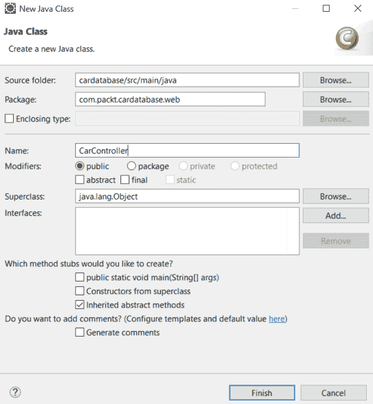
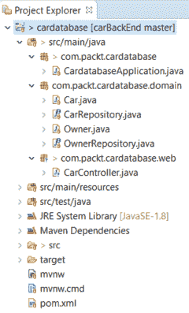
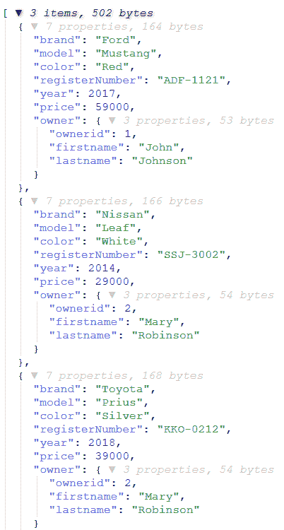
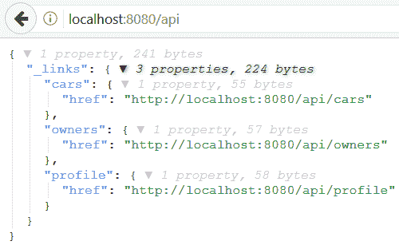
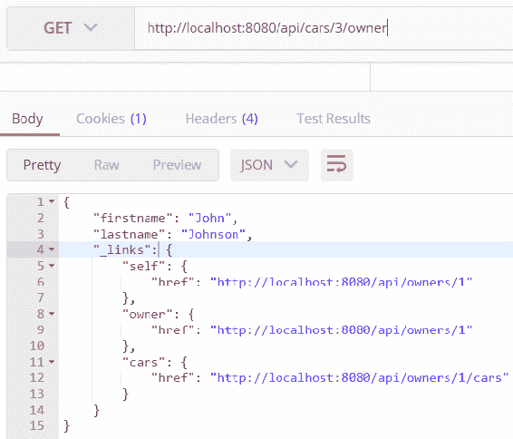
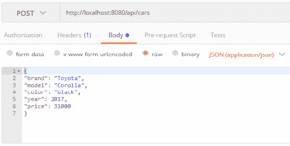
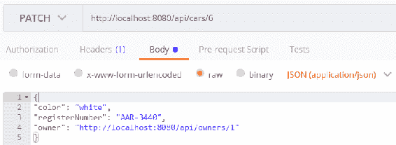
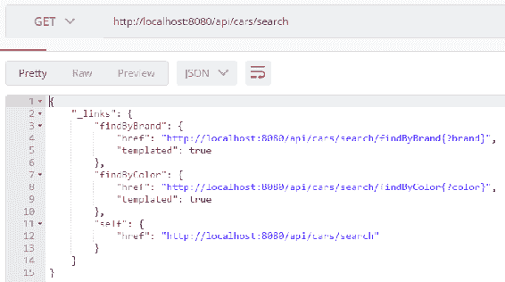

# 使用 Spring Boot 创建 RESTful Web 服务

在本章中，我们将首先使用 controller 类创建一个 RESTful web 服务。之后，我们将演示如何使用 SpringDataREST 创建一个 RESTfulWeb 服务，该服务还自动覆盖所有 CRUD 功能。

在本章中，我们将研究以下内容：

*   RESTfulWeb 服务是什么
*   如何使用 Spring Boot 创建 RESTful web 服务
*   如何测试 RESTful web 服务

# 技术要求

在前几章中创建的 Spring 引导应用程序是必需的。

Postman、cURL 或其他使用各种 HTTP 方法传输数据的合适工具是必要的。

# 使用 Spring Boot 创建 RESTful web 服务

Web 服务是使用 HTTP 协议通过 internet 进行通信的应用程序。有许多不同类型的 web 服务体系结构，但所有设计的主要思想都是相同的。在本书中，我们将从当今非常流行的设计中创建一个 RESTful web 服务。

# 休息的基础

**REST**（**表示性状态转移**是一种用于创建 web 服务的架构样式。REST 不是标准的，但它定义了 Roy Fielding 定义的一组约束。这六个限制条件如下：

*   **无状态**：服务器不保存任何关于客户端状态的信息。
*   **客户机-服务器**：客户机和服务器独立运行。没有客户端的请求，服务器不会发送任何信息。
*   **可缓存**：很多客户端经常请求相同的资源，因此缓存响应以提高性能是非常有用的。
*   **统一接口**：来自不同客户端的请求看起来是一样的。例如，客户端可以是浏览器、Java 应用程序和移动应用程序。
*   **分层系统**：REST 允许我们使用分层系统架构。
*   **按需编码**：这是一个可选约束。

统一接口是一个重要的约束，它定义了每个 REST 体系结构都应该具有以下元素：

*   **资源标识**：存在具有唯一标识符的资源，例如基于 web 的 REST 服务中的 URI。REST 资源应公开易于理解的目录结构 URI。因此，良好的资源命名策略非常重要。
*   **通过表示方式进行资源操作**：当向资源发出请求时，服务器会以该资源的表示方式进行响应。通常，表示的格式是 JSON 或 XML。
*   **自描述性消息**：消息应该有足够的信息，服务器知道如何处理它们。
*   **超媒体和应用状态引擎（HATEOAS）**：响应可以包含指向其他服务领域的链接。

我们将在以下主题中开发的 RESTfulWeb 服务遵循 REST 体系结构原则。

# 创建 RESTful web 服务

在 Spring 引导中，所有 HTTP 请求都由控制器类处理。为了能够创建 RESTful web 服务，首先，我们必须创建一个控制器类。我们将为控制器创建自己的 Java 包：

1.  在 Eclipse 项目资源管理器中激活根包并右键单击。从菜单中选择新建|包装。我们将把我们的新套餐命名为`com.packt.cardatabase.web`：


2.  接下来，我们将在一个新的 web 包中创建一个新的控制器类。在 Eclipse 项目浏览器中激活`com.packt.cardatabase.web`包并右键单击。从菜单中选择新建|类，我们将我们的类命名为`CarController`：



3.  现在，您的项目结构应如以下屏幕截图所示：



如果意外地在错误的包中创建类，可以在 Eclipse 项目资源管理器中的包之间拖放文件。有时，在进行某些更改时，可能无法正确呈现 Eclipse Project Explorer 视图。刷新项目资源管理器有助于（激活项目资源管理器并按*F5*）。

4.  在编辑器窗口中打开控制器类，并在类定义之前添加`@RestController`注释。请参阅以下源代码。`@RestController`注释标识此类将成为 RESTful web 服务的控制器：

```java
      package com.packt.cardatabase.web;

      import org.springframework.web.bind.annotation.RestController;

      @RestController
      public class CarController { 
      }
```

5.  接下来，我们在控制器类中添加一个新方法。该方法使用`@RequestMapping`注释进行注释，该注释定义了该方法映射到的端点。下面，您可以看到示例源代码。在本例中，当用户导航到`/cars`端点时，执行`getCars()`方法：

```
      package com.packt.cardatabase.web;

      import org.springframework.web.bind.annotation.RestController;

      @RestController
      public class CarController {
        @RequestMapping("/cars")
        public Iterable<Car> getCars() {

        } 
      }
```

`getCars()`方法返回所有 car 对象，然后由 Jackson 库将其编组为 JSON 对象。

默认情况下，`@RequestMapping`处理所有 HTTP 方法（`GET`、`PUT`、`POST`等）请求。您可以使用以下`@RequestMapping("/cars", method=GET)`参数定义接受哪种方法。现在，此方法仅处理来自`/cars`端点的`GET`请求。

6.  为了能够从数据库返回车辆，我们必须将我们的`CarRepository`注入控制器。然后，我们可以使用存储库提供的`findAll()`方法获取所有汽车。以下源代码显示了控制器代码：

```
      package com.packt.cardatabase.web;

      import org.springframework.beans.factory.annotation.Autowired;
      import org.springframework.web.bind.annotation.RequestMapping;
      import org.springframework.web.bind.annotation.RestController;

      import com.packt.cardatabase.domain.Car;
      import com.packt.cardatabase.domain.CarRepository;

      @RestController
      public class CarController {
        @Autowired
        private CarRepository repository;

        @RequestMapping("/cars")
        public Iterable<Car> getCars() {
          return repository.findAll();
        }
      }
```

7.  现在，我们已经准备好运行应用程序并导航到`localhost:8080/cars`。我们可以看到出现了一些问题，应用程序似乎处于无限循环中。这是由于我们的汽车和车主表之间的一对多关系造成的。所以，在实践中首先会发生什么，汽车是序列化的，它包含一个所有者，然后被序列化，然后它又包含一个被序列化的汽车。。。等等为了避免这种情况，我们必须在`Owner`类的`cars`字段中添加`@JsonIgnore`注释：

```
      // Owner.java

      @OneToMany(cascade = CascadeType.ALL, mappedBy="owner")
      @JsonIgnore
      private List<Car> cars;
```

8.  现在，当您运行应用程序并导航到`localhost:8080/cars`时，一切都应按预期进行，您将以 JSON 格式从数据库中获取所有车辆，如以下屏幕截图所示：



我们已经完成了第一个 RESTful web 服务，它返回所有的汽车。SpringBoot 提供了一种更强大的创建 RESTfulWeb 服务的方法，这将在下一个主题中进行研究。

# 使用 Spring 数据 REST

SpringDataREST 是 SpringData 项目的一部分。它提供了一种使用 Spring 实现 RESTfulWeb 服务的简单而快速的方法。首先，使用 Spring Data REST，您必须将以下依赖项添加到`pom.xml`文件中：

```
<dependency>
  <groupId>org.springframework.boot</groupId>
  <artifactId>spring-boot-starter-data-rest</artifactId>
</dependency>
```

默认情况下，SpringDataREST 从应用程序中查找所有公共存储库，并为您的实体自动创建 RESTfulWeb 服务。

您可以在`application.properties`文件中定义服务的端点：

```
spring.data.rest.basePath=/api
```

现在您可以从`localhost:8080/api`端点访问 RESTful web 服务。通过调用服务的根端点，它返回可用的资源。Spring Data REST 以**HAL**（**超文本应用程序语言**格式）返回 JSON 数据。HAL 格式提供了一组用 JSON 表示超链接的约定，使 RESTful web 服务更易于前端开发人员使用：



我们可以看到，存在到汽车和车主实体服务的链接。Spring 数据 Rest 服务路径名是从实体名派生的。然后，该名称将被多元化和非资本化。例如，实体汽车服务路径名将命名为`cars`。profile 链接由 springdatarest 生成，它包含特定于应用程序的元数据。

现在，我们开始更仔细地研究不同的服务。有多种工具可用于测试和使用 RESTful Web 服务。在本书中，我们使用的是 Postman，但您可以使用熟悉的工具，如 cURL。Postman 可以作为桌面应用程序或浏览器插件获得。cURL 也可以通过使用 WindowsUbuntuBash 在 Windows10 上使用。

如果您使用`GET`方法向`cars`端点`http://localhost:8080/api/cars`发出请求，您将获得所有`cars`的列表，如下图所示：


在 JSON 响应中，您可以看到有一个`cars`数组，每个 car 都包含特定于 car 的数据。所有的汽车都有`"_links"`属性，这是一个链接的集合，通过这些链接，你可以访问汽车本身或找到车主。要访问一辆特定的汽车，路径将为`http://localhost:8080/api/cars/{id}`。

对`http://localhost:8080/api/cars/3/owner`的请求返回汽车的所有者。该响应现在包含所有者数据、所有者链接以及用户拥有的其他`cars`链接：



Spring 数据 Rest 服务提供所有 CRUD 操作。下表显示了可用于不同 CRUD 操作的 HTTP 方法：

| **HTTP 方式** | **积垢** |
| `GET` | `Read` |
| `POST` | `Create` |
| `PUT`/`PATCH` | `Update` |
| `DELETE` | `Delete` |

接下来，我们将研究如何使用 RESTfulWeb 服务从数据库中删除汽车。在删除操作中，您必须使用`DELETE`方法和指向将被删除车辆的链接（`http://localhost:8080/api/cars/{id}`。下面的屏幕截图显示了如何使用 cURL 删除一辆 ID 为`4`的汽车。在删除请求之后，您可以看到数据库中现在还剩下两辆汽车：


当我们想在数据库中添加新车时，我们必须使用`POST`方法，链接为`http://localhost:8080/api/cars`。表头必须包含值为`Content-Type:application/json`的内容类型字段，新车对象将嵌入请求主体：



响应将发回一个新创建的 car 对象。现在，如果您再次向`http://localhost:8080/api/cars`路径发出`GET`请求，您可以看到数据库中存在新车：


要更新实体，我们必须使用`PATCH`方法和要更新的 car 的链接（`http://localhost:8080/api/cars/{id}`）。标头必须包含值为`Content-Type:application/json`的内容类型字段，并且 car 对象和编辑的数据将在请求正文中给出。如果您使用的是`PATCH`，则只能发送更新字段。如果您使用的是`PUT`，则必须包含所有要请求的字段。让我们编辑我们在上一个示例中创建的汽车。我们将把颜色改为白色，并填写我们留下的空白寄存器号。

我们还将使用 owner 字段将车主链接到汽车。所有者字段的内容是指向所有者的链接（`http://localhost:8080/api/owners/{id}`。以下截图显示了`PATCH`请求内容：



您可以通过`GET`请求获取所有车辆后看到车辆更新：


在上一章中，我们创建了对存储库的查询。这些查询也可以包含在我们的服务中。要包含查询，您必须向 repository 类添加`@RepositoryRestResource`注释。查询参数使用`@Param`注释进行注释。下面的源代码显示了我们的带有这些注释的`CarRepository`：

```
package com.packt.cardatabase.domain;

import java.util.List;

import org.springframework.data.repository.CrudRepository;
import org.springframework.data.repository.query.Param;
import org.springframework.data.rest.core.annotation.RepositoryRestResource;

@RepositoryRestResource
public interface CarRepository extends CrudRepository <Car, Long> {
  // Fetch cars by brand
  List<Car> findByBrand(@Param("brand") String brand);

  // Fetch cars by color
  List<Car> findByColor(@Param("color") String color);
}
```

现在，当您向`http://localhost:8080/api/cars`路径发出`GET`请求时，您可以看到有一个名为`/search`的新端点。调用`http://localhost:8080/api/cars/search`路径返回以下响应：



从响应中，您可以看到这两个查询现在都可以在我们的服务中使用。以下 URL 演示了如何按品牌取车：

```
http://localhost:8080/api/cars/search/findByBrand?brand=Ford
```


# 总结

在本章中，我们使用 SpringBoot 创建了一个 RESTfulWeb 服务。首先，我们创建了一个控制器和一个以 JSON 格式返回所有汽车的方法。接下来，我们使用 SpringDataREST 获得一个具有所有 CRUD 功能的全功能 web 服务。我们讨论了使用我们创建的服务的 CRUD 功能所需的不同类型的请求。最后，我们还将查询包含到服务中。在下一章中，我们将使用 Spring Security 保护后端。

# 问题

1.  什么是休息？
2.  如何使用 SpringBoot 创建 RESTfulWeb 服务？
3.  如何使用我们的 RESTful web 服务获取项目？
4.  如何使用我们的 RESTful web 服务删除项目？
5.  如何使用我们的 RESTful web 服务添加项目？
6.  如何使用我们的 RESTful web 服务更新项目？
7.  如何将查询与我们的 RESTful web 服务结合使用？

# 进一步阅读

Pack 还有其他很好的资源来学习 Spring Boot RESTful Web 服务：

*   [https://www.packtpub.com/application-development/learning-spring-boot-20-second-edition](https://www.packtpub.com/application-development/learning-spring-boot-20-second-edition)
*   [https://www.packtpub.com/web-development/spring-boot-getting-started-integrated-course](https://www.packtpub.com/web-development/spring-boot-getting-started-integrated-course)
*   [https://www.packtpub.com/web-development/building-restful-web-service-spring](https://www.packtpub.com/web-development/building-restful-web-service-spring)