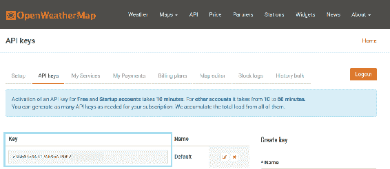
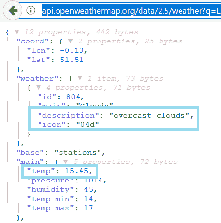
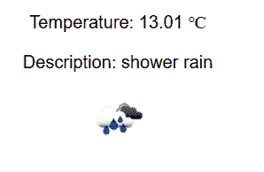
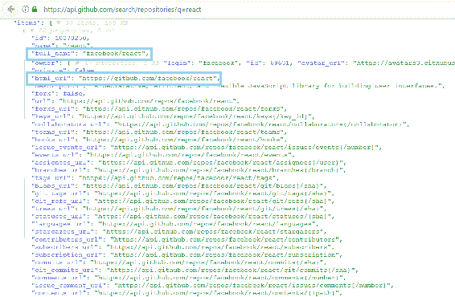
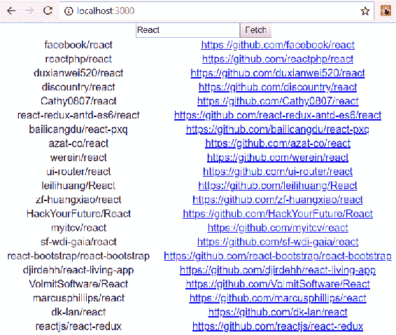

# 使用 React 使用 restapi

本章介绍与 React 的联网。我们将学习承诺，它使异步代码更干净、更可读。对于网络，我们将使用`fetch`库。作为一个示例，我们使用 GitHub REST API 演示如何使用 React 使用 RESTful Web 服务。

在本章中，我们将了解以下内容：

*   使用承诺
*   如何使用 Fetch
*   如何向 RESTAPI 发出请求
*   如何处理来自 RESTAPI 的响应
*   如何创建使用 RESTAPI 的 React 应用程序

# 技术要求

在本书中，我们使用的是 Windows 操作系统，但 Linux 和 macOS 上的所有工具都可以作为 Node.js 使用，并且必须安装`create-react-app`

# 使用承诺

处理异步操作的传统方法是使用回调函数来判断操作的成功与否。根据调用的结果，调用其中一个回调函数。以下示例显示了使用回调函数的想法：

```
function doAsyncCall(success, failure) {
    // Do some api call
    if (SUCCEED)
        success(resp);
    else
        failure(err);
}

success(response) {
    // Do something with response
}

failure(error) {
    // Handle error
}

doAsyncCall(success, failure);
```

承诺是表示异步操作结果的对象。在执行异步调用时，承诺的使用简化了代码。承诺是无阻碍的。

承诺可以处于以下三种状态之一：

*   **未决**：初始状态
*   **完成**：操作成功
*   **拒绝**：操作失败

有了承诺，如果我们使用的 API 支持承诺，我们就可以进行异步调用。在下一个示例中，异步调用完成，当返回响应时，执行`then`中的函数，并将响应作为参数：

```
doAsyncCall()
.then(response => // Do something with the response);
```

您可以将`thens`链接在一起，这意味着您可以一个接一个地运行多个异步操作：

```
doAsyncCall()
.then(response => // Get some result from the response)
.then(result => // Do something with the result);
```

您也可以使用`catch()`将错误处理添加到承诺中：

```
doAsyncCall()
.then(response => // Get some result from the response)
.then(result => // Do something with result);
.catch(error => console.error(error))
```

有一种更现代的方式来处理异步调用，`async`/`await`是在 ECMAScript 2017 中引入的。它还没有像承诺那样受到浏览器的广泛支持。`async`/`await`实际上是基于承诺的。要使用`async`/`await`，必须定义一个可以包含等待表达式的`async`函数。以下是使用`async`/`await`进行异步调用的示例。如您所见，您可以用与同步代码类似的方式编写代码：

```
doAsyncCall = async () => {
    const response = await fetch('http://someapi.com');
    const result = await response.json();
    // Do something with the result
}
```

对于错误处理，您可以将`try…catch`与`async`/`await`一起使用，如下例所示：

```
doAsyncCall = async () => {
  try {
    const response = await fetch('http://someapi.com');
    const result = await response.json();
    // Do something with the result
  }
  catch(err) {
    console.error(err);
  } 
}
```

# 使用 fetchapi

使用 fetchapi，您可以进行 web 请求。Fetch API 的思想与传统的`XMLHttpRequest`类似，但 Fetch API 也支持使其更易于使用的承诺。

Fetch API 提供了一个`fetch()`方法，该方法有一个强制参数，即您正在调用的资源的路径。对于 web 请求，它将是服务的 URL。对于返回 JSON 响应的简单`GET`方法调用，语法如下。`fetch()`方法返回包含响应的承诺。您可以使用`json()`方法从响应中解析 JSON 主体：

```
fetch('http://someapi.com')
.then(response => response.json())
.then(result => console.log(result));
.catch(error => console.error(error))
```

要使用另一个 HTTP 方法，例如`POST`，您可以在`fetch`方法的第二个参数中定义它。第二个参数是可以定义多个请求设置的对象。以下源代码使用`POST`方法发出请求：

```
fetch('http://someapi.com', {method: 'POST'})
.then(response => response.json())
.then(result => console.log(result))
.catch(error => console.error(error));
```

还可以在第二个参数中添加标题。下面的`fetch`调用包含`'Content-Type' : 'application/json'`头：

```
fetch('http://someapi.com', 
 {
  method: 'POST', 
  headers:{'Content-Type': 'application/json'}
 }
.then(response => response.json())
.then(result => console.log(result))
.catch(error => console.error(error));
```

如果必须在请求正文中发送 JSON 编码的数据，语法如下：

```
fetch('http://someapi.com', 
 {
  method: 'POST', 
  headers:{'Content-Type': 'application/json'},
  body: JSON.stringify(data)
 }
.then(response => response.json())
.then(result => console.log(result))
.catch(error => console.error(error));
```

您还可以使用其他库进行网络调用。一个非常受欢迎的图书馆是`axios`（[https://github.com/axios/axios](https://github.com/axios/axios) ），您可以使用 npm 将其安装到 React 应用程序中。axios 有一些好处，比如 JSON 数据的自动转换。下面的代码显示了带有`axios`的示例调用：

```
axios.get('http://someapi.com')
.then(response => console.log(response))
.catch(error => console.log(error));
```

`axios`对不同的 HTTP 方法有自己的调用方法。例如，如果您想要发出`DELETE`请求，`axios`提供`axios.delete`方法。

# 实例

我们将介绍两个使用一些开放 RESTAPI 的示例。首先，我们将制作一个 React 应用程序，显示伦敦当前的天气。天气从**OpenWeatherMap**（[中获取 https://openweathermap.org/](https://openweathermap.org/) ）。您需要注册到 OpenWeatherMap 才能获得 API 密钥。我们将使用免费帐户，因为这足以满足我们的需要。注册后，导航到您的帐户信息以查找 API 密钥选项卡。在这里，您将看到 React weather 应用程序所需的 API 密钥：



让我们用`create-react-app`创建一个新的 React 应用程序。打开 PowerShell 或正在使用的其他终端，然后键入以下命令：

```
create-react-app weatherapp
```

移动到`weatherApp`文件夹：

```
cd weatherapp
```

使用以下命令启动应用程序：

```
npm start
```

使用 VS 代码打开项目文件夹，并在编辑器视图中打开`App.js`文件。移除`<div className="App"></div>`分隔器内的所有代码。现在，您的源代码应该如下所示：

```
import React, { Component } from 'react';
import './App.css';

class App extends Component {
  render() {
    return (
      <div className="App">
      </div>
    );
  }
}

export default App;
```

如果您已经将*Reactjs 代码段*安装到 VS 代码中，您可以通过键入`con`自动创建默认构造函数。对于典型的反应方法，有很多不同的捷径，例如对于`componentDidMount()`，有`cdm`。

首先，我们添加必要的构造函数和状态。我们将在应用程序中显示温度、说明和天气图标，因此，我们定义了三个状态值。我们还将添加一个布尔状态来指示提取加载的状态。以下是构造函数的源代码：

```
  constructor(props) {
    super(props);
    this.state = {temp: 0, desc: '', icon: '', loading: true}
  }
```

当您使用 RESTAPI 时，应该首先检查响应，以便能够从 JSON 数据中获取值。在下面的示例中，您可以看到返回伦敦当前天气的地址。将地址复制到浏览器，您可以看到 JSON 响应数据：

```
api.openweathermap.org/data/2.5/weather?q=London&units=Metric&APIkey=YOUR_KEY
```

从响应中可以看出，`temp`可以通过`main.temp`访问。`description`和`icon`位于`weather`阵列内部，该阵列只有一个元素，我们可以使用`weather[0].description`和`weather[0].icon`访问它：



REST API 调用使用`componentDidMount()`生命周期方法中的`fetch`完成。在成功响应后，我们将天气数据保存到状态，并将`loading`状态更改为`false`。更改状态后，将重新渲染组件。我们将在下一步实施`render()`方法。以下是`componentDidMount()`方法的源代码：

```
  componentDidMount() {
    fetch('http://api.openweathermap.org/data/2.5/weather?
      q=London&units=Metric
      &APIkey=c36b03a963176b9a639859e6cf279299')
    .then(response => response.json()) 
    .then(responseData => {
      this.setState({ 
         temp: responseData.main.temp,
         desc: responseData.weather[0].description,
         icon: responseData.weather[0].icon, 
         loading: false 
       })
     })
     .catch(err => console.error(err)); 
  }
```

添加了`componentDidMount()`方法后，在安装组件时完成请求。我们可以使用 React Developer 工具检查所有操作是否正确完成。在浏览器中打开应用程序，然后打开浏览器开发人员工具的 React 选项卡。现在您可以看到，状态已使用响应中的值进行更新。您还可以从“网络”选项卡检查请求状态是否为“正常”：


最后，我们实现了`render()`方法来显示天气值。我们正在使用条件渲染，否则，我们会得到一个错误，因为我们在第一次渲染调用中没有图像代码，图像上载将不会成功。要显示天气图标，我们必须在图标代码前添加`http://openweathermap.oimg/w/`，在图标代码后添加`.png`。然后，我们可以将连接的图像 URL 设置为`img`元素的`src`属性。温度和说明显示在段落元素中。°C HTML 实体显示摄氏度符号：

```
  render() {
    const imgSrc =    `http://openweathermap.oimg/w/${this.state.icon}.png`;

    if (this.state.loading) {
      return <p>Loading</p>;
    }
 else {
      return (
        <div className="App">
          <p>Temperature: {this.state.temp} °C</p>
          <p>Description: {this.state.desc}</p>
          
        </div>
      );
    }
  }
```

现在你的应用程序应该准备好了。在浏览器中打开时，它应如下图所示：



整个`App.js`文件的源代码如下：

```
import React, { Component } from 'react';
import './App.css';

class App extends Component {
  constructor(props) {
    super(props);
    this.state = {temp: 0, desc: '', icon: ''}
  }

  componentDidMount() {
    fetch('http://api.openweathermap.org/data/2.5/weather?
      q=London&units=Metric&APIkey=YOUR_KEY')
    .then(response => response.json()) 
    .then(responseData => {
      this.setState({ 
         temp: responseData.main.temp,
        desc: responseData.weather[0].description,
        icon: responseData.weather[0].icon 
       }); 
    });
  }

  render() {
    const imgSrc = 'http://openweathermap.oimg/w/' + 
    this.state.icon + '.png';

```

```
    return (
      <div className="App">
        <p>Temperature: {this.state.temp}</p>
        <p>Description: {this.state.desc}</p>
        
      </div>
    );
  }
}

export default App;
```

在第二个示例中，我们将使用 GithubAPI 通过关键字获取存储库。使用与上一示例相同的步骤，创建一个名为`restgithub`的新 React 应用程序。启动应用程序并用 VS 代码打开项目文件夹。

从`App.js`文件中删除`<div className="App"></div>`分隔符内的额外代码，同样，您的`App.js`代码应该类似于以下示例代码：

```
import React, { Component } from 'react';
import './App.css';

class App extends Component {
  render() {
    return (
      <div className="App">
      </div>
    );
  }
}

export default App;
```

GitHub REST API 的 URL 如下所示：

```
https://api.github.com/search/repositories?q=KEYWORD
```

让我们通过在浏览器中键入 URL 并使用`react`关键字来检查 JSON 响应。从响应中，我们可以看到存储库作为名为`items`的 JSON 数组返回。从各个存储库中，我们将显示`full_name`和`html_url`值。我们将在表格中显示数据，并使用`map`函数将值转换为表格行，如前一章所示：



我们将使用来自用户输入的关键字进行 RESTAPI 调用。因此，我们不能在`componentDidMount()`方法中调用 RESTAPI，因为在该阶段，我们没有可用的用户输入。实现这一点的一种方法是创建一个输入字段和按钮。用户在输入字段中键入关键字，按下按钮时完成 RESTAPI 调用。我们需要两个状态，一个用于用户输入，另一个用于 JSON 响应中的数据。以下是`constructor`的源代码。数据状态的类型是数组，因为存储库在响应中作为 JSON 数组返回：

```
  constructor(props) {
    super(props);
    this.state = { keyword: '', data: [] };
  }
```

接下来，我们在`render()`方法中实现输入字段和按钮。我们还必须在输入字段中添加一个更改侦听器，以便能够将输入值保存到状态，称为`keyword`。该按钮具有一个单击侦听器，该侦听器调用将使用给定关键字执行 REST API 调用的函数：

```
  fetchData = () => {
    // REST API call comes here
  }

  handleChange = (e) => {
    this.setState({keyword: e.target.value});
  }

  render() {
    return (
      <div className="App">
        <input type="text" onChange={this.handleChange} />
        <button onClick={this.fetchData} value={this.state.keyword} >Fetch</button>
      </div>
    );
  }
```

在`fetchData`函数中，我们使用模板文本连接`url`和`keyword`状态。然后，我们从对状态的响应中保存`items`数组，称为`data`。以下是`fetchData`功能的源代码：

```
  fetchData = () => {
    const url = `https://api.github.com/search/repositories?
       q=${this.state.keyword}`;
    fetch(url)
    .then(response => response.json()) 
    .then(responseData => {
      this.setState({data : responseData.items }); 
    }); 
  } 
```

在`render`方法中，我们首先使用`map`函数将`data`状态转换为表行。`url`存储库将是链接元素的`href`：

```
  render() {
    const tableRows = this.state.data.map((item, index) => 
      <tr key={index}><td>{item.full_name}</td>
      <td><a href={item.html_url}>{item.html_url}</a></td></tr>); 

    return (
      <div className="App">
        <input type="text" onChange={this.handleChange} />
        <button onClick={this.fetchData} value={this.state.keyword} >Fetch</button>
        <table><tbody>{tableRows}</tbody></table>
      </div>
    );
```

以下屏幕截图显示了在 REST API 调用中使用 React 关键字时的最终应用程序：



整个`App.js`文件的源代码如下：

```
import React, { Component } from 'react';
import './App.css';

class App extends Component {
  constructor(props) {
    super(props);
    this.state = { keyword: '', data: [] };
  }

  fetchData = () => {
    const url = `https://api.github.com/search/repositories?
      q=${this.state.keyword}`;
    fetch(url)
    .then(response => response.json()) 
    .then(responseData => {
      this.setState({data : responseData.items }); 
    }); 
  }

  handleChange = (e) => {
    this.setState({keyword: e.target.value});
  }

  render() {
    const tableRows = this.state.data.map((item, index) => 
      <tr key={index}><td>{item.full_name}</td>
      <td><a href={item.html_url}>{item.html_url}</a></td></tr>); 

    return (
      <div className="App">
        <input type="text" onChange={this.handleChange} />
        <button onClick={this.fetchData} 
        value={this.state.keyword} >Fetch</button>
        <table><tbody>{tableRows}</tbody></table>
      </div>
    );
  }
}
```

# 总结

在本章中，我们将重点介绍与 React 的联网。我们从承诺异步网络调用更容易实现开始。它是一种更干净的处理调用的方法，比使用传统回调函数要好得多。在本书中，我们使用 Fetch API 进行联网，因此我们介绍了使用`fetch`的基础知识。我们实现了两个实际的 React 应用程序，它们调用 openrestapi，并在浏览器中显示响应数据。在下一章中，我们将看到一些有用的 React 组件，我们将在前端中使用它们。

# 问题

1.  什么是承诺？
2.  什么是`fetch`？
3.  您应该如何从 React 应用程序调用 RESTAPI？
4.  您应该如何处理 RESTAPI 调用的响应？

# 进一步阅读

Packt 还有其他学习 React 的好资源：

*   [https://www.packtpub.com/web-development/getting-started-react](https://www.packtpub.com/web-development/getting-started-react)
*   [https://www.packtpub.com/web-development/react-16-essentials-second-edition](https://www.packtpub.com/web-development/react-16-essentials-second-edition)