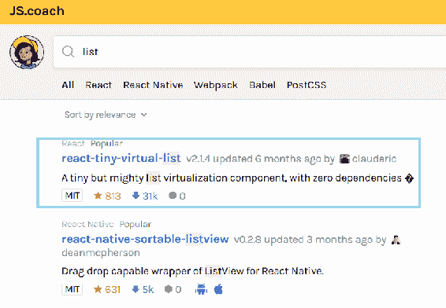
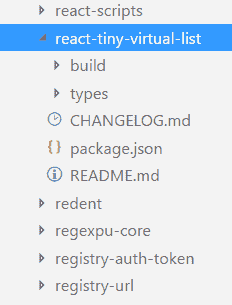
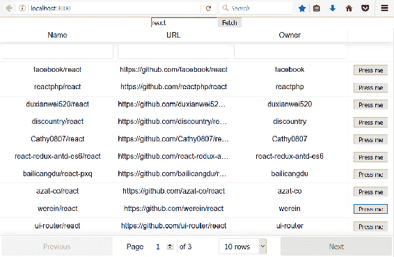
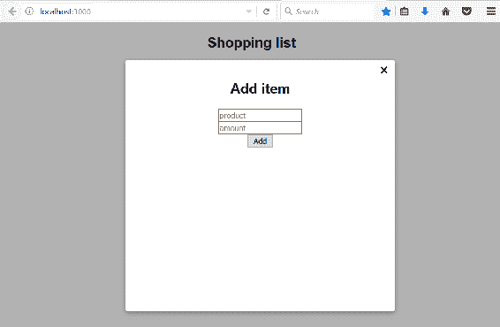
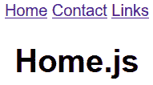

# React 的有用第三方组件

React 是基于组件的，我们可以找到很多有用的第三方组件，可以在我们的应用程序中使用。在本章中，我们将介绍几个将在前端中使用的组件。我们将了解如何找到合适的组件，以及如何在自己的应用程序中使用这些组件。

在本章中，我们将了解以下内容：

*   如何找到第三方组件
*   如何安装组件
*   如何使用 React 表组件
*   如何使用模态窗口组件
*   如何使用材质 UI 组件库
*   如何在 React 中管理路由

# 技术要求

在本书中，我们使用的是 Windows 操作系统，但 Linux 和 macOS 的所有工具都可以作为 Node.js 使用，并且必须安装`create-react-app`。

# 使用第三方组件

有很多好的 React 组件可用于不同的用途。我们的首要任务是找到适合您需求的组件。搜索组件的一个好站点是 JS.coach（[https://js.coach/](https://js.coach/) ）。您只需键入关键字，搜索，然后从框架列表中选择 React。在以下屏幕截图中，您可以看到 React 表格组件的搜索：


React 组件的另一个好来源是 Awesome React 组件（[https://github.com/brillout/awesome-react-components](https://github.com/brillout/awesome-react-components) ）。

组件通常有很好的文档，可以帮助您在自己的 React 应用程序中使用它们。让我们看看如何在应用程序中安装第三方组件并开始使用它。导航到 JS.coach 站点，键入`list`搜索输入字段，并按 React 过滤。从搜索结果中，您可以找到列表组件，称为`react-tiny-virtual-list`：



单击组件链接以查看有关组件的更多详细信息。通常，您可以在那里找到安装说明以及一些如何使用该组件的简单示例。信息页面通常提供组件网站或 GitHub 存储库的地址，您可以在其中找到完整的文档：


从组件的信息页面可以看到，组件的安装是使用`npm`完成的。该命令的语法如下所示：

```java
npm install component_name --save
```

或者，如果您使用的是纱线，则如下所示：

```
yarn add component_name
```

`--save`参数将组件的依赖关系保存到 React 应用程序根文件夹中的`package.json`文件。如果您使用的是 npm 版本 5 或更高版本，则默认情况下会执行此操作，而不使用`--save`参数。对于纱线，您不必指定它，因为默认情况下它保存组件依赖关系。

现在我们将`react-tiny-virtual-list`组件安装到我们在上一章中创建的`myapp`React 应用程序中。您必须移动到应用程序根文件夹并键入以下命令：

```
npm install react-tiny-virtual-list --save
```

如果从应用程序根文件夹打开`package.json`文件，您可以看到该组件现在已添加到依赖项中：

```
{
  "name": "myapp",
  "version": "0.1.0",
  "private": true,
  "dependencies": {
    "react": "^16.3.2",
    "react-dom": "^16.3.2",
    "react-scripts": "1.1.4",
    "react-tiny-virtual-list": "^2.1.4"
  },
  "scripts": {
    "start": "react-scripts start",
    "build": "react-scripts build",
    "test": "react-scripts test --env=jsdom",
    "eject": "react-scripts eject"
  }
}
```

已安装的组件将保存到应用程序中的`node_modules`文件夹中。如果您打开该文件夹，您应该会找到`react-tiny-virtual-list`文件夹：



现在，如果您将 React 应用程序源代码推送到 GitHub，则不应包含`node_modules`，因为该文件夹非常大。`create-react-app`包含`.gitignore`文件，该文件将`node_modules`文件夹从存储库中排除。`.gitignore`文件的内容如下所示：

```
# See https://help.github.com/ignore-files/ for more about ignoring files.

# dependencies
/node_modules

# testing
/coverage

# production
/build

# misc
.DS_Store
.env.local
.env.development.local
.env.test.local
.env.production.local

npm-debug.log*
yarn-debug.log*
yarn-error.log*
```

这个想法是，当你从 GitHub 克隆你的应用程序时，你输入`npm install`命令，从`package.json`文件中读取依赖项并将其下载到你的应用程序中。

开始使用已安装组件的最后一步是将其导入到正在使用的文件中：

```
import VirtualList from 'react-tiny-virtual-list';
```

# 反应台

反应表（[https://react-table.js.org](https://react-table.js.org) 是 React 应用程序的灵活表格组件。它有许多有用的功能，例如过滤、排序和旋转。让我们使用上一章中创建的 GitHub REST API 应用程序：

1.  安装`react-table`组件。打开 PowerShell 并移动到`restgithub`文件夹，该文件夹是应用程序的根文件夹。通过键入以下命令安装组件：

```
 npm install react-table --save
```

2.  打开带有 VS 代码的`App.js`文件，删除`render()`方法中的所有代码，除了包含按钮和输入字段的分隔符的`return`语句。现在，`App.js`文件应该如下所示：

```
      import React, { Component } from 'react';
      import './App.css';

      class App extends Component {
        constructor(props) {
          super(props);
          this.state = { keyword: '', data: [] };
        }

        fetchData = () => {
          const url = `https://api.github.com/search/repositories?
           q=${this.state.keyword}`;
          fetch(url)
```

```
          .then(response => response.json()) 
          .then(responseData => {
            this.setState({data : responseData.items }); 
          }); 
        }

        handleChange = (e) => {
          this.setState({keyword: e.target.value});
        }

        render() {
          return (
            <div className="App">
              <input type="text" onChange={this.handleChange} />
              <button onClick={this.fetchData} value=
               {this.state.keyword} >Fetch</button>
            </div>
          );
        }
      }

      export default App;
```

3.  通过在`App.js`文件开头添加以下行，导入`react-table`组件和样式表：

```
      import ReactTable from "react-table";
      import 'react-table/react-table.css';
```

4.  要用数据填充 React 表，必须将数据道具传递给组件。数据可以是数组或对象，因此我们可以使用我们的状态，称为`data`。使用列道具定义列，并且该道具是必需的：

```
      <ReactTable
        data={data}
        columns={columns}
      />
```

5.  我们将通过在`render()`方法中创建列对象数组来定义列。在列对象中，必须至少定义列的标题和数据访问器。数据访问器值来自 RESTAPI 响应数据。您可以看到我们的响应数据包含一个名为`owner`的对象，我们可以使用`owner.field_name`语法显示这些值：

```
      const columns = [{
         Header: 'Name',  // Header of the column  
         accessor: 'full_name' // Value accessor
        }, {
         Header: 'URL',
         accessor: 'html_url',
        }, {
         Header: 'Owner',
         accessor: 'owner.login',
      }]
```

6.  将 React Table 组件添加到我们的`render()`方法中，该方法的源代码如下所示：

```
      render() {
        const columns = [{
          Header: 'Name', // Header of the column
          accessor: 'full_name' // Value accessor
        }, {
          Header: 'URL',
          accessor: 'html_url',
        }, {
          Header: 'Owner',
          accessor: 'owner.login',
        }]

        return (
          <div className="App">
            <input type="text" onChange={this.handleChange} />
            <button onClick={this.fetchData} 
             value={this.state.keyword} >Fetch</button>
            <ReactTable
              data={this.state.data}
              columns={columns}

            />
          </div>
        );
      }
```

7.  运行应用程序并导航至`localhost:3000`。这张桌子看起来很漂亮。默认情况下，它具有排序和分页功能：


过滤在默认情况下是禁用的，但您可以使用`ReactTable`组件中的`filterable`道具启用过滤。您还可以设置表的页面大小：

```
<ReactTable
   data={this.state.data}
   columns={columns}
   filterable={true}
   defaultPageSize = {10}
/>
```

现在您应该可以在表中看到过滤器元件。您可以使用任何列进行筛选，但也可以选择在列级别设置筛选和排序：


您可以在 React table 网站上找到表格和列的不同道具。

单元格渲染器可用于自定义表格单元格的内容。以下示例显示如何将按钮渲染到表格单元格。单元呈现器中的函数将`value`作为参数传递，在本例中，值将为`full_name`，该值在列的访问器中定义。另一个选项是传递一行，它将整个`row`对象传递给函数。然后您必须定义`btnClick`函数，当按下按钮时会调用该函数，您可以使用发送到该函数的值执行某些操作：

```
render() {
  const columns = [{
    Header: 'Name', // Header of the column
    accessor: 'full_name' // Value accessor
  }, {
    Header: 'URL',
    accessor: 'html_url',
  }, {
    Header: 'Owner',
    accessor: 'owner.login',
  }, {
    id: 'button',
    sortable: false,
    filterable: false,
    width: 100,
    accessor: 'full_name',
```

```
    Cell: ({value}) => (<button className="btn btn-default btn-link" onClick=                            {() => {this.btnClick(value)}}>Press me</button>)
}]
```

以下是带有按钮的表格的屏幕截图：



# 模态窗口组件

当您创建 CRUD 应用程序时，模式窗口非常好。我们将创建一个简单的购物清单应用程序，用户可以使用模式窗口添加新项目。我们将在示例中使用的模态窗口组件是`react-skylight`（[https://marcio.github.io/react-skylight/](https://marcio.github.io/react-skylight/) ：

1.  创建一个名为`shoppinglist`的新 React 应用程序，并使用以下命令安装`react-skylight`：

```
 npm install react-skylight --save
```

2.  打开带有 VS 代码的`app`文件夹，并在代码编辑器中打开`App.js`文件。在`App.js`组件中，我们只需要一个状态来保存购物列表项。一个购物列表项包含两个字段“产品”和“金额”。我们还需要一种向列表中添加新项目的方法。以下是构造函数的源代码以及向列表中添加新项的方法。在`addItem`方法中，我们使用一个扩展符号（`...`，用于在现有数组的开头添加一个新项：

```
      constructor(props) {
        super(props);
        this.state={ items: [] };
      }

      addItem = (item) => {
        this.setState({items: [item, ...this.state.items]});
      }
```

3.  添加用于添加购物项目的新组件。在应用程序的根文件夹中创建一个名为`AddItem.js`的新文件。此组件将使用 React Skylight 模式表单，因此让我们导入`react-skylight`。在`render()`方法中的 React Skylight 组件中，我们将添加两个输入字段（`product`和`amount`，以及一个调用`addItem`函数的按钮。为了能够调用`App.js`组件中的`addItem`函数，我们必须在呈现`AddItem`组件时将其传递到一个道具中。在 React Skylight 组件之外，我们将添加一个按钮，当按下该按钮时，该按钮将打开模态窗体。当组件最初渲染时，此按钮是唯一可见的元素，它调用 React Skylight`show()`方法打开模态窗体。我们还必须处理输入字段的更改事件，以便访问已键入的值。当点击模态窗体内的按钮时，调用`addItem`功能，并使用 React Skylight`hide()`方法关闭模态窗体。该函数从输入字段值创建一个对象，并调用`App.js`组件的`addItem`函数，该函数最终向状态数组添加一个新项，并重新呈现用户界面：

```
import React, { Component } from 'react';
import SkyLight from 'react-skylight';

class AddItem extends Component {
  constructor(props) {
    super(props);
  }

  // Create new shopping item and calls addItem function. 
  // Finally close the modal form
  addItem = () => {
    const item = {product: this.state.product,
     amount: this.state.amount};
    this.props.additem(item);
    this.addform.hide();
  }

  handleChange = (e) => {
    this.setState({[e.target.name]: e.target.value});
  }

  render() {
    return (
      <div>
        <section>
          <button onClick={() => this.addform.show()}>Add
           Item</button>
        </section>
        <SkyLight 
          hideOnOverlayClicked 
          ref={ref => this.addform = ref} 
          title="Add item">
          <input type="text" name="product"
           onChange={this.handleChange} 
           placeholder="product" /><br/>
          <input type="text" name="amount"
           onChange={this.handleChange} 
           placeholder="amount" /><br/>
          <button onClick={this.addItem}>Add</button>
        </SkyLight> 
      </div>
    );
  }
}

export default AddItem;
```

4.  修改`App.js`文件中的`render()`方法。将`AddItem`组件添加到`render()`方法中，并将道具中的`addItem`函数传递给`AddItem`组件。在方法开始时，我们使用`map`功能将项目转换为`listItems`（`<li></li>`）：

```
// App.js
render() {
  const listItems = this.state.items.map((item, index) => 
    <li key={index}>{item.product} {item.amount}</li>)

  return (
    <div className="App">
      <h2>Shopping list</h2>
      <AddItem additem={this.addItem}/>
      <ul>{listItems}</ul>
    </div>
  );
}
```

现在打开应用程序时，您将看到一个空列表和一个用于添加新项目的按钮：


按下“添加项目”按钮时，模式窗体打开：



在输入框中键入一些值，然后按“添加”按钮。模式窗体已关闭，并且可以在列表中看到新项：


# 材质 UI 组件库

Material UI 是实现 Google 材质设计的 React 组件库。它包含许多不同的组件，例如按钮、列表、表格和卡片，您可以使用这些组件来获得一个漂亮、统一的用户界面。我们将继续使用购物清单应用程序，并开始使用 Material UI 设计用户界面：

1.  使用 VS 代码打开购物列表应用程序。通过在根文件夹中键入以下命令，将 Material UI 安装到 PowerShell 或您正在使用的任何合适的终端：

```
npm install @material-ui/core --save

OR with yarn

yarn add @material-ui/core
```

2.  我们已经准备好开始使用 MaterialUI 组件。我们将首先更改`AddItem.js`文件中的按钮，以使用物料界面`Button`组件。我们必须导入`Button`组件，然后在`render()`方法中使用它。`Button`的不同道具可以在物料界面文档中找到：

```
// Import RaisedButton
import RaisedButton from '@material-ui/core/Button';

// Use RaisedButton in render() method
render() {
  return (
    <div>
      <section>
        <Button onClick={() => this.addform.show()} 
         variant="raised" color="primary">
         Add Item</ Button>
      </section>
      <SkyLight 
        hideOnOverlayClicked 
        ref={ref => this.addform = ref} 
        title="Add item">
        <input type="text" name="product" 
         onChange={this.handleChange} 
         placeholder="product" /><br/>
        <input type="text" name="amount" 
         onChange={this.handleChange} 
         placeholder="amount" /><br/>
        <Button onClick={this.addItem} 
         variant="default"  >Add</ Button>
      </SkyLight> 
    </div>
  );
}
```

现在应用程序正在使用`RaisedButton`，看起来是这样的：


3.  将`AddItem.js`中的输入字段更改为使用物料界面`TextField`组件。步骤与按钮相同。导入`TextField`组件，然后在`render()`方法中使用：

```
// Import TextField component
import TextField from '@material-ui/core/TextField';

// Use TextField in render() method
render() {
  return (
    <div>
      <section>
        <Button onClick={() => this.addform.show()} 
         variant="raised" color="primary">
         Add Item</ Button>
      </section>
      <SkyLight 
        hideOnOverlayClicked 
        ref={ref => this.addform = ref} 
        title="Add item">
        <TextField type="text" name="product" 
          onChange={this.handleChange} 
          placeholder="product" /><br/>
        <TextField type="text" name="amount" 
          onChange={this.handleChange} 
          placeholder="amount" /><br/>
        <Button onClick={this.addItem} 
         variant="default"  >Add</ Button>     
      </SkyLight> 
    </div>
  );
}
```

更改后，您的表单应如下所示：


4.  将我们在`App.js`文件中的列表更改为使用物料界面`List`和`ListItem`组件。导入组件，在创建`listItems`的地图功能中使用`ListItem`，并呈现`List`而不是`ul`。我们将在`ListItemText`成分的第二个文本中显示产品的数量：

```
// Import List, ListItem and ListItemText components
import List from '@material-ui/core/List';
import ListItem from '@material-ui/core/ListItem';
import ListItemText from '@material-ui/core/ListItemText';

// Use List and ListItem in render() method
render() {
 // Use ListItem component here instead of li 
    const listItems = this.state.items.map((item, index) => 
     <ListItem key={index}>
     <ListItemText primary={item.product} secondary={item.amount} />
     </ListItem>)
  return (
    <div className="App">
      <h2>Shopping list</h2>
      <AddItem additem={this.addItem}/>
      <List>{listItems}</List>
    </div>
  );
}
```

现在，用户界面如下所示。通过少量工作，用户界面现在变得更加完美：


# 路由

React 中有多种路由解决方案。我们正在使用的最流行的是 React 路由器（[https://github.com/ReactTraining/react-router](https://github.com/ReactTraining/react-router) 。对于 web 应用程序，React Router 提供了一个名为`react-router-dom`的包。

要开始使用 React Router，我们必须使用以下命令安装它：

```
npm install react-router-dom --save
```

`react-router-dom`中有四个不同的组件需要实现路由。`BrowserRouter`是网络应用的路由器。如果给定的位置匹配，`Route`组件呈现定义的组件。以下是`Route`组件的两个示例。当用户导航到`/contact`结束路径时，第一个渲染`Contact`组件。您还可以将内联渲染与`Route`组件一起使用，如第二个示例所示：

```
<Route path="/contact" component={Contact} />
// Route with inline rendering
<Route path="/links" render={() => <h1>Links</h1>} />
```

`Switch`组件包裹多个`Route`组件。`Link`组件为您的应用程序提供导航。以下示例显示了联系人链接，并在单击链接时导航到`/contact`端点：

```
<Link to="/contact">Contact</Link>
```

下面的示例演示如何在实践中使用这些组件。让我们使用`create-react-app`创建一个名为`routerapp`的新 React 应用程序。用 VS 代码打开 app 文件夹，打开`App.js`文件到编辑器视图。从`react-router-dom`包中导入组件，并从呈现方法中删除额外代码。修改后，您的`App.js`源代码应该如下所示：

```
import React, { Component } from 'react';
import './App.css';
import { BrowserRouter, Switch, Route, Link } from 'react-router-dom'

class App extends Component {
  render() {
    return (
      <div className="App">
      </div>
    );
  }
}

export default App;
```

让我们首先创建两个简单的组件，我们可以在路由中使用它们。在应用程序根文件夹中创建两个名为`Home.js`和`Contact.js`的新文件。只向`render()`方法添加标题，以显示组件的名称。请参见部件代码，如下所示：

```
//Contact.js
import React, { Component } from 'react';

class Contact extends Component {
  render() {
    return (
      <div>
        <h1>Contact.js</h1>
      </div>
    );
  }
}

export default Contact;

// Home.js
import React, { Component } from 'react';

class Home extends Component {
  render() {
    return (
      <div>
        <h1>Home.js</h1>
      </div>
    );
  }
}

export default Links;
```

打开`App.js`文件，让我们添加一个路由器，允许我们在组件之间导航：

```
import React, { Component } from 'react';
import './App.css';
import { BrowserRouter, Switch, Route, Link } from 'react-router-dom'
import Contact from './Contact';
import Home from './Home';

class App extends Component {
  render() {
    return (
      <div className="App">
        <BrowserRouter>
          <div>
            <Link to="/">Home</Link>{' '}
            <Link to="/contact">Contact</Link>{' '} 
            <Link to="/links">Links</Link>{' '} 
            <Switch>
              <Route exact path="/" component={Home} />
              <Route path="/contact" component={Contact} />
              <Route path="/links" render={() => <h1>Links</h1>} />
              <Route render={() => <h1>Page not found</h1>} />
            </Switch>
          </div>
        </BrowserRouter>
      </div>
    );
  }
}

export default App;
```

现在，当您启动应用程序时，您将看到链接和`Home`组件，如第一个`Route`组件中定义的根端路径（`localhost:3030/`所示。第一个`Route`组件中的`exact`关键字意味着路径必须完全匹配。如果删除该选项，则路由始终转到`Home`组件：



当按下触点链接时，`Contact`组件被渲染：


# 总结

在本章中，我们学习了如何使用第三方 React 组件。我们熟悉了将在前端使用的几个组件。React Table 是具有内置功能的表组件，例如排序、分页和筛选。React Skylight 是一个模式表单组件，我们将在前端使用它来创建用于添加和编辑项目的表单。Material UI 是一个组件库，提供多个用户界面组件，实现 Google 的材质设计。我们还学习了如何在 React 应用程序中使用 React 路由器进行路由。在下一章中，我们将为前端开发构建一个环境。

# 问题

1.  您应该如何找到 React 的组件？
2.  您应该如何安装组件？
3.  如何使用 React 表组件？
4.  如何使用 React 创建模态形式？
5.  如何使用材质 UI 组件库？
6.  您应该如何在 React 应用程序中实现路由？

# 进一步阅读

Packt 还有其他学习 React 的好资源：

*   [https://www.packtpub.com/web-development/getting-started-react](https://www.packtpub.com/web-development/getting-started-react)
*   [https://www.packtpub.com/web-development/react-16-essentials-second-edition](https://www.packtpub.com/web-development/react-16-essentials-second-edition)