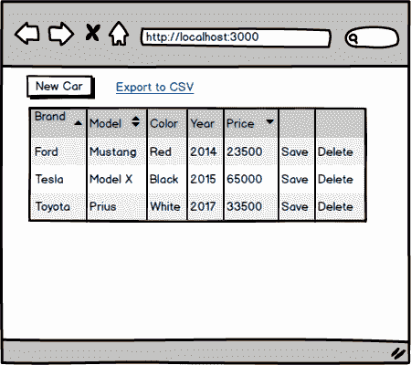
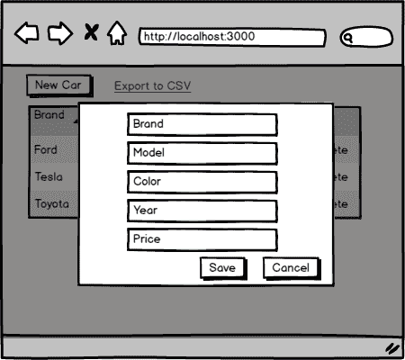

# 为我们的 Spring Boot RESTful Web 服务设置前端

本章介绍开始开发前端部件所需的步骤。我们将首先定义我们正在开发的功能。然后我们将对用户界面进行模拟。作为后端，我们将使用[第 4 章](04.html)*中的 Spring Boot 应用程序来保护和测试您的后端*。我们将使用后端的不安全版本开始开发。最后，我们将创建 React 应用程序，用于前端开发。

在本章中，我们将了解以下内容：

*   为什么以及如何制作模型
*   为前端开发准备 Spring Boot 后端
*   为前端创建 React 应用程序

# 技术要求

我们在[第 4 章](04.html)*中创建的 Spring Boot 应用程序需要保护和测试后端*。

应安装 Node.js 和`create-react-app`。

# 模拟用户界面

在本书的前几章中，我们创建了一个提供 RESTAPI 的汽车数据库后端。现在是开始为我们的应用程序构建前端的时候了。我们将创建一个前端，从数据库中列出汽车，并提供分页、排序和筛选。有一个按钮可以打开模态表单，将新车添加到数据库中。在 car 表的每一行中，都有一个按钮用于从数据库中删除汽车。表行也是可编辑的，可以通过单击行中的“保存”按钮将修改保存到数据库中。前端包含一个链接或按钮，用于将数据从表格导出到 CSV 文件。

让我们从用户界面创建一个模型。创建实体模型有很多不同的应用程序，或者你甚至可以使用铅笔和纸。您还可以创建交互式实体模型来演示某些功能。如果您已经完成了模型，那么在开始编写任何实际代码之前，与客户讨论需求就容易多了。通过模型，客户也更容易理解前端的概念并对其产生影响。与使用真正的前端源代码进行修改相比，对模型的修改非常容易和快速。

以下屏幕截图显示了我们汽车列表前端的模型：



当用户按下新车按钮时打开的模式窗体如下所示：



# 准备 Spring 引导后端

我们正在使用后端的不安全版本开始前端开发。在第一阶段，我们实现所有 CRUD 功能，并测试这些功能是否正常工作。在第二阶段，我们在后端启用安全性并进行必要的修改，最后实现身份验证。

使用 Eclipse 打开 Spring Boot 应用程序，这是我们在[第 4 章](04.html)中创建的*保护和测试后端*中创建的。打开定义 Spring 安全配置的`SecurityConfig.java`文件。暂时注释掉当前配置，并允许每个人访问所有端点。请参见以下修改：

```java
  @Override
  protected void configure(HttpSecurity http) throws Exception {
   // Add this row to allow access to all endpoints
   http.cors().and().authorizeRequests().anyRequest().permitAll(); 

   /* Comment this out
   http.cors().and().authorizeRequests()
     .antMatchers(HttpMethod.POST, "/login").permitAll()
     .anyRequest().authenticated()
     .and()
     // Filter for the api/login requests
     .addFilterBefore(new LoginFilter("/login", authenticationManager()),
             UsernamePasswordAuthenticationFilter.class)
     // Filter for other requests to check JWT in header
     .addFilterBefore(new AuthenticationFilter(),
      UsernamePasswordAuthenticationFilter.class);
     */
    }
```

现在，如果您运行后端并使用 Postman 测试`http:/localhost:8080/api/cars`端点，您应该得到响应中的所有车辆，如以下屏幕截图所示：


# 为前端创建 React 项目

在开始编写前端之前，我们必须创建一个新的 React 应用程序：

1.  打开 PowerShell 或任何其他合适的端子。通过键入以下命令创建新的 React 应用程序：

```
create-react-app carfront
```

2.  通过键入以下命令运行应用程序：

```
npm start
```

或者，如果您正在使用纱线，请键入以下内容：

```
yarn start
```

3.  使用 VS 代码打开`app`文件夹，删除任何额外代码，并更改`App.js`文件的标题文本。修改后的`App.js`文件源代码如下：

```
import React, { Component } from 'react';
import './App.css';

class App extends Component {
  render() {
    return (
      <div className="App">
        <header className="App-header">
          <h1 className="App-title">CarList</h1>
        </header> 
      </div>
    );
  }
}

export default App;
```

4.  我们还可以降低收割台高度，并将颜色更改为`lightblue`。打开`App.css`文件，您可以在其中找到`App.js`文件的样式。将收割台高度从 150 降低到 50，并将颜色更改为`lightblue`：

```
.App-header {
  background-color:lightblue;
  height: 50px;
  padding: 20px;
  color: white;
}
```

现在，前端起点应如下所示：


# 总结

在本章中，我们开始开发前端，使用我们在[第 4 章](04.html)中创建的后端*保护和测试您的后端*。我们定义了前端的功能，并创建了一个用户界面模型。我们使用后端的不安全版本开始前端开发，因此，我们对 Spring 安全配置类进行了一些修改。我们还创建了 React 应用程序，我们将在开发过程中使用它。在下一章中，我们将开始向前端添加 CRUD 功能。

# 问题

1.  为什么要做用户界面的模型？
2.  你应该怎样做一个模型？
3.  如何从后端禁用 Spring 安全性？

# 进一步阅读

Packt 还有其他学习 React 的好资源：

*   [https://www.packtpub.com/web-development/getting-started-react](https://www.packtpub.com/web-development/getting-started-react)
*   [https://www.packtpub.com/web-development/react-16-essentials-second-edition](https://www.packtpub.com/web-development/react-16-essentials-second-edition)