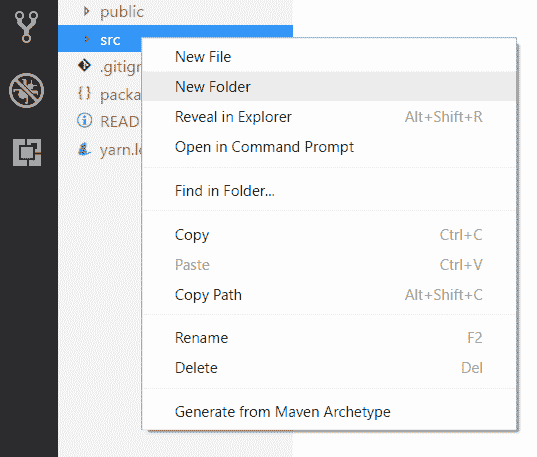
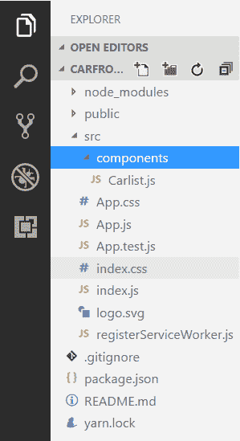
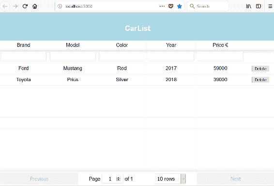
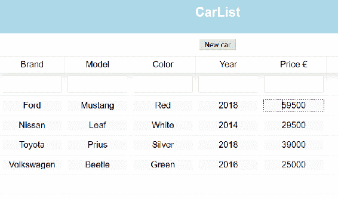

# 十、添加 CRUD 功能

本章介绍如何在前端实现 CRUD 功能。我们将使用我们在[第 8 章](08.html)中学习的组件，*对 React*有用的第三方组件。我们将从后端获取数据，并将数据显示在表中。然后，我们将实现删除、编辑和添加功能。在最后一部分中，我们将添加将数据导出到 CSV 文件的功能。

在本章中，我们将了解以下内容：

*   如何从后端获取数据并在前端显示
*   如何使用 RESTAPI 删除、添加和更新数据
*   如何向用户显示 toast 消息
*   如何从 React 应用将数据导出到 CSV 文件

# 技术要求

我们在[第 4 章](04.html)*中创建的 Spring Boot 应用需要对您的后端*进行保护和测试，并对上一章（不安全的后端）进行修改。

我们还需要上一章中创建的 React 应用（*carfront*。

# 创建列表页面

在第一阶段，我们将创建列表页面，以显示具有分页、过滤和排序功能的汽车。运行您的 Spring Boot 后端，通过向`http://localhost:8080/api/cars`URL 发送`GET`请求即可获取车辆，如[第 3 章](03.html)所示，*使用 Spring Boot*创建 RESTful Web 服务。

让我们检查响应中的 JSON 数据。cars 数组可以在 JSON 响应数据的`_embedded.cars`节点中找到：


现在，一旦我们知道如何从后端获取汽车，我们就可以实现显示汽车的列表页面。以下步骤在实践中描述了这一点：

1.  使用 VS 代码打开*车前*React 应用（上一章中创建的 React 应用）。
2.  当应用有多个组件时，建议为它们创建一个文件夹。在`src`文件夹中创建一个名为`components`的新文件夹。使用 VS 代码，您可以通过右键单击侧栏文件资源管理器中的文件夹并从菜单中选择“新建文件夹”来创建文件夹：



3.  在`components`文件夹中创建一个名为`Carlist.js`的新文件，现在您的项目结构应该如下所示：



4.  在编辑器视图中打开`Carlist.js`文件，编写组件的基本代码，如下图：

```java
import React, { Component } from 'react';

class Carlist extends Component {

  render() {
    return (
      <div></div>
    );
  }
}

export default Carlist;
```

5.  我们需要一个从 REST API 获取的`cars`的状态，因此我们需要添加构造函数并定义一个数组类型的状态值：

```
constructor(props) {
  super(props);
  this.state = { cars: []};
} 
```

6.  在`componentDidMount()`生命周期方法中执行`fetch`。JSON 响应数据中的车辆将保存到状态，称为`cars`：

```
  componentDidMount() {
    fetch('http://localhost:8080/api/cars')
    .then((response) => response.json()) 
    .then((responseData) => { 
      this.setState({ 
        cars: responseData._embedded.cars,
      }); 
    })
    .catch(err => console.error(err)); 
  }
```

7.  在`render()`方法中使用映射功能将`car`对象转换成表行，并添加表元素：

```
render() {
  const tableRows = this.state.cars.map((car, index) => 
    <tr key={index}>
      <td>{car.brand}</td>
      <td>{car.model}</td>
      <td>{car.color}</td>
      <td>{car.year}</td>
      <td>{car.price}</td>
    </tr>
  );

  return (
    <div className="App">
      <table>
        <tbody>{tableRows}</tbody>
      </table>
    </div>
  );
}
```

现在，如果您使用`npm start`命令启动 React 应用，您将看到以下列表页面：


当我们创建更多 CRUD 功能时，URL 服务器可以重复多次，当后端部署到本地主机以外的服务器时，URL 服务器将发生变化。因此，最好将其定义为常数。然后，当 URL 值更改时，我们只需在一个位置修改它。让我们在应用的根文件夹中创建一个名为`constants.js`的新文件。在编辑器中打开文件，并将以下行添加到文件中：

```
export const SERVER_URL = 'http://localhost:8080/'
```

然后，我们将其导入到我们的`Carlist.js`文件中，并在`fetch`方法中使用：

```
//Carlist.js
// Import server url (named import)
import {SERVER_URL} from '../constants.js'

// Use imported constant in the fetch method
fetch(SERVER_URL + 'api/cars')
```

最后，您的`Carlist.js`文件源代码应该如下所示：

```
import React, { Component } from 'react';
import {SERVER_URL} from '../constants.js'

class Carlist extends Component {
  constructor(props) {
    super(props);
    this.state = { cars: []};
  }

  componentDidMount() {
    fetch(SERVER_URL + 'api/cars')
    .then((response) => response.json()) 
    .then((responseData) => { 
      this.setState({ 
        cars: responseData._embedded.cars,
      }); 
    })
    .catch(err => console.error(err)); 
  }

  render() {
    const tableRows = this.state.cars.map((car, index) => 
      <tr key={index}><td>{car.brand}</td>
       <td>{car.model}</td><td>{car.color}</td>
       <td>{car.year}</td><td>{car.price}</td></tr>);

    return (
      <div className="App">
        <table><tbody>{tableRows}</tbody></table>
      </div>
    );
  }
}

export default Carlist;
```

现在，我们将使用 React 表来获得分页、过滤和排序功能。在终端中按*Ctrl*+*C*停止开发服务器，并键入以下命令安装反应表。安装后，重新启动应用：

```
npm install react-table --save
```

将`react-table`和样式表导入您的`Carlist.js`文件：

```
import ReactTable from "react-table";
import 'react-table/react-table.css';
```

然后将`table`和`tableRows`从`render()`方法中移除。反应表的`data`属性为`this.state.cars`，包含取车信息。我们还必须定义表的`columns`，其中`accessor`是`car`对象的字段，`header`是标题的文本。为了启用过滤，我们将表的`filterable`属性设置为`true`。参见以下`render()`方法的源代码：

```
  render() {
    const columns = [{
      Header: 'Brand',
      accessor: 'brand'
    }, {
      Header: 'Model',
      accessor: 'model',
    }, {
      Header: 'Color',
      accessor: 'color',
    }, {
      Header: 'Year',
      accessor: 'year',
    }, {
      Header: 'Price €',
      accessor: 'price',
    },]

    return (
      <div className="App">
        <ReactTable data={this.state.cars} columns={columns} 
          filterable={true}/>
      </div>
    );
  }
```

使用 React 表组件，我们通过少量的编码获得了表的所有必要特性。现在，列表页面如下所示：


# 删除功能

通过向`http://localhost:8080/api/cars/[carid]`端点发送`DELETE`方法请求，可以从数据库中删除项目。如果我们查看 JSON 响应数据，我们可以看到每辆车都包含一个指向自身的链接，并且可以从`_links.self.href`节点访问它，如下面的屏幕截图所示：


以下步骤显示了如何实现删除功能：

1.  我们将为表中的每一行创建一个按钮，该按钮的访问器将是`_links.self.href`，我们可以使用它调用我们即将创建的删除函数。但首先，使用`Cell`向表中添加一个新列来呈现按钮。请参阅以下源代码。我们不想为按钮栏启用排序和过滤，因此这些道具设置为`false`。按下该按钮时，将调用`onDelClick`功能，并将链接发送至汽车作为参数：

```
  const columns = [{
    Header: 'Brand',
    accessor: 'brand'
  }, {
    Header: 'Model',
    accessor: 'model',
  }, {
    Header: 'Color',
    accessor: 'color',
  }, {
    Header: 'Year',
    accessor: 'year',
  }, {
    Header: 'Price €',
    accessor: 'price',
  }, {
    id: 'delbutton',
    sortable: false,
    filterable: false,
    width: 100,
    accessor: '_links.self.href',
    Cell: ({value}) => (<button onClick={()=>{this.onDelClick(value)}}>Delete</button>)
  }]
```

2.  执行`onDelClick`功能。但是首先，让我们从`componentDidMount()`方法中去掉`fetchCars`函数。这是必需的，因为我们想在删除汽车后调用`fetchCars`函数，向用户显示更新的汽车列表。创建一个名为`fetchCars()`的新函数，并将代码从`componentDidMount()`方法复制到一个新函数中。然后从`componentDidMount()`函数调用`fetchCars()`函数，开始取车：

```
componentDidMount() {
  this.fetchCars();
}

fetchCars = () => {
  fetch(SERVER_URL + 'api/cars')
  .then((response) => response.json()) 
  .then((responseData) => { 
    this.setState({ 
      cars: responseData._embedded.cars,
    }); 
  })
  .catch(err => console.error(err)); 
}
```

3.  执行`onDelClick`功能。我们将`DELETE`请求发送到一个汽车链接，当删除成功时，我们通过调用`fetchCars()`函数刷新列表页面：

```
// Delete car
onDelClick = (link) => {
  fetch(link, {method: 'DELETE'})
  .then(res => this.fetchCars())
  .catch(err => console.error(err)) 
}
```

启动应用时，前端应如以下屏幕截图所示，按下“删除”按钮时，车辆将从列表中消失：



如果成功删除或有任何错误，最好向用户显示一些反馈。让我们实现一个 toast 消息来显示删除状态。为此，我们将使用`react-toastify`组件（[https://github.com/fkhadra/react-toastify](https://github.com/fkhadra/react-toastify) 。通过在您使用的终端中键入以下命令来安装组件：

```
npm install react-toastify --save
```

安装完成后，启动应用并在编辑器中打开`Carlist.js`文件。我们必须导入`ToastContainer`、`toast`和样式表才能开始使用`react-toastify`。将以下导入语句添加到您的`Carlist.js`文件中：

```
import { ToastContainer, toast } from 'react-toastify';
import 'react-toastify/dist/ReactToastify.css';
```

`ToastContainer`是显示 toast 消息的容器组件，应该在`render()`方法中。在`ToastContainer`中，您可以使用`autoClose`属性以毫秒为单位定义 toast 消息的持续时间。在`render()`方法的 return 语句中，在`ReactTable`之后添加`ToastContainer`组件：

```
return (
  <div className="App">
     <ReactTable data={this.state.cars} columns={columns} 
       filterable={true}/>
     <ToastContainer autoClose={1500} } /> 
   </div>
);
```

然后，我们将在`onDelClick()`函数中调用 toast 方法来显示 toast 消息。您可以定义消息的类型和位置。删除成功时显示成功消息，错误时显示错误消息：

```
// Delete car
onDelClick = (link) => {
  fetch(link, {method: 'DELETE'})
  .then(res => {
    toast.success("Car deleted", {
      position: toast.POSITION.BOTTOM_LEFT
    });
    this.fetchCars();
  })
  .catch(err => {
    toast.error("Error when deleting", {
      position: toast.POSITION.BOTTOM_LEFT
    });
    console.error(err)
  }) 
 }
```

现在，当汽车被删除时，您将看到 toast 消息，如以下屏幕截图所示：


为了避免意外删除汽车，最好在按下删除按钮后有一个确认对话框。我们将使用`react-confirm-alert`组件（[实现此功能 https://github.com/GA-MO/react-confirm-alert](https://github.com/GA-MO/react-confirm-alert) ）。如果您的应用正在运行，请在终端中按*Ctrl*+*C*停止开发服务器，并键入以下命令安装`react-confirm-alert`。安装后，重新启动应用：

```
npm install react-confirm-alert --save
```

将`confirmAlert`和 CSS 文件导入`Carlist`组件：

```
import { confirmAlert } from 'react-confirm-alert';
import 'react-confirm-alert/src/react-confirm-alert.css' 
```

创建一个名为`confirmDelete`的新函数，打开确认对话框。如果按下对话框的“是”按钮，则调用`onDelClick`功能，车辆将被删除：

```
confirmDelete = (link) => {
  confirmAlert({
    message: 'Are you sure to delete?',
    buttons: [
      {
        label: 'Yes',
        onClick: () => this.onDelClick(link)
      },
      {
        label: 'No',
      }
    ]
  })
}
```

然后，将删除按钮的`onClick`事件中的功能更改为`confirmDelete`：

```
render() {
  const columns = [{
    Header: 'Brand',
    accessor: 'brand',
  }, {
    Header: 'Model',
    accessor: 'model',
  }, {
    Header: 'Color',
    accessor: 'color',
  }, {
    Header: 'Year',
    accessor: 'year',
  }, {
    Header: 'Price €',
    accessor: 'price',
  }, {
    id: 'delbutton',
    sortable: false,
    filterable: false,
    width: 100,
    accessor: '_links.self.href',
    Cell: ({value}) => (<button onClick=
      {()=>{this.confirmDelete(value)}}>Delete</button>)
  }]
```

如果现在按 Delete（删除）按钮，确认对话框将打开，只有按 Yes（是）按钮，车辆才会被删除：


# 添加功能

下一步是为前端创建添加功能。我们将使用 React Skylight 模式组件实现该功能。我们已经在[第 8 章](08.html)中介绍了 React 天窗的使用，*React*的有用第三方 React 组件。我们将向用户界面添加 New Car 按钮，当按下该按钮时，会打开模式窗体。模式表单包含保存汽车所需的所有字段以及用于保存和取消的按钮。

在终端中按*Ctrl*+*C*停止开发服务器，输入以下命令安装 React 天窗。安装后，重新启动应用：

```
npm install react-skylight --save 
```

以下步骤显示了如何使用模态表单组件创建添加功能：

1.  在`components`文件夹中创建一个名为`AddCar.js`的新文件，并在该文件中写入一个组件类基代码，如下所示。添加`react-skylight`组件的导入：

```
import React from 'react';
import SkyLight from 'react-skylight';

class AddCar extends React.Component {
  render() {
    return (
      <div>
      </div> 
    );
  }
}

export default AddCar;
```

2.  引入一个包含所有 car 字段的状态：

```
constructor(props) {
   super(props);
   this.state = {brand: '', model: '', year: '', color: '', price: ''};
}
```

3.  在`render()`方法中添加一个表单。表单包含带按钮的`ReactSkylight`模态表单组件和收集车辆数据所需的输入字段。打开模式窗口并显示在 carlist 页面的按钮必须位于`ReactSkylight`之外。所有输入字段都应具有`name`属性，其值应与将保存该值的状态名称相同。输入字段也有`onChange`处理程序，它通过调用`handleChange`函数将值保存到状态：

```
handleChange = (event) => {
   this.setState(
     {[event.target.name]: event.target.value}
   );
}

render() {
    return (
      <div>
        <SkyLight hideOnOverlayClicked ref="addDialog">
          <h3>New car</h3>
          <form>
            <input type="text" placeholder="Brand" name="brand" 
              onChange={this.handleChange}/><br/> 
            <input type="text" placeholder="Model" name="model" 
              onChange={this.handleChange}/><br/>
            <input type="text" placeholder="Color" name="color" 
              onChange={this.handleChange}/><br/>
            <input type="text" placeholder="Year" name="year" 
              onChange={this.handleChange}/><br/>
            <input type="text" placeholder="Price" name="price" 
              onChange={this.handleChange}/><br/>
            <button onClick={this.handleSubmit}>Save</button>
            <button onClick={this.cancelSubmit}>Cancel</button>     
          </form> 
        </SkyLight>
        <div>
            <button style={{'margin': '10px'}} 
              onClick={() => this.refs.addDialog.show()}>New car</button>
        </div>
      </div> 
    );
```

4.  将`AddCar`组件插入`Carlist`组件，查看该表单是否可以打开。打开`Carlist.js`文件到编辑器视图，导入`AddCar`组件：

```
import AddCar from './AddCar.js';
```

5.  对将`POST`请求发送到后端`api/cars`端点的`Carlist.js`文件执行`addCar`功能。请求将包括主体内的新`car`对象和`'Content-Type': 'application/json'`标题。由于使用`JSON.stringify()`方法将`car`对象转换为 JSON 格式，因此需要标头：

```
// Add new car
addCar(car) {
  fetch(SERVER_URL + 'api/cars', 
    { method: 'POST', 
      headers: {
        'Content-Type': 'application/json',
      },
      body: JSON.stringify(car)
    })
  .then(res => this.fetchCars())
  .catch(err => console.error(err))
} 
```

6.  将`AddCar`组件添加到`render()`方法中，并将`addCar`和`fetchCars`函数作为道具传递给`AddCar`组件，该组件允许我们从`AddCar`组件调用这些函数。现在`CarList.js`文件的 return 语句应该如下所示：

```
// Carlist.js 
return (
  <div className="App">
    <AddCar addCar={this.addCar} fetchCars={this.fetchCars}/>
    <ReactTable data={this.state.cars} columns={columns} 
      filterable={true} pageSize={10}/>
    <ToastContainer autoClose={1500}/> 
  </div>
);
```

如果您启动前端应用，它现在应该如下所示，如果您按下新车按钮，它应该打开模式窗体：


7.  对`AddCar.js`文件执行`handleSubmit`和`cancelSubmit`功能。`handleSubmit`函数创建一个新的`car`对象并调用`addCar`函数，可以使用道具访问该函数。`cancelSubmit`功能只是关闭模态形式：

```
// Save car and close modal form
handleSubmit = (event) => {
   event.preventDefault();
   var newCar = {brand: this.state.brand, model: this.state.model, 
     color: this.state.color, year: this.state.year, 
     price: this.state.price};
   this.props.addCar(newCar); 
   this.refs.addDialog.hide(); 
}

// Cancel and close modal form
cancelSubmit = (event) => {
  event.preventDefault(); 
  this.refs.addDialog.hide(); 
}
```

现在，您可以按 New Car 按钮打开模式窗体。然后，您可以用数据填充表单，然后按下保存按钮。到目前为止，表单看起来并不美观，但我们将在下一章中对其进行样式设计：


列表页面被刷新，可以在列表中看到新车：


# 编辑功能

我们将通过将表格更改为可编辑并向每行添加保存按钮来实现编辑功能。保存按钮将调用向后端发送`PUT`请求以保存对数据库的更改的功能：

1.  添加单元格渲染器，将表格单元格更改为可编辑。打开`Carlist.js`文件，创建一个名为`renderEditable`的新函数。请参阅以下函数的源代码。单元格将是`div`元素，`contentEditable`属性使其可编辑。`suppressContentEditableWarning`抑制带有子元素的元素标记为可编辑时出现的警告。`onBlur`中的函数是在用户离开表格单元格时执行的，我们将在这里更新状态：

```
renderEditable = (cellInfo) => {
  return (
    <div
      style={{ backgroundColor: "#fafafa" }}
      contentEditable
      suppressContentEditableWarning
      onBlur={e => {
        const data = [...this.state.cars];
        data[cellInfo.index][cellInfo.column.id] = 
         e.target.innerHTML;
        this.setState({ cars: data });
      }}
      dangerouslySetInnerHTML={{
        __html: this.state.cars[cellInfo.index][cellInfo.column.id]
      }} 
    />
  );
} 
```

2.  定义要编辑的表列。这是使用 React 表中列的`Cell`属性完成的，该属性定义了列的单元格将如何呈现：

```
const columns = [{
  Header: 'Brand',
  accessor: 'brand',
  Cell: this.renderEditable
}, {
  Header: 'Model',
  accessor: 'model',
  Cell: this.renderEditable
}, {
  Header: 'Color',
  accessor: 'color',
  Cell: this.renderEditable
}, {
  Header: 'Year',
  accessor: 'year',
  Cell: this.renderEditable
}, {
  Header: 'Price €',
  accessor: 'price',
  Cell: this.renderEditable
}, {
  id: 'delbutton',
  sortable: false,
  filterable: false,
  width: 100,
  accessor: '_links.self.href',
  Cell: ({value}) => (<button onClick={()=>{this.onDelClick(value)}}>Delete</button>)
}]
```

现在，如果在浏览器中打开应用，可以看到表格单元格是可编辑的：



3.  要更新汽车数据，我们必须将`PUT`请求发送到`http://localhost:8080/api/cars/[carid]`URL。该链接将与删除功能相同。该请求包含体内更新的`car`对象，以及我们在添加功能中使用的`'Content-Type': 'application/json'`头。创建一个名为`updateCar`的新函数，该函数的源代码显示在下面的代码段中。函数获取两个参数，更新的`car`对象和请求 URL。成功更新后，我们将向用户显示 toast 消息：

```
// Update car
updateCar(car, link) {
  fetch(link, 
  { method: 'PUT', 
    headers: {
      'Content-Type': 'application/json',
    },
    body: JSON.stringify(car)
  })
  .then( res =>
    toast.success("Changes saved", {
      position: toast.POSITION.BOTTOM_LEFT
    }) 
  )
  .catch( err => 
    toast.error("Error when saving", {
      position: toast.POSITION.BOTTOM_LEFT
    }) 
  )
}
```

4.  将“保存”按钮添加到表行中。当用户按下按钮时，它调用`updateCar`函数并传递两个参数。第一个参数是`row`，它是行中所有值的一个`object (=car object)`。第二个参数是`value`，设置为`_links.href.self`，这将是我们在请求中需要的汽车的 URL：

```
const columns = [{
  Header: 'Brand',
  accessor: 'brand',
  Cell: this.renderEditable
}, {
  Header: 'Model',
  accessor: 'model',
  Cell: this.renderEditable
}, {
  Header: 'Color',
  accessor: 'color',
  Cell: this.renderEditable
}, {
  Header: 'Year',
  accessor: 'year',
  Cell: this.renderEditable
}, {
  Header: 'Price €',
  accessor: 'price',
  Cell: this.renderEditable
}, {
  id: 'savebutton',
  sortable: false,
  filterable: false,
  width: 100,
  accessor: '_links.self.href',
  Cell: ({value, row}) => 
    (<button onClick={()=>{this.updateCar(row, value)}}>
     Save</button>)
}, {
  id: 'delbutton',
  sortable: false,
  filterable: false,
  width: 100,
  accessor: '_links.self.href',
  Cell: ({value}) => (<button onClick=
    {()=>{this.onDelClick(value)}}>Delete</button>)
}]
```

如果您现在编辑表中的值并按下`Save`按钮，您将看到 toast 消息，更新后的值将保存到数据库中：


# 其他功能

我们还将实现的一个功能是 CSV 数据导出。有一个包，名为`react-csv`（[https://github.com/abdennour/react-csv](https://github.com/abdennour/react-csv) ），可用于将数据数组导出到 CSV 文件。

如果您的应用已启动，请在终端中按*Ctrl*+*C*停止开发服务器，并键入以下命令安装`react-csv`。安装后，重新启动应用：

```
npm install react-csv --save
```

`react-csv`包包含两个组件—`CSVLink`和`CSVDownload`。我们将在我们的应用中使用第一个，因此将以下导入添加到`Carlist.js`文件中：

```
import { CSVLink } from 'react-csv';
```

`CSVLink`组件采用`data`属性，该属性包含将导出到 CSV 文件的数据数组。您还可以使用`separator`属性定义数据分隔符（默认分隔符为逗号）。在`render()`方法的`return`语句中添加`CSVLink`组件。`data`道具的值现在将为`this.state.cars`：

```
// Carlist.js render() method
return (
  <div className="App">
    <CSVLink data={this.state.cars} separator=";">Export CSV</CSVLink>
    <AddCar addCar={this.addCar} fetchCars={this.fetchCars}/>
    <ReactTable data={this.state.cars} columns={columns} 
       filterable={true} pageSize={10}/>
    <ToastContainer autoClose={6500}/> 
  </div>
);
```

在浏览器中打开应用，您将在我们的应用中看到导出 CSV 链接。样式不好，但我们将在下一章中处理。如果按链接，您将获得 CSV 文件中的数据：


现在所有的功能都已经实现了。

# 总结

在本章中，我们实现了应用的所有功能。我们首先从后端获取汽车，并在 React 表中显示这些汽车，React 表提供分页、排序和过滤功能。然后，我们实现了删除功能，并使用 toast 组件向用户提供反馈。添加功能是使用 React Skylight 模式表单组件实现的。在编辑功能中，我们使用了 React Table 特性，使表格可编辑。最后，我们实现了将数据导出到 CSV 文件的功能。在下一章中，我们将开始使用 MaterialUI 组件库完善我们的用户界面。在下一章中，我们将使用 React Material UI 组件库设计前端的样式。

# 问题

1.  您应该如何使用 restapi 和 React 来获取和显示数据？
2.  如何使用 restapi 和 React 删除数据？
3.  如何使用 restapi 和 React 添加数据？
4.  如何使用 restapi 和 React 更新数据？
5.  您应该如何用 React 显示祝酒词？
6.  如何使用 React 将数据导出到 CSV 文件？

# 进一步阅读

Packt 还有其他学习 React 的好资源：

*   [https://www.packtpub.com/web-development/getting-started-react](https://www.packtpub.com/web-development/getting-started-react)
*   [https://www.packtpub.com/web-development/react-16-essentials-second-edition](https://www.packtpub.com/web-development/react-16-essentials-second-edition)