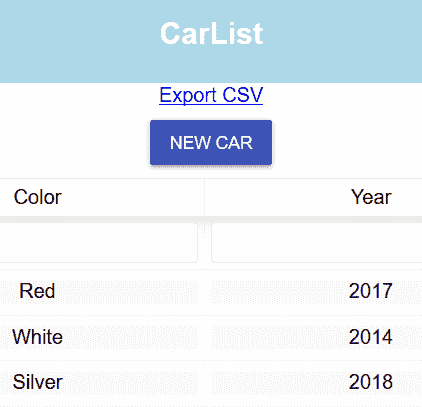
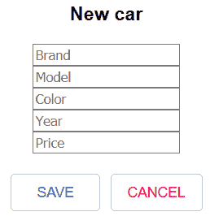
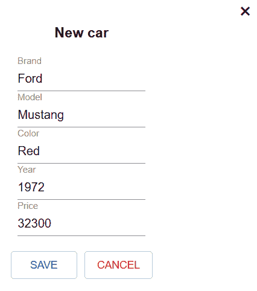
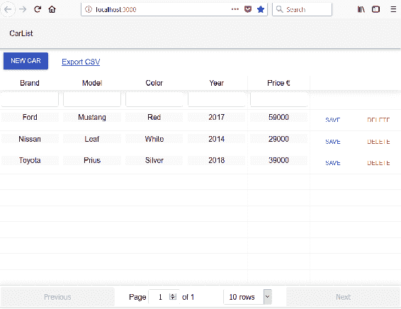

# 使用 React 材质 UI 设置前端样式

本章介绍如何在前端使用 Material UI 组件。我们将使用`Button`组件来显示样式化的按钮。模态形式输入字段被`TextField`组件所取代，这些组件具有许多好的特性。Material UI 提供了`Snackbar`组件，可以向最终用户显示 toast 消息。我们将`react-toastify`组件替换为`Snackbar`以获得统一的外观。最后，我们使用`AppBar`组件代替 React 应用程序头。

在本章中，我们将了解以下内容：

*   什么是材料界面？
*   如何在前端使用 Material UI 组件
*   如何删除 React 应用程序中未使用的组件

# 技术要求

我们在[第 4 章](04.html)*保护和测试后端*中创建的 Spring Boot 应用程序需要经过上一章（不安全后端）的修改。

我们还需要上一章中使用的 React 应用程序（*carfront*。

# 使用按钮组件

在正在使用的终端中键入以下命令并在安装完成后启动应用程序，以安装 Material UI：

```java
npm install @material-ui/core --save
```

让我们首先更改所有按钮以使用 Material UI`Button`组件。将`Button`导入`AddCar.js`文件：

```
// AddCar.js
import Button from '@material-ui/core/Button';
```

更改按钮以使用`Button`组件。在列表页面中，我们使用主按钮，在模式表单中使用大纲按钮：

```
  render() {
    return (
      <div>
        <SkyLight hideOnOverlayClicked ref="addDialog">
          <h3>New car</h3>
          <form>
            <input type="text" placeholder="Brand" name="brand" 
            onChange={this.handleChange}/><br/> 
            <input type="text" placeholder="Model" name="model" 
            onChange={this.handleChange}/><br/>
            <input type="text" placeholder="Color" name="color" 
            onChange={this.handleChange}/><br/>
            <input type="text" placeholder="Year" name="year" 
            onChange={this.handleChange}/><br/>
            <input type="text" placeholder="Price" name="price" 
            onChange={this.handleChange}/><br/><br/>
            <Button variant="outlined" color="primary" 
            onClick={this.handleSubmit}>Save</Button> 
            <Button variant="outlined" color="secondary" 
            onClick={this.cancelSubmit}>Cancel</Button> 
          </form> 
        </SkyLight>
        <div>
            <Button variant="raised" color="primary" 
            style={{'margin': '10px'}} 
            onClick={() => this.refs.addDialog.show()}>
            New Car</Button>
        </div>
      </div> 
    );
```

现在，列表页面按钮应如下所示：



模式窗体按钮应如下所示：



我们使用 car 表中的扁平变型按钮，并将按钮大小定义为小。有关表列，请参阅以下源代码：

```
// Carlist.js render() method
const columns = [{
  Header: 'Brand',
  accessor: 'brand',
  Cell: this.renderEditable
}, {
  Header: 'Model',
  accessor: 'model',
  Cell: this.renderEditable
}, {
  Header: 'Color',
  accessor: 'color',
  Cell: this.renderEditable
}, {
  Header: 'Year',
  accessor: 'year',
  Cell: this.renderEditable
}, {
  Header: 'Price €',
  accessor: 'price',
  Cell: this.renderEditable
}, {
  id: 'savebutton',
  sortable: false,
  filterable: false,
  width: 100,
  accessor: '_links.self.href',
  Cell: ({value, row}) => (<Button size="small" variant="flat" color="primary" 
    onClick={()=>{this.updateCar(row, value)}}>Save</Button>)
}, {
  id: 'delbutton',
  sortable: false,
  filterable: false,
  width: 100,
  accessor: '_links.self.href',
  Cell: ({value}) => (<Button size="small" variant="flat" color="secondary" 
    onClick={()=>{this.confirmDelete(value)}}>Delete</Button>)
}]
```

现在，该表应如下所示：


# 使用网格组件

Material UI 提供了一个`Grid`组件，可用于获取 React 应用程序的网格布局。我们将使用`Grid`在同一行上获取新项目按钮和导出 CSV 链接。

将以下导入添加到`Carlist.js`文件以导入`Grid`组件：

```
import Grid from '@material-ui/core/Grid';
```

接下来，我们将`AddCar`和`CSVLink`包裹在`Grid`组件中。有两种类型的`Grid`组件—容器和物品。这两个组件都包裹在物品的`Grid`组件中。然后将两个项目的`Grid`组件包裹在容器的`Grid`组件内：

```
// Carlist.js render() method
return (
  <div className="App">
    <Grid container>
      <Grid item>
        <AddCar addCar={this.addCar} fetchCars={this.fetchCars}/>
      </Grid>
      <Grid item style={{padding: 20}}>
         <CSVLink data={this.state.cars} separator=";">Export CSV</CSVLink>
      </Grid>
    </Grid>

    <ReactTable data={this.state.cars} columns={columns} 
      filterable={true} pageSize={10}/>
    <ToastContainer autoClose={1500}/> 
  </div>
);
```

现在，您的应用程序应该如下所示，按钮现在放在一行中：


# 使用 TextField 组件

在本节中，我们将使用 Material UI`TextField`组件更改模态表单中的文本输入。将以下导入语句添加到`AddCar.js`文件中：

```
import TextField from '@material-ui/core/TextField';
```

然后，将输入更改为表单中的`TextField`组件。我们正在使用`label`道具设置`TextField`组件的标签：

```
render() {
  return (
    <div>
      <SkyLight hideOnOverlayClicked ref="addDialog">
        <h3>New car</h3>
        <form>
          <TextField label="Brand" placeholder="Brand" 
            name="brand" onChange={this.handleChange}/><br/> 
          <TextField label="Model" placeholder="Model" 
            name="model" onChange={this.handleChange}/><br/>
          <TextField label="Color" placeholder="Color" 
            name="color" onChange={this.handleChange}/><br/>
          <TextField label="Year" placeholder="Year" 
            name="year" onChange={this.handleChange}/><br/>
          <TextField label="Price" placeholder="Price" 
            name="price" onChange={this.handleChange}/><br/><br/>
          <Button variant="outlined" color="primary" 
            onClick={this.handleSubmit}>Save</Button> 
          <Button variant="outlined" color="secondary" 
            onClick={this.cancelSubmit}>Cancel</Button> 
        </form> 
      </SkyLight>
      <div>
         <Button variant="raised" color="primary" 
            style={{'margin': '10px'}} 
            onClick={() => this.refs.addDialog.show()}>New Car</Button>
      </div>
    </div> 
  );
```

修改后，模态形式应如下所示：



# 使用 AppBar 组件

在本节中，我们将使用`AppBar`组件替换 React 应用程序头。导入`AppBar`和`Toolbar`组件：

```
import AppBar from '@material-ui/core/AppBar';
import Toolbar from '@material-ui/core/Toolbar';
```

从`App.js`文件中删除`div`头元素。将`AppBar`组件添加到`render()`方法中，并将`Toolbar`组件放入其中。`Toolbar`组件包含应用程序栏中显示的文本：

```
// App.js
import React, { Component } from 'react';
import './App.css';
import Carlist from './components/Carlist';
import AppBar from '@material-ui/core/AppBar';
import Toolbar from '@material-ui/core/Toolbar';

class App extends Component {
  render() {
    return (
      <div className="App">
        <AppBar position="static" color="default">
          <Toolbar>CarList</ Toolbar>
        </ AppBar>
        <Carlist /> 
      </div>
    );
  }
}

export default App;
```

现在，您的前端应该如下所示：



# 使用 SnackBar 组件

我们已经使用`react-toastify`组件实现了 toast 消息。Material UI 提供了一个名为`SnackBar`的组件，可用于向最终用户显示消息。为了在我们的应用程序中获得统一的 outlook，让我们将该组件用于邮件。

现在，我们可以从`Carlist.js`文件中删除`react-toastify`导入，也可以通过向您正在使用的终端键入以下命令来删除组件：

```
npm remove react-toastify
```

要开始使用`Snackbar`组件，请将以下导入添加到`Carlist.js`文件中：

```
import Snackbar from '@material-ui/core/Snackbar';
```

`Snackbar`需要两个新的状态值，一个用于消息，一个用于状态。将这两个状态值添加到构造函数中。状态状态称为`open`，定义`Snackbar`是否可见：

```
constructor(props) {
  super(props);
  this.state = { cars: [], open: false, message: ''};
}
```

然后，我们将`Snackbar`组件添加到`render()`方法中。`autoHideDuration`属性定义调用`onClose`之前等待的时间（以毫秒为单位）。要显示`Snackbar`，我们只需将`open`状态值设置为`true`并设置消息：

```
// Carlist.js render() method's return statement
return (
  <div className="App">
    <Grid container>
      <Grid item>
        <AddCar addCar={this.addCar} fetchCars={this.fetchCars}/>
      </Grid>
      <Grid item style={{padding: 20}}>
        <CSVLink data={this.state.cars} separator=";">Export CSV</CSVLink>
      </Grid>
    </Grid>

    <ReactTable data={this.state.cars} columns={columns} 
      filterable={true} pageSize={10}/>
    <Snackbar 
      style = {{width: 300, color: 'green'}}
      open={this.state.open} onClose={this.handleClose} 
      autoHideDuration={1500} message={this.state.message} />
  </div>
);
```

接下来，我们必须实现在`onClose`事件中调用的`handleClose`函数。该函数只是将`open`状态值设置为`false`：

```
handleClose = (event, reason) => {
  this.setState({ open: false });
};
```

然后，我们将 toast 消息替换为`setState()`方法，该方法将`open`值设置为`true`，将显示的文本设置为`message`状态：

```
// Delete car
onDelClick = (link) => {
  fetch(link, {method: 'DELETE'})
  .then(res => {
    this.setState({open: true, message: 'Car deleted'});
    this.fetchCars();
  })
  .catch(err => {
    this.setState({open: true, message: 'Error when deleting'});
    console.error(err)
  }) 
}

// Update car
updateCar(car, link) {
  fetch(link, 
  { method: 'PUT', 
    headers: {
      'Content-Type': 'application/json',
    },
    body: JSON.stringify(car)
  })
  .then( res =>
    this.setState({open: true, message: 'Changes saved'})
  )
  .catch( err => 
    this.setState({open: true, message: 'Error when saving'})
  )
}

```

以下是使用`Snackbar`组件的消息屏幕截图：


# 总结

在本章中，我们使用 Material UI 最终确定了前端。Material UI 是实现 Google 材质设计的 React 组件库。我们用材料 UI`Button`组件替换了所有按钮。通过使用 Material UI`TextField`组件，我们的模态表单获得了新的外观。我们删除了 React 应用程序标题，并使用了`AppBar`组件。现在使用`Snackbar`组件显示发送给最终用户的消息。经过这些修改，我们的前端看起来更加专业和统一。在下一章中，我们将重点介绍前端测试。

# 问题

1.  什么是材料界面？
2.  您应该如何使用不同的材质 UI 组件？
3.  如何删除未使用的组件？

# 进一步阅读

Packt 还有其他学习 React 的好资源：

*   [https://www.packtpub.com/web-development/getting-started-react](https://www.packtpub.com/web-development/getting-started-react)
*   [https://www.packtpub.com/web-development/react-16-essentials-second-edition](https://www.packtpub.com/web-development/react-16-essentials-second-edition)