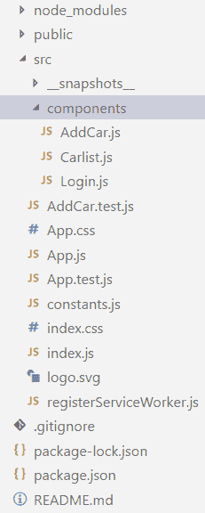
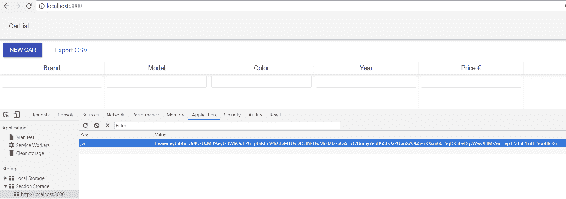

# 十三、保护您的应用

本章介绍了在后端使用 JWT 身份验证时，如何在前端实现身份验证。开始时，我们将安全性切换到后端以启用 JWT 身份验证。然后，我们为登录功能创建一个组件。最后，我们修改 CRUD 功能，将请求的`Authorization`头中的令牌发送到后端。

在本章中，我们将了解以下内容：

*   如何在前端创建登录功能
*   如何在身份验证后实现条件呈现
*   启用 JWT 身份验证时，CRUD 功能需要什么
*   如何在身份验证失败时显示消息

# 技术要求

我们在[第 4 章](04.html)*中创建的 Spring Boot 应用，用于保护和测试后端*（GitHub:[https://github.com/PacktPublishing/Hands-On-Full-Stack-Development-with-Spring-Boot-2.0-and-React/tree/master/Chapter%204](https://github.com/PacktPublishing/Hands-On-Full-Stack-Development-with-Spring-Boot-2.0-and-React/tree/master/Chapter%204) ）。

我们在上一章中使用的 React 应用（GitHub:[https://github.com/PacktPublishing/Hands-On-Full-Stack-Development-with-Spring-Boot-2.0-and-React/tree/master/Chapter%2011](https://github.com/PacktPublishing/Hands-On-Full-Stack-Development-with-Spring-Boot-2.0-and-React/tree/master/Chapter%2011) ）。

# 保护后端

我们使用不安全的后端将 CRUD 功能实现到前端。现在，是时候再次为我们的后端打开安全性，并返回到我们在[第 4 章](04.html)、*保护和测试您的后端*中创建的版本：

1.  使用 EclipseIDE 打开后端项目，并在编辑器视图中打开`SecurityConfig.java`文件。我们对安全性进行了注释，并允许每个人访问所有端点。现在，我们可以删除该行，也可以删除原始版本中的注释。现在您的`SecurityConfig.java`文件的`configure`方法应该如下所示：

```java
@Override
  protected void configure(HttpSecurity http) throws Exception {
    http.csrf().disable().cors().and().authorizeRequests()
    .antMatchers(HttpMethod.POST, "/login").permitAll()
    .anyRequest().authenticated()
    .and()
    // Filter for the api/login requests
    .addFilterBefore(new LoginFilter("/login", authenticationManager()),
       UsernamePasswordAuthenticationFilter.class)
    // Filter for other requests to check JWT in header
    .addFilterBefore(new AuthenticationFilter(),
       UsernamePasswordAuthenticationFilter.class);
}
```

让我们测试一下当后端现在再次安全时会发生什么。

2.  通过在 Eclipse 中按 Run 按钮来运行后端，并从 Console 视图检查应用是否正确启动。在终端中键入`npm start`命令，运行前端，浏览器应打开至地址`localhost:3000`。

3.  您现在应该看到列表页面，表为空。如果打开开发者工具，您会注意到请求以`403 Forbidden`HTTP 错误结束。这实际上是我们想要的，因为我们尚未对前端进行身份验证：


# 固定前端

身份验证是使用 JWT 实现到后端的。在[第 4 章](04.html)*保护和测试您的后端*中，我们创建了 JWT 身份验证，`/login`端点允许每个人在没有身份验证的情况下使用。在前端的登录页面中，我们必须首先调用`/login`端点来获取令牌。之后，令牌将包含在我们发送到后端的所有请求中，如[第 4 章](04.html)、*保护和测试您的后端*所示。

让我们首先创建一个登录组件，该组件要求用户提供凭据，以便从后端获取令牌：

1.  在`components`文件夹中创建一个名为`Login.js`的新文件。现在，前端的文件结构应如下所示：



2.  在 VS 代码编辑器视图中打开该文件，并将以下基本代码添加到登录组件中。我们也正在导入`SERVER_URL`，因为登录请求中需要它：

```
import React, { Component } from 'react';
import {SERVER_URL} from '../constants.js';

class Login extends Component {
  render() {
    return (
      <div>        
      </div>
    );
  }
}

export default Login;
```

3.  我们需要三个状态值进行身份验证。两个用于凭证（`username`和`password`），一个用于表示身份验证状态的布尔值。认证状态状态的默认值为`false`。创建`constructor`并在`constructor`中引入状态：

```
constructor(props) {
  super(props);
  this.state = {username: '', password: '', 
    isAuthenticated: false};
}
```

4.  在用户界面中，我们将使用 Material UI 组件库，就像我们在用户界面的其余部分中所做的那样。我们需要凭证的文本字段组件和调用登录函数的按钮。将组件的导入添加到`login.js`文件：

```
import TextField from '@material-ui/core/TextField';
import Button from '@material-ui/core/Button';
```

5.  通过将导入的组件添加到`render()`方法，将其添加到用户界面。我们需要两个`TextField`组件，一个用于用户名，一个用于密码。需要一个`RaisedButton`组件来调用`login`函数，我们将在本节后面实现该函数：

```
render() {
  return (
    <div>
      <TextField name="username" placeholder="Username" 
      onChange={this.handleChange} /><br/> 
      <TextField type="password" name="password" 
       placeholder="Password" 
      onChange={this.handleChange} /><br/><br/> 
      <Button variant="raised" color="primary" 
       onClick={this.login}>
        Login
     </Button>
    </div>
  );
}
```

6.  实现`TextField`组件的变更处理程序，将类型化值保存到状态：

```
handleChange = (event) => {
  this.setState({[event.target.name] : event.target.value});
}
```

7.  如[第 4 章](04.html)*保护和测试您的后端*所示，使用`POST`方法调用`/login`端点并将用户对象发送到体内，即可完成登录。如果身份验证成功，我们将在响应`Authorization`头中获得一个令牌。然后，我们将令牌保存到会话存储中，并将`isAuthenticated`状态值设置为`true`。会话存储类似于本地存储，但在页面会话结束时会被清除。当`isAuthenticated`状态值改变时，重新呈现用户界面：

```
login = () => {
  const user = {username: this.state.username, password: this.state.password};
  fetch(SERVER_URL + 'login', {
    method: 'POST',
    body: JSON.stringify(user)
  })
  .then(res => {
    const jwtToken = res.headers.get('Authorization');
    if (jwtToken !== null) {
      sessionStorage.setItem("jwt", jwtToken);
      this.setState({isAuthenticated: true});
    }
  })
  .catch(err => console.error(err)) 
}
```

8.  我们可以实现条件渲染，如果`isAuthenticated`状态为`false`则渲染`Login`组件，如果`isAuthenticated`状态为`true`则渲染`Carlist`组件。我们首先要将`Carlist`组件导入`Login`组件：

```
import Carlist from './Carlist';
```

然后对`render()`方法进行以下更改：

```
render() {
  if (this.state.isAuthenticated === true) {
    return (<Carlist />)
  }
  else {
    return (
      <div>
        <TextField type="text" name="username" 
         placeholder="Username" 
        onChange={this.handleChange} /><br/> 
        <TextField type="password" name="password" 
         placeholder="Password" 
        onChange={this.handleChange} /><br/><br/> 
        <Button variant="raised" color="primary" 
         onClick={this.login}>
          Login
        </Button>
      </div>
    );
  }
}
```

9.  要显示登录表单，我们必须在`App.js`文件中呈现`Login`组件而不是`Carlist`组件：

```
// App.js
import React, { Component } from 'react';
import './App.css';
import Login from './components/Login';
import AppBar from '@material-ui/core/AppBar';
import Toolbar from '@material-ui/core/Toolbar';

class App extends Component {
  render() {
    return (
      <div className="App">
        <AppBar position="static" color="default">
          <Toolbar>CarList</ Toolbar>
        </ AppBar>
        <Login /> 
      </div>
    );
  }
```

```
}

export default App;
```

现在，当您的前端和后端正在运行时，您的前端应该如下所示：


如果您使用`user/user`或`admin/admin`凭证登录，您应该会看到车辆列表页面。如果打开开发人员工具，您可以看到令牌现在保存到会话存储：



车辆列表仍然为空，但这是正确的，因为我们尚未将令牌包含到请求中。这是 JWT 身份验证所需要的，我们将在下一阶段实施：

1.  在 VS 代码编辑器视图中打开`Carlist.js`文件。要获取 cars，我们首先必须从会话存储器中读取令牌，然后将带有令牌值的`Authorization`头添加到请求中。您可以在此处看到 fetch 函数的源代码：

```
// Carlist.js 
// Fetch all cars
fetchCars = () => {
  // Read the token from the session storage
 // and include it to Authorization header
  const token = sessionStorage.getItem("jwt");
  fetch(SERVER_URL + 'api/cars', 
  {
    headers: {'Authorization': token}
  })
  .then((response) => response.json()) 
  .then((responseData) => { 
    this.setState({ 
      cars: responseData._embedded.cars,
    }); 
  })
  .catch(err => console.error(err)); 
}
```

2.  如果您登录到前端，您应该会看到由数据库中的车辆填充的车辆列表：


3.  检查来自开发人员工具的请求内容；您可以看到它包含带有令牌值的`Authorization`头：


所有其他 CRUD 功能都需要相同的修改才能正常工作。修改后，delete 函数的源代码如下所示：

```
// Delete car
onDelClick = (link) => {
  const token = sessionStorage.getItem("jwt");
  fetch(link, 
    { 
      method: 'DELETE',
      headers: {'Authorization': token}
    }
  )
  .then(res => {
    this.setState({open: true, message: 'Car deleted'});
    this.fetchCars();
  })
  .catch(err => {
    this.setState({open: true, message: 'Error when deleting'});
    console.error(err)
  }) 
}
```

修改后，add 函数的源代码如下所示：

```
// Add new car
addCar(car) {
  const token = sessionStorage.getItem("jwt");
  fetch(SERVER_URL + 'api/cars', 
  { method: 'POST', 
      headers: {
        'Content-Type': 'application/json',
        'Authorization': token
      },
      body: JSON.stringify(car)
  })
  .then(res => this.fetchCars())
  .catch(err => console.error(err))
} 
```

最后，update 函数的源代码如下所示：

```
// Update car
updateCar(car, link) {
  const token = sessionStorage.getItem("jwt");
  fetch(link, 
  { method: 'PUT', 
    headers: {
      'Content-Type': 'application/json',
      'Authorization': token
    },
    body: JSON.stringify(car)
  })
  .then( res =>
    this.setState({open: true, message: 'Changes saved'})
  )
  .catch( err => 
    this.setState({open: true, message: 'Error when saving'})
  )
} 
```

现在，所有 CRUD 功能都在您登录到应用后工作。

在最后一个阶段，我们将实现一条错误消息，如果身份验证失败，该消息将显示给最终用户。我们正在使用 Material UI`SnackBar`组件显示消息：

1.  将以下导入添加到`Login.js`文件：

```
import Snackbar from '@material-ui/core/Snackbar';
```

2.  打开 Snackbar 的状态，正如我们在[第 10 章](10.html)中所做的，*添加 CRUD 功能*：

```
// Login.js  
constructor(props) {
  super(props);
  this.state = {username: '', password: '', 
  isAuthenticated: false, open: false};
}
```

在`Snackbar``autoHideDuration`道具中设置的时间之后，我们还需要一个`Snackbar`打开状态的状态处理程序来关闭`Snackbar`：

```
handleClose = (event) => {
  this.setState({ open: false });
}
```

3.  在`render()`方法中增加`Snackbar`：

```
<Snackbar 
  open={this.state.open} onClose={this.handleClose} 
  autoHideDuration={1500} 
  message='Check your username and password' />
```

4.  如果认证失败，将`open`状态值设置为`true`：

```
login = () => {
  const user = {username: this.state.username, 
      password: this.state.password};
  fetch('http://localhost:8080/login', {
    method: 'POST',
    body: JSON.stringify(user)
  })
  .then(res => {
    const jwtToken = res.headers.get('Authorization');
    if (jwtToken !== null) {
      sessionStorage.setItem("jwt", jwtToken);
      this.setState({isAuthenticated: true});
    }
    else {
      this.setState({open: true});
    }
  })
  .catch(err => console.error(err)) 
}
```

如果您现在使用错误的凭据登录，则可以看到 toast 消息：


注销功能的实现要简单得多。您基本上只需从会话存储中删除令牌，并将`isAuthenticated`状态值更改为`false`，如下源代码所示：

```
logout = () => {
    sessionStorage.removeItem("jwt");
    this.setState({isAuthenticated: false});
}
```

然后使用条件渲染，可以渲染`Login`组件而不是`Carlist`

如果您想使用 React Router 实现菜单，则可以实现所谓的安全路由，该路由只有在用户经过身份验证时才能访问。以下源代码显示了安全路由，如果用户经过身份验证，则显示路由组件，否则将重定向到登录页面：

```
const SecuredRoute = ({ component: Component, ...rest, isAuthenticated }) => (
  <Route {...rest} render={props => (
    isAuthenticated ? (
      <Component {...props}/>
    ) : (
      <Redirect to={{
        pathname: '/login',
        state: { from: props.location }
      }}/>
    )
  )}/>
)
```

下面是使用`SecuredRoute`的`Switch`路由器的示例，我们在前面的示例中定义了`SecuredRoute`。无需验证即可访问`Login`和`Contact`组件，但`Shop`需要验证：

```
 <Switch>
    <Route path="/login" component={Login} />
    <Route path="/contact" component={Contact} />
    <SecuredRoute isAuthenticated={this.state.isAuthenticated} 
      path="/shop" component={Shop} />
    <Route render={() => <h1>Page not found</h1>} />
  </Switch>
```

# 总结

在本章中，我们学习了在使用 JWT 身份验证时如何为前端实现登录功能。成功身份验证后，我们使用会话存储来保存从后端接收的令牌。然后，在我们发送到后端的所有请求中都使用了令牌，因此，我们必须修改 CRUD 功能以正确使用身份验证。在下一章中，我们将把应用部署到 Heroku，并演示如何创建 Docker 容器。

# 问题

1.  您应该如何创建登录表单？
2.  您应该如何使用 JWT 登录到后端？
3.  您应该如何将令牌存储到会话存储？
4.  您应该如何在 CRUD 函数中将令牌发送到后端？

# 进一步阅读

Packt 还有其他学习 React 的好资源：

*   [https://www.packtpub.com/web-development/react-16-tooling](https://www.packtpub.com/web-development/react-16-tooling)
*   [https://www.packtpub.com/web-development/react-16-essentials-second-edition](https://www.packtpub.com/web-development/react-16-essentials-second-edition)