# 部署应用程序

本章介绍如何将后端和前端部署到服务器。有多种云服务器或**PaaS**（**平台即服务**）提供商可用，如亚马逊（AWS）、数码海洋和微软 Azure。在本书中，我们使用的是 Heroku，它支持 web 开发中使用的多种编程语言。我们还将向您展示如何在部署中使用 Docker 容器。

在本章中，我们将了解以下内容：

*   用于部署 Spring 引导应用程序的不同选项
*   如何将 Spring 引导应用程序部署到 Heroku
*   如何将 React 应用程序部署到 Heroku
*   如何创建 Spring Boot 和 MariaDB Docker 容器

# 技术要求

需要我们在[第 4 章](04.html)*中创建的 Spring Boot 应用程序来保护和测试后端*（GitHub*：*[https://github.com/PacktPublishing/Hands-On-Full-Stack-Development-with-Spring-Boot-2.0-and-React/tree/master/Chapter%204](https://github.com/PacktPublishing/Hands-On-Full-Stack-Development-with-Spring-Boot-2.0-and-React/tree/master/Chapter%204) *。*

我们在上一章中使用的 React 应用程序也是必需的（GitHub:[https://github.com/PacktPublishing/Hands-On-Full-Stack-Development-with-Spring-Boot-2.0-and-React/tree/master/Chapter%2011](https://github.com/PacktPublishing/Hands-On-Full-Stack-Development-with-Spring-Boot-2.0-and-React/tree/master/Chapter%2011) ）。

Docker 安装是必要的。

# 部署后端

如果要使用自己的服务器，部署 Spring Boot 应用程序的最简单方法是使用可执行 JAR 文件。如果您使用 Maven，则通过键入`mvn clean install`命令在命令行中生成可执行 JAR 文件。该命令在`build`文件夹中创建 JAR 文件。在这种情况下，您不必安装单独的应用程序服务器，因为它嵌入在您的 JAR 文件中。然后您只需使用`java`命令`java -jar your_appfile.jar`运行 JAR 文件。嵌入的 Tomcat 版本可以在`pom.xml`文件中用以下行定义：

```
<properties>
  <tomcat.version>8.0.52</tomcat.version>
</properties>
```

如果您使用的是单独的应用程序服务器，则必须创建 WAR 包。这有点复杂，您必须对应用程序进行一些修改。以下是创建 WAR 文件的步骤：

1.  通过扩展`SpringBootServletIntializer`并重写`configure`方法修改应用程序主类：

```
@SpringBootApplication
public class Application extends SpringBootServletInitializer {
    @Override
    protected SpringApplicationBuilder configure
        (SpringApplicationBuilder application) {
        return application.sources(Application.class);
    }

    public static void main(String[] args) throws Exception {
        SpringApplication.run(Application.class, args);
    }
}
```

2.  在`pom.xml`文件中将包装从 JAR 更改为 WAR：

```
<packaging>war</packaging>
```

3.  将以下依赖项添加到`pom.xml`文件中。然后，Tomcat 应用程序不再嵌入：

```
<dependency>
  <groupId>org.springframework.boot</groupId>
  <artifactId>spring-boot-starter-tomcat</artifactId>
  <scope>provided</scope>
</dependency>
```

现在，当您构建应用程序时，将生成 WAR 文件。通过将文件复制到 Tomcat 的`/webapps`文件夹，可以将其部署到现有的 Tomcat。

如今，云服务器是向最终用户提供应用程序的主要方式。接下来，我们将把后端部署到 Heroku 云服务器（[https://www.heroku.com/](https://www.heroku.com/) ）。Heroku 提供了一个免费帐户，您可以使用它部署自己的应用程序。使用免费帐户，您的应用程序在 30 分钟不活动后进入睡眠状态，重新启动应用程序需要多一点时间。但是，免费帐户对于测试和爱好来说已经足够了。

对于部署，您可以使用 Heroku 的基于 web 的用户界面。以下步骤贯穿部署过程：

1.  使用 Heroku 创建帐户后，请登录 Heroku 网站。导航到显示应用程序列表的仪表板。有一个名为“新建”的按钮可打开菜单。从菜单中选择创建新应用程序：

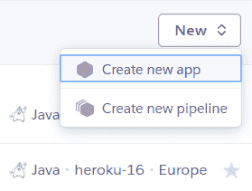

2.  命名您的应用程序，选择一个区域，然后按“创建应用程序”按钮：

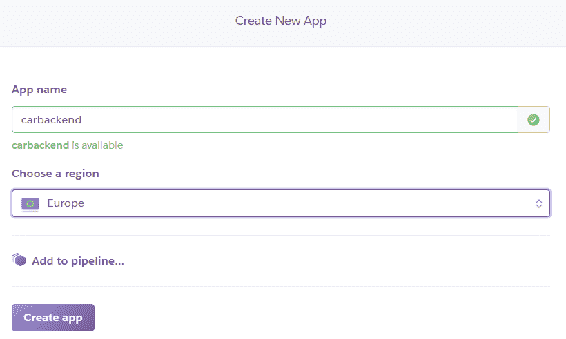

3.  选择一种部署方法。有几种选择；我们正在使用 GitHub 选项。在这种方法中，您首先必须将应用程序推送到 GitHub，然后将 GitHub 存储库链接到 Heroku：

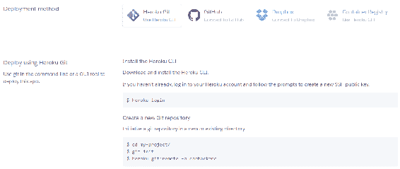

4.  搜索要部署到的存储库，然后按“连接”按钮：


5.  在自动部署和手动部署之间进行选择。当您将新版本推送到连接的 GitHub 存储库时，“自动”选项会自动部署应用程序。您还必须选择要部署的分支。现在，当您按下 Deploy branch 按钮时，我们将使用手动选项部署应用程序：

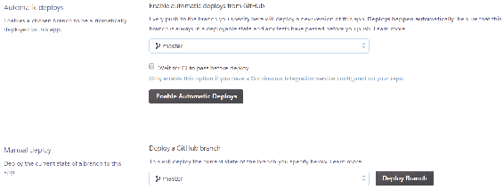

6.  部署开始，您可以看到生成日志。您应该会看到一条消息，说明您的应用已成功部署：


现在，您的应用程序已部署到 Heroku 云服务器。如果您使用的是内存中的 H2 数据库，这就足够了，您的应用程序应该可以正常工作。我们正在使用 MariaDB；因此，我们必须安装数据库。

在 Heroku 中，我们可以使用 JawsDB，它在 Heroku 中作为一个附加组件提供。JawsDB 是一家**数据库即服务**（**DBaaS**）提供商，提供可在 Heroku 中使用的 MariaDB 数据库。以下步骤描述了如何开始使用数据库：

1.  在 Heroku 应用程序页面中打开资源选项卡，并在附加组件搜索字段中键入`JawsDB`：

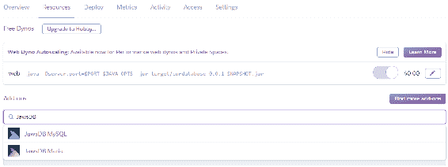

2.  从下拉列表中选择 JawsDB Maria。您可以在添加项列表中看到 JawsDB。单击 JawsDB，您可以看到数据库的连接信息：

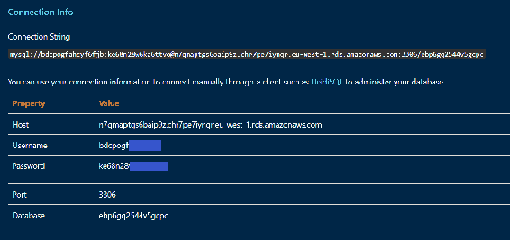

3.  使用 JawsDB 连接信息页面中的值更改`application.properties`文件中的数据库连接定义。在本例中，我们使用普通密码，但建议使用**Java Simplified Encryption**（**JASYPT**库）等加密密码：

```
spring.datasource.url=jdbc:mariadb://n7qmaptgs6baip9z.chr7pe7iynqr.eu-west-1.rds.amazonaws.com:3306/ebp6gq2544v5gcpc
spring.datasource.username=bdcpogfxxxxxxx
spring.datasource.password=ke68n28xxxxxxx
spring.datasource.driver-class-name=org.mariadb.jdbc.Driver
```

4.  使用免费帐户，我们最多可以有 10 个并发连接到我们的数据库；因此，我们还必须在`application.properties`文件中添加以下行：

```
spring.datasource.max-active=10
```

5.  将更改推送到 GitHub，并在 Heroku 中部署应用程序。现在，您的应用程序已经准备好，我们可以使用 Postman 进行测试。应用程序的 URL 为`https://carbackend.herokuapp.com/`，但您也可以使用自己的域。如果我们使用凭证向`/login`端点发送`POST`请求，我们可以在响应头中获取令牌。因此，一切似乎都正常工作：

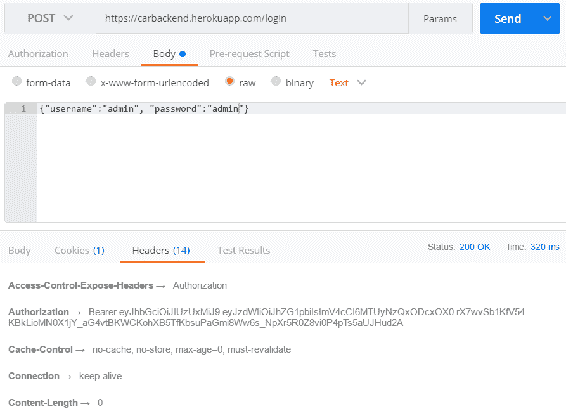

您还可以使用 HeidiSQL 连接到 JawsDB 数据库，我们可以看到我们的汽车数据库已经创建：

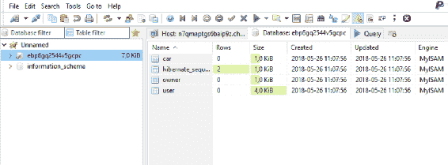

通过从“更多”菜单中选择“查看日志”，可以查看应用程序日志：


应用程序日志视图如下所示。

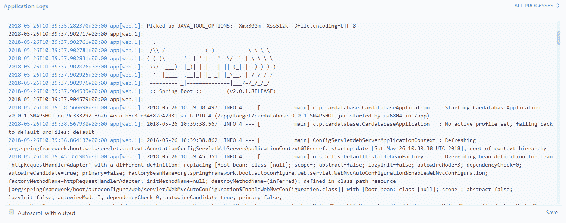

# 部署前端

在本节中，我们将把 React 前端部署到 Heroku。将 React 应用程序部署到 Heroku 的最简单方法是使用 Heroku 构建包创建 React 应用程序（[https://github.com/mars/create-react-app-buildpack](https://github.com/mars/create-react-app-buildpack) 。对于部署，我们必须安装 Heroku CLI，这是 Heroku 的命令行工具。您可以从`https://devcenter.heroku.com/articles/heroku-cli`下载安装包。安装完成后，您可以从 PowerShell 或正在使用的终端使用 Heroku CLI。以下步骤描述了部署过程：

1.  使用 VS 代码打开前端项目，并在编辑器中打开`constant.js`文件。更改`SERVER_URL`常量以匹配我们后端的 URL 并保存更改：

```
export const SERVER_URL = 'https://carbackend.herokuapp.com/'
```

2.  在项目中创建一个本地 Git 存储库并提交文件（如果您还没有这样做）。使用 Git 命令行工具导航到项目文件夹，并键入以下命令：

```
git init
git add .
git commit -m "Heroku deployment"
```

3.  以下命令创建一个新的 Heroku 应用程序，并要求提供登录 Heroku 的凭据。将`[APPNAME]`替换为您自己的应用程序名称。执行命令后，您应该可以在 Heroku 仪表板中看到新的应用程序：

```
heroku create [APPNAME] --buildpack https://github.com/mars/create-react-app-buildpack.git
```

4.  通过在 PowerShell 中键入以下命令，将代码部署到 Heroku：

```
git push heroku master
```

部署就绪后，您应该会看到正在验证的部署。。。PowerShell 中的“已完成”消息，如以下屏幕截图所示：


现在，您可以转到 Heroku 仪表板，查看前端的 URL；您还可以通过键入`heroku open`命令从 Heroku CLI 打开它。如果导航到前端，则应看到登录表单：


# 使用 Docker 容器

Docker 是一个容器平台，它使软件开发、部署和发布变得更加容易。容器是轻量级的可执行软件包，包括运行软件所需的一切。在本节中，我们将从 Spring Boot 后端创建一个容器，如下所示：

1.  将 Docker 安装到您的工作站。您可以在[找到安装包 https://www.docker.com/get-docker](https://www.docker.com/get-docker) 。有多个平台的安装包，如果您有 Windows 操作系统，则可以使用默认设置执行安装向导。
2.  Spring 引导应用程序只是一个可执行的 JAR 文件，可以用 Java 执行。可以使用以下 Maven 命令创建 JAR 文件：

```
mvn clean install
```

您还可以通过打开 run | run configurations…菜单，使用 Eclipse 运行 Maven 目标。在“基本目录”字段中，使用“工作区”按钮选择项目。在目标字段中键入 clean install 并按下 Run 按钮：


3.  构建完成后，您可以从`/target`文件夹中找到可执行 JAR 文件：


4.  通过使用以下命令运行 JAR 文件，可以测试构建是否正确进行：

```
 java -jar .\cardatabase-0.0.1-SNAPSHOT.jar
```

5.  您将看到应用程序的启动消息，最后，您的应用程序正在运行：


容器是使用 DockerFile 定义的。

6.  在项目的根文件夹中创建一个新的 Dockerfile，并将其命名为`Dockerfile`。以下几行显示 Dockerfile 的内容。我们使用的是 Alpine Linux。`EXPOSE`定义了应该在容器外部发布的端口。`COPY`将 JAR 文件复制到容器的文件系统，并将其重命名为`app.jar`。`ENTRYPOINT`定义 Docker 容器运行的命令行参数。

还有一个 Maven 插件可用于构建 Docker 图像。由 Spotify 开发，可在[找到 https://github.com/spotify/docker-maven-plugin](https://github.com/spotify/docker-maven-plugin) 。

以下几行显示了`Dockerfile`的内容。

```
FROM openjdk:8-jdk-alpine
VOLUME /tmp
EXPOSE 8080
ARG JAR_FILE
COPY target/cardatabase-0.0.1-SNAPSHOT.jar app.jar
ENTRYPOINT ["java","-Djava.security.egd=file:/dev/./urandom","-jar","/app.jar"]
```

7.  使用以下命令创建容器。使用`-t`参数，我们可以为容器提供一个友好的名称：

```
docker build -t carbackend .
```

在 build 命令的末尾，您应该看到 Successfully builded 消息：

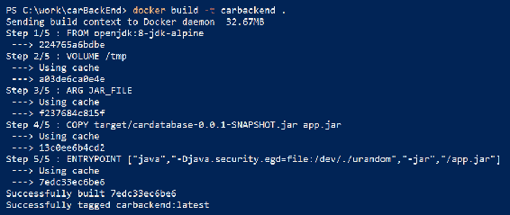

8.  使用`docker image ls`命令检查容器列表：


9.  使用以下命令运行容器：

```
docker run -p 4000:8080 carbackend
```

Spring 启动应用程序启动，但它以错误结束，因为我们正在尝试访问 localhost 数据库。localhost 现在指向容器本身，并且没有安装 MariaDB。

10.  我们将为 MariaDB 创建自己的容器。您可以使用以下命令从 Docker Hub 中提取最新的 MariaDB 容器：

```
docker pull mariadb:lates
```

11.  运行 MariaDB 容器。下面的命令设置根用户密码并创建一个新的数据库，称为`cardb`，我们需要它来启动 Spring 启动应用程序：

```
docker run --name cardb -e MYSQL_ROOT_PASSWORD=pwd -e MYSQL_DATABASE=cardb mariadb
```

12.  我们必须对我们的 Spring Boot`application.properties`文件进行一次更改。将`datasource`URL 更改为以下内容。在下一步中，我们将指定我们的应用程序可以使用`mariadb`名称访问数据库容器。更改后，您必须构建应用程序并重新创建 Spring 引导容器：

```
spring.datasource.url=jdbc:mariadb://mariadb:3306/cardb
```

13.  我们可以运行 Spring 引导容器，并使用以下命令将 MariaDB 容器链接到它。该命令现在定义了我们的 Spring 引导容器可以使用`mariadb`名称访问 MariaDB 容器：

```
docker run -p 8080:8080 --name carapp --link cardb:mariadb -d carbackend
```

14.  我们还可以通过键入`docker logs carapp`命令来访问我们的应用程序日志。我们可以看到，我们的应用程序已成功启动，演示数据已插入 MariaDB 容器中的数据库：

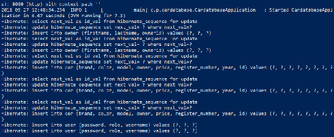

# 总结

在本章中，我们学习了如何部署 Spring 引导应用程序。我们研究了 Spring Boot 应用程序的不同部署选项，并将该应用程序部署到 Heroku。接下来，我们使用 Heroku Buildpack for create React 应用程序将我们的 React 前端部署到 Heroku，这使得部署过程很快。最后，我们使用 Docker 从 Spring Boot 应用程序和 MariaDB 数据库创建容器。在下一章中，我们将介绍更多您应该探索的技术和最佳实践。

# 问题

1.  您应该如何创建 Spring 引导可执行 JAR 文件？
2.  您应该如何将 Spring 引导应用程序部署到 Heroku？
3.  如何将 React 应用程序部署到 Heroku？
4.  什么是 Docker？
5.  您应该如何创建 Spring 引导应用程序容器？
6.  您应该如何创建 MariaDB 容器？

# 进一步阅读

Packt 还有其他关于 React、Spring Boot 和 Docker 的优秀资源：

*   [https://www.packtpub.com/web-development/react-16-tooling](https://www.packtpub.com/web-development/react-16-tooling)
*   [https://www.packtpub.com/web-development/react-16-essentials-second-edition](https://www.packtpub.com/web-development/react-16-essentials-second-edition)
*   [https://www.packtpub.com/virtualization-and-cloud/deployment-docker](https://www.packtpub.com/virtualization-and-cloud/deployment-docker)
*   [https://www.packtpub.com/virtualization-and-cloud/docker-fundamentals-integrated-course](https://www.packtpub.com/virtualization-and-cloud/docker-fundamentals-integrated-course)