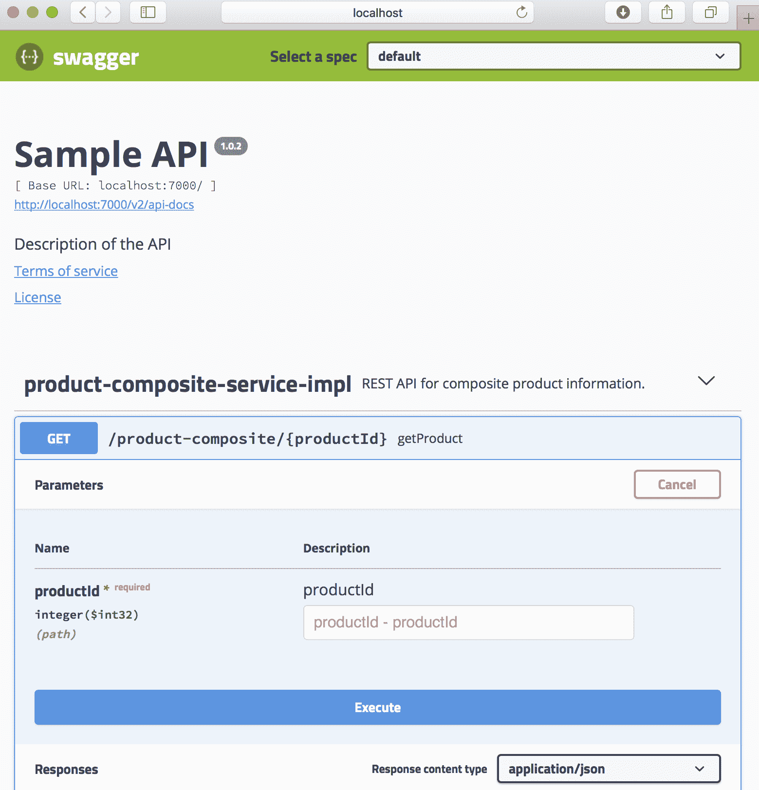
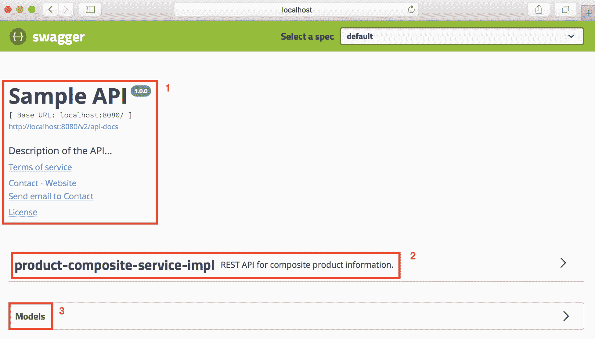

# 使用 OpenAPI/Swagger 添加 API 描述

API（如 RESTful 服务）的价值在很大程度上取决于使用它的容易程度！良好且易于访问的文档是 API 是否有用的一个重要部分。在本章中，我们将学习如何使用 OpenAPI/Swagger 来记录可以从微服务环境外部访问的 API。

正如我们在[第 2 章](02.html)、*Spring Boot 简介*中提到的，在记录 RESTful 服务时，Swagger 是最常用的规范之一，许多领先的 API 网关都对 Swagger 提供了本机支持。我们将学习如何使用 SpringFox 生成这样的文档，使用 SpringFox 记录永恒 API 所需的源代码更改。我们将试用 Swagger 文档，它展示了如何使用嵌入式 Swagger 查看器来检查文档和试用 API。

在本章结束时，我们将有关于`product-composite-service`微服务公开的外部 API 的基于招摇过市的 API 文档。我们将能够使用嵌入式 Swagger 查看器来可视化和测试 API。

本章将介绍以下主题：

*   SpringFox 使用简介
*   源代码中的更改
*   构建和启动微服务
*   尝试使用招摇过市的文档

# 技术要求

本书中描述的所有命令都是使用 macOS Mojave 在 MacBook Pro 上运行的，但是如果您想在其他平台（如 Linux 或 Windows）上运行这些命令，则可以直接修改这些命令。

在完成本章之前，无需安装新工具。

本章的源代码可以在本书的 GitHub 存储库中找到：[https://github.com/PacktPublishing/Hands-On-Microservices-with-Spring-Boot-and-Spring-Cloud/tree/master/Chapter05](https://github.com/PacktPublishing/Hands-On-Microservices-with-Spring-Boot-and-Spring-Cloud/tree/master/Chapter05) 。

为了能够运行本书中描述的命令，请将源代码下载到一个文件夹，并设置一个指向该文件夹的环境变量`$BOOK_HOME`。一些示例命令如下所示：

```java
export BOOK_HOME=~/Documents/Hands-On-Microservices-with-Spring-Boot-and-Spring-Cloud
git clone https://github.com/PacktPublishing/Hands-On-Microservices-with-Spring-Boot-and-Spring-Cloud $BOOK_HOME
cd $BOOK_HOME/Chapter05
```

本书中的 Java 源代码是为 Java 8 编写的，并在 Java 12 上进行了测试。本章使用 Spring Boot 2.1.0（和 Spring 5.1.2），这是编写本章时 Spring Boot 的最新可用版本。

本章中的代码示例均来自`$BOOK_HOME/Chapter05`中的源代码，但在许多情况下，已进行编辑以删除源代码中不相关的部分，如注释、导入和日志语句。

如果您想查看本章中应用于源代码的更改，也就是说，查看使用 SpringFox 创建基于招摇过市的 API 文档的过程，您可以将其与[第 4 章](04.html)、*使用 Docker*部署我们的微服务的源代码进行比较。您可以使用您最喜欢的`diff`工具并比较两个文件夹，即`$BOOK_HOME/Chapter04`和`$BOOK_HOME/Chapter05`。

# SpringFox 使用简介

SpringFox 使 API 文档与实现 API 的源代码保持在一起成为可能。对我来说，这是一个重要的特征。如果 API 文档与 Java 源代码在一个单独的生命周期中进行维护，那么随着时间的推移，它们将彼此分离。在许多情况下，这比预期的要快（根据我的经验）。和往常一样，将组件的接口与其实现分离是很重要的。在编写 RESTful API 文档方面，我们应该将 API 文档添加到描述 API 的 Java 接口中，而不是添加到实现 API 的 Java 类中。为了简化 API 文档的更新，我们可以将部分文档放在属性文件中，而不是直接放在 Java 代码中

2015，StimeBrand 软件向 OpenFAPI 倡议下的 Linux 基金会捐赠了 Savigg 规范，并创建了 OpenAPI 规范。为了创建 API 文档，我们将使用**SpringFox**，它可以在运行时创建基于 Swagger 的 API 文档。

它是基于我们提供的配置并通过检查 Spring WebFlux 和 Swagger 提供的注释来实现的：



SpringFox 的 v3 已经计划支持 OpenAPI。在撰写本章时，SpringFox V3 仍在开发中，因此我们将使用 SpringFox V3 的快照版本，并基于 Swagger V2 创建 API 文档。SpringfoxV3 发布后，本书的源代码将更新。

为了启用 SpringFox 以便创建 API 文档，我们将为 SpringFox 设置一个基本配置，并向定义 RESTful 服务的 Java 接口添加注释。

如果文档的一部分已放在属性文件中，以简化 API 文档的更新，则属性文件必须在与源代码相同的生命周期和版本控制下进行处理，否则它们将有开始偏离实现的风险，即，变得过时。

# 源代码中的更改

要添加关于`product-composite-service`微服务公开的外部 API 的基于招摇过市的文档，我们需要更改两个模块中的源代码：

*   `product-composite-services`：在这里，我们将在 Java 应用程序类`ProductCompositeServiceApplication`中设置 SpringFox 配置，并描述 API 的一般信息
*   `api`：在这里，我们将向 Java 接口`ProductCompositeService`添加 Swagger 注释，描述每个 RESTful 服务。在这个阶段，我们只有一个 RESTful 服务，`/product-composite/{productId}`，用于请求关于特定产品的复合信息。

用于描述 API 操作的实际文本将放在默认属性文件`application.yml`中。

在开始使用 SpringFox 之前，我们需要将它作为依赖项添加到 Gradle 构建文件中。那么，让我们从这个开始吧！

# 向 Gradle 生成文件添加依赖项

如前所述，我们将使用 SpringFox V3 的快照版本。SpringFox 产品分为多个模块。我们需要指定依赖项的模块如下所示：

*   `springfox-swagger2`，这样我们就可以创建基于 Swagger 2 的文档
*   `springfox-spring-webflux`，因此我们可以支持使用基于 SpringWebFlux 的 RESTful 操作
*   `springfox-swagger-ui`，这样我们就可以在我们的微服务中嵌入一个大摇大摆的查看器

我们可以将这些添加到`product-composite-service`模块的 Gradle 构建文件`build.gradle`，如下所示：

```
implementation('io.springfox:springfox-swagger2:3.0.0-SNAPSHOT')
implementation('io.springfox:springfox-swagger-ui:3.0.0-SNAPSHOT')
implementation('io.springfox:springfox-spring-webflux:3.0.0-SNAPSHOT')
```

`api`项目对`springfox-swagger2`模块只需要一个依赖项，因此只需将以下依赖项添加到其`build.gradle`文件中：

```
implementation('io.springfox:springfox-swagger2:3.0.0-SNAPSHOT')
```

SpringFox 项目在 Maven 存储库（[中发布快照构建 http://oss.jfrog.org/artifactory/oss-snapshot-local/](http://oss.jfrog.org/artifactory/oss-snapshot-local/) ），所以我们也需要补充：

```
repositories {
   mavenCentral()
   maven { url 'http://oss.jfrog.org/artifactory/oss-snapshot-local/' }
}
```

为了能够构建核心模块，即`product-service`、`recommendation-service`和`review-service`，我们还需要将 Maven 存储库添加到它们的 Gradle 构建文件`build.gradle`。

# 向产品组合服务应用程序添加配置和通用 API 文档

要在`product-composite-service`微服务中启用 SpringFox，我们必须添加一个配置。为了保持源代码紧凑，我们将直接将其添加到`ProductCompositeServiceApplication`应用程序类中。

如果愿意，可以将 SpringFox 的配置放在单独的 Spring 配置类中。

首先，我们需要添加`@EnableSwagger2WebFlux`注释，以便让 SpringFox 为我们的 RESTful 服务生成 Swagger V2 文档，这是使用 SpringWebFlux 实现的。接下来，我们需要定义一个 Springbean，它返回一个 SpringFox`Docket`Bean，用于配置 SpringFox。

我们将要添加到`$BOOK_HOME/Chapter05/microservices/product-composite-service/src/main/java/se/magnus/microservices/composite/product/ProductCompositeServiceApplication.java`的源代码如下所示：

```
@EnableSwagger2WebFlux
public class ProductCompositeServiceApplication {

   @Bean
   public Docket apiDocumentation() {
      return new Docket(SWAGGER_2)
         .select()
         .apis(basePackage("se.magnus.microservices.composite.product"))
         .paths(PathSelectors.any())
         .build()
            .globalResponseMessage(GET, emptyList())
            .apiInfo(new ApiInfo(
                   apiTitle,
                   apiDescription,
                   apiVersion,
                   apiTermsOfServiceUrl,
                   new Contact(apiContactName, apiContactUrl, 
                    apiContactEmail),
                   apiLicense,
                   apiLicenseUrl,
                   emptyList()
                                  ));
    }
```

从前面的代码中，我们可以理解以下内容：

*   `@EnableSwagger2WebFlux`注释是启动 SpringFox 的起点。
*   启动`Docket`bean 以创建 Swagger V2 文档。
*   使用`apis()`和`paths()`方法，我们可以指定 SpringFox 在哪里查找 API 文档。
*   使用`globalResponseMessage()`方法，我们要求 SpringFox 不要在 API 文档中添加任何默认的 HTTP 响应代码，例如`401`和`403`，我们目前没有使用这些代码。
*   使用 Spring`@Value`注释从属性文件初始化用于配置具有 API 一般信息的`Docket`bean 的`api*`变量。详情如下:

```
    @Value("${api.common.version}")           String apiVersion;
    @Value("${api.common.title}")             String apiTitle;
    @Value("${api.common.description}")       String apiDescription;
    @Value("${api.common.termsOfServiceUrl}") String 
                                              apiTermsOfServiceUrl;
    @Value("${api.common.license}")           String apiLicense;
    @Value("${api.common.licenseUrl}")        String apiLicenseUrl;
    @Value("${api.common.contact.name}")      String apiContactName;
    @Value("${api.common.contact.url}")       String apiContactUrl;
    @Value("${api.common.contact.email}")     String apiContactEmail;
```

在添加配置和 API 文档之后，我们现在可以继续了解如何将特定于 API 的文档添加到 ProductCompositeService。

# 将特定于 API 的文档添加到 ProductCompositeService

为了记录实际的 API`ProductCompositeService`及其 RESTful 操作，我们将在 Java 接口声明中添加`@Api`注释，以便提供 API 的一般描述。对于 API 中的每个 RESTful 操作，我们将添加一个`@ApiOperation`注释，以及相应 Java 方法上的`@ApiResponse`注释，以描述该操作及其预期的错误响应。

SpringFox 将检查`@GetMapping`Spring 注释，以了解操作采用的输入参数，以及如果生成成功的响应，响应将是什么样子。

在下面的示例中，我们已将`@ApiOperation`注释中的实际文本提取到属性文件中。该注释包含属性占位符，SpringFox 将使用这些占位符在运行时从属性文件中查找实际文本。

API 在资源级别的文档如下所示：

```
@Api(description = "REST API for composite product information.")
public interface ProductCompositeService {
```

单个 API 操作记录如下：

```
    @ApiOperation(
        value = "${api.product-composite.get-composite-
         product.description}",
        notes = "${api.product-composite.get-composite-product.notes}")
    @ApiResponses(value = {
        @ApiResponse(code = 400, message = "Bad Request, invalid format 
        of the request. See response message for more information."),
        @ApiResponse(code = 404, message = "Not found, the specified id 
         does not exist."),
        @ApiResponse(code = 422, message = "Unprocessable entity, input 
         parameters caused the processing to fails. See response 
         message for more information.")
    })
    @GetMapping(
        value    = "/product-composite/{productId}",
        produces = "application/json")
    ProductAggregate getProduct(@PathVariable int productId);
```

对于`@ApiOperation`Swagger 注释中指定的值，我们可以直接使用属性占位符，而不使用 Spring`@Value`注释。对于预期的`ApiResponses`的描述，即预期的错误代码，SpringFox 目前不支持使用属性占位符，因此在这种情况下，描述每个错误代码的实际文本直接放在 Java 源代码中。

详见`$BOOK_HOME/Chapter05/api/src/main/java/se/magnus/api/composite/product/ProductCompositeService.java`。

# 将 API 的文本描述添加到属性文件

最后，我们需要将 API 的文本描述添加到属性文件`application.yml`中，这里有`@Value`注释，如下所示：

```
@Value("${api.common.version}") String apiVersion;
```

对于每个`@Value`注释，我们需要在 YAML 文件中指定相应的属性；例如：

```
api:
  common:
    version: 1.0.0
```

同样，我们也有招摇过市的注释，如下所示：

```
@ApiOperation(value = "${api.product-composite.get-composite-product.description}")
```

它们期望 YAML 文件中有相应的属性；例如：

```
api:
  product-composite:
    get-composite-product:
      description: Returns a composite view of the specified product id
```

如果您想了解 YAML 文件是如何构造的，请查看规范：[https://yaml.org/spec/1.2/spec.html](https://yaml.org/spec/1.2/spec.html) 。

首先，对 SpringFox`Docket`bean 中配置的 API 的一般描述如下：

```
api:
  common:
    version: 1.0.0
    title: Sample API
    description: Description of the API...
    termsOfServiceUrl: MINE TERMS OF SERVICE URL
    license: License
    licenseUrl: MY LICENSE URL
    contact:
      name: Contact
      url: My
      email: me@mail.com
```

接下来，给出实际 API 操作的详细描述：

```
product-composite:
  get-composite-product:
    description: Returns a composite view of the specified product id
    notes: |
      # Normal response
      If the requested product id is found the method will return 
      information regarding:
      1\. Base product information
      1\. Reviews
      1\. Recommendations
      1\. Service Addresses\n(technical information regarding the 
      addresses of the microservices that created the response)

      # Expected partial and error responses
      In the following cases, only a partial response be created (used 
      to simplify testing of error conditions)

      ## Product id 113
      200 - Ok, but no recommendations will be returned

      ## Product id 213
      200 - Ok, but no reviews will be returned

      ## Non numerical product id
      400 - A <b>Bad Request</b> error will be returned

      ## Product id 13
      404 - A <b>Not Found</b> error will be returned

      ## Negative product ids
      422 - An <b>Unprocessable Entity</b> error will be returned
```

请注意，SpringFox 支持使用标记语法提供 API 操作的多行描述。

更多详情请参见`$BOOK_HOME/Chapter05/microservices/product-composite-service/src/main/resources/application.yml`。

# 构建和启动微服务环境

在我们可以尝试 Swagger 文档之前，我们需要构建并启动微服务环境！

这可以通过以下命令完成：

```
cd $BOOK_HOME/Chapter05
./gradlew build && docker-compose build && docker-compose up -d
```

您可能会遇到关于已分配端口`8080`的错误消息。这将如下所示：

```
ERROR: for product-composite Cannot start service product-composite: driver failed programming external connectivity on endpoint chapter05_product-composite_1 (0138d46f2a3055ed1b90b3b3daca92330919a1e7fec20351728633222db5e737): Bind for 0.0.0.0:8080 failed: port is already allocated
```

如果是这样的话，您可能忘记了上一章中的微服务场景。要查找正在执行的容器的名称，请运行以下命令：

```
 docker ps --format {{.Names}}
```

当上一章中的微服务环境仍在运行时，响应示例如下：

```
chapter05_review_1
chapter05_product_1
chapter05_recommendation_1
chapter04_review_1
chapter04_product-composite_1
chapter04_product_1
chapter04_recommendation_1
```

如果您在命令的输出中找到来自其他章节的容器，例如，来自[第 4 章](04.html)、*使用 Docker*部署我们的微服务，如前一示例所示，您需要跳转到该章节并放下该章节的容器：

```
cd ../Chapter04
docker-compose down
```

现在，您可以为本章找到丢失的容器：

```
cd ../Chapter05
docker-compose up -d
```

请注意，由于其他容器已成功启动，因此该命令仅启动缺少的容器`product-composite`：

```
Starting chapter05_product-composite_1 ... done
```

要等待 microservice 景观启动并验证其工作，可以运行以下命令：

```
./test-em-all.bash 
```

这项微服务的成功启动有助于我们更好地了解其前景，也有助于理解我们将在下一节研究的招摇过市文档。

# 尝试使用招摇过市的文档

要浏览 Swagger 文档，我们将使用嵌入式 Swagger 查看器。如果我们在 web 浏览器中打开`http://localhost:8080/swagger-ui.html`URL，我们将看到一个类似以下屏幕截图的网页：



在这里，我们可以找到以下内容：

*   我们在 SpringFox`Docket`bean 中指定的一般信息，以及指向实际招摇过市文档`http://localhost:8080/v2/api-docs`的链接
*   API 资源列表；在我们的例子中，`product-composite-service`API
*   在页面底部有一个部分，我们可以在其中检查 API 中使用的模型

这就是它的工作原理：

1.  点击`product-composite-service`API 资源进行扩展。您将获得资源上可用的操作列表。
2.  您将只看到一个操作，/product composite/{productId}。点击它展开它。您将看到我们在`ProductCompositeService`Java 接口中指定的操作文档：


在这里，我们可以看到以下内容：

*   操作的单行说明。
*   包含操作详细信息的部分，包括其支持的输入参数。请注意，`@ApiOperation`注释中的`notes`字段中的标记语法是如何被很好地呈现的！

如果向下滚动网页，您还将找到有关预期响应的文档，包括正常 200 响应和我们定义的各种 4xx 错误响应，如以下屏幕截图所示：


如果我们向上滚动到参数描述，我们将找到“尝试”选项！按钮如果单击该按钮，我们可以填写实际参数值，并通过单击 Execute 按钮向 API 发送请求。例如，如果我们输入 productId`123`，我们将得到以下响应：


我们将得到一个预期的 200（OK）作为响应代码，并在我们已经熟悉的响应体中得到一个 JSON 结构！

如果我们输入了错误的输入，例如`-1`，我们将得到一个正确的错误代码作为响应代码，并在响应体中得到相应的基于 JSON 的错误描述：


如果您想尝试在不使用 Swagger UI 的情况下调用 API，您可以从响应部分复制相应的`curl`命令，并在终端窗口中运行它！通过一个例子来看以下内容：

```
curl -X GET "http://localhost:8080/product-composite/123" -H "accept: application/json"
```

太好了，不是吗？

# 总结

良好的 API 文档化对于 API 的可接受性至关重要，而当涉及到 RESTful 服务文档化时，Swagger 是最常用的规范之一。SpringFox 是一个开源项目，通过检查 SpringWebFlux 和 Swagger 注释，可以在运行时动态创建基于 Swagger 的 API 文档。可以从 Java 源代码中的注释中提取 API 的文本描述，并将其放在属性文件中以便于编辑。SpringFox 可以配置为将嵌入式 Swagger 查看器引入微服务，这使得阅读微服务公开的 API 以及从查看器中试用 API 变得非常容易

现在，通过添加持久性，也就是在数据库中保存数据的能力，我们的微服务会变得更有活力吗？为此，我们需要添加更多的 API，以便创建和删除由微服务处理的信息。前往下一章了解更多信息！

# 问题

1.  SpringFox 如何帮助我们为 RESTful 服务创建 API 文档？
2.  SpringFox 支持哪些 API 文档化规范？
3.  春狐豆的用途是什么？
4.  说出 SpringFox 在运行时读取的一些注释，以便动态创建 API 文档！
5.  `: |`在 YAML 文件中是什么意思？
6.  如何在不再次使用查看器的情况下重复调用使用嵌入式 Swagger 查看器执行的 API？