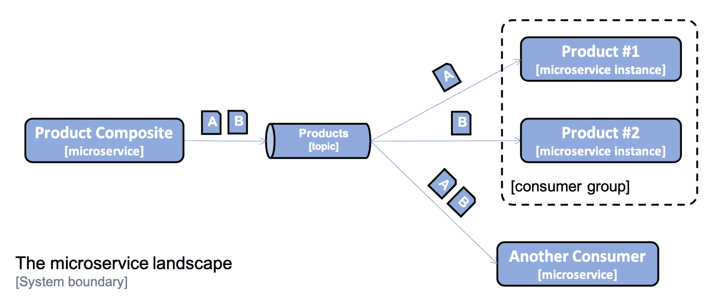
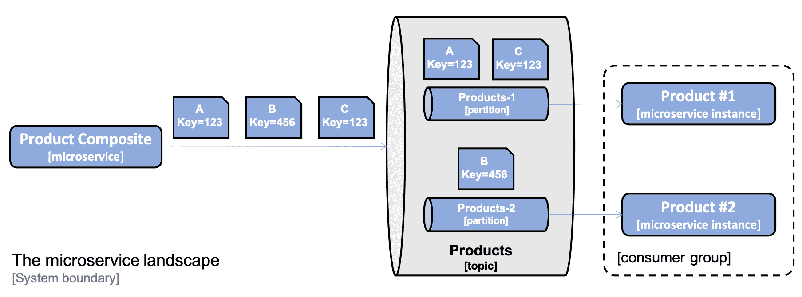
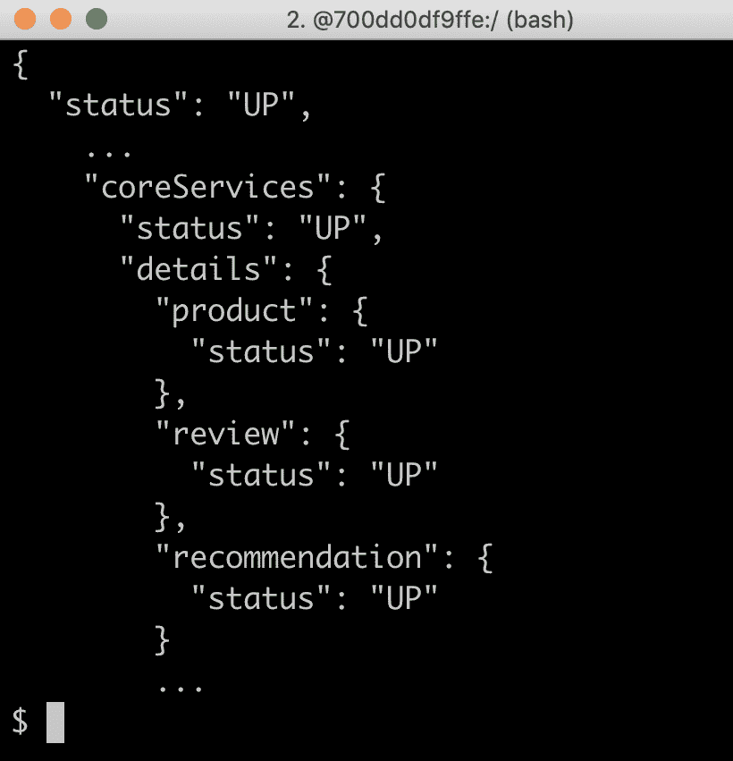
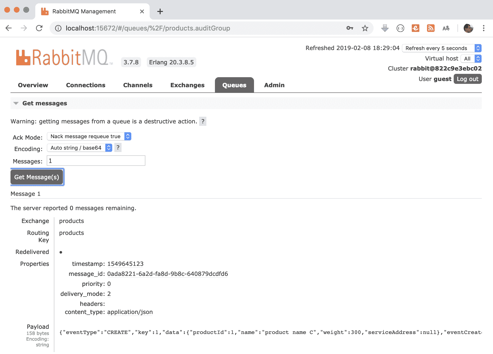
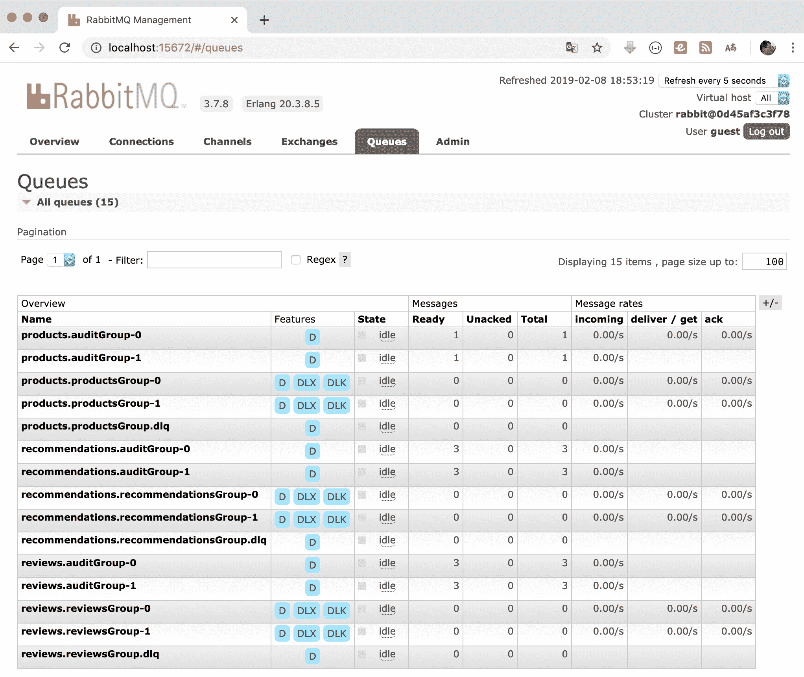
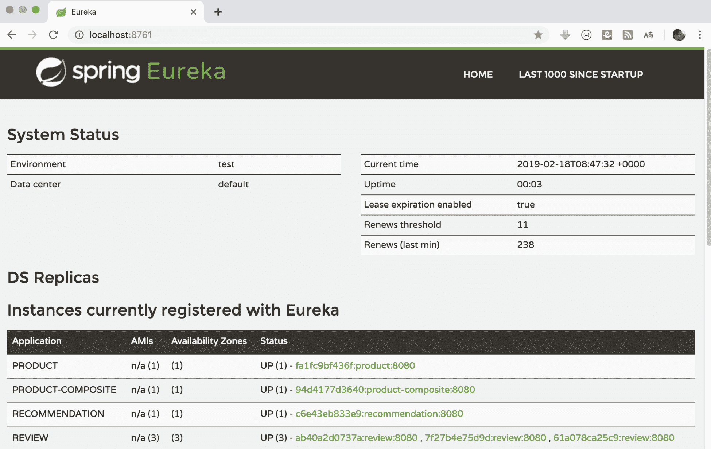
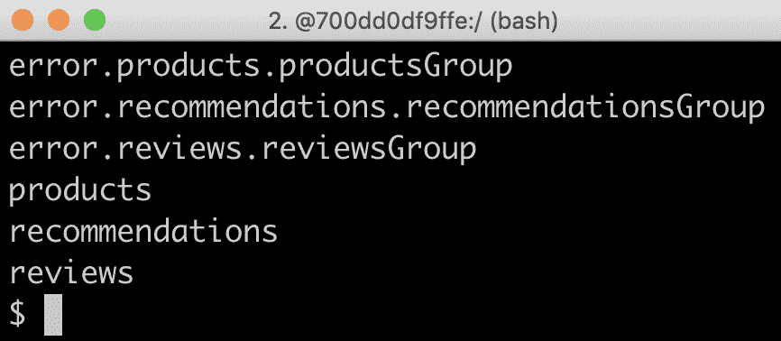

# 七、开发反应式微服务

在本章中，我们将学习如何开发反应式微服务，即如何使用 Spring 开发非阻塞同步 REST API 和异步事件驱动服务。我们还将学习如何在这两种选择之间进行选择。最后，我们将看到如何创建和运行反应式微服务环境的手动和自动测试。

正如[第一章](01.html)*微服务简介*中*反应式微服务*一节所述，反应式系统的基础是它们是消息驱动的，它们使用异步通信。这使它们具有弹性，即可伸缩性和弹性，这意味着它们能够容忍失败。弹性和弹性结合在一起将使反应系统能够响应；他们将能够及时作出反应

本章将介绍以下主题：

*   在非阻塞同步 API 和事件驱动异步服务之间进行选择
*   使用 Spring 开发非阻塞同步 restapi
*   开发事件驱动的异步服务
*   运行反应式微服务环境的手动测试
*   运行反应式微服务环境的自动化测试

# 技术要求

本书中描述的所有命令都是使用 macOS Mojave 在 MacBook Pro 上运行的，但修改起来应该很简单，这样它们就可以在其他平台（如 Linux 或 Windows）上运行。

本章中无需安装新工具。

本章的源代码可以在 GitHub 上找到：[https://github.com/PacktPublishing/Hands-On-Microservices-with-Spring-Boot-and-Spring-Cloud/tree/master/Chapter07](https://github.com/PacktPublishing/Hands-On-Microservices-with-Spring-Boot-and-Spring-Cloud/tree/master/Chapter07) 。

为了能够按照书中所述运行命令，请将源代码下载到一个文件夹中，并设置一个指向该文件夹的环境变量`$BOOK_HOME`。一些示例命令如下所示：

```java
export BOOK_HOME=~/Documents/Hands-On-Microservices-with-Spring-Boot-and-Spring-Cloud
git clone https://github.com/PacktPublishing/Hands-On-Microservices-with-Spring-Boot-and-Spring-Cloud $BOOK_HOME
cd $BOOK_HOME/Chapter07
```

Java 源代码是为 Java8 编写的，并在 Java12 上进行了测试。本章使用 Spring Cloud 2.1.0（也称为**格林威治**版本）、Spring Boot 2.1.2 和 Spring 5.1.4，它们是编写本章时 Spring 组件的最新可用版本。

源代码包含以下 Gradle 项目：

*   `api`
*   `util`
*   `microservices/product-service`
*   `microservices/review-service`
*   `microservices/recommendation-service`
*   `microservices/product-composite-service`

本章中的代码示例均来自`$BOOK_HOME/Chapter07`中的源代码，但在许多情况下进行了编辑，以删除源代码中不相关的部分，如注释、导入和日志语句。

在本章*、*中，您可以了解 ware 应用于源代码的更改，以及使微服务具有反应性所做的工作。此代码可以与[第 6 章](06.html)、*添加持久性*的源代码进行比较。您可以使用您最喜欢的`diff`-工具，比较两个文件夹—`$BOOK_HOME/Chapter06`和`$BOOK_HOME/Chapter07`。

# 在非阻塞同步 API 和事件驱动异步服务之间进行选择

在开发反应式微服务时，何时使用非阻塞同步 API 以及何时使用事件驱动异步服务并不总是显而易见的。一般来说，要使微服务具有健壮性和可伸缩性，必须使其尽可能自治，例如，最小化其运行时依赖性。这也称为**松散****耦合**，因此，事件的异步消息传递优于同步 API。这是因为微服务将只依赖于在运行时对消息传递系统的访问，而不依赖于对许多其他微服务的同步访问。

但是，在许多情况下，非阻塞同步 API 可能有利于使用，例如：

*   用于最终用户等待响应的读取操作
*   其中客户端平台更适合使用同步 API，例如移动应用程序或 SPA web 应用程序
*   客户机将从其他组织连接到服务，在这些组织中，可能很难就跨组织使用的通用消息传递系统达成一致

对于本书中使用的系统环境，我们将使用以下内容：

*   产品复合微服务公开的创建、读取和删除服务将基于同步 API。假设复合微服务在 web 和移动平台上都有客户端，以及来自其他组织的客户端，而不是操作系统环境的客户端。因此，同步 API 似乎是一种自然匹配。
*   核心微服务提供的读取服务也将开发为非阻塞同步 API，因为最终用户正在等待他们的响应。
*   核心微服务提供的创建和删除服务将作为事件驱动的异步服务开发。复合微服务提供的用于创建和删除聚合产品信息的同步 API 只需发布、创建和删除核心服务侦听的主题上的事件，然后返回 200（OK）响应。

如下图所示：


首先，让我们了解如何开发非阻塞同步 RESTAPI，然后，我们将了解如何开发事件驱动的异步服务。

# 使用 Spring 开发非阻塞同步 restapi

在本节中，我们将学习如何开发 ReadAPI 的非阻塞版本。复合服务将与三个核心服务并行地进行反应式（即非阻塞）调用。当复合服务收到来自核心服务的响应时，它将创建复合响应并将其发送回调用方。下图对此进行了说明：


我们将介绍以下内容：

*   弹簧反应器简介
*   MongoDB 中使用 Spring 数据的非阻塞持久性
*   核心服务中的非阻塞 RESTAPI，包括如何处理基于 JPA 的持久层的阻塞代码
*   复合服务中的非阻塞 RESTAPI

# 弹簧反应器简介

正如我们在[第 2 章](08.html)中*以 Spring WebFlux*开始的章节*对 Spring Boot*的介绍中提到的，Spring 5 中的反应性支持基于**项目反应堆**（[https://projectreactor.io](https://projectreactor.io) 。项目反应堆基于*反应流规范*（[http://www.reactive-streams.org](http://www.reactive-streams.org) ），一种用于构建反应式应用程序的标准。Spring Reactor 是基础，它是 Spring WebFlux、Spring WebClient 和 Spring Data 提供反应式和非阻塞特性的基础。

编程模型基于数据处理流，项目反应堆中的核心数据类型为`Flux`和`Mono`。`Flux`对象用于处理*0*的流。。。使用*n*元素和`Mono`对象处理*0*。。。*1*元素。我们将在本章中看到许多使用它的例子。作为简短的介绍，让我们看一下以下测试：

```
@Test
public void TestFlux() {

    List<Integer> list = new ArrayList<>();

    Flux.just(1, 2, 3, 4)
        .filter(n -> n % 2 == 0)
        .map(n -> n * 2)
        .log()
        .subscribe(n -> list.add(n));

    assertThat(list).containsExactly(4, 8);
}
```

以下是对上述源代码的解释：

1.  我们使用整数`1`、`2`、`3`和`4`启动流。
2.  接下来，我们`filter`去掉奇数，在这个测试中我们只允许偶数通过流，它们是`2`和`4`。
3.  接下来，我们通过将流中的值乘以`2`来转换（或`map`，即转换为`4`和`8`。
4.  然后，我们`log`在`map`操作之后通过流的数据。
5.  到目前为止，我们只声明了流的处理。要实际处理流，我们需要有人订阅它。对`subscribe`方法的最终调用将注册一个订阅者，订阅者将在从流中获取的每个元素上对`subscribe`方法应用调用中指定的 lambda 函数。之后，它会将它们添加到`list`元素中。
6.  最后，我们可以断言流处理后的`list`包含预期结果整数`4`和`8`。

日志输出将类似于以下代码：

```
20:01:45.714 [main] INFO reactor.Flux.MapFuseable.1 - | onSubscribe([Fuseable] FluxMapFuseable.MapFuseableSubscriber)
20:01:45.716 [main] INFO reactor.Flux.MapFuseable.1 - | request(unbounded)
20:01:45.716 [main] INFO reactor.Flux.MapFuseable.1 - | onNext(4)
20:01:45.717 [main] INFO reactor.Flux.MapFuseable.1 - | onNext(8)
20:01:45.717 [main] INFO reactor.Flux.MapFuseable.1 - | onComplete()
```

以下是对上述源代码的解释：

1.  流的处理由订阅流并请求其内容的订阅者启动。
2.  接下来，整数`4`和`8`通过`log`运算。
3.  处理以对订户的`onComplete`方法的调用结束，通知订户流已经结束。

完整的源代码请参见`util`项目中的`se.magnus.util.reactor.ReactorTests`测试类。

通常，我们不会启动流的处理。相反，我们将只定义如何处理它，基础设施组件（如 SpringWebFlux）将负责启动处理，例如，作为对传入 HTTP 请求的响应。这种经验法则的一个例外是阻塞代码需要来自反应流的响应。在这些情况下，阻塞代码可以在`Flux`或`Mono`对象上调用`block()`方法，以阻塞的方式从`Flux`或`Mono`对象获取响应。

# MongoDB 中使用 Spring 数据的非阻塞持久性

为`product`和`recommendation`服务创建基于 MongoDB 的存储库非常简单：

*   更改为存储库的`ReactiveCrudRepository`基类
*   更改自定义查找器方法以返回`Mono`或`Flux`对象

变更后的`ProductRepository`和`RecommendationRepository`如下所示：

```
public interface ProductRepository extends ReactiveCrudRepository<ProductEntity, String> {
    Mono<ProductEntity> findByProductId(int productId);
}

public interface RecommendationRepository extends ReactiveCrudRepository<RecommendationEntity, String> {
    Flux<RecommendationEntity> findByProductId(int productId);
}
```

没有对`review`服务的持久性代码进行任何更改，它将使用 JPA 存储库保持阻塞状态！

有关完整的源代码，请查看以下类：

*   `product`项目中的`se.magnus.microservices.core.product.persistence.ProductRepository`。
*   `recommendation`项目中的`se.magnus.microservices.core.recommendation.persistence.RecommendationRepository`。

# 测试代码中的更改

在测试持久层时，我们必须做一些更改。由于我们的持久化方法现在返回一个`Mono`或`Flux`对象，测试方法必须等待响应在返回的反应对象中可用。测试方法可以使用对`Mono`/`Flux`对象上`block()`方法的显式调用来等待响应可用，或者使用 Project Reactor 中的`StepVerifier`助手类来声明可验证的异步事件序列。

以下示例显示了如何更改测试代码以适用于存储库的反应版本：

```
ProductEntity foundEntity = repository.findById(newEntity.getId()).get();
assertEqualsProduct(newEntity, foundEntity);
```

我们可以对`repository.findById()`方法返回的`Mono`对象使用`block()`方法，并保持命令式编程风格，如下图：

```
ProductEntity foundEntity = repository.findById(newEntity.getId()).block();
assertEqualsProduct(newEntity, foundEntity);
```

或者，我们可以使用`StepVerifier`类设置一系列处理步骤，这些步骤既可以执行存储库查找操作，也可以验证结果。序列由对`verifyComplete()`方法的最后调用初始化，如下所示：

```
StepVerifier.create(repository.findById(newEntity.getId()))
    .expectNextMatches(foundEntity -> areProductEqual(newEntity, 
     foundEntity))
    .verifyComplete();
```

有关使用`StepVerifier`类编写测试的示例，请参见`product`项目中的`se.magnus.microservices.core.product.PersistenceTests`测试类。

有关使用`block()`方法编写测试的相应示例，请参见`recommendation`项目中的`se.magnus.microservice.core.recommendation.PersistenceTests`测试类。

# 核心服务中的非阻塞 RESTAPI

有了一个非阻塞持久层，就可以使核心服务中的 API 也成为非阻塞的。我们需要进行以下更改：

*   更改 API，使其仅返回反应式数据类型
*   更改服务实现，使其不包含任何阻塞代码
*   更改我们的测试，以便他们可以测试反应式服务
*   处理阻塞代码将仍然需要阻塞的代码与非阻塞代码隔离

# API 的变化

为了使核心服务的 API 具有反应性，我们需要更新它们的方法，以便它们返回`Mono`或`Flux`对象。

例如，`product`服务中的`getProduct()`现在返回`Mono<Product>`而不是`Product`对象：

```
Mono<Product> getProduct(@PathVariable int productId);
```

有关完整的源代码，请查看`api`项目中的以下类：

*   `se.magnus.api.core.product.ProductService`
*   `se.magnus.api.core.recommendation.RecommendationService`
*   `se.magnus.api.core.review.ReviewService`

# 服务实现中的更改

对于使用反应性持久层的`product`和`recommendation`服务中的服务实现，我们可以在 Project Reactor 中使用 fluent API。例如，`getProduct()`方法的实现如下代码所示：

```
public Mono<Product> getProduct(int productId) {

    if (productId < 1) throw new InvalidInputException("Invalid 
        productId: " + productId);

    return repository.findByProductId(productId)
        .switchIfEmpty(error(new NotFoundException("No product found 
         for productId: " + productId)))
        .log()
        .map(e -> mapper.entityToApi(e))
        .map(e -> {e.setServiceAddress(serviceUtil.getServiceAddress()); return e;});
} 
```

以下是对上述源代码的解释：

1.  该方法将返回一个`Mono`对象；此处的处理是声明的，而不是触发的。一旦收到对该服务的请求，它就会由 web 框架`WebFlux`触发！
2.  将使用持久性存储库中的`findByProductId()`方法，使用其`productId`从基础数据库中检索产品。
3.  如果给定的`productId`没有找到产品，则会抛出`NotFoundException`。
4.  `log`方法将产生日志输出。
5.  将调用`mapper.entityToApi()`方法将返回的实体从持久层转换为 API 模型对象。
6.  最后的`map`方法将在模型对象的`serviceAddress`字段中设置处理请求的微服务的 DNS 名称和 IP 地址。

成功处理的一些示例日志输出如下所示：

```
2019-02-06 10:09:47.006 INFO 62314 --- [ctor-http-nio-2] reactor.Mono.SwitchIfEmpty.1 : onSubscribe(FluxSwitchIfEmpty.SwitchIfEmptySubscriber)
2019-02-06 10:09:47.007 INFO 62314 --- [ctor-http-nio-2] reactor.Mono.SwitchIfEmpty.1 : request(unbounded)
2019-02-06 10:09:47.034 INFO 62314 --- [ntLoopGroup-2-2] reactor.Mono.SwitchIfEmpty.1 : onNext(ProductEntity: 1)
2019-02-06 10:09:47.048 INFO 62314 --- [ntLoopGroup-2-2] reactor.Mono.SwitchIfEmpty.1 : onComplete()
```

以下是处理失败的示例（引发未找到的异常）：

```
2019-02-06 10:09:52.643 INFO 62314 --- [ctor-http-nio-3] reactor.Mono.SwitchIfEmpty.2 : onSubscribe(FluxSwitchIfEmpty.SwitchIfEmptySubscriber)
2019-02-06 10:09:52.643 INFO 62314 --- [ctor-http-nio-3] reactor.Mono.SwitchIfEmpty.2 : request(unbounded)
2019-02-06 10:09:52.648 ERROR 62314 --- [ntLoopGroup-2-2] reactor.Mono.SwitchIfEmpty.2 : onError(se.magnus.util.exceptions.NotFoundException: No product found for productId: 2)
2019-02-06 10:09:52.654 ERROR 62314 --- [ntLoopGroup-2-2] reactor.Mono.SwitchIfEmpty.2 : 

se.magnus.util.exceptions.NotFoundException: No product found for productId: 2
 at se.magnus.microservices.core.product.services.ProductServiceImpl.getProduct(ProductServiceImpl.java:58) ~[classes/:na]
 ...
```

有关完整的源代码，请参见以下类：

*   `product`项目中的`se.magnus.microservices.core.product.services.ProductServiceImpl`
*   `recommendation`项目中的`se.magnus.microservices.core.recommendation.services.RecommendationServiceImpl`

# 测试代码中的更改

服务实现的测试代码的更改方式与我们前面描述的持久层测试相同。为了处理被动返回类型`Mono`和`Flux`的异步行为，测试混合使用了调用`block()`方法和使用`StepVerifier`助手类。

有关完整的源代码，请参阅以下测试类：

*   `product`项目中的`se.magnus.microservices.core.product.ProductServiceApplicationTests`
*   `recommendation`项目中的`se.magnus.microservices.core.recommendation.RecommendationServiceApplicationTests`

# 处理阻塞代码

对于`review`服务，它使用 JPA 访问关系数据库中的数据，我们不支持非阻塞编程模型。相反，我们可以使用`Scheduler`运行阻塞代码，它能够在具有有限线程数的专用线程池中的线程上运行阻塞代码。为阻塞代码使用线程池可以避免耗尽微服务中的可用线程（避免影响微服务中的非阻塞处理）。

让我们看看这个过程是如何工作的，如下步骤所示：

1.  首先，我们在`main``ReviewServiceApplication`类中配置线程池，如下所示：

```
@Autowired
public ReviewServiceApplication (
    @Value("${spring.datasource.maximum-pool-size:10}") Integer 
    connectionPoolSize
) {
    this.connectionPoolSize = connectionPoolSize;
}

@Bean
public Scheduler jdbcScheduler() {
    LOG.info("Creates a jdbcScheduler with connectionPoolSize = " + 
    connectionPoolSize);
    return Schedulers.fromExecutor(Executors.newFixedThreadPool
    (connectionPoolSize));
}
```

我们可以使用`spring.datasource.maximum-pool-size`参数配置线程池的大小。如果未设置，则默认为 10 个线程，完整的源代码请参见`review`项目中的`se.magnus.microservices.core.review.ReviewServiceApplication`类。

2.  接下来，我们将调度器注入到`review`服务实现类中，如下所示：

```
@RestController
public class ReviewServiceImpl implements ReviewService {

    private final Scheduler scheduler;

    @Autowired
    public ReviewServiceImpl(Scheduler scheduler, ...) {
        this.scheduler = scheduler;
    }
```

3.  最后，我们在`getReviews()`方法的反应式实现中使用线程池，如下所示：

```
@Override
public Flux<Review> getReviews(int productId) {

    if (productId < 1) throw new InvalidInputException("Invalid 
        productId: " + productId);

    return asyncFlux(getByProductId(productId)).log();
}

protected List<Review> getByProductId(int productId) {

    List<ReviewEntity> entityList = 
    repository.findByProductId(productId);
    List<Review> list = mapper.entityListToApiList(entityList);
    list.forEach(e -> 
            e.setServiceAddress(serviceUtil.getServiceAddress()));

    LOG.debug("getReviews: response size: {}", list.size());

    return list;
}

private <T> Flux<T> asyncFlux(Iterable<T> iterable) {
    return Flux.fromIterable(iterable).publishOn(scheduler);
}
```

以下是对上述代码的解释：

*   阻塞码放置在`getByProductId()`方法中
*   `getReviews()`方法使用`asyncFlux()`方法在线程池中的线程中运行阻塞代码

完整的源代码请参见`review`项目中的`se.magnus.microservices.core.review.services.ReviewServiceImpl`类。

# 复合服务中的非阻塞 RESTAPI

要使复合服务中的 REST API 无阻塞，我们需要执行以下操作：

*   更改 API，使其仅返回反应性数据类型
*   更改集成层，使其使用非阻塞 HTTP 客户端
*   更改服务实现，使其并行、无阻塞地调用核心服务 API
*   更改我们的测试，以便他们可以测试反应式服务

# API 的变化

为了使复合服务的 API 具有反应性，我们需要应用与我们前面描述的核心服务的 API 相同的更改类型。这意味着`getCompositeProduct`方法的返回类型`ProductAggregate`需要替换为`Mono<ProductAggregate>`。

完整的源代码请参见`api`项目中的`se.magnus.api.composite.product.ProductCompositeService`类。

# 集成层中的更改

在`ProductCompositeIntegration`集成类中，我们将`RestTemplate`阻塞 HTTP 客户端替换为 Spring 5 附带的`WebClient`非阻塞 HTTP 客户端。

`WebClient`的生成器自动注入到构造函数中。如果需要自定义，例如，在设置公共头或过滤器时，可以在构造函数中进行自定义。有关可用的配置选项，请参见[https://docs.spring.io/spring/docs/current/spring-framework-reference/web-reactive.html#webflux-客户建造商](https://docs.spring.io/spring/docs/current/spring-framework-reference/web-reactive.html#webflux-client-builder)。请查看以下步骤：

1.  在这里，我们只需构建我们将在集成类中使用的`WebClient`实例，无需任何配置：

```
public class ProductCompositeIntegration implements ProductService, RecommendationService, ReviewService {

    private final WebClient webClient;

    @Autowired
    public ProductCompositeIntegration(
        WebClient.Builder webClient, ...
    ) {
        this.webClient = webClient.build();
    }
```

2.  接下来，我们使用`webClient`实例发出调用`product`服务的非阻塞请求：

```
@Override
public Mono<Product> getProduct(int productId) {
    String url = productServiceUrl + "/product/" + productId;

    return webClient.get().uri(url).retrieve().bodyToMono(Product.class).log().onErrorMap(WebClientResponseException.class, ex -> handleException(ex));
}
```

如果对`product`服务的 API 调用失败，整个请求将失败。`WebClient onErrorMap()`方法将调用我们的`handleException(ex)`方法，该方法将 HTTP 层先前抛出的异常映射到我们自己的异常，例如`NotFoundException`和`InvalidInputException`。

但是，如果对`product`服务的调用成功，但对推荐 API 或审阅 API 的调用失败，我们不希望让整个请求失败。相反，我们希望将尽可能多的可用信息返回给调用者。因此，在这些情况下，我们将使用`WebClient onErrorResume(error -> empty())`方法返回一个空的建议或评论列表，而不是传播异常。为此，考虑下面的代码：

```
@Override
public Flux<Recommendation> getRecommendations(int productId) {

    String url = recommendationServiceUrl + "/recommendation?
    productId=" + productId;

    // Return an empty result if something goes wrong to make it 
    // possible for the composite service to return partial responses
    return webClient.get().uri(url).retrieve().bodyToFlux(Recommendation.class).log().onErrorResume(error -> empty());
}
```

完整的源代码请参见`product-composite`项目中的`se.magnus.microservices.composite.product.services.ProductCompositeIntegration`类。

# 服务实现中的更改

为了能够并行调用这三个 API，服务实现在`Mono`类上使用静态`zip()`方法。`zip`方法能够处理多个并行请求，并在它们全部完成后将它们压缩在一起。代码如下所示：

```
@Override
public Mono<ProductAggregate> getCompositeProduct(int productId) {
    return Mono.zip(
        values -> createProductAggregate((Product) values[0], 
        (List<Recommendation>) values[1], (List<Review>) values[2], 
        serviceUtil.getServiceAddress()),
        integration.getProduct(productId),
        integration.getRecommendations(productId).collectList(),
        integration.getReviews(productId).collectList())
        .doOnError(ex -> LOG.warn("getCompositeProduct failed: {}", 
         ex.toString()))
        .log();
}
```

以下是对上述源代码的解释：

1.  `zip`方法的第一个参数是 lambda 函数，它将接收数组中的响应。来自三个 API 调用的响应的实际聚合由与前面相同的 helper 方法处理，`createProductAggregate`，没有任何更改。
2.  lambda 函数后面的参数是`zip`方法将并行调用的请求列表，每个请求一个`Mono`对象。在我们的例子中，我们发送了三个`Mono`对象，它们是由 integration 类中的方法创建的，一个用于发送到每个核心微服务的每个请求。

完整的源代码请参见`product-composite`项目中的`se.magnus.microservices.composite.product.services.ProductCompositeServiceImpl`类。

# 测试代码中的更改

测试类中唯一需要的更改是更新集成类 mock 的设置，以便使用`Mono.just()`helper 方法和`Flux.fromIterable()`返回`Mono`和`Flux`对象，如下代码所示：

```
public class ProductCompositeServiceApplicationTests {

    @Before
    public void setUp() {

        when(compositeIntegration.getProduct(PRODUCT_ID_OK)).
            thenReturn(just(new Product(PRODUCT_ID_OK, "name", 1, 
             "mock-address")));

        when(compositeIntegration.getRecommendations(PRODUCT_ID_OK)).
            thenReturn(Flux.fromIterable(singletonList(new 
             Recommendation(PRODUCT_ID_OK, 1, "author", 1, "content", 
             "mock address"))));

        when(compositeIntegration.getReviews(PRODUCT_ID_OK)).
            thenReturn(Flux.fromIterable(singletonList(new 
             Review(PRODUCT_ID_OK, 1, "author", "subject", "content", 
             "mock address"))));
```

完整的源代码请参见`product-composite`项目中的`se.magnus.microservices.composite.product.ProductCompositeServiceApplicationTests`测试类。

现在我们已经使用 Spring 开发了非阻塞 RESTAPI，现在是开发事件驱动的同步服务的时候了。

# 开发事件驱动的异步服务

在本节中，我们将学习如何开发创建和删除服务的事件驱动和异步版本。复合服务将发布每个核心服务主题上的创建和删除事件，然后向调用者返回 OK 响应，而无需等待在核心服务中进行处理。下图对此进行了说明：


我们将讨论以下主题：

*   配置 Spring Cloud Stream 以处理消息传递方面的挑战
*   定义主题和事件
*   渐变生成文件中的更改
*   在复合服务中发布事件
*   使用核心服务中的事件

# 配置 Spring Cloud Stream 以处理消息传递方面的挑战

为了实现事件驱动的创建和删除服务，我们将使用 Spring Cloud Stream。在[第 2 章](08.html)、*Spring Boot 简介*中的*Spring Cloud Stream*一节中，我们已经看到了使用 Spring Cloud Stream 发布和消费主题消息是多么容易。

例如，要发布关于`mysource`定义的主题的消息，我们只需编写以下内容：

```
mysource.output().send(MessageBuilder.withPayload(message).build());
```

对于使用消息，我们编写以下代码：

```
@StreamListener(target = Sink.INPUT)
 public void receive(MyMessage message) {
   LOG.info("Received: {}",message);
```

此编程模型可以独立于所使用的消息传递系统使用，例如 RabbitMQ 或 ApacheKafka！

尽管发送异步消息比同步 API 调用更受欢迎，但它也带来了挑战。我们将看到如何使用 SpringCloudStream 来处理其中的一些问题。将介绍 Spring Cloud Stream 中的以下功能：

*   消费群体
*   重试和死信队列
*   保证顺序和分区

我们将在以下各节中研究其中的每一项。

# 消费群体

这里的问题是，如果我们扩大消息使用者实例的数量，例如，启动两个 product microservice 实例，product microservice 的两个实例将使用相同的消息，如下图所示：


解决方案是，我们只希望每个消费者有一个实例来处理每条消息。这可以通过引入*消费群体*来解决，如下图所示：



在 Spring Cloud Stream 中，可以在消费者端配置消费者组，例如产品微服务，如下所示：

```
spring.cloud.stream:
  bindings.input:
    destination: products
    group: productsGroup
```

在前面的配置中，Spring Cloud Stream 将使用`group`字段的值将`product`微服务的实例添加到名为`productsGroup`的消费者组中。这意味着发送到`products`主题的消息将仅通过 Spring Cloud Stream 传递到产品微服务的一个实例。

# 重试和死信队列

在本节中，我们将学习消息使用者如何使用重试和死信队列。

如果使用者未能处理消息，则可能会丢失该消息，或者在成功处理该消息之前为失败的使用者重新查询该消息。如果消息内容无效，也称为**中毒消息**，则会阻止消费者处理其他消息，直到手动删除。如果故障是由于临时问题造成的，例如，由于临时网络错误而无法访问数据库，则在多次重试后，处理可能会成功。

必须能够指定消息移动到另一个存储器进行故障分析和纠正之前的重试次数。失败的消息通常会移动到一个称为死信队列的专用队列。为了避免在临时故障（例如，网络错误）期间使基础结构过载，必须能够配置执行重试的频率，最好是在每次重试之间增加时间。

在 Spring Cloud Stream 中，这可以在消费者端进行配置，例如，产品微服务，如下所示：

```
spring.cloud.stream.bindings.input.consumer:
  maxAttempts: 3
  backOffInitialInterval: 500
  backOffMaxInterval: 1000
  backOffMultiplier: 2.0

spring.cloud.stream.rabbit.bindings.input.consumer:
  autoBindDlq: true
  republishToDlq: true

spring.cloud.stream.kafka.bindings.input.consumer:
  enableDlq: true
```

在前面的示例中，我们指定 Spring Cloud Stream 在将消息放入死信队列之前应执行`3`重试。第一次重试应在`500`ms 后进行，另外两次重试应在`1000`ms 后进行。

启用死信队列是绑定特定的；因此，我们有一个 RabbitMQ 配置和一个 Kafka 配置。

# 保序与分区

我们可以使用分区来确保消息的发送顺序与发送顺序相同，但不会损失性能和可伸缩性。

如果业务逻辑要求消息的使用和处理顺序与发送顺序相同，那么我们不能为每个消费者使用多个实例来提高处理性能；例如，我们不能使用消费者群体。在某些情况下，这可能会导致处理传入消息时出现不可接受的延迟。

在大多数情况下，只有影响相同业务实体（例如产品）的消息才需要严格的消息处理顺序。

例如，在许多情况下，影响产品 ID 为`1`的产品的消息可以独立于影响产品 ID 为`2`的产品的消息进行处理。这意味着订单只需要为具有相同产品 ID 的消息提供保证。

解决方案是为消息传递系统可以使用的每条消息指定一个密钥，以保证在具有相同密钥的消息之间保持顺序。这可以通过在主题中引入子主题（也称为**分区**来解决。消息传递系统根据其密钥将消息放置在特定分区中。具有相同密钥的消息总是放在同一分区中。消息传递系统只需要保证同一分区中消息的传递顺序。为了确保消息的顺序，我们在使用者组中为每个分区配置一个使用者实例。通过增加分区的数量，我们可以允许使用者增加其实例的数量。这将提高其处理消息的性能，而不会丢失传递顺序。下图对此进行了说明：



在 SpringCloudStream 中，这需要在发布者和消费者端进行配置。在发布服务器端，必须指定密钥和分区数。例如，对于`product-composite`服务，我们有以下内容：

```
spring.cloud.stream.bindings.output:
  destination: products
  producer:
    partition-key-expression: payload.key
    partition-count: 2
```

前面的配置意味着将使用名为`key`的字段从消息中的有效负载获取密钥，并且将使用两个分区。

每个使用者都可以指定要从哪个分区消费消息。例如，对于`product`微服务，我们有以下内容：

```
spring.cloud.stream.bindings.input:
  destination: products
  group:productsGroup
  consumer:
    partitioned: true
    instance-index: 0
```

前面的配置告诉 Spring Cloud Stream，此使用者将只使用来自分区编号`0`的消息，即第一个分区。

# 定义主题和事件

正如我们在[第二章](02.html)*Spring Boot 简介*中*Spring Cloud Stream*一节中已经提到的，Spring Cloud Stream 基于发布和订阅模式，发布者将消息发布到主题，订阅者订阅他们感兴趣的主题以接收消息。

我们将为每种类型的实体使用一个**主题**：`products`、`recommendations`和`reviews`。

消息传递系统处理的**消息**通常由头和正文组成。**事件**是描述发生的事情的消息。对于事件，消息体可用于描述事件类型、事件数据和事件发生时间的时间戳。

在本书范围内，事件定义如下：

*   事件的**类型**，例如，创建或删除事件
*   一个**键**，用于标识数据，例如产品 ID
*   一个**数据**元素，即事件中的实际数据
*   一个**时间戳**，描述事件发生的时间

我们将使用的事件类如下所示：

```
public class Event<K, T> {

    public enum Type {CREATE, DELETE}

    private Event.Type eventType;
    private K key;
    private T data;
    private LocalDateTime eventCreatedAt;

    public Event() {
        this.eventType = null;
        this.key = null;
        this.data = null;
        this.eventCreatedAt = null;
    }

    public Event(Type eventType, K key, T data) {
        this.eventType = eventType;
        this.key = key;
        this.data = data;
        this.eventCreatedAt = now();
    }

    public Type getEventType() {
        return eventType;
    }

    public K getKey() {
        return key;
    }

    public T getData() {
        return data;
    }

    public LocalDateTime getEventCreatedAt() {
        return eventCreatedAt;
    }
}
```

让我们详细解释前面的源代码：

*   `Event`类是通过其`key`和`data`字段、`K`和`T`类型参数化的泛型类。
*   事件类型声明为具有允许值的枚举数，即`CREATE`和`DELETE`。
*   该类定义了两个构造函数，一个为空，另一个可用于初始化类型、键和值成员。
*   最后，该类为其成员变量定义 getter 方法。

完整的源代码请参见`api`项目中的`se.magnus.api.event.Event`类。

# Gradle 生成文件中的更改

为了为 RabbitMQ 和 Kafka 引入 Spring Cloud Stream 及其绑定，我们需要添加两个启动器依赖项，即`spring-cloud-starter-stream-rabbit`和`spring-cloud-starter-stream-kafka`。我们还需要一个测试依赖项`spring-cloud-stream-test-support`，以引入测试支持。下面的代码显示了这一点：

```
dependencies {
 implementation('org.springframework.cloud:spring-cloud-starter-stream-rabbit')
 implementation('org.springframework.cloud:spring-cloud-starter-stream-kafka')
 testImplementation('org.springframework.cloud:spring-cloud-stream-test-support')
}
```

要指定要使用的 Spring Cloud 版本，我们首先为该版本声明一个变量：

```
ext {
    springCloudVersion = "Greenwich.RELEASE"
}
```

为了总结为该版本设置依赖项管理，我们使用以下代码：

```
dependencyManagement {
    imports {
        mavenBom "org.springframework.cloud:spring-cloud-
        dependencies:${springCloudVersion}"
    }
}
```

完整的源代码请参见`product-composite`项目中的`build.gradle`构建文件。

# 在复合服务中发布事件

当复合服务接收到创建或删除产品的请求时，它应向核心服务发布关于其主题的相应事件。为了能够在复合服务中发布事件，我们需要执行以下步骤：

1.  在集成层中声明消息源和发布事件。
2.  添加发布事件的配置。
3.  更改我们的测试，以便他们可以测试事件的发布。

复合服务实现类中不需要任何更改！

# 在集成层中声明消息源和发布事件

为了能够将事件发布到不同的主题，我们需要在 Java 接口中为每个主题声明一个`MessageChannel`，并声明我们希望将其与`EnableBinding`注释一起使用。让我们看看如何做到这一点：

1.  我们在`ProductCompositeIntegration`类的`MessageSources`接口中声明了我们的消息通道，并要求 Spring 在构造函数中注入它的实例，如下所示：

```
@EnableBinding(ProductCompositeIntegration.MessageSources.class)
@Component
public class ProductCompositeIntegration implements ProductService, RecommendationService, ReviewService {

    private MessageSources messageSources;

    public interface MessageSources {

        String OUTPUT_PRODUCTS = "output-products";
        String OUTPUT_RECOMMENDATIONS = "output-recommendations";
        String OUTPUT_REVIEWS = "output-reviews";

        @Output(OUTPUT_PRODUCTS)
        MessageChannel outputProducts();

        @Output(OUTPUT_RECOMMENDATIONS)
        MessageChannel outputRecommendations();

        @Output(OUTPUT_REVIEWS)
        MessageChannel outputReviews();
    }

    public ProductCompositeIntegration(
        MessageSources messageSources,
    ) {
        this.messageSources = messageSources;
    }
```

当我们想要发布主题上的事件时，我们使用注入的`messageSources`对象。例如，要发送产品的删除事件，我们可以使用`outputProducts()`方法获取产品主题的消息通道，然后使用其`send()`方法发布事件。

2.  要创建包含事件的消息，我们可以使用内置的`MessageBuilder`类，如下所示：

```
@Override
public void deleteProduct(int productId) {       
    messageSources.outputProducts().send(MessageBuilder.
    withPayload(new Event(DELETE, productId, null)).build());
}
```

完整的源代码请参见`product-composite`项目中的`se.magnus.microservices.composite.product.services.ProductCompositeIntegration`类。

# 添加发布事件的配置

我们还需要为消息传递系统设置一个能够发布事件的配置。为此，我们需要完成以下步骤：

1.  我们声明 RabbitMQ 是默认的消息传递系统，默认的内容类型是 JSON：

```
spring.cloud.stream:
  defaultBinder: rabbit
  default.contentType: application/json
```

2.  接下来，我们将输出通道绑定到特定的主题名称，如下所示：

```
  bindings:
    output-products:
      destination: products
    output-recommendations:
      destination: recommendations
    output-reviews:
      destination: reviews
```

3.  最后，我们声明 Kafka 和 RabbitMQ 的连接信息：

```
spring.cloud.stream.kafka.binder:
  brokers: 127.0.0.1
  defaultBrokerPort: 9092

spring.rabbitmq:
  host: 127.0.0.1
  port: 5672
  username: guest
  password: guest

---
spring.profiles: docker

spring.rabbitmq.host: rabbitmq
spring.cloud.stream.kafka.binder.brokers: kafka
```

在默认的 Spring 配置文件中，我们指定在没有 Docker 的情况下在 IP 地址为`127.0.0.1`的`localhost`上运行系统环境时要使用的主机名。在`docker`Spring 概要文件中，我们指定了在 Docker 中运行和使用 Docker Compose 时将使用的主机名，即`rabbitmq`和`kafka`。

完整的源代码请参见`product-composite`项目中的`src/main/resources/application.yml`配置文件。

# 测试代码中的更改

测试异步事件驱动的微服务本质上是困难的。测试通常需要以某种方式在异步后台处理上同步，以便能够验证其结果。Spring Cloud Stream 在`TestSupportBinder`方面提供了支持，用于验证在测试期间发送了哪些消息，而无需使用任何消息系统！

测试支持包括一个`MessageCollector`助手类，可用于获取测试期间发送的所有消息。要了解如何完成，请查看以下步骤：

1.  在`MessagingTests`测试类中，我们设置了一个队列，用于检查发送到每个主题的消息，如下所示：

```
  @Autowired
  private MessageCollector collector;

  BlockingQueue<Message<?>> queueProducts = null;
  BlockingQueue<Message<?>> queueRecommendations = null;
  BlockingQueue<Message<?>> queueReviews = null;

  @Before
  public void setUp() {
      queueProducts = getQueue(channels.outputProducts());
      queueRecommendations = 
      getQueue(channels.outputRecommendations());
      queueReviews = getQueue(channels.outputReviews());
  }

  private BlockingQueue<Message<?>> getQueue(MessageChannel 
  messageChannel) {
      return collector.forChannel(messageChannel);
  } 
```

2.  实际测试可以验证队列中的内容，就像以下用于创建产品的测试一样：

```
@Test
public void createCompositeProduct1() {

    ProductAggregate composite = new ProductAggregate(1, "name", 1, 
    null, null, null);
    postAndVerifyProduct(composite, OK);

    // Assert one expected new product events queued up
    assertEquals(1, queueProducts.size());

    Event<Integer, Product> expectedEvent = new Event(CREATE, 
    composite.getProductId(), new Product(composite.getProductId(), 
    composite.getName(), composite.getWeight(), null));
    assertThat(queueProducts, 
    is(receivesPayloadThat (sameEventExceptCreatedAt 
    (expectedEvent))));

    // Assert none recommendations and review events
    assertEquals(0, queueRecommendations.size());
    assertEquals(0, queueReviews.size());
}
```

`receivesPayloadThat()`方法是 Spring Cloud Stream`MessageQueueMatcher`中另一个测试支持类中的静态方法。该类包含一组简化队列中消息验证的方法。

`sameEventExceptCreatedAt()`方法是`IsSameEvent`类中的一种静态方法，它比较`Event`对象，如果除`eventCreatedAt`字段外，所有字段都相等，则将其视为相等。

完整的源代码请参见`product-composite`项目中的以下测试类：

*   `se.magnus.microservices.composite.product.MessagingTests`
*   `se.magnus.microservices.composite.product.IsSameEvent`

# 使用核心服务中的事件

为了能够使用核心服务中的事件，我们需要执行以下操作：

1.  声明侦听其主题事件的消息处理器。
2.  更改我们的服务实现，使其正确使用反应式持久层。
3.  添加消费事件的配置。
4.  更改我们的测试，以便他们可以测试事件的异步处理。

# 声明消息处理器

用于创建和删除实体的 RESTAPI 已被每个核心微服务中的消息处理器所取代，该处理器侦听每个实体主题上的创建和删除事件。为了能够使用已发布到某个主题的消息，我们需要绑定到`SubscribableChannel`，类似于我们在发布消息时绑定到`MessageChannel`的方式。由于每个消息处理器只监听一个主题，我们可以使用内置的`Sink`接口绑定到该主题。我们使用`EnableBinding`注释来声明`Sink`接口的使用，如下源代码所示：

```
@EnableBinding(Sink.class)
public class MessageProcessor {
```

为了实际使用和处理消息，我们可以使用`StreamListener`注释对一个方法进行注释，在该注释中，我们指定要侦听的频道：

```
@StreamListener(target = Sink.INPUT)
public void process(Event<Integer, Product> event) {
```

`process()`方法的实现使用`switch`语句调用服务组件中的 create 方法创建事件，delete 方法删除事件。源代码如下所示：

```
switch (event.getEventType()) {

case CREATE:
    Product product = event.getData();
    LOG.info("Create product with ID: {}", product.getProductId());
    productService.createProduct(product);
    break;

case DELETE:
    int productId = event.getKey();
    LOG.info("Delete recommendations with ProductID: {}", productId);
    productService.deleteProduct(productId);
    break;

default:
    String errorMessage = "Incorrect event type: " + 
    event.getEventType() + ", expected a CREATE or DELETE event";
    LOG.warn(errorMessage);
 throw new EventProcessingException(errorMessage);
}
```

让我们详细解释前面的源代码：

1.  `switch`语句要求事件类型为`CREATE`或`DELETE`事件。
2.  为创建事件调用`productService.createProduct()`方法。
3.  删除事件调用`productService.deleteProduct()`方法。
4.  如果事件类型既不是`CREATE`事件，也不是`DELETE`事件；抛出了一个`EventProcessingException`类型的异常。

服务组件通常使用构造函数注入进行注入，如下所示：

```
private final ProductService productService;

@Autowired
public MessageProcessor(ProductService productService) {
    this.productService = productService;
}
```

有关完整的源代码，请参见以下类：

*   `product`项目中的`se.magnus.microservices.core.product.services.MessageProcessor`
*   `recommendation`项目中的`se.magnus.microservices.core.recommendation.services.MessageProcessor`
*   `review`项目中的`se.magnus.microservices.core.review.services.MessageProcessor`

# 服务实现中的更改

`product`和`recommendation`服务的 create 和 delete 方法的服务实现已经重写，以使用 MongoDB 的非阻塞反应性持久层。例如，创建产品实体的步骤如下：

```
public class ProductServiceImpl implements ProductService {

    @Override
    public Product createProduct(Product body) {

        if (body.getProductId() < 1) throw new 
        InvalidInputException("Invalid productId: " + 
        body.getProductId());

        ProductEntity entity = mapper.apiToEntity(body);
        Mono<Product> newEntity = repository.save(entity)
            .log()
            .onErrorMap(
                DuplicateKeyException.class,
                ex -> new InvalidInputException("Duplicate key, Product 
                Id: " + body.getProductId()))
            .map(e -> mapper.entityToApi(e));

        return newEntity.block();
    }
```

`onErrorMap()`方法用于将`DuplicateKeyException`持久性异常映射到我们自己的`InvalidInputException`异常。

由于我们的消息处理器基于块编程模型，因此我们需要在将返回的`Mono`对象从持久层调用`block()`方法，然后再将其返回给消息处理器。如果我们不调用`block()`方法，如果服务实现中的处理失败，我们将无法触发消息传递系统中的错误处理；事件将不会被重新调用，最终，它将按照预期被移动到死信队列。

与以前一样，使用 JPA 阻塞持久层的`review`服务不需要更新

有关完整的源代码，请参见以下类：

*   `product`项目中的`se.magnus.microservices.core.product.services.ProductServiceImpl`
*   `recommendation`项目中的`se.magnus.microservices.core.recommendation.services.RecommendationServiceImpl`

# 添加消费事件的配置

我们还需要为消息传递系统设置配置，以便能够使用事件；这与我们对发布服务器所做的类似。声明 RabbitMQ 为默认消息传递系统，JSON 为默认内容类型，Kafka 和 RabbitMQ 为连接信息与发布服务器相同。用户配置添加到公共部件中，指定用户组；重试处理和死信队列与前面在*配置 Spring Cloud Stream 以处理消息传递挑战*部分中描述的相同。

有关完整的源代码，请参阅以下配置文件：

*   `product`项目中的`src/main/resources/application.yml`
*   `recommendation`项目中的`src/main/resources/application.yml`
*   `review`项目中的`src/main/resources/application.yml`

# 测试代码中的更改

由于核心服务现在接收用于创建和删除其实体的事件，因此需要更新测试，以便它们发送事件，而不是像以前那样调用 RESTAPI。在下面的源代码中，我们可以看到如何使用`input`方法通道上的`send()`方法发送事件：

```
private void sendCreateProductEvent(int productId) {
    Product product = new Product(productId, "Name " + productId, 
    productId, "SA");
    Event<Integer, Product> event = new Event(CREATE, productId, 
    product);
    input.send(new GenericMessage<>(event));
}

private void sendDeleteProductEvent(int productId) {
    Event<Integer, Product> event = new Event(DELETE, productId, null);
    input.send(new GenericMessage<>(event));
}
```

`input`通道由测试类在运行任何测试之前设置。它基于消息处理器使用的相同内置`Sink`接口。在下面的源代码中，我们可以看到如何在`setupDb()`方法中创建`input`通道。由于`setupDb()`方法带有`@Before`注释，因此它将在执行任何测试之前运行：

```
@Autowired
private Sink channels;

private AbstractMessageChannel input = null;

@Before
public void setupDb() {
   input = (AbstractMessageChannel) channels.input();
   repository.deleteAll().block();
}
```

该构造使消息传递系统快捷，并且对`input`通道中`send()`方法的调用将由消息处理器同步处理，即与普通方法调用其`process()`方法一样。这意味着测试代码不需要为事件的异步处理实现任何同步或*等待逻辑*。相反，测试代码可以在调用`sendCreateProductEvent`和`sendDeleteProductEvent`send helper 方法返回后直接应用验证逻辑。

有关完整的源代码，请参阅以下测试类：

*   `product`项目中的`se.magnus.microservices.core.product.ProductServiceApplicationTests`
*   `recommendation`项目中的`se.magnus.microservices.core.recommendation.RecommendationServiceApplicationTests`
*   `review`项目中的`se.magnus.microservices.core.review.ReviewServiceApplicationTests`

# 运行反应式微服务环境的手动测试

现在，我们有了完全反应式的微服务，包括非阻塞同步 RESTAPI 和事件驱动异步服务。让我们试试看！

准备三种不同的配置，如下所示，每个配置位于单独的 Docker Compose 文件中：

*   使用 RabbitMQ 而不使用分区
*   使用 RabbitMQ，每个主题有两个分区
*   使用 Kafka，每个主题有两个分区

然而，在测试这三种配置之前，我们首先需要简化反应式微服务环境的测试。简化后，我们可以继续测试微服务。

因此，需要检查以下两个特性：

*   使用 RabbitMQ 时保存事件以供以后检查
*   可用于监视景观状态的健康 API

# 保存事件

在对事件驱动的异步服务运行了一些测试之后，您可能会对查看实际发送的事件感兴趣。将 Spring Cloud Stream 与 Kafka 一起使用时，事件会保留在主题中，即使消费者已经处理了事件。但是，当将 Spring Cloud Stream 与 RabbitMQ 一起使用时，事件在成功处理后将被删除。

为了能够查看每个主题上发布了哪些事件，Spring Cloud Stream 配置为将发布的事件保存在每个主题的单独`auditGroup`消费者组中。`products`主题的配置如下：

```
spring.cloud.stream:
  bindings:
    output-products:
      destination: products
      producer:
        required-groups: auditGroup
```

当使用 RabbitMQ 时，这将导致创建额外的队列，在这些队列中存储事件以供以后检查。

完整的源代码请参见`product-composite`项目中的`src/main/resources/application.yml`配置文件。

# 添加健康 API

测试使用同步 API 和异步消息传递相结合的微服务的系统环境是一项挑战。例如，我们如何知道新启动的微服务及其数据库和消息传递系统何时准备好处理请求和消息？

为了更容易了解所有微服务何时准备好处理请求和消息，我们在所有微服务中添加了一个健康 API。它们基于对健康端点的支持，健康端点随称为执行器的 Spring 引导模块一起提供。默认情况下，如果微服务本身和 Spring Boot 知道的所有依赖项都可用，则基于执行器的`health`端点回答`UP`（并给出 200 作为 HTTP 返回状态），例如，对数据库和消息传递系统的依赖项；否则，健康端点回答`DOWN`（并返回 500 作为 HTTP 返回状态）。

我们还可以扩展`health`端点，以覆盖 Spring Boot 不知道的依赖项。我们将使用此功能扩展到产品组合的`health`端点，该端点还将包括三个核心服务的运行状况。这意味着产品组合`health`端点只有在自身和三个核心微服务正常的情况下才会响应`UP`。这可以由`test-em-all.bash`脚本手动或自动使用，以确定所有微服务及其依赖项何时启动并运行。

在`ProductCompositeIntegration`集成类中，我们添加了用于检查三个核心微服务运行状况的助手方法，如下所示：

```
public Mono<Health> getProductHealth() {
    return getHealth(productServiceUrl);
}

public Mono<Health> getRecommendationHealth() {
    return getHealth(recommendationServiceUrl);
}

public Mono<Health> getReviewHealth() {
    return getHealth(reviewServiceUrl);
}

private Mono<Health> getHealth(String url) {
    url += "/actuator/health";
    LOG.debug("Will call the Health API on URL: {}", url);
    return webClient.get().uri(url).retrieve().bodyToMono(String.class)
        .map(s -> new Health.Builder().up().build())
        .onErrorResume(ex -> Mono.just(new 
         Health.Builder().down(ex).build()))
        .log();
}
```

此代码类似于我们以前用来调用核心服务来读取 API 的代码。

完整的源代码请参见`product-composite`项目中的`se.magnus.microservices.composite.product.services.ProductCompositeIntegration`类。

在主`ProductCompositeServiceApplication`应用程序类中，我们使用这些助手方法注册三个健康检查，每个核心微服务一个：

```
@Autowired
HealthAggregator healthAggregator;

@Autowired
ProductCompositeIntegration integration;

@Bean
ReactiveHealthIndicator coreServices() {

    ReactiveHealthIndicatorRegistry registry = new 
    DefaultReactiveHealthIndicatorRegistry(new LinkedHashMap<>());

    registry.register("product", () -> integration.getProductHealth());
    registry.register("recommendation", () -> 
    integration.getRecommendationHealth());
    registry.register("review", () -> integration.getReviewHealth());

    return new CompositeReactiveHealthIndicator(healthAggregator, 
    registry);
}
```

完整的源代码请参见`product-composite`项目中的`se.magnus.microservices.composite.product.ProductCompositeServiceApplication`类。

最后，在所有四个微服务的`application.yml`文件中，我们配置了 Spring Boot Actuator，以便它执行以下操作：

*   显示有关运行状况的详细信息，其中不仅包括`UP`或`DOWN`，还包括有关其依赖关系的信息
*   通过 HTTP 公开其所有端点

这两种设置的配置如下所示：

```
management.endpoint.health.show-details: "ALWAYS"
management.endpoints.web.exposure.include: "*"
```

有关完整源代码的示例，请参见`product-composite`项目中的`src/main/resources/application.yml`配置文件。

**WARNING**: These configuration settings are good during development, but it can be a security issue to reveal too much information in actuator endpoints in production systems. Therefore, plan for minimizing the information exposed by the actuator endpoints in production!

有关弹簧启动执行器暴露的端点的详细信息，请参见[https://docs.spring.io/spring-boot/docs/current/reference/html/production-ready-endpoints.html](https://docs.spring.io/spring-boot/docs/current/reference/html/production-ready-endpoints.html) ：

*   尝试一下（当您使用 Docker Compose 启动并运行所有微服务时，如下一节所述）：

```
curl localhost:8080/actuator/health -s | jq .
```

*   这将导致以下响应：



在前面的输出中，我们可以看到复合服务报告它是健康的，即其状态为`UP`。在响应的最后，我们可以看到所有三个核心微服务也都报告为健康的。

有了健康 API，我们就可以测试我们的反应式微服务了。

# 使用 RabbitMQ 而不使用分区

在本节中，我们将与 RabbitMQ 一起测试反应式微服务，但不使用分区。

此配置中使用默认的`docker-compose.yml`Docker Compose 文件。以下更改已应用于该文件：

*   已添加 RabbitMQ，如下所示：

```
rabbitmq:
  image: rabbitmq:3.7.8-management
  mem_limit: 350m
  ports:
    - 5672:5672
    - 15672:15672
  healthcheck:
    test: ["CMD", "rabbitmqctl", "status"]
    interval: 10s
    timeout: 5s
    retries: 10
```

*   微服务现在有一个向 RabbitMQ 服务声明的依赖项。这意味着 Docker 在 RabbitMQ 服务报告正常之前不会启动 microservice 容器：

```
depends_on:
  rabbitmq:
    condition: service_healthy
```

要运行我们的测试，请执行以下步骤：

1.  使用以下命令构建并启动系统环境：

```
cd $BOOK_HOME/Chapter07
./gradlew build && docker-compose build && docker-compose up -d
```

2.  现在，我们必须等待微服务环境启动并运行。
    尝试运行以下命令几次：

```
curl -s localhost:8080/actuator/health | jq -r .status
```

当它返回`UP`时，我们准备好运行测试了！

3.  首先，使用以下命令创建复合产品：

```
body='{"productId":1,"name":"product name C","weight":300, "recommendations":[
 {"recommendationId":1,"author":"author 1","rate":1,"content":"content 1"},
 {"recommendationId":2,"author":"author 2","rate":2,"content":"content 2"},
 {"recommendationId":3,"author":"author 3","rate":3,"content":"content 3"}
], "reviews":[
 {"reviewId":1,"author":"author 1","subject":"subject 1","content":"content 1"},
 {"reviewId":2,"author":"author 2","subject":"subject 2","content":"content 2"},
 {"reviewId":3,"author":"author 3","subject":"subject 3","content":"content 3"}
]}'

curl -X POST localhost:8080/product-composite -H "Content-Type: application/json" --data "$body"
```

当将 Spring Cloud Stream 与 RabbitMQ 一起使用时，它将根据我们的配置为每个主题创建一个 RabbitMQ 交换和一组队列

让我们看看 Spring Cloud Stream 为我们创建了哪些队列！

4.  在 web 浏览器中打开以下 URL:`http://localhost:15672/#/queues`。您应该看到以下队列：


对于每个主题，我们可以看到一个用于 auditGroup 的队列、一个用于相应核心微服务使用的消费者组的队列和一个死信队列。我们还可以看到 auditGroup 队列包含消息，这与预期的一样！

5.  单击 products.auditGroup 队列并向下滚动以获取消息，将其展开，然后单击名为获取消息的按钮以查看队列中的消息：



6.  接下来，尝试使用以下代码获取产品组合：

```
curl localhost:8080/product-composite/1 | jq 
```

7.  最后，删除它，如下所示：

```
curl -X DELETE localhost:8080/product-composite/1
```

再次尝试获取删除的产品将导致`404 - "NotFound"`响应！

如果再次查看 RabbitMQ 审核队列，应该能够找到包含删除事件的新消息。

8.  使用以下命令关闭 microservice 环境，结束测试：

```
docker-compose down
```

这就完成了我们在不使用分区的情况下使用 RabbitMQ 的测试。现在，让我们继续使用分区测试 RabbitMQ。

# 使用 RabbitMQ，每个主题有两个分区

现在，让我们试试 SpringCloudStream 中的分区支持！

我们为使用 RabbitMQ 准备了一个单独的 Docker Compose 文件，每个主题有两个分区：`docker-compose-partitions.yml`。它还将为每个核心微服务启动两个实例，每个分区一个。例如，第二个`product`实例配置如下：

```
product-p1:
  build: microservices/product-service
  mem_limit: 350m
  environment:
    - SPRING_PROFILES_ACTIVE=docker
    - SPRING_CLOUD_STREAM_BINDINGS_INPUT_CONSUMER_PARTITIONED=true
    - SPRING_CLOUD_STREAM_BINDINGS_INPUT_CONSUMER_INSTANCECOUNT=2
    - SPRING_CLOUD_STREAM_BINDINGS_INPUT_CONSUMER_INSTANCEINDEX=1
  depends_on:
    mongodb:
      condition: service_healthy
    rabbitmq:
      condition: service_healthy
```

以下是对上述源代码的解释：

*   我们使用与第一个`product`实例相同的源代码和 Dockerfile，但配置不同。
*   具体来说，我们使用本章前面介绍的`instance-index`属性将两个`product`实例分配给不同的分区。
*   当使用系统环境变量指定 Spring 属性时，我们必须使用大写格式，其中点替换为下划线。
*   此`product`实例只处理异步事件；它不会响应 API 调用。由于它有一个不同的名称`product-p1`（也用作其 DNS 名称），因此它不会响应以`http://product:8080`开头的 URL 调用。

使用以下命令启动 microservice 环境：

```
export COMPOSE_FILE=docker-compose-partitions.yml
docker-compose build && docker-compose up -d
```

重复上一节中的测试，但也创建一个产品，产品 ID 设置为`2`。如果您查看 Spring Cloud Stream 设置的队列，您将看到每个分区有一个队列，产品审核队列现在每个都包含一条消息，即，产品 ID`1`的事件放在一个分区中，产品 ID`2`的事件放在另一个分区中。如果您在 web 浏览器中返回到`http://localhost:15672/#/queues`，您应该会看到如下内容：



要使用分区结束 RabbitMQ 测试，请使用以下命令关闭 microservice 环境：

```
docker-compose down
unset COMPOSE_FILE
```

我们现在已经完成了使用 RabbitMQ 的测试，包括有分区和没有分区。我们将尝试的最终测试配置是与 Kafka 一起测试微服务。

# 使用 Netflix Eureka 作为发现服务

发现服务可能是使协作微服务生产环境就绪所需的最重要的支持功能。正如我们在[第 1 章](01.html)、*微服务简介*中所述，在*服务发现*部分中，发现服务可用于跟踪现有微服务及其实例。Spring 云支持的第一个发现服务是*Netflix Eureka***。**

我们将在[第 9 章](09.html)*中使用它，添加使用 Netflix Eureka 和 Ribbon**的服务发现，以及*负载平衡器和新的 Spring Cloud 负载平衡器。**

 **我们将看到，当使用 Spring 云时，向 Netflix Eureka 注册微服务是多么容易，当客户端向 Netflix Eureka 中注册的一个实例发送 HTTP 请求（如对 RESTful API 的调用）时。我们还将了解如何扩大微服务实例的数量，以及如何在其可用实例上平衡对微服务的请求（默认情况下，基于循环调度）。

下面的屏幕截图展示了 Eureka 的 web UI，在这里我们可以看到我们注册的微服务：



review 服务有三个可用实例，而其他两个服务各只有一个实例。

随着 Netflix Eureka 的引入，让我们介绍如何使用 Spring Cloud Gateway 作为边缘服务器。

# 使用 Kafka，每个主题有两个分区

现在，我们将尝试 SpringCloudStream 的一个非常酷的特性：将消息传递系统从 RabbitMQ 更改为 ApacheKafka！

只需将`spring.cloud.stream.defaultBinder`属性的值从`rabbit`更改为`kafka`即可。这是由`docker-compose-kafka.yml`Docker Compose 文件处理的，该文件也用 Kafka 和 Zookeeper 替换了 RabbitMQ。卡夫卡和 Zookeeper 的配置如下：

```
kafka:
  image: wurstmeister/kafka:2.12-2.1.0
  mem_limit: 350m
  ports:
    - "9092:9092"
  environment:
    - KAFKA_ADVERTISED_HOST_NAME=kafka
    - KAFKA_ADVERTISED_PORT=9092
    - KAFKA_ZOOKEEPER_CONNECT=zookeeper:2181
  depends_on:
    - zookeeper

zookeeper:
  image: wurstmeister/zookeeper:3.4.6
  mem_limit: 350m
  ports:
    - "2181:2181"
  environment:
    - KAFKA_ADVERTISED_HOST_NAME=zookeeper
```

Kafka 还被配置为每个主题使用两个分区，和以前一样，我们为每个核心微服务启动两个实例，每个分区一个。详见 Docker 编写文件`docker-compose-kafka.yml`！

使用以下命令启动 microservice 环境：

```
export COMPOSE_FILE=docker-compose-kafka.yml
docker-compose build && docker-compose up -d
```

重复上一节中的测试，例如，创建两个产品，一个产品 ID 设置为`1`，另一个产品 ID 设置为`2`。

不幸的是，Kafka 没有任何图形工具可用于检查主题、分区以及其中的消息。相反，我们可以在 Kafka Docker 容器中运行 CLI 命令。

要查看主题列表，请运行以下命令：

```
docker-compose exec kafka /opt/kafka/bin/kafka-topics.sh --zookeeper zookeeper --list
```

预期输出如下所示：



以下是对上述源代码的解释：

*   前缀为`error`的主题是死信队列对应的主题。
*   在 RabbitMQ 的情况下，您不会找到任何`auditGroup`；相反，主题中的所有消息都可供任何消费者处理。

要查看特定主题（例如，`products`主题）中的分区，请运行以下命令：

```
docker-compose exec kafka /opt/kafka/bin/kafka-topics.sh --describe --zookeeper zookeeper --topic products
```

预期输出如下所示：


要查看特定主题（例如，`products`主题）中的所有消息，请运行以下命令：

```
docker-compose exec kafka /opt/kafka/bin/kafka-console-consumer.sh --bootstrap-server localhost:9092 --topic products --from-beginning --timeout-ms 1000
```

预期输出如下所示：


要查看特定分区中的所有消息，例如，`products`主题中的分区`1`，请运行以下命令：

```
docker-compose exec kafka /opt/kafka/bin/kafka-console-consumer.sh --bootstrap-server localhost:9092 --topic products --from-beginning --timeout-ms 1000 --partition 1
```

预期输出如下所示：


输出将以超时异常结束，因为我们通过为`1000`ms 的命令指定超时来停止该命令。

使用以下命令关闭 microservice 环境：

```
docker-compose down
unset COMPOSE_FILE
```

现在，我们已经了解了如何使用 SpringCloudStream 将消息代理从 RabbitMQ 切换到 Kafka，而无需对源代码进行任何更改。它只需要对 Docker Compose 文件进行一些更改。

# 运行反应式微服务环境的自动化测试

为了能够自动而不是手动地运行反应式微服务环境的测试，自动化的`test-em-all.bash`测试脚本得到了增强。最重要的变化如下：

*   脚本使用新的`health`端点来了解微服务环境何时可运行，如下所示：

```
waitForService curl http://$HOST:$PORT/actuator/health
```

*   脚本有一个新的`waitForMessageProcessing()`函数，在设置测试数据后调用。其目的只是等待异步创建服务完成测试数据的创建。

要使用测试脚本自动使用 RabbitMQ 和 Kafka 运行测试，请执行以下步骤：

1.  使用默认 Docker Compose 文件（即不带分区的 RabbitMQ）和以下命令运行测试：

```
unset COMPOSE_FILE
./test-em-all.bash start stop
```

2.  使用 Docker Compose`docker-compose-partitions.yml`文件和以下命令，使用每个主题两个分区运行 RabbitMQ 测试：

```
export COMPOSE_FILE=docker-compose-partitions.yml 
./test-em-all.bash start stop
unset COMPOSE_FILE
```

3.  最后，使用 Docker Compose`docker-compose-kafka.yml`文件和以下命令，使用 Kafka 和每个主题两个分区运行测试：

```
export COMPOSE_FILE=docker-compose-kafka.yml 
./test-em-all.bash start stop
unset COMPOSE_FILE
```

在本节中，我们学习了如何使用`test-em-all.bash`测试脚本自动运行已配置为使用 RabbitMQ 或 Kafka 作为其消息代理的反应式微服务环境的测试。

# 总结

在本章中，我们了解了如何开发反应式微服务！

使用 SpringWebFlux 和 SpringWebClient，我们可以开发无阻塞的同步 API，它可以处理传入的 HTTP 请求，并在不阻塞任何线程的情况下发送传出的 HTTP 请求。使用 Spring Data 对 MongoDB 的反应式支持，我们还可以以非阻塞方式访问 MongoDB 数据库，即在等待数据库响应时不阻塞任何线程，Spring 数据依赖于 Spring Reactor 来提供其反应性和非阻塞特性。当我们必须使用阻塞代码时，例如，在 JPA 中使用 Spring 数据时，我们可以通过在专用线程池中调度阻塞代码的处理来封装阻塞代码的处理。

我们还了解了如何使用 Spring 数据流开发事件驱动的异步服务，这些服务在 RabbitMQ 和 Kafka 上都可以作为混乱的系统工作，而不需要对代码进行任何更改。通过进行一些配置，我们可以使用 springcloudstream 中的特性，如消费者组、重试、死信队列和分区来处理异步消息传递的各种挑战

我们还学习了如何手动和自动测试由反应式微服务组成的系统环境。

这是关于如何在 Spring 引导和 Spring 框架中使用基本特性的最后一章。

接下来是对 Spring 云的介绍，以及如何使用它使我们的服务生产准备就绪、可扩展、健壮、可配置、安全和有弹性！

# 问题

1.  为什么知道如何开发反应式微服务很重要？
2.  如何在非阻塞同步 API 和事件/消息驱动异步服务之间进行选择？
3.  是什么使消息与事件不同？
4.  列出消息驱动异步服务的一些挑战。我们如何处理它们？
5.  为什么下面的测试失败了？

```
    @Test
    public void TestFlux() {

        List<Integer> list = new ArrayList<>();

        Flux.just(1, 2, 3, 4)
            .filter(n -> n % 2 == 0)
            .map(n -> n * 2)
            .log();

        assertThat(list).containsExactly(4, 8);
```

6.  使用 JUnit 编写反应式代码测试的挑战是什么？我们如何处理这些挑战？**