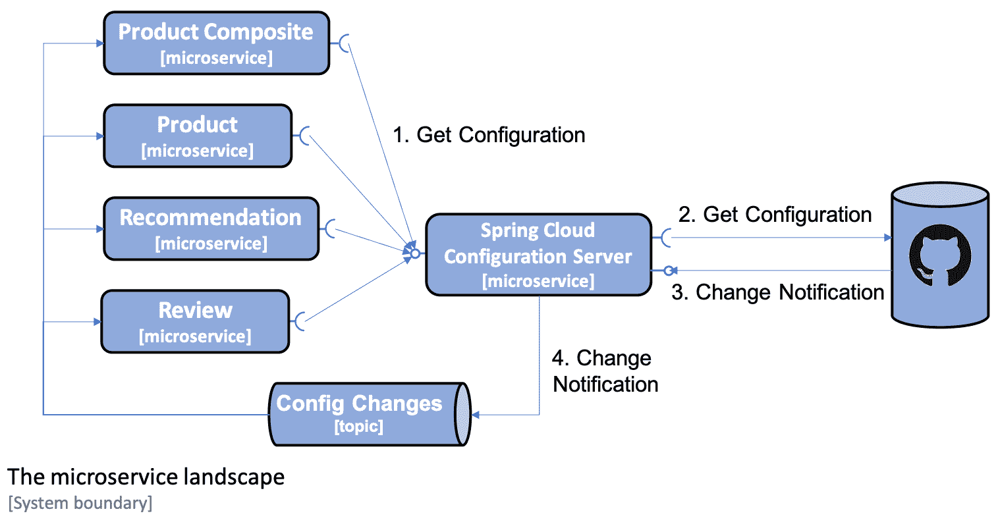
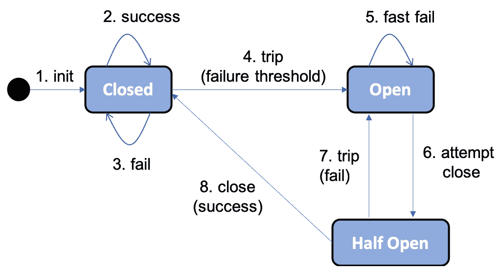
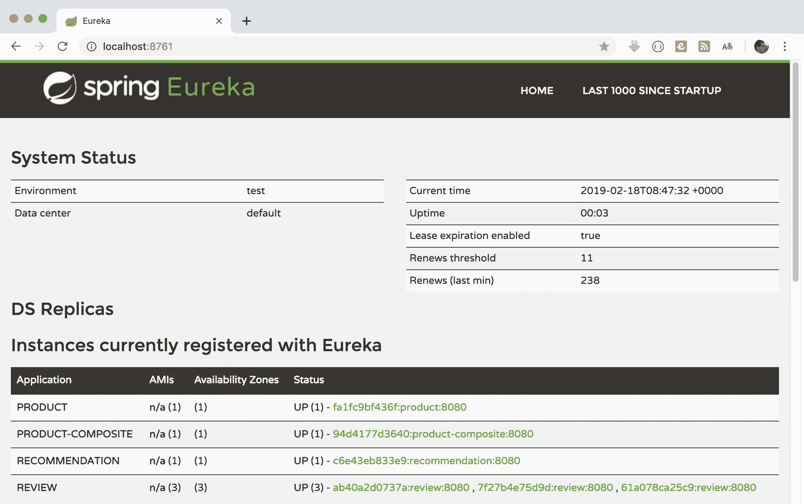
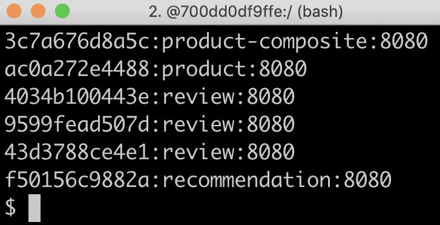

# 使用 Netflix Eureka 和 Ribbon 添加服务发现

在本章中，我们将学习如何使用 Netflix Eureka 作为基于 Spring Boot 的微服务发现服务器。为了使我们的微服务能够与 Netflix Eureka 通信，我们将为 Netflix Eureka 客户端使用 Spring 云模块。在深入研究细节之前，我们将详细说明为什么需要发现服务器以及为什么 DNS 服务器不够。

本章将介绍以下主题：

*   服务发现简介
    *   基于 DNS 的服务发现问题
    *   服务发现的挑战
    *   使用 Netflix Eureka 在春季云中发现服务
*   设置 Netflix Eureka 服务器
*   将微服务连接到 Netflix Eureka 服务器
*   设置在开发过程中使用的配置
*   试用发现服务

# 引入服务发现

服务发现的概念在[第一章](01.html)、*微服务简介*中进行了描述；有关更多信息，请参阅*服务发现*部分。Netflix Eureka 在[第 8 章](08.html)、*春云简介*中作为发现服务引入；有关更多信息，请参阅*Netflix Eureka 作为发现服务*部分。在我们开始讨论实施细节之前，我们将了解以下主题：

*   基于 DNS 的服务发现问题
*   服务发现的挑战
*   使用 Netflix Eureka 在春季云中发现服务

# 基于 DNS 的服务发现问题

那么，有什么问题？

为什么我们不能简单地启动微服务的新实例并依赖循环 DNS？本质上，假设 microservice 实例具有相同的 DNS 名称，DNS 服务器将其解析为可用实例的 IP 地址列表。因此，客户端可以以循环方式调用服务实例。

让我们试试看会发生什么，好吗？遵循以下步骤：

1.  假设您已按照[第 7 章](07.html)、*开发反应式微服务*中的说明，启动系统景观，并使用以下命令插入一些测试数据：

```
cd $BOOK_HOME/chapter07
./test-em-all.bash start
```

2.  将`review`微服务扩展到两个实例：

```
docker-compose up -d --scale review=2
```

3.  向复合产品服务询问它为`review`微服务找到的 IP 地址：

```
docker-compose exec product-composite getent hosts review
```

4.  期望得到如下答案：

```
172.19.0.9 review
172.19.0.8 review
```

太好了，在我的例子中，复合产品服务看到两个 IP 地址，`172.19.0.8`和`172.19.0.9`——一个用于`review`微服务实例的每个实例！

5.  如果需要，可以使用以下命令验证这些 IP 地址是否正确：

```
docker-compose exec --index=1 review cat /etc/hosts
docker-compose exec --index=2 review cat /etc/hosts
```

每个命令输出的最后一行应该包含一个 IP 地址，如前面的代码所示。

6.  现在，让我们试着调用组合产品服务，看看它是否同时使用了`review`微服务的两个实例：

```
curl localhost:8080/product-composite/2 -s | jq -r .serviceAddresses.rev
```

不幸的是，我们将只从一个 microservice 实例获得响应，如本例所示：


真令人失望！ 

好吧，这是怎么回事？

DNS 客户端通常会缓存已解析的 IP 地址，并在收到已解析为 DNS 名称的 IP 地址列表时挂起它尝试的第一个工作 IP 地址。DNS 服务器和 DNS 协议都不适合处理随时出现的易失性微服务实例。因此，从实用的角度来看，基于 DNS 的服务发现不是很有吸引力。

# 使用 SpringCloud 配置进行集中配置

为了管理微服务系统景观的配置，Spring Cloud 包含 Spring Cloud Config，它根据*中央配置*中[第 1 章](01.html)、*微服务简介*的要求，提供配置文件的集中管理节。

Spring Cloud Config 支持将配置文件存储在多个不同的后端中，例如：

*   例如，GitHub 或 Bitbucket 上的 Git 存储库
*   本地文件系统
*   HashiCorp 拱顶
*   JDBC 数据库

SpringCloudConfig 允许我们在层次结构中处理配置；例如，我们可以将配置的公共部分放在公共文件中，将特定于微服务的设置放在单独的配置文件中。

SpringCloudConfig 还支持检测配置中的更改，并将通知推送到受影响的微服务。它使用**Spring 云总线**来传输通知，Spring 云总线是我们已经熟悉的 Spring 云流之上的抽象；也就是说，它支持使用 RabbitMQ 或 Kafka 作为消息传递系统，用于传输开箱即用的通知。

下图说明了 Spring Cloud Config、其客户端、Git 存储库和 Spring Cloud Bus 之间的协作：



该图显示了以下内容：

1.  当微服务启动时，它们会向配置服务器询问其配置。
2.  在本例中，配置服务器从 Git 存储库获取配置。
3.  或者，可以将 Git 存储库配置为在将 Git 提交推送到 Git 存储库时向配置服务器发送通知。
4.  配置服务器将使用 SpringCloudBus 发布更改事件。受更改影响的微服务将作出反应，并从配置服务器检索其更新的配置。

最后，SpringCloud 配置还支持配置中敏感信息的加密，例如凭据。

我们将在[第 12 章](12.html)、*集中配置*中了解 Spring 云配置。

随着 SpringCloud 配置的引入，让我们了解如何使用 Resilience4j 来提高弹性。

# 使用弹性 4J 提高弹性

正如我们在[第 1 章](01.html)、*微服务简介*中已经提到的，在**断路器*部分，事情偶尔会出问题。在协作微服务的相当大规模的系统环境中，我们必须假设始终存在一些问题。必须将故障视为正常状态，并且必须设计系统环境来处理它！*

 *最初，SpringCloud 与 Netflix Hystrix 一起出现，Netflix Hystrix 是一个久经考验的断路器。但自从 Spring Cloud Greenwich 发布以来，建议用 Resilience4j 取代 Netflix Hystrix。原因是 Netflix 最近将 Hystrix 置于维护模式。更多详情请参见[https://github.com/Netflix/Hystrix#hystrix-状态](https://github.com/Netflix/Hystrix#hystrix-status)。

**Resilience4j**是一个基于开源的容错库。您可以在[了解更多信息 https://github.com/resilience4j/resilience4j](http://resilience4j.github.io/resilience4j/) 。它内置以下容错机制：

*   **断路器**用于防止远程服务停止响应时出现一连串故障反应。
*   **速率限制器**用于限制指定时间段内的服务请求数量。
*   **隔板**用于限制一个服务的并发请求数。
*   **重试**用于处理可能不时发生的随机错误。
*   **超时**用于避免等待缓慢或无响应服务响应的时间过长。

在[第 13 章](13.html)*中，我们将重点介绍 Resilience4j*中的断路器。**遵循断路器的经典设计，如下图所示：**

 **

让我们更详细地查看状态图：

1.  断路器在**关闭**时启动，即允许处理请求。
2.  只要请求处理成功，它就会保持在**关闭**状态。
3.  如果故障开始发生，计数器开始计数。
4.  如果达到配置的故障阈值，断路器将**跳闸**，即进入**开启**状态，不允许进一步处理请求。
5.  相反，请求将**快速失败**，即立即返回异常。
6.  经过一段可配置的时间后，断路器将进入**半开**状态，并允许一个请求通过，如探针，以查看故障是否已解决。
7.  如果探头请求失败，断路器返回到**断开**状态。
8.  如果探头请求成功，断路器进入初始**闭合**状态，即允许处理新的请求。

# Resilience4j 中断路器的使用示例

假设我们有一个 REST 服务，它通过名为`myService`的 Resilience4j 由断路器保护。

例如，如果该服务开始产生内部错误，因为它无法访问它所依赖的服务，我们可能会从该服务获得响应，如`500 Internal Server Error`。经过多次可配置的尝试后，电路将断开，我们将得到一个快速故障，返回错误消息，如`CircuitBreaker 'myService' is open`。当错误解决后，我们进行新的尝试（在可配置的等待时间之后），断路器将允许新的尝试作为探针。如果呼叫成功，断路器将再次闭合；也就是说，它运行正常。

当弹性 4J 与弹簧靴一起使用时，我们将能够使用其弹簧靴执行器`health`端点监测微服务中断路器的状态。例如，我们可以使用`curl`来查看断路器的状态，即`myService`：

```
curl $HOST:$PORT/actuator/health -s | jq .details.myServiceCircuitBreaker
```

如果工作正常，即电路为`closed`，则会做出如下响应：


如果出现故障且电路**开路**，则会做出如下响应：


随着 Resilience4j 的引入，特别是它的断路器的引入，我们看到了一个如何使用断路器为 REST 客户端处理错误的示例。让我们了解如何使用 Spring Cloud Sleuth 和 Zipkin 进行分布式跟踪。

# 使用 Spring Cloud Sleuth 和 Zipkin 进行分布式跟踪

要了解分布式系统（如协作微服务的系统环境）中的情况，在处理对系统环境的外部调用时，能够跟踪和可视化请求和消息在微服务之间的流动是至关重要的。

有关此主题的更多信息，请参阅[第 1 章](01.html)、*微服务简介*、*分布式跟踪**部分*

 *Spring Cloud 附带了**Spring Cloud Sleuth**，它可以用一个公共*关联 ID*标记属于同一处理流的请求和消息/事件

Spring Cloud Sleuth 还可以用相关 ID 装饰日志消息，以便更容易跟踪来自同一处理流程的不同微服务的日志消息。**Zipkin**是一个分布式跟踪系统（[http://zipkin.io](http://zipkin.io/) springcloudsleuth 可以将跟踪数据发送到服务器进行存储和可视化。

Spring Cloud Sleuth 和 Zipkin**中处理分布式跟踪信息的基础设施基于 Google Dapper（[https://ai.google/research/pubs/pub36356](https://ai.google/research/pubs/pub36356) ）。在 Dapper 中，来自完整工作流的跟踪信息称为**跟踪树**，树的子部分，如基本工作单元，称为**跨度**。跨度又可以由子跨度组成，这些子跨度形成跟踪树。相关 ID 称为`TraceId`，跨度由其自身唯一的`SpanId`及其所属跟踪树的`TraceId`标识。**

 **Spring Cloud Sleuth 可以通过 HTTP 同步或使用 RabbitMQ 或 Kafka 异步向 Zipkin 发送请求。为了避免从我们的微服务创建对 Zipkin 服务器的运行时依赖关系，我们更喜欢使用 RabbitMQ 或 Kafka 异步向 Zipkin 发送跟踪信息。如下图所示：


在[第 14 章](14.html)*理解分布式跟踪*中，我们将看到如何使用 Spring Cloud Sleuth 和 Zipkin 跟踪微服务环境中的处理过程。以下是 Zipkin UI 的屏幕截图，该截图显示了在处理聚合产品创建过程中创建的跟踪树：


HTTP`POST`请求被发送到 product composite 服务，并通过将创建事件发布到产品、建议和评论的主题来响应。这些事件由三个核心微服务并行使用，创建事件中的数据存储在每个微服务的数据库中。

随着 Spring Cloud Sleuth 和 Zipkin for distributed Tracking 的引入，我们看到了一个外部同步 HTTP 请求处理的分布式跟踪示例，其中包括相关微服务之间事件的异步传递。

# 总结

在本章中，我们看到了 SpringCloud 是如何从以 Netflix OSS 为中心发展到今天的更大范围的。我们还介绍了如何使用 Spring Cloud Greenwich 最新版本中的组件来实现我们在[第 1 章](01.html)、*微服务简介*、*微服务设计模式*一节中描述的一些设计模式。这些设计模式是使协作微服务生产环境就绪所必需的。

请阅读下一章，了解如何使用 Netflix Eureka 和 Spring 云负载平衡器实现服务发现！

# 问题

1.  Netflix Eureka 的目的是什么？
2.  SpringCloudGateway 的主要功能是什么？
3.  SpringCloud 配置支持哪些后端？
4.  Resilience4j 提供了哪些功能？
5.  在分布式跟踪中，跟踪树和跨度的概念是什么？论文中定义它们的是什么？

# 技术要求

本书中描述的所有命令都是使用 macOS Mojave 在 MacBook Pro 上运行的，但是修改它应该很简单，这样它就可以在其他平台上运行，比如 Linux 或 Windows。

本章中无需安装新工具。

本章的源代码可以在 GitHub 上找到：[https://github.com/PacktPublishing/Hands-On-Microservices-with-Spring-Boot-and-Spring-Cloud/tree/master/Chapter09](https://github.com/PacktPublishing/Hands-On-Microservices-with-Spring-Boot-and-Spring-Cloud/tree/master/Chapter09) 。

为了能够运行本书中描述的命令，请将源代码下载到一个文件夹，并设置一个指向该文件夹的环境变量`$BOOK_HOME`。一些示例命令如下所示：

```
export BOOK_HOME=~/Documents/Hands-On-Microservices-with-Spring-Boot-and-Spring-Cloud
git clone https://github.com/PacktPublishing/Hands-On-Microservices-with-Spring-Boot-and-Spring-Cloud $BOOK_HOME
cd $BOOK_HOME/Chapter09
```

Java 源代码是为 Java8 编写的，并在 Java12 上进行了测试。本章使用 Spring Cloud 2.1.0（也称为**格林威治**版本）、Spring Boot 2.1.3 和 Spring 5.1.5，即编写本章时 Spring 组件的最新可用版本。

源代码包含以下 Gradle 项目：

*   `api`
*   `util`
*   `microservices/product-service`
*   `microservices/review-service`
*   `microservices/recommendation-service`
*   `microservices/product-composite-service`
*   `spring-cloud/eureka-server`

本章中的代码示例均来自`$BOOK_HOME/Chapter09`目录中的源代码，但已在多个地方进行了编辑，以删除源代码中不相关的部分，如注释、导入和日志语句。

如果您想查看[第 9 章](09.html)、*使用 Netflix Eureka 和 Ribbon*添加服务发现中应用于源代码的更改，看看将 Netflix Eureka 作为发现服务添加到微服务领域需要做些什么，您可以将其与[的源代码进行比较第七章](07.html)*开发反应式微服务*。您可以使用自己喜欢的`diff`工具，分别比较两个文件夹`$BOOK_HOME/Chapter07`和`$BOOK_HOME/Chapter09`。

# 服务发现的挑战

因此，我们需要比普通 DNS 更强大的东西来跟踪可用的微服务实例！

在跟踪许多小的活动部件（即微服务实例）时，我们必须考虑以下几点：

*   新实例可以在任何时间点启动。
*   现有实例可能会停止响应，并最终在任何时间点崩溃。
*   一些失败的实例可能会在一段时间后恢复正常，并且应该再次开始接收流量，而其他实例则不会，并且应该从服务注册表中删除。
*   一些微服务实例可能需要一些时间才能启动；也就是说，仅仅因为它们可以接收 HTTP 请求，并不意味着流量应该路由到它们。
*   任何时候都可能发生意外的网络分区和其他与网络相关的错误。

至少可以说，构建一个健壮且具有弹性的发现服务器并非易事。让我们看看如何使用 Netflix Eureka 来应对这些挑战！

# 使用 Netflix Eureka 在春季云中发现服务

Netflix Eureka 实现客户端服务发现，这意味着客户端运行与发现服务 Netflix Eureka 对话的软件，以获取有关可用微服务实例的信息。下图对此进行了说明：


程序如下：

1.  例如，每当一个微服务实例启动时，**Review**服务就会将自身注册到一个 Eureka 服务器。
2.  每个微服务实例定期向 Eureka 服务器发送心跳消息，告诉它微服务实例正常，可以接收请求。
3.  例如，**产品组合**服务使用一个客户端库，定期向 Eureka 服务询问可用服务的信息。
4.  当客户端需要向另一个微服务发送请求时，它的客户端库中已经有可用实例的列表，并且可以在不询问 discovery server 的情况下选择其中一个实例。典型的可用实例是以循环方式选择的；也就是说，在第一个被再次调用之前，它们被一个接一个地调用。

在[第 17 章](17.html)中*将 Kubernetes 功能作为替代*实现，我们将研究如何在 Kubernetes 中使用服务器端*服务*概念提供发现服务的替代方法。

SpringCloud 附带了如何与 Netflix Eureka 等发现服务进行通信的抽象，并提供了一个名为`DiscoveryClient`的接口。这可用于与发现服务交互，以获取有关可用服务和实例的信息。`DiscoveryClient`接口的实现还能够自动向 discovery server 注册 Spring 引导应用程序。

Spring Boot 可以在启动过程中自动找到`DiscoveryClient`接口的实现，因此我们只需要引入对相应实现的依赖来连接到发现服务器。在 Netflix Eureka 的案例中，我们的微服务使用的依赖关系是`spring-cloud-starter-netflix-eureka-client`。

SpringCloud 也有`DiscoveryClient`实现，支持使用 ApacheZooKeeper 或 HashicorpConcur 作为发现服务器。

SpringCloud 还为希望通过负载平衡器向发现服务中注册的实例发出请求的客户端提供了一个抽象的`LoadBalancerClient`接口。标准的反应式 HTTP 客户端`WebClient`可以配置为使用`LoadBalancerClient`实现。通过向返回`WebClient.Builder`对象的`@Bean`声明添加`@LoadBalanced`注释，`LoadBalancerClient`实现将作为`ExchangeFilterFunction`注入`Builder`实例。由于`spring-cloud-starter-netflix-eureka-client`对类路径的依赖，将自动注入`RibbonLoadBalancerClient`，即基于 Netflix Ribbon 的负载平衡器。因此，即使 Netflix Ribbon 处于维护模式，如[第 8 章](08.html)、*春云简介*所述，它仍然在引擎盖下使用。在本章后面的*将微服务连接到 Netflix Eureka 服务器*一节中，我们将看一些如何使用微服务的源代码示例。

总之，Spring Cloud 使使用 Netflix Eureka 作为发现服务变得非常容易。通过介绍服务发现及其挑战，以及 Netflix Eureka 如何与 Spring Cloud 一起使用，我们准备学习如何设置 Netflix Eureka 服务器。

# 试用发现服务

所有详细信息就绪后，我们准备试用该服务：

1.  首先，使用以下命令构建 Docker 映像：

```
cd $BOOK_HOME/Chapter09
./gradlew build && docker-compose build
```

2.  接下来，启动系统环境并使用以下命令运行常规测试：

```
./test-em-all.bash start
```

预期输出与我们在前面章节中看到的类似：


随着系统环境的启动和运行，我们可以从测试如何扩展其中一个微服务的实例数量开始。

# 设置 Netflix Eureka 服务器

在本节中，我们将学习如何为服务发现设置 Netflix Eureka 服务器。使用 Spring Cloud 设置 Netflix Eureka 服务器非常简单，只需执行以下步骤：

1.  使用 Spring Initializer 创建 Spring Boot 项目，如**使用 Spring Initializer 生成骨架代码*部分中[第 3 章](03.html)*创建一组协作微服务*所述。*
**   将依赖项添加到`spring-cloud-starter-netflix-eureka-server`。*   将`@EnableEurekaServer`注释添加到应用程序类中。*   添加一个 Dockerfile，类似于用于我们微服务的 Dockerfile，但我们导出的是 Eureka 默认端口`8761`，而不是我们微服务的默认端口`8080`。*   将 Eureka 服务器添加到我们的三个 Docker Compose 文件中，即`docker-compose.yml`、`docker-compose-partitions.yml`和`docker-compose-kafka.yml`：*

 *```
eureka:
  build: spring-cloud/eureka-server
  mem_limit: 350m
  ports:
    - "8761:8761"
```

6.  最后，添加一些配置。请转到本章的*设置用于开发过程的配置*部分，我们将在这里介绍 Eureka 服务器和我们的微服务的配置。

就这些！

您可以在`$BOOK_HOME/Chapter09/spring-cloud/eureka-server`文件夹中找到 Eureka 服务器的源代码。

了解如何为服务发现设置 Netflix Eureka 服务器，我们准备学习如何将微服务连接到 Netflix Eureka 服务器。

# 将微服务连接到 Netflix Eureka 服务器

在本节中，我们将学习如何将 microservice 实例连接到 Netflix Eureka 服务器。我们将了解微服务实例在启动期间如何向 Eureka 服务器注册，以及客户端如何使用 Eureka 服务器查找它想要调用的微服务实例。

为了能够在 Eureka 服务器中注册 microservice 实例，我们需要执行以下操作：

1.  将依赖项添加到生成文件`build.gradle`中的`spring-cloud-starter-netflix-eureka-client`：

```
implementation('org.springframework.cloud:spring-cloud-starter-netflix-eureka-client')
```

2.  在单个微服务上运行测试时，我们不希望依赖于 Eureka 服务器的启动和运行。因此，我们将禁用 Netflix Eureka 在所有 Spring 引导测试中的使用，即使用`@SpringBootTest`注释的 JUnit 测试。这可以通过添加`eureka.client.enabled`属性并在注释中将其设置为`false`来实现，如下所示：

```
@SpringBootTest(webEnvironment=RANDOM_PORT, properties = {"eureka.client.enabled=false"})
```

3.  最后，添加一些配置。请转到*设置**设置配置以用于开发过程*部分，我们将在这里介绍 Eureka 服务器和我们的微服务的配置。

但是，配置中有一个属性非常重要：`spring.application.name`。它用于为每个微服务提供一个虚拟主机名，即 Eureka 服务用于标识每个微服务的名称。Eureka 客户端将在 URL 中使用此虚拟主机名，这些 URL 用于对微服务进行 HTTP 调用，我们将在继续时看到这一点。

为了能够通过`product-composite`微服务中的 Eureka 服务器查找可用的微服务实例，我们还需要执行以下操作：

1.  如前所述，在应用程序类中添加负载平衡器感知的`WebClient`构建器，即`se.magnus.microservices.composite.product.ProductCompositeServiceApplication`：

```
@Bean
@LoadBalanced
public WebClient.Builder loadBalancedWebClientBuilder() {
  final WebClient.Builder builder = WebClient.builder();
  return builder;
}
```

2.  更新如何在集成类`se.magnus.microservices.composite.product.services.ProductCompositeIntegration`中创建`WebClient`对象。如前所述，`@LoadBalanced`注释将导致 Spring 将负载平衡器感知过滤器注入`WebClient.Builder`bean。不幸的是，直到构造函数在集成类中运行之后，这才可以完成。这意味着我们必须将`webClient`的构造从构造函数中移开，就像我们在[第 7 章](07.html)*开发反应式微服务*中所做的那样，转移到一个单独的 getter 方法中，该方法创建`webClient`是惰性的，也就是说，一旦第一次使用它。这在以下代码中显示：

```
private WebClient getWebClient() {
    if (webClient == null) {
        webClient = webClientBuilder.build();
    }
    return webClient;
}
```

3.  无论何时使用`WebClient`创建传出 HTTP 请求，都会通过`getWebClient()`getter 方法访问该请求（而不是直接使用`webClient`字段）。请参见以下示例：

```
@Override
public Mono<Product> getProduct(int productId) {
    String url = productServiceUrl + "/product/" + productId;
    return getWebClient().get().uri(url).retrieve()
        .bodyToMono(Product.class).log()
        .onErrorMap(WebClientResponseException.class, ex -> handleException(ex));
}
```

4.  我们现在可以在`application.yml`中摆脱可用微服务的硬编码配置。例如，考虑下面的代码：

```
app:
  product-service:
    host: localhost
    port: 7001
  recommendation-service:
    host: localhost
    port: 7002
  review-service:
    host: localhost
    port: 7003
```

集成类中处理硬编码配置的相应代码被替换为核心微服务 API 的基本 URL 声明。这在以下代码中显示：

```
private final String productServiceUrl = "http://product";
private final String recommendationServiceUrl = "http://recommendation";
private final String reviewServiceUrl = "http://review";
```

前面 URL 中的主机名不是实际的 DNS 名称。相反，它们是微服务在向 Eureka 服务器注册时使用的虚拟主机名，即`spring.application.name`属性的值。

了解如何将微服务实例连接到 Netflix Eureka 服务器，我们可以继续学习如何配置需要连接到 Eureka 服务器的 Eureka 服务器和微服务实例。

# 设置在开发过程中使用的配置

现在，是将 Netflix Eureka 设置为发现服务的最棘手部分的时候了，也就是说，为 Eureka 服务器及其客户端设置工作配置：我们的微服务实例。

Netflix Eureka 是一种高度可配置的发现服务器，可针对多种不同的用例进行设置，并提供强健、弹性和容错的运行时特性。这种灵活性和健壮性的一个缺点是，它几乎有大量的配置选项。幸运的是，Netflix Eureka 为大多数可配置参数提供了良好的默认值，至少在生产环境中使用时是这样。

在开发过程中使用 Netflix Eureka 时，默认值会导致启动时间过长。例如，客户端对在 Eureka 服务器中注册的 microservices 实例进行初始成功调用可能需要很长时间。

使用默认配置值时，最多可经历两分钟的等待时间。此等待时间被添加到 Eureka 服务和 MicroService 启动所需的时间中。此等待时间的原因是所涉及的进程需要彼此同步注册信息。

微服务实例需要向 Eureka 服务器注册，客户端需要从 Eureka 服务器收集信息。此通信主要基于心跳，默认情况下，心跳每 30 秒发生一次。还涉及几个缓存，这会减慢更新的传播速度。

我们将使用一种最小化等待时间的配置，这在开发过程中非常有用。对于在生产环境中使用，应使用默认值作为起点！

我们将只使用一个 Netflix Eureka 服务器实例，这在开发环境中是可以的。在生产环境中，应始终使用两个或多个实例，以确保 Netflix Eureka 服务器的高可用性。

让我们开始了解需要了解哪些类型的配置参数。

# 尤里卡配置参数

Eureka 的配置参数分为三组：

*   Eureka 服务器有一些参数，前缀为`eureka.server`。
*   有用于 Eureka 客户端的参数，前缀为`eureka.client`。这适用于希望与 Eureka 服务器通信的客户端。
*   有 Eureka 实例的参数，前缀为`eureka.instance`。这适用于希望在 Eureka 服务器中注册自己的 microservices 实例。

Spring 云文档中描述了一些可用参数：*服务发现：Eureka 服务器*：[https://cloud.spring.io/spring-cloud-static/Greenwich.RELEASE/single/spring-cloud.html#spring-云 eureka 服务器](https://cloud.spring.io/spring-cloud-static/Greenwich.RELEASE/single/spring-cloud.html#spring-cloud-eureka-server) *服务发现：eureka 客户端*： [https://cloud.spring.io/spring-cloud-static/Greenwich.RELEASE/single/spring-cloud.html#_service_discovery_eureka_clients](https://cloud.spring.io/spring-cloud-static/Greenwich.RELEASE/single/spring-cloud.html#_service_discovery_eureka_clients)

有关可用参数的详细列表，我建议阅读源代码：

*   有关 Eureka 服务器参数，请查看`org.springframework.cloud.netflix.eureka.server.EurekaServerConfigBean`类的默认值和`com.netflix.eureka.EurekaServerConfig`接口的相关文档。
*   有关 Eureka 客户端参数，请查看`org.springframework.cloud.netflix.eureka.EurekaClientConfigBean`类中的默认值和文档。
*   对于 Eureka 实例参数，请查看`org.springframework.cloud.netflix.eureka.EurekaInstanceConfigBean`类中的默认值和文档。

让我们开始了解 Eureka 服务器的配置参数。

# 配置 Eureka 服务器

要将 Eureka 服务器配置为在开发环境中使用，可以使用以下配置：

```
server:
  port: 8761

eureka:
  instance:
    hostname: localhost
  client:
    registerWithEureka: false
    fetchRegistry: false
    serviceUrl:
      defaultZone: http://${eureka.instance.hostname}:${server.port}/eureka/

  server:
    waitTimeInMsWhenSyncEmpty: 0
    response-cache-update-interval-ms: 5000
```

配置的第一部分，对于 Eureka`instance`和`client`是独立 Eureka 服务器的标准配置。有关详细信息，请参阅我们前面提到的 Spring 云文档。Eureka`server``waitTimeInMsWhenSyncEmpty`和`response-cache-update-interval-ms`使用的最后两个参数用于最小化启动时间。

配置了 Eureka 服务器后，我们就可以看到如何配置 Eureka 服务器的客户端，即 microservice 实例。

# 将客户端配置到 Eureka 服务器

为了能够连接到 Eureka 服务器，微服务具有以下配置：

```
eureka:
  client:
    serviceUrl:
 defaultZone: http://localhost:8761/eureka/
 initialInstanceInfoReplicationIntervalSeconds: 5
 registryFetchIntervalSeconds: 5
 instance:
 leaseRenewalIntervalInSeconds: 5
 leaseExpirationDurationInSeconds: 5

---
spring.profiles: docker

eureka.client.serviceUrl.defaultZone: http://eureka:8761/eureka/
```

`eureka.client.serviceUrl.defaultZone`参数用于查找 Eureka 服务器，而其他参数用于最小化启动时间和注销已停止的 microservice 实例所需的时间。

`product-composite`微服务使用 Eureka 服务器查找其他微服务，也有两个 Netflix Ribbon 特定参数：

```
ribbon.ServerListRefreshInterval: 5000
ribbon.NFLoadBalancerPingInterval: 5
```

这两个参数也用于最小化启动时间。

现在，我们已经准备好了使用 Netflix Eureka 服务器和我们的微服务实际试用发现服务所需的一切。

# 放大

现在，我们可以通过启动两个额外的`review`微服务实例来尝试发现服务：

```
docker-compose up -d --scale review=3
```

使用前面的命令，我们要求 Docker Compose 运行三个`review`服务实例。由于一个实例已在运行，因此将启动两个新实例。

新实例启动并运行后，浏览到`http://localhost:8761/`并预期如下所示：



运行此 localhost 后，请确认您可以在 Netflix Eureka web UI 中看到三个`review`实例，如前一屏幕截图所示。

了解新实例何时启动并运行的一种方法是运行`docker-compose logs -f review`命令并查找如下输出：


我们还可以使用 Eureka 服务公开的 RESTAPI。要获取实例 ID 列表，我们可以发出`curl`命令，如下所示：

```
curl -H "accept:application/json" localhost:8761/eureka/apps -s | jq -r .applications.application[].instance[].instanceId
```

预期的响应类似于以下内容：



现在我们已经启动并运行了所有实例，让我们通过发出一些请求并关注响应中`review`服务的地址来尝试客户端负载平衡器，如下所示：

```
curl localhost:8080/product-composite/2 -s | jq -r .serviceAddresses.rev
```

预期的响应类似于以下内容：


注意`review`服务的地址在每次响应中都会发生变化；也就是说，负载平衡器使用循环调用可用的`review`实例，一次一个！

我们还可以使用以下命令查看`review`实例日志：

```
docker-compose logs -f review
```

在此之后，您将看到类似于以下内容的输出：


在前面的输出中，我们可以看到三个 review microservice 实例，`review_1`、`review_2`和`review_3`依次响应请求的方式

在尝试放大微服务实例之后，我们将尝试缩小实例时会发生什么。

# 缩小

我们也来看看如果我们丢失一个`review`微服务实例会发生什么。我们可以通过运行以下命令来模拟一个实例意外停止：

```
docker-compose up -d --scale review=2
```

`review`实例关闭后，API 调用可能会有一个很短的时间段失败。这是由于丢失实例的信息传播到客户端（即`product-composite`服务）所需的时间造成的。在此期间，客户端负载平衡器可能会选择不再存在的实例。为了防止这种情况发生，可以使用超时和重试等恢复机制。在[第 13 章](13.html)中*使用 Resilience4j*提高弹性，我们将了解如何应用这一点。现在，让我们在`curl`命令上指定一个超时，使用`-m 2`开关指定响应等待时间不超过两秒：

```
curl localhost:8080/product-composite/2 -m 2
```

如果发生超时，即客户端负载平衡器试图调用一个不再存在的实例，则`curl`将出现以下响应：

```
curl: (28) Operation timed out after 2003 milliseconds with 0 bytes received
```

除此之外，我们应该期待其余两个例子的正常反应；也就是说，`serviceAddresses.rev`字段应该包含两个实例的地址，如下所示：


在前面的示例输出中，我们可以看到报告了两个不同的容器名称和 IP 地址。这意味着请求已由不同的微服务实例提供服务。

在尝试缩小 microservice 实例的规模后，我们可以尝试一些更具破坏性的方法：停止 Eureka 服务器，看看发现服务暂时不可用时会发生什么。

# 使用 Eureka 服务器进行中断性测试

让我们给 Eureka 服务器带来一些混乱，看看系统环境如何管理它！

首先，如果我们使 Eureka 服务器崩溃，会发生什么？

只要客户端在停止 Eureka 服务器之前已经从该服务器读取了有关可用 microservice 实例的信息，那么客户端就可以了，因为它们将信息缓存在本地。但是，新实例将不会提供给客户端，并且如果任何正在运行的实例被终止，也不会通知它们。因此，对不再运行的实例的调用将导致失败

让我们试试这个！

# 停止 Eureka 服务器

要模拟 Eureka 服务器崩溃，请执行以下步骤：

1.  首先，停止 Eureka 服务器并使两个`review`实例保持运行：

```
docker-compose up -d --scale review=2 --scale eureka=0
```

2.  尝试对 API 进行两次调用，并提取`review`服务的服务地址：

```
curl localhost:8080/product-composite/2 -s | jq -r .serviceAddresses.rev
```

3.  响应将与我们停止 Eureka 服务器之前一样，包含两个`review`实例的地址，如下所示：


这表明客户端可以调用现有实例，即使 Eureka 服务器不再运行！

# 停止审阅实例

为了进一步调查崩溃的 Eureka 服务器的影响，让我们模拟一下剩余的`review`微服务实例中的一个也会崩溃。使用以下命令终止两个`review`实例中的一个：

```
docker-compose up -d --scale review=1 --scale eureka=0
```

由于没有运行 Eureka 服务器，因此不会通知客户端，即`product-composite`服务`review`实例之一已消失。因此，它仍然认为有两个实例正在运行。对客户端的每一次调用都会导致客户端调用一个不再存在的`review`实例，导致客户端的响应不包含`review`服务的任何信息。`review`服务的服务地址将为空。

请尝试前面的`curl`命令，以验证`review`服务的服务地址每秒将为空。如前所述，这可以通过使用诸如超时和重试之类的恢复机制来防止

# 启动产品服务的额外实例

作为对崩溃的 Eureka 服务器影响的最终测试，让我们看看如果启动`product`微服务的新实例会发生什么。执行以下步骤：

1.  让我们尝试启动`product`服务的新实例：

```
docker-compose up -d --scale review=1 --scale eureka=0 --scale product=2
```

2.  多次调用 API，并使用以下命令提取`product`服务的地址：

```
curl localhost:8080/product-composite/2 -s | jq -r .serviceAddresses.pro
```

3.  由于没有运行 Eureka 服务器，因此不会通知客户端新的`product`实例，因此所有调用都将转到第一个实例，如下例所示：


现在，我们已经看到了 Netflix Eureka 服务器无法启动和运行的一些最重要方面。让我们通过再次启动 Netflix Eureka 服务器并了解系统环境如何处理自我修复（即恢复力），来结束中断性测试部分。

# 再次启动 Eureka 服务器

在本节中，我们将通过再次启动 Eureka 服务器来结束中断测试。我们还将验证系统景观自我修复，即验证`product`微服务的新实例已在 Netflix Eureka 服务器上注册，并且客户端已由 Eureka 服务器更新。执行以下步骤：

1.  使用以下命令启动 Eureka 服务器：

```
docker-compose up -d --scale review=1 --scale eureka=1 --scale product=2
```

对 API 进行一些新调用，并验证是否发生以下情况：

*   所有调用都转到剩余的`review`实例，即客户端检测到第二个`review`实例已经离开。
*   对`product`服务的调用在两个`product`实例上进行负载平衡，即客户端检测到有两个`product`实例可用。

2.  多次拨打以下电话提取产品和`review`服务的地址：

```
curl localhost:8080/product-composite/2 -s | jq -r .serviceAddresses
```

3.  验证来自 API 调用的响应是否包含涉及的`product`和`review`实例的地址，如下所示：


这是第二个答复：


`192.168.128.3`和`192.168.128.7`IP 地址属于两个`product`实例。`192.168.128.9`是`review`实例的 IP 地址。

总而言之，Eureka 服务器提供了一个非常健壮且具有弹性的发现服务实现。如果需要更高的可用性，可以启动多个 Eureka 服务器并将其配置为相互通信。有关如何设置多个 Eureka 服务器的详细信息，请参见 Spring 云文档：[https://cloud.spring.io/spring-cloud-static/Greenwich.RELEASE/single/spring-cloud.html#spring-云 eureka 服务器对等感知](https://cloud.spring.io/spring-cloud-static/Greenwich.RELEASE/single/spring-cloud.html#spring-cloud-eureka-server-peer-awareness)。

4.  最后，使用以下命令关闭系统景观：

```
docker-compose down
```

这就完成了对发现服务器 Netflix Eureka 的测试，我们在测试中了解了如何放大和缩小微服务实例，并了解了 Netflix Eureka 服务器崩溃后重新联机时会发生什么情况。

# 总结

在本章中，我们学习了如何使用 Netflix Eureka 进行服务发现。首先，我们研究了简单的基于 DNS 的服务发现解决方案的缺点，以及健壮而有弹性的服务发现解决方案必须能够应对的挑战。

Netflix Eureka 是一个功能非常强大的服务发现解决方案，它提供了强健、有弹性和容错的运行时特性。然而，正确配置可能是一个挑战，尤其是对于流畅的开发人员体验。使用 SpringCloud，设置 Netflix Eureka 服务器和适应基于 Spring 引导的微服务变得很容易，这样它们就可以在启动期间向 Eureka 注册自己，并且在充当其他微服务的客户端时，可以跟踪可用的微服务实例。

有了发现服务，是时候看看我们如何使用 SpringCloudGateway 作为边缘服务器来处理外部流量了。请转到下一章，了解如何操作！

# 问题

1.  要将使用 Spring Initializer 创建的 Spring 引导应用程序转变为成熟的 Netflix Eureka 服务器，需要什么？
2.  要使基于 Spring Boot 的微服务自动注册为 Netflix Eureka 的初创公司，需要什么？
3.  要使基于 Spring Boot 的微服务能够调用在 Netflix Eureka 服务器中注册的另一个微服务，需要什么？
4.  假设您有一台 Netflix Eureka 服务器，以及一个微服务*a*实例和两个微服务*B*实例。所有微服务实例都在 Netflix Eureka 服务器上注册。微服务*A*根据从 Eureka 服务器获取的信息向微服务*B*发出 HTTP 请求。如果反过来发生以下情况，将会发生什么情况：
    *   Netflix Eureka 服务器崩溃
    *   微服务*B*崩溃实例之一
    *   微服务*A*新实例启动
    *   微服务*B*新实例启动
    *   Netflix Eureka 服务器再次启动*******