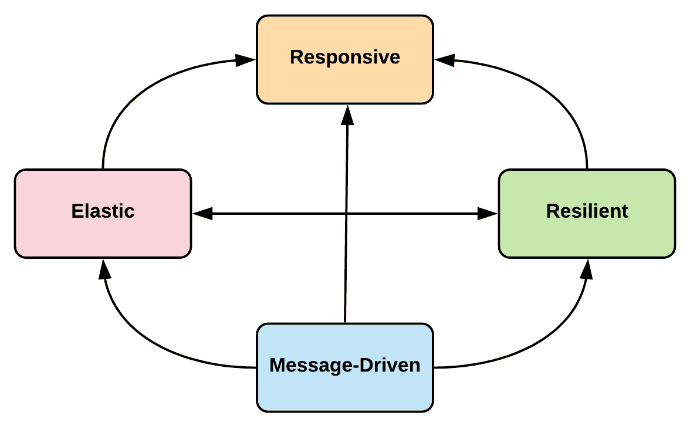
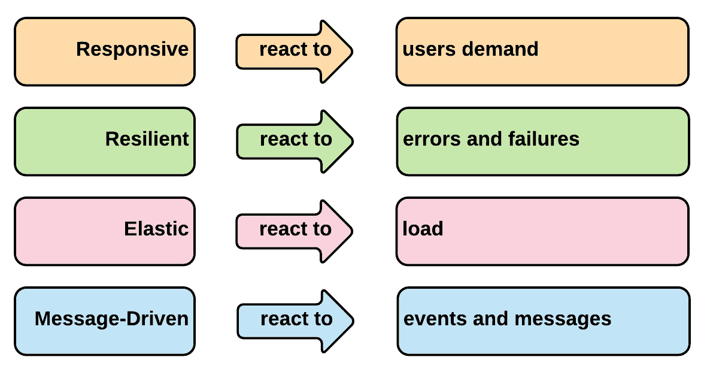
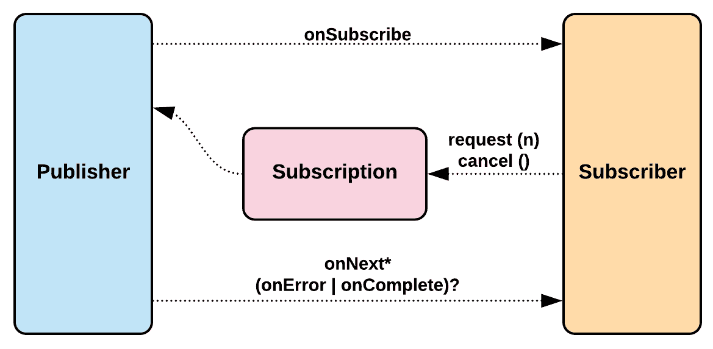
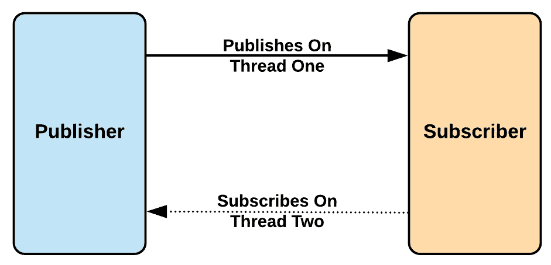
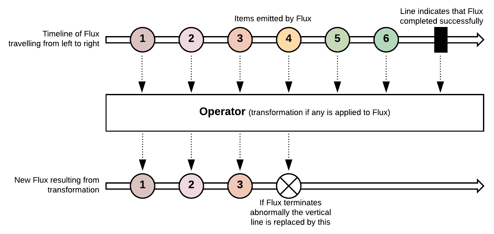
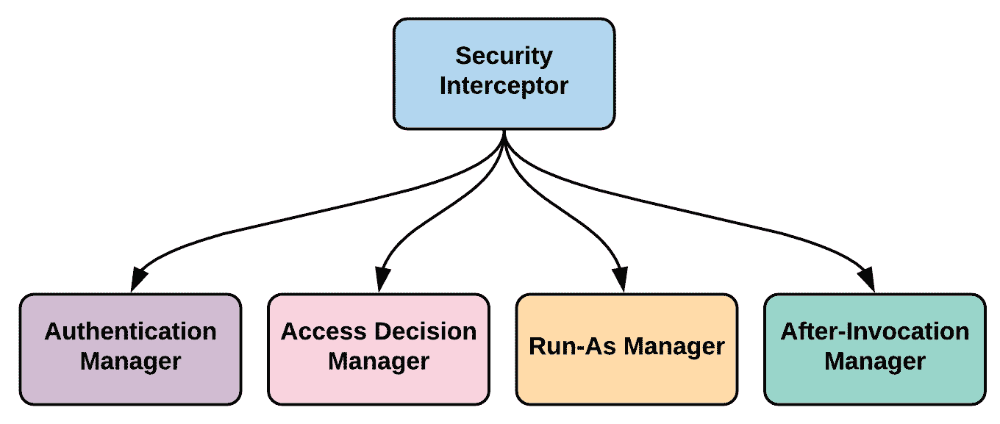
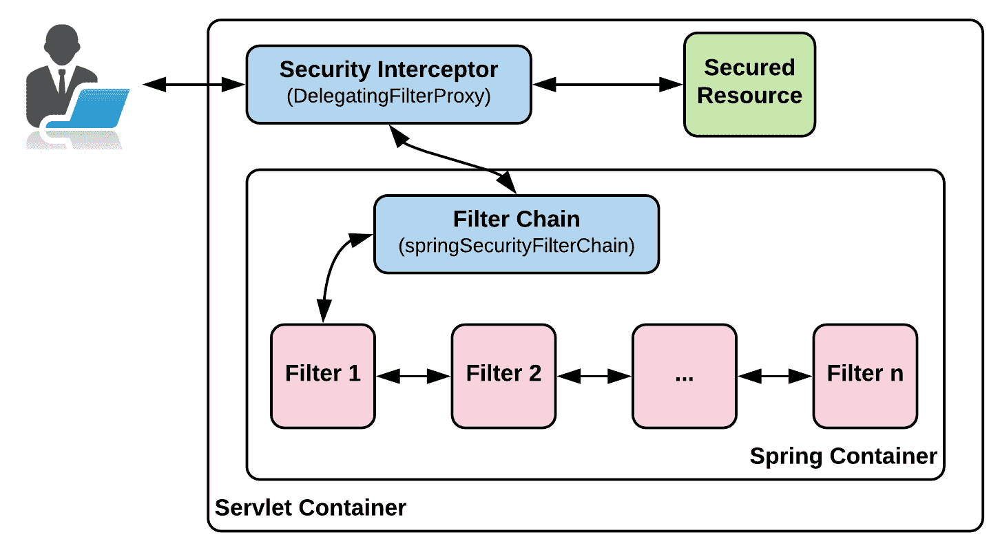

# 一、Spring5 和 SpringSecurity5 概述

本书希望读者熟悉 Spring 框架（任何版本）和 SpringSecurity（任何版本）。这是一个破冰章节，向读者介绍一些最重要的概念；我们将在后面的章节中对其进行详细介绍。

本章将向您介绍新的应用程序需求，然后介绍反应式编程概念。它涉及应用程序安全性以及 SpringSecurity 如何解决应用程序中的安全问题。

我们将继续介绍 Spring Security，然后通过解释本章中的示例是如何构造的来结束本章。这一点非常重要，因为我希望读者在代码中引入新概念时感到舒适。

在本章中，我们将介绍以下主题：

*   新一代应用需求
*   反应式编程
*   反应性应用
*   弹簧框架
*   Java 中的反应式景观
*   Spring 框架与反应式应用
*   应用程序安全
*   SpringSecurity
*   Spring Security 的核心功能
*   SpringSecurity5 的新功能
*   Spring Security 的工作原理
*   核心 SpringSecurity 模块

# 示例的结构

重要的是你要理解我们将如何在本书中使用示例。因为这本书试图给出很多关于 SpringSecurity5 及其反应方面的细节，所以在整本书中我们不会有一个单一的用例。相反，我们将继续创建小项目，以帮助您理解所涵盖的每个核心概念。以下是本书中代码库的一些重要方面：

*   大多数概念将使用独立的 Spring Boot 项目进行介绍。
*   有时，我们会使用著名的 Spring 初始化器（[https://start.spring.io/](https://start.spring.io/) 引导我们的示例 Spring 引导应用程序。在其他情况下，我们将从已有的基础项目开始，并通过代码引入更多概念。
*   通常，我们将使用 Java 配置。有时，我们可能会使用基于 XML 的配置。
*   我们将尽可能地简化我们的示例，这样我们就不会失去对正在引入的核心概念的关注。
*   尽管本书的重点是反应式应用程序，但我们不会在每次介绍时都介绍这一点。有时，我们只是在做简单的、老式的命令式编程，因为了解反应式编程并在需要时使用它更为重要。这并不是说我们必须在任何可能的地方使用反应式代码，而是在你认为合适的地方使用它。
*   我们将在所有项目中使用 VS 代码，并且我们将最充分地使用 VS 代码中提供的扩展。我们还将使用 Spring 初始值设定项扩展，而不是使用在线 Spring 初始值设定项。
*   在本书中，我们大部分时间将使用 Maven。也许有一种情况我们可以试试格拉德。
*   有时，我们可能会使用 IntelliJ IDE，您会看到一些屏幕截图显示这一点。
*   我们将使用最新的 Spring Boot 发行版，即**2.0.0。释放**。这是撰写本书时 SpringBoot 的最新版本。

# 新一代应用需求

以下是一些新的核心应用程序要求：

*   **高度可扩展**：社交平台在过去十年中呈指数级增长，人们比以往任何时候都更加精通技术。
*   **弹性、容错、高可用**：应用程序中的停机时间是现代企业不愿意接受的；即使是几秒钟的停机时间，现在也给许多大企业造成了巨大的损失。
*   **高性能**：如果你的网站速度慢，人们会倾向于离开并寻找替代品。人们的注意力持续时间很短，如果你的网站表现不佳，他们不会留下来或回来。
*   **超个性化**：用户需要个性化的网站，而不是普通的网站，这给服务器带来了巨大的压力，需要实时进行大量的深入分析。

由于技术掌握在每个人的手中（大多数人以某种形式使用技术），用户对隐私政策和应用程序安全非常熟悉。他们知道大多数安全要求，公司会花时间教育用户安全的重要性以及他们应该如何查找应用程序中的安全缺陷。您可能已经知道，如果一个站点运行在 HTTP 而不是 HTTPS（SSL）和 Chrome 标记上，那么这些站点会在地址栏中清楚地显示用户不安全。随着越来越多的人了解技术，这些方面在大多数用户中都是众所周知的，安全性已成为 IT 领域最受关注的话题之一。

另一个重要方面是数据隐私。有些用户不关心分享他们的数据，但有些用户相当沉默。许多政府认识到这种恐惧，并开始在这一领域制定许多规则和条例。其中一项数据隐私规则是著名的**通用数据保护条例**（**GDPR**），自 2018 年 5 月 25 日起实施。

**欧盟**（**欧盟**）GDPR 取代了数据保护指令 95/46/EC，旨在协调整个欧洲的数据隐私法，保护和授权所有欧盟公民的数据隐私，并重塑整个地区组织处理数据隐私的方式。有关更多信息，您可以查看此链接：[https://gdpr-info.eu/art-99-gdpr/](https://gdpr-info.eu/art-99-gdpr/) 。

现代浏览器还为我们提供了足够的工具，可以更详细地了解 web 应用程序的许多方面的安全性。此外，浏览器已经增强了越来越多的功能（例如，cookie 曾经是存储数据的选项之一，但现在我们有了其他选项，例如**localStorage**和 i**ndexedDB**），使其更容易受到安全漏洞和来自旁观者的公开黑客的攻击。

为了实现这些不同的应用程序需求，组织转向公共云提供商，而不是自己的内部数据中心。这将使应用程序处于更易受攻击的状态，安全方面也成为最重要的方面。构成应用程序的各种组件需要高度安全且不可黑客攻击。

随着新技术的出现和被开发人员社区所采用，技术领域不断发展。由于这一点以及它带来的各种技术改进，许多组织必须采用这些技术才能在市场中竞争。这再次给安全带来巨大压力，因为这些闪亮的新技术可能没有集中足够的精力使安全成为主要需求。

总之，在应用程序中具有严格的安全性是一个不需要动脑筋的要求，组织和最终用户都很清楚这一点。

# 反应式编程

在过去的几年中，JavaScript 已经成为最常用的语言之一，在 JavaScript 的世界中，无论是在后端还是在前端环境中，您都已经听说过术语**reactive**。

那么，*什么是反应式编程？*-这是一种以异步数据流为核心的编程模式。数据以消息的形式流经程序的各个部分。该消息由一个`Producer`生成，并以一种火与遗忘的方式工作，程序生成消息并将其遗忘。订阅（表示感兴趣）此类消息的`Subscriber`获取消息，对其进行处理，并将输出作为消息传递给程序的其他部分以供使用。

在数据库世界中，NoSQL 呈现出从关系数据库的巨大转变。类似地，这种编程范式是对传统编程范式（命令式编程）的巨大转变。好的是，在没有太多知识的情况下，您已经在日常编码生活中编写了一些反应式代码。无论你在哪里看到**流**这个词，你都在间接地使用一段反应式代码。这样的编程有自己的名字，这方面已经成为业界的主流。许多语言都理解这带来的优势，并且已经开始在本地支持这种编程范式。

# 反应性应用

在本章前面的部分中，我们介绍了应用程序需求在过去十年中是如何发生巨大变化的。为了满足这一需求，有一个应用程序开发的概念，称为反应式应用程序。

理解反应式编程和反应式应用程序之间的区别很重要。采用反应式编程不会产生反应式应用程序，但反应式编程的概念肯定有助于构建反应式应用程序。

了解反应性宣言将有助于您理解反应性应用程序/系统，因为该宣言明确规定了反应性应用程序的各个方面。

# 反应性宣言

**宣言**是政府、君主或组织发布的意图、观点、目标或动机的公开声明（[http://www.dictionary.com/browse/manifesto](http://www.dictionary.com/browse/manifesto) ）。

**反应性宣言**明确阐述了发行人的观点，在此基础上，可以开发出反应性应用程序。

根据反应性宣言（[https://www.reactivemanifesto.org/](https://www.reactivemanifesto.org/) ），反应式系统应具有响应性、弹性、弹性和信息驱动性。

让我们更详细地了解这些术语。本节中的大部分文本来自在线反应性宣言，然后稍作修改，以更易于理解的术语向读者传达概念。

# 反应敏捷的

在出现问题时，响应系统可以快速检测并有效处理问题。这些系统还提供一致的响应时间，并建立上限，以保证最低的**服务质量**（**QoS**。由于这些特性，这些系统建立了最终用户的信心，简化了错误处理，并鼓励最终用户进行更多的交互。

# 有弹性的

在发生故障的情况下，弹性系统保持响应性和可交互性。应用中的**弹性**可通过以下方式实现：

*   **复制**：在多个地方运行同一个组件，这样如果一个组件出现故障，另一个可以处理，应用程序可以正常运行。
*   **遏制/隔离**：特定组件的问题被遏制并隔离在该组件内，不会干扰其他组件或作为复制一部分的其他类似组件。
*   **委托**：在组件中出现问题的情况下，无需太多考虑，控制权会转移到另一个在完全不同的上下文中运行的类似组件。

# 有弹力的

随着输入速率的增加或减少，弹性系统可以很容易地自动缩放（增加或减少资源）。这样的系统没有任何争用点，可以随意复制组件，从而分配负载的增加。这些系统的设计方式确保了在需要扩展时，可以通过添加更多商品硬件和软件平台（而不是昂贵的硬件和许可软件平台）以非常经济高效的方式实现。

# 消息驱动

在反应式应用程序中，一个主要方面是使用异步消息将数据从一个组件传递到另一个组件。这带来了组件之间的松散耦合，并有助于实现位置透明性（只要组件是可访问/可发现的，它就可以驻留在单个节点或任意位置的节点集群中）。创建消息、发布和忘记。已注册的订阅者接收消息，处理消息，并广播消息以供其他订阅者执行其工作。这是反应式编程的核心方面之一，也是反应式系统所需的基本方面之一。这种“即发即忘”的概念引入了一种无阻塞的通信方式，从而实现了高度可扩展的应用程序。

下图（*图 1*以图形方式清楚地显示了反应性宣言。它还清楚地显示了反应性宣言中主要概念之间的关系：



图 1：反应性宣言

由于反应式应用程序具有响应性、弹性、弹性和消息驱动性，因此这些应用程序本质上具有高度灵活性、高度可扩展性、松散耦合和容错性。

Mateusz Gajewski 在`www.slideshare.net`上分享的一次演讲中，用一种非常好的方式总结了被动宣言：



图 2:Mateusz Gajewski 构思的反应性宣言

# 弹簧框架

**Spring 框架**是构建 Java 应用程序的事实标准。在过去的十年中，随着每一个主要版本的发布，它都变得成熟了。SpringFramework5 以 5.0.0 的形式普遍可用。2017 年 9 月；这是该框架自 2013 年发布的上一版本以来的一个重要版本（主要版本）。

Spring 5 的主要补充之一是引入了一个基于核心反应基础的功能 Web 框架 Spring WebFrand。反应式编程正在慢慢地潜入框架，框架内的许多核心模块在很大程度上固有地支持反应式编程。由于该框架已经开始在本地支持反应式编程，因此该编程的核心方面已经完全实现，随后是许多模块。此外，许多被动概念已成为框架内的通用语言。

需要注意的是，Spring 的反应式概念是从 Java8 的**反应堆核心库**中获取的，后者实现了反应式编程范式。反应堆堆芯构建在*反应流规范*之上，该规范是 Java 世界构建反应应用程序的行业标准。

另一个重要特性是包含了测试此类应用程序的新方法。我们在（[第 5 章](05.html)、*与 Spring WebFlux*集成）中有一章专门介绍 Spring WebFlux，其中将更详细地介绍这些方面。

作为一个主要的发行版，它添加了大量的内容或增强了内容。但我们不会列出它的所有特性。可在此链接找到完整列表：[https://github.com/spring-projects/spring-framework/wiki/What%27s-New-in-Spring-Framework-5.x](https://github.com/spring-projects/spring-framework/wiki/What%27s-New-in-Spring-Framework-5.x)*。*

# Java 中的反应式景观

当你来自一个传统的编程模型时，你很难将你的头脑集中在被动的概念上。接下来的一些章节旨在向您介绍被动概念，以及它们是如何演变为当前状态的。

# 反应流和反应流规范

反应流的官方文件（[http://www.reactive-streams.org/](http://www.reactive-streams.org/) 表示-*反应流是一项倡议，旨在为具有非阻塞背压的异步流处理提供标准。这包括针对运行时环境（JVM 和 JavaScript）以及网络协议的工作。*

它始于 2013 年，是一组公司之间的一项倡议。2015 年 4 月，该规范发布了 1.0 版本，同时有许多实现（如 Akka Streams 和 Vert.x）可用。该规范最初的目标是将其纳入正式的 Java 标准库，2017 年，随着 JDK9 的发布，它正式进入了 Java 标准库。与任何规范一样，最终目标是使许多实现符合规范，并且随着时间的推移，规范会不断发展。该规范包括一些核心接口、一些相关规则以及一个**技术兼容工具包**（**TCK**）。

TCK 是一套测试，用于检查**Java 规范请求**（**JSR**实现的正确性/符合性。在**Java 社区流程**（**JCP**中），TCK 是批准 JSR 所需的三个组件之一。另外两个是 JSR 规范和 JSR 参考实现。Java 平台的 TCK 称为**Java 兼容性工具包**（**JCK**。

作为一个规范，它允许任何遵守规范的实现相互协作和互操作。例如，用 Akka 编写的实现可以通过 reactivestreams 协议与 Vert.x 实现进行通信，而不会出现任何问题。采用率正在增长，正如我们所说，更多符合不同语言编写的规范的实现正在发布：



图 3：反应流规范/API

上图清楚地显示了**反应流规范**。以下是一些重要的规范规则：

*   从`Publisher`到`Subscriber`和`Subscriber`到`Publisher`的调用本质上不应该是并发的。
*   `Subscriber`可以同步或异步执行其工作，但本质上必须是非阻塞的。
*   从`Publisher`到`Subscriber`应该定义一个上限。在定义的界限之后，会发生缓冲区溢出，并可能导致错误。
*   除**NullPointerException**（**NPE**外，不能引发其他异常。对于 NPE，`Publisher`调用`onError`方法，`Subscriber`取消`Subscription`。

在前面对反应流的定义中，有一些非常重要的术语，即**非阻塞**和**背压**，我们将进一步探讨这些术语，以了解反应流的核心概念。

# 非阻塞

**非阻塞**表示线程从不阻塞。如果线程需要阻塞，则编写代码的方式应确保线程在正确的时间收到通知，并且进程将继续。反应式编程允许您实现非阻塞、声明和事件驱动的体系结构。

编写非阻塞应用程序的方法之一是使用消息作为发送数据的手段。一个线程发送请求，然后不久，该线程就被用于其他事情。当响应准备就绪时，将使用另一个线程返回，并通知请求方，以便继续进一步处理：



图 4：非阻塞

非阻塞概念已经由 Node.js 和 Akka 等知名框架实现。Node.js 使用的方法是在多路复用方面发送数据的单个线程。

在电信和计算机网络中，多路复用（有时与多路复用签约）是一种通过共享介质将多个模拟或数字信号组合成一个信号的方法。其目的是共享昂贵的资源。有关多路复用的更多信息，请访问以下链接：[http://www.icym.edu.my/v13/about-us/our-news/general/722-multiplexing.html](http://www.icym.edu.my/v13/about-us/our-news/general/722-multiplexing.html) 。

# 背压

在理想情况下，`Producer`生成的每条消息都会在生成消息时毫无延迟地传递给`Subscriber`。`Subscriber`可能无法以与生成消息相同的速率处理消息，这可能会限制其资源。

**背压**是一种`Subscriber`可以告诉`Producer`以较慢的速率发送消息的方法，以便`Subscriber`有时间正确处理这些消息，而不会对其资源造成太大压力。

由于这是第一章，我们只是向您介绍这些重要的被动概念。代码示例将在后续章节中介绍。

现在我们对反应流和反应流规范有了一个简单的概念，我们将进入 Java 中下一个重要的反应性概念，即反应性扩展。

# 反应性扩展

**无功扩展**（**Rx 或无功扩展**（[https://msdn.microsoft.com](https://msdn.microsoft.com) 是一个库，用于使用可观察序列和 LINQ 样式的查询运算符编写异步和基于事件的程序。数据序列可以采用多种形式，例如来自文件或 web 服务的数据流、web 服务请求、系统通知或一系列事件（例如用户输入）。

如前一定义所述，这些 API 允许使用观察者模式进行流合成。在继续之前，我有责任向您介绍观察者模式。以下是此模式的定义，非常直观：

观察者模式定义了一个提供者（也称为主体或可观察者）和零个、一个或多个观察者（`Subscriber`。观察者向提供程序注册，并且每当预定义的条件、事件或状态发生更改时，提供程序通过调用其方法之一自动通知所有观察者。有关观察者模式的更多信息，请参考此链接：[https://docs.microsoft.com/en-us/dotnet/standard/events/observer-design-pattern](https://docs.microsoft.com/en-us/dotnet/standard/events/observer-design-pattern) 。

数据可以以多种形式流动，如流或事件。反应式扩展允许您将此数据流转换为可观察的数据流，并帮助您编写反应式代码。

Rx 用多种语言实现，包括 Java（RxJava）。可在[上找到实现语言的完整列表和关于 Rx 的更多详细信息 http://reactivex.io/](http://reactivex.io/) 。

# RxJava

**RxJava**是 ReactiveX 的 Java VM 实现，ReactiveX 是一个库，用于使用可观察序列编写异步和基于事件的程序。

RxJava 是由 Netflix 从.NET 移植到 Java 世界的。经过近两年的开发，API 的稳定版本于 2014 年发布。这个稳定的版本面向 Java（版本 6 及以上）、Scala、JRuby、Kotlin 和 Clojure。

RxJava 是一个单一的 JAR、轻量级库，主要关注可观察的抽象。它促进了与各种外部库的集成，使库与反应性原则保持一致。一些例子是`rxjava-jdbc`（使用 JDBC 和 RxJava 可观察对象的数据库调用）和 Camel RX（使用 RxJava 的响应式扩展的 Camel 支持）。

# 反应流与 RxJava

RXJava2.x 是对其前身 RXJava1.x 的完全重写。

rxjava1.x 是在 reactivestreams 规范之前创建的，因此它没有实现它。另一方面，RXJava2.x 是在反应流规范的基础上编写的，并完全实现了它，它还以 Java8+为目标。rxjava1.x 中的 RxJava 类型已经完全调整以符合规范，并且在重写时发生了重大变化。值得注意的是，存在一个桥接库（[https://github.com/ReactiveX/RxJavaReactiveStreams](https://github.com/ReactiveX/RxJavaReactiveStreams) ）在 RxJava1.x 类型和反应流之间架起桥梁，允许 RxJava1.x 通过反应流 TCK 符合性测试。

在 RXJava2.x 中，许多概念保持不变，但名称已更改以符合规范。

我们不会深入研究 RxJava，因为它是一个大主题，而且有很多书可以深入研究 RxJava。

# JDK 9 增补

作为 JDK 9（JEP 266）并发更新的一部分，反应流被添加到 Java 标准库中。反应流是 2013 年由一些知名组织发起的，这些组织希望标准化异步数据在软件组件之间交换的方法。很快，这个概念被业界采纳，并且出现了许多实现，它们都有相似的核心概念，但缺乏标准的命名法和术语，特别是在接口和包命名方面。为了避免使用多个术语并实现实现之间的互操作性，JDK 9 将基本接口作为**流并发**库的一部分。这使得应用程序希望实现依赖于此库的反应流，但不在代码库中包含特定的实现。因此，在实现之间进行切换非常容易，没有任何问题。

这些接口被编码为`java.util.concurrent.Flow`类中的静态接口。

# 重要接口

Java9 中的反应流规范仅围绕四个接口展开—`Publisher`、`Subscriber`、`Subscription`和`Processor`。该库还包括一个`Publisher`实现—`SubmissionPublisher`。所有这些都包含在 Java 标准库的`java.util.concurrent`包中。我们将在以下小节中讨论这些接口。

# 发布者界面

该接口的定义如下：

```java
public interface Publisher<T> {
  public void subscribe(Subscriber<? super T> s);
}
```

如您所见，`Publisher`允许`Subscriber`接口订阅，以便在`Publisher`生成消息时接收消息。

# 订户接口

该接口的定义如下：

```java
public interface Subscriber<T> {
  public void onSubscribe(Subscription s);
  public void onNext(T t);
  public void onError(Throwable t);
  public void onComplete();
}
```

如您所见，`Subscriber`接口的`onSubscribe`方法允许`Publisher`接受`Subscription`时通知`Subscriber`。发布新项目时会调用`onNext`方法。顾名思义，`onError`方法在出现错误时被调用，`onComplete`方法在`Publisher`完成其功能时被调用。

# 订阅接口

该接口的定义如下：

```java
public interface Subscription {
  public void request(long n);
  public void cancel();
}
```

方法请求用于接受项目请求，方法取消用于取消`Subscription`时。

# 处理器接口

该接口的定义如下：

```java
public interface Processor<T, R> extends Subscriber<T>, Publisher<R> {
}
```

它继承自`Publisher`和`Subscriber`接口，因此继承了这些接口的所有方法。主要方面是`Publisher`可以生产一个项目，但`Subscriber`可以消费与`Publisher`不同的项目。

# Spring 框架与反应式应用

2013 年，随着 Reactor 1.0 版的发布，Spring 框架采用了 reactive（与 reactive 诞生并成为主流的时间相同）。这是 Spring 框架版本 4.0 发布的时候，Spring 开始与**关键**打交道。2016 年，Spring 的 4.3 版与反应堆的 3.0 版一起发布。在此期间，Spring 版本 5.0（主要版本）的工作正在积极进行中。

随着新一代应用的需求，许多传统的编码实践受到了挑战。其中一个主要方面是摆脱阻塞 IO，并找到传统命令式编程的替代方案。

由 Servlet 容器支持的 Web 应用程序本身就是阻塞的，Spring5 通过引入一个基于反应式编程的全新 Web 应用程序框架（SpringWebFlux）在 Web 应用程序开发方面做了大量工作。

Spring 还接受了 Rx，并在 Spring5 中以多种方式使用它。Spring5 在许多方面都融入了反应式功能，帮助开发人员以慢节奏轻松地接受反应式编程。

Pivotal 在 Reactor 上投入了大量资金，但已经公开了 API，允许开发人员在 Reactor 和 RxJava 之间选择库。

下图描述了 Spring 5 的反应式编程支持：


图 5：弹簧框架+反应器+Rx

反应堆是 Pivotal（**SpringSource**对实施反应流规范的回答。如前所述，Spring 在反应堆上投入了大量资金，本节旨在深入研究反应堆。

Reactor 是第四代反应性库，用于基于反应性流规范在 JVM 上构建非阻塞应用程序。

**项目反应器**的历史概述如下图所示：


图 6：项目反应堆历史

上图显示了项目反应堆的主要释放。项目启动于 2013 年（1.x 版），3.x 的主要版本于 2016 年发布。在撰写本书时，框架的核心模块是 3.1.8.0 版。

现在我们对 Spring 框架及其与反应式编程的关系有了一个简要的了解，让我们深入了解一下 ProjectReactor。

# 反应堆中的模块

随着 Reactor 3.0 的最新发布，该项目的结构考虑到了模块化。反应堆 3.0 由四个主要组件组成，即堆芯、IO、插件和反应流。

*   **堆芯**[https://github.com/reactor/reactor-core](https://github.com/reactor/reactor-core) ：反应堆内的主库。它提供了基本的、非阻塞的 JVM 兼容反应流规范实现。它还包含反应堆类型的代码，如`Flux`和`Mono`。
*   **反应器 IO**[https://github.com/reactor/reactor-ipc](https://github.com/reactor/reactor-ipc) ：它包含背压就绪组件，可用于编码、解码、发送（单播、多播或请求/响应），然后服务于连接。它还包含对**卡夫卡**（[的支持 https://kafka.apache.org/](https://kafka.apache.org/) 、**内蒂**（[http://netty.io/](http://netty.io/) 和**艾隆**（[https://github.com/real-logic/aeron](https://github.com/real-logic/aeron) 。
*   **插件**[https://github.com/reactor/reactor-addons](https://github.com/reactor/reactor-addons) ：顾名思义，这些插件由三个组件组成：
    *   `reactor-adapter`：包含到 RxJava 1 或 2 类型的桥接器，例如可观察、可完成、单一、可能和单/通量来回。
    *   `reactor-logback`：支持异步堆芯处理器上的回写。
    *   `reactor-extra`：包含`Flux`的更多运算，包括求和、平均等数学运算。
*   **反应流共用**[https://github.com/reactor/reactive-streams-commons](https://github.com/reactor/reactive-streams-commons) ：Spring 的反应堆与 RxJava 的合作实验项目。它还包含两个项目都实施的符合反应堆流的操作员。固定在一个项目上的问题也固定在另一个项目上。

# 反应堆堆芯中的反应类型

反应器提供了两种反应类型，`Flux`和`Mono`，广泛实施 Rx。它们可以表示为一个时间线，在该时间线中，元素按照到达方式排序。掌握这两种类型的诀窍很重要。让我们在下面的小节中这样做。

# 创造型

带有 Rx 操作员的反应流发布器，发出*0*到*N*元素，然后完成（成功或有错误）。有关更多信息，您可以查看以下链接：[https://projectreactor.io](https://projectreactor.io)

`Flux<T>`是一个具有基本流操作的`Publisher<T>`，支持*0。*。*n*元素。

`Flux`的定义如下：

```java
public abstract class Flux<T>
 extends Object
 implements Publisher<T>
```

如`Flux`文档所示，下图更详细地解释了`Flux`的工作：



图 7：助焊剂的工作状态

通量支持在 Spring5 和其他各种重要模块中，包括 SpringSecurity。按照`Flux`行事的运营商将创建新的出版商。

更多信息请参考反应堆通量文件：[https://projectreactor.io/docs/core/release/api/reactor/core/publisher/Flux.html](https://projectreactor.io/docs/core/release/api/reactor/core/publisher/Flux.html) 。

现在，让我们来看一些代码示例，其中显示了`Flux`的用法：

*   创建空的`Flux`：

```java
Flux<String> emptyFlux = Flux.empty();
```

*   创建包含项目的`Flux`：

```java
Flux<String> itemFlux = Flux.just("Spring”, "Security”, "Reactive”);
```

*   从现有列表创建`Flux`：

```java
List<String> existingList = Arrays.asList("Spring”, "Security”, "Reactive”);
Flux<String> listFlux = Flux.fromIterable(existingList);
```

*   以无限方式创建每`x`毫秒发射一次的`Flux`：

```java
Flux<Long> timer = Flux.interval(Duration.ofMillis(x));
```

*   正在创建发出异常的`Flux`：

```java
Flux.error(new CreatedException());
```

# 单反应型

带有基本 Rx 操作符的反应流发布器，通过发出元素或错误成功完成。

–Mono JavaDoc

`Mono<T>`是一个支持*0*的`Publisher<T>`。。*1*元素。

`Mono`的定义如下：

```java
public abstract class Mono<T>
    extends Object
    implements Publisher<T>
```

如文件所述，下图显示了`Mono`的工作原理：


图 08:Mono 的工作原理

`Mono<Void>`应该用于完成时没有值的`Publisher`。文档使用大理石图解释了每种方法及其工作原理，大理石图是不言自明的。同样，Spring5 和 SpringSecurity 也支持这种类型。

`Mono`的 JavaDoc 包含更多信息：[https://projectreactor.io/docs/core/release/api/reactor/core/publisher/Mono.html](https://projectreactor.io/docs/core/release/api/reactor/core/publisher/Mono.html) 。

让我们看一些例子：

*   创建空的`Mono:`

```java
Mono<String> emptyMono = Mono.empty();
```

*   创建包含价值的`Mono`：

```java
Mono<String> itemMono = Mono.just("Spring Security Reactive”);
```

*   正在创建发出异常的`Mono`：

```java
Mono.error(new CreatedException());
```

# 数据流类型

大体上，数据流可分为两种类型：

*   **冷数据流**：已知的名称有很多，如**冷源**、**冷可观测**、**冷发布**。只有当一个用户订阅数据时，它们才会发出数据，因此，从 start 开始生成的所有消息都会传递给该用户。如果一个新的`Subscriber`连接到它，消息将按升序重放，这与任何新的`Subscriber`相同。`Subscriber`还有一个规定，规定`Publisher`应发出消息的速率。这些数据流很适合应用反应性背压（`request(n)`），例如，数据库游标或文件流（读取文件）。
*   **热数据流**：同样，它有许多不同的名称，例如**热源**、**热可观测**、**热发布者**。无论连接的任何订户如何，它们都会发出数据。当一个新的`Subscriber`连接时，它只是从该时间点发出消息，不能从一开始就重播消息。这些不能暂停消息的发送，因此需要另一种机制来控制流，例如缓冲区。此流的示例包括鼠标事件和股票价格。

需要注意的是，流上的操作符可以更改其属性，从冷到热，反之亦然。此外，有时热和冷之间会发生融合，并且它们的特性会发生变化。

# 反应堆与 RxJava

两者之间的一个主要方面是 RXJava2.x，它与 Java6+兼容，但 Reactor 与 Java8+兼容。如果你要使用 Spring5，我建议你使用反应堆。如果您对 RXJava2.x 感到满意，就不需要迁移到 Reactor。Reactor 是 reactivestreams 规范的一个实现，因此您可以不知道底层实现是什么。

# 反应式 Web 应用程序

Spring5 将反应式概念引入了 web 应用程序开发领域，包括了许多重要组件。让我们在这里讨论一下。

# 春季网络流量

Spring5 中有一个反应堆栈，使用它，web 应用程序可以构建在能够在新的非阻塞服务器（如 Netty、Undertow 和 Servlet 容器）上运行的反应流之上，这些服务器在 Servlet 规范大于 3.1 的情况下运行。

现有的 web 应用程序框架，如 SpringMVC，从一开始就是为 Servlet 容器构建的，但是 Spring5 带来了一个新的 web 应用程序框架 SpringWebFlux，它是在考虑到反应性的情况下创建的。本书中有一章专门介绍 SpringWebFlux（[第 5 章](05.html)、*与 SpringWebFlux*的集成），因此我不会在这里深入探讨。很高兴知道 Spring5 对 reactive 有着认真的思考，并且它在所有这些新添加中都得到了清晰的反映。

SpringWebFlux 要求将反应堆作为其核心依赖项之一包括在内。但是，和往常一样，如果需要的话，它确实允许您非常轻松地切换实现。

# 反应弹簧腹板

**弹簧腹板模块**（[https://github.com/spring-projects/spring-framework/tree/master/spring-web](https://github.com/spring-projects/spring-framework/tree/master/spring-web) 有许多用于构建反应式 web 应用程序的基础部分。它允许您执行与服务器和客户端相关的操作。

它在服务器上提供的功能分为两个方面：

*   **HTTP**：包含在`spring-web`中的`org.springframework.http`包中，包含用于支持服务器 HTTP 请求处理的各种 API
*   **Web**：包含在`spring-web`的`org.springframework.web`包中，包含各种请求处理 API

此模块还包含在客户端上工作的消息编解码器，帮助对请求和响应进行编码和解码。这些编解码器也可以在服务器上使用。

# 网络客户端

接口`org.springframework.web.reactive.function.client.WebClient`是 Spring 5 中引入的反应式 web 客户端，可用于执行 web 请求。类似地，还有`org.springframework.test.web.reactive.server.WebTestClient`接口，这是一个特殊的`WebClient`，用于在应用程序中编写单元测试。`WebClient`是`RestTemplate`的反应式版本，通过 HTTP/1.1 协议工作。它们被包装为`spring-webflux`模块的一部分。

# 网袋

`spring-webflux`模块还具有反应式 WebSocket 实现。**WebSocket**允许我们在客户端和服务器之间建立双向连接，在新一代应用程序中，这种连接的使用越来越主流。

# 应用程序安全

**应用程序安全**由用于查找、修复和预防应用程序中安全漏洞的各种过程组成。

我们生活在**开发+运营**（**DevOps**）的世界中，我们将工程和运营人员聚集在一起。DevOps 提倡所有级别的自动化和监控。随着安全成为一个非常重要的考虑因素，一个新的术语**DevSecOps**变得越来越突出，这就是我们作为一等公民带来安全的地方。

对于应用程序，安全性属于非功能性需求。由于它在应用程序中的重要性，大多数组织都有专门的团队来测试应用程序是否存在潜在的安全缺陷。这是需要考虑的一个非常重要的方面，因为在当今世界，安全漏洞可能会严重破坏组织的品牌。

安全是一个非常广泛的术语，包括许多方面。在本书中，我们将使用 Spring 框架模块 Spring security 来了解一些基本的安全问题。在讨论了一些核心安全问题之后，我们还将讨论一些低级安全问题，以及 Spring security 如何帮助解决这些问题。

由于我们将重点关注 Spring，因此我们将深入研究与 JavaWeb 应用程序开发相关的安全问题。

# SpringSecurity

Spring Security 是一个功能强大且高度可定制的认证和访问控制框架。它是保护基于 Spring 的应用程序的事实标准。

–枢轴弹簧

SpringSecurity5 是该框架的新版本，将是本书的重点。Spring Security 使您能够在各个方面处理应用程序的认证和授权。它还拥有顶级项目，专门处理许多认证机制，例如**LDAP**、**OAuth**和**SAML**。Spring Security 还为您提供了足够的机制来应对常见的安全攻击，例如**会话固定**、**点击劫持**、**跨站点请求伪造**。此外，它还与许多 Spring 框架项目进行了很好的集成，如 SpringMVC、SpringWebFlux、SpringData、SpringIntegration 和 SpringBoot。

# SpringSecurity 术语

理解一些最重要的 SpringSecurity 术语很重要。让我们看看其中的一些：

*   **主体**：任何希望与您的应用程序交互的用户、设备或系统（应用程序）。
*   **认证**：您的应用程序确保委托人是他们声称的人的过程。
*   **凭证**：当主体尝试与您的应用程序交互时，认证过程开始，并要求主体传递一些值。其中一个示例是用户名/密码组合，这些值称为凭据。认证过程根据数据存储验证主体传入的凭据，并返回相应的结果。
*   **授权**：认证成功后，再次检查主体是否可以对您的应用程序执行操作。检查主体权限，然后授予必要权限的过程称为授权。
*   **安全项目/资源**：标记为安全的项目或资源，需要主体（用户）成功完成认证和授权。
*   **GrantedAuthority**：一个 SpringSecurity 对象（`org.springframework.security.core.GrantedAuthority`接口），包含/持有主体的权限/访问权详细信息。
*   **SecurityContext**：保存主体认证详细信息的 SpringSecurity 对象。

# Spring Security 的核心功能

Spring Security 为您的应用程序提供了许多安全特性。Spring Security 众所周知的两个主要特性是它对各种认证方法和**授权方法**的**支持。在本节中，我们将更详细地深入研究这些核心功能。**

# 认证

SpringSecurity 提供了许多方法，您的应用程序可以通过这些方法进行认证。如果提供的默认方法不适合您的需求，它还允许您编写自定义认证机制。由于这种可扩展性，您甚至可以使用可以对其进行认证的遗留应用程序。本书有专门的章节（[第 3 章](03.html)、*使用 SAML、LDAP 和 OAuth/OIDC 进行认证*和[第 4 章](04.html)、*使用 CAS 和 JAAS 进行认证*，我们将更详细地介绍各种认证机制，如 OAuth、LDAP 和 SAML。

# 批准

作为应用程序开发人员，Spring Security 允许您有许多选择，通过这些选择，您可以授权用户访问应用程序的各个部分。以下是一些方法：

*   **Web URL**：基于 URL 或 URL 模式，您可以控制访问
*   **方法调用**：如果需要，即使是 JavaBean 中的方法也可以进行访问控制
*   **域实例**：一个非常酷的特性是通过对应用程序中某些需要的域对象进行访问控制来控制对特定数据的访问
*   **Web 服务**：允许您保护应用程序中公开的 Web 服务

在下一章中，我们将通过更多的代码片段更详细地讨论这些方面。

# SpringSecurity5 的新功能

SpringSecurity5 提供了许多新特性以及对 Spring5 的支持。本版本中引入的一些重要新功能包括：

*   **对 OAuth 2.0 和 OpenID Connect（OIDC）1.0**的支持：允许用户使用其现有的 OAuth 提供商（例如 GitHub）或 OIDC 提供商（例如 Google）登录到您的应用程序。OAuth 是使用授权代码流实现的。我们将在后面的章节中深入探讨这一点。
*   **反应式支持**：Spring5 引入了一个新的反应式 web 应用程序框架 SpringWebFlux。Spring Security 使用反应式概念确保此 web 应用程序框架在所有方面（认证和授权）都得到充分支持。
*   **改进的密码编码**：密码编码委托的引入允许使用多种算法对各种密码进行编码。Spring 识别算法的方法是读取编码密码的前缀，其中包含用于编码密码的算法。格式为`{algorithm}encoded_password`。

# Spring Security 的工作原理

在本节中，我们将了解 SpringSecurity 是如何工作的。我们将首先解释核心概念，然后查看请求执行安全性所经过的各种类。

# Servlet 过滤器

理解 Servlet 过滤器非常重要，这样您就可以理解 SpringSecurity 的内部结构。下图清楚地解释了正在运行的 Servlet 过滤器。它出现在请求到达实际资源之前，如果发送回使用者，也出现在响应之前。它是一个可插入组件，可以随时通过 web 配置文件（`web.xml`中的配置引入。


图 9：Servlet 过滤器的工作原理

# 过滤链

在到达实际资源之前，可以嵌入任意数量的 Servlet 过滤器。过滤器按照`web.xml`中声明的顺序触发。Servlet 过滤器的这个链接称为**过滤器链**。springsecurity 在许多 Servlet 过滤器上工作，这些过滤器排列成一个过滤器链，每个过滤器执行一个单独的职责，然后将其移交给下一个过滤器，以此类推。大多数内置过滤器对于大多数应用来说都足够好。如果需要，您可以编写自己的过滤器，并将它们放置在希望执行它们的任何位置。

# 安全侦听器（DelegatingFilterProxy）

当任何请求到达使用 SpringSecurity 保护的应用程序时，都会有一个门让请求通过。这个拦截器发挥了所有的作用，如果情况不好，它会出错并返回给调用者，如下图所示：


图 10：安全拦截器的工作

安全拦截器确保，根据为应用程序设置的各种安全配置，它将工作委托给适当的各方，并确保每个人在实际到达调用者请求的资源之前都感到满意。为了完成实际工作，安全拦截器雇佣了许多经理，每个经理都被委托完成一项工作。下图列出了 Security Interceptor 执行此功能时使用的一些重要管理器：



图 11：安全拦截器和相关管理器

在 Spring Security 中，安全拦截器由`DelegatingFilterProxy`完成。对于到达 web 应用程序的任何请求，此代理确保将请求委托给 Spring Security，并且当事情进展顺利时，它确保将请求发送到 web 应用程序中的正确资源。

`DelegatingFilterProxy`是一个必须在`web.xml`文件中配置的 Servlet 过滤器，然后它将委托给实现`ServletFilter`接口的 Spring 托管 bean（`@Bean`。

下面的代码片段展示了如何在`web.xml`中配置`DelegatingProxyFilter`：

```java
<?xml version="1.0" encoding="UTF-8"?>
 <web-app>
    <filter>
        <filter-name>springSecurityFilterChain</filter-name>
        <filter-class>
            org.springframework.web.filter.DelegatingFilterProxy
        </filter-class>
    </filter>

    <filter-mapping>
        <filter-name>springSecurityFilterChain</filter-name>
        <url-pattern>/*</url-pattern>
    </filter-mapping>
 </web-app>
```

在前面的代码中，对 web 应用程序（`/* mapping`的所有请求都将通过`DelegatingProxyFilter`过滤器。需要注意的是，这个过滤器的名称应该是`springSecurityFilterChain`，因为 Spring Security 会寻找这个默认的过滤器名称来配置自己。代理过滤器只是将控件传递/委托给名为`springSecuirtyFilterChain`的 bean。如果您使用的是默认的 SpringSecurity 设置，`FilterChainProxy`将收到该请求。`FilterChainProxy`负责通过作为 Spring Security 的一部分配置的各种 Servlet 过滤器传递请求。`springSecuirtyFilterChain`bean 不需要显式声明，而是由对开发人员透明的框架来处理。

现在我们已经了解了 SpringSecurity 的所有核心概念，让我们回到 SpringSecurity 的工作，如下图所示。它包含两个重要的安全方面—认证和授权：



图 12:Spring Security 的工作原理

来自调用者的请求到达`DelegatingFilterProxy`，该请求委托给`FilterChainProxy`（SpringBean），后者依次通过多个过滤器传递请求，并且在成功执行后，授予对调用者请求的安全资源的访问权。

关于 Servlet 过滤器及其功能的完整列表，我建议您阅读 SpringSecurity 参考资料：[https://docs.spring.io/spring-security/site/docs/current/reference/html/security-filter-chain.html](https://docs.spring.io/spring-security/site/docs/current/reference/html/security-filter-chain.html) 。

通过所有这些细节，下图总结了 Spring Security 如何为您的 web 应用程序进行认证和授权：


图 13:SpringSecurity 中使用数据库的认证和授权

调用方向受 Spring Security 保护的 web 应用程序发送请求时，首先经过安全侦听器管理器，如**认证管理器**（负责认证）和**访问决策管理器**（负责授权），执行成功后，允许调用方访问受保护的资源。

对于反应式应用，这些概念都是有效的。有相当的反应类，我们编码的方式是唯一改变的。这些都很容易理解和实现。

在[第 2 章](02.html)*深入 Spring Security*中，我们将介绍认证，在[第 3 章](03.html)*中，我们将详细介绍使用 SAML、LDAP 和 OAuth/OIDC*的认证，并对其内部进行更深入的研究。

# 核心 SpringSecurity 模块

在 Spring 框架中，SpringSecurity 是一个顶级项目。在春季安保项目内（[https://github.com/spring-projects/spring-security](https://github.com/spring-projects/spring-security) ），有多个子模块：

*   **核心**（`spring-security-core`）：Spring security 关于认证和访问控制的核心类和接口驻留在这里。
*   **远程处理**（`spring-security-remoting`）：如果您需要 Spring 远程处理，这是带有必要类的模块。
*   **方面**（`spring-security-aspects`）：**面向方面编程**（**AOP**支持 Spring Security。
*   **配置**`spring-security-config`：提供 XML 和 Java 配置支持。
*   **加密**`spring-security-crypto`：包含加密支持。
*   **数据**`spring-security-data`：与 Spring 数据集成。
*   **短信**`spring-security-messaging`
*   **OAuth2**：支持 Spring Security 中的 OAuth2.x 支持：
    *   **核心**（`spring-security-oauth2-core`）
    *   **客户**`spring-security-oauth2-client`
    *   **何塞**`spring-security-oauth2-jose`
*   **OpenID**（`spring-security-openid`）：OpenID 网络认证支持。
*   **CAS**`spring-security-cas`：CAS（中央认证服务）客户端集成。
*   **TagLib**（`spring-security-taglibs`）：关于 SpringSecurity 的各种标签库。
*   **测试**`spring-security-test`：测试支持。
*   **Web**（`spring-security-web`）：包含 Web 安全基础架构代码，如各种过滤器和其他 Servlet API 依赖项。

这些是 Spring 框架中与 SpringSecurity 密切相关的顶级项目：

*   `spring-ldap`：简化 Java 中的**轻量级目录访问协议**（**LDAP**编程。
*   `spring-security-oauth`：使用 OAuth 1.x 和 OAuth 2.x 协议轻松编程。
*   `spring-security-saml`：将 SAML2.0 服务提供商功能引入 Spring 应用程序。
*   `spring-security-kerberos`：实现 Spring 应用与 Kerberos 协议的轻松集成。

**安全断言标记语言**（**SAML**是一种基于 XML 的框架，用于确保传输的通信安全。SAML 定义了交换认证、授权和不可否认性信息的机制，允许 Web 服务的单点登录功能。

**轻量级目录访问协议**（**LDAP**）是运行在 TCP/IP 协议栈之上的一层上的目录服务协议。它基于客户机-服务器模型，并提供用于连接、搜索和修改 Internet 目录的机制。

**Kerberos**是一种网络认证协议。它旨在通过使用密钥加密技术为客户机/服务器应用程序提供强大的认证。麻省理工学院提供了该协议的免费实现，许多商业产品也提供了该协议。

For more information about SAML, LDAP, and Kerberos, you can check the following links:

*   [https://www.webopedia.com/TERM/S/SAML.html](https://www.webopedia.com/TERM/S/SAML.html)
*   [https://msdn.microsoft.com/en-us/library/aa367008（v=vs.85）。aspx](https://msdn.microsoft.com/en-us/library/aa367008(v=vs.85).aspx)
*   [https://web.mit.edu/kerberos/](https://web.mit.edu/kerberos/)

# 总结

在本章中，我们向您介绍了新的应用程序需求，然后介绍了一些核心概念。我们看了反应式宣言和反应式编程。然后，我们将注意力转移到 Spring5 和 SpringSecurity5 上，并讨论了其中的一些新特性，特别是关于反应式编程。然后，通过向您介绍 ProjectReactor，我们简要介绍了 Spring 的反应式编程工作。之后，我们对 SpringSecurity 进行了更详细的探讨，以更新您对这个主题的想法。最后，我们在结束本章时向您介绍了本书中示例的结构以及我们将使用的编码实践。

您现在应该很好地掌握了反应式编程、SpringSecurity 及其工作原理。您还应该清楚地了解如何阅读其余章节，尤其是示例代码。