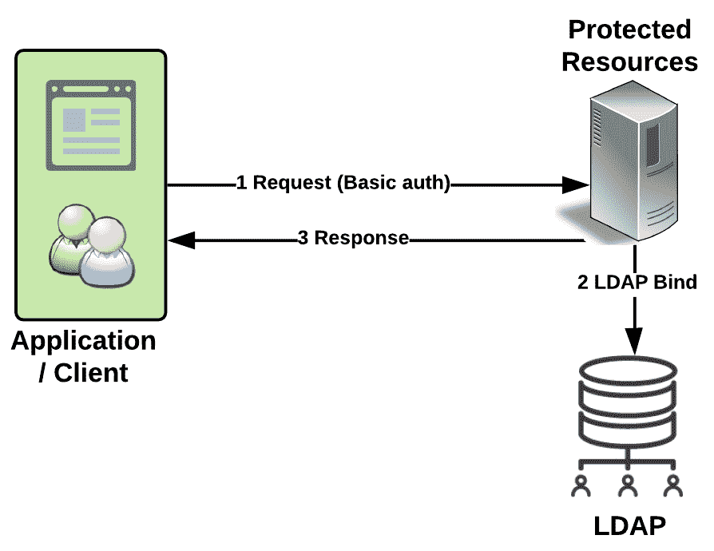
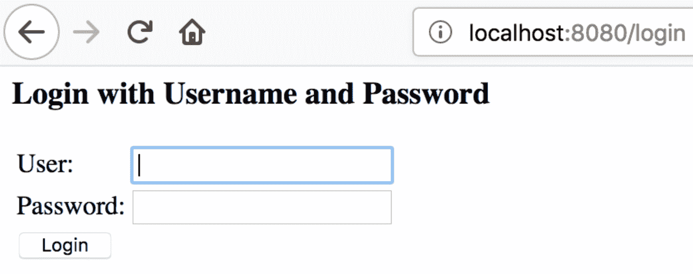
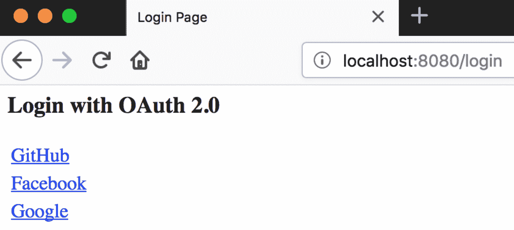
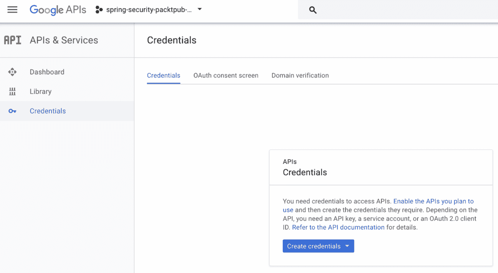
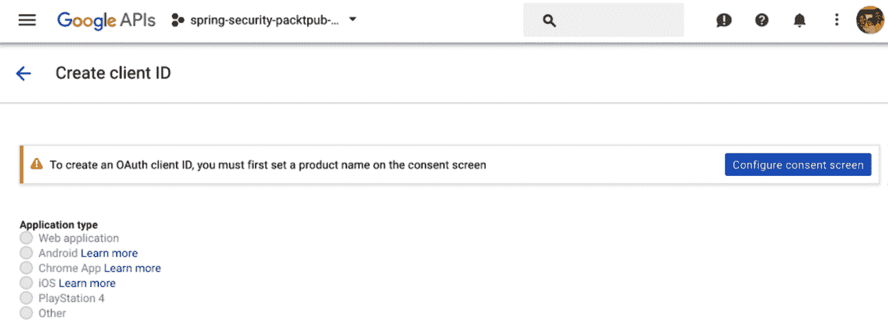
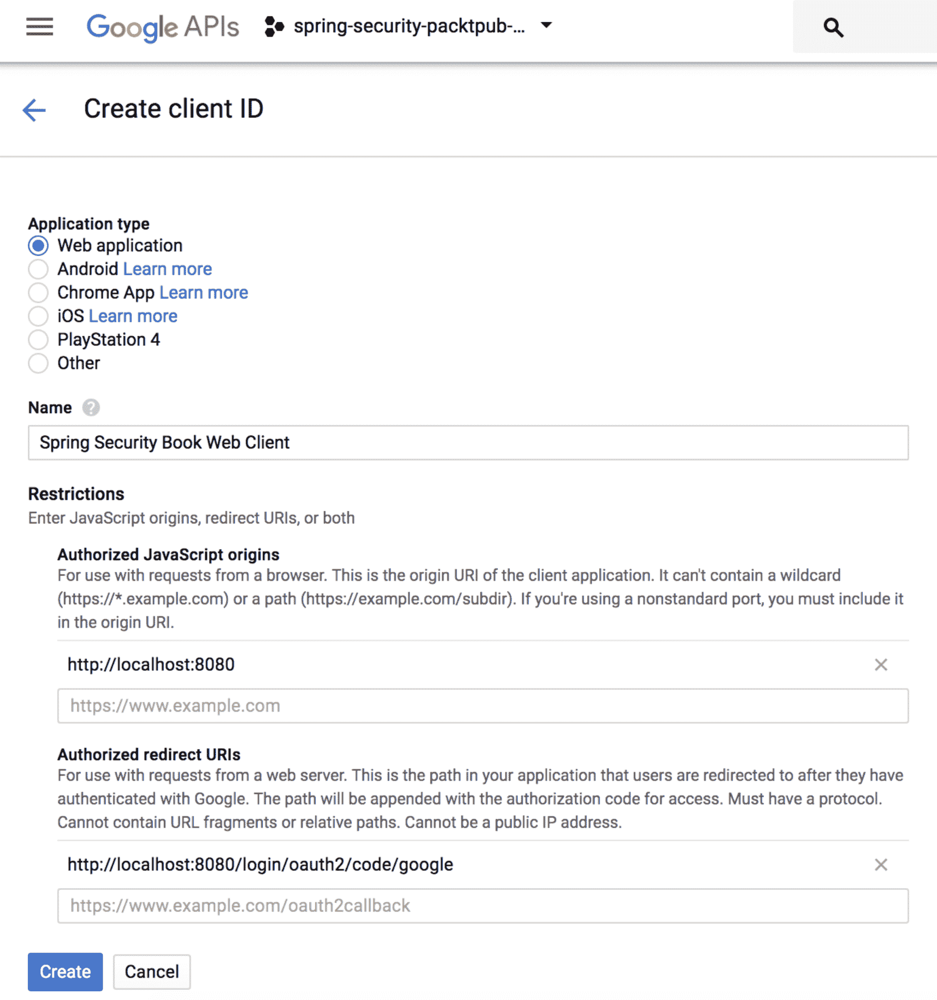

# 三、使用 SAML、LDAP 和 OAuth/OIDC 进行认证

在本章中，我们将介绍 SpringSecurity支持的认证机制，即 SAML、LDAP 和 OAuth/OIDC。这将是一个完全动手的编码章节。我们将构建小型应用程序，其中大部分从我们在[第 2 章](02.html)中构建的基础应用程序开始，*深入到 Spring Security*中。

本章的主要目标是让您能够轻松实现组织中最常用的认证机制，并展示 SpringSecurity模块的功能。

每个认证机制都有一个项目，您可以在书的 GitHub 页面中看到。然而，在本书中，我们将只讨论示例代码的重要方面，以减少本章中的混乱。

在本章中，我们将介绍以下主题：

*   安全断言标记语言
*   轻量级目录访问协议
*   OAuth2 和 OpenID 连接

# 安全断言标记语言

由 OASIS 的*安全服务技术委员会开发的**安全断言标记语言**（**SAML**是一个基于 XML 的框架，用于传递用户认证、权限和属性信息。SAML 允许业务实体就主体（通常是人类用户的实体）的身份、属性和权利向其他实体（如合作伙伴公司或其他企业）做出断言。*

模块`application.SAML`也是：

*   一组基于 XML 的协议消息
*   一组协议消息绑定
*   一组配置文件（利用上述所有配置文件）

**身份提供者**（**IdP**）是为主体（用户、服务或系统）创建、维护和管理身份信息，并向联盟或分布式网络内的其他服务提供者（应用程序）提供主体认证的系统。

**服务提供商**（**SP**）是提供服务的任何系统，通常是用户寻求认证的服务，包括 web 或企业应用程序。一种特殊类型的服务提供者，即身份提供者，负责管理身份信息。

For more information on SAML, IdP, and SP, you can also refer to the following links:
 [http://xml.coverpages.org/saml.html](http://xml.coverpages.org/saml.html)
[http://kb.mit.edu/confluence/display/glossary/IdP+(Identity+Provider)](http://kb.mit.edu/confluence/display/glossary/IdP+(Identity+Provider))
[https://searchsecurity.techtarget.com/definition/SAML](https://searchsecurity.techtarget.com/definition/SAML)

SpringSecurity 有一个名为 SpringSecuritySAML 的顶级项目。它被认为是一个扩展，提供 Spring 应用程序与支持 SAML2.0 的各种认证和联合机制集成。此扩展还支持多个 SAML2.0 配置文件以及 IdP 和 SP 启动的 SSO。

有许多符合 SAML2.0 标准的产品（IdP 模式），例如**Okta**、**Ping Federate**和**ADFS**，可以使用此 SpringSecurity扩展非常轻松地集成到您的应用程序中。

对 SAML 的详细介绍超出了本书的范围。然而，我们将尝试集成我们之前在[第 2 章](02.html)*深入研究 Spring Security*中构建的 Spring Boot 应用程序，以调整并将其转换为 SAML 2.0 产品的认证：Okta。在 SSO 领域，Okta 是一款知名的产品，允许应用程序轻松实现 SSO。在下面的示例中，我们还将使用`spring-security-saml-dsl`项目，这是一个包含 Okta DSL 的 SpringSecurity扩展项目。使用它可以大大简化 SpringSecurity和 Okta 集成。我们还将运行您必须在 Okta 平台中使用的配置，以确保示例是自包含和完整的。这并不意味着您必须使用 Okta 作为应用程序的 SSO 平台；相反，它以 Okta 为例展示了 Spring Security SAML 模块。

如前所述，我们将复制我们在[第 2 章](02.html)、*深入研究 Spring Security、*中创建的 Spring Boot 项目，以此作为本例的起点。现在，让我们先来看看如何设置 SSO 提供程序（Okta）；在接下来的部分中，我们将了解如何调整复制的 Spring 引导应用程序以实现 SAML2.0 认证。

# 设置 SSO 提供程序

如前所述，我们将使用 Okta 作为 SSO 提供程序来构建示例应用程序，其中包括使用 SAML2.0 作为认证机制的 SpringSecurity。

要设置 Okta 用户，请执行以下步骤：

1.  转到[https://developer.okta.com](https://developer.okta.com) 点击注册。
2.  输入相关详细信息，然后单击“开始”。
3.  Okta 将向您发送一封包含您的组织子域和临时密码的电子邮件。
4.  单击电子邮件中的登录按钮，输入用户名（电子邮件）和临时密码，然后登录。
5.  您将看到更多与帐户相关的信息。填写详细信息并完成帐户设置。
6.  现在，您已使用一个用户（您）设置了 Okta 帐户，并且没有配置用于执行 SSO 的应用程序。

要设置 Okta 应用程序，请执行以下步骤：

1.  登录到您的帐户并单击“管理”按钮。
2.  在屏幕上，单击添加应用程序快捷链接。
3.  单击创建新应用程序按钮。选择 Web 作为平台，选择 SAML2.0 单选按钮，然后单击 Create 按钮。
4.  在应用程序名称字段中，输入您的应用程序名称，保持其余字段不变，然后单击下一步按钮。
5.  在单点登录 URL 字段中，输入 URL 为`https://localhost:8443/saml/SSO`。在受众 URI 字段中，输入 URI 作为`https://localhost:8443/saml/metadata`。保持其余字段不变，然后单击“下一步”按钮。
6.  单击表示我是 Okta 客户的单选按钮，添加内部应用程序。
7.  选中显示“这是我们创建的内部应用程序”的复选框，然后单击“完成”按钮。

要将 Okta 应用程序分配给用户，需要执行以下步骤：

1.  导航到仪表板并单击“分配应用程序”快捷链接。
2.  单击左侧创建的应用程序（在应用程序部分），单击右侧的用户名（在人员部分），然后单击下一步按钮。
3.  在下一页中，单击确认分配按钮，您将完成将应用程序分配给用户的操作。

您现在已经创建了 Okta 应用程序，并且您的用户分配已经完成。现在，让我们尝试修改前面创建的应用程序，以便根据我们创建的 Okta 应用程序使用 SAML2.0 对用户进行认证。

# 建立项目

我们将更改两个文件：即`SpringSecuirtyConfig`（SpringSecurity配置文件）和 Spring 应用程序属性文件（`application.yml`。在前面的应用程序中，我们使用了属性文件（`application.properties`，而不是 YML（YAML）文件。在本例中，我们将丢弃`application.properties`文件，并将`application.yml`文件用于所有设置。让我们现在开始。

# pom.xml 文件设置

复制您以前的项目。打开`pom.xml`文件并添加以下依赖项：

```java
<!-- SAML2 -->
<dependency>
   <groupId>org.springframework.security.extensions</groupId>
   <artifactId>spring-security-saml2-core</artifactId>
   <version>1.0.3.RELEASE</version>
</dependency>
<dependency>
   <groupId>org.springframework.security.extensions</groupId>
   <artifactId>spring-security-saml-dsl-core</artifactId>
   <version>1.0.5.RELEASE</version>
</dependency>
```

# application.yml 文件设置

在`src/main/resources`文件夹中创建一个新的`application.yml`文件，内容如下：

```java
server:
 port: 8443
 ssl:
   enabled: true
   key-alias: spring
   key-store: src/main/resources/saml/keystore.jks
   key-store-password: secret

security:
 saml2:
   metadata-url: https://dev-858930.oktapreview.com/app/exkequgfgcSQUrK1N0h7/sso/saml/metadata

spring:
 mvc:
   view:
     prefix: /WEB-INF/views/
     suffix: .jsp
```

在第 13-17 行（在`spring`部分），我们已经将`application.properties`文件中的配置数据迁移为 YML 格式。除了`metadata-url`文件的配置外，您可以保持前面的所有配置相同。为此，您必须返回到您创建的 Okta 应用程序，并导航到登录选项卡。现在，单击 Identity Provider 元数据链接并复制该链接。它看起来与前面显示的类似，URL 末尾有`metadata`。

# SpringSecurity配置文件

现在，我们将更改（或者更确切地说，配置）我们的 SpringSecurity配置文件，如下所示：

```java
@EnableWebSecurity
@Configuration
@EnableGlobalMethodSecurity(securedEnabled = true)
public class SpringSecurityConfig extends WebSecurityConfigurerAdapter {

   @Value("${security.saml2.metadata-url}")
   String metadataUrl;

   @Override
   protected void configure(HttpSecurity http) throws Exception {
      http
               .authorizeRequests()
               .antMatchers("/saml/**").permitAll()
               .anyRequest().authenticated()
               .and()
               .apply(saml())
               .serviceProvider()
               .keyStore()
               .storeFilePath("saml/keystore.jks")
               .password("secret")
               .keyname("spring")
               .keyPassword("secret")
               .and()
               .protocol("https")
               .hostname("localhost:8443")
               .basePath("/")
               .and()
               .identityProvider()
               .metadataFilePath(metadataUrl)
               .and();
   }
}
```

不必以任何方式修改该文件。通过最重要的`configure`方法，这很好。在`spring-security-saml-dsl-core`*中*引入了`saml()`方法，使得编码非常简洁、简单。至此，您几乎完成了，最后一步是创建密钥库。

# 资源文件夹设置

导航到您的项目（在`src/main/resources`文件夹中）。创建一个名为`saml`的文件夹，并在该位置打开命令提示符。执行以下命令：

```java
keytool -genkey -v -keystore keystore.jks -alias spring -keyalg RSA -keysize 2048 -validity 10000
```

出现提示时，提供所需的详细信息，并在`src/main/resources/saml`文件夹中创建`keystore.jks`文件。

# 运行和测试应用程序

导航到项目文件夹并执行`spring-boot`命令，如下所示：

```java
mvn spring-boot:run
```

打开浏览器并导航至`https://localhost:8443`。请注意`https`和端口`8443`（因为我们启用了 SSL）。如果您不在 URL 中添加`https`，您将得到以下响应：


图 1：使用 HTTP 时的浏览器响应

浏览器将显示一个页面，说明您的连接不安全。消息可能会有所不同，具体取决于您选择打开此 URL 的浏览器。只要确保你接受风险并继续前进。

您将被导航到 Okta URL，要求您使用用户名/密码登录，如以下屏幕截图所示：


图 2：显示给用户的 Okta 登录页面

完成后，您将被导航回主页，显示您在`home.jsp`文件中输入的内容。下次打开 URL 时，您将直接进入主页，Okta 将自动为您登录。

这将使用 SpringSecurity完成 SAML 认证。您可以通过访问 GitHub 页面并导航到`spring-boot-in-memory-saml2-authentication`项目来查看整个项目。

# 轻量级目录访问协议

**轻量级目录访问协议**（**LDAP**）是一种允许连接、搜索和修改 internet 目录的目录服务协议。不幸的是，LDAP 不支持反应式绑定；这意味着使用它不可能进行反应式编程（类似于 JDBC）。LDAP 认证功能如下图所示：



图 3:LDAP 认证

与上一个示例类似，我们将克隆/复制上一个项目（任何 Spring Boot 项目都可以；我正在克隆`spring-boot-in-memory-saml2-authentication`项目）。同样，与上一个项目类似，我们将修改几个文件，并向项目中添加更多文件。我们将使用内置的基于 Java 的 LDAP 服务器来验证用户凭据。

# 在 pom.xml 文件中设置依赖项

打开`pom.xml`并添加以下依赖项：

```java
<!-- LDAP -->
<dependency>
   <groupId>org.springframework</groupId>
   <artifactId>spring-tx</artifactId>
</dependency>
<dependency>
   <groupId>org.springframework.ldap</groupId>
   <artifactId>spring-ldap-core</artifactId>
</dependency>
<dependency>
   <groupId>org.springframework.security</groupId>
   <artifactId>spring-security-ldap</artifactId>
</dependency>
<dependency>
   <groupId>com.unboundid</groupId>
   <artifactId>unboundid-ldapsdk</artifactId>
</dependency>
```

# SpringSecurity配置

修改`SpringSecurityConfiguration.java`文件，如下所示：

```java
@EnableWebSecurity
@Configuration
@EnableGlobalMethodSecurity(securedEnabled = true)
public class SpringSecurityConfig extends WebSecurityConfigurerAdapter {
   private static final Logger LOG = 
                LoggerFactory.getLogger(SpringSecurityConfig.class);
   @Override
   protected void configure(HttpSecurity http) throws Exception {
       http.authorizeRequests()    .antMatchers("/admins").hasRole("ADMINS")
               .antMatchers("/users").hasRole("USERS")
               .anyRequest().fullyAuthenticated()
               .and()
               .httpBasic(); // Use Basic authentication
   }
   @Override
   public void configure(AuthenticationManagerBuilder auth) throws Exception {
       auth
               .ldapAuthentication()
               .userDnPatterns("uid={0},ou=people")
               .userSearchBase("ou=people")
               .userSearchFilter("uid={0}")
               .groupSearchBase("ou=groups")
               .groupSearchFilter("uniqueMember={0}")
               .contextSource(contextSource())
               .passwordCompare()
               .passwordAttribute("userPassword");
   }
   @Bean
   public DefaultSpringSecurityContextSource contextSource() {
       LOG.info("Inside configuring embedded LDAP server");
       DefaultSpringSecurityContextSource contextSource = new 
               DefaultSpringSecurityContextSource(
               Arrays.asList("ldap://localhost:8389/"), "dc=packtpub,dc=com");
       contextSource.afterPropertiesSet();
       return contextSource;
   }
}
```

第一个`configure`方法与我们在前面的 SAML 示例中看到的非常相似。我们刚刚添加了某些匹配项并将角色分开。通过这些更改，它仍将执行基本认证。

第二种`configure`方法是使用 LDAP 服务器设置认证。LDAP 服务器以类似目录的格式存储用户信息。此方法详细说明了如何通过在目录结构中导航来查找用户。

# LDAP 服务器设置

我们将使用 Spring 的默认 LDAP 服务器来存储我们的用户，然后将其用作用户存储，我们可以对应用程序中的用户进行认证。LDAP 配置在我们的`application.yml`文件中完成，如下所示：

```java
spring:
 ldap:
   # Embedded Spring LDAP
   embedded:
     base-dn: dc=packtpub,dc=com
     credential:
       username: uid=admin
       password: secret
     ldif: classpath:ldap/ldapschema.ldif
     port: 8389
     validation:
       enabled: false
 mvc:
   view:
     prefix: /WEB-INF/views/
     suffix: .jsp
```

`ldap`部分是不言自明的，我们正在使用各种参数设置嵌入式 LDAP 服务器。

# 在 LDAP 服务器中设置用户

我们将使用**LDAP 数据交换格式**（**LDIF**）在 LDAP 服务器上设置用户。LDIF 是 LDAP 数据的标准基于文本的表示形式，并对该数据进行了更改（[https://ldap.com/ldif-the-ldap-data-interchange-format/](https://ldap.com/ldif-the-ldap-data-interchange-format/) ）。

在我们的`application.yml`文件中，我们向 Spring 展示了在哪里可以找到我们的 LDIF 文件。LDIF 文件如下所示：

```java
dn: dc=packtpub,dc=com
objectclass: top
objectclass: domain
objectclass: extensibleObject
dc: packtpub

dn: ou=groups,dc=packtpub,dc=com
objectclass: top
objectclass: organizationalUnit
ou: groups

dn: ou=people,dc=packtpub,dc=com
objectclass: top
objectclass: organizationalUnit
ou: people

dn: uid=john,ou=people,dc=packtpub,dc=com
objectclass: top
objectclass: person
objectclass: organizationalPerson
objectclass: inetOrgPerson
cn: Tomcy John
uid: tjohn
userPassword: tjohn@password

dn: cn=admins,ou=groups,dc=packtpub,dc=com
objectclass: top
objectclass: groupOfUniqueNames
cn: admins
ou: admin
uniqueMember: uid=tjohn,ou=people,dc=packtpub,dc=com

dn: cn=users,ou=groups,dc=packtpub,dc=com
objectclass: top
objectclass: groupOfUniqueNames
cn: users
ou: user
uniqueMember: uid=tjohn,ou=people,dc=packtpub,dc=com
```

# 运行应用程序

项目中的任何其他文件中没有太多更改。就像运行任何其他`spring-boot`项目一样，转到项目文件夹并执行以下命令：

```java
mvn spring-boot:run
```

# 在浏览器上查看正在运行的应用程序

打开浏览器，输入`http://localhost:8080`。输入用户名/密码为`tjohn/tjohn@password`（在 LDIF 文件中查找用户设置）。您将被带到`home.jsp`，在那里您将看到一条友好的欢迎信息，如以下屏幕截图所示：


图 4：使用 LDAP 成功登录后 home.jsp 页面中显示的消息

# OAuth2 和 OpenID 连接

**OAuth**是实现授权的开放标准/规范。它通过 HTTPS 工作，任何人都可以实现该规范。该规范通过验证访问令牌来工作，然后对设备、API、服务器等进行授权。

两个版本，即 OAuth 1.0（[https://tools.ietf.org/html/rfc5849](https://tools.ietf.org/html/rfc5849) 和 OAuth 2.0（[https://tools.ietf.org/html/rfc6749](https://tools.ietf.org/html/rfc6749) -存在。这些版本彼此不兼容，无法协同工作。在本书中，我们将使用版本 2.0，它将被称为 OAuth2.0。

SAML 于 2005 年发布，非常适合 web 浏览器（仍然）。但对于现代 web 和本机应用程序（移动设备），SAML 需要进行一次彻底的检修，而 OAuth 就是在这时出现的。**单页应用程序**（**SPA**）和本机应用程序不同于传统的服务器端 web 应用程序。SPA 对服务器上公开的 API 执行 AJAX/XHR 调用，并在客户端（浏览器）上执行许多其他操作。API 开发也发生了变化，从使用 XML 的基于 SOAP 的重 web 服务到使用 JSON 的基于 HTTP 的轻量级 REST。

OAuth 还允许您作为开发人员访问最少的用户数据，而不必泄露用户密码。它主要用于访问应用程序公开的 API（REST），并通过授权功能来完成。

OAuth 支持多种应用程序类型，并将认证与授权分离。

简单来说，OAuth 就是这样工作的：

1.  想要访问资源的应用程序请求用户授予授权。
2.  如果用户授权，应用程序将获得此协议的证明。
3.  使用此证明，应用程序使用 API 进入实际服务器并获取令牌。
4.  使用此令牌，应用程序现在可以请求用户已授予访问权限的资源（API），同时提供证明。

下图描述了上述步骤：


图 5:OAuth 的功能

OAuth 通过使用访问令牌进行了调整，应用程序可以以 API 的形式获取用户信息。Facebook Connect（一种 SSO 应用程序，允许用户使用 Facebook 凭据与其他 web 应用程序交互）将其用作一种机制，以公开将返回最少用户信息的端点（`http(s)://<domain>/me`。这在 OAuth 规范中从未明确过，这引发了**开放 ID 连接**（**OIDC**），它结合了 OAuth2、Facebook 连接和 SAML2.0 的最佳部分。OIDC 引入了一个新的 ID 令牌（`id_token`和一个`UserInfo`端点，该端点将提供最少的用户属性。OIDC 解决了 SAML 的许多复杂性和 OAuth2 的许多缺点。

深入研究 OAuth 和 OIDC 不在本书的范围之内。我确信我已经提供了足够的信息，您可以使用这些信息浏览本节的其余部分。

# 建立一个项目

我们将在这里创建的示例代码与前面的示例有不同的方法。在这里，我们将使用*弹簧初始化器*（[http://start.spring.io/](http://start.spring.io/) ）创建基础项目，然后我们将注入适当的更改，使其登录到一个提供商，即谷歌。

# 使用 Spring 初始化器的 Bootstrap-Spring 项目

访问[http://start.spring.io/](http://start.spring.io/) 并输入以下详细信息。确保选择了正确的依赖项：


图 6:Spring 初始化器设置

单击 Generate Project 按钮并将 ZIP 文件下载到您选择的文件夹中。执行`unzip`命令，如下所示。我使用 Macintosh 运行所有示例应用程序，因此我将使用适用于此平台的命令（如果有）：

```java
unzip -a spring-boot-oauth-oidc-authentication.zip
```

# 在 pom.xml 中包含 OAuth 库

通过添加以下依赖项修改项目的`pom.xml`文件：

```java
<!-- Provided -->
<dependency>
  <groupId>org.springframework.boot</groupId>
  <artifactId>spring-boot-starter-tomcat</artifactId>
  <scope>provided</scope>
</dependency>
<dependency>
  <groupId>org.apache.tomcat.embed</groupId>
  <artifactId>tomcat-embed-jasper</artifactId>
  <scope>provided</scope>
</dependency>
<!-- OAuth -->
<dependency>
  <groupId>org.springframework.boot</groupId>
  <artifactId>spring-boot-starter-security</artifactId>
</dependency>
<dependency>
  <groupId>org.springframework.security</groupId>
  <artifactId>spring-security-oauth2-client</artifactId>
</dependency>
<dependency>
  <groupId>org.springframework.security</groupId>
  <artifactId>spring-security-oauth2-jose</artifactId>
</dependency>
```

# 在 application.properties 中设置提供程序详细信息

如果您运行应用程序（`./mvnw spring-boot:run`，然后将浏览器导航到`http://localhost:8080`，您将看到一个默认登录页面，如下所示。Spring Boot 和 Spring Security 为您实现了此页面背后的全部魔力：



图 7：使用 SpringInitializer 创建的默认 SpringBoot+SpringSecurity 项目

打开`application.properties`文件（`src/main/resources`并添加以下属性：

```java
#Google app details
spring.security.oauth2.client.registration.google.client-id=1085570125650-l8j2r88b5i5gbe3vkhtlf8j7u3hvdu78.apps.googleusercontent.com
spring.security.oauth2.client.registration.google.client-secret=MdtcKp-ArG51FeqfAUw4K8Mp
#Facebook app details
spring.security.oauth2.client.registration.facebook.client-id=229630157771581
spring.security.oauth2.client.registration.facebook.client-secret=e37501e8adfc160d6c6c9e3c8cc5fc0b
#Github app details
spring.security.oauth2.client.registration.github.client-id=<your client id>
spring.security.oauth2.client.registration.github.client-secret=<your client secret>
#Spring MVC details
spring.mvc.view.prefix: /WEB-INF/views/
spring.mvc.view.suffix: .jsp
```

这里，我们为每个提供者声明两个属性。我们将实施谷歌供应商，但你可以添加任何数量的供应商。只需添加这些属性将创造更多的魔力，您的登录页面将突然更改为以下内容：



图 8：修改 application.properties 文件时的 OAuth 默认登录页面

前面屏幕截图中显示的提供者（链接）与`application.properties`文件中的配置一致。它只查找两个属性，如下所示：

```java
spring.security.oauth2.client.registration.<provider_name>.client-id=<client id>
spring.security.oauth2.client.registration.<provider_name>.client-secret=<client secret>
```

# 提供程序设置

在这个例子中，我们将使用谷歌作为我们的提供商。导航至[https://console.developers.google.com/](https://console.developers.google.com/) 并执行以下步骤：

1.  创建一个项目。选择现有项目或创建新项目，如以下屏幕截图所示：


图 9：项目创建

2.  创建凭据。选择新创建的项目（在下面的屏幕截图中，它显示在 Google API 徽标旁边），然后单击侧菜单中的凭据链接，如下面的屏幕截图所示：



图 10：凭证创建-步骤 1

3.  现在，单击创建凭据下拉菜单，如以下屏幕截图所示：


图 11：凭证创建-步骤 2

4.  从下拉菜单中，单击 OAuth 客户端 ID。这将导航到以下屏幕截图中显示的页面。请注意，应用程序类型无线电组在此阶段将被禁用：



图 12：凭证创建-步骤 3

5.  单击配置同意屏幕。您将被导航到以下页面：


图 13：凭证创建-步骤 4

6.  如上图所示，输入相关详细信息（填写表单时省略可选字段），然后单击 Save 按钮。您将被导航回下图所示的页面。

这一次，将启用应用程序类型无线电组：



图 14：凭证创建-步骤 5

7.  选择应用类型为 Web 应用，并输入相关详细信息，如上图所示。单击“创建”按钮，将显示以下弹出窗口：


图 15：凭证创建-步骤 6

你现在已经从谷歌获得了你的客户 ID 和客户机密。将这些值复制并粘贴到`application.properties`文件的正确位置。

# 默认应用程序更改

为了与前面的示例保持一致，我们将在生成的默认应用程序中进行更改，引入与前面的应用程序中相同的组件。这将帮助您详细了解应用程序。

# HomeController 类

将我们在前面的示例中创建的主控制器类（`HomeController.java`复制到一个新包中。将欢迎信息更改为您想要的任何内容。

# home.jsp 文件

将上一个示例中的整个`webapp`文件夹原样复制到此项目中。将页面标题更改为其他内容，以便在运行应用程序时清楚地知道它确实是示例应用程序。

# Spring Boot 主应用程序类更改

使您的应用程序类扩展`SpringBootServletInitializer`类。添加一个新的注释，如下所示，让您的 Spring Boot 应用程序知道新的控制器`HomeController`是它必须扫描的组件：

```java
@ComponentScan(basePackageClasses=HomeController.class)
```

# 运行应用程序

通过执行以下默认命令来运行应用程序：

```java
./mvnw spring-boot:run
```

如果一切顺利，你应该可以点击谷歌链接，它会引导你进入谷歌的登录页面。成功登录后，会重定向到`home.jsp`文件，如下图所示：


图 16：使用 Google 作为 OAuth 提供者登录

对 OAuth 的支持并没有到此结束，但我们必须停止，因为本书无法深入探讨框架提供的许多方面。

# 总结

在本章中，我们看到了企业中常用的认证机制，即 SAML、LDAP 和 OAuth/OIDC，它们通过实际编码示例得到了 SpringSecurity的支持。我们使用作为[第 2 章](02.html)*深入 Spring Security*的一部分构建的示例应用程序作为解释其他认证机制的功能和实现的基础。

然而，在我们的编码示例中，我们故意不使用反应式编程。本章旨在通过使用熟悉的 SpringWebMVC 应用程序框架，让您了解每种认证机制的核心概念。我们将在[第 5 章](05.html)、*结合 Spring WebFlux*中更详细地介绍反应式编程。