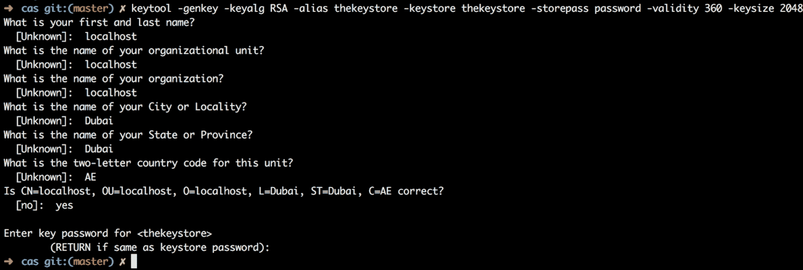
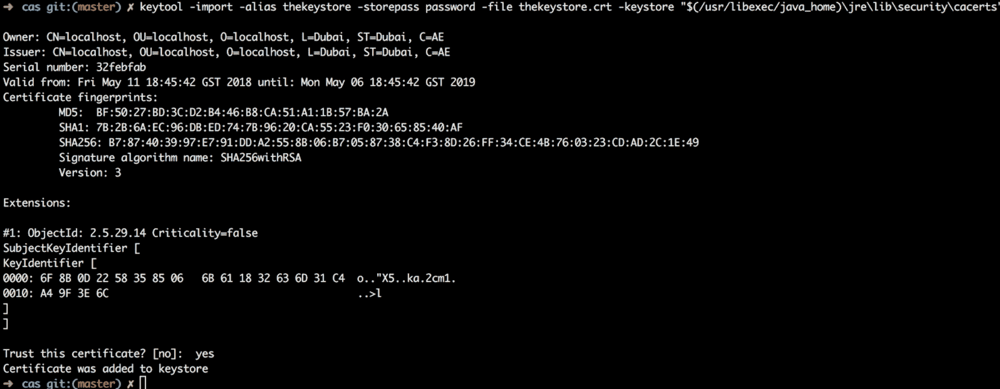
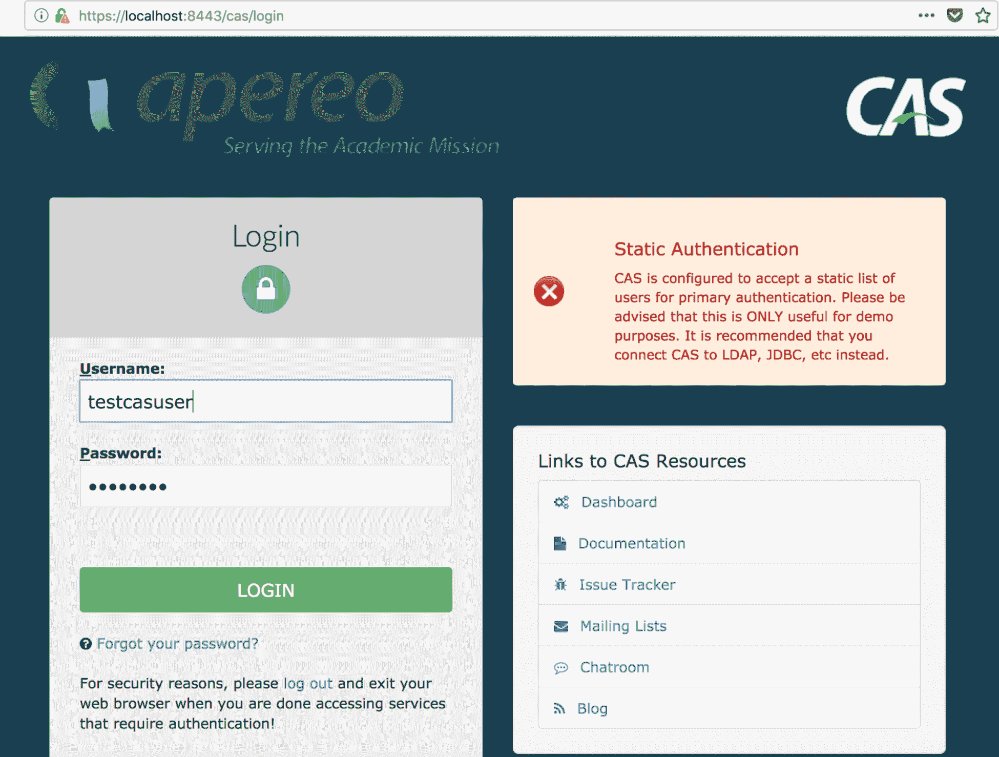
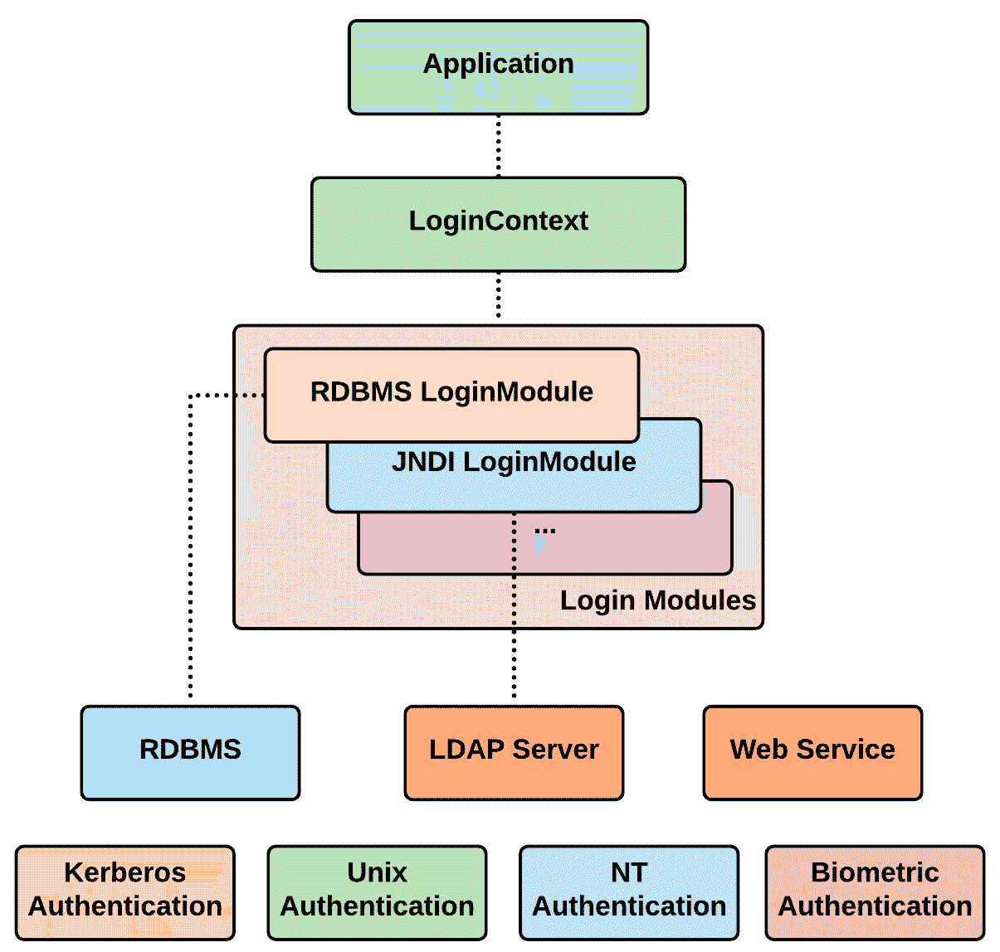

# 四、使用 CAS 和 JAAS 进行认证

本章从上一章中我们结束的地方开始，通过查看 SpringSecurity 支持的其他认证机制，即 CAS 和 JAAS。同样，这也是一个完全动手的编码章节，我们将构建小型应用程序，其中大多数都是从我们在[第 2 章](02.html)、*深入研究 Spring Security*中构建的基础应用程序开始的。这些认证机制在业界是众所周知的，许多企业都有这些已建立的机制，通过这些机制对用户进行认证，并允许访问许多面向员工和消费者的应用程序。

每个认证机制都有一个项目，您可以在书的 GitHub 页面中看到。然而，在本书中，我们将只讨论示例代码的重要方面，以减少本章中的混乱。

在本章中，我们将介绍以下主题：

*   中科院
*   Java 验证和授权服务
*   Kerberos
*   自定义认证入口点
*   密码编码器
*   自定义过滤器

# 中科院

<q>中央认证服务（CAS）<q>是针对 web 的单点登录/单点注销协议。它允许用户访问多个应用程序，同时只向中央 CAS 服务器应用程序提供一次其凭据（如用户 ID 和密码）。</q></q>

<q>-CAS 协议规范</q>

CAS 是一种开源、独立于平台的中央**单点登录**（**SSO**服务，支持多种知名协议。Spring Security 对 CAS 有一流的支持，对于拥有中央 CAS 服务器的企业来说，实现非常简单。CAS 基于 Spring 框架，架构比较简单，如下图所示：


图 1:CAS 体系结构（图改编自 https://apereo.github.io)

**CAS 服务器**是基于 Spring 框架（Spring MVC 和 Spring Web Flow）构建的基于 Java servlet 的应用程序。它对启用 CAS 的服务进行认证并授予访问权限。

用户成功登录后，创建 SSO 会话，服务器发出**票证授予票证**（**TGT**），并针对后端验证该令牌，以便客户端后续调用。

**CA****S****客户端**是一个支持 CAS 的应用程序，它使用支持的协议（CAS、SAML、OAuth 等）与 CAS 进行通信。CAS 已经提供了许多语言支持，许多应用程序已经实现了这种方法。一些著名的应用程序是 Atlassian 产品（JIRA 和 Confluence）、Drupal 等。

下图显示了涉及 CAS 服务器和客户端的认证流程（序列图）：


图 2:CAS 认证流

现在让我们来看一个实际操作的示例。我们必须创建一个 CAS 服务器，然后创建一个使用 CAS 服务器进行连接并进行认证的客户端。

# CAS 服务器设置

CAS 项目源代码可在 GitHub 的[中找到 https://github.com/apereo/cas](https://github.com/apereo/cas) 。实际上并不需要签出源代码、构建 CAS 服务器，然后部署它。WAR overlay 是一种方法，在这种方法中，我们获得一个预构建的 CAS web 应用程序，而不是下载源代码和构建，然后我们可以根据需要定制某些行为，以实现我们的用例。我们将使用这种方法来设置 CAS 服务器。此外，我们将使用基于 Maven 的 WAR 覆盖，可以在 GitHub 的[中找到 https://github.com/apereo/cas-overlay-template](https://github.com/apereo/cas-overlay-template) 。

# Git 克隆

启动您喜爱的命令提示符，并将 CAS 覆盖项目克隆到所需的项目中。我将创建一个名为`cas-sample`的文件夹，通过从`cas-sample`文件夹执行以下命令，在`server`文件夹中克隆服务器：

```java
git clone https://github.com/apereo/cas-overlay-template.git server
```

# 添加其他依赖项

CAS 服务器不允许任何客户端连接到它。每个客户端都必须注册到所需的 CAS 服务器。我们可以通过多种机制将客户机注册到服务器。我们将使用 JSON/YML 配置将客户机注册到服务器。继续，将以下依赖项添加到您刚刚克隆的服务器项目中的`pom.xml`文件中：

```java
<dependency>
   <groupId>org.apereo.cas</groupId>
   <artifactId>cas-server-support-json-service-registry</artifactId>
   <version>${cas.version}</version>
</dependency>
<dependency>
   <groupId>org.apereo.cas</groupId>
   <artifactId>cas-server-support-yaml-service-registry</artifactId>
   <version>${cas.version}</version>
</dependency>
```

`pom.xml`文件中的大多数版本由父 POM 管理。

# 在项目中设置资源文件夹

在`server`项目中，创建一个名为`src/main/resources`的文件夹。将`server`文件夹中的`etc`文件夹复制到`src/main/resources`中：

```java
mkdir -p src/main/resources
cp -R etc src/main/resources
```

# 创建 application.properties 文件

创建一个名为`application.properties`的文件：

```java
touch src/main/resources/application.properties
```

现在在`application.properties`文件中填写以下详细信息：

```java
server.context-path=/cas
server.port=6443

server.ssl.key-store=classpath:/etc/cas/thekeystore
server.ssl.key-store-password=changeit
server.ssl.key-password=changeit

cas.server.name: https://localhost:6443
cas.server.prefix: https://localhost:6443/cas

cas.adminPagesSecurity.ip=127\.0\.0\.1

cas.authn.accept.users=casuser::password
```

前面的文件设置端口和 SSL 密钥库值（设置 CAS 服务器的一个非常重要的步骤），并设置 CAS 服务器`config`文件夹。显然，我们需要创建一个密钥库，如本文件所示。

请注意，覆盖项目有一个文件，即`build.sh`文件，其中包含大部分这些细节。我们手动这样做是为了有一个清晰的理解。

`application.properties`中的最后一行设置了一个具有凭证`casuser`/`password`的测试用户，该凭证可用于登录 CAS 服务器进行各种演示。不建议在生产设置中使用此方法。

# 创建本地 SSL 密钥库

导航到 shell 中的`cas-sample/server/src/main/resources/etc/cas`文件夹并执行以下命令：

```java
keytool -genkey -keyalg RSA -alias thekeystore -keystore thekeystore -storepass password -validity 360 -keysize 2048
```

下图显示了在命令提示符窗口中成功执行上述命令的情况：



图 3：SSL 密钥库的创建

需要注意的是，要使 SSL 握手正常工作，生成密钥库时的大多数值都作为本地主机。这是一个重要的步骤，必须毫不犹豫地遵循。

# 创建客户端要使用的.crt 文件

为了让客户端连接到 CAS 服务器，在生成的密钥库之外，我们需要创建一个`.crt`文件。在同一文件夹（`cas-sample/server/src/main/resources/etc/cas`中）中，运行以下命令：

```java
keytool -export -alias thekeystore -file thekeystore.crt -keystore thekeystore
```

当要求输入密码时，请提供相同的密码（我们已将密码设置为`password`。执行上述命令将创建`thekeystore.crt`文件。

# 将.crt 文件导出到 Java 和 JRE cacert 密钥库

执行以下命令以查找 Java 安装目录：

```java
/usr/libexec/java_home
```

或者，直接执行以下命令将`.crt`文件添加到 Java cacerts：

```java
keytool -import -alias thekeystore -storepass password -file thekeystore.crt -keystore "$(/usr/libexec/java_home)\jre\lib\security\cacerts"
```

下图显示在命令提示符窗口中成功执行上述命令：



图 4：将.crt 文件导出到 Java 密钥库

设置客户机时，请确保使用的 JDK 与我们添加了`.crt`文件的 JDK 相同。为了将认证添加到 Java 中，建议重新启动机器。

# 构建并运行 CAS 服务器项目

在 cas sample/cas server 文件夹中，执行以下两个命令：

```java
./build.sh package
./build.sh run
```

如果一切顺利，如下图所示，您应该会看到一条日志消息，上面写着 READY：


图 5:CAS 服务器就绪日志记录

现在打开浏览器并导航到 URL`https://localhost:6443/cas`。这将导航到 CAS 服务器的默认登录表单。输入默认凭证（`casuser`/`Mellon`），您就进入了。大多数浏览器都会说连接不安全。将域作为例外添加，然后应用程序很快就会正常工作：



图 6：默认 CAS 服务器登录表单

使用演示测试用户（`testcasuser`/`password`）登录，您应该登录并导航到用户主页。

# 向 CAS 服务器注册客户端

如前所述，每个客户端都必须向 CAS 服务器注册，以允许参与 SSO。本节介绍如何向 CAS 服务器注册客户端。

# JSON 服务配置

客户机/服务可以通过多种方式将自身注册到 CAS 服务器。我们将在这里使用 JSON 配置，并且在前面的步骤中已经包含了对`pom.xml`文件的依赖项。除了 JSON 之外，还有 YAML、Mongo、LDAP 等其他格式。

在`src/main/resources`文件夹中创建一个名为`clients`的新文件夹。在新创建的文件夹中创建包含以下内容的新文件：

```java
--- !<org.apereo.cas.services.RegexRegisteredService>
serviceId: "^(http?|https?)://.*"
name: "YAML"
id: 5000
description: "description"
attributeReleasePolicy: !<org.apereo.cas.services.ReturnAllAttributeReleasePolicy> {}
accessStrategy: !<org.apereo.cas.services.DefaultRegisteredServiceAccessStrategy>
 enabled: true
 ssoEnabled: true
```

使用名称`newYmlFile-5000.yml`保存文件。让我们深入了解几个重要属性的细节：

*   `serviceId`：希望连接到 CAS 服务器的客户端的 URL，以正则表达式模式表示。在我们的示例中，我们指的是在端口`9090`上运行的客户端 Spring 引导应用程序，该端口连接到 CAS 服务器。
*   `id`：此配置的唯一标识符。

其他可配置属性记录在官方网站[中 https://goo.gl/CGsDp1](https://goo.gl/CGsDp1) 。

# 附加 application.properties 文件更改

在这一步中，我们让 CAS 服务器了解 YML 配置的使用情况以及在服务器中查找这些 YML 的位置。将以下属性添加到`application.properties`文件中：

```java
cas.serviceRegistry.yaml.location=classpath:/clients
```

将 CAS 相关的配置属性分离到不同的属性文件中是一种很好的做法。因此，继续创建一个`cas.properties`文件，并在其中包含与 CAS 相关的属性。

# CAS 客户端设置

我们将使用 Spring 初始化器创建 CAS 客户机项目设置。我们早些时候使用了类似的方法。让我们再看一遍。

# 使用 Spring 初始化器的 Bootstrap-Spring 项目

访问[http://start.spring.io/](http://start.spring.io/) 并输入下图所示的详细信息。确保选择正确的依赖项：


图 7：用于创建安全 cas 客户端项目的 Spring 初始化器

点击 Generate Project 按钮，将 ZIP 文件下载到您选择的文件夹中（我将把它保存在`cas-sample`文件夹中）。按如下方式执行`unzip`命令。我使用 macOS 运行我的所有示例应用程序，因此我将使用适用于此平台的命令（如果有）：

```java
unzip -a spring-boot-cas-client.zip
```

# 在 pom.xml 中包含 CAS 库

通过添加以下依赖项修改项目的`pom.xml`：

```java
<dependency>
    <groupId>org.springframework.security</groupId>
    <artifactId>spring-security-cas</artifactId>
</dependency>
```

# 更改 application.properties 文件

为了确保我们不使用任何其他常用端口，我们将把客户端设置为侦听端口`9090`。在 CAS 服务器中，我们也对其进行了配置，以便客户端将侦听端口`9090`。将以下属性添加到`application.properties`文件中：

```java
server.port=9090
```

# 附加 bean 配置

我们现在将根据 CAS SpringSecurity 模块的需要设置各种 bean。

# ServiceProperties bean

通过设置此 bean，向 CAS 传达这是您的 CAS 客户机/服务。打开`SpringBootCasClientApplication.java`并添加以下 bean 定义：

```java
@Bean
public ServiceProperties serviceProperties() {
ServiceProperties serviceProperties = new ServiceProperties();
    serviceProperties.setService("http://localhost:9090/login/cas");
    serviceProperties.setSendRenew(false);
    return serviceProperties;
}
```

配置的 URL`http://localhost:9090/login/cas`将在内部映射到`CasAuthenticationFilter`。参数`sendRenew` 设置为`false`。设置为`false`，这会告诉登录服务每次访问该服务都需要用户名/密码。它还允许用户访问所有服务/客户端，而无需输入用户名/密码（如果已经输入一次）。注销时，用户将自动从所有服务中注销。

# AuthenticationEntryPointbean

看看下面的代码。很简单，不是吗？。这是我们告知 CAS 服务器运行位置的地方。当用户尝试登录时，应用程序将重定向到此 URL：

```java
@Bean
public AuthenticationEntryPoint authenticationEntryPoint() {
    CasAuthenticationEntryPoint casAuthEntryPoint = new CasAuthenticationEntryPoint();
    casAuthEntryPoint.setLoginUrl("https://localhost:6443/cas/login");
    casAuthEntryPoint.setServiceProperties(serviceProperties());
    return casAuthEntryPoint;
}
```

# 菜豆

当客户机应用程序获得已提供给特定用户的票证时，此 bean 用于验证其真实性：

```java
@Bean
public TicketValidator ticketValidator() {
    return new Cas30ServiceTicketValidator("https://localhost:6443/cas");
}
```

# CasAuthenticationProviderbean

将前面声明的所有 bean 绑定到认证提供程序 bean。我们将从认证提供程序中作为`UserDetailsService` 的一部分提供的静态列表中加载用户。在生产场景中，这将指向一个数据库：

```java
@Bean
public CasAuthenticationProvider casAuthenticationProvider() {
  CasAuthenticationProvider provider = new CasAuthenticationProvider();
  provider.setServiceProperties(serviceProperties());
  provider.setTicketValidator(ticketValidator());
  provider.setUserDetailsService((s) -> new User("casuser", "password",
        true, true, true, true,
        AuthorityUtils.createAuthorityList("ROLE_ADMIN")));
  provider.setKey("CAS_PROVIDER_PORT_9090");
  return provider;
}
```

有了这些，我们就可以设置非常重要的 SpringSecurity 配置了。

# 建立 Spring Security

让我们将前面步骤中所做的 bean 引用引入到 SpringSecurity 配置文件中。创建一个名为`SpringSecurityConfig`的新 Java 文件并添加成员变量。之后，创建一个带有`@Autowired`注释的构造函数，如下所示：

```java
private AuthenticationProvider authenticationProvider;
private AuthenticationEntryPoint authenticationEntryPoint;

@Autowired
public SpringSecurityConfig(CasAuthenticationProvider casAuthenticationProvider,
                     AuthenticationEntryPoint authenticationEntryPoint) {
   this.authenticationProvider = casAuthenticationProvider;
   this.authenticationEntryPoint = authenticationEntryPoint;
}
```

当用户访问由 CAS 服务器保护的客户端应用程序时，会触发配置的 bean`AuthenticationEntryPoint`，并将用户带到该 bean 中配置的 CAS 服务器 URL。一旦用户输入凭据并提交页面，CAS 服务器将对用户进行认证并创建服务票证。此票证现在附加到 URL，用户被带到请求的客户端应用程序。客户端应用程序使用`TicketValidator` bean 与 CAS 服务器验证票据，如果有效，则允许用户访问请求的页面。

在配置 HTTP 安全性之前，我们需要覆盖几个重要的方法。第一种方法使用`AuthenticationManagerBuilder`，我们告诉它使用我们的`AuthenticationProvider`。请按如下方式创建方法：

```java
@Override
protected void configure(AuthenticationManagerBuilder auth) throws Exception {
    auth.authenticationProvider(authenticationProvider);
}
```

现在，我们重写另一个方法，该方法指示`AuthenticationManager` 将我们创建的`AuthenticationProvider`放入其中：

```java
@Override
protected AuthenticationManager authenticationManager() throws Exception {
    return new ProviderManager(Arrays.asList(authenticationProvider));
}
```

我们现在已经准备好创建一个名为`CasAuthenticationFilter` （作为 bean）的过滤器，它实际截获请求并进行 CAS 票证验证。

# 创建 CasAuthenticationFilter bean

创建`CasAuthenticationFilter`bean 非常简单，因为我们只是将创建的`serviceProperties` 分配给`CasAuthenticationFilter`：

```java
@Bean
public CasAuthenticationFilter casAuthenticationFilter(ServiceProperties serviceProperties) throws Exception {
    CasAuthenticationFilter filter = new CasAuthenticationFilter();
    filter.setServiceProperties(serviceProperties);
    filter.setAuthenticationManager(authenticationManager());
    return filter;
}
```

# 设置控制器

这是 CAS 客户端项目设置中的最终设置。我们将有一个不安全的网页包含一个链接到一个安全的网页。当访问安全页面时，CAS SSO 启动，用户被导航到 CAS 认证页面。使用凭据（`casuser`/`password`登录后，用户将被带到安全页面，我们将在其中显示经过认证的用户名。

我们将创建一个具有根文件夹路由（`/`的`ndexController`。这将用户导航到`index.html`页面。

在新包中创建`IndexController.java`（最好在控制器包中）：

```java
@Controller
public class IndexController {
    @GetMapping("/")
    public String index() {
        return "index";
    }
}
```

在`src/resources/templates`文件夹中创建具有以下内容的`index.html`文件：

```java
<!DOCTYPE html>
<html xmlns:th="http://www.thymeleaf.org">
<head>
   <meta charset="UTF-8" />
   <title>Spring Security CAS Sample - Unsecured page</title>
</head>
<body>
<h1>Spring Security CAS Sample - Unsecured page</h1>
<br>
<a href="/secured">Go to Secured Page</a>
</body>
</html>
```

现在在同一控制器包中创建一个名为`CasController.java`的新控制器。我们将映射所有安全页面，并在此控制器中设置各种请求映射。在控制器类中，复制以下代码段：

```java
@Controller
@RequestMapping(value = "/secured")
public class CasController {

   @GetMapping
   public String secured(ModelMap modelMap) {
     Authentication auth = SecurityContextHolder.getContext().getAuthentication();
     if( auth != null && auth.getPrincipal() != null
         && auth.getPrincipal() instanceof UserDetails) {
       modelMap.put("authusername", ((UserDetails) auth.getPrincipal()).getUsername());
     }
     return "secured";
   }
}
```

创建一个名为`secured.html`的新 HTML 文件，包含以下内容。这是我们的安全页面，只显示经过认证的用户名：

```java
<!DOCTYPE html>
<html xmlns:th="http://www.thymeleaf.org">
<head>
   <meta charset="UTF-8" />
   <title>Spring Security CAS Sample - Secured page</title>
</head>
<body>
<h1>Spring Security CAS Sample - Secured page</h1>
<br>
<h3 th:text="${authusername} ? 'Hello authenticated user, ' + ${authusername} + '!' : 'Hello non-logged in user!'">Hello non-logged in user!</h3>
</body>
</html>
```

# 运行应用程序

启动 CAS 服务器（在`cas-server`内，运行`./build.sh run`。之后，通过执行`./mvnw spring-boot:run`启动 spring boot 项目（`secured-cas-client`。将浏览器导航至`http://localhost:9090`。这将把用户带到`index.html`，当他们点击链接（导航到`secured.html`页面）时，用户将被带到 CAS 认证页面。要进行认证，请输入 CAS 凭据，并将票证设置为查询字符串，然后将您带到安全页面。安全页面使用 CAS 服务器验证票据，然后显示用户名。

有了这些，我们使用 Spring Security 完成了 CAS 示例。在下一节中，与 CAS 类似，我们将通过使用 SpringSecurity 详细介绍 JAAS 认证的用法。

# Java 验证和授权服务

**Java 认证授权服务**（**JAAS**（[https://docs.oracle.com/javase/6/docs/technotes/guides/security/jaas/JAASRefGuide.html](https://docs.oracle.com/javase/6/docs/technotes/guides/security/jaas/JAASRefGuide.html) 实现了标准**可插拔认证模块**（**PAM**框架的 Java 版本。它作为 J2SDK（1.3）的可选包（扩展）引入，然后集成到 J2SDK 1.4 中。

JAAS 是一个标准库，为您的应用程序提供以下功能：

*   通过提供凭据（用户名/密码-主题）表示身份（主体）。
*   一种登录服务，它将回调您的应用程序以从用户处收集凭据，然后在成功认证后返回主题。
*   成功认证后向用户授予必要授权（授权）的机制：



图 8:JAAS 的工作原理

如上图所示，JAAS 为大多数内置登录机制提供了预定义的登录模块。可以根据应用程序要求导入或构建自定义登录模块。JAAS 允许应用程序独立于实际的认证机制。它是真正可插拔的，因为新的登录模块可以集成，而无需对应用程序代码进行任何更改。

JAAS 很简单，流程如下：

*   应用程序实例化一个`LoginContext`对象，并调用适当的（由配置控制的）`LoginModule`，它执行认证。
*   认证成功后，`LoginModule`用原则和凭证更新*s**主体*（运行代码的主体）。
*   之后不久，JAAS kick 启动授权过程（使用标准 javase 访问控制模型）。根据以下条件授予访问权限：
    *   **代码源**：代码的来源和签名人
    *   **用户**：运行代码的人（也称**主体**）

现在我们已经大致了解了 JAAS 及其工作原理，我们将通过下一节中的一个示例来了解 JAAS 使用 Spring Security 的工作原理。

# 建立一个项目

我们将要构建的示例应用程序与我们在[第 3 章](03.html)、*使用 SAML、LDAP 和 OAuth/OIDC*进行认证时创建的应用程序非常相似。许多方面是相似的，但在微妙的方式上有所不同。每个步骤都将被解释；然而，有时我们不会详细讨论，因为我们在前面的示例中已经看到了一些方面。

# 建立 Maven 项目

我们将使用 IntelliJ IDE 创建一个 Maven 项目。在`pom.xml`文件中添加以下依赖项和构建设置：

```java
<groupId>com.packtpub.book.ch04.springsecurity</groupId>
<artifactId>jetty-jaas-authentication</artifactId>
<version>1.0-SNAPSHOT</version>
<packaging>war</packaging>
<properties>
   <maven.compiler.source>1.8</maven.compiler.source>
   <maven.compiler.target>1.8</maven.compiler.target>
   <failOnMissingWebXml>false</failOnMissingWebXml>
</properties>
<dependencies>
   <!--Spring Security Dependencies-->
   <dependency>
       <groupId>org.springframework.security</groupId>
       <artifactId>spring-security-web</artifactId>
       <version>5.0.4.RELEASE</version>
   </dependency>
   <dependency>
       <groupId>org.springframework.security</groupId>
       <artifactId>spring-security-config</artifactId>
       <version>5.0.4.RELEASE</version>
   </dependency>
   <!--Spring Framework Dependencies-->
   <dependency>
       <groupId>org.springframework</groupId>
       <artifactId>spring-context</artifactId>
       <version>5.0.4.RELEASE</version>
   </dependency>
   <dependency>
       <groupId>org.springframework</groupId>
       <artifactId>spring-webmvc</artifactId>
       <version>5.0.4.RELEASE</version>
   </dependency>
   <!-- JSP, JSTL and Tag Libraries-->
   <dependency>
       <groupId>javax.servlet</groupId>
       <artifactId>javax.servlet-api</artifactId>
       <version>3.1.0</version>
       <scope>provided</scope>
   </dependency>
   <dependency>
       <groupId>javax.servlet</groupId>
       <artifactId>jstl</artifactId>
       <version>1.2</version>
       <scope>provided</scope>
   </dependency>
   <dependency>
       <groupId>javax.servlet.jsp</groupId>
       <artifactId>javax.servlet.jsp-api</artifactId>
       <version>2.3.1</version>
       <scope>provided</scope>
   </dependency>
   <dependency>
       <groupId>javax.servlet.jsp.jstl</groupId>
       <artifactId>javax.servlet.jsp.jstl-api</artifactId>
       <version>1.2.1</version>
   </dependency>
   <dependency>
       <groupId>taglibs</groupId>
       <artifactId>standard</artifactId>
       <version>1.1.2</version>
   </dependency>
   <!--SLF4J and logback-->
   <dependency>
       <groupId>org.slf4j</groupId>
       <artifactId>slf4j-api</artifactId>
       <version>1.7.25</version>
   </dependency>
   <dependency>
       <groupId>org.slf4j</groupId>
       <artifactId>jcl-over-slf4j</artifactId>
       <version>1.7.25</version>
   </dependency>
   <dependency>
       <groupId>ch.qos.logback</groupId>
       <artifactId>logback-core</artifactId>
       <version>1.2.3</version>
   </dependency>
   <dependency>
       <groupId>ch.qos.logback</groupId>
       <artifactId>logback-classic</artifactId>
       <version>1.2.3</version>
   </dependency>
</dependencies>

<build>
   <plugins>
       <plugin>
           <groupId>org.eclipse.jetty</groupId>
           <artifactId>jetty-maven-plugin</artifactId>
           <version>9.4.10.v20180503</version>
       </plugin>
   </plugins>
</build>
```

我们添加了 Spring 框架、SpringSecurity、JSP/JSTL 和日志框架（SLF4J 和 Logback）依赖项。我们将使用嵌入式 jetty 服务器（查看构建部分）来运行我们的应用程序。

# 设置 LoginModule

`LoginModule`负责对用户进行认证。我们将创建自己的名为`JaasLoginModule` 的`LoginModule`，然后实现`login`方法。作为一个示例应用程序，我们的登录逻辑非常简单。必须实现`LoginModule`接口，您才能编写自己的自定义登录模块。

创建一个类`JaasLoginModule.java`（实现`LoginModule`），并实现所有方法。在这节课上，我们将重点介绍两种重要的方法。在`initialize`方法中，我们获得了所有必要的信息，例如用户名/密码/主题，这些信息存储为字段变量，用于我们的主`login`方法：

```java
// Gather information and then use this in the login method
@Override
public void initialize(Subject subject, CallbackHandler callbackHandler, Map<String, 
            ?> sharedState, Map<String, ?> options) {
    this.subject = subject;

    NameCallback nameCallback = new NameCallback("Username:");
    PasswordCallback passwordCallback = new PasswordCallback("Password:", false);
    try {
        callbackHandler.handle(new Callback[] { nameCallback, passwordCallback });
    } catch (IOException e) {
        e.printStackTrace();
    } catch (UnsupportedCallbackException e) {
        e.printStackTrace();
    }
    username = nameCallback.getName();
    password = new String(passwordCallback.getPassword());
}
```

在`login`方法中，我们将使用`initialize`方法中存储的值登录。在本例中，如果硬编码用户名/密码有效，请在主题中设置主体：

```java
// Code where actual login happens. Implement any logic as required by your application
// In our sample we are just doing a hard-coded comparison of username and password
@Override
public boolean login() throws LoginException {
    if (username == null || (username.equalsIgnoreCase("")) ||
        password == null || (password.equalsIgnoreCase(""))) {
        throw new LoginException("Username and password is mandatory.");
    } else if (username.equalsIgnoreCase("admin") &&        
        password.equalsIgnoreCase("password")) {
        subject.getPrincipals().add(new JaasPrincipal(username));
        return true;
    } else if (username.equalsIgnoreCase("user") && 
        password.equalsIgnoreCase("password")) {
        subject.getPrincipals().add(new JaasPrincipal(username));
        return true;
    }
    return false;
}
```

# 设置自定义主体

我们通过实现`java.security.Principal`接口创建了自己的定制主体类。这是一个非常简单的类，我们通过构造函数获取用户名，然后在`getName`方法中使用它返回：

```java
public class JaasPrincipal implements Principal, Serializable {
    private String username;
    public JaasPrincipal(String username) {
        this.username = username;
    }
    @Override
    public String getName() {
        return "Authenticated_"+this.username;
    }
}
```

# 设置自定义 AuthorityGranter

委托`AuthorityGranter` 为认证用户提供相关角色。我们将通过实现`org.springframework.security.authentication.jaas.AuthorityGranter`来创建自己的自定义类：

```java
public class JaasAuthorityGranter implements AuthorityGranter {
    @Override
    public Set<String> grant(Principal principal) {
        if (principal.getName().equalsIgnoreCase("Authenticated_admin")) {
            return Collections.singleton("ROLE_ADMIN");
        } else if (principal.getName().equalsIgnoreCase("Authenticated_user")) {
            return Collections.singleton("ROLE_USER");
        }
        return Collections.singleton("ROLE_USER");
    }
}
```

作为一个示例实现，在这个类中，我们查看登录用户的用户名，并为其授予一个硬编码角色。在实际应用程序中，我们将在这里做一些更严肃的事情，实际查询数据库，然后向登录用户授予适当的角色。

# 配置文件

我们的示例中需要有许多配置文件（Java 配置），其中大部分已经在前面介绍过。对于其余的文件（尚未涉及），我们将快速浏览它们，或者在涉及它们时深入了解细节。

# 应用程序配置

我们这里没有任何特定于应用程序的配置，但是在应用程序中有这样一个文件总是很好的。我们有`ApplicationConfig.java`作为我们的应用程序级 Java 配置（它没有任何内容）。

# springmvc 配置

如以下代码所示，我们将在这里创建特定于 Spring MVC 的 Java 配置（`SpringMVCConfig.java`）：

```java
@Configuration
@EnableWebMvc
@ComponentScan( basePackages = "com.packtpub")
public class SpringMVCConfig implements WebMvcConfigurer {
    @Override
    public void configureViewResolvers(ViewResolverRegistry registry) {
        registry.jsp().prefix("/WEB-INF/views/").suffix(".jsp");
    }
    @Override
    public void addViewControllers(ViewControllerRegistry registry) {
        registry.addViewController("/login");
    }
}
```

在此配置中，设置视图的*前缀*和*后缀*。确保显式添加了登录视图控制器，因为我们的控制器中没有定义路由（稍后我们将看到控制器）。

# SpringSecurity 配置

这是一个非常重要的配置示例。

我们将创建一个`AuthenticationProvider` bean。我们将使用我们的自定义`LoginModule` 然后使用`org.springframework.security.authentication.jaas.DefaultJaasAuthenticationProvider`来设置。然后，我们将此认证提供程序设置为全局提供程序。任何请求都将通过此提供商（`SpringSecurityConfig.java`）：

```java
@Bean
DefaultJaasAuthenticationProvider jaasAuthenticationProvider() {
   AppConfigurationEntry appConfig = new AppConfigurationEntry("com.packtpub.book.ch04.springsecurity.loginmodule.JaasLoginModule",
           AppConfigurationEntry.LoginModuleControlFlag.REQUIRED, new HashMap());

   InMemoryConfiguration memoryConfig = new InMemoryConfiguration(new AppConfigurationEntry[] { appConfig });

   DefaultJaasAuthenticationProvider def = new DefaultJaasAuthenticationProvider();
   def.setConfiguration(memoryConfig);
   def.setAuthorityGranters(new AuthorityGranter[] {jaasAuthorityGranter});
   return def;
}

//We are configuring jaasAuthenticationProvider as our global AuthenticationProvider
@Autowired
public void configureGlobal(AuthenticationManagerBuilder auth) throws Exception {
   auth.authenticationProvider(jaasAuthenticationProvider());
}
```

第二个最重要的方法是`configure`方法，在该方法中，我们将确保设置需要保护的正确路径，并将设置一些重要配置：

```java
// Setting up our HTTP security
@Override
protected void configure(HttpSecurity http) throws Exception {

   // Setting up security
   http.authorizeRequests()
           .regexMatchers("/admin/.*").hasRole("ADMIN")
           .anyRequest().authenticated().and().httpBasic();

   // Setting our login page and to make it public
   http.formLogin().loginPage("/login").permitAll();
   // Logout configuration
   http.logout().logoutSuccessUrl("/");
   // Exception handling, for access denied
   http.exceptionHandling().accessDeniedPage("/noaccess");
}
```

# 控制器

我们只有一个控制器，我们将在其中配置所有路由（`JaasController.java`：

```java
@Controller
public class JaasController {
    @RequestMapping(value="/", method = RequestMethod.GET)
    public ModelAndView userPage() {
        ModelAndView modelAndView = new ModelAndView("user");
        return modelAndView;
    }
    @RequestMapping(value = "/admin/moresecured", method = RequestMethod.GET)
    public ModelAndView adminPage(HttpServletRequest request) {
        ModelAndView modelAndView = new ModelAndView();
        modelAndView.setViewName("moresecured");
        return modelAndView;
    }
    @RequestMapping(value="/noaccess", method = RequestMethod.GET)
    public ModelAndView accessDenied() {
        ModelAndView modelAndView = new ModelAndView("noaccess");
        return modelAndView;
    }
}
```

# 设置页面

我们有一些琐碎的页面。我不想将代码粘贴到这里，因为这是非常不言自明的：

*   `login.jsp`：我们的自定义登录页面，用于收集最终用户的用户名和密码。
*   `user.jsp`：样本中设置为 root 的页面。登录后，用户将导航到此页面。我们只需打印会话 ID 和用户名即可显示登录。
*   `moresecured.jsp`：这只是为了展示用户角色的重要性。此页面只能由具有`ADMIN`角色的用户访问。
*   `noaccess.jsp`：当用户无法访问任何页面时，该虚拟页面将为用户提供。

在本书的 GitHub 页面中，可以在*jetty jaas 认证*项目中找到一个完整的示例项目。

# 运行应用程序

从项目的根目录执行以下命令：

```java
mvn jetty:run
```

打开浏览器并导航至`http://localhost:8080`。将为您提供一个看起来脏兮兮的登录页面。输入用户名/密码（管理员/密码或用户/密码），您将被导航到根页面（`user.jsp`。

这就完成了使用 Spring Security 的 JAAS 示例。如上图 8 所示，JAAS 可用于使用其他协议实现认证。众所周知的机制之一是使用 Kerberos 协议进行认证。下一节简要介绍如何使用 JAAS 实现基于 Kerberos 的认证。

# Kerberos

JAAS 提供了许多内置类型的`LoginModule` ，其中一个是`rb5LoginModule`，用于使用 Kerberos 协议对用户进行认证。因此，确实可以使用 JAAS 方法轻松地在基于 Spring 的应用程序中实现 Kerberos 认证。

让我们深入了解有关认证的一些更重要的细节。

# 自定义认证入口点

在将响应发送回客户端之前，可以使用自定义`AuthenticationEntryPoint`设置必要的响应头、内容类型等。

`org.springframework.security.web.authentication.www.BasicAuthenticationEntryPoint`类是一个内置的`AuthenticationEntryPoint`实现，它将被调用以开始基本认证。通过实现`org.springframework.security.web.AuthenticationEntryPoint`接口可以创建自定义入口点。以下是一个示例实现：

```java
@Component
public final class CustomAuthenticationEntryPoint implements 
        AuthenticationEntryPoint {
    @Override
    public void commence(final HttpServletRequest request, final 
            HttpServletResponse response, final AuthenticationException 
        authException) throws IOException {
        response.sendError(HttpServletResponse.SC_UNAUTHORIZED, "Unauthorized");
    }
}
```

当客户端在没有认证的情况下访问资源时，此入口点将启动并抛出 401 状态代码（`Unauthorized`。

在 Spring Security Java 配置文件中，确保`configure`方法定义了此自定义`AuthenticationEntryPoint`，如下代码段所示：

```java
@Override
protected void configure(HttpSecurity http) throws Exception {
    http
        .authorizeRequests()
        .antMatchers("/public").permitAll()
        .anyRequest().authenticated()
        .and()
        .httpBasic()
        .authenticationEntryPoint(customAuthenticationEntryPoint);
}
```

# 多重认证入口点

如果需要，Spring Security 允许您为应用程序配置多个`AuthenticationEntryPoint`。

自 SpringSecurity 3.0.2 以来，`org.springframework.security.web.authentication.DelegatingAuthenticationEntryPoint`查看配置中所有声明的`AuthenticationEntryPoint`并执行它们。

从 SpringSecurity5.x 开始，我们就有了`org.springframework.security.web.server.DelegatingServerAuthenticationEntryPoint`，它使用了反应式数据类型，并将异步特性引入到它的执行中。

SpringSecurity 配置中的`defaultAuthenticationEntryPointFor()`方法也可以用来设置多个入口点，查看不同的 URL 匹配（请参见以下代码片段）：

```java
@Override
protected void configure(HttpSecurity http) throws Exception {
    http
    .authorizeRequests()
        .antMatchers("/public").permitAll()
        .anyRequest().authenticated()
        .and()
        .httpBasic()
    .defaultAuthenticationEntryPointFor(
        loginUrlAuthenticationEntryPointUser(),
        new AntPathRequestMatcher("/secured/user/**"))
    .defaultAuthenticationEntryPointFor(
        loginUrlAuthenticationEntryPointAdmin(),
        new AntPathRequestMatcher("/secured/admin/**"));
}
@Bean
public AuthenticationEntryPoint loginUrlAuthenticationEntryPointUser(){
    return new LoginUrlAuthenticationEntryPoint("/userAuth");
}      
@Bean
public AuthenticationEntryPoint loginUrlAuthenticationEntryPointAdmin(){
    return new LoginUrlAuthenticationEntryPoint("/adminAuth");
}
```

# 密码编码器

在 SpringSecurity5 之前，该框架在整个应用程序中只允许一个`PasswordEncoder`，并且还具有弱密码编码器，如 MD5 和 SHA。这些编码器也没有动态盐，而是有更多必须提供的静态盐。在 SpringSecurity5 中，这一领域发生了巨大的变化。在新版本中，密码编码概念采用委托，允许在同一应用程序中进行多个密码编码。已编码的密码有一个标识符前缀，以指示使用了什么算法（请参见以下示例）：

```java
{bcrypt}$2y$10$zsUaFDpkjg01.JVipZhtFeOHpC2/LCH3yx6aNJpTNDOA8zDqhzgR6
```

这种方法可以根据需要在应用程序中使用多种编码。如果没有提到标识符，这意味着它使用默认编码器，即`StandardPasswordEncoder`。

一旦您决定了密码编码，就可以在`AuthenticationManager`中使用。以下代码段就是这样一个示例：

```java
@Autowired
public void configureGlobal(AuthenticationManagerBuilder auth) throws Exception {
    auth
        .inMemoryAuthentication()
        .passwordEncoder(new StandardPasswordEncoder())    
        .withUser("user")
        .password("025baf3868bc8f785267d4aec1f02fa50809b7f715576198eda6466")
        .roles("USER");
}
```

如前所述，SpringSecurity5 通过引入`DelegationPasswordEncoder`引入了委托方法。`DelegatingPasswordEncoder`已取代`PasswordEncoder`，可通过以下两种方式创建：

*   方法 1：

```java
PasswordEncoder passwordEncoder = 
    PasswordEncoderFactories.createDelegatingPasswordEncoder();
passwordEncoder.setDefaultPasswordEncoderForMatches(new BCryptPasswordEncoder());
```

*   方法 2：

```java
String defaultEncode = "bcrypt";
Map encoders = new HashMap<>();
encoders.put(defaultEncode, new BCryptPasswordEncoder());
encoders.put("scrypt", new SCryptPasswordEncoder());
encoders.put("sha256", new StandardPasswordEncoder());

PasswordEncoder passwordEncoder =
    new DelegatingPasswordEncoder(defaultEncode, encoders);
```

`DelegatingPasswordEncoder`允许根据旧的编码方法验证密码，并在一段时间内升级密码，无需任何麻烦。此方法可用于在用户进行认证时自动升级密码（从旧编码到新编码）。

# 盐

为了使暴力攻击更加困难，在编码时，我们还可以提供一个随机字符串。这个随机字符串称为**salt**。`PasswordEncoder`中包含 Salt 文本，如下代码段所示：

```java
auth
    .inMemoryAuthentication()
    .passwordEncoder(new StandardPasswordEncoder(“random-text-salt”));
```

# 自定义过滤器

如前所述，SpringSecurity 在 servlet 过滤器上工作。有许多内置的 servlet 过滤器可以完成几乎所有必要的功能。如果需要，Spring Security 确实提供了一种机制来编写您自己的自定义过滤器，并且可以在过滤器链执行的正确位置插入。通过扩展`org.springframework.web.filter.GenericFilterBean`创建您自己的过滤器，如以下代码段所示：

```java
public class NewLogicFilter extends GenericFilterBean {
    @Override
    public void doFilter(ServletRequest request, ServletResponse response,
            FilterChain chain) throws IOException, ServletException {
        // Custom logic
        chain.doFilter(request, response);
    }
}
```

创建自己的过滤器后，将其插入 SpringSecurity 配置文件中的过滤器链，如下所示：

```java
@Configuration
public class SpringSecurityConfiguration extends WebSecurityConfigurerAdapter {
    @Override
    protected void configure(HttpSecurity http) throws Exception {
        http
            .addFilterBefore(new NewLogicFilter(), 
                BasicAuthenticationFilter.class);
    }
}
```

您可以将新过滤器放置在过滤器链的前面、后面或特定位置。如果您想扩展现有的过滤器，那么您也有相应的规定。

# 总结

在本章中，我们通过实践编码示例介绍了另外两种认证机制，即由 Spring Security 支持的 CAS 和 JAAS。同样，我们使用[第 2 章](02.html)*深入 Spring Security*中的示例应用程序构建作为基础，来解释其他认证机制的工作和实现。然后我们介绍了一些重要的概念和 SpringSecurity 中可能的定制。

在本章中，我们有意在编码示例中不使用反应式编程。本章旨在通过使用熟悉的 SpringWebMVC 应用程序框架，让您了解每个 CAS 和 JAAS 认证机制的核心概念。我们将在[第 5 章](05.html)*与 Spring WebFlux*的集成中更详细地介绍反应式编程。我们将在下一章开始向您介绍 SpringWebFlux，并在适当的时候实现 SpringSecurity。在阅读[第 5 章](https://cdp.packtpub.com/hands_on_spring_security_5_for_reactive_applications/wp-admin/post.php?post=168&action=edit#post_29)*与 Spring WebFlux*集成的主要内容时，您会清楚地了解到，使本章中的代码示例符合 reactive 非常容易。