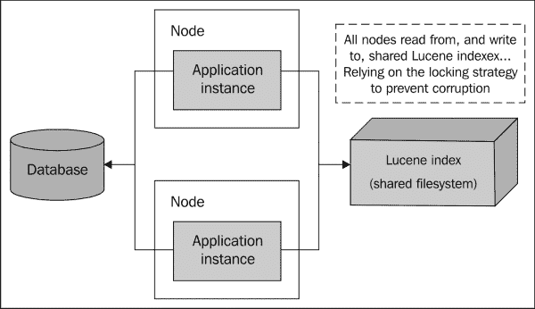
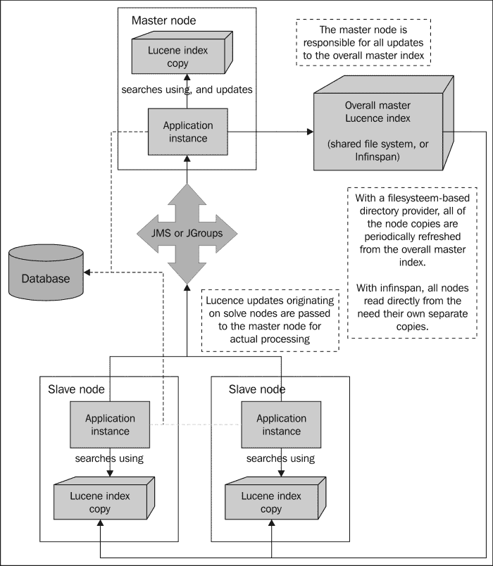

# 第 7 章高级绩效策略

在本章中，我们将介绍一些通过代码和服务器体系结构改进生产应用程序性能和可伸缩性的高级策略。我们将探索在多节点服务器集群中运行应用程序的选项，以分布式方式分散和处理用户请求。我们还将学习如何使用分片来帮助我们的 Lucene 索引更快、更易于管理。

# 一般提示

在深入探讨提高性能和可伸缩性的一些高级策略之前，让我们简要回顾一下本书中已经介绍的一些一般性能技巧：

*   为 Hibernate 搜索映射实体类时，使用`@Field`注释的可选元素从 Lucene 索引中去除不必要的膨胀（请参见[第 2 章](2.html "Chapter 2. Mapping Entity Classes")，*映射实体类*：
    *   如果您肯定没有使用索引时间提升（请参阅[第 4 章](4.html "Chapter 4. Advanced Mapping")、*高级映射*，则没有理由存储实现这一点所需的信息。将`norms`元素设置为`Norms.NO`。
    *   默认情况下，除非将`store`元素设置为`Store.YES`或`Store.COMPRESS`（参见[第 5 章](5.html "Chapter 5. Advanced Querying")、*高级查询*，否则不会存储基于投影的查询所需的信息。如果有不再使用的基于投影的查询，请将此元素作为清理的一部分删除。
*   使用条件索引（参见[第 4 章](4.html "Chapter 4. Advanced Mapping")、*高级映射*和部分索引（参见[第 2 章](2.html "Chapter 2. Mapping Entity Classes")、*映射实体类*）来减小 Lucene 索引的大小。
*   依靠过滤器在 Lucene 级别缩小结果范围，而不是在数据库查询级别使用`WHERE`子句（参见[第 5 章](5.html "Chapter 5. Advanced Querying")、*高级查询*。
*   尽可能使用基于投影的查询（请参见[第 5 章](5.html "Chapter 5. Advanced Querying")、*高级查询*，以减少或消除对数据库调用的需求。请注意，使用高级数据库缓存的好处可能并不总是证明增加的复杂性是合理的。
*   测试各种索引管理器选项（参见[第 6 章](6.html "Chapter 6. System Configuration and Index Management")、*系统配置和索引管理*），例如尝试近实时索引管理器或`async`工作者执行模式。

# 在集群中运行应用程序

在生产环境中扩展现代 Java 应用程序通常需要在服务器实例集群中运行它们。Hibernate Search 在集群环境中非常适合，它提供了多种配置解决方案的方法。

## 简单簇

最直接的方法只需要很少的 Hibernate 搜索配置。只需设置一个文件服务器来托管 Lucene 索引，并使其可用于集群中的每个服务器实例（例如 NFS、Samba 等）：



在共享驱动器上使用公共 Lucene 索引的多个服务器节点的简单集群

集群中的每个应用实例都使用默认的索引管理器和常用的`filesystem`目录提供程序（参见[第 6 章](6.html "Chapter 6. System Configuration and Index Management")、*系统配置和索引管理*。

在这种安排中，所有服务器节点都是真正的对等节点。它们都从同一个 Lucene 索引中读取数据，无论哪个节点执行更新，都由该节点负责写入。为了防止损坏，Hibernate 搜索依赖于通过锁定策略阻止同步写入（即“简单”或“本机”，请参见[第 6 章](6.html "Chapter 6. System Configuration and Index Management")、*系统配置和索引管理*）。

### 提示

回想一下，“近实时”索引管理器与集群环境明显不兼容。

这种方法的优点是双重的。首先也是最重要的是简单。所涉及的唯一步骤是设置文件系统共享，并将每个应用程序实例的目录提供程序指向同一位置。其次，这种方法确保集群中的所有节点都能立即看到 Lucene 更新。

然而，一个严重的缺点是，这种方法只能扩展到目前为止。非常小的集群可能工作得很好，但是大量的节点试图同时访问相同的共享文件，最终会导致锁争用。

此外，承载 Lucene 索引的文件服务器是一个单点故障。如果文件共享下降，那么您的搜索功能会在整个集群中立即发生灾难性的中断。

## 主从集群

当您的可伸缩性需要超越简单集群的限制时，Hibernate 搜索提供了更高级的模型来考虑。其中的共同点是主节点负责所有 Lucene 写入操作。

集群还可以包括任意数量的从属节点。从属节点仍可能启动 Lucene 更新，而应用程序代码无法真正区分两者之间的区别。但是，在后台，从属节点将实际由主节点执行的工作委派给其他节点。

### 目录提供者

在主从集群中，仍然有一个“总体主”Lucene 索引，它在逻辑上独立于所有节点。这可能是基于文件系统的，就像使用简单集群一样。但是，它可能基于 JBoss Infinispan（[）http://www.jboss.org/infinispan](http://www.jboss.org/infinispan) ），一个由主要赞助 Hibernate 开发的同一家公司赞助的开源内存中 NoSQL 数据存储：

*   在基于**文件系统的**方法中，所有节点都保留自己的 Lucene 索引本地副本。主节点实际上对整个主节点索引执行更新，所有节点定期从该总体主节点读取以刷新其本地副本。
*   在基于**Infinispan 的**方法中，所有节点都从 Infinispan 索引读取（尽管仍然建议将写操作委托给主节点）。因此，节点不需要维护自己的本地索引副本。实际上，由于 Infinispan 是一个分布式数据存储，因此索引的某些部分无论如何都将驻留在每个节点上。但是，最好还是将整个索引可视化为一个单独的实体。

### 工人后端

提供两种机制，从节点将写操作委托给主节点：

*   **JMS**消息队列提供者创建一个队列，从节点向该队列发送包含 Lucene 更新请求详细信息的消息。主节点监视此队列，检索消息，并实际执行更新操作。
*   You may instead replace JMS with **JGroups** ([http://www.jgroups.org](http://www.jgroups.org)), an open source multicast communication system for Java applications. This has the advantage of being faster and more immediate. Messages are received in real-time, synchronously rather than asynchronously.

    但是，JMS 消息通常在等待检索时保存到磁盘上，因此可以在应用程序崩溃时恢复和处理。如果您使用的是 JGroups，并且主节点脱机，那么在中断期间从节点发送的所有更新请求都将丢失。要完全恢复，您可能需要手动重新编制 Lucene 索引的索引。

    

    使用基于文件系统或 Infinispan 的目录提供程序和基于 JMS 或 JGroups 的工作程序的主从集群。请注意，在使用 Infinispan 时，节点不需要自己单独的索引副本。

### 工作示例

尝试所有可能的集群策略需要参考 Hibernate 搜索参考指南，以及 Infinispan 和 JGroups 的文档。然而，我们将从使用文件系统和 JMS 方法实现集群开始，因为其他一切都只是这个标准主题的一个变体。

本章版本的 VAPORware Marketplace 应用程序抛弃了我们一直使用的 Maven Jetty 插件。这个插件非常适合用于测试和演示，但它是用于运行单个服务器实例的，我们现在需要同时运行至少两个 Jetty 实例。

为了实现这一点，我们将以编程方式配置和启动 Jetty 实例。如果你在`chapter7`项目的`src/test/java/`下查看，现在有一个`ClusterTest`类。它是为 JUnit4 构建的，因此 Maven 可以在构建之后自动调用其`testCluster()`方法。让我们看看测试用例方法的相关部分：

```java
...
String projectBaseDirectory = System.getProperty("user.dir");
...
Server masterServer = new Server(8080);
WebAppContextmasterContext = new WebAppContext();
masterContext.setDescriptor(projectBaseDirectory +
   "/target/vaporware/WEB-INF/web.xml");
...
masterServer.setHandler(masterContext);
masterServer.start();
...
Server slaveServer = new Server(8181);
WebAppContextslaveContext = new WebAppContext();
slaveContext.setDescriptor(projectBaseDirectory +
   "/target/vaporware/WEB-INF/web-slave.xml");
...
slaveServer.setHandler(slaveContext);
slaveServer.start();
...
```

尽管这一切都在一台物理机器上运行，但出于测试和演示目的，我们正在模拟一个集群。一个 Jetty 服务器实例在端口 8080 上作为主节点启动，另一个 Jetty 服务器在端口 8181 上作为从节点启动。这两个节点之间的区别在于，它们使用单独的`web.xml`文件，这些文件在启动时依次加载不同的侦听器。

在该应用程序的早期版本中，`StartupDataLoader`类处理所有数据库和 Lucene 初始化。现在，两个节点分别使用`MasterNodeInitializer`和`SlaveNodeInitializer`。它们依次从名为`hibernate.cfg.xml`和`hibernate-slave.cfg.xml`的单独文件加载 Hibernate ORM 和 Hibernate 搜索设置。

### 提示

您可以通过多种方式将应用程序配置为作为主节点或从节点实例运行。您可以使用依赖项注入框架来根据环境中的某些内容加载正确的设置，而不是使用单独版本的`web.xml`或`hibernate.cfg.xml`构建单独的 WAR。

Hibernate 的两个版本`config`文件都设置了以下 Hibernate 搜索属性：

*   `hibernate.search.default.directory_provider`: In previous chapters we have seen this populated with either `filesystem` or `ram`. The other option discussed earlier is `infinispan`.

    这里，我们分别在主节点和从节点上使用`filesystem-master`和`filesystem-slave`。这两个目录提供程序与常规的`filesystem`类似，并使用我们迄今为止看到的所有相关属性（例如位置、锁定策略等）。

    但是，“master”变体包括定期刷新整个 master Lucene 索引的功能。“从属”变体则做相反的操作，定期用整个主内容刷新其本地副本。

*   `hibernate.search.default.indexBase`：正如我们在前面章节中看到的单节点版本，该属性包含*本地*Lucene 索引的基本目录。因为我们这里的示例集群运行在同一台物理机器上，所以主节点和从节点对此属性使用不同的值。
*   `hibernate.search.default.sourceBase`：此属性包含*总体主控*Lucene 索引的基本目录。在生产环境中，这将位于某种共享文件系统上，由所有节点装载和访问。这里，节点在相同的物理机器上运行，因此主节点和从节点对该属性使用相同的值。
*   `hibernate.search.default.refresh`：这是索引刷新之间的间隔（以秒为单位）。主节点将在每个间隔后刷新总体主索引，从节点将使用总体主节点刷新自己的本地副本。本章版本的 VAPORware Marketplace 应用程序使用 10 秒的设置进行演示，但这对于生产来说太短了。默认设置为 3600 秒（一小时）。

要建立 JMS worker 后端，仅从节点*需要三个附加设置：*

 **   `hibernate.search.default.worker.backend`：将该值设置为`jms`。由于未指定任何设置，所以在前面的章节中应用了默认值`lucene`。如果使用 JGroups，则根据节点类型将其设置为`jgroupsMaster`或`jgroupsSlave`。
*   `hibernate.search.default.worker.jms.connection_factory`: This is the name by which Hibernate Search looks up your JMS connection factory in JNDI. This is similar to how Hibernate ORM uses the `connection.datasource` property to retrieve a JDBC connection from the database.

    在这两种情况下，JNDI 配置都特定于运行应用程序的应用程序服务器。要查看如何设置 JMS 连接工厂，请参阅`src/main/webapp/WEB-INF/jetty-env.xml`Jetty 配置文件。我们在这个演示中使用 ApacheActiveMQ，但是任何与 JMS 兼容的提供程序都可以正常工作。

*   `hibernate.search.default.worker.jms.queue`：从节点向 Lucene 发送写请求的 JMS 队列的 JNDI 名称。这也是在应用服务器级别配置的，就在连接工厂旁边。

通过这些工作后端设置，从节点将自动向 JMS 队列发送一条消息，说明需要 Lucene 更新。为了证明这一点，新的`MasterNodeInitializer`和`SlaveNodeInitializer`类分别加载了常规测试数据集的一半。我们将知道，如果所有测试实体最终都被索引在一起，并且由从任一节点运行的搜索查询返回，那么集群就可以工作。

尽管 Hibernate Search 会自动将消息从从属节点发送到 JMS 队列，但您的责任是让主节点检索并处理这些消息。

在 JEE 环境中，您可以使用消息驱动 bean，正如 Hibernate 搜索文档所建议的那样。Spring 还有一个可以利用的任务执行框架。然而，在任何框架中，基本思想都是主节点应该生成一个后台线程来监视 JMS 队列并处理其消息。

本章版本的 VAPORware Marketplace 应用程序包含一个用于此目的的`QueueMonitor`类，该类被包装到`Thread`对象中，并由`MasterNodeInitializer`类派生。

要执行实际的 Lucene 更新，最简单的方法是创建自己的自定义子类`AbstractJMSHibernateSearchController`。我们的实现被称为`QueueController`，除了包装这个抽象基类之外，几乎没有什么作用。

当队列监视器从 JMS 队列接收到一个`javax.jms.Message`对象时，它只是按原样传递给控制器的基类方法`onMessage`。该内置方法为我们处理 Lucene 更新。

### 注

如您所见，主从式集群方法比简单集群方法涉及的内容要多得多。然而，主从式方法在可伸缩性方面提供了极大的优势。

它还降低了单点故障风险。的确，这个架构涉及一个“主”节点，所有 Lucene 写操作都必须通过它。但是，如果主节点关闭，从节点将继续工作，因为它们的搜索查询是针对自己的本地索引副本运行的。此外，更新请求应该由 JMS 提供程序持久化，以便在主节点恢复联机后仍然可以执行这些更新。

因为我们是以编程方式而不是通过 Maven 插件来旋转 Jetty 实例，所以我们将不同的目标集传递给每个 Maven 构建。对于`chapter7`项目，您应该按如下方式运行 Maven：

```java
mvn clean compile war:exploded test
```

您可以在`http://localhost:8080`访问“主”节点，在`http://localhost:8181`访问“从”节点。如果您在主节点上启动搜索查询时非常快，那么您将看到它只返回预期结果的一半！但是，在几秒钟内，从节点更新通过 JMS 到达。数据集的两部分将合并并在集群中可用。

# 分片 Lucene 索引

正如您可以在集群中的多个节点之间平衡应用程序负载一样，您也可以通过一个名为**切分**的过程拆分 Lucene 索引。如果您的索引增长到非常大的大小，则可能会考虑性能差异，因为较大的索引文件比较小的碎片要花费更长的时间来索引和优化。

如果您的实体适合进行分区（例如，按语言、地理位置等），则分片可能提供额外的好处。如果可以预测地将查询导向特定的适当切分，那么性能可能会得到提高。此外，当您可以将“敏感”数据存储在物理上不同的位置时，律师有时会感到高兴。

尽管其数据集非常小，但本章版本的 VAPORware Marketplace 应用程序现在将其`App`索引拆分为两个碎片。`hibernate.cfg.xml`中的相关行与以下类似：

```java
...
<property
   name="hibernate.search.default.sharding_strategy.nbr_of_shards">
      2
</property>
...
```

与包含子字符串`default`的所有其他 Hibernate 搜索属性一样，这是一个全局设置。可以通过用索引名（例如，`App`替换`default`来指定索引。

### 注

这一行同时出现在`hibernate.cfg.xml`（由我们的“主”节点使用）和`hibernate-slave.cfg.xml`（由我们的“从”节点使用）中。在集群环境中运行时，切分配置应与所有节点匹配。

将索引拆分为多个分片时，每个分片都包括普通索引名称，后跟一个数字（从零开始）。例如，`com.packtpub.hibernatesearch.domain.App.0`而不仅仅是`com.packtpub.hibernatesearch.domain.App`。此屏幕截图显示了双节点集群的 Lucene 目录结构，同时它已启动并运行，两个节点配置为两个碎片：


集群中运行的分片 Lucene 索引示例（注意每个`App`实体目录的编号）

正如碎片在文件系统上编号一样，它们可以在`hibernate.cfg.xml`中按编号单独配置。例如，如果要将碎片存储在不同的位置，可以按如下方式设置属性：

```java
...
<property name="hibernate.search.App.0.indexBase">
   target/lucenceIndexMasterCopy/EnglishApps
</property>
<property name="hibernate.search.App.1.indexBase">
   target/lucenceIndexMasterCopy/FrenchApps
</property>
...
```

当对实体执行 Lucene 写入操作时，或者当搜索查询需要从实体的索引中读取时，**分片策略**决定使用哪个分片。

如果您只是为了减小文件大小而进行切分，那么默认策略（由`org.hibernate.search.store.impl.IdHashShardingStrategy`实现）是完全正确的。它使用每个实体的 ID 来计算唯一的散列码，并以大致均匀的方式将实体分布在碎片中。因为散列计算是可复制的，所以该策略能够将实体的未来更新指向适当的碎片。

要使用更多的外来逻辑创建您自己的自定义分片策略，您可以创建一个继承自`IdHashShardingStrategy`的新子类，并根据需要对其进行调整。或者，您可以完全从头开始，使用一个实现`org.hibernate.search.store.IndexShardingStrategy`接口的新类，也许可以参考`IdHashShardingStrategy`的源代码作为指导。

# 总结

在本章中，我们学习了如何在现代分布式服务器体系结构中使用应用程序，以实现可扩展性和更好的性能。我们已经看到了一个使用基于文件系统的目录提供程序和基于 JMS 的后端实现的工作集群，现在我们有足够的知识来探索涉及 InFinispan 和 JGroups 的其他方法。我们使用切分将 Lucene 索引分割成更小的块，并且知道如何在必要时实施我们自己的自定义切分策略。

这将结束我们的 Hibernate 搜索小冒险！我们已经介绍了很多关于 Hibernate、Lucene 和 Solr 的关键概念，以及一般的搜索。我们已经学习了如何将数据映射到搜索索引，在运行时查询和更新这些索引，并将其安排在给定项目的最佳体系结构中。我们通过一个示例应用程序实现了所有这些，该应用程序随着我们的知识从简单到高级的不断增长。

总有更多的东西要学。Hibernate Search 可以与数十个 Solr 组件配合使用，以获得更高级的功能，并且还可以与新一代“NoSQL”数据存储集成。然而，如果您愿意，您现在已经具备了足够的核心知识，可以独立探索这些视野。直到下次，谢谢你的阅读！你可以在网上`steveperkins.net`找到我，我很想听到你的消息。*