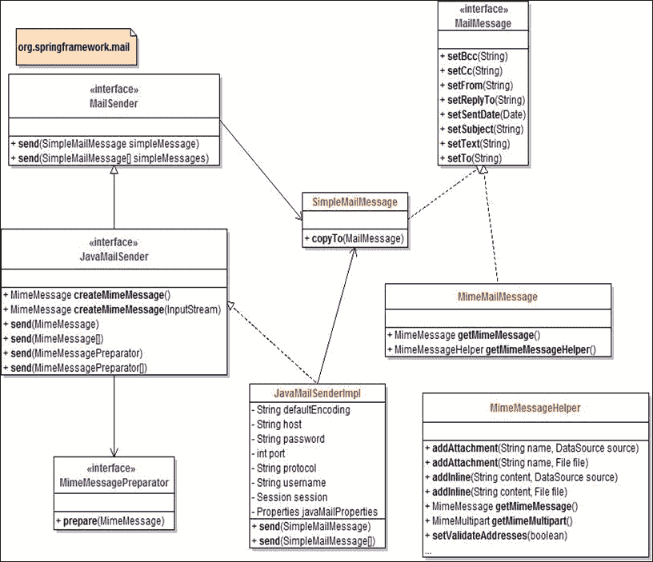
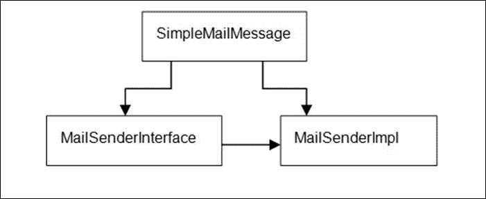

# 第三章，用 Spring Mail 邮寄

邮件 API 是所有现代 web 应用程序的一部分。最终用户更喜欢通过邮件告知应用程序执行的事务的详细信息。

Spring 使得向任何 Java 应用程序提供邮件功能变得更加容易。在本章中，我们将了解如何使用 Spring 邮件模板发送电子邮件给收件人。在前一章中，我们使用消息传递作为中间件在队列中存储消息，现在在本章中，我们将演示使用不同场景的 Spring 邮件模板配置。

# Spring 邮件消息处理流程

下面的图描述了 Spring 邮件消息流程。这样，我们就可以清楚地理解使用 Spring 邮件模板发送邮件的过程。

消息被创建并发送到传输协议，传输协议与 internet 协议交互。然后，收件人将收到该消息。


Spring 邮件框架需要邮件配置或 SMTP 配置，作为需要发送的输入和消息。邮件 API 与 internet 协议交互以发送消息。在下一节中，我们将研究 SpringMail 框架中的类和接口。

# 使用 Spring 发送邮件的接口和类

包`org.springframework.mail`用于 spring 应用中的邮件配置。



以下是用于发送邮件的三个主要接口：

*   `MailSender`：此接口用于发送简单邮件消息。
*   `JavaMailSender`：该接口是`MailSender`接口的子接口，支持发送邮件消息。
*   `MimeMessagePreparator`：该接口是一个回调接口，支持`JavaMailSender`接口编写邮件消息。

以下类用于使用 Spring 发送邮件：

*   `SimpleMailMessage`: This is a class which has properties such as `to`, `from`, `cc`, `bcc`, `sentDate`, and many others. The `SimpleMailMessage` interface sends mail with `MailSenderImp` classes.

    

*   `JavaMailSenderImpl`: This class is an implementation class of the `JavaMailSender` interface.

    

*   `MimeMessageHelper`：这个类帮助准备 MIME 消息。

# 使用@Configuration 注释发送邮件

我们将在这里演示如何使用 Spring mail API 发送邮件。

1.  First, we provide all the SMTP details in the `.properties` file and read it to the class file with the `@Configuration` annotation. The name of the class is `MailConfiguration`.

    `mail.properties`文件内容如下：

    ```java
    mail.protocol=smtp
    mail.host=localhost
    mail.port=25
    mail.smtp.auth=false
    mail.smtp.starttls.enable=false
    mail.from=me@localhost
    mail.username=
    mail.password=

    @Configuration
    @PropertySource("classpath:mail.properties")
    public class MailConfiguration {
      @Value("${mail.protocol}")
      private String protocol;
      @Value("${mail.host}")
      private String host;
      @Value("${mail.port}")
      private int port;
      @Value("${mail.smtp.auth}")
      private boolean auth;
      @Value("${mail.smtp.starttls.enable}")
      private boolean starttls;
      @Value("${mail.from}")
      private String from;
      @Value("${mail.username}")
      private String username;
      @Value("${mail.password}")
      private String password;

      @Bean
      public JavaMailSender javaMailSender() {
        JavaMailSenderImpl mailSender = new JavaMailSenderImpl();
        Properties mailProperties = new Properties();
        mailProperties.put("mail.smtp.auth", auth);
        mailProperties.put("mail.smtp.starttls.enable", starttls);
        mailSender.setJavaMailProperties(mailProperties);
        mailSender.setHost(host);
        mailSender.setPort(port);
        mailSender.setProtocol(protocol);
        mailSender.setUsername(username);
        mailSender.setPassword(password);
        return mailSender;
      }
    }
    ```

2.  下一步是创建 rest 控制器发送邮件；为此，请点击**提交**。我们将使用`SimpleMailMessage`接口，因为我们没有任何附件。

    ```java
    @RestController
    class MailSendingController {
      private final JavaMailSender javaMailSender;
      @Autowired
      MailSubmissionController(JavaMailSender javaMailSender) {
        this.javaMailSender = javaMailSender;
      }
      @RequestMapping("/mail")
      @ResponseStatus(HttpStatus.CREATED)
      SimpleMailMessage send() { 
        SimpleMailMessage mailMessage = new SimpleMailMessage();
        mailMessage.setTo("packt@localhost");
        mailMessage.setReplyTo("anjana@localhost");
        mailMessage.setFrom("Sonali@localhost");
        mailMessage.setSubject("Vani veena Pani");
        mailMessage.setText("MuthuLakshmi how are you?Call Me Please [...]");
        javaMailSender.send(mailMessage);
        return mailMessage;
      }
    }
    ```

# 使用具有 XML 配置的 MailSender 和 SimpleEmailMessage 发送邮件

“简单邮件”是指发送的电子邮件仅基于文本，没有 HTML 格式，没有图像，也没有附件。在这篇文章中，我们考虑了一个场景：当用户获得在应用程序中的订单时，我们将向用户发送欢迎的 T3 邮件。在这种情况下，邮件将在数据库插入操作成功后发送。

为邮件服务创建一个名为`com.packt.mailService`的单独文件夹。下面是使用`MailSender`接口和`SimpleMailMessage`类发送邮件的步骤。

1.  创建一个名为`Spring4MongoDB_MailChapter3`的新 Maven web 项目。
2.  该示例使用了在[第 1 章](01.html "Chapter 1. Spring Mongo Integration")、*Spring Mongo Integration*中创建的 MongoDB 数据库。我们还在`Customer`、`Order`和`Product`上使用与 MongoDB 相同的 Eshop db 数据库进行 CRUD 操作。我们还使用了相同的`mvc`配置和源文件。
3.  使用与[第 2 章](02.html "Chapter 2. Messaging with Spring JMS")、*与 Spring JMS 的消息传递*相同的依赖项。
4.  我们需要将依赖项添加到`pom.xml`文件：

    ```java
    <dependency>
      <groupId>org.springframework.integration</groupId>
      <artifactId>spring-integration-mail</artifactId>
      <version>3.0.2.RELEASE</version>
      <scope>runtime</scope>
    </dependency>
    <dependency>
      <groupId>javax.activation</groupId>
      <artifactId>activation</artifactId>
      <version>1.1-rev-1</version>
      <scope>runtime</scope>
    </dependency>
    <dependency>
      <groupId>javax.mail</groupId>
      <artifactId>mail</artifactId>
      <version>1.4.3</version>
    </dependency>

    ```

5.  编译 Maven 项目。为邮件服务创建一个名为`com.packt.mailService`的单独文件夹。
6.  创建一个名为`MailSenderService`的简单类，并自动连接`MailSender`和`SimpleMailMessage`类。基本骨架如图所示：

    ```java
    public class MailSenderService {
      @Autowired
      private MailSender mailSender;
      @AutoWired 
      private SimpleMailMessage simplemailmessage;
      public void sendmail(String from, String to, String subject, String body){
        /*Code */
      }

    }
    ```

7.  接下来，创建一个`SimpleMailMessage`对象，并为其设置邮件属性，如`from`、`to`和`subject`。

    ```java
    public void sendmail(String from, String to, String subject, String body){
      SimpleMailMessage message=new SimpleMailMessage();
      message.setFrom(from);
      message.setSubject(subject);
      message.setText(body);
      mailSender.send(message);
    }
    ```

8.  We need to configure the SMTP details. Spring Mail Support provides this flexibility of configuring SMTP details in the XML file.

    ```java
    <bean id="mailSender" class="org.springframework.mail.javamail.JavaMailSenderImpl">
      <property name="host" value="smtp.gmail.com" />
      <property name="port" value="587" />
      <property name="username" value="username" />
      <property name="password" value="password" />

      <property name="javaMailProperties">
      <props>
        <prop key="mail.smtp.auth">true</prop>
        <prop key="mail.smtp.starttls.enable">true</prop>
      </props>
    </property>
    </bean>

    <bean id="mailSenderService" class=" com.packt.mailserviceMailSenderService ">
      <property name="mailSender" ref="mailSender" />
    </bean>

    </beans>
    ```

    订单成功放入 MongoDB 数据库后，我们需要向客户发送邮件。更新`addorder()`方法如下：

    ```java
    @RequestMapping(value = "/order/save", method = RequestMethod.POST)
      // request insert order recordh
      public String addorder(@ModelAttribute("Order") Order order,Map<String, Object> model) {
        Customer cust=new Customer();
        cust=customer_respository.getObject(order.getCustomer().getCust_id());

        order.setCustomer(cust);
        order.setProduct(product_respository.getObject(order.getProduct().getProdid()));
        respository.saveObject(order);
        mailSenderService.sendmail("anjana.mprasad@gmail.com",cust.getEmail(),
          "Dear"+cust.getName()+"Your order details",order.getProduct().getName()+"-price-"+order.getProduct().getPrice());
        model.put("customerList", customerList);
        model.put("productList", productList);
        return "order";
      }
    ```

## 向多个收件人发送邮件

如果您想告知用户应用程序中的最新产品或促销活动，您可以创建一个邮件发送组，并使用 Spring 邮件发送支持向多个收件人发送邮件。

我们在同一个类`MailSenderService`中创建了一个重载方法，它将接受字符串数组。类中的代码段如下所示：

```java
public class MailSenderService {
  @Autowired
  private MailSender mailSender;
  @AutoWired 
  private SimpleMailMessage simplemailmessage;
  public void sendmail(String from, String to, String subject, String body){
    /*Code */
  }

  public void sendmail(String from, String []to, String subject, String body){
    /*Code */
  }

}
```

以下是用于列出已订阅促销电子邮件的 MongoDB 用户集的代码片段：

```java
  public List<Customer> getAllObjectsby_emailsubscription(String status) {
    return mongoTemplate.find(query(where("email_subscribe").is("yes")), Customer.class);
  }
```

# 发送 MIME 消息

**多用途互联网邮件扩展**（**MIME**允许通过互联网发送附件。这个类只是演示了如何使用 MIME 消息发送邮件。如果您没有随邮件发送任何附件，则不建议使用 MIME message sender type 类。在下一节中，我们将详细介绍如何发送带有附件的邮件。

用另一个方法更新`MailSenderService`类。我们使用了 MIME 消息预处理程序，并覆盖了 prepare`method()`来设置邮件的属性。

```java
public class MailSenderService {
  @Autowired
  private MailSender mailSender;
  @AutoWired 
  private SimpleMailMessage simplemailmessage;

  public void sendmail(String from, String to, String subject, String body){
    /*Code */
  }
  public void sendmail(String from, String []to, String subject, String body){
    /*Code */
  }
  public void sendmime_mail(final String from, final String to, final String subject, final String body) throws MailException{
    MimeMessagePreparator message = new MimeMessagePreparator() {
      public void prepare(MimeMessage mimeMessage) throws Exception {
        mimeMessage.setRecipient(Message.RecipientType.TO,new InternetAddress(to));
        mimeMessage.setFrom(new InternetAddress(from));
        mimeMessage.setSubject(subject);
        mimeMessage.setText(msg);
    }
  };
  mailSender.send(message);
}
```

# 随邮件发送附件

我们也可以在邮件中附上各种文件。此功能由`MimeMessageHelper`类支持。如果您只想发送没有附件的 MIME 消息，您可以选择`MimeMesagePreparator`。如果要求随邮件发送附件，我们可以使用带有文件 API 的`MimeMessageHelper`类。

Spring 提供了一个名为`org.springframework.core.io.FileSystemResource`的文件类，它有一个接受文件对象的参数化构造函数。

```java
public class SendMailwithAttachment {
  public static void main(String[] args) throws MessagingException {
    AnnotationConfigApplicationContext ctx = new AnnotationConfigApplicationContext();
    ctx.register(AppConfig.class);
    ctx.refresh();
    JavaMailSenderImpl mailSender = ctx.getBean(JavaMailSenderImpl.class);
    MimeMessage mimeMessage = mailSender.createMimeMessage();
    //Pass true flag for multipart message
    MimeMessageHelper mailMsg = new MimeMessageHelper(mimeMessage, true);
    mailMsg.setFrom("ANJUANJU02@gmail.com");
    mailMsg.setTo("RAGHY03@gmail.com");
    mailMsg.setSubject("Test mail with Attachment");
    mailMsg.setText("Please find Attachment.");
    //FileSystemResource object for Attachment
    FileSystemResource file = new FileSystemResource(new File("D:/cp/ GODGOD. jpg"));
    mailMsg.addAttachment("GODGOD.jpg", file);
    mailSender.send(mimeMessage);
    System.out.println("---Done---");
  }

}
```

# 发送预配置邮件

在本例中，我们将提供一条在邮件中发送的消息，我们将在 XML 文件中对其进行配置。有时，当涉及到 web 应用程序时，您可能需要发送维护消息。设想这样一个场景：邮件内容发生变化，但发送者和接收者都进行了预配置。在这种情况下，您可以向`MailSender`类添加另一个重载方法。

我们已经确定了邮件的主题，内容可以由用户发送。可以将其视为“一个在构建失败时向用户发送邮件的应用程序”。

```java
<?xml version="1.0" encoding="UTF-8"?>
<beans  xmlns:xsi="http://www.w3.org/2001/XMLSchema-instance" xmlns:context="http://www.springframework.org/schema/context" xsi:schemaLocation="http://www.springframework.org/schema/beans
http://www.springframework.org/schema/beans/spring-beans-3.0.xsd
http://www.springframework.org/schema/context
http://www.springframework.org/schema/context/spring-context-3.0.xsd">
<context:component-scan base-package="com.packt" />
<!-- SET default mail properties -->
<bean id="mailSender" class="org.springframework.mail.javamail.JavaMailSenderImpl">
  <property name="host" value="smtp.gmail.com"/>
  <property name="port" value="25"/>
  <property name="username" value="anju@gmail.com"/>
  <property name="password" value="password"/>
  <property name="javaMailProperties">
  <props>
    <prop key="mail.transport.protocol">smtp</prop>
    <prop key="mail.smtp.auth">true</prop>
    <prop key="mail.smtp.starttls.enable">true</prop>
    <prop key="mail.debug">true</prop>
  </props>
  </property>
</bean>

<!-- You can have some pre-configured messagess also which are ready to send -->
<bean id="preConfiguredMessage" class="org.springframework.mail.SimpleMailMessage">
  <property name="to" value="packt@gmail.com"></property>
  <property name="from" value="anju@gmail.com"></property>
  <property name="subject" value="FATAL ERROR- APPLICATION AUTO MAINTENANCE STARTED-BUILD FAILED!!"/>
</bean>
</beans>
```

现在我们将派两个不同的机构去研究对象。

```java
public class MyMailer {
  public static void main(String[] args){
    try{
      //Create the application context
      ApplicationContext context = new FileSystemXmlApplicationContext("application-context.xml");
        //Get the mailer instance
      ApplicationMailer mailer = (ApplicationMailer) context.getBean("mailService");
      //Send a composed mail
      mailer.sendMail("nikhil@gmail.com", "Test Subject", "Testing body");
    }catch(Exception e){
      //Send a pre-configured mail
      mailer.sendPreConfiguredMail("build failed exception occured check console or logs"+e.getMessage());
    }
  }
}
```

# 使用带 Velocity 的 Spring 模板发送 HTML 邮件

Velocity 是 Apache 提供的模板语言。它可以很容易地集成到 Spring 视图层中。本书中使用的最新 Velocity 版本是 1.7。在上一节中，我们演示了如何使用 Velocity 通过`@Bean`和`@Configuration`注释发送电子邮件。在本节中，我们将了解如何配置 Velocity 以使用 XML 配置发送邮件。

需要做的就是将以下 bean 定义添加到`.xml`文件中。在`mvc`的情况下，您可以将其添加到`dispatcher-servlet.xml`文件中。

```java
<bean id="velocityEngine" class="org.springframework.ui.velocity.VelocityEngineFactoryBean">
  <property name="velocityProperties">
  <value>
    resource.loader=class    class.resource.loader.class=org.apache.velocity.runtime.resource.loader.ClasspathResourceLoader
  </value>
  </property>
</bean>
```

1.  创建一个名为`Spring4MongoDB_Mail_VelocityChapter3`的新 Maven web 项目。
2.  创建一个包并将其命名为`com.packt.velocity.templates`。
3.  创建一个名为`orderconfirmation.vm`的文件。

    ```java
    <html>
    <body>
    <h3> Dear Customer,<h3>
    <p>${customer.firstName} ${customer.lastName}</p>
    <p>We have dispatched your order at address.</p>
    ${Customer.address}
    </body>
    </html>
    ```

4.  使用我们在前面部分中添加的所有依赖项。
5.  在现有 Maven 项目中，添加此依赖项：

    ```java
    <dependency>
      <groupId>org.apache.velocity</groupId>
      <artifactId>velocity</artifactId>
      <version>1.7</version>
    </dependency>
    ```

6.  为了确保在应用程序启动时加载 Velocity，我们将创建一个类。让我们把这个类命名为`VelocityConfiguration.java`。我们在类中使用了注释`@Configuration`和`@Bean`。

    ```java
    import java.io.IOException;
    import java.util.Properties;

    import org.apache.velocity.app.VelocityEngine;
    import org.apache.velocity.exception.VelocityException;
    import org.springframework.context.annotation.Bean;
    import org.springframework.context.annotation.Configuration;
    import org.springframework.ui.velocity.VelocityEngineFactory;
    @Configuration
    public class VelocityConfiguration {
      @Bean
      public VelocityEngine getVelocityEngine() 
      throws VelocityException, IOException{
        VelocityEngineFactory velocityEngineFactory = new VelocityEngineFactory();
        Properties props = new Properties();
        props.put("resource.loader", "class");
        props.put("class.resource.loader.class", "org.apache.velocity.runtime.resource.loader." + "ClasspathResourceLoader");
        velocityEngineFactory.setVelocityProperties(props);
        return factory.createVelocityEngine();
      }
    }
    ```

7.  使用相同的`MailSenderService`类，并在类中添加另一个重载的`sendMail()`方法。

    ```java
    public void sendmail(final Customer customer){
      MimeMessagePreparator preparator = new MimeMessagePreparator() {
        public void prepare(MimeMessage mimeMessage) 
        throws Exception {
          MimeMessageHelper message = new MimeMessageHelper(mimeMessage);
          message.setTo(user.getEmailAddress());
          message.setFrom("webmaster@packt.com"); // could be parameterized
          Map model = new HashMap();
          model.put("customer", customer);
          String text = VelocityEngineUtils.mergeTemplateIntoString(velocityEngine, "com/packt/velocity/templates/orderconfirmation.vm", model);
          message.setText(text, true);
        }
      };
      this.mailSender.send(preparator);
    }
    ```

8.  更新控制器类以使用 Velocity 模板发送邮件。

    ```java
    @RequestMapping(value = "/order/save", method = RequestMethod.POST)
    // request insert order recordh
    public String addorder(@ModelAttribute("Order") Order order,Map<String, Object> model) {
      Customer cust=new Customer();
      cust=customer_respository.getObject(order.getCustomer().getCust_id());

      order.setCustomer(cust);
      order.setProduct(product_respository.getObject(order.getProduct().getProdid()));
      respository.saveObject(order);
      // to send mail using velocity template.
      mailSenderService.sendmail(cust);

      return "order";
    }
    ```

# 通过不同线程发送 Spring 邮件

还有其他异步发送 Spring 邮件的选项。一种方法是为邮件发送作业设置一个单独的线程。Spring 附带了`taskExecutor`包，它为我们提供了线程池功能。

1.  创建一个名为`MailSenderAsyncService`的类，该类实现`MailSender`接口。
2.  导入`org.springframework.core.task.TaskExecutor`包。
3.  创建一个名为`MailRunnable`的私有类。以下是`MailSenderAsyncService`：

    ```java
    public class MailSenderAsyncService implements MailSender{
      @Resource(name = "mailSender")
      private MailSender mailSender;

      private TaskExecutor taskExecutor;

      @Autowired
      public MailSenderAsyncService(TaskExecutor taskExecutor){
        this.taskExecutor = taskExecutor;
      }
      public void send(SimpleMailMessage simpleMessage) throws MailException {
        taskExecutor.execute(new MailRunnable(simpleMessage));
      }

      public void send(SimpleMailMessage[] simpleMessages) throws MailException {
        for (SimpleMailMessage message : simpleMessages) {
          send(message);
        }
      }

      private class SimpleMailMessageRunnable implements Runnable {
        private SimpleMailMessage simpleMailMessage;
        private SimpleMailMessageRunnable(SimpleMailMessage simpleMailMessage) {
          this.simpleMailMessage = simpleMailMessage;
        }

        public void run() {
        mailSender.send(simpleMailMessage);
        }
      }
      private class SimpleMailMessagesRunnable implements Runnable {
        private SimpleMailMessage[] simpleMessages;
        private SimpleMailMessagesRunnable(SimpleMailMessage[] simpleMessages) {
          this.simpleMessages = simpleMessages;
        }

        public void run() {
          mailSender.send(simpleMessages);
        }
      }
    }
    ```

    的完整代码
4.  在`.xml`文件中配置的`ThreadPool`执行器。

    ```java
    <bean id="taskExecutor" class="org.springframework.scheduling.concurrent.ThreadPoolTaskExecutor" p:corePoolSize="5"
      p:maxPoolSize="10" p:queueCapacity="100" p:waitForTasksToCompleteOnShutdown="true"/>
    ```

5.  测试源代码。

    ```java
    import javax.annotation.Resource;

    import org.springframework.mail.MailSender;
    import org.springframework.mail.SimpleMailMessage;
    import org.springframework.test.context.ContextConfiguration;

    @ContextConfiguration
    public class MailSenderAsyncService {
      @Resource(name = " mailSender ")
      private MailSender mailSender;
      public void testSendMails() throws Exception {
        SimpleMailMessage[] mailMessages = new SimpleMailMessage[5];

        for (int i = 0; i < mailMessages.length; i++) {
          SimpleMailMessage message = new SimpleMailMessage();
          message.setSubject(String.valueOf(i));
          mailMessages[i] = message;
        }
        mailSender.send(mailMessages);
      }
      public static void main (String args[]){
        MailSenderAsyncService asyncservice=new MailSenderAsyncService();
        Asyncservice. testSendMails();
      }
    }
    ```

# 使用 AOP 发送 Spring 邮件

我们也可以通过将邮件功能与**面向方面编程**（**AOP**集成来发送邮件。这可用于在用户向应用程序注册后发送邮件。设想一个场景，用户在注册后收到一封激活邮件。这也可用于发送有关应用程序上的订单的信息。使用以下步骤使用 AOP 创建`MailAdvice`类：

1.  创建一个名为`com.packt.aop`的包。
2.  Create a class called `MailAdvice`.

    ```java
    public class MailAdvice {
      public void advice (final ProceedingJoinPoint proceedingJoinPoint) {
        new Thread(new Runnable() {
        public void run() {
          System.out.println("proceedingJoinPoint:"+proceedingJoinPoint);
          try {
            proceedingJoinPoint.proceed();
          } catch (Throwable t) {
            // All we can do is log the error.
            System.out.println(t);
          }
        }
      }).start();
      }
    }
    ```

    这个类创建一个新线程并启动它。在`run`方法中，调用`proceedingJoinPoint.proceed()`方法。`ProceddingJoinPoint`是`AspectJ.jar`中提供的一个类。

3.  使用`aop`配置更新`dispatcher-servlet.xml`文件。使用以下代码更新`xlmns`命名空间：

    ```java
    xmlns:aop=http://www.springframework.org/schema/aop
    ```

4.  同时更新`xsi:schemalocation`，如下代码所示：

    ```java
    xsi:schemaLocation="http://www.springframework.org/
      schema/aop http://www.springframework.org/
      schema/aop/spring-aop-2.5.xsd

    ```

5.  更新`.xml`文件中的 bean 配置：

    ```java
    <aop:config>
      <aop:aspect ref="advice">
      <aop:around method="fork" pointcut="execution(* org.springframework.mail.javamail.JavaMailSenderImpl.send(..))"/>
      </aop:aspect>
    </aop:config>
    ```

# 总结

在本章中，我们演示了如何创建邮件服务并使用 SpringAPI 对其进行配置。我们还演示了如何使用 MIME 消息发送带有附件的邮件。我们还演示了如何使用`ExecutorService`创建用于发送邮件的专用线程。我们看到了一个可以将邮件发送给多个收件人的示例，并看到了使用 Velocity 引擎创建模板和向收件人发送邮件的实现。在最后一节中，我们演示了如何使用 SpringAOP 和线程发送 Spring 框架支持的邮件。

在下一章中，我们将介绍 Spring 批处理框架。