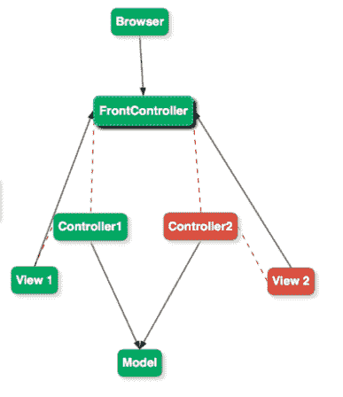
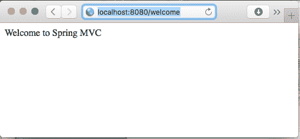
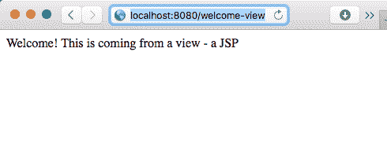
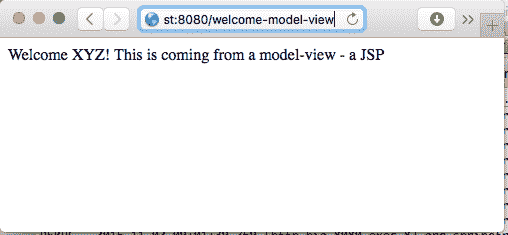

# 用 SpringMVC 构建 Web 应用程序

SpringMVC 是用于开发 JavaWeb 应用程序的最流行的 web 框架。SpringMVC 的美妙之处在于它干净、松散耦合的体系结构。Spring MVC 对控制器、处理程序映射、视图解析程序和**普通旧 Java 对象**（**POJO**）命令 bean 的角色进行了清晰的定义，它利用了 Spring 的所有核心功能——如依赖项注入和自动连接——来简化 web 应用程序的创建。由于对多视图技术的支持，它也是可扩展的。

虽然 Spring MVC 可以用于创建 REST 服务，但我们在[第 5 章](05.html)中讨论了*使用 Spring Boot*构建微服务。

在本章中，我们将通过简单的示例重点回顾 SpringMVC 的基础知识。

本章将介绍以下主题：

*   springmvc 体系结构
*   DispatcherServlet、视图解析程序、处理程序映射和控制器所扮演的角色
*   模型属性和会话属性
*   表单绑定和验证
*   与 Bootstrap 集成
*   Spring 安全的基础知识
*   为控制器编写简单的单元测试

# Java web 应用程序体系结构

我们开发 Java web 应用程序的方式在过去几十年中不断发展。我们将讨论开发 Java web 应用程序的不同体系结构方法，并了解 Spring MVC 的适用范围：

*   模型 1 架构
*   模型 2 或 MVC 架构
*   带前端控制器的型号 2

# 模型 1 架构

模型 1 体系结构是用于开发基于 Java 的 web 应用程序的初始体系结构样式之一。以下是一些重要的细节：

*   JSP 页面直接处理来自浏览器的请求
*   JSP 页面使用了包含简单 JavaBean 的模型
*   在这种体系结构风格的一些应用程序中，JSP 甚至对数据库执行查询
*   JSP 还处理了流逻辑：下一步显示哪个页面

下图表示典型的 1 型体系结构：


这种方法有很多缺点，导致快速搁置和其他体系结构的演变。以下列出了几个重要的缺点：

*   **几乎没有任何关注点分离**：JSP 负责检索数据、显示数据、决定下一步显示哪些页面（流程），有时甚至还负责业务逻辑
*   **复杂的 JSP**：因为 JSP 处理了大量的逻辑，所以它们庞大且难以维护

# 模型 2 架构

模型 2 体系结构的出现是为了解决具有多重职责的复杂 JSP 所涉及的复杂性。这构成了 MVC 架构风格的基础。下图表示典型的型号 2 架构：


模型 2 体系结构在模型、视图和控制器之间具有明确的角色分离。这将导致更易于维护的应用程序。以下是一些重要的细节：

*   **模型**：表示用于生成视图的数据。
*   **视图**：使用模型渲染屏幕。
*   **控制器**：控制流量。从浏览器获取请求，填充模型并重定向到视图。示例为上图中的**Servlet1**和**Servlet2**。

# 模型 2 前端控制器结构

在 Model2 架构的基本版本中，来自浏览器的请求由不同的 servlet（或控制器）直接处理。在许多业务场景中，在处理请求之前，您可能希望在 servlet 中执行一些常见的操作。例如，确保登录用户具有执行请求的正确授权。这是您不希望在每个 servlet 中实现的常见功能。

在模型 2**前端控制器**架构中，所有请求都流到一个称为前端控制器的控制器中。

下图为典型的 2 型前控制器结构：



以下是典型前端控制器的部分职责：

*   它决定哪个控制器执行请求
*   它决定渲染哪个视图
*   它提供了添加更多通用功能的规定
*   SpringMVC 使用带有前端控制器的 MVC 模式。前端控制器称为**DispatcherServlet**。稍后我们将讨论 DispatcherServlet。

# 基本流程

SpringMVC 使用 Model2 前端控制器体系结构的修改版本。在详细介绍 SpringMVC 的工作原理之前，我们将重点介绍使用 SpringMVC 创建几个简单的 web 流。在本节中，我们将使用 SpringMVC 创建六个典型的 web 应用程序流。流量如下所示：

*   **流程 1**：控制器无视图；独立提供内容
*   **流程 2**：带视图的控制器（JSP）
*   **流程 3**：具有视图并使用 ModelMap 的控制器
*   **流程 4**：带视图且使用 ModelAndView 的控制器
*   **流程 5**：简单表单的控制器
*   **流程 6**：简单表单控制器，带验证

在每个流程的末尾，我们将讨论如何对控制器进行单元测试。

# 基本设置

在开始第一个流程之前，我们需要将应用程序设置为使用 SpringMVC。在下一节中，我们将从了解如何在 web 应用程序中设置 SpringMVC 开始。

我们正在使用 Maven 来管理我们的依赖关系。设置简单的 web 应用程序涉及以下步骤：

1.  为 SpringMVC 添加一个依赖项。
2.  将 DispatcherServlet 添加到`web.xml`。
3.  创建 Spring 应用程序上下文。

# 为 SpringMVC 添加依赖项

让我们从将 Spring MVC 依赖项添加到`pom.xml`开始。下面的代码显示了要添加的依赖项。因为我们使用的是 Spring BOM，所以不需要指定工件版本：

```
    <dependency> 
      <groupId>org.springframework</groupId> 
      <artifactId>spring-webmvc</artifactId> 
    </dependency>
```

DispatcherServlet 是前端控制器模式的实现。对 Spring MVC 的任何请求都将由前端控制器（即 DispatcherServlet）处理。

# 将 DispatcherServlet 添加到 web.xml

要启用此功能，我们需要将 DispatcherServlet 添加到`web.xml`。让我们看看如何做到这一点：

```
    <servlet> 
      <servlet-name>spring-mvc-dispatcher-servlet</servlet-name>    
      <servlet-class> 
        org.springframework.web.servlet.DispatcherServlet 
      </servlet-class> 
      <init-param> 
        <param-name>contextConfigLocation</param-name> 
        <param-value>/WEB-INF/user-web-context.xml</param-value> 
      </init-param> 
        <load-on-startup>1</load-on-startup> 
    </servlet> 
    <servlet-mapping> 
      <servlet-name>spring-mvc-dispatcher-servlet</servlet-name> 
      <url-pattern>/</url-pattern> 
    </servlet-mapping>
```

第一部分是定义一个 servlet。我们还定义了一个上下文配置位置`/WEB-INF/user-web-context.xml`。我们将在下一步中定义 Spring 上下文。在第二部分中，我们将定义一个 servlet 映射。我们正在将 URL`/`映射到 DispatcherServlet。因此，所有请求都将由 DispatcherServlet 处理。

# 创建 Spring 上下文

现在我们已经在`web.xml`中定义了 DispatcherServlet，我们可以继续创建 Spring 上下文。最初，我们将创建一个非常简单的上下文，而不真正定义任何具体内容：

```
    <beans > <!-Schema Definition removed --> 
       <context:component-scan  
       base-package="com.mastering.spring.springmvc"  /> 
       <mvc:annotation-driven /> 
    </beans>
```

我们正在为`com.mastering.spring.springmvc`包定义组件扫描，以便创建并自动连接该包中的所有 bean 和控制器。

使用`<mvc:annotation-driven/>`初始化对 Spring MVC 支持的许多特性的支持，例如：

*   请求映射
*   异常处理
*   数据绑定和验证
*   使用`@RequestBody`注释时自动转换（例如 JSON）

这就是设置 SpringMVC 应用程序所需的全部设置。我们已经准备好开始第一个流程。

# 流 1-没有视图的简单控制器流

让我们从一个简单的流程开始，在屏幕上显示一些从 SpringMVC 控制器输出的简单文本。

# 创建 SpringMVC 控制器

让我们创建一个简单的 Spring MVC 控制器，如下所示：

```
    @Controller 
    public class BasicController { 
      @RequestMapping(value = "/welcome") 
      @ResponseBody 
    public String welcome() { 
      return "Welcome to Spring MVC"; 
     } 
   }
```

这里需要注意的几个重要事项如下：

*   `@Controller`：这定义了一个 Spring MVC 控制器，它可以包含请求映射——将 URL 映射到控制器方法。
*   `@RequestMapping(value = "/welcome")`：定义 URL`/welcome`到`welcome`方法的映射。当浏览器向`/welcome`发送请求时，Spring MVC 执行魔术并执行`welcome`方法。
*   `@ResponseBody`：在此特定上下文中，`welcome`方法返回的文本作为响应内容发送到浏览器。`@ResponseBody`有很多神奇之处——特别是在 REST 服务的环境中。我们将在[第 5 章](05.html)中讨论这一点，*使用 Spring Boot 构建微服务*。

# 运行 web 应用程序

我们使用 Maven 和 Tomcat7 来运行这个 web 应用程序。

默认情况下，Tomcat7 服务器在端口 8080 上启动。

我们可以通过调用`mvn tomcat7:run`命令来运行服务器。

以下是当点击浏览器上的`http://localhost:8080/welcome`URL 时屏幕上的截图，如以下截图所示：



# 单元测试

单元测试是开发可维护应用程序的一个非常重要的部分。我们将使用 SpringMVC 模拟框架对我们将在本章中编写的控制器进行单元测试。我们将添加对 Spring 测试框架的依赖，以使用 Spring MVC 模拟框架：

```
    <dependency> 
      <groupId>org.springframework</groupId> 
      <artifactId>spring-test</artifactId> 
      <scope>test</scope> 
    </dependency>
```

我们将采取的方法包括：

1.  设置要测试的控制器。
2.  编写测试方法。

# 设置控制器以进行测试

我们要测试的控制器是`BasicController`。创建单元测试的约定是带有后缀`Test`的类名。我们将创建一个名为`BasicControllerTest`的测试类。

基本设置如下所示：

```
    public class BasicControllerTest { 
      private MockMvc mockMvc; 
      @Before 
      public void setup() { 
        this.mockMvc = MockMvcBuilders.standaloneSetup( 
        new BasicController()) 
        .build(); 
      } 
     }
```

需要注意的几个重要事项如下：

*   `mockMvc`：此变量可用于不同的测试。因此，我们定义了`MockMvc`类的一个实例变量。
*   `@Before setup`：此方法在每次测试前运行，以初始化`MockMvc`。
*   `MockMvcBuilders.standaloneSetup(new BasicController()).build()`：这行代码构建了一个`MockMvc`实例。在本例中，它初始化 DispatcherServlet 以向配置的控制器`BasicController`提供请求。

# 编写测试方法

完整的`Test`方法如下代码所示：

```
    @Test 
    public void basicTest() throws Exception { 
      this.mockMvc 
      .perform( 
      get("/welcome") 
      .accept(MediaType.parseMediaType 
      ("application/html;charset=UTF-8"))) 
      .andExpect(status().isOk()) 
      .andExpect( content().contentType 
      ("application/html;charset=UTF-8")) 
      .andExpect(content(). 
       string("Welcome to Spring MVC")); 
    }
```

需要注意的几个重要事项如下：

*   `MockMvc``mockMvc.perform`：此方法执行请求并返回允许链接调用的 ResultActions 实例。在本例中，我们链接 andExpect 调用以检查期望。
*   `get("/welcome").accept(MediaType.parseMediaType("application/html;charset=UTF-8"))`：创建 HTTP get 请求，接受媒体类型为`application/html`的响应。
*   `andExpect`：此方法用于检查期望值。如果未达到预期，此方法将无法通过测试。
*   `status().isOk()`：使用 ResultMatcher 检查响应状态是否为成功请求的状态-200。
*   `content().contentType("application/html;charset=UTF-8"))`：使用 ResultMatcher 检查响应的内容类型是否符合规定。
*   `content().string("Welcome to Spring MVC")`：使用 ResultMatcher 检查响应内容是否包含指定字符串。

# 流程 2-带视图的简单控制器流程

在上一个流程中，要在浏览器上显示的文本是在控制器中硬编码的。这不是一个好的做法。要在浏览器上显示的内容通常是从视图生成的。最常用的选项是 JSP。

在这个流中，让我们从控制器重定向到视图。

# springmvc 控制器

与前面的示例类似，让我们创建一个简单的控制器。考虑这里的控制器的例子：

```
    @Controller 
    public class BasicViewController { 
      @RequestMapping(value = "/welcome-view") 
      public String welcome() { 
        return "welcome"; 
       } 
    }
```

需要注意的几个重要事项如下：

*   `@RequestMapping(value = "/welcome-view")`：我们正在映射一个 URL`/welcome-view`。
*   `public String welcome()`：此方法无`@RequestBody`注释。因此，SpringMVC 尝试将返回的字符串`welcome`与视图匹配。

# 创建视图-JSP

我们在`src/main/webapp/WEB-INF/views/welcome.jsp`文件夹中创建`welcome.jsp`，内容如下：

```
    <html> 
      <head> 
        <title>Welcome</title> 
      </head> 
      <body> 
        <p>Welcome! This is coming from a view - a JSP</p> 
      </body> 
    </html>
```

这是一个简单的 HTML，包含头部、正文和正文中的一些文本。

Spring MVC 必须将从`welcome`方法返回的字符串映射到`/WEB-INF/views/welcome.jsp`处的实际 JSP。这种魔法是怎么发生的？

# 视图解析器

视图解析器将视图名称解析为实际的 JSP 页面。

本例中的视图名称为`welcome`，我们希望将其解析为`/WEB-INF/views/welcome.jsp`。

可以在 spring 上下文`/WEB-INF/user-web-context.xml`中配置视图解析器。下面是这方面的代码片段：

```
    <bean class="org.springframework.web.
    servlet.view.InternalResourceViewResolver"> 
     <property name="prefix"> 
       <value>/WEB-INF/views/</value> 
     </property> 
     <property name="suffix"> 
       <value>.jsp</value> 
     </property> 
    </bean>
```

需要注意的几个要点：

*   `org.springframework.web.servlet.view.InternalResourceViewResolver`：支持 JSP 的视图解析器。通常使用`JstlView`。它还支持具有平铺视图的平铺。
*   `<property name="prefix"> <value>/WEB-INF/views/</value> </property><property name="suffix"> <value>.jsp</value> </property>`：映射视图解析器要使用的前缀和后缀。视图解析程序从控制器方法中获取字符串并解析为视图：`prefix`+viewname+`suffix`。因此，视图名称 welcome 解析为`/WEB-INF/views/welcome.jsp`。

以下是点击 URL 时屏幕上的截图：



# 单元测试

MockMvc 框架的独立设置创建了 DispatcherServlet 所需的最小基础结构。如果提供了视图解析程序，它可以执行视图解析。但是，它不会执行视图。因此，在使用独立设置进行单元测试期间，我们无法验证视图的内容。但是，我们可以检查是否提供了正确的视图。

在本单元测试中，我们需要设置`BasicViewController`，执行对`/welcome-view`的 get 请求，并检查返回的视图名称是否为`welcome`。在未来的一节中，我们将讨论如何执行集成测试，包括视图的呈现。就本测试而言，我们将权限限制为验证视图名称。

# 设置控制器以进行测试

此步骤与前面的流程非常相似。我们想测试`BasicViewController`。我们使用`BasicViewController`实例化 MockMvc。我们还配置了一个简单的视图解析器：

```
    public class BasicViewControllerTest { 
      private MockMvc mockMvc; 
      @Before 
      public void setup() { 
        this.mockMvc = MockMvcBuilders.standaloneSetup 
        (new BasicViewController()) 
        .setViewResolvers(viewResolver()).build(); 
       } 
      private ViewResolver viewResolver() { 
        InternalResourceViewResolver viewResolver =  
        new InternalResourceViewResolver(); 
        viewResolver.setViewClass(JstlView.class); 
        viewResolver.setPrefix("/WEB-INF/jsp/"); 
        viewResolver.setSuffix(".jsp"); 
       return viewResolver; 
      } 
    }
```

# 编写测试方法

完整的试验方法如下所示：

```
    @Test 
    public void testWelcomeView() throws Exception { 
      this.mockMvc 
      .perform(get("/welcome-view") 
      .accept(MediaType.parseMediaType( 
      "application/html;charset=UTF-8"))) 
      .andExpect(view().name("welcome")); 
    }
```

需要注意的几个重要事项如下：

*   `get("/welcome-model-view")`：执行对指定 URL 的 get 请求
*   `view().name("welcome")`：使用结果匹配器检查返回的视图名称是否符合规定

# 流程 3-控制器重定向到具有模型的视图

通常，为了生成视图，我们需要向它传递一些数据。在 SpringMVC 中，可以使用模型将数据传递到视图。在这个流程中，我们将使用一个简单属性建立一个模型，并在视图中使用该属性。

# springmvc 控制器

让我们创建一个简单的控制器。考虑下面的示例控制器：

```
    @Controller 
    public class BasicModelMapController { 
      @RequestMapping(value = "/welcome-model-map") 
      public String welcome(ModelMap model) { 
        model.put("name", "XYZ"); 
      return "welcome-model-map"; 
     } 
   }
```

需要注意的几个重要事项如下：

*   `@RequestMapping(value = "/welcome-model-map")`：映射的 URI 为`/welcome-model-map`。
*   `public String welcome(ModelMap model)`：新增参数为`ModelMap model`。SpringMVC 将实例化一个模型并使其可用于此方法。放入模型的属性将可在视图中使用。
*   `model.put("name", "XYZ")`：向模型添加一个具有`name`名称和`XYZ`值的属性。

# 创建视图

让我们使用在控制器的模型中设置的模型属性`name`创建一个视图。让我们在`WEB-INF/views/welcome-model-map.jsp`路径中创建一个简单的 JSP：

```
    Welcome ${name}! This is coming from a model-map - a JSP
```

需要注意的一点是：

*   `${name}`：使用**表达式语言**（**EL**语法）从模型中访问属性。

以下是点击 URL 时屏幕上的截图：


# 单元测试

在本单元测试中，我们要设置`BasicModelMapController`，执行对`/welcome-model-map`的 get 请求，检查模型是否具有预期属性，是否返回预期视图名称。

# 设置控制器以进行测试

此步骤与前面的流程非常相似。我们用`BasicModelMapController`实例化模拟 MVC：

```
    this.mockMvc = MockMvcBuilders.standaloneSetup 
      (new BasicModelMapController()) 
      .setViewResolvers(viewResolver()).build();
```

# 编写测试方法

完整的测试方法如以下代码所示：

```
    @Test 
    public void basicTest() throws Exception { 
      this.mockMvc 
      .perform( 
      get("/welcome-model-map") 
      .accept(MediaType.parseMediaType 
      ("application/html;charset=UTF-8"))) 
      .andExpect(model().attribute("name", "XYZ")) 
      .andExpect(view().name("welcome-model-map")); 
    }
```

需要注意的几个重要事项：

*   `get("/welcome-model-map")`：对指定的 URL 执行`get`请求
*   `model().attribute("name", "XYZ")`：结果匹配器检查模型是否包含指定值为**XYZ**的指定属性**名称**
*   `view().name("welcome-model-map")`：用于检查返回的视图名称是否符合规定的结果匹配器

# 流 4-控制器重定向到具有 ModelAndView 的视图

在前面的流程中，我们返回了一个视图名称，并用视图中要使用的属性填充模型。Spring MVC 提供了一种使用`ModelAndView`的替代方法。控制器方法可以返回一个带有视图名称和模型中适当属性的`ModelAndView`对象。在这个流程中，我们将探索这种替代方法。

# springmvc 控制器

请看以下控制器：

```
    @Controller 
    public class BasicModelViewController { 
     @RequestMapping(value = "/welcome-model-view") 
      public ModelAndView welcome(ModelMap model) { 
        model.put("name", "XYZ"); 
        return new ModelAndView("welcome-model-view", model); 
      } 
   }
```

需要注意的几个重要事项如下：

*   `@RequestMapping(value = "/welcome-model-view")`：映射的 URI 为`/welcome-model-view`。
*   `public ModelAndView welcome(ModelMap model)`：注意返回值不再是字符串。它是`ModelAndView`。
*   `return new ModelAndView("welcome-model-view", model)`：创建具有适当视图名称和模型的`ModelAndView`对象。

# 创建视图

让我们使用在控制器的模型中设置的模型属性`name`创建一个视图。在`/WEB-INF/views/welcome-model-view.jsp`路径中创建一个简单的 JSP：

```
    Welcome ${name}! This is coming from a model-view - a JSP
```

以下是点击 URL 时屏幕上的截图：



# 单元测试

此流程的单元测试与前面的流程类似。我们需要检查是否返回了预期的视图名称。

# 流 5-控制器重定向到具有表单的视图

现在让我们把注意力转移到创建一个简单的表单来捕获用户的输入。

需要采取以下步骤：

*   创建一个简单的 POJO。我们想创建一个用户。我们将创建一个 POJO 用户。
*   创建两个控制器方法——一个用于显示表单，另一个用于捕获表单中输入的详细信息。
*   使用表单创建一个简单视图。

# 创建命令或窗体支持对象

POJO 代表普通的旧 Java 对象。它通常用于表示遵循典型 JavaBean 约定的 bean。通常，它包含带有 getter 和 setter 的私有成员变量以及无参数构造函数。

我们将创建一个简单的 POJO 作为命令对象。课程的重要部分如下所示：

```
    public class User { 
      private String guid; 
      private String name; 
      private String userId; 
      private String password; 
      private String password2; 
      //Constructor 
      //Getters and Setters   
      //toString 
    }
```

需要注意的几个重要事项如下：

*   此类没有任何注释或与 Spring 相关的映射。任何 bean 都可以充当表单支持对象。
*   我们将捕获表单中的`name`、`user ID`和`password`。我们有一个密码确认字段`password2`和唯一标识符字段 guid。
*   为简洁起见，`Constructor`、`getters`、`setters`和`toString`方法未显示。

# 显示窗体的控制器方法

让我们先用记录器创建一个简单的控制器：

```
    @Controller 
    public class UserController { 
      private Log logger = LogFactory.getLog 
      (UserController.class); 
     }
```

让我们向控制器添加以下方法：

```
    @RequestMapping(value = "/create-user",  
    method = RequestMethod.GET) 
    public String showCreateUserPage(ModelMap model) { 
      model.addAttribute("user", new User()); 
      return "user"; 
   }
```

需要注意的重要事项如下：

*   `@RequestMapping(value = "/create-user", method = RequestMethod.GET)`：我们正在映射一个`/create-user`URI。我们第一次使用 method 属性指定了一个`Request`方法。此方法将仅对 HTTP Get 请求调用。HTTP`Get`请求通常用于显示表单。对于其他类型的 HTTP 请求，例如 Post，将不会调用此函数。
*   `public String showCreateUserPage(ModelMap model)`：这是一种典型的控制方法。
*   `model.addAttribute("user", new User())`：用于设置表单备份对象为空的模型。

# 使用表单创建视图

Java 服务器页面是 Spring 框架支持的视图技术之一。Spring 框架通过提供标记库，使使用 JSP 创建视图变得容易。这包括各种表单元素的标记、绑定、验证、设置主题和国际化消息。在本例中，我们将使用 SpringMVC 标记库中的标记以及标准 JSTL 标记库来创建视图。

让我们从创建`/WEB-INF/views/user.jsp`文件开始。

首先，让我们添加对要使用的标记库的引用：

```
    <%@ taglib uri="http://java.sun.com/jsp/jstl/core" prefix="c"%> 
    <%@ taglib uri="http://java.sun.com/jsp/jstl/fmt" prefix="fmt"%> 
    <%@ taglib uri="http://www.springframework.org/tags/form"  
      prefix="form"%> 
    <%@ taglib uri="http://www.springframework.org/tags"
      prefix="spring"%>
```

前两个条目用于 JSTL 核心和格式化标记库。我们将广泛使用 Spring 表单标记。我们提供了一个`prefix`作为引用标记的快捷方式。

让我们先用一个字段创建一个表单：

```
    <form:form method="post" modelAttribute="user"> 
     <fieldset> 
       <form:label path="name">Name</form:label> 
       <form:input path="name"  
       type="text" required="required" /> 
     </fieldset> 
   </form:form>
```

需要注意的重要事项如下：

*   `<form:form method="post" modelAttribute="user">`：这是 Spring 表单标签库中的`form`标签。指定了两个属性。表单中的数据使用 post 方法发送。第二个属性`modelAttribute`指定作为表单支持对象的模型中的属性。在模型中，我们添加了一个名为 user 的属性。我们将该属性用作`modelAttribute`。
*   `<fieldset>`：这是将一组相关控件（标签、表单字段和验证消息）分组的 HTML 元素**。**
*   `<form:label path="name">Name</form:label>`：这是显示标签的弹簧形式标签。path 属性指定应用此标签的字段名（来自 bean）。
*   `<form:input path="name" type="text" required="required" />`：这是创建文本输入字段的 Spring 表单标签。`path`属性指定该输入字段必须映射到的 bean 中的字段名。必填属性表示这是一个`required`字段。

当我们使用 Spring 表单标记时，表单支持对象（`modelAttribute="user"`中的值会自动绑定到表单，提交表单时，表单中的值会自动绑定到表单支持对象。

更完整的表单标记列表（包括名称和用户 ID 字段）如下所示：

```
    <form:form method="post" modelAttribute="user"> 
    <form:hidden path="guid" /> 
    <fieldset> 
      <form:label path="name">Name</form:label> 
      <form:input path="name"  
       type="text" required="required" /> 
    </fieldset> 
    <fieldset> 
      <form:label path="userId">User Id</form:label> 
      <form:input path="userId"  
       type="text" required="required" /> 
    </fieldset> 
    <!-password and password2 fields not shown for brewity--> 
    <input class="btn btn-success" type="submit" value="Submit" /> 
    </form:form>
```

# 控制器获取处理表单提交的方法

当用户提交表单时，浏览器发送 HTTP**POST**请求。现在让我们创建一个方法来处理这个问题。为了保持简单，我们将记录表单对象的内容。该方法的完整列表如下所示：

```
    @RequestMapping(value = "/create-user", method = 
    RequestMethod.POST) 
    public String addTodo(User user) { 
      logger.info("user details " + user); 
      return "redirect:list-users"; 
    }
```

以下是一些重要的细节：

*   `@RequestMapping(value = "/create-user", method = RequestMethod.POST)`：因为我们要处理表单提交，所以我们使用`RequestMethod.POST`方法。
*   `public String addTodo(User user)`：我们使用表单支持对象作为参数。SpringMVC 将自动将表单中的值绑定到表单支持对象。
*   `logger.info("user details " + user)`：记录用户的详细信息。
*   return`redirect:list-users`：通常，在提交表单时，我们保存数据库的详细信息，并将用户重定向到其他页面。这里，我们将用户重定向到`/list-users`。当我们使用`redirect`时，Spring MVC 发送状态为`302`的 HTTP 响应；也就是说，`REDIRECT`到新的 URL。浏览器在处理`302`响应时，会将用户重定向到新的 URL。虽然`POST`/`REDIRECT`/`GET`模式并不是解决重复表单提交问题的完美方法，但它确实减少了重复表单提交问题的发生，尤其是在呈现视图后发生的情况。

列表用户的代码非常简单，如下所示：

```
    @RequestMapping(value = "/list-users",  
    method = RequestMethod.GET) 
    public String showAllUsers() { 
      return "list-users"; 
    }
```

# 单元测试

在下一个流程中添加验证时，我们将讨论单元测试。

# 流程 6-向上一个流程添加验证

在前面的流程中，我们添加了一个表单。但是，我们没有验证表单中的值。虽然我们可以编写 JavaScript 来验证表单内容，但在服务器上进行验证始终是安全的。在这个流程中，让我们将验证添加到前面使用 SpringMVC 在服务器端创建的表单中。

SpringMVC 提供了与 Bean 验证 API 的良好集成。*JSR303*和*JSR349*定义了 Bean 验证 API 的规范（分别为 1.0 和 1.1 版），Hibernate Validator 是参考实现。

# Hibernate 验证程序依赖项

让我们从将 Hibernate Validator 添加到我们的项目`pom.xml`开始：

```
    <dependency> 
      <groupId>org.hibernate</groupId> 
      <artifactId>hibernate-validator</artifactId> 
      <version>5.0.2.Final</version> 
    </dependency>
```

# bean 上的简单验证

Bean 验证 API 指定了许多可以在 Bean 的属性上指定的验证。请看以下列表：

```
   @Size(min = 6, message = "Enter at least 6 characters") 
   private String name; 
   @Size(min = 6, message = "Enter at least 6 characters") 
   private String userId; 
   @Size(min = 8, message = "Enter at least 8 characters") 
   private String password; 
   @Size(min = 8, message = "Enter at least 8 characters") 
   private String password2;
```

需要注意的重要事项如下：

*   `@Size(min = 6, message = "Enter at least 6 characters")`：指定字段至少有六个字符。如果验证未通过，则消息属性中的文本将用作验证错误消息。

可以使用 Bean 验证执行的其他验证如下：

*   `@NotNull`：不允许为空
*   `@Size(min =5, max = 50)`：最大 50 个字符，最小 5 个字符。
*   `@Past`：应该是过去的日期
*   `@Future`：应该是未来的日期
*   `@Pattern`：应与提供的正则表达式匹配
*   `@Max`：该字段的最大值
*   `@Min`：该字段的最小值

现在，让我们集中精力让控制器方法在提交时验证表单。完整的方法列表如下所示：

```
    @RequestMapping(value = "/create-user-with-validation",  
    method = RequestMethod.POST) 
    public String addTodo(@Valid User user, BindingResult result) { 
      if (result.hasErrors()) { 
        return "user"; 
       } 
      logger.info("user details " + user); 
      return "redirect:list-users"; 
    }
```

一些重要的事情如下：

*   `public String addTodo(@Valid User user, BindingResult result)`：当使用`@Valid`注释时，Spring MVC 验证 bean。验证结果在`BindingResult`实例结果中提供。
*   `if (result.hasErrors())`：检查是否存在验证错误。
*   `return "user"`：如果存在验证错误，我们将用户发送回用户页面。

我们需要增强`user.jsp`以显示验证消息，以防验证错误。此处显示了其中一个字段的完整列表。其他字段也必须进行类似的更新：

```
    <fieldset> 
      <form:label path="name">Name</form:label> 
      <form:input path="name" type="text" required="required" /> 
      <form:errors path="name" cssClass="text-warning"/> 
    </fieldset>
```

`<form:errors path="name" cssClass="text-warning"/>`：这是 Spring 表单标签，用于显示与路径中指定的字段名相关的错误。我们还可以指定用于显示验证错误的 CSS 类。

# 自定义验证

更复杂的自定义验证可以使用`@AssertTrue`注释实现。下面列出了添加到`User`类的示例方法：

```
    @AssertTrue(message = "Password fields don't match") 
    private boolean isValid() { 
      return this.password.equals(this.password2); 
    }
```

`@AssertTrue(message = "Password fields don't match")`是验证失败时显示的消息。

任何具有多个字段的复杂验证逻辑都可以在这些方法中实现。

# 单元测试

这一部分的单元测试侧重于检查验证错误。我们将为一个空表单编写一个测试，它会触发四个验证错误。

# 控制器设置

控制器设置非常简单：

```
    this.mockMvc = MockMvcBuilders.standaloneSetup( 
    new UserValidationController()).build();
```

# 试验方法

完整的`Test`方法如下：

```
    @Test 
    public void basicTest_WithAllValidationErrors() throws Exception { 
      this.mockMvc 
        .perform( 
           post("/create-user-with-validation") 
           .accept(MediaType.parseMediaType( 
           "application/html;charset=UTF-8"))) 
           .andExpect(status().isOk()) 
           .andExpect(model().errorCount(4)) 
           .andExpect(model().attributeHasFieldErrorCode 
           ("user", "name", "Size")); 
    }
```

这里需要注意的几点如下：

*   `post("/create-user-with-validation")`：创建对指定 URI 的 HTTP`POST`请求。因为我们没有传递任何请求参数，所以所有属性都为 null。这将触发验证错误。
*   `model().errorCount(4)`：检查模型上是否存在四个验证错误。
*   `model().attributeHasFieldErrorCode("user", "name", "Size")`：检查`user`属性是否有名为`Size`的验证错误字段`name`。

# springmvc 概述

现在我们已经了解了 SpringMVC 的一些基本流，我们将把注意力转移到理解这些流是如何工作的。SpringMVC 的神奇之处是什么？

# 重要特征

在处理不同的流时，我们查看了 SpringMVC 框架的一些重要特性。这些措施包括：

*   松散耦合的体系结构，每个对象都有定义良好的独立角色。
*   高度灵活的控制器方法定义。控制器方法可以有不同的参数范围和返回值。这为程序员提供了选择满足其需求的定义的灵活性。
*   允许将域对象重新用作表单支持对象。减少了对单独表单对象的需要。
*   具有本地化支持的内置标记库（Spring、Spring 表单）。
*   模型使用具有键值对的哈希映射。允许与多视图技术集成。
*   灵活的装订。绑定时的类型不匹配可以作为验证错误而不是运行时错误处理。
*   模拟 MVC 框架到单元测试控制器。

# 工作原理

Spring MVC 体系结构中的关键组件如下图所示：


让我们看一个示例流，了解执行该流所涉及的不同步骤。我们将以流程**4**返回`ModelAndView`为具体示例。流程**4**的 URL 为`http://localhost:8080/welcome-model-view`。具体步骤如下：

1.  浏览器向特定 URL 发出请求。DispatcherServlet 是前端控制器，处理所有请求。因此，它接收请求。
2.  DispatcherServlet 查看 URI（在示例中为`/welcome-model-view`），并需要识别正确的控制器来处理它。为了帮助找到正确的控制器，它与处理程序映射进行对话。
3.  处理程序映射返回处理请求的特定处理程序方法（在本例中为`BasicModelViewController`中的`welcome`方法）。
4.  DispatcherServlet 调用特定的处理程序方法（`public ModelAndView welcome(ModelMap model)`。
5.  handler 方法返回模型和视图。在本例中，将返回 ModelAndView 对象。
6.  DispatcherServlet 具有逻辑视图名称（来自 ModelAndView；在本例中为`welcome-model-view`）。它需要弄清楚如何确定物理视图名称。它检查是否有可用的视图解析程序。它查找已配置的视图解析器（`org.springframework.web.servlet.view.InternalResourceViewResolver`。它调用视图解析器，将逻辑视图名称（在本例中为`welcome-model-view`）作为输入。

7.  视图解析器执行逻辑以将逻辑视图名称映射到物理视图名称。在本例中，`welcome-model-view`被翻译为`/WEB-INF/views/welcome-model-view.jsp`。
8.  DispatcherServlet 执行该视图。它还使模型可用于视图。
9.  视图返回要发送回 DispatcherServlet 的内容。
10.  DispatcherServlet 将响应发送回浏览器。

# SpringMVC 背后的重要概念

现在我们已经完成了一个 SpringMVC 示例，我们已经准备好理解 SpringMVC 背后的重要概念。

# 请求映射

正如我们在前面的示例中所讨论的，`RequestMapping`用于将 URI 映射到控制器或控制器方法。它可以在类和/或方法级别完成。可选的方法参数允许我们将方法映射到特定的请求方法（`GET`、`POST`等）。

# 请求映射示例

下面几节中的几个示例说明了这些变化。

# 例 1

在下面的示例中，`showPage`方法中只有一个`RequestMapping`。`showPage`方法将映射到`GET`、`POST`以及 URI`/show-page`的任何其他请求类型：

```
    @Controller 
    public class UserController { 
      @RequestMapping(value = "/show-page") 
      public String showPage() { 
        /* Some code */ 
       } 
    }
```

# 例 2

在下面的示例中，有一个在`RequestMapping`上定义的方法--`RequestMethod.GET`。`showPage`方法将只映射到 URI`/show-page`的`GET`请求。所有其他请求方法类型将抛出“不支持的方法异常”：

```
    @Controller 
    public class UserController { 
      @RequestMapping(value = "/show-page" , method = 
      RequestMethod.GET) 
      public String showPage() { 
        /* Some code */ 
       } 
    }
```

# 例 3

在下面的示例中，有两个`RequestMapping`方法——一个在类中，另一个在方法中。两种`RequestMapping`方法的组合用于确定 URI。`showPage`方法将仅映射到 URI`/user/show-page`的`GET`请求：

```
    @Controller 
    @RequestMapping("/user") 
    public class UserController { 
      @RequestMapping(value = "/show-page" , method =   
       RequestMethod.GET) 
       public String showPage() { 
         /* Some code */ 
       } 
    }
```

# 请求映射方法-支持的方法参数

以下是具有请求映射的控制器方法中支持的一些参数类型：

| **参数类型/注释**n | **使用** |
| `java.util.Map`/`org.springframework.ui.Model`/`org.springframework.ui.ModelMap` | 充当模型（MVC），该模型将作为向视图公开的值的容器。 |
| 命令或窗体对象 | 用于将请求参数绑定到 bean。还支持验证。 |
| `org.springframework.validation.Errors`/`org.springframework.validation.BindingResult` | 验证命令或表单对象的结果（表单对象应该是紧跟在前面的方法参数）。 |
| `@PreDestroy` | 在任何 spring bean 上，都可以使用`@PreDestroy`注释提供预破坏方法。在从容器中移除 bean 之前调用此方法。它可以用来释放 bean 所持有的任何资源。 |
| `@RequestParam` | 用于访问特定 HTTP 请求参数的注释。 |
| `@RequestHeader` | 用于访问特定 HTTP 请求头的注释。 |
| `@SessionAttribute` | 用于从 HTTP 会话访问属性的批注。 |
| `@RequestAttribute` | 用于访问特定 HTTP 请求属性的注释。 |
| `@PathVariable` | 注释允许从 URI 模板访问变量。`/owner/{ownerId}`。在讨论微服务时，我们将深入研究这一点。 |

# RequestMapping 方法-支持的返回类型

`RequestMapping`方法支持多种回报类型。从概念上考虑，请求映射方法应该回答两个问题：

*   风景怎么样？
*   视图需要什么模型？

但是，使用 Spring MVC，视图和模型不需要在任何时候都显式声明：

*   如果视图未显式定义为返回类型的一部分，则它是隐式定义的。
*   类似地，任何模型对象都会按照下面的规则进行细化。

SpringMVC 使用简单的规则来确定确切的视图和模型。以下列出了几个重要规则：

*   **模型的隐式充实**：如果模型是返回类型的一部分，则使用命令对象（包括命令对象的验证结果）对其进行充实。此外，带有`@ModelAttribute`注释的方法的结果也添加到模型中。
*   **视图**的隐式确定：如果返回类型中没有视图名称，则使用`DefaultRequestToViewNameTranslator`确定。默认情况下，`DefaultRequestToViewNameTranslator`从 URI 中删除前导斜杠和尾随斜杠以及文件扩展名；例如，`display.html`变为显示。

以下是具有请求映射的控制器方法支持的一些返回类型：

| **返回类型** | **发生了什么？** |
| ModelAndView | 该对象包括对模型和视图名称的引用。 |
| 模型 | 只返回模型。使用`DefaultRequestToViewNameTranslator`确定视图名称。 |
| 地图 | 用于显示模型的简单贴图。 |
| 看法 | 具有隐式定义的模型的视图。 |
| 一串 | 对视图名称的引用。 |

# 视图分辨率

SpringMVC 提供了非常灵活的视图分辨率。它提供了多个视图选项：

*   与 JSP、Freemarker 集成。
*   多视图解析策略。以下列出了其中几项：
    *   `XmlViewResolver`：基于外部 XML 配置的视图解析
    *   `ResourceBundleViewResolver`：基于属性文件的视图分辨率
    *   `UrlBasedViewResolver`：逻辑视图名称直接映射到 URL
    *   `ContentNegotiatingViewResolver`：根据 Accept 请求标头委托给其他视图解析程序
*   支持以明确定义的优先顺序链接视图解析程序。
*   使用内容协商直接生成 XML、JSON 和 Atom。

# 配置 JSP 视图解析器

下面的示例显示了使用`InternalResourceViewResolver`配置 JSP 视图解析器的常用方法。物理视图名称使用配置的前缀和后缀确定，逻辑视图名称使用`JstlView`：

```
    <bean id="jspViewResolver" class=  
      "org.springframework.web.servlet.view.
      InternalResourceViewResolver"> 
      <property name="viewClass"  
        value="org.springframework.web.servlet.view.JstlView"/> 
      <property name="prefix" value="/WEB-INF/jsp/"/> 
      <property name="suffix" value=".jsp"/> 
    </bean>
```

还有其他使用属性和 XML 文件进行映射的方法。

# 配置 Freemarker

以下示例显示了用于配置 Freemarker 视图解析器的典型方法。

首先，`freemarkerConfig`bean 用于加载 Freemarker 模板：

```
    <bean id="freemarkerConfig"
      class="org.springframework.web.servlet.view.
      freemarker.FreeMarkerConfigurer"> 
      <property name="templateLoaderPath" value="/WEB-
      INF/freemarker/"/> 
    </bean>
```

以下 bean 定义显示了如何配置 Freemarker 视图解析器：

```
    <bean id="freemarkerViewResolver"  
     class="org.springframework.web.servlet.view.
     freemarker.FreeMarkerViewResolver"> 
       <property name="cache" value="true"/> 
       <property name="prefix" value=""/> 
       <property name="suffix" value=".ftl"/> 
    </bean>
```

与 JSP 一样，可以使用属性或 XML 文件定义视图解析。

# 处理器映射和拦截器

在 Spring2.5 之前的版本中（在支持注释之前），URL 和控制器（也称为处理程序）之间的映射是使用处理程序映射来表示的。这几乎是今天的历史事实。注释的使用消除了显式处理程序映射的需要。

HandlerInterceptors 可用于拦截对处理程序（或**控制器**的请求）。有时，您可能希望在请求前后进行一些处理。您可能希望记录请求和响应的内容，或者您可能希望了解特定请求花费了多少时间。

创建 HandlerInterceptor 有两个步骤：

1.  定义 HandlerInterceptor。
2.  将 HandlerInterceptor 映射到要拦截的特定处理程序。

# 定义 HandlerInterceptor

以下是您可以在`HandlerInterceptorAdapter`中覆盖的方法：

*   `public boolean preHandle(HttpServletRequest request, HttpServletResponse response, Object handler)`：在调用 handler 方法之前调用
*   `public void postHandle(HttpServletRequest request, HttpServletResponse response, Object handler, ModelAndView modelAndView)`：调用 handler 方法后调用
*   `public void afterCompletion(HttpServletRequest request, HttpServletResponse response, Object handler, Exception ex)`：请求处理完成后调用

下面的示例实现展示了如何创建 HandlerInterceptor。让我们从创建一个扩展`HandlerInterceptorAdapter`的新类开始：

```
    public class HandlerTimeLoggingInterceptor extends 
    HandlerInterceptorAdapter {
```

`preHandle`方法在调用处理程序之前被调用。让我们在请求上放置一个属性，指示处理程序调用的开始时间：

```
    @Override 
    public boolean preHandle(HttpServletRequest request, 
      HttpServletResponse response, Object handler) throws Exception { 
      request.setAttribute( 
      "startTime", System.currentTimeMillis()); 
      return true; 
    }
```

`postHandle`方法在调用处理程序后调用。让我们在请求上放置一个属性，指示处理程序调用的结束时间：

```
    @Override 
    public void postHandle(HttpServletRequest request, 
    HttpServletResponse response, Object handler, 
    ModelAndView modelAndView) throws Exception { 
       request.setAttribute( 
       "endTime", System.currentTimeMillis()); 
     }
```

`afterCompletion`方法在请求处理完成后调用。我们将使用前面在请求中设置的属性来确定在处理程序中花费的时间：

```
    @Override 
    public void afterCompletion(HttpServletRequest request, 
    HttpServletResponse response, Object handler, Exception ex) 
    throws Exception { 
      long startTime = (Long) request.getAttribute("startTime"); 
      long endTime = (Long) request.getAttribute("endTime"); 
      logger.info("Time Spent in Handler in ms : "  
      + (endTime - startTime)); 
    }
```

# 将 HandlerInterceptor 映射到处理程序

HandlerInterceptors 可以映射到您想要拦截的特定 URL。下面的示例显示了一个示例 XML 上下文配置。默认情况下，拦截器将拦截所有处理程序（**控制器**：

```
    <mvc:interceptors> 
      <bean class="com.mastering.spring.springmvc.
      controller.interceptor.HandlerTimeLoggingInterceptor" /> 
    </mvc:interceptors>
```

我们可以配置要拦截的精确 URI。在下面的示例中，将拦截除 URI 映射以`/secure/`开头的处理程序以外的所有处理程序：

```
    <mvc:interceptors> 
      <mapping path="/**"/> 
      <exclude-mapping path="/secure/**"/> 
      <bean class="com.mastering.spring.springmvc.
       controller.interceptor.HandlerTimeLoggingInterceptor" /> 
    </mvc:interceptors>
```

# 模型属性

常见的 web 表单包含许多下拉值——状态列表、国家列表等等。这些值列表需要在模型中可用，以便视图可以显示该列表。这些常见的东西通常使用标记有`@ModelAttribute`注释的方法填充到模型中。

有两种可能的变化。在以下示例中，该方法返回需要放入模型的对象：

```
    @ModelAttribute 
    public List<State> populateStateList() { 
      return stateService.findStates(); 
     }
```

本例中的方法用于向模型添加多个属性：

```
    @ModelAttribute 
    public void populateStateAndCountryList() { 
      model.addAttribute(stateService.findStates()); 
      model.addAttribute(countryService.findCountries()); 
     }
```

需要注意的一点是，可以使用`@ModelAttribute`注释标记的方法的数量没有限制。

使用控制器建议，可以使模型属性在多个控制器之间通用。我们将在本节后面讨论控制器建议。

# 会话属性

到目前为止，我们讨论的所有属性和值都在单个请求中使用。但是，可能存在一些值，例如特定的 web 用户配置，这些值可能不会在请求之间更改。这些类型的值通常存储在 HTTP 会话中。SpringMVC 提供了一个简单的类型级别（类级别）注释`@SessionAttributes`，用于指定将存储在会话中的属性。

请看以下示例：

```
    @Controller 
    @SessionAttributes("exampleSessionAttribute") 
    public class LoginController {
```

# 将属性放入会话中

一旦我们在`@SessionAttributes`注释中定义了一个属性，如果将相同的属性添加到模型中，它将自动添加到会话中。

在前面的示例中，如果我们将名为`exampleSessionAttribute`的属性放入模型中，它将自动存储到会话会话状态：

```
    model.put("exampleSessionAttribute", sessionValue);
```

# 正在从会话中读取属性

通过首先在类型级别指定`@SessionAttributes`注释，可以在其他控制器中访问该值：

```
    @Controller 
    @SessionAttributes("exampleSessionAttribute") 
    public class SomeOtherController {
```

会话属性的值将直接用于所有模型对象。因此，可以从模型中访问：

```
   Value sessionValue =(Value)model.get("exampleSessionAttribute");
```

# 从会话中删除属性

当不再需要值时，从会话中删除这些值非常重要。有两种方法可以从会话会话状态中删除值。下面的代码片段演示了第一种方法。它使用`WebRequest`类中可用的`removeAttribute`方法：

```
    @RequestMapping(value="/some-method",method = RequestMethod.GET) 
    public String someMethod(/*Other Parameters*/  
    WebRequest request, SessionStatus status) { 
      status.setComplete(); 
      request.removeAttribute("exampleSessionAttribute",
      WebRequest.SCOPE_SESSION); 
       //Other Logic
    }
```

本例显示了使用`SessionAttributeStore`中`cleanUpAttribute`方法的第二种方法：

```
    @RequestMapping(value = "/some-other-method",  
    method = RequestMethod.GET) 
    public String someOtherMethod(/*Other Parameters*/ 
    SessionAttributeStore store, SessionStatus status) { 
      status.setComplete(); 
      store.cleanupAttribute(request, "exampleSessionAttribute"); 
      //Other Logic 
    }
```

# 初始粘合剂

典型的 web 表单有日期、货币和金额。表单中的值需要绑定到表单支持对象。可以使用`@InitBinder`注释引入绑定方式的定制。

可以使用处理程序建议在特定控制器或一组控制器中进行自定义。此示例显示如何设置用于表单绑定的默认日期格式：

```
    @InitBinder 
    protected void initBinder(WebDataBinder binder) { 
      SimpleDateFormat dateFormat = new SimpleDateFormat("dd/MM/yyyy"); 
      binder.registerCustomEditor(Date.class, new CustomDateEditor( 
      dateFormat, false)); 
    }
```

# @ControllerAdvice 注释

我们在控制器级别定义的一些功能可以在整个应用程序中通用。例如，我们可能希望在整个应用程序中使用相同的日期格式。因此，我们前面定义的`@InitBinder`可以适用于整个应用程序。我们如何做到这一点？`@ControllerAdvice`帮助我们在默认情况下使所有请求映射的功能通用。

例如，考虑这里列出的控制器建议示例。我们在类上使用了一个`@ControllerAdvice`注释，并在这个类中定义了带有`@InitBinder`的方法。默认情况下，此方法中定义的绑定适用于所有请求映射：

```
    @ControllerAdvice 
    public class DateBindingControllerAdvice { 
      @InitBinder 
      protected void initBinder(WebDataBinder binder) { 
        SimpleDateFormat dateFormat = new  
        SimpleDateFormat("dd/MM/yyyy"); 
        binder.registerCustomEditor(Date.class,  
        new CustomDateEditor( 
          dateFormat, false)); 
        } 
     }
```

控制器建议还可用于定义通用模型属性（`@ModelAttribute`）和通用异常处理（`@ExceptionHandler`）。您需要做的就是创建带有适当注释的方法。我们将在下一节讨论异常处理。

# Spring MVC-高级功能

在本节中，我们将讨论与 Spring MVC 相关的高级功能，包括以下内容：

*   我们如何为 web 应用程序实现通用异常处理？
*   我们如何使信息国际化？
*   我们如何编写集成测试？
*   我们如何公开静态内容并与 Bootstrap 等前端框架集成？
*   我们如何使用 Spring Security 保护我们的 web 应用程序？

# 异常处理

异常处理是任何应用程序的关键部分之一。在整个应用程序中具有一致的异常处理策略非常重要。一个流行的误解是只有糟糕的应用程序才需要异常处理。没有比这更离谱的了。即使设计良好、编写良好的应用程序也需要良好的异常处理。

在 Spring 框架出现之前，由于检查异常的广泛使用，整个应用程序代码都需要异常处理代码。例如，大多数 JDBC 方法都会抛出选中的异常，需要一个 try-catch 来处理每个方法中的异常（除非您希望声明该方法抛出 JDBC 异常）。在 Spring 框架中，大多数异常都是未经检查的异常。这确保了，除非需要特定的异常处理，否则可以在整个应用程序中通用地处理异常处理。

在本节中，我们将看两个异常处理的示例实现，如下所示：

*   跨所有控制器的通用异常处理
*   控制器的特定异常处理

# 跨控制器的通用异常处理

控制器建议还可用于实现跨控制器的通用异常处理。

请看下面的代码：

```
    @ControllerAdvice 
    public class ExceptionController { 
      private Log logger =  
      LogFactory.getLog(ExceptionController.class); 
      @ExceptionHandler(value = Exception.class) 
      public ModelAndView handleException 
      (HttpServletRequest request, Exception ex) { 
         logger.error("Request " + request.getRequestURL() 
         + " Threw an Exception", ex); 
         ModelAndView mav = new ModelAndView(); 
         mav.addObject("exception", ex); 
         mav.addObject("url", request.getRequestURL()); 
         mav.setViewName("common/spring-mvc-error"); 
         return mav; 
        } 
     }
```

需要注意的事项如下：

*   `@ControllerAdvice`：默认情况下，控制器建议适用于所有控制器。
*   `@ExceptionHandler(value = Exception.class)`：当在控制器中抛出指定类（`Exception.class`的类型或子类型的异常时，将调用任何带有此注释的方法。
*   `public ModelAndView handleException (HttpServletRequest request, Exception ex)`：抛出的异常被注入异常变量。该方法使用 ModelAndView 返回类型声明，以便能够返回包含异常详细信息和异常视图的模型。
*   `mav.addObject("exception", ex)`：将异常添加到模型中，以便在视图中显示异常详细信息。
*   `mav.setViewName("common/spring-mvc-error")`：异常视图。

# 错误视图

每当发生异常时，`ExceptionController`在用异常详细信息填充模型后，将用户重定向到`ExceptionController`spring mvc 错误视图。以下代码片段显示了完整的 jsp`/WEB-INF/views/common/spring-mvc-error.jsp`：

```
    <%@ taglib prefix="c" uri="http://java.sun.com/jsp/jstl/core"%> 
    <%@page isErrorPage="true"%> 
    <h1>Error Page</h1> 
     URL: ${url} 
    <BR /> 
    Exception: ${exception.message} 
   <c:forEach items="${exception.stackTrace}"  
      var="exceptionStackTrace">     
      ${exceptionStackTrace}  
   </c:forEach>
```

需要注意的重要事项如下：

*   `URL: ${url}`：显示模型中的 URL。
*   `Exception: ${exception.message}`：显示异常消息。异常从`ExceptionController`填充到模型中。
*   `forEach around ${exceptionStackTrace}`：显示从异常处理到`ExceptionController`的堆栈跟踪。

# 控制器中的特定异常处理

在某些情况下，需要在控制器中进行特定的异常处理。这种情况可以通过实现带有`@ExceptionHandler(value = Exception.class)`注释的方法来轻松处理。

如果特定的异常只需要特定的异常处理，则可以提供特定的异常类作为注释的 value 属性的值。

# 国际化

当我们开发应用程序时，我们希望它们能够在多个地区使用。您希望根据用户的位置和语言对显示给用户的文本进行自定义。这就是所谓的**国际化**。国际化，`i18n`，又称**本土化**。

它可以使用两种方法来实现：

*   `SessionLocaleResolver`
*   `CookieLocaleResolver`

在`SessionLocaleResolver`的情况下，用户选择的区域设置存储在用户会话中，因此仅对用户会话有效。但是，在`CookieLocaleResolver`的情况下，选择的区域设置存储为 cookie。

# 消息包设置

首先，让我们设置一个消息绑定器。spring 上下文中的代码片段如下所示：

```
    <bean id="messageSource"  class=  
      "org.springframework.context.support.
      ReloadableResourceBundleMessageSource"> 
      <property name="basename" value="classpath:messages" /> 
      <property name="defaultEncoding" value="UTF-8" /> 
    </bean>
```

需要注意的要点如下：

*   `class="org.springframework.context.support.ReloadableResourceBundleMessageSource"`：我们正在配置可重新加载的资源包。支持通过 cacheSeconds 设置重新加载属性。
*   `<property name="basename" value="classpath:messages" />`：配置从`messages.properties`和`messages_{locale}.properties file`加载属性。我们将很快讨论现场情况。

让我们配置几个属性文件，并使它们在`src/main/resources folder`中可用：

```
    message_en.properties 
    welcome.caption=Welcome in English 
    message_fr.properties 
    welcome.caption=Bienvenue - Welcome in French
```

我们可以使用`spring:message`标记在视图中显示来自消息包的消息：

```
    <spring:message code="welcome.caption" />
```

# 配置 SessionLocalerResolver

`SessionLocaleResolver`的配置分为两部分。第一个是配置一个`localeResolver`。第二个是配置拦截器来处理区域设置的更改：

```
    <bean id="springMVCLocaleResolver" 
      class="org.springframework.web.servlet.i18n.
      SessionLocaleResolver"> 
      <property name="defaultLocale" value="en" /> 
    </bean> 
    <mvc:interceptors> 
      <bean id="springMVCLocaleChangeInterceptor" 
      class="org.springframework.web.servlet.
      i18n.LocaleChangeInterceptor"> 
        <property name="paramName" value="language" /> 
      </bean> 
    </mvc:interceptors>
```

需要注意的重要事项如下：

*   `<property name="defaultLocale" value="en" />`：默认使用`en`语言环境。
*   `<mvc:interceptors>`：`LocaleChangeInterceptor`配置为 HandlerInterceptor。它将拦截所有处理程序请求并检查区域设置。
*   `<property name="paramName" value="language" />`：`LocaleChangeInterceptor`配置为使用名为 language 的请求参数名称来指示区域设置。因此，`http://server/uri?language={locale}`格式的任何 URL 都会触发区域设置的更改。
*   如果将`language=en`附加到任何 URL，则在会话期间将使用`en`语言环境。如果您将`language=fr`附加到任何 URL，那么您将使用法语区域设置。

# 配置 CookieLocalerResolver

我们在以下示例中使用了一个`CookieLocaleResolver`：

```
    <bean id="localeResolver" 
     class="org.springframework.web.servlet.
     i18n.CookieLocaleResolver"> 
       <property name="defaultLocale" value="en" /> 
       <property name="cookieName" value="userLocaleCookie"/> 
       <property name="cookieMaxAge" value="7200"/> 
    </bean>
```

需要注意的重要事项如下：

*   `<property name="cookieName" value="userLocaleCookie"/>`：浏览器中存储的 cookie 名称为`userLocaleCookie`。
*   `<property name="cookieMaxAge" value="7200"/>`：cookie 的生命周期为 2 小时（`7200`秒）。
*   由于我们使用的是上一个示例中的`LocaleChangeInterceptor`，如果您将`language=en`附加到任何 URL，您将使用`en`语言环境，持续时间为 2 小时（或者直到语言环境发生变化）。如果您将`language=fr`附加到任何 URL，那么您将使用法语区域设置 2 小时（或者直到更改区域设置）。

# 集成测试弹簧控制器

在我们讨论的流程中，我们研究了使用真正的单元测试——只加载正在测试的特定控制器的测试。

另一种可能是加载整个 Spring 上下文。然而，这更像是一个集成测试，因为我们将加载整个上下文。以下代码向您展示了如何完整启动 Spring 上下文，启动所有控制器：

```
    @RunWith(SpringRunner.class) 
    @WebAppConfiguration 
    @ContextConfiguration("file:src/main/webapp/
    WEB-INF/user-web-context.xml") 
    public class BasicControllerSpringConfigurationIT { 
      private MockMvc mockMvc; 
      @Autowired 
      private WebApplicationContext wac; 
      @Before 
      public void setup() { 
        this.mockMvc =  
        MockMvcBuilders.webAppContextSetup 
        (this.wac).build(); 
      } 
       @Test 
       public void basicTest() throws Exception { 
        this.mockMvc 
        .perform( 
           get("/welcome") 
          .accept(MediaType.parseMediaType 
          ("application/html;charset=UTF-8"))) 
          .andExpect(status().isOk()) 
          .andExpect(content().string 
          ("Welcome to Spring MVC")); 
        } 
      }
```

需要注意的几点如下：

*   `@RunWith(SpringRunner.class)`：`SpringRunner`帮助我们启动 Spring 上下文。
*   `@WebAppConfiguration`：用于使用 Spring MVC 启动 web 应用上下文
*   `@ContextConfiguration("file:src/main/webapp/WEB-INF/user-web-context.xml")`：指定 spring 上下文 XML 的位置。
*   `this.mockMvc = MockMvcBuilders.webAppContextSetup(this.wac).build()`：在前面的示例中，我们使用了独立设置。但是，在本例中，我们希望启动整个 web 应用程序。因此，我们使用`webAppContextSetup`。
*   测试的执行与我们在早期测试中所做的非常相似。

# 为静态资源服务

如今，大多数团队都有独立的团队提供前端和后端内容。前端是使用现代 JavaScript 框架开发的，如 AngularJs、主干等。后端是通过基于 SpringMVC 等框架的 web 应用程序或 REST 服务构建的。

随着前端框架的发展，找到正确的版本解决方案并提供前端静态内容非常重要。

以下是 Spring MVC 框架提供的一些重要特性：

*   它们公开 web 应用程序根目录中文件夹中的静态内容
*   它们支持缓存
*   它们支持静态内容的 GZip 压缩

# 公开静态内容

Web 应用程序通常有很多静态内容。SpringMVC 提供了从 web 应用程序根目录上的文件夹以及类路径上的位置公开静态内容的选项。以下代码片段显示 war 中的内容可以作为静态内容公开：

```
    <mvc:resources  
    mapping="/resources/**"  
    location="/static-resources/"/>
```

需要注意的事项如下：

*   `location="/static-resources/"`：该位置指定 war 或类路径中要作为静态内容公开的文件夹。在本例中，我们希望将 war 根目录中`static-resources`文件夹中的所有内容公开为静态内容。我们可以指定多个逗号分隔的值，以在同一个面向外部的 URI 下公开多个文件夹。
*   `mapping="/resources/**"`：映射指定了面向外部的 URI 路径。因此，可以使用`/resources/app.css`URI 访问静态资源文件夹中名为`app.css`的 CSS 文件。

相同配置的完整 Java 配置如下所示：

```
    @Configuration 
    @EnableWebMvc 
    public class WebConfig extends WebMvcConfigurerAdapter { 
      @Override 
      public void addResourceHandlers 
     (ResourceHandlerRegistry registry) { 
        registry 
       .addResourceHandler("/static-resources/**") 
       .addResourceLocations("/static-resources/"); 
      } 
    }
```

# 缓存静态内容

可以启用静态资源缓存以提高性能。浏览器将缓存指定时间段内服务的资源。根据所使用的配置类型，`cache-period`属性或`setCachePeriod`方法可用于指定缓存间隔（以秒为单位）。以下代码段显示了详细信息：

这是 Java 配置：

```
    registry 
   .addResourceHandler("/resources/**") 
   .addResourceLocations("/static-resources/") 
   .setCachePeriod(365 * 24 * 60 * 60);
```

这是 XML 配置：

```
    <mvc:resources  
     mapping="/resources/**"  
     location="/static-resources/"  
     cache-period="365 * 24 * 60 * 60"/>
```

`Cache-Control: max-age={specified-max-age}`响应头将被发送到浏览器。

# 启用静态内容的 GZip 压缩

压缩响应是使 web 应用程序更快的一种简单方法。所有现代浏览器都支持 GZip 压缩。压缩文件可以作为响应发送，而不是发送完整的静态内容文件。浏览器将解压缩并使用静态内容。

浏览器可以指定它可以接受带有请求头的压缩内容。如果服务器支持，它可以交付压缩的内容——同样，用响应头标记。

从浏览器发送的请求标头如下所示：

```
Accept-Encoding: gzip, deflate
```

从 web 应用程序发送的响应标头如下所示：

```
Content-Encoding: gzip
```

以下代码段显示了如何添加 Gzip 解析器以交付压缩的静态内容：

```
    registry 
      .addResourceHandler("/resources/**") 
      .addResourceLocations("/static-resources/") 
      .setCachePeriod(365 * 24 * 60 * 60) 
      .resourceChain(true) 
      .addResolver(new GzipResourceResolver()) 
      .addResolver(new PathResourceResolver()); 
```

需要注意的事项如下：

*   `resourceChain(true)`：我们希望启用 Gzip 压缩，但如果请求完整文件，我们希望退回到交付完整文件。因此，我们使用资源链接（资源解析程序的链接）。
*   `addResolver(new PathResourceResolver()): PathResourceResolver`：这是默认的解析器。它根据配置的资源处理程序和位置进行解析。
*   `addResolver(new GzipResourceResolver()): GzipResourceResolver`：这将在请求时启用 Gzip 压缩。

# springmvc 与 Bootstrap 的集成

在 web 应用程序中使用 Bootstrap 的方法之一是下载 JavaScript 和 CSS 文件，并将它们放在各自的文件夹中。然而，这意味着每次有新版本的引导时，我们都需要下载并将其作为源代码的一部分提供。问题是——有没有一种方法可以使用依赖关系管理（如 Maven）引入引导或任何其他静态（JS 或 CSS）库？

答案是 WebJars。WebJAR 是打包到 JAR 文件中的客户端 JS 或 CSS 库。我们可以使用 Java 构建工具（Maven 或 Gradle）下载这些工具并使其可供应用程序使用。最大的优点是 webjar 是解决可传递依赖关系的工具。

现在让我们使用 BootstrapWebjar 并将其包含在我们的 web 应用程序中。所涉及的步骤如下：

*   将引导 WebJAR 添加为 Maven 依赖项
*   配置 SpringMVC 资源处理程序以从 WebJar 交付静态内容
*   在 JSP 中使用引导资源（CSS 和 JS）

# 引导 WebJar 作为 Maven 依赖项

让我们将其添加到`pom.xml`文件中：

```
    <dependency> 
      <groupId>org.webjars</groupId> 
      <artifactId>bootstrap</artifactId> 
      <version>3.3.6</version> 
    </dependency>
```

# 配置 SpringMVC 资源处理程序以交付 WebJar 静态内容

这很简单。我们需要在 spring 上下文中添加以下映射：

```
    <mvc:resources mapping="/webjars/**" location="/webjars/"/>
```

通过此配置，`ResourceHttpRequestHandler`使 WebJars 中的内容作为静态内容可用。

正如静态内容一节中所讨论的，如果我们想缓存内容，我们可以专门缓存一个时段。

# 在 JSP 中使用引导资源

我们可以像 JSP 中的其他静态资源一样添加引导资源：

```
    <script src= 
     "webjars/bootstrap/3.3.6/js/bootstrap.min.js"> 
    </script> 
   <link  
    href="webjars/bootstrap/3.3.6/css/bootstrap.min.css" 
    rel="stylesheet">
```

# 春季安全

web 应用程序的一个关键部分是身份验证和授权。身份验证是建立用户身份的过程，验证用户是否是他/她声称的用户。授权是检查用户是否有权执行特定操作。授权指定用户具有的访问权限。用户可以查看页面吗？用户可以编辑页面吗？用户可以删除页面吗？

最佳实践是在应用程序的每个页面上强制执行身份验证和授权。在执行对 web 应用程序的任何请求之前，应验证用户凭据和授权。

Spring Security 为 JavaEE 企业应用程序提供了全面的安全解决方案。在为基于 Spring（和基于 SpringMVC）的应用程序提供强大支持的同时，它还可以与其他框架集成。

以下列表重点介绍了 Spring Security 支持的各种身份验证机制：

*   **基于表单的认证**：简单集成基础应用
*   **LDAP**：通常用于大多数企业应用程序
*   **Java 认证授权服务（JAAS）**：认证授权标准；JavaEE 标准规范的一部分
*   容器管理的身份验证
*   自定义身份验证系统

让我们考虑一个简单的例子，可以在简单的 Web 应用程序上实现 Spring 安全性。我们将使用内存配置。

所涉及的步骤如下：

1.  添加 Spring 安全依赖项。
2.  配置对所有请求的拦截。
3.  配置 Spring 安全性。
4.  添加注销功能。

# 添加 Spring 安全依赖项

我们将首先在`pom.xml`中添加 Spring 安全依赖项：

```
    <dependency> 
      <groupId>org.springframework.security</groupId> 
      <artifactId>spring-security-web</artifactId> 
    </dependency> 
    <dependency> 
      <groupId>org.springframework.security</groupId> 
      <artifactId>spring-security-config</artifactId> 
    </dependency>
```

中添加的依赖项为`spring-security-web`和`spring-security-config`。

# 配置筛选器以拦截所有请求

实现安全性时的最佳实践是验证所有传入请求。我们希望我们的安全框架能够查看传入的请求，对用户进行身份验证，并且仅当用户有权执行操作时才允许执行操作。我们将使用过滤器拦截和验证请求。下面的示例显示了更多详细信息。

我们希望将 Spring 安全性配置为拦截对 web 应用程序的所有请求。我们将使用一个过滤器`DelegatingFilterProxy`，它将委托给一个 Spring 管理的 bean`FilterChainProxy`：

```
    <filter> 
      <filter-name>springSecurityFilterChain</filter-name> 
      <filter-class> 
        org.springframework.web.filter.DelegatingFilterProxy 
      </filter-class> 
    </filter> 
    <filter-mapping> 
      <filter-name>springSecurityFilterChain</filter-name> 
      <url-pattern>/*</url-pattern> 
    </filter-mapping>
```

现在，对 web 应用程序的所有请求都将通过过滤器。但是，我们还没有配置任何与安全性相关的内容。让我们使用一个简单的 Java 配置示例：

```
    @Configuration 
    @EnableWebSecurity 
    public class SecurityConfiguration extends  
    WebSecurityConfigurerAdapter { 
      @Autowired 
      public void configureGlobalSecurity 
      (AuthenticationManagerBuilder auth) throws Exception { 
      auth 
      .inMemoryAuthentication() 
      .withUser("firstuser").password("password1") 
      .roles("USER", "ADMIN"); 
     } 
     @Override 
     protected void configure(HttpSecurity http)  
     throws Exception { 
       http 
      .authorizeRequests() 
      .antMatchers("/login").permitAll() 
      .antMatchers("/*secure*/**") 
      .access("hasRole('USER')") 
      .and().formLogin(); 
      } 
    }
```

需要注意的事项如下：

*   `@EnableWebSecurity`：此注释允许任何配置类包含 Spring 配置的定义。在这个特定的实例中，我们重写了两个方法来提供特定的 SpringMVC 配置。
*   `WebSecurityConfigurerAdapter`：此类提供了创建 Spring 配置的基类（`WebSecurityConfigurer`。
*   `protected void configure(HttpSecurity http)`：该方法提供了不同 URL 的安全需求。
*   `antMatchers("/*secure*/**").access("hasRole('USER')")`：您需要用户角色才能访问包含子字符串`secure`的任何 URL。
*   `antMatchers("/login").permitAll()`：允许所有用户访问登录页面。
*   `public void configureGlobalSecurity(AuthenticationManagerBuilder auth)`：在本例中，我们使用内存内身份验证。这可用于连接数据库（`auth.jdbcAuthentication()`、LDAP（`auth.ldapAuthentication()`）或自定义身份验证提供程序（通过扩展`AuthenticationProvider`创建）。
*   `withUser("firstuser").password("password1")`：配置内存中的有效用户 ID 和密码组合。
*   `.roles("USER", "ADMIN")`：为用户分配角色。

当我们尝试访问任何安全 URL 时，我们将被重定向到登录页面。SpringSecurity 提供了定制逻辑页面和重定向的方法。只有具有正确角色的经过身份验证的用户才能访问受保护的应用程序页面。

# 注销

Spring Security 提供了一些功能，可以让用户注销并重定向到指定页面。`LogoutController`的 URI 通常映射到 UI 中的注销链接。`LogoutController`的完整清单如下：

```
    @Controller 
    public class LogoutController { 
      @RequestMapping(value = "/secure/logout",  
      method = RequestMethod.GET) 
      public String logout(HttpServletRequest request, 
      HttpServletResponse response) { 
        Authentication auth =  
        SecurityContextHolder.getContext() 
        .getAuthentication(); 
        if (auth != null) { 
            new SecurityContextLogoutHandler() 
           .logout(request, response, auth); 
            request.getSession().invalidate(); 
          } 
        return "redirect:/secure/welcome"; 
       } 
     }
```

需要注意的事项如下：

*   `if (auth != null)`：如果存在有效的身份验证，则结束会话
*   `new SecurityContextLogoutHandler().logout(request, response, auth)`：`SecurityContextLogoutHandler`通过从`SecurityContextHolder`中删除身份验证信息进行注销
*   `return "redirect:/secure/welcome"`：重定向到安全欢迎页面

# 总结

在本章中，我们讨论了使用 SpringMVC 开发 web 应用程序的基础知识。我们还讨论了使用 Spring 安全性实现异常处理、国际化和保护我们的应用程序。

SpringMVC 还可以用于构建 REST 服务。我们将在后面的章节中讨论这一点以及与 REST 服务更相关的内容。

在下一章中，我们将把注意力转向微服务。我们将试图理解为什么全世界都在关注微服务。我们还将探讨应用程序成为云本地应用程序的重要性。