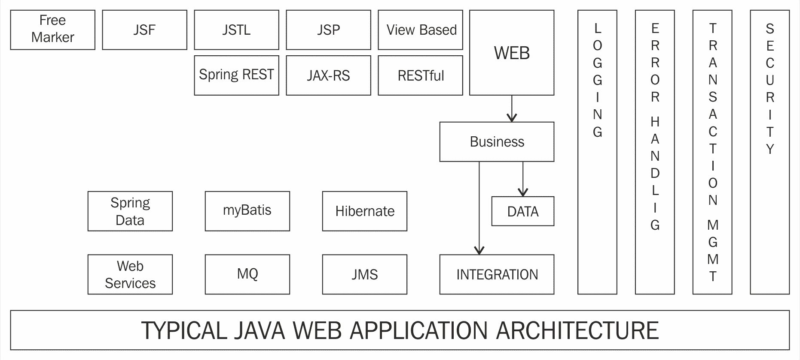
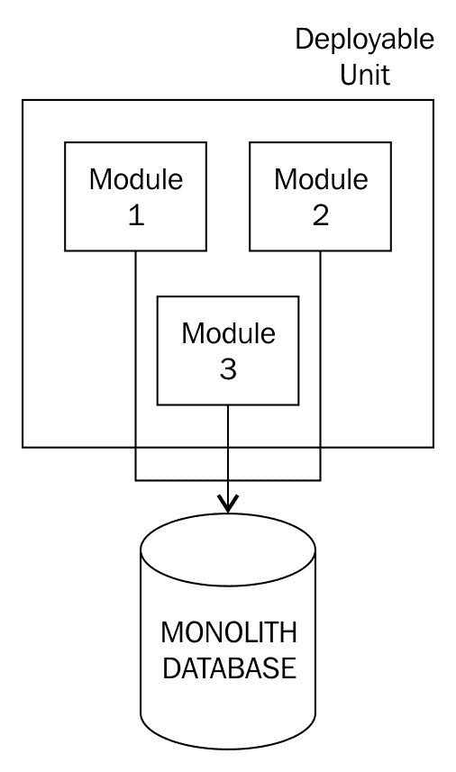
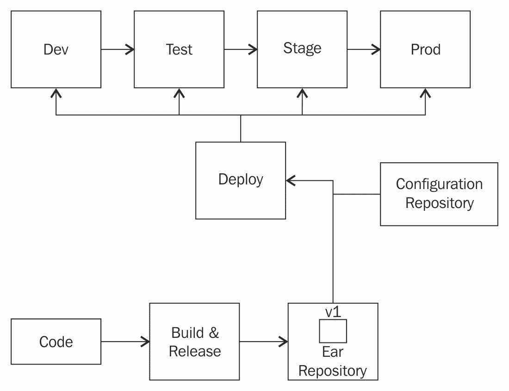
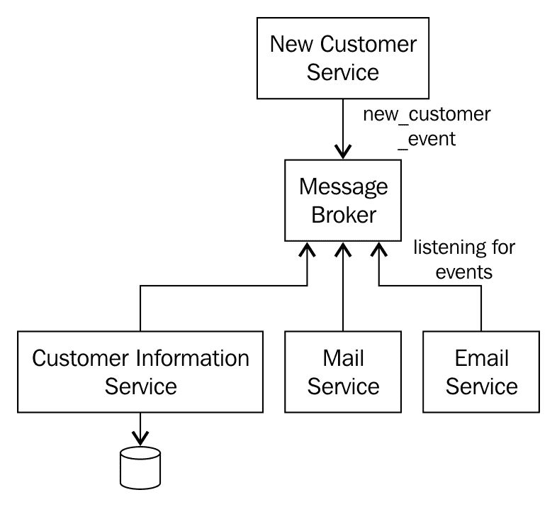
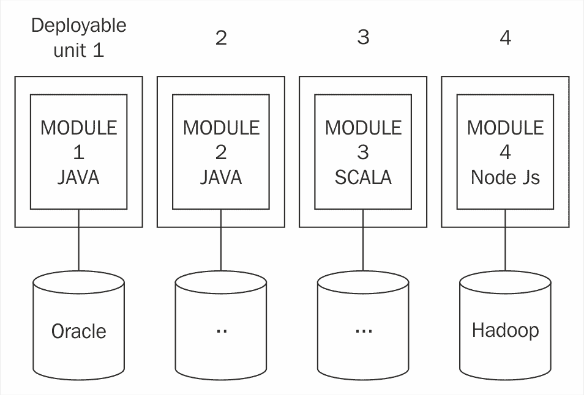
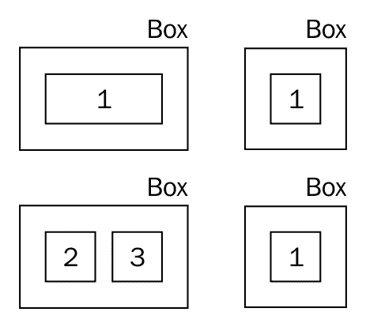
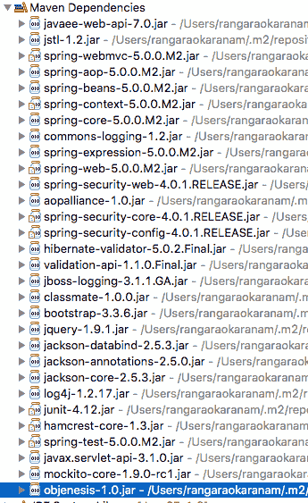
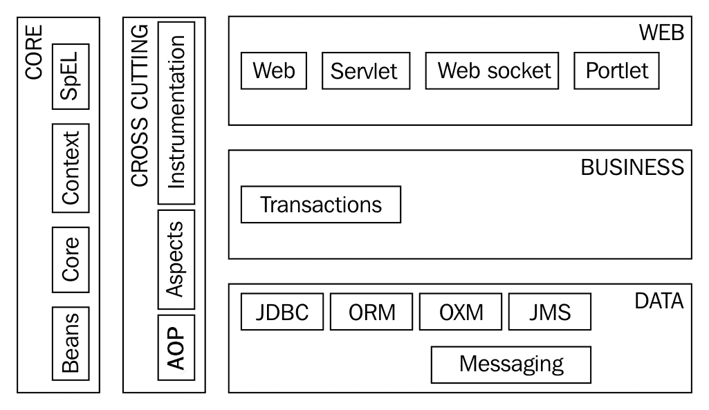

# 四、向微服务和云原生应用的演进

在过去的十年中，Spring 框架已经发展成为开发 Java 企业应用最流行的框架。Spring 框架使得开发松散耦合、可测试的应用变得容易。它简化了交叉关注点的实施。

然而，今天的世界与十年前大不相同。经过一段时间，应用发展成了难以管理的整体。由于这些问题，新的体系结构开始发展。最近的流行语是 RESTful 服务、微服务和云本地应用。

在本章中，我们将首先回顾 Spring 框架在过去十年中解决的问题。我们将研究**单片应用**的问题，并介绍更小、可独立部署的组件。

我们将探讨为什么世界正朝着微服务和云本地应用的方向发展。在本章的结尾，我们将介绍 Spring 框架和 Spring 项目是如何解决当今问题的。

本章将涵盖以下主题：

*   一个典型的基于 Spring 的应用的体系结构
*   Spring 框架在过去十年中解决的问题
*   我们开发应用的目标是什么？
*   单片应用面临哪些挑战？
*   什么是微服务？
*   微服务的优势是什么？
*   微服务面临哪些挑战？
*   有哪些好的实践有助于将微服务部署到云？
*   帮助我们开发微服务和云原生应用的 Spring 项目有哪些？

# 使用 Spring 的典型 web 应用体系结构

在过去十五年中，Spring 一直是连接 Java 企业应用的首选框架。应用使用分层体系结构，所有横切关注点都使用面向方面的编程进行管理。下图显示了使用 Spring 开发的 web 应用的典型体系结构：



此处列出了此类应用中的典型层。我们将把交叉关注点列为一个单独的层，但实际上，它们适用于所有层：

*   **Web 层**：它通常负责控制 Web 应用流（控制器和/或前端控制器）并呈现视图。
*   **业务层**：这是编写所有业务逻辑的地方。大多数应用都从业务层开始进行事务管理。
*   **数据层**：还负责与数据库对话。它负责将 Java 对象中的数据持久化/检索到数据库中的表中。
*   **集成层**：应用通过队列或调用 web 服务与其他应用对话。集成层与其他应用建立此类连接。
*   **横切关注点**：这些是跨不同层的关注点——日志记录、安全性、事务管理等。由于 Spring IoC 容器管理 bean，因此它可以通过**面向方面编程**（**AOP**将这些关注点围绕 bean 进行编织。

让我们更详细地讨论每一层和使用的框架。

# Web 层

Web 层取决于您希望如何向最终用户公开业务逻辑。它是一个 web 应用吗？还是公开 RESTful web 服务？

# Web 应用-呈现 HTML 视图

这些 web 应用使用 web MVC 框架，如 Spring MVC 或 Struts。可以使用 JSP、JSF 或基于模板的框架（如 Freemarker）呈现视图。

# 宁静服务

有两种典型的方法用于开发 RESTful web 服务：

*   **JAX-RS**：REST 服务的 JavaAPI。这是 JavaEE 规范中的一个标准。Jersey 是参考实现。
*   **Spring MVC 或 Spring REST**：也可以使用 Spring MVC 开发 Restful 服务。

SpringMVC 没有实现 JAX-RS，因此，选择很棘手。JAX-RS 是一种 JavaEE 标准。但是 SpringMVC 更具创新性，更有可能帮助您更快地构建新功能。

# 业务层

业务层通常包含应用中的所有业务逻辑。该层使用 Spring 框架将 bean 连接在一起。

这也是事务管理边界的起点。事务管理可以使用 SpringAOP 或 AspectJ 实现。十年前，**企业 Java bean**（**EJB**是实现业务层最流行的方法。凭借其轻量级的特性，Spring 现在是业务层的首选框架。

EJB3 比 EJB2 简单得多。然而，EJB3 发现很难恢复因 Spring 而失去的土地。

# 数据层

大多数应用都与数据库通信。数据层负责将 Java 对象中的数据存储到数据库中，反之亦然。以下是构建数据层最常用的方法：

*   **JPA**：**Java 持久化 API**帮助您将 Java 对象（POJO）映射到数据库表。Hibernate 是 JPA 最流行的实现。JPA 通常是所有事务应用的首选。JPA 不是批处理和报告应用的最佳选择。
*   **MyBatis**：MyBatis（以前称为 iBatis）是一个简单的数据映射框架。作为其网站（[http://www.mybatis.org/mybatis-3/](http://www.mybatis.org/mybatis-3/) 表示，*MyBatis 是一个一流的持久性框架，支持定制 SQL、存储过程和高级映射。MyBatis 消除了几乎所有的 JDBC 代码以及手动设置参数和检索结果*。MyBatis 可以考虑用于批处理和报告应用，在这些应用中，SQL 和存储过程更常用。
*   **SpringJDBC**：JDBC 和 SpringJDBC 已经不再那么常用了。

我们将在[第 8 章](08.html)、*Spring数据*中详细讨论 JDBC、Spring JDBC、MyBatis 和 JPA 的优缺点。

# 集成层

集成层通常是我们与其他应用对话的地方。可能还有其他应用通过 HTTP（web）或 MQ 公开 SOAP 或 RESTful 服务：

*   SpringJMS 通常用于在队列或服务总线上发送或接收消息。
*   Spring MVC RestTemplate 可用于调用 RESTful 服务。
*   SpringWS 可用于调用基于 SOAP 的 web 服务。

*   Spring 集成为构建企业集成解决方案提供了更高级别的抽象。它通过清晰地分离应用和集成代码之间的关注点来实现可测试性。它支持所有流行的企业集成模式。我们将在[第 10 章](10.html)、*SpringCloud数据流*中进一步讨论 Spring 集成。

# 交叉关注点

横切关注点是应用的多个层（日志记录、安全性和事务管理等）的常见关注点。让我们快速讨论其中一些：

*   **日志记录**：可以使用面向方面编程（Spring AOP 或 AspectJ）实现多层审计日志记录。
*   **安全性**：安全性通常使用 Spring 安全框架实现。如前一章所述，Spring Security 使安全性的实现非常简单。
*   **事务管理**：Spring 框架为事务管理提供了一致的抽象。更重要的是，Spring 框架为声明性事务管理提供了强大的支持。以下是 Spring 框架支持的一些事务 API：
    *   **Java 事务 API**（**JTA**是事务管理的标准。它是 JavaEE 规范的一部分。
    *   JDBC。
    *   JPA（包括 Hibernate）。
*   **错误处理**：Spring 提供的大多数抽象都使用未检查的异常，因此，除非业务逻辑需要，否则在向客户机（用户或其他应用）公开的层中实现错误处理就足够了。SpringMVC 提供控制器建议，以在整个应用中实现一致的错误处理。

Spring 框架在应用体系结构中起着重要作用。SpringIOC 用于将不同层的 bean 连接在一起。SpringAOP 用于在 bean 周围编织横切关注点。除此之外，Spring 还提供了与不同层框架的良好集成。

在下一节中，我们将快速回顾 Spring 在过去十年左右解决的一些重要问题。

# Spring 解决的问题

Spring 是连接企业 Java 应用的首选框架。由于 EJB2 的复杂性，它解决了企业 Java 应用所面临的许多问题。以下列出了其中几项：

*   松耦合与可测试性
*   管道规范
*   轻量级体系结构
*   架构灵活性
*   交叉关注点的简化实施
*   免费提供最佳设计图案

# 松耦合与可测试性

通过依赖注入，Spring 带来了类之间的松散耦合。虽然从长远来看，松耦合有利于应用的可维护性，但它带来的第一个好处是可测试性。

在 Spring 之前，可测试性并不是 JavaEE（或当时称之为 J2EE）的强项。测试 EJB2 应用的唯一方法是在容器中运行它们。单元测试非常困难。

这正是 Spring 框架要解决的问题。正如我们在前面的章节中所看到的，如果使用 Spring 连接对象，编写单元测试就变得更容易了。我们可以轻松地存根或模拟依赖项，并将它们连接到对象中。

# 管道规范

20 世纪 90 年代末和 21 世纪初中期的开发人员将熟悉通过 JDBC 执行简单查询并将结果填充到 Java 对象中所需编写的管道代码量。您必须执行**Java 命名和目录****接口**（**JNDI**）查找，获取连接，并填充结果。这导致代码重复。通常，每个方法中的异常处理代码都会重复出现问题。这个问题并不局限于 JDBC。

Spring 框架解决的这些问题之一是消除了所有管道代码。使用 SpringJDBC、SpringJMS 和其他抽象，开发人员可以专注于编写业务逻辑。Spring 框架负责处理细节。

# 轻量级体系结构

使用 EJB 使应用变得复杂，并非所有应用都需要这种复杂度。Spring 提供了一种简化、轻量级的应用开发方法。如果需要分发，可以稍后添加。

# 架构灵活性

Spring 框架用于跨不同层中的应用连接对象。尽管 Spring 框架的出现越来越近，但它并没有限制应用架构师和开发人员对框架的灵活性或选择。下面列出了几个示例：

*   Spring 框架在 web 层提供了极大的灵活性。如果您想使用 Struts 或 Struts 2 而不是 SpringMVC，那么它是可配置的。您可以选择与更广泛的视图和模板框架集成。
*   另一个很好的例子是数据层，您可以在其中连接 JPA、JDBC 和映射框架，如 MyBatis。

# 交叉关注点的简化实施

当 SpringFramework 用于管理 bean 时，SpringIOC 容器管理 bean 的生命周期——创建、使用、自动连接和销毁。它使围绕 bean 编织额外的功能变得更容易，比如横切关注点。

# 免费设计模式

默认情况下，Spring 框架鼓励使用许多设计模式。以下是一些例子：

*   **控制器**的依赖注入或反转：这是 Spring 框架构建的基本设计模式。它支持松散耦合和可测试性。
*   **单例**：所有 SpringBean 默认为单例。
*   **工厂模式**：使用 bean 工厂实例化 bean 是工厂模式的一个很好的例子。
*   **前端控制器**：Spring MVC 使用 DispatcherServlet 作为前端控制器。因此，在使用 SpringMVC 开发应用时，我们使用前端控制器模式。
*   **模板方法**：帮助我们避免样板代码。许多基于 Spring 的类——JdbcTemplate 和 JmsTemplate——都是这种模式的实现。

# 应用开发目标

在我们继续学习 REST 服务、微服务和云原生应用的概念之前，让我们花一些时间了解一下开发应用时的共同目标。理解这些目标将有助于我们理解为什么应用正朝着微服务体系结构发展。

首先，我们应该记住，软件行业仍然是一个相对年轻的行业。在我十五年的软件开发、设计和架构经验中，有一件事是不变的，那就是事情会发生变化。今天的要求不是明天的要求。今天的技术不是我们明天要使用的技术。虽然我们可以尝试预测未来会发生什么，但我们往往是错的。

在软件开发的最初几十年中，我们所做的事情之一就是为未来构建软件系统。为了满足未来的需求，设计和架构变得复杂。

在过去的十年中，随着**敏捷**和**极限编程**，重点转向**精益**和构建足够好的系统，坚持设计的基本原则。重点转向了进化设计。思维过程是这样的：**如果一个系统对今天的需求有很好的设计，并且不断发展，并且有很好的测试，那么它可以很容易地进行重构以满足明天的需求**。

虽然我们不知道我们将走向何方，但我们知道在开发应用时，我们的大部分目标都没有改变。

对于大量应用，软件开发的关键目标可以用语句 s*SPEED 和 scale*来描述。

我们将在下一节中讨论每个元素。

# 速度

交付新需求和创新的速度正日益成为一个关键的差异化因素。仅仅快速开发（代码和测试）是不够的。快速交付（投入生产）很重要。现在大家都知道，世界上最好的软件组织每天多次向生产部门交付软件。

技术和商业前景在不断变化，并在不断演变。关键问题是“应用适应这些变化的速度有多快？”。这里重点介绍了技术和业务领域的一些重要变化：

*   新的编程语言
    *   去
    *   斯卡拉
    *   关闭
*   新的编程范例
    *   函数式编程
    *   反应式编程
*   新框架
*   新工具
    *   发展
    *   代码质量
    *   自动化测试
    *   部署
    *   集装箱化
*   新的程序和做法
    *   敏捷的
    *   测试驱动开发
    *   行为驱动开发
    *   连续积分
    *   连续交付
    *   德沃斯
*   新设备和机遇
    *   可移动的
    *   云

# 安全

没有安全的速度有什么用？谁会想坐一辆时速 300 英里但没有内置安全功能的汽车呢？

让我们考虑一下安全应用的几个特点：

# 可靠性

可靠性是衡量系统功能准确程度的指标。

要问的关键问题如下：

*   系统是否满足其功能要求？
*   在不同的发布阶段泄漏了多少缺陷？

# 可利用性

大多数面向外部客户端的应用预计将全天候可用。可用性是指应用可供最终用户使用的时间百分比。

# 安全

应用和数据的安全性对于组织的成功至关重要。应该有明确的认证程序（你是谁？）、授权程序（用户有什么访问权限？）和数据保护程序（接收或发送的数据是否准确？数据是否安全且未被非预期用户拦截？）。

我们将在[第 6 章](06.html)、*扩展微服务*中详细讨论如何使用 Spring security 实现安全性。

# 表演

如果 web 应用在几秒钟内没有响应，应用的用户很可能会失望。性能通常是指系统为一定数量的用户提供约定响应时间的能力。

# 高弹性

随着应用变得分布式，失败的概率也会增加。当发生局部故障或中断时，应用如何反应？它能在不完全崩溃的情况下提供基本操作吗？

应用在发生意外故障时提供最低服务级别的这种行为称为恢复能力。

随着越来越多的应用转向云，应用的弹性变得非常重要。

我们将在[第 9 章](09.html)、*弹簧云*和[第 10 章](10.html)、*弹簧云数据流*中讨论使用*弹簧云和SpringData流*构建高弹性微服务。

# 可伸缩性

可伸缩性是衡量应用在其可支配的资源按比例增加时的反应。如果一个应用使用给定的基础设施支持 10000 个用户，那么它是否可以使用双倍的基础设施支持至少 20000 个用户？

如果 web 应用在几秒钟内没有响应，应用的用户很可能会失望。性能通常是指系统为一定数量的用户提供约定响应时间的能力。

在云世界中，应用的可伸缩性变得更加重要。很难猜测一家初创公司会有多成功。Twitter 或 Facebook 在孵化时可能没有预料到这样的成功。他们的成功在很大程度上取决于他们如何在不影响性能的情况下适应用户群成倍增长的情况。

我们将在[第 9 章](09.html)、*Spring云*和[第 10 章](10.html)、*Spring云数据流*中讨论使用Spring云和Spring数据流构建高度可扩展的微服务。

# 单片应用的挑战

在过去的几年里，在处理几个小型应用的同时，我有机会在不同的领域处理四个不同的单片应用——保险、银行和医疗。所有这些应用都面临着非常相似的挑战。在这一节中，我们将从巨石的特性开始，然后再看看它们带来的挑战。

首先：什么是巨石？一个有大量代码的应用——可能超过 10 万行代码？是 啊

对我来说，巨石是那些将发行版投入生产是一个巨大挑战的应用。属于这一类的应用有许多立即需要的用户需求，但这些应用能够每隔几个月发布一次新功能。有些应用甚至每季度发布一次功能，有时甚至一年发布两次。

通常，所有单片应用都具有以下特征：

*   **大尺寸**：大多数这些单片应用的代码行数超过 100K。有些代码库的代码行数超过一百万行。
*   **大型团队**：团队规模从 20 人到 300 人不等。
*   **同一件事有多种方式**：由于团队规模庞大，存在沟通缺口。这将导致在应用的不同部分为同一问题提供多个解决方案。
*   **缺乏自动化测试**：这些应用中的大多数都很少进行单元测试，完全缺乏集成测试。这些应用非常依赖于手动测试。

由于这些特点，这些单片应用面临许多挑战。

# 长释放周期

在整块体的一个部分进行代码更改可能会影响整块体的其他部分。大多数代码更改都需要一个完整的回归周期。这会导致较长的释放周期。

由于缺乏自动化测试，这些应用依赖于手动测试来发现缺陷。让功能上线是一项重大挑战。

# 难以衡量

通常，大多数单片应用不是云原生的，这意味着它们不容易在云上部署。它们取决于手动安装和手动配置。在将新的应用实例添加到集群之前，操作团队通常会投入大量的工作。这使得上下扩展成为一个巨大的挑战。

另一个重要挑战是大型数据库。通常，单片应用的数据库运行容量为**TB**（**TB**）。数据库在扩展时成为瓶颈。

# 适应新技术

大多数单片应用使用旧技术。将新技术添加到整体上只会使维护更加复杂。架构师和开发人员不愿意引入任何新技术。

# 采用新方法

像**敏捷**这样的新方法需要小型（四七名团队成员）独立团队。《巨石》的大问题是：我们如何防止团队之间互相践踏？我们如何创建使团队能够独立工作的孤岛？这是一个难以解决的挑战。

# 适应现代发展做法

现代开发实践，如**测试驱动开发**（**TDD**）、**行为驱动开发**（**BDD**）需要松耦合、可测试的体系结构。如果单片应用具有紧密耦合的层和框架，则很难进行单元测试。这使得适应现代发展实践具有挑战性。

# 理解微服务

单片应用面临的挑战导致组织寻找银弹。我们将如何使更多的功能更频繁地使用？

许多组织尝试了不同的体系结构和实践来找到解决方案。

在过去几年中，所有成功做到这一点的组织都出现了一种共同的模式。由此产生了一种称为**微服务架构**的架构风格。

正如 Sam Newman 在《构建微服务》一书中所说：许多组织发现，通过采用细粒度的微服务架构，他们可以更快地交付软件并采用更新的技术。

# 什么是微服务？

我喜欢软件的一个原则是*保持它的小型化*。无论您在谈论什么，这个原则都是适用的——变量的范围、方法、类、包或组件的大小。你会希望所有这些都尽可能小。

微服务是这一原则的简单扩展。它是一种体系结构风格，专注于构建基于小型功能的独立部署服务。

微服务没有一个被接受的定义。我们将了解一些流行的定义：

“微服务是一种小型、自主的服务，可以协同工作”

-Sam Newman，Thoughtworks

“具有有限上下文的松散耦合面向服务架构”

-Adrian Cockroft，Battery Ventures

“微服务是一个范围有限的可独立部署组件，通过基于消息的通信支持互操作性。微服务架构（Microservice architecture）是一种由能力一致的微服务组成的高度自动化、可进化的软件系统的工程风格，‎罗尼·米特拉，‎马特·麦克拉蒂

虽然没有公认的定义，但在所有的微服务定义中都有一些共同的特征。在我们了解微服务的特征之前，我们将尝试了解全局——我们将了解没有微服务的体系结构与使用微服务的体系结构的比较。

# 微服务体系结构

单片应用——即使是模块化的应用——也只有一个可部署单元。下图显示了具有三个模块（模块 1、2 和 3）的单片应用示例。这些模块可以是作为单片应用一部分的业务功能。在购物应用中，其中一个模块可能是产品推荐。



下图显示了使用微服务体系结构开发前一个整体时的外观：


需要注意的几个重要事项如下：

*   根据业务能力确定模块。该模块提供什么功能？
*   每个模块都可以独立部署。在以下示例中，模块 1、2 和 3 是单独的可展开单元。如果模块 3 的业务功能发生变化，我们可以单独构建和部署模块 3。

# 微服务特性

在上一节中，我们看了一个微服务架构的示例。对成功适应微服务体系结构风格的组织经验的评估表明，团队和体系结构有一些共同的特点。让我们看看其中的一些：


# 小型轻量级微服务

良好的微服务提供了业务能力。理想情况下，微服务应遵循**单一责任原则**。因此，微服务通常规模较小。通常，我使用的经验法则是，应该可以在 5 分钟内构建和部署一个微服务。如果构建和部署需要更长的时间，那么很可能您正在构建一个比推荐的更大的微服务。

小型和轻型微服务的一些示例如下：

*   产品推荐服务
*   电子邮件通知服务
*   购物车服务

# 与基于消息的通信的互操作性

微服务的重点是互操作性——使用不同技术的系统之间的通信。实现互操作性的最佳方法是使用基于消息的通信。

# 能力一致的微服务

微服务必须有一个清晰的边界。通常，每一个微服务都有一个单独的业务功能，可以很好地提供。团队已经成功地适应了 Eric J Evans 在*领域驱动设计*一书中提出的*有界上下文*概念。

本质上，对于大型系统，创建一个域模型是非常困难的。Evans 谈到将系统拆分为不同的有界上下文。识别正确的有界上下文是微服务体系结构成功的关键。

# 独立部署部队

每个微服务都可以单独构建和部署。在前面讨论的示例中，模块 1、2 和 3 都可以独立构建和部署。

# 无国籍

理想的微服务没有状态。它不会在请求之间存储任何信息。创建响应所需的所有信息都存在于请求中。

# 自动构建和发布过程

微服务具有自动化的构建和发布过程。请看下图。它显示了微服务的简单构建和发布过程：



构建和发布微服务时，微服务的版本存储在存储库中。部署工具能够从存储库中选择正确版本的微服务，将其与特定环境（从配置存储库）所需的配置相匹配，并将微服务部署到特定环境。

一些团队更进一步，将微服务包与运行微服务所需的底层基础设施结合起来。部署工具将复制此映像，并将其与特定于环境的配置相匹配，以创建环境。

# 事件驱动体系结构

微服务通常采用事件驱动架构构建。让我们考虑一个简单的例子。无论何时注册新客户，都需要执行三项操作：

*   将客户信息存储到数据库中
*   邮寄一个欢迎包
*   发送电子邮件通知

让我们来看两种不同的设计方法。

# 方法 1-顺序方法

让我们考虑三个服务--OutT0}、AuthT1、和 Type T2^，它可以提供前面列出的功能。我们可以通过以下步骤创建`NewCustomerService`：

1.  呼叫`CustomerInformationService`将客户信息保存到数据库中。
2.  打电话`MailService`邮寄欢迎包。
3.  致电`EmailService`发送电子邮件通知。

`NewCustomerService`成为所有业务逻辑的中心位置。想象一下，如果我们在创建新客户时必须做更多的事情。所有这些逻辑都会开始积累和膨胀`NewCustomerService`。

# 方法 2-事件驱动方法

在这种方法中，我们使用消息代理。`NewCustomerService`将创建一个新事件并将其发布到 message broker。下图显示了高级表示：



三个服务--`CustomerInformationService`、`MailServic`e 和`EmailService`将在 MessageBroker 上监听新事件。当他们看到新客户事件时，他们会对其进行处理并执行特定服务的功能。

事件驱动方法的关键优势在于，所有业务逻辑都没有集中的磁铁。添加新功能更容易。我们可以创建一个新服务来侦听 MessageBroker 上的事件。另一个需要注意的重要事项是，我们不需要对任何现有服务进行更改。

# 独立团队

开发微服务的团队通常是独立的。它包含开发、测试和部署微服务所需的所有技能。它还负责支持生产中的微服务。

# 微服务优势

微服务有几个优点。它们有助于跟上技术的发展，并更快地为客户提供解决方案。

# 更快的上市时间

更快的上市时间是决定组织成功的关键因素之一。

微服务体系结构涉及创建小型、可独立部署的组件。微服务增强更容易，也不那么脆弱，因为每个微服务都专注于单个业务功能。该过程中的所有步骤——构建、发布、部署、测试、配置管理和监控——都是自动化的。由于微服务的责任是有限的，所以编写大型自动化单元和集成测试是可能的。

所有这些因素导致应用能够更快地响应客户需求。

# 技术演进

每天都有新的语言、框架、实践和自动化的可能性出现。重要的是，应用体系结构允许灵活地适应新出现的可能性。下图显示了如何使用不同的技术开发不同的服务：



微服务体系结构涉及创建小型服务。在某些范围内，大多数组织都会向单个团队提供一些技术决策。这使团队能够试验新技术并更快地创新。这有助于应用适应并与技术的发展保持一致。

# 可用性和可扩展性

应用不同部分上的负载通常非常不同。例如，在航班预订应用中，客户通常会在决定是否预订航班之前进行多次搜索。搜索模块上的负载通常比预订模块上的负载大很多倍。microservices 体系结构提供了设置多个搜索服务实例的灵活性，而预订服务实例很少。

下图显示了我们如何根据负载扩展特定的微服务：



微服务**2**和**3**共享一个盒子（部署环境）。微服务**1**负载更大，部署到多个盒子中。

另一个例子是创业的需要。当一家初创企业开始运营时，他们通常不知道自己可能增长到什么程度。如果应用的需求增长非常快，会发生什么情况？如果他们采用微服务体系结构，就可以在需要时更好地扩展。

# 团队动力

敏捷等开发方法提倡小型、独立的团队。由于微服务很小，因此可以围绕它们建立小型团队。团队是跨职能的，拥有特定微服务的端到端所有权。

微服务架构非常适合敏捷和其他现代开发方法。

# 微服务挑战

微服务体系结构具有显著的优势。然而，也存在重大挑战。决定微服务的边界是一个具有挑战性但重要的决定。由于微服务很小，并且在一个大型企业中会有数百个微服务，因此具有高度的自动化和可视性是至关重要的。

# 自动化需求增加

使用微服务体系结构，您将一个大型应用拆分为多个微服务，因此构建、发布和部署的数量将增加数倍。对于这些步骤，使用手动流程是非常低效的。

测试自动化对于加快上市时间至关重要。团队应专注于识别出现的自动化可能性。

# 定义子系统的边界

微服务应该是智能的。它们不是弱积垢服务。他们应该对系统的业务能力进行建模。它们拥有有限上下文中的所有业务逻辑。话虽如此，微服务不应该太大。确定微服务的边界是一项挑战。一开始就很难找到正确的边界。重要的是，当团队获得更多关于业务上下文的知识时，知识会流入架构，并确定新的边界。通常，为微服务找到正确的边界是一个进化过程。

需要注意的几个要点如下：

*   松散耦合和高内聚性是任何编程和体系结构决策的基础。当系统松散耦合时，一个部分中的更改不应要求其他部分中的更改。
*   有界上下文表示表示特定业务功能的自治业务模块。

正如 Sam Newman 在《构建微服务》*一书中所说的——“明确边界强制的特定责任”。始终想一想，“我们为域的其余部分提供了哪些功能？”。*

# 能见度和监测

使用微服务，一个应用被拆分为多个微服务。要克服与多个微服务和异步基于事件的协作相关的复杂性，重要的是要具有良好的可视性。

确保高可用性意味着应监控每个微服务。微服务的自动化健康管理变得非常重要。

调试问题需要深入了解多个微服务背后的情况。通常使用集中式日志记录，并聚合来自不同微服务的日志和度量。需要使用相关 ID 等机制来隔离和调试问题。

# 容错性

假设我们正在构建一个购物应用。如果推荐微服务关闭，会发生什么情况？应用如何反应？它完全崩溃了吗？还是让顾客购物？当我们适应微服务体系结构时，这种情况会更频繁地发生。

当我们使服务变小时，服务中断的可能性增加。应用如何应对这些情况成为一个重要的问题。在前面的示例中，容错应用将在允许客户购物的同时显示一些默认建议。

随着我们进入微服务体系结构，应用应该更具容错性。当服务关闭时，应用应该能够提供柔和的行为。

# 最终一致性

组织中的微服务之间保持一定程度的一致性是很重要的。微服务之间的一致性支持整个组织中类似的开发、测试、发布、部署和操作过程。这使得不同的开发人员和测试人员在跨团队移动时能够提高工作效率。重要的是不要太死板，在一定范围内保持一定程度的灵活性，以免扼杀创新。

# 共享功能（企业级）

让我们看看一些必须在企业级标准化的功能。

*   **硬件**：我们使用什么硬件？我们使用云吗？
*   **代码管理**：我们使用什么版本控制系统？我们在分支和提交代码方面的做法是什么？
*   **构建和部署**：我们如何构建？我们使用什么工具来自动化部署？
*   **数据存储**：我们使用什么样的数据存储？
*   **服务编排**：我们如何编排服务？我们使用哪种消息代理？
*   **安全与身份**：我们如何对用户和服务进行身份验证和授权？
*   **系统可视性和监控**：我们如何监控我们的服务？我们如何在整个系统中提供故障隔离？

# 对运营团队的需求增加

随着我们进入微服务世界，运营团队的职责发生了明显的变化。与执行发布和部署等手动操作相比，职责转移到识别自动化机会。

随着多个微服务以及系统不同部分之间通信的增加，运营团队变得至关重要。重要的是，从最初阶段开始，将运营作为团队的一部分，使他们能够确定解决方案，使运营更容易。

# 云本地应用

云正在扰乱世界。出现了许多以前从未有过的可能性。组织能够根据需要提供计算、网络和存储设备。这在许多行业具有降低成本的巨大潜力。

考虑一下零售业，口袋里有很高的需求（黑色星期五，假日季节等等）。既然他们可以按需提供硬件，为什么还要全年支付硬件费用？

虽然我们希望从云的可能性中获益，但这些可能性受到架构和应用性质的限制。

我们如何构建可以轻松部署到云上的应用？这就是云本地应用的用武之地。

云本地应用是那些可以轻松部署在云上的应用。这些应用有一些共同的特点。我们将首先介绍十二要素应用——云本地应用中常见模式的组合。

# 12 因素应用

12 因素应用是从 Heroku 工程师的经验演变而来的。这是一个在云本地应用架构中使用的模式列表。

需要注意的是，此处的应用指的是单个可部署单元。本质上，每个微服务都是一个应用（因为每个微服务都是可独立部署的）。

# 维护一个代码库

每个应用在版本控制中都有一个代码库。可以在多个环境中部署应用。但是，所有这些环境都使用来自单个代码库的代码。反模式的一个示例是从多个代码库构建可部署的。

# 依赖关系

所有依赖项都必须显式声明和隔离。典型的 Java 应用使用构建管理工具（如 Maven 和 Gradle）来隔离和跟踪依赖关系。

下图显示了使用 Maven 管理依赖关系的典型 Java 应用：



下图显示了`pom.xml`，其中对 Java 应用的依赖项进行了管理：


# 配置

所有应用的配置因环境而异。在多个位置找到配置；应用代码、属性文件、数据库、环境变量、JNDI 和系统变量是一些示例。

12 因素应用

应用应在环境中存储配置。虽然建议使用环境变量来管理 12 因素应用中的配置，但对于更复杂的系统，应考虑使用其他替代方案，例如使用集中的应用配置存储库。

无论使用何种机制，我们建议您执行以下操作：

管理应用代码之外的配置（独立于应用的可部署单元）
使用标准化的配置方式

# 支持服务

应用依赖于其他可用的服务——数据存储和外部服务等。12 因素应用将支持服务视为附加资源。支持服务通常通过外部配置声明。

与支持服务的松耦合有许多优点，包括能够优雅地处理支持服务的中断。

# 构建、发布、运行

构建、发布和运行阶段描述如下。我们应在这三个阶段之间保持明确的分离：

*   **构建**：从代码以及可以部署到多个环境的依赖项创建可执行捆绑包（EAR、WAR 或 JAR）
*   **版本**：将可执行捆绑包与特定的环境配置结合起来部署到环境中
*   **运行**：使用特定版本在执行环境中运行应用

构建和发布阶段在以下屏幕截图中突出显示：


反模式是针对每个环境构建单独的可执行捆绑包。

# 无国籍

12 因素应用没有状态。它所需要的所有数据都存储在持久存储中。

反模式是一个粘性会话。

# 端口绑定

12 因素应用使用端口绑定公开所有服务。虽然可以使用其他机制公开服务，但这些机制依赖于实现。端口绑定提供了接收和处理消息的完全控制，无论应用部署在何处。

# 并发性

12 因素应用能够通过横向扩展实现更高的并发性。垂直缩放有其局限性。横向扩展提供了无限扩展的机会。

# 可处置性

12 因素应用应促进弹性缩放。因此，它们应该是一次性的。它们可以在需要时启动和停止。

12 因素应用应执行以下操作：

*   有最短的启动时间。长启动时间意味着在应用接受请求之前有很长的延迟。
*   优雅地关机。
*   优雅地处理硬件故障。

# 环境均等

所有的环境——开发、测试、登台和生产——都应该是相似的。他们应该使用相同的过程和工具。对于连续部署，他们应该经常有类似的代码。这使得查找和修复问题更容易。

# 日志作为事件流

可见性对于十二要素应用至关重要。由于应用部署在云端，并且可以自动扩展，因此您必须集中查看应用的不同实例中发生的情况。

将所有日志视为流可以将日志流路由到不同的目的地，以便于查看和存档。此流可用于调试问题、执行分析以及基于错误模式创建警报系统。

# 管理过程没有区别

12 因素应用处理管理任务（迁移、脚本）与正常应用流程类似。

# Spring项目

随着世界向云原生应用和微服务发展，Spring 项目也在紧随其后。有许多新的 Spring 项目——Spring Boot、Spring Cloud 等，它们解决了新兴世界的问题。

# 弹簧靴

在独石时代，我们有幸花时间为应用设置框架。然而，在微服务时代，我们希望更快地创建单个组件。SpringBoot 项目旨在解决这个问题。

正如官方网站所强调的，Spring Boot 可以轻松创建独立的、生产级的基于 Spring 的应用，您可以*只运行*。我们对 Spring 平台和第三方库持有一种固执己见的观点，这样您就可以用最少的麻烦开始了。

SpringBoot 的目标是采取一种固执己见的观点——基本上为我们做很多决策——来开发基于 Spring 的项目。

在接下来的几章中，我们将介绍 Spring Boot 以及使我们能够更快地创建生产就绪应用的不同功能。

# SpringCloud

Spring Cloud 旨在为在云上构建系统时常见的一些模式提供解决方案：

*   **配置管理**：正如我们在“十二要素应用”一节中所讨论的，管理配置是开发云本地应用的一个重要部分。SpringCloud 为微服务提供了一个集中式配置管理解决方案，称为 SpringCloudConfig。
*   **服务发现**：服务发现促进了服务之间的松耦合。SpringCloud 提供了与流行的服务发现选项（如 Eureka、ZooKeeper 和 Consor）的集成。
*   **断路器**：云本地应用必须是容错的。他们应该能够优雅地处理支持服务的故障。断路器在故障情况下提供默认最低服务方面起着关键作用。Spring Cloud 提供了与 Netflix Hystrix 容错库的集成。
*   **API 网关**：API 网关提供集中的聚合、路由和缓存服务。SpringCloud 提供了与 API 网关库 Netflix Zuul 的集成。

# 总结

在本章中，我们了解了世界是如何向微服务和云本地应用发展的。我们了解了 Spring 框架和项目是如何通过 Spring Boot、Spring Cloud 和 Spring Data 等项目来满足当今世界的需求的。

在下一章中，我们将开始关注 Spring Boot。我们将了解 SpringBoot 如何使开发微服务变得简单。

SpringFramework1.0 的第一个版本于 2004 年 3 月发布。在 15 年多的时间里，Spring 框架一直是构建 Java 应用的首选框架。

在相对年轻和动态的 Java 框架世界中，十年是很长的时间。

在本章中，我们首先了解 Spring 框架的核心特性。我们将了解为什么 Spring 框架变得流行，以及它是如何适应成为首选框架的。在快速查看 Spring 框架中的重要模块之后，我们将进入 Spring 项目的世界。在本章的结尾，我们将介绍 SpringFramework5.0 中的新特性。

本章将回答以下问题：

*   为什么 Spring 框架很流行？
*   Spring 框架如何适应应用架构的发展？
*   Spring 框架中的重要模块是什么？
*   Spring 框架在 Spring 项目的保护伞中的位置是什么？
*   SpringFramework5.0 中有哪些新特性？

# 弹簧框架

Spring网站（[https://projects.spring.io/spring-framework/](https://projects.spring.io/spring-framework/) 对 Spring 框架的定义如下：*Spring 框架为基于 Java 的现代企业应用*提供了全面的编程和配置模型。

Spring 框架用于连接企业 Java 应用。Spring 框架的主要目的是处理连接应用不同部分所需的所有技术管道。这使得程序员能够专注于他们工作的关键——编写业务逻辑。

# EJB 的问题

Spring 框架于 2004 年 3 月发布。当 Spring 框架的第一个版本发布时，开发企业应用的流行方式是使用**企业 Java Beans**（**EJB**）2.1。

开发和部署 EJB 是一个繁琐的过程。虽然 EJB 使组件的分发变得更容易，但是开发、单元测试和部署它们并不容易。EJB 的初始版本（1.0、2.0、2.1）有一个复杂的**应用编程接口**（**API**），这导致人们认为（在大多数应用中也是如此）引入的复杂性远远超过了好处：

*   很难进行单元测试。实际上，很难在 EJB 容器之外进行测试。
*   需要使用许多不必要的方法来实现多个接口。
*   繁琐乏味的异常处理。
*   部署描述符不方便。

Spring 框架是作为一个轻量级框架引入的，旨在简化 JavaEE 应用的开发。

# 为什么 Spring 框架很流行？

Spring 框架的第一个版本于 2004 年 3 月发布。在随后的十五年中，Spring 框架的使用和普及只会增加。

Spring 框架流行的重要原因如下：

*   简化的单元测试——因为依赖注入
*   减少管道规范
*   架构灵活性
*   与时俱进

让我们详细讨论其中的每一项。

# 简化单元测试

早期版本的 EJB 很难进行单元测试。事实上，很难在容器之外运行 EJB（从版本 2.1 开始）。测试它们的唯一方法是将它们部署在容器中。

Spring 框架引入了**依赖注入**（**DI**的概念。我们将在[第 2 章](04.html)、*依赖注入*中详细讨论依赖注入。

依赖项注入使用模拟替换依赖项变得容易，从而支持单元测试。我们不需要部署整个应用来对其进行单元测试。

简化单元测试有多个好处：

*   程序员的工作效率更高
*   缺陷发现得更早，因此修复成本更低
*   应用具有自动单元测试，可以在**连续集成**构建中运行，防止将来出现缺陷

# 减少管道规范

在 Spring 框架之前，典型的 J2EE（现在称为 JavaEE）应用包含大量管道代码。例如：获取数据库连接、异常处理代码、事务管理代码、日志记录代码等等。

让我们来看一个使用准备语句执行查询的简单例子：

```java
    PreparedStatement st = null;
    try {
          st = conn.prepareStatement(INSERT_TODO_QUERY);
          st.setString(1, bean.getDescription());
          st.setBoolean(2, bean.isDone());
          st.execute();
        } 
    catch (SQLException e) {
          logger.error("Failed : " + INSERT_TODO_QUERY, e);
     } finally {
                if (st != null) {
           try {
           st.close();
          } catch (SQLException e) {
           // Ignore - nothing to do..
          }
       }
     }
```

在前面的示例中，有四行业务逻辑和十多行管道代码。

使用 Spring Framework，可以在几行中应用相同的逻辑：

```
    jdbcTemplate.update(INSERT_TODO_QUERY, 
    bean.getDescription(), bean.isDone());
```

# Spring 框架是如何做到这一点的？

在前面的示例中，SpringJDBC（通常是 Spring）将大多数已检查的异常转换为未检查的异常。通常，当查询失败时，除了关闭语句并使事务失败之外，我们无能为力。我们可以使用 Spring**面向方面编程**（**AOP**）集中异常处理并将其注入，而不是在每个方法中实现异常处理。

SpringJDBC 不再需要创建获取连接、创建准备好的语句等所涉及的所有管道代码。可以在 Spring 上下文中创建`jdbcTemplate`类，并在需要时注入**数据访问对象**（**DAO**类）。

与前面的示例类似，SpringJMS、SpringAOP 和其他 Spring 模块有助于减少大量管道代码。

Spring 框架让程序员专注于程序员的主要工作——编写业务逻辑。

避免所有管道代码还有另一个很大的好处——减少代码中的重复。由于事务管理、异常处理等的所有代码（通常是所有横切关注点）都在一个地方实现，因此维护起来更容易。

# 架构灵活性

Spring 框架是模块化的。它作为一组独立的模块构建在核心弹簧模块之上。大多数 Spring 模块都是独立的——您可以使用其中一个模块，而不必使用其他模块。

让我们看几个例子：

*   在 web 层，Spring 提供了自己的框架——SpringMVC。然而，Spring 非常支持 Struts、Vaadin、JSF 或您选择的任何 web 框架。
*   Springbeans 可以为您的业务逻辑提供轻量级实现。但是，Spring 也可以与 EJB 集成。
*   在数据层，Spring 使用其 SpringJDBC 模块简化了 JDBC。然而，Spring 非常支持您喜欢的任何数据层框架——JPA、Hibernate（带或不带 JPA）或 iBatis。
*   您可以选择使用 SpringAOP 实现横切关注点（日志记录、事务管理、安全性等）。或者，您可以与成熟的 AOP 实现（如 AspectJ）集成。

Spring 框架不想成为所有行业的佼佼者。Spring 的核心工作是减少应用不同部分之间的耦合并使其可测试，它提供了与您选择的框架的良好集成。这意味着您的体系结构具有灵活性——如果您不想使用特定的框架，您可以轻松地用另一个框架替换它。

# 与时俱进

Spring 框架的第一个版本专注于使应用可测试。然而，随着时间的推移，出现了新的挑战。Spring 框架通过提供的灵活性和模块成功地发展并保持了领先地位。下面列出了几个示例：

*   注释是在 Java5 中引入的。SpringFramework（版本 2.5–2007 年 11 月）在为 SpringMVC 引入基于注释的控制器模型方面领先于 JavaEE。使用 JavaEE 的开发人员必须等到 JavaEE6（2009 年 12 月-2 年）才能拥有类似的功能。
*   Spring 框架在 JavaEE 之前引入了许多抽象，以保持应用与特定实现的解耦。缓存 API 就是一个很好的例子。Spring 在 Spring3.1 中提供了透明缓存支持。JavaEE 在 2014 年为 JCache 提出了*JSR-107*——Spring4.1 提供了对它的支持。

Spring 带来的另一件重要事情是 Spring 项目的保护伞。Spring 框架只是 Spring 项目下众多项目之一。我们将在单独一节中讨论不同的 Spring 项目。以下示例说明了 Spring 如何通过新的 Spring 项目保持领先：

*   **SpringBatch**定义了一种构建 Java 批处理应用的新方法。我们不得不等到 JavaEE7（2013 年 6 月）才能在 JavaEE 中获得类似的批处理应用规范。
*   随着体系结构向云和微服务发展，Spring 提出了新的面向云的 Spring 项目。SpringCloud 有助于简化微服务的开发和部署。SpringCloud数据流围绕微服务应用提供编排。

# 弹簧模块

Spring 框架的模块化是其广泛应用的重要原因之一。Spring 框架是高度模块化的，有 20 多个不同的模块——具有明确定义的边界。

下图显示了不同的 Spring 模块——按它们通常使用的应用层组织：



我们将首先讨论 Spring 核心容器，然后再讨论按应用层分组的其他模块，这些模块通常在其中使用。

# 弹簧芯容器

Spring 核心容器提供 Spring 框架的核心特性——依赖注入、**IoC**（**控制反转**容器）和应用上下文。我们将在[第 2 章](04.html)、*依赖注入*中了解更多关于 DI 和 IoC 容器的信息。

下表列出了重要的核心弹簧模块：

| **模块/工件** | **使用** |
| 弹簧芯 | 其他 Spring 模块使用的实用程序。 |
| 春豆 | 支持 SpringBean。与 SpringCore 的结合提供了 spring 框架的核心特性——依赖项注入。包括 BeanFactory 的实现。 |
| spring 上下文 | 实现 ApplicationContext，它扩展 BeanFactory 并提供加载资源和国际化等支持。 |
| 弹簧式 | 扩展了**EL**（JSP 中的**表达式语言**，并为 bean 属性（包括数组和集合）访问和操作提供了一种语言。 |

# 交叉关注点

横切关注点适用于所有应用层——日志记录和安全性等。**AOP**通常用于实现横切关注点。

单元测试和集成测试适合这个类别，因为它们适用于所有层。

与横切关注点相关的重要弹簧模块如下所示：

| **模块/工件** | **使用** |
| Spring aop | 为面向方面编程提供基本支持——使用方法拦截器和切入点。 |
| Spring方面 | 提供与最流行且功能齐全的 AOP 框架 AspectJ 的集成。 |
| 弹簧乐器 | 提供基本的仪表支持。 |
| 弹簧试验 | 为单元测试和集成测试提供基本支持。 |

# 网状物

Spring 提供了自己的 MVC 框架 SpringMVC，而不是提供与 Struts 等流行 web 框架的良好集成。

重要工件/模块如下所示：

*   **spring web**：提供基本的 web 功能，如多部分文件上传。提供与其他 web 框架（如 Struts）集成的支持。
*   **spring webmvc**：提供了一个功能齐全的 web MVC 框架——spring MVC，其中还包括实现 REST 服务的功能。

我们将在[第 3 章](04.html)、*用 Spring MVC 构建 web 应用*、[第 5 章](04.html)、*用 Spring Boot 构建微服务中介绍 Spring MVC，并用它开发 web 应用和 rest 服务。*

# 商业

业务层的重点是执行应用的业务逻辑。使用 Spring，业务逻辑通常在**普通旧 Java 对象**（**POJO**中实现。

**Spring 事务****Spring tx**为 POJO 等类提供声明式事务管理。

# 数据

应用中的数据层通常与数据库和/或外部接口通信。
下表列出了与数据层相关的一些重要弹簧模块：

| **模块/工件** | **使用** |
| --- | --- |
| SpringJDBC | 围绕 JDBC 提供抽象以避免样板代码。 |
| Spring甲虫 | 提供与 ORM 框架和规范（JPA 和 Hibernate 等）的集成。 |
| 弹簧 oxm | 提供对象到 XML 映射集成。支持 JAXB、Castor 等框架。 |
| SpringJMS | 围绕 JMS 提供抽象以避免样板代码。 |

# Spring项目

Spring 框架为企业应用（DI、web、数据）的核心功能提供了基础，而其他 Spring 项目则探索企业空间中其他问题的集成和解决方案——部署、云、大数据、批处理和安全等。

以下列出了一些重要的 Spring 项目：

*   弹簧靴
*   SpringCloud
*   SpringData
*   春批
*   Spring安全
*   春风

# 弹簧靴

开发微服务和 web 应用时面临的一些挑战如下：

*   做出框架选择并决定兼容的框架版本
*   提供外部化配置的机制——可以从一个环境更改到另一个环境的属性
*   运行状况检查和监视--在应用的特定部分关闭时提供警报
*   决定部署环境并为其配置应用

Spring Boot 通过对应用的开发方式采取*自以为是的观点*解决了所有这些问题。

我们将分两章深入了解 Spring Boot——[第 5 章](04.html)、*使用 Spring Boot 构建微服务*和[第 7 章](07.html)、*高级 Spring Boot 功能*。

# SpringCloud

可以毫不夸张地说*世界正在向云*移动。

云本地微服务和应用是当今的主流。我们将在[第 4 章](04.html)、*微服务和云原生应用的发展*中详细讨论这一点。

Spring 正朝着使用 SpringCloud 简化云应用开发的方向快速迈进。

SpringCloud 为分布式系统中的常见模式提供了解决方案。SpringCloud 使开发人员能够快速创建实现公共模式的应用。Spring Cloud 中实现的一些常见模式如下所示：

*   配置管理
*   服务发现
*   断路器
*   智能路由

我们将在[第 9 章](09.html)、*Spring云中更详细地讨论Spring云及其变化范围特征。*

# SpringData

当今世界有多种数据源——SQL（关系型）和各种 NOSQL 数据库。SpringData 试图为所有这些不同类型的数据库提供一致的数据访问方法。

Spring Data 提供了与各种规格和/或数据存储的集成：

*   JPA
*   蒙哥达
*   雷迪斯
*   索尔
*   Gemfire
*   阿帕奇·卡桑德拉

以下列出了一些重要功能：

*   提供关于存储库和对象映射的抽象——通过从方法名称确定查询
*   简单 Spring 集成
*   与 Spring MVC 控制器的集成
*   高级自动审核功能--创建人、创建日期、上次更改人和上次更改日期

我们将在[第 8 章](08.html)、*SpringData*中更详细地讨论SpringData。

# 春批

如今，企业应用使用批处理程序处理大量数据。这些应用的需求非常相似。SpringBatch 为具有高性能要求的大容量批处理程序提供解决方案。

Spring Batch 的重要特性如下：

*   启动、停止和重新启动作业的能力——包括从失败的作业开始重新启动失败的作业的能力
*   以数据块的形式处理数据的能力
*   重试步骤或在失败时跳过步骤的能力
*   基于 Web 的管理界面

# Spring安全

**认证**是识别用户的过程。**授权**是确保用户有权对资源执行已识别操作的过程。

身份验证和授权是企业应用（包括 web 应用和 web 服务）的关键部分。Spring Security 为基于 Java 的应用提供声明式身份验证和授权。

Spring Security 中的重要功能如下：

*   简化的身份验证和授权
*   与 SpringMVC 和 ServletAPI 的良好集成
*   支持防止常见安全攻击--**跨站点伪造请求**（**CSRF**）和会话固定
*   可与 SAML 和 LDAP 集成的模块

我们将在[第 3 章](04.html)*使用 Spring MVC 构建 web 应用*中讨论如何使用 Spring 安全保护 web 应用。

我们将在[第 6 章](06.html)、*扩展微服务*中讨论如何使用 Spring Security 通过基本和 OAuth 身份验证机制保护 REST 服务。

# 春风

**HATEOAS**代表**超媒体作为应用状态**的引擎。虽然听起来很复杂，但这是一个相当简单的概念。其主要目的是将服务器（服务的提供者）与客户机（服务的消费者）分离。

服务提供者向服务使用者提供有关可以对资源执行哪些其他操作的信息。

SpringHateOAS 提供了一个 HATEOAS 实现——特别是对于使用 SpringMVC 实现的 REST 服务。

Spring HATEOAS 的重要功能如下：

*   指向服务方法的链接的简化定义，使链接不那么脆弱
*   支持 JAXB（基于 XML）和 JSON 集成
*   对服务消费者的支持（客户端）

我们将在[第 6 章](06.html)*扩展微服务*中讨论如何使用 HATEOAS。

# SpringFramework 5.0 中的新功能

springframework5.0 是 springframework 中的第一个主要升级，比 springframework4.0 快了四年。在这个时间范围内，主要的发展之一是 SpringBoot 项目的发展。我们将在下一节讨论 SpringBoot2.0 中的新特性。

SpringFramework5.0 的最大特点之一是**反应式编程**。SpringFramework5.0 提供了核心反应式编程功能和对反应式端点的支持。重要变更清单包括以下内容：

*   基线升级
*   jdk9 运行时兼容性
*   Spring 框架代码中 JDK 8 特性的使用
*   反应式编程支持
*   一个功能性 web 框架
*   用 Jigsaw 实现 Java 模块化
*   Kotlin支持
*   丢弃的特征

# 基线升级

SpringFramework5.0 有 JDK8 和 JavaEE7 基线。基本上，这意味着以前的 JDK 和 JavaEE 版本不再受支持。

Spring Framework 5.0 的一些重要基线 Java EE 7 规范如下所示：

*   Servlet 3.1
*   JMS 2.0
*   JPA 2.1
*   JAX-RS 2.0
*   Bean 验证 1.1

一些 Java 框架的最低支持版本有很多变化。以下列表包含一些受支持的重要框架的最低版本：

*   冬眠 5
*   杰克逊 2.6
*   EhCache 2.10
*   少年 5
*   瓷砖 3

以下列表显示了受支持的服务器版本：

*   Tomcat 8.5+
*   码头 9.4+
*   野蝇 10+
*   Netty 4.1+（用于使用 Spring web Flux 的 web 反应式编程）
*   Undertow 1.4+（用于带弹簧卷筒纸流量的卷筒纸反应式编程）

使用上述任何规范/框架的早期版本的应用在使用 Spring Framework 5.0 之前，至少需要升级到先前列出的版本。

# jdk9 运行时兼容性

JDK 9 预计将于 2017 年年中发布。SpringFramework5.0 预计在运行时与 JDK9 兼容。

# 在 Spring 框架代码中使用 JDK 8 特性

SpringFramework4.x 基线版本是 JavaSE6。这意味着它支持 Java6、7 和 8。必须支持 JavaSE6 和 JavaSE7 会对 Spring 框架代码造成限制。框架代码不能使用 Java8 中的任何新特性。因此，当世界其他地方升级到 Java8 时，Spring 框架中的代码（至少是主要部分）仅限于使用早期版本的 Java。

对于 SpringFramework5.0，基线版本是 Java8。Spring 框架代码现在升级为使用 Java8 中的新特性。这将产生更具可读性和性能的框架代码。使用的一些 Java 8 功能如下所示：

*   核心 Spring 接口中的 Java8 默认方法
*   基于 Java8 反射增强的内部代码改进
*   函数式编程在框架代码中的使用——lambdas 和 streams

# 反应式编程支持

反应式编程是 SpringFramework5.0 最重要的特性之一。

微服务架构通常是围绕基于事件的通信构建的。应用是为响应事件（或消息）而构建的。

反应式编程提供了另一种编程风格，重点是构建对事件做出反应的应用。

虽然 Java 8 没有内置的对反应式编程的支持，但有许多框架提供了对反应式编程的支持：

*   **反应流**：语言无关的尝试定义反应 API。
*   **Reactor**：Spring Pivotal 团队提供的反应流的 Java 实现。
*   **Spring WebFlux**：支持基于反应式编程的 web 应用开发。提供类似于 SpringMVC 的编程模型。

我们将在[第 11 章](11.html)、*反应式编程*中讨论反应式编程以及如何使用 SpringWebFlux 实现它。

# 功能性 web 框架

Spring5 在被动功能的基础上，还提供了一个功能强大的 web 框架。

功能性 web 框架提供了使用功能性编程风格定义端点的功能。下面显示了一个简单的 hello world 示例：

```
    RouterFunction<String> route =
    route(GET("/hello-world"),
    request -> Response.ok().body(fromObject("Hello World")));
```

功能性 web 框架也可用于定义更复杂的路由，如以下示例所示：

```
    RouterFunction<?> route = route(GET("/todos/{id}"),
    request -> {
       Mono<Todo> todo = Mono.justOrEmpty(request.pathVariable("id"))
       .map(Integer::valueOf)
       .then(repository::getTodo);
       return Response.ok().body(fromPublisher(todo, Todo.class));
      })
     .and(route(GET("/todos"),
     request -> {
       Flux<Todo> people = repository.allTodos();
       return Response.ok().body(fromPublisher(people, Todo.class));
     }))
    .and(route(POST("/todos"),
    request -> {
      Mono<Todo> todo = request.body(toMono(Todo.class));
      return Response.ok().build(repository.saveTodo(todo));
    }));
```

需要注意的几个重要事项如下：

*   `RouterFunction`评估匹配条件，将请求路由到适当的处理函数
*   我们定义了三个端点、两个 get 和一个 POST，并将它们映射到不同的处理程序函数

我们将在[第 11 章](11.html)*反应式编程中更详细地讨论 Mono 和 Flux。*

# 用 Jigsaw 实现 Java 模块化

在 Java8 之前，Java 平台不是模块化的。由此产生了几个重要问题：

*   **平台膨胀**：Java 模块化在过去几十年中没有引起关注。然而，随着**物联网**（**物联网**）和 Node.js 等新型轻量级平台的出现，迫切需要解决 Java 平台的膨胀问题。（JDK 的初始版本的大小小于 10 MB。JDK 的最新版本需要 200 MB 以上。）
*   **罐子地狱**：另一个重要的问题是罐子地狱的问题。当 Java 类加载器找到一个类时，它不会看到该类是否有其他可用的定义。它立即加载找到的第一个类。如果应用的两个不同部分需要来自不同 jar 的同一类，则它们无法指定必须从中加载类的 jar。

**开放系统网关计划**（**OSGi**是 1999 年开始的计划之一，旨在将模块化引入 Java 应用。

每个模块（称为捆绑）定义了以下内容：

*   **导入**：模块使用的其他捆绑包
*   **导出**：该捆绑包导出的包

每个模块都有自己的生命周期。它可以自行安装、启动和停止。

Jigsaw 是**Java 社区流程**（**JCP**下的一项倡议，从 Java 7 开始，旨在将模块化引入 Java。它有两个主要目的：

*   定义和实现 JDK 的模块化结构
*   为构建在 Java 平台上的应用定义模块系统

Jigsaw 预计将成为 Java9 的一部分，SpringFramework5.0 预计将包括对 Jigsaw 模块的基本支持。

# Kotlin支持

Kotlin 是一种静态类型的 JVM 语言，它支持具有表达性、简短性和可读性的代码。SpringFramework 5.0 对 Kotlin 有很好的支持。

考虑一个简单的 KOTLIN 程序来说明一个数据类，如下所示：

```
    import java.util.*
    data class Todo(var description: String, var name: String, var  
    targetDate : Date)
    fun main(args: Array<String>) {
      var todo = Todo("Learn Spring Boot", "Jack", Date())
      println(todo)
        //Todo(description=Learn Spring Boot, name=Jack, 
        //targetDate=Mon May 22 04:26:22 UTC 2017)
      var todo2 = todo.copy(name = "Jill")
      println(todo2)
         //Todo(description=Learn Spring Boot, name=Jill, 
         //targetDate=Mon May 22 04:26:22 UTC 2017)
      var todo3 = todo.copy()
      println(todo3.equals(todo)) //true
    }  
```

在不到 10 行代码中，我们创建并测试了一个具有三个属性和以下函数的数据 bean：

*   `equals()`
*   `hashCode()`
*   `toString()`
*   `copy()`

Kotlin 是强类型的。但无需明确指定每个变量的类型：

```
    val arrayList = arrayListOf("Item1", "Item2", "Item3") 
    // Type is ArrayList
```

命名参数允许您在调用方法时指定参数的名称，从而生成更可读的代码：

```
    var todo = Todo(description = "Learn Spring Boot", 
    name = "Jack", targetDate = Date())
```

Kotlin 通过提供默认变量（`it`和`take`、`drop`等方法简化了函数编程：

```
    var first3TodosOfJack = students.filter { it.name == "Jack"   
     }.take(3)
```

还可以为 Kotlin 中的参数指定默认值：

```
    import java.util.*
    data class Todo(var description: String, var name: String, var
    targetDate : Date = Date())
    fun main(args: Array<String>) {
      var todo = Todo(description = "Learn Spring Boot", name = "Jack")
    }
```

由于 Kotlin 的所有特性使代码简洁而富有表现力，我们希望它能成为一种为未来学习的语言。

我们将在[第 13 章](11.html)*中讨论更多关于Kotlin的内容，在Spring与Kotlin合作。*

# 丢弃的特征

SpringFramework5 是一个主要的 Spring 版本，它的基线大幅增加。随着 Java、Java EE 和其他一些框架的基线版本的增加，Spring Framework 5 取消了对一些框架的支持：

*   Portlet
*   速度
*   JasperReports
*   XMLBeans
*   JDO
*   番石榴

如果您使用的是上述任何一种框架，建议您计划迁移并继续使用 SpringFramework4.3，它支持 2019 年。

# Spring Boot 2.0 新功能

Spring Boot 的第一个版本于 2014 年发布。以下是 Spring Boot 2.0 中预期的一些重要更新：

*   基线 JDK 版本是 Java8
*   Spring 的基线版本是 SpringFramework 5.0
*   SpringBoot2.0 支持 WebFlux 的反应式 Web 编程

一些重要框架的最低支持版本如下所示：

*   码头 9.4
*   Tomcat 8.5
*   冬眠 5.2
*   格拉德尔 3.4

我们将在[第 5 章](04.html)、*使用弹簧靴构建微服务*和[第 7 章](07.html)、*高级弹簧靴功能*中详细讨论弹簧靴。

# 总结

在过去十五年中，Spring 框架极大地改善了开发 Java 企业应用的体验。在 SpringFramework5.0 中，它引入了许多特性，同时显著增加了基线。

在接下来的章节中，我们将介绍依赖注入，并了解如何使用 SpringMVC 开发 web 应用。之后，我们将进入微服务的世界。在[第 5 章](04.html)、*用弹簧靴构建微服务*、[第 6 章](06.html)、*扩展微服务*、[第 7 章](07.html)、*高级弹簧靴功能*中，我们将介绍弹簧靴如何简化微服务的创建。然后，我们将把注意力转移到使用 SpringCloud和 SpringCloud数据流在云中构建应用上。