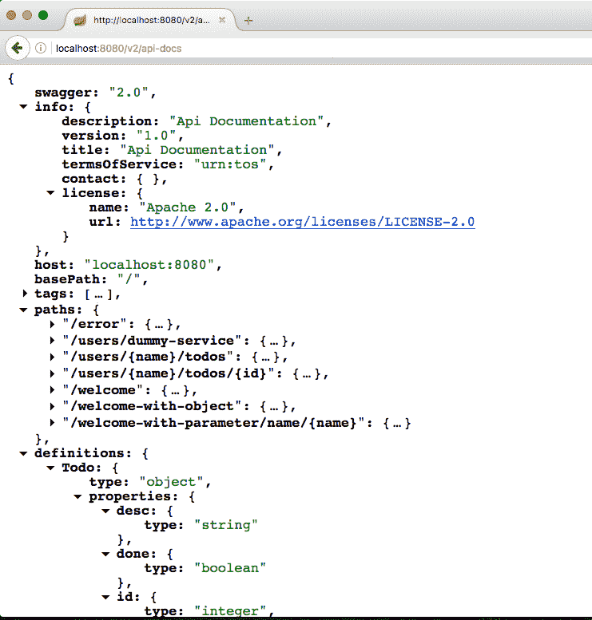
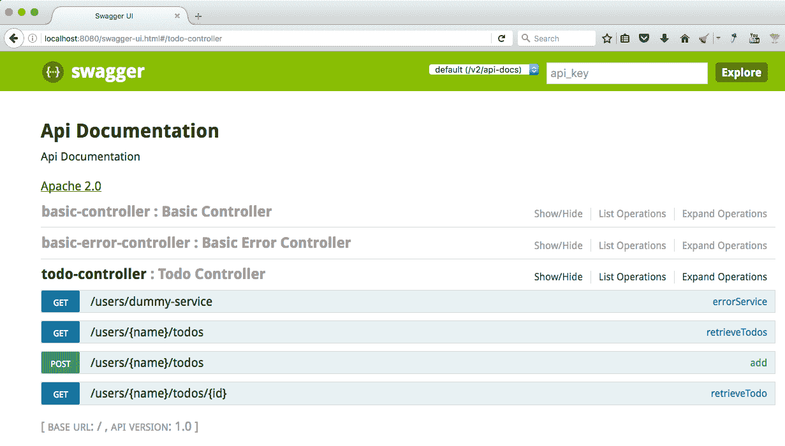
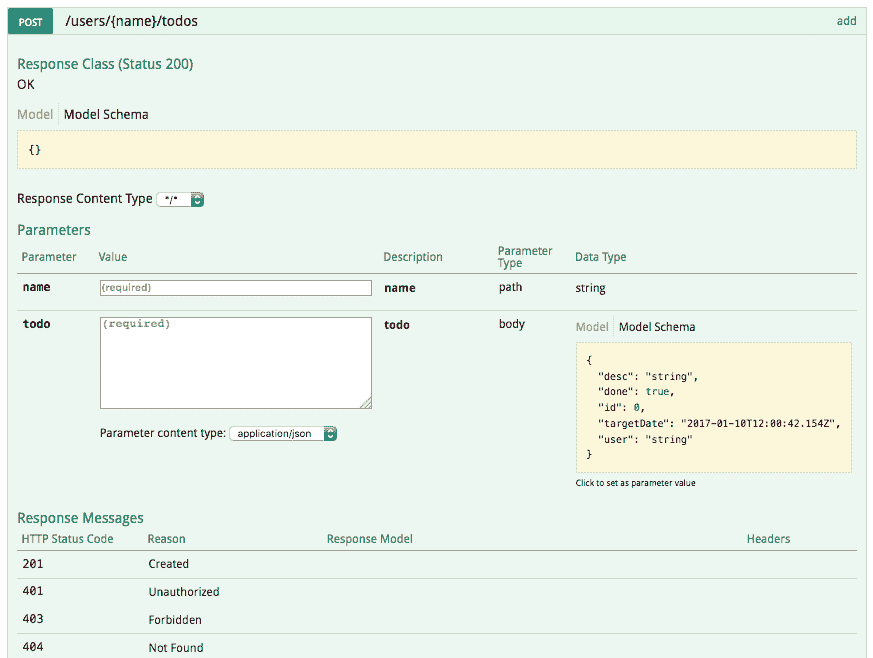
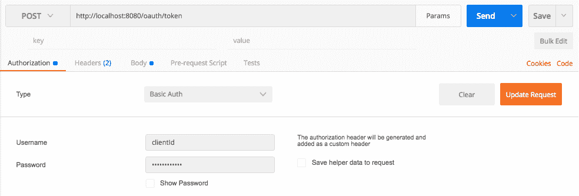
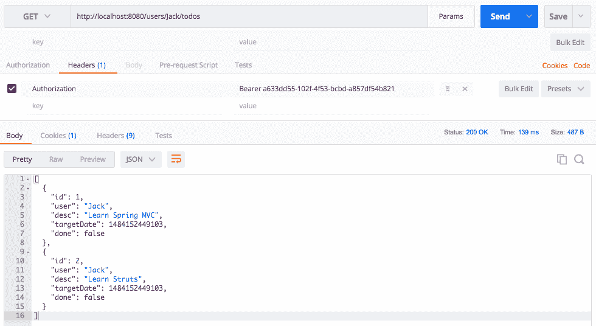
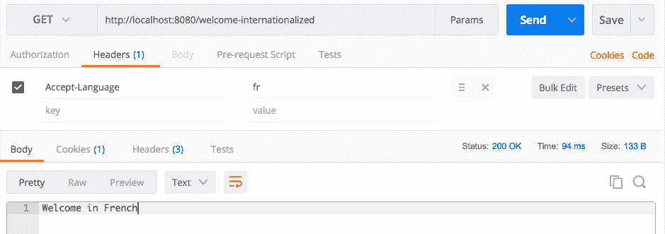

# 六、扩展微服务

我们在[第 5 章](06.html)中构建了一个提供一些服务的基本组件*使用 Spring Boot 构建微服务*。在本章中，我们将重点介绍如何添加更多功能；我们的微服务生产准备就绪。

我们将讨论如何将这些功能添加到我们的微服务中：

*   异常处理
*   哈提奥斯
*   缓存
*   国际化

我们还将讨论如何使用 Swagger 记录我们的微服务。我们将了解使用 Spring Security 保护微服务的基础知识。

# 异常处理

异常处理是开发 web 服务的重要部分之一。当出现问题时，我们希望向服务消费者返回问题所在的良好描述。如果不向服务使用者返回任何有用的内容，您不会希望服务崩溃。

SpringBoot 提供了良好的默认异常处理。我们将首先查看 SpringBoot 提供的默认异常处理功能，然后再进行定制。

# SpringBoot 默认异常处理

为了理解 SpringBoot 提供的默认异常处理，让我们从向不存在的 URL 发出请求开始。

# 不存在的资源

让我们使用头（内容类型：application/json）向`http://localhost:8080/non-existing-resource`发送一个`GET`请求。

以下屏幕截图显示了我们执行请求时的响应：


响应如以下代码段所示：

```java
    {
      "timestamp": 1484027734491,
      "status": 404,
      "error": "Not Found",
      "message": "No message available",
      "path": "/non-existing-resource"
    }
```

需要注意的一些重要事项如下：

*   响应头的 HTTP 状态为`404 - Resource Not Found`
*   SpringBoot 返回一个有效的 JSON；信息作为一个整体；与客户的回应；声明找不到资源的消息

# 正在引发异常的资源

让我们创建一个抛出异常的资源，并向其发送一个`GET`请求，以了解应用如何对运行时异常做出反应。

让我们创建一个引发异常的虚拟服务。以下代码段显示了一个简单的服务：

```java
    @GetMapping(path = "/users/dummy-service")
    public Todo errorService() {
      throw new RuntimeException("Some Exception Occured");
    }
```

需要注意的一些重要事项如下：

*   我们正在创建一个 URI 为`/users/dummy-service`的`GET`服务。
*   发球投掷；`RuntimeException`。我们选择`RuntimeException`是为了能够轻松创建异常。我们可以轻松地用自定义异常替换它；如果需要的话。

让我们使用邮递员向`http://localhost:8080/users/dummy-service`的前一服务发出`GET`请求。响应如以下代码所示：

```java
    {
      "timestamp": 1484028119553,
      "status": 500,
      "error": "Internal Server Error",
      "exception": "java.lang.RuntimeException",
      "message": "Some Exception Occured",
      "path": "/users/dummy-service"
   }
```

需要注意的一些重要事项如下：

*   响应头的 HTTP 状态为`500`；`Internal server error`
*   SpringBoot 还返回引发异常的消息

正如我们在前面两个示例中所看到的，Spring Boot 提供了良好的默认异常处理。在下一节中，我们将重点了解应用如何对自定义异常做出反应。

# 正在引发自定义异常

让我们创建一个自定义异常并从服务中抛出它。请看下面的代码：

```java
    public class TodoNotFoundException extends RuntimeException {
      public TodoNotFoundException(String msg) {
        super(msg);
      }
    }
```

这是一段非常简单的代码，用于定义：；`TodoNotFoundException`。

现在让我们加强我们的`TodoController`；类在找不到具有给定 ID 的`todo`时抛出`TodoNotFoundException`：

```java
    @GetMapping(path = "/users/{name}/todos/{id}")
    public Todo retrieveTodo(@PathVariable String name, 
    @PathVariable int id) {
      Todo todo = todoService.retrieveTodo(id);
      if (todo == null) {
        throw new TodoNotFoundException("Todo Not Found");
       }

     return todo;
    }
```

如果`todoService`返回空`todo`，则抛出；`TodoNotFoundException`。

当我们执行服务时，向不存在的用户发出`GET`请求；`todo`（`http://localhost:8080/users/Jack/todos/222`），我们得到如下代码片段所示的响应：

```java
    {
      "timestamp": 1484029048788,
      "status": 500,
      "error": "Internal Server Error",
      "exception":    
      "com.mastering.spring.springboot.bean.TodoNotFoundException",
      "message": "Todo Not Found",
      "path": "/users/Jack/todos/222"
    }
```

正如我们所看到的，一个清晰的异常响应被发送回服务使用者。然而，有一件事可以进一步改进——响应状态。未找到资源时，建议您返回`404 - Resource Not Found`状态。我们将研究如何定制响应；地位在下一个例子中。

# 自定义异常消息

让我们看看如何自定义前面的异常，并使用自定义消息返回正确的响应状态。

让我们创建一个 bean 来定义自定义异常消息的结构：

```java
    public class ExceptionResponse {
      private Date timestamp = new Date();
      private String message;
      private String details;

      public ExceptionResponse(String message, String details) {
        super();
        this.message = message;
        this.details = details;
       }

      public Date getTimestamp() {
        return timestamp;
      }

      public String getMessage() {
        return message;
      }

      public String getDetails() {
        return details;
      }
     }
```

我们已经创建了一个简单的异常响应 bean，它具有一个自动填充的时间戳和一些附加属性，即消息和细节。

什么时候抛出`TodoNotFoundException`时，我们希望使用`ExceptionResponse`bean 返回响应。下面的代码显示了如何为`TodoNotFoundException.class`创建全局异常处理：

```java
    @ControllerAdvice
    @RestController
    public class RestResponseEntityExceptionHandler 
      extends  ResponseEntityExceptionHandler 
      {
        @ExceptionHandler(TodoNotFoundException.class)
        public final ResponseEntity<ExceptionResponse> 
        todoNotFound(TodoNotFoundException ex) {
           ExceptionResponse exceptionResponse = 
           new ExceptionResponse(  ex.getMessage(), 
           "Any details you would want to add");
           return new ResponseEntity<ExceptionResponse>
           (exceptionResponse, new HttpHeaders(), 
           HttpStatus.NOT_FOUND);
         }
     }
```

需要注意的一些重要事项如下：

*   `RestResponseEntityExceptionHandler extends ResponseEntityExceptionHandler`：我们正在扩展；`ResponseEntityExceptionHandler`，是 Spring MVC 为集中式异常处理`ControllerAdvice`类提供的基类。
*   `@ExceptionHandler(TodoNotFoundException.class)`：这定义了要遵循的方法将处理特定的异常`TodoNotFoundException.class`。未定义自定义异常处理的任何其他异常将遵循 Spring Boot 提供的默认异常处理。
*   `ExceptionResponse exceptionResponse = new ExceptionResponse(ex.getMessage(), "Any details you would want to add")`：创建自定义异常响应。
*   `new ResponseEntity<ExceptionResponse>(exceptionResponse,new HttpHeaders(), HttpStatus.NOT_FOUND)`：这是返回`404 Resource Not Found`响应的定义，其中包含前面定义的自定义异常。

当我们执行服务时，向不存在的用户发出`GET`请求；`todo`（`http://localhost:8080/users/Jack/todos/222`），我们得到如下回应：

```java
    {
      "timestamp": 1484030343311,
      "message": "Todo Not Found",
      "details": "Any details you would want to add"
    }
```

若要为所有异常创建通用异常消息，我们可以在`RestResponseEntityExceptionHandler`中添加一个方法，方法如下：；`@ExceptionHandler(Exception.class)`；注释。

下面的代码片段显示了如何执行此操作：

```java
    @ExceptionHandler(Exception.class)
    public final ResponseEntity<ExceptionResponse> todoNotFound(
    Exception ex) {
       //Customize and return the response
    }
```

未定义自定义异常处理程序的任何异常；将通过前面的方法处理。

# 响应状态

REST 服务需要关注的一个重要问题是错误响应的响应状态。下表显示了要使用的场景和错误响应状态：

| **情况** | **响应状态** |
| 请求正文不符合 API 规范。它没有包含足够的详细信息或包含验证错误。 | ;400 错误请求 |
| 身份验证或授权失败。 | 401 未经授权 |
| 由于各种因素，例如超出限制，用户无法执行操作。 | 403 禁止 |
| 资源不存在。 | 404 找不到 |
| 不支持的操作，例如，在仅允许`GET`的资源上尝试 POST； | 405 方法不允许 |
| 服务器上的错误。理想情况下，这不应该发生。消费者；无法解决这个问题； | 500 内部服务器错误 |

在本节中，我们研究了 SpringBoot 提供的默认异常处理，以及如何进一步定制它以满足我们的需要。

# 哈提奥斯

**HATEOAS**（**作为应用状态引擎的超媒体**）是 REST 应用架构的约束之一。

让我们考虑一个服务消费者正在从服务提供者那里消费大量服务的情况。开发这种系统最简单的方法是让服务使用者存储他们从服务提供者那里需要的每个资源的单个资源 URI。然而，这将在服务提供者和服务使用者之间创建紧密耦合。每当服务提供者上的任何资源 URI 发生更改时，都需要更新服务使用者。

考虑一下；典型的 web 应用。假设我导航到我的银行账户详细信息页面。几乎所有的银行网站都会在屏幕上显示我的银行账户上所有交易的链接，这样我就可以轻松地使用链接导航。

如果我们能带来一个；与 RESTful 服务的概念类似，因此服务不仅返回有关请求资源的数据，而且还提供其他相关资源的详细信息？

HATEOAS 将显示给定资源的相关链接的概念引入 RESTful 服务。当我们返回特定资源的详细信息时，我们还返回指向可在该资源上执行的操作的链接，以及指向相关资源的链接。如果服务使用者可以使用响应中的链接执行事务，则不需要对所有链接进行硬编码。

Roy Fielding 提出的与 HATEOAS 相关的约束摘录（[http://roy.gbiv.com/untangled/2008/rest-apis-must-be-hypertext-driven](http://roy.gbiv.com/untangled/2008/rest-apis-must-be-hypertext-driven) 如下：

<q>A REST API must not define fixed resource names or hierarchies (an obvious coupling of client and server). Servers must have the freedom to control their own namespace. Instead, allow servers to instruct clients on how to construct appropriate URIs, such as is done in HTML forms and URI templates, by defining those instructions within media types and link relations.</q> A REST API should be entered with no prior knowledge beyond the initial URI (bookmark) and set of standardized media types that are appropriate for the intended audience (i.e., expected to be understood by any client that might use the API). From that point on, all application state transitions must be driven by client selection of server-provided choices that are present in the received representations or implied by the user's manipulation of those representations. The transitions may be determined (or limited by) the client's knowledge of media types and resource communication mechanisms, both of which may be improved on-the-fly (e.g., code-on-demand).

此处显示了带有 HATEOAS 链接的响应示例。这是对`/todos`请求的响应，以便检索所有 TODO：

```java
    {
      "_embedded" : {
        "todos" : [ {
          "user" : "Jill",
          "desc" : "Learn Hibernate",
          "done" : false,
         "_links" : {
          "self" : {
                 "href" : "http://localhost:8080/todos/1"
                 },
          "todo" : {
                 "href" : "http://localhost:8080/todos/1"
                  }
            }
     } ]
    },
     "_links" : {
     "self" : {
              "href" : "http://localhost:8080/todos"
              },
     "profile" : {
              "href" : "http://localhost:8080/profile/todos"
              },
     "search" : {
              "href" : "http://localhost:8080/todos/search"
              }
       },
     }
```

前面的响应包括以下链接：

*   具体的`todos`（`http://localhost:8080/todos/1`）
*   搜索资源（`http://localhost:8080/todos/search`）

如果服务消费者想要进行搜索，它可以选择从响应中获取搜索 URL 并向其发送搜索请求。这将减少服务提供者和服务使用者之间的耦合。

# 发送 HATEOAS 链接作为响应

现在我们了解了 HATEOAS 是什么，让我们看看如何在响应中发送与资源相关的链接。

# 弹簧靴启动器 HATEOAS

弹簧靴有一个特定的 HATEO 启动器，称为`spring-boot-starter-hateoas`。我们需要将其添加到`pom.xml`文件中。

以下代码段显示了依赖项块：

```java
    <dependency>
      <groupId>org.springframework.boot</groupId>
      <artifactId>spring-boot-starter-hateoas</artifactId>
    </dependency>
```

`spring-boot-starter-hateoas`的一个重要依赖项是`spring-hateoas`，它提供了 HATEOAS 特性：

```java
    <dependency>
      <groupId>org.springframework.hateoas</groupId>
      <artifactId>spring-hateoas</artifactId>
    </dependency>
```

让我们增强`retrieveTodo`资源（`/users/{name}/todos/{id}`）以返回一个链接来检索响应中的所有`todos`（`/users/{name}/todos`）：

```java
    @GetMapping(path = "/users/{name}/todos/{id}")
    public Resource<Todo> retrieveTodo(
    @PathVariable String name, @PathVariable int id) {
    Todo todo = todoService.retrieveTodo(id);
      if (todo == null) {
           throw new TodoNotFoundException("Todo Not Found");
        }

     Resource<Todo> todoResource = new Resource<Todo>(todo);
     ControllerLinkBuilder linkTo = 
     linkTo(methodOn(this.getClass()).retrieveTodos(name));
     todoResource.add(linkTo.withRel("parent"));

     return todoResource;
    }
```

需要注意的要点如下：

*   `ControllerLinkBuilder linkTo = linkTo(methodOn(this.getClass()).retrieveTodos(name))`：我们想获得当前类上`retrieveTodos`方法的链接
*   `linkTo.withRel("parent")`：与当前资源的关系为父级

下面的代码片段显示了向发送`GET`请求时的响应；`http://localhost:8080/users/Jack/todos/1`：

```java
   {
     "id": 1,
     "user": "Jack",
     "desc": "Learn Spring MVC",
     "targetDate": 1484038262110,
     "done": false,
     "_links": {
               "parent": {
               "href": "http://localhost:8080/users/Jack/todos"
               }
        }
   }
```

`_links`部分将包含所有链接。目前，我们与关系母公司和`href`有一个链接；作为`http://localhost:8080/users/Jack/todos`。

如果您在执行上述请求时遇到问题；尝试使用接受标头--`application/json`执行。

HATEOAS 并不是当今大多数资源中普遍使用的东西。然而，它有可能在减少系统之间的耦合方面真正有用；服务提供者和消费者。

# 验证

好的服务总是在处理数据之前验证数据。在本节中，我们将了解；Bean 验证 API 并使用其参考实现在我们的服务中实现验证。

Bean 验证 API 提供了许多可用于验证 Bean 的注释。这个*JSR 349*；规范定义了 Bean 验证 API 1.1。Hibernate 验证程序是参考实现；在`spring-boot-web-starter`项目中，两者都已定义为依赖项：

*   `hibernate-validator-5.2.4.Final.jar`
*   `validation-api-1.1.0.Final.jar`

我们将为 createTodo 服务方法创建一个简单的验证。

创建验证涉及两个步骤：

1.  在控制器方法上启用验证。
2.  在 bean 上添加验证。

# 启用对的验证；控制器方法

在控制器方法上启用验证非常简单。以下代码段显示了一个示例：

```java
    @RequestMapping(method = RequestMethod.POST, 
    path = "/users/{name}/todos")
    ResponseEntity<?> add(@PathVariable String name
    @Valid @RequestBody Todo todo) {
```

`@Valid(package javax.validation)`注释用于标记要验证的参数。在`Todo`bean 中定义的任何验证都是在`add`方法执行之前执行的。

# 在 bean 上定义验证

让我们在`Todo`bean 上定义一些验证：

```java
   public class Todo {
     private int id; 

     @NotNull
     private String user;

     @Size(min = 9, message = "Enter atleast 10 Characters.")
     private String desc;
```

需要注意的要点如下：

*   `@NotNull`：验证用户字段不为空
*   `@Size(min = 9, message = "Enter atleast 10 Characters.")`：检查`desc`字段是否至少有九个字符

还有许多其他注释可用于验证 bean。以下是一些 Bean 验证注释：

*   `@AssertFalse`、`@AssertTrue`：用于布尔元素。检查带注释的元素。
*   `@AssertFalse`：检查是否存在错误。`@Assert`检查是否为真。
*   `@Future`：带注释的元素必须是将来的日期。
*   `@Past`：带注释的元素必须是过去的日期。
*   `@Max`：带注释的元素必须是一个数值，其值必须小于或等于指定的最大值。
*   `@Min`：带注释的元素必须是一个数值，其值必须大于或等于指定的最小值。
*   `@NotNull`：带批注的元素不能为空。
*   `@Pattern`：注释的`{@code CharSequence}`；元素必须与指定的正则表达式匹配。正则表达式遵循 Java 正则表达式约定。
*   `@Size`：注释的元素大小必须在指定的边界内。

# 单元测试验证

以下示例显示了如何对添加的验证进行单元测试：

```java
     @Test
     public void createTodo_withValidationError() throws Exception {
       Todo mockTodo = new Todo(CREATED_TODO_ID, "Jack", 
       "Learn Spring MVC", new Date(), false);

       String todo = "{"user":"Jack","desc":"Learn","done":false}";

       when( service.addTodo(
         anyString(), anyString(), isNull(), anyBoolean()))
        .thenReturn(mockTodo);

         MvcResult result = mvc.perform(
         MockMvcRequestBuilders.post("/users/Jack/todos")
        .content(todo)
        .contentType(MediaType.APPLICATION_JSON))
        .andExpect(
           status().is4xxClientError()).andReturn();
     }
```

需要注意的要点如下：

*   `"desc":"Learn"`：我们正在使用长度为`5`的 desc 值。这将导致`@Size(min = 9, message = "Enter atleast 10 Characters.")`检查的验证失败。
*   `.andExpect(status().is4xxClientError())`：检查验证错误状态。

# 记录 REST 服务

在服务提供商可以使用服务之前，他们需要一份服务合同。服务合同定义了所有的服务；有关服务的详细信息：

*   我怎样才能呼叫服务？服务的 URI 是什么？
*   请求的格式应该是什么？
*   我应该期待什么样的回应？

有多个选项可以定义 RESTful 服务的服务契约。最近几年最受欢迎的是；**昂首阔步**；在过去几年里，在主要供应商的支持下，斯威格正在赢得很多市场。在本节中，我们将为我们的服务生成 Swagger 文档。

以下引述自斯威格网站（[http://swagger.io](http://swagger.io) 定义了招摇过市规范的目的：

Swagger 规范为您的 API 创建 RESTful 契约，以人机可读的格式详细说明其所有资源和操作，以便于开发、发现和集成。

# 生成；夸夸其谈的说明

在 RESTful 服务开发的最后几年中，一个有趣的发展是从代码生成服务文档（规范）的工具的发展。这确保了代码和文档始终同步。

**Springfox Swagger**可用于从 RESTful 服务代码生成 Swagger 文档。此外，还有一个很棒的工具，名为**招摇过市 UI**，当集成到应用中时，它可以提供人类可读的文档。

下面的代码片段显示了如何添加这两个工具；到；`pom.xml`文件：

```java
    <dependency>
     <groupId>io.springfox</groupId>
     <artifactId>springfox-swagger2</artifactId>
     <version>2.4.0</version>
    </dependency>

    <dependency>
     <groupId>io.springfox</groupId>
     <artifactId>springfox-swagger-ui</artifactId>
     <version>2.4.0</version>
    </dependency>
```

下一步是添加 configuration 类以启用和生成 Swagger 文档。以下代码段显示了如何执行此操作：

```java
    @Configuration
    @EnableSwagger2
    public class SwaggerConfig {
      @Bean
      public Docket api() {
        return new Docket(DocumentationType.SWAGGER_2)
        .select()
        .apis(RequestHandlerSelectors.any())
        .paths(PathSelectors.any()).build();
      }
    }
```

需要注意的要点如下：

*   `@Configuration`：定义一个 Spring 配置文件
*   `@EnableSwagger2`：支持招摇过市的注解
*   `Docket`：一个简单的生成器类，用于配置使用 Swagger-Spring MVC 框架生成 Swagger 文档
*   `new Docket(DocumentationType.SWAGGER_2)`：将 Swagger 2 配置为要使用的 Swagger 版本
*   `.apis(RequestHandlerSelectors.any()).paths(PathSelectors.any())`：包括文档中的所有 API 和路径

当我们启动服务器时，我们可以启动 API 文档 URL（`http://localhost:8080/v2/api-docs`。以下屏幕截图显示了一些生成的文档：



让我们看看生成的一些文档。此处列出的是用于检索的文档；`todos`服务：

```java
    "/users/{name}/todos": {
      "get": {
      "tags": [
             "todo-controller"
             ],
      "summary": "retrieveTodos",
      "operationId": "retrieveTodosUsingGET",
      "consumes": [
               "application/json"
               ],
      "produces": [
               "*/*"
               ],
      "parameters": [
              {
                "name": "name",
                "in": "path",
                "description": "name",
                "required": true,
                "type": "string"
              }
             ],
       "responses": {
       "200": {
              "description": "OK",
              "schema": {
                      "type": "array",
                      items": {
                          "$ref": "#/definitions/Todo"
                        }
                       }
               },
       "401": {
                "description": "Unauthorized"
               },
       "403": {
                "description": "Forbidden"
              },
       "404": {
                "description": "Not Found"
              } 
        }
     }
```

服务定义明确定义了请求；和回应；服务质量。还定义了服务在不同情况下可以返回的不同响应状态。

下面的代码片段显示了`Todo`bean 的定义：

```java
    "Resource«Todo»": {
      "type": "object",
      "properties": {
      "desc": {
               "type": "string"
             },
     "done": {
               "type": "boolean"
             },
     "id": {
              "type": "integer",
              "format": "int32"
           },
     "links": {
              "type": "array",
              "items": {
                         "$ref": "#/definitions/Link"
                       }
              },
     "targetDate": {
                    "type": "string",
                    "format": "date-time"
                },
     "user": {
              "type": "string"
            }
        }
      }
```

它定义了`Todo`bean 中的所有元素及其格式。

# 大摇大摆的用户界面

Swagger UI（`http://localhost:8080/swagger-ui.html`）也可用于查看文档。在上一步中，我们在`pom.xml`中添加了依赖项（`io.springfox:springfox-swagger-ui`），从而启用了 Swagger UI。

大摇大摆的用户界面（[http://petstore.swagger.io](http://petstore.swagger.io) ）也可在线获取。我们可以使用 Swagger UI 可视化任何 Swagger 文档（Swagger JSON）。

以下屏幕截图显示了控制器公开服务的列表。当我们单击任何控制器时，它会展开以显示每个控制器支持的请求方法和 URI 的列表：



下面的屏幕截图显示了 POST 服务在 Swagger UI 中为用户创建`todo`的详细信息：



需要注意的一些重要事项如下：

*   参数显示所有重要参数，包括请求正文
*   参数类型主体（针对；`todo`参数）显示了该参数的预期结构；请求正文
*   响应消息部分显示；服务返回的不同 HTTP 状态代码

Swagger UI 提供了一种很好的方法，可以在不需要额外努力的情况下公开 API 的服务定义。

# 使用注释自定义 Swagger 文档

Swagger UI 还提供注释以进一步自定义文档。

这里列出的是一些：；检索`todos`服务的文档：

```java
    "/users/{name}/todos": {
      "get": {
      "tags": [
             "todo-controller"
             ],
      "summary": "retrieveTodos",
      "operationId": "retrieveTodosUsingGET",
      "consumes": [
               "application/json"
               ],
      "produces": [
                "*/*"
               ],
```

如您所见，生成的文档非常原始。为了更好地描述服务，我们可以在文档中改进许多内容。以下是几个例子：

*   提供更好的摘要
*   将 application/JSON 添加到

Swagger 提供了我们可以添加到 RESTful 服务中的注释，以便定制文档；让我们向控制器添加一些注释，以改进文档：

```java
    @ApiOperation(
      value = "Retrieve all todos for a user by passing in his name", 
      notes = "A list of matching todos is returned. Current pagination   
      is not supported.",
      response = Todo.class, 
      responseContainer = "List", 
      produces = "application/json")
      @GetMapping("/users/{name}/todos")
      public List<Todo> retrieveTodos(@PathVariable String name) {
        return todoService.retrieveTodos(name);
     }
```

需要注意的几个要点如下：

*   `@ApiOperation(value = "Retrieve all todos for a user by passing in his name")`：在文件中作为服务总结产生
*   `notes = "A list of matching todos is returned. Current pagination is not supported."`：在文档中作为服务的描述生成
*   `produces = "application/json”`：定制服务文档的`produces`部分

以下是更新后的文档摘要：

```java
    get": {
         "tags": [
                   "todo-controller"
                 ],
         "summary": "Retrieve all todos for a user by passing in his 
          name",
         "description": "A list of matching todos is returned. Current 
          pagination is not supported.",
         "operationId": "retrieveTodosUsingGET",
         "consumes": [
                     "application/json"
                   ],
         "produces": [
                     "application/json",
                     "*/*"
                   ],
```

Swagger 提供了许多其他注释来定制文档。以下列出了一些重要的注释：

*   `@Api`：将类标记为炫耀资源
*   `@ApiModel`：提供有关招摇过市车型的附加信息
*   `@ApiModelProperty`：添加和操作模型属性的数据
*   `@ApiOperation`：描述针对特定路径的操作或 HTTP 方法
*   `@ApiParam`：增加操作参数的附加元数据
*   `@ApiResponse`：描述一个操作的响应示例
*   `@ApiResponses`：允许多个`ApiResponse`对象列表的包装器。
*   `@Authorization`：声明要在资源或操作上使用的授权方案
*   `@AuthorizationScope`：描述 OAuth 2 的授权范围
*   `@ResponseHeader`：表示可以作为响应的一部分提供的标头

Swagger 提供了一些可以修改的 Swagger 定义注释；用于自定义有关一组服务的高级信息—联系人、许可证和其他常规信息。以下列出了一些重要的问题：

*   `@SwaggerDefinition`：要添加到生成的招摇定义中的定义级属性
*   `@Info`：大摇大摆定义的通用元数据
*   `@Contact`：；属性来描述要联系的人，以获得炫耀定义
*   `@License`：描述大摇大摆定义许可证的属性

# 使用 Spring Security 保护 REST 服务

我们迄今为止创造的所有服务；现在，它们没有担保。使用者无需提供任何凭据即可访问这些服务。然而，现实世界中的所有服务通常都是安全的。

在本节中，我们将讨论两种验证 REST 服务的方法：

*   基本身份验证
*   OAuth2.0 身份验证

我们将使用 Spring Security 实现这两种类型的身份验证。

弹簧靴为弹簧安全使用提供了启动装置；`spring-boot-starter-security`。我们将首先在`pom.xml`文件中添加 Spring Security starter。

# 添加弹簧安全启动器

将以下依赖项添加到您的文件`pom.xml`：

```java
    <dependency>
      <groupId>org.springframework.boot</groupId>
      <artifactId>spring-boot-starter-security</artifactId>
    </dependency>
```

`Spring-boot-starter-security`依赖性；引入了三个重要的 Spring 安全依赖项：

*   `spring-security-config`
*   `spring-security-core`
*   `spring-security-web`

# 基本身份验证

`Spring-boot-starter-security`依赖性；默认情况下，还会自动配置所有服务的基本身份验证。

如果我们现在尝试访问任何服务，我们将获得`"Access Denied"`。

我们向`http://localhost:8080/users/Jack/todos`发送请求时的响应如以下代码段中的示例所示：

```java
    {
      "timestamp": 1484120815039,
      "status": 401,
      "error": "Unauthorized",
      "message": "Full authentication is required to access this 
       resource",
       "path": "/users/Jack/todos"
    }
```

响应状态为`401 - Unauthorized`。

当使用基本身份验证保护资源时，我们需要发送用户 ID 和密码来验证我们的请求。由于我们没有配置用户 ID 和密码，Spring Boot 自动配置默认用户 ID 和密码。默认用户 ID 为`user`。默认密码通常打印在日志中。

以下代码段中显示了一个示例：

```java
2017-01-11 13:11:58.696 INFO 3888 --- [ restartedMain] b.a.s.AuthenticationManagerConfiguration :

Using default security password: 3fb5564a-ce53-4138-9911-8ade17b2f478

2017-01-11 13:11:58.771 INFO 3888 --- [ restartedMain] o.s.s.web.DefaultSecurityFilterChain : Creating filter chain: Ant [pattern='/css/**'], []
```

在前面的代码段中，下划线是日志中打印的默认安全密码。

我们可以使用邮递员发出具有基本身份验证的请求。以下屏幕截图显示了如何随请求发送基本身份验证详细信息：


如您所见，身份验证成功，我们得到了正确的响应。

我们可以在`application.properties`中配置我们选择的用户 ID 和密码，如下所示：

```java
   security.user.name=user-name
   security.user.password=user-password
```

Spring Security 还提供了使用 LDAP 或 JDBC 或任何其他具有用户凭据的数据源进行身份验证的选项。

# 集成测试

由于凭据无效，我们先前为服务编写的集成测试将开始失败。现在，我们将更新集成测试以提供基本身份验证凭据：

```java
    private TestRestTemplate template = new TestRestTemplate();
    HttpHeaders headers = createHeaders("user-name", "user-password");

    HttpHeaders createHeaders(String username, String password) {
      return new HttpHeaders() {
       {
         String auth = username + ":" + password;
         byte[] encodedAuth = Base64.getEncoder().encode
         (auth.getBytes(Charset.forName("US-ASCII")));
         String authHeader = "Basic " + new String(encodedAuth);
         set("Authorization", authHeader);
        }
      };
     }

    @Test
    public void retrieveTodos() throws Exception {
      String expected = "["
      + "{id:1,user:Jack,desc:\"Learn Spring MVC\",done:false}" + ","
      + "{id:2,user:Jack,desc:\"Learn Struts\",done:false}" + "]";
      ResponseEntity<String> response = template.exchange(
      createUrl("/users/Jack/todos"), HttpMethod.GET,
      new HttpEntity<String>(null, headers),
      String.class);
      JSONAssert.assertEquals(expected, response.getBody(), false);
    }
```

需要注意的一些重要事项如下：

*   `createHeaders("user-name", "user-password")`：此方法创建`Base64\. getEncoder().encode`基本认证头
*   `ResponseEntity<String> response = template.exchange(createUrl("/users/Jack/todos"), ;HttpMethod.GET,new HttpEntity<String>(null, headers), String.class)`：关键的变化是使用`HttpEntity`将我们之前创建的头文件提供给 REST 模板

# 单元测试

我们不希望在单元测试中使用安全性。以下代码片段显示了如何禁用单元测试的安全性：

```java
   @RunWith(SpringRunner.class)
   @WebMvcTest(value = TodoController.class, secure = false)
   public class TodoControllerTest {
```

关键部分是`WebMvcTest`注释上的`secure = false`参数。这将禁用单元测试的 Spring 安全性。

# OAuth 2 身份验证

OAuth 是一种协议，它提供流，以便在一系列支持 web 的应用和服务之间交换授权和身份验证信息。它允许第三方应用从服务（例如 Facebook、Twitter 或 GitHub）获得对用户信息的受限访问。

在深入讨论细节之前，先回顾一下 OAuth 2 身份验证通常使用的术语是很有用的。

让我们考虑一个例子。假设我们希望向 internet 上的第三方应用公开 Todo API。

以下是典型 OAuth 2 交换中的重要参与者：

*   **资源所有者**：这是希望使用 Todo API 的第三方应用的用户。它决定了我们的 API 中有多少可用信息可以提供给第三方应用。
*   **资源服务器**：托管 Todo API，即资源；我们要确保安全。
*   **客户端**：这是想要使用我们 API 的第三方应用。
*   **授权服务器**：提供 OAuth 服务的服务器。

# 高水平；流

以下步骤显示了一个示例；典型 OAuth 身份验证的高级流：

1.  应用请求用户授权访问 API 资源。
2.  当；当用户提供访问权限时，应用将收到授权授予。
3.  应用向授权服务器提供用户授权授予及其自己的客户端凭据。
4.  如果身份验证成功，授权服务器将使用访问令牌进行响应。
5.  应用调用 API（资源服务器），该 API 为身份验证提供访问令牌。
6.  如果访问令牌有效，资源服务器将返回资源的详细信息。

# 为我们的服务实现 OAuth2 身份验证

OAuth 2 for Spring Security（`spring-security-oauth2`是为 Spring Security 提供 OAuth 2 支持的模块。我们将把它作为依赖项添加到我们的`pom.xml`文件中：

```java
    <dependency>
      <groupId>org.springframework.security.oauth</groupId>
      <artifactId>spring-security-oauth2</artifactId>
    </dependency>
```

# 设置授权和资源服务器

spring-security-oauth2 尚未（2017 年 6 月）更新为 spring Framework 5.x 和 spring Boot 2.x。我们将使用 SpringBoot1.5.x 作为与 OAuth2 身份验证相关的示例。代码示例位于 GitHub 存储库中；[https://github.com/PacktPublishing/Mastering-Spring-5.0](https://github.com/PacktPublishing/Mastering-Spring-5.0) 。

通常，授权服务器与公开 API 的应用是不同的服务器。为了简单起见，我们将使当前的 API 服务器同时充当资源服务器和授权服务器。

以下代码片段显示了如何使应用充当资源和授权服务器：

```java
   @EnableResourceServer
   @EnableAuthorizationServer
   @SpringBootApplication
   public class Application {
```

以下是需要注意的几个重要事项：

*   `@EnableResourceServer`：OAuth 2 资源服务器的方便注释，支持通过传入的 OAuth 2 令牌对请求进行身份验证的 Spring 安全过滤器
*   `@EnableAuthorizationServer`：一个方便的注释，用于启用授权服务器；`AuthorizationEndpoint`和；当前应用上下文中的`TokenEndpoint`，必须是`DispatcherServlet`上下文

现在我们可以在`application.properties`中配置访问详细信息，如下代码段所示：

```java
    security.user.name=user-name
    security.user.password=user-password
    security.oauth2.client.clientId: clientId
    security.oauth2.client.clientSecret: clientSecret
    security.oauth2.client.authorized-grant-types:     
    authorization_code,refresh_token,password
    security.oauth2.client.scope: openid
```

以下是一些重要的细节：

*   `security.user.name`和；`security.user.password`是作为第三方应用最终用户的资源所有者的身份验证详细信息
*   `security.oauth2.client.clientId`和；`security.oauth2.client.clientSecret`是作为第三方应用的客户端（服务消费者）的身份验证详细信息

# 执行 OAuth 请求

我们需要一个两步流程来访问 API：

1.  获取访问令牌。
2.  使用访问令牌执行请求。

# 获取访问令牌

为了获得访问令牌，我们调用授权服务器（`http://localhost:8080/oauth/token`，以基本身份验证模式提供客户端身份验证详细信息，并将用户凭据作为表单数据的一部分。以下屏幕截图显示了如何在基本身份验证中配置客户端身份验证详细信息：



以下屏幕截图显示了如何将用户身份验证详细信息配置为 POST 参数的一部分：


我们正在使用`grant_type`；作为密码，表示我们正在发送用户身份验证详细信息以获取访问令牌。当我们执行请求时，会得到一个类似于以下代码段中所示的响应：

```java
    {
      "access_token": "a633dd55-102f-4f53-bcbd-a857df54b821",
      "token_type": "bearer",
      "refresh_token": "d68d89ec-0a13-4224-a29b-e9056768c7f0",
      "expires_in": 43199,
      "scope": "openid"
    }
```

以下是几个重要的细节：

*   `access_token`：客户端应用可以使用访问令牌对进一步的 API 调用进行身份验证。但是，访问令牌通常会在很短的时间内过期。
*   `refresh_token`：客户端应用可以通过`refresh_token`向认证服务器提交新的请求，获得新的`access_token`。

# 使用访问令牌执行请求

一旦我们有了；`access_token`，我们可以使用执行请求；`access_token`，如下图截图所示：



正如您在前面的屏幕截图中所看到的，我们在名为 Authorization 的请求头中提供了访问令牌。我们使用格式`"Bearer {access_token}"`的值。身份验证成功，我们获得了预期的资源详细信息。

# 集成测试

现在我们将更新集成测试以提供 OAuth 2 凭据。以下测试强调了重要的细节：

```java
    @Test
    public void retrieveTodos() throws Exception {
      String expected = "["
      + "{id:1,user:Jack,desc:\"Learn Spring MVC\",done:false}" + ","
      +"{id:2,user:Jack,desc:\"Learn Struts\",done:false}" + "]";
      String uri = "/users/Jack/todos";
      ResourceOwnerPasswordResourceDetails resource = 
      new ResourceOwnerPasswordResourceDetails();
      resource.setUsername("user-name");
      resource.setPassword("user-password");
      resource.setAccessTokenUri(createUrl("/oauth/token"));
      resource.setClientId("clientId");
      resource.setClientSecret("clientSecret");
      resource.setGrantType("password");
      OAuth2RestTemplate oauthTemplate = new 
      OAuth2RestTemplate(resource,new 
      DefaultOAuth2ClientContext());
      ResponseEntity<String> response = 
      oauthTemplate.getForEntity(createUrl(uri), String.class);
     JSONAssert.assertEquals(expected, response.getBody(), false);
    }
```

需要注意的一些重要事项如下：

*   `ResourceOwnerPasswordResourceDetails resource = new ResourceOwnerPasswordResourceDetails()`：我们使用用户凭证和客户端凭证设置`ResourceOwnerPasswordResourceDetails`
*   `resource.setAccessTokenUri(createUrl("/oauth/token"))`：配置认证服务器的 URL
*   `OAuth2RestTemplate oauthTemplate = new OAuth2RestTemplate(resource,new DefaultOAuth2ClientContext())`：`OAuth2RestTemplate`是`RestTemplate`的扩展，支持 OAuth 2 协议

在本节中，我们研究了如何在我们的资源中启用 OAuth 2 身份验证。

# 国际化

**国际化**（**i18n**）是开发应用和服务的过程，以便能够针对世界各地不同的语言和文化进行定制。也叫,；**本地化**。国际化或本地化的目标是构建能够以多种语言和格式提供内容的应用。

Spring Boot 内置了对国际化的支持。

让我们构建一个简单的服务，以了解如何在 API 中构建国际化。

我们需要向 Spring Boot 应用添加一个`LocaleResolver`和一个消息源。`Application.java`中应包含以下代码段：

```java
    @Bean
    public LocaleResolver localeResolver() {
      SessionLocaleResolver sessionLocaleResolver = 
      new SessionLocaleResolver();
      sessionLocaleResolver.setDefaultLocale(Locale.US);
      return sessionLocaleResolver;
    }

   @Bean
   public ResourceBundleMessageSource messageSource() {
     ResourceBundleMessageSource messageSource = 
     new ResourceBundleMessageSource();
     messageSource.setBasenames("messages");
     messageSource.setUseCodeAsDefaultMessage(true);
    return messageSource;
   }
```

需要注意的一些重要事项如下：

*   `sessionLocaleResolver.setDefaultLocale(Locale.US)`：我们正在设置一个默认区域设置`Locale.US`。
*   `messageSource.setBasenames("messages")`：我们正在将消息源的基本名称设置为`messages`。如果我们在 fr 地区（法国），我们将使用来自`message_fr.properties`的消息。如果信息在`message_fr.properties`中不可用，则会在默认的`message.properties`中进行搜索。
*   `messageSource.setUseCodeAsDefaultMessage(true)`：如果未找到消息，则返回该代码作为默认消息。

让我们在各自的文件中配置消息。让我们从`messages`属性开始。此文件中的消息将作为默认值：

```java
    welcome.message=Welcome in English
```

我们也来配置`messages_fr.properties`。此文件中的消息将用于区域设置。如果此处没有消息，则将使用`messages.properties`中的默认值：

```java
   welcome.message=Welcome in French
```

让我们创建一个服务，使用中指定的语言环境返回特定消息；`"Accept-Language"`表头：

```java
    @GetMapping("/welcome-internationalized")
    public String msg(@RequestHeader(value = "Accept-Language", 
    required = false) Locale locale) {
      return messageSource.getMessage("welcome.message", null, 
      locale);
    }
```

这里有几件事需要注意：

*   `@RequestHeader(value = "Accept-Language", required = false) Locale locale`：从请求头`Accept-Language`中提取区域设置。这不是必需的。如果未指定区域设置，则使用默认区域设置。
*   `messageSource.getMessage("welcome.message", null, locale)`：`messageSource`自动连接至控制器。我们根据给定的区域设置收到欢迎消息。

下面的屏幕截图显示了在未指定默认值的情况下调用前面的服务时的响应`Accept-Language`：


返回来自`messages.properties`的默认消息。

下面的屏幕截图显示了使用`Accept-Language fr`调用前面的服务时的响应：



返回来自`messages_fr.properties`的本地化消息。

在前面的示例中，我们定制了服务，以根据请求中的区域设置返回本地化消息。类似的方法也可用于国际化；组件中的所有服务。

# 缓存

缓存来自服务的数据在提高应用的性能和可伸缩性方面起着至关重要的作用。在本节中，我们将了解 SpringBoot 提供的实现选项。

Spring 提供了基于注释的缓存抽象。我们将从使用 Spring 缓存注释开始。稍后，我们将介绍*JSR-107*缓存注释，并将它们与 Spring 抽象进行比较。

# springbootstarter 缓存

Spring Boot 为缓存`spring-boot-starter-cache`提供了一个启动项目。将其添加到应用中会引入所有依赖项，以启用*JSR-107*和 Spring 缓存注释。下面的代码片段显示了`spring-boot-starter-cache`的依赖项详细信息。让我们将此添加到我们的文件`pom.xml`：

```java
    <dependency>
      <groupId>org.springframework.boot</groupId>
      <artifactId>spring-boot-starter-cache</artifactId>
    </dependency>
```

# 启用缓存

在开始使用缓存之前，我们需要在应用上启用缓存。以下代码段显示了如何启用缓存：

```java
    @EnableCaching
    @SpringBootApplication
    public class Application {
```

`@EnableCaching`将在 SpringBoot 应用中启用缓存。

Spring Boot 自动配置合适的 CacheManager；框架作为相关缓存的提供者。稍后我们将了解 Spring Boot 如何决定 CacheManager 的细节。

# 缓存数据

现在我们已经启用了缓存，我们可以添加；`@Cacheable`对我们想要缓存数据的方法的注释。下面的代码片段显示了如何在`retrieveTodos`上启用缓存：

```java
    @Cacheable("todos")
    public List<Todo> retrieveTodos(String user) {
```

在前面的示例中，缓存特定用户的`todos`。在第一次为特定用户调用该方法时，将从服务中检索`todos`。对于同一用户的后续调用，数据将从缓存返回。

Spring 还提供条件缓存。在以下代码段中，仅当满足指定条件时才启用缓存：

```java
    @Cacheable(cacheNames="todos", condition="#user.length < 10”)
    public List<Todo> retrieveTodos(String user) {
```

Spring 还提供了额外的注释来从缓存中取出数据，并向缓存中添加一些自定义数据。以下列出了几个重要问题：

*   `@CachePut`：用于显式地将数据添加到缓存中
*   `@CacheEvict`：用于从缓存中删除过时数据
*   `@Caching`：允许多套`@Cacheable`、`@CachePut`；，和`@CacheEvict`；要在同一方法上使用的注释

# JSR-107 缓存注释

*JSR-107*旨在标准化缓存注释。以下列出了一些重要的*JSR-107*注释：

*   `@CacheResult`：类似`@Cacheable`
*   `@CacheRemove`：类似`@CacheEvict`；`@CacheRemove`在异常发生时支持条件逐出
*   `@CacheRemoveAll`：与`@CacheEvict(allEntries=true)`类似；用于从缓存中删除所有条目

*JSR-107*和 Spring 的缓存注释在提供的功能方面非常相似。他们两个都是不错的选择。我们稍微倾向于*JSR-107*，因为这是一个标准。但是，请确保不要在同一项目中同时使用这两种方法。

# 自动检测命令

启用缓存后，SpringBoot 自动配置将开始查找缓存提供程序。下面的列表显示了 Spring Boot 搜索缓存提供程序的顺序。该列表按优先顺序递减：

*   JCache（*JSR-107*）（EhCache 3、Hazelcast、Infinispan 等）
*   EhCache 2.x
*   黑兹卡斯特
*   英菲尼斯潘
*   卧铺
*   雷迪斯
*   咖啡因
*   番石榴
*   易于理解的

# 总结

Spring Boot 使开发基于 Spring 的应用变得简单。它使我们能够非常快速地创建生产就绪的应用。

在本章中，我们介绍了如何向应用添加异常处理、缓存和国际化等功能。我们讨论了使用 Swagger 记录 REST 服务的最佳实践。我们了解了使用 Spring Security 保护微服务的基础知识。

在下一章中，我们将把注意力转移到 Spring Boot 中的高级功能上。我们将研究如何在 REST 服务之上提供监控，学习如何将微服务部署到云中，并了解如何在使用 Spring Boot 开发应用时提高效率。