# 七、高级 SpringBoot 功能

在上一章中，我们通过异常处理、HATEOAS、缓存和国际化扩展了我们的微服务。在本章中，让我们将注意力转向部署我们的服务；生产。为了能够将服务部署到生产环境中，我们需要能够设置和创建配置、部署和监视服务的功能。

以下是我们将回答的一些问题；在本章中：

*   如何将应用配置外部化？
*   如何使用配置文件配置特定于环境的值？
*   如何将我们的应用部署到云？
*   什么是嵌入式服务器？如何使用 Tomcat、Jetty 和 Undertow？
*   监控功能是什么；弹簧启动执行器提供什么？
*   使用 Spring Boot，您如何才能成为一名更高效的开发人员？

# 外部化配置

应用通常构建一次（在 JAR 或 WAR 中），然后部署到多个环境中；下图显示了应用可以部署到的一些不同环境：


在上述每个环境中，应用通常：；具有以下特征：

*   与数据库的连接
*   连接到多个服务器；服务
*   特定环境配置

将在不同环境之间更改的配置外部化为配置文件或数据库是一种很好的做法。

弹簧靴提供；一种灵活、标准化的外部化配置方法。

在本节中，我们将了解以下内容：

*   如何才能从财产；`application.properties`是否在我们的服务中使用？
*   如何实现类型安全配置属性；让应用配置成为一个难题？
*   弹簧靴为**弹簧提供什么样的支撑；个人资料**？
*   您如何在`application.properties`中配置属性？

在 SpringBoot中，`application.properties`是从中获取配置值的默认文件。弹簧靴可以摘；`application.properties`文件；从类路径上的任何地方；通常，`application.properties`位于`src\main\resources`，如图所示；以下截图：


在[第 6 章](06.html)*扩展微服务*中，我们查看了使用`application.properties`中的配置定制 Spring Security 的示例：

```java
    security.basic.enabled=false
    management.security.enabled=false
    security.user.name=user-name
    security.user.password=user-password
    security.oauth2.client.clientId: clientId
    security.oauth2.client.clientSecret: clientSecret
    security.oauth2.client.authorized-grant-types:                
    authorization_code,refresh_token,password
    security.oauth2.client.scope: openid
```

与此类似,都是,；其他 SpringBoot启动器、模块和框架可以通过中的配置进行定制；`application.properties`。在下一节中，让我们看看 Spring Boot 为这些框架提供的一些配置选项。

# 通过 application.properties 定制框架

在本节中，我们将讨论：；可以通过`application.properties`配置的一些重要内容。

有关完整列表，请参阅；[https://docs.spring.io/spring-boot/docs/current-SNAPSHOT/reference/htmlsingle/#common-应用属性](https://docs.spring.io/spring-boot/docs/current-SNAPSHOT/reference/htmlsingle/#common-application-properties)。

# 登录中

一些事情；可配置的配置如下所示：

*   日志配置文件的位置
*   日志文件的位置
*   日志记录级别

以下代码段显示了几个示例：

```
# Location of the logging configuration file.
  logging.config=
# Log file name.
  logging.file=
# Configure Logging level. 
# Example `logging.level.org.springframework=TRACE`
  logging.level.*=
```

# 嵌入式服务器配置

嵌入式服务器是 Spring Boot 最重要的功能之一。一些嵌入式服务器功能，可以：；通过应用属性进行配置；包括：

*   服务器端口
*   SSL 支持和配置
*   访问日志配置

以下代码段显示了一些可通过应用属性配置的嵌入式服务器功能：

```
# Path of the error controller.
server.error.path=/error
# Server HTTP port.
server.port=8080
# Enable SSL support.
server.ssl.enabled=
# Path to key store with SSL certificate
server.ssl.key-store=
# Key Store Password
server.ssl.key-store-password=
# Key Store Provider
server.ssl.key-store-provider=
# Key Store Type
server.ssl.key-store-type=
# Should we enable access log of Tomcat?
server.tomcat.accesslog.enabled=false
# Maximum number of connections that server can accept
server.tomcat.max-connections=
```

# Spring MVC

Spring MVC 可以通过`application.properties`进行广泛配置。以下列出了一些重要的配置：

```
# Date format to use. For instance `dd/MM/yyyy`.
 spring.mvc.date-format=
# Locale to use.
 spring.mvc.locale=
# Define how the locale should be resolved.
 spring.mvc.locale-resolver=accept-header
# Should "NoHandlerFoundException" be thrown if no Handler is found?
 spring.mvc.throw-exception-if-no-handler-found=false
# Spring MVC view prefix. Used by view resolver.
 spring.mvc.view.prefix=
# Spring MVC view suffix. Used by view resolver.
 spring.mvc.view.suffix=
```

# 弹簧起动器安全性

Spring Security 可通过`application.properties`进行广泛配置。以下示例显示了与 Spring Security 相关的一些重要配置选项：

```
# Set true to Enable basic authentication
 security.basic.enabled=true
# Provide a Comma-separated list of uris you would want to secure
 security.basic.path=/**
# Provide a Comma-separated list of paths you don't want to secure
 security.ignored=
# Name of the default user configured by spring security
 security.user.name=user
# Password of the default user configured by spring security. 
 security.user.password=
# Roles granted to default user
 security.user.role=USER
```

# 数据源，JDBC 和 JPA

数据源，JDBC，也可以通过`application.properties`进行广泛配置；以下列出了一些重要的选项：

```
# Fully qualified name of the JDBC driver. 
 spring.datasource.driver-class-name=
# Populate the database using 'data.sql'.
 spring.datasource.initialize=true
# JNDI location of the datasource.
 spring.datasource.jndi-name=
# Name of the datasource.
 spring.datasource.name=testdb
# Login password of the database.
 spring.datasource.password=
# Schema (DDL) script resource references.
 spring.datasource.schema=
# Db User to use to execute DDL scripts
 spring.datasource.schema-username=
# Db password to execute DDL scripts
 spring.datasource.schema-password=
# JDBC url of the database.
 spring.datasource.url=
# JPA - Initialize the schema on startup.
 spring.jpa.generate-ddl=false
# Use Hibernate's newer IdentifierGenerator for AUTO, TABLE and SEQUENCE.
 spring.jpa.hibernate.use-new-id-generator-mappings=
# Enable logging of SQL statements.
 spring.jpa.show-sql=false
```

# 其他配置选项

通过`application.properties`可以配置的其他一些东西如下：

*   轮廓
*   HTTP；消息转换器（Jackson/JSON）
*   事务管理
*   国际化

以下示例显示了一些配置选项：

```
# Comma-separated list (or list if using YAML) of active profiles.
 spring.profiles.active=
# HTTP message conversion. jackson or gson
 spring.http.converters.preferred-json-mapper=jackson
# JACKSON Date format string. Example `yyyy-MM-dd HH:mm:ss`.
 spring.jackson.date-format=
# Default transaction timeout in seconds.
 spring.transaction.default-timeout=
# Perform the rollback on commit failures.
 spring.transaction.rollback-on-commit-failure=
# Internationalisation : Comma-separated list of basenames
 spring.messages.basename=messages
# Cache expiration for resource bundles, in sec. -1 will cache for ever
 spring.messages.cache-seconds=-1
```

# application.properties 中的自定义属性

到目前为止，我们已经研究了如何在各种框架中使用 SpringBoot 提供的预构建属性。在本节中，我们将介绍如何创建也可以在`application.properties`中配置的特定于应用的配置。

让我们考虑一个例子。我们希望能够与外部服务交互。我们希望能够将此服务的 URL 配置外部化。

以下示例显示了我们希望如何在`application.properties`中配置外部服务：

```
   somedataservice.url=http://abc.service.com/something
```

我们要用价值观；`somedataservice.url`我们的数据服务中的财产。下面的代码片段展示了如何在示例数据服务中实现这一点。

```
    @Component
    public class SomeDataService {
      @Value("${somedataservice.url}")
      private String url;
      public String retrieveSomeData() {
        // Logic using the url and getting the data
       return "data from service";
      }
    }
```

需要注意的几个重要事项如下：

*   `@Component public class SomeDataService`：由于`@Component`注释，数据服务 bean 由 Spring 管理。
*   `@Value("${somedataservice.url}")`：将`somedataservice.url`的值自动连接到`url`变量中。`url`值可用于 bean 的方法中。

# 配置属性-类型安全配置管理

而；`@Value`注释提供了动态配置，但也有几个缺点：

*   如果我们想在一个服务中使用三个属性值，我们需要自动连线；他们使用`@Value`三次。
*   `@Value`注释和消息的键将分布在整个应用中。如果我们想在应用中找到可配置值的列表，我们必须在应用中搜索`@Value`注释。

Spring Boot 通过强类型`ConfigurationProperties`特性提供了更好的应用配置方法。这使我们能够执行以下操作：

*   在预定义的 bean 结构中具有所有属性
*   这个 bean 将充当所有应用属性的集中存储
*   只要需要应用配置，配置 bean 就可以自动连接

示例配置 bean 如下所示：

```
    @Component
    @ConfigurationProperties("application")
    public class ApplicationConfiguration {
      private boolean enableSwitchForService1;
      private String service1Url;
      private int service1Timeout;
      public boolean isEnableSwitchForService1() {
        return enableSwitchForService1;
      }
     public void setEnableSwitchForService1
     (boolean enableSwitchForService1) {
        this.enableSwitchForService1 = enableSwitchForService1;
      }
     public String getService1Url() {
       return service1Url;
     }
     public void setService1Url(String service1Url) {
       this.service1Url = service1Url;
     }
     public int getService1Timeout() {
       return service1Timeout;
     }
     public void setService1Timeout(int service1Timeout) {
       this.service1Timeout = service1Timeout;
    }
  }
```

需要注意的几个重要事项如下：

*   `@ConfigurationProperties("application")`是外部化配置的注释。我们可以将此注释添加到任何类以绑定到外部属性。在将外部配置绑定到此 bean 时，双引号中的值（application）用作前缀。
*   我们在 bean 中定义了多个可配置的值。
*   由于绑定是通过 JavaBeans 属性描述符进行的，所以需要 getter 和 setter。

以下代码段显示了如何在`application.properties`中定义这些属性的值：

```
    application.enableSwitchForService1=true
    application.service1Url=http://abc-dev.service.com/somethingelse
    application.service1Timeout=250
```

需要注意的几个重要事项如下：

*   `application`：在定义配置 bean 时，前缀被定义为`@ConfigurationProperties("application")`的一部分
*   通过将前缀附加到属性名称来定义值

通过将`ApplicationConfiguration`自动连接到 bean 中，我们可以使用其他 bean 中的配置属性：

```
    @Component
    public class SomeOtherDataService {
      @Autowired
      private ApplicationConfiguration configuration;
      public String retrieveSomeData() {
        // Logic using the url and getting the data
        System.out.println(configuration.getService1Timeout());
        System.out.println(configuration.getService1Url());
        System.out.println(configuration.isEnableSwitchForService1());
        return "data from service";
      }
    }
```

需要注意的几个重要事项如下：

*   `@Autowired private ApplicationConfiguration configuration`：`ApplicationConfiguration`自动连接到`SomeOtherDataService`
*   `configuration.getService1Timeout(), configuration.getService1Url(), configuration.isEnableSwitchForService1()`：可以使用配置 bean 上的 getter 方法在 bean 方法中访问值

默认情况下，将外部配置的值绑定到配置属性 bean 中的任何失败都会导致服务器启动失败。这可以防止由于在生产环境中运行的应用配置错误而出现问题。

让我们使用错误配置的服务超时来查看发生了什么：

```
    application.service1Timeout=SOME_MISCONFIGURATION
```

应用将无法启动，并出现错误。

```
 ***************************
 APPLICATION FAILED TO START
 ***************************
Description:
Binding to target com.mastering.spring.springboot.configuration.ApplicationConfiguration@79d3473e failed:

Property: application.service1Timeout
Value: SOME_MISCONFIGURATION
Reason: Failed to convert property value of type 'java.lang.String' to required type 'int' for property 'service1Timeout'; nested exception is org.springframework.core.convert.ConverterNotFoundException: No converter found capable of converting from type [java.lang.String] to type [int]

Action:
Update your application's configuration
```

# 轮廓

到目前为止，我们一直在研究如何将应用配置外部化到属性文件；`application.properties`。我们希望能够在不同的环境中为同一属性设置不同的值。

配置文件提供了在不同环境中提供不同配置的方法。

以下代码段显示了如何在`application.properties`中配置活动配置文件：

```
    spring.profiles.active=dev
```

一旦配置了活动配置文件，就可以在`application-{profile-name}.properties`中定义该配置文件的特定属性。对于`dev`配置文件，属性文件的名称为；`application-dev.properties`。下面的示例显示了：；`application-dev.properties`中的配置：

```
    application.enableSwitchForService1=true
    application.service1Url=http://abc-dev.service.com/somethingelse
    application.service1Timeout=250
```

如果活动配置文件为`dev`，则`application-dev.properties`中的值将覆盖`application.properties`中的默认配置。

我们可以针对多个环境进行配置，如下所示：

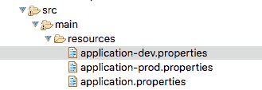

# 基于概要文件的 Bean 配置

配置文件还可用于定义不同环境中的不同 bean 或不同 bean 配置。所有标记为`@Component`或`@Configuration`的类也可以标记为附加的`@Profile`注释，以指定启用 bean 或配置的概要文件。

让我们考虑一个例子。应用需要在不同的环境中启用不同的缓存。在`dev`环境中，它使用一个非常简单的缓存。在生产中，我们希望使用分布式缓存。这可以通过使用概要文件来实现。

以下 bean 显示了在`dev`环境中启用的配置：

```
    @Profile("dev")
    @Configuration
    public class DevSpecificConfiguration {
      @Bean
      public String cache() {
        return "Dev Cache Configuration";
      }
    }
```

以下 bean 显示了在生产环境中启用的配置：

```
    @Profile("prod")
    @Configuration
    public class ProdSpecificConfiguration {
      @Bean
      public String cache() {
        return "Production Cache Configuration - Distributed Cache";
      }
   }
```

根据配置的活动配置文件，选择相应的配置。请注意，在本例中，我们并没有真正配置分布式缓存。我们返回一个简单的字符串来说明概要文件可以用来实现这些类型的变化。

# 其他选择；对于应用配置值

到目前为止，方法；我们开始学习；配置应用属性使用了来自`application.properties`或`application-{profile-name}.properties`的键值对。

SpringBoot 提供了许多其他配置应用属性的方法。

以下列出了提供应用配置的一些重要方法：

*   命令行参数
*   使用名称创建系统属性；`SPRING_APPLICATION_JSON`并包括 JSON 配置
*   ServletConfig 初始参数
*   ServletContext 初始化参数
*   Java 系统属性（`System.getProperties()`
*   操作系统环境变量
*   `.jar`之外、应用类路径（`application-{profile}.properties`中某处的特定于配置文件的应用属性
*   封装在您的`.jar`（`application-{profile}.properties`和 YAML 变体）中的特定于配置文件的应用属性
*   `.jar`之外的应用属性
*   `.jar`中打包的应用属性

更多信息可以在 Spring Boot 文档中找到，网址为；[http://docs.spring.io/spring-boot/docs/current-SNAPSHOT/reference/htmlsingle/#boot-具有外部配置](http://docs.spring.io/spring-boot/docs/current-SNAPSHOT/reference/htmlsingle/#boot-features-external-config)功能。

此列表顶部的方法的优先级高于列表底部的方法。例如，如果在启动应用时提供了名为`spring.profiles.active`的命令行参数，它将覆盖通过`application.properties`提供的任何配置，因为命令行参数具有更高的首选项。

这为确定在不同环境中如何配置应用提供了极大的灵活性。

# YAML 配置

Spring Boot 还支持**YAML**配置您的属性。

YAML 是“YAML 不是标记语言”的缩写。它是一种人类可读的结构化格式。YAML 通常用于配置文件。

要理解 YAML 的基本语法，请看下面的示例；（`application.yaml`）。这显示了如何在 YAML 中指定应用配置。

```
spring:
   profiles:
      active: prod
security:
   basic:
      enabled: false
   user:
      name=user-name
      password=user-password
oauth2:
   client:
      clientId: clientId
      clientSecret: clientSecret
      authorized-grant-types: authorization_code,refresh_token,password
      scope: openid
application:
   enableSwitchForService1: true
   service1Url: http://abc-dev.service.com/somethingelse
   service1Timeout: 250
```

如您所见，YAML 配置比`application.properties`可读性更强，因为它允许更好的属性分组。

YAML 的另一个优点是，它允许您在单个配置文件中指定多个概要文件的配置。以下代码段显示了一个示例：

```
application:
  service1Url: http://service.default.com
---
spring:
  profiles: dev
  application:
    service1Url: http://service.dev.com
---
spring:
   profiles: prod
   application:
    service1Url: http://service.prod.com
```

在这个例子中；`http://service.dev.com`将用于`dev`配置文件中，并且；`prod`配置文件中使用了`http://service.prod.com`。在所有其他配置文件中，`http://service.default.com`将用作服务 URL。

# 嵌入式服务器

Spring Boot 引入的一个重要概念是嵌入式服务器。

让我们首先了解传统 JavaWeb 应用部署和这个称为嵌入式服务器的新概念之间的区别。

传统上，使用 Java web 应用，我们构建**web 应用归档**（**WAR**）或**企业应用归档**（**EAR**）并将其部署到服务器中。在我们部署战争之前；在服务器上，我们需要在服务器上安装 web 服务器或应用服务器。应用服务器将位于服务器上安装的 Java 实例之上。因此，在部署应用之前，我们需要在机器上安装 Java 和应用（或 web 服务器）。下图显示了 Linux 中的安装示例：

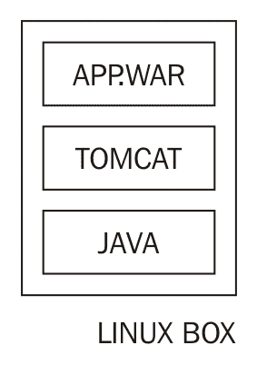

SpringBoot 引入了嵌入式服务器的概念，其中 web 服务器是可部署应用 JAR 的一部分。要使用嵌入式服务器部署应用，如果：；服务器上安装了 Java。下图显示了一个安装示例：

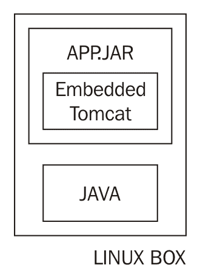

当我们使用 SpringBoot 构建任何应用时，默认情况是构建一个 JAR。对于`spring-boot-starter-web`，默认的嵌入式服务器是 Tomcat。

当我们使用`spring-boot-starter-web`时，可以在 Maven dependencies 部分看到一些与 Tomcat 相关的依赖项。这些依赖项将作为应用部署包的一部分包括：


要部署应用，我们需要构建一个 JAR。我们可以使用；命令如下：

```
mvn clean install
```

下面的屏幕截图显示了创建的 JAR 的结构。

`BOOT-INF\classes`包含`src\main\java`中所有与应用相关的类文件以及`src\main\resources`中的应用属性：

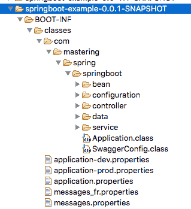

香港的一些图书馆；`BOOT-INF\lib`是；如以下屏幕截图所示：

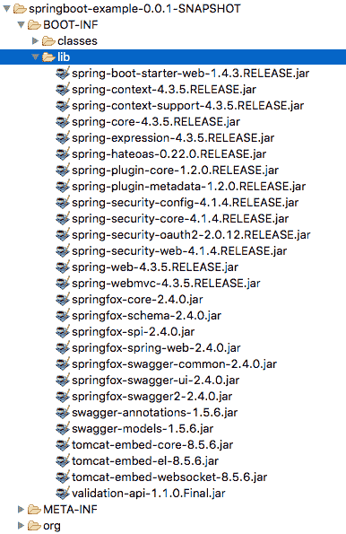

`BOOT-INF\lib`包含应用的所有 JAR 依赖项。其中有三个特定于 Tomcat 的罐子。当应用作为 Java 应用运行时，这三个 JAR 支持启动嵌入式 Tomcat 服务。因此，Java 安装足以在服务器上部署此应用。

# 切换至码头和底拖

以下屏幕截图显示了切换到使用 Jetty embedded server 所需的更改：

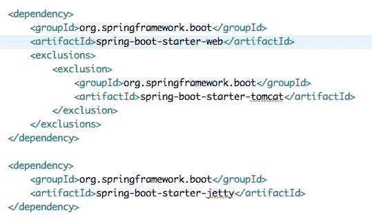

我们需要做的就是在`spring-boot-starter-web`中排除 Tomcat starter 依赖项，并在中包含一个依赖项；`spring-boot-starter-jetty`。

现在，您可以在 Maven dependencies 部分中看到许多 Jetty 依赖项。以下屏幕截图显示了一些与 Jetty 相关的依赖项：

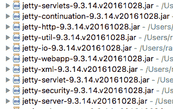

切换到底拖也同样容易。使用`spring-boot-starter-undertow`代替`spring-boot-starter-jetty`：

```
    <dependency>
      <groupId>org.springframework.boot</groupId>
      <artifactId>spring-boot-starter-undertow</artifactId>
   </dependency>
```

# 建立战争档案

SpringBoot 还提供了构建传统 WAR 文件而不是使用 JAR 的选项。

首先，我们需要将`pom.xml`中的包装更改为`WAR`：

```
    <packaging>war</packaging>
```

我们希望防止 tomcat 服务器作为依赖项嵌入到 WAR 文件中；我们可以通过修改；对环境的依赖；嵌入式服务器（以下示例中的 Tomcat）具有提供的作用域。以下代码片段显示了确切的详细信息：

```
    <dependency>
      <groupId>org.springframework.boot</groupId>
      <artifactId>spring-boot-starter-tomcat</artifactId>
      <scope>provided</scope>
   </dependency>
```

构建 WAR 文件时，不包括 Tomcat 依赖项。我们可以使用此 WAR 在应用服务器（如 WebSphere 或 Weblogic）或 web 服务器（如 Tomcat）上部署。

# 开发工具

SpringBoot 提供的工具可以改善开发 SpringBoot 应用的体验。其中之一是 SpringBoot 开发工具。

要使用 Spring Boot developer 工具，我们需要包含一个依赖项：

```
    <dependencies>
     <dependency>
       <groupId>org.springframework.boot</groupId>
       <artifactId>spring-boot-devtools</artifactId>
       <optional>true</optional>
     </dependency>
   </dependencies>
```

默认情况下，SpringBootDeveloper 工具禁用视图模板和静态文件的缓存。这使开发人员能够在做出更改后立即看到这些更改。

另一个重要特性是当类路径中的任何文件发生更改时自动重新启动。因此，应用会在以下情况下自动重新启动：

*   当我们更改控制器或服务类时
*   当我们更改属性文件时

Spring Boot developer 工具的优点如下：

*   开发人员不需要每次都停止和启动应用。一旦发生更改，应用将自动重新启动。
*   SpringBootDeveloperTools 中的重启功能是智能的。它只重新加载积极开发的类。它不会重新加载第三方 JAR（使用两个不同的类装入器）。因此，与冷启动应用相比，在应用中发生更改时重新启动要快得多。

# 实时重新加载

另一个有用的 Spring Boot 开发者工具特性是**实时重新加载**。您可以从[下载特定的浏览器插件 http://livereload.com/extensions/](http://livereload.com/extensions/) 。

您可以通过单击中的按钮启用实时重新加载；浏览器。Safari 浏览器中的按钮；如下面的屏幕截图所示。它在地址栏旁边的左上角。


如果对浏览器中显示的页面或服务进行了代码更改，则会使用新内容自动刷新。不再需要点击刷新按钮了！

# 弹簧靴执行器

将应用部署到生产环境中时：

*   我们想立即知道某些服务是否出现故障或速度非常慢
*   我们想立即知道是否有任何服务器没有足够的可用空间或内存

这称为**应用监控**。

**弹簧靴执行器**提供了许多生产就绪监控功能。

我们将通过添加一个简单的依赖项来添加 Spring 启动执行器：

```
    <dependencies>
      <dependency>
        <groupId>org.springframework.boot</groupId>
        <artifactId>spring-boot-starter-actuator</artifactId>
     </dependency>
   </dependencies>
```

一旦将执行器添加到应用中，它就会启用多个端点。当我们启动应用时，我们会看到许多添加的新映射。以下屏幕截图显示了从启动日志中提取的这些新映射：


执行器公开多个端点。执行器端点（`http://localhost:8080/application`作为所有其他端点的发现。以下屏幕截图显示了我们执行邮递员请求时的响应：

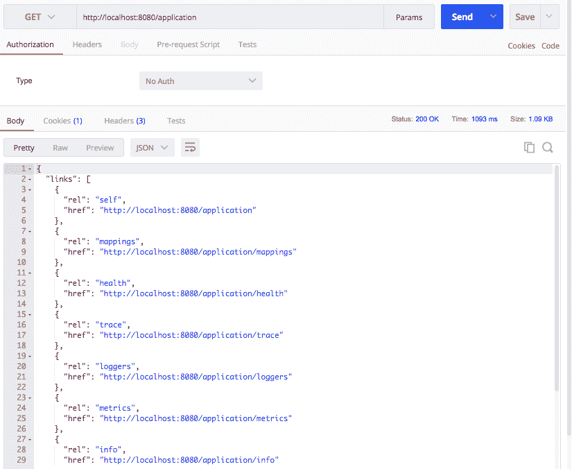

# 哈尔浏览器

其中许多端点公开了大量数据。为了更好地可视化信息，我们将在应用中添加一个**HAL 浏览器**：

```
    <dependency>
      <groupId>org.springframework.data</groupId>
      <artifactId>spring-data-rest-hal-browser</artifactId>
    </dependency>
```

SpringBootActuator 围绕从 SpringBoot 应用和环境捕获的所有数据公开 RESTAPI。HAL 浏览器支持围绕弹簧启动执行器 API 的可视化表示：

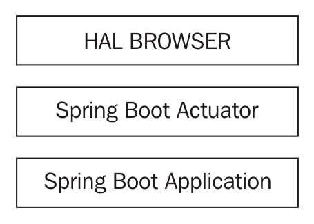

当我们发射时；`http://localhost:8080/application`；在浏览器中，我们可以看到执行器公开的所有 URL。

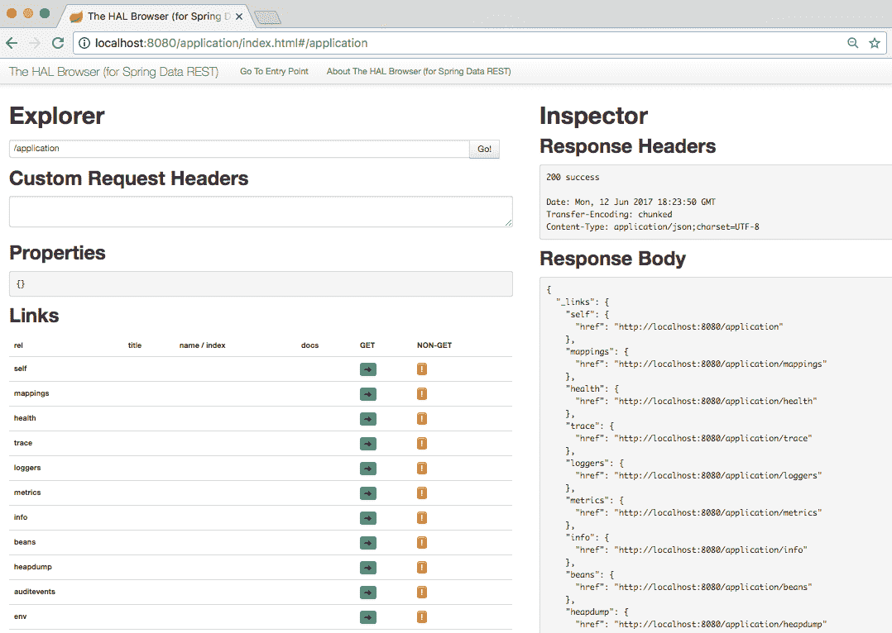

让我们通过 HAL 浏览器浏览执行器作为不同端点的一部分公开的所有信息。

# 配置属性

`configprops`端点提供有关可通过应用属性配置的配置选项的信息。它基本上是一个所有`@ConfigurationProperties`的整理列表；以下屏幕截图显示了 HAL 浏览器中的 configprops：

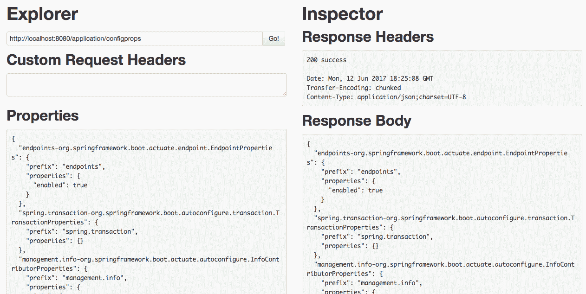

为了说明一个已知的示例，服务响应中的以下部分显示了 Spring MVC 可用的配置选项：

```
"spring.mvc-  org.springframework.boot.autoconfigure.web.WebMvcProperties": {
   "prefix": "spring.mvc",
   "properties": {
                   "dateFormat": null,
                   "servlet": {
                     "loadOnStartup": -1
                  },
   "staticPathPattern": "/**",
   "dispatchOptionsRequest": true,
   "dispatchTraceRequest": false,
   "locale": null,
   "ignoreDefaultModelOnRedirect": true,
   "logResolvedException": true,
   "async": {
              "requestTimeout": null
            },
   "messageCodesResolverFormat": null,
   "mediaTypes": {},
   "view": {
             "prefix": null,
             "suffix": null
           },
   "localeResolver": "ACCEPT_HEADER",
   "throwExceptionIfNoHandlerFound": false
    }
 }
```

为了提供 SpringMVC 的配置，我们将前缀与属性中的路径相结合。例如，要配置`loadOnStartup`，我们使用名为`spring.mvc.servlet.loadOnStartup`的属性。

# 环境详情

**环境；**（**env**端点提供操作系统、JVM 的相关信息；安装、类路径、系统环境变量，以及各种配置的值；应用属性文件。以下屏幕截图显示了 HAL 浏览器中的环境端点：

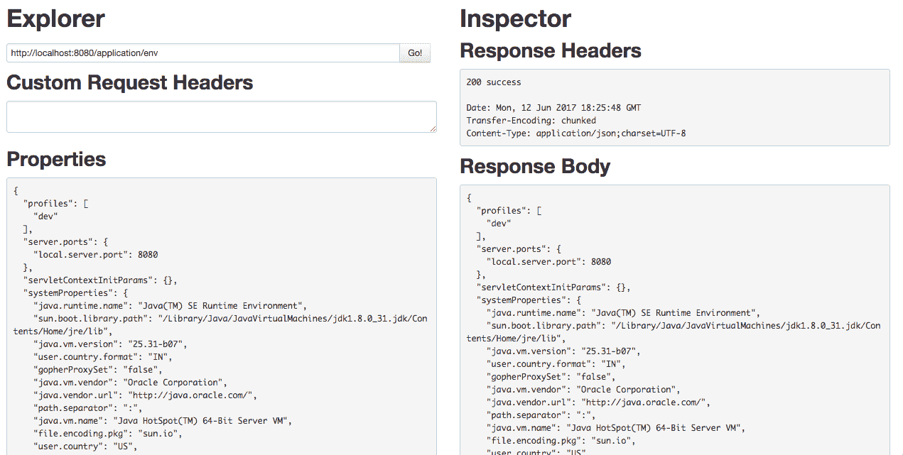

此处显示了来自`/application/env`服务响应的摘录。它显示了一些系统详细信息以及应用配置的详细信息：

```
"systemEnvironment": {
    "JAVA_MAIN_CLASS_13377": "com.mastering.spring.springboot.Application",
    "PATH": "/usr/bin:/bin:/usr/sbin:/sbin",
    "SHELL": "/bin/bash",
    "JAVA_STARTED_ON_FIRST_THREAD_13019": "1",
    "APP_ICON_13041": "../Resources/Eclipse.icns",
    "USER": "rangaraokaranam",
    "TMPDIR": "/var/folders/y_/x4jdvdkx7w94q5qsh745gzz00000gn/T/",
    "SSH_AUTH_SOCK": "/private/tmp/com.apple.launchd.IcESePQCLV/Listeners",
    "XPC_FLAGS": "0x0",
    "JAVA_STARTED_ON_FIRST_THREAD_13041": "1",
    "APP_ICON_11624": "../Resources/Eclipse.icns",
    "LOGNAME": "rangaraokaranam",
    "XPC_SERVICE_NAME": "0",
    "HOME": "/Users/rangaraokaranam"
  },
  "applicationConfig: [classpath:/application-prod.properties]": {
    "application.service1Timeout": "250",
    "application.service1Url": "http://abc-    prod.service.com/somethingelse",
    "application.enableSwitchForService1": "false"
  },
```

# 健康

运行状况服务提供磁盘空间和应用状态的详细信息。以下屏幕截图显示了从 HAL 浏览器执行的服务：

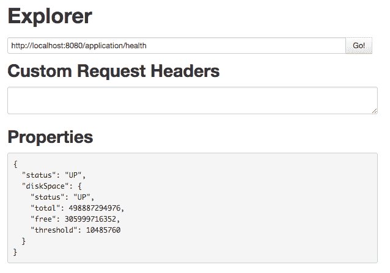

# 映射

映射端点提供信息；关于从应用公开的不同服务端点：

*   URI
*   请求方法
*   豆
*   公开服务的控制器方法

映射提供；所有`@RequestMapping`路径的整理列表。此处显示了`/application/mappings`端点响应的摘录；我们可以看到本书前面创建的不同控制器方法的映射：

```
"{[/welcome-internationalized],methods=[GET]}": {
   "bean": "requestMappingHandlerMapping",
   "method": "public java.lang.String 
    com.mastering.spring.springboot.controller.
    BasicController.msg(java.uti l.Locale)"
 },
 "{[/welcome],methods=[GET]}": {
    "bean": "requestMappingHandlerMapping",
    "method": "public java.lang.String 
     com.mastering.spring.springboot.controller.
     BasicController.welcome()"
 },
 "{[/welcome-with-object],methods=[GET]}": {
     "bean": "requestMappingHandlerMapping",
     "method": "public com.mastering.spring.springboot.
      bean.WelcomeBeancom.mastering.spring.springboot.
      controller.BasicController.welcomeWithObject()"
 },
 "{[/welcome-with-parameter/name/{name}],methods=[GET]}": {
      "bean": "requestMappingHandlerMapping",
      "method": "public 
       com.mastering.spring.springboot.bean.WelcomeBean   
       com.mastering.spring.springboot.controller.
       BasicController.welcomeWithParameter(java.lang.String)"
 },
 "{[/users/{name}/todos],methods=[POST]}": {
       "bean": "requestMappingHandlerMapping",
       "method": "org.springframework.http.ResponseEntity<?>    
        com.mastering.spring.springboot.controller.
        TodoController.add(java.lang.String,com.mastering.spring.
        springboot.bean.Todo)"
  },
 "{[/users/{name}/todos],methods=[GET]}": {
        "bean": "requestMappingHandlerMapping",
        "method": "public java.util.List<com.mastering.spring.
         springboot.bean.Todo> 
         com.mastering.spring.springboot.controller.
         TodoController.retrieveTodos(java.lang.String)"
 },
 "{[/users/{name}/todos/{id}],methods=[GET]}": {
        "bean": "requestMappingHandlerMapping",
        "method": "public 
         org.springframework.hateoas.Resource<com.mastering.
         spring.springboot.bean.Todo>  
         com.mastering.spring.springboot.controller.
         TodoController.retrieveTodo(java.lang.String,int)"
 },
```

# 豆

bean 端点提供了有关加载到 Spring 上下文中的 bean 的详细信息。这在调试与 Spring 上下文相关的任何问题时都很有用。

`/application/beans`终点响应的摘录如下所示：

```
  {
     "bean": "basicController",
     "aliases": [],
     "scope": "singleton",
     "type": "com.mastering.spring.springboot.
      controller.BasicController",
     "resource": "file [/in28Minutes/Workspaces/
      SpringTutorial/mastering-spring-chapter-5-6-  
      7/target/classes/com/mastering/spring/springboot/
      controller/BasicController.class]",
      "dependencies": [
                     "messageSource"
                    ]
   },
   {
      "bean": "todoController",
      "aliases": [],
      "scope": "singleton",
      "type": "com.mastering.spring.springboot.
       controller.TodoController",
       "resource": "file [/in28Minutes/Workspaces/SpringTutorial/
       mastering-spring-chapter-5-6-
       7/target/classes/com/mastering/spring/
       springboot/controller/TodoController.class]",
       "dependencies": [
                      "todoService"
                     ]
    }
```

它显示了两个 bean 的详细信息：`basicController`和`todoController`。你可以看到；以下是所有 bean 的详细信息：

*   bean 的名称及其别名
*   bean 的范围
*   豆子的类型
*   创建此 bean 的类的确切位置
*   bean 的依赖关系

# 韵律学

metrics endpoint 显示了有关以下方面的一些重要指标：

*   服务器—释放内存、处理器、正常运行时间等
*   JVM——关于虚拟机的详细信息；堆、线程、垃圾收集、会话等
*   应用服务提供的响应

从植物中提取的提取物；委员会的答复；`/application/metrics`终点如下图所示：

```
{
 "mem": 481449,
 "mem.free": 178878,
 "processors": 4,
 "instance.uptime": 1853761,
 "uptime": 1863728,
 "systemload.average": 2.3349609375,
 "heap.committed": 413696,
 "heap.init": 65536,
 "heap.used": 234817,
 "heap": 932352,
 "nonheap.committed": 69248,
 "nonheap.init": 2496,
 "nonheap.used": 67754,
 "nonheap": 0,
 "threads.peak": 23,
 "threads.daemon": 21,
 "threads.totalStarted": 30,
 "threads": 23,
 "classes": 8077,
 "classes.loaded": 8078,
 "classes.unloaded": 1,
 "gc.ps_scavenge.count": 15,
 "gc.ps_scavenge.time": 242,
 "gc.ps_marksweep.count": 3,
 "gc.ps_marksweep.time": 543,
 "httpsessions.max": -1,
 "httpsessions.active": 0,
 "gauge.response.actuator": 8,
 "gauge.response.mappings": 12,
 "gauge.response.beans": 83,
 "gauge.response.health": 14,
 "gauge.response.root": 9,
 "gauge.response.heapdump": 4694,
 "gauge.response.env": 6,
 "gauge.response.profile": 12,
 "gauge.response.browser.star-star": 10,
 "gauge.response.actuator.root": 2,
 "gauge.response.configprops": 272,
 "gauge.response.actuator.star-star": 13,
 "counter.status.200.profile": 1,
 "counter.status.200.actuator": 8,
 "counter.status.200.mappings": 1,
 "counter.status.200.root": 5,
 "counter.status.200.configprops": 1,
 "counter.status.404.actuator.star-star": 3,
 "counter.status.200.heapdump": 1,
 "counter.status.200.health": 1,
 "counter.status.304.browser.star-star": 132,
 "counter.status.302.actuator.root": 4,
 "counter.status.200.browser.star-star": 37,
 "counter.status.200.env": 2,
 "counter.status.302.root": 5,
 "counter.status.200.beans": 1,
 "counter.status.200.actuator.star-star": 210,
 "counter.status.302.actuator": 1
 }
```

# 自动配置

自动配置是 Spring Boot 最重要的功能之一。自动配置端点（`/application/autoconfig`）公开了与自动配置相关的详细信息。它显示正匹配和负匹配，并详细说明特定自动配置成功或失败的原因。

以下摘录显示了响应中的一些积极匹配：

```
"positiveMatches": {
  "AuditAutoConfiguration#auditListener": [
   {
     "condition": "OnBeanCondition",
     "message": "@ConditionalOnMissingBean (types:     
      org.springframework.boot.actuate.audit.
      listener.AbstractAuditListener; SearchStrategy: all) did not find 
      any beans"
   }
 ],
 "AuditAutoConfiguration#authenticationAuditListener": [
 {
   "condition": "OnClassCondition",
   "message": "@ConditionalOnClass found required class
   'org.springframework.security.authentication.
   event.AbstractAuthenticationEvent'"
 },
```

以下摘录显示了一些负面影响；响应中的匹配项：

```
"negativeMatches": {
  "CacheStatisticsAutoConfiguration.
   CaffeineCacheStatisticsProviderConfiguration": [
 {
   "condition": "OnClassCondition",
   "message": "@ConditionalOnClass did not find required class  
   'com.github.benmanes.caffeine.cache.Caffeine'"
 }
 ],
   "CacheStatisticsAutoConfiguration.
   EhCacheCacheStatisticsProviderConfiguration": [
 {
   "condition": "OnClassCondition",
   "message": "@ConditionalOnClass did not find required classes
   'net.sf.ehcache.Ehcache',   
   'net.sf.ehcache.statistics.StatisticsGateway'"
 }
 ],
```

所有这些细节对于调试自动配置非常有用。

# 调试

调试问题时，执行器的三个端点很有用：

*   `/application/heapdump`：提供堆转储
*   `/application/trace`：提供应用服务的最后几个请求的跟踪
*   `/application/dump`：提供线程转储

# 部署；云计算应用

Spring Boot 非常支持最流行的云**平台即服务**（**PaaS**提供商。

以下是一些受欢迎的方案：

*   云铸造
*   赫罗库
*   OpenShift
*   **亚马逊网络服务****AWS**

在本节中，我们将重点介绍如何将应用部署到 CloudFoundry。

# 云铸造

CloudFoundry Java buildpack 对 Spring 启动有极好的支持。我们可以部署基于 JAR 的独立应用以及传统的 JavaEEWAR 应用。

Cloud Foundry 提供了一个 Maven 插件来部署应用：

```
<build>
   <plugins>
      <plugin>
         <groupId>org.cloudfoundry</groupId>
         <artifactId>cf-maven-plugin</artifactId>
         <version>1.1.2</version>
      </plugin>
   </plugins>
</build>
```

在部署应用之前，我们需要为应用配置一个目标和一个空间来部署应用。

以下是所涉及的步骤：

1.  我们需要在以下位置创建一个关键的云铸造帐户：；[https://account.run.pivotal.io/sign-up](https://account.run.pivotal.io/sign-up) 。
2.  一旦我们有了账户，我们就可以在[登录 https://run.pivotal.io](https://run.pivotal.io) 创造组织和空间。根据需要准备好组织和空间详细信息，以便部署应用。

我们可以使用`org`和`space`的配置更新插件：

```
<build>
   <plugins>
      <plugin>
         <groupId>org.cloudfoundry</groupId>
         <artifactId>cf-maven-plugin</artifactId>
         <version>1.1.2</version>
         <configuration>
            <target>http://api.run.pivotal.io</target>
            <org>in28minutes</org>
            <space>development</space>
            <memory>512</memory>
            <env>
               <ENV-VAR-NAME>prod</ENV-VAR-NAME>
            </env>
         </configuration>
      </plugin>
   </plugins>
</build>
```

我们需要在命令提示符或终端上使用 Maven 插件登录到 Cloud Foundry：

```
mvn cf:login -Dcf.username=<<YOUR-USER-ID>> -Dcf.password=<<YOUR-PASSWORD>>
```

如果一切都成功，您将看到一条消息，如下所示：

```
[INFO] ------------------------------------------------------------------
 [INFO] Building Your First Spring Boot Example 0.0.1-SNAPSHOT
 [INFO] -----------------------------------------------------------------
 [INFO]
 [INFO] --- cf-maven-plugin:1.1.2:login (default-cli) @ springboot-for-beginners-example ---
 [INFO] Authentication successful
 [INFO] -----------------------------------------------------------------
 [INFO] BUILD SUCCESS
 [INFO] -----------------------------------------------------------------
 [INFO] Total time: 14.897 s
 [INFO] Finished at: 2017-02-05T16:49:52+05:30
 [INFO] Final Memory: 22M/101M
 [INFO] -----------------------------------------------------------------
```

登录后，您可以将应用推送到 Cloud Foundry：

```
mvn cf:push
```

执行命令后，Maven 将编译、运行测试、构建应用 JAR 或 WAR，然后将其部署到云：

```
[INFO] Building jar: /in28Minutes/Workspaces/SpringTutorial/springboot-for-beginners-example-rest-service/target/springboot-for-beginners-example-0.0.1-SNAPSHOT.jar
 [INFO]
 [INFO] --- spring-boot-maven-plugin:1.4.0.RELEASE:repackage (default) @ springboot-for-beginners-example ---
 [INFO]
 [INFO] <<< cf-maven-plugin:1.1.2:push (default-cli) < package @ springboot-for-beginners-example <<<
 [INFO]
 [INFO] --- cf-maven-plugin:1.1.2:push (default-cli) @ springboot-for-beginners-example ---
 [INFO] Creating application 'springboot-for-beginners-example'
 [INFO] Uploading '/in28Minutes/Workspaces/SpringTutorial/springboot-for-beginners-example-rest-service/target/springboot-for-beginners-example-0.0.1-SNAPSHOT.jar'
 [INFO] Starting application
 [INFO] Checking status of application 'springboot-for-beginners-example'
 [INFO] 1 of 1 instances running (1 running)
 [INFO] Application 'springboot-for-beginners-example' is available at 'http://springboot-for-beginners-example.cfapps.io'
 [INFO] ----------------------------------------------------------------- [INFO] BUILD SUCCESS
 [INFO] ----------------------------------------------------------------- [INFO] Total time: 02:21 min
 [INFO] Finished at: 2017-02-05T16:54:55+05:30
 [INFO] Final Memory: 29M/102M
 [INFO] -----------------------------------------------------------------
```

一旦应用启动并在云上运行，我们可以使用日志中的 URL 启动应用：[http://springboot-for-beginners-example.cfapps.io](http://springboot-for-beginners-example.cfapps.io) 。

您可以在[上找到关于 Cloud Foundry 的 Java 构建包的更多信息 https://docs.run.pivotal.io/buildpacks/java/build-tool-int.html#maven](https://docs.run.pivotal.io/buildpacks/java/build-tool-int.html#maven) 。

# 总结

Spring Boot 使开发基于 Spring 的应用变得简单。它使我们能够非常快速地创建生产就绪的应用。

在这一章中，我们理解了；Spring Boot 提供的不同外部配置选项。我们研究了嵌入式服务器，并将测试应用部署到；PaaS 云平台——云铸造；我们探讨了如何使用 Spring Boot Actuator 监控我们在生产中的应用。最后，我们看了一下；使开发人员更高效的特性--SpringBoot开发人员工具和实时重新加载。

在下一章中，我们将把注意力转移到数据上。我们将介绍 Spring 数据，并了解它如何使与 JPA 的集成和提供 Rest 服务变得更容易。