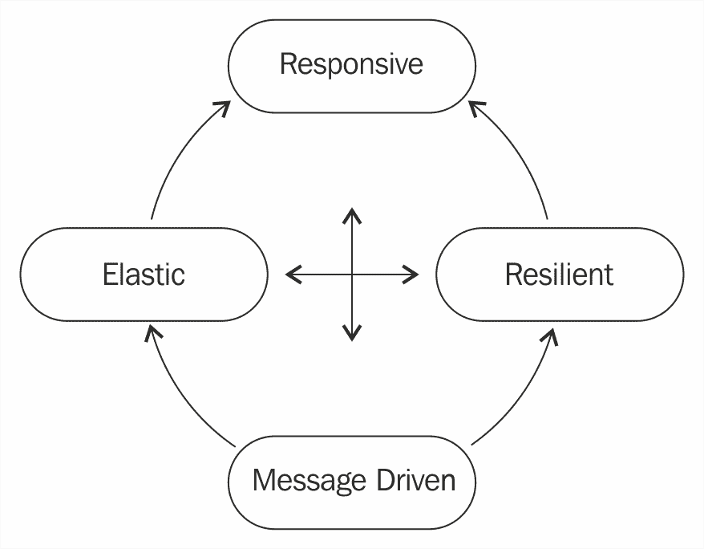
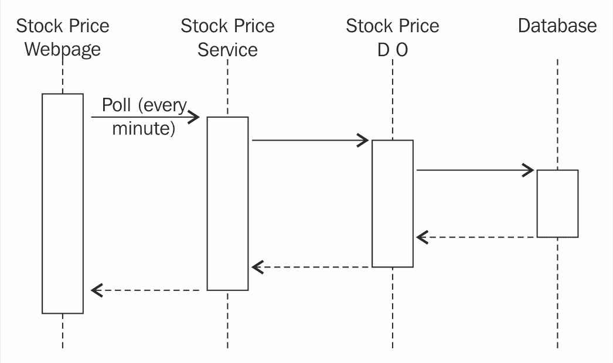
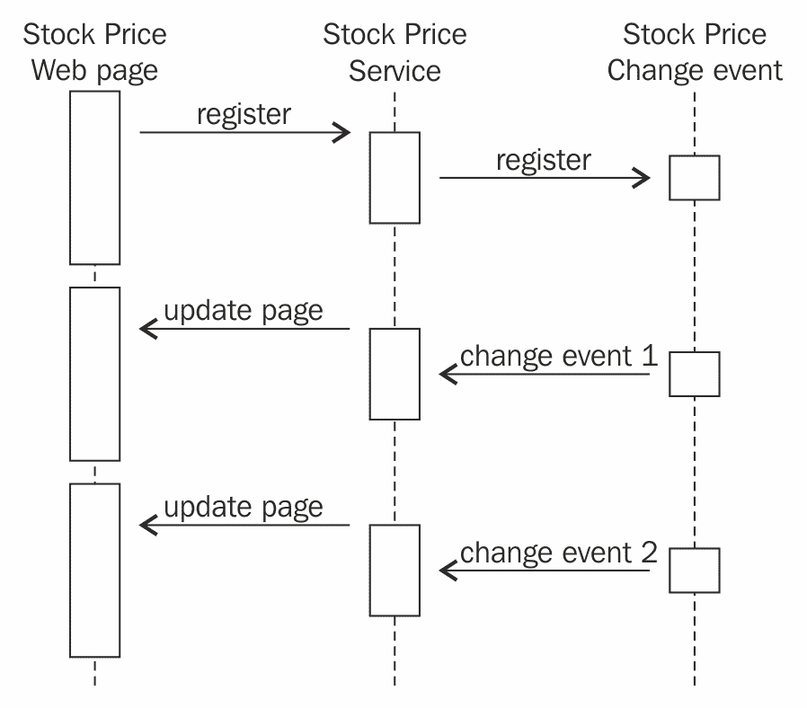
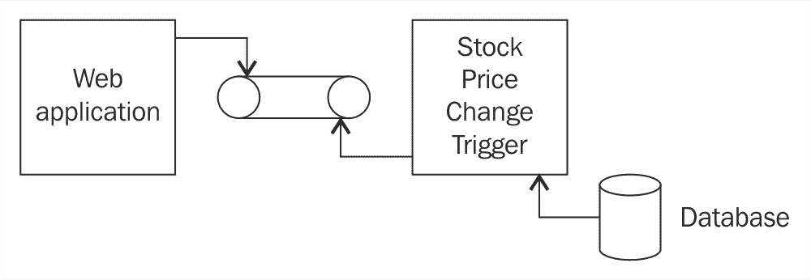
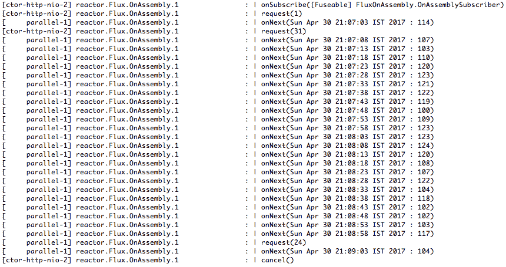

# 十一、反应式编程

在前一章中，我们讨论了使用 SpringCloud 数据流使用微服务实现典型的数据流用例。

函数式编程标志着从传统的命令式到更具声明性的编程风格的转变。反应式编程建立在函数式编程之上，以提供一种替代样式。

在本章中，我们将讨论反应式编程的基础知识。

微服务体系结构促进了基于消息的通信。反应式编程的一个重要原则是围绕事件（或消息）构建应用。我们需要回答的一些重要问题包括：

*   什么是反应式编程？
*   典型的用例是什么？
*   Java 为它提供了什么样的支持？
*   SpringWebFlux 中的反应性功能是什么？

# 反应宣言

几年前的大多数应用都具有以下优点：

*   多秒响应时间
*   多小时离线维护
*   较小的数据量

时代变了。新的设备（手机、平板电脑等）和更新的方法（基于云的）已经出现。在当今世界，我们谈论的是：

*   亚秒响应时间
*   100%可用性
*   数据量呈指数级增长

在过去几年中出现了不同的方法来应对这些新出现的挑战。虽然反应式编程并不是一种新现象，但它是成功应对这些挑战的方法之一。

反应宣言（[http://www.reactivemanifesto.org](http://www.reactivemanifesto.org) 旨在捕捉共同主题。

我们认为需要一种连贯的系统架构方法，并且我们相信所有必要的方面都已经被单独认可：我们希望系统具有响应性、弹性、弹性和消息驱动性。我们称之为反应系统。

作为反应式系统构建的系统更加灵活、松散耦合和可伸缩。这使得它们更容易发展，也更容易改变。他们明显更能容忍失败，当失败发生时，他们会优雅地面对失败，而不是灾难。反应式系统反应灵敏，为用户提供有效的互动反馈。

尽管《反应性宣言》清楚地说明了反应性系统的特征，但对于反应性系统是如何构建的却不那么清楚。

# 无功系统的特性

下图显示了无功系统的重要特征：



重要特征如下：

*   **响应**：系统及时响应用户。设置了明确的响应时间要求，并且系统在所有情况下都满足这些要求。
*   **弹性**：分布式系统使用多个组件构建。这些组件中的任何一个都可能发生故障。反应式系统的设计应能将故障控制在局部空间内，例如每个组件内。这可以防止整个系统在发生局部故障时停机。
*   **弹性**：反应系统在不同负载下保持响应。当负载较重时，这些系统可以添加额外的资源，同时在负载下降时释放这些资源。弹性是通过使用商品硬件和软件实现的。
*   **消息驱动**：被动系统由消息（或事件）驱动。这确保了组件之间的低耦合。这保证了系统的不同组件可以独立缩放。使用非阻塞通信可确保线程在较短时间内处于活动状态。

反应性系统对不同种类的刺激有反应。以下是一些例子：

*   **响应事件**：基于消息传递构建，响应系统快速响应事件。
*   **负载反应**：反应系统在不同负载下保持响应。它们在高负载下使用更多资源，在低负载下释放资源。
*   **对故障做出反应**：反应式系统能够优雅地处理故障。无功系统的组件用于定位故障。外部组件用于监控组件的可用性，并在需要时能够复制组件。
*   **对用户做出反应**：反应式系统对用户做出反应。当消费者未订阅特定事件时，它们不会浪费时间执行附加处理。

# 反应性用例-股票价格页面

虽然反应性宣言帮助我们理解反应性系统的特征，但它并没有真正帮助我们理解反应性系统是如何构建的。为了理解这一点，我们将考虑传统的方法来构建一个简单的用例，并将其与反应式方法进行比较。

我们想要构建的用例是一个显示特定股票价格的股票价格页面。只要页面保持打开状态，我们就要在页面上更新股票的最新价格。

# 传统方法

传统的方法使用轮询来检查股票价格是否发生了变化。以下序列图显示了构建此类用例的传统方法：



呈现页面后，它会定期向股票价格服务发送 AJAX 请求，以获取最新价格。无论股票价格是否发生变化，都必须进行这些调用，因为网页不知道股票价格的变化。

# 反应式方法

反应式方法涉及连接所涉及的不同组件，以便能够在事件发生时作出反应。

加载股票价格网页时，该网页会注册来自股票价格服务的事件。当股票价格变化事件发生时，会触发一个事件。最新的股票价格在网页上更新。以下序列图显示了构建股价页面的反应式方法：



反应式方法通常包括三个步骤：

1.  订阅活动。
2.  事件的发生。
3.  注销。

最初加载股票价格网页时，它将订阅股票价格更改事件。您的订阅方式因您使用的反应式框架和/或消息代理（如果有）而异。

当特定股票的股价变化事件发生时，将为该事件的所有订阅者触发一个新事件。侦听器确保网页更新为最新的股票价格。

一旦关闭（或刷新）网页，订阅者就会发出注销请求。

# 传统方法与反应式方法的比较

传统的方法非常简单。反应式方法需要实现反应式订阅和事件链。如果事件链涉及一个消息代理，那么它将变得更加复杂。

在传统的方法中，我们调查变化。这意味着，无论股价是否发生变化，每分钟（或指定的时间间隔）都会触发整个序列。在反应式方法中，一旦我们注册了事件，只有当股票价格发生变化时才会触发序列。

传统方法中线程的生命周期较长。线程使用的所有资源都会被锁定更长的时间。考虑到一台服务器同时为多个请求提供服务的总体情况，对线程及其资源的争夺将会更多。在反应式方法中，线程的生存时间很短，因此对资源的争用较少。

传统方法中的扩展包括扩展数据库和创建更多 web 服务器。由于线程的生命周期很短，相同的基础结构可以通过反应式方法处理更多的用户。虽然被动方法具有传统方法的所有扩展选项，但它提供了更多的分布式选项。例如，股票价格变化事件的触发可以通过 MessageBroker 传递给应用，如下图所示：



这意味着 web 应用和股票价格变化触发的应用可以相互独立地伸缩。这为在需要时快速扩展提供了更多选项。

# Java 中的反应式编程

Java8 没有任何内置的对反应式编程的支持。许多框架提供了反应式功能。我们将在后续章节中讨论反应流、反应器和弹簧流量。

# 反应流

反应流是一项倡议，旨在为具有非阻塞背压的异步流处理提供标准。这包括针对运行时环境（JVM 和 JavaScript）以及网络协议的工作。

需要注意的几个重要事项如下：

*   反应流旨在定义一组最小的接口、方法和协议，以支持反应式编程
*   反应流旨在成为一种语言中立的方法，采用 Java（基于 JVM）和 JavaScript 语言实现
*   支持多个传输流（TCP、UDP、HTTP 和 WebSocket）

反应流的 Maven 依赖关系如下所示：

```java
    <dependency>
      <groupId>org.reactivestreams</groupId>
      <artifactId>reactive-streams</artifactId>
      <version>1.0.0</version>
    </dependency>

    <dependency>
      <groupId>org.reactivestreams</groupId>
      <artifactId>reactive-streams-tck</artifactId>
      <version>1.0.0</version>
      <scope>test</scope>
    </dependency>
```

反应流中定义的几个重要接口如下所示：

```java
    public interface Subscriber<T> {
      public void onSubscribe(Subscription s);
      public void onNext(T t);
      public void onError(Throwable t);
      public void onComplete();
    }
   public interface Publisher<T> {
     public void subscribe(Subscriber<? super T> s);
   }
   public interface Subscription {
     public void request(long n);
     public void cancel();
  }
```

需要注意的几个重要事项如下：

*   **接口发布者**：`Publisher`提供一个元素流，以响应从其订户接收到的请求。发布者可以为任意数量的订阅者提供服务。订户计数可能随时间而变化。
*   **接口用户**：`Subscriber`注册监听事件流。订阅是一个分两步的过程。第一步是调用 Publisher.subscribe（订户）。第二步涉及调用 Subscription.request（long）。一旦这些步骤完成，订户就可以开始使用`onNext(T t)`方法处理通知。`onComplete()`方法发出通知结束的信号。只要`Subscriber`实例能够处理更多的请求，就可以通过 Subscription.request（long）发出请求信号。
*   **接口订阅**：`Subscription`表示一个`Subscriber`与其`Publisher`之间的链接。用户可以使用`request(long n)`请求更多数据。可以通过`cancel()`方式取消通知订阅。

# 核反应堆

Reactor 是 Spring 关键团队的一个反应框架。它建立在反应流之上。正如我们将在本章后面讨论的，SpringFramework5.0 使用 Reactor 框架来启用反应式 web 特性。

反应器的相关性如下所示：

```java
    <dependency>
      <groupId>io.projectreactor</groupId>
      <artifactId>reactor-core</artifactId>
      <version>3.0.6.RELEASE</version>
   </dependency>
   <dependency>
     <groupId>io.projectreactor.addons</groupId>
     <artifactId>reactor-test</artifactId>
     <version>3.0.6.RELEASE</version>
  </dependency>
```

反应器在反应流引入的`Subscriber`、`Consumer`和`Subscriptions`术语的基础上增加了两个重要的内容。

*   **通量**：通量表示发出 0 到*n*元素的反应流
*   **Mono**：Mono 表示一种无元素或一种元素的反应流

在随后的示例中，我们将创建存根 Mono 和 Flux 对象，这些对象将预先配置为以特定的间隔发射元素。我们将创建消费者（或观察者）来倾听这些事件并作出反应。

# 单声道

创建单声道非常简单。以下单声道在延迟 5 秒后发出一个元素。

```java
   Mono<String> stubMonoWithADelay = 
   Mono.just("Ranga").delayElement(Duration.ofSeconds(5));
```

我们希望从 Mono 监听事件并将其记录到控制台。我们可以使用此处指定的语句执行此操作：

```java
    stubMonoWithADelay.subscribe(System.out::println);
```

但是，如果您在`Test`注释中使用前面的两条语句运行程序，如以下代码所示，您将看到控制台没有打印任何内容：

```java
    @Test
    public void monoExample() throws InterruptedException {
      Mono<String> stubMonoWithADelay =   
      Mono.just("Ranga").delayElement(Duration.ofSeconds(5));
      stubMonoWithADelay.subscribe(System.out::println);
     }
```

由于`Test`执行在 5 秒后 Mono 发出元素之前结束，因此没有向控制台打印任何内容。为了防止出现这种情况，让我们使用`Thread.sleep`延迟`Test`的执行：

```java
    @Test
    public void monoExample() throws InterruptedException {
      Mono<String> stubMonoWithADelay = 
      Mono.just("Ranga").delayElement(Duration.ofSeconds(5));
      stubMonoWithADelay.subscribe(System.out::println);
      Thread.sleep(10000);
    }
```

当我们使用`stubMonoWithADelay.subscribe(System.out::println)`创建订户时，我们使用的是 Java 8 中引入的函数式编程特性。`System.out::println`是一个方法定义。我们将方法定义作为参数传递给方法。

这是可能的，因为有一个名为`Consumer`的特定功能接口。功能接口是只有一种方法的接口。`Consumer`函数接口用于定义接受单个输入参数且不返回结果的操作。`Consumer`接口的概要如以下代码片段所示：

```java
     @FunctionalInterface
     public interface Consumer<T> {
       void accept(T t); 
     }
```

除了使用 lambda 表达式，我们还可以显式定义`Consumer`。以下代码段显示了重要的详细信息：

```java
    class SystemOutConsumer implements Consumer<String> {
      @Override
      public void accept(String t) {
        System.out.println("Received " + t + " at " + new Date());
      }
    }
    @Test
    public void monoExample() throws InterruptedException {
      Mono<String> stubMonoWithADelay = 
      Mono.just("Ranga").delayElement(Duration.ofSeconds(5));
      stubMonoWithADelay.subscribe(new SystemOutConsumer());
      Thread.sleep(10000);
     }
```

需要注意的几个重要事项如下：

*   `class SystemOutConsumer implements Consumer<String>`：我们创建了一个`SystemOutConsumer`类，实现了功能接口`Consumer`。输入类型为`String`。
*   `public void accept(String t)`：我们定义了 accept 方法，将字符串的内容打印到控制台。
*   `stubMonoWithADelay.subscribe(new SystemOutConsumer())`：我们创建一个`SystemOutConsumer`实例来订阅事件。

输出如以下屏幕截图所示：


我们可以让多个订阅者监听来自 Mono 或 Flux 的事件。以下代码段显示了如何创建其他订阅服务器：

```java
    class WelcomeConsumer implements Consumer<String> {
      @Override
      public void accept(String t) {
        System.out.println("Welcome " + t);
      } 
    }
    @Test
    public void monoExample() throws InterruptedException {
      Mono<String> stubMonoWithADelay = 
      Mono.just("Ranga").delayElement(Duration.ofSeconds(5));
      stubMonoWithADelay.subscribe(new SystemOutConsumer());
      stubMonoWithADelay.subscribe(new WelcomeConsumer());
      Thread.sleep(10000);
    }
```

需要注意的几个重要事项如下：

*   `class WelcomeConsumer implements Consumer<String>`：我们正在创建另一个消费类`WelcomeConsumer`
*   `stubMonoWithADelay.subscribe(new WelcomeConsumer())`：我们正在添加一个`WelcomeConsumer`实例作为 Mono 事件的订户

输出如以下屏幕截图所示：


# 通量

通量表示发出 0 到*n*元素的反应流。以下代码段显示了一个简单的通量示例：

```java
    @Test
    public void simpleFluxStream() {
      Flux<String> stubFluxStream = Flux.just("Jane", "Joe");
      stubFluxStream.subscribe(new SystemOutConsumer());  
    }
```

需要注意的几个重要事项如下：

*   `Flux<String> stubFluxStream = Flux.just("Jane", "Joe")`：我们正在使用`Flux.just`方法创建通量。它可以创建带有硬编码元素的简单流。
*   `stubFluxStream.subscribe(new SystemOutConsumer())`：我们正在 Flux 上注册`SystemOutConsumer`的一个实例作为订户。

输出如以下屏幕截图所示：


以下代码段显示了具有两个订阅者的流量的更复杂示例：

```java
    private static List<String> streamOfNames = 
    Arrays.asList("Ranga", "Adam", "Joe", "Doe", "Jane");
    @Test
    public void fluxStreamWithDelay() throws InterruptedException {
      Flux<String> stubFluxWithNames = 
      Flux.fromIterable(streamOfNames)
     .delayElements(Duration.ofMillis(1000));
      stubFluxWithNames.subscribe(new SystemOutConsumer());
      stubFluxWithNames.subscribe(new WelcomeConsumer());
      Thread.sleep(10000);
    }
```

需要注意的几个重要事项如下：

*   `Flux.fromIterable(streamOfNames).delayElements(Duration.ofMillis(1000))`：从指定的字符串列表创建通量。元素以指定的 1000 毫秒延迟发射。
*   `stubFluxWithNames.subscribe(new SystemOutConsumer())`和`stubFluxWithNames.subscribe(new WelcomeConsumer())`：我们在 Flux 上注册了两个用户。
*   `Thread.sleep(10000)`：与第一个单声道示例类似，我们引入了睡眠，使程序等待，直到通量中的所有元素都发射出来。

输出如以下屏幕截图所示：


# 弹簧网反应式

**SpringWebreactive**是 SpringFramework 5 的重要新特性之一。它为 web 应用带来了反应能力。

SpringWebreactive 基于与 SpringMVC 相同的基本编程模型。下表提供了两个框架的快速比较：

| . | **弹簧 MVC** | **弹簧腹板反应** |
| **使用** | 传统 web 应用 | 反应式 web 应用 |
| **编程模型** | `@Controller`带`@RequestMapping` | 与 Spring MVC 相同 |
| **基础 API** | Servlet API | 反应式 HTTP |
| **在**上运行 | Servlet 容器 | Servlet 容器（>3.1）、Netty 和 Undertow |

在接下来的步骤中，我们希望为 SpringWebResponsive 实现一个简单的用例。

以下是涉及的重要步骤：

*   使用 Spring 初始值设定项创建项目
*   创建返回事件流（流量）的反应式控制器
*   创建 HTML 视图

# 使用 Spring 初始值设定项创建项目

让我们从使用 Spring 初始化器（[创建一个新项目开始 http://start.spring.io/](http://start.spring.io/) ）。以下屏幕截图显示了详细信息：


需要注意的几点如下：

*   组：`com.mastering.spring.reactive`
*   神器：`spring-reactive-example`
*   依赖项：`ReactiveWeb`（用于构建反应式 web 应用）和`DevTools`（用于在应用代码更改时自动重新加载）

下载项目并将其作为 Maven 项目导入 IDE。

`pom.xml`文件中的重要依赖项如下所示：

```java
    <dependency>
      <groupId>org.springframework.boot</groupId>
      <artifactId>spring-boot-starter</artifactId>
    </dependency>

    <dependency>
      <groupId>org.springframework.boot</groupId>
      <artifactId>spring-boot-devtools</artifactId>
   </dependency>

   <dependency>
     <groupId>org.springframework.boot</groupId>
     <artifactId>spring-boot-starter-webflux</artifactId>
   </dependency>

   <dependency>
     <groupId>org.springframework.boot</groupId>
     <artifactId>spring-boot-starter-test</artifactId>
     <scope>test</scope>
   </dependency>
```

`spring-boot-starter-webflux`依赖是 SpringWeb 最重要的依赖。快速查看`spring-boot-starter-webflux`的`pom.xml`文件，可以发现 Spring Reactive 的构建块——`spring-webflux`、`spring-web`和`spring-boot-starter-reactor-netty`。

**Netty**是默认的嵌入式反应式服务器。以下代码段显示了依赖项：

```java
    <dependency>
      <groupId>org.springframework.boot</groupId>
      <artifactId>spring-boot-starter</artifactId>
    </dependency>

    <dependency>
      <groupId>org.springframework.boot</groupId>
      <artifactId>spring-boot-starter-reactor-netty</artifactId>
    </dependency>

    <dependency>
      <groupId>com.fasterxml.jackson.core</groupId>
      <artifactId>jackson-databind</artifactId>
    </dependency>

    <dependency>
      <groupId>org.hibernate</groupId>
      <artifactId>hibernate-validator</artifactId>
    </dependency>

    <dependency>
      <groupId>org.springframework</groupId>
      <artifactId>spring-web</artifactId>
    </dependency>

    <dependency>
      <groupId>org.springframework</groupId>
      <artifactId>spring-webflux</artifactId>
    </dependency>
```

# 创建反应式控制器

创建 Spring 反应式控制器与创建 Spring MVC 控制器非常相似。基本结构是相同的：`@RestController`和不同的`@RequestMapping`注释。下面的代码片段显示了一个名为`StockPriceEventController`的简单被动控制器：

```java
    @RestController
    public class StockPriceEventController {
      @GetMapping("/stocks/price/{stockCode}")
      Flux<String> retrieveStockPriceHardcoded
      (@PathVariable("stockCode") String stockCode) {
        return Flux.interval(Duration.ofSeconds(5))
        .map(l -> getCurrentDate() + " : " 
        + getRandomNumber(100, 125))
        .log();
      }
     private String getCurrentDate() {
       return (new Date()).toString();
     }
     private int getRandomNumber(int min, int max) {
       return ThreadLocalRandom.current().nextInt(min, max + 1);
     }
    }
```

需要注意的几个重要事项如下：

*   `@RestController and @GetMapping("/stocks/price/{stockCode}")`：基本构造与 Spring MVC 相同。我们正在创建到指定 URI 的映射。
*   `Flux<String> retrieveStockPriceHardcoded(@PathVariable("stockCode") String stockCode)`：通量表示 0 到*n*元素的流。返回类型`Flux<String>`表示此方法返回代表股票当前价格的值流。
*   `Flux.interval().map(l -> getCurrentDate() + " : " + getRandomNumber(100, 125))`：我们正在创建一个硬编码流量，返回一个随机数流。
*   `Duration.ofSeconds(5)`：流元素每 5 秒返回一次。
*   `Flux.<<****>>.log()`：调用 Flux 上的`log()`方法有助于观察所有反应流信号，并使用记录器支持对其进行跟踪。
*   `private String getCurrentDate()`：以字符串形式返回当前时间。
*   `private int getRandomNumber(int min, int max)`：返回一个介于`min`和`max`之间的随机数。

# 创建 HTML 视图

在前面的步骤中，创建一个反应式控制器，我们将一个流量流映射到`"/stocks/price/{stockCode}"`URL。在这一步中，让我们创建一个视图，在屏幕上显示股票的当前价值。

我们将创建一个简单的静态 HTML 页面（`resources/static/stock-price.html`，其中包含一个按钮，用于开始从流中检索。以下代码段显示了 HTML：

```java
    <p>
      <button id="subscribe-button">Get Latest IBM Price</button>
      <ul id="display"></ul>
    </p>
```

我们希望创建一个 JavaScript 方法来注册流，并将新元素附加到特定的 div 中。下面的代码片段显示了 JavaScript 方法：

```java
    function registerEventSourceAndAddResponseTo(uri, elementId) {
      var stringEvents = document.getElementById(elementId); 
      var stringEventSource = new (uri);
      stringEventSource.onmessage = function(e) {
        var newElement = document.createElement("li");
        newElement.innerHTML = e.data;
        stringEvents.appendChild(newElement);
      }
    }
```

`EventSource`接口用于接收服务器发送的事件。它通过 HTTP 连接到服务器，并以文本/事件流格式接收事件。当它接收到一个元素时，调用`onmessage`方法。

以下代码段显示了为 get latest IBM price 按钮注册 onclick 事件的代码：

```java
    addEvent("click", document.getElementById('subscribe-button'), 
    function() {
            registerEventSourceAndAddResponseTo("/stocks/price/IBM", 
            "display"); 
          }
     );
     function addEvent(evnt, elem, func) {
       if (typeof(EventSource) !== "undefined") {
         elem.addEventListener(evnt,func,false);
       }
       else { // No much to do
         elem[evnt] = func;
       }
    }
```

# 启动 SpringReactiveExample 应用

将应用类`SpringReactiveExampleApplication`作为 Java 应用启动。您在启动日志中看到的最后一条消息是`Netty started on port(s): 8080`。Netty 是 Spring 的默认嵌入式服务器。

以下屏幕截图显示了您导航到`localhost:8080/static/stock-price.html`URL 时的浏览器：


当点击获取最新 IBM 价格按钮时，`EventSource`启动并注册`"/stocks/price/IBM"`中的事件。一旦收到一个元素，它就会显示在屏幕上。

以下屏幕截图显示了收到一些事件后的屏幕。您可以观察到每 5 秒接收一个事件：


下一个屏幕截图显示了浏览器窗口关闭后从日志中提取的内容：



您可以观察一系列`onNext`方法调用，这些调用在元素可用时立即触发。当浏览器窗口关闭时，调用`cancel()`方法终止流。

在本例中，我们创建了一个控制器，该控制器返回一个事件流（如`Flux`）和一个使用`EventSource`注册到事件流的网页。在下一个示例中，让我们来看看将事件流的范围扩展到数据库。

# 反应数据库

所有正常的数据库操作都被阻塞；也就是说，线程等待直到从数据库接收到响应。

为了充分受益于反应式编程，端到端通信必须是反应式的，即基于事件流。

**ReactiveMongo**设计为反应式，避免阻塞操作。所有操作，包括选择、更新或删除，都会立即返回。数据可以使用事件流流入和流出数据库。

在本节中，我们将使用 Spring Boot Reactive MongoDB 启动器创建一个连接 ReactiveMongo 的简单示例。

涉及以下步骤：

1.  集成弹簧引导反应式 MongoDB 启动器。
2.  在库存文档中创建模型对象。
3.  创建`reactiveCrudRepository`。
4.  使用命令行运行程序初始化股票数据。
5.  在 Rest 控制器中创建反应式方法。
6.  更新视图以订阅事件流。

# 集成弹簧引导反应式 MongoDB 启动器

为了连接到 ReactiveMongo 数据库，Spring Boot 提供了一个启动程序项目——Spring Boot Reactive MongoDB starter。让我们将此添加到`pom.xml`文件中：

```java
    <dependency>
      <groupId>org.springframework.boot</groupId>
      <artifactId>spring-boot-starter-data-mongodb-
        reactive</artifactId>
    </dependency>
```

`spring-boot-starter-data-mongodb-reactive`启动器引入了`spring-data-mongodb`、`mongodb-driver-async`和`mongodb-driver-reactivestreams`依赖项。以下代码片段显示了`spring-boot-starter-data-mongodb-reactive`启动器中的重要依赖项：

```java
    <dependency>
      <groupId>org.springframework.data</groupId>
      <artifactId>spring-data-mongodb</artifactId>
      <exclusions>
       <exclusion>
         <groupId>org.mongodb</groupId>
         <artifactId>mongo-java-driver</artifactId>
       </exclusion>
      <exclusion>
        <groupId>org.slf4j</groupId>
        <artifactId>jcl-over-slf4j</artifactId>
      </exclusion>
     </exclusions>
    </dependency>
    <dependency>
     <groupId>org.mongodb</groupId>
     <artifactId>mongodb-driver</artifactId>
    </dependency>
    <dependency>
     <groupId>org.mongodb</groupId>
     <artifactId>mongodb-driver-async</artifactId>
    </dependency>
    <dependency>
     <groupId>org.mongodb</groupId>
     <artifactId>mongodb-driver-reactivestreams</artifactId>
    </dependency>
    <dependency>
     <groupId>io.projectreactor</groupId>
     <artifactId>reactor-core</artifactId>
    </dependency>
```

`EnableReactiveMongoRepositories`注释启用了 ReactiveMongo 功能。下面的代码片段显示它被添加到`SpringReactiveExampleApplication`类中：

```java
    @SpringBootApplication
    @EnableReactiveMongoRepositories
    public class SpringReactiveExampleApplication {
```

# 创建模型对象-库存文档

我们将创建`Stock`文档类，如下代码所示。它包含三个成员变量--`code`、`name`和`description`：

```java
    @Document
    public class Stock {
      private String code;
      private String name;
      private String description;
        //Getters, Setters and Constructor  
    }
```

# 创建一个 reactivecrudepository

传统的 Spring 数据存储库正在阻塞。SpringData 引入了一个新的存储库，用于与反应式数据库交互。下面的代码显示了在`ReactiveCrudRepository`接口中声明的一些重要方法：

```java
    @NoRepositoryBean
    public interface ReactiveCrudRepository<T, ID extends Serializable> 
    extends Repository<T, ID> {
      <S extends T> Mono<S> save(S entity);
      Mono<T> findById(ID id);
      Mono<T> findById(Mono<ID> id);
      Mono<Boolean> existsById(ID id);
      Flux<T> findAll();
      Mono<Long> count();
      Mono<Void> deleteById(ID id);
      Mono<Void> deleteAll();  
     }
```

前面接口中的所有方法都是非阻塞的。它们返回 Mono 或 Flux，可用于在触发事件时检索元素。

我们想为 Stock Document 对象创建一个存储库。下面的代码片段显示了`StockMongoReactiveCrudRepository`的定义。我们将`ReactiveCrudRepository`扩展为`Stock`作为正在管理的文档和`String`类型的密钥：

```java
    public interface StockMongoReactiveCrudRepository 
    extends ReactiveCrudRepository<Stock, String> { 
     }
```

# 使用命令行运行程序初始化股票数据

让我们使用命令行运行程序将一些数据插入到 ReactiveMongo 中。以下片段显示了添加到`SpringReactiveExampleApplication`的详细信息：

```java
    @Bean
    CommandLineRunner initData(
    StockMongoReactiveCrudRepository mongoRepository) {
      return (p) -> {
      mongoRepository.deleteAll().block();
      mongoRepository.save(
      new Stock("IBM", "IBM Corporation", "Desc")).block();
      mongoRepository.save(
      new Stock("GGL", "Google", "Desc")).block();
      mongoRepository.save(
      new Stock("MST", "Microsoft", "Desc")).block();
     };
    }
```

`mongoRepository.save()`方法用于将`Stock`文档保存到 ReactiveMongo。`block()`方法确保在执行下一条语句之前完成保存操作。

# 在 Rest 控制器中创建反应式方法

我们现在可以使用`StockMongoReactiveCrudRepository`添加控制器方法来检索详细信息：

```java
    @RestController
    public class StockPriceEventController {
      private final StockMongoReactiveCrudRepository repository;
      public StockPriceEventController(
      StockMongoReactiveCrudRepository repository) {
        this.repository = repository;
     }

   @GetMapping("/stocks")
   Flux<Stock> list() {
     return this.repository.findAll().log();
   }

   @GetMapping("/stocks/{code}")
   Mono<Stock> findById(@PathVariable("code") String code) {
     return this.repository.findById(code).log();
   }
  }
```

需要注意的几个重要事项如下：

*   `private final StockMongoReactiveCrudRepository repository`：`StockMongoReactiveCrudRepository`使用构造函数注入注入。
*   `@GetMapping("/stocks") Flux<Stock> list()`：公开了一个`GET`方法来检索股票列表。返回一个通量，指示这将是一个股票流。
*   `@GetMapping("/stocks/{code}") Mono<Stock> findById(@PathVariable("code") String code)`：`findById`返回一个 Mono，表示它将返回 0 或 1 个 stock 元素。

# 更新视图以订阅事件流

我们希望使用新按钮更新视图，以触发事件，列出所有股票并显示特定股票的详细信息。下面的代码片段显示了要添加到`resources\static\stock-price.html`的代码：

```java
    <button id="list-stocks-button">List All Stocks</button>
    <button id="ibm-stock-details-button">Show IBM Details</button>
```

以下代码段启用新按钮上的单击事件，触发与其各自事件的连接：

```java
    <script type="application/javascript">
    addEvent("click", 
    document.getElementById('list-stocks-button'), 
    function() {
      registerEventSourceAndAddResponseTo("/stocks","display"); 
     }
    );
    addEvent("click", 
    document.getElementById('ibm-stock-details-button'), 
    function() {
      registerEventSourceAndAddResponseTo("/stocks/IBM","display"); 
    }
    );
    </script>
```

# 启动 SpringReactiveExample 应用

启动 MongoDB 和`SpringReactiveExampleApplication`类。以下屏幕截图显示了在`http://localhost:8080/static/stock-price.html`加载页面的屏幕：


以下屏幕截图显示了单击股票列表时的屏幕：


下面的屏幕截图显示了点击`Show IBM Details button`时的屏幕：


# 总结

在本章中，我们快速浏览了反应式编程的世界。我们讨论了 Java 反应式世界中的重要框架——反应流、反应器和 SpringWebFlux。我们使用事件流实现了一个简单的网页。

反应式编程不是万能的。虽然它可能不是所有用例的正确选项，但它是您应该评估的一个可能选项。它的语言、框架支持和反应式编程的使用都处于发展的初始阶段。

在下一章中，我们将继续讨论使用 Spring 框架开发应用的最佳实践。