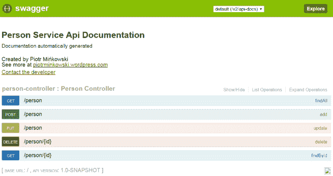
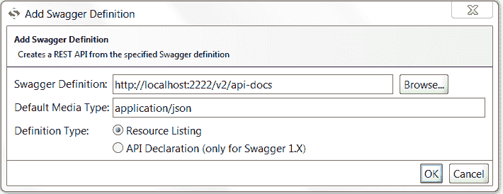
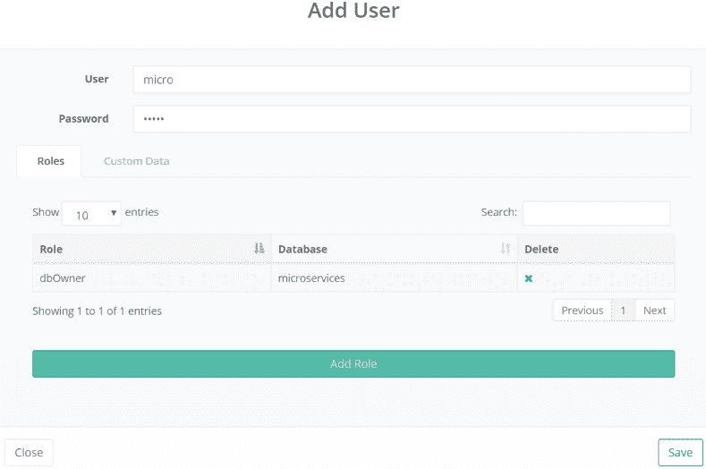

# 微服务的 Spring

我不知道有多少 Java 开发人员从未接触过 Spring 框架。实际上，它由许多项目组成，并且可以与许多其他框架一起使用，因此您迟早会被迫尝试它。虽然使用 Spring Boot 的体验不太常见，但它很快得到了广泛的欢迎。与 Spring 框架相比，Spring Boot 是一个相对较新的解决方案。它的实际版本是 2，而不是 Spring 框架的 5。创建它的目的是什么？使用 Spring 引导而不是标准 Spring Framework 方式运行的应用程序之间有什么区别？

本章将介绍的主题包括：

*   使用启动器为项目启用其他功能
*   使用 SpringWebLibrary 实现公开 RESTAPI 方法的服务
*   使用属性和 YAML 文件自定义服务配置
*   记录并提供公开 REST 端点的规范
*   配置运行状况检查和监视功能
*   使用 Spring 引导配置文件调整应用程序以在不同模式下运行
*   使用 ORM 功能与嵌入式和远程 NoSQL 数据库交互

# 介绍弹簧靴

Spring Boot 专用于运行独立的 Spring 应用程序，与简单 Java 应用程序一样，使用`java -jar`命令。使 Spring 引导不同于标准 Spring 配置的基本因素是简单性。这种简单性与我们需要了解的第一个重要术语密切相关，这是一个开端。**初学者**是可以包含在项目依赖项中的工件。它只不过提供了一组对其他工件的依赖关系，这些工件必须包含在应用程序中才能实现所需的功能。以这种方式交付的包已经可以使用了，这意味着我们不需要配置任何东西就可以让它工作。这就引出了与 Spring 引导相关的第二个重要术语，自动配置。启动器包含的所有工件都设置了默认设置，可以使用属性或其他类型的启动器轻松覆盖这些设置。例如，如果在应用程序依赖项中包含`spring-boot-starter-web`，则它将嵌入一个默认 web 容器，并在应用程序启动期间在默认端口上启动它。展望未来，Spring Boot 中的默认 web 容器是 Tomcat，它从端口`8080`开始。我们可以通过在应用程序属性文件中声明指定的字段来轻松更改此端口，甚至可以通过在项目依赖项中包含`spring-boot-starter-jetty`或`spring-boot-starter-undertow`来更改 web 容器。

让我再多说几句关于初学者的话。他们的官方命名模式是`spring-boot-starter-*`，其中`*`是特定类型的起动器。Spring Boot 中有很多初学者，但我想简要介绍一下最流行的初学者，本书以下章节中提供的示例中也使用了这些初学者：

| **名称** | **说明** |
| `spring-boot-starter` | 核心启动器，包括自动配置支持、日志记录和 YAML。 |
| `spring-boot-starter-web` | 允许我们构建 web 应用程序，包括 RESTful 和 SpringMVC。使用 Tomcat 作为默认的嵌入式容器。 |
| `spring-boot-starter-jetty` | 在项目中包括 Jetty，并将其设置为默认的嵌入式 servlet 容器。 |
| `spring-boot-starter-undertow` | 在项目中包括 Undertow，并将其设置为默认的嵌入式 servlet 容器。 |
| `spring-boot-starter-tomcat` | 包括 Tomcat 作为嵌入式 servlet 容器。`spring-boot-starter-web`使用的默认 servlet 容器启动器。 |
| `spring-boot-starter-actuator` | 项目中包括 Spring Boot Actuator，它提供用于监视和管理应用程序的功能。 |
| `spring-boot-starter-jdbc` | 包括带有 Tomcat 连接池的 Spring JBDC。特定数据库的驱动程序应由您自己提供。 |
| `spring-boot-starter-data-jpa` | 包括使用 JPA/Hibernate 与关系数据库交互所需的所有工件。 |
| `spring-boot-starter-data-mongodb` | 包括与 MongoDB 交互以及在本地主机上初始化与 Mongo 的客户端连接所需的所有构件。  |
| `spring-boot-starter-security` | 在项目中包括 Spring 安全性，默认情况下为应用程序启用基本安全性。 |
| `spring-boot-starter-test` | 允许使用 JUnit、Hamcrest 和 Mockito 等库创建单元测试。 |
| `spring-boot-starter-amqp` | 将 Spring AMQP 包括到项目中，并启动 RabbitMQ 作为默认 AMQP 代理。 |

如果您对可用启动器的完整列表感兴趣，请参阅 Spring Boot 规范。现在，让我们回到 Spring 引导和使用 Spring 框架的标准配置之间的主要区别。正如我前面提到的，我们可以包括`spring-boot-starter-web`，它将 web 容器嵌入到我们的应用程序中。使用标准 Spring 配置，我们不会将 web 容器嵌入到应用程序中，而是将其作为 WAR 文件部署到 web 容器中。这是一个关键区别，也是使用 Spring Boot 创建部署在 microservice 体系结构内的应用程序的最重要原因之一。微服务的主要特征之一是独立于其他微服务。在这种情况下，很明显，它们不应该共享公共资源，例如数据库或 web 容器。在一个 web 容器上部署多个 WAR 文件是微服务的反模式。因此，弹簧靴是显而易见的选择。

就我个人而言，我在开发许多应用程序时使用了 SpringBoot，而不仅仅是在微服务环境中工作时。如果您尝试使用它而不是标准的 Spring 框架配置，您将不想返回。为了支持这一结论，您可以找到一个有趣的图表来说明 GitHub 上 Java 框架存储库的流行程度：[http://redmonk.com/fryan/files/2017/06/java-tier1-relbar-20170622-logo.png](http://redmonk.com/fryan/files/2017/06/java-tier1-relbar-20170622-logo.png) 。让我们仔细看看如何用 Spring 启动开发应用程序。

# 使用 Spring Boot 开发应用程序

建议在项目中启用 Spring 引导的方法是使用依赖项管理系统。在这里，您可以看到一个关于如何在 Maven 和 Gradle 项目中包含适当工件的简短片段。以下是来自 Maven`pom.xml`的样本片段：

```java
<parent>
    <groupId>org.springframework.boot</groupId>
    <artifactId>spring-boot-starter-parent</artifactId>
    <version>1.5.7.RELEASE</version>
</parent>
<dependencies>
    <dependency>
        <groupId>org.springframework.boot</groupId>
        <artifactId>spring-boot-starter-web</artifactId>
    </dependency>
</dependencies>
```

使用 Gradle，我们不需要定义父依赖项。以下是来自`build.gradle`的片段：

```java
plugins {
    id 'org.springframework.boot' version '1.5.7.RELEASE'
}
dependencies {
    compile("org.springframework.boot:spring-boot-starter-web:1.5.7.RELEASE")
}
```

使用 Maven 时，不需要从`spring-boot-starter-parent`POM 继承。或者，我们可以使用依赖关系管理机制：

```java
<dependencyManagement>
    <dependencies>
        <dependency>
            <groupId>org.springframework.boot</groupId>
            <artifactId>spring-boot-dependencies</artifactId>
            <version>1.5.7.RELEASE</version>
            <type>pom</type>
            <scope>import</scope>
        </dependency>
    </dependencies>
</dependencyManagement>
```

现在，我们只需要创建主应用程序类并用`@SpringBootApplication`对其进行注释，这相当于同时使用的其他三个注释—`@Configuration`、`@EnableAutoConfiguration`和`@ComponentScan`：

```java
@SpringBootApplication
public class Application {

    public static void main(String[] args) {
        SpringApplication.run(Application.class, args);
    }

}
```

一旦我们声明了主类并包含了`spring-boot-starter-web`，我们只需要运行第一个应用程序。如果您使用开发 IDE，如 Eclipse 或 IntelliJ，则应该只运行主类。否则，应用程序必须像标准 Java 应用程序一样使用`java -jar`命令构建和运行。首先，我们应该提供在应用程序构建期间负责将所有依赖项打包到可执行 JAR（有时称为**fat JAR**）中的配置。如果在 Maven`pom.xml`中定义了该动作，则该动作将由`spring-boot-maven-plugin`执行：

```java
<build>
    <plugins>
        <plugin>
            <groupId>org.springframework.boot</groupId>
            <artifactId>spring-boot-maven-plugin</artifactId>
        </plugin>
    </plugins>
</build>
```

示例应用程序只不过在 Tomcat 容器上启动一个 Spring 上下文，该容器位于端口`8080`上。脂肪罐的大小约为 14MB。您可以使用 IDE 轻松地检查项目中包含哪些库。这些都是基本的 Spring 库，比如`spring-core`、`spring-aop`、`spring-context`；弹簧靴；嵌入式 Tomcat；用于日志记录的库，包括 Logback、Log4j 和 Slf4j；以及用于 JSON 序列化或反序列化的 Jackson 库。一个好主意是为项目设置默认 Java 版本。您可以通过声明`java.version`属性在`pom.xml`中轻松设置：

```java
<properties>
    <java.version>1.8</java.version>
</properties>
```

我们只需向 Jetty 服务器添加一个新的依赖项，即可更改默认 web 容器：

```java
 <dependency>
     <groupId>org.springframework.boot</groupId>
     <artifactId>spring-boot-starter-jetty</artifactId>
 </dependency>  
```

# 自定义配置文件

能够快速创建应用程序而无需大量工作是一回事，但同样重要的是能够轻松自定义和覆盖默认设置。SpringBoot 很方便，它提供了支持配置管理的机制。最简单的方法是使用配置文件，这些文件附加到应用程序 fat JAR 中。Spring Boot 会自动检测名称以`application`前缀开头的配置文件。支持的文件类型为`.properties`和`.yml`。因此，我们可以创建配置文件，例如`application.properties`或`application.yml`，甚至包括特定于配置文件的文件，例如`application-prod.properties`或`application-dev.yml`。此外，我们可以使用操作系统环境变量和命令行参数来外部化配置。使用属性或 YAML 文件时，应将其放置在以下位置之一：

*   当前应用程序目录的`/config`子目录
*   当前应用程序目录
*   类路径`/config`包（例如，在您的 JAR 中）
*   类路径根

如果要为配置文件指定除应用程序或`application-{profile}`以外的特定名称，则需要在启动期间提供一个`spring.config.name`环境属性。您还可以使用`spring.config.location`属性，该属性包含以逗号分隔的目录位置或文件路径列表：

```java
java -jar sample-spring-boot-web.jar --spring.config.name=example
java -jar sample-spring-boot-web.jar --spring.config.location=classpath:/example.properties
```

在配置文件中，我们可以定义两种类型的属性。首先，底层类主要从`spring-boot-autoconfigure`库中使用一组常见的预定义 Spring 引导属性。我们还可以定义自己的自定义配置属性，然后使用`@Value`或`@ConfigurationProperties`注释将这些属性注入到应用程序中。

让我们从预定义的属性开始。Spring Boot 项目支持的完整应用程序列表可在*通用应用程序属性*部分的*附录 A**、*中找到。其中大多数特定于某些 Spring 模块，如数据库、web 服务器、安全性和其他一些解决方案，但也有一组核心属性。就我个人而言，我更喜欢使用 YAML 而不是属性文件，因为它很容易被人阅读，但这是你的决定。最常见的情况是，我覆盖应用程序名称等属性，用于服务发现和分布式配置管理；web 服务器端口；登录中；或数据库连接设置。通常，`application.yml`文件放在`src/main/resources`目录中，在 Maven 构建之后，该目录位于 JAR 根目录中。下面是一个示例配置文件，它覆盖默认服务器端口、应用程序名称和日志记录属性：

```java
server: 
    port: ${port:2222}

spring: 
    application:
        name: first-service

logging:
    pattern:
        console: "%d{HH:mm:ss.SSS} %-5level %logger{36} - %msg%n"
        file: "%d{HH:mm:ss.SSS} [%thread] %-5level %logger{36} - %msg%n"
    level:
        org.springframework.web: DEBUG
    file: app.log
```

这里最酷的一点是，您不必为日志配置定义任何其他外部配置文件，例如，`log4j.xml`或`logback.xml`。在前面的片段中，您可以看到我将`org.springframework.web`的默认日志级别更改为`DEBUG`和日志模式，并创建了一个日志文件`app.log`，放在当前应用程序目录中。现在，默认应用程序名称为`first-service`，默认 HTTP 端口为`2222`。

我们的自定义配置设置也应该放在相同的属性或 YAML 文件中。以下是一个具有自定义属性的样本`application.yml`：

```java
name: first-service
my:
  servers:
    - dev.bar.com
    - foo.bar.com  
```

可以使用`@Value`注释注入一个简单的属性：

```java
@Component
public class CustomBean {

    @Value("${name}")
    private String name;

    // ...
}
```

还可以使用`@ConfigurationProperties`注释注入更复杂的配置属性。YAML 文件内的`my.servers`属性中定义的值列表被注入到`java.util.List`类型的目标 bean 中：

```java
@ConfigurationProperties(prefix="my")
public class Config {

    private List<String> servers = new ArrayList<String>();

    public List<String> getServers() {
        return this.servers;
    }
}
```

到目前为止，我们已经成功地创建了一个简单的应用程序，它只不过是在一个 web 容器（如 Tomcat 或 Jetty）上启动 Spring。在本章的这一部分中，我想向您展示使用 SpringBoot 启动应用程序开发是多么简单。除此之外，我还介绍了如何使用 YAML 或属性文件自定义配置。对于那些喜欢点击而不是打字的人，我推荐 Spring Initializer 网站（[https://start.spring.io/](https://start.spring.io/) ），您可以根据选择的选项生成项目存根。在简单站点视图中，您可以选择构建工具（Maven/Gradle）、语言（Java/Kotlin/Groovy）和 Spring 引导版本。然后，您应该在搜索依赖项标签之后使用搜索引擎提供所有必要的依赖项。我包括了`spring-boot-starter-web`，正如您在下面的屏幕截图中看到的，它在 Spring 初始值设定项上被标记为`Web`。单击 Generate project 后，包含生成的源代码的 ZIP 文件将下载到您的计算机上。您可能还想知道，通过单击切换到完整版本，您可以看到几乎所有可用的 Spring Boot 和 Spring Cloud 库，它们可以包含在生成的项目中：


我认为，既然我们已经讨论了使用 SpringBoot 构建项目的基础知识，现在正是向示例应用程序添加一些新特性的时候。

# 创建 RESTful Web 服务

作为第一步，让我们创建 RESTful Web 服务，向调用客户端公开一些数据。如前所述，负责 JSON 消息序列化和反序列化的 Jackson 库与`spring-boot-starter-web`一起自动包含在我们的类路径中。多亏了这一点，我们只需声明一个模型类，然后 REST 方法返回或将其作为参数。这是我们的示例模型类`Person`：

```java
public class Person {

    private Long id;
    private String firstName;
    private String lastName;
    private int age;
    private Gender gender;

    public Long getId() {
        return id;
    }

    public void setId(Long id) {
        this.id = id;
    }

    //...
}
```

SpringWeb 为创建 RESTfulWeb 服务提供了一些注释。第一个是`@RestController`注释，应该在负责处理传入 HTTP 请求的控制器 bean 类上设置该注释。还有`@RequestMapping`注释，通常用于将控制器方法映射到 HTTP。正如您在下面的代码片段中所看到的，可以在整个控制器类上使用它来为其中的所有方法设置请求路径。我们可以对具体的 HTTP 方法使用更具体的注释，例如`@GetMapping`或`@PostMapping`。`@GetMapping`与`@RequestMapping`相同，参数为`method=RequestMethod.GET`。其他两种常用的注释是`@RequestParam`和`@RequestBody`。第一种是将路径和查询参数绑定到对象；第二种方法使用 Jackson 库将输入 JSON 映射到对象：

```java
@RestController
@RequestMapping("/person")
public class PersonController {

    private List<Person> persons = new ArrayList<>(); 

    @GetMapping
    public List<Person> findAll() {
         return persons;
     }

    @GetMapping("/{id}")
    public Person findById(@RequestParam("id") Long id) {
        return persons.stream().filter(it -> it.getId().equals(id)).findFirst().get();
    }

    @PostMapping
    public Person add(@RequestBody Person p) {
        p.setId((long) (persons.size()+1));
        persons.add(p);
        return p;
    }

    // ...
}
```

为了与 RESTAPI 标准兼容，我们应该处理`PUT`和`DELETE`方法。实施后，我们的服务将执行所有 CRUD 操作：

| **方法** | **路径** | **说明** |
| `GET` | `/person` | 返回所有现有人员 |
| `GET` | `/person/{id}` | 返回具有给定的*id*的人员 |
| `POST` | `/person` | 添加新人物 |
| `PUT` | `/person` | 更新现有人员 |
| `DELETE` | `/person/{id}` | 使用给定的*id*从列表中删除人员 |

下面是一个使用`DELETE`和`PUT`方法的`@RestController`示例实现的片段：

```java
@DeleteMapping("/{id}")
public void delete(@RequestParam("id") Long id) {
    List<Person> p = persons.stream().filter(it -> it.getId().equals(id)).collect(Collectors.toList());
    persons.removeAll(p);
}

@PutMapping
public void update(@RequestBody Person p) {
    Person person = persons.stream().filter(it -> it.getId().equals(p.getId())).findFirst().get();
    persons.set(persons.indexOf(person), p);
}
```

控制器代码非常简单。它将所有数据存储在本地`java.util.List`中，这显然不是一个好的编程实践。但是，将其视为基本示例中采用的简化。在*与数据库集成*一节中，在本章中，我将介绍与 NoSQL 数据库集成的更高级示例应用程序

也许你们中的一些人有使用 soapweb 服务的经验。如果我们使用 SOAP 而不是 REST 创建了一个类似的服务，我们将为客户机提供一个 WSDL 文件，其中描述了所有服务定义。不幸的是，REST 不支持 WSDL 这样的标准符号。在 RESTful Web 服务的初始阶段，据说**Web 应用程序描述语言**（**WADL**将扮演该角色。但现实是，包括 SpringWeb 在内的许多提供商在应用程序启动后都不会生成 WADL 文件。我为什么要提这个？我们已经完成了第一个微服务，它公开了一些 HTTP 上的 REST 操作。您可能已经从 IDE 运行了这个微服务，或者在构建胖 JAR 之后使用了`java -jar`命令。如果您没有更改`application.yml`文件中的配置属性，或者在运行应用程序时没有设置`-Dport`选项，则在`http://localhost:2222`下可用。为了使其他人能够调用我们的 API，我们有两个选择。我们可以共享一个文档，描述它的用法或自动生成 API 客户端的机制。或者两者都有。这就是招摇过市的原因。

# API 文档

Swagger 是设计、构建和记录 RESTful API 的最流行工具。它是由 SmartBear 创建的，SmartBear 是一个非常流行的 SOAP Web 服务工具 SoapUI 的设计者。我认为，对于那些有长期 SOAP 经验的人来说，这可能是一个足够的建议。总之，使用 Swagger，我们可以使用符号设计 api，然后从中生成源代码，或者反过来，从源代码开始，然后生成 Swagger 文件。对于 SpringBoot，我们使用第二个选项

# 将 Swagger 2 与弹簧护套一起使用

SpringBoot 和 Swagger 2 之间的集成由 Springfox 项目实现。它在运行时检查应用程序，根据 Spring 配置、类结构和 Java 注释推断 API 语义。要将 Swagger 与 Spring 结合使用，我们需要在 Maven`pom.xml`中添加以下两个依赖项，并用`@EnableSwagger2`注释主应用程序类：

```java
<dependency>
    <groupId>io.springfox</groupId>
    <artifactId>springfox-swagger2</artifactId>
    <version>2.7.0</version>
</dependency>
<dependency>
    <groupId>io.springfox</groupId>
    <artifactId>springfox-swagger-ui</artifactId>
    <version>2.7.0</version>
</dependency>
```

API 文档将在应用程序启动期间由 Swagger 库从源代码自动生成。该进程由`Docket`bean 控制，该 bean 也在主类中声明。一个好主意可能是从 Maven`pom.xml`文件获取 API 版本。我们可以通过在类路径中包含`maven-model`库并使用`MavenXpp3Reader`类来获得它。我们还使用`apiInfo`方法设置了一些其他属性，例如 title、author 和 description。默认情况下，Swagger 为所有 REST 服务生成文档，包括 SpringBoot 创建的服务。我们希望将本文件仅限于`pl.piomin.services.boot.controller`包内的`@RestController`：

```java
  @Bean
  public Docket api() throws IOException, XmlPullParserException {
    MavenXpp3Reader reader = new MavenXpp3Reader();
    Model model = reader.read(new FileReader("pom.xml"));
    ApiInfoBuilder builder = new ApiInfoBuilder()
        .title("Person Service Api Documentation")
        .description("Documentation automatically generated")
        .version(model.getVersion())
        .contact(new Contact("Piotr Mińkowski", "piotrminkowski.wordpress.com", "piotr.minkowski@gmail.com"));
    return new Docket(DocumentationType.SWAGGER_2).select()
        .apis(RequestHandlerSelectors.basePackage("pl.piomin.services.boot.controller"))
        .paths(PathSelectors.any()).build()
        .apiInfo(builder.build());
  }
```

# 使用 swaggerui 测试 API

应用程序启动后，`http://localhost:2222/swagger-ui.html`提供 API 文档仪表板。这是一个更为用户友好的 Swagger JSON 定义文件版本，该文件也会自动生成并在`http://localhost:2222/v2/api-docs`上提供。该文件可以由任何其他 REST 工具导入，例如 SoapUI:



如果您更喜欢 SoapUI 而不是 Swagger UI，可以通过选择 Project | import Swagger 轻松导入 Swagger 定义文件。然后，您需要提供一个文件地址，如此屏幕截图所示：



就个人而言，我更喜欢大摇大摆的用户界面。您可以展开每个 API 方法以查看其详细信息。每个操作都可以通过提供所需的参数或 JSON 输入进行测试，然后单击“尝试”按钮！按钮下面是一个演示发送`POST /person`测试请求的屏幕截图：


以下是响应屏幕：


# 弹簧启动执行器功能

仅仅创建工作应用程序和共享标准化 API 文档并不是一切，特别是如果我们谈论的是微服务，其中有大量独立实体构成一个托管环境。需要提及的下一个重要事项是监控和收集应用程序的指标。在这方面，Spring Boot 也有了突破。ProjectSpringBootActuator 提供了许多内置端点，允许我们监视应用程序并与之交互。为了在我们的项目中启用它，我们应该在依赖项中包含`spring-boot-starter-actuator`。以下是最重要的执行器端点列表：

| **路径** | **说明** |
| `/beans` | 显示应用程序中初始化的所有 SpringBean 的完整列表。 |
| `/env` | 公开 Spring 可配置环境中的属性，这意味着，例如，OS 环境变量和配置文件中的属性。 |
| `/health` | 显示应用程序运行状况信息。 |
| `/info` | 显示任意应用程序信息。例如，可以从`build-info.properties`或`git.properties`文件中获取。 |
| `/loggers` | 显示并修改应用程序中记录器的配置。 |
| `/metrics` | 显示当前应用程序的度量信息，例如内存使用情况、正在运行的线程数或 REST 方法响应时间。 |
| `/trace` | 显示跟踪信息（默认情况下，最后 100 个 HTTP 请求）。 |

可以使用 Spring 配置属性轻松定制端点。例如，我们可以禁用其中一个默认启用的端点。默认情况下，除了`shutdown`之外的所有端点都已启用。这些端点中的大多数都是安全的。如果要从 web 浏览器调用它们，则应在请求标头中提供安全凭据或禁用整个项目的安全性。要执行后者，您必须在您的`application.yml`文件中包含以下语句：

```java
management:
  security:
    enabled: false
```

# 应用信息

启动期间，项目可用端点的完整列表在应用程序日志中可见。禁用安全性后，可以在 web 浏览器中测试所有安全性。有趣的是，`/info`端点默认不提供任何信息。如果您想更改此设置，可以使用三个可用的自动配置`InfoContributor`bean 之一，或者编写自己的。其中第一个`EnvironmentInfoContributor`公开端点中的环境密钥。第二个名为`GitInfoContributor`，检测类路径中的`git.properties`文件，然后显示提交的所有必要信息，如分支名称或提交 ID。最后一个名为`BuildInfoContributor`，从`META-INF/build-info.properties`文件收集信息，并在端点中显示。Git 和构建信息的这两个属性文件可以在应用程序构建期间自动生成。要实现这一点，您应该在您的`pom.xml`中包含`git-commit-id-plugin`，并定制`spring-boot-maven-plugin`以生成`build-info.properties`，生成方式如下代码片段所示：

```java
<plugin>
    <groupId>org.springframework.boot</groupId>
    <artifactId>spring-boot-maven-plugin</artifactId>
    <executions>
        <execution>
            <goals>
                <goal>build-info</goal>
                <goal>repackage</goal>
            </goals>
            <configuration>
                <additionalProperties>
                    <java.target>${maven.compiler.target}</java.target>
                    <time>${maven.build.timestamp}</time>
                </additionalProperties>
            </configuration>
        </execution>
    </executions>
</plugin>
<plugin>
    <groupId>pl.project13.maven</groupId>
    <artifactId>git-commit-id-plugin</artifactId>
    <configuration>
    <failOnNoGitDirectory>false</failOnNoGitDirectory>
    </configuration>
</plugin>
```

有了`build-info.properties`文件，您的`/info`将与以前略有不同：

```java
{ 
    "build": {
        "version":"1.0-SNAPSHOT",
        "java": {
            "target":"1.8"
        },
        "artifact":"sample-spring-boot-web",
        "name":"sample-spring-boot-web",
        "group":"pl.piomin.services",
        "time":"2017-10-04T10:23:22Z"
    }
}
```

# 健康信息

与`/info`端点一样，`/health`端点也有一些自动配置的指示器。我们可以监视磁盘使用、邮件服务、JMS、数据源和 NoSQL 数据库（如 MongoDB 或 Cassandra）的状态。如果您从我们的示例应用程序中检查该端点，则只能获得有关磁盘使用情况的信息。让我们将 MongoDB 添加到项目中，以测试一个可用的健康指标`MongoHealthIndicator`。MongoDB 不是随机选择。它将对我们未来的`Person`微服务的更高级示例有所帮助。要启用 MongoDB 使用，我们需要在`pom.xml`中添加以下依赖项。`de.flapdoodle.embed.mongo`工件负责在应用程序启动期间启动嵌入式数据库实例：

```java
<dependency>
    <groupId>org.springframework.boot</groupId>
    <artifactId>spring-boot-starter-data-mongodb</artifactId>
</dependency>
<dependency>
    <groupId>de.flapdoodle.embed</groupId>
    <artifactId>de.flapdoodle.embed.mongo</artifactId>
</dependency>
```

现在，`/health`端点返回有关磁盘使用情况和 MongoDB 状态的信息：

```java
{
 "status":"UP",
 "diskSpace":{
 "status":"UP",
 "total":499808989184,
 "free":193956904960,
 "threshold":10485760
 },
 "mongo":{
 "status":"UP",
 "version":"3.2.2"
 }
} 
```

在这个例子中，我们可以看到 Spring 引导自动配置的强大功能。我们只需要在项目中包含两个依赖项就可以启用嵌入式 MongoDB。其状态已自动添加到`/health`端点。它还有一个到 Mongo 的现成客户机连接，存储库 bean 可以进一步使用该连接

# 韵律学

正如我们常说的，没有免费的午餐。开发是快速而简单的，但是在项目中包括了一些额外的库之后，fatjar 文件现在大约有 30mb。使用一个自动配置的执行器端点`/metrics`，我们可以轻松检查我们的微服务堆和非堆内存使用情况。在发送一些测试请求后，堆的使用量约为 140MB，非堆的使用量为 65MB。应用程序的总内存使用量约为 320 MB。当然，即使在启动期间使用`java -jar`命令使用`-Xmx`参数，也可以稍微降低这些值。然而，如果我们关心在生产模式下的可靠工作，我们就不应该将这一限制降低太多。除了内存使用外，`/metrics`端点还显示有关加载类的数量、活动线程的数量、每个 API 方法的平均持续时间等信息。以下是我们示例微服务的端点响应片段：

```java
{
 "mem":325484,
 "mem.free":121745,
 "processors":4,
 "instance.uptime":765785,
 "uptime":775049,
 "heap.committed":260608,
 "heap.init":131072,
 "heap.used":138862,
 "heap":1846272,
 "nonheap.committed":75264,
 "nonheap.init":2496,
 "nonheap.used":64876,
 "threads.peak":28,
 "threads.totalStarted":33,
 "threads":28,
 "classes":9535,
 "classes.loaded":9535,
 "gauge.response.person":7.0,
 "counter.status.200.person":4,
 // ...
} 
```

有可能创建我们自己的自定义指标。弹簧靴执行器提供了两类，以防我们需要这样做-`CounterService`和`GaugeService`。`CounterService`顾名思义，公开了递增、递减和重置值的方法。相比之下，`GaugeService`只打算提交当前值。API 方法调用统计信息的默认度量有点不完善，因为它们仅基于调用路径。如果方法类型在同一路径上可用，则它们之间没有区别。在我们的样本终点中，这适用于`GET /person`、`POST /person`和`PUT /person`。无论如何，我创建了`PersonCounterService`bean，它统计`add`和`delete`方法调用的数量：

```java
@Service
public class PersonCounterService {
    private final CounterService counterService;

    @Autowired
    public PersonCounterService(CounterService counterService) {
        this.counterService = counterService;
    }

    public void countNewPersons() {
        this.counterService.increment("services.person.add");
    }

    public void countDeletedPersons() {
        this.counterService.increment("services.person.deleted");
    } 
}
```

这个 bean 需要注入到我们的 REST 控制器 bean 中，当添加或删除一个人时，可以调用增加计数器值的方法：

```java
public class PersonController {

    @Autowired
    PersonCounterService counterService;

    // ...

    @PostMapping
    public Person add(@RequestBody Person p) {
        p.setId((long) (persons.size()+1));
        persons.add(p);
        counterService.countNewPersons();
        return p;
    }

    @DeleteMapping("/{id}")
    public void delete(@RequestParam("id") Long id) {
        List<Person> p = persons.stream().filter(it -> it.getId().equals(id)).collect(Collectors.toList());
        persons.removeAll(p);
        counterService.countDeletedPersons();
    } 
}
```

现在，如果再次显示应用程序度量，您将在 JSON 响应中看到以下两个新字段：

```java
{
    // ...
    "counter.services.person.add":4,
    "counter.services.person.deleted":3
}
```

Spring 引导应用程序生成的所有度量都可以从内存缓冲区导出到可以分析和显示它们的位置。例如，我们可以将它们存储在 Redis、OpenTSDB、Statsd 甚至 XDB 中。

我想这就是我想给你的关于内置监控器端点的所有细节。我已经为文档、度量和健康检查等主题指定了相对较大的空间，但在我看来，这些是微服务开发和维护的重要方面。开发人员通常不关心这些机制是否得到了很好的实现，但其他人通常只是通过这些度量、健康检查和应用程序日志质量的棱镜来看待我们的应用程序。SpringBoot 提供了这种开箱即用的实现，因此开发人员不必花费太多时间来启用它们。

# 开发工具

SpringBoot 为开发人员提供了一些其他有用的工具。对我来说，真正酷的事情是，只要项目类路径上的文件发生更改，应用程序就会自动重新启动。如果您使用 Eclipse 作为 IDE，那么要启用它，唯一需要做的就是将`spring-boot-devtools`依赖项添加到 Maven`pom.xml`中。然后，尝试更改一个类中的某些内容并保存它。应用程序会自动重新启动，并且所需的时间比以标准方式停止和启动要少得多。当我启动示例应用程序时，大约需要 9 秒，而自动重启只需要 3 秒：

```java
<dependency>
    <groupId>org.springframework.boot</groupId>
    <artifactId>spring-boot-devtools</artifactId>
    <optional>true</optional>
</dependency>
```

如果某些资源在更改时不需要触发重新启动，我们可以将其排除在外。默认情况下，将监视指向文件夹的类路径上的任何可用文件的更改，即使是不需要重新启动的静态资产或视图模板。例如，如果将其放置在静态文件夹中，您可以通过在`application.yml`配置文件中添加以下属性来排除它们：

```java
spring:
 devtools:
   restart:
     exclude: static/**
```

# 应用与数据库的集成

您可以在 Spring 引导规范中找到更有趣的特性。我想花更多的时间来描述该框架提供的其他很酷的功能，但我们不应该离主要主题 Spring for MicroService 太远。您可能还记得，通过在项目中加入嵌入式 MongoDB，我向您承诺了一个更高级的微服务示例。在开始工作之前，让我们先回到应用程序的当前版本。它的源代码可以在我的公共 GitHub 帐户上找到。将以下 Git 存储库克隆到本地计算机：[https://github.com/piomin/sample-spring-boot-web.git](https://github.com/piomin/sample-spring-boot-web.git) 。

# 构建示例应用程序

`master`分支中提供了基本示例。更高级的样本是嵌入式 MongoDB，致力于`mongo`分支。如果您想尝试运行更高级的示例，您需要使用`git checkout mongo`切换到该分支。现在，我们需要在模型类中执行一些更改，以启用到 MongoDB 的对象映射。模型类必须用`@Document`注释，主键字段必须用`@Id`注释。我还将 ID 字段类型从`Long`更改为`String`，因为 MongoDB 生成 UUID 格式的主键，例如`59d63385206b6d14b854a45c`：

```java
@Document(collection = "person")
public class Person {

    @Id
    private String id;
    private String firstName;
    private String lastName;
    private int age;
    private Gender gender;

    public String getId() {
        return id;
    }

    public void setId(String id) {
        this.id = id;
    }
    // ...
}
```

下一步是创建扩展`MongoRepository`的存储库接口。MongoRepository 提供了搜索和存储数据的基本方法，如`findAll`、`findOne`、`save`和`delete`。SpringData 有一个非常智能的机制，可以使用存储库对象执行查询。我们不必自己实现查询，只需定义一个具有正确名称的接口方法。方法名称应具有前缀`findBy`，然后是搜索的字段名称。它可能以一个标准的搜索关键字后缀结尾，例如`GreaterThan`、`LassThan`、`Between`、`Like`等等。MongoDB 查询由 Spring 数据类根据完整的方法名自动生成。相同的关键字可以与`delete…By`或`remove…By`一起使用，以创建删除查询。在`PersonRepository`接口中，我决定定义两个 find 方法。其中第一个`findByLastName`选择具有给定`lastName`值的所有`Person`实体。第二个`findByAgeGreaterThan`用于检索年龄大于给定值的所有`Person`实体：

```java
public interface PersonRepository extends MongoRepository<Person, String> {

    public List<Person> findByLastName(String lastName);
    public List<Person> findByAgeGreaterThan(int age);

}
```

应该将存储库注入 REST 控制器类。然后，我们最终可以调用`PersonRepository`提供的所有必需的 CRUD 方法：

```java
@Autowired
private PersonRepository repository;
@Autowired
private PersonCounterService counterService; 

@GetMapping
public List<Person> findAll() {
    return repository.findAll();
} 

@GetMapping("/{id}")
public Person findById(@RequestParam("id") String id) {
    return repository.findOne(id);
}

@PostMapping
public Person add(@RequestBody Person p) {
    p = repository.save(p);
    counterService.countNewPersons();
    return p;
}

@DeleteMapping("/{id}")
public void delete(@RequestParam("id") String id) {
    repository.delete(id);
    counterService.countDeletedPersons();
}
```

我们还为`PersonRepository`bean 中的自定义查找操作添加了两个 API 方法：

```java
@GetMapping("/lastname/{lastName}")
public List<Person> findByLastName(@RequestParam("lastName") String lastName) {
    return repository.findByLastName(lastName);
}

@GetMapping("/age/{age}")
public List<Person> findByAgeGreaterThan(@RequestParam("age") int age) {
    return repository.findByAgeGreaterThan(age);
} 
```

这就是我们要做的一切。我们的微服务公开了在嵌入式 Mongo 数据库上实现 CRUD 操作的基本 API 方法，现已准备就绪。您可能已经注意到，它不需要我们创建很多源代码。使用 Spring 数据实现与数据库的任何交互，无论是关系数据库还是 NoSQL 数据库，都是快速且相对容易的。无论如何，我们还面临着一个挑战。嵌入式数据库是一个不错的选择，但仅在开发模式或单元测试中，而不是在生产中。如果您必须在生产模式下运行微服务，您可能会启动一个独立实例或一些部署为分片集群的 Mongo 实例，并将应用程序连接到它们。出于示例目的，我将使用 Docker 运行 MongoDB 的单个实例。

如果您不熟悉 Docker，您可以在本地或远程计算机上安装 Mongo。有关 Docker 的更多信息，您也可以参考[第 14 章](14.html)、*Docker 支持*，在这里我将向您简要介绍一下。在那里，您将找到开始所需的一切，例如，如何在 Windows 上安装它并使用基本命令。为了下一章和主题的目的，我还将在实现的示例中使用 Docker，因此我认为如果您有关于它的基本知识，它将非常有用

# 运行应用程序

让我们使用 Docker`run`命令启动 MongoDB：

```java
docker run -d --name mongo -p 27017:27017 mongo
```

Mongo 数据库客户端可能对我们有用。使用此功能，可以创建新数据库并添加一些具有凭据的用户。如果您在 Windows 上安装了 Docker，则默认虚拟机地址为`192.168.99.100`。由于在`run`命令中设置了`-p`参数，Mongo 容器暴露了端口`27017`。事实上，我们不必创建数据库，因为当我们在定义客户端连接时提供名称时，如果它不存在，将自动创建它：


接下来，我们应该为应用程序创建具有足够权限的用户：



最后在`application.yml`配置文件中设置 Mongo 数据库连接设置和凭证：

```java
server: 
  port: ${port:2222}
spring: 
  application:
  name: first-service

// ...

---

spring:
  profiles: production
  application:
    name: first-service
  data:
    mongodb:
      host: 192.168.99.100
      port: 27017
      database: microservices
      username: micro 
      password: micro
```

Spring Boot 很好地支持多配置文件配置。YAML 文件可以使用`*---*`行分隔成一系列文档，文档的每个部分都被独立地解析为一个扁平映射。前面的示例与带有`application-production.yml`的单独配置文件完全相同。如果在没有任何附加选项的情况下运行应用程序，它将使用默认设置，而默认设置没有设置配置文件名称。如果要使用生产属性运行，则应设置 VM 参数`spring.profiles.active`：

```java
java -jar -Dspring.profiles.active=production sample-spring-boot-web-1.0-SNAPSHOT.jar
```

还不止这些。现在，具有活动生产配置文件的应用程序无法启动，因为它试图初始化`embeddedMongoServer`bean。您可能已经知道，几乎所有其他解决方案都在 SpringBoot 中设置了自动配置。在这种情况下也一样。我们需要在生产配置文件中从自动配置中排除`EmbeddedMongoAutoConfiguration`类：

```java
spring:
  profiles: production
  // ...
  autoconfigure:
    exclude: org.springframework.boot.autoconfigure.mongo.embedded.EmbeddedMongoAutoConfiguration
```

我们还可以使用 configuration 类排除该工件：

```java
@Configuration
@Profile("production")
@EnableAutoConfiguration(exclude = EmbeddedMongoAutoConfiguration.class)
public class ApplicationConfig {
    // ...
}
```

当然，我们可以使用更优雅的解决方案，比如 Maven 概要文件，并从目标构建包中排除整个`de.flapdoodle.embed.mongo`工件。提出的解决方案只是解决该问题的几种可能性之一，但它显示了 Spring Boot 中的自动配置和配置机制。现在，您可以运行我们的示例应用程序，并使用例如 Swagger UI 执行一些测试。您还可以使用 Mongo 客户端连接到数据库，并检查数据库中的更改。下面是我们的示例项目的最终文件结构：

```java
pl
  +- piomin
    +- services
      +- boot
        +- Application.java
        |
        +- controller
        |  +- PersonController.java
        |
        +- data
        |  +- PersonRepository.java
        |
        +- model
        |  +- Person.java
        |  +- Gender.java
        |
        +- service
        |  +- PersonCounterService.java
```

示例应用程序已完成。这些都是我想在本章中向您展示的 Spring Boot 特性。我重点介绍了那些对创建基于 REST 的服务特别有用的服务。

# 总结

我已经指导您完成了单个微服务的开发过程，从一个非常基本的示例到一个更高级的、生产就绪的 Spring 引导应用程序。我已经描述了如何使用启动器为项目启用附加功能；使用 SpringWeb 库实现公开 RESTAPI 方法的服务；然后我们继续使用属性和 YAML 文件定制服务配置。我们还了解了如何记录和提供公开 REST 端点的规范。接下来，我们配置了健康检查和监视功能。我们使用 Spring 引导配置文件调整应用程序以在不同模式下运行，最后，我们使用 ORM 功能与嵌入式和远程 NoSQL 数据库交互。

在这一章中，我没有提到任何关于春云的事情，这不是偶然的。如果没有使用 SpringBoot 的基本知识和经验，就无法开始使用 SpringCloud 项目。SpringCloud 提供了许多不同的功能，允许您将服务放在一个完整的基于微服务的生态系统中。我们将在以下章节中逐一讨论这些功能