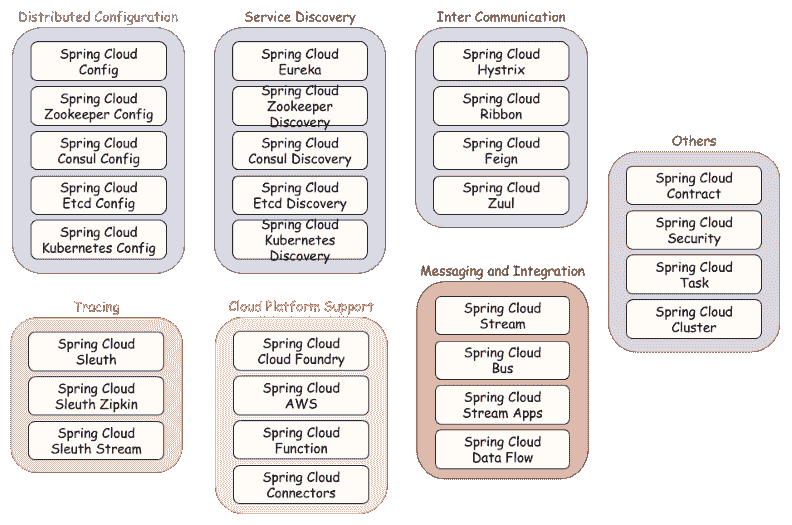

# 三、SpringCloud 概述

在[第 1 章](01.html)*微服务简介*中，我提到了云原生开发风格，并且 Spring cloud 帮助您轻松采用与此概念相关的最佳实践。最常用的最佳实践已收集在一个名为**十二要素应用程序**的有趣计划中。正如你可能在他们的网站上看到的那样（[https://12factor.net/](https://12factor.net/) ），这是一种构建**软件即服务**（**SaaS**）现代应用的方法，必须具有可扩展性，易于在云平台上部署，并在持续部署过程中交付。熟悉这些原则是值得的，尤其是如果您是一名开发人员，构建作为服务运行的应用程序。Spring Boot 和 Spring Cloud 提供的功能和组件使您的应用程序符合*十二要素规则*。我们可以区分大多数现代分布式系统通常使用的一些典型特征。每一个固执己见的框架都应该提供它们，SpringCloud 没有什么不同。这些特点如下：

*   分布式/版本化配置
*   服务注册和发现
*   路由
*   服务对服务呼叫
*   负载平衡
*   断路器
*   分布式消息传递

# 从基础开始

让我们回到上一章。在这里，我已经详细描述了 Spring Boot 项目的结构。应在 YAML 或带有应用程序或`application-{profile}`名称的属性文件中提供配置。与标准的 Spring 引导应用程序不同，SpringCloud 基于从远程服务器获取的配置。但是，应用程序内部需要最少的设置；例如，它的名称和配置服务器地址。这就是 SpringCloud应用程序创建引导上下文的原因，引导上下文负责从外部源加载属性。引导属性是以最高优先级添加的，它们不能被本地配置覆盖。引导上下文是主应用程序上下文的父上下文，它使用`bootstrap.yml`而不是`application.yml`。通常，我们将应用程序名称和 Spring Cloud 配置设置放在下面：

```java
spring:
  application:
    name: person-service
  cloud:
    config:
      uri: http://192.168.99.100:8888
```

通过将`spring.cloud.bootstrap.enabled`属性设置为`false`，可以轻松禁用引导上下文启动。我们还可以使用`spring.cloud.bootstrap.name`属性更改引导配置文件的名称，甚至通过设置`spring.cloud.bootstrap.location`来更改位置。配置文件机制在这里也可用，因此我们可以创建，例如，`bootstrap-development.yml`，它加载到活动的开发配置文件中。SpringCloudContext 库中提供了此功能和其他一些功能，它与任何其他 SpringCloud 库一起作为父依赖项添加到项目类路径中。这些特性之一是 Spring Boot Actuator 附带的一些附加管理端点：

*   `env`：一种新的`POST`方法，用于`Environment`、日志级别更新和`@ConfigurationProperties`重新绑定
*   `refresh`：这将重新加载引导上下文并刷新所有带`@RefreshScope`注释的 bean
*   `restart`：这将重新启动弹簧`ApplicationContext`
*   `pause`：此停止弹簧`ApplicationContext`
*   `resume`：这是从春天开始的`ApplicationContext`

下一个库和 SpringCloud 上下文（作为父依赖项包含在 SpringCloud 项目中）是 SpringCloudCommons。它为服务发现、负载平衡和断路器等机制提供了通用的抽象层。其中包括经常使用的注释，如`@EnableDiscoveryClient`或`@LoadBalanced`。我将在以下章节中介绍有关它们的更多细节。

# Netflix OSS

在阅读前两章时，您可能已经注意到许多与微服务架构相关的关键字的出现。对你们中的一些人来说，这可能是一个新的术语，对其他人来说，这是众所周知的。但是到目前为止，对于微服务社区来说，有一个重要的词还没有被提及。大家肯定都知道，这个词就是*网飞*。嗯，我也喜欢他们的电视节目和其他作品，但对于开发者来说，他们出名还有另一个原因。这就是微服务的原因。Netflix 是从传统开发模式迁移的最早先驱之一，在传统开发模式中，我们为云原生微服务开发方法创建了单片应用程序。该公司通过将大部分源代码放入公共存储库，在会议演示中发言，与社区分享他们的专业知识，Netflix 的架构概念非常成功，成为其他大型组织的榜样，其 IT 架构师（如 Adrian Cockcroft）现在是微服务的杰出传播者。反过来，许多开源框架的库基于 Netflix 共享代码下的可用解决方案。SpringCloud 也不例外，它提供了与最流行的 Netflix OSS 功能（如 Eureka、Hystrix、Ribbon 或 Zuul）的集成

顺便说一句，我不知道你是否一直在关注 Netflix，但他们揭示了他们决定开放大部分代码的原因。我认为值得一提，因为这部分解释了他们的解决方案在 it 界的成功和持续流行：

“当我们说我们要把 Netflix 的所有内容都转移到云上时，每个人都说我们完全疯了。他们不相信我们真的这么做了，他们认为我们只是在编造东西。”

# 使用 Eureka 进行服务发现

Spring Cloud Netflix 提供的第一种模式是使用 Eureka 进行服务发现。该包分为客户端和服务器。

要在项目中包括尤里卡客户，您应该使用`spring-cloud-starter-eureka`启动程序。客户端始终是应用程序的一部分，负责连接到远程发现服务器。一旦建立连接，它应该发送一条带有服务名称和网络位置的注册消息。如果当前的微服务必须从另一个微服务调用端点，那么客户端应该从服务器检索最新的配置以及已注册服务的列表。服务器可以作为独立的 Spring Boot 应用程序进行配置和运行，并且每个服务器都可以将其状态复制到其他节点，因此该服务器应该具有高可用性。要在项目中包括一台 Eureka 服务器，您需要使用`spring-cloud-starter-eureka-server`启动器。

# 与 Zuul 的路由

Spring Cloud Netflix 项目下的下一个流行模式是 Zuul 智能路由。它不仅是基于 JVM 的路由器，还充当服务器端负载平衡器和/或执行一些过滤。它也可以有广泛的应用。Netflix 将其用于身份验证、减载、静态响应处理或压力测试等情况。它与 Eureka 服务器的相同之处在于，它可以作为独立的 Spring 引导应用程序进行配置和运行

要将 Zuul 包含在项目中，请使用`spring-cloud-starter-zuul`启动程序。在微服务体系结构中，Zuul 扮演着 API 网关的重要角色，API 网关是整个系统的入口点。它需要了解每个服务的网络位置，以便能够通过将发现客户机包含到类路径中来与 Eureka 服务器交互。

# 带功能区的负载平衡

我们不能忽略用于客户端负载平衡功能区的下一个SpringCloud Netflix 功能。它支持最流行的协议，如 TCP、UDP 和 HTTP。它不仅可以用于同步 REST 调用，还可以用于异步和反应模型。除了负载平衡之外，它还提供了与服务发现、缓存、批处理和容错的集成。Ribbon 是基本 HTTP 和 TCP 客户端的下一个抽象级别

要将其包含在项目中，请使用`spring-cloud-starter-ribbon`starter.Ribbon 支持循环、可用性筛选和加权响应时间负载平衡规则，并且可以使用自定义规则轻松扩展。它基于*命名客户端*概念，其中用于负载平衡的服务器应提供名称。

# 编写 Java HTTP 客户端

Feign 是一个不太流行的 Netflix OSS 包。它是一个声明式 REST 客户端，帮助我们更轻松地编写 web 服务客户端。使用 Feign，开发人员只需声明和注释接口，而实际实现将在运行时生成

要在你的项目中加入外文，你需要使用`spring-cloud-starter-feign`初学者。它与功能区客户端集成，因此默认情况下，它支持负载平衡和其他功能区功能，包括与发现服务的通信。

# Hystrix 的延迟和容错性

我已经在[第一章](01.html)、*微服务简介*中提到了断路器模式，Spring Cloud 提供了一个实现此模式的库。它基于 Netflix 创建的 Hystrix 包，作为断路器实现。默认情况下，Hystrix 与 Ribbon 和外部客户端集成。回退与断路器概念密切相关。使用 SpringCloud库，您可以轻松配置回退逻辑，如果存在读取或断路器超时，则应执行回退逻辑。要在项目中包含 Hystrix，您应使用`spring-cloud-starter-hystrix`启动器

# 使用 Archaius 进行配置管理

SpringCloudNetflix 项目下提供的最后一个重要特性是 Archaius。就我个人而言，我没有接触过这个库，但在某些情况下它可能会有用。SpringCloud引用 Archaius 是 Apache Commons 配置项目的扩展。它允许通过轮询源以进行更改或将更改推送到客户端来更新配置

# 发现和分布式配置

服务发现和分布式配置管理是微服务体系结构的重要组成部分。这两种不同机制的技术实现非常相似。它归结为将参数存储在灵活的键值存储中的特定键下。实际上，市场上有几种有趣的解决方案提供了这两种功能。SpringCloud 与其中最受欢迎的应用程序集成在一起。但也有一个例外，SpringCloud 只为分布式配置创建了自己的实现。此功能在 SpringCloudConfig 项目下可用。相比之下，SpringCloud 没有为服务注册和发现提供自己的实现。

和往常一样，我们可以将这个项目分为服务器端和客户端支持。服务器是一个中心位置，在这里，应用程序的所有外部属性都在所有环境中进行管理。可以在多个版本和配置文件中同时维护配置。这是通过使用 Git 作为存储后端来实现的。该机制非常智能，我们将在[第 5 章](05.html)、*分布式配置和 SpringCloud配置*中详细讨论。Git 后端不是存储属性的唯一选项。配置文件也可以位于文件系统或服务器类路径上。下一个选项是将 Vault 用作后端。Vault 是一个开源工具，用于管理 HashiCorp 发布的令牌、密码或证书等机密。我知道许多组织都特别关注安全问题，例如将凭据存储在安全的地方，因此这可能是他们的正确解决方案。通常，我们还可以在配置服务器访问级别上管理安全性。无论哪个后端用于存储属性，SpringCloudConfigServer 都会公开一个基于资源的 HTTP API，该 API 提供了对属性的轻松访问。默认情况下，此 API 使用基本身份验证进行保护，但也可以使用私钥/公钥身份验证设置 SSL 连接

服务器可以作为独立的 Spring 引导应用程序运行，其属性通过 RESTAPI 公开。为了在我们的项目中启用它，我们应该添加`spring-cloud-config-server`依赖项。客户端也提供了支持。每个使用配置服务器作为属性源的微服务都需要在启动后连接到它，然后再创建任何 Springbean。有趣的是，非 Spring 应用程序可以使用 SpringCloud配置服务器。有一些流行的微服务框架在客户端与之集成。要为您的应用程序启用 SpringCloud配置客户端，您需要包含`spring-cloud-config-starter`依赖项

# 另一种选择——领事

Netflix 发现和 Spring 分布式配置的一个有趣的替代方案似乎是由 Hashicorp 创建的 Consor。SpringCloud 提供了与此流行工具的集成，用于发现和配置基础架构中的服务。通常，可以使用一些简单的通用注释来启用此集成，与前面介绍的解决方案相比，唯一的区别在于配置设置。为了与领事服务器建立通信，其代理需要可用于应用程序。它必须能够作为一个单独的进程运行，默认情况下在`http://localhost:8500`地址可用。Concur 还提供 RESTAPI，可直接用于注册、收集服务列表或配置属性。

要激活领事服务发现，我们需要使用`spring-cloud-starter-consul-discovery`启动器。在应用程序启动和注册之后，客户机将查询 consur 以定位其他服务。它支持使用 Netflix Ribbon 的客户端负载平衡器和使用 Netflix Zuul 的动态路由器和过滤器。

# 阿帕奇动物园管理员

SpringCloud 支持的下一个流行的解决方案是 ApacheZooKeeper。根据文档，它是一个用于维护配置、命名的集中式服务，它还提供分布式同步，并且能够对服务进行分组。对于 Zookeeper 来说，之前向 Concur 申请的关于 SpringCloud 支持的所有内容都是正确的。我在这里考虑的是简单的通用注释，必须使用它们来启用集成、通过设置文件中的属性进行配置以及与 Ribbon 或 Zuul 交互的自动配置。为了在客户端使用 Zookeeper 实现服务发现，我们不仅需要包括`spring-cloud-starter-zookeeper-discovery`，还需要包括 Apache Curator。它提供了一个 API 框架和实用程序，使集成更容易、更可靠。分布式配置客户端不需要它，因为我们只需要为项目依赖项包含`spring-cloud-starter-zookeeper-config`。

# 杂项工程

值得一提的是另外两个项目，它们目前正处于孵化阶段。所有这样的项目都可以在 GitHub 存储库[中找到 https://github.com/spring-cloud-incubator](https://github.com/spring-cloud-incubator) 。其中一些可能会在短期内正式加入 SpringCloud包。第一个是 SpringCloudKubernetes，它提供了与这个非常流行的工具的集成。我们可以谈很长时间，但让我们试着用几句话来介绍它。它是一个用于自动化部署、扩展和管理最初由 Google 设计的容器化应用程序的系统。它用于容器编排，并具有许多有趣的功能，包括服务发现、配置管理和负载平衡。在某些情况下，这可能被视为春云的竞争。该配置随 YAML 文件的使用而提供。

从 SpringCloud的角度来看，重要的特性是服务发现和分布式配置机制，它们可以在 Kubernetes 平台上使用。要在应用程序中使用它们，您应该包括`spring-cloud-starter-kubernetes`启动器

孵化阶段的第二个有趣项目是 Spring Cloud Etcd。与以前完全相同，它的主要功能是分布式配置、服务注册和发现。Etcd 不像 Kubernetes 那样是一个强大的工具。它只是提供了一个分布式键值存储，提供了在集群环境中存储数据的可靠方式。还有一点小技巧 Etcd 是 Kubernetes 中服务发现、集群状态和配置管理的后端。

# 基于 Sleuth 的分布式跟踪

SpringCloud 的另一个重要功能是分布式跟踪。它在 SpringCloudSleuth 库中实现。其主要目的是在处理单个输入请求时，将不同微服务之间调度的后续请求关联起来。与大多数情况一样，这些是基于 HTTP 头实现跟踪机制的 HTTP 请求。该实现构建在 Slf4j 和 MDC 之上。Slf4j 为特定日志框架（如 logback、log4j 或`java.util.logging`）提供外观和抽象。完整的**MDC**或**映射诊断上下文**是一种解决方案，用于区分来自不同来源的日志输出，并使用实际范围内无法获得的其他信息丰富日志输出。

springcloudsleuth 将 trace 和 span id 添加到 slf4jmdc 中，以便我们能够提取具有给定跟踪或 span 的所有日志。它还添加了一些其他条目，如应用程序名称或可导出标志。它与最流行的消息传递解决方案集成，如 SpringREST 模板、外部客户端、Zuul 过滤器、Hystrix 或 Spring 集成消息通道。它还可以与 RxJava 或计划任务一起使用。要在项目中启用它，您应该添加`spring-cloud-starter-sleuth`依赖项。基本 span 和 trace IDs 机制的使用对于开发人员来说是完全透明的。

添加跟踪头并不是 SpringCloudSleuth 的唯一功能。它还负责记录定时信息，这在延迟分析中很有用。这些统计数据可以导出到 Zipkin，这是一种用于查询和可视化计时数据的工具。

Zipkin 是一个分布式跟踪系统，专门用于分析微服务体系结构中的延迟问题。它公开了用于收集输入数据的 HTTP 端点。为了能够生成跟踪并将跟踪发送到 Zipkin，我们应该包括对项目的`spring-cloud-starter-zipkin`依赖

通常情况下，不需要分析每件事；输入流量非常大，我们只需要收集一定百分比的数据。为此，SpringCloudSleuth 提供了一个采样策略，我们可以在其中决定有多少输入流量被发送到 Zipkin。大数据问题的第二个智能解决方案是使用 MessageBroker 而不是默认 HTTP 端点发送统计数据。要启用此功能，我们必须包含`spring-cloud-sleuth-stream`依赖项，它允许您的应用程序成为发送到 ApacheKafka 或 RabbitMQ 的消息的生产者

# 消息传递和集成

我已经提到了消息代理及其在应用程序和 Zipkin 服务器之间通信的用法。通常，SpringCloud 支持通过同步/异步 HTTP 和消息代理进行两种类型的通信。该区域的第一个项目是 Spring Cloud Bus。它允许您向应用程序发送广播事件，通知它们状态更改，如配置属性更新或其他管理命令。实际上，我们可能希望将启动器用于带有 RabbitMQ 代理的 AMQP 或 Apache Kafka。通常，我们只需要将`spring-cloud-starter-bus-amqp`或`spring-cloud-starter-bus-kafka`包含到依赖关系管理中，所有其他必要的操作都通过自动配置来执行

SpringCloudBus 是一个相当小的项目，它允许您将分布式消息传递功能用于常见操作，如广播配置更改事件。构建由消息驱动的微服务组成的系统的正确框架是 SpringCloudStream。这是一个非常强大的框架，也是最大的 SpringCloud项目之一，我在这本书中专门写了整整一章，[第 11 章](11.html)，*消息驱动微服务*。与 SpringCloudBus 相同，有两个可用的绑定，第一个用于带有 RabbitMQ 的 AMQP，第二个用于 ApacheKafka。SpringCloudStream 基于 Spring 集成，这是 Spring 的另一个大型项目部分。它提供了一个编程模型，支持大多数企业集成模式，如端点、通道、聚合器或转换器。整个微服务系统中包含的应用程序通过 Spring Cloud Stream 输入和输出通道相互通信。它们之间的主要通信模型是发布/订阅，其中消息通过共享主题进行广播。此外，支持每个微服务的多个实例也很重要。在大多数情况下，消息只应由单个实例处理，这在发布/订阅模型中是不受支持的。这就是为什么 SpringCloudStream 引入了分组机制，其中只有一个组成员从目的地接收消息。与前面相同，这是两个初学者，根据活页夹类型`spring-cloud-starter-stream-kafka`或`spring-cloud-starter-stream-rabbit`可以包括一个项目

还有两个项目与 Spring Cloud Stream 相关。首先，Spring Cloud Stream 应用程序启动器定义了一组 Spring Cloud Stream 应用程序，这些应用程序可以独立运行，也可以使用第二个项目 Spring Cloud Data Flow 运行。在这些应用程序中，我们可以区分连接器、网络协议适配器和通用协议。SpringCloudDataFlow 是另一个广泛而强大的 SpringCloud 工具包。它为构建数据集成和实时数据处理管道提供了智能解决方案，从而简化了开发和部署。基于微服务的数据管道的编排是通过简单的 DSL、拖放式 UI 仪表板和 RESTAPI 一起实现的。

# 云平台支持

Pivotal Cloud Foundry 是一个用于部署和管理现代应用程序的云本地平台。你们中的一些人可能已经知道，Pivotal 软件是 Spring 框架商标的所有者。大型商业平台的赞助是 Spring 日益流行的重要原因之一。显而易见的是，PCF 完全支持 Spring Boot 的可执行 JAR 文件，以及所有 SpringCloud微服务模式，如配置服务器、服务注册表和断路器。使用 UI 仪表板或客户端命令行上提供的 marketplace，可以轻松地运行和配置这些类型的工具。PCF 的开发比标准 SpringCloud应用程序更简单。我们必须做的唯一一件事是包括项目依赖关系的正确启动者：

*   `spring-cloud-services-starter-circuit-breaker`
*   `spring-cloud-services-starter-config-client`
*   `spring-cloud-services-starter-service-registry`

很难找到一个不支持 AWS 的固执己见的云框架。Spring Cloud for Amazon Web Services 提供了与最流行的 Web 工具的集成。这包括与提供 Aurora 等引擎的**简单排队服务**（**SQS**）、**简单通知服务**（**SNS**）、**弹性缓存**和**关系数据库服务**（**RDS**进行通信的模块，MySQL 或 Oracle。可以使用 CloudFormation 堆栈中定义的名称访问远程资源。在众所周知的 Spring 惯例和模式中，一切都是不透明的。有四个主要模块可用：

*   **Spring Cloud AWS Core**：包含使用`spring-cloud-starter-aws`启动器的核心组件，可直接访问 EC2 实例
*   **Spring Cloud AWS Context**：提供对简单存储服务、简单电子邮件服务和缓存服务的访问
*   **Spring Cloud AWS JDBC**：包括使用 starter`spring-cloud-starter-aws-jdbc`starter，提供数据源查找和配置，可与 Spring 支持的任何数据访问技术配合使用
*   **Spring Cloud AWS 消息传递**：使用`starter spring-cloud-starter-aws-messaging`启动器提供，允许应用程序使用 SQS（点对点）或 SNS（发布/订阅）发送和接收消息

还有一个项目值得一提，尽管它仍处于开发的早期阶段。这就是 SpringCloud功能，它支持无服务器架构。Serverless 也称为**FaaS**（**Function-as-a-Service**），其中开发人员只创建部署在完全由第三方提供商管理的容器上的非常小的模块。实际上，SpringCloud函数为最流行的 FaaS 提供商 AWS Lambda 和 Apache OpenWhisk 实现了适配器。我将关注该项目的开发，该项目旨在支持无服务器方法

在本节中，我们不应忘记 Spring Cloud Connectors 项目，以前称为**Spring Cloud**。它为部署在云平台上的基于 JVM 的应用程序提供了一个抽象。实际上，它支持 Heroku 和 Cloud Foundry，我们的应用程序可以使用其中一个 Spring Cloud Heroku 连接器和 Spring Cloud Foundry 连接器模块连接 SMTP、RabbitMQ、Redis 或一个可用的关系数据库。

# 其他有用的图书馆

围绕微服务体系结构有一些重要的方面，它们不能被视为其核心特性，但也非常重要。首先是安全。

# 安全

SpringSecurity 和 SpringWeb 项目中提供了使用 OAuth2、JWT 或基本身份验证等机制保护 API 的大部分标准实现。springcloudsecurity 使用这些库让我们能够轻松创建实现常见模式（如单点登录和令牌中继）的系统。为了实现应用程序的安全管理，我们应该包括`spring-cloud-starter-security`启动器。

# 自动测试

微服务开发的下一个重要领域是自动化测试。对于微服务体系结构来说，接触测试越来越重要。Martin Fowler 给出了以下定义：

“集成契约测试是在外部服务边界处进行的测试，用于验证它是否满足消费服务所期望的契约。”

SpringCloud 有一个非常有趣的单元测试方法实现，SpringCloudContract。它使用 WireMock 记录流量，使用 Maven 插件生成存根

您还可能有机会使用 SpringCloud任务。它帮助开发人员使用 SpringCloud创建短期的微服务，并在本地或云环境中运行它们。为了在项目中启用它，我们应该包括`spring-cloud-starter-task`启动器。

# 簇特征

最后是最后一个项目，SpringCloud集群。它为领导人选举和公共状态模式提供了解决方案，并为 Zookeeper、Redis、Hazelcast 和 Consor 提供了抽象和实现。

# 项目概述

正如您所看到的，SpringCloud 包含许多子项目，提供了与许多不同工具和解决方案的集成。我认为很容易迷失方向，特别是如果您是第一次使用 SpringCloud。根据一张图表可能比千言万语更好地表达事物的原则，我将最重要的项目分为以下图表所示的类别：



# 放行列车

正如我们在前面的图中所看到的，SpringCloud 中有很多项目，它们之间有很多关系。根据定义，这些都是具有不同发布级联和版本号的独立项目。在这种情况下，应用程序中的依赖关系管理可能会有问题，这需要了解所有项目版本之间的关系。为了使它更简单，SpringCloud 引入了我们已经讨论过的启动机制，并发布了系列。发布序列通过名称而不是版本来标识，以避免与子项目混淆。有趣的是，它们是以伦敦地铁站的名字命名的，而且是按字母顺序排列的。第一个版本是 Angel，第二个版本是 Brixton，依此类推。依赖关系管理的整个机制基于**BOM**（**物料清单**），这是一个标准的 Maven 概念，用于管理独立版本的工件。这是一个实际的表，其中包含分配给发布序列的 SpringCloud 项目版本。后缀为 M[*X*的名称，其中[*X*是版本号，表示**里程碑**，SR[*X*表示**服务发布**，表示修复关键 bug 的更改。正如您在下表中所看到的，Spring Cloud Stream 有自己的发布序列，它使用与 Spring Cloud project 相同的规则对其子项目进行分组：

| **组件** | **Camden.SR7** | **道尔斯顿 SR4** | **Edgware.M1** | **Finchley.M2** | **Finchley.BUILD-SNAPSHOT** |
| `spring-cloud-aws` | 1.1.4.1 发布 | 1.2.1.发布 | 1.2.1.发布 | 2.0.0.M1 | 2.0.0.1 构建快照 |
| `spring-cloud-bus` | 1.2.2.1 发布 | 1.3.1.发布 | 1.3.1.发布 | 2.0.0.M1 | 2.0.0.1 构建快照 |
| `spring-cloud-cli` | 1.2.4.1 发布 | 1.3.4.1 发布 | 1.4.0.M1 | 2.0.0.M1 | 2.0.0.1 构建快照 |
| `spring-cloud-commons` | 1.1.9.发布 | 1.2.4.1 发布 | 1.3.0.M1 | 2.0.0.2 平方米 | 2.0.0.1 构建快照 |
| `spring-cloud-contract` | 1.0.5.1 发布 | 1.1.4.1 发布 | 1.2.0.M1 | 2.0.0.2 平方米 | 2.0.0.1 构建快照 |
| `spring-cloud-config` | 1.2.3.1 发布 | 1.3.3.1 发布 | 1.4.0.M1 | 2.0.0.2 平方米 | 2.0.0.1 构建快照 |
| `spring-cloud-netflix` | 1.2.7.发布 | 1.3.5.1 发布 | 1.4.0.M1 | 2.0.0.2 平方米 | 2.0.0.1 构建快照 |
| `spring-cloud-security` | 1.1.4.1 发布 | 1.2.1.发布 | 1.2.1.发布 | 2.0.0.M1 | 2.0.0.1 构建快照 |
| `spring-cloud-cloudfoundry` | 1.0.1.1 发布 | 1.1.0.1 发布 | 1.1.0.1 发布 | 2.0.0.M1 | 2.0.0.1 构建快照 |
| `spring-cloud-consul` | 1.1.4.1 发布 | 1.2.1.发布 | 1.2.1.发布 | 2.0.0.M1 | 2.0.0.1 构建快照 |
| `spring-cloud-sleuth` | 1.1.3.1 发布 | 1.2.5.1 发布 | 1.3.0.M1 | 2.0.0.2 平方米 | 2.0.0.1 构建快照 |
| `spring-cloud-stream` | 布鲁克林.SR3 | Chelsea.SR2 | Ditmars.M2 | 埃尔姆赫斯特 M1 酒店 | Elmhurst.BUILD-SNAPSHOT |
| `spring-cloud-zookeeper` | 1.0.4.1 发布 | 1.1.2.1 发布 | 1.2.0.M1 | 2.0.0.M1 | 2.0.0.1 构建快照 |
| `spring-boot` | 1.4.5.1 发布 | 1.5.4.1 发布 | 1.5.6.1 发布 | 2.0.0.M3 | 2.0.0.M3 |
| `spring-cloud-task` | 1.0.3.1 发布 | 1.1.2.1 发布 | 1.2.0.1 发布 | 2.0.0.M1 | 2.0.0.1 版本 |

现在，我们需要做的就是在 Maven`pom.xml`的依赖项管理部分提供正确的发布序列名称，然后包括使用启动器的项目：

```java
<dependencyManagement>
    <dependencies>
        <dependency>
            <groupId>org.springframework.cloud</groupId>
            <artifactId>spring-cloud-dependencies</artifactId>
            <version>Finchley.M2</version>
            <type>pom</type>
            <scope>import</scope>
        </dependency>
    </dependencies>
</dependencyManagement>
<dependencies>
    <dependency>
        <groupId>org.springframework.cloud</groupId>
        <artifactId>spring-cloud-starter-config</artifactId>
    </dependency>
    ...
</dependencies>
```

以下是 Gradle 的相同示例：

```java
dependencyManagement {
    imports {
        mavenBom ':spring-cloud-dependencies:Finchley.M2'
    }
}
dependencies {
    compile ':spring-cloud-starter-config'
    ...
}
```

# 总结

在本章中，我介绍了 SpringCloud 中最重要的项目。我已经指出了我分配给每个项目的几个领域。阅读本章后，您应该能够识别应用程序中必须包含的库，以便能够实现服务发现、分布式配置、断路器或负载平衡器等模式。您还应该认识到应用程序上下文和引导上下文之间的差异，并理解如何使用基于发布序列概念的依赖项管理在项目中包含依赖项。在本章中，我最不想让您注意的是一些与 SpringCloud 集成的工具，如 Concur、Zookeeper、RabbitMQ 或 Zipkin。我详细地描述了它们。我还指出了负责与这些工具交互的项目。

本章完成了本书的第一部分。在本部分中，主要目标是让您了解与 SpringCloud 项目相关的基础知识。阅读后，您应该能够识别基于微服务的体系结构的最重要元素，有效地使用 Spring Boot 创建简单和更高级的微服务，最后，您还应该能够列出所有最流行的子项目，它们是 Spring Cloud 的一部分。现在，我们可以进入本书的下一部分，详细讨论那些子项目，它们负责在 SpringCloud 中实现分布式系统的通用模式。其中大多数都基于 Netflix OSS 库。我们将从提供服务注册的解决方案 Eureka discovery server 开始