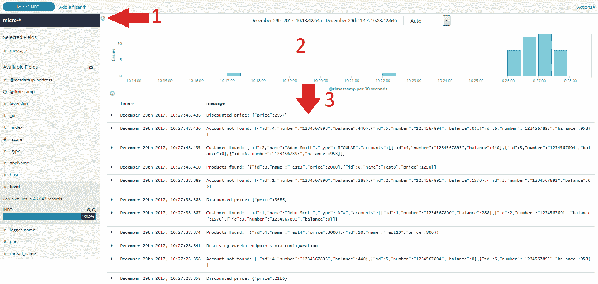
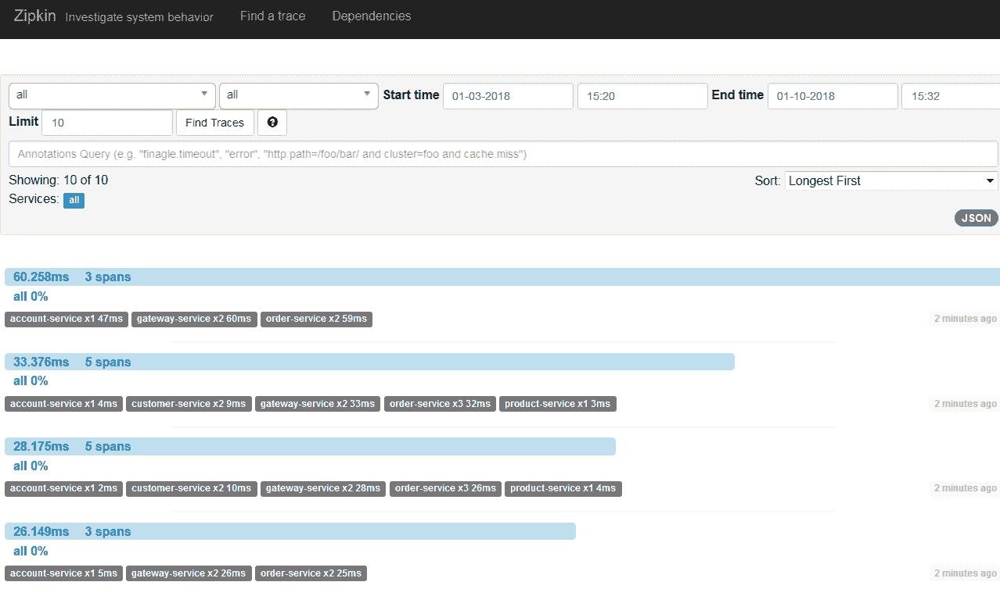
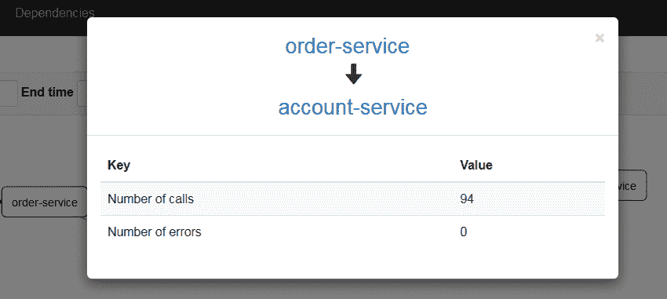

# 九、分布式日志记录和跟踪

当将一个整体分解为微服务时，我们通常会花费大量时间考虑业务边界或应用程序逻辑的划分，但我们忘记了日志。根据我作为开发人员和软件架构师的经验，我可以说开发人员通常不太重视日志记录。另一方面，负责应用程序维护的操作团队主要依赖于日志。不管你的专业领域是什么，毫无疑问，日志记录是所有应用程序都必须做的事情，不管它们是单片还是微服务架构。然而，微服务迫使为应用程序日志的设计和安排增加了一个全新的维度。在多台机器上运行着许多小型的、独立的、水平扩展的、相互通信的服务。请求通常由多个服务处理。我们必须将这些请求关联起来，并将所有日志存储在一个中心位置，以便更容易地查看它们。SpringCloud 引入了一个实现分布式跟踪解决方案的专用库 SpringCloudSleuth

这里还应该讨论一件事：日志记录与跟踪不同！值得指出它们之间的区别。跟踪是跟踪程序的数据流。技术支持团队通常使用它来诊断问题发生的位置。您必须跟踪系统流以发现性能瓶颈或错误发生的时间。日志记录用于错误报告和检测。与跟踪相反，它应该始终处于启用状态。当您设计一个大型系统，并且希望跨计算机进行良好且灵活的错误报告时，您一定要考虑以集中的方式收集日志数据。推荐和最流行的解决方案是**麋鹿**堆叠（**Elasticsearch**+**Logstash**+**Kibana**）。SpringCloud 中没有用于此堆栈的专用库，但是可以使用 Java 日志框架（如 Logback 或 Log4j）实现集成。本章将讨论另一个工具 Zipkin。它是一个典型的跟踪工具，可以帮助收集定时数据，用于解决微服务体系结构中的延迟问题。

本章将介绍的主题包括：

*   登录基于微服务的系统的最佳实践
*   使用 springcloudsleuth 将跟踪信息附加到消息和相关事件中
*   将 Spring 引导应用程序与 Logstash 集成
*   使用 Kibana 显示和筛选日志条目
*   使用 Zipkin 作为分布式跟踪工具，并通过 Spring Cloud Sleuth 将其与应用程序集成

# 微服务的最佳日志记录实践

处理日志记录的最重要的最佳实践之一是跟踪所有传入请求和传出响应。也许这对您来说很明显，但我已经看到了一些不符合该要求的应用程序。如果您满足这一需求，那么基于微服务的体系结构会产生一个后果。与没有消息传递的单片应用程序相比，系统中的日志总数有所增加。这反过来要求我们比以前更加关注日志记录。我们应该尽最大努力生成尽可能少的信息，即使这些信息可以告诉我们很多有关情况的信息。我们如何做到这一点？首先，在所有的微服务中使用相同的日志消息格式是很好的。例如，让我们考虑如何在应用程序日志中打印变量。我建议您使用 JSON 符号，因为通常，微服务之间交换的消息都是用 JSON 格式化的。这种格式有一个非常简单的标准，使您的日志易于阅读和解析，如以下代码片段所示：

```java
17:11:53.712   INFO   Order received: {"id":1,"customerId":5,"productId":10}
```

前面的格式比下面的格式更容易分析：

```java
17:11:53.712   INFO   Order received with id 1, customerId 5 and productId 10.
```

但一般来说，这里最重要的是标准化。无论您选择哪种格式，在任何地方使用它都是至关重要的。您还应该小心确保日志是有意义的。尽量避免使用不包含任何信息的句子。例如，根据以下格式，不清楚正在处理的订单：

```java
17:11:53.712   INFO   Processing order
```

但是，如果确实需要这种日志条目格式，请尝试将其分配给不同的日志级别。使用相同级别的`INFO`记录所有内容确实是一种糟糕的做法。某些类型的信息比其他信息更重要，因此这里的一个困难是确定日志条目应记录在哪个级别。以下是一些建议：

*   `TRACE`：这是非常详细的信息，仅用于开发。您可以在部署到生产环境之后将其保留一段短时间，但将其视为临时文件。
*   `DEBUG`：在此级别，记录程序中发生的任何事件。这主要用于开发人员的调试或故障排除。`DEBUG`和`TRACE`之间的区别可能是最困难的。
*   `INFO`：在这个级别，您应该记录操作过程中最重要的信息。这些消息必须易于理解，不仅对于开发人员，而且对于管理员或高级用户，以便让他们快速了解应用程序正在做什么。
*   `WARN`：在此级别，记录所有可能成为错误的事件。这样的过程可能会继续，但你应该格外小心。
*   `ERROR`：通常，您会打印此级别的异常。这里重要的一点是，如果只有一个业务逻辑执行没有成功，不要到处抛出异常。
*   `FATAL`：此 Java 日志记录级别指定可能导致应用程序停止的非常严重的错误事件。

还有其他良好的日志记录实践，但我已经提到了在基于微服务的系统中使用的最重要的实践。还值得一提的是日志记录的另一个方面，即规范化。如果您希望轻松理解和解释日志，那么您应该明确知道如何以及何时收集日志、日志包含什么内容以及为什么会发出日志。有一些特别重要的特征应该在所有微服务中规范化，例如`Time`（何时）、`Hostname`（何处）和`AppName`（谁）。正如您将在本章下一部分中看到的，当在系统中实现集中式日志收集方法时，这种规范化非常有用

# 使用 Spring 引导进行日志记录

SpringBoot 使用 ApacheCommons 日志记录进行内部日志记录，但如果您在启动程序中包含依赖项，则默认情况下会在应用程序中使用 Logback。它并不禁止以任何方式使用其他日志框架。还为 Java Util 日志、Log4J2 和 SLF4J 提供了默认配置。日志记录设置可以在具有`logging.*`属性的`application.yml`文件中配置。默认日志输出包含以毫秒为单位的日期和时间、日志级别、进程 ID、线程名称、发出条目的类的全名以及消息。可以分别使用控制台和文件追加器的`logging.pattern.console`和`logging.pattern.file`属性来覆盖它。

默认情况下，Spring 引导仅登录到控制台。为了允许在控制台输出之外写入日志文件，您应该设置一个`logging.file`或`logging.path`属性。如果您指定了`logging.file`属性，日志将被写入文件的确切位置或相对于当前目录的位置。如果设置了`logging.path`，则会在指定目录中创建一个`spring.log`文件。日志文件达到 10 MB 后将进行轮换。

在`application.yml`设置文件中，最后一个可以自定义的是日志级别。默认情况下，Spring Boot 写入具有`ERROR`、`WARN`和`INFO`级别的消息。我们可以为每个具有`logging.level.*`属性的包或类重写此设置。根记录器也可以使用`logging.level.root`进行配置。下面是`application.yml`文件中的一个示例配置，它更改了默认模式格式以及一些日志级别，并设置了日志文件的位置：

```java
logging:
 file: logs/order.log
 level:
  com.netflix: DEBUG
  org.springframework.web.filter.CommonsRequestLoggingFilter: DEBUG
 pattern:
  console: "%d{HH:mm:ss.SSS} %-5level %msg%n"
  file: "%d{HH:mm:ss.SSS} %-5level %msg%n"
```

正如您在前面的示例中所看到的，这样的配置非常简单，但在某些情况下，这还不够。如果您想定义其他附加器或过滤器，您应该明确地包括一个可用日志记录系统 Logback（`logback-spring.xml`）、Log4j2（`log4j2-spring.xml`）或 Java Util 日志记录（`logging.properties`的配置。正如我前面提到的，默认情况下，Spring Boot 对应用程序日志使用 Logback。如果您在类路径的根目录中提供`logback-spring.xml`文件，它将覆盖`application.yml`中定义的所有设置。例如，您可以创建每天轮换日志并最多保留 10 天历史记录的文件附加器。此功能在应用程序中非常常用。在本章的下一节中，您还将了解到，将 microservice 与 Logstash 集成需要一个自定义 appender。下面是一个 Logback 配置文件的片段示例，它为`logs/order.log`文件设置了每日滚动策略：

```java
<configuration>
 <appender name="FILE" class="ch.qos.logback.core.rolling.RollingFileAppender">
  <file>logs/order.log</file>
  <rollingPolicy class="ch.qos.logback.core.rolling.TimeBasedRollingPolicy">
   <fileNamePattern>order.%d{yyyy-MM-dd}.log</fileNamePattern>
   <maxHistory>10</maxHistory>
   <totalSizeCap>1GB</totalSizeCap>
  </rollingPolicy>
  <encoder>
   <pattern>%d{HH:mm:ss.SSS} %-5level %msg%n</pattern>
  </encoder>
 </appender>
 <root level="DEBUG">
  <appender-ref ref="FILE" />
 </root>
</configuration>
```

还值得一提的是，Spring 建议使用`logback-spring.xml`进行 Logback，而不是默认的`logback.xml`。Spring Boot 包括对 Logback 的一些扩展，这些扩展可能有助于高级配置。它们不能在标准`logback.xml`中使用，只能与`logback-spring.xml`一起使用。我们列出了其中一些扩展，它们允许您从 Spring 环境中定义特定于纵断面的配置或曲面属性：

```java
<springProperty scope="context" name="springAppName" source="spring.application.name" />
<property name="LOG_FILE" value="${BUILD_FOLDER:-build}/${springAppName}"/>​

<springProfile name="development">
...
</springProfile>

<springProfile name="production">
 <appender name="flatfile" class="ch.qos.logback.core.rolling.RollingFileAppender">
  <file>${LOG_FILE}</file>
  <rollingPolicy class="ch.qos.logback.core.rolling.TimeBasedRollingPolicy">
   <fileNamePattern>${LOG_FILE}.%d{yyyy-MM-dd}.gz</fileNamePattern>
   <maxHistory>7</maxHistory>
  </rollingPolicy>
  <encoder>
   <pattern>${CONSOLE_LOG_PATTERN}</pattern>
   <charset>utf8</charset>
  </encoder>
 </appender>
 ...
</springProfile>
```

# 使用 ELK 堆栈集中日志

ELK 是三个开源工具 Elasticsearch、Logstash 和 Kibana 的缩写。也称为**弹性叠层**。该系统的核心是**Elasticsearch**，这是一个基于另一个用 Java 编写的开源项目 Apache Lucene 的搜索引擎。该库特别适合在跨平台环境中需要全文搜索的应用程序。Elasticsearch 流行的主要原因是它的性能。当然，它还有其他一些优势，例如可伸缩性、灵活性和易于集成，因为它提供了一个用于搜索存储数据的基于 JSON 的 RESTful API。它有一个大型社区和许多用例，但对我们来说最有趣的是它能够存储和搜索应用程序生成的日志。日志记录是将 Logstash 包含在 ELK Stack 中的主要原因。这个开源数据处理管道允许我们收集、处理数据，并将数据输入 Elasticsearch。

**Logstash**支持许多从外部源提取事件的输入。有趣的是，它有许多输出，而 Elasticsearch 只是其中之一。例如，它可以将事件写入 Apache Kafka、RabbitMQ 或 MongoDB，还可以将度量写入 XDB 或 Graphite。它不仅可以接收数据并将数据转发到目的地，还可以动态解析和转换数据。

**基班纳**是麋鹿堆叠的最后一个元素。它是一个用于 Elasticsearch 的开源数据可视化插件。它允许您可视化、探索和发现 Elasticsearch 中的数据。通过创建搜索查询，我们可以轻松地显示和过滤从应用程序收集的所有日志。在此基础上，我们可以将数据导出为 PDF 或 CSV 格式以提供报告

# 在机器上设置麋鹿堆

在尝试将任何日志从应用程序发送到 Logstash 之前，我们必须在本地计算机上配置 ELK 堆栈。最合适的运行方式是通过 Docker 容器。堆栈中的所有产品都可以作为 Docker 图像使用。有一个由 Elastic Stack 的供应商托管的专用 Docker 注册表。有关已发布图像和标签的完整列表，请访问[www.docker.elastic.co](http://www.docker.elastic.co)。它们都使用`centos:7`作为基础图像

我们将从 Elasticsearch 实例开始。可通过以下命令开始其开发：

```java
docker run -d --name es -p 9200:9200 -p 9300:9300 -e "discovery.type=single-node" docker.elastic.co/elasticsearch/elasticsearch:6.1.1
```

在开发模式下运行 Elasticsearch 是运行它最方便的方式，因为我们不需要提供任何额外的配置。如果您想在生产模式下启动它，`vm.max_map_count`Linux 内核设置需要至少设置为`262144`。修改过程因操作系统平台而异。对于带有 Docker 工具箱的 Windows，必须通过`docker-machine`进行设置：

```java
docker-machine ssh
sudo sysctl -w vm.max_map_count=262144
```

下一步是运行带有 Logstash 的容器。除了使用 Logstash 启动容器外，我们还应该定义输入和输出。输出为 Elasticsearch，现在在默认 Docker 机器地址`192.168.99.100`下可用。作为输入，我们定义了简单的 TCP 插件`logstash-input-tcp`，它与`LogstashTcpSocketAppender`兼容，在我们的示例应用程序中用作日志追加器。我们微服务的所有日志都将以 JSON 格式发送。目前，为该插件设置`json`编解码器非常重要。每个微服务都将在 Elasticsearch 中以其名称和`micro`前缀编制索引。这是日志存储配置文件`logstash.conf`：

```java
input {
  tcp {
    port => 5000
    codec => json
  }
}

output {
  elasticsearch {
    hosts => ["http://192.168.99.100:9200"]
    index => "micro-%{appName}"
  }
}
```

以下是运行 Logstash 并在端口`5000`上公开它的命令。它还将具有上述设置的文件复制到容器中，并覆盖 Logstash 配置文件的默认位置：

```java
docker run -d --name logstash -p 5000:5000 -v ~/logstash.conf:/config-dir/logstash.conf docker.elastic.co/logstash/logstash-oss:6.1.1 -f /config-dir/logstash.conf
```

最后，我们可以运行堆栈的最后一个元素 Kibana。默认情况下，它在端口`5601`上公开，并连接到端口`9200`上可用的 Elasticsearch API，以便能够从那里加载数据：

```java
docker run -d --name kibana -e "ELASTICSEARCH_URL=http://192.168.99.100:9200" -p 5601:5601 docker.elastic.co/kibana/kibana:6.1.1
```

如果您想在 Windows 上的 Docker 机器上运行所有弹性堆栈产品，您可能必须将 Linux 虚拟映像的默认 RAM 内存增加到至少 2 GB。启动所有容器后，您最终可以访问`http://192.168.99.100:5601`下可用的 Kibana 仪表板，然后继续将您的应用程序与 Logstash 集成。

# 将应用程序与 ELK 堆栈集成

有许多方法可以通过 Logstash 将 Java 应用程序与 ELK 堆栈集成。其中一种方法涉及使用 Filebeat，它是本地文件的日志数据传递程序。这种方法需要为 Logstash 实例配置 beats（`logstash-input-beats`）输入，这实际上是默认选项。您还应该在服务器机器上安装并启动 Filebeat 守护程序。它负责将原木交付至 Logstash。

就个人而言，我更喜欢基于 Logback 和专用 appender 的配置。它似乎比使用 Filebeat 代理更简单。除了必须部署额外的服务之外，Filebeat 还要求我们使用解析表达式，例如 Grok 筛选器。当使用 Logback appender 时，您不需要任何日志托运人。此追加器在项目 Logstash JSON 编码器中可用。您可以通过在`logback-spring.xml`文件中声明`net.logstash.logback.appender.LogstashSocketAppender`appender 来为您的应用程序启用它。

我们还将讨论使用消息代理将数据发送到 Logstash 的另一种方法。在我们即将研究的示例中，我将向您展示如何使用 Spring`AMQPAppender`将日志事件发布到 RabbitMQ 交换。在这种情况下，Logstash 订阅 exchange 并使用已发布的消息。

# 使用 LogstashTCPAppender

库`logstash-logback-encoder`提供三种类型的附加器 UDP、TCP 和异步。TCP 追加器是最常用的。值得一提的是，TCP 追加器是异步的，所有编码和通信都委托给单个线程。除了 Appender 之外，该库还提供了一些编码器和布局，使您能够以 JSON 格式登录。由于 Spring Boot 默认包含一个 Logback 库以及`spring-boot-starter-web`，因此我们只需向 Maven`pom.xml`添加一个依赖项：

```java
<dependency>
 <groupId>net.logstash.logback</groupId>
 <artifactId>logstash-logback-encoder</artifactId>
 <version>4.11</version>
</dependency>
```

下一步是在 Logback 配置文件中使用`LogstashTCPAppender`类定义 appender。每个 TCP 附加器都需要您配置一个编码器。您可以在`LogstashEncoder`和`LoggingEventCompositeJsonEncoder`之间进行选择。`LoggingEventCompositeJsonEncoder`为您提供了更大的灵活性。它由一个或多个映射到 JSON 输出的 JSON 提供程序组成。默认情况下，没有配置提供程序。对于`LogstashTCPAppender`来说，这种方式不起作用。默认情况下，它包括几个标准字段，例如时间戳、版本、记录器名称和堆栈跟踪。它还添加了来自**m****apped 诊断上下文**（**MDC**）和上下文的所有条目，除非您通过将`includeMdc`或`includeContext`属性之一设置为`false`来禁用它：

```java
<appender name="STASH" class="net.logstash.logback.appender.LogstashTcpSocketAppender">
 <destination>192.168.99.100:5000</destination>
 <encoder class="net.logstash.logback.encoder.LoggingEventCompositeJsonEncoder">
  <providers>
   <mdc />
   <context />
   <logLevel />
   <loggerName />
   <pattern>
    <pattern>
    {
    "appName": "order-service"
    }
    </pattern>
   </pattern>
   <threadName />
   <message />
   <logstashMarkers />
   <stackTrace />
  </providers>
 </encoder>
</appender>
```

现在，我想回到我们的示例系统。我们仍然在同一个 Git 存储库中（[https://github.com/piomin/sample-spring-cloud-comm.git](https://github.com/piomin/sample-spring-cloud-comm.git) 及`feign_with_discovery`分行[https://github.com/piomin/sample-spring-cloud-comm/tree/feign_with_discovery](https://github.com/piomin/sample-spring-cloud-comm/tree/feign_with_discovery) 。根据*微服务最佳日志实践*一节中描述的建议，我在源代码中添加了一些日志条目。以下是`order-service`中`POST`方法的当前版本。我已经通过调用`org.slf4j.LoggerFactory`中的`getLogger`方法，将 SLF4J 上的 Logback 用作记录器：

```java
@PostMapping
public Order prepare(@RequestBody Order order) throws JsonProcessingException {
    int price = 0;
    List<Product> products = productClient.findByIds(order.getProductIds());
    LOGGER.info("Products found: {}", mapper.writeValueAsString(products));
    Customer customer = customerClient.findByIdWithAccounts(order.getCustomerId());
    LOGGER.info("Customer found: {}", mapper.writeValueAsString(customer));

    for (Product product : products) 
        price += product.getPrice();
    final int priceDiscounted = priceDiscount(price, customer);
    LOGGER.info("Discounted price: {}", mapper.writeValueAsString(Collections.singletonMap("price", priceDiscounted)));

    Optional<Account> account = customer.getAccounts().stream().filter(a -> (a.getBalance() > priceDiscounted)).findFirst();
    if (account.isPresent()) {
        order.setAccountId(account.get().getId());
        order.setStatus(OrderStatus.ACCEPTED);
        order.setPrice(priceDiscounted);
        LOGGER.info("Account found: {}", mapper.writeValueAsString(account.get()));
    } else {
        order.setStatus(OrderStatus.REJECTED);
        LOGGER.info("Account not found: {}", mapper.writeValueAsString(customer.getAccounts()));
    }

    return repository.add(order);
}
```

让我们看看 KiBaba 仪表板。可在`http://192.168.99.100:5601`获取。应用程序日志可以很容易地在那里发现和分析。您可以在页面左侧的菜单中选择所需的索引名称（在下面的屏幕截图中标记为**1**。日志统计信息显示在时间线图上（**2**。通过单击混凝土钢筋或选择一组钢筋，可以缩短作为搜索参数的时间。给定时间段的所有日志显示在图表下方的面板上（**3**：



每个条目都可以展开以查看其详细信息。在详细表视图中，我们可以看到，例如，Elasticsearch 索引的名称（`_index`）和微服务的级别或名称（`appName`）。这些字段大多由`LoggingEventCompositeJsonEncoder`设置。我只定义了一个特定于应用程序的字段，`appName`：


Kibana 为我们提供了搜索特定条目的强大能力。我们可以通过单击所选条目来定义过滤器，以定义一组搜索条件。在前面的屏幕截图中，您可以看到我是如何过滤掉传入 HTTP 请求的所有条目的。您可能还记得，`org.springframework.web.filter.CommonsRequestLoggingFilter`类负责记录它们。我刚刚定义了一个过滤器，它的名称等于一个完全限定的记录器类名。这是我的 Kibana 仪表板的屏幕，它显示仅由`CommonsRequestLoggingFilter`生成的日志：


# 使用 AMQP appender 和消息代理

使用 Spring AMQP appender 和 message broker 的配置比使用简单 TCP appender 的方法稍微复杂一些。首先，您需要在本地计算机上启动 MessageBroker。我已经在[第 5 章](05.html)*使用 Spring Cloud Config*进行分布式配置中描述了这个过程，其中我介绍了 RabbitMQ，用于使用 Spring Cloud Bus 进行动态配置重新加载。假设您已在本地或作为 Docker 容器启动 RabbitMQ 实例，则可以继续进行配置。我们必须创建一个队列来发布传入事件，然后将其绑定到 exchange。要实现这一点，您应该登录到 Rabbit 管理控制台，然后转到队列部分。我已经创建了名为`q_logstash`的队列。我用名称`ex_logstash`定义了新的交换，这在下面的屏幕截图中可见。队列已使用所有示例微服务的路由密钥绑定到 exchange：


启动并配置 RabbitMQ 实例后，我们可以开始在应用程序端进行集成。首先，您必须在项目依赖项中包含`spring-boot-starter-amqp`，以提供 AMQP 客户端和 AMQP appender 的实现：

```java
<dependency>
    <groupId>org.springframework.boot</groupId>
    <artifactId>spring-boot-starter-amqp</artifactId>
</dependency>
```

然后，您只需在 Logback 配置文件中使用`org.springframework.amqp.rabbit.logback.AmqpAppender`类定义 appender。需要设置的最重要的属性是 RabbitMQ 网络地址（`host`、`port`）、声明的交换机名称（`exchangeName`）和路由密钥（`routingKeyPattern`），该密钥必须与为交换机绑定声明的其中一个密钥相匹配。与 TCP appender 相比，这种方法的一个缺点是需要自己准备发送到 Logstash 的 JSON 消息。以下是`order-service`的 Logback 配置片段：

```java
<appender name="AMQP"
 class="org.springframework.amqp.rabbit.logback.AmqpAppender">
 <layout>
  <pattern>
  {
  "time": "%date{ISO8601}",
  "thread": "%thread",
  "level": "%level",
  "class": "%logger{36}",
  "message": "%message"
  }
  </pattern>
 </layout>
 <host>192.168.99.100</host>
 <port>5672</port>
 <username>guest</username>
 <password>guest</password> 
 <applicationId>order-service</applicationId>
 <routingKeyPattern>order-service</routingKeyPattern>
 <declareExchange>true</declareExchange>
 <exchangeType>direct</exchangeType>
 <exchangeName>ex_logstash</exchangeName>
 <generateId>true</generateId>
 <charset>UTF-8</charset>
 <durable>true</durable>
 <deliveryMode>PERSISTENT</deliveryMode>
</appender>
```

通过声明`rabbitmq`（`logstash-input-rabbitmq`输入，Logstash 可以轻松地与 RabbitMQ 集成：

```java
input {
  rabbitmq {
    host => "192.168.99.100"
    port => 5672
    durable => true
    exchange => "ex_logstash"
  }
}

output { 
  elasticsearch { 
    hosts => ["http://192.168.99.100:9200"]
  } 
}
```

# 春云侦探

SpringCloudSleuth 是一个相当小、简单的项目，但它为日志记录和跟踪提供了一些有用的功能。如果您参考*使用 LogStathTCPappender*部分中讨论的示例，您可以很容易地看到，不可能过滤与单个请求相关的所有日志。在基于微服务的环境中，在处理进入系统的请求时，将应用程序交换的消息关联起来也非常重要。这是创建 springcloudsleuth 项目的主要动机。

如果为应用程序启用了 Spring Cloud Sleuth，它会向请求添加一些 HTTP 头，这允许您将请求与独立应用程序交换的响应和消息链接起来，例如，通过 RESTful API。它定义了工作范围和跟踪的两个基本单位。其中每个都由唯一的 64 位 ID 标识。跟踪 ID 的值等于 span ID 的初始值。span 指单个交换，其中响应作为对请求的响应发送。跟踪通常被称为**关联 IT**，它帮助我们链接在处理进入系统的请求过程中生成的来自不同应用程序的所有日志

每个跟踪和跨度 ID 都添加到 Slf4J**MDC**（**映射的诊断上下文**），因此您可以在日志聚合器中提取具有给定跟踪或跨度的所有日志。MDC 只是存储当前线程上下文数据的映射。到达服务器的每个客户端请求都由不同的线程处理。由于这一点，每个线程都可以在线程生命周期内访问其 MDC 的值。除了`spanId`和`traceId`之外，Spring Cloud Sleuth 还为 MDC 添加了以下两个跨度：

*   `appName`：生成日志条目的应用程序的名称
*   `exportable`：指定是否将日志导出到 Zipkin

除上述功能外，Spring Cloud Sleuth 还提供：

*   对常见分布式跟踪数据模型的抽象，允许与 Zipkin 集成。
*   记录定时信息，以帮助进行延迟分析。它还包括不同的采样策略，用于管理导出到 Zipkin 的数据量。
*   与参与通信的常见 Spring 组件集成，如 servlet 过滤器、异步端点、RestTemplate、消息通道、Zuul 过滤器和外部客户端。

# 将 Sleuth 与应用程序集成

为了为应用程序启用 Spring Cloud Sleuth 功能，只需将`spring-cloud-starter-sleuth`启动器添加到依赖项中：

```java
<dependency>
    <groupId>org.springframework.cloud</groupId>
    <artifactId>spring-cloud-starter-sleuth</artifactId>
</dependency>
```

包含此依赖项后，应用程序生成的日志项的格式已更改。如下所示：

```java
2017-12-30 00:21:31.639 INFO [order-service,9a3fef0169864e80,9a3fef0169864e80,false] 49212 --- [nio-8090-exec-6] p.p.s.order.controller.OrderController : Products found: [{"id":2,"name":"Test2","price":1500},{"id":9,"name":"Test9","price":2450}]
2017-12-30 00:21:31.683 INFO [order-service,9a3fef0169864e80,9a3fef0169864e80,false] 49212 --- [nio-8090-exec-6] p.p.s.order.controller.OrderController : Customer found: {"id":2,"name":"Adam Smith","type":"REGULAR","accounts":[{"id":4,"number":"1234567893","balance":5000},{"id":5,"number":"1234567894","balance":0},{"id":6,"number":"1234567895","balance":5000}]}
2017-12-30 00:21:31.684 INFO [order-service,9a3fef0169864e80,9a3fef0169864e80,false] 49212 --- [nio-8090-exec-6] p.p.s.order.controller.OrderController : Discounted price: {"price":3752}
2017-12-30 00:21:31.684 INFO [order-service,9a3fef0169864e80,9a3fef0169864e80,false] 49212 --- [nio-8090-exec-6] p.p.s.order.controller.OrderController : Account found: {"id":4,"number":"1234567893","balance":5000}
2017-12-30 00:21:31.711 INFO [order-service,58b06c4c412c76cc,58b06c4c412c76cc,false] 49212 --- [nio-8090-exec-7] p.p.s.order.controller.OrderController : Order found: {"id":4,"status":"ACCEPTED","price":3752,"customerId":2,"accountId":4,"productIds":[9,2]}
2017-12-30 00:21:31.722 INFO [order-service,58b06c4c412c76cc,58b06c4c412c76cc,false] 49212 --- [nio-8090-exec-7] p.p.s.order.controller.OrderController : Account modified: {"accountId":4,"price":3752}
2017-12-30 00:21:31.723 INFO [order-service,58b06c4c412c76cc,58b06c4c412c76cc,false] 49212 --- [nio-8090-exec-7] p.p.s.order.controller.OrderController : Order status changed: {"status":"DONE"}
```

# 使用 Kibana 搜索事件

Spring Cloud Sleuth 会自动将 HTTP 头`X-B3-SpanId`和`X-B3-TraceId`添加到所有请求和响应中。这些字段也作为`spanId`和`traceId`包含在 MDC 中。但在转到 Kibana 仪表板之前，我希望您先看看下图。这是一个序列图，说明了示例微服务之间的通信流程：


`order-service`公开了两种可用的方法。第一个用于创建新订单，第二个用于确认订单。事实上，第一个`POST /`方法直接从`customer-service`、`product-service`和`account-service`通过`customer-service`从所有其他服务调用端点。第二种`PUT /{id}`方法只与`account-service`中的一个端点集成。

前面描述的流程现在可以通过 ELK Stack 中存储的日志条目进行映射。当使用 Kibana 作为日志聚合器时，再加上 Spring Cloud Sleuth 生成的字段，我们可以通过使用跟踪或 span ID 过滤条目来轻松找到条目。下面是一个例子，我们发现了与来自`order-service`的`POST /`端点调用相关的所有事件，其中`X-B3-TraceId`字段等于`103ec949877519c2`：


这里有一个与前一个类似的示例，但是在处理请求期间存储的所有事件都被发送到`PUT /{id}`端点。这些条目也被`X-B3-TraceId`字段过滤掉，其值等于`7070b90bfb36c961`：


在这里，您可以看到由 microservice 应用程序发送到 Logstash 的字段的完整列表。带有`X-`前缀的字段已被 Spring Cloud Sleuth 库包含在消息中：


# 将 Sleuth 与 Zipkin 集成

Zipkin 是一个流行的、开源的分布式跟踪系统，它有助于收集分析基于微服务的体系结构中的延迟问题所需的时间数据。它能够使用 UI web 控制台收集、查找和可视化数据。Zipkin UI 提供了一个依赖关系图，显示系统内所有应用程序处理了多少跟踪请求。Zipkin 由四个元素组成。我已经提到了其中的一个，WebUI。第二个是 Zipkin collector，它负责验证、存储和索引所有传入的跟踪数据。Zipkin 使用 Cassandra 作为默认后端存储。它本身也支持 Elasticsearch 和 MySQL。最后一个元素是查询服务，它提供了一个用于查找和检索跟踪的简单 JSON API。它主要由 Web UI 使用。

# 运行 Zipkin 服务器

我们可以通过几种方式在本地运行 Zipkin 服务器。其中一种方法涉及使用 Docker 容器。以下命令启动内存中的服务器实例：

```java
docker run -d --name zipkin -p 9411:9411 openzipkin/zipkin
```

运行 Docker 容器后，Zipkin API 在`http://192.168.99.100:9411`处可用。或者，您可以使用 Java 库和 Spring 引导应用程序启动它。要为您的应用程序启用 Zipkin，您应该在 Maven`pom.xml`文件中包含以下依赖项，如下面的代码片段所示。默认版本由`spring-cloud-dependencies`管理。对于我们的示例应用程序，我使用了`Edgware.RELEASE`Spring Cloud Release Train：

```java
<dependency>
    <groupId>io.zipkin.java</groupId>
    <artifactId>zipkin-server</artifactId>
</dependency>
<dependency>
    <groupId>io.zipkin.java</groupId>
    <artifactId>zipkin-autoconfigure-ui</artifactId>
</dependency>
```

我在我们的示例系统中添加了一个新的`zipkin-service`模块。这真的很简单。唯一需要实现的是应用程序主类，它用`@EnableZipkinServer`注释。因此，Zipkin 实例嵌入到 Spring Boot 应用程序中：

```java
@SpringBootApplication
@EnableZipkinServer
public class ZipkinApplication {

    public static void main(String[] args) {
        new SpringApplicationBuilder(ZipkinApplication.class).web(true).run(args);
    }

}
```

为了在其默认端口上启动 Zipkin 实例，我们必须覆盖`application.yml`文件中的默认服务器端口。启动应用程序后，Zipkin API 在`http://localhost:9411`上可用：

```java
spring: 
 application:
  name: zipkin-service

server: 
 port: ${PORT:9411}
```

# 构建客户端应用程序

如果您想在项目中同时使用 SpringCloud Sleuth 和 Zipkin，只需将 starter`spring-cloud-starter-zipkin`添加到依赖项中即可。它支持通过 HTTP API 与 Zipkin 集成。如果您已将 Zipkin 服务器作为 Spring Boot 应用程序中的嵌入式实例启动，则无需提供任何包含连接地址的附加配置。如果您使用 Docker 容器，则应覆盖`application.yml`中的默认 URL：

```java
spring:
 zipkin:
  baseUrl: http://192.168.99.100:9411/
```

您始终可以利用与服务发现的集成。如果您通过`@EnableDiscoveryClient`为嵌入 Zipkin 服务器的应用程序启用了发现客户端，您可以将属性`spring.zipkin.locator.discovery.enabled`设置为`true`。在这种情况下，即使它在默认端口下不可用，所有应用程序都可以通过注册名称对其进行本地化。您还应使用`spring.zipkin.baseUrl`属性覆盖默认 Zipkin 应用程序名称：

```java
spring:
 zipkin:
  baseUrl: http://zipkin-service/
```

默认情况下，SpringCloudSleuth 只发送几个选定的传入请求。由属性`spring.sleuth.sampler.percentage`确定，其值需要在 0.0 到 1.0 之间为双精度。由于分布式系统之间交换的数据量有时可能非常大，因此实现了采样解决方案。SpringCloudSleuth 提供了采样器接口，可以实现该接口来控制采样算法。默认实现在类`PercentageBasedSampler`中可用。如果您想跟踪应用程序交换的所有请求，只需声明`AlwaysSampler`bean 即可。它可能对测试目的有用：

```java
@Bean
public Sampler defaultSampler() {
    return new AlwaysSampler();
}
```

# 使用 Zipkin UI 分析数据

让我们回到我们的示例系统。如前所述，添加了新的`zipkin-service`模块。我还为所有微服务启用了 Zipkin 跟踪，包括`gateway-service`。默认情况下，Sleuth 将值`spring.application.name`作为 span 的服务名称。您可以使用`spring.zipkin.service.name`属性覆盖该名称。

为了使用 Zipkin 成功测试我们的系统，我们必须启动微服务、网关、发现和 Zipkin 服务器。要生成和发送一些测试数据，您可以运行由`pl.piomin.services.gateway.GatewayControllerTest`类实现的 JUnit 测试。它通过`gateway-service`向`order-service`发送 100 条消息，可在`http://localhost:8080/api/order/**`获取。

让我们分析 Zipkin 从所有服务收集的数据。您可以使用其 UI web 控制台轻松地检查它。所有跟踪都标记有服务的名称范围。如果条目有五个跨度，则表示进入系统的请求已由五个不同的服务处理。您可以在以下屏幕截图中看到这一点：



您可以使用不同的条件筛选条目，例如服务名称、范围名称、跟踪 ID、请求时间或持续时间。Zipkin 还可以可视化失败的请求，并按持续时间按降序或升序对它们进行排序：


您可以查看每个条目的详细信息。Zipkin 将参与通信的所有微服务之间的流可视化。它正在考虑对每个传入请求的数据进行计时。您可能会发现系统延迟的原因：


Zipkin 提供了一些其他有趣的特性。其中之一是能够可视化应用程序之间的依赖关系。下面的屏幕截图说明了示例系统的通信流程：


您只需单击相关元素即可查看服务之间交换了多少消息：



# 通过消息代理进行集成

通过 HTTP 与 Zipkin 集成不是唯一的选择。与 SpringCloud 一样，我们可以使用消息代理作为代理。有两个可用的代理 RabbitMQ 和 Kafka。第一个可以通过使用`spring-rabbit`依赖项包含在项目中，而第二个可以通过`spring-kafka`包含在项目中。这两个代理的默认目的地名称为`zipkin`：

```java
<dependency>
 <groupId>org.springframework.cloud</groupId>
 <artifactId>spring-cloud-starter-zipkin</artifactId>
</dependency>
<dependency>
 <groupId>org.springframework.amqp</groupId>
 <artifactId>spring-rabbit</artifactId>
</dependency>
```

此功能还需要在 Zipkin 服务器端进行更改。我们已经配置了一个正在侦听进入 RabbitMQ 或 Kafka 队列的数据的使用者。要实现这一点，只需在项目中包含以下依赖项。在类路径中仍然需要有`zipkin-server`和`zipkin-autoconfigure-ui`工件：

```java
<dependency>
 <groupId>org.springframework.cloud</groupId>
 <artifactId>spring-cloud-sleuth-zipkin-stream</artifactId>
</dependency>
<dependency>
 <groupId>org.springframework.cloud</groupId>
 <artifactId>spring-cloud-starter-stream-rabbit</artifactId>
</dependency>
```

您应该用`@EnableZipkinStreamServer`而不是`@EnableZipkinServer`注释主应用程序类。幸运的是，`@EnableZipkinStreamServer`还带有`@EnableZipkinServer`注释，这意味着您也可以使用标准 Zipkin 服务器端点通过 HTTP 收集跨度，并使用 UI web 控制台进行搜索：

```java
@SpringBootApplication
@EnableZipkinStreamServer
public class ZipkinApplication {

    public static void main(String[] args) {
        new SpringApplicationBuilder(ZipkinApplication.class).web(true).run(args);
    }

}
```

# 总结

在开发过程中，日志记录和跟踪通常不是很重要，但这些是系统维护中使用的关键特性。在本章中，我重点介绍了开发和运营领域。我已经向您展示了如何以多种方式将 Spring Boot microservice 应用程序与 Logstash 和 Zipkin 集成。我还向您展示了一些示例，以说明如何为应用程序启用 Spring Cloud Sleuth 功能，以便更轻松地监视多个微服务之间的调用。阅读本章之后，您还应该能够有效地使用 Kibana 作为日志聚合工具，使用 Zipkin 作为跟踪工具来发现系统内部通信的瓶颈

Spring Cloud Sleuth 与 Elastic Stack 和 Zipkin 一起，似乎是一个非常强大的生态系统，它消除了您对由许多独立微服务组成的监控系统可能存在的问题的任何疑问。