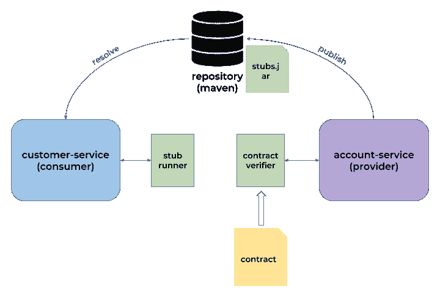
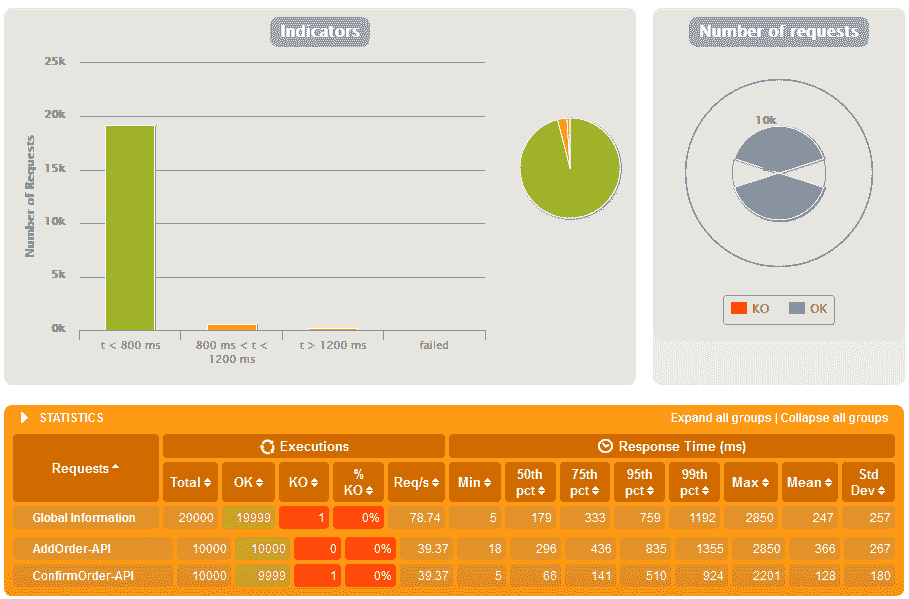

# 十三、测试 Java 微服务

在开发新的应用程序时，我们永远不要忘记自动测试。如果我们正在考虑基于微服务的体系结构，那么这些就特别重要。测试微服务需要一种不同于为单片应用程序创建的测试的方法。就整体而言，主要关注的是单元测试和集成测试，以及数据库层。就微服务而言，最重要的是以尽可能精细的粒度为每个通信提供覆盖。尽管每个微服务都是独立开发和发布的，但其中一个微服务的更改可能会影响与该服务交互的所有其他微服务。它们之间的通信是通过消息实现的。通常，这些是通过 REST 或 AMQP 协议发送的消息。

本章将介绍的主题包括：

*   Spring 对自动化测试的支持
*   Spring Boot 微服务的组件测试和集成测试之间的差异
*   使用 Pact 实现合同测试
*   使用 SpringCloud契约实现契约测试
*   使用 Gatling 实现性能测试

# 测试策略

有五种不同的微服务测试策略。前三个与单片应用相同：

*   **单元测试**：通过单元测试，我们测试最小的代码片段，例如，单个方法或组件，并模拟其他方法和组件的每次调用。有许多流行的框架支持 Java 中的单元测试，如 JUnit、TestNG 和 Mockito（用于模拟）。这类测试的主要任务是确认实现满足需求。单元测试可以是一个强大的工具，尤其是与测试驱动的开发相结合时。
*   **集成测试**：仅使用单元测试并不能保证验证整个系统的行为。集成测试采用模块并尝试将它们一起测试。这种方法使您有机会在子系统中使用通信路径。我们正在基于组件与模拟的外部服务的接口测试组件之间的交互和通信。在基于微服务的系统中，可以使用集成测试来包括其他微服务、数据源或缓存。
*   **端到端测试**：端到端测试也称为**功能测试**。这些测试的主要目标是验证系统是否满足外部需求。这意味着我们应该设计测试场景来测试参与该过程的所有微服务。设计一个好的端到端测试不是一项简单的任务。因为我们需要测试整个系统，所以特别强调测试的场景设计是非常重要的。
*   **契约测试**：契约测试用于确保微服务的显性和隐性契约按预期工作。当使用者为了使用某个组件而与该组件的接口集成时，总是会形成契约。通常，在基于微服务的系统中，单个组件有许多消费者。它们中的每一个通常都需要一份满足其需求的不同合同。根据这些假设，每个使用者都对源组件的接口行为负责。
*   **组件测试**：在我们完成了一个微服务中所有对象和方法的单元测试之后，我们应该单独测试整个微服务。为了独立运行测试，我们需要模拟或存根其他微服务的调用。外部数据存储应替换为等效的内存数据存储，这也提供了显著的测试性能改进。

合同测试和组件测试之间的差异是显而易见的。下图说明了我们样本`order-service`微服务中的这些差异：


现在，有一个问题是，我们是否真的需要另外两种策略来测试基于微服务的系统。通过适当的单元和集成测试，我们可以确信构成微服务一部分的各个组件实现的正确性。然而，如果没有更具体的微服务测试策略，我们无法确定它们如何协同工作以满足我们的业务需求。因此，增加了组件和合同测试。为了帮助我们理解组件、契约和集成测试之间的差异，这是一个非常重要的更改。由于组件测试是在与外部世界隔离的情况下执行的，因此集成测试负责验证与外部世界的交互。这就是为什么我们应该为集成测试提供存根，而不是组件测试。契约测试，很像集成测试，强调微服务之间的交互，但它们将它们视为一个黑盒，只验证响应的格式。

一旦您为您的微服务提供了功能测试，您还应该考虑性能测试。我们可以区分以下性能测试策略：

*   **负载测试**：用于确定系统在正常和预期负载条件下的行为。这里的主要思想是确定一些弱点，如响应时间延迟、异常中断，或者如果网络超时设置不正确，则重试次数过多。
*   **压力测试**：这些测试检查您的系统的上限，以检查它在极重负载下的行为。除了负载测试，它还检查内存泄漏、安全问题和数据损坏。它可能使用与负载测试相同的工具。

下图说明了在系统上执行所有测试策略的逻辑顺序。我们从最简单的单元测试开始，它验证小部分软件，然后经过下一个阶段，最终完成压力测试，将整个系统推向极限：


# 测试 Spring 启动应用程序

正如您在上一节中所读到的，应用程序中的测试有一些不同的策略和方法。我已经简要地提到了所有这些问题，因此现在我们可以开始讨论实际问题。SpringBoot 提供了一组实用程序，帮助实现自动化测试。为了在项目中启用这些功能，您必须将`spring-boot-starter-test`启动器包含到依赖项中。它不仅导入了`spring-test`和`spring-boot-test`工件，还导入了一些其他有用的测试库，如 JUnit、Mockito 和 AssertJ：

```java
<dependency>
    <groupId>org.springframework.boot</groupId>
    <artifactId>spring-boot-starter-test</artifactId>
    <scope>test</scope>
</dependency>
```

# 构建示例应用程序

在开始进行自动化测试之前，我们需要准备一个用于测试目的的示例业务逻辑。我们可以使用前几章中相同的示例系统，但必须稍作修改。到目前为止，我们从未使用外部数据源来存储和收集测试数据。在本章中，这样做将有助于说明不同的策略如何处理持久性测试问题。现在，每个服务都有自己的数据库，尽管通常选择哪个数据库并不重要。Spring Boot 支持多种解决方案，包括关系数据库和 NoSQL 数据库。我决定使用 Mongo。让我们提醒自己样本系统的架构。下图所示的当前模型考虑了前面描述的关于每个服务的专用数据库的假设：


# 与数据库的集成

为了使我们的 Spring Boot 应用程序能够支持 Mongo，将`spring-boot-starter-data-mongo`启动器包含到依赖项中。这个项目提供了一些有趣的特性来简化与 MongoDB 的集成。在这些特性中，值得一提的是特别丰富的对象映射，`MongoTemplate`，当然还有对存储库编写风格的支持，这是其他 Spring 数据项目所熟知的。以下是`pom.xml`中所需的依赖项声明：

```java
<dependency>
 <groupId>org.springframework.boot</groupId>
 <artifactId>spring-boot-starter-data-mongodb</artifactId>
</dependency>
```

使用 Docker 映像可以轻松启动 MongoDB 实例。运行以下命令启动 Docker 容器，该容器在端口`27017`上公开 Mongo 数据库：

```java
docker run --name mongo -p 27017:27017 -d mongo
```

为了将应用程序与先前启动的数据源连接，我们应该覆盖`application.yml`中的一些`auto-configured`设置。这可以通过`spring.data.mongodb.*`属性实现：

```java
spring: 
 application:
  name: account-service
 data:
  mongodb:
   host: 192.168.99.100
   port: 27017
   database: micro
   username: micro 
   password: micro123
```

我已经提到了对象映射特性。SpringDataMongo 提供了一些可用于此目的的注释。数据库中存储的每个对象都应该用`@Document`注释。目标集合的主键是一个 12 字节的字符串，应该在每个映射类中用 Spring 数据`@Id`表示。以下是`Account`对象实现的片段：

```java
@Document
public class Account {

    @Id
    private String id;
    private String number;
    private int balance;
    private String customerId;
    // ...

}
```

# 单元测试

我花了很多时间来描述与 MongoDB 的集成。然而，测试持久性是自动化测试的关键点之一，因此正确配置它非常重要。现在，我们可以开始测试的实现。SpringTest 为最典型的测试场景提供支持，例如通过 REST 客户端与其他服务集成或与数据库集成。我们有一组可用的库，允许我们轻松地模拟与外部服务的交互，这对于单元测试尤其重要。

以下测试类是 Spring 引导应用程序的典型单元测试实现。我们使用了 JUnit 框架，这是 Java 的事实标准。Mockito 库在这里用于用存根替换真实的存储库和控制器。这种方法允许我们轻松地验证`@Controller`类实现的每个方法的正确性。测试与外部组件隔离进行，这是单元测试的主要假设：

```java
@RunWith(SpringRunner.class)
@WebMvcTest(AccountController.class)
public class AccountControllerUnitTest {

    ObjectMapper mapper = new ObjectMapper();

    @Autowired
    MockMvc mvc;
    @MockBean
    AccountRepository repository;

    @Test
    public void testAdd() throws Exception {
        Account account = new Account("1234567890", 5000, "1");
        when(repository.save(Mockito.any(Account.class))).thenReturn(new Account("1","1234567890", 5000, "1"));
        mvc.perform(post("/").contentType(MediaType.APPLICATION_JSON).content(mapper.writeValueAsString(account)))
 .andExpect(status().isOk());
 }

    @Test
    public void testWithdraw() throws Exception {
        Account account = new Account("1", "1234567890", 5000, "1");
        when(repository.findOne("1")).thenReturn(account);
        when(repository.save(Mockito.any(Account.class))).thenAnswer(new Answer<Account>() {
            @Override
            public Account answer(InvocationOnMock invocation) throws Throwable {
                Account a = invocation.getArgumentAt(0, Account.class);
                return a;
             }
        });
        mvc.perform(put("/withdraw/1/1000"))
            .andExpect(status().isOk())
            .andExpect(content().contentType(MediaType.APPLICATION_JSON_UTF8))
            .andExpect(jsonPath("$.balance", is(4000)));
    }

}
```

好消息是，特别是在微服务环境中，我们可以很容易地模拟假客户端通信。下面的示例测试类通过调用`account-service`公开的端点来验证`order-service`中用于取款的端点。正如您可能已经注意到的那样，该端点已经由前面引入的测试类进行了测试。下面是为`order-service`实现单元测试的类：

```java
@RunWith(SpringRunner.class)
@WebMvcTest(OrderController.class)
public class OrderControllerTest {

    @Autowired
    MockMvc mvc;
    @MockBean
    OrderRepository repository;
    @MockBean
    AccountClient accountClient;

    @Test
    public void testAccept() throws Exception {
        Order order = new Order("1", OrderStatus.ACCEPTED, 2000, "1", "1", null);
        when(repository.findOne("1")).thenReturn(order);
        when(accountClient.withdraw(order.getAccountId(), order.getPrice())).thenReturn(new Account("1", "123", 0));
        when(repository.save(Mockito.any(Order.class))).thenAnswer(new Answer<Order>() {
            @Override
            public Order answer(InvocationOnMock invocation) throws Throwable {
                Order o = invocation.getArgumentAt(0, Order.class);
                return o;
            }
        });

        mvc.perform(put("/1"))
            .andExpect(status().isOk())
            .andExpect(content().contentType(MediaType.APPLICATION_JSON_UTF8))
            .andExpect(jsonPath("$.status", is("DONE")));
    }

}
```

# 组件测试

如果已经为应用程序中的所有关键类和接口提供了单元测试，则可以继续进行组件测试。组件测试的主要思想是使用内存测试加倍和数据存储来实例化内存中的完整微服务。这允许我们跳过网络连接。对于单元测试，我们模拟了所有数据库或 HTTP 客户机，但在这里我们不模拟任何东西。我们为数据库客户端提供内存中的数据源，并为 REST 客户端模拟 HTTP 响应。

# 使用内存中的数据库运行测试

我选择 MongoDB 的原因之一是它可以很容易地嵌入 Spring 启动应用程序进行测试。要为您的项目启用嵌入式 MongoDB，请在 Maven`pom.xml`中包含以下依赖项：

```java
<dependency>
    <groupId>de.flapdoodle.embed</groupId>
    <artifactId>de.flapdoodle.embed.mongo</artifactId>
    <scope>test</scope>
</dependency>
```

Spring Boot 为嵌入式 MongoDB 提供了自动配置，所以除了在`application.yml`中设置本地地址和端口之外，我们不需要做其他任何事情。因为默认情况下，我们使用 Docker 容器上运行的 Mongo，所以我们应该在附加的 Spring 概要文件中声明这样的配置。此特定配置文件在测试用例执行期间通过使用`@ActiveProfiles`注释测试类来激活。这里是`application.yml`的一个片段，我们在其中定义了两个配置文件`dev`和`test`，它们具有不同的 MongoDB 连接设置：

```java
---
spring:
 profiles: dev
 data:
  mongodb:
   host: 192.168.99.100
   port: 27017
   database: micro
   username: micro 
   password: micro123

---
spring:
 profiles: test
 data:
  mongodb:
   host: localhost
   port: 27017
```

如果您使用 MongoDB 以外的数据库，例如 MySQL 或 Postgres，则可以轻松地用内存中的嵌入式关系数据库（如 H2 或 Derby）替换它们。Spring Boot 支持这些功能，并为可能通过`@DataJpaTest`激活的测试提供自动配置。除了使用`@SpringBootTest`之外，您还可以对嵌入式 MongoDB 使用`@DataMongoTest`注释。除了内存中的嵌入式 MongoDB，这将配置一个`MongoTemplate`，扫描`@Document`类，并配置 Spring 数据 MongoDB 存储库。

# 处理 HTTP 客户端和服务发现

解决了使用内存中数据库测试持久性的问题。然而，我们仍然需要考虑测试的一些其他方面，例如模拟来自其他服务的 HTTP 响应或与服务发现的集成。当您为微服务实现一些测试时，您可以在两种典型的服务发现方法中进行选择。第一个是在测试用例执行期间将发现服务器嵌入到应用程序中，第二个只是在客户端禁用发现。第二个选项相对容易配置 SpringCloud。对于 Eureka 服务器，可以使用`eureka.client.enabled=false`属性禁用它。

这只是练习的第一部分。我们还应该禁用 Ribbon 客户端的发现，该客户端负责服务间通信中的负载平衡。如果有多个目标服务，我们必须用服务名称标记每个客户机。以下配置中最后一个属性`listOfServers`的值与用于自动测试实现的框架严格相关。我将向您展示基于 Hoverfly Java 库的示例，该库已经在[第 7 章](07.html)、*高级负载平衡和断路器*中介绍过。然后，它被用于模拟调用目标服务的延迟，以展示 Ribbon 客户端和 Hystrix 如何处理网络超时。在这里，我们将使用它返回准备好的响应，以使我们的组件测试接触到网络通信。下面是配置文件的一个片段，配置文件负责禁用 Eureka 的发现并设置 Ribbon 客户端的测试属性。对于测试类，还应通过使用`@ActiveProfiles`对其进行注释来激活该配置文件：

```java
---
spring:
 profiles: no-discovery
eureka:
 client:
  enabled: false
account-service:
 ribbon:
  eureka:
   enable: false
  listOfServers: account-service:8080
customer-service:
 ribbon:
  eureka:
   enable: false
  listOfServers: customer-service:8080
product-service:
 ribbon:
  eureka:
   enable: false
  listOfServers: product-service:8080
```

我不想详细介绍 Hoverfly 的用法，因为它已经在[第 7 章](07.html)、*高级负载平衡和断路器*中讨论过。您可能还记得，可以通过使用`HoverflyRule`声明`@ClassRule`，定义应该模拟的服务和端点列表，为 JUnit 测试激活 Hoverfly。每个服务的名称必须与其使用`listOfServers`属性定义的地址相同。以下是模拟来自三个不同服务的响应的 Hoverfly 测试规则的定义：

```java
@ClassRule
public static HoverflyRule hoverflyRule = HoverflyRule
 .inSimulationMode(dsl(
 service("account-service:8080")
 .put(startsWith("/withdraw/"))
 .willReturn(success("{\"id\":\"1\",\"number\":\"1234567890\",\"balance\":5000}", "application/json")),
 service("customer-service:8080")
 .get("/withAccounts/1")
 .willReturn(success("{\"id\":\"{{ Request.Path.[1] }}\",\"name\":\"Test1\",\"type\":\"REGULAR\",\"accounts\":[{\"id\":\"1\",\"number\":\"1234567890\",\"balance\":5000}]}", "application/json")),
 service("product-service:8080")
 .post("/ids").anyBody()
 .willReturn(success("[{\"id\":\"1\",\"name\":\"Test1\",\"price\":1000}]", "application/json"))))
 .printSimulationData();
```

# 实施样本测试

为了总结上两节中所说的一切，我们现在将使用内存中的嵌入式 MongoDB、Hoverfly（模拟 HTTP 响应）和禁用的服务发现来准备组件测试。配置文件`test`和`no-discovery`中提供了专门为我们的测试目的准备的正确配置设置。每个组件测试都由调用`order-service`HTTP 端点的`TestRestTemplate`初始化。测试结果验证可以基于 HTTP 响应或存储在嵌入式 MongoDB 中的数据来执行。以下是`order-service`组件测试的示例实现：

```java
@RunWith(SpringRunner.class)
@SpringBootTest(webEnvironment = WebEnvironment.RANDOM_PORT)
@FixMethodOrder(MethodSorters.NAME_ASCENDING)
@ActiveProfiles({"test", "no-discovery"})
public class OrderComponentTest {

    @Autowired
    TestRestTemplate restTemplate;
    @Autowired
    OrderRepository orderRepository;

    // ...

    @Test
    public void testAccept() {
        Order order = new Order(null, OrderStatus.ACCEPTED, 1000, "1", "1", Collections.singletonList("1"));
        order = orderRepository.save(order);
        restTemplate.put("/{id}", null, order.getId());
        order = orderRepository.findOne(order.getId());
        Assert.assertEquals(OrderStatus.DONE, order.getStatus());
    }

    @Test
    public void testPrepare() {
        Order order = new Order(null, OrderStatus.NEW, 1000, "1", "1", Collections.singletonList("1"));
        order = restTemplate.postForObject("/", order, Order.class);
        Assert.assertNotNull(order);
        Assert.assertEquals(OrderStatus.ACCEPTED, order.getStatus());
        Assert.assertEquals(940, order.getPrice());
    }

}
```

# 集成测试

在创建单元和组件测试之后，我们已经验证了微服务内部的所有功能。但是，我们仍然需要测试与其他服务、外部数据存储和缓存的交互。在基于微服务的体系结构集成中，测试的处理方式与单片应用程序不同。因为内部模块之间的所有关系都通过组件测试进行了测试，所以我们只测试了那些与外部组件交互的模块。

# 分类测试

在 CI 管道中分离集成测试也是有意义的，这样外部中断就不会阻止或破坏项目的构建。你应该考虑用 AutoT0.注释来对测试进行分类。您可以专门为集成测试创建接口，例如，`IntegrationTest`：

```java
public interface IntegrationTest  { }
```

然后，您可以使用`@Category`注释使用该接口标记您的测试：

```java
@Category(IntegrationTest.class)
public class OrderIntegrationTest { ... }
```

最后，您可以将 Maven 配置为仅运行所选类型的测试，例如，使用`maven-failsafe-plugin`：

```java
<plugin>
  <artifactId>maven-failsafe-plugin</artifactId>
  <dependencies>
    <dependency>
      <groupId>org.apache.maven.surefire</groupId>
      <artifactId>surefire-junit47</artifactId>
    </dependency>
  </dependencies>
  <configuration>
    <groups>pl.piomin.services.order.IntegrationTest</groups>
  </configuration>
  <executions>
    <execution>
      <goals>
        <goal>integration-test</goal>
      </goals>
      <configuration>
        <includes>
          <include>**/*.class</include>
        </includes>
      </configuration>
    </execution>
  </executions>
</plugin>
```

# 捕获 HTTP 流量

分类是在自动化测试期间处理与外部微服务通信问题的方法之一。解决该问题的另一种流行方法是记录传出的请求和传入的响应，以便将来在不建立与外部服务的连接的情况下使用它们。

在前面的示例中，我们仅在模拟模式下使用了 Hoverfly。但是，它也可以在捕获模式下运行，这意味着请求将正常地发送到实际服务，但它们将被 Hoverfly 拦截、记录并存储在文件中。以 JSON 格式存储捕获流量的文件随后可以在模拟模式中使用。您可以在 JUnit 测试类中创建一个 Hoverfly 规则，如果模拟文件不存在，则在捕获模式下启动；如果模拟文件存在，则在模拟模式下启动。它总是存储在`src/test/resources/hoverfly`目录中。

这是一种打破对外部服务依赖关系的简单方法。例如，如果您知道没有任何更改，那么就没有必要与真正的服务交互。如果要修改这样的服务，可以删除 JSON 模拟文件，从而切换到捕获模式。如果您的测试失败，这意味着修改影响了您的服务，您必须在返回到捕获模式之前执行一些修复。

这是一个位于`order-service`内部的集成测试示例。它添加一个新帐户，然后调用一个从该帐户取款的方法。由于使用了`inCaptureOrSimulationMode`方法，只有当`account.json`文件不存在或您更改了测试中传递给服务的输入数据时，才会调用真正的服务：

```java
@RunWith(SpringRunner.class)
@SpringBootTest
@ActiveProfiles("dev")
@Category(IntegrationTest.class)
public class OrderIntegrationTest {

    @Autowired
    AccountClient accountClient;
    @Autowired
    CustomerClient customerClient;
    @Autowired
    ProductClient productClient;
    @Autowired
    OrderRepository orderRepository;

    @ClassRule
    public static HoverflyRule hoverflyRule = HoverflyRule.inCaptureOrSimulationMode("account.json").printSimulationData();

    @Test
    public void testAccount() {
        Account account = accountClient.add(new Account(null, "123", 5000));
        account = accountClient.withdraw(account.getId(), 1000);
        Assert.notNull(account);
        Assert.equals(account.getBalance(), 4000);
    }

}
```

# 合同测试

有一些有趣的工具专门用于合同测试。我们将通过查看两个最流行的工具 Pact 和 springcloudcontract 来讨论这个概念。

# 使用契约

正如我们已经提到的，合同测试的主要概念是定义消费者和提供者之间的合同，然后为每个服务单独验证它。由于创建和维护合同的责任主要在于消费者方面，因此这种类型的测试通常被称为消费者驱动的测试。用户端和提供商端的划分在 Pact JVM 中清晰可见。它提供两个独立的库，第一个前缀为`pact-jvm-consumer`，第二个前缀为`pact-jvm-provider`。当然，合同是由消费者与供应商达成协议后创建的，如下图所示：


事实上，Pact 是一组框架，为消费者驱动的契约测试提供支持。这些实现可用于不同的语言和框架。幸运的是，Pact 可以与 JUnit 和 Spring Boot 一起使用。让我们考虑在我们的样本系统中实现的一个积分，即在 Tyle T0T 和 AUT1 T1 之间的一个积分。名为`customer-service`的微服务使用外部客户端与`account-service`进行通信。消费者方面的外国客户定义实际上代表了我们的合同：

```java
@FeignClient(name = "account-service")
public interface AccountClient {

    @GetMapping("/customer/{customerId}")
    List<Account> findByCustomer(@PathVariable("customerId") String customerId);

}
```

# 消费者方面

要在消费者端启用带有 JUnit 支持的 Pact，请将以下依赖项包括到您的项目中：

```java
<dependency>
    <groupId>au.com.dius</groupId>
    <artifactId>pact-jvm-consumer-junit_2.12</artifactId>
    <version>3.5.12</version>
    <scope>test</scope>
</dependency>
```

现在我们唯一要做的就是创建 JUnit 测试类。我们可以通过使用`@SpringBootTest`注释它并使用 Spring Runner 运行它，将其作为标准的 Spring Boot 测试来实现。为了成功执行创建的测试，我们首先需要禁用发现客户端，并确保功能区客户端将与由`@Rule``PactProviderRuleMk2`表示的`account-service`存根通信。测试的关键点是`callAccountClient`方法，该方法带有`@Pact`注释，返回一个`RequestResponsePact`。它定义了请求的格式和响应的内容。在测试用例执行期间，Pact 自动生成该定义的 JSON 表示，该表示可在`target/pacts/addressClient-customerServiceProvider.json`文件中找到。最后，调用在外部客户端中实现的方法，并在带有`@PactVerification`注释的测试方法中验证 Pact`@Rule`返回的响应。以下是`customer-service`的消费者端合同测试的示例实现：

```java
@RunWith(SpringRunner.class)
@SpringBootTest(properties = { 
 "account-service.ribbon.listOfServers: localhost:8092",
 "account-service.ribbon.eureka.enabled: false",
 "eureka.client.enabled: false",
})
public class CustomerConsumerContractTest {

    @Rule
    public PactProviderRuleMk2 stubProvider = new PactProviderRuleMk2("customerServiceProvider", "localhost", 8092, this);
    @Autowired
    private AccountClient accountClient;

    @Pact(state = "list-of-3-accounts", provider = "customerServiceProvider", consumer = "accountClient")
    public RequestResponsePact callAccountClient(PactDslWithProvider builder) {
        return builder.given("list-of-3-accounts").uponReceiving("test-account-service")
            .path("/customer/1").method("GET").willRespondWith().status(200)
            .body("[{\"id\":\"1\",\"number\":\"123\",\"balance\":5000},{\"id\":\"2\",\"number\":\"124\",\"balance\":5000},{\"id\":\"3\",\"number\":\"125\",\"balance\":5000}]", "application/json").toPact();
    }

    @Test
    @PactVerification(fragment = "callAccountClient")
    public void verifyAddressCollectionPact() {
        List<Account> accounts = accountClient.findByCustomer("1");
        Assert.assertEquals(3, accounts.size());
    }

}
```

在`target/pacts`目录中生成的 JSON 测试结果文件必须在提供者端可用。最简单的解决方案假设它可以使用`@PactFolder`注释访问生成的文件。当然，它要求提供者能够访问`target/pacts`目录。虽然它可以用于我们的示例，因为它的源代码存储在同一个 Git 存储库中，但它不是我们的目标解决方案。幸运的是，我们可以使用 Pact 代理在网络中发布 Pact 测试结果。Pact Broker 是一个存储库服务器，它为 Pact 文件的发布和使用提供 HTTP API。我们可以使用 Pact Broker 的 Docker 映像在本地启动它。它需要一个 Postgres 数据库作为后端存储，所以我们也用 Postgres 启动容器。以下是所需的 Docker 命令：

```java
docker run -d --name postgres -p 5432:5432 -e POSTGRES_USER=oauth -e POSTGRES_PASSWORD=oauth123 -e POSTGRES_DB=oauth postgres
docker run -d --name pact-broker --link postgres:postgres -e PACT_BROKER_DATABASE_USERNAME=oauth -e PACT_BROKER_DATABASE_PASSWORD=oauth123 -e PACT_BROKER_DATABASE_HOST=postgres -e PACT_BROKER_DATABASE_NAME=oauth -p 9080:80 dius/pact_broker
```

在 Docker 上运行 Pact Broker 之后，我们必须在那里发布测试报告。我们可以使用 Maven 插件`pact-jvm-provider-maven_2.12`轻松执行此操作。如果您运行`mvn clean install pack:publish`命令，则放置在`/target/pacts`目录中的所有文件都将发送到代理的 HTTP API：

```java
<plugin>
    <groupId>au.com.dius</groupId>
    <artifactId>pact-jvm-provider-maven_2.12</artifactId>
    <version>3.5.12</version>
    <configuration>
        <pactBrokerUrl>http://192.168.99.100:9080</pactBrokerUrl>
    </configuration>
</plugin>
```

可使用`http://192.168.99.100:9080`上的 web 控制台显示已发布合同的完整列表。它还提供了有关上次核查日期的信息以及列表中每个契约的详细信息，如以下屏幕截图所示：


# 生产者方

假设消费者已经创建了一个契约并在代理上发布了它，我们可以继续在提供者端实现验证测试。要在提供者端启用带有 JUnit 支持的 Pact，请将`pact-jvm-provider-junit`依赖项包含到您的项目中。还有另一个可用的框架，`pact-jvm-provider-spring`。这个库允许您使用 Spring 和 JUnit 对提供者运行契约测试。所需依赖项的列表在 Maven`pom.xml`的以下片段中可见：

```java
<dependency>
    <groupId>au.com.dius</groupId>
    <artifactId>pact-jvm-provider-junit_2.12</artifactId>
    <version>3.5.12</version>
    <scope>test</scope>
</dependency>
<dependency>
    <groupId>au.com.dius</groupId>
    <artifactId>pact-jvm-provider-spring_2.12</artifactId>
    <version>3.5.12</version>
    <scope>test</scope>
</dependency>
```

由于 Spring 的专用库，我们可以使用`SpringRestPactRunner`而不是默认的`PactRunner`。这反过来允许您使用 Spring 测试注释，例如`@MockBean`。在下面的 JUnit 测试中，我们模拟了`AccountRepository`bean。它返回消费者端测试预期的三个对象。测试自动启动 Spring 引导应用程序并调用`/customer/{customerId}`端点。还有另外两件重要的事情。通过使用`@Provider`和`@State`注释，我们需要在`@Pact`注释中设置与消费者端测试相同的名称。最后，通过在测试类上声明`@PactBroker`，我们向 Pact 的存储库提供连接设置。下面是使用 Pact 进行的样本测试，它验证了`customer-service`发布的合同：

```java
@RunWith(SpringRestPactRunner.class)
@Provider("customerServiceProvider")
@PactBroker(host = "192.168.99.100", port = "9080")
@SpringBootTest(webEnvironment = SpringBootTest.WebEnvironment.DEFINED_PORT, properties = { "eureka.client.enabled: false" })
public class AccountProviderContractTest {

    @MockBean
    private AccountRepository repository;
    @TestTarget
    public final Target target = new HttpTarget(8091);

    @State("list-of-3-accounts")
    public void toDefaultState() {
        List<Account> accounts = new ArrayList<>();
        accounts.add(new Account("1", "123", 5000, "1"));
        accounts.add(new Account("2", "124", 5000, "1"));
        accounts.add(new Account("3", "125", 5000, "1"));
        when(repository.findByCustomerId("1")).thenReturn(accounts);
    }

}
```

# 使用 SpringCloud契约

SpringCloudContract 提供了一种与 Pack 稍有不同的契约测试方法。在 Pack 中，消费者负责发布合同，而在 springcloudcontract 中，此操作的发起人是提供者。合同作为 JAR 存储在 Maven 存储库中，包含根据合同定义文件自动生成的存根。这些定义可以使用 Groovy DSL 语法创建。它们每个都由两个主要部分组成：请求和响应规范。基于这些文件，SpringCloudContract 生成 JSON 存根定义，WireMock 使用这些定义在客户端进行集成测试。与 Pact 不同，Pact 是用于支持 RESTAPI 的消费者驱动契约测试的工具，它是专门为测试基于 JVM 的微服务而设计的。它由三个子项目组成：

*   SpringCloud契约验证器
*   SpringCloud 合同存根跑步者
*   SpringCloud合约

让我们根据前面关于 Pact 框架一节中描述的相同示例，分析如何在合同测试中使用它们。

WireMock 是基于 HTTP 的 API 的模拟器。有些人可能认为它是服务虚拟化工具或模拟服务器。它能够通过捕获与现有 API 之间的通信来快速启动和运行。

# 定义合同和生成存根

正如我在对比 Pact 时已经提到的，在 SpringCloud 合同中，提供商（服务器端）负责发布合同规范。因此，我们将从`account-service`开始实现，它服务于`customer-service`调用的端点。但在继续实现之前，请看下图。它说明了参与我们测试过程的主要组件。示例应用程序的源代码与前面的示例位于同一 GitHub 存储库中，但位于不同的分支合同中：



要为提供者端应用程序启用 Spring Cloud Contract 功能，首先必须将 Spring Cloud Contract Verifier 包含到项目依赖项中：

```java
<dependency>
    <groupId>org.springframework.cloud</groupId>
    <artifactId>spring-cloud-starter-contract-verifier</artifactId>
    <scope>test</scope>
</dependency>
```

下一步是添加 SpringCloudContractVerifierMaven 插件，它生成并运行您的契约测试。它还在本地 Maven 存储库中生成和安装存根。您必须为其定义的唯一参数是由生成的测试类扩展的基类所在的包：

```java
<plugin>
    <groupId>org.springframework.cloud</groupId>
    <artifactId>spring-cloud-contract-maven-plugin</artifactId>
    <version>1.2.0.RELEASE</version>
    <extensions>true</extensions>
    <configuration>
        <packageWithBaseClasses>pl.piomin.services.account</packageWithBaseClasses>
    </configuration>
</plugin>
```

现在，我们必须为契约测试创建一个基类。应放在`pl.piomin.services.account`包装内。在下面的基类中，我们使用`@SpringBootTest`设置了一个 Spring 引导应用程序，然后模拟了`AccountRepository`。我们还使用`RestAssured`模拟 Spring MVC，只向我们的控制器发送请求。由于所有这些模拟，测试不会与任何外部组件（如数据库或 HTTP 端点）交互，并且只测试契约：

```java
@RunWith(SpringRunner.class)
@SpringBootTest(classes = {AccountApplication.class})
public abstract class AccountProviderTestBase {

    @Autowired
    private WebApplicationContext context;
    @MockBean
    private AccountRepository repository;

    @Before
    public void setup() {
        RestAssuredMockMvc.webAppContextSetup(context);
        List<Account> accounts = new ArrayList<>();
        accounts.add(new Account("1", "123", 5000, "1"));
        accounts.add(new Account("2", "124", 5000, "1"));
        accounts.add(new Account("3", "125", 5000, "1"));
        when(repository.findByCustomerId("1")).thenReturn(accounts);
    }

}
```

我们已经提供了使用 SpringCloudContract 运行测试所需的所有配置和基类。因此，我们可以进入最重要的部分，使用 SpringCloud契约 Groovy DSL 定义契约。所有合同规范应位于`/src/test/resources/contracts`目录中。此目录下包含存根定义的特定位置被视为基本测试类名。每个存根定义表示一个合同测试。基于此规则，`spring-cloud-contract-maven-plugin`自动查找契约并将其分配给基本测试类。在我们当前讨论的示例中，我将存根定义放在了`/src/test/resources/contracts/accountService`目录中。所以生成的测试类名是`AccountServiceTest`，它还扩展了`AccountServiceBase`类。

下面是示例合同规范，它返回属于客户的帐户列表。这份合同不是很琐碎，所以有些事情需要解释。您可以使用正则表达式在合约 DSL 中编写请求。您还可以根据通信方（消费者或生产者）为每个属性提供不同的值。合同 DSL 还允许您使用`fromRequest`方法在响应中引用请求。以下合同返回三个帐户的列表，从请求路径中获取`customerId`字段和`id`字段，由五位数字组成：

```java
org.springframework.cloud.contract.spec.Contract.make {
 request {
  method 'GET'
  url value(consumer(regex('/customer/[0-9]{3}')), producer('/customer/1'))
 }
 response {
  status 200
  body([
   [
    id: $(regex('[0-9]{5}')),
    number: '123',
    balance: 5000,
    customerId: fromRequest().path(1)
   ], [
    id: $(regex('[0-9]{5}')),
    number: '124',
    balance: 5000,
    customerId: fromRequest().path(1)
   ], [
    id: $(regex('[0-9]{5}')),
    number: '125',
    balance: 5000,
    customerId: fromRequest().path(1)
   ]
  ])
  headers {
   contentType(applicationJson())
  }
 }
}
```

在 Maven 构建的测试阶段，测试类在`target/generated-test-sources`目录下生成。下面是根据前面描述的合同规范生成的类：

```java
public class AccountServiceTest extends AccountServiceBase {

    @Test
    public void validate_customerContract() throws Exception {

        // given:
        MockMvcRequestSpecification request = given();

        // when:
        ResponseOptions response = given().spec(request)
 .get("/customer/1");

        // then:
        assertThat(response.statusCode()).isEqualTo(200);
        assertThat(response.header("Content-Type")).matches("application/json.*");

        // and:
        DocumentContext parsedJson = JsonPath.parse(response.getBody().asString());
        assertThatJson(parsedJson).array().contains("['number']").isEqualTo("123");
        assertThatJson(parsedJson).array().contains("['balance']").isEqualTo(5000);
        assertThatJson(parsedJson).array().contains("['number']").isEqualTo("124");
        assertThatJson(parsedJson).array().contains("['customerId']").isEqualTo("1");
        assertThatJson(parsedJson).array().contains("['id']").matches("[0-9]{5}");
     }

 }
```

# 在消费者方面验证合同

假设我们已经成功地在提供者端构建并运行了测试，那么存根将被生成，然后发布到本地 Maven 存储库中。为了能够在消费者应用程序测试期间使用它们，我们应该在项目依赖项中包括 Spring Cloud Contract 存根运行程序：

```java
<dependency>
    <groupId>org.springframework.cloud</groupId>
    <artifactId>spring-cloud-starter-contract-stub-runner</artifactId>
    <scope>test</scope>
</dependency>
```

然后我们应该用`@AutoConfigureStubRunner`注释我们的测试类。它有两个输入参数-`ids`和`workOffline`。`Ids`字段是`artifactId`、`groupId`、版本号、`stubs`限定符和端口号的串联，通常向 JAR 指出提供者发布的存根。`workOffline`标志指示带有存根的存储库的位置。默认情况下，使用者尝试从 Nexus 或 Artifactory 自动下载工件。如果您想强制 SpringCloudContract 存根运行程序仅从本地 Maven 存储库下载存根，可以将`workOffline`参数的值切换为`true`。

下面是一个 JUnit 测试类，它使用外部客户端从提供者端发布的存根调用端点。SpringCloud 合同寻找`pl.piomin.services:account-service`工件的最新版本。已通过在`@AutoConfigureStubRunner`注释内传递`+`符号作为存根版本来表示。如果您想使用该工件的具体版本，您可以从`pom.xml`文件而不是`+`中设置当前版本，例如`@AutoConfigureStubRunner(ids = {"pl.piomin.services:account-service:1.0-SNAPSHOT:stubs:8091"})`：

```java
@RunWith(SpringRunner.class)
@SpringBootTest(properties = {
 "eureka.client.enabled: false"
})
@AutoConfigureStubRunner(ids = {"pl.piomin.services:account-service:+:stubs:8091"}, workOffline = true)
public class AccountContractTest {

    @Autowired
    private AccountClient accountClient;

    @Test
    public void verifyAccounts() {
        List<Account> accounts = accountClient.findByCustomer("1");
        Assert.assertEquals(3, accounts.size());
    }

}
```

唯一剩下的就是使用`mvn clean install`命令构建整个项目，以验证测试是否成功运行。但是，我们应该记住，之前创建的测试只包括`customer-service`和`account-service`之间的集成。在我们的示例系统中，还有一些微服务之间的集成需要验证。我将再向您展示一个示例，它测试整个系统。它测试`order-service`公开的方法，该方法与所有其他微服务通信。为此，我们将使用 SpringCloud契约场景的另一个有趣特性。

# 情节

使用 SpringCloudContract 定义场景并不困难。您必须做的唯一一件事是在创建契约时提供适当的命名约定。此约定假定作为场景一部分的每个合同的名称都以订单号和下划线作为前缀。单个场景中包含的所有合同必须位于同一目录中。SpringCloud契约场景基于 WireMock 的场景。下面是一个目录结构，其中定义了合同，以满足创建和接受订单的场景需求：

```java
src\main\resources\contracts
 orderService\
  1_createOrder.groovy
  2_acceptOrder.groovy
```

以下是为该场景生成的测试源代码：

```java
@FixMethodOrder(MethodSorters.NAME_ASCENDING)
public class OrderScenarioTest extends OrderScenarioBase {

    @Test
    public void validate_1_createOrder() throws Exception {
        // ...
    }

    @Test
    public void validate_2_acceptOrder() throws Exception {
        // ...
    }

}
```

现在，让我们想象一下，我们有很多微服务，其中大多数与一个或多个其他微服务进行通信。因此，即使您测试一个契约，您也无法确保服务间通信期间的所有其他契约都能按预期工作。然而，使用 SpringCloudContract，您可以轻松地将所有必需的存根包含到您的测试类中。这使您能够验证定义场景中的所有契约。这需要包括对项目的`spring-cloud-starter-contract-verifier`和`spring-cloud-starter-contract-stub-runner`依赖关系。下面的类定义作为 SpringCloudContract 测试类的基础，包括由其他微服务生成的存根。为`order-service`端点生成的存根可以被任何其他需要与`order-service`验证合同的外部服务使用。诸如以下代码的测试将不仅验证此服务与`order-service`之间的合同，而且验证`order-service`与该服务使用的其他服务之间的合同：

```java
@RunWith(SpringRunner.class)
@SpringBootTest(properties = {
    "eureka.client.enabled: false"
})
@AutoConfigureStubRunner(ids = {
        "pl.piomin.services:account-service:+:stubs:8091",
        "pl.piomin.services:customer-service:+:stubs:8092",
        "pl.piomin.services:product-service:+:stubs:8093"
}, workOffline = true)
public class OrderScenarioBase {

    @Autowired
    private WebApplicationContext context;
    @MockBean
    private OrderRepository repository;

    @Before
    public void setup() {
        RestAssuredMockMvc.webAppContextSetup(context);
        when(repository.countByCustomerId(Matchers.anyString())).thenReturn(0);
        when(repository.save(Mockito.any(Order.class))).thenAnswer(new Answer<Order>() {
            @Override
            public Order answer(InvocationOnMock invocation) throws Throwable {
                Order o = invocation.getArgumentAt(0, Order.class);
                o.setId("12345");
                return o;
            }
        });
    }

}
```

# 性能测试

我们还有最后一种自动化测试需要讨论。本章开头已经提到了这一点。当然，我说的是性能测试。有一些非常有趣的工具和框架可以帮助您创建和运行此类测试。有很多工具可供选择，特别是当我们谈论 HTTP API 测试时。我不想讨论所有这些，但我将讨论一个可能有用的框架。我是加特林。让我们仔细研究一下。

# 加特林

Gatling 是一个用 Scala 编写的开源性能测试工具。它允许您使用易读写的**领域特定语言**（**DSL**）开发测试。它通过生成全面的、图形化的负载报告，说明在测试用例期间收集的所有度量，从而在竞争中脱颖而出。有一些插件可用于将 Gatling 与 Gradle、Maven 和 Jenkins 集成。

# 使能加特林

要为项目启用 Gatling 框架，我们应该在依赖项中包含`io.gatling.highcharts:gatling-charts-highcharts`工件。

# 定义测试场景

每个 Gatling 测试套件都应该扩展`Simulation`类。在每个测试类中，我们可以使用 Gatling Scala DSL 声明场景列表。我们通常声明可以调用 HTTP 端点的并发线程数以及每个线程发送的请求总数。在 Gatling 术语中，线程数由使用`atOnceUsers`方法设置的用户数决定。测试类应该放在`src/test/scala`目录中。

假设我们想测试通过`order-service`运行 20 个客户机而公开的两个端点，其中每个客户机依次发送 500 个请求，那么我们总共发送了 20000 个请求。通过在短时间内发送它们，我们将能够测试应用程序的性能。

下面的测试场景是用 Scala 编写的。让我们仔细研究一下。在运行这个测试之前，我通过调用 HTTP API 创建了一些帐户和产品，由`account-service`和`product-service`公开。因为它们连接到外部数据库，所以会自动生成 ID。为了提供一些测试数据，我将它们复制到测试类中。带有帐户和产品 ID 的列表都作为提要传递给测试场景。然后，在每次迭代期间，从列表中随机选取所需的值。我们的测试场景名为`AddAndConfirmOrder`。它由两种`exec`方法组成。第一个通过调用`POST /order`HTTP 方法创建一个新订单。订单的 ID 由服务自动生成，因此应将其保存为属性。然后可以在下一个`exec`方法中使用，该方法通过调用`PUT /order/{id}`端点来确认顺序。测试后验证的唯一内容是 HTTP 状态：

```java
class OrderApiGatlingSimulationTest extends Simulation {

    val rCustomer = Iterator.continually(Map("customer" -> List("5aa8f5deb44f3f188896f56f", "5aa8f5ecb44f3f188896f570", "5aa8f5fbb44f3f188896f571", "5aa8f620b44f3f188896f572").lift(Random.nextInt(4)).get))
    val rProduct = Iterator.continually(Map("product" -> List("5aa8fad2b44f3f18f8856ac9","5aa8fad8b44f3f18f8856aca","5aa8fadeb44f3f18f8856acb","5aa8fae3b44f3f18f8856acc","5aa8fae7b44f3f18f8856acd","5aa8faedb44f3f18f8856ace","5aa8faf2b44f3f18f8856acf").lift(Random.nextInt(7)).get))

    val scn = scenario("AddAndConfirmOrder").feed(rCustomer).feed(rProduct).repeat(500, "n") {
        exec(
            http("AddOrder-API")
                .post("http://localhost:8090/order")
                .header("Content-Type", "application/json")
                .body(StringBody("""{"productIds":["${product}"],"customerId":"${customer}","status":"NEW"}"""))
                .check(status.is(200), jsonPath("$.id").saveAs("orderId"))
        )
        .
        exec(
            http("ConfirmOrder-API")
                .put("http://localhost:8090/order/${orderId}")
                .header("Content-Type", "application/json")
                .check(status.is(200))
        )
    }

    setUp(scn.inject(atOnceUsers(20))).maxDuration(FiniteDuration.apply(10, "minutes"))

}
```

# 运行测试场景

在您的机器上运行 Gatling 性能测试有几种不同的方法。其中一个是通过一个可用的 through Gradle 插件，该插件在项目构建期间为运行测试提供支持。您也可以使用 Maven 插件，或者尝试从 IDE 运行它。如果您使用 Gradle 构建项目，还可以通过启动`io.gatling.app.Gatling`主类定义只运行测试的简单任务。在`gradle.build`文件中有这样一个任务的定义：

```java
task loadTest(type: JavaExec) {
    dependsOn testClasses
    description = "Load Test With Gatling"
    group = "Load Test"
    classpath = sourceSets.test.runtimeClasspath
    jvmArgs = [
        "-Dgatling.core.directory.binaries=${sourceSets.test.output.classesDir.toString()}"
    ]
    main = "io.gatling.app.Gatling"
    args = [
        "--simulation", "pl.piomin.services.gatling.OrderApiGatlingSimulationTest",
        "--results-folder", "${buildDir}/gatling-results",
        "--binaries-folder", sourceSets.test.output.classesDir.toString(),
        "--bodies-folder", sourceSets.test.resources.srcDirs.toList().first().toString() + "/gatling/bodies",
    ]
}
```

现在，只需调用`gradle loadTest`命令即可运行该任务。当然，在运行这些测试之前，您需要启动所有示例微服务、MongoDB 和`discovery-service`。默认情况下，Gatling 将打印所有发送的请求、接收的响应和最终测试结果，以及时间统计信息和成功与失败 API 调用的数量。如果您需要更详细的信息，请参考测试后生成的文件，这些文件位于`build/gatling-results`目录下。您可能会发现那里的 HTML 文件以图表的形式提供可视化。其中第一个（如下图所示）显示了生成请求的总数和按百分比细分的最大响应时间的摘要。例如，您可能会看到`AddOrder`API 的 95%响应中的最大响应时间为 835 毫秒：



还有一些其他有趣的可视化统计数据。让我们特别关注以下两个报道。第一个图表显示了按平均响应时间分组的请求百分比，第二个图表显示了按百分比分组的平均响应时间的时间线：


# 总结

在本章中，我介绍了一些框架，它们可以帮助您有效地测试用 Java 编写的基于 REST 的应用程序。这些解决方案中的每一种都被分配到一种特定类型的测试中。我专注于与微服务严格相关的测试，例如契约和组件测试。本章的主要目的是比较两种最流行的契约测试框架，即 Pact 和 SpringCloudContract。尽管表面上看，它们之间还是有一些显著的差异。我试图根据我们在前几章中看到的相同示例应用程序向您展示最重要的相似性和差异。

微服务与自动化密切相关。请记住，从 monolith 到 MicroService 的迁移为您提供了重构代码的机会，而且，还可以提高自动化测试的质量和代码覆盖率。Mockito、springtest、springcloudcontract 和 Pact 等框架在一起使用时，为基于 REST 的 Java 微服务开发测试提供了一个非常强大的解决方案。自动化测试是 CI/CD 过程的重要组成部分，将在下一章中讨论。