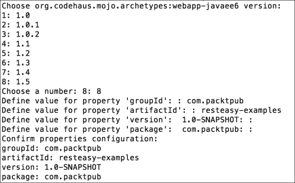
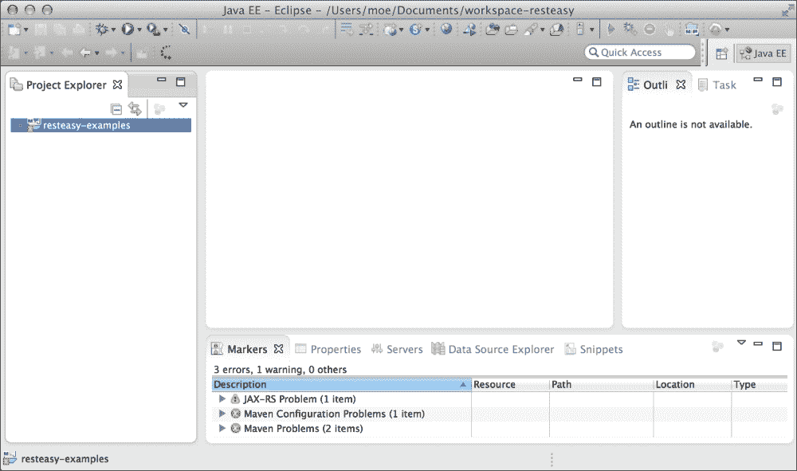
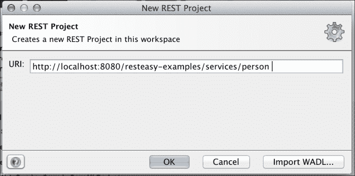

# 一、建立环境

我们非常热烈地欢迎您来到我们旅程的第一章。让我们给你一个想法，你会在这里取得什么成就。阅读本章之后，您将获得设置使用 RESTfulWeb 服务的开发环境所需的基础知识和启发性知识。然后，您将熟悉与之相关的一个非常基本的项目的开发。此外，到最后，您将非常清楚如何使用 RESTfulWeb 服务创建应用程序，以及如何实现这一点。本章将以非常简单和全面的方式为您提供使用此类 web 服务所需的信息。

在本章中，我们将介绍以下主题：

*   安装开发环境
*   创建我们的第一个 RESTful web 服务应用程序
*   测试 restfulweb 服务

# 下载工具

首先，我们必须获得我们的工作工具，这样我们才能着手编写代码。此处指定的工具在世界各地使用，但您可以自由选择您的工具。记住，“工具不能造就艺术家”。无论你是使用 Windows、MAC OS X 还是 Linux，这都无关紧要；每个操作系统都可以使用工具。

让我们简要解释一下每个工具的用途。我们将使用 Eclipse 作为 IDE，JBoss as 7.1.1.Final 作为应用服务器，Maven 自动化构建过程，SoapUI 作为测试我们将创建的 web 服务功能的工具来开发这些示例。此外，我们建议您安装最新版本的 JDK，即 JDK1.7.x。为了获得帮助，我们已经获得并包含了一些链接，您需要使用这些链接来获取软件以实现第一个示例。每个链接都会为您提供有关每个工具的更多信息，如果您还不了解它们，那么当您了解每个工具时，这些信息可能会有所帮助。

## 下载链接

必须下载以下工具：

*   Eclipse IDE 用于 JavaEE 开发人员 4.3（[http://www.eclipse.org/downloads/](http://www.eclipse.org/downloads/)
*   JBoss AS 7.1.1 最终（[http://www.jboss.org/jbossas/downloads/](http://www.jboss.org/jbossas/downloads/)
*   Apache Maven 3.1.1 或更高（[http://maven.apache.org/download.cgi](http://maven.apache.org/download.cgi)
*   SoapUI 4.6 或更高（[http://www.soapui.org/](http://www.soapui.org/) ）
*   JDK 1.7.x（[http://www.oracle.com/technetwork/java/javase/downloads/jdk7-downloads-1880260.html](http://www.oracle.com/technetwork/java/javase/downloads/jdk7-downloads-1880260.html) ）

# 创建基础项目

为了简化构建示例项目的过程，我们将使用 Maven。这个很棒的软件将在一眨眼之间创建一个基础项目，我们的项目可以很容易地编译和打包，而不需要依赖特定的 IDE。

Maven 将原型用于特定类型的项目。原型是以前创建的项目模板；它们允许我们创建各种应用程序，从 Java 桌面应用程序到多模块项目，其中 EAR 可以包含几个工件，如 JAR 和 WAR。其主要的目标是通过提供一个演示 Maven 许多特性的示例项目，让用户尽快启动并运行。如果您想了解更多关于 Maven 的信息，您可以访问[了解更多信息 http://maven.apache.org/](http://maven.apache.org/) 。

然而，我们在这里描述的信息足以让我们继续前进。我们将使用原型来创建一个基本项目；如果我们想说得更具体一些，我们将使用一个原型用 Java 创建一个 web 应用程序。为此，我们将在终端中键入以下命令行：

```java
mvn archetype:generate

```

当我们在终端中执行此命令行时，我们将获得 Maven 存储库中所有可用的原型。因此，让我们寻找创建 web 应用程序所需的原型；名称为`webapp-javaee6`，属于`org.codehaus.mojo.archetypes`集团。此外，我们可以使用表示其 ID 的数字来搜索它；此号码为`557`，如下图所示。我们建议您按名称搜索，因为数字可能会更改，因为稍后可能会添加一些其他原型：


会出现几个问题；我们必须为每个问题提供相应的信息。Maven 将使用此信息创建我们之前选择的原型，如以下屏幕截图所示：



您可能已经注意到，每个问题都要求您定义一个属性，每个属性的解释如下：

*   `groupId`：该属性代表该公司的域名倒序；通过这种方式，我们可以识别代码的所有者是哪家公司
*   `artifactId`：该物业代表项目名称
*   `version`：该属性代表项目版本
*   `package`：此属性表示要添加类的基本包的名称

类名和包名一起形成类的全名。此全名允许以唯一的方式识别类名。有时，当有几个类具有相同的名称时，包名称有助于识别它属于哪个库。

下一步是将项目放入 Eclipse 的工作区；为此，我们必须通过导航**文件****导入****Maven****现有 Maven 项目**将我们的项目导入 Eclipse。

我们应该在 IDE 中看到该项目，如以下屏幕截图所示：



在继续之前，让我们修复文件`pom.xml`中出现的问题。

下面的代码中显示的错误与来自 Eclipse 和 Maven 集成的错误有关。为了解决这个问题，我们必须在`<build>`标记之后添加`<pluginManagement>`标记。

`pom.xml`文件应如下所示：

```java
<project  xmlns:xsi="http://www.w3.org/2001/XMLSchema-instance"
  xsi:schemaLocation="http://maven.apache.org/POM/4.0.0 http://maven.apache.org/xsd/maven-4.0.0.xsd">
  <modelVersion>4.0.0</modelVersion>

  <groupId>com.packtpub</groupId>
  <artifactId>resteasy-examples</artifactId>
  <version>1.0-SNAPSHOT</version>
  <packaging>war</packaging>

  . . .

  <build>
 <pluginManagement>
      <plugins>
        <plugin>
          . . .
        </plugin>
      </plugins>
 </pluginManagement>
  </build>

</project>
```

### 提示

**下载样本代码**

您可以从您的账户[下载您购买的所有 Packt 书籍的示例代码文件 http://www.packtpub.com](http://www.packtpub.com) 。如果您在其他地方购买了本书，您可以访问[http://www.packtpub.com/support](http://www.packtpub.com/support) 并注册，将文件直接通过电子邮件发送给您。此外，我们强烈建议从 GitHub 获取源代码，网址为[https://github.com/restful-java-web-services-security](https://github.com/restful-java-web-services-security) 。

这将修复错误，现在我们只需要在项目中更新 Maven 的配置，如以下屏幕截图所示：


刷新项目后，错误应该会消失，因为当我们更新 Maven 的配置时，我们实际上正在更新项目的依赖项，例如缺少的库。通过这个，我们将把它们包括在我们的项目中，错误将消失。

在`src/main/webapp`路径中，我们创建`WEB-INF`文件夹。

现在，在`WEB-INF`文件夹中，我们将创建一个名为`web.xml`的新文件，其内容如下：

```java
<?xml version="1.0" encoding="UTF-8"?>
<web-app version="3.0" 
  xmlns:xsi="http://www.w3.org/2001/XMLSchema-instance"
  xsi:schemaLocation="http://java.sun.com/xml/ns/javaee 
  http://java.sun.com/xml/ns/javaee/web-app_3_0.xsd">
</web-app>
```

当您保护您的应用程序时，此文件非常有用；这一次，我们将在不进行任何配置的情况下创建它。目前，`/WEB-INF`文件夹和`web.xml`文件仅定义 web 应用程序的结构。

# 第一个功能示例

现在我们的开发环境都已经设置好了，是时候动手编写第一个 RESTful web 服务了。在使用 JBoss 时，让我们使用针对 JAX-RS 的 RESTEasy 实现；假设您想实现一项服务来保存和搜索人们的信息。

首先，我们创建一个使用 JAXB 注释的简单`Person`域类。JAXB 在 XML 和 Java 之间封送/解封送对象。对于本例，我们将把这些实例存储在内存缓存中，而不是数据库中。在 JEE 中，这通常表示关系型数据库中的一个表，每个实体实例对应于该表中的一行，如以下代码所示：

```java
package com.packtpub.resteasy.entities;

import javax.xml.bind.annotation.XmlAccessType;
import javax.xml.bind.annotation.XmlAccessorType;
import javax.xml.bind.annotation.XmlAttribute;
import javax.xml.bind.annotation.XmlElement;
import javax.xml.bind.annotation.XmlRootElement;

@XmlRootElement(name = "person")
@XmlAccessorType(XmlAccessType.FIELD)
public class Person {

  @XmlAttribute
  protected int id;

  @XmlElement
  protected String name;

  @XmlElement
  protected String lastname;

  public int getId() {
    return id;
  }

  public void setId(int id) {
    this.id = id;
  }

  public String getName() {
    return name;
  }

  public void setName(String name) {
    this.name = name;
  }

  public String getLastname() {
    return lastname;
  }

  public void setLastname(String lastname) {
    this.lastname = lastname;
  }

}
```

接下来，我们在`com.packtpub.resteasy.services`包中创建一个名为`PersonService`的新类。这个类将有两种方法；一个用来注册一个新的人物，另一个用来根据 ID 搜索人物。这个类将使用内存中的地图缓存来存储人物。

该服务将具有以下实现：

```java
package com.packtpub.resteasy.services;

import java.net.URI;
import java.util.HashMap;
import java.util.Map;

import javax.ws.rs.Consumes;
import javax.ws.rs.GET;
import javax.ws.rs.POST;
import javax.ws.rs.Path;
import javax.ws.rs.PathParam;
import javax.ws.rs.Produces;
import javax.ws.rs.WebApplicationException;
import javax.ws.rs.core.Response;

import com.packtpub.resteasy.entities.Person;

@Path("/person")
public class PersonService {
  private Map<Integer, Person> dataInMemory;
  public PersonService() {
    dataInMemory = new HashMap<Integer, Person>();
  }

  @POST
  @Consumes("application/xml")
  public Response savePerson(Person person) {
    int id = dataInMemory.size() + 1;
    person.setId(id);
    dataInMemory.put(id, person);
    return Response.created(URI.create("/person/" + id)).build();
  }

  @GET
  @Path("{id}")
  @Produces("application/xml")
  public Person findById(@PathParam("id") int id) {
    Person person = dataInMemory.get(id);
    if (person == null) {
      throw new WebApplicationException(Response.Status.NOT_FOUND);
    }
    return person;
  }
}
```

`@Path`注释定义了 URL 中的路径，该路径可用于此类中编写的功能。带`@Post`注释的方法表示应该发出 HTTP POST 请求。此外，它用`@Consumes`注释，并使用`application`/`xml`值；这意味着 POST 请求将使用 XML 格式的字符串执行，其中包含要保存的人的信息。另一方面，要从其 ID 查找人员，必须发出 HTTP GET 请求。URL 必须以与方法上的`@Path`注释相同的方式指示 ID。`@Produces`注释表示我们将获得 XML 格式的响应。最后，请注意，`@Path`注释中指示的参数 ID 用作使用`@PathParam`注释的方法的参数。

最后，我们编写了一个类来扩展`Application`类，并将刚刚创建的服务设置为单例。因此，信息不会在每个请求中丢失，我们将按如下方式将其保存在内存中：

```java
package com.packtpub.resteasy.services;

import java.util.HashSet;
import java.util.Set;

import javax.ws.rs.ApplicationPath;
import javax.ws.rs.core.Application;

@ApplicationPath("/services")
public class MyRestEasyApplication extends Application {

  private Set<Object> services;

  public MyRestEasyApplication() {
    services = new HashSet<Object>();
    services.add(new PersonService());
  }

  @Override
  public Set<Object> getSingletons() {
    return services;
  }
}
```

注意，当我们使用 JAXB 映射实体时，我们的方法使用和生成 XML 格式的信息。

为了在 JBoss 中部署我们的应用程序，我们应该在`pom.xml`文件中添加一个依赖项。此依赖项必须引用 JBoss 插件。我们必须在`pom.xml`中更改生成的工件名称。此文件的默认值为`artifactId`文件，后跟版本；例如，`resteasy-examples-1.0-snapshot.war`。我们会设置它，所以我们只使用`artifactId`文件；在本例中，`resteasy-examples.war`。所有这些配置都必须在`pom.xml`中包含、修改和实现，如以下 XML 代码所示：

```java
  <build>
 <finalName>${artifactId}</finalName>
    <pluginManagement>
      <plugins>
        <plugin>
          <groupId>org.jboss.as.plugins</groupId>
          <artifactId>jboss-as-maven-plugin</artifactId>
          <version>7.5.Final</version>
          <configuration>
            <jbossHome>/pathtojboss/jboss-as-7.1.1.Final</jbossHome>
          </configuration>
        </plugin>
        ...
        </plugin>
      </plugins>
    </pluginManagement>
  </build>
```

您应该更改 JBoss 安装路径的`jbossHome`属性的值。在这之后，我们将使用命令终端；前往项目目录，键入`mvn jboss-as:run`。如果在执行命令后对代码进行任何更改，则应使用以下命令查看更改：

```java
mvn jboss-as:redeploy

```

运行和重新部署是这个插件的目标。如果您想了解该插件的更多目标，可以访问[https://docs.jboss.org/jbossas/7/plugins/maven/latest/](https://docs.jboss.org/jbossas/7/plugins/maven/latest/) 。这将再次编译所有项目类；然后将其打包以创建`.war`文件。最后，修改将部署在服务器上。如果一切正常，我们应该在终端中看到一条消息，说明部署已成功完成，如以下屏幕截图所示：


本章的源代码可在 GitHub 上的以下位置获得：

[https://github.com/restful-java-web-services-security/source-code/tree/master/chapter01](https://github.com/restful-java-web-services-security/source-code/tree/master/chapter01)

## 测试示例 web 服务

现在，我们将测试刚刚创建的功能。我们将使用 SoapUI 作为我们的测试工具；请确保使用最新版本，或者至少使用等于或大于 4.6.x 的版本，因为此版本提供了更多测试 RESTful Web 服务的功能。让我们从执行以下步骤开始：

1.  From the main menu, let's create a new REST project by navigating to **File** | **New REST Project**, as shown in the following screenshot:

    

2.  Set the URI of our service, as follows:

    

3.  之后，让我们使用`POST`方法从工作区创建一个新的人员。在**媒体类型**字段中，选择**应用程序/xml**并使用包含带信息的 xml 的字符串执行请求，如下文本所示：

    ```java
    <person><name>Rene</name><lastname>Enriquez</lastname></person>
    ```

4.  When we click on the **Play** button, we should obtain an answer where it shows the created resource URI (hyperlink "`http://localhost:8080/resteasy-examples/services/person/1`"), as shown in the following screenshot:

    

5.  If we change the URI from the **Resource** textbox in SoapUI and use the `GET` method, it will show us the data we just entered, as shown in the following screenshot:

    

祝贺我们开发了第一个具有两个功能的 RESTful web 服务。第一种是将人们的信息保存在内存中，第二种是通过 ID 检索人们的信息。

### 注

如果重新启动 JBoss 或再次部署应用程序，所有数据都将丢失。在搜索人员信息之前，必须先保存数据。

# 总结

在本章中，我们创建了第一个功能性应用程序，类似于*hello world*示例，但功能更接近真实世界。

我们在本章中介绍的基本部分是熟悉我们将使用的工具。在后面的章节中，我们将假设这些概念已经很清楚了。例如，在使用 SoapUI 时，我们将逐步向前推进，因为这是一个工具，将有助于测试我们将要开发的功能。这样，我们将避免为 web 服务客户端编写代码的任务。

现在我们准备好回顾下一章，其中包含 Java 提供的一些安全模型。我们将了解其中的每一项，并学习如何实施它们。