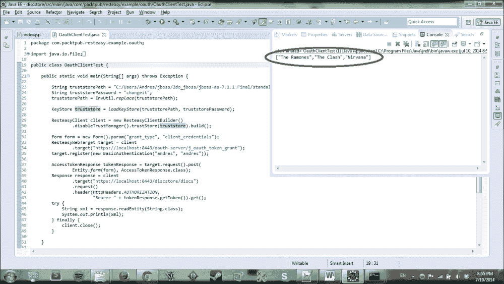
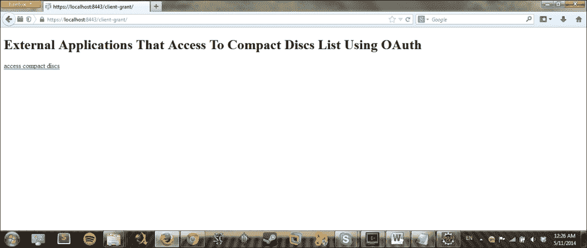
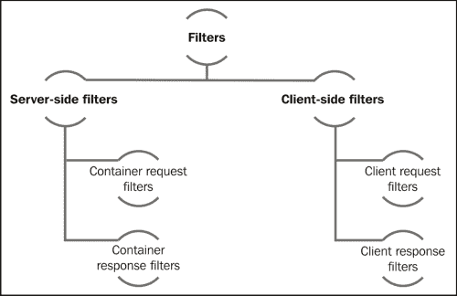

# 四、RESTEasy 万能钥匙

欢迎来到第四章！我们希望你们喜欢这本书，更重要的是，学习和理解我们向你们传递和传授的东西。是时候向前迈进，让自己沉浸在新的篇章中了。

阅读本章后，您将了解如何设计、实现和聚合 RESTEasy 应用程序的附加安全级别，所有这些都使用 OAuth 和 RESTEasy 骨架密钥以及这些技术的一些其他特定要求，例如设置 OAuth 服务器。您将通过应用程序的实际和描述性示例学习，就像我们在前面的章节中所做的那样；我们不会只停留在理论上，我们将实现应用程序并解释实现 OAuth 的具体方法和类。

在本章中，您将了解以下主题：

*   OAuth 和 RESTEasy
*   用于安全管理的 SSO 配置
*   访问令牌
*   自定义过滤器
*   用于测试的 Web 服务客户端

正如你可能经历过的那样，如果你在一个或多个社交网络上拥有一个帐户，那么很多社交网络都允许你在他们之间共享信息或在所有社交网络中发布内容。这表明应用程序需要共享信息并使用其他应用程序中的资源。在本例中，它可以是您的帐户或联系人列表。这涉及敏感信息，因此需要对其进行保护。此外，对资源的有限权限意味着第三方应用程序只能读取您的联系人列表。这为应用程序中的一个非常重要、有吸引力和有用的特性打开了大门，即代表用户使用资源的能力。当然，你可能会问，后者是如何授权使用的？好的，这一章会告诉你。那么，我们走吧！

# OAuth 协议

这是一个开放协议，允许您在不共享您的身份的情况下，从一个站点（服务提供商）向另一个站点（消费者）授予您的私人资源安全授权。

一个实际的例子是，您授权网站或应用程序使用手机或社交网络中的联系人列表。

# OAuth 和 RESTEasy 骨架键

在本节中，我们将回顾一些与 OAuth 相关的概念，这些概念作为身份验证框架，RESTEasy 骨架密钥，以及它们是如何协同工作的。您将了解这些技术的一些特性，并以一些代码作为一个实际示例。

## 什么是 RESTEasy 骨架键？

RESTEasy 骨架密钥为浏览器和 JAX-RS 客户端提供了统一的安全保护方式。这允许以安全和可扩展的方式在应用程序和服务网络中执行和转发请求，而无需每次出现请求时都与中央身份验证服务器交互。

## OAuth 2.0 认证框架

此允许第三方应用程序或服务代表资源所有者访问 HTTP 资源。它还阻止第三方应用程序或服务与所有者的凭据联系。这可以通过浏览器发布访问令牌和使用直接授权来实现。

简而言之，这两个概念已经解释清楚了，现在是时候描述它们之间的关系了。RESTEasy Skeleton Key 是一个 OAuth 2.0 实现，它使用 JBoss 作为 7 安全基础设施来保护 web 应用程序和 RESTful 服务。

这意味着您可以将 web 应用程序转换为 OAuth 2.0 访问令牌提供程序，还可以将 JBoss AS 7 安全域转换为中央身份验证和授权服务器，在该服务器上应用程序和服务可以相互交互。

下图以更好的方式描述了此过程：


### 主要特点

我们希望帮助您理解这些技术，并澄清它们的用途；这就是为什么我们将命名它们的一些主要特性。使用 OAuth 2.0 和 RESTEasy Skeleton 键，可以执行以下功能：

*   将基于身份验证的 servlet 表单 web 应用程序转换为 OAuth 2.0 提供程序。
*   通过中央认证服务器提供分布式**单点登录**（**SSO**），以便一次性登录并安全访问域中配置的任何基于浏览器的应用程序。
*   只需使用一个链接，即可从配置了 SSO 的所有分布式应用程序中注销。
*   使用访问令牌使 web 应用程序与远程 RESTful 服务交互。
*   使用 OAuth 2.0 对访问令牌进行签名，稍后使用这些令牌访问域中配置的任何服务。令牌具有身份和角色映射，并且不需要在出现的每个请求时使中央身份验证服务器过载，因为令牌是经过数字签名的。

您可以在[找到关于这些主题的更多信息 http://docs.jboss.org/resteasy/docs/3.0-beta-2/userguide/html/oauth2.html](http://docs.jboss.org/resteasy/docs/3.0-beta-2/userguide/html/oauth2.html) 。

我们将讨论最重要的部分，但它可能对您有用。

## OAuth2 实现

我们刚刚回顾了本章将要讨论的一些主要概念，但这还不够。我们必须实现一个描述性示例，以便能够完全理解这些主题。

### 更新 JBoss 中的 RESTEasy 模块

为了不干扰您的 JBoss 配置或其他任何东西，我们将使用另一个全新的 JBoss 实例。我们必须更新一些与 RESTEasy 相关的模块。我们可以很容易地做到这一点。我们来看看链接[http://resteasy.jboss.org/](http://resteasy.jboss.org/) ；在右侧，您将看到一个标题为**有用链接**的面板，其中有一个下载链接。点击它可以访问另一个有很多下载链接的页面。在本例中，我们使用 3.0.7.0 最终版本。下载此版本以便继续。

下载并解压缩后，您会发现另一个名为`resteasy-jboss-modules-3.0.7.Final`的`.zip`文件；此文件包含一些 JAR，它们将更新 JBoss 模块。所以，解压它，将所有文件夹复制到`JBOSS_HOME/modules/`中，并替换所有巧合。还有最后一步：我们必须更新 JAR 文件的版本并修改 JBoss 中的模块 XML，以便将`org.apache.httpcomponents`设置为使用`httpclient-4.2.1.jar`、`httpcore-4.2.1.jar`和`httpmime-4.2.1.jar`，因为当前的最新版本是 4.3.4，这也很好。因此，复制这些 JAR 并更新`JBOSS_HOME/modules/org/apache`文件夹中`module.xml`文件中的版本。现在，我们已经为 RESTEasy 更新了模块。

### 在 JBoss 中设置配置

对于为我们的示例准备 JBoss 的下一步，我们必须转到[https://github.com/restful-java-web-services-security/source-code/tree/master/chapter04](https://github.com/restful-java-web-services-security/source-code/tree/master/chapter04) 下载`chapter04`示例 zip 文件。解压缩后，您将找到一个名为`configuration`的文件夹。此文件夹包含设置 JBoss 配置所需的文件。因此，复制文件并替换位于`JBOSS_HOME/standalone/configuration`的 JBoss 中的配置文件夹。

### 实现 OAuth 客户端

为了开发这个示例，我们研究了一个非常有用的示例，并将其应用到一个新项目中。这个例子由几个项目组成；每个项目将生成一个 WAR 文件。本例的目的是演示 OAuth 是如何工作的，并解释如何在技术层面上实现此技术。因此，我们将模拟几种情况，以创建可以应用此实现的环境。完整代码可从以下链接下载：

[https://github.com/restful-java-web-services-security/source-code/tree/master/chapter04/oauth2-as7-example](https://github.com/restful-java-web-services-security/source-code/tree/master/chapter04/oauth2-as7-example)

#### oauth 客户项目

首先我们将创建`oauth-client`webapp 项目。您可以使用我们在前面章节中使用过的 Maven 命令，也可以使用 EclipseIDE 来执行此操作。

之后，让我们添加一些依赖项以实现我们的客户机。这些依赖关系适用于所有项目。转到`pom.xml`文件，确保在`<dependencies>`标记中添加以下依赖项：

```java
       <dependency>
            <groupId>org.jboss.spec.javax.servlet</groupId>
            <artifactId>jboss-servlet-api_3.0_spec</artifactId>
            <version>1.0.1.Final</version>
            <scope>provided</scope>
        </dependency>
        <dependency>
            <groupId>org.jboss.resteasy</groupId>
            <artifactId>resteasy-client</artifactId>
            <version>3.0.6.Final</version>
            <scope>provided</scope>
        </dependency>
        <dependency>
            <groupId>org.jboss.resteasy</groupId>
            <artifactId>skeleton-key-core</artifactId>
            <version>3.0.6.Final</version>
            <scope>provided</scope>
        </dependency>
```

让我们从创建包`com.packtpub.resteasy.example.oauth`开始。然后，创建类`public class Loader implements ServletContextListener`，它实现了`ServletContextListener`，因为我们将加载一个密钥存储并初始化一个上下文。

让我们在类`private ServletOAuthClient oauthClient`中添加一个字段，它将代表我们的 OAuth 客户机对象。

然后，让我们创建如下代码所示的方法：

```java
private static KeyStore loadKeyStore(String filename, String password) throws Exception 
{
KeyStore keyStore = KeyStore.getInstance(KeyStore.getDefaultType());
File keyStoreFile = new File(filename);
FileInputStream keyStoreStream = new FileInputStream(keyStoreFile);
    keyStore.load(keyStoreStream, password.toCharArray());
    keyStoreStream.close();
    return keyStore; 
}
```

此方法接收两个参数，文件名和密码，并创建对象`KeyStore`。它还根据接收到的文件名创建一个`FileInputStream`对象，以便使用它加载`KeyStore`对象，并使用以字符数组形式接收的密码。

之后，由于我们的类实现了`ServletContextListener`接口，我们必须重写一些方法。第一种覆盖方法是`contextInitialized`。让我们按如下方式进行：

```java
@Override
 public void contextInitialized(ServletContextEvent sce) {
  String truststoreKSPath = "${jboss.server.config.dir}/client-truststore.ts";
  String truststoreKSPassword = "changeit";
  truststoreKSPath = EnvUtil.replace(truststoreKSPath);
  try {
   KeyStore truststoreKS = loadKeyStore(truststoreKSPath, 
     truststoreKSPassword);
   oauthClient = new ServletOAuthClient();
   oauthClient.setTruststore(truststoreKS);
   oauthClient.setClientId("third-party");
   oauthClient.setPassword("changeit");
   oauthClient.setAuthUrl("https://localhost:8443/oauth-server/login.jsp");
   oauthClient.setCodeUrl("https://localhost:8443/oauth-server/
     j_oauth_resolve_access_code");
   oauthClient.start();
   sce.getServletContext().setAttribute(ServletOAuthClient.class.getName(), oauthClient);
  } catch (Exception e) {
   throw new RuntimeException(e);
  }

 }
```

通过这个方法，我们将完成几件事情。如你所见，我们设置了两个内部变量；一个设置为我们的`client-truststore.ts`文件路径，另一个设置为密码。确保将文件粘贴到我们在变量（`JBOSS_HOME/standalone/configuration`中指定的路径中。

在此之后，我们使用变量中指定的路径和密码加载`KeyStore`对象，通过此路径获得另一个`KeyStore`对象。

现在，是实例化和设置 OAuth 客户机对象属性的时候了。在前面的代码中，我们设置了以下属性：`trustStore`、`clientId`、`password`、`authUrl`和`codeUrl`。

最后，我们创建客户端以从代码中获取访问令牌。为了实现这一点，我们使用了`start()`方法。此外，我们还使用刚刚创建的 OAuth 客户端对象设置 servlet 属性 OAuth 客户端。

为了完成 OAuth 客户端，我们需要重写第二个名为`public void contextDestroyed(ServletContextEvent sce)`的方法，如下代码所示：

```java
@Override
  public void contextDestroyed(ServletContextEvent sce) {
    oauthClient.stop();
  }
```

此方法将在 servlet 上下文即将关闭、应用程序正在重新部署等情况下执行。该方法关闭客户端实例及其所有关联资源。

我们为示例实现了 OAuth 客户机。我们需要另一种资源。这一次，我们将创建一个类，作为光盘商店的数据库客户机。因此，我们将其命名为`CompactDiscsDatabaseClient`，我们将得到以下两种方法：

*   `public static void redirect(HttpServletRequest request, HttpServletResponse response)`
*   `public static List<String> getCompactDiscs(HttpServletRequest request)`

那么，让我们开始实现第一种方法。该方法解释如下：

```java
public static void redirect(HttpServletRequest request, HttpServletResponse response) {
ServletOAuthClient oAuthClient = (ServletOAuthClient) request.getServletContext().getAttribute(ServletOAuthClient.class.getName());
    try {
oAuthClient.redirectRelative("discList.jsp", request, response);
    } catch (IOException e) {
      throw new RuntimeException(e);
    }
  }
```

在前面的方法中，我们从请求获取的`ServletContext`中获取`ServletOAuthClient`对象；servlet OAuth 客户端作为名为`ServletOAuthClient`的属性在 servlet 上下文中。请记住，在我们创建的第一个类中，我们在 servlet 上下文中设置了这个属性。

最后，我们通过`redirectRelative (String relativePath, HttpServletRequest request, HttpServletResponse response)`将浏览器重定向到认证服务器，开始获取访问令牌的过程。

现在，让我们继续下一个加载光盘的方法。以下代码表示该方法：

```java
public static List<String> getCompactDiscs(HttpServletRequest request) {

ServletOAuthClient oAuthClient = (ServletOAuthClient) request.getServletContext().getAttribute(
        ServletOAuthClient.class.getName());

ResteasyClient rsClient = new 
ResteasyClientBuilder().trustStore(oAuthClient.getTruststore()).hostnameVerification(ResteasyClientBuilder.HostnameVerificationPolicy.ANY).build();

String urlDiscs = "https://localhost:8443/store/discs";
  try {
String bearerToken = "Bearer" + oAuthClient.getBearerToken(request);

Response response = rsClient.target(urlDiscs).request().header(HttpHeaders.AUTHORIZATION, bearerToken)
          .get();
    return response.readEntity(new GenericType<List<String>>() {
	      });
    } finally {
      rsClient.close();
    }
}
```

让我们看看上面有什么。在前面的`getCompactDiscs ()`方法中，我们创建了一个`ServletOAuthClient`对象，该对象负责通过将浏览器重定向到身份验证服务器来启动获取访问令牌的过程。再次，我们从请求的`ServletContext`对象获得属性。然后，我们使用`ResteasyClientBuilder()`的一个新实例创建一个`ResteasyClient`对象；此类是用于创建客户端的抽象，并允许 SSL 配置。

然后我们使用`trustStore()`方法设置客户端信任存储。此调用将返回一个`KeyStore`对象并设置客户端信任存储。在此之后，我们调用`hostnameVerification()`方法，该方法设置用于验证主机名的 SSL 策略。最后，使用`build()`方法，我们使用之前在此客户端生成器中指定的整个配置构建一个新的客户端实例。这将返回一个`ResteasyClient`实例。

让我们继续创建一个内部变量，它将保存我们将设置为目标资源的资源的 URL。此外，我们将创建另一个内部变量，以将承载令牌作为字符串保存。该字符串将包含单词`Bearer`，后跟来自 servlet OAuth 客户端和请求的承载令牌。

现在，为了创建响应，我们将使用刚刚创建的 servlet OAuth 客户机。让我们使用变量`urlDiscs`作为参数，通过`target()`方法创建一个新的 web 资源目标。在这之后，使用`request()`方法，我们对刚刚设置的目标 web 资源设置了一个请求。

最后，我们通过调用`header()`方法添加一个头，该方法将接收两个参数：第一个参数表示头的名称，第二个参数表示头的值。之后，我们为当前请求调用`HTTP GET`方法。

只是澄清一下，`HttpHeaders.AUTHORIZATION`常量表示在特定情况下，当用户希望向服务器进行身份验证时的头字段。它通过在请求的同时添加授权请求头字段来实现。另一方面，authorization 字段值由包含所请求资源领域的用户身份验证信息的凭据组成。

创建响应对象后，我们使用`readEntity()`方法将消息实体输入流作为指定 Java 类型的实例读取。有了这些，我们就可以用我们的光盘示例列表来填充列表，这样我们就可以在网页上展示它了。这意味着我们访问了资源。

如果您想进一步了解我们刚才在描述的代码块中使用的内容，这里有一些链接作为参考。您可以查看它们，扩展您的知识，并获得有关`RestEasyClient`和`RestEasyClientBuilder`的更多详细信息：

*   [http://www.w3.org/Protocols/rfc2616/rfc2616-sec14.html](http://www.w3.org/Protocols/rfc2616/rfc2616-sec14.html)
*   [http://docs.jboss.org/resteasy/docs/3.0.2.Final/javadocs/org/jboss/resteasy/client/jaxrs/ResteasyClient.html](http://docs.jboss.org/resteasy/docs/3.0.2.Final/javadocs/org/jboss/resteasy/client/jaxrs/ResteasyClient.html)
*   [http://docs.jboss.org/resteasy/docs/3.0.1.Final/javadocs/org/jboss/resteasy/client/jaxrs/ResteasyClientBuilder.html#truststore](http://docs.jboss.org/resteasy/docs/3.0.1.Final/javadocs/org/jboss/resteasy/client/jaxrs/ResteasyClientBuilder.html#truststore)

#### discstore 项目

我们将要创建的下一个项目是`discstore`项目；创建项目的步骤与前一步相同，您可以使用 Maven 命令或 EclipseIDE。

在这个项目中，我们将创建一个类来创建光盘列表。这个类非常简单，它使用了一些在前面章节中已经讨论过的注释。这个类的名称将是`CompactDiscService`，它将只有一个带有多个注释的方法。让我们从代码开始，我们将在代码块后添加一个简短的描述：

```java
@Path("discs")
public class CompactDiscService {
  @GET
 @Produces("application/json")
  public List<String> getCompactDiscs() {
    ArrayList<String> compactDiscList = new ArrayList<String>();
    compactDiscList.add("The Ramones");
    compactDiscList.add("The Clash");
    compactDiscList.add("Nirvana");
    return compactDiscList;
  }
}
```

如您所见，方法`getCompactDiscs()`负责创建字符串列表，每个项目将表示为光盘，因为这是一个示例，我们将添加三个项目。

`@Produces`注释用于指定 MIME 媒体类型，如果在方法级别应用，注释将覆盖在类级别应用的任何`@Produces`注释。您已经知道，`@GET`注释将代表 HTTP 方法`GET`。同时，`@Path`注释将帮助我们将该类设置为资源，其名称为`discs`。

所有后端都已实现；我们现在需要开发一些其他资源，以便让我们的示例发挥作用。还记得我们在上面的类中指定了一些网页吗？这就是我们现在要实施的。

#### oauth 服务器项目

与前面一样，为了创建这个项目，可以使用 Maven 命令或 EclipseIDE。

为了打开此应用程序，我们必须创建具有以下内容的`jboss-web.xml`文件：

```java
<jboss-web>
    <security-domain>java:/jaas/commerce</security-domain>
    <valve>
        <class-name>org.jboss.resteasy.skeleton.key.as7.OAuthAuthenticationServerValve</class-name>
    </valve>
</jboss-web>
```

最后一件事：我们必须创建一个 JSON 文件，以便在该服务器中拥有证书和安全配置。我们将把它命名为`resteasy-oauth`。正如你所看到的，这个文件没有什么大不了的；它是一组属性和值。通过这个文件，我们指定密钥库和密码、信任库路径等。此文件将位于本项目的`WEBINF`文件夹中。

```java
{
   "realm" : "commerce",
   "admin-role" : "admin",
   "login-role" : "login",
   "oauth-client-role" : "oauth",
   "wildcard-role" : "*",
   "realm-keystore" : "${jboss.server.config.dir}/realm.jks",
   "realm-key-alias" : "commerce",
   "realm-keystore-password" : "changeit",
   "realm-private-key-password" : "changeit",
   "truststore" : "${jboss.server.config.dir}/client-truststore.ts",
   "truststore-password" : "changeit",
   "resources" : [
      "https://localhost:8443/oauth-client",
      "https://localhost:8443/discstore/"
   ]
}
```

#### webapp/WEB-INF/jboss-deployment-structure.xml

我们必须在所有项目中配置此文件，因为我们更新了 JBoss AS 实例中的一些模块。在这个文件中，我们必须指定我们的应用程序与 JBoss 的一些模块之间的依赖关系。然后，我们需要使用标签中的`<module>`标签来清楚地设置它们，如下所示：

```java
<jboss-deployment-structure>
    <deployment>
        <!-- This allows you to define additional dependencies, it is the same as using the Dependencies: manifest attribute -->
        <dependencies>
            <module name="org.jboss.resteasy.resteasy-jaxrs" services="import"/>
            <module name="org.jboss.resteasy.resteasy-jackson-provider" services="import"/>
            <module name="org.jboss.resteasy.skeleton-key" />
        </dependencies>
    </deployment>
</jboss-deployment-structure>
```

#### 运行应用程序

我们已经解释了每个项目的主要部分，因此为了运行和测试应用程序，您可以从[下载本章的示例文件夹 https://github.com/restful-java-web-services-security/source-code/tree/master/chapter04](https://github.com/restful-java-web-services-security/source-code/tree/master/chapter04) 。下载 ZIP 文件后，将其解压缩，您将发现有一个名为`OAuthExample`的文件夹。在这个文件夹中，有三个项目。您可以复制它们并将它们粘贴到工作区中，然后使用 Eclipse 导入项目。

我们已经向您提供了密钥库，以及您在设置 JBoss`configuration`时刚刚粘贴的`configuration`文件夹中的证书和信任库文件。为了确保应用程序正确运行，您可以按照`configuration`文件夹中名为`keystoreCommands`的`.txt`文件中的说明更新这些文件。

为了启动我们的应用程序，我们必须部署它。所以，打开一个终端。让我们转到`JBOSS_HOME/bin`以独立模式启动 JBoss；这意味着在 Windows 中执行`standalone.bat`，在 Linux 中执行`./standalone.sh`。然后，打开一个终端，进入工作区中应用程序的文件夹。我们必须在我们创建的三个项目中的每一个上执行以下命令：`mvn clean install`后跟`mvn``jboss-as:deploy`：`discstore`、`oauth-client`和`oauth-server`。

我们在`discstore`项目中创建了一个特殊类。这个类包含一个`void main`方法，我们通过这个类测试我们的应用程序。我们把它命名为`OAuthClientTest`。该类代码如下所示：

```java
public class OauthClientTest {

  public static void main(String[] args) throws Exception {

    String truststorePath = "C:/Users/Andres/jboss/2do_jboss/jboss-as-7.1.1.Final/standalone/configuration/client-truststore.ts";
    String truststorePassword = "changeit";
    truststorePath = EnvUtil.replace(truststorePath);

    KeyStore truststore = loadKeyStore(truststorePath, truststorePassword);

         ResteasyClient client = new ResteasyClientBuilder()
                .disableTrustManager().trustStore(truststore).build();

    Form form = new Form().param("grant_type", "client_credentials");
    ResteasyWebTarget target = client.target("https://localhost:8443/oauth-server/j_oauth_token_grant");
    target.register(new BasicAuthentication("andres", "andres"));

    AccessTokenResponse tokenResponse = target.request().post(Entity.form(form), AccessTokenResponse.class);
    Response response = client.target("https://localhost:8443/discstore/discs")
        .request()
        .header(HttpHeaders.AUTHORIZATION,
            "Bearer " + tokenResponse.getToken()).get();
    try {
      String xml = response.readEntity(String.class);
      System.out.println(xml);
    } finally {
      client.close();
    }

  }
```

我们将解释前面的代码，首先，我们有两个变量，`truststorePath`和`truststorePassword`。第一个是引用我们 JBoss 配置文件夹中的`client-truststore.ts`文件的路径。您应该更改此变量的值以使此测试正常工作，因此请放置配置文件夹的路径。在此之后，使用我们已经解释过的方法`loadKeyStore ()`，我们使用前面的变量加载密钥库，并将该值分配给名为`truststore`的`KeyStore`对象。我们从`truststore`创建名为`client`的`RestEasyClient`对象。

现在，我们将以编程方式获取访问令牌，因此我们可以通过使用 HTTPS 调用从 auth 服务器请求访问令牌。然后我们必须使用基本身份验证来识别我们的用户；因此，我们将获得该用户的签名访问令牌。

因此，我们对身份验证服务器的上下文根执行一个简单的`POST`，在目标 URL 的末尾使用`j_oauth_token_grant`，因为当我们使用该 URL 和带有基本身份验证的`POST`时，我们将获得特定用户的访问令牌。

之后我们获得了访问令牌，它是一个简单的字符串。为了在受承载令牌身份验证保护的服务上调用，我们必须构建一个字符串，该字符串由您的`HTTPS`请求的授权头加上字符串`Bearer`，最后是访问令牌字符串组成。这将返回响应对象，因此我们可以像在测试中一样读取并打印它。在控制台中，您将看到光盘列表，如以下屏幕截图所示：



# 用于安全管理的 SSO 配置

SSO 是一种身份验证机制。它允许用户只需输入一次凭证即可访问多个系统或应用程序。我们认为这些天你会更频繁地体验到这一点，因为我们生活在一个社交网络时代，而这些服务中的大多数都允许我们使用彼此的凭据访问多个服务。

在讨论了 SSO 的一些概念之后，让我们尝试并实现这个机制。为了实现这一点，我们将使用 JBoss7 应用服务器和我们早期的项目`secure-demo`。

作为对该实现的简要介绍，我们想告诉您，我们将使用两个文件；一个文件属于 JBoss，另一个属于我们的应用程序。

属于 JBoss 的文件是`standalone.xml`。我们将在此文件中添加一些行。在以下代码行中，让我们在`virtual-server`定义中添加 SSO 元素：

```java
<subsystem  default-virtual-server="default-host" native="false">
            <connector name="http" protocol="HTTP/1.1" scheme="http" socket-binding="http"/>
            <virtual-server name="default-host" enable-welcome-root="true">
                <alias name="localhost"/>
                <sso domain="localhost" reauthenticate="false"/>
            </virtual-server>
</subsystem>
```

`reauthenticate`属性允许我们确定每个请求是否需要重新验证到`securityReal`。默认值为`false`。

我们必须编辑的下一个文件在我们的应用程序中，它的名称是`jboss-web.xml`。此外，我们需要向该文件添加一些代码行。这些代码行将声明管理 SSO 的阀。换句话说，每个请求都将通过该阀，如以下代码所示：

```java
<jboss-web>
    <security-domain>java:/jaas/other </security-domain>
          <valve>
        <class-name>org.apache.catalina.authenticator.SingleSignOn</class-name>
    </valve>
</jboss-web>
```

为了防止您忘记或删除它，我们在前面的章节中设置了一个安全域。`standalone.xml`文件中必须存在以下代码块：

```java
<security-domain name="other" cache-type="default">
    <authentication>
      <login-module code="Remoting" flag="optional">
<module-option name="password-stacking"  value="useFirstPass"/>
      </login-module>
      <login-module code="RealmUsersRoles" flag="required">
<module-option name="usersProperties" value="${jboss.server.config.dir}/application-users.properties"/>
<module-option name="rolesProperties" value="${jboss.server.config.dir}/application-roles.properties"/>
<module-option name="realm" value="ApplicationRealm"/>
<module-option name="password-stacking" value="useFirstPass"/>
      </login-module>
     </authentication>
</security-domain>
```

因为我们使用的是`secure-demo`示例，所以为了配置 SSO，我们必须修改这些内容。

为了测试这个机制，我们需要另一个应用程序。我们必须复制刚才在`secure-demo`示例中所做的配置。

当我们在其中一个中输入凭据时，我们不再需要在其他中输入凭据，因为我们已经应用了 SSO。我们将在这两个应用程序中进行身份验证。

# 通过基本身份验证的 OAuth 令牌

现在，让我们探索并实现一个使用令牌的简短示例。为了构建这个示例，我们将创建一个类。与上一个示例一样，此类将模拟数据库客户机。它将具有相同的方法`getCompactDiscs()`，但我们将在本例中修改内部函数。而且，这次它不会收到任何参数。

好吧，我们开始吧！首先，在类中创建两个静态字符串字段。第一个字段将保存身份验证服务器中用于身份验证的 URL。另一个字段将显示光盘列表的 URL；您可以重用上一个示例中的相同网页。然后，您应该有如下所示的变量：

```java
private static String urlAuth = "https://localhost:8443/auth-server /j_oauth_token_grant";
private static String urlDiscs = "https://localhost:8443/discstore/discs";
```

之后，让我们创建获取光盘列表的方法。下面的代码片段向您展示了该方法是如何执行的：

```java
public static List<String> getCompactDiscs() {
  ResteasyClient rsClient = new ResteasyClientBuilder().disableTrustManager().build();
    Form form = new Form().param("grant_type", "client_credentials");
  ResteasyWebTarget resourceTarget = rsClient.target(urlAuth);
    resourceTarget.register(new BasicAuthentication("andres", "andres"));
  AccessTokenResponse accessToken = resourceTarget.request().post(Entity.form(form), AccessTokenResponse.class);
    try {
      String bearerToken = "Bearer " + accessToken.getToken();
      Response response = rsClient.target(urlDiscs).request().header(HttpHeaders.AUTHORIZATION, bearerToken).get();
      return response.readEntity(new GenericType<List<String>>() {
      });
    } finally {
      rsClient.close();
    }
  }
```

是时候检查我们刚刚做的事情了。作为第一步，我们创建了一个`ResteasyClient`对象。如果您注意到了，我们使用了一些东西来禁用信任管理和主机名验证。此调用的结果是，它关闭允许 MITM（中间人）攻击的服务器证书验证。因此，请谨慎使用此功能。

之后，我们创建一个对象并传入一些参数。这些参数通过`param()`方法传入，分别表示参数名和参数值。这意味着我们将指定申请所请求的授权类型，即`client_credentials`。

然后，正如我们在前面的示例中所做的那样，让我们创建一个 RESTEasy web 目标，该目标将指向显示光盘列表的 URL。请记住，此 URL 是在前面创建的静态字段中设置的。此 web 目标将是我们将访问的`resourceTarget`对象。

当我们使用`register()`方法并传入`BasicAuthentication`对象时，我们注册了一个自定义 JAX-RS 组件的实例，该实例将被实例化并在这个可配置上下文的范围内使用。

接下来，我们通过执行对 web 目标的请求来创建`AccessTokenResponse`类。然后，在同一行中，我们执行 post，以便同步发送我们想要为当前请求获取的实体和响应类型。`Entity.form()`方法从我们之前创建的`form`对象创建`application/x-www-form-urlencoded`实体。现在，这将返回一个`AccessTokenResponse`对象；我们使用此对象通过在令牌的开头添加单词`Bearer`来构建承载令牌。

最后，让我们通过对`urlDiscs`变量中设置的 URL 执行请求来创建响应对象。我们应该使用`ResteasyClient`对象来定位此资源，然后执行请求，并使用变量`bearerToken`中设置的`bearer`令牌将 headers 字段设置为`HttpHeaders.AUTHORIZATION`。这样，我们就可以访问目标资源；在这种情况下，我们可以看到信息。

当我们继续使用相同的应用程序业务时，我们可以重用前面示例中的 web 页面。确保将网页`index.html`和`discsList.jsp`合并到您的示例中，路径与上一个示例相同。我们还将使用`jboss-deployment-structure.xml`文件中设置的配置，因为我们使用的是相同的模块依赖项。

我们的`web.xml`文件看起来应该比前面的示例更简单，因此它可能类似于以下内容：

```java
<?xml version="1.0" encoding="UTF-8"?>
<web-app 
      xmlns:xsi="http://www.w3.org/2001/XMLSchema-instance"
      xsi:schemaLocation="http://java.sun.com/xml/ns/javaee http://java.sun.com/xml/ns/javaee/web-app_3_0.xsd"
      version="3.0">
    <security-constraint>
        <web-resource-collection>
            <url-pattern>/*</url-pattern>
        </web-resource-collection>
        <user-data-constraint>
            <transport-guarantee>CONFIDENTIAL</transport-guarantee>
        </user-data-constraint>
    </security-constraint>
</web-app>
```

## 运行应用程序

您可以从[下载完整的代码和配置 https://github.com/restful-java-web-services-security/source-code/tree/master/chapter04](https://github.com/restful-java-web-services-security/source-code/tree/master/chapter04) 。解压文件，你会在里面找到一个名为`token-grant`的文件夹。您必须使用相同的命令部署此项目。根据要求，您必须部署项目`oauth-server`、`oauth-client`和`discstore`。

是时候运行我们的应用程序了。让我们执行上一个示例中的步骤，OAuth 示例。之后，我们必须打开我们最喜欢的浏览器并键入 URL`https://localhost:8443/token-grant/`。这将引导我们进入以下网页：



正如您所注意到的，我们重复使用了相同的网页，只是为了这些示例的目的。然而，有一点差别；当调用不同的网页时，您可以查看我们刚才解释的核心。这将执行一个令牌，在这里我们将对我们希望通过该令牌访问的数据执行一个请求。因此，我们将在网页上阅读光盘列表，如以下屏幕截图所示：


最终结果是能够在网页中显示光盘列表。然而，不要忘记发生了什么；我们刚刚获得了一个使用请求的访问令牌响应、使用我们的凭证的基本身份验证以及一个表单。通过访问令牌响应，我们可以创建响应，并使用相应的授权呈现数据。

# 定制过滤器

简单介绍一下，JAX-RS2.0 有两个不同的拦截概念：过滤器和拦截器。

拦截器是拦截 EJB 方法调用的组件。它们可用于在访问 EJB 时进行审核和登录。这是本书中不包含的主题，但如果您感到好奇并想了解更多，我们将提供以下链接作为参考，以便您可以查找：

*   [http://docs.oracle.com/javaee/6/tutorial/doc/gkigq.html](http://docs.oracle.com/javaee/6/tutorial/doc/gkigq.html)
*   [http://www.javacodegeeks.com/2013/07/java-ee-ejb-interceptors-tutorial-and-example.html](http://www.javacodegeeks.com/2013/07/java-ee-ejb-interceptors-tutorial-and-example.html)

过滤器主要用于修改或处理传入和传出的请求或响应头。它们可以在请求和响应处理前后执行。

此外，JAX-RS2.0 为我们提供了两类过滤器：服务器端过滤器和客户端过滤器。下图显示了该概念的更好分类：



## 服务器端过滤器

当我们在服务器端时，我们对这些过滤器有另一个分类；容器请求过滤器在调用 JAX-RS 资源方法之前执行。此外，我们还有容器响应过滤器；您可能已经猜到，它们是在调用 JAX-RS 资源方法之后执行的。然而，这并没有就此结束；容器请求过滤器还有另一种分类：预匹配和后匹配。

您可以通过`@PreMatching`注释指定预匹配的容器请求过滤器，这意味着过滤器将在 JAX-RS 资源方法与传入 HTTP 请求匹配之前执行。

容器请求筛选器可以通过执行`abortWith (Response)`方法中止请求。如果筛选器实现自定义身份验证协议，则可能希望中止。

一旦资源类方法被执行，JAX-RS 将运行所有容器响应过滤器。通过这些过滤器，您可以在对传出响应进行封送处理并将其发送到客户端之前对其进行修改。

## 客户端过滤器

正如我们已经告诉您的，客户端也有过滤器，与服务器端过滤器类似，它们也有两种类型的过滤器：客户端请求过滤器和客户端响应过滤器。客户端请求筛选器在 HTTP 请求通过线路发送到服务器之前执行。另一方面，客户端响应过滤器在从服务器接收到响应之后，但在组装响应主体之前运行。

客户端请求筛选器还能够中止请求并提供响应，而无需通过连接到服务器。客户端响应过滤器能够在响应对象返回到应用程序代码之前对其进行更改。

## 过滤器的使用示例

在了解了关于这个话题的一些必要理论之后，是时候让你的脚湿了。现在，我们将实施一个示例，以支持我们的新理论知识。那么，让我们开始吧！

我们将实现一个拦截器，根据请求中发送的用户名和密码验证用户的访问权限。您可以从以下链接下载此示例的完整代码：

[https://github.com/restful-java-web-services-security/source-code/tree/master/chapter04](https://github.com/restful-java-web-services-security/source-code/tree/master/chapter04)

我们的主题是我们的光盘店。因此，下面的类将代表我们的服务，它将具有按名称查找光盘和更新光盘信息的功能。在上一章中已经研究了这里使用的注释，因此您可能会发现以下代码是可以理解的：

```java
 @Path("/compactDisc-service")
public class CompactDiscService {
  @PermitAll
 @GET
 @Path("/compactDiscs/{name}")
  public Response getCompactDiscByName(@PathParam("name") String name, @Context Request request) {
    Response.ResponseBuilder rb = Response.ok(CompactDiscDatabase.getCompactDiscByName(name));
    return rb.build();
  }

  @RolesAllowed("ADMIN")
 @PUT
 @Path("/compactDiscs/{name}")
  public Response updatePriceByDiscName(@PathParam("name") String name) {
    // Update the User resource
    CompactDiscDatabase.updateCompactDisc(name, 10.5);
    return Response.status(200).build();
  }
}
```

正如您所见，我们只创建了两种方法，一种是按名称检索光盘，另一种是更新光盘价格。注释让我们知道方法`getCompactDiscByName()`可以被所有人访问和执行；同时，角色为`ADMIN`的用户可以访问并执行方法`updatePriceByDiscName()`。

如果您注意到在前面的代码中，我们使用了类`CompactDiscDatabase`，它模拟了一个数据库。我们在前面的示例中应用了相同的技术。因为它工作得很好，我们再来一次吧。这个类没有任何特殊的代码。您可以通过以下代码了解这一点：

```java
public class CompactDiscDatabase {
  public static HashMap<String, CompactDisc> compactDiscs = new HashMap<String, CompactDisc>();

  static {
    CompactDisc ramonesCD = new CompactDisc();
    ramonesCD.setDiscName("Ramones Anthology");
    ramonesCD.setBandName("The Ramones");
    ramonesCD.setPrice(15.0);

    Calendar calendar = Calendar.getInstance();
    calendar.set(1980, 10, 22);
    Date realeaseDate = calendar.getTime();
    ramonesCD.setReleaseDate(realeaseDate);
    compactDiscs.put("Ramones Anthology", ramonesCD);

  }

  public static CompactDisc getCompactDiscByName(String name) {
    return compactDiscs.get(name);
  }

  public static void updateCompactDisc(String name, double newPrice) {
    CompactDisc cd = compactDiscs.get(name);
    cd.setPrice(newPrice);
  }
}
```

这里没有什么复杂的东西；我们刚刚创建了一个地图并在那里放了一个条目。正如您所知，此条目是一个光盘对象。我们有两个模拟查询的静态方法——SELECT 语句和 UPDATE 语句。

现在，让我们检查一下我们的`CompactDisc`类，如下代码所示：

```java
@XmlAccessorType(XmlAccessType.NONE)
@XmlRootElement(name = "compactDisc")
public class CompactDisc implements Serializable {
  private static final long serialVersionUID = 1L;

  @XmlElement(name = "discName")
  private String discName;

  @XmlElement(name = "bandName")
  private String bandName;

  @XmlElement(name = "releaseDate")
  private Date releaseDate;

  @XmlElement(name = "price")
  private double price;
//getters and setters
}
```

在这个类中，我们只设置表示公共光盘属性的字段。注释`@XmlElement`用于将属性映射到从属性名称派生的 XML 元素。

现在，是实现过滤器的时候了。在简短的介绍之后，我们将向您展示代码，解释我们所做的工作，并解释实现中使用的一些技术概念。准备好的我们走！

由于该类的代码有点长，我们将对其进行拆分，并在每个代码块后包含一个简短的描述，如下所示：

```java
@Provider
public class SecurityFilter implements javax.ws.rs.container.ContainerRequestFilter {

  private static final String ADMIN = "ADMIN";
  private static final String RESOURCE_METHOD_INVOKER = "org.jboss.resteasy.core.ResourceMethodInvoker";
  private static final String AUTHORIZATION_PROPERTY = "Authorization";
  private static final String AUTHENTICATION_SCHEME = "Basic";
  private static final ServerResponse ACCESS_DENIED = new ServerResponse("Access denied for this resource", 401,
      new Headers<Object>());
  private static final ServerResponse ACCESS_FORBIDDEN = new ServerResponse("Nobody can access this resource", 403,
      new Headers<Object>());
```

让我们检查一下这个代码。为了实现过滤器，第一步是注释`@Provider`。当我们在类级别放置此注释时，我们将类设置为过滤器。我们的类名是`SecurityFilter`，如您所见，它实现了接口`ContainerRequestFilter`。如果您还记得，这个过滤器将在服务器端执行，并且在调用资源方法之前执行。

在类主体的开始部分，我们设置了一些稍后将使用的常量。`AUTHORIZATION_PROPERTY`常量与`RESOURCE_METHOD_INVOKER`常量一样，只表示属性的名称。`AUTHENTICATION_SCHEME`常量只表示一个字符串。`ACCESS_DENIED`和`ACCESS_FORBIDDEN`常量表示两个不同的服务器响应对象，以便在请求被拒绝或用户没有足够权限时通知用户其请求的结果。

当我们实现接口`ContainerRequestFilter`时，我们必须重写`filter()`方法。在这个方法中，我们将根据执行请求的用户来过滤请求。

让我们开始吧。作为第一步，我们使用常量`RESOURCE_METHOD_INVOKER`获得请求的方法。在此之后，我们将有一个`ResourceMethodInvoker`对象，然后是`Method`对象，如下代码所示：

```java
@Override
public void filter(ContainerRequestContext requestContext) {
    ResourceMethodInvoker methodInvoker = (ResourceMethodInvoker) requestContext
        .getProperty(RESOURCE_METHOD_INVOKER);
    Method method = methodInvoker.getMethod();
```

接下来，我们将在`method`上执行一些简单的验证。我们将检查该方法是否带有`@PermitAll`注释。如果不是，则该方法继续，并检查是否使用`@DenyAll`注释。如果该方法带有`DenyAll`注释，则我们中止请求，包括常量`ACCESS_FORBIDDEN`，如下代码所示：

```java
// Access allowed for all
    if (!method.isAnnotationPresent(PermitAll.class)) {
      // Access denied for all
      if (method.isAnnotationPresent(DenyAll.class)) {
        requestContext.abortWith(ACCESS_FORBIDDEN);
        return;
      }
```

现在我们有来获取用户名和密码。我们必须首先获取请求的头并将其放入映射中。然后，我们使用`constant AUTHORIZATION_PROPERTY`作为密钥获得授权字符串列表。此列表将让我们知道用户是否有足够的权限。因此，我们检查列表是空的还是空的；如果进入`if()`块，我们将中止请求，包括常数`ACCESS_DENIED`，如下代码所示：

```java
      final MultivaluedMap<String, String> headersMap = requestContext.getHeaders();

      final List<String> authorizationList = headersMap.get(AUTHORIZATION_PROPERTY);

      if (authorizationList == null || authorizationList.isEmpty()) {
        requestContext.abortWith(ACCESS_DENIED);
        return;
      }
```

此列表在第一个元素中以字符串形式包含编码的用户名和密码。因此，我们执行一个替换并消除常量`AUTHENTICATION_SCHEME`中包含的字符串。然后，我们使用`Base64.decodeBase64`解码器对其进行解码，通过`StringTokenizer`将用户名和密码分开。让我们看看下面的代码：

```java
 final String encodedUserPassword = authorizationList.get(0).replaceFirst(AUTHENTICATION_SCHEME + " ", "");

      String usernameAndPassword = new String(Base64.decodeBase64(encodedUserPassword));

      // Split username and password tokens
      final StringTokenizer tokenizer = new StringTokenizer(usernameAndPassword, ":");
      final String userName = tokenizer.nextToken();
      final String password = tokenizer.nextToken();
```

现在是评估和检查用户是否拥有足够权限的时候了。首先检查`method`是否有`@RolesAllowed`注释；如果是，则使用对象`method`获取允许的角色集。最后，我们检查常量`ADMIN`是否包含在此列表中。如果不是，则请求被中止，并且再次包括`ACCESS_DENIED`，如以下代码所示：

```java
      // Verify user access
 if (method.isAnnotationPresent(RolesAllowed.class)) {
 RolesAllowed rolesAnnotation = method.getAnnotation(RolesAllowed.class);
        Set<String> rolesSet = new HashSet<String>(Arrays.asList(rolesAnnotation.value()));

        // Is user valid?
        if (!isUserAllowed(userName, password, rolesSet)) {
        requestContext.abortWith(ACCESS_DENIED);
          return;
        }
      }
    }
  }

  private boolean isUserAllowed(final String username, final String password, final Set<String> rolesSet) {
    boolean isAllowed = false;

    if (rolesSet.contains(ADMIN)) {
      isAllowed = true;
    }
    return isAllowed;
  }
}
```

# 总结

在本章中，我们研究并实现了最有用和必要的技术之一，目的是共享和保护我们的信息。如今，应用程序之间的交互大大增加，因为它们希望满足客户机、用户等的需求，在这样做时既不损害数据的安全性，也不损害数据的完整性。

在本章中，我们研究了几种用于保护、限制和授权第三方应用程序使用我们的资源的技术，首先介绍了 OAuth 2.0 身份验证、单点登录、过滤器和令牌等简短但描述性的概念。

通过一个实际示例和真实代码，您了解了如何将特定资源的权限授予第三方应用程序，以便共享信息并保持对信息的控制。此外，我们还检查并使用特定的代码来实现最近最常用的技术之一，特别是在社交网络领域，即单点登录。现在，您可以实践这些概念和技术，以构建相互交互的应用程序，选择要共享的资源，要用作单点登录的应用程序，并根据用户和角色筛选某些资源的使用情况。