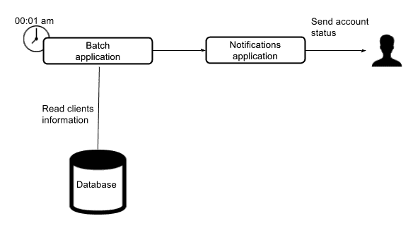

# 软件架构维度

在上一章中，您了解到软件体系结构由团队在构建产品或服务时共享的知识以及围绕此概念的其他重要方面组成。架构师的工作是与整个团队共享这些知识。即使团队中没有人被指派担任架构师的特定角色，个人通常也会对系统的架构负责。

在本章中，我们将回顾软件架构维度以及它们如何影响我们的应用程序。我们还将介绍一个用于记录软件体系结构的模型，并使团队共享和理解体系结构的过程不那么困难。最终，这将使他们能够理解软件体系结构的大局。

本章将涵盖以下主题和子主题：

*   软件架构维度：
    *   业务维度
    *   数据维度
    *   技术层面
    *   操作维度
*   C4 型号：
    *   上下文图
    *   容器图
    *   组件图
    *   类图

# 尺寸

根据谷歌的说法，*维度*一词有一些含义。让我们使用以下定义，它符合我们将在本节中讨论的上下文：

“情况、问题或事物的一个方面或特征。”

从这个定义开始，我们将考虑维度作为影响和指导我们构建的软件体系结构的方面或特征。

在上一章中，我们讨论了在制定解决方案时理解业务领域的重要性。当然，在生成能够满足所有业务需求的系统时，这些知识是不够的。您还需要从技术角度考虑支持这些解决方案的机制，同时不要忘记业务需求。作为技术人员，我们需要提供一个随着时间推移而不断发展的解决方案，以满足新的业务需求并高效地实现目标。

下面的列表由制定软件体系结构过程中最常见的维度组成：

*   商业
*   数据
*   技术的
*   操作

根据您正在处理的解决方案的上下文，您可以在此列表中添加一些额外的点。当您从技术角度看产品时，这四个维度是高度关联的，负责系统的整个团队都应该理解这四个维度。

# 业务层面

这是我们在构建软件时要考虑的最重要的方面，这就是为什么软件行业一直在发明新的方法来收集需求。在这一层面上，应高效完成以下两项相关活动：

*   管理用户需求并获得关于业务领域模型的清晰概念
*   识别和跟踪业务指标

# 管理用户需求

几年前，我们曾经编写用例，这些用例在过去几年中被重命名为**用户故事**。然而，名称并不是这里成功的关键，无论您使用的是老式方法（如**统一过程**（**RUP**）还是最前沿的框架（如 Scrum），都没有区别了解业务领域并拥有产品将使团队能够开发成功的项目。

您可能知道，RUP 是一个软件开发框架，它定义了一组阶段，并且有大量与每个阶段相关的文档。这里的想法是确定在每个阶段生成哪些工件。这项任务非常繁琐，团队通常会定义大量无用且耗时的文档，而没有为产品提供任何附加值。作为创建文档的替代方案，我们将在本章后面讨论 C4 模型。

随着时间的推移，已经有很多书解释了如何管理用户需求。其中两个包括 Alistair Cockburn 的*编写有效用例*和 Mike Cohn 的*应用用户故事*。这些书是最相关的，你应该考虑阅读它们并使它们成为图书馆的一部分，以便在需要时使用它们作为参考源。

收集用户需求的有效过程应该是项目应该实现的愿景和目标的一部分。与尽可能多的项目相关人员举行头脑风暴会议有助于负责软件实施的团队区分**最低可行产品**（**MVP**）以及 MVP 版本完成后将作为新版本的一部分实施的所需和可消耗的特性。

理解在建软件的 MVP 至关重要；它应该为您提供尽可能少的功能，以满足用户需求。一旦确定了这些特征，还需要为其定义验收标准。在此基础上构建的产品将用作从业务人员处获取反馈的基础（以纠正任何误解），并添加新功能（以扩大解决方案）。

今天，我们还依靠 bug 跟踪系统将用户需求编写为具有不同分类的票据，例如 bug、用户故事和峰值等。这些票据用于更好地了解实现一个功能需要多长时间，以及其中涉及多少 bug。

以这种方式处理业务需求为我们提供了有用的信息，可以在以后进行分析，以提高团队的绩效以及团队的组织方式。关于如何管理票据有很多解释，但是如果您想更好地了解错误跟踪的原理，我鼓励您阅读 Yegor Bugayenko 撰写的一篇有用的文章，该文章可在[上获得 http://www.yegor256.com/2014/11/24/principles-of-bug-tracking.html](http://www.yegor256.com/2014/11/24/principles-of-bug-tracking.html) 。

# 识别和跟踪业务指标

一旦收集了业务需求，业务维度的另一部分就出现了，包括确定围绕您正在解决的业务问题的基本度量的方法。这些度量应该根据业务领域来确定和表达，以便了解应用程序如何很好地满足其设计的业务需求。

让我们回顾一下上一章中使用的一个示例。假设银行目前正在使用邮局向其客户发送月度银行对账单。在这种情况下，您可以先验地知道它需要多少钱，以及完成目标所涉及的任务。此外，根据具体日期，你甚至知道你有多少客户，需要打印多少纸张。在您的系统实现之后，您将希望知道您的所有客户都收到了他们的银行对账单。因此，您需要实现一种机制来识别应用程序发送了多少银行对账单，以及首选哪些通知通道。这些信息将在不久的将来使用，以便识别新的业务机会，发现系统何时出现问题，并监控应用程序的 ROI。毕竟，系统的实现受业务需求的指导，您必须验证这些需求是否得到满足。

一旦应用程序投入生产，在野外评估应用程序的业务健康状况的一项优秀技术就是构建机器人。这些机器人以普通用户的身份运行您的应用程序；您至少需要围绕应用程序最重要的功能创建机器人程序。如果没有，您如何知道您的应用程序是否正常工作？

这一目标可以通过执行预定的检查来实现，这些检查将向您发送带有所获得结果的通知。这项简单的技术将使您确信应用程序正在按预期工作，并为您的客户提供服务，而客户正是系统的目的所在。

# 数据维度

数据被认为是任何业务中最关键的资产之一，这就是为什么您必须花费大量时间找出处理数据的最佳方法的原因。

如今，在选择数据处理方法时，我们有很多选择。在过去几年中，创建了多种数据库和数据存储，包括：

*   文件云存储
*   关系数据库
*   面向文档的数据库
*   实时数据库
*   图形数据库
*   内存数据库

你的选择应该取决于你正在解决的问题，而不是 Facebook、谷歌和亚马逊等有影响力的在线公司所使用的选项。

记住，不同的业务需求需要不同的方法。

您现在可能想知道应该选择哪种数据存储方式*。*这个问题最常见的答案是它取决于上下文。

然而，依赖上下文可能不是这里的理想答案，因为它不能为您提供很多指导。考虑到这一点，最好的建议是尽可能多地进行类比，以便找出适合您的最佳数据存储方法。需要牢记的一点是：不要因为 NoSQL 数据库中固有的最终一致性而害怕。我看到很多人因为这个原因放弃了这种数据库。您必须明白，最终的一致性根本不是一个技术问题，而是一个业务问题。让我解释一下原因。

考虑到[第 1 章](01.html)、*今天的软件架构*中的示例，假设您的任务是在系统中实现一个新功能，描述如下：

“我们注意到通知频道并不总是按预期工作，因此我们决定在出现这种情况时使用替代频道。例如，如果用户已将电子邮件配置为首选频道，则在失败时应使用 SMS 频道。另一方面，如果用户已将 SMS 配置为首选通知频道，则应使用 SMS 频道。”el，如果电子邮件通知失败，则应使用电子邮件通知作为替代。”

请注意，此要求不遵循标准用户故事格式：

“作为一个< type of user >，我想要< a goal >这样< reason >。”

但是，对于负责处理这些需求的团队来说，这些需求很容易理解和实现。出于这个原因，我在前面提到，即使您仍在处理用例或用户故事，业务需求是最重要的方面。

最终的一致性不是什么大问题的一个例子是 Facebook 帖子的排序，其中每个帖子都有时间戳。在这里，当一个人在帖子中添加评论时，他们认为自己看到的是上面的最后一条评论，但几秒钟后，他们发现其他评论确实在他们的评论之前添加了。当这种情况发生时，可能会令人困惑。然而，不在评论顺序上强加原子性要求允许 Facebook 在全球范围内扩展数据库，每秒覆盖数百万篇帖子。相反，为了保持一致性并避免欺诈或浪费资金，资金转移交易需要原子交易，这一点很重要。

总之，您首先必须了解您想要完成的业务需求，尽可能多地与市场上可用的选项进行类比，然后从这些选项中做出选择。一旦您做出了决定，就应该依靠能够让您与您选择的数据存储进行交互的框架。幸运的是，Spring 数据支持一系列数据存储选项。我们将在下一章讨论使用这个 Spring 项目的好处。

# 技术层面

这个维度涉及到对技术细节的深入探索。让我们讨论一些为实现这一目标而必须回答的有用问题，如下所示：

*   我应该选择什么风格的软件体系结构？

目前，这方面有很多选择。本书的后续章节将详细解释其中的许多内容，你可能会在那里找到答案。

*   什么编程语言适合我的应用程序？

市场上的许多编程语言都承诺是最好的。因此，你必须避免仅仅因为它是最新的或最新的而选择它。相反，你必须选择一个广为人知的适合你的。

依靠大量工具生态系统的可能性始终是至关重要的，并且应该是您决策的一部分。你的决定的另一部分应该是找人共事有多困难。您不太可能希望使用许多人不熟悉的编程语言来构建软件。毕竟，您需要创建一个可以长期使用的应用程序，这意味着许多人将参与编写代码，使其随着时间的推移而不断发展。

由于本书的重点是 Spring 平台，我将讨论使用 Java 和**Java 虚拟机**（**JVM**的好处。

我们都知道 Java 是一种被广泛支持的编程语言，已经被用于构建大量的企业应用程序；这一事实让我们有信心说，它已经足够成熟，可以编写几乎任何类型的企业软件。另一方面，JVM 是建立在*写一次，在任何地方运行的前提下的。*这一点很重要，因为目前大部分企业应用程序都在 Linux 服务器上运行；然而，这并不意味着你需要强迫你的团队使用 Linux。相反，他们可以继续使用自己喜欢的操作系统，因为 JVM 可以在 Windows、Linux 和 Mac 上运行。

在过去的几年中，许多编程语言已经被编写并广泛应用于解决不同类型的问题。它们中的许多都在 JVM 上运行，比如 Scala、Groovy、Kotlin 和 Jython，因为这提供了很多好处。这些编程语言的所有编译代码都签入字节码，字节码可以与 Java 代码交互，从而带来新的机会。尝试一下新的编程语言，看看它们在不同的场景中是如何工作的，并实现不同的需求，这总是一个好主意。例如，Groovy 是一种简单易用的友好编程语言。在接下来的章节中，我们将使用在 JVM 上运行的不同编程语言开发一些示例应用程序。这些示例将帮助您将 Groovy 作为工具箱的一部分。

*   什么样的框架适合我？
    即使 Java 世界中充斥着大量的框架，我们也鼓励您使用 Spring，不仅因为这本书是关于 Spring 的，还因为它提供了以下好处：
    *   支持前面列出的许多编程语言
    *   Spring 提供了构建几乎任何您想要的应用程序的机会
    *   学习曲线不是什么大问题
    *   它非常支持单元测试和集成测试
    *   Spring 项目使您的解决方案成长成为可能（我们将在下一章中讨论这些）
    *   它与您选择的 IDE 具有极好的集成
    *   它有一个很棒的社区
    *   互联网上提供了大量关于 Spring 的信息
    *   它提供了与最常见的 Java 框架（如 Hibernate、iBatis、Atomikos、Vaadin 和 Thymeleaf）的平滑集成

如果这个列表对您来说还不够，请在 Google 中随意输入“*我为什么要使用 Spring*”；您将得到一个惊喜，并且有信心使用 Spring 框架。

# 操作维度

此维度指的是将体系结构组件映射到服务器。这些服务器可以驻留在本地或云中。在过去的几年里，云变得越来越重要，现在，我们可以说，对于每一个企业来说，依靠云上的服务几乎是至关重要的。

软件架构组件的映射将取决于它们的作用以及组件之间的交互方式。

# 如何部署应用程序

这一点至关重要，因为部署 RESTAPI 与部署分布式数据库或大型 monolith 应用程序不同。为了更好地了解部署组件的最佳方法，您需要研究支持它的产品。这可能相当简单；例如，通过使用以下广为人知的命令部署一个可以像传统 Java 应用程序一样运行的 Spring Boot 应用程序：

```
java -jar artifact_name.jar
```

然而，在其他情况下，一些产品提供了作为集群部署的机会，在那里您需要考虑所有可用的选项和您的需求。根据您的软件需求的不同，您将需要更少或更多的节点来满足用户的需求。正如您可能已经注意到的，甚至这个维度也是从业务中派生出来的。

# 组件之间如何发生交互

让我们设想一下，我们有一个常规的 web 应用程序将信息持久保存在数据库中。此 web 应用程序部署在服务器 A 中，数据库部署在服务器 B 中。常识使我们认识到，无论两台服务器位于相同或不同的数据中心，延迟都不会相同。当然，另一个考虑因素是最终用户的位置。如今，云提供了根据需要选择组件部署位置的机会，这对于提供更好的用户体验非常有用。

# 处理基础设施

一旦考虑了这些要点，另一个需要牢记的方面就是如何管理基础设施。

我们都知道，当我们需要从头开始时，配置新服务器总是一件令人头痛的事情，因为我们需要安装操作系统和所有必需的工具，以使我们的应用程序正常工作。其中一些需要特定的文件、目录、环境变量和其他工件才能工作，这使得这个过程更加复杂。幸运的是，下一节讨论的“基础架构即代码”方法将帮助我们减少配置新服务器的工作量，并为我们带来其他好处，如以下几点：

*   了解基础设施
*   版本控制
*   测试

# 了解基础设施

文件用于以可执行脚本的形式存储配置服务器所需的配置和步骤。当需要对现有服务器进行新的调整时，可以使用脚本文件而不是直接在服务器上进行这些更改。这将使我们获得以下好处：

*   不可变服务器
*   轻松应用更改
*   具有多个相同服务器的
*   从头开始快速重建新服务器，无错误

此外，技术人员将能够阅读和理解这些脚本，从而增加对提供新基础设施过程的共享理解，这是非常好的。

# 版本控制

使用**版本控制系统**（**VCS**）对书面脚本进行版本控制将允许我们跟踪脚本文件中的更改；这有助于提高用于构建基础结构的编写代码的可听性。在版本控制过程中，可以（也应该）触发构建以验证编写的代码。

版本控制的另一个好处是，您可以在需要时恢复更改。假设您正在编写代码来升级服务器；如果在此过程中出现问题，您可以随时进行回滚，并在问题解决时继续使用最新的稳定版本。

# 测试

如果某件东西没有经过测试，就无法知道它是否按预期工作。将基础设施视为代码让我们能够测试用于实现此目标的代码，验证并确保其按预期工作。否则，您将需要手动执行这些验证，并考虑此级别所涉及的调试过程，以确定错误所在。即使您可以将基础结构作为代码而不进行测试，也强烈建议对已创建的脚本运行测试。

将基础设施视为代码的方法将有助于我们充分利用计算机和系统，从而使流程对我们来说不那么繁琐，并且人们只应在出现问题时在数据中心前工作。这还将帮助您以快速简便的方式使基础架构保持最新。如果您想深入了解如何有效地采用这种方法，我建议您阅读 Kief Morris 的*Infrastructure as Code*一书。

# 云与内部部署

在云上使用服务器和在本地使用服务器之间的选择是一项重大决策，取决于业务的限制和需求。出于安全原因，一些公司被限制使用内部基础设施，这可能是由于对云中安全管理方式的误解。无论如何，此限制将使任何将基础设施移动到云的尝试无效。

另一方面，如果您有机会在这两个选项中进行选择，我鼓励您使用云。它提供了许多好处，例如随用随付，这将允许您在应用程序的第一个版本中节省大量资金。有些服务每小时向您收取几美分的费用，这取决于您需要什么以及您使用的软件的许可模式。例如，使用免费和专有软件与使用 Windows 或 Linux 服务器不同。同样，它与使用 RDBMS（如 MariaDB 或 Oracle）不同。

即使在您选择使用云时，您也需要记住一些注意事项，以便根据所需的一组功能为您选择合适的云提供商。一些云服务提供商，如 AWS，提供一系列计算、存储、管理工具、分析等服务，而其他云服务提供商，如 Heroku，则根据您的需求提供数量较少的足够好的功能。仅仅因为它提供了更多的服务就选择提供商不是一个好主意，因为这也意味着更高的成本。即使不同供应商提供的服务数量相似，使用前面提到的提供者部署应用程序的过程也非常简单。

# 部署应用程序

编写不会投入生产的代码毫无意义。无论您是将应用程序部署到云中还是部署到内部部署环境中，都可以使用一些技术和工具来自动化部署过程。这将帮助您减少所需的工作量。

几年前，在软件系统的部署过程中，编写应用程序的整个团队必须与操作团队坐在一起，以防出现问题。因此，部署日期对于参与项目的技术人员和业务人员来说都是可怕的。幸运的是，这种情况已经改变。让我们回顾一下这一变化是如何发生的。

当我们进入这个领域时，自动化是必须的。有许多 CI 工具可用于创建管道，这些工具将帮助您自动化部署。其中应用最广泛的有詹金斯、特拉维斯 CI、Go CD、Codeship 和竹子等。借助这些工具，您可以创建一个管道，该管道通常涉及以下内容：

1.  下载源代码
2.  编译代码
3.  运行一组定义的测试
4.  部署代码

主要步骤是第三步，涉及不同种类的测试，如下面列出的测试：

*   单元测试
*   集成测试
*   功能测试
*   性能测试

应用程序中包含的测试越多，您获得的信心就越大。这是摆脱部署带来的恐惧的唯一途径。毕竟，如果您的测试验证了功能按预期工作，那么就没有理由担心部署。

这些 CI 工具还支持发送有关管道的通知、生成代码的度量、执行配置脚本以及完成部署固有的其他一些步骤。这些管道通常由提交触发，也可以对其进行调度。

采用 CI 工具是以更好的方式自动化和管理部署的第一步。此时，您将希望采用持续集成、持续交付和 DevOps 等实践，我们将在[第 11 章](11.html)、*DevOps 和发布管理*中对此进行深入解释。

# C4 模型

一般来说，如果某些东西不可见，它将无法提供所需的效果。即使是最先进的软件，用最尖端的技术生产出来，如果开发团队无法理解它，它也是完全无用的。团队的所有努力都是浪费时间。

仅仅设计一个软件架构是不够的。它必须与整个团队共享，以便他们在完成活动时正确使用它。架构师编写的文档在今天为他们说话，他们应该做的事情不是回答一百个关于软件架构的问题，明天他们离开项目，其他人负责项目的发展和维护时，文档也为他们说话。

敏捷宣言的第二条原则（[http://agilemanifesto.org](http://agilemanifesto.org) ）是*“团队应该重视工作软件而不是全面的文档。”*人们认为根本不应该制作文档，这常常被错误地理解。相反，这个原则背后的想法是鼓励团队只生成有价值的文档，而这正是 C4 模型所寻求的。

该模型提供了一种向整个团队传达系统设计的简单方法。它从一个高层次的角度出发，可以用来深入研究已经（或将要）生产的软件的最小细节。该模型提出了四种图表，如下所示：

*   上下文图
*   容器图
*   组件图
*   类图

# 上下文图

上下文关系图提供了用户和与之交互的其他软件系统的大图。应避免使用所有技术元素，以保持其简单易懂。上下文图应该足够直观，以便非技术人员理解。

以下为[第 1 章](01.html)、*今天的软件架构*中提出的示例的上下文关系图：


上下文图

# 容器图

容器是负责托管代码或数据的单元。因此，此图显示了应用程序中涉及的容器，提供了有关它们如何相互交互的高级细节，以及一些其他技术细节来说明系统如何工作。让我们看看这个图表，因为它适用于我们的示例：



容器图

# 组件图

此图背后的思想是向您展示容器是如何由组件以及组件之间的交互形成的。我们示例的组件图如下所示：


组件图

# 类图

由于 C4 模型背后的主要思想是删除不必要的图，因此应避免使用类图，并且仅当说明应用程序的特定细节非常重要时才应使用类图。此图适用于技术人员，当您的应用程序中有人们应该密切关注的元素时，可以使用此图；它还可以用于澄清代码中可能导致混淆的某些特定部分。

虽然本示例不需要此图，但出于说明目的，我们将显示它：


类图

正如您可能已经注意到的，我们提供的四个图表并不难创建，它们对于更好地理解系统很有帮助。即使它们很简单，也最好不时地查看这些图表，以确保它们得到更新。过时的文档可能会导致误解，而不是提高对系统的理解。

请随意避免创建任何您认为没有帮助的图表。投资时间构建不必要的工件是您应该避免的事情。

# 总结

在本章中，我们讨论了与软件体系结构相关的四个主要方面，并研究了它们如何影响我们构建应用程序的方式。我们还回顾了用于记录系统架构的 C4 模型，使用了一种精益方法，帮助我们避免在创建不必要的文档时浪费时间。

在下一章中，我们将回顾 Spring 项目，以及如何使用它们来创建满足不同业务需求的应用程序。