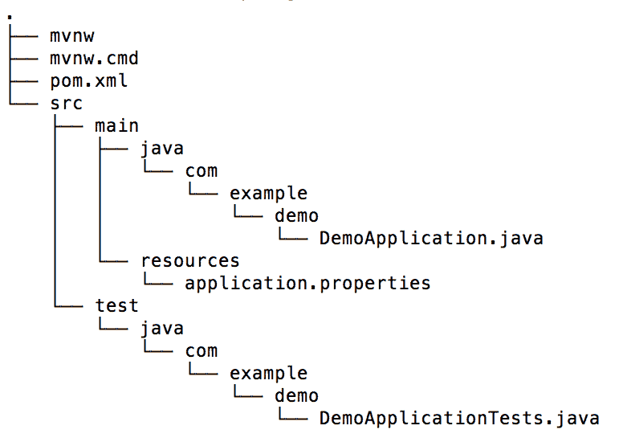
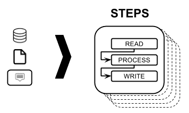
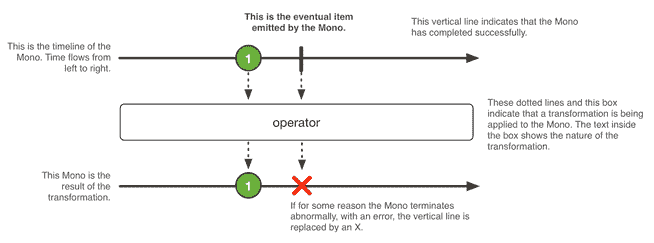
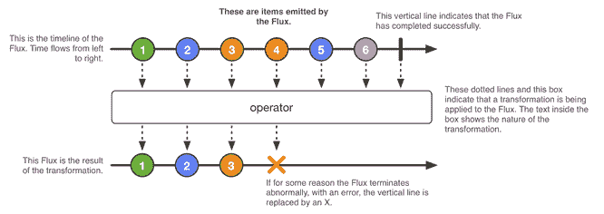

# 三、Spring 项目

在本章中，我们将回顾一些 Spring 项目，在探索它们可能被使用的一些场景时，对每一个项目进行简要的解释。

本章将介绍以下主题：

*   为什么春天会出现
*   Spring 项目：
    *   弹簧初始化器
    *   简言之，弹簧靴
    *   避免使用开发人员工具重新部署
    *   弹簧数据
    *   通过 Spring 集成支持 EIP
    *   春批
    *   使用 Spring Security 保护应用
    *   拥抱（春天）哈提奥斯
    *   Spring 云与微服务世界
    *   反应与弹簧
    *   反应弹簧数据
    *   反应式休息服务

# 为什么春天会出现

您可能知道，Spring 的创建旨在简化 J2EE 世界的所有复杂性。它被创建为一个依赖注入框架，并作为带有分布式对象的 EJB 堆栈的替代品，这在大多数应用中是不必要的。J2EE 的传统方法在用于引导应用时引入了很多复杂性，而在用于完成它必须解决的业务需求时，这涉及到更大的复杂性。因此，留给我们的应用很难测试，而且开发和维护成本太高。

Spring 和 J2EE 是在 Java 没有注释时创建的，因此 wire 类需要大的 XML 文件。幸运的是，**Java 开发工具包**（**JDK**版本）的 1.5 版提供了注释，这有助于减少对此类描述符文件的需求。

Spring 的发展速度比 JEE 快，因为它不必像 JEE 所要求的那样满足与大型委员会交谈的形式。当一个新特性必须作为 JEE 规范的一部分合并时，JSR 文档必须由 JCP 创建和批准。这样做的主要动机是，它保证了规范不同版本之间的向后和向前兼容性。另一方面，考虑到软件行业不断变化的性质，Spring 是一个不断发展的项目

当需要一个新特性时，可以将其作为现有项目的一部分，也可以创建一个新项目，并由 Spring 项目伞提供支持。没有理由担心兼容性，因为 Spring 被设计为在任何 servlet 容器上运行，比如 ApacheTomcat、Jetty 等等。这与 JEE 应用相反，JEE 应用仅在实现 JavaEE 规范并提供标准 JavaEE 服务的服务器上运行。

# Spring 项目

Spring 项目利用一个工具生态系统，可以用来创建不同类型的应用，以实现不同的目标。所有这些项目都是围绕 Spring 构建的，Spring 是一个合法的模块化框架，可以插入单独的 Spring 项目，从而允许应用处理更多的技术需求。如果您对 Spring 项目的完整列表感兴趣，可以访问他们的主页[https://Spring.io/projects](https://spring.io/projects) 。

我们将回顾用于构建企业应用的最常用的 Spring 项目，但首先，我们将介绍 Spring Initializer，Spring 开发人员首选的网站之一。

# 弹簧初始化器

当我们计划从头开始创建一个新项目时，我们倾向于考虑我们将使用哪个构建工具，我们将使用哪个框架，等等。最困难的任务之一是找到使项目工作的正确依赖项。这就是创建 Spring 初始值设定项的目的。这一优秀的 Spring 计划使您能够在几分钟甚至几秒钟内启动应用，而不管您喜欢哪个版本。Spring Initializer 可以在 web 上或您喜爱的 IDE（Eclipse 或 IntelliJ）中使用，它甚至有一个很酷的 CLI 工具。我首选的方法是网络，下面的屏幕截图说明了原因：


Spring 初始化器主页

在页面顶部，您可以选择指定您最喜欢的构建工具。可用的选项有 Maven 和 Gradle。下一个选项允许您选择自己选择的编程语言（目前支持 Java、Groovy 和 Kotlin）。网页顶部的最后一个选项询问您要使用哪个 Spring 引导版本。在本节中，甚至包括快照和里程碑版本。在项目元数据部分，指定项目的组和工件名称。Dependencies 部分有 SearchforDependencies 文本字段，这有助于定义您希望作为应用的一部分包含哪些 Spring 项目。如果你想看到更多，点击切换到完整版本链接；这将向您显示所有可用依赖项的大列表。

所有这些项目都是使用 SpringBoot 框架创建的，这使得创建准备生产的独立应用变得容易。现在，让我们快速回顾一下弹簧靴。

# 简言之，弹簧靴

Spring 引导框架旨在简化以下任务：

*   Servlet 容器集成
*   自动配置
*   依赖关系管理

# Servlet 容器集成

之前，我们创建了`.war`文件，然后将它们放到相应 servlet 容器的部署目录中。但是，SpringBoot 包含一个嵌入式 servlet 容器，它确保不再需要这样做。其思想是生成一个包含所有相关依赖项的 JAR 文件，然后作为常规 Java 应用执行该 JAR 文件。可以（但不建议）继续使用生成 WAR 文件的旧方法。

# 自动配置

SpringBoot 总是尝试根据您添加的依赖项自动配置您的应用。例如，如果 H2 是依赖项的一部分，则将自动配置使用内存中数据库的数据源。运行`.jar`文件时，您始终可以通过使用注释、环境变量、配置文件甚至参数来覆盖这些默认配置。

# 依赖关系管理

每个 Spring 引导版本都包含一个精心策划的依赖项列表。因此，您甚至不必知道作为应用的一部分需要哪些工件和版本。如果必须，您将始终可以选择覆盖这些依赖项，但这通常是不必要的。这种方法允许我们轻松地升级 Spring Boot 应用。

让我们通过运行以下`curl`命令来创建一个简单的 Spring 引导应用：

```java
curl https://start.Spring.io/starter.zip -o Spring-boot-demo.zip
```

前面的命令将下载一个包含以下文件结构的`.zip`文件：



springboot 项目结构

让我们快速查看这些文件。

# mvnw 和 mvnw.cmd

前两个文件是 Maven 包装器（[的一部分 https://github.com/takari/maven-wrapper](https://github.com/takari/maven-wrapper) ）。这里的想法是避免强迫开发人员从头开始安装 Maven，而不是提供一个能够下载正确版本并准备好工作的内置脚本。

# pom.xml

此文件包含运行 Spring 引导应用所需的依赖项。让我们回顾一下文件的内容，如下所示：

```
<?xml version="1.0" encoding="UTF-8"?>
  ...
  <parent>
    <groupId>org.springframework.boot</groupId>
    <artifactId>Spring-boot-starter-parent</artifactId>
    <version>1.5.8.RELEASE</version>
    <relativePath/>
  </parent>
  ...
  <dependencies>
    <dependency>
      <groupId>org.springframework.boot</groupId>
      <artifactId>Spring-boot-starter</artifactId>
    </dependency>
    <dependency>
      <groupId>org.springframework.boot</groupId>
      <artifactId>Spring-boot-starter-test</artifactId>
      <scope>test</scope>
    </dependency>
  </dependencies>
  ...
</project>
```

`parent`pom 部分为应用提供了必要的依赖关系和插件管理。

`Spring-boot-starter`依赖项包含使用一组经过管理的可传递依赖项来启动和运行项目所需的所有依赖项。根据您的项目需要，您可能还需要使用其他初学者（例如，JPA、队列、安全性等）。

`Spring-boot-starter-test`依赖项包括用于测试的整套依赖项。它不仅允许您编写单元测试，还允许您编写集成测试。

# DemoApplication.java

这是一个带有`main`方法的简单类，负责运行应用。这个`main`类可以通过这种方式执行，因为`@SpringBootApplication`注释启用了所有需要的自动配置，如下所示：

```
@SpringBootApplication
public class DemoApplication 
{
  public static void main(String[] args) 
  {
    SpringApplication.run(DemoApplication.class, args);
  }
}
```

# application.properties 文件

在此文件中，您必须定义应用的所有配置属性。例如，如果您正在与 SQL 数据库交互，则该文件将具有诸如 JDBCURL、数据库用户名、密码等属性。如果您愿意，您可以将其扩展名从`.properties`更改为`.yml`，以便通过使用 YAML 格式（[使其更具表现力 http://www.yaml.org/start.html](http://www.yaml.org/start.html) ）。

# DemoApplicationTests.java

作为奖励，下面是一个简单集成测试的示例，您可以使用它作为指导，继续为新代码编写测试。由于注释，编写此类测试相对简单：

```
@RunWith(SpringRunner.class)
@SpringBootTest
public class DemoApplicationTests 
{
  @Test
  public void contextLoads() 
  {
  }
}
```

前面的解释应该足以为您提供一个简要的概述，以便您能够理解 Spring Boot 是什么以及它的好处是什么。现在，是时候回顾一下您喜欢的其他 Spring 项目了。

# 避免使用开发人员工具重新部署

这个模块非常棒，因为它旨在帮助您在使用 Spring 引导应用时避免重新部署。它类似于 JRebel，但此产品是绝对免费的，您可以通过添加以下依赖项将其作为应用的一部分：

```
<dependency>
  <groupId>org.springframework.boot</groupId>
  <artifactId>spring-boot-devtools</artifactId>
  <optional>true</optional>
</dependency>
```

添加依赖项后，只需重新编译类即可触发应用重启。根据您的 IDE 配置，此过程将自动或手动完成。

# 弹簧数据

这个项目为您提供了一个额外的抽象层来访问数据存储；它有一系列需要扩展的接口，以便利用 Spring 数据提供的内置功能。当您扩展这些接口时，围绕数据存储的所有标准操作都可以使用了。

Spring 数据支持关系数据库和非关系数据库、map reduce 框架和基于云的数据服务等技术。这些技术由模块支持；如果您对现有模块的完整列表感兴趣，可以访问[http://projects.Spring.io/Spring-data/](http://projects.spring.io/spring-data/) 。

让我们使用 SQL 数据库（如 H2）来处理 Spring 数据。假设您想要为国家数据库表构建一个**创建、读取、更新、删除**（**CRUD**操作。在这个框架中，您只需要创建实体类和一个空接口来扩展 Spring Data 提供的`CrudRepository`接口，如下所示：

```
@Component
public interface CountryRepository extends CrudRepository<Country, Integer> {
}
```

由于`CrudRepository`接口中包含所有 CRUD 操作，因此您不必实现任何东西；您只需使用它的功能即可。让我们看看这一点，如下所示：

```
@SpringBootApplication
public class SpringDataDemoApplication 
{
  @Bean
  InitializingBean populateDatabase(CountryRepository
  countryRepository) 
  {
    return () -> 
    {
      countryRepository.save(new Country(1, "USA"));
      countryRepository.save(new Country(2, "Ecuador"));
    };
  }
  @Bean
  CommandLineRunner queryDatabase(CountryRepository 
  countryRepository) 
  {
    return args -> 
    {
      countryRepository.findAll()
      .forEach(System.out::println);
    };
  }
  public static void main(String[] args) 
  {
    SpringApplication.run(SpringDataDemoApplication.class,args);
  }
}
```

我们有两个**bean**使用先前创建的存储库接口。第一个方法将运行，它将在表中插入两行。第二种方法将查询表中的所有行，然后在控制台中打印它们。运行此应用后，当应用启动时，您将在控制台中看到以下输出：

```
...
Country [id: 1 name: USA ]
Country [id: 2 name: Ecuador ]
...
```

Spring 数据具有更多的特征；它还让您有机会以一种引人入胜的方式创建查询。假设您希望按名称筛选国家。在这种情况下，您需要将该方法添加到接口存储库中，如下所示：

```
@Component
public interface CountryRepository extends CrudRepository<Country, Integer> 
{
 List<Country> findByName(String name); }
```

然后，我们可以通过以下方式使用上述方法：

```
countryRepository.findByName("USA")
```

这种方法根本没有实现，这是一个很大的优势。Spring 数据使用该方法的名称来生成所需的实现，这使我们能够忘记这些查询的琐碎实现。有许多接口提供更多功能，例如分页、排序和反应式扩展。

# 通过 Spring 集成支持 EIP

集成很重要，因为应用旨在相互交互。强迫他们独立工作使他们毫无用处。

通常会发现公司拥有自己的软件，由内部开发，以解决其特定的业务需求；但是，由于某些场景往往在多家公司中很常见，因此有第三方服务可以满足这些需求。由于这些系统提供的功能已经可以使用，我们必须找到一种方法使这些应用作为单个系统工作，这就是**企业集成模式**（**EIP**）发挥作用的地方。

EIP 为反复出现的问题提供了经验证的解决方案，这些问题可以在不同的环境中应用，只需稍加修改，具体取决于特定的业务需求。互联网上有大量可用的这些模式，在这个领域中必须阅读的是 Gregor Hohpe 和 Bobby Woolf 的《企业集成模式》一书。本书通过使用技术不可知的方法解释了大量模式以及示例场景。

一旦您了解了 EIP 的相关理论，您就会发现 Spring 集成对于实现它们非常方便；如前所述，它将具有 Spring 框架固有的所有好处。

当我们讨论积分时，我们可以用三步的方法来考虑这个概念。让我们开始回顾下图，其中显示了这三个步骤：


EIP

以下是作为前一过程的一部分执行的步骤列表：

1.  存在提取信息的数据源；为了获取数据，有时需要进行民意调查。
2.  摄取的数据根据需要进行过滤、转换、合成、分解、路由等。EIP 就是在这里使用的。
3.  根据需要，已处理的数据已准备好交付或存储。

SpringIntegration 为从队列、数据库、系统文件、FTP 服务器和许多其他选项检索或发送信息提供了内置支持。此外，如果需要，您可以编写自己的实现并将其插入，以使其成为流程的一部分。Spring 提供的 DSL 使 EIP 易于阅读和实现。

# 春批

无论我们使用哪种类型的架构，有时我们都需要处理大量数据并应用一些转换以使其有用。这种处理通常发生在我们需要整合（或简单地处理）来自一个或多个数据源的数据，使其可用于某些业务目的时。

这些批处理过程需要一组定义良好的步骤来实现所需的目标。使用 SpringBatch，您可以通过使用由读取、处理和写入已处理数据的步骤组成的作业来实现它们。一个作业可以包含所需的任意多个步骤，如下图所示：



Spring 批处理–作业结构

# 阅读步骤

在这种情况下，使用作为 Spring 批处理的一部分的内置`ItemReader`对象从外部数据源读取信息。`ItemReader`对象将服务于`<T>`对象，稍后将使用该对象。

# 过程步骤

这里，数据处理由能够转换和操作从`ItemReader`对象读取的`<T>`数据的`ItemProcessor`对象完成。`ItemProcessor`可以返回与读取的`<T>`对象相同的对象，或者返回另一个完全不同的`<O>`对象（如果这是所需的行为）。

# 写入步骤

一旦处理步骤完成，就可以使用一个`ItemWriter`对象，写入在处理阶段获得的`<O>`转换对象。

Spring 提供了与传统数据源交互的能力，例如：

*   文件夹
*   JMS 提供者
*   数据库

对于 SpringBatch，一个很酷的特性是它提供了重新运行和跳过作业的机会，因为它有自己的数据库，其中存储了已执行作业的状态。

由于 SpringBatch 设计用于处理大量数据，为了加快处理速度，该框架提供了将信息作为数据块进行处理的机会。这还可以减少处理所需的服务器资源。

# 使用 Spring Security 保护应用

Spring Security 是一个可扩展的框架，可用于保护 Java 应用。它还可以用来处理身份验证和授权，并且它使用了一种声明式风格，这种风格对现有代码没有任何干扰。

该框架支持不同的身份验证方法，例如：

*   LDAP
*   JDBC
*   记忆中

您也可以通过实现`AuthenticationProvider`接口来添加自己的自定义认证机制，如下所示：

```
@Component
public class CustomAuthenticationProvider 
implements AuthenticationProvider 
{
  @Override
  public Authentication authenticate(Authentication 
  authentication)
  throws AuthenticationException 
  {
    // get the entered credentials
    String username = authentication.getName();
    String password = authentication.getCredentials().toString();
    // check the entered data
    if ("user".equals(username) && "password".
    equals(password)) 
    {
      return new UsernamePasswordAuthenticationToken(
      username, password, new ArrayList<>());
    }
    ...
  }
  ...
}
```

在前面的示例中，`user`和`password`硬编码字符串应作为凭证，以便进行成功的身份验证过程，您应该用必要的逻辑替换该验证。

上述认证机制遵循**基本认证**模型，这是 web 应用的首选模型。然而，在编写 API 时，需要其他方法来处理安全问题。一个好的选择是使用基于令牌的模型，例如 JWT 或 OAuth，我们将在后面的章节中回顾并实现它。

# 拥抱（春天）哈提奥斯

在讨论 REST 主题时，始终值得讨论 Leonard Richardson 创建的成熟度模型，该模型确定了 REST API 要被视为成熟应完成的三个步骤：

*   资源
*   HTTP 动词
*   超媒体控件：HATEOAS

在本节中，我们将重点讨论最后一个元素。**HATEOAS**旨在提供关于我们下一步可以做什么的信息，使用额外的**统一资源标识符**（**URI**）作为资源的一部分。

让我们回顾一下我们的银行业示例，以便从实践的角度解释 HATEOAS。假设您有以下 URI 来查询客户的银行对账单：`http://your-api/customer/{customer_id}/bankStatements`。

```
[
  {
    "accountStatusId": 1,
    "information": "Some information here"
  },
  {
    "accountStatusId": 2,
    "information": "Some information here"
  }
]
```

另外，假设 API 能够重新发送银行对账单或将其标记为失败。根据前面提到的有效负载提供的信息，无法了解这些操作。在这里，可以使用 HATEOAS，让我们的 API 用户知道这些附加特性的存在。应用 HATEOAS 后，有效载荷将如下所示：

```
{
  "_embedded": 
  {
    "bankStatementList": 
    [
      {
        "bankStatementId": 1,
        "information": "Some information here",
        "_links": 
        {
          "markAsFailed": 
          [
            {
              "href": "http://localhost:8080/customer/
              1/bankStatements/1/markAsFailed"
            }, 
            {
              "href": "http://localhost:8080/customer/
              1/bankStatements/1/markAsFailed"
            }
          ],
          "resend": 
          [
            {
              "href": "http://localhost:8080/customer/
              1/bankStatements/1/resend"
            }, 
            {
              "href": "http://localhost:8080/customer/
              1/bankStatements/1/resend"
            }
          ]
        }
      }, 
      ...
        }
      }
    ]
  }
}
```

请注意，了解这些操作的存在是多么容易，这些操作在应用 HATEOAS 作为 API 的一部分之前是隐藏的。

# Spring 云与微服务世界

该项目提供了一组处理分布式应用的工具。Spring 云主要用于微服务领域，我们将在[第 8 章](08.html)、*微服务*中深入回顾。该项目由提供不同功能的模块组成，这些模块可以一次全部实现，也可以根据您的需要逐个实现。让我们简要回顾一下 SpringCloud 中最常见的一些模块，并看看它们是如何工作的。

# 配置服务器

此模块提供了一个集中化工具，用于存储应用工作所需的所有配置。在 Java 世界中，存储所有必需配置的`.properties`和`.yml`文件非常常见。

Spring 提供了创建不同概要文件的能力，以便使用具有前面提到的扩展名的文件来处理不同的环境。但是，它还可以选择将所有配置集中在服务器上，您可以在服务器上存储值甚至加密信息。当客户端需要访问此机密信息时，配置服务器能够解密该信息并使其可供客户端使用。此外，您可以动态更改配置值。存储此配置的文件位于 Git 存储库中，这为我们提供了考虑配置中应用的更改的额外好处。

# 服务注册

服务注册中心的工作原理类似于云电话簿，它可以找出服务的位置以及有多少实例可用于处理传入请求。

Spring 提供了对大多数公共服务注册中心的支持，包括：

*   动物园管理员
*   领事
*   Netflix Eureka

使用服务注册表可提供以下好处：

*   复杂的负载平衡，如可用性区域感知
*   客户端负载平衡
*   请求路由

# 边缘服务

边缘服务充当代理。它被设计为在将所有传入请求发送到负载平衡器、防火墙等后面的服务之前，接收所有传入请求并对它们执行一些有用的操作。

边缘服务主要有两种类型：

*   微氧
*   API 网关

使用边缘服务的好处之一是，您可以在一个集中的位置管理所有特定的客户端详细信息，而不是编写代码在每个服务中单独处理这些详细信息。例如，如果您需要对移动客户端进行特殊考虑，这是一个完美的地方。

# 微氧

microproxy 是一种边缘服务，它只检索传入的请求，然后将请求重定向到相应的服务。

此类边缘服务的一个典型示例涉及处理**跨源资源共享（CORS）**，定义见**[https://en.wikipedia.org/wiki/Cross-origin_resource_sharing](https://en.wikipedia.org/wiki/Cross-origin_resource_sharing) 。您可能知道，当从不同于 CORS 所在的域请求特定资源时，CORS 会限制对这些资源的访问。您可以允许访问每个服务上的资源，也可以利用边缘服务器，以便允许从其他域请求服务。**

 **# API 网关

API 网关的使用在将传入的请求重定向到相应的服务之前对其进行转换。不仅可以修改请求，还可以提供响应。

网关也可以用作门面，在将响应发送到客户端之前，门面应该协调一些服务。当我们处理这个特定的用例时，我们可以实现断路器模式，以便更具防御性。

# 断路器

断路器是一种用于处理失败呼叫的模式。如果发生错误，通常可以抛出异常并让用户知道发生了错误，但也可以使用替代路径提供替代响应。例如，假设服务 A 失败了。现在，您可以调用与服务 a 类似的替代服务 B，而不是返回失败的响应，以便向客户端提供有效响应，从而改善用户体验。

# 反应与弹簧

反应式编程是围绕一个简单概念构建的范例，该概念提出使用事件传播更改。这种编程风格已经在 JavaScript 等编程语言中使用了一段时间，其主要优点之一是异步和非阻塞行为。

为了在 Java 世界中采用这种编程范式，根据反应性宣言（[中声明的目标，创建了反应性流规范 https://www.reactivemanifesto.org](https://www.reactivemanifesto.org) ），这是几年前写的。

本规范主要由以下四个接口组成：

*   出版商
*   订阅人
*   订阅
*   加工机

让我们简要回顾一下这些接口。

# 出版商

这个接口有一个简单的方法，可以注册订阅者，当数据可以使用时，订阅者最终将接收数据。`Publisher`接口代码如下：

```
public interface Publisher<T> 
{
  public void subscribe(Subscriber<? super T> s);
}
```

# 订阅人

此接口是操作发生的地方。以下方法具有自描述的名称：

```
public interface Subscriber<T> 
{
  public void onSubscribe(Subscription s);
  public void onNext(T t);
  public void onError(Throwable t);
  public void onComplete();
}
```

使用前面提到的每个方法，您都可以注册一个回调，该回调将在适当的情况下调用，如下所示：

*   `onSubscribe`：此方法在订阅过程中执行
*   `onNext`：此方法在接收到新事件时执行
*   `onError`：发生错误时执行此方法
*   `onComplete`：此方法在生产者完成且没有更多结果可接收时执行

# 订阅

此接口用于您请求订阅`Publisher`接口时，指定要向上游请求的元素数量；当用户对接收数据不再感兴趣时，应调用`cancel`方法：

```
public interface Subscription 
{
  public void request(long n);
  public void cancel();
}
```

# 加工机

`processor`接口实现了两个额外的接口：`Publisher`和`Subscriber`。此接口用于订阅和发布事件。

# 项目反应堆

该项目是反应流规范的一个实现，Spring 框架首选该规范。如果需要，也有适配器可以使用其他实现，但这通常是不必要的。

ProjectReactor 也可用于实现无需使用 Spring 的反应应用。

当我们注册函数来处理事件时，我们倾向于嵌套回调，这使得理解编写的代码变得困难。为了简化此类要求，反应堆有自己的一组操作员（访问[https://goo.gl/y7kcgS](https://goo.gl/y7kcgS) 查看可用操作员的完整列表）。这些操作符允许我们以更干净的方式与 API 交互，而不必将回调函数链接在一起。

有两个主要的生产者类别处理可以应用运算符的结果：

*   单声道
*   通量

# 单声道

Mono 表示单个或空值（0…1）的异步结果。

下图取自项目反应堆文档，它指出了`Mono`对象如何发射一个项目：



由 Mono 对象发出的项

上图说明了以下流程：

*   产生了一个新的价值
*   运算符应用于生成的值
*   结果出来了

以下示例显示了如何使用空值：

```
@Test
public void givenAnEmptyMono_WhenTheDefaultIfEmptyOperatorIsUsed_ 
ThenTheDefaultValueIsDeliveredAsResult() throws Exception 
{
  String defaultMessage = "Hello world";
  Mono<String> emptyMonoMessageProduced = Mono.empty();
  Mono<String> monoMessageDelivered = emptyMonoMessageProduced
  .defaultIfEmpty(defaultMessage);
  monoMessageDelivered.subscribe(messageDelivered ->
  Assert.assertEquals(defaultMessage, messageDelivered));
}
```

# 通量

通量表示 0 到*n*项的异步序列。

我们将再次借用项目反应堆文档中的一个图表，它解释了`Flux`对象如何发射项目：



由通量对象发射的项

上图说明了以下过程：

*   至少产生了六个值
*   运算符应用于生成的值
*   结果出来了

在下面的示例中，我们将首先将每个生成的值转换为大写，以便传递值：

```
@Test
public void givenAListOfCapitalizedStrings_WhenThe
FlatMapConvertsToUpperCaseTheStrings_ThenTheStringsAre
InUpperCase() throws Exception 
{
  List<String> namesCapitalized = Arrays.asList("John", 
  "Steve", "Rene");
  Iterator<String> namesCapitalizedIterator = namesCapitalized.
  iterator();
  Flux<String> fluxWithNamesCapitalized = Flux.fromIterable
  (namesCapitalized);
  Flux<String> fluxWithNamesInUpperCase = fluxWithNamesCapitalized
  .map(name -> name.toUpperCase());
  fluxWithNamesInUpperCase.subscribe 
  (
    nameInUpperCase -> 
    {
      String expectedString =namesCapitalizedIterator.
      next().toUpperCase();                
 Assert.assertEquals(expectedString, nameInUpperCase);
    }
  );
}
```

# 背压

背压是一种机制，允许我们指定一次读取所需的元件数量。当您对具有定义数量的*n*个元素的数据块感兴趣时，可以使用它。数据分块传递，直到到达整个数据集。

假设您想要包含三个元素的数据块，来自包含十个元素的`Flux`对象。在本例中，您将检索数据四次，如下例所示：

```
@Test
public void givenAFluxWith10Elements_WhenBack
PressureAsksForChunksOf3Elements_ThenYouHave4Chunks()
throws Exception 
{
  List<Integer> digitsArray = Arrays.asList(1, 2, 3, 4, 
  5, 6, 7, 8, 9, 0);
  Flux<Integer> fluxWithDigits = Flux.fromIterable
  (digitsArray);
  fluxWithDigits.buffer(3)
  .log()
  .subscribe
  (
    elements -> 
    {
 Assert.assertTrue(elements.size() <= 3);
    }
  );
}
```

以下是从日志生成的输出：

```
[ INFO] (main) onSubscribe(FluxBuffer.BufferExactSubscriber)
[ INFO] (main) request(unbounded)
[ INFO] (main) onNext([1, 2, 3])
[ INFO] (main) onNext([4, 5, 6])
[ INFO] (main) onNext([7, 8, 9])
[ INFO] (main) onNext([0])
[ INFO] (main) onComplete()
```

如前所述，Spring5 通过使用 Reactor 项目支持反应式编程。我们可以将它作为 SpringMVC 和 Spring 数据的一部分使用。

# 反应弹簧数据

因为 Reactor 可以与 Spring 数据一起使用，所以我们可以在这个阶段充分利用反应式编程模型。这意味着您可以持久化表示为`Flux`或`Mono`对象的数据。让我们回顾一下使用 MongoDB 实现的以下示例：

```
@Test
public void findAllShouldFindTheTotalAmountOfRecordsInserted() 
{
  int quantityOfEntitiesToPersistAsFlux = 100;
  // Saving a Flux with 100 items
  repository.saveAll
  (
    Flux.just(generateArrayWithElements
    (quantityOfEntitiesToPersistAsFlux))
  )
  .then()
  .block();
  // Saving a Mono
  repository.saveAll(Mono.just(new Customer("Rene")))
  .then()
  .block();
  List<String> customerIds = repository.findAll()
  .map(customer -> customer.getId())
  .collectList()
  .block();
  int totalAmountOfInserts = quantityOfEntitiesTo
  PersistAsFlux + 1;
 Assert.assertEquals(totalAmountOfInserts, customerIds.size());
}
```

请注意，提供的信息表示为`Flux`和`Mono`对象，查询的数据获取为`Flux`对象，使用 map 操作符对其进行操作，仅恢复为`List<String>`的 ID，以验证创建的实体数量。

# 反应式休息服务

通过使用`WebFlux`作为 SpringWeb 堆栈的一部分，添加了反应式 REST 服务。这使我们能够实现能够以流形式传递信息的端点。

让我们从实践的角度来回顾一下它是如何工作的。假设您希望检索经常由用户推送的通知。不使用反应式方法，您可以检索在发出请求之前创建的所有通知；但是，使用反应式方法，您可以不断接收新通知，这意味着如果创建了新通知，您将在该时刻接收新通知。让我们分析以下代码段：

```
@GetMapping(value = "/{singer}/comments", produces = 
MediaType.TEXT_EVENT_STREAM_VALUE)
public Flux<Comment> querySingerComments(@PathVariable 
String singer) 
{
  // generate one flux element per second
  Flux<Long> intervalToGenerateComments = 
 Flux.interval(Duration.ofSeconds(1));
  Flux<Comment> comments = Flux.fromStream(Stream.generate(()
  ->new Comment(composeComment(singer), new Date())));
  return Flux.zip(intervalToGenerateComments, comments)
  .map(fluxTuple -> fluxTuple.getT2());
}
```

首先，要注意制作的内容。这是一个流值，而不是 JSON、XML 或任何其他内容类型。接下来，我们模拟每秒创建一条新注释（请检查粗体代码）。在流程结束时，该信息由端点传递。您可以通过以下`curl`命令来尝试：

```
curl http://localhost:8080/jlo/comments
```

现在，您可以看到每秒如何检索新注释。此功能为我们的应用提供了新的机会和功能。

# 总结

在本章中，我们回顾了 Spring 中可用的一些最常见的项目，以及它们各自的简要说明和用例。我们还研究了 springreactor 项目及其相关特性，这些特性可以使用 Spring 数据实现。然后我们研究了如何编写 RESTful web 服务。

在掌握了所有这些知识之后，现在是时候深入到后面的章节中，回顾一些架构样式，并学习如何使用 Spring 框架实现它们。**