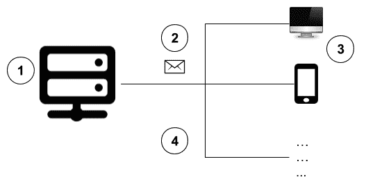
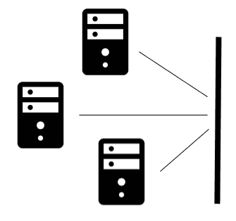
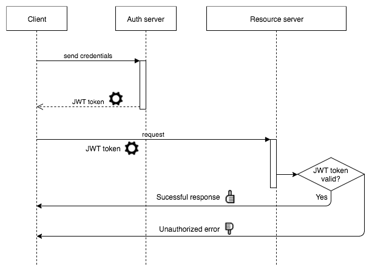
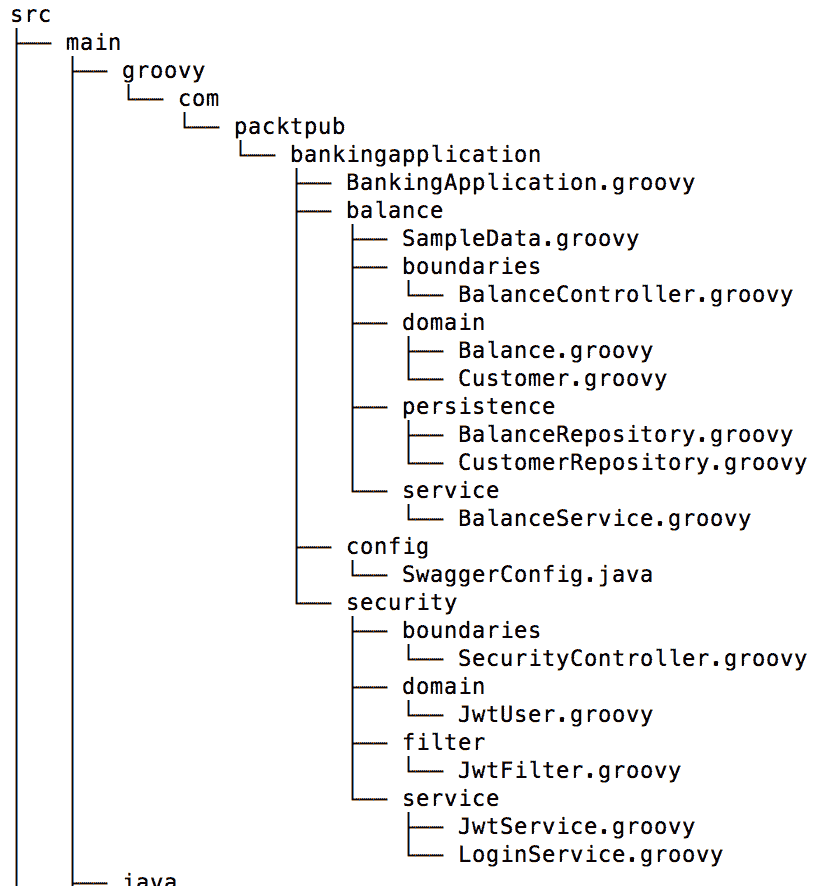
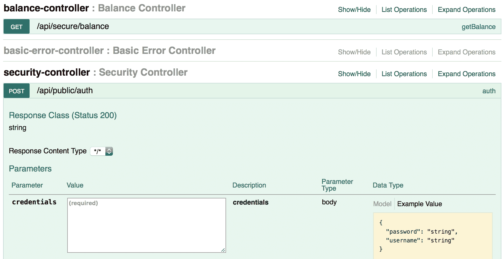
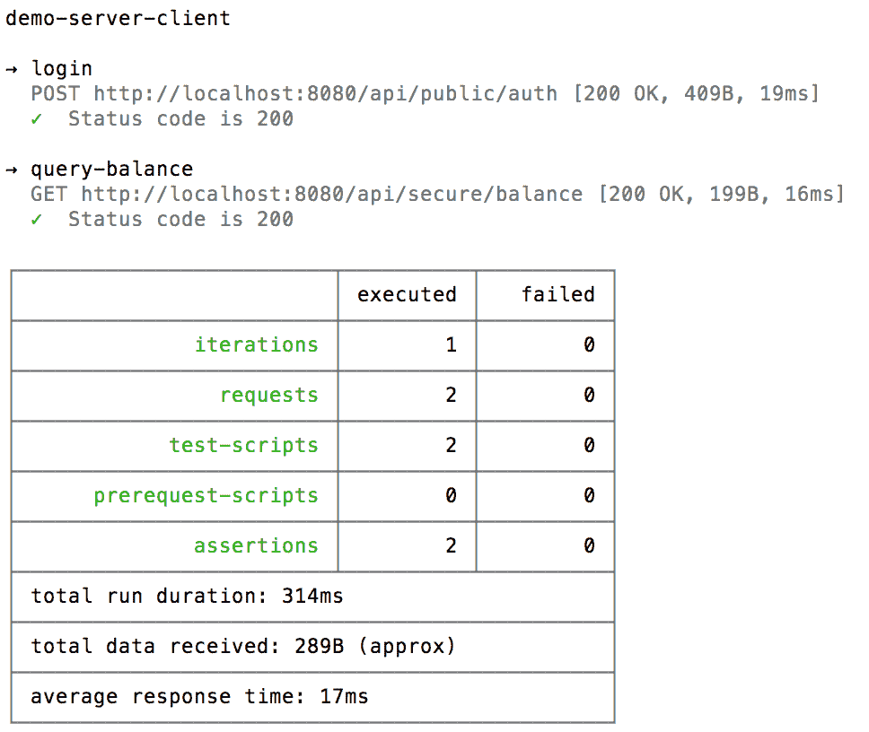
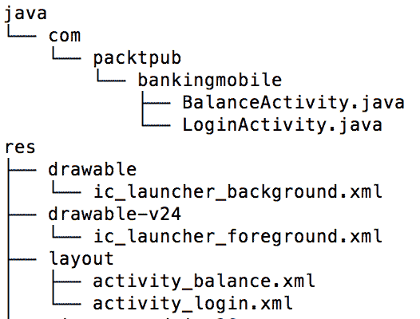
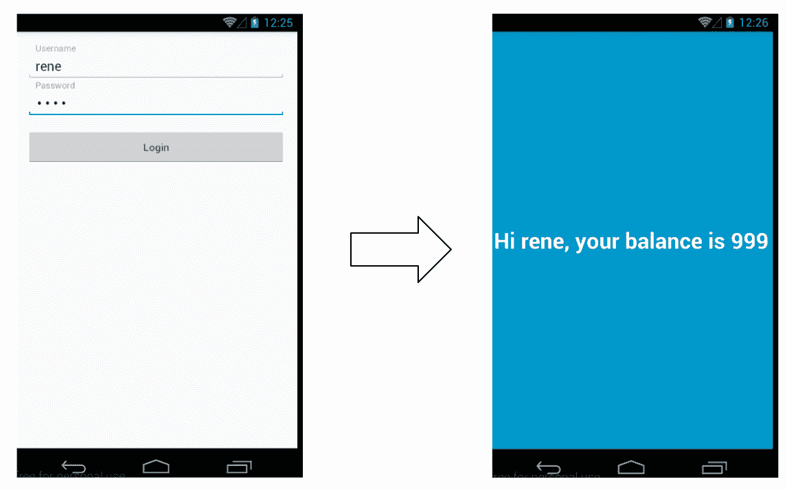

# 四、客户端-服务器架构

客户端-服务器架构是当今应用的最常见的架构样式之一，它已以多种不同的方式使用。

当我们听到“客户端-服务器架构”这一术语时，我们通常会想到一些旧的应用，它们提供了一个 UI，用于编辑业务逻辑的主要部分所在的复杂数据库。然而，事实是，这种架构风格为几乎每一种现代架构风格提供了底层支持，包括微服务、事件驱动架构或任何分布式计算系统。

在本章中，我们将回顾客户端-服务器架构是如何工作的，以及它是如何实现的。我们将使用 Spring 框架构建服务器端，然后使用 Java 编写与服务器交互的客户端代码。

本章将涵盖以下几点：

*   了解客户端-服务器架构
*   在何处应用客户端-服务器架构
*   实施客户端-服务器架构：
    *   用 Spring 编写服务器
    *   介绍弹簧驱动器
    *   监视应用的运行状况
    *   使用 javafx 和 Android 编写客户端
*   测试实现的代码

# 了解客户端-服务器架构

在客户端-服务器架构中，每个正在运行的进程要么是服务器，要么是客户端。它们在一个将它们连接在一起的网络中，使用通过定义的通信通道发送的请求进行交互。我们都使用过电子邮件服务，我们了解这种服务的工作原理；这是客户端-服务器架构的典型示例，如下图所示：



电子邮件服务组件

现在，我们将简要概述上图中的每个组件，以解释它如何适应客户端-服务器架构样式。上图由以下部分组成：

*   服务器（**1**）
*   请求有效负载（2）
*   访问服务器资源的客户端（**3**

# 服务器

服务器负责处理接收到的请求（该请求应符合预定义的格式），然后生成结果。

一旦检索到数据，整个过程就会开始，在处理请求之前检查请求。此过程首先验证和授权验证客户身份的检查。然后开始一个验证过程，审查客户提供的输入，并测试所提供的 body 请求以验证其结构。然后，执行检查以验证数据是否符合业务逻辑约束。要完成，请求由服务器处理。

这些步骤使得在应用中实现一定程度的可靠性成为可能，因为最终会破坏数据或将系统转换为不一致状态的恶意或损坏请求根本不会得到处理。

服务器提供的响应通常是服务或资源，稍后将由客户端使用。当请求未成功处理时，将向客户发送包括合理信息在内的响应。

高性能服务器用于支持所需的处理。服务器位于本地或基于云的基础设施中。

# 缩放

一旦服务器投入生产，最好监控其资源消耗和与应用相关的业务指标。如果我们识别出任何异常或高流量，我们应该考虑缩放服务器以提供更好的用户体验。

由于客户端可以是能够连接到服务器的任何设备，包括单独的计算机，我们可能突然有数百万客户端访问服务器。当应用在一台机器上运行时，应用的客户端和服务器部分之间的资源消耗平衡是固定的。然而，一旦客户端和服务器可以独立扩展，客户端就很容易扩展到与服务器容量不相称的程度。今天，客户端只需要与一个用户交互。因此，他们很容易获得足够的资源。但是，可能会要求服务器在广泛的动态范围内支持大量客户端。正是在这种情况下，缩放成为一项重要的技术要求

我们有两个扩展服务器的选项，如下所示：

*   竖的
*   水平的

我们可以考虑对不能部署在多个节点上的服务进行垂直扩展，因为其自身的性质。节点可以由运行服务的计算机或进程表示。

在此扩展选项中，我们只能通过添加更多资源（如 RAM、CPU、硬盘等）来扩展服务，如下图所示：


垂直缩放

我们有一个明显的限制，那就是我们只能增加运行服务的唯一进程的能力。

另一方面，如果您有一个无状态服务，比如 RESTAPI，那么它可以部署在多个节点上，从而可以水平扩展服务。这种方法允许我们以更好的方式扩展应用，但负载平衡器应该在它们前面，以便使用算法适当地路由请求。一种典型的算法是循环，它将请求平均分配给所有可用节点。

下图显示了在负载平衡器后面使用水平扩展方法布置的服务器：



水平缩放

# 要求

请求是由客户端发送到服务器的一段信息。客户端和服务器必须就用于通信的协议达成一致，以允许它们相互交互。

为了方便数据交换，建议产品供应商提供 SDK（或某种库）。例如，如果您对与来自 Java 应用的数据库交互感兴趣，那么可以使用以库的形式编码的驱动程序来进行交互。此外，数据库供应商还为不同的编程语言、桌面应用或 UI 提供驱动程序，以便与 pgAdmin 或 MySQL Workbench 等服务器交互。

提供 SDK 不是必须的；即使提供了 SDK，一个易于理解的文档也可以避免在服务器和客户端之间引入一致性关系。

**因循守旧关系**是领域驱动设计创造的术语。这表明服务有一个复杂而庞大的模型，当服务器引入新的更改或发布新的功能时，该模型会强制修改下游依赖项。应该进行修改，因为编写自己的模型修改或与服务器交互的机制所需的工作量非常大，很难实现。

# 客户

有许多选项可用于应用客户端。以电子邮件为例，众所周知，计算机操作系统中包括了一些本机应用，在智能手机、iPad 或平板电脑等移动设备中也包括这些应用，它们可以配置为与现有电子邮件服务器交互。有两种类型的客户端，如下所示：

*   胖客户
*   瘦客户端

胖客户端已经实现了负责执行一些验证、格式化数据和履行其他相关职责的逻辑。它们旨在使最终用户和服务器之间的交互更容易。

考虑一下运行 Outlook 的 Windows PC。这代表了胖客户端的一个经典示例。相比之下，web 浏览器与 web 邮件站点对话是瘦客户端的一个很好的例子。

我们还可以将胖客户端与运行在我们手机上的本机应用进行比较，当它们无法与服务器建立通信时，本机应用可以部分工作；同时，瘦客户端，如 web 浏览器，是绝对无用的。

在胖客户端类别中，我们还有中间件，它通常使用多个服务并协调请求以实现业务目标。最常见的例子是**企业服务总线**（**ESB**）通常用作 SOA 架构的一部分。

瘦客户端非常简单，它们使用一种简单的机制来计数，这种机制使得与服务器交互成为可能。一个常见的例子是`curl`命令，用于通过 HTTP（S）协议与 Rest API 交互。

# 网络

网络是一种支持服务器和客户端之间通信的介质，遵循请求-响应消息传递模式，在该模式中，客户端向服务器发送请求，服务器使用该介质响应请求。网络的一个典型示例是 internet，它使我们能够与连接到它的所有设备进行通信。如今，有很多设备可以连接到互联网，包括电脑、平板电脑、智能手机、Arduino、Raspberry PI 等。这些设备的使用促进了**物联网**（**物联网**的发展，给了我们创新和创造应用新时代的机会。还有其他类型的网络，如蓝牙、LiFi、LAN 等，可根据业务需要用于允许客户端和服务器之间的交互。

# 在何处应用客户端-服务器架构

有许多情况下可以使用客户端-服务器架构样式。让我们回顾一些典型的例子，以便更好地理解这种方法。

如前所述，数据库通常适合这种架构样式。目前，市场上有许多数据库供应商，其中大多数只提供垂直扩展的机会。这种方法的两个经典示例是 SQLServer 和 PostgreSQL。但是，也可以选择水平缩放。遵循这种模式的最著名的数据库是 Cassandra，它是 Facebook 创建的一个数据库，后来被作为 Apache 项目采用。该数据库使用环形模型连接存储数据的不同节点。通过这种方式，您可以根据需要添加任意数量的节点，以支持高可用性。

聊天服务，如 Slack，是使用云的客户端-服务器架构的经典示例。该聊天室拥有几乎所有计算机操作系统和移动平台的客户端；如果不想在设备上安装本机应用，您甚至可以直接在浏览器上使用它

代理也是这种架构风格的有趣应用。代理是一种软件，负责将信息从客户端发送到服务器，而不需要附加人工交互。例如，New Relic（[https://newrelic.com/](https://newrelic.com/) 是一个**应用性能监控和管理**（**APM**），用于监控使用代理的服务器和应用的运行状况。

假设您希望监视现有的 Java 应用。为了实现这个目标，您只需要在应用启动时使用`javaagent`选项添加 New Relic 代理。这样，代理将不断地向 New Relic 发送信息，这将为我们提供与内存和 CPU 消耗、响应时间等相关的信息。在这种情况下，处理代理发送的数据的服务器也在云中。

物联网还严重依赖于客户端-服务器架构的使用，其中带有用于收集数据的传感器（或某些其他机制）的小型设备不断向负责分析该数据的服务器发送信息，以便根据需要执行操作。

# 用 Spring 实现客户端-服务器架构

现在，您已经对客户端-服务器架构有了更好的理解，我们将按照下图编写一个示例：


客户端-服务器架构示例

我们的应用的功能将很简单。服务器将使用客户的银行对账单公开一个端点，然后我们将编写一些客户端代码来使用该信息。

# 服务器

使用 Spring 框架构建服务器端有很多选项，包括：

*   soapweb 服务
*   RESTful Web 服务
*   **公共对象请求代理架构**（**CORBA**）
*   插座
*   AMQP

# soapweb 服务

在 REST 风格出现之前，SOAP web 服务被开发人员广泛实现，并且它们在很大程度上基于 XML 的使用。还有一组库可用于处理它们，包括 ApacheCXF 和 JAX-WS。以下屏幕截图表示简单添加操作的请求有效负载：


请求有效载荷

以下屏幕截图显示了响应的外观：


响应有效载荷

上述示例摘自[http://www.dneonline.com/calculator.asmx?op=Add](http://www.dneonline.com/calculator.asmx?op=Add) 。

这些 XML 文件遵循 SOAP Web 服务使用的**Web 服务描述语言**（**WSDL**格式）。

# RESTful web 服务

另一方面，RESTful 风格目前是首选，有很多公共 API 使用它。常见的例子是 GitHub 和 Yahoo 等公司。此样式的功能基于 HTTP 谓词的使用，因此很容易理解它们是如何工作的。例如，以下 HTTP 请求可以从 GitHub 查询存储库：

```java
GET https://api.github.com/users/{{GITHUB_USERNAME}}/repos
```

这种风格出现在 2000 年，罗伊·菲尔丁（Roy Fielding）的博士论文解释了 REST 原则，并规定了设计良好的 web 应用应该如何运行。下表介绍了 HTTP 谓词的使用：

| **HTTP 方法/动词** | **用法** |
| `GET` | 列出指定 URI 下可用的所有资源 |
| `POST` | 在指定的 URI 中创建新资源 |
| `PUT` | 用另一个 URI 替换指定 URI 下的现有资源 |
| `DELETE` | 删除 URI 中指定的资源 |
| `PATCH` | 部分更新驻留在指定 URI 中的资源 |

# 科尔巴

CORBA 是一个非常古老的标准，旨在允许用不同编程语言编写的应用相互交互。很难使用此标准，因为要实现此目标需要所有管道规范。CORBA 现在并不流行，但一些遗留应用仍然使用它与旧代码交互，旧代码主要用 Cobol 编写，Cobol 是编写银行核心的首选编程语言之一。

# 插座

套接字是一种常见的协议，随着 WebSocket 的出现变得更加流行，WebSocket 在服务器和客户端之间建立了全双工通信通道。使用此协议的典型场景包括 messenger 应用，如 Slack。

# AMQP

使用 AMQP 或任何类似消息传递协议的应用旨在通过异步方法实现异构应用之间的互操作性。有许多商业和开源实现，例如 AWS-SQS/SNS 和 RabbitMQ 等，可用于使用此模型实现应用。我们将在[第 6 章](06.html)、*事件驱动架构*中详细介绍这一点。这种方法的基本概念是使用消息代理来接收消息，然后将它们分发给订阅者。

对于我们的示例，我们将选择 RESTfulWeb 服务，这是当今流行的选择。为了实现我们的目标，我们将使用 Spring 引导（引导我们的应用）和 Spring 数据（使用 H2 持久化信息，H2 是内存中的数据库）。我们的应用将使用 JSON Web 令牌 RFC（[进行安全保护 https://tools.ietf.org/html/rfc7519](https://tools.ietf.org/html/rfc7519) ）。

JWT 是一个开放标准，旨在允许使用服务器对客户端进行身份验证。另一个用例是验证消息的完整性。为了使用 JWT 作为身份验证机制，客户端应该将其凭据发送到服务器，服务器将用字符串形式的令牌响应它们。此令牌应用于后续请求。当它们被执行时，如果提供的令牌无效或过期，我们将从服务器收到 401 未授权状态代码。否则，请求将成功：



JWT 认证流

由于此应用的功能不需要大量计算或实时处理，因此我们使用 Groovy 作为编程语言。Groovy 的语法与 Java 非常相似，但有大量的内置功能，可以避免编写冗长的代码。结合 Groovy，我们将使用 Spock 作为测试框架。这将使我们能够使用**行为驱动开发**（**BDD**方法，使用`given`、`when`和`then`语法编写高表达性测试。BDD 背后的主要思想是减少测试方法测试内容的不确定性，使用有助于理解测试失败时出现错误的表达性测试名称。

BDD 方法基于用户故事的结构，其思想是编写测试，以明确他们在测试什么。Dan North（BDD 创建者）提供了一个用于解释这一概念的经典示例，并从以下与 ATM 如何工作相关的用户故事开始：

| **标题-客户提现** | **场景 1–账户已贷记** | **场景 2–账户透支超过透支限额** |
| 作为客户，我想从自动取款机上取现金，这样我就不必在银行排队了。 | 假设账户是信用卡，卡是有效的，提款机包含现金，当客户要求现金时，确保账户已借记，现金已分发，卡已退回。 | 假设账户透支且卡有效，当客户请求现金时，请确保显示拒绝消息。确保未分发现金且卡已退回。 |

通过使用 Spock，可以很容易地用代码表示前面的验证。让我们检查一个已实施的测试，以了解其工作原理：

```
def "when the credentials are not found, an UNAUTHORIZED code is returned"() 
{
  given:
  def nonExistentCredentials = 
  new Credentials(username: "foo", password: "bar")
  def loginService = Mock(LoginService)
  loginService.login(nonExistentCredentials) >> 
  {
    throw new LoginException()
  }
  def securityController = new SecurityController(loginService)
  when:
  def response = securityController.auth(nonExistentCredentials)
  then:
  response.statusCode == HttpStatus.UNAUTHORIZED
}
```

如您所见，测试使用 Spock 提供的`given`、`when`和`then`语法进行了很好的解释。

Spock 还允许使用 mock，而不需要 Mockito 等附加库，因为此功能是内置的。如果您有兴趣了解更多关于斯波克的信息，我鼓励您访问[http://spockframework.org/](http://spockframework.org/) 。

# 实现服务器

让我们为我们的示例实现服务器项目。我们将在模块中组织它的功能，以使其易于发展和理解。为了简单起见，我们将添加一个简单的功能，稍后将由不同的应用客户端使用。服务器示例将有三个模块，如下所示：

*   银行领域
*   银行 api
*   银行客户

# 银行领域

此模块包含构建应用所需的所有域对象；作为另一个模块，最好将它们分开。通过这样做，您以后可以将该模块作为其他模块的依赖项包含进来，这将有助于避免重复编写相同的代码。下图显示了此模块的内容：


银行领域模块

如您所见，此模块仅包含两个类。`Credentials`*类作为有效负载，用于对用户进行身份验证和检索 JSON web 令牌，`BalanceInformation`*类包含查询客户账户余额的有效负载结果。**

 **# 银行 api

银行 api 模块包含服务器公开的功能，这些功能稍后将由不同的应用客户端使用；该功能将可用于 RESTful web 服务。让我们回顾一下此 API 的项目结构：



银行 api 模块

如前所述，该模块完全使用 Groovy 实现，这就是为什么所有文件都有一个`.groovy`扩展名。在这里，项目结构更为重要，因为项目被分为`balance`、`config`和`security`包，这使得理解它们的目的变得相当简单。为了便于理解，总是值得以这种方式组织代码。

我们前面提到，不仅应该提供 SDK，而且还强烈建议提供适当的文档。编写文档的乏味之处在于，您需要将文档与添加到项目中的新功能保持同步。为了实现这一目标，我们将 Swagger 集成到我们的应用中。这是一个有用的工具，它可以生成一个网站，其中包含使用应用端点的示例。此外，它还会在需要时为每一个组件创建有效负载演示，如以下屏幕截图所示：



自动生成的招摇过市用户界面

此门户可在`http://localhost:8080/swagger-ui.html`上访问。

现在，让我们简要回顾一下屏幕截图中列出的每个模块的软件包。

# 边界

`boundaries`包包含应用公开的功能，该功能将用于允许与客户端交互。在本例中，我们将把服务的端点放在这里。

# 领域

域*包中包含仅此模块需要的域对象。放在这里的类不会在任何其他地方使用，这就是为什么将它们放在银行领域模块中没有意义的原因，该模块旨在共享。*

 *# 坚持不懈

顾名思义，我们将编写所需的代码，以便将信息持久化到这个包中。由于我们的应用的持久性存储是一个数据库，并且我们定义将使用 Spring 数据进行存储，因此我们在这里有 Spring 数据存储库。

# 服务

我们已将服务所需的业务逻辑放入此包中。这是与许多类进行交互的地方，以实现业务需求。

# 监视服务器

我们前面提到，监视对于理解应用在野外的执行情况非常重要。幸运的是，Spring 有`actuator`，这是一个库，可以通过添加以下依赖项轻松地连接到现有的 Spring 引导应用：

```
compile("org.springframework.boot:spring-boot-starter-actuator")
```

SpringBootActuator 提供了一组端点，这些端点可以随时使用，并提供有关应用的有用信息。让我们在下表中回顾其中一些：

| **终点** | **简要说明** |
| `/health` | 这提供了有关应用状态及其主要依赖项（如数据库或消息传递系统）的简要信息。 |
| `/autoconfig` | 这提供了有关 Spring 框架为应用提供的自动配置的信息。请记住，Spring 更喜欢约定而不是配置，因此您可以在这里找到大量默认值。 |
| `/beans` | 这显示了配置为应用上下文一部分的 Springbean 列表。 |
| `/dump` | 这将在请求端点的确切时刻执行线程转储。 |
| `/env` | 这将列出服务器中配置的所有变量。作为`.properties`/`.yml`文件的一部分提供的值以及为运行应用而提供的参数也将列出。 |
| `/metrics` | 这显示了应用中公开的可用端点的一些指标。 |
| `/trace` | 这将提供关于最后 100 个（默认情况下）请求的信息，包括请求和响应的详细信息。 |

如果您对默认情况下可用的端点的完整列表感兴趣，我建议您访问[https://docs.spring.io/spring-boot/docs/current/reference/html/production-ready-endpoints.html](https://docs.spring.io/spring-boot/docs/current/reference/html/production-ready-endpoints.html) 。

前面的所有端点主要可以配置三个参数：

*   `id`：这是终点标识
*   `sensitive`：表示弹簧执行机构是否应加强安全性
*   `enabled`：表示弹簧执行器端点是否可用

如果要配置端点，必须使用以下条目作为配置（`.properties`/`.yml`文件）的一部分：

```
endpoints.endpoint_name.property
```

以下要点扩展了这一想法：

*   `endpoints`：这是一个常量。
*   `endpoint_name`：应将其替换为所需的端点
*   `property`：可以是`id`、`sensitive`或`enabled`。

例如，假设您希望启用`health`端点，将其重命名为`status`，而不强制执行`security`。为达到此要求，配置应如下所示：

```
endpoints.health.id = status
endpoints.health.sensitive = false
endpoints.health.enabled = true
```

默认情况下，除了用于正常停止应用的`/shutdown`之外，所有端点都处于启用状态

此外，还可以配置 Spring 执行器以生成业务指标。这是一个很好的功能，可以与其他工具集成，从而可以使用图形界面可视化收集的度量。我们将在[第 12 章](12.html)、*监控*中详细回顾此功能。

# 测试

到目前为止，我们已经引入了单元测试来验证代码是否按预期工作。但是，我们希望添加更多的测试。毕竟，我们在系统中包含的测试越多，我们获得的信心就越大。

因为我们正在编写一个 RESTAPI，所以我们将创建一个简单的脚本，该脚本将不时地运行我们的端点，让我们相信应用始终在工作。为了实现这一目标，我们的测试将遵循一个简单的过程：

1.  使用端点对用户进行身份验证。
2.  验证响应中的状态代码。
3.  从响应主体获取令牌。
4.  使用令牌点击平衡端点。
5.  验证响应中的状态代码。

实现这一目标最简单的方法是使用邮递员（[https://www.getpostman.com/](https://www.getpostman.com/) ）。这是一个方便的工具，允许尝试 RESTful web 服务，并为其创建测试。

让我们讨论为端点生成的用于验证用户身份的测试，如以下屏幕截图所示：


在 Postman 中测试身份验证终结点

前面代码的前三行检查检索到的状态代码，第 5 行将检索到的主体响应存储为一个名为`jwt-token`的变量。

使用前面的代码，我们可以稍后将此变量的值注入后续请求，并执行我们想要的任何验证

创建所有测试后，我们可以生成一个链接，该链接引用包含这些测试的集合，如以下屏幕截图所示：


邮递员收集连结

通过此链接，可以使用名为 Newman（[的命令行集成运行程序反复执行测试集合 https://www.npmjs.com/package/newman](https://www.npmjs.com/package/newman) 和以下命令：

```
newman run https://www.getpostman.com/collections/8930b54ce719908646ae
```

以下屏幕截图显示了 Newman 命令的执行结果：



Newman 命令执行的结果

此工具可以与任何 CI 服务器（如 Jenkins）集成，以安排负责定期验证应用运行状况的作业，这将使我们相信我们的应用始终正常工作。

# 银行客户

因为我们的服务器是使用 RESTfulWeb 服务实现的，所以有很多选项可以用来编写客户端并使用库来使用它们，比如 NetflixFeign、OkHttp、SpringRESTTemplate 和 Reformation。

因此，客户端可以有自己实现的机制来使用服务。这种方法一点也不坏；事实上，我们应该保持它的开放性，编写自己的工具与服务器交互的决定应该是客户端的选择，以避免前面描述的墨守成规的关系。但是，提供内置 SDK 或库与服务器交互并减少所需的工作量始终是一个好主意，这也是我们拥有银行客户端模块的原因。

产品供应商提供的 SDK 很常见。例如，AWS 为 SDK 提供了对一系列编程语言的支持，并与解释如何使用它们的开发人员指南文档相结合。这有助于加速并鼓励其他开发人员采用产品来构建应用。另一个例子是谷歌 Firebase，它是一个实时数据库，提供可在不同平台上使用的 SDK；它有一个具有优秀演示的网站，使开发人员能够了解它的工作原理和使用方法。
此银行客户端模块使用名为 Reformation（[的库实现 http://square.github.io/retrofit/](http://square.github.io/retrofit/) ），这使得编写类型安全的 HTTP 客户端成为可能，可以用于几乎任何类型的 Java 应用。这还提供了许多好处，例如：

*   支持移动应用，如 Android
*   易于阅读和自我解释的代码
*   支持同步和异步资源消耗
*   与转换器（如 GSON）平滑集成

让我们来看看实现的客户端，以便消耗端点。

# 身份验证端点客户端

为了使用 RESTful web 服务，我们只需创建一个带有少量注释的接口来提供一些元数据：

```
public interface SecurityApi 
{
  @POST("/api/public/auth")
  Call<String> login(@Body Credentials credentials);
}
```

很容易理解身份验证端点使用了`POST`HTTP 动词。这在 URI`/api/public/auth`中可用，需要一个`Credentials`对象作为请求主体。

# 帐户余额端点客户端

在这种情况下，我们将使用 URI`/api/secure/balance`**中可用的端点，该端点使用`GET`HTTP 动词，并要求将令牌用作请求中的标头：**

 **```
public interface BankingApi 
{
  @GET("/api/secure/balance")
  Call<BalanceInformation> queryBalance(@Header("x-auth-token") 
  String token);
}
```

正如您可能已经注意到的，这个模块使用了`BalanceInformation`和`Credentials`类，因此我们不需要再次编写它们；我们只需要添加银行领域模块作为依赖项。

您可能想知道在哪里必须指定服务器的 IP 地址和端口，这在`Retrofit`对象中完成，如下所示：

```
Retrofit retrofit = new Retrofit.Builder()
        .baseUrl("http://IP:PORT")
        .addConverterFactory(GsonConverterFactory.create(gson))
        .build();
```

在客户端的实现中，我们将回顾如何将这个`Retrofit`对象与接口结合使用，以便发出请求。

# 客户

现在我们已经实现了服务器，我们将构建三个客户端，如下所示：

*   JavaFX 客户端
*   安卓客户端
*   瘦客户端，使用 CURL

这些客户端将使用 HTTP 协议发送请求并检索响应。由于我们已经编写了一个客户端模块，因此与服务器的交互将相当简单。

# JavaFX 客户端

该客户端是一个简单的 JavaFX 应用，它依赖于银行客户端模块与服务器进行交互。我们可以说这个客户端是一种胖客户端，因为它编写了一些代码来简化与服务器的交互。

让我们在以下屏幕截图中查看项目结构：


JavaFX 客户端项目结构

这个项目相当简单，它只有两个屏幕，允许用户输入他们的凭证，然后查询他们的帐户余额

改造提供了进行同步和异步请求的可用性。在此客户端中，我们将使用同步请求，如下所示：

```
SecurityApi api = BankClient.getRetrofit().create(SecurityApi.class);
Call<String> call = api.login(
            new Credentials(username.getText(), password.getText()));
Response<String> response = call.execute();
// do something with the response
```

`execute`*方法允许进行同步请求。`Retrofit`对象包含基本 URI，该基本 URI 将与客户端接口中提供的部分 URI 一起使用，以形成完整 URI 来命中端点。*

 *此客户端应用的过程如以下屏幕截图所示：


JavaFX 客户端应用

# 安卓客户端

Android 客户端还使用提供的银行客户端模块与服务器进行交互，但在这种情况下，有必要使用异步方法发出请求（这一要求源于 Android 的工作方式）。通过查看前面提供的定义，我们还可以说这是一个胖客户端。

让我们在下面的屏幕截图中查看此项目的结构：



Android 客户端项目结构

`Activity`类具有发出异步请求的代码，如下所示：

```
SecurityApi api = BankClient.getRetrofit().create(SecurityApi.class);
Call<String> call = api.login(new Credentials(username, password));
call.enqueue(new Callback<String>() 
{
  @Override
  public void onResponse(Call<String> call, 
  Response<String> response)
  {
    // do something with the reponse
  }
  @Override
  public void onFailure(Call<String> call, Throwable t) 
  {
    // handle the error properly
  }
}
```

`enqueue`*方法允许异步命中端点，并根据响应是否失败或成功注册两个将执行的回调。*

 *此客户端应用的执行流程如以下屏幕截图所示：



Android 客户端应用

# 瘦客户端

如前所述，也有瘦客户端，它们不包含大量与服务器交互的代码；瘦 RESTful web 服务客户端的一个好例子是`curl`。

为了与服务器示例提供的端点交互，我们可以使用两个`curl`命令，如下所示：

*   以下代码用于检索身份验证 JWT 令牌：

```
$ curl -H "Content-Type: application/json" \
-X POST -d '{"username":"rene","password":"rene"}' \
http://localhost:8080/api/public/auth
```

*   以下代码提供了使用 JWT 令牌查询用户帐户余额的方法：

```
$ curl -H "x-auth-token: JWT_TOKEN" \
-X GET http://localhost:8080/api/secure/balance
```

对于这类客户端，我们不必编写自己的代码；与服务器的交互没有一个奇特的前端，这可能很好（例如，在 API 用于其他中间件的情况下）。

如您所见，我们的客户端-服务器架构实现很简单，但它使用了所有必要的部分来实现。在本例中，我们使用 HTTP 协议作为通信通道。但是，根据要实现的服务器的类型，可能会有所不同，并且还会影响身份验证机制。例如，当您使用诸如 RabbitMQ 之类的消息代理来允许服务器和客户端之间的交互时，建立通信的协议是 AMQP，这是一个不同的协议（与 HTTP 相比）

应用将拥有的客户端类型也会影响您构建解决方案的方式。假设您使用代理作为客户端；更安全的身份验证机制将基于证书而不是令牌的使用，如前面的示例所示。

# 总结

在本章中，我们回顾了什么是客户端-服务器架构，以及如何使用 Spring 框架实现它们。需要记住的一个重要方面是，当我们按照这种架构风格构建应用时，总是值得提供 SDK 以使服务器资源易于使用。

提供适当的文档可以帮助客户端编写自己的代码，以便在必要时与服务器交互。在这种情况下，我们将避免在服务器和客户端之间引入一致的关系。我们还研究了 SpringActuator，它是一个库，可用于添加提供应用信息的端点。此外，我们还回顾了如何使用 Postman 创建能够定期评估应用运行状况的测试。

最后，我们使用通过改造实现的库创建了两个客户端，这大大减少了消耗服务器公开的资源所需的工作量。

在下一章中，我们将回顾 MVC 架构以及如何使用 Spring 编写它们。*******